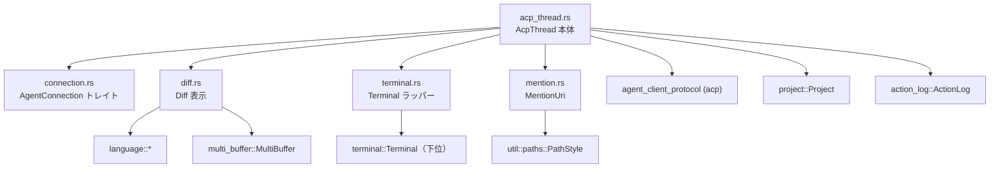
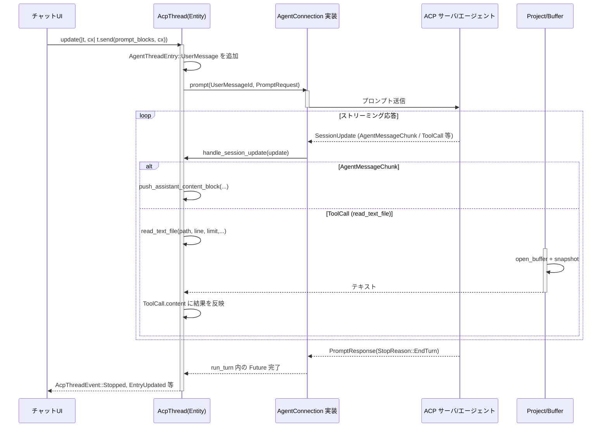

# crates/acp_thread/ コード解説

## 1. ざっくり一言

`acp_thread` クレートは、Zed のエージェント（LLM）との「1つの会話スレッド」を表現し、その中でのユーザー／アシスタントメッセージ、ツール呼び出し（ファイル編集・ターミナル実行など）、差分表示、トークン使用量などを管理するための実装です。

---

## 2. このモジュールの役割

### 2.1 概要

- このクレートは **agent-client-protocol (ACP)** と Zed 内部の **Project / Buffer / Terminal / UI** を橋渡しする「会話スレッドレイヤー」です。
- 主な役割は次のとおりです。
  - ACP の `SessionId` ごとに `AcpThread` を作成し、メッセージ・ツール呼び出し・ターミナルなどの状態を保持する。
  - ACP から届く `SessionUpdate` を受け取り、Zed の UI で表示できる形 (`AgentThreadEntry`) に変換する。
  - ファイル読み書き・差分表示・ターミナル実行といった“ツール”の実処理を Project / terminal クレートに委譲する。
  - ツール権限確認（PermissionOptions）やトークン使用量、チェックポイント（GitStoreCheckpoint）など、会話全体のメタ情報を管理する。

### 2.2 アーキテクチャ内での位置づけ

クレート内モジュールと外部クレートの主な依存関係は次のようになっています。



- `acp_thread.rs`
  - このクレートの中心。`AcpThread` 構造体と、その周辺型（メッセージ、ツール呼び出し、プラン、トークン使用量など）を定義します。
  - `connection`, `diff`, `mention`, `terminal` モジュールを `pub use` して外部に公開します。
- `connection.rs`
  - エージェント側との接続抽象 `AgentConnection` トレイトと、セッション一覧・モデル選択・権限オプションなどの周辺型を定義します。
  - 実際の ACP サーバ実装は別クレートが `AgentConnection` を実装します。
- `diff.rs`
  - ツール呼び出しによるファイル編集差分を表す `Diff` 型を定義し、`MultiBuffer` を使った差分ビューを構築します。
- `mention.rs`
  - チャット本文中の `[@file.rs]` のようなメンションを `MentionUri` として構造化し、パース／リンク生成を行います。
- `terminal.rs`
  - 下位の `terminal::Terminal` をラップする `Terminal` 型と、端末プロセスを起動する `create_terminal_entity` を提供します。

### 2.3 設計上のポイント

コードから読み取れる設計上の特徴を挙げます。

- **Entity / Task ベースの状態管理**
  - すべての長寿命オブジェクト（`AcpThread`, `Buffer`, `MultiBuffer`, `Terminal` など）は `gpui::Entity<T>` で管理され、`Context` 経由で更新されます。
  - 非同期処理は `gpui::Task` と `AsyncApp` 上で行い、UI スレッドに戻るときだけ `Entity::update` を使います。
- **ACP に対する薄いアダプタ**
  - ACP の型（`acp::SessionUpdate`, `acp::ToolCall`, `acp::ContentBlock` など）を、そのまま `AcpThread` の内部表現（`AgentThreadEntry`, `ToolCall`, `ContentBlock` など）に変換して保持します。
  - `AgentConnection` トレイトによって、具体的なバックエンド（ローカルバイナリ・リモートサービスなど）を差し替え可能にしています。
- **ツール呼び出しのファーストクラス扱い**
  - メッセージと同じレベルで `AgentThreadEntry::ToolCall` が存在し、Diff や Terminal と結びつきます。
  - 権限確認は `PermissionOptions` + `SelectedPermissionOutcome` で表現し、UI がユーザー選択を行ったあと `authorize_tool_call` で結果を流し込む構造です。
- **Git チェックポイントによる巻き戻し**
  - 各ユーザーメッセージの直前に `GitStoreCheckpoint` を保存し、`restore_checkpoint` / `rewind` で会話とワークツリーを巻き戻せるようにしています。
- **ストリーミング出力のスムーズな表示**
  - モデル出力用に `StreamingTextBuffer` を設け、チャンク単位ではなく一定スピードで文字列を出して「タイプしているような」体験を実現します。
- **堅牢なエッジケース処理**
  - トークン上限到達 (`StopReason::MaxTokens`)、キャンセル、拒否 (`StopReason::Refusal`) など ACP の終了理由ごとに挙動を分けています。
  - ターミナル出力が Terminal 作成前に届くケースは `pending_terminal_output`／`pending_terminal_exit` でバッファしてから反映します。

---

## 3. 主要な機能一覧

このクレート全体で提供する主な機能は次のとおりです。

- 会話スレッド管理
  - `AcpThread` による 1 セッション分のメッセージ履歴・ツール呼び出し・プラン・トークン使用量の管理
- ACP セッション更新の反映
  - `AcpThread::handle_session_update` による `SessionUpdate`（メッセージチャンク、ツール呼び出し、プラン、タイトルなど）の取り込み
- プロンプト送信・リトライ・キャンセル
  - `AcpThread::send` / `retry` / `cancel` による 1 回の「ターン」の開始・終了管理 (`RunningTurn`)
- ツール呼び出し管理
  - `ToolCall` / `ToolCallContent` / `ToolCallStatus` によるツールの状態・表示の管理
  - 権限確認 (`PermissionOptions`, `SelectedPermissionOutcome`, `RequestPermissionOutcome`)
- 差分表示
  - `Diff`（Pending / Finalized）による Buffer 差分の計算と `MultiBuffer` への反映
- ターミナル連携
  - `Terminal` ラッパーによるコマンド実行・出力収集・終了ステータスの管理
  - `AcpThread::create_terminal` / `on_terminal_provider_event` によるツール側ターミナルとのブリッジ
- ファイル読み書きツール
  - `AcpThread::read_text_file` / `write_text_file` による Project 経由のファイル I/O
- メンション URI のパース・生成
  - `MentionUri` による `file:///`, `zed:///agent/...`, `http(s)://` などの URL を型付きで扱う仕組み
- エージェント接続抽象
  - `AgentConnection` トレイトと、その周辺（セッション一覧、モデル選択、設定項目）

---

## 4. 関数・構造体の解説

### 4.1 主な構造体・列挙体一覧

| 名前 | 種別 | 定義ファイル | 役割 / 用途 |
|------|------|-------------|-------------|
| `AcpThread` | 構造体 | `src/acp_thread.rs` | 1 つの ACP セッション（会話スレッド）の状態を保持し、メッセージ・ツール・ターミナル・プラン・トークン使用量などを管理します。 |
| `AgentThreadEntry` | 列挙体 | 同上 | スレッドの 1 行を表現する要素。ユーザーメッセージ・アシスタントメッセージ・ツール呼び出し・完了済みプランを持ちます。 |
| `ToolCall` | 構造体 | 同上 | 1 回のツール呼び出し（ACP の `ToolCall`）を表現。種別・状態・入力/出力・関連する Diff/Terminal・位置情報を保持します。 |
| `ToolCallStatus` | 列挙体 | 同上 | ツール呼び出しの状態（Pending, InProgress, Completed, Failed, Rejected, Canceled など）を表します。 |
| `ContentBlock` | 列挙体 | 同上 | メッセージやツール出力の 1 ブロック。Markdown テキスト・リソースリンク・画像などを表現します。 |
| `Plan` / `PlanEntry` | 構造体 | 同上 | エージェントが提示する「作業計画」のエントリとそのステータス・優先度を保持します。 |
| `TokenUsage` / `TokenUsageRatio` | 構造体 / 列挙体 | 同上 | セッションのトークン使用量と、その状態（通常／警告／上限超過）を判定します。 |
| `Terminal` | 構造体 | `src/terminal.rs` | 下位の `terminal::Terminal` をラップし、コマンドラベルや出力文字列、終了ステータスを管理します。 |
| `Diff` | 列挙体 | `src/diff.rs` | 編集差分の状態。バッファと MultiBuffer を持ち、Pending/Finalized の 2 段階で管理します。 |
| `MentionUri` | 列挙体 | `src/mention.rs` | チャット中のメンション対象（ファイル・シンボル・スレッド・診断・HTTP URL など）を型付きで表現します。 |
| `AgentConnection` | トレイト | `src/connection.rs` | ACP サーバーまたはその他エージェント実装との接続抽象。セッション作成・プロンプト送信・キャンセルなどを規定します。 |
| `PermissionOptions` | 列挙体 | 同上 | ツール呼び出しの権限確認 UI に渡す選択肢（フラット／ドロップダウン／パターン付きドロップダウン）を表します。 |
| `AgentModelSelector` | トレイト | 同上 | 対応エージェントが提供するモデル一覧・選択機能を表現します。 |

以下では、代表的な関数・メソッドをいくつか詳しく説明します。

---

### 4.2 代表的な API 詳説

#### `AcpThread::new(...) -> AcpThread`

**概要**

- 新しい ACP セッション用の `AcpThread` を作成します。
- `AgentConnection` 実装・`Project`・`ActionLog`・`SessionId` などを受け取り、`PromptCapabilities` を監視するタスクもセットアップします。

**主な引数**

| 引数名 | 型 | 説明 |
|--------|----|------|
| `parent_session_id` | `Option<acp::SessionId>` | サブエージェントとして起動された場合の親セッション ID。通常は `None`。 |
| `title` | `Option<SharedString>` | 初期タイトル。未設定なら `None`。 |
| `work_dirs` | `Option<PathList>` | このスレッドでの「作業ディレクトリ」一覧。ツールのファイル操作に利用されます。 |
| `connection` | `Rc<dyn AgentConnection>` | ACP バックエンドへの接続。 |
| `project` | `Entity<Project>` | 操作対象のプロジェクト。バッファやターミナルの作成に使用します。 |
| `action_log` | `Entity<ActionLog>` | バッファ変更ログ。ツールによる編集の記録と巻き戻しに使います。 |
| `session_id` | `acp::SessionId` | このスレッドに対応する ACP セッション ID。 |
| `prompt_capabilities_rx` | `watch::Receiver<acp::PromptCapabilities>` | プロンプトで扱える機能（画像・音声・埋め込みコンテキストなど）の更新を受け取るチャネル。 |
| `cx` | `&mut Context<Self>` | `AcpThread` エンティティ用の GPUI コンテキスト。 |

**内部処理の流れ**

- `prompt_capabilities_rx` を監視するタスクを `cx.spawn` で起動し、更新のたびに `self.prompt_capabilities` を更新しつつ `AcpThreadEvent::PromptCapabilitiesUpdated` を発火します。
- 残りのフィールド（`entries`, `plan`, `terminals`, `shared_buffers` etc.）をデフォルト値で初期化します。
- ストリーミングテキストバッファやターミナル関連のマップも空で初期化されます。

**使用上の注意点**

- 通常は `AgentConnection::new_session` の実装内でのみ呼ばれ、呼び出し側が直接 `AcpThread::new` を使うことはほとんどありません。
- `AcpThread` は `Entity<AcpThread>` で管理されることを前提としているため、`cx.new(|cx| AcpThread::new(..., cx))` で生成します。

---

#### `AcpThread::send(&mut self, message: Vec<acp::ContentBlock>, cx: &mut Context<Self>) -> BoxFuture<'static, Result<Option<acp::PromptResponse>>>`

**概要**

- ユーザーからの新しいプロンプト（1 メッセージ分）を送信し、ACP 側の応答を待つメイン API です。
- `AgentThreadEntry::UserMessage` を追加し、`AgentConnection::prompt` を呼び出し、1 ターン分の応答（`PromptResponse`）を受け取ります。

**引数**

| 引数名 | 型 | 説明 |
|--------|----|------|
| `message` | `Vec<acp::ContentBlock>` | 送信するメッセージの内容。テキスト・画像・リソースリンクなどのブロック列。 |
| `cx` | `&mut Context<Self>` | `AcpThread` のコンテキスト。 |

**戻り値**

- `BoxFuture<Result<Option<acp::PromptResponse>>>`
  - `Ok(Some(response))` : 通常の完了。
  - `Ok(None)` : 内部タスクがキャンセルされるなどでレスポンスが得られなかった場合。
  - `Err(e)` : 通信エラーやトークン上限到達などの異常。

**内部処理の流れ（要約）**

1. `ContentBlock::new_combined` で `Vec<acp::ContentBlock>` を 1 つの `ContentBlock` にまとめます。
2. `acp::PromptRequest::new(session_id, message.clone())` を生成します。
3. `connection.truncate` が `Some` を返す場合、新しい `UserMessageId` を採番します（巻き戻しに備えるため）。
4. `self.run_turn` を通じて非同期タスクを起動します。
   - タスク内で `AgentThreadEntry::UserMessage` をスレッドに push。
   - Git の以前のチェックポイントを取得し、最新のユーザーメッセージに `Checkpoint` として保存。
   - `AgentConnection::prompt(message_id, request, cx)` を呼び出し、応答を待ちます。

5. `run_turn` 内では、応答を受け取った後に以下を行います。
   - Git チェックポイントの更新（`update_last_checkpoint`）。
   - 親セッションでなければ `Project::set_agent_location(None)` でカーソル位置をクリア。
   - `StopReason` に応じた処理：
     - `MaxTokens` : `had_error = true` にし、エラーとして返す。
     - `Cancelled` : 未完了のツール呼び出しを `Canceled` にマーク。
     - `Refusal` : ユーザープロンプト拒否かツール結果拒否かを判定し、必要に応じてユーザーメッセージ以降をトランケート。
   - 完了したツールプランを `snapshot_completed_plan` で履歴に残す。
   - `AcpThreadEvent::Stopped` / `Error` / `Refusal` 等のイベントを発火。

**Edge cases**

- **キャンセル**：
  - 別スレッドから `AcpThread::cancel` を呼ぶと、`run_turn` 内の待ちが解除され `StopReason::Cancelled` のレスポンスを処理します。
  - このとき Pending/InProgress/WaitingForConfirmation のツールは一括で `Canceled` に更新されます。
- **トークン上限**：
  - `StopReason::MaxTokens` の場合、`had_error` を立てた上で `Err(anyhow!("Maximum tokens reached" or "Maximum output tokens reached"))` を返します。
- **拒否 (`Refusal`)**：
  - 直近のユーザーメッセージ以降に Completed かつ `raw_output` を持つツール呼び出しがあれば「ツール結果に対する拒否」とみなし、履歴はトランケートしません。
  - そうでなければ「ユーザープロンプトの拒否」とみなし、直近のユーザーメッセージ以降のエントリを削除します。

**使用上の注意点**

- このメソッドは内部で `run_turn` を使用し、`running_turn` と `turn_id` を管理します。連続して呼び出すときは、前回の Future を待つかキャンセルする設計にする必要があります（テスト `test_follow_up_message_during_generation_does_not_clear_turn` がこの挙動を確認しています）。
- `send` の戻り値の `Future` は UI から待ち合わせてもよいですし、バックグラウンドで `spawn` して `AcpThreadEvent` だけ購読することもできます。

**使用例**

ユーザー入力を送信する最小例（テストと同様のパターン）です。

```rust
use std::rc::Rc;
use acp_thread::{AcpThread, connection::AgentConnection};
use agent_client_protocol as acp;
use gpui::{App, Context, Task};
use util::path_list::PathList;

// どこかの初期化コード内
fn send_example(thread: &gpui::Entity<AcpThread>, cx: &mut App) {
    // `thread.update` の中で `send` を呼び出す                     // Entity<AcpThread> を更新する
    let send_task: Task<anyhow::Result<Option<acp::PromptResponse>>> =
        thread.update(cx, |thread, cx| thread.send(vec!["Hello from Zed!".into()], cx));

    // 必要ならバックグラウンドで待つ                               // バックグラウンドでレスポンスを待機
    cx.background_spawn(send_task).detach();
}
```

---

#### `AcpThread::read_text_file(&self, path: PathBuf, line: Option<u32>, limit: Option<u32>, reuse_shared_snapshot: bool, cx: &mut Context<Self>) -> Task<Result<String, acp::Error>>`

**概要**

- エージェントの「ファイル読み取り」ツール用の API です。
- プロジェクト内のファイルを開き、指定された行から最大 `limit` 行分のテキストを返します。

**引数**

| 引数名 | 型 | 説明 |
|--------|----|------|
| `path` | `PathBuf` | 絶対パス（ACP から渡される）。`Project::project_path_for_absolute_path` でプロジェクトパスに変換されます。 |
| `line` | `Option<u32>` | 開始行（1-based）。`None` の場合は 1 行目から。内部では 0-based に変換されます。 |
| `limit` | `Option<u32>` | 読み取る行数上限。`None` の場合はファイル末尾まで。 |
| `reuse_shared_snapshot` | `bool` | 以前保存した `BufferSnapshot` を再利用するかどうか。 |

**戻り値**

- 非同期 `Task<Result<String, acp::Error>>`
  - 成功時は読み取ったテキスト。
  - 失敗時は ACP の `Error`（`resource_not_found` / `invalid_params` など）。

**内部処理の流れ**

1. `Project::project_path_for_absolute_path` で絶対パスをプロジェクト内パスに変換。
   - 失敗した場合、`Error::resource_not_found` を返す。
2. `project.open_buffer` で `Entity<Buffer>` を取得。
3. `reuse_shared_snapshot` が `true` かつ `shared_buffers` にスナップショットがあればそれを使用。なければ:
   - `ActionLog::buffer_read` で読み取りログを記録。
   - `buffer.snapshot()` を取得し、`shared_buffers` に保存。
4. `line` と `limit` から 0-based の `Point` 範囲（開始 Anchor, 終了 Anchor）を計算。
   - 開始位置がファイル末尾 (`max_point`) より後なら `Error::invalid_params` を返す。
5. `should_update_agent_location` が `true`（親セッション）なら、読み取り開始位置を `Project::set_agent_location` に設定。
6. `snapshot.text_for_range(start..end)` でテキストを収集し、1 つの `String` にして返す。

**Edge cases**

- 空ファイル
  - `line` / `limit` の組み合わせに関わらず、範囲内にテキストがなければ空文字列を返します（テスト `test_reading_empty_file` を参照）。
- 範囲外読み取り
  - 行数が最大行数を超えると `Error::invalid_params` となり、エラーメッセージに実際の末尾位置（例: `"Attempting to read beyond the end of the file, line 5:0"`）が含まれます。
- プロジェクト外のファイル／存在しないファイル
  - `ErrorCode::ResourceNotFound` が返ります。

**使用例（エージェント側からの呼び出し）**

```rust
use acp_thread::AcpThread;
use gpui::{AsyncApp, WeakEntity};
use std::path::PathBuf;

// FakeAgentConnection の on_user_message ハンドラ内のイメージ
async fn agent_handler(thread: WeakEntity<AcpThread>, mut cx: AsyncApp) -> anyhow::Result<()> {
    let content = thread
        .update(&mut cx, |thread, cx| {
            // 3 行目から 2 行分を読む                                        // line=3, limit=2
            thread.read_text_file(PathBuf::from("/tmp/foo"), Some(3), Some(2), false, cx)
        })?
        .await?;
    // content を元に応答を作る、など                                         // 読み取ったテキストを使って推論
    Ok(())
}
```

**使用上の注意点**

- `path` は「プロジェクト内に存在する絶対パス」である必要があります。ワークツリーがない場合は事前に `Project::find_or_create_worktree` を呼んでおく必要があります（テストがそのパターンを使用）。
- `reuse_shared_snapshot = true` を使うときは、「前回と同じバージョンのファイルを見ている」前提であることに注意してください。書き込み後に再利用するとスナップショットが古いままになる可能性があります。

---

#### `AcpThread::write_text_file(&self, path: PathBuf, content: String, cx: &mut Context<Self>) -> Task<Result<()>>`

**概要**

- エージェントの「ファイル書き込み」ツール用 API です。
- 現在のバッファ内容との差分を計算して適用し、必要なら LSP フォーマットを実行して保存します。

**引数**

| 引数名 | 型 | 説明 |
|--------|----|------|
| `path` | `PathBuf` | 絶対パス。プロジェクト内パスに変換されます。 |
| `content` | `String` | ファイルの最終的な内容。 |
| `cx` | `&mut Context<Self>` | `AcpThread` コンテキスト。 |

**戻り値**

- 非同期 `Task<Result<()>>`。エラー時は `anyhow::Error`。

**内部処理の流れ（要点）**

1. `project.project_path_for_absolute_path(&path)` でプロジェクト内パスに変換。
   - 失敗すると `"invalid path"` エラー。
2. `project.open_buffer` で対象 `Buffer` を取得。
3. `shared_buffers` にスナップショットがあれば利用、なければ `buffer.snapshot()` で取得。
4. バックグラウンドタスクで `text_diff(old_text, &content)` を計算し、(Range, replacement) のリストを作成。
5. 親セッションであれば、最後の編集位置の Anchor を `Project::set_agent_location` に設定。
6. `ActionLog::buffer_read` → `buffer.edit(edits, None, cx)` → `ActionLog::buffer_edited` の順で差分を反映。
7. `LanguageSettings::for_buffer` から `format_on_save` 設定を読み、オンなら:
   - `project.format` を呼び出し LSP フォーマッタを実行。
   - フォーマット後にも `buffer_edited` を記録。
8. `project.save_buffer` で最終的なファイル保存。

**Edge cases**

- フォーマット失敗
  - `project.format` のエラーは `log_err` でログに残すのみで、書き込み自体は継続します。
- フォーマットオフ
  - `FormatOnSave::Off` の場合、フォーマット処理は一切行われません。
- `shared_buffers` にスナップショットがない場合
  - 一度読み出したバッファに対して書き込む際にスナップショットが自動的に追加され、次回の読み書きで再利用されます。

**使用上の注意点**

- 書き込みは必ず `ActionLog` に記録されるため、後から `ActionLog::reject_all_edits`（`rewind` で使用）でロールバックできます。
- 大きなファイルに対して高頻度に呼ぶと `text_diff` の計算コストが高くなります。必要に応じてツール側でバッチ処理にまとめる方がよいです。

---

#### `AcpThread::restore_checkpoint(&mut self, id: UserMessageId, cx: &mut Context<Self>) -> Task<Result<()>>`

**概要**

- 指定したユーザーメッセージに紐づく Git ストアのチェックポイントにワークツリーを戻し、スレッド履歴もそこまで巻き戻します。
- 進行中の生成（`send` のターン）や関連するターミナルも安全に停止・クリーンアップします。

**引数**

| 引数名 | 型 | 説明 |
|--------|----|------|
| `id` | `UserMessageId` | 巻き戻したいユーザーメッセージの ID。 |
| `cx` | `&mut Context<Self>` | コンテキスト。 |

**内部処理の流れ**

1. `user_message_mut(&id)` で該当メッセージを探し、その `checkpoint.git_checkpoint` を取得。
2. `cancel(cx)` で進行中のターンをキャンセル。
3. `rewind(id.clone(), cx)` でそのメッセージ以降のスレッドエントリを削除し、ActionLog の編集も拒否。
   - ここで、削除対象エントリに紐づくターミナルをすべて `kill` します（テスト `test_restore_checkpoint_kills_terminal`が確認）。
4. Git ストアの `restore_checkpoint(checkpoint, cx)` を呼んでワークツリー状態を戻す。

**使用上の注意点**

- 指定した `UserMessageId` が存在しない場合、`Err(anyhow!("message not found"))` となります。
- チェックポイントが存在しない（`None`）場合は、Git の状態の復元は行われず、会話の巻き戻しのみ行われます。
- この API は **ユーザーの明示的な「巻き戻し」操作** 用であり、ツールから自動的に呼ぶ前提ではありません。

---

#### `MentionUri::parse(input: &str, path_style: PathStyle) -> Result<MentionUri>`

**概要**

- チャット中に埋め込まれた URI 文字列（`file:///...`, `zed:///agent/...`, `https://...` など）をパースして `MentionUri` 列挙体に変換します。
- Windows / POSIX のパス表現の違いは `PathStyle` で吸収します。

**サポートされるスキームとパターン（コードとテストから読み取れる範囲）**

- `file://` スキーム
  - `file:///path/to/file.rs`
    - → `MentionUri::File { abs_path }`
  - `file:///path/to/dir/`
    - → `MentionUri::Directory { abs_path }`
  - `file:///path/to/file.rs#L5:15`
    - → `MentionUri::Selection { abs_path: Some, line_range }`
  - `file:///path/to/file.rs?symbol=Name#L10:20`
    - → `MentionUri::Symbol { abs_path, name, line_range }`
  - 非 ASCII パスは URL デコードされます（例: `%E6%97%A5%E6%9C%AC%E8%AA%9E.txt`）。
  - フラグメントの書式:
    - `Lstart:end`
    - `Lstart-end` や `Lstart-Lend` もサポート（`L10-20`, `L10-L20`）。
    - 単一行 `L1872` は start=end と見なされます。
- `zed://` スキーム
  - `/agent/thread/{session_id}?name=...` → `MentionUri::Thread`
  - `/agent/rule/{uuid}?name=...` → `MentionUri::Rule`
  - `/agent/diagnostics?...` → `MentionUri::Diagnostics`
    - `include_warnings=true/false`
    - `include_errors=true/false`（デフォルト true）
  - `/agent/pasted-image` → `MentionUri::PastedImage`
  - `/agent/untitled-buffer#L..` → `MentionUri::Selection { abs_path: None, ... }`
  - `/agent/symbol/{name}?path=...#L..` → `MentionUri::Symbol`
  - `/agent/file?path=...` → `MentionUri::File`
  - `/agent/directory?path=...` → `MentionUri::Directory`
  - `/agent/selection?path=...#L..` → `MentionUri::Selection`
  - `/agent/terminal-selection?lines={n}` → `MentionUri::TerminalSelection`
  - `/agent/git-diff?base={ref}` → `MentionUri::GitDiff`
  - `/agent/merge-conflict?path=...` → `MentionUri::MergeConflict`
- `http` / `https` スキーム
  - → `MentionUri::Fetch { url }`
- それ以外のスキーム
  - `bail!("unrecognized scheme")` によりエラー。

**内部処理のポイント**

- URL のクエリパラメータは `single_query_param` を通じて検証されます。
  - クエリペアが 0 件 → `Ok(None)`
  - 1 件 → キーが期待する名前と一致するか検証（違う場合はエラー）。
  - 2 件以上 → エラー（「too many query pairs」）。
- 行範囲は 1-based → 0-based に変換されます（`checked_sub(1)` により、0 行目は不正とみなされます）。

**使用上の注意点**

- `MentionUri::parse` は未知の `zed://` パスや予期しないクエリパラメータに対しては `Err` を返します（テスト `test_invalid_zed_path` など）。
- Windows パスの場合は `PathStyle::is_windows()` に応じて先頭の `/` を取り除くなどの処理が行われます。

**例：ファイルメンションのパースとリンク化**

```rust
use acp_thread::mention::{MentionUri};
use util::paths::PathStyle;

let uri_str = "file:///path/to/file.rs#L10:20";            // URI 文字列
let mention = MentionUri::parse(uri_str, PathStyle::local())?;  // MentionUri に変換

// Markdown リンクとして表示する                                     // [@file.rs](/...) のような形になる
let link = mention.as_link().to_string();
assert!(link.starts_with("[@file.rs]("));
```

---

#### `Diff::finalized(path: String, old_text: Option<String>, new_text: String, language_registry: Arc<LanguageRegistry>, cx: &mut Context<Self>) -> Diff`

**概要**

- ツール呼び出し（特に `acp::ToolKind::Edit`）によって生成された「ファイルの旧・新テキスト」から、完了済みの `Diff` 表示を構築します。
- 旧テキストは `Option` で、`None` の場合は空ファイルからの差分とみなされます。

**引数**

| 引数名 | 型 | 説明 |
|--------|----|------|
| `path` | `String` | 対象ファイルパス（表示用）。 |
| `old_text` | `Option<String>` | 変更前テキスト。`None` なら空文字列。 |
| `new_text` | `String` | 変更後テキスト。 |
| `language_registry` | `Arc<LanguageRegistry>` | シンタックスハイライト・パーサ用レジストリ。 |
| `cx` | `&mut Context<Self>` | `Diff` エンティティ用コンテキスト。 |

**内部処理の流れ（簡略）**

1. `MultiBuffer::without_headers(Capability::ReadOnly)` を生成。
2. `Buffer::local(new_text, cx)` で新しいバッファを生成。
3. 非同期タスクを spawn：
   - `language_registry.load_language_for_file_path(Path::new(&path))` で言語をロードし、バッファに設定。
   - パーサのアイドル完了を `buffer.parsing_idle().await` で待つ。
   - `build_buffer_diff(old_text, &buffer, Some(language_registry), cx)` で `BufferDiff` を生成。
   - `BufferDiff` からハンク範囲を計算し、`MultiBuffer::set_excerpts_for_path` に設定。
   - `MultiBuffer::add_diff` で差分を追加。
4. これらのハンドルを持つ `FinalizedDiff` を包んだ `Diff::Finalized` を返す。

**使用上の注意点**

- コンストラクタは非同期処理を内部タスクとして走らせます。`Diff` の内容は `to_markdown` などで読むときに徐々に整っていきます。
- `Diff::needs_update(old_text, new_text, cx)` を使うことで、「既存の Diff を再利用できるか」を判定できます。`ToolCallContent::update_from_acp` がこのメソッドを利用しています。

---

#### `terminal::create_terminal_entity(...) -> Result<Entity<terminal::Terminal>>`

（`src/terminal.rs` のトップレベル関数）

**概要**

- Project の設定に従ってターミナルタスクを生成し、`terminal::Terminal` エンティティを返すユーティリティ関数です。
- `AcpThread::create_terminal` からは似たロジックが使われていますが、こちらは純粋に下位ターミナルエンティティのみを返します。

**主要な引数**

| 引数名 | 型 | 説明 |
|--------|----|------|
| `command` | `String` | 実行するコマンド文字列。 |
| `args` | `&[String]` | コマンド引数。 |
| `env_vars` | `Vec<(String, String)>` | 追加の環境変数。 |
| `cwd` | `Option<PathBuf>` | カレントディレクトリ。 |
| `project` | `&Entity<Project>` | プロジェクト。リモートシェルや環境変数の取得に使用。 |
| `cx` | `&mut AsyncApp` | 非同期コンテキスト。 |

**内部処理の流れ**

1. `cwd` が指定されていれば `project.environment().directory_environment` でディレクトリ固有の環境を取得。
2. `PAGER=""`, `GIT_PAGER="cat"` を環境変数に追加し、`env_vars` をマージ。
3. `project.remote_client().default_system_shell()` または `get_default_system_shell_preferring_bash()` を用いて使用するシェルを決定。
4. `task::ShellBuilder` を使って、実際に実行する `program` / `args` を構築。
5. `project.create_terminal_task(SpawnInTerminal{...}, cx)` を呼び出して `Entity<terminal::Terminal>` を生成し、その `Task` を待って返します。

**使用上の注意点**

- ページャを明示的に無効化しているため、`git` やその他のコマンドがインタラクティブなページャ画面を起動してハングすることを防ぎます。
- リモートプロジェクトの場合は `remote_client().default_system_shell()` が使われるため、リモート環境に適したシェルが選択されます。

---

### 4.3 その他の重要な型・メソッド（概要）

- `AgentConnection` トレイト（`connection.rs`）
  - 必須メソッド: `agent_id`, `telemetry_id`, `new_session`, `auth_methods`, `authenticate`, `prompt`, `cancel`, `into_any`。
  - オプション機能:
    - セッション管理: `supports_load_session` / `load_session` / `supports_resume_session` / `resume_session` / `close_session`。
    - セッション一覧: `session_list` → `AgentSessionList`。
    - モデル選択: `model_selector` → `AgentModelSelector`。
    - テレメトリ: `telemetry` → `AgentTelemetry`。
    - モード／設定: `session_modes`, `session_config_options`。
- `PermissionOptions` / `PermissionOptionChoice`（`connection.rs`）
  - ツール呼び出しの権限確認ダイアログに表示する選択肢を表現。
  - `build_outcome_for_checked_patterns` は `DropdownWithPatterns` 変種でチェックボックス選択から `SelectedPermissionOutcome` を組み立てます。
- `AcpThread::update_tool_call` / `upsert_tool_call`
  - ACP からの `ToolCallUpdate` を受け取り、既存の `ToolCall` を更新、または存在しない場合は「Failed: Tool call not found」エントリを作成します（テスト `test_tool_call_not_found_creates_failed_entry`）。

---

## 5. データフロー

ここでは、「ユーザーがメッセージを送信し、ツール呼び出しでファイルを読み書きする」典型的な流れを簡潔に説明します。

### 5.1 処理の要点

1. UI（チャットビュー）が `Entity<AcpThread>` を持ち、ユーザー入力を `AcpThread::send` に渡します。
2. `AcpThread::send` は `AgentThreadEntry::UserMessage` を追加し、`AgentConnection::prompt` を呼び出して ACP バックエンドに転送します。
3. ACP バックエンド（別プロセス／別スレッド）がモデル推論を行い、ストリーミングで `acp::SessionUpdate`（メッセージチャンク、ツール呼び出しなど）を送ってきます。
4. `AgentConnection` 実装はこれらの `SessionUpdate` を `AcpThread::handle_session_update` に渡します。
5. `SessionUpdate::ToolCall` が `read_text_file` / `write_text_file` などのツールをトリガーし、その結果が再び `SessionUpdate` やツール出力としてスレッドに表示されます。

### 5.2 シーケンス図例（メッセージ送信〜ファイル読み出しツール）



- ターミナル実行 (`create_terminal` / `on_terminal_provider_event`) の場合も同様に `ToolCall` として表現され、`Terminal` エンティティに出力が流れ込みます。
- 拒否 (`Refusal`) やキャンセル (`Cancelled`) の場合は、最後のステップで履歴のトランケートやツールステータスの更新が挟まります。

---

## 6. 使い方（How to Use）

### 6.1 基本的な使用方法

#### 6.1.1 セッションの作成とメッセージ送信

通常は、`AgentConnection` 実装から新しいスレッドを作成し、`AcpThread::send` を呼び出します。テストコードに近い最小例です。

```rust
use std::rc::Rc;
use acp_thread::{AcpThread, connection::{AgentConnection, AgentConnection as _}};
use agent_client_protocol as acp;
use gpui::{App, Task, SharedString};
use project::Project;
use util::path_list::PathList;

// (1) AgentConnection 実装を用意する（ここではダミー）                      // 実際には別クレートで実装
struct MyConnection;
impl AgentConnection for MyConnection {
    /* 必須メソッドを実装する */
    // 詳細は connection.rs の Fake / Stub 実装を参照
    # fn agent_id(&self) -> project::AgentId { todo!() }
    # fn telemetry_id(&self) -> SharedString { todo!() }
    # fn new_session(self: Rc<Self>, _: gpui::Entity<Project>, _: PathList, _: &mut App)
    #   -> Task<anyhow::Result<gpui::Entity<AcpThread>>> { todo!() }
    # fn auth_methods(&self) -> &[acp::AuthMethod] { &[] }
    # fn authenticate(&self, _: acp::AuthMethodId, _: &mut App) -> Task<anyhow::Result<()>> { todo!() }
    # fn prompt(&self, _: Option<acp_thread::connection::UserMessageId>, _: acp::PromptRequest, _: &mut App)
    #   -> Task<anyhow::Result<acp::PromptResponse>> { todo!() }
    # fn cancel(&self, _: &acp::SessionId, _: &mut App) {}
    # fn into_any(self: Rc<Self>) -> Rc<dyn std::any::Any> { self }
}

// (2) アプリ起動時などでスレッドを作成する
async fn create_thread(
    project: gpui::Entity<Project>,
    cx: &mut App,
) -> anyhow::Result<gpui::Entity<AcpThread>> {
    let connection: Rc<dyn AgentConnection> = Rc::new(MyConnection);
    let work_dirs = PathList::new(&[std::path::Path::new("/")]);  // 作業ディレクトリ候補
    let task = connection.clone().new_session(project, work_dirs, cx);
    let thread = task.await?;                                     // Entity<AcpThread> を取得
    Ok(thread)
}

// (3) ユーザー入力を送信する
async fn send_prompt(
    thread: &gpui::Entity<AcpThread>,
    cx: &mut App,
) -> anyhow::Result<()> {
    // &str -> acp::ContentBlock への Into 実装があるため "..." .into() で渡せる
    let send_task = thread.update(cx, |thread, cx| {
        thread.send(vec!["Hello from user".into()], cx)
    });
    let _response = send_task.await?;                             // 必要なら StopReason などを見る
    Ok(())
}
```

### 6.2 よくある使用パターン

#### 6.2.1 ファイル読み取り／書き込みツールとして使う

エージェント実装（`AgentConnection::prompt` の中）から `AcpThread` を通じてファイル I/O を行うパターンです。テストコードのイメージに近い形です。

```rust
use acp_thread::AcpThread;
use gpui::{AsyncApp, WeakEntity};

async fn handle_prompt(
    request: acp::PromptRequest,
    thread: WeakEntity<AcpThread>,
    mut cx: AsyncApp,
) -> anyhow::Result<acp::PromptResponse> {
    // 例: /tmp/foo を読み取り、末尾に "four\n" を追加して書き戻す        // 読み -> 書き ツールのイメージ
    let path = std::path::PathBuf::from("/tmp/foo");

    let original = thread
        .update(&mut cx, |thread, cx| {
            thread.read_text_file(path.clone(), None, None, false, cx)
        })?
        .await?;
    let new_content = format!("{original}four\n");

    thread
        .update(&mut cx, |thread, cx| thread.write_text_file(path, new_content, cx))?
        .await?;

    // 必要なら `handle_session_update` でメッセージを追加する            // ここでは簡略化
    Ok(acp::PromptResponse::new(acp::StopReason::EndTurn))
}
```

#### 6.2.2 ターミナルツールの出力取得

`AcpThread::create_terminal` と `Terminal::current_output` を組み合わせることで、エージェントがターミナルコマンドを実行し、出力をツール結果として利用できます。

```rust
use acp_thread::{AcpThread, Terminal};
use acp::EnvVariable;

fn run_ls_in_thread(thread: &gpui::Entity<AcpThread>, cx: &mut gpui::App) {
    let ls_task = thread.update(cx, |thread, cx| {
        thread.create_terminal(
            "ls".to_string(),                          // 実行コマンド
            vec!["-la".to_string()],                   // 引数
            vec![EnvVariable::new("LC_ALL", "C")],     // 追加環境変数
            None,                                      // cwd 未指定
            None,                                      // 出力バイト上限なし
            cx,
        )
    });

    cx.background_spawn(async move |this_cx| {
        let terminal_entity = ls_task.await.unwrap(); // Terminal ラッパーを取得
        // 終了を待つ
        let status = terminal_entity.read_with(&this_cx, |t, _| t.wait_for_exit());
        let _exit_status = status.await;
        // 出力を取得
        let output = terminal_entity.read_with(&this_cx, |t, cx| t.current_output(cx));
        println!("ls output:\n{}", output.output);
    })
    .detach();
}
```

#### 6.2.3 権限確認つきツール呼び出し

`StubAgentConnection`（`connection.rs` の test-support）にあるように、ツール呼び出し前に `request_tool_call_authorization` を使うパターンがあります。

- エージェント側で `SessionUpdate::ToolCall` を送る直前に `PermissionOptions` を用意。
- `AcpThread::request_tool_call_authorization` を呼び、UI からの選択（`SelectedPermissionOutcome`）を待つ。
- 許可された場合のみツールを実行し、`ToolCall` を `handle_session_update` で反映。

UI 側では、`AcpThreadEvent::ToolAuthorizationRequested` を購読してダイアログなどを表示し、ユーザー選択に応じて `authorize_tool_call` を呼び出します。

### 6.3 よくある使用パターン（メンション）

メンションを挿入する際は `MentionUri` を組み立てて `as_link` で Markdown に変換します。

```rust
use acp_thread::mention::{MentionUri, selection_name};
use std::path::PathBuf;

let uri = MentionUri::File {
    abs_path: PathBuf::from("/path/to/file.rs"),
};
let markdown = uri.as_link().to_string();        // "[@file.rs](file:///path/to/file.rs)" のような形式
```

### 6.4 使用上の注意点（まとめ）

- **Entity / Context の扱い**
  - `AcpThread` や `Terminal`, `Diff` などは `Entity<T>` 経由でアクセスし、必ず `update` / `read_with` を通す必要があります。
  - 別スレッドから直接フィールドにアクセスすると不整合を生むため、必ず `AsyncApp` と `WeakEntity` を介して更新してください。
- **行番号の 1-based / 0-based**
  - ACP 側 API（`read_text_file` の `line`、`MentionUri` の `L...` フラグメント）は 1-based ですが、内部では 0-based に変換されます。
  - そのため「行 1」は内部的には 0 になり、`L1:10` は 0..=9 を意味します。
- **チェックポイントと巻き戻し**
  - `send` は各ユーザーメッセージの前後で Git チェックポイントをとる設計になっていますが、「実際にファイルが変更されなかった場合」はチェックポイントが更新されないことがあります（テスト `test_checkpoints` が確認）。
  - `restore_checkpoint` は進行中の生成やターミナルも巻き戻すため、UI 側ではこれをユーザーに明示的な操作として提供するのが想定されています。
- **ターミナルのライフサイクル**
  - `AcpThread::rewind` や `restore_checkpoint` は巻き戻し対象のエントリに紐づくターミナルを自動的に `kill` します。
  - ユーザーが明示的に停止したことを区別したい場合は `Terminal::stop_by_user` / `was_stopped_by_user` を利用できます（`stop_by_user` は `user_stopped` フラグを立ててから `kill` を呼びます）。
- **ストリーミングテキスト**
  - アシスタント出力のチャンクを逐次 `push_assistant_content_block` するとき、`StreamingTextBuffer` が自動的に使用され、一定速度で Markdown に内容が追加されます。
  - 別種のブロックに切り替える（Thinking → Message 等）ときには、内部で自動的に前のバッファがフラッシュされます。

---

## 7. 関連ファイル

このクレート内で特に関連性の強いファイルをまとめます。

| パス | 役割 / 関係 |
|------|------------|
| `acp_thread/Cargo.toml` | クレートのメタデータと依存関係定義。`agent-client-protocol`, `project`, `terminal`, `language`, `markdown` など多数のクレートに依存します。 |
| `acp_thread/src/acp_thread.rs` | クレートの中核。`AcpThread` 本体とスレッドエントリ、ツール呼び出し、プラン、トークン使用量、チェックポイント、ターミナル連携などを定義します。 |
| `acp_thread/src/connection.rs` | `AgentConnection` トレイトとセッション一覧、モデル選択、権限オプションなどの抽象を提供します。テスト用の `StubAgentConnection` もここにあります（feature `"test-support"`）。 |
| `acp_thread/src/diff.rs` | `Diff` 型とその Pending/Finalized 表現、`BufferDiff` と `MultiBuffer` を使った差分ビュー構築ロジックを実装します。ツール呼び出しの編集結果表示に利用されます。 |
| `acp_thread/src/mention.rs` | `MentionUri` とそのパース・URI 生成・表示名・アイコン決定ロジックを実装します。チャットメッセージ中のメンションリンクに使われます。 |
| `acp_thread/src/terminal.rs` | `Terminal` ラッパーと `create_terminal_entity` を提供し、ツール呼び出しからのターミナル実行とその出力取得をカプセル化します。 |

このクレートは、Zed 内の他クレート（`project`, `terminal`, `language`, `agent_client_protocol` など）と密に連携して動作しますが、それらは別ディレクトリに存在し、このチャンクには含まれていません。
