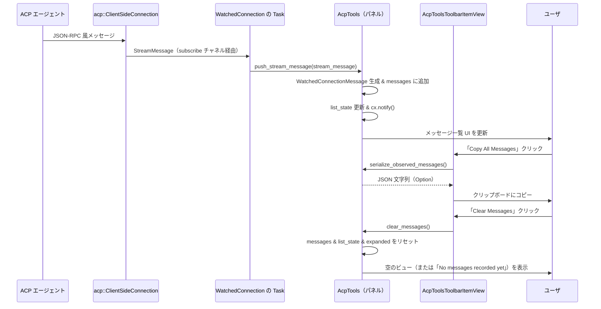

# acp_tools ディレクトリ解説

## 1. ざっくり一言

`acp_tools` は、`agent-client-protocol` (`acp`) のクライアント接続から流れてくるメッセージを GUI 上で監視し、閲覧・コピー・クリアできる「ACP ログビューア」用のパネル (`AcpTools`) とツールバー項目を提供するクレートです。

---

## 2. このモジュールの役割

### 2.1 概要

- エディタ（`Workspace`）とエージェント間の `acp::ClientSideConnection` でやりとりされるメッセージ（リクエスト／レスポンス／通知）をリアルタイムに表示するパネルを提供します。
- アクティブな ACP 接続をグローバルに保持する `AcpConnectionRegistry` を通じて、どの接続を監視するかを切り替えます。
- 収集したメッセージを JSON としてシリアライズし、ワンクリックでコピーできるツールバーコンポーネントを提供します。

### 2.2 アーキテクチャ内での位置づけ

このクレート内の主要コンポーネントと、外部クレートとの関係は概ね次のようになっています。

```mermaid
graph LR
  Workspace["Workspace（他クレート）"]
  Project["Project（他クレート）"]
  ACPConn["acp::ClientSideConnection（他クレート）"]
  Registry["AcpConnectionRegistry（グローバル）"]
  AcpTools["AcpTools（パネル Item）"]
  Watched["WatchedConnection（接続ごとの状態）"]
  Msg["WatchedConnectionMessage（1 メッセージ）"]
  Toolbar["AcpToolsToolbarItemView（ツールバー）"]

  Workspace -->|OpenAcpLogs アクション| AcpTools
  AcpTools --> Project
  AcpTools --> Registry
  Registry -->|active_connection(Weak)| ACPConn
  AcpTools --> Watched
  Watched -->|messages: Vec| Msg
  Toolbar --> AcpTools
```

- `AcpConnectionRegistry` は `App` のグローバルとして 1 つだけ存在し、現在「アクティブ」とみなす ACP 接続を保持します。
- `AcpTools` はこのレジストリを監視し、アクティブ接続が変わると自分の `WatchedConnection` を作り直し、`ClientSideConnection::subscribe()` でメッセージストリームを監視します。
- `AcpToolsToolbarItemView` はアクティブなペインが `AcpTools` のときだけ表示され、コピー／クリア操作を提供します。

### 2.3 設計上のポイント

- **グローバルな接続レジストリ**
  - `AcpConnectionRegistry` を `Global` として `App` に登録し、どこからでもアクティブ接続を設定できるようにしています。
  - 実際の `ClientSideConnection` は `Weak` で保持し、ライフタイム管理を接続側に委ねています。
- **UI とストリーム処理の分離**
  - ストリーム受信は `Task<()>` としてバックグラウンドで走り、UI 更新は `AcpTools::push_stream_message` 経由で行います。
- **表示用データのキャッシュ**
  - 各メッセージごとに Markdown 表示用の `Entity<Markdown>`（折りたたみ版／展開版）を保持し、展開時のみ Pretty JSON を生成します。
- **gpui の `Item` / `ToolbarItemView` 統合**
  - パネルとして `Item` を実装し、タブタイトル・アイコン・フォーカス管理を行います。
  - ツールバー項目も `ToolbarItemView` として独立した型で定義されています。

---

## 3. 主要な機能一覧

- **OpenAcpLogs アクションの登録**: ワークスペースから ACP ログビューアパネルを開くためのアクション `OpenAcpLogs` を登録します。
- **アクティブ接続レジストリ**: `AcpConnectionRegistry` により、現在監視対象となる `acp::ClientSideConnection` をグローバルに記録します。
- **メッセージストリームの購読と保存**: アクティブ接続から `acp::StreamMessage` を購読し、`WatchedConnectionMessage` として内部に蓄積します。
- **メッセージの UI 表示**: リクエスト／レスポンス／通知を一覧表示し、JSON パラメータを折りたたみ表示／展開表示できます。
- **リクエスト ID とメソッドの対応付け**: レスポンスから元のリクエストメソッド名を引き直し、わかりやすい表示を行います。
- **メッセージの JSON エクスポート**: 収集済みメッセージを JSON 配列としてシリアライズし、コピー用の文字列を生成します。
- **メッセージの一括クリア**: ビュー内に蓄積されたメッセージをクリアし、スクロール状態や展開状態をリセットします。

---

## 4. 関数・構造体の解説

### 4.1 主な構造体・列挙体

| 名前 | 種別 | 役割 / 用途 |
|------|------|-------------|
| `GlobalAcpConnectionRegistry` | 構造体（`Global` 実装） | `Entity<AcpConnectionRegistry>` を `App` のグローバルとして登録するためのラッパーです。 |
| `AcpConnectionRegistry` | 構造体 | 現在アクティブな `AgentId` と `ClientSideConnection`（の `Weak`）を 1 つだけ保持します。 |
| `ActiveConnection` | 構造体 | `AcpConnectionRegistry` 内部で用いる、単一接続の情報 (`agent_id` と `Weak<ClientSideConnection>`) です。 |
| `AcpTools` | 構造体（`Item`、`Focusable`、`Render` 実装） | ACP メッセージを表示するパネル本体です。`Workspace` のペイン内にタブとして表示されます。 |
| `WatchedConnection` | 構造体 | ある 1 つの `ClientSideConnection` に対して、受信したメッセージ一覧・スクロール状態・リクエスト ID マッピングなどを保持します。 |
| `WatchedConnectionMessage` | 構造体 | 1 つの ACP メッセージの表示用データと、パラメータ JSON・Markdown キャッシュなどを保持します。 |
| `MessageType` | 列挙体 | `Request` / `Response` / `Notification` の 3 種類のメッセージ種別を表します（`Display` 実装あり）。 |
| `AcpToolsEvent` | 列挙体（空） | `AcpTools` 用のイベント型です。現状バリアントはありませんが、`EventEmitter` 実装に必要です。 |
| `AcpToolsToolbarItemView` | 構造体（`ToolbarItemView`、`Render` 実装） | アクティブな `AcpTools` ペインに連動して表示されるツールバー項目（「Copy All」「Clear」ボタン）です。 |

### 4.2 重要な関数・メソッド（詳細）

#### `pub fn init(cx: &mut App)`

**概要**

- `App` 起動時に呼び出す初期化関数です。
- 新しく作成される `Workspace` ごとに、`OpenAcpLogs` アクションを登録し、そのアクションから `AcpTools` パネルを開けるようにします。

**引数**

| 引数名 | 型 | 説明 |
|--------|----|------|
| `cx` | `&mut App` | アプリケーション全体のコンテキストです。新規 `Workspace` 監視やグローバル登録に使用します。 |

**戻り値**

- なし。

**内部処理の流れ**

1. `cx.observe_new` で、新しく作られる `Workspace` を監視するハンドラを登録します。
2. 各 `Workspace` について、`workspace.register_action` を呼び出し、`OpenAcpLogs` アクションのハンドラを登録します。
3. `OpenAcpLogs` が発火すると、`cx.new(|cx| AcpTools::new(workspace.project().clone(), cx))` で `AcpTools` インスタンスを作成します。
4. `workspace.add_item_to_active_pane` により、アクティブペインに `AcpTools` を新しいタブとして追加します。

**Examples（使用例）**

```rust
// アプリケーション起動時に一度だけ呼び出す想定の例
fn main() {
    // App の具体的な初期化方法は他コードに依存します
    App::new().run(|cx| {
        // acp_tools のアクションとパネルを Workspace に組み込む
        acp_tools::init(cx);
        // ここで他のモジュールの初期化などを行う
    });
}
```

**Errors / Panics**

- この関数内で明示的に `panic!` を呼んでいる箇所はありません。
- `gpui` の内部仕様に由来するエラー（例: `Workspace` 初期化失敗）は、このコードからは読み取れません。

**Edge cases（エッジケース）**

- `init` が呼ばれる前に作成された `Workspace` には `OpenAcpLogs` アクションが登録されません。
  - 実運用では、アプリ起動直後に必ず `init` を呼ぶ前提が想定されます。

**使用上の注意点**

- アプリ全体で 1 回呼び出すことを前提とした初期化関数です。複数回呼び出した場合の挙動はコードからは確認できませんが、同じアクションが重複登録される可能性があります。

---

#### `impl AcpConnectionRegistry { pub fn default_global(cx: &mut App) -> Entity<Self> }`

**概要**

- `AcpConnectionRegistry` のグローバルインスタンスを取得します。
- まだ存在しない場合は新しく `Entity<AcpConnectionRegistry>` を作成し、`GlobalAcpConnectionRegistry` として `App` に登録します。

**引数**

| 引数名 | 型 | 説明 |
|--------|----|------|
| `cx` | `&mut App` | グローバルの有無の確認と、新規 Entity の作成に使います。 |

**戻り値**

- `Entity<AcpConnectionRegistry>`: 以降も再利用される共有インスタンスです。

**内部処理の流れ**

1. `cx.has_global::<GlobalAcpConnectionRegistry>()` で既に登録済みかを確認します。
2. 登録済みなら `cx.global::<GlobalAcpConnectionRegistry>().0.clone()` で `Entity<AcpConnectionRegistry>` を取得します。
3. 未登録なら `cx.new(|_cx| AcpConnectionRegistry::default())` で新規 Entity を作成します。
4. 新規作成した Entity を `cx.set_global(GlobalAcpConnectionRegistry(registry.clone()))` でグローバル登録し、その Entity を返します。

**Examples（使用例）**

```rust
// どこかのコンポーネントからアクティブ接続を設定するイメージ例
fn on_agent_connected(
    agent_id: AgentId,
    conn: Rc<acp::ClientSideConnection>,
    cx: &mut App,
) {
    let registry = AcpConnectionRegistry::default_global(cx); // グローバルを取得
    // 実際には Entity<AcpConnectionRegistry> 経由で update するパターンが使われます
    registry.update(cx, |registry, cx| {
        registry.set_active_connection(agent_id.clone(), &conn, cx);
    });
}
```

※ 上記の `Entity::update` の具体的なシグネチャはこのファイルには登場しません。`gpui` の一般的なパターンに基づく例です。

**Errors / Panics**

- 明示的なエラー処理はありません。
- `Global` 機構自体のエラー（存在しない型の取得など）はここでは発生しないように書かれています。

**Edge cases**

- 複数回呼び出しても同じ `Entity<AcpConnectionRegistry>` が返ります。
- 異なる場所から同時に呼ばれても、新規作成は最初の 1 回だけです（`has_global` チェックに基づく）。

**使用上の注意点**

- `AcpConnectionRegistry` に直接アクセスするのではなく、必ずこのメソッドを経由して共有インスタンスを取得する前提になっています。

---

#### `impl AcpConnectionRegistry { pub fn set_active_connection(&self, agent_id: AgentId, connection: &Rc<acp::ClientSideConnection>, cx: &mut Context<Self>) }`

**概要**

- アクティブな ACP 接続（`ClientSideConnection`）と対応する `AgentId` を登録します。
- UI 側（`AcpTools`）はこの変更を監視しており、呼び出しにより監視対象接続が切り替わります。

**引数**

| 引数名 | 型 | 説明 |
|--------|----|------|
| `agent_id` | `AgentId` | この接続に紐づくエージェント ID です。タブタイトル表示に使われます。 |
| `connection` | `&Rc<acp::ClientSideConnection>` | アクティブとしたいクライアント側接続です。`Weak` にダウングレードして保持されます。 |
| `cx` | `&mut Context<Self>` | このレジストリ Entity のコンテキストです。`cx.notify()` に使用します。 |

**戻り値**

- なし。

**内部処理の流れ**

1. `ActiveConnection { agent_id, connection: Rc::downgrade(connection) }` を生成します。
2. `self.active_connection.replace(Some(...))` で `RefCell<Option<ActiveConnection>>` に保存します。
3. `cx.notify()` を呼び出し、`AcpConnectionRegistry` を監視しているコンポーネント（`AcpTools` など）に変更を通知します。

**Examples（使用例）**

```rust
// Entity<AcpConnectionRegistry> 経由で呼び出すイメージ
fn set_current_connection(
    registry: Entity<AcpConnectionRegistry>,
    agent_id: AgentId,
    conn: Rc<acp::ClientSideConnection>,
    cx: &mut App,
) {
    registry.update(cx, |registry, cx| {
        registry.set_active_connection(agent_id.clone(), &conn, cx);
    });
}
```

**Errors / Panics**

- `RefCell::replace` は通常 panic しませんが、`RefCell` がすでに不正な借用状態（同時に `borrow_mut` が生きているなど）にあるときに別の操作を行うと panic しうる点には一般的な注意が必要です。

**Edge cases**

- `connection` の元の `Rc` がすべてドロップされると、内部の `Weak` は `upgrade()` に失敗し、`AcpTools` 側では新しい `WatchedConnection` を作れません（`update_connection` が単に何もせず戻ります）。
- `agent_id` だけ変更して同じ `Rc` を渡した場合でも、新しい `ActiveConnection` として上書きされます。

**使用上の注意点**

- 1 つのレジストリインスタンスは常に 0 か 1 つのアクティブ接続しか保持できません。複数接続の同時監視はこの設計では想定されていません。

---

#### `impl AcpTools { fn new(project: Entity<Project>, cx: &mut Context<Self>) -> Self }`

**概要**

- `AcpTools` パネルのコンストラクタです。
- グローバルな接続レジストリを取得し、そのレジストリの変更を監視する `Subscription` を登録します。

**引数**

| 引数名 | 型 | 説明 |
|--------|----|------|
| `project` | `Entity<Project>` | このワークスペースのプロジェクト情報。`LanguageRegistry` 取得などに使用します。 |
| `cx` | `&mut Context<Self>` | `AcpTools` 作成時のコンテキストです。フォーカスハンドルやサブスクリプション登録に使用します。 |

**戻り値**

- 初期化済みの `AcpTools` インスタンス。

**内部処理の流れ**

1. `AcpConnectionRegistry::default_global(cx)` を通してレジストリ（`Entity<AcpConnectionRegistry>`）を取得します。
2. `cx.observe(&connection_registry, |this, _, cx| { ... })` でレジストリの変更を監視します。
   - 変更があれば `this.update_connection(cx)` を呼び、必要なら新しい `WatchedConnection` を作成します。
3. 各フィールドを初期化し、最後に自分自身に対して `update_connection(cx)` を 1 回呼んで、既にアクティブな接続があれば即座に紐付けます。

**Examples（使用例）**

```rust
// Workspace 内で AcpTools パネルを作る例（コード中にも登場）
workspace.register_action(|workspace, _: &OpenAcpLogs, window, cx| {
    // プロジェクト Entity を AcpTools に渡して新規作成
    let acp_tools = Box::new(cx.new(|cx| AcpTools::new(workspace.project().clone(), cx)));
    // アクティブペインにタブとして追加
    workspace.add_item_to_active_pane(acp_tools, None, true, window, cx);
});
```

**Errors / Panics**

- 明示的なエラー処理・panic はありません。

**Edge cases**

- `AcpConnectionRegistry` にまだアクティブ接続が設定されていない場合、`update_connection` は何もせず、UI では「No active connection」が表示されます。

**使用上の注意点**

- `project` は `LanguageRegistry` を取得するために保持されます。`Project` が解放されないよう、ワークスペース内のライフタイム設計と整合を取る必要があります。

---

#### `impl AcpTools { fn update_connection(&mut self, cx: &mut Context<Self>) }`

**概要**

- `AcpConnectionRegistry` 内の `active_connection` と、自身が現在監視している接続 (`watched_connection`) を比較し、必要なら新しい接続に切り替えます。
- 新しい `WatchedConnection` を作成し、その接続からメッセージを購読する `Task` を立ち上げます。

**引数**

| 引数名 | 型 | 説明 |
|--------|----|------|
| `cx` | `&mut Context<Self>` | `AcpTools` のコンテキストです。`Task` の生成や通知に使用します。 |

**戻り値**

- なし。

**内部処理の流れ**

1. `self.connection_registry.read(cx).active_connection.borrow()` で現在のアクティブ接続を借用します。
2. `active_connection` が `None` なら何もせず終了します。
3. 既存の `watched_connection` があり、格納されている `Weak` が新しい `active_connection.connection` と `Weak::ptr_eq` で同一なら、すでに監視中なので何もしません。
4. そうでなければ `active_connection.connection.upgrade()` を試み、`Rc` に昇格できたときだけ次に進みます。
5. `connection.subscribe()` でメッセージ受信用の `receiver` を作り、`cx.spawn` で非同期タスクを起動します。
   - `while let Ok(message) = receiver.recv().await` ループでメッセージを読み続け、受信ごとに `this.update(cx, |this, cx| this.push_stream_message(message, cx))` を呼びます。
6. 新しい `WatchedConnection` を構築し（空の `messages`・`ListState::new(0, ListAlignment::Bottom, px(2048.))` など）、`self.watched_connection` に格納します。

**Errors / Panics**

- `Weak::upgrade` が失敗した場合は単に新しい `WatchedConnection` を作らず終了します（エラーにはなりません）。
- `receiver.recv().await` がエラーになった場合（チャネルが閉じたなど）、`while let Ok(message)` ループが終了し、`Task` も終了します。

**Edge cases**

- アクティブ接続が `Some` から `None` に変わったケースはこの関数だけでは扱っていません（`active_connection` を `None` にするロジックはこのファイルにはありません）。`None` の場合は「何もしない」ため、以前の `watched_connection` は残ったままになります。
- 同じ `Rc` で `agent_id` だけが変わった場合も `Weak::ptr_eq` によって「同じ接続」と判定され、`WatchedConnection` の作り直しは行われません（タブタイトルの `agent_id` は `watched_connection` 作成時のもののままです）。

**使用上の注意点**

- 外部から直接呼ぶ必要はなく、`AcpTools::new` および接続レジストリの更新に応じて内部的に呼ばれます。

---

#### `impl AcpTools { fn push_stream_message(&mut self, stream_message: acp::StreamMessage, cx: &mut Context<Self>) }`

**概要**

- `acp::StreamMessage` を内部表現 `WatchedConnectionMessage` に変換し、現在監視中の接続の `messages` ベクタに追加します。
- リクエスト ID からメソッド名を引き直すために、リクエスト送信時に ID とメソッド名のマップを更新します。

**引数**

| 引数名 | 型 | 説明 |
|--------|----|------|
| `stream_message` | `acp::StreamMessage` | ACP クライアントから流れてきた 1 メッセージです。方向と内容（リクエスト／レスポンス／通知）を含みます。 |
| `cx` | `&mut Context<Self>` | Markdown エンティティ生成や UI 更新通知に使用します。 |

**戻り値**

- なし。

**内部処理の流れ**

1. `self.watched_connection` が `Some` でなければ何もせず終了します。
2. `stream_message.message` の種類に応じて以下を行います。
   - **Request `{ id, method, params }`**:
     - 方向に応じて `incoming_request_methods` または `outgoing_request_methods` に `id -> method` を登録します。
     - `request_id = Some(id)`, `message_type = MessageType::Request`, `params = Ok(params)` として扱います。
   - **Response `{ id, result }`**:
     - 方向に応じて「相手側」に対応するマップ（`incoming` なら `outgoing_request_methods` など）から `id` を取り出し、メソッド名にします。
     - 見つからない場合はメソッド名を `"[unrecognized response]"` とします。
     - `request_id = Some(id)`, `message_type = MessageType::Response`, `params = result` として扱います。
   - **Notification `{ method, params }`**:
     - `request_id = None`, `message_type = MessageType::Notification`, `params = Ok(params)` とします。
3. `params` が `Ok(Some(value))` の場合は `collapsed_params_md(value, &language_registry, cx)` で 1 行表示用の Markdown を生成します。
4. `params` が `Err(err)` の場合は `serde_json::to_value(err)` によって JSON 化を試み、成功した場合のみ `collapsed_params_md` を生成します。
5. `WatchedConnectionMessage` を組み立てて `connection.messages.push(message)` し、`connection.list_state.splice(index..index, 1)` でリストに 1 行分を追加します。
6. `cx.notify()` を呼び、UI の再描画を促します。

**Errors / Panics**

- パラメータの JSON 変換に失敗した場合は `collapsed_params_md` が `None` になるだけで、エラーにはなりません。
- `serde_json::to_string` / `to_string_pretty` は `unwrap_or_default()` でラップされており、失敗しても空文字列にフォールバックします。

**Edge cases**

- レスポンスに対応するリクエスト ID がマップに存在しない場合、メソッド名は固定文字列 `"[unrecognized response]"` になります。
- パラメータが `None` の場合は Markdown 表示自体が省略されます（本文なし）。
- エラーが JSON にシリアライズできない場合、そのメッセージは本文表示も JSON エクスポートも行われません（本文・`serialize_observed_messages` から除外されます）。

**使用上の注意点**

- 外部から直接呼び出すことは想定されておらず、`update_connection` で起動した `Task` 内からのみ利用されます。

---

#### `impl AcpTools { fn serialize_observed_messages(&self) -> Option<String> }`

**概要**

- 現在の `watched_connection.messages` を走査し、メタ情報付きの JSON 配列文字列に変換します。
- ツールバーの「Copy All Messages」ボタンで利用されます。

**引数**

- なし（`&self` のみ）。

**戻り値**

- `Option<String>`:
  - `Some(json_string)`: 成功時。インデント付きの JSON 文字列です。
  - `None`: `watched_connection` が存在しない場合。

**内部処理の流れ**

1. `self.watched_connection.as_ref()?` で接続がなければ `None` を返します。
2. `connection.messages.iter().filter_map(...)` で各メッセージを `serde_json::Value` に変換します。
   - `params` は以下の規則で JSON にします。
     - `Ok(Some(params))` → そのまま `params.clone()`。
     - `Ok(None)` → `Value::Null`。
     - `Err(err)` → `serde_json::to_value(err).ok()?`（失敗した場合はこのメッセージ自体をスキップ）。
   - そのうえで、次のキーを持つオブジェクトを構築します。
     - `"_direction"`: `"incoming"` または `"outgoing"`.
     - `"_type"`: `"request"` / `"response"` / `"notification"` （`MessageType` の小文字化）。
     - `"id"`: `Option<RequestId>` としてそのまま。
     - `"method"`: `message.name.to_string()`。
     - `"params"`: 上記で決めた JSON 値。
3. 得られた `Vec<Value>` を `serde_json::to_string_pretty(&messages).ok()` でシリアライズし、`Some` または `None` を返します。

**Examples（使用例）**

```rust
// ツールバー以外からログを取得したい場合のイメージ
fn export_acp_logs(acp_tools: &Entity<AcpTools>, cx: &App) -> String {
    acp_tools
        .read(cx)
        .serialize_observed_messages()
        .unwrap_or_default() // ログがなければ空文字
}
```

**Errors / Panics**

- `serde_json::to_string_pretty` が失敗した場合は `None` を返し、呼び出し側で `unwrap_or_default` などで扱う前提です。
- panic を起こすようなコードは含まれていません。

**Edge cases**

- `watched_connection` が `None` の場合、`None` が返り、その結果ボタン側では空文字列がコピーされるよう実装されています。
- エラーが JSON 化できないメッセージは配列から完全に除外されます（そのメッセージ自体が欠落します）。

**使用上の注意点**

- この JSON は内部デバッグやバグ報告用のフォーマット（`_direction` / `_type` など独自キーを含む）であり、ACP プロトコルそのもののワイヤフォーマットとは異なる可能性があります。

---

### 4.3 その他の関数・メソッド（概要のみ）

| 関数名 / メソッド名 | 役割（1 行） |
|---------------------|--------------|
| `AcpTools::clear_messages(&mut self, cx: &mut Context<Self>)` | 現在の `WatchedConnection` のメッセージ・スクロール状態・展開状態をすべてリセットします。 |
| `AcpTools::render_message(&mut self, index, window, cx) -> AnyElement` | 指定インデックスのメッセージ 1 件を行としてレンダリングします（ヘッダ＋折りたたみ/展開本文）。 |
| `WatchedConnectionMessage::expanded(&mut self, language_registry: Arc<LanguageRegistry>, cx: &mut App)` | 必要に応じて Pretty JSON 表示用の `expanded_params_md` を生成し、キャッシュします。 |
| `collapsed_params_md(params, language_registry, cx) -> Entity<Markdown>` | 1 行 JSON を生成し、それをコードブロックとして表示する Markdown エンティティを作成します。 |
| `expanded_params_md(params, language_registry, cx) -> Entity<Markdown>` | インデント付き Pretty JSON をコードブロックとして表示する Markdown エンティティを作成します。 |
| `impl Render for AcpTools` | パネル全体の UI（「No active connection」などのメッセージリスト）を描画します。 |
| `impl Render for AcpToolsToolbarItemView` | 「Copy All Messages」「Clear Messages」ボタンからなるツールバー UI を描画します。 |
| `impl ToolbarItemView for AcpToolsToolbarItemView::set_active_pane_item` | アクティブペインの `Item` が `AcpTools` のときにツールバーを表示し、それ以外のときは非表示にします。 |

---

## 5. データフロー

ここでは、1 つの ACP メッセージがエージェントから送られてきて、UI に表示／コピーされるまでの流れを示します。



**要点**

- 接続の選択とメッセージストリームの購読は `AcpTools::update_connection` とバックグラウンド `Task` が担います。
- UI は `ListState`＋`list(...)` による仮想リストで構成されており、メッセージが追加されると下にスクロールされる（`ListAlignment::Bottom`）ように設定されています。
- ツールバーは `AcpTools` に直接アクセスせず、`Entity<AcpTools>` を通じて非破壊的な `read` と破壊的な `update` を使い分けています。

---

## 6. 使い方（How to Use）

### 6.1 基本的な使用方法

1. **クレートを依存関係に追加**

   すでにこのディレクトリは `acp_tools` クレートそのものなので、他クレートから使う場合のイメージです。

   ```toml
   # 他クレート側の Cargo.toml
   [dependencies]
   acp_tools = { path = "crates/acp_tools" }
   ```

2. **アプリ起動時に `init` を呼び出す**

   ```rust
   // アプリのエントリポイントのイメージ
   fn main() {
       App::new().run(|cx| {
           // 他モジュールの初期化に加えて acp_tools を登録
           acp_tools::init(cx);

           // ここで Workspace 等の起動処理を続ける
       });
   }
   ```

   これにより、新しく生成される `Workspace` すべてに `OpenAcpLogs` アクションが登録されます。

3. **どこかでアクティブ接続をレジストリに登録する**

   ACP 接続を管理しているコードから、接続が確立したタイミングで次のように設定します（概念的な例）。

   ```rust
   use std::rc::Rc;
   use agent_client_protocol as acp;
   use acp_tools::AcpConnectionRegistry;
   use project::AgentId;

   fn on_connection_ready(
       agent_id: AgentId,
       conn: Rc<acp::ClientSideConnection>,
       cx: &mut App,
   ) {
       let registry = AcpConnectionRegistry::default_global(cx);

       registry.update(cx, |registry, cx| {
           registry.set_active_connection(agent_id.clone(), &conn, cx);
       });
   }
   ```

4. **UI から ACP ログビューアを開く**

   - `OpenAcpLogs` アクションを呼び出す（コマンドパレット／キーバインド／メニュー等から）。
   - 新しいタブ「ACP: {AgentId or Disconnected}」として `AcpTools` パネルが開きます。
   - アクティブな接続が設定されていれば、以後のメッセージがリアルタイムに表示されます。

5. **ツールバーでエクスポート／クリア**

   - アクティブペインが `AcpTools` のとき、右側ツールバーに
     - 「Copy All Messages」（`CopyButton`）
     - 「Clear Messages」（ゴミ箱アイコンの `IconButton`）
     が表示されます。
   - 「Copy All Messages」は `serialize_observed_messages()` の結果をクリップボードにコピーします。
   - 「Clear Messages」は `clear_messages()` を呼び、表示と内部バッファをクリアします。

### 6.2 よくある使用パターン

- **単一接続の監視**
  - 常に最新の接続を `set_active_connection` で上書きし続けるパターンです。
  - `AcpTools` は常に「最後に設定された接続」のみを監視します。

- **バグ報告用ログの収集**
  - 問題が再現したあと、`OpenAcpLogs` でパネルを開き、ツールバーの「Copy All Messages」で JSON をコピーし、Issue 報告に貼り付ける、といった使い方が想定できます。
  - JSON には `_direction` や `_type` などの補助情報も含まれます。

- **デモ・開発用のプロトコル確認**
  - 各メッセージをクリックして展開すると Pretty JSON が表示され、`Request`／`Response` の対応やパラメータの内容を確認できます。
  - エラー応答は可能な限りエラーオブジェクトを JSON 化して表示します。

### 6.3 使用上の注意点（まとめ）

- **アクティブ接続は 1 つだけ**
  - `AcpConnectionRegistry` は単一の `ActiveConnection` しか保持しません。
  - 複数接続を同時に監視したい場合は、この設計からは読み取れません（別レジストリや別パネルが必要になります）。

- **接続は `Weak` で保持される**
  - 接続側で `Rc<acp::ClientSideConnection>` がすべてドロップされると、`AcpTools` は新しいメッセージを受け取れなくなります。
  - その場合も既存ログの閲覧・コピーは可能です。

- **エラーの JSON 変換に失敗したメッセージ**
  - `params` が `Err` かつ `serde_json::to_value(err)` に失敗した場合、そのメッセージの本文は表示されず、エクスポート JSON からも除外されます。
  - ログ解析の際は「メッセージ数が通信実績より少ない」可能性がある点に注意が必要です。

- **RefCell の二重借用に関する一般的注意**
  - `AcpConnectionRegistry` の内部状態は `RefCell` で保持されています。
  - 通常の使用パターンでは問題ありませんが、同じ Entity を複数箇所から同時に `borrow_mut` するような使い方は避ける必要があります。

- **表示内容はあくまでデバッグ用途**
  - 表示に Markdown と Pretty JSON を用いているため、人間の読みやすさを優先しています。
  - プロトコル仕様に厳密に準拠した機械可読ログとして再利用する場合は、`serialize_observed_messages` の出力形式を確認したうえで扱う必要があります。

---

## 7. 関連ファイル

| パス / 名称 | 役割 / 関係 |
|-------------|------------|
| `acp_tools/Cargo.toml` | このクレートのパッケージ定義。`agent-client-protocol`、`gpui`、`workspace` など UI・プロトコル関連の依存関係を宣言しています。 |
| `acp_tools/src/acp_tools.rs` | 本ドキュメントで解説した ACP ログビューア本体の実装ファイルです。`AcpConnectionRegistry`、`AcpTools`、`AcpToolsToolbarItemView` などが定義されています。 |

このチャンクには、`agent-client-protocol` や `workspace` など他クレート側の実装ファイルは含まれていないため、それらの内部挙動（`ClientSideConnection::subscribe` の詳細など）はコードからは分かりません。
