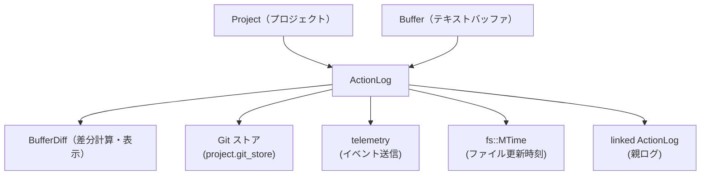
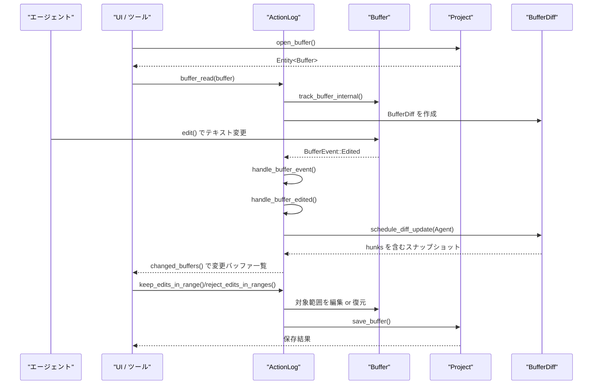

# crates/action_log コード解説

---

## 0. ざっくり一言

`action_log` クレートは、エージェント（AI ツール）やユーザーがプロジェクト内のファイルに行った編集を行単位で追跡し、「どの編集を受け入れるか／却下するか」や「直前の Reject を Undo する」ための差分管理とテレメトリ送信を行うモジュールです。

---

## 1. このモジュールの役割

### 1.1 概要

- このモジュールは **エージェントによるコード編集を安全にレビュー・操作する** ために存在し、次の機能を提供します。
  - バッファごとの「未レビュー編集（unreviewed edits）」の追跡
  - 指定範囲の編集の受け入れ (keep)／拒否 (reject)
  - ファイル作成・上書き・削除を含むエージェント編集の復元・撤回
  - Git コミットと連動した「コミット済み変更の自動受理」
  - Reject All の Undo（直前の Reject 操作を元に戻す）

### 1.2 アーキテクチャ内での位置づけ

ActionLog は、プロジェクトとテキストバッファ、差分ビュー（`BufferDiff`）、Git ストア、テレメトリの間に立つ「調停役」です。主な依存関係は次の通りです。



- `Project` からバッファを開き、`Buffer` に対する編集を `ActionLog` が監視します。
- `BufferDiff` によって詳細な差分スナップショットを管理します。
- `Git` の HEAD との diff を用いて、「コミット済みのエージェント編集」を未レビュー一覧から自動的に取り除きます。
- `telemetry` クレートにイベントを送信して、「受理された行数」「却下された行数」などを記録します。
- 別の `ActionLog` へのリンク機能により、親ログがサブエージェントの編集も集約できます。

### 1.3 設計上のポイント

- **バッファ単位の追跡**
  - `BTreeMap<Entity<Buffer>, TrackedBuffer>` で各バッファの状態を管理します。
  - `TrackedBuffer` は「基準テキスト (`diff_base`)」「未レビュー編集 (`unreviewed_edits`)」「ステータス (Created/Modified/Deleted)」を持ちます。
- **行ベースのパッチ表現**
  - `Patch<u32>` と `Edit<u32>` で「行番号」に基づく編集パッチを保持し、diff の計算・再適用を簡略化しています。
- **非同期・バックグラウンド更新**
  - バッファ変更イベントを `mpsc::UnboundedSender` でキューイングし、`maintain_diff` タスクがバックグラウンドで差分と未レビュー編集を更新します。
- **ユーザー編集とエージェント編集の区別**
  - `ChangeAuthor::User` / `ChangeAuthor::Agent` によってユーザー起因の編集を既存パッチに「リベース」し、エージェント編集の意味を保ちながら追跡します。
- **Git コミットとの連携**
  - Git ベースの `BufferDiff` を監視し、「コミットによって採用されたエージェント編集」を `keep_committed_edits` で自動的に受理します。
- **安全性重視の Reject 挙動**
  - ユーザー編集が混在する新規ファイルは、Reject しても削除しないなど、「データを失わない」方向に挙動が設計されています。
- **Undo 用の最小限の履歴**
  - 直近の Reject All に限り、`LastRejectUndo` に各バッファごとの元テキストを保存して Undo を可能にしています。

---

## 2. 主要な機能一覧

- バッファ追跡:
  - `buffer_read`: エージェントがバッファを読んだタイミングを記録し、以後の変更を追跡可能にする
  - `buffer_edited`: エージェントによる編集を記録し、未レビュー差分としてマークする
  - `buffer_created`: エージェントがファイルを新規作成／既存ファイルを上書きしたことを記録する
  - `will_delete_buffer`: エージェントがファイルを削除しようとしていることを記録する
- 未レビュー編集の確認:
  - `changed_buffers`: 未レビュー差分を持つバッファと `BufferDiff` の一覧を取得する
  - `diff_stats`: 全バッファ合計の追加行数・削除行数を集計する
  - `stale_buffers`: エージェントが最後に読んだ／書いた後にユーザーが変更した「古くなった」バッファを列挙する
- 編集の受理・拒否:
  - `keep_edits_in_range`: 指定範囲のエージェント編集を「受け入れ」として基準テキストに取り込む
  - `reject_edits_in_ranges`: 指定範囲のエージェント編集を元に戻し、必要に応じてファイルの復元・削除を行う
  - `keep_all_edits`: 全ての未レビュー編集を受け入れる
  - `reject_all_edits`: 全ての未レビュー編集を拒否し、Undo 情報を保存する
- Undo / テレメトリ:
  - `has_pending_undo`: 直近の Reject All に対する Undo が可能かどうかを確認する
  - `undo_last_reject`: 直近の Reject All 操作を Undo する
  - `ActionLogTelemetry` + `telemetry_report_*`: 受理／拒否された行数をテレメトリイベントとして記録する
- ファイル読み取り時刻管理:
  - `file_read_time`: あるパスのファイルがエージェントによって最後に読まれた時刻 (`MTime`) を返す

---

## 3. 公開 API と詳細解説

### 3.1 型一覧（構造体・列挙体など）

| 名前 | 種別 | 公開 | 役割 / 用途 |
|------|------|------|-------------|
| `PerBufferUndo` | 構造体 | `pub` | あるバッファに対する Reject 操作を Undo するための情報（アンカー範囲と元テキスト）を保持します。 |
| `UndoBufferStatus` | 列挙体 | `pub` | Undo 対象バッファが「通常編集されたもの」か「エージェントにより作成されたもの」かを区別します。 |
| `LastRejectUndo` | 構造体 | `pub` | 直近の Reject All に関する、全バッファ分の Undo 情報をまとめて保持します。 |
| `ActionLog` | 構造体 | `pub` | このモジュールの中心クラス。バッファ単位の未レビュー編集・ステータス・Undo 情報・ファイル読み取り時刻などを一括管理します。 |
| `DiffStats` | 構造体 | `pub` | 追加行数・削除行数を表す簡易統計。単一ファイルまたは全ファイルに対して計算できます。 |
| `ActionLogTelemetry` | 構造体 | `pub` | テレメトリイベント送信時に使用するエージェント ID とセッション ID を保持します。 |
| `ActionLogMetrics` | 構造体 | 非公開 | テレメトリ計測用の内部構造。言語と追加／削除行数を集計します。 |
| `ChangeAuthor` | 列挙体 | 非公開 | 差分の原因がユーザーかエージェントかを区別する内部用フラグです。 |
| `TrackedBufferStatus` | 列挙体 | 非公開 | バッファの状態（Created / Modified / Deleted）を示します。 |
| `TrackedBuffer` | 構造体 | `pub`（フィールド非公開） | 単一バッファの基準テキスト・未レビュー編集・`BufferDiff`・バージョン等を保持します。テスト用に一部アクセサが公開されています。 |
| `ChangedBuffer` | 構造体 | `pub` | `diff: Entity<BufferDiff>` を持つ薄いラッパーですが、このチャンク内では利用箇所はありません。 |

※ テストモジュール内の `HunkStatus` などはテスト専用の型のため省略します。

---

### 3.2 関数詳細（主要 7 件）

#### 1) `ActionLog::buffer_read(&mut self, buffer: Entity<Buffer>, cx: &mut Context<Self>)`

**概要**

- エージェントがバッファを読み取ったことを ActionLog に知らせます。
- 以降、そのバッファに対する編集を未レビュー差分として追跡できるようにします。
- ファイル読み取り時刻 (`file_read_times`) も記録します。

**引数**

| 引数名 | 型 | 説明 |
|--------|----|------|
| `buffer` | `Entity<Buffer>` | 追跡対象となるテキストバッファのエンティティです。 |
| `cx` | `&mut Context<Self>` | `ActionLog` エンティティ用の gpui コンテキストです。 |

**戻り値**

- なし（`()`）。

**内部処理の流れ**

1. 内部ヘルパー `buffer_read_impl(buffer, true, cx)` を呼び出します。
2. `linked_action_log` が存在する場合、親 ActionLog にも `buffer_read_impl(buffer, false, cx)` をフォワードします（こちらではファイル読み取り時刻は記録しません）。
3. `record_file_read_time == true` の場合、`update_file_read_time` で `file_read_times` に `buffer` のファイルパスと `MTime` を記録します。
4. `track_buffer_internal(buffer, false, cx)` を呼び、`TrackedBuffer` を作成または更新します。
   - `status` は `TrackedBufferStatus::Modified` になります。
   - `diff_base` は現在のバッファ内容。
   - `unreviewed_edits` は空の `Patch` で初期化されます。
   - `BufferDiff` や LSP 登録、`maintain_diff` タスクの起動、バッファイベント購読などもここで行われます。

**Examples（使用例）**

```rust
use gpui::{Context, Entity};
use project::Project;
use language::Buffer;
use action_log::ActionLog;

// ActionLog エンティティのコンテキスト内で呼び出す想定
fn track_read(
    log: &mut ActionLog,
    buffer: Entity<Buffer>,
    cx: &mut Context<ActionLog>,
) {
    // エージェントがこのバッファを読み取ったことを記録し、
    // 以後の編集を追跡できるようにする
    log.buffer_read(buffer, cx);
}
```

**Errors / Panics**

- この関数自体は `Result` を返さず、明示的な `panic!` もありません。
- 内部で呼ぶ `project.register_buffer_with_language_servers` や `Buffer` のメソッドが panic しうるかどうかは、このチャンクだけからは分かりません。

**Edge cases（エッジケース）**

- 同じ `buffer` に対して複数回 `buffer_read` を呼んでも問題ありません。`tracked_buffers` への登録は 1 回で、以降はバージョン更新のみです。
- `linked_action_log` が存在する場合、親ログも同じタイミングでバッファを「読んだ」ことになりますが、親側には `file_read_times` は記録されません（テスト `test_file_read_time_not_forwarded_to_linked_action_log` 参照）。

**使用上の注意点**

- エージェントがバッファの内容を読む前に必ず呼び出す前提で設計されています。呼び忘れると、後続の `buffer_edited` を呼んでも期待どおりに差分が追跡されません。
- バッファを閉じるときに特別なクリーンアップは行っていないため、`tracked_buffers` からの削除タイミングは Accept/Reject などの操作に依存します。

---

#### 2) `ActionLog::buffer_edited(&mut self, buffer: Entity<Buffer>, cx: &mut Context<Self>)`

**概要**

- エージェントが指定のバッファを編集した後に呼び出し、その編集を「エージェント編集」として未レビュー差分に反映させます。
- `ChangeAuthor::Agent` としてバックグラウンドの `maintain_diff` に通知されます。

**引数**

| 引数名 | 型 | 説明 |
|--------|----|------|
| `buffer` | `Entity<Buffer>` | 編集されたバッファ。 |
| `cx` | `&mut Context<Self>` | `ActionLog` のコンテキスト。 |

**戻り値**

- なし（`()`）。

**内部処理の流れ**

1. 内部ヘルパー `buffer_edited_impl(buffer, true, cx)` を呼び出します。
2. `linked_action_log` があれば、親ログにも `buffer_edited_impl(buffer, false, cx)` をフォワードします。
3. `record_file_read_time == true` の場合、`update_file_read_time` でファイル読み取り時刻を記録します。
4. `track_buffer_internal(buffer, false, cx)` で `TrackedBuffer` を取得・初期化します。
   - すでに `status == Deleted` であれば `Modified` に戻します。
5. `TrackedBuffer` の `version` を最新バージョンに更新し、
   `TrackedBuffer::schedule_diff_update(ChangeAuthor::Agent, cx)` を呼んで `maintain_diff` に差分更新を要求します。
6. バッファイベント購読により、後続のユーザー編集なども追跡されます。

**Examples（使用例）**

```rust
use gpui::{Context, Entity};
use language::{Buffer, Point};
use action_log::ActionLog;

fn agent_edit_example(
    log: &mut ActionLog,
    buffer: Entity<Buffer>,
    cx: &mut Context<ActionLog>,
) {
    // 事前に buffer_read で追跡開始している想定
    buffer.update(cx, |buffer, cx| {
        // 1 行目の先頭にコメントを追加（例）
        buffer.edit([(Point::new(0, 0)..Point::new(0, 0), "// AI edit\n")], None, cx).unwrap();
    });

    // 変更を ActionLog に「エージェント編集」として登録
    log.buffer_edited(buffer, cx);
}
```

**Errors / Panics**

- この関数自体は `Result` を返しません。
- `buffer` がまだ `track_buffer_internal` で初期化されていない場合でも、
  内部で自動的に追跡対象として登録されます。

**Edge cases**

- `buffer_read` を呼ばずにいきなり `buffer_edited` を呼んでも、`track_buffer_internal` により登録されますが、「エージェントがいつ読んだか」の情報は失われます。
- `TrackedBufferStatus::Deleted` なバッファに対して呼ぶと、ステータスが `Modified` に戻るため、「削除されたファイルを再編集した」扱いになります。

**使用上の注意点**

- エージェントが行った編集の直後に呼ぶ必要があります。編集前後でバッファ内容が変化していないと、未レビュー差分は生成されません。
- ユーザー編集と混在させたい場合は、ユーザー編集には `buffer_edited` を呼ばない（＝User 側編集として扱う）設計になっています。

---

#### 3) `ActionLog::keep_edits_in_range(&mut self, buffer: Entity<Buffer>, buffer_range: Range<impl language::ToPoint>, telemetry: Option<ActionLogTelemetry>, cx: &mut Context<Self>)`

**概要**

- 指定されたバッファ内の行範囲に重なる「未レビューのエージェント編集」を受け入れ（Accept）ます。
- 受け入れた編集は基準テキスト `diff_base` に取り込まれ、未レビュー編集一覧から削除されます。
- 必要に応じてテレメトリを送信します。

**引数**

| 引数名 | 型 | 説明 |
|--------|----|------|
| `buffer` | `Entity<Buffer>` | 操作対象のバッファ。 |
| `buffer_range` | `Range<impl ToPoint>` | 受け入れ対象となる範囲。`Point` や `Anchor`、行番号など `ToPoint` 実装を持つ型が使えます。 |
| `telemetry` | `Option<ActionLogTelemetry>` | 行数を報告するテレメトリ情報。`None` の場合は送信しません。 |
| `cx` | `&mut Context<Self>` | `ActionLog` のコンテキスト。 |

**戻り値**

- なし（`()`）。

**内部処理の流れ（非 Deleted の場合）**

1. `tracked_buffers` から該当 `TrackedBuffer` を取得（なければ何もせず return）。
2. `ActionLogMetrics::for_buffer` でメトリクス集計用構造体を作成。
3. バッファから `buffer_range` を `Point` ベースの行範囲に変換します。
4. `TrackedBuffer.unreviewed_edits` を `retain_mut` で走査し、次の処理を行います。
   - 編集の新しい行範囲 (`edit.new`) が `buffer_range` と交差しない場合 → パッチに残す。
   - 交差する場合（＝受け入れる場合）:
     - `diff_base` 上の該当行範囲を、現在のスナップショットのテキストで置き換える（＝基準テキストを更新）。
     - 追加行数・削除行数をメトリクスに加算。
     - その `edit` をパッチから削除。
5. すべての編集を処理後、`unreviewed_edits` が空で、かつステータスが `Created` の場合は `Modified` に変更します。
6. `schedule_diff_update(ChangeAuthor::User, cx)` で差分再計算を要求します。
7. ステータスが `Deleted` の場合は、すべての編集を受け入れたものとして単に `tracked_buffers` から削除します。
8. `telemetry` が渡された場合は、`telemetry_report_accepted_edits` でイベント送信。
9. `cx.notify()` により UI 更新などを促します。

**Examples（使用例）**

```rust
use gpui::{Context, Entity};
use language::{Buffer, Point};
use action_log::{ActionLog, ActionLogTelemetry};

fn accept_hunk_in_line_range(
    log: &mut ActionLog,
    buffer: Entity<Buffer>,
    cx: &mut Context<ActionLog>,
) {
    // 例: 1 行目〜3 行目にかかる編集のみを受け入れる
    let range = Point::new(1, 0)..Point::new(3, 0);

    let telemetry = ActionLogTelemetry {
        agent_telemetry_id: "my-agent".into(),
        session_id: Arc::from("session-123"),
    };

    log.keep_edits_in_range(buffer, range, Some(telemetry), cx);
}
```

**Errors / Panics**

- `TrackedBuffer` が存在しない場合は何もせず終了します。
- この関数自体は I/O を行わず、`Result` も返さないため、エラーは露出しません。

**Edge cases**

- `TrackedBufferStatus::Deleted` のときに呼ぶと、その削除編集はすべて「受け入れ」とみなされ、`tracked_buffers` から削除されます（実ファイル内容は `will_delete_buffer` 時点ですでに空にされている場合があります）。
- 指定した `buffer_range` と未レビュー編集が一切交差しない場合、何も変化しません。
- 部分的に交差する編集でも、`edit` 単位でまとめて受け入れられます（edit を分割はしません）。

**使用上の注意点**

- UI の「このハンクを Accept」などから呼び出す想定のメソッドです。行範囲の指定は、テキスト表示と同じ座標系 (`Point` 行・桁) で行うと分かりやすくなります。
- 受け入れた場合でも、即座にファイルを保存するわけではありません。保存は別途 `Project::save_buffer` 側（テストでは `keep_edits_in_range` 後に呼ばれている）で行われています。

---

#### 4) `ActionLog::reject_edits_in_ranges(&mut self, buffer: Entity<Buffer>, buffer_ranges: Vec<Range<impl language::ToPoint>>, telemetry: Option<ActionLogTelemetry>, cx: &mut Context<Self>) -> (Task<Result<()>>, Option<PerBufferUndo>)`

**概要**

- 指定した 1 つのバッファ内で、複数範囲に重なるエージェント編集を「拒否（Reject）」し、元の内容に戻します。
- ファイル作成・削除・上書きなどのケースも扱い、必要に応じてファイルの復元・削除も行います。
- Undo 用に必要な情報を `PerBufferUndo` として返します。

**引数**

| 引数名 | 型 | 説明 |
|--------|----|------|
| `buffer` | `Entity<Buffer>` | 操作対象のバッファ。 |
| `buffer_ranges` | `Vec<Range<impl ToPoint>>` | Reject 対象範囲の集合。`Point` や `Anchor` などが使用可能です。 |
| `telemetry` | `Option<ActionLogTelemetry>` | 拒否された行数をテレメトリとして送信する場合に指定します。 |
| `cx` | `&mut Context<Self>` | `ActionLog` のコンテキスト。 |

**戻り値**

- `(Task<Result<()>>, Option<PerBufferUndo>)`
  - `Task<Result<()>>`: バッファ保存などを行う非同期タスク。呼び出し側で `await` するか `detach` できます。
  - `Option<PerBufferUndo>`: この Reject 操作を Undo するために必要な情報。Undo 不可能なケースでは `None`。

**内部処理の流れ（ケース別）**

1. `tracked_buffers` から `TrackedBuffer` を取得。なければ `(Task::ready(Ok(())), None)` を返して終了。
2. `ActionLogMetrics` で行数メトリクスを準備。
3. `tracked_buffer.status` に応じて分岐:

   - **`Created { existing_file_content: Some(original) }`**
     - エージェントが既存ファイルを上書きしたケース。
     - 現在のバッファ内容（エージェント内容）を保存しておき、バッファ全体を `original` に置き換えます。
     - Undo 用に「全範囲の Anchor + エージェント内容」を `PerBufferUndo` に保存。
     - `Project::save_buffer` を呼び出す `Task` を返します。
     - `tracked_buffers` から該当バッファを削除。

   - **`Created { existing_file_content: None }`**
     - エージェントが新規ファイルを作成したケース。
     - `TrackedBuffer` 生成時のバージョンと現在のバージョン、スナップショット内容を比較し、
       「エージェントが作った内容からユーザー編集を挟んでいないか」を判定します。
       - 完全にエージェントのみの編集 (`is_ai_only_content == true`) → `Project::delete_entry` でファイルを削除。
       - ユーザー編集が混ざっている可能性がある → 何もせず `Task::ready(Ok(()))` を返し、データ損失を防ぎます。
     - いずれの場合も `tracked_buffers` から削除します。

   - **`Deleted`**
     - エージェントがファイルを削除していたケース。
     - `buffer.set_text(tracked_buffer.diff_base.to_string())` で元の内容を復元。
     - `save_buffer` を行う `Task` を返します。
     - その後 `tracked_buffers` から削除し、改めて `buffer_read` で再追跡します。

   - **`Modified`**
     - 通常の編集 Reject ケース。
     - `buffer.update` 内で、各 `unreviewed_edits` の新側レンジが `buffer_ranges` のいずれかと交差するか判定。
       - 交差するものについて:
         - `diff_base` から元テキストを取得し、バッファ上の該当 Anchor 範囲をその元テキストで置き換えます。
         - 同時に Undo 用として「元の Anchor 範囲 + エージェントテキスト」を記録します。
     - 編集後、`Project::save_buffer` の `Task` を返します。
     - `unreviewed_edits` 自体はここでは直接更新されませんが、バッファ編集イベントにより `maintain_diff` が再計算し、対応する差分が消えます。

4. テレメトリが指定されていれば `telemetry_report_rejected_edits` を呼び出します。
5. `(task, undo_info)` を返します。

**Examples（使用例）**

```rust
use gpui::{Context, Entity};
use language::{Buffer, Point};
use action_log::{ActionLog, ActionLogTelemetry};

async fn reject_some_edits(
    log: &mut ActionLog,
    buffer: Entity<Buffer>,
    cx: &mut Context<ActionLog>,
) {
    // 例: 先頭〜2 行目、および 5 行目付近の編集をまとめて Reject
    let ranges = vec![
        Point::new(0, 0)..Point::new(2, 0),
        Point::new(5, 0)..Point::new(5, 10),
    ];

    let telemetry = None;
    let (task, undo_info) = log.reject_edits_in_ranges(buffer.clone(), ranges, telemetry, cx);

    // 保存処理を待つ
    task.await.expect("save failed");

    if let Some(per_buffer_undo) = undo_info {
        // 必要なら LastRejectUndo にまとめて保存するなど、呼び出し側で扱えます
        // （実際には reject_all_edits がこれを行います）
        println!("undo info for {} edits", per_buffer_undo.edits_to_restore.len());
    }
}
```

**Errors / Panics**

- 返り値の `Task<Result<()>>` 内で、`save_buffer` などがエラーを返す可能性があります。
- `buffer` が追跡されていない場合はエラーではなく単に何もしません。

**Edge cases**

- Reject 範囲が未レビュー差分とまったく重ならない場合、その範囲は無視され、バッファ内容は変化しません（テスト `test_reject_edits` 参照）。
- 新規作成されたファイルにユーザー編集が混ざっていると推定される場合、Reject してもファイルを削除しません（`test_reject_created_file_with_user_edits`）。
- 同一バッファに対して複数範囲を渡した場合、同一の `Edit` に対して複数回 Reject 判定されることはありません（内部で一度だけ判定されます）。

**使用上の注意点**

- 単一バッファに対する操作です。複数バッファに一括で Reject を行いたい場合は、`reject_all_edits` を使用する方が自然です。
- 戻り値の `Task` を `await` しない場合でもバックグラウンド実行はできますが、エラー処理をしたい場合は `await` する必要があります。

---

#### 5) `ActionLog::reject_all_edits(&mut self, telemetry: Option<ActionLogTelemetry>, cx: &mut Context<Self>) -> Task<()>`

**概要**

- すべての追跡中バッファに対して、「ファイル全体」を対象とした Reject を行います。
- 各バッファごとの Undo 情報を集めて `last_reject_undo` に保存し、後から `undo_last_reject` で元に戻せるようにします。

**引数**

| 引数名 | 型 | 説明 |
|--------|----|------|
| `telemetry` | `Option<ActionLogTelemetry>` | 行数統計をテレメトリに送る場合に指定します。 |
| `cx` | `&mut Context<Self>` | `ActionLog` のコンテキスト。 |

**戻り値**

- `Task<()>`: 各バッファの `reject_edits_in_ranges` を並列に実行する非同期タスクです。

**内部処理の流れ**

1. 既存の `last_reject_undo` をクリアします。
2. `changed_buffers(cx)` で未レビュー差分を持つ全バッファを列挙します。
3. 各バッファについて、`Anchor::min_max_range_for_buffer` を用いて「バッファ全体のアンカー範囲」を作成し、`reject_edits_in_ranges` を呼びます。
4. 各 `reject_edits_in_ranges` から返ってきた `undo_info`（あれば）を `undo_buffers` ベクタに集めます。
5. `undo_buffers` が空でなければ、`last_reject_undo = Some(LastRejectUndo { buffers: undo_buffers })` として保存します。
6. すべての `Task<Result<()>>` を `futures::future::join_all` でまとめ、`cx.background_spawn` 経由でバックグラウンド実行します。

**Examples（使用例）**

```rust
use gpui::Context;
use action_log::{ActionLog, ActionLogTelemetry};

async fn reject_everything(
    log: &mut ActionLog,
    cx: &mut Context<ActionLog>,
) {
    let telemetry = None;
    let task = log.reject_all_edits(telemetry, cx);

    // 全バッファに対する Reject 完了を待つ
    task.await;

    // 直近の Reject All に対する Undo が可能
    assert!(log.has_pending_undo());
}
```

**Errors / Panics**

- 内部で起動する各 `Task<Result<()>>` のエラーは、`log_err()` でログに記録されるだけで、呼び出し元には返されません。
- そのため、呼び出し元からはこの `Task<()>` に対する個別バッファの I/O エラーを検知できません。

**Edge cases**

- 未レビュー差分を持つバッファが存在しない場合、`last_reject_undo` は `None` のままです。
- 新規作成されたファイルでユーザー編集が混在するケースなど、Undo 情報が生成されないバッファもあります（そのバッファについては Undo できません）。

**使用上の注意点**

- 「プロジェクト全体の AI 変更を一括で捨てる」ような UI 操作に対応するメソッドです。
- Undo 情報は「最後に呼び出した `reject_all_edits`」に対してのみ保持され、それ以前の履歴は保持しません。

---

#### 6) `ActionLog::undo_last_reject(&mut self, cx: &mut Context<Self>) -> Task<()>`

**概要**

- 直近に実行した `reject_all_edits` による変更を可能な範囲で元に戻します。
- バッファが閉じられていたり、大きく編集されている場合など、Undo できないバッファは自動的にスキップされます。

**引数**

| 引数名 | 型 | 説明 |
|--------|----|------|
| `cx` | `&mut Context<Self>` | `ActionLog` のコンテキスト。 |

**戻り値**

- `Task<()>`: 各バッファを保存するための非同期タスク。呼び出し元で `await` するかバックグラウンドに任せることができます。

**内部処理の流れ**

1. `last_reject_undo.take()` で Undo 情報を取り出します（ここでクリアされます）。
   - `None` の場合は何もせず `Task::ready(())` を返します。
2. 各 `PerBufferUndo` について:
   - `WeakEntity<Buffer>` から `buffer` を `upgrade()` し、存在しない場合はスキップ。
   - `buffer.update` 内で、Undo 対象アンカー範囲を走査し、バッファの `remote_id` と一致するものだけを `valid_edits` に集めます。
   - `buffer.edit(valid_edits, None, cx)` でエージェントの変更内容を再適用します。
3. もし `tracked_buffers` にまだ該当 `buffer` が存在しない場合、`buffer_edited` を呼んで改めて追跡対象に登録します。
4. 各バッファについて `Project::save_buffer` を呼び、その `Task<Result<()>>` を `save_tasks` に蓄積。
5. `cx.notify()` により UI 更新を促します。
6. `cx.background_spawn` で `join_all(save_tasks)` を実行します。

**Examples（使用例）**

```rust
use gpui::Context;
use action_log::ActionLog;

async fn undo_last_reject_example(
    log: &mut ActionLog,
    cx: &mut Context<ActionLog>,
) {
    if log.has_pending_undo() {
        let task = log.undo_last_reject(cx);
        task.await; // Undo 後の save 完了を待つ
    }
}
```

**Errors / Panics**

- 内部で実行される `save_buffer` のエラーは `Task<Result<()>>` 内で処理され、呼び出し元には直接伝播しません。
- すでに `last_reject_undo` が `None` の場合は即座に何もせず終了します。

**Edge cases**

- 元のバッファが破棄されている（`WeakEntity::upgrade` に失敗）場合、そのバッファについては Undo を行いません。
- Anchor 範囲の `buffer_id` が現在のバッファと一致しない場合、その編集もスキップします。
- Undo 後、その Undo 自体をさらに Undo する機能はありません（単発の Undo のみ）。

**使用上の注意点**

- `reject_all_edits` による一括 Reject のみを対象とする Undo です。`reject_edits_in_ranges` を単独で呼んだ場合の Undo はここではサポートされていません。
- Undo 可能かどうかは事前に `has_pending_undo()` で確認できます。

---

#### 7) `ActionLog::changed_buffers(&self, cx: &App) -> BTreeMap<Entity<Buffer>, Entity<BufferDiff>>`

**概要**

- 現在「未レビュー差分」を持っているバッファと、その `BufferDiff` の一覧を返します。
- UI から「レビュー対象のファイル一覧」を表示したり、モデルに差分を渡すエントリポイントとして使われます。

**引数**

| 引数名 | 型 | 説明 |
|--------|----|------|
| `cx` | `&App` | アプリケーション全体の `App` コンテキスト。 |

**戻り値**

- `BTreeMap<Entity<Buffer>, Entity<BufferDiff>>`
  - キー: 未レビュー差分を持つ各バッファ。
  - 値: 対応する `BufferDiff` エンティティ。

**内部処理の流れ**

1. `tracked_buffers` を走査します。
2. `TrackedBuffer::has_edits(cx)` が `true` のものだけを対象とします。
   - `has_edits` は `diff.snapshot(cx).hunks(buffer.read(cx)).next().is_some()` によって、少なくとも 1 つハンクが存在するかどうかで判定します。
3. `(buffer.clone(), tracked.diff.clone())` のペアを `BTreeMap` に集めて返します。

**Examples（使用例）**

```rust
use gpui::{App, Entity};
use language::Buffer;
use buffer_diff::BufferDiff;
use action_log::ActionLog;

fn list_changed_buffers(log: &ActionLog, app: &App) -> Vec<(Entity<Buffer>, Entity<BufferDiff>)> {
    log.changed_buffers(app).into_iter().collect()
}
```

**Errors / Panics**

- 読み取り専用の処理であり、I/O も行わないため、この関数自身によるエラーは想定されていません。

**Edge cases**

- 未レビュー差分が 1 つもない場合は空の `BTreeMap` を返します。
- バッファは `Entity<Buffer>` のまま返されるため、呼び出し側で `buffer.read(cx)` して内容を取得できます。

**使用上の注意点**

- ここで得られる `BufferDiff` は、`maintain_diff` によりバックグラウンド更新されているため、呼び出しのタイミングによっては直近の編集がまだ反映されていない可能性があります。必要に応じて `cx.run_until_parked()` 相当の処理でタスクを落ち着かせるテストが書かれています。

---

### 3.3 その他の関数

代表的な補助関数・メソッドを抜粋して一覧にします（すべては網羅していません）。

| 関数名 / メソッド名 | 役割（1 行） |
|---------------------|--------------|
| `ActionLog::new(project)` | 新しい `ActionLog` を作成し、指定プロジェクトに紐付けます。 |
| `ActionLog::with_linked_action_log` | 親 `ActionLog` をリンクした新しい `ActionLog` を構築します（サブエージェント用）。 |
| `ActionLog::project` | 関連付けられた `Entity<Project>` への参照を返します。 |
| `ActionLog::file_read_time` | 指定パスのファイルを最後に読んだ時刻 (`MTime`) を返します。 |
| `ActionLog::buffer_created` | バッファがエージェントによって新規作成／上書きされたことを記録します。 |
| `ActionLog::will_delete_buffer` | バッファが削除される前に呼ばれ、削除編集として追跡します。 |
| `ActionLog::keep_all_edits` | すべての未レビュー編集を受け入れ、`unreviewed_edits` をクリアします。 |
| `ActionLog::has_pending_undo` | `last_reject_undo` が設定されているかどうかを返します。 |
| `ActionLog::set_last_reject_undo` | 外部から `LastRejectUndo` を直接設定するためのセッターです（現在のコードでは内部からのみ使用）。 |
| `ActionLog::diff_stats` | `changed_buffers` に対する合計行数差分 (`DiffStats`) を計算します。 |
| `ActionLog::stale_buffers` | エージェントが最後に読んだ／書いたバージョンから変化した「ユーザー編集済みバッファ」を列挙します。 |
| `apply_non_conflicting_edits` | 既存パッチと新しい編集の衝突を避けながら、ユーザー編集を `diff_base` に反映します。 |
| `diff_snapshots` | 2 つの `BufferSnapshot` の差分を行ベースの `Vec<Edit<u32>>` に変換します。 |
| `point_to_row_edit` | `Edit<Point>` を行番号ベースの `Edit<u32>` に変換します。 |
| `maintain_diff` | 各 `TrackedBuffer` ごとに起動される非同期タスクで、バッファ更新と Git diff 更新を処理します。 |
| `track_edits` | バッファスナップショットの変化から新しい `diff_base` と `unreviewed_edits` を計算します。 |
| `keep_committed_edits` | Git コミットによって採用されたエージェント編集を検出し、未レビュー編集から取り除きます。 |
| `update_diff` | `BufferDiff` エンティティを更新し、その結果から `unreviewed_edits` を再構築します。 |
| `telemetry_report_accepted_edits` | 「Agent Edits Accepted」テレメトリイベントを送信します。 |
| `telemetry_report_rejected_edits` | 「Agent Edits Rejected」テレメトリイベントを送信します。 |

---

## 4. データフロー

ここでは、典型的なシナリオ「エージェントがファイルを読み、編集し、ユーザーが一部を Accept / Reject する」流れを説明します。

1. UI が `Project` からファイルを開き、`Entity<Buffer>` を取得します。
2. エージェント開始時に `ActionLog::buffer_read` を呼び、`TrackedBuffer` と `BufferDiff` が初期化されます。
3. エージェントが `buffer.edit` 等でバッファを変更します。
4. `BufferEvent::Edited` が ActionLog に通知され、`schedule_diff_update` → `maintain_diff` → `track_edits` により未レビュー差分が計算されます。
5. UI は `changed_buffers` で変更されたバッファ一覧を取得し、ユーザーに差分を見せます。
6. ユーザーがある差分を Accept → `keep_edits_in_range` を呼び、`diff_base` が更新されます。
7. ユーザーが別の差分を Reject → `reject_edits_in_ranges` を呼び、バッファ内容が元に戻されます。
8. 必要に応じて `Project::save_buffer` でディスクに保存されます。

これをシーケンス図で表すと次のようになります。



---

## 5. 使い方（How to Use）

### 5.1 基本的な使用方法

典型的なフローは「ActionLog の初期化 → バッファを読む → エージェントが編集 → 変更一覧取得 → Accept/Reject → 保存」です。

```rust
use gpui::{AppContext, Context, Entity};
use project::Project;
use language::{Buffer, Point};
use action_log::ActionLog;

// プロジェクトと ActionLog を初期化する
fn init_action_log(project: Entity<Project>, app_cx: &mut AppContext) -> Entity<ActionLog> {
    // ActionLog 自身も gpui エンティティとして作成される
    app_cx.new(|_| ActionLog::new(project))
}

// あるファイルに対してエージェントを実行する例
async fn run_agent_on_file(app_cx: &mut AppContext) {
    // プロジェクトと ActionLog の取得（詳細は省略）
    let project: Entity<Project> = /* ... */ unimplemented!();
    let action_log = init_action_log(project.clone(), app_cx);

    // バッファを開く
    let buffer: Entity<Buffer> = project
        .update(app_cx, |project, cx| {
            let path = project.find_project_path("dir/file", cx).unwrap();
            project.open_buffer(path, cx)
        })
        .await
        .unwrap();

    // エージェント処理と ActionLog の連携
    app_cx.update(|cx| {
        // 1. 読み取りを記録
        action_log.update(cx, |log, cx| log.buffer_read(buffer.clone(), cx));

        // 2. エージェントが編集
        buffer.update(cx, |buffer, cx| {
            buffer
                .edit([(Point::new(0, 0)..Point::new(0, 0), "// AI edit\n")], None, cx)
                .unwrap();
        });

        // 3. 編集を ActionLog に通知
        action_log.update(cx, |log, cx| log.buffer_edited(buffer.clone(), cx));
    });

    // 4. 未レビュー差分の確認
    app_cx.read(|cx| {
        let changed = action_log.read(cx).changed_buffers(cx);
        for (buf, diff) in changed {
            // buf, diff を使って UI に差分を表示したり、モデルへ送ったりできる
            let _ = (buf, diff);
        }
    });
}
```

### 5.2 よくある使用パターン

#### パターン 1: 現在のハンクだけを Accept

```rust
use gpui::{Context, Entity};
use language::{Buffer, Point};
use action_log::ActionLog;

fn accept_current_hunk(
    log: &mut ActionLog,
    buffer: Entity<Buffer>,
    hunk_start: Point,
    hunk_end: Point,
    cx: &mut Context<ActionLog>,
) {
    // 差分ビューで選択中のハンクに対応する範囲を渡す
    log.keep_edits_in_range(buffer, hunk_start..hunk_end, None, cx);
}
```

#### パターン 2: 現在バッファの編集をすべて Reject

```rust
use gpui::{Context, Entity};
use language::Buffer;
use language::Anchor;
use action_log::ActionLog;

async fn reject_buffer_edits(
    log: &mut ActionLog,
    buffer: Entity<Buffer>,
    cx: &mut Context<ActionLog>,
) {
    let buffer_id = buffer.read(cx).remote_id();
    let full = vec![Anchor::min_max_range_for_buffer(buffer_id)];
    let (task, _undo_info) = log.reject_edits_in_ranges(buffer, full, None, cx);
    task.await.unwrap();
}
```

#### パターン 3: プロジェクト全体の「Reject All」→「Undo」

```rust
use gpui::Context;
use action_log::ActionLog;

async fn reject_all_and_undo(
    log: &mut ActionLog,
    cx: &mut Context<ActionLog>,
) {
    // 全ての未レビュー編集を Reject
    log.reject_all_edits(None, cx).await;

    // その後、必要であれば Undo
    if log.has_pending_undo() {
        log.undo_last_reject(cx).await;
    }
}
```

#### パターン 4: 親子 ActionLog（サブエージェント）での利用

```rust
use gpui::{AppContext, Entity};
use project::Project;
use action_log::ActionLog;

fn make_parent_child_logs(
    project: Entity<Project>,
    app_cx: &mut AppContext,
) -> (Entity<ActionLog>, Entity<ActionLog>) {
    let parent = app_cx.new(|_| ActionLog::new(project.clone()));
    let child = app_cx.new(|_| ActionLog::new(project).with_linked_action_log(parent.clone()));

    // child で buffer_read / buffer_edited 等を呼ぶと
    // parent にも編集が転送され、親ログが全サブエージェントの編集を集約できます。
    (parent, child)
}
```

### 5.3 よくある間違い

```rust
// 間違い例: エージェント編集後に buffer_edited を呼んでいない
buffer.update(cx, |buffer, cx| {
    buffer.set_text("new content", cx);
});
// ここで ActionLog 側は編集を認識しない
// action_log.update(cx, |log, cx| log.buffer_edited(buffer.clone(), cx)); // ← 必要

// 正しい例
buffer.update(cx, |buffer, cx| {
    buffer.set_text("new content", cx);
});
action_log.update(cx, |log, cx| log.buffer_edited(buffer.clone(), cx));
```

```rust
// 間違い例: 新規ファイル作成時に buffer_created を呼ばない
// → 上書きか新規作成かが分からず、Reject の挙動も意図しないものになる可能性がある

// 正しい例: エージェントが新規ファイルを作った直後に buffer_created を呼ぶ
action_log.update(cx, |log, cx| log.buffer_created(buffer.clone(), cx));
buffer.update(cx, |buffer, cx| buffer.set_text("ai content", cx));
action_log.update(cx, |log, cx| log.buffer_edited(buffer.clone(), cx));
```

### 5.4 使用上の注意点（まとめ）

- **追跡開始タイミング**
  - エージェントがファイルを読む前に `buffer_read` を呼ぶ前提で設計されています。
  - 新規作成／上書きの場合は `buffer_created` を併用することで、Reject 時の挙動（元ファイル復元か削除か）が適切になります。
- **背景タスクとの同期**
  - 未レビュー差分は `maintain_diff` 背景タスクによって更新されるため、直後に `changed_buffers` を読んでもまだ反映されていないことがあります。
  - テストでは `cx.run_until_parked()` を用いてタスクが完了するまで待機しています。
- **Undo の範囲**
  - `undo_last_reject` は `reject_all_edits` に対する単発の Undo であり、複数段階の Undo はサポートしていません。
- **ファイル削除・外部変更との相互作用**
  - `will_delete_buffer` を呼んだ後、外部からファイルが復活／削除された場合の挙動がテストで確認されています（ファイルが外部で復活した場合、追跡状態をリセットして再構築するなど）。
- **linked_action_log との関係**
  - 子ログから親ログへは `buffer_read` / `buffer_created` / `buffer_edited` / `will_delete_buffer` が転送されますが、`file_read_times` は転送されません。

---

## 6. 変更の仕方（How to Modify）

### 6.1 新しい機能を追加する場合

**例: 新しい「編集操作」を ActionLog に追加したい場合の一般的な手順**

1. **入口となるメソッドを追加**
   - `src/action_log.rs` の `impl ActionLog` 内に新しい公開メソッドを追加します。
   - 既存の `keep_edits_in_range` や `reject_edits_in_ranges` を参考に、`TrackedBuffer` と `unreviewed_edits` をどのように更新するかを決めます。

2. **`TrackedBuffer` との連携**
   - 必要に応じて `TrackedBuffer` にヘルパーメソッドを追加します（例: 新しいステータスの追加など）。
   - ただし、`TrackedBufferStatus` は現在 `Created / Modified / Deleted` の 3 種類だけなので、増やす場合は全分岐の見直しが必要です。

3. **差分・パッチの整合性の保持**
   - `diff_base` と `unreviewed_edits` の関係が壊れないように注意します。
   - 既存コードでは「編集の受理／拒否 → バッファ編集 → `maintain_diff` が再計算」という流れになっているため、同様のパターンに従うと安全です。

4. **テレメトリの追加**
   - 行数などを新たに集計したい場合、`ActionLogMetrics` にフィールド・メソッドを追加し、`telemetry_report_*` と同様のマクロ呼び出しを追加します。

5. **テストの追加**
   - `#[cfg(test)] mod tests` に、新機能に対応する gpui テストを追加します。
   - 既存のテスト（`test_keep_edits`, `test_reject_edits` など）と同じ形式で、期待する差分・テキスト結果を検証します。

### 6.2 既存の機能を変更する場合

- **影響範囲の確認**
  - `keep_edits_in_range`, `reject_edits_in_ranges`, `reject_all_edits`, `undo_last_reject` は互いに密接に関連しています。
  - いずれかの仕様を変える場合、テスト群（`test_keep_edits`, `test_reject_edits`, `test_undo_last_reject` など）を必ず確認する必要があります。

- **前提条件・契約の把握**
  - `Created` ステータスの扱い（既存ファイル上書き vs 新規ファイル）は Reject 時の契約に直結しています。
  - 「ユーザー編集が混在する新規ファイルは削除しない」という安全側の契約がテストで確認されているため、変更する場合は明示的な仕様変更になります。

- **Git 連携まわりの変更**
  - `keep_committed_edits` を変更する場合、`test_keep_edits_on_commit` の挙動（コミット内容と未レビュー差分の関係）をよく確認する必要があります。
  - `language::line_diff` や `git_store.repository_and_path_for_buffer_id` との連携も含めて検討します。

- **linked_action_log の挙動変更**
  - 親子 ActionLog 間のフォワードロジック (`buffer_read_impl`, `buffer_created_impl`, `buffer_edited_impl`, `will_delete_buffer`) を変更する際は、リンク関連テスト（`test_linked_action_log_*` 系）をすべて確認する必要があります。

---

## 7. 関連ファイル

このモジュールは単一ファイル `src/action_log.rs` に主要実装を持ちますが、他クレート・モジュールとの関係が強いものをまとめます。

| パス / クレート | 役割 / 関係 |
|-----------------|------------|
| `crates/action_log/Cargo.toml` | 本クレートのマニフェスト。`buffer_diff`, `project`, `language` などへの依存が記載されています。 |
| `buffer_diff` クレート | `BufferDiff` 型を提供し、行ごとの差分計算・スナップショット・hunk 取得に利用されます。 |
| `language` クレート | `Buffer`, `Point`, `Anchor`, `ToPoint`, `line_diff` などのテキスト編集・位置表現を提供します。 |
| `text` クレート | `Rope`, `Edit`, `Patch`, `BufferSnapshot` など、テキストバッファと差分表現の基盤となる型を提供します。 |
| `project` クレート | `Project` 管理、`open_buffer`, `save_buffer`, `delete_file`, `delete_entry`, `git_store` などを通じてファイルシステムや Git と連携します。 |
| `gpui` クレート | `App`, `Context`, `AsyncApp`, `Entity`, `Task`, `Subscription`, `TestAppContext` など、エンティティベースの UI/タスク実行基盤を提供します。 |
| `clock` クレート | `clock::Global` などを通じてバッファバージョンを表現し、`stale_buffers` で「エージェントが読んだバージョン」かどうかを判定します。 |
| `fs` クレート | `MTime` やテスト用の `FakeFs` を通じて、ファイルの更新時刻・存在有無の管理に利用されます。 |
| `telemetry` クレート | `telemetry::event!` マクロにより、受理・拒否された行数などをイベントとして送信します。 |

以上が `action_log` クレートの構造と振る舞いの概要です。この解説をもとに、ActionLog を利用したエージェント編集の追跡・レビュー機能の実装や、既存挙動の変更を行う際の足がかりとすることができます。
