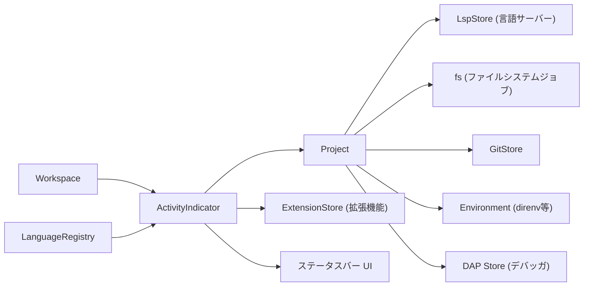
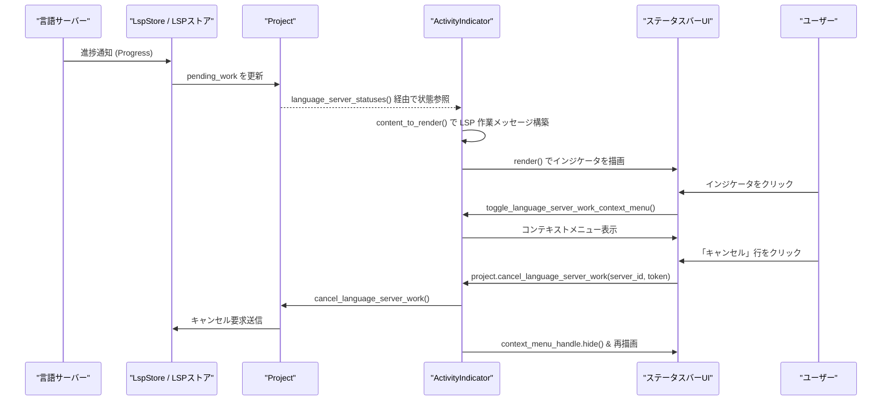

# activity_indicator ディレクトリ コード解説

## 1. ざっくり一言

`activity_indicator` は、言語サーバー・Git・ファイルシステム・フォーマッタ・拡張機能など、エディタ内部のバックグラウンド処理の進捗やエラーを 1 箇所に集約して、ステータスバーに表示するためのモジュールです。

---

## 2. このモジュールの役割

### 2.1 概要

- このモジュールは **「プロジェクト全体のバックグラウンド活動やエラーをユーザに見える形で提示する」** ために存在します。
- `ActivityIndicator` コンポーネントが、`Project` や `LanguageRegistry`、`ExtensionStore` 等からイベントを購読し、
  - 進捗（LSP の処理・Git 操作・FS 操作・拡張機能インストールなど）
  - エラー（環境エラー、言語サーバーの失敗、フォーマット失敗など）
  を優先度付きで 1 つのメッセージ + アイコンとして決定します。
- 決定したメッセージはステータスバーに表示され、クリックやコンテキストメニューからログ表示やキャンセルなどの操作ができます。

### 2.2 アーキテクチャ内での位置づけ

このディレクトリには 1 ファイルだけですが、`ActivityIndicator` は複数の外部コンポーネントと連携しています。主な依存関係を Mermaid 図で示します。



- `Workspace`  
  ステータスバーに `ActivityIndicator` を組み込む側です。このチャンクには実装はありませんが、`ActivityIndicator::new` が `Workspace` から呼び出される構造になっています。
- `Project`  
  開いているプロジェクトの状態（LSP、Git、環境、デバッガなど）を管理し、`Entity<Project>` 経由で `ActivityIndicator` から参照されています。
- `LanguageRegistry`  
  言語サーバーバイナリの状態（ダウンロード中・更新確認中・失敗等）をストリームとして提供します。
- `ExtensionStore`  
  拡張機能のインストール／アップグレード／削除中の状態を提供します。
- `StatusBar UI`  
  `Render` 実装と `StatusItemView` 実装を通じて、`ActivityIndicator` がステータスバー上の 1 アイテムとして描画されます。

### 2.3 設計上のポイント

コードから読み取れる設計上の特徴を箇条書きでまとめます。

- **イベント駆動・購読型**
  - `LanguageRegistry`・`Project`（LSP、環境、Git、fs）・`ExtensionStore` からイベント／ストリームを購読し、内部状態を更新して `cx.notify()` で再描画をトリガーします。
- **状態の集約と優先順位付け**
  - `content_to_render` 内で複数種類の状態をチェックし、優先度の高いものから順に表示を決定しています（環境エラー → LSP 進捗 → DAP → Git → FS → 言語サーバーバイナリ状態 → フォーマット失敗 → LSP のヘルス → 拡張機能操作）。
- **UI とロジックの分離**
  - 「何を表示するか」を `Content` 構造体で表現し、`Render::render` ではその `Content` を元に UI ツリー（`PopoverMenu`, `ButtonLike`, `Label`, `Icon` など）を構築する構造になっています。
- **非同期処理との統合**
  - `cx.spawn` / `cx.spawn_in` でバックグラウンドタスクを起動し、非同期ストリームを監視しながら UI を更新します。
- **簡易なメモリ最適化**
  - `SmallVec` を用いて、少数の要素が多いと想定されるコレクション（LSP の pending work やステータス一覧）でヒープ確保を抑える構造になっています。

---

## 3. 主要な機能一覧

このモジュールが提供する主な機能を列挙します。

- 環境エラー表示: `ProjectEnvironmentEvent::ErrorsUpdated` に応じて、direnv 等の環境エラーをステータスバーにアイコン付きで表示し、クリックでログビューを開く。
- 言語サーバーの進捗表示: `language_server_statuses` と LSP ストアのイベントから、進行中の LSP 処理（解析、インデックス作成など）をまとめて表示。
- LSP 作業のキャンセル UI: ステータスのポップオーバーメニュー内に pending work の一覧を出し、キャンセル可能なものにはキャンセルボタンを付与。
- デバッガ(DAP) セッションの起動待ち表示: 未開始のデバッグセッションがあれば、「Debug: ...」と表示し、ユーザに待機中であることを通知。
- Git 操作の進捗表示: `Repository::current_job` から現在実行中の Git ジョブを取得し、長時間実行中の操作をステータスバーに表示。
- ファイルシステムジョブの進捗表示: `fs::JobEvent` を監視し、長時間実行中の fs ジョブを表示。
- 言語サーバーバイナリのダウンロード・更新・失敗表示:
  - ダウンロード中: "Downloading ...", 
  - 更新確認中: "Checking for updates to ...", 
  - 起動失敗: "Failed to run .... Click to show error."
- 言語サーバーのヘルス(健康状態)表示: `ServerHealth`（Ok/Warning/Error）とメッセージを 1 行に整形して表示し、必要に応じてツールチップや詳細表示を提供。
- フォーマット失敗の通知: `Project::last_formatting_failure` を参照し、「Formatting failed: ...」メッセージとログビューへの導線を表示。
- 拡張機能の操作の進捗表示: `ExtensionStore` から拡張機能の Install/Upgrade/Remove 中であることを表示。
- エラー詳細の表示エディタ起動: `ShowErrorMessage` アクションで、言語サーバーのエラーメッセージを専用エディタバッファに表示。

---

## 4. 関数・構造体の解説

### 4.1 型一覧（構造体・列挙体など）

| 名前 | 種別 | 役割 / 用途 |
|------|------|-------------|
| `Event` | `enum` | `ActivityIndicator` から外部へ通知する内部イベント。現在は言語サーバーのステータスメッセージ表示用の `ShowStatus` のみ。 |
| `ActivityIndicator` | 構造体 | ステータスバーに表示される「活動インジケータ」の本体。各種ストアを購読し、表示内容を決める。 |
| `ServerStatus` | 構造体(内部) | 1 つの言語サーバーに対する最新の `LanguageServerStatusUpdate`（バイナリ状態またはヘルス）を保持。 |
| `PendingWork<'a>` | 構造体(内部) | 1 つの言語サーバーの pending な LSP 作業を表現するビュー構造体。ID とトークン・進捗を束ねる。 |
| `Content` | 構造体(内部) | 現在ステータスバーに表示すべきコンテンツ（アイコン、メッセージ文字列、クリック時ハンドラ、ツールチップ）を表す中間表現。 |

補助的な定数:

- `const GIT_OPERATION_DELAY: Duration = Duration::from_millis(0);`  
  Git / FS ジョブを「長時間実行中」とみなすまでの待ち時間。現在は 0ms なので即時表示されます。
- `const MAX_MESSAGE_LEN: usize = 50;`  
  ステータスメッセージを表示する際の最大文字数。これを超える場合は `truncate_and_trailoff` で省略表示されます。

---

### 4.2 関数詳細（重要なもの）

#### `ActivityIndicator::new(workspace: &mut Workspace, languages: Arc<LanguageRegistry>, window: &mut Window, cx: &mut Context<Workspace>) -> Entity<ActivityIndicator>`

**概要**

- `ActivityIndicator` のインスタンスを生成し、各種ストアへの購読やバックグラウンドタスクの起動、イベントハンドラの登録を行います。
- 戻り値は UI フレームワークの `Entity<ActivityIndicator>` で、以後 UI システムからライフサイクル管理されます。

**引数**

| 引数名 | 型 | 説明 |
|--------|----|------|
| `workspace` | `&mut Workspace` | 現在のワークスペースオブジェクト。内部から `project()` などを通じて `Project` を取得します。 |
| `languages` | `Arc<LanguageRegistry>` | 使用中の言語レジストリ。言語サーバーバイナリの状態ストリームを取得するために使用します。 |
| `window` | `&mut Window` | 現在のウィンドウ。内部で `cx.subscribe_in` に渡され、イベントハンドラをバインドするのに使用します。 |
| `cx` | `&mut Context<Workspace>` | `Workspace` 用の gpui コンテキスト。新しい `Entity` の生成や非同期タスクの起動、購読の登録に使用します。 |

**戻り値**

- `Entity<ActivityIndicator>`  
  UI ツリー中に登録される `ActivityIndicator` インスタンスへのハンドルです。

**内部処理の流れ**

1. `workspace.project()` から `Entity<Project>` を取得し、`project` 変数に保持します。
2. `cx.new(|cx| { ... })` で `ActivityIndicator` エンティティを生成します。このクロージャの中で以下を行います。
   - `languages.language_server_binary_statuses()` を呼び出し、言語サーバーバイナリ状態のストリームを取得。
   - `cx.spawn` で非同期タスクを起動し、ストリームを監視しながら `statuses` ベクタを更新し、`cx.notify()` で描画更新をトリガー。
   - `project.read(cx).fs()` から fs ストアを取得し、`fs.subscribe_to_jobs()` で fs ジョブイベントを購読。
     - 別の `cx.spawn` でジョブ開始／完了イベントを受け取り、`fs_jobs` ベクタを更新して `cx.notify()`。
   - `project.read(cx).lsp_store()` に対して `cx.subscribe` を行い、`LspStoreEvent::LanguageServerUpdate` を受け取る。
     - `proto` メッセージから `LanguageServerStatusUpdate`（`BinaryStatus` または `ServerHealth`）に変換し、`statuses` を更新。
   - `project.read(cx).environment().clone()` に対して `cx.subscribe` し、`ProjectEnvironmentEvent::ErrorsUpdated` を受け取ったら `cx.notify()`。
   - `project.read(cx).git_store().clone()` に対して `cx.subscribe` し、`GitStoreEvent::JobsUpdated` で `cx.notify()`。
   - `ActivityIndicator` 本体のフィールド（`statuses`, `project`, `context_menu_handle`, `fs_jobs`）を初期化。
3. `cx.subscribe_in(&this, window, move |_, _, event, window, cx| { ... })` を使って、`ActivityIndicator` が発行する `Event`（現在は `Event::ShowStatus`）をウィンドウに紐づけて購読。
   - `ShowStatus` を受け取ると、`Project` から新しいバッファを生成し、エラーメッセージを書き込み、読み取り専用エディタを開く処理を `cx.spawn_in(window, async move ...)` で実行します。
4. 最後に生成した `Entity<ActivityIndicator>` を返します。

**Examples（使用例）**

`Workspace` 初期化時に `ActivityIndicator` を作成する典型的な流れのイメージです（呼び出し側のステータスバー登録処理はこのチャンクにはありません）。

```rust
use std::sync::Arc;
use language::LanguageRegistry;
use workspace::Workspace;
use gpui::{Window, Context};
use activity_indicator::ActivityIndicator;

// Workspace 内部などのメソッド想定
fn init_status_items(
    workspace: &mut Workspace,                        // ワークスペース
    languages: Arc<LanguageRegistry>,                 // 言語レジストリ
    window: &mut Window,                              // ウィンドウ
    cx: &mut Context<Workspace>,                      // Workspace 用コンテキスト
) {
    // ActivityIndicator エンティティを生成する
    let activity_indicator = ActivityIndicator::new(workspace, languages, window, cx);

    // ここで `activity_indicator` をステータスバーに登録する処理が別モジュール側に存在しますが、
    // このチャンクには定義がないため詳細は不明です。
}
```

**Errors / Panics**

- 関数自体は `Result` を返さず、明示的なエラーはありません。
- 非同期タスク内で `this.update(...)` が `?` で呼ばれていますが、失敗時は `anyhow::Ok(())` でタスクを終了する形です。ここから先のエラー処理の詳細は gpui の挙動に依存し、このチャンクからは分かりません。

**Edge cases（エッジケース）**

- `languages.language_server_binary_statuses()` や `fs.subscribe_to_jobs()` が空のストリームを返す場合：
  - ループはすぐに終了し、その後の更新は行われません。その場合 `ActivityIndicator` は他のソース（LSP ストア、環境、Git など）のみを表示対象とします。
- `LspStoreEvent::LanguageServerUpdate` に `name` が `None` のものや、`proto::ServerBinaryStatus::from_i32` / `proto::ServerHealth::from_i32` に失敗する値が含まれている場合：
  - そのイベントは無視され、ステータスには反映されません。

**使用上の注意点**

- `ActivityIndicator::new` は `Workspace` 用の `Context<Workspace>` 上で呼び出す前提のコードになっているため、他のコンテキストから呼ぶとコンパイルできません。
- 渡す `LanguageRegistry` や `Project`（`workspace.project()`）は、UI 全体と同じライフサイクルで利用されるものを渡す必要があります。短命なローカル `Project` を作成して渡すような使い方は意図されていません。

---

#### `ActivityIndicator::content_to_render(&mut self, cx: &mut Context<Self>) -> Option<Content>`

**概要**

- 現在の `ActivityIndicator` の状態（プロジェクト・LSP・環境・Git・fs・拡張機能など）から、ステータスバーに **今表示すべき 1 件のメッセージ** を決定し、`Content` として返します。
- 何も表示すべき内容がなければ `None` を返します。

**引数**

| 引数名 | 型 | 説明 |
|--------|----|------|
| `cx` | `&mut Context<Self>` | `ActivityIndicator` 自身用の gpui コンテキスト。`project` などの `Entity` から読み取り・更新を行うのに使用します。 |

**戻り値**

- `Option<Content>`  
  - `Some(Content)` の場合: 表示アイコン・メッセージ・クリックハンドラ・ツールチップの情報。
  - `None` の場合: ステータスバーには `ActivityIndicator` の表示は何も出ません。

**内部処理の流れ（優先順位）**

1. **環境エラー（direnv 等）**
   - `pending_environment_error(cx)` で環境エラーがあるか確認。
   - あれば Warning アイコンとエラーメッセージを表示。
   - クリック時: 環境エラーを `pop_environment_error` で取り除き、`workspace::OpenLog` アクションでログビューを開きます。

2. **言語サーバーの pending work**
   - `pending_language_server_work(cx)` の最初の要素を取得。
   - メッセージは `progress.title.unwrap_or(progress_token.to_string())` をベースに、`percentage` や `message` を追記し、さらに残件数があれば `" + N more"` を付与。
   - アイコンは回転アニメーション付きの `ArrowCircle`。
   - クリック時: `toggle_language_server_work_context_menu` でコンテキストメニュー（詳細一覧）を表示。

3. **DAP（デバッガ）セッションの起動待ち**
   - `project.read(cx).dap_store().read(cx).sessions()` から、`is_started()` が `false` のセッションを探索。
   - 見つかれば `"Debug: {adapter}"` をメッセージにし、回転アイコン付きで表示。
   - `label()` があればツールチップとして表示。
   - クリックハンドラは持ちません。

4. **Git の長時間ジョブ**
   - `active_repository(cx)` から現在のリポジトリを取得し、`Repository::current_job` でジョブ情報を取得。
   - `job.start` から `GIT_OPERATION_DELAY` 以上経過していれば、ジョブメッセージを表示（現在の遅延は 0ms なので、現在は即時表示になります）。
   - アイコンは回転 `ArrowCircle`。クリックハンドラはなし。

5. **fs（ファイルシステム）ジョブ**
   - `self.fs_jobs` に保存されたジョブのうち、開始時刻から `GIT_OPERATION_DELAY` 以上経過したものを探し、最初に見つかったものを表示。
   - アイコンは回転 `ArrowCircle`。クリックハンドラはなし。

6. **言語サーバーバイナリ・ヘルス状態**
   - `self.statuses` を走査し、以下の情報を分類:
     - `Downloading` → `downloading` リスト
     - `CheckingForUpdate` → `checking_for_update` リスト
     - `Failed` → `failed` リスト
     - `Health(...)` → メッセージ付きなら `health_messages` リストへ、メッセージなしや `Stopped` は `servers_to_clear_statuses` に追加（後で削除）
   - `servers_to_clear_statuses` に含まれるサーバーのステータスを `self.statuses` から削除。
   - 優先度順にコンテンツを決定:
     1. `downloading` があれば `"Downloading ..."` を Download アイコンで表示（クリックで該当ステータスを削除し、`dismiss_message` を呼び出し）。
     2. `checking_for_update` があれば `"Checking for updates to ..."` を表示（同様にクリックでステータス削除 + `dismiss_message`）。
     3. `failed` があれば `"Failed to run .... Click to show error."` を Warning アイコンで表示（クリックで `show_error_message` を実行）。

7. **フォーマット失敗**
   - `project.read(cx).last_formatting_failure(cx)` が `Some(failure)` の場合:
     - `"Formatting failed: {failure}. Click to see logs."` を Warning アイコン付きで表示。
     - クリックで `reset_last_formatting_failure` を呼び、`workspace::OpenLog` でログを開きます。

8. **言語サーバーのヘルスメッセージ**
   - `health_messages`（サーバー名・ヘルス・メッセージのタプル）の中から、`ServerHealth::Error` > `Warning` > `Ok` の優先度で 1 件を選択。
   - メッセージは以下を行った上で表示:
     - 各行を `trim` して空行を除去し、スペースで結合（1 行に整形）。
     - `MAX_MESSAGE_LEN - health_str.len()` を上限に `truncate_and_trailoff` で切り詰め。
     - 元のメッセージから変化があれば `tooltip_message` に完全版を保持。
   - クリック時の挙動:
     - メッセージが省略・整形されている場合 (`altered_message == true`) は `show_error_message` を呼び出して詳細をエディタに表示。
     - そうでない場合は対応する `ServerStatus` を `self.statuses` から削除し、`cx.notify()` で表示を消去。

9. **拡張機能操作**
   - `ExtensionStore::try_global(cx)` からグローバルな拡張機能ストアを取得し、`outstanding_operations().iter().next()` で最初の操作を取得。
   - 操作の種類に応じてメッセージとアイコンを決定:
     - `Install` → `"Installing {extension_id} extension…"`（回転 `LoadCircle` アイコン）
     - `Upgrade` → `"Updating {extension_id} extension…"`（`Download` アイコン）
     - `Remove` → `"Removing {extension_id} extension…"`（回転 `LoadCircle` アイコン）
   - クリック時: `DismissMessage` のデフォルト値を渡して `dismiss_message` を呼びます（フォーマット失敗メッセージなどを消すのに利用されます）。

10. どれにも該当しない場合は `None` を返し、インジケータは非表示となります。

**Edge cases（エッジケース）**

- 複数種類の状態が同時に存在する場合でも、上記の順番で **1 つだけ** が表示されます。
- `GIT_OPERATION_DELAY` が 0 のため、Git / FS ジョブは開始直後から対象になります。遅延表示を期待するコードではない点に注意が必要です。
- 言語サーバーのヘルスメッセージが非常に長い場合:
  - ステータスバーには切り詰められた 1 行だけが表示され、完全なメッセージはツールチップまたは `show_error_message` による別エディタで確認する形になります。

**使用上の注意点**

- `content_to_render` は `render()` 内から毎回呼ばれるため、重い処理は行わず、`Project` や `ExtensionStore` からの読み取りのみを行うように設計されています。
- `self.statuses` をこの関数内で更新（クリア）しているため、外部から `statuses` に依存したロジックを追加する場合は、この関数の影響を考慮する必要があります。

---

#### `ActivityIndicator::pending_language_server_work<'a>(&self, cx: &'a App) -> impl Iterator<Item = PendingWork<'a>>`

**概要**

- `Project` が持つ言語サーバーの状態から、各サーバーの pending な LSP 作業を集約し、**新しい順** に列挙するイテレータを返します。
- ステータスバーの表示用だけでなく、コンテキストメニューに表示する作業一覧にも使用されます。

**引数**

| 引数名 | 型 | 説明 |
|--------|----|------|
| `cx` | `&'a App` | アプリケーション全体の gpui コンテキスト。`project.read(cx)` を行うために使用します。 |

**戻り値**

- `impl Iterator<Item = PendingWork<'a>>`  
  各要素には以下が含まれます:
  - `language_server_id: LanguageServerId`
  - `progress_token: &'a ProgressToken`
  - `progress: &'a LanguageServerProgress`

**内部処理の流れ**

1. `self.project.read(cx).language_server_statuses(cx)` を呼び出し、(server_id, status) のペアを得ます。
2. `.rev()` を呼んで逆順にし、最近追加されたサーバー状態が先に来るようにします（元の順序はこのチャンクからは不明ですが）。
3. `filter_map` で `status.pending_work.is_empty()` なものを除外し、pending work があるサーバーだけを対象にします。
4. サーバーごとの pending work マップから `(progress_token, progress)` のペアを `SmallVec<[_; 4]>` に詰めます。
5. `pending_work.sort_by_key(|work| Reverse(work.progress.last_update_at));` で、各サーバー内の作業を `last_update_at` の降順（最新が先）にソートします。
6. 最終的に `.flatten()` によって、全サーバー・全作業のイテレータとして返します。

**Examples（使用例）**

コンテキストメニュー以外で、pending work を列挙してログ出力するイメージ例です。

```rust
use gpui::App;
use activity_indicator::ActivityIndicator;

// `activity_indicator` はどこかで生成された Entity から取得した参照だとする
fn log_pending_work(indicator: &ActivityIndicator, app: &App) {
    // pending な作業を新しい順に列挙する
    for work in indicator.pending_language_server_work(app) {
        let title = work
            .progress
            .title
            .clone()
            .unwrap_or(work.progress_token.to_string());

        // 実際には log 出力などに使う想定
        println!(
            "Server {:?}: pending work '{}'",
            work.language_server_id, title
        );
    }
}
```

**Edge cases（エッジケース）**

- どの言語サーバーにも pending work がない場合:
  - イテレータは空になり、`next()` はすぐに `None` を返します。
- 同一サーバーで複数の pending work がある場合:
  - そのサーバー内では `last_update_at` が新しい順に並びますが、サーバー間の順序は `language_server_statuses(cx)` と `.rev()` に依存します。

**使用上の注意点**

- 返される `PendingWork` は `&App` と `Project` 内部のデータを参照しているため、イテレータの寿命は `cx` と `Project` のライフタイムに制約されます。
- `ActivityIndicator` 自身が `status` をクリアする処理（`content_to_render` 内）を持っているため、「いつ呼ぶか」によって取得できる項目が変わります。

---

#### `ActivityIndicator::show_error_message(&mut self, _: &ShowErrorMessage, _: &mut Window, cx: &mut Context<Self>)`

**概要**

- 言語サーバー関連のエラーを 1 件選び、`Event::ShowStatus` を発行して詳細をエディタに表示するトリガーとなるハンドラです。
- `actions!` マクロで定義された `ShowErrorMessage` アクションに紐付けて使われます。

**引数**

| 引数名 | 型 | 説明 |
|--------|----|------|
| `_` | `&ShowErrorMessage` | アクションのペイロード。中身は使用していません。 |
| `_` | `&mut Window` | ウィンドウオブジェクト。ここでは直接は使用していません。 |
| `cx` | `&mut Context<Self>` | `ActivityIndicator` 用コンテキスト。内部イベントの発行に使用します。 |

**戻り値**

- なし（`()`）。副作用として `self.statuses` の内容が変化し、`Event::ShowStatus` が発行されます。

**内部処理の流れ**

1. `status_message_shown` フラグを `false` で初期化します。
2. `self.statuses.retain(|status| match &status.status { ... })` を使用して、エラーメッセージ表示対象を 1 件だけ選んだ上で、表示済みのステータスを削除します。
   - `LanguageServerStatusUpdate::Binary(BinaryStatus::Failed { error })` かつ `status_message_shown == false`:
     - `cx.emit(Event::ShowStatus { server_name: status.name.clone(), status: SharedString::from(error) })` を発行。
     - `status_message_shown = true` にして、`false` を返す（`retain` によりこのステータスは削除）。
   - `LanguageServerStatusUpdate::Health(ServerHealth::Error | ServerHealth::Warning, Some(error))` かつ `status_message_shown == false`:
     - 同様に `Event::ShowStatus` を発行して削除。
   - `Health(..., None)` の場合:
     - メッセージがないため `false` を返し、ステータスを削除するだけで何も表示しません。
   - 上記以外（エラー以外）のステータス:
     - `true` を返して `self.statuses` に残します。

**Examples（使用例）**

`ShowErrorMessage` アクションを明示的に発行する単純なテストコード例です（実際にはキーボードショートカットやクリックなどから発行される想定です）。

```rust
use gpui::{Window, Context};
use activity_indicator::{ActivityIndicator, ShowErrorMessage};

// どこかの UI コードで
fn trigger_show_error(
    indicator: &mut ActivityIndicator,    // ActivityIndicator 本体
    window: &mut Window,                  // ウィンドウ
    cx: &mut Context<ActivityIndicator>,  // コンテキスト
) {
    let action = ShowErrorMessage;        // unit 構造体と仮定
    indicator.show_error_message(&action, window, cx);
    // エラーが 1 件でもあれば、別エディタで詳細が表示されるイベントが発行されます。
}
```

**Edge cases（エッジケース）**

- `self.statuses` にエラーが 1 件もない場合:
  - ループは全て `true` を返すか、`false` を返しても `status_message_shown` が変更されないため、`Event::ShowStatus` は発行されません。
- 複数のエラーがある場合:
  - 一度の呼び出しで表示されるのは最初の 1 件だけで、表示済みのものは `retain` によって削除されます。

**使用上の注意点**

- この関数は `Event::ShowStatus` を発行するだけであり、エディタを開く処理は `ActivityIndicator::new` 内で登録されたイベントハンドラが担当します（`cx.subscribe_in` 部分）。
- 同じエラーを繰り返し表示したい場合は、`self.statuses` を再度追加する必要があります。

---

#### `ActivityIndicator::dismiss_message(&mut self, _: &DismissMessage, _: &mut Window, cx: &mut Context<Self>)`

**概要**

- `Project` が保持している「最後のフォーマット失敗メッセージ」をクリアするハンドラです。
- `auto_update::DismissMessage` アクションに紐付いており、一部のステータスメッセージの「閉じる」操作で呼ばれます。

**引数**

| 引数名 | 型 | 説明 |
|--------|----|------|
| `_` | `&DismissMessage` | アクションのペイロード。ここでは内容は使用していません。 |
| `_` | `&mut Window` | ウィンドウ。ここでは使用していません。 |
| `cx` | `&mut Context<Self>` | `ActivityIndicator` 用コンテキスト。`Project` の更新に使用します。 |

**戻り値**

- なし。ただし内部の `project.update(...)` は `bool` を返しますが、その戻り値は呼び出し元では利用していません。

**内部処理の流れ**

1. `self.project.update(cx, |project, cx| { ... })` で `Project` をミュータブルに取得。
2. `project.last_formatting_failure(cx)` をチェック。
   - `Some(_)` の場合: `project.reset_last_formatting_failure(cx);` を呼び出してエラーをリセットし、`true` を返す。
   - `None` の場合: 何もせず `false` を返す。

**Examples（使用例）**

拡張機能インストールメッセージなどから呼び出している例（本モジュール内の実際のコード）:

```rust
on_click: Some(Arc::new(|this, window, cx| {
    // DismissMessage のデフォルト値を渡してメッセージを消す
    this.dismiss_message(&Default::default(), window, cx)
})),
```

**Edge cases（エッジケース）**

- 直前にフォーマットエラーが発生していない場合（`last_formatting_failure == None`）でも安全に呼び出せます。この場合は何も変更されません。

**使用上の注意点**

- 現状の実装では、「ダウンロード中」「更新確認中」のステータスをクリックした際にも `dismiss_message` が呼ばれていますが、`Project` 側でフォーマット失敗以外のメッセージもここで扱っているかどうかは、このチャンクからは判断できません。
- `dismiss_message` は `ActivityIndicator` 内の `statuses` には直接触れていないため、表示中のバイナリステータスを消すには別途 `self.statuses.retain(...)` 等が必要です（実際には呼び出し元で行われています）。

---

#### `ActivityIndicator::toggle_language_server_work_context_menu(&mut self, window: &mut Window, cx: &mut Context<Self>)`

**概要**

- 言語サーバーの pending work 一覧を表示するコンテキストメニュー（ポップオーバー）の表示／非表示をトグルするためのハンドラです。
- ステータスバー上のインジケータをクリックしたとき（pending work がある場合）に実行されます。

**引数**

| 引数名 | 型 | 説明 |
|--------|----|------|
| `window` | `&mut Window` | ウィンドウ。`PopoverMenuHandle::toggle` に渡されます（このチャンクでは直接は見えませんが、`toggle` のシグネチャから間接的に使用されます）。 |
| `cx` | `&mut Context<Self>` | `ActivityIndicator` 用コンテキスト。ポップオーバーメニューの状態更新に使用します。 |

**戻り値**

- なし。

**内部処理の流れ**

1. `self.context_menu_handle.toggle(window, cx);` を呼ぶだけです。
   - `context_menu_handle` は `PopoverMenuHandle<ContextMenu>` 型で、`Render::render` 内の `PopoverMenu::new("activity-indicator-popover")` と連携しています。
   - `toggle` はポップオーバーが開いていなければ開き、開いていれば閉じる動作を行うものと推測されますが、詳細な実装はこのチャンクにはありません。

**Examples（使用例）**

本モジュール内では `Content` の `on_click` として直接利用されています。

```rust
return Some(Content {
    icon: Some(
        Icon::new(IconName::ArrowCircle)
            .size(IconSize::Small)
            .with_rotate_animation(2)
            .into_any_element(),
    ),
    message,
    on_click: Some(Arc::new(Self::toggle_language_server_work_context_menu)),
    tooltip_message: None,
});
```

**使用上の注意点**

- `toggle_language_server_work_context_menu` はポップオーバーの内容自体（メニュー項目）を構築しません。内容は `Render::render` 内の `PopoverMenu::menu` 部分で `pending_language_server_work` を用いて構築されます。
- pending work が 1 件もない場合、`menu` クロージャは `has_work.then_some(menu)` により `None` を返すため、トグルしてもメニューは表示されません。

---

#### `impl Render for ActivityIndicator { fn render(&mut self, _window: &mut Window, cx: &mut Context<Self>) -> impl IntoElement }`

**概要**

- `ActivityIndicator` をステータスバー上の UI 要素として描画するためのメソッドです。
- `content_to_render` が返す `Content` を元に、アイコン・メッセージ・ツールチップ・ポップオーバーメニュー付きのボタンを構築します。

**引数**

| 引数名 | 型 | 説明 |
|--------|----|------|
| `_window` | `&mut Window` | ウィンドウ。ここでは直接使っていません。 |
| `cx` | `&mut Context<Self>` | `ActivityIndicator` 用コンテキスト。`listener` の生成や `entity().downgrade()` に使用します。 |

**戻り値**

- `impl IntoElement`  
  gpui における UI 要素ツリー（`h_flex`, `PopoverMenu`, `ButtonLike`, `Label`, `Icon` 等から成る）を表します。

**内部処理の流れ**

1. ベースとなるコンテナを作成:
   - `h_flex().id("activity-indicator")` で水平フレックスコンテナを作成。
   - `.on_action(cx.listener(Self::show_error_message))`
   - `.on_action(cx.listener(Self::dismiss_message))`  
     グローバルアクション `ShowErrorMessage` および `DismissMessage` に対するリスナを登録。

2. `self.content_to_render(cx)` を呼び出し、表示すべき `Content` を取得。
   - `None` の場合: ここまで作った空のコンテナをそのまま返して終了。

3. `Some(content)` の場合:
   - `let activity_indicator = cx.entity().downgrade();` で自身の `Entity<ActivityIndicator>` の弱参照を取得（ポップオーバーメニュー内で使用）。
   - `truncate_content` を `content.message.len() > MAX_MESSAGE_LEN` で判定。
   - `PopoverMenu::new("activity-indicator-popover")` を作成し、`.trigger(...)` でトリガーボタンを定義。

4. トリガーボタンの構築:
   - `ButtonLike::new("activity-indicator-trigger")` の子として
     - `h_flex().id("activity-indicator-status").gap_2()`
       - `.children(content.icon)` でアイコンを追加（存在すれば）。
       - `.map(|button| { ... })` でメッセージ用 `Label` とツールチップを付与:
         - 長いメッセージ (`truncate_content == true`) の場合:
           - `truncate_and_trailoff(&content.message, MAX_MESSAGE_LEN)` による省略版を表示。
           - 完全なメッセージをツールチップに表示。
         - そうでない場合:
           - メッセージをそのまま表示。
           - `content.tooltip_message` があればツールチップとして利用。
       - `.when_some(content.on_click, |this, handler| { ... })` でクリックハンドラを登録。
         - `cx.listener(move |this, _, window, cx| { handler(this, window, cx); })` によって `Content` に格納された `Arc<dyn Fn>` を呼び出し。
         - `.cursor(CursorStyle::PointingHand)` でマウスカーソルをポインタに変更。

5. ポップオーバーメニューの内容:
   - `.menu(move |window, cx| { ... })` でメニューを構築。
   - `let strong_this = activity_indicator.upgrade()?;` で `ActivityIndicator` の強参照を取得できない場合は `None` を返して終了。
   - `ContextMenu::build(window, cx, |mut menu, _, cx| { ... })` の中で `pending_language_server_work(cx)` を列挙:
     - 各 `work` について:
       - タイトルは `progress.title.unwrap_or(progress_token.to_string())`。
       - `progress.is_cancellable == true` の場合:
         - `custom_entry` でラベル + `XCircle` アイコンを持つ行を作成し、クリックで `project.cancel_language_server_work(language_server_id, Some(token), cx)` を呼び出す。
         - キャンセル後、`context_menu_handle.hide(cx)` と `cx.notify()` でメニューを閉じて再描画。
       - キャンセル不可の場合:
         - `progress.message` があれば `": message"` をタイトルに追加し、`menu.label(title)` としてラベルだけの行を追加。
   - ループ中に 1 件以上 pending work があった場合に `has_work = true` となり、最後に `has_work.then_some(menu)` で `Some(menu)` を返す。pending work がなければ `None` になり、メニューは表示されません。

**Edge cases（エッジケース）**

- `content_to_render` が `None` の場合:
  - インジケータの領域は生成されますが、中身は空となります（スタイルや ID に依存する別のレイアウトロジックがある場合のために存在していると考えられます）。
- `activity_indicator.upgrade()` が失敗した場合（エンティティが既に破棄されている場合など）:
  - メニューは `None` を返して表示されません。

**使用上の注意点**

- `Render::render` は頻繁に呼ばれるため、ここでの処理は `content_to_render` の結果を使った UI 構築のみに留められています。重い計算やストアの更新は `content_to_render` や購読ハンドラ側で行う構成です。
- `ContextMenu` 内のクロージャでは `activity_indicator.update(...)` を呼び出し、さらにその中で `project.update(...)` を実行しています。このネスト構造を変更する場合は、gpui の再入可能性やロックの前後関係を考慮する必要があります（詳細はこのチャンクにはありません）。

---

### 4.3 その他の関数・実装

| 名前 | 種別 | 役割（1 行） |
|------|------|--------------|
| `fn pending_environment_error<'a>(&'a self, cx: &'a App) -> Option<&'a String>` | メソッド | `Project` の環境エラー（`peek_environment_error`）を参照し、あれば最古のものを返します。 |
| `impl EventEmitter<Event> for ActivityIndicator {}` | トレイト実装 | `ActivityIndicator` が `Event`（`ShowStatus`）を発行できるようにするためのマーカー実装です。 |
| `impl StatusItemView for ActivityIndicator { fn set_active_pane_item(...) { } }` | トレイト実装 | アクティブペインのアイテム変更通知を受け取るためのトレイト実装ですが、この実装では何も行っていません。 |

---

## 5. データフロー

ここでは、「言語サーバーの pending work の進捗がインジケータに表示され、ユーザがコンテキストメニューからキャンセルする」典型的なシナリオを説明します。

1. 言語サーバーがバックグラウンドでファイル解析などの処理を開始し、LSP 経由で進捗通知を送信します。
2. `LspStore` が進捗を受け取り、`Project` 内に `pending_work` として反映します。
3. `ActivityIndicator` は `pending_language_server_work(cx)` でこの pending work を検出し、`content_to_render` 内で「LSP 作業が進行中」であることを示すメッセージを構築します。
4. `Render::render` が呼ばれた際に、このメッセージがステータスバーに表示されます。
5. ユーザがインジケータをクリックすると、`toggle_language_server_work_context_menu` が呼ばれ、ポップオーバーメニューが表示されます。
6. メニューには pending work の一覧が表示され、キャンセル可能な作業には「×」アイコンが付いた行が表示されます。
7. ユーザが行をクリックすると、その作業がキャンセルされ、メニューは閉じられます。

この流れを Mermaid のシーケンス図で表します。



---

## 6. 使い方（How to Use）

### 6.1 基本的な使用方法

`ActivityIndicator` は `Workspace` のステータスバーアイテムとして利用されることを想定したコンポーネントです。このチャンクには、その登録処理は含まれていませんが、初期化から描画までの最小限の流れは次のようになります。

```rust
use std::sync::Arc;
use language::LanguageRegistry;
use workspace::Workspace;
use gpui::{Window, Context};
use activity_indicator::ActivityIndicator;

fn init_activity_indicator(
    workspace: &mut Workspace,               // 既存の Workspace
    languages: Arc<LanguageRegistry>,        // 利用中の LanguageRegistry
    window: &mut Window,                     // ウィンドウ
    cx: &mut Context<Workspace>,             // Workspace 用コンテキスト
) {
    // ActivityIndicator エンティティを生成する
    let activity_indicator = ActivityIndicator::new(workspace, languages, window, cx);

    // 以降、activity_indicator をステータスバーの一部として登録する処理が別モジュール側に存在すると考えられます。
    // （このチャンクには具体的な登録 API が登場しないため、詳細は不明です。）
}
```

`ActivityIndicator` 自体は `Render` と `StatusItemView` を実装しているため、ステータスバーに配置されれば UI フレームワークが `render()` を繰り返し呼び出し、内部の購読や非同期タスクが更新する状態に応じて表示が変化します。

### 6.2 よくある使用パターン

#### パターン1: 言語サーバーのエラーを明示的に表示させる

アクション `ShowErrorMessage` を発行して、最新の LSP エラーをエディタで確認する使い方です。実際にはキーボードショートカットやメニューアクションから呼び出される形になることが多いと考えられます。

```rust
use gpui::{Window, Context};
use activity_indicator::{ActivityIndicator, ShowErrorMessage};

// ActivityIndicator を保持しているコンポーネントから
fn show_last_lsp_error(
    indicator: &mut ActivityIndicator,        // ActivityIndicator
    window: &mut Window,                      // ウィンドウ
    cx: &mut Context<ActivityIndicator>,      // コンテキスト
) {
    let action = ShowErrorMessage;            // unit 構造体と仮定
    // 内部で Event::ShowStatus が emit され、
    // ActivityIndicator::new() で登録されたハンドラが専用エディタを開きます。
    indicator.show_error_message(&action, window, cx);
}
```

#### パターン2: pending LSP 作業の一覧をコンテキストメニューからキャンセル

これは `Render::render` および `toggle_language_server_work_context_menu` 内部に実装されていますが、外部からの視点では次のように振る舞います。

- ステータスバーを見ると `"(タイトル) (xx%) + N more"` といったメッセージが表示される。
- クリックすると pending work の一覧が表示され、キャンセル可能なものには「×」アイコンが付く。
- クリックした作業は `Project::cancel_language_server_work` によってキャンセルされる。

この挙動を変更したい場合は、本モジュールの

- `pending_language_server_work`
- `Render::render` のメニュー構築部 (`ContextMenu::build` 内)
を読みながら調整することになります。

### 6.3 よくある間違い（起こりうる誤用）

コードから推測できる範囲で、誤用しやすそうなポイントを列挙します。

```rust
// 誤りの例: ActivityIndicator を UI コンテキスト以外で生成しようとする
fn wrong_usage(
    workspace: &mut Workspace,
    languages: Arc<LanguageRegistry>,
) {
    // gpui::Context<Workspace> や Window を持たないため、コンパイルできない
    // let indicator = ActivityIndicator::new(workspace, languages, ???, ???);
}

// 正しい方向性: Workspace の UI 初期化処理の中で、適切な Context と Window を使う
fn correct_usage(
    workspace: &mut Workspace,
    languages: Arc<LanguageRegistry>,
    window: &mut Window,
    cx: &mut gpui::Context<Workspace>,
) {
    let _indicator = ActivityIndicator::new(workspace, languages, window, cx);
}
```

- **誤用例 1**: `ActivityIndicator::new` を `Context<Workspace>` のない場所から呼び出そうとする。
- **誤用例 2**: `ActivityIndicator` の状態（`statuses` や `fs_jobs`）を外部から直接いじり、`cx.notify()` を呼ばずに UI 更新を期待する。
  - このモジュールでは更新後に必ず `cx.notify()` を呼んでいます。外部から同様の変更を行う場合も `notify` が必要です。

### 6.4 使用上の注意点（まとめ）

- **コンテキストの種類に注意**  
  - `ActivityIndicator::new` は `Context<Workspace>` を要求し、`render` やイベントハンドラは `Context<ActivityIndicator>` を使用します。どのコンテキストで何ができるかを区別する必要があります。
- **状態の優先順位を把握する**  
  - `content_to_render` は様々な情報源（環境・LSP・DAP・Git・FS・拡張機能）から 1 件だけを選びます。新しい表示を追加する場合は、この優先順位との兼ね合いを検討する必要があります。
- **`statuses` の寿命とクリアタイミング**  
  - LSP のバイナリ状態やヘルスメッセージは、`content_to_render` や `show_error_message` の中で `retain` により削除されることがあります。外部から常に全件を参照できるとは限りません。
- **キャンセル処理の前提**  
  - コンテキストメニューから呼び出される `project.cancel_language_server_work` の前提や副作用は、このチャンクにはないため、変更や利用時には `Project` 側の実装も確認する必要があります。

---

## 7. 関連ファイル

このディレクトリおよび近接モジュールとの関係をまとめます。

| パス | 役割 / 関係 |
|------|------------|
| `activity_indicator/Cargo.toml` | このクレートのメタデータと依存関係を定義します。`editor`, `project`, `workspace`, `language`, `extension_host`, `fs`, `gpui`, `ui`, `util` など、本モジュールが利用する外部クレートが列挙されています。 |
| `activity_indicator/src/activity_indicator.rs` | 本レポートで解説した `ActivityIndicator` 本体の実装ファイルです。 |
| `project` クレート（別ディレクトリ） | `Project`, `LspStoreEvent`, `LanguageServerProgress`, `ProgressToken`, `ProjectEnvironmentEvent`, `git_store::GitStoreEvent`, `Repository` など、本モジュールが状態を読み書きするドメインロジックを提供します。 |
| `workspace` クレート（別ディレクトリ） | `Workspace`, `StatusItemView`, `Workspace::OpenLog` アクションなど、ステータスバーの枠組みとログビュー表示などの周辺機能を提供します。 |
| `language` クレート（別ディレクトリ） | `LanguageRegistry`, `LanguageServerStatusUpdate`, `BinaryStatus`, `ServerHealth` など、言語サーバー関連の型と API を定義します。 |
| `extension_host` クレート（別ディレクトリ） | `ExtensionStore`, `ExtensionOperation` を介して拡張機能のインストール・アップデート・削除操作の状態を提供します。 |
| `fs` クレート（別ディレクトリ） | `JobInfo`, `JobEvent` 等を通じてファイルシステムジョブの開始／完了イベントを提供します。 |
| `util::truncate_and_trailoff`（別モジュール） | 長いメッセージを `MAX_MESSAGE_LEN` に収まるように切り詰め、末尾に省略記号を付けるユーティリティ関数を提供します。 |

このチャンクにはテストコードやステータスバーへの登録処理は含まれていないため、`ActivityIndicator` を実際にどのように Workspace に組み込んでいるかは、`workspace` クレート側のコードを併せて確認する必要があります。
