# agent/ ディレクトリ コード解説（chunk 1/8）

## 1. ざっくり一言

Zed の「エージェント」（対話型 AI アシスタント）の中核実装と、そのためのスレッド永続化・プロジェクトコンテキスト構築・編集用ストリーミングパーサなどをまとめたクレートです。

---

## 2. このモジュールの役割

### 2.1 概要

- `agent` クレートは、Zed 本体（UI）と LLM プロバイダ／ツール群の間に立つ **ネイティブエージェント** を実装します。
- エージェントごとに内部スレッド（会話履歴）を管理し、プロジェクト情報・ルールファイル・コンテキストサーバーのプロンプトなどを組み合わせて LLM に問い合わせます。
- 会話スレッドは SQLite ベースの `ThreadsDatabase` に保存され、再起動後も復元できます。
- `edit_agent` 以下には、モデルの出力（コードフェンス付き差分など）をストリーミングにパースするユーティリティや、その評価用フィクスチャが含まれます。

このチャンクには `thread.rs` や `tools/` など全体の一部しか含まれていないため、説明は見えているコードに基づく範囲に限定します。

### 2.2 アーキテクチャ内での位置づけ

ネイティブエージェント周りの主要コンポーネントと依存関係の概略です。

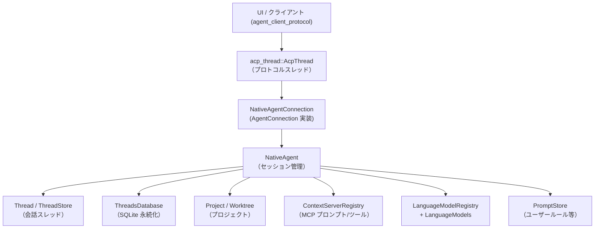

- UI 側は `acp_thread::AcpThread` を通じて `NativeAgentConnection` にリクエスト（プロンプト送信・モデル選択など）を行います。
- `NativeAgent` はセッション ID をキーに `Thread` と `AcpThread` を対応付け、プロジェクトごとの状態 (`ProjectState`) を維持します。
- `ThreadsDatabase` は各スレッドの内容を JSON + zstd 圧縮で SQLite に保存・読み込みします。
- `edit_agent` のパーサは、スレッド内のツール（編集エージェント）がモデルのストリーミング出力を安全に解釈するために使われます。

### 2.3 設計上のポイント

コードから読み取れる特徴を列挙します。

- **セッションとプロジェクトの分離**
  - `NativeAgent` は `sessions: HashMap<SessionId, Session>` と `projects: HashMap<EntityId, ProjectState>` を別々に持ち、1 プロジェクトに複数セッションが紐づく構造です。
  - プロジェクト固有のコンテキスト（`ProjectContext` / `ContextServerRegistry`）は `ProjectState` に集約されています。

- **gpui の Entity / Task ベースの非同期設計**
  - `Entity<T>` と `Context<T>` を用い、UI スレッド上のオブジェクトを安全に操作します。
  - 非同期処理は `cx.spawn` / `cx.background_spawn` が返す `Task` で表現され、`Shared<Task<_>>` による共有も行われます。
  - `watch::channel` で「コンテキスト再構築が必要」などのイベントを伝播させています。

- **モデル管理のキャッシュ**
  - `LanguageModels` が `LanguageModelRegistry` から利用可能なプロバイダやモデルを読み取り、`AgentModelList` にまとめてキャッシュします。
  - モデル一覧の変化は `watch::Receiver<()>` 経由で購読でき、model selector UI から利用されます。

- **ストレージ設計**
  - `ThreadsDatabase` は SQLite を薄くラップし、スキーマのマイグレーション（列追加）も自前で行います。
  - 頻繁に保存されるスレッド本体は JSON を zstd 圧縮 (`DataType::Zstd`) して BLOB として保存されます。
  - テストやステートレスモードではオンメモリ SQLite に切り替える分岐があります。

- **ストリーミングパーサ**
  - `CreateFileParser` / `EditParser` は、LLM からのストリーミング出力をチャンク単位で受け取りつつ、コードフェンスやタグに頑健に対応できるよう状態機械で実装されています。
  - `SmallVec` を使って小さいイベント配列をスタック上に確保し、オーバーヘッドを抑えています。

- **テスト・評価用フィクスチャ**
  - `edit_agent/evals/fixtures/**/before.rs` や `after.rs` は大きな Rust ファイルをそのまま含んでおり、編集エージェントの動作を実コードベースで検証する用途です。
  - これらはランタイム機能というよりテストデータです。

---

## 3. 主要な機能一覧

このチャンクに含まれるコードが提供する主な機能を列挙します。

- ネイティブエージェント本体
  - `NativeAgent`: プロジェクトごとのセッション管理、プロジェクトコンテキスト構築、スレッドの保存・読み込み。
  - `NativeAgentConnection`: `acp_thread::AgentConnection` / `AgentTelemetry` 実装として、UI 側と `NativeAgent` を橋渡し。
  - `NativeThreadEnvironment`: スレッドから端末ツールやサブエージェントを生成するための環境オブジェクト。

- モデル管理
  - `LanguageModels`: 利用可能な言語モデル一覧の構築・キャッシュ、モデル ID からの解決。
  - `NativeAgentModelSelector`: セッションごとのモデル選択 UI 用インターフェース。

- スレッド永続化
  - `DbThread` / `DbThreadMetadata` / `SharedThread`: スレッド本体、メタ情報、共有用スレッド形式のシリアライズ表現。
  - `ThreadsDatabase`: SQLite を使ったスレッドの保存・読み込み・削除・一覧取得。

- プロジェクトコンテキスト構築
  - Worktree ごとの `RulesFileContext` やユーザールール (`UserRulesContext`) を読み込み、`ProjectContext` を非同期に構築。
  - `.rules` / `.clinerules` などのルールファイルや `PromptStore` のデフォルトプロンプトを取り込む処理。

- プロンプト処理
  - `NativeAgentConnection::prompt`: ユーザープロンプトを受け取り、内部 `Thread` に渡して応答をストリーミングで UI 側へ反映。
  - `/server.prompt` のようなコマンド記法（`Command`）を解釈し、Context Server (MCP) のプロンプトを呼び出す。

- 編集エージェント用パーサ
  - `CreateFileParser`: 「```」で囲まれたコードブロックからファイル内容をストリーミング抽出。
  - `EditParser` / `XmlEditParser` / `DiffFencedEditParser`: `<old_text>/<new_text>` や diff フェンス形式の編集指示をストリーミングにパース。
  - `EditParserMetrics`: タグ数やミスマッチタグ数などのメトリクス収集。

- 評価用フィクスチャ
  - `edit_agent/evals/fixtures/**/before.rs` / `after.rs`: 編集ツールの評価に用いる入力コード・期待結果コード。
  - 大きな `disable_cursor_blinking/before.rs` は Zed のエディタ実装のスナップショットで、編集エージェントが特定の変更を適用できるかを検証する用途と考えられます（コードコメントから読み取れる範囲）。

---

## 4. 関数・構造体の解説

### 4.1 主な型一覧

| 名前 | 種別 | 定義場所 | 役割 / 用途 |
|------|------|----------|-------------|
| `ProjectSnapshot` | 構造体 | `agent.rs` | プロジェクトのワークツリースナップショットとタイムスタンプ。telemetry 用に使用されます。 |
| `RulesLoadingError` | 構造体 | `agent.rs` | ルールファイル読み込みエラーを UI に伝えるためのメッセージ。 |
| `ProjectState` | 構造体 | `agent.rs` | プロジェクトごとの `Project`, `ProjectContext`, `ContextServerRegistry` と watch チャネルを保持。 |
| `Session` | 構造体 | `agent.rs` | 1 セッションに対応する内部 `Thread` と `AcpThread`、所属プロジェクト ID 等をまとめた内部構造。 |
| `LanguageModels` | 構造体 | `agent.rs` | 利用可能な言語モデル（`LanguageModel`）のキャッシュと `AgentModelList` の構築を担当。 |
| `NativeAgent` | 構造体 | `agent.rs` | ネイティブエージェント本体。セッション／プロジェクト状態・テンプレート・モデル情報・スレッド保存などの中核。 |
| `NativeAgentConnection` | 構造体 | `agent.rs` | `acp_thread::AgentConnection`／`AgentTelemetry` 実装。UI 側からはこのオブジェクト越しにエージェントを操作。 |
| `NativeThreadEnvironment` | 構造体 | `agent.rs` | `ThreadEnvironment` 実装。端末ツール・サブエージェントの生成や再開を委譲するための環境。 |
| `NativeSubagentHandle` | 構造体 | `agent.rs` | `SubagentHandle` 実装。サブエージェントスレッドへのメッセージ送信・応答取得を管理。 |
| `AcpTerminalHandle` | 構造体 | `agent.rs` | `TerminalHandle` 実装。`acp_thread::Terminal` をラップし、終了待ちや出力取得などを提供。 |
| `DbThreadMetadata` | 構造体 | `db.rs` | スレッド一覧表示用のメタ情報（ID・タイトル・更新時刻・フォルダパスなど）。 |
| `DbThread` | 構造体 | `db.rs` | 1 つのスレッドの永続化形式。メッセージ列、サマリ、モデル、思考フラグ、ドラフトプロンプトなどを保持。 |
| `SharedThread` | 構造体 | `db.rs` | 共有用に簡略化されたスレッド表現。別プロセス等へのエクスポート／インポート用。 |
| `ThreadsDatabase` | 構造体 | `db.rs` | SQLite 接続とスレッドの保存／読み込み／削除／一覧取得を提供するラッパー。 |
| `DataType` | enum | `db.rs` | `threads.data` カラムのフォーマット種別（`Json` / `Zstd`）。 |
| `CreateFileParser` | 構造体 | `create_file_parser.rs` | LLM 出力から新規ファイル内容を抽出するストリーミングパーサ。 |
| `CreateFileParserEvent` | enum | `create_file_parser.rs` | `CreateFileParser` の出力イベント（`NewTextChunk { chunk }` のみ）。 |
| `EditFormat` | enum | `edit_parser.rs` | 編集指示のフォーマット種別（XML タグ形式 or diff フェンス形式）。 |
| `EditParser` | 構造体 | `edit_parser.rs` | `EditFormatParser` を内包するラッパー。ストリーミングに編集指示をパース。 |
| `EditParserEvent` | enum | `edit_parser.rs` | パース結果のイベント（`OldTextChunk` / `NewTextChunk`）。line hint 付き。 |
| `EditParserMetrics` | 構造体 | `edit_parser.rs` | タグ検出数・タグミスマッチ数などの統計情報。 |

### 4.2 重要な関数・メソッド（詳細）

#### 4.2.1 `LanguageModels::refresh_list(&mut self, cx: &App)`

**概要**

- 現在利用可能な言語モデルプロバイダを列挙し、その中で「認証済み」のものからモデル一覧を構築します。
- 推奨モデルとプロバイダごとのモデルをグループ化し、`AgentModelList::Grouped` として公開します。

**引数**

| 引数名 | 型 | 説明 |
|--------|----|------|
| `cx` | `&App` | グローバルな `LanguageModelRegistry` 等へアクセスするためのコンテキスト。 |

**戻り値**

- なし。内部フィールド `self.models` と `self.model_list` を更新し、`refresh_models_tx` を通じて更新通知を送信します。

**内部処理の流れ**

1. `LanguageModelRegistry::global(cx).read(cx)` から可視なプロバイダ一覧を取得。
2. 認証済み (`provider.is_authenticated(cx)`) のものだけをフィルタ。
3. 各プロバイダから `recommended_models` を集め、「Recommended」グループとして追加。
4. 各プロバイダについて `provided_models` を列挙し、`AgentModelInfo` に変換しつつ
   - `models: HashMap<ModelId, Arc<dyn LanguageModel>>` に登録。
   - プロバイダ名ごとのグループとして `language_model_list` に追加。
5. 最終的な `AgentModelList::Grouped(language_model_list)` を `self.model_list` に保存。
6. `refresh_models_tx.send(())` で watcher へ更新通知。

**Edge cases**

- 認証済みプロバイダが 1 つもない場合、`model_list` は空のままになり、model selector からは「No models available」エラーが返るようになります。
- `recommended_models` が空でも動作し、単に「Recommended」グループが作られないだけです。

**使用上の注意点**

- `LanguageModelRegistry` の状態を読んでいるので、`LanguageModelRegistry::update` でプロバイダを登録した後に呼び出す必要があります。
- `refresh_list` 自体は同期ですが、背後では `authenticate_all_language_model_providers` がバックグラウンドで動き続けます。

---

#### 4.2.2 `NativeAgent::new_session(&mut self, project: Entity<Project>, cx: &mut Context<Self>) -> Entity<AcpThread>`

**概要**

- 指定プロジェクトに紐づく新しい会話スレッド (`Thread`) とプロトコルスレッド (`AcpThread`) を作成し、`sessions` に登録します。
- プロジェクト固有の `ProjectState` がまだなければ作成します。

**引数**

| 引数名 | 型 | 説明 |
|--------|----|------|
| `project` | `Entity<Project>` | 新しいセッションを紐づけるプロジェクト。 |
| `cx` | `&mut Context<NativeAgent>` | エージェント自身を更新するための gpui コンテキスト。 |

**戻り値**

- 作成された `acp_thread::AcpThread` の `Entity`。

**内部処理の流れ**

1. `get_or_create_project_state` を呼び出し、該当プロジェクトの `ProjectState` を取得（なければ作成）。
2. `LanguageModelRegistry` からデフォルトモデルを解決し、`LanguageModels::model_id` → `model_from_id` で実体 `LanguageModel` を取得。
3. `cx.new` で `Thread::new(...)` を生成し、プロジェクト・プロジェクトコンテキスト・テンプレート・デフォルトモデルを渡す。
4. `register_session` を呼び、内部 `Session` レコードと `AcpThread` を作成。
5. `update_available_commands_for_project` を呼んで、そのプロジェクトに対する利用可能コマンド一覧を ACP 側に通知。

**代表的な使用例（簡略）**

```rust
// project: Entity<Project> が既に存在している前提
let thread_store = cx.new(|cx| ThreadStore::new(cx)); // スレッド一覧
let templates = Arc::new(Templates::new());           // プロンプトテンプレート
let fs: Arc<dyn Fs> = /* Fs 実装 */;

let agent = cx.new(|cx| NativeAgent::new(
    thread_store.clone(),
    templates.clone(),
    None,
    fs.clone(),
    cx,
));

let acp_thread = agent.update(cx, |agent, cx| {
    agent.new_session(project.clone(), cx)
});
```

**Edge cases**

- `LanguageModelRegistry` にデフォルトモデルが設定されていない場合、`default_model` は `None` になり、`Thread` はモデル未設定の状態で生成されます（その後 `handle_models_updated_event` で設定される可能性があります）。
- プロジェクトの `ProjectContext` 構築は非同期タスク `maintain_project_context` によって後から更新されるため、作成直後のスレッドは一時的に空のコンテキストを持つ場合があります。

**使用上の注意点**

- `new_session` 自体は同期ですが、生成された `Thread` が LSP や Context Server と連携してコンテキストを構築する処理は非同期で進行します。UI 側で結果に依存する処理を行う場合は、その完了を待つ設計が必要です。

---

#### 4.2.3 `NativeAgent::build_project_context(project: &Entity<Project>, prompt_store: Option<&Entity<PromptStore>>, cx: &mut App) -> Task<ProjectContext>`

**概要**

- 1 プロジェクトに対する `ProjectContext` を構築する非同期タスクを生成します。
- 可視な worktree 情報とルールファイル、デフォルトユーザールール（`PromptStore`）をまとめて `ProjectContext` にします。

**引数**

| 引数名 | 型 | 説明 |
|--------|----|------|
| `project` | `&Entity<Project>` | 対象プロジェクト。 |
| `prompt_store` | `Option<&Entity<PromptStore>>` | デフォルトユーザープロンプトを取得するストア。無い場合はユーザールールなし。 |
| `cx` | `&mut App` | 非同期タスクを生成するためのアプリケーションコンテキスト。 |

**戻り値**

- `Task<ProjectContext>`: 完了時に `ProjectContext` を返すタスク。

**内部処理の流れ**

1. `project.read(cx).visible_worktrees(cx)` を列挙し、各 `Worktree` に対して `load_worktree_info_for_system_prompt` を呼び出し `Task<(WorktreeContext, Option<RulesLoadingError>)>` を収集。
2. `prompt_store` があれば、`default_prompt_metadata` からデフォルトプロンプトを列挙し、`load` で内容を読み込むバックグラウンドタスクを作成。
3. `cx.spawn` で非同期タスクを生成し、`future::join` で (全 worktree 情報, ユーザールール) の読み込み完了を待つ。
4. 各 `WorktreeContext` からルール読み込みエラーは無視（TODO コメントあり）しつつコンテキスト配列を構築。
5. 読み込めたデフォルトユーザールールのみを `UserRulesContext` 配列に変換。
6. `ProjectContext::new(worktrees, default_user_rules)` を返す。

**エッジケース**

- ルールファイルの読み込みが失敗した場合、`RulesLoadingError` は現在の実装では UI に表示されず、単に `rules_file: None` のままになります（コメントで TODO としてマーク）。
- `PromptStore::load` が `Err` を返したプロンプトは、そのユーザールールをコンテキストに含めずに無視します。

**使用上の注意点**

- 実際に `ProjectContext` が `ProjectState.project_context` に反映されるのは、`maintain_project_context` タスク内で `await` された後です。この関数だけでは状態は更新されません。
- 長いリポジトリや多数の worktree がある場合、ルールファイル読み込みが I/O バウンドになるため、バックグラウンドで走らせる前提の設計になっています。

---

#### 4.2.4 `NativeAgent::save_thread(&mut self, thread: Entity<Thread>, cx: &mut Context<Self>)`

**概要**

- 内部 `Thread` の状態を `DbThread` に変換し、`ThreadsDatabase` に保存します。
- スレッドに対応するプロジェクトの worktree パスを `folder_paths` として一緒に保存します。

**引数**

| 引数名 | 型 | 説明 |
|--------|----|------|
| `thread` | `Entity<Thread>` | 保存対象の内部スレッド。 |
| `cx` | `&mut Context<NativeAgent>` | エージェント状態と gpui タスクを操作するコンテキスト。 |

**戻り値**

- なし。保存処理は `Task<Result<()>>` として `Session.pending_save` に格納され、バックグラウンドで実行されます。

**内部処理の流れ**

1. `thread.read(cx).is_empty()` が `true` の場合は、何も保存せず return（空スレッドは保存しない方針）。
2. `session_id` から対応する `Session` と `ProjectState` を取得。存在しなければ何もせず return。
3. プロジェクトの `visible_worktrees` から `PathBuf` を列挙し、`PathList::new` でフォルダパスリストを構築。
4. `acp_thread` 側の draft prompt を読み取り、`Thread::set_draft_prompt` で `Thread` に反映させたうえで `Thread::to_db(cx)` を呼び、`DbThread` を生成する `Task` を得る。
5. `ThreadsDatabase::connect(cx)` を呼び出して DB 接続タスクを準備。
6. `cx.spawn` でバックグラウンドタスクを作成し、その中で：
   - DB 接続タスク完了を待つ。
   - `db_thread` タスク完了を待つ。
   - `database.save_thread(id, db_thread, folder_paths).await` を実行。
   - `thread_store.reload(cx)` を呼び、スレッド一覧を更新。
7. 生成した `Task` を `session.pending_save` に格納。

**Edge cases**

- DB 接続 (`ThreadsDatabase::connect`) が失敗した場合は `log_err` されますが、呼び出し元にはエラーを返さず早期 return します（保存は行われない）。
- プロジェクト worktree が 1 つもない場合、`PathList` は空のまま保存されます。

**使用上の注意点**

- `save_thread` は内部の `observe` 登録（`cx.observe(&thread, ...)`）からも呼ばれるため、スレッドの変更ごとに自動で保存が試みられます。
- `close_session` では、最後の保存処理を確実に実行した上でセッションを破棄します（テストで確認されています）。

---

#### 4.2.5 `NativeAgentConnection::prompt(&self, id: Option<UserMessageId>, params: acp::PromptRequest, cx: &mut App) -> Task<Result<acp::PromptResponse>>`

**概要**

- UI 側から送られてきたプロンプトを受け取り、該当セッションの `Thread` に渡して応答を得るまでを管理します。
- `/command` 形式のプロンプトを検出して Context Server (MCP) のプロンプト呼び出しに変換する機能も持ちます。

**引数**

| 引数名 | 型 | 説明 |
|--------|----|------|
| `id` | `Option<UserMessageId>` | ユーザーメッセージ ID。必須であり、`expect` で `Some` を前提にしています。 |
| `params` | `acp::PromptRequest` | セッション ID とコンテンツブロック列から成るプロンプト。 |
| `cx` | `&mut App` | `NativeAgent` などを更新するための gpui アプリコンテキスト。 |

**戻り値**

- `Task<Result<acp::PromptResponse>>`: 応答（停止理由を含む）を返す非同期タスク。

**内部処理の流れ**

1. `id.expect("UserMessageId is required")` で ID の存在を確認。
2. `session_id` とプロンプト長をログ出力。
3. `session_project_state` が存在しなければ `Err("Session not found")` を即時返却。
4. `Command::parse(&params.prompt)` で、最初の `ContentBlock` が `/...` 形式のコマンドかを判定。
   - コマンド形式かつ `ContextServerRegistry` に対応するプロンプトがある場合:
     - 引数名と値を組み立て、`NativeAgent::send_mcp_prompt` を呼んで MCP プロンプトを実行し、その結果を返す。
5. 通常のプロンプトの場合:
   - プロジェクトの `path_style` を取得。
   - `run_turn` を呼び出し、`Thread::send(id, content_vec, cx)` を実行。
   - `run_turn` 内で返された `mpsc::UnboundedReceiver<Result<ThreadEvent>>` を `handle_thread_events` に渡し、ACP 側へイベントを転送しつつ `PromptResponse` を生成。

**Edge cases**

- `id` が `None` の場合は `expect` により panic します。この関数を直接呼ぶ場合は必ず `Some` を渡す必要があります。
- `Command::parse` は最初のブロックが `Text` かつ先頭が `/` でなければ `None` を返し、その場合は通常のプロンプトとして扱われます。
- MCP プロンプトの引数は、現在は 0 個または 1 個のみサポートされており、2 個以上の引数を持つプロンプトはスキップされます。

**使用上の注意点**

- この関数は UI 側から高頻度に呼ばれる前提で設計されているため、実際の I/O はすべて `Task` 内で行われます。呼び出し側は `await` して応答を受け取る必要があります。
- MCP プロンプトを使うためには、`ContextServerRegistry` に適切なサーバーとプロンプトが登録されている必要があります。

---

#### 4.2.6 `ThreadsDatabase::save_thread(&self, id: acp::SessionId, thread: DbThread, folder_paths: PathList) -> Task<Result<()>>`

**概要**

- 1 スレッド (`DbThread`) を SQLite の `threads` テーブルに保存します。
- JSON を zstd で圧縮し、`DataType::Zstd` として BLOB 保存します。

**引数**

| 引数名 | 型 | 説明 |
|--------|----|------|
| `id` | `acp::SessionId` | セッション ID。`threads.id` の主キー。 |
| `thread` | `DbThread` | 保存対象スレッド。 |
| `folder_paths` | `PathList` | スレッド作成時のワークスペースフォルダパス群。プロジェクトごとのグルーピングに使用。 |

**戻り値**

- `Task<Result<()>>`: 保存完了／失敗を返すバックグラウンドタスク。

**内部処理の流れ**

1. `connection.clone()` をキャプチャし、`self.executor.spawn` で非同期タスクを起動。
2. タスク内で `save_thread_sync(&connection, id, thread, &folder_paths)` を実行。
3. `save_thread_sync` の中で：
   - `SerializedThread { thread, version: DbThread::VERSION }` を JSON にシリアライズ。
   - `zstd::encode_all` で圧縮し、`data_type = DataType::Zstd` として準備。
   - `PathList::serialize` で `folder_paths` を文字列に変換。
   - `INSERT ... ON CONFLICT(id) DO UPDATE SET ...` の SQL を実行し、タイトル・更新時刻・親 ID・フォルダパス・データ種別・本体データを保存。
   - 新規行の `created_at` には `updated_at` と同じ値をセット（更新時はそのまま保持）。

**Edge cases**

- `folder_paths` が空の場合、`folder_paths` / `folder_paths_order` カラムは `NULL` として保存されます（一覧表示では空の `PathList` として復元）。
- zstd 圧縮や SQLite 書き込みでエラーが発生した場合、`Result::Err` が返ります。呼び出し側では `log_err` のみで握りつぶすケースもあります。

**使用上の注意点**

- `ThreadsDatabase` はバックグラウンド用の `BackgroundExecutor` を持っているため、このメソッドは UI スレッドをブロックしません。
- 同一 ID に対して複数回保存すると、行は更新されますが `created_at` は最初の保存時点のままです。
- JSON スキーマは `DbThread::VERSION` で管理されており、古いデータの読み込み時には `DbThread::from_json` がアップグレード処理を行います。

---

#### 4.2.7 `EditParser::push(&mut self, chunk: &str) -> SmallVec<[EditParserEvent; 1]>`

**概要**

- 編集指示テキストをチャンク単位で受け取り、`OldTextChunk` / `NewTextChunk` のイベント群に変換します。
- `EditFormat` に応じて `XmlEditParser` か `DiffFencedEditParser` に委譲します。

**引数**

| 引数名 | 型 | 説明 |
|--------|----|------|
| `chunk` | `&str` | ストリーミングで受け取ったテキスト片。空文字でも可。 |

**戻り値**

- `SmallVec<[EditParserEvent; 1]>`: 発生したパースイベントのリスト。空の場合もあります。

**内部処理の流れ**

1. `EditParser` はコンストラクタ `EditParser::new(format)` で `Box<dyn EditFormatParser>` を内部に持つよう初期化されます。
2. `push` は単に内部パーサの `push` を呼びます。
3. `XmlEditParser` の場合：
   - `<old_text ...>`／`</old_text>`／`<new_text>`／`</new_text>` などをトークンとして扱い、状態機械で old/new テキストを抽出。
   - タグの中から `line=...` 属性を抜き出して `line_hint: Option<u32>` として `OldTextChunk` に付加。
   - `<old_text>` 内と `<new_text>` 内それぞれで `done: bool` を制御。
4. `DiffFencedEditParser` の場合：
   - `"<<<<<<< SEARCH"` / `"======="` / `">>>>>>> REPLACE"` の 3 つのマーカーで old/new を区切る。
   - `"<<<<<<< SEARCH line=42"` のような行末に `line=` があれば同様に `line_hint` を付加。

**エッジケース**

- タグが壊れていたり `<old_text>` と `</old_text>` が対応していない場合でも、「できるだけ連続した old/new テキスト」として扱い、`EditParserMetrics.mismatched_tags` にカウントします。
- ストリーミングの途中でタグの先頭だけが届いているケース（`</ne` など）は、`ends_with_tag_prefix` で判定し、次のチャンクを待つようになっています（不完全なタグを誤ってテキストとして扱わない）。

**使用上の注意点**

- ストリーミングを終了するための明示的な「終端」呼び出しはありませんが、テストコードでは全入力を流した後に `EditParser::finish()` を呼んでメトリクスを取得しています。
- 1 回のストリームで複数の編集（複数ペアの old/new）が出現することを前提とした設計になっており、呼び出し側で連続する `EditParserEvent` をまとめて 1 つの「編集」として扱う必要があります（テスト内の `parse_random_chunks` 関数参照）。

---

### 4.3 その他の関数・構造体（補足）

| 名前 | 役割（1 行） |
|------|--------------|
| `CreateFileParser::push` | コードフェンス内のテキストをストリームから抽出し、終端で最後の改行を補う。 |
| `NativeAgentConnection::run_turn` | セッション ID から `Thread` / `AcpThread` を取得し、`Thread` の送信処理を実行する共通ヘルパ。 |
| `NativeAgentConnection::handle_thread_events` | `ThreadEvent` ストリームを消費し、ACP プロトコル側の状態を更新しながら `PromptResponse` を構築。 |
| `DbThread::from_json` | 保存済み JSON を読み込み、必要に応じて旧フォーマットから新フォーマットにアップグレード。 |
| `SharedThread::to_bytes` / `from_bytes` | 共有スレッドの zstd 圧縮／解凍付きバイナリシリアライズ。 |
| `ThreadsDatabase::connect` | グローバルな `ThreadsDatabase` を lazily 初期化し、共有タスクとして返す。 |

---

## 5. データフロー

ここでは、ユーザーがプロンプトを送信し、モデルの応答が返ってくるまでの典型的な流れを示します。

### 5.1 プロンプト送信〜応答のシーケンス

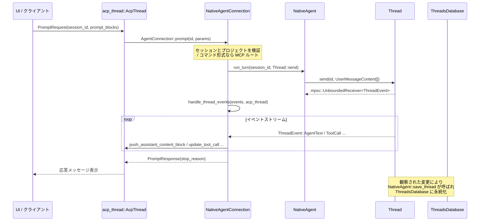

**要点**

- 実際の LLM 呼び出し・ツール実行などは `Thread` 内で行われ、その結果は `ThreadEvent` としてストリーミングされます。
- `NativeAgentConnection::handle_thread_events` はこのストリームを消費し、ACP スレッド（UI 側）に逐次反映します。
- 会話の変更は `NativeAgent` が `Thread` を observe しており、一定タイミングで `save_thread` が呼ばれて DB に保存されます。

### 5.2 プロジェクトコンテキストの更新

プロジェクトの worktree やルールファイルが変化した場合のコンテキスト更新フローです。

1. `Project` から `project::Event::WorktreeAdded` / `WorktreeRemoved` / `WorktreeUpdatedEntries` が発生。
2. `NativeAgent::handle_project_event` が呼ばれ、該当プロジェクトの `project_context_needs_refresh` チャネルに通知。
3. `maintain_project_context` タスクが `needs_refresh.changed().await` を検知し、`build_project_context` を起動。
4. 完成した `ProjectContext` を `ProjectState.project_context` および各 `Thread` に書き戻し、以後のプロンプトに反映。

---

## 6. 使い方（How to Use）

### 6.1 基本的な使用方法（ネイティブエージェント）

ここではテスト環境に近い簡略コードで、`NativeAgent` を介して新規セッションを作り、プロンプトを送る流れを示します。

```rust
use std::{path::Path, rc::Rc, sync::Arc};
use agent::{NativeAgent, NativeAgentConnection, Templates, ThreadStore};
use acp_thread::{AgentConnection, UserMessageId};
use collections::HashMap;
use fs::FakeFs; // 実アプリでは本物の Fs 実装を使用
use gpui::{App, SharedString};
use project::Project;
use util::path_list::PathList;

// これは gpui のテストコンテキストを想定した疑似コードです。
fn example(cx: &mut gpui::TestAppContext) {
    // ファイルシステムとプロジェクトを用意
    let fs = FakeFs::new(cx.executor());
    // プロジェクトルート直下に空ディレクトリを作るなど
    let project = futures::executor::block_on(Project::test(fs.clone(), [], cx));

    // スレッドストアとテンプレートを作成
    let thread_store = cx.new(|cx| ThreadStore::new(cx));
    let templates = Arc::new(Templates::new());

    // NativeAgent を Entity として生成
    let agent = cx.update(|cx| {
        NativeAgent::new(
            thread_store.clone(),
            templates.clone(),
            None,       // PromptStore があれば Some(...)
            fs.clone(), // Fs 実装
            cx,
        )
    });

    // AgentConnection 実装を作成
    let connection = NativeAgentConnection(agent.clone());

    // 新しいセッション（スレッド）を作成
    let acp_thread = futures::executor::block_on(cx.update(|cx| {
        Rc::new(connection.clone()).new_session(
            project.clone(),
            PathList::new(&[Path::new("/")]), // 作業ディレクトリ一覧
            cx,
        )
    })).unwrap();

    // セッション ID を取得
    let session_id = cx.update(|cx| acp_thread.read(cx).session_id().clone());

    // プロンプトを送信
    let prompt_id = UserMessageId::new(); // ユーザーメッセージ ID
    let request = agent_client_protocol::PromptRequest::new(
        session_id.clone(),
        vec!["Hello, agent!".into()], // ContentBlock の配列
    );

    let response_task = cx.update(|cx| {
        connection.prompt(Some(prompt_id), request, cx)
    });

    // 応答を待つ（テスト環境でのブロック待ち）
    let response = futures::executor::block_on(response_task).unwrap();
    println!("Stop reason: {:?}", response.stop_reason());
}
```

ポイント:

- `NativeAgent` は gpui の `Entity` として生成し、`NativeAgentConnection` に渡します。
- UI 側（実アプリ）では `AgentConnection` トレイト経由で `new_session` / `load_session` / `prompt` などを呼び出します。
- 実際のアプリケーションでは `TestAppContext` ではなく実際の `App` / `Window` 上で同様のパターンになります。

### 6.2 編集パーサの使用例

#### CreateFileParser

LLM のストリーミング出力から「```」で囲まれたファイル内容を取り出す場合の例です（テスト `parse_random_chunks` を簡略化）。

```rust
use agent::edit_agent::create_file_parser::{CreateFileParser, CreateFileParserEvent};

fn parse_file_body(output: &str) -> String {
    let mut parser = CreateFileParser::new();
    let mut result = String::new();

    // チャンク分割せず一度に渡す例
    for event in parser.push(Some(output)) {
        if let CreateFileParserEvent::NewTextChunk { chunk } = event {
            result.push_str(&chunk);
        }
    }
    // ストリーム終端を通知
    for event in parser.push(None) {
        if let CreateFileParserEvent::NewTextChunk { chunk } = event {
            result.push_str(&chunk);
        }
    }
    result
}

let body = parse_file_body("```\nHello\n```");
// body == "Hello\n"（終端で改行が補われる場合があります）
```

注意点:

- 最後に必ず `push(None)` を呼んで「Finishing」状態にしないと、末尾のバッファ内容が流れ出ません。
- `push(None)` を複数回呼ぶと `ParserState::Finished` で `debug_panic!` するので、1 ストリームにつき 1 回だけにします。

#### EditParser

XML タグ形式の編集指示を解析する例です。

```rust
use agent::edit_agent::edit_parser::{EditParser, EditFormat, EditParserEvent};

fn collect_edits(input: &str) {
    let mut parser = EditParser::new(EditFormat::XmlTags);
    let mut old = String::new();
    let mut new = String::new();

    for event in parser.push(input) {
        match event {
            EditParserEvent::OldTextChunk { chunk, done, line_hint } => {
                old.push_str(&chunk);
                if done {
                    println!("Old text (line_hint={:?}): {}", line_hint, old);
                    old.clear();
                }
            }
            EditParserEvent::NewTextChunk { chunk, done } => {
                new.push_str(&chunk);
                if done {
                    println!("New text: {}", new);
                    new.clear();
                }
            }
        }
    }
    let metrics = parser.finish();
    println!("tags={}, mismatched={}", metrics.tags, metrics.mismatched_tags);
}
```

### 6.3 よくある使用パターン

- **既存セッションのロード**
  - UI 側から `AgentConnection::load_session` を呼び出すと、`NativeAgent::open_thread` → `ThreadsDatabase::load_thread` → `Thread::from_db` の順に処理され、過去スレッドが復元されます。
  - ロード後に `Thread::replay` が呼ばれ、これまでのメッセージが `AcpThread` 側に反映されます。

- **モデル選択 UI**
  - `AgentConnection::model_selector(session_id)` から `NativeAgentModelSelector` を取得し、`list_models` / `select_model` / `selected_model` でモデル選択 UI を構成できます。
  - `select_model` は選択されたモデルをスレッドに設定すると同時に、設定ファイル (`settings::SettingsStore`) に永続化します。

- **Context Server (MCP) 連携**
  - ユーザーが `/serverId.promptName argument` のようなコマンド形式の入力を行うと、`Command::parse` によりパースされ、`NativeAgent::send_mcp_prompt` 経由で ContextServer のプロンプトが実行されます。
  - 最初の `ContentBlock` 以外のブロックは `original_content` として元のユーザー入力に保持され、MCP からのメッセージはスレッドにも ACP スレッドにも反映されます。

### 6.4 よくある間違い

```rust
// 誤り例: prompt に None の id を渡している
let response = connection.prompt(
    None,                  // ❌ NativeAgentConnection::prompt は expect で panic する
    prompt_request,
    cx,
);

// 正しい例: UserMessageId を生成して渡す
use acp_thread::UserMessageId;
let user_id = UserMessageId::new();
let response = connection.prompt(
    Some(user_id),         // ✅ 必ず Some(...)
    prompt_request,
    cx,
);
```

```rust
// 誤り例: CreateFileParser で終端を通知していない
let mut parser = CreateFileParser::new();
parser.push(Some("```rust\ncode\n```"));
// ❌ push(None) を呼ばないと最後のチャンクが出力されない可能性がある

// 正しい例
let mut parser = CreateFileParser::new();
for event in parser.push(Some("```rust\ncode\n```")) {
    /* ... */
}
for event in parser.push(None) {
    /* 残りのチャンクを処理 ... */
}
```

### 6.5 使用上の注意点（まとめ）

- **コンテキスト／スレッド**
  - `NativeAgent` や `Thread` は gpui の `Entity` として存在するため、必ず `Context` / `App` を通じて読み書きする必要があります。
  - UI スレッドとバックグラウンドタスクの間で `Entity` を共有する際は、`WeakEntity` や `Shared<Task<_>>` の使用パターンに従います。

- **非同期処理**
  - 多くの操作（DB I/O、プロジェクトコンテキスト構築、モデル認証など）はバックグラウンドタスクで実行されます。完了を待たずに UI 側で状態に依存する処理を行うと、一時的に空の状態を読む可能性があります。
  - `cx.run_until_parked()`（テスト）や UI のイベントループでタスクを駆動する前提で設計されています。

- **ストレージ**
  - スレッドが「空」の場合 (`Thread::is_empty == true`)、保存対象から除外されます。テストでもこの前提で確認されています。
  - `ZED_STATELESS` 環境変数が有効な場合、スレッドはメモリ上の SQLite にのみ保存され、プロセス終了とともに破棄されます。

- **パーサ**
  - `EditParser` は入力が壊れていてもできるだけ編集ペアを抽出しますが、タグミスマッチなどは `EditParserMetrics` で検出できます。信頼度の指標として利用できます。
  - `CreateFileParser` は「最初のコードフェンスから最後のコードフェンスまで」を基本対象とし、フィクスチャが示す通り完全に整っていない出力に対しても「ベストエフォート」で動作します。

---

## 7. 関連ファイル

このチャンクに含まれる、またはこのコードから直接参照されている主なファイルとその役割です。

| パス | 役割 / 関係 |
|------|------------|
| `agent/Cargo.toml` | `agent` クレートの定義。ライブラリパス (`src/agent.rs`) や依存クレート（`acp_thread`, `language_model`, `project`, `sqlez` など）を指定。 |
| `agent/src/agent.rs` | クレートのメイン実装ファイル。`NativeAgent` / `NativeAgentConnection` / モデル管理 / プロジェクトコンテキスト構築 / MCP 連携などの中核ロジック。 |
| `agent/src/db.rs` | スレッド永続化を担う `DbThread` / `ThreadsDatabase` の実装。SQLite (`sqlez`) を利用。 |
| `agent/src/edit_agent/create_file_parser.rs` | ストリーミングなコードフェンス抽出用 `CreateFileParser` の実装とテスト。 |
| `agent/src/edit_agent/edit_parser.rs` | `<old_text>/<new_text>` や diff フェンス形式の編集指示を解釈する `EditParser` とそのサブパーサ。多数のプロパティテスト（乱択チャンク）を含む。 |
| `agent/src/edit_agent/evals/fixtures/add_overwrite_test/before.rs` | 編集エージェントの評価に使う Rust コードフィクスチャ。`ActionLog` などを含む大きなファイルの「before」バージョン。 |
| `agent/src/edit_agent/evals/fixtures/delete_run_git_blame/before.rs` / `after.rs` | `git blame` 関連コードの before/after フィクスチャ。編集エージェントが特定の関数を削除できるかなどを検証。 |
| `agent/src/edit_agent/evals/fixtures/disable_cursor_blinking/before.rs` | 非常に大きなエディタ実装ファイルのスナップショット。`Editor` 型などを含み、編集エージェントが部分変更を正しく行えるかの評価に使用。 |
| `agent/src/edit_agent/evals/fixtures/...`（その他） | さまざまな Rust コードベースの断片を含むフィクスチャ群。編集パーサやツールの堅牢性評価に利用。 |
| `agent/src/edit_agent/evals.rs` | 評価ロジック本体（このチャンクでは内容は見えていません）。 |
| `agent/src/thread.rs` | `Thread`, `ThreadEvent`, `UserMessageContent` など会話スレッドロジックの本体。`agent.rs` から参照されていますが、このチャンクには定義が含まれていません。 |
| `agent/src/tools/*.rs` | ファイル編集、grep、web 検索などのツール実装。`NativeThreadEnvironment` から利用されますが、このチャンクには定義が含まれていません。 |

この解説は **chunk 1/8** に含まれるコードのみを根拠としており、他のチャンクに含まれる実装の詳細についてはここでは触れていません。

---

# （パス不明）/Editor モジュール（編集コマンド・インライン補完周辺）

## 0. ざっくり一言

このチャンクは、Zed の `Editor` 型に対する「編集コマンド・選択操作・インライン補完・診断・タスク実行・言語サーバ連携」などの高レベルなユーザー操作をまとめた実装です。

---

## 1. このモジュールの役割

### 1.1 概要

- このモジュールは、**エディタ上でのユーザー操作（キー操作やコマンド）を具体的なバッファ編集や UI 更新に変換する役割**を持ちます。
- テキスト編集、マルチカーソル・選択、インライン補完（Edit Prediction）、スニペット、折りたたみ、診断ジャンプ、`go to definition` などを一元的に扱います。
- 内部では `MultiBuffer`・`Project`・`Workspace`・LSP ベースの `SemanticsProvider`・`InlineCompletionProvider` など多数のコンポーネントと連携します。

### 1.2 アーキテクチャ内での位置づけ

`Editor` は UI 層に属しつつ、バッファ（テキストモデル）・プロジェクト・LSP との橋渡しを行います。

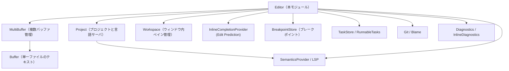

- キー操作やアクション（例: `GoToDefinition`）は `Editor` のメソッドとして実装され、内部で `Project`・LSP・`MultiBuffer` などを呼び出します。
- 非同期処理は `cx.spawn_in(window, async move |editor, cx| { ... })` を通じてバックグラウンド実行されます。

### 1.3 設計上のポイント

- **コマンドごとにメソッド定義**
  - `backspace`, `tab`, `go_to_definition`, `toggle_comments` など、キーやコマンドパレットに対応する単位でメソッドが用意されています。
- **非同期タスクとデバウンス**
  - インライン補完・コードアクション・診断・ランナブル検出などは `Task` とタイマーでデバウンスしつつ実行されます。
- **MultiBuffer / Excerpt 対応**
  - 通常の単一ファイルだけでなく、検索結果・定義リストなどの **抜粋 (excerpt)** を持つ `MultiBuffer` 上でも同じ操作を扱えるよう、`Anchor`・`MultiBufferPoint` を用いて汎用化されています。
- **Selection / History 管理**
  - 選択履歴（`selection_history`）や「シンタックスノードを広げる / 戻る」履歴など、複雑な選択状態をロールバック可能な形で保持します。
- **言語サーバ連携**
  - 定義ジャンプ・参照検索・リネーム・フォーマット・Organize Imports などを LSP / `SemanticsProvider` に委譲し、結果を `MultiBuffer` トランザクションとして適用します。

---

## 2. 主要な機能一覧

このチャンクに現れる主な機能を簡単に列挙します。

- コードアクション
  - `add_code_action_provider` / `refresh_code_actions` によるコードアクション取得とグリフ表示
- Git / blame 関連
  - `start_inline_blame_timer`, `show_blame_popover`, `hide_blame_popover`
- ドキュメントハイライト
  - LSP ベースの read/write ハイライト (`refresh_document_highlights`)
  - 選択文字列の出現箇所ハイライト (`refresh_selected_text_highlights`)
- インライン補完 / Edit Prediction
  - 有効範囲判定・設定 (`edit_predictions_enabled_in_buffer` 等)
  - 補完の取得・表示更新 (`refresh_inline_completion`, `update_visible_inline_completion`)
  - 補完の受け入れ・部分受け入れ・破棄 (`accept_edit_prediction`, `accept_partial_inline_completion`, `discard_inline_completion`)
  - カーソルポップオーバやジャンプポップオーバの描画 (`render_edit_prediction_*`)
- スニペット
  - `insert_snippet`, `move_to_next_snippet_tabstop`, `move_to_prev_snippet_tabstop`
- 基本編集操作
  - `backspace`, `delete`, `tab`, `backtab`, `indent`, `outdent`, `autoindent`, `delete_line`, `join_lines`
- テキスト／行操作ユーティリティ
  - 行ごとの操作: sort/unique/reverse/shuffle (`manipulate_lines`)
  - 文字列変換: 大文字／小文字、snake/kebab/camel、ROT13/ROT47 等 (`manipulate_text`)
  - 複製・行移動・転置 (`duplicate_*`, `move_line_up/down`, `transpose`, `rewrap`)
- クリップボード・kill ring
  - `cut`, `copy`, `paste`, `kill_ring_cut`, `kill_ring_yank`, メタデータ付きクリップボード
- Undo / Redo / トランザクション
  - `undo`, `redo`, `transact`, `start_transaction_at`, `end_transaction_at`
- カーソル・選択操作
  - 文字単位／単語／サブワード／行／段落／ファイル先頭末尾／excerpt 間移動
  - マルチカーソル: `add_selection_above/below`, `split_selection_into_lines`
  - Select Next/Previous / All Matches (`select_next`, `select_previous`, `select_all_matches`)
  - シンタックスノード単位の選択拡大/縮小 (`select_larger_syntax_node`, `select_smaller_syntax_node`)
  - 括弧対応移動 (`move_to_enclosing_bracket`)
- Git 差分・変更リスト・診断
  - ハンク移動 (`go_to_next_hunk`, `go_to_prev_hunk`)
  - 変更リスト移動 (`go_to_next_change`, `go_to_previous_change`)
  - 診断の次／前へ移動・インライン診断表示 (`go_to_diagnostic_impl`, `refresh_inline_diagnostics`)
- 定義ジャンプ・参照・リネーム
  - `go_to_definition_of_kind` とそのラッパー(定義・型定義・実装)
  - `navigate_to_hover_links`, `open_locations_in_multibuffer`
  - `find_all_references`
  - `rename`, `confirm_rename`, `take_rename`
- フォーマット・コードアクション
  - `format`, `format_selections`, `perform_format`
  - `organize_imports`, `perform_code_action_kind`
- 言語サーバ制御
  - `restart_language_server`, `stop_language_server`, `cancel_language_server_work`
- Runnables / タスク
  - `refresh_runnables`, `spawn_nearest_task`, `build_tasks_context`
- ブレークポイントとデバッガ連携
  - 行ごとのブレークポイント検出・コンテキストメニュー (`active_breakpoints`, `breakpoint_context_menu`)
  - on-gutter のアイコン描画 (`render_breakpoint`, `render_run_indicator`)
  - 有効/無効切り替え・条件付きブレークポイント編集 (`edit_breakpoint_at_anchor` など)
- 折りたたみ
  - `toggle_fold`, `toggle_fold_recursive`, `fold`（途中まで）

---

## 3. 公開 API と詳細解説

### 3.1 型一覧（構造体・列挙体など）

このチャンク内では新しい公開構造体定義はほぼ登場しませんが、重要な状態型が多数利用されています（定義は別ファイルです）。

| 名前 | 種別 | 役割 / 用途 |
|------|------|-------------|
| `Editor` | 構造体 | エディタ UI と編集ロジックの中核。ここに多数のメソッドが実装されています。 |
| `InlineCompletionState` | 構造体 | 現在表示中のインライン補完の内容・適用範囲・表示モードを保持します。 |
| `InlineCompletion` | 列挙体 | `Move`（カーソルジャンプ）と `Edit`（テキスト編集）2 種類の補完を表現します。 |
| `EditPredictionSettings` | 列挙体 | インライン補完の有効/無効や「修飾キーが必要か」などの設定を表します。 |
| `RunnableTasks` | 構造体 | 1 行に紐づく「実行可能タスク」のテンプレートと位置情報を保持します。 |
| `ActiveDiagnosticGroup` | 構造体 | 現在展開中の診断グループ（メッセージ群と表示ブロック ID）を表します。 |
| `RenameState` | 構造体 | リネーム中の元名・範囲・専用ミニエディタなどの状態を保持します。 |
| `InlineDiagnostic` | 構造体 | 1 行末に表示されるインライン診断メッセージの情報を保持します。 |

> これらの定義自体はこのチャンクには含まれていないため、フィールド構造などの詳細はコードからは分かりません。

### 3.2 関数詳細（代表 7 件）

#### `refresh_inline_completion(&mut self, debounce: bool, user_requested: bool, window: &mut Window, cx: &mut Context<Self>) -> Option<()>`

**概要**

- 現在のカーソル位置でインライン補完（Edit Prediction）を再評価し、プロバイダに問い合わせを送るトリガ関数です。
- ユーザー操作による明示的要求か、自動更新かを区別し、表示するかどうかを条件付きで決めます。

**引数**

| 引数名 | 型 | 説明 |
|--------|----|------|
| `debounce` | `bool` | プロバイダ側でデバウンスすべきかどうかのヒント。 |
| `user_requested` | `bool` | ユーザーがショートカットなどで明示的に要求した場合 `true`。 |
| `window` | `&mut Window` | UI 操作用のウィンドウコンテキスト。 |
| `cx` | `&mut Context<Self>` | `Editor` 向けのコンポーネントコンテキスト。 |

**戻り値**

- `Some(())` : 補完要求を開始した場合。
- `None` : プロバイダが無い／補完禁止状態などで何もしなかった場合。

**内部処理の流れ**

1. `self.edit_prediction_provider()` で現在の `InlineCompletionProvider` を取得。なければ `None` を返す。
2. 最新のカーソル位置 (`newest_anchor().head()`) を取り出し、`MultiBuffer` から対応する `Buffer` とバッファ内位置に変換。
3. `edit_predictions_enabled_in_buffer` で **読み取り専用・設定・スコープ** などに基づき補完の有効可否を判定。無効なら現在の補完を破棄。
4. 自動トリガ (`user_requested == false`) の場合:
   - `should_show_edit_predictions()`（スニペット中かなど）、
   - エディタがフォーカスされているか、
   - バッファが空でないか  
   を確認し、条件を満たさなければ補完を破棄。
5. 既存の可視補完状態を `update_visible_inline_completion` で更新。
6. プロバイダの `refresh` を呼び、プロジェクト・バッファ・カーソル位置・`debounce` を渡す。

**Edge cases（エッジケース）**

- プロバイダが存在しない場合: 何もせず `None`。
- カーソル位置が `text_anchor_for_position` で解決できない場合（例: 無効なアンカー）: `None`。
- 読み取り専用バッファや、スコープ設定で補完が禁止されている場合: 既存補完を `discard_inline_completion(false, cx)` で隠す。
- 非フォーカス状態や空バッファでは自動トリガは無効ですが、`user_requested == true` なら実行されます。

**使用上の注意点**

- 「ユーザーからの明示的要求」と「自動更新」で挙動が変わるため、ショートカットから呼ぶときは `user_requested = true` を渡す必要があります。
- バッファ編集直後に連続して呼ぶ場合は、プロバイダ側のデバウンス挙動も考慮し `debounce = true` とするのが前提になっています。

---

#### `update_visible_inline_completion(&mut self, _window: &mut Window, cx: &mut Context<Self>) -> Option<()>`

**概要**

- 現在のカーソル・選択状態・メニュー状態などをもとに、「画面上にどのインライン補完をどのように表示するか」を決定し、`active_inline_completion` を構築します。
- 差分ハイライトやインレイ表示、`Move` タイプの補完かどうかなどの分岐を含む中核処理です。

**引数**

| 引数名 | 型 | 説明 |
|--------|----|------|
| `_window` | `&mut Window` | 現状この関数内では未使用。将来的な UI 操作用。 |
| `cx` | `&mut Context<Self>` | `Editor` コンテキスト。 |

**戻り値**

- 新しい補完を表示した場合 `Some(())`、何も表示しない場合 `None`。

**内部処理の流れ（簡略）**

1. 最新のアンカー選択を取得し、`MultiBuffer` のオフセットに変換。
2. コンテキストメニューが優先される状態や、選択が非空などの場合は現在の補完を破棄して終了。
3. 既存の `active_inline_completion` を一旦 `take_active_inline_completion` で取り除き、必要なクリーンアップ（インレイ削除・ハイライト削除）を行う。
4. プロバイダが無ければ `EditPredictionSettings::Disabled` として終了。
5. カーソル位置に対する設定 (`edit_prediction_settings_at_position`) を再計算。
6. 現在行が「インデント候補と衝突していないか」を判定し、必要に応じて `edit_prediction_indent_conflict` フラグを立てる。
7. `provider.suggest(&buffer, cursor_buffer_position, cx)` で補完候補（`inline_completion`）を取得。なければ終了。
8. 取得した `edits` を、現在の excerpt にマップして `Range<Anchor>` に変換。空なら終了。
9. 編集がカーソルから上 or 下に大きく離れている場合は `InlineCompletion::Move` とし、ジャンプ先を `target` に設定。そうでなければ `InlineCompletion::Edit` として扱う。
10. `Edit` の場合:
    - すべて挿入（空範囲）であればインレイ (`Inlay::inline_completion`) を追加する。
    - そうでなければ削除部分を背景色でハイライト。
    - 編集範囲と行範囲から `EditDisplayMode` を `TabAccept` / `Inline` / `DiffPopover` に決定。
11. 編集の影響を受ける行全体を `invalidation_range` として計算し、`InlineCompletionState` に保存。
12. `self.active_inline_completion = Some(InlineCompletionState { ... })` とし、`cx.notify()` で再描画をトリガ。

**Edge cases**

- 選択が非空のときや、コンテキストメニュー（補完メニュー）が優先されるときはインライン補完は表示されません。
- 補完の編集範囲が現在の excerpt に投影できない（`anchor_in_excerpt` が `None`）場合、その edit は無視されます。
- `Move` 補完の場合、Vim モードでインライン補完が隠されていると自動的に `Move` とみなされます。

**使用上の注意点**

- この関数は「表示」の責務に特化しており、実際の補完候補計算はプロバイダ側にあります。
- すでに表示中の補完を無効化する処理も含むため、他の場所からインライン補完を手動で消す場合は、必ず `discard_inline_completion` / `take_active_inline_completion` を通すのが前提になっています。

---

#### `accept_edit_prediction(&mut self, _: &AcceptEditPrediction, window: &mut Window, cx: &mut Context<Self>)`

**概要**

- 現在表示中のインライン補完を **完全適用** するコマンドです。
- `Move` 補完の場合はカーソルをジャンプするだけ、`Edit` 補完の場合はバッファへ編集を適用します。

**引数**

| 引数名 | 型 | 説明 |
|--------|----|------|
| `_` | `&AcceptEditPrediction` | アクション型（内容は利用していません）。 |
| `window` | `&mut Window` | UI 操作用。 |
| `cx` | `&mut Context<Self>` | エディタコンテキスト。 |

**戻り値**

- 戻り値はありません。成功時はバッファ内容・カーソル・ハイライトが更新されます。

**内部処理の流れ**

1. メニュー表示型の補完であれば、まず `hide_context_menu` でメニューを閉じます。
2. `self.active_inline_completion` がなければ何もせず return。
3. `report_inline_completion_event` で Telemetry を送信（受け入れたかどうかのイベント）。
4. `InlineCompletion` の種類に応じて分岐:
   - `Move { target, .. }`:
     - `last_position_map` から現在の可視範囲を取得。
     - ジャンプ先行が現在のビューポート内、または修飾キー不要モードなら:
       - 該当行を展開 (`unfold_ranges`) し、カーソル選択を `target` に移動。
       - プレビュー用ハイライトをクリア。
     - そうでなければ:
       - 現在のスクロール位置を保存し、ジャンプ先行をハイライト＆オートスクロール。
   - `Edit { edits, .. }`:
     - プロバイダに `accept` を通知。
     - 現在の `MultiBuffer` からスナップショットを取得し、`edits` の最後の終端アンカーをオフセットに変換してカーソル移動先とする。
     - `buffer.edit(edits, None, cx)` で編集適用。
     - カーソル位置を最後の編集末尾に移動。
     - 再度 `update_visible_inline_completion` を呼び、連続補完があれば更新。
5. インデント衝突フラグ `edit_prediction_requires_modifier_in_indent_conflict` をリセット。

**Edge cases**

- 補完が無い状態で呼ばれた場合は何も起きません。
- `Move` 補完でジャンプ先が現在ビューの外にある場合、スクロールのみ先に行うため「プレビュー的な動き」になります。
- `Edit` 補完の `edits` が空だったり不整合な場合の挙動は、このチャンクだけでは分かりません（前段の `update_visible_inline_completion` で空は弾かれています）。

**使用上の注意点**

- `accept_edit_prediction` は単にバッファ編集を行うだけでなく Telemetry イベントを送っているため、補完の採用率などの計測にも影響します。
- 外部から同じことをしたい場合も、`buffer.edit` を直接呼ぶのではなく、このメソッド経由にする方が挙動の一貫性が保たれます。

---

#### `insert_snippet(&mut self, insertion_ranges: &[Range<usize>], snippet: Snippet, window: &mut Window, cx: &mut Context<Self>) -> Result<()>`

**概要**

- 与えられた挿入位置（複数）に対してスニペット文字列を挿入し、タブストップ・選択肢付きプレースホルダ・自動カッコ閉じなどを設定します。
- スニペット展開後のタブ移動 (`move_to_next_snippet_tabstop`) のために内部スタック (`snippet_stack`) を更新します。

**引数**

| 引数名 | 型 | 説明 |
|--------|----|------|
| `insertion_ranges` | `&[Range<usize>]` | スニペットを展開するバッファオフセット範囲のリスト。 |
| `snippet` | `Snippet` | テキスト本体とタブストップ情報を持つスニペット構造体。 |
| `window` | `&mut Window` | UI コンテキスト。 |
| `cx` | `&mut Context<Self>` | エディタコンテキスト。 |

**戻り値**

- `Ok(())` : 成功。
- `Err(_)` : 編集中に何らかのエラーがあった場合（詳細はこのチャンクからは不明）。

**内部処理の流れ**

1. ローカル構造体 `Tabstop<T>` を定義（`is_end_tabstop`, `ranges`, `choices` を保持）。
2. `buffer.update` 内で:
   - すべての `insertion_ranges` に同じ `snippet.text` を挿入 (`AutoindentMode::EachLine`)。
   - その後のスナップショットを取得し、スニペット定義内の `tabstops` に従って実バッファ上の `Anchor` 範囲にマッピング。
   - 複数挿入分について、オフセット補正（`delta`）を行いながら `tabstop_ranges` を作成し、ソート。
3. 最初のタブストップ（`tabstops.first()`）が存在する場合:
   - その範囲にカーソル選択を移動 (`select_ranges`)。
   - プレースホルダに選択肢 (`choices`) がある場合は `show_snippet_choices` でコンテキストメニュー表示。
   - 「最後が end タブストップ（かつスニペット末端）」でなければ、すべてのタブストップ情報を `snippet_stack` に積む。
4. 自動カッコ閉じとの連携:
   - まだ `autoclose_regions` が空のとき、各カーソル位置について言語スコープの `brackets()` を調べ、
     「スニペットの後ろが auto-close 対象になり得るか」を判定。該当する場合 `AutocloseRegion` に登録。

**Edge cases**

- タブストップが 1 つもないスニペット: ただテキストが挿入されるだけで `snippet_stack` は更新されません。
- `insertion_ranges` がバッファ末尾を超える／重なっている場合の挙動は、`buffer.edit` 側の仕様に依存します（このチャンクからは詳細不明）。
- end タブストップがスニペット末尾にだけ存在する場合、そのタブストップは「終了位置扱い」となり、`snippet_stack` に残らないため、タブ移動ですぐ通常モードに戻ります。

**使用上の注意点**

- スニペット用のタブ移動を使いたい場合は、必ずこのメソッドを通して挿入する必要があります（`snippet_stack` 更新を行うため）。
- `insertion_ranges` はバッファオフセットで渡す必要があり、`Anchor` ではない点に注意します。

---

#### `manipulate_lines<Fn>(&mut self, window: &mut Window, cx: &mut Context<Self>, mut callback: Fn) where Fn: FnMut(&mut Vec<&str>)`

**概要**

- 選択中の行範囲に対して「行単位の変換」を一括で適用するための共通ユーティリティです。
- ソート・ユニーク・反転・シャッフルなどは、この関数に異なる `callback` を渡すことで実装されています。

**主な利用箇所**

- `sort_lines_case_sensitive`
- `sort_lines_case_insensitive`
- `unique_lines_case_sensitive`
- `unique_lines_case_insensitive`
- `reverse_lines`
- `shuffle_lines`

**内部処理の流れ**

1. マウスカーソルを隠し、`display_map`・`buffer` のスナップショットを取得。
2. すべての選択を走査し、`consume_contiguous_rows` で「連続する行のかたまり」にまとめる。
3. 各行かたまりについて:
   - 行範囲を `start_point..end_point` としてテキストを取得。
   - `lines = text.split('\n').collect_vec()` で `Vec<&str>` に変換。
   - 呼び出し元から渡された `callback(&mut lines)` を適用。
   - `lines.join("\n")` で新テキストにし、`edits` に `(Range<Point>, String)` として蓄積。
   - 行数の増減に応じて `added_lines` / `removed_lines` を更新し、新しい選択範囲を行ベースで計算して `new_selections` に登録。
4. `transact` で一つのトランザクションとして `buffer.edit(edits)` を適用し、その後 `new_selections` を実オフセットに変換し直して選択状態を更新。

**Edge cases**

- 複数選択が同じ行をまたいでいる場合も、`consume_contiguous_rows` により二重処理されないようにしています。
- 行数が変わる操作（ユニーク・シャッフルなど）では、後続の選択行番号を `added_lines` / `removed_lines` で補正しています。
- 抜粋（excerpt）をまたぐような選択に対する挙動は、このチャンクだけでは厳密には分かりませんが、`display_map` による行変換を通して最小限の一貫性が保たれるよう設計されています。

**使用上の注意点**

- このユーティリティは行全体を対象とするため、「一部だけ選択している」場合も行全体に作用します。
- 変更は単一トランザクションにまとめられるので、Undo/Redo は一回で元に戻せます。

---

#### `manipulate_text<Fn>(&mut self, window: &mut Window, cx: &mut Context<Self>, mut callback: Fn) where Fn: FnMut(&str) -> String`

**概要**

- 現在の選択範囲（または空選択時は単語）に対して「文字列変換」を適用するための共通ユーティリティです。
- 大文字／小文字変換や case 変換、ROT13/ROT47 などがこの関数で実装されています。

**主な利用箇所**

- `toggle_case`
- `convert_to_upper_case`
- `convert_to_lower_case`
- `convert_to_title_case`
- `convert_to_snake_case` など多数

**内部処理の流れ**

1. `display_map` と `buffer` のスナップショットを取得。
2. `selection_adjustment`（これまでの変換で選択位置がずれる量）を 0 で初期化。
3. すべての選択 (`Selection<usize>`) について:
   - 空選択の場合:
     - `movement::surrounding_word` で「カーソル位置を含む単語」の範囲を求め、その範囲を対象とする。
   - 非空選択の場合:
     - その範囲をそのまま対象とする。
   - 対象範囲のテキストを `text` として取得し、`callback(&text)` で変換。
   - 元の長さと変換後の長さの差分から `selection_adjustment` を更新。
   - 新選択範囲（変換後の位置）を `new_selections` に登録。
   - `(Range<usize>, String)` を `edits` に追加。
4. `transact` 内で `buffer.edit(edits)` を実行し、その後 `new_selections` で選択状態を更新。
5. `request_autoscroll` で編集位置が見えるようにスクロール。

**Edge cases**

- 空選択時は「単語単位」で処理されるため、ユーザー体感としては「単語の case を反転する」といった挙動になります。
- UTF-8 のコードポイント長とバイト長が変わる変換を行っても、`selection_adjustment` によって後続の選択位置が補正されます。

**使用上の注意点**

- `callback` は行単位ではなく、選択単位（複数行をまたいでもよい）のテキストを受け取ります。
- 大量の選択に対して重い変換を行うと、それなりにコストがかかる点に注意が必要です。

---

#### `select_next_match_internal(&mut self, display_map: &DisplaySnapshot, replace_newest: bool, autoscroll: Option<Autoscroll>, window: &mut Window, cx: &mut Context<Self>) -> Result<()>`

**概要**

- VS Code などでおなじみの「Select Next Occurrence」の内部実装です。
- 現在の選択内容をもとに、次の一致箇所を検索して新しいカーソル／選択を追加します。
- 連続呼び出し時には `SelectNextState` を使って検索状態を維持します。

**引数**

| 引数名 | 型 | 説明 |
|--------|----|------|
| `display_map` | `&DisplaySnapshot` | 表示用スナップショット（折りたたみ等を反映）。 |
| `replace_newest` | `bool` | 直近の選択を置き換えるか、追加するか。 |
| `autoscroll` | `Option<Autoscroll>` | 自動スクロールのモード。 |
| `window` | `&mut Window` | UI。 |
| `cx` | `&mut Context<Self>` | コンテキスト。 |

**内部処理の流れ（要約）**

1. `buffer`（`display_map.buffer_snapshot`）と現在の選択群を取得。
2. すでに `self.select_next_state` が存在する場合は「継続モード」:
   - `SelectNextState` に保存された Aho-Corasick のオートマトン（`query`）を使って、カーソル以降 → ファイル末尾 → ファイル先頭 → カーソルまで、の順で検索。
   - 現在既に選択されている範囲と重なるマッチはスキップ。
   - 見つかったマッチ範囲を、新しい選択として挿入（`replace_newest` に応じて差し替え or 追加）。
   - これ以上マッチが無い場合は `done = true`。
3. `select_next_state` が無い場合は「初期モード」:
   - すべての選択を走査し、「キャレットのみか」「すべて同じテキストが選ばれているか」を判定。
   - すべてキャレットのみ → 各キャレット位置の単語全体を選択範囲に拡張。
   - 単一選択で、選択テキストが空でなければ `AhoCorasick::new(&[query])` で検索器を生成し、`SelectNextState` として保存。
   - その後、再帰的に自分自身を呼び出して次のマッチを選択。

**Edge cases**

- 選択が複数あり、それぞれ異なるテキストが選ばれている場合は `SelectNextState` は作られず、「単語単位拡張」のみ行われます。
- 行をまたぐ選択・折りたたみ領域にあるテキストなどは、`display_map` と `MultiBuffer` の相互変換に従って扱われます。
- 正規表現ではなく、単純な固定パターン検索（Aho-Corasick）を用いています。

**使用上の注意点**

- 外部から直接使うよりは、公開 API `select_next` / `select_all_matches` 経由で利用する前提のメソッドです。
- 複雑な状態（折りたたみ・マルチバッファ）が絡むため、既存コードのパターンを踏襲して呼び出すのが安全です。

---

### 3.3 その他の関数（グループごとの役割）

個別説明は省略しますが、よく使われるグループを表にまとめます。

| 関数群 | 役割（1 行） |
|--------|--------------|
| `backspace`, `delete`, `insert`, `clear` | 基本文字削除／挿入操作と連動する補完・リンク編集更新。 |
| `tab`, `backtab`, `indent`, `outdent`, `autoindent` | タブ／インデント操作と、言語設定に基づくオートインデント。 |
| `duplicate_*`, `move_line_up/down`, `transpose`, `join_lines_impl` | 行単位の並べ替え・複製・結合。 |
| `go_to_*` 系 (line, paragraph, excerpt, beginning/end) | さまざまな単位でのジャンプ移動。 |
| `go_to_definition*`, `go_to_type_definition*`, `go_to_implementation*` | LSP 経由で定義・実装・型定義にジャンプ。 |
| `open_url`, `open_selected_filename` | カーソル下の URL / ファイルパスを開く。 |
| `rename`, `confirm_rename`, `take_rename` | LSP リネーム操作の開始〜適用まで。 |
| `format*`, `organize_imports` | ドキュメント／選択範囲フォーマットや import の整理。 |
| `go_to_diagnostic*`, `refresh_inline_diagnostics`, `activate_diagnostics` | 診断メッセージのナビゲーションとインライン表示。 |
| `toggle_comments` | 言語設定に基づく行／ブロックコメントのトグル。 |
| `toggle_fold*`, `fold`, `unfold*` | 折りたたみ／展開の制御。 |

---

## 4. データフロー

ここでは「インライン補完（Edit Prediction）の取得から適用まで」の流れを例にとります。

1. ユーザーがキー入力またはショートカットを押す。
2. キーバインドから `refresh_inline_completion(user_requested = true)` が呼ばれる。
3. `Editor` はカーソル位置・設定・バッファ状態を確認し、`InlineCompletionProvider::refresh` を呼び出す。
4. プロバイダがバックグラウンドで LSP/モデルから候補を取得し、`suggest` 経由で `Editor` に返す。
5. `update_visible_inline_completion` が `InlineCompletionState` を構成し、インレイ／背景ハイライト／ポップオーバを描画。
6. ユーザーが `accept_edit_prediction` を実行すると、`InlineCompletion::Move` または `::Edit` に応じてジャンプ／編集が行われる。

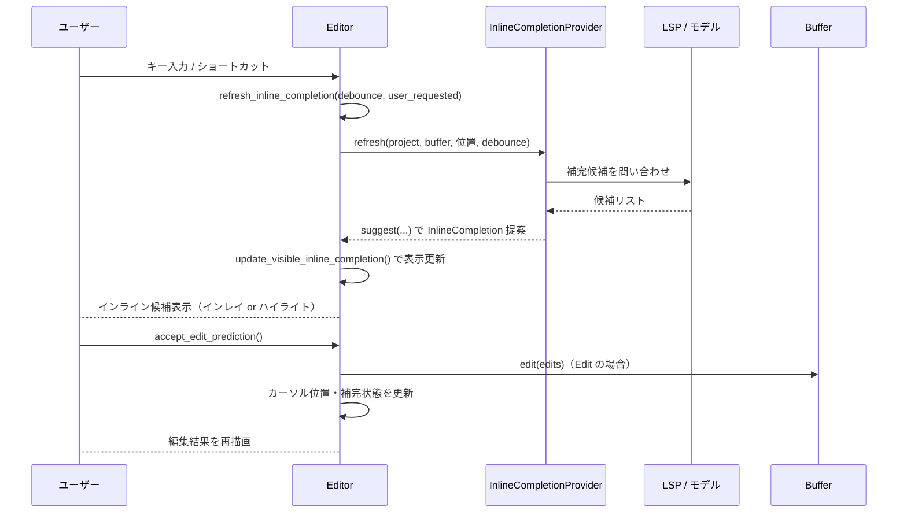

---

## 5. 使い方（How to Use）

### 5.1 基本的な使用方法

ここでは、既に `Editor` インスタンス（たとえば `Entity<Editor>`）があり、イベントハンドラ内からメソッドを呼び出すイメージの例を示します。

```rust
// 例: ユーザーが指定のショートカットでインライン補完を要求した場合のハンドラ
fn on_show_edit_prediction(editor: &mut Editor, window: &mut Window, cx: &mut Context<Editor>) {
    // 明示的要求なので user_requested = true
    let _ = editor.refresh_inline_completion(
        false,   // debounce しない
        true,    // user_requested
        window,
        cx,
    );
}

// 例: 選択中の行を大文字化するショートカット
fn on_convert_selection_uppercase(editor: &mut Editor, window: &mut Window, cx: &mut Context<Editor>) {
    use crate::actions::ConvertToUpperCase;

    editor.convert_to_upper_case(
        &ConvertToUpperCase, // アクション型（空の構造体）
        window,
        cx,
    );
}
```

`Editor` のパブリックメソッドは、基本的に「アクション型 + window + cx」を引数に取る形になっており、キーイベント／コマンドディスパッチャから直接呼び出せるよう設計されています。

### 5.2 よくある使用パターン

#### パターン 1: 選択範囲の行をソート

```rust
use crate::actions::SortLinesCaseSensitive;

// すでにエディタ上で行が選択されているとする
editor.sort_lines_case_sensitive(&SortLinesCaseSensitive, window, cx);
// 選択行の内容が辞書順にソートされ、選択もそれに追随します。
```

#### パターン 2: Select Next で複数カーソルを増やす

```rust
use crate::actions::SelectNext;

// カーソル位置の単語を選択しつつ、次の一致を選択に追加
let _ = editor.select_next(
    &SelectNext {
        replace_newest: false, // 直近の選択を残したまま新規追加
    },
    window,
    cx,
);
```

#### パターン 3: LSP リネームの実行

```rust
use crate::actions::Rename;

// カーソルをシンボル上に置いた状態で…
if let Some(task) = editor.rename(&Rename, window, cx) {
    // 非同期で LSP に問い合わせ、結果を適用
    task.detach(); // ここでは結果を待たずに非同期で進める
}
```

### 5.3 よくある間違い

```rust
// 誤り例: 読み取り専用バッファに対して編集系メソッドを直接呼ぶ
if editor.read_only(cx) {
    editor.backspace(&Backspace, window, cx); // 実際には何も起きない
}

// 正しいパターン: read_only を確認し編集操作をスキップする
if !editor.read_only(cx) {
    editor.backspace(&Backspace, window, cx);
}
```

```rust
// 誤り例: buffer.edit を直接呼んでインライン補完状態を壊す
editor.buffer.update(cx, |b, cx| b.edit(edits, None, cx));

// 正しいパターン: Editor のラッパーメソッド（transact or 専用メソッド）を使う
editor.transact(window, cx, |editor, window, cx| {
    editor.buffer.update(cx, |b, cx| b.edit(edits.clone(), None, cx));
    editor.refresh_inline_completion(true, false, window, cx);
});
```

### 5.4 使用上の注意点（まとめ）

- **トランザクション管理**
  - 複数の編集をまとめて行うときは `transact`（または `start_transaction_at` / `end_transaction_at`）を経由することで、Undo/Redo と選択履歴が一貫します。
- **読み取り専用**
  - `read_only(cx)` が `true` の場合、編集操作（`backspace`, `insert`, `insert_snippet` など）は基本的に何もしない前提になっています。
- **非同期タスク**
  - LSP 連携（定義ジャンプ・参照・フォーマットなど）は `Task<Result<...>>` を返します。呼び出し側で `.await` するか `.detach()` するかを明示する必要があります。
- **MultiBuffer と Singleton**
  - 検索結果・定義リストなどのマルチバッファビューでは、`go_to_singleton_buffer_range` など専用の移動関数が用意されています。通常のバッファ前提の処理とは区別されます。
- **折りたたみとの相互作用**
  - 診断・補完・シンタックス選択などの一部処理では、「折りたたまれている行をスキップ／展開する」ロジックが含まれます。折りたたみ状態を前提にした処理を書く場合は既存関数（`unfold_ranges`, `fold_creases` など）の使い方に注意が必要です。

---

## 6. 変更の仕方（How to Modify）

### 6.1 新しい機能を追加する場合

例: 新しい文字列変換コマンド（たとえば「全角／半角変換」）を追加したい場合。

1. **アクション型の追加**
   - 適切な `actions` モジュール（このチャンクには登場しません）に `ConvertToZenkaku` のようなアクション型を定義します。
2. **Editor メソッドの追加**
   - 本ファイルの他の変換関数（`convert_to_upper_case` など）に倣い、`pub fn convert_to_zenkaku(&mut self, _: &ConvertToZenkaku, window: &mut Window, cx: &mut Context<Self>)` を追加します。
   - 本文内で `self.manipulate_text(window, cx, |text| { /* 変換ロジック */ })` を呼びます。
3. **キーバインド・コマンド登録**
   - キーバインド／コマンドパレット側から新アクションを `Editor` メソッドに紐づけます（この設定は別ファイルです）。

### 6.2 既存の機能を変更する場合

例: Select Next の挙動を変えたい場合。

- **影響範囲の確認**
  - `select_next`, `select_next_match_internal`, `select_all_matches`, `find_next_match` など、`SelectNextState` を共有しているメソッドを一通り確認します。
- **契約の確認**
  - 空選択なら単語単位で広げる／すべて同じテキストが選ばれているときのみ `SelectNextState` を持つ、といった前提が他のコードに依存していないか注意深く読む必要があります。
- **テスト・使用箇所**
  - キーバインドや UI からこの機能が呼ばれている箇所の動作（とくに Undo/Redo, selection_history との連携）を確認することが重要です。

---

## 7. 関連ファイル

具体的なファイルパスはこのチャンクからは分かりませんが、モジュール名・型名から分かる関連コンポーネントを挙げます。

| パス / モジュール（推定） | 役割 / 関係 |
|---------------------------|------------|
| `crate::buffer::*` | `Buffer` / `MultiBuffer` を定義し、テキスト編集・スナップショット・折りたたみなどを提供します。`Editor` はほぼすべての編集操作でこれを利用します。 |
| `crate::project::*` | `Project` と LSP・タスクストア (`task_store`) を提供し、フォーマット・コードアクション・参照検索・runnable 実行などを仲介します。 |
| `crate::workspace::*` | `Workspace` とペイン管理を提供し、マルチバッファ表示や定義一覧ビューの作成 (`open_locations_in_multibuffer`) で使用されます。 |
| `crate::language::*` | `SemanticsProvider`, `InlineCompletionProviderHandle`, `Runnable`, `EditPreview` などの言語サービス関連型が定義されていると考えられます。 |
| `crate::debugger::{BreakpointStore, Breakpoint}` | ブレークポイントの管理と行ごとの発火条件などを定義し、`breakpoint_*` 関連メソッドで利用されます。 |
| `crate::diagnostics::*` | `DiagnosticEntry` や `GlobalDiagnosticRenderer` を提供し、診断のナビゲーション・インライン表示で利用されます。 |
| `crate::search::*` | `SearchQuery::text` などテキスト検索ロジックを提供し、選択文字列の出現箇所ハイライトに使われます。 |

> 正確なファイル階層はこのチャンクには含まれていないため、上記はモジュール名からの推測です。

---

# agent/src/edit_agent/evals ディレクトリ

## 0. ざっくり一言

Zed の「編集エージェント」（LLM による自動コード編集）の性能を測るための**評価用テスト群と入力ファイル（fixtures）**をまとめたディレクトリです。Rust のテストとして実行され、さまざまなコード編集タスクに対する成功率を自動的に集計します。

---

## 1. このモジュールの役割

### 1.1 概要

- このディレクトリは、LLM ベースの編集エージェントが
  - 関数抽出・削除
  - コメント翻訳
  - ライブラリ呼び出しの書き換え
  - 挙動変更（カーソル点滅の無効化）
  - 新コンストラクタやテストの追加
  - MCP クライアント付き CLI エージェントの構築
  などを**正しく行えるかどうか**を評価するためのテストケースを提供します。
- 各テストは
  - 「ユーザーの最初の発話」
  - 「アシスタントによるツール呼び出し」
  - 「ツール結果」
  の会話ログと、期待するファイルの差分（Diff）や判定ロジックを `EvalInput` として `run_eval` に渡します。

### 1.2 アーキテクチャ内での位置づけ

このディレクトリにある `evals.rs` は、評価シナリオの定義を行い、他のモジュール・ツール類と連携します。全体の依存関係を簡略化して表すと次のようになります。

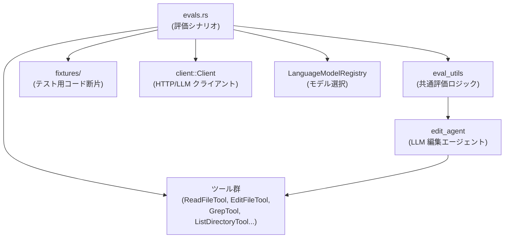

- **`evals.rs`**  
  各 `#[test] fn eval_...` が個々の評価ケースを定義します。
- **`eval_utils`（別モジュール）**  
  サンプリング回数や合格率の管理、`EvalAssertion` による判定ロジックなどを提供します。
- **ツール群（`ReadFileTool` / `EditFileTool` / `GrepTool` など）**  
  エージェントが使う「ファイル読み書き・検索」API を抽象化したものです。
- **fixtures ディレクトリ**  
  実際に編集させる対象ファイル（Rust / Python / Markdown）の「before」状態を文字列として保持します。
- **LanguageModelRegistry / Client 等**  
  どの LLM モデルを使うか・HTTP 通信などを管理します（このチャンクには実装は現れません）。

### 1.3 設計上のポイント

- **評価ロジックとシナリオの分離**
  - 汎用の評価ロジック（`eval_utils::eval`, `run_eval` など）は別モジュールに切り出し、  
    `evals.rs` 側は「どのファイルに対して、どんな編集指示を出すか」のみを記述しています。
- **会話ログ駆動のテスト**
  - 各テストは「ユーザー → アシスタント（ツール呼び出し）→ ユーザー（ツール結果）→ …」という**会話シナリオを固定**して実行します。
  - これにより、エージェントが「いつどのツールを呼ぶべきか」を限定し、**編集内容だけを評価**しやすくしています。
- **Diff ベースの判定**
  - `EvalAssertion::assert_eq`, `assert_diff_any`, `judge_diff` など複数の判定モードを使い分けています。
    - 厳密に一致が必要なケース
    - 「いくつかの望ましい diff パターンのどれか」でよいケース
    - モデル出力を自然文で評価する柔らかいケース
- **タグ整合性の集計**
  - `EditAgentOutputProcessor` が全サンプルでのタグ整合性（`mismatched_tags`）を集計し、  
    閾値（`mismatched_tag_threshold`）を超えたらテスト全体を失敗とします。

---

## 2. 主要な機能一覧

このディレクトリに含まれる主な機能（テストシナリオと補助構造体）を列挙します。

- **評価出力処理**
  - `EditAgentOutputProcessor`：複数評価サンプルのタグ整合性を集約し、閾値チェックを行う。
  - `EditEvalMetadata`：各サンプルにおけるタグ数と不整合タグ数を保持するメタデータ。

- **個別評価シナリオ（`evals.rs` 内のテスト関数）**
  - `eval_extract_handle_command_output`  
    - `blame.rs` の `run_git_blame` 末尾から、標準出力/標準エラー処理部分を `handle_command_output` というヘルパー関数に抽出できるかを評価。
  - `eval_delete_run_git_blame`  
    - 同じく `blame.rs` から `run_git_blame` 関数だけを削除し、他のコードは変更しない編集ができるかを評価。
  - `eval_translate_doc_comments`  
    - `canvas.rs` の**ドキュメントコメント（`///` など）だけ**をイタリア語に翻訳し、コード本文は変えない編集ができるかを評価。
  - `eval_use_wasi_sdk_in_compile_parser_to_wasm`  
    - `lib.rs` 内の `compile_parser_to_wasm` を、emscripten ベースから wasi-sdk ベースに書き換える大規模編集の評価。
  - `eval_disable_cursor_blinking`  
    - 巨大な `editor.rs` の中から `BlinkManager::enable` 等への呼び出しをコメントアウトし、外側の `update` ブロックは維持できるかを評価。
  - `eval_from_pixels_constructor`  
    - `canvas.rs` に新しい `Canvas::from_pixels` コンストラクタと、そのテストを同一ファイル内に追加できるかを評価。
  - `eval_zode`  
    - 長い Markdown プロンプトに従って、Anthropic SDK と MCP SDK を使う CLI エージェント `zode.py` を新規作成できるかを評価。
  - `eval_add_overwrite_test`（このチャンクは途中まで）  
    - `action_log.rs` に、既存ファイルを「新規作成扱いで上書きする」ケースのテストを追加できるかを評価。

- **fixtures（編集対象となるサンプルコード）**
  - `evals/fixtures/extract_handle_command_output/before.rs`  
    - Git blame の出力をパースする `Blame` モジュール（`run_git_blame`, `BlameEntry` など）。
  - `evals/fixtures/translate_doc_comments/before.rs`  
    - フォントレンダリング用の `Canvas` 実装（コメント翻訳用）。
  - `evals/fixtures/from_pixels_constructor/before.rs`  
    - 同じ `Canvas` 実装（新コンストラクタ追加用）。
  - `evals/fixtures/use_wasi_sdk_in_compile_parser_to_wasm/before.rs`  
    - tree-sitter の `Loader` 実装の一部（`compile_parser_to_wasm` など）。
  - `evals/fixtures/disable_cursor_blinking/before.rs`  
    - エディタ本体の大きな実装ファイル（カーソル点滅関連ロジックを含む）。
  - `evals/fixtures/zode/prompt.md`  
    - `zode.py` をどう作るかについての詳細な要求仕様（LLM 向けプロンプト）。
  - `evals/fixtures/zode/react.py`, `react_test.py`  
    - 反応型セル（`InputCell`, `ComputeCell`）の Python 実装とそのテスト。`zode` シナリオ内で参照されます。

---

## 4. 関数・構造体の解説

### 4.1 主な型一覧

このチャンクに現れる、評価シナリオ理解に重要な型をまとめます。

| 名前 | 定義ファイル | 種別 | 役割 / 用途 |
|------|-------------|------|-------------|
| `EditAgentOutputProcessor` | `evals.rs` | 構造体 | 編集エージェント評価の出力を集計し、タグ不整合率が許容範囲内かをチェックする。 |
| `EditEvalMetadata` | `evals.rs` | 構造体 | 1 サンプルあたりのタグ数・ミスマッチタグ数を保持するメタデータ。 |
| `Blame` | `extract_handle_command_output/before.rs` | 構造体 | 特定ファイルの blame 結果（`BlameEntry` のリスト）とコミットメッセージ、remote URL を保持。 |
| `BlameEntry` | 同上 | 構造体 | `git blame --incremental` 出力の 1 エントリ（SHA, 行範囲, 著者/コミッタ情報など）。 |
| `Canvas` | `from_pixels_constructor/before.rs`, `translate_doc_comments/before.rs` | 構造体 | メモリ上のビットマップ画面。ピクセルデータとサイズ、ストライド、およびフォーマットを保持。 |
| `Format` | 同上 | 列挙体 | `Canvas` の画素形式（`Rgba32` / `Rgb24` / `A8`）。 |
| `RasterizationOptions` | 同上 | 列挙体 | グリフ描画時のアンチエイリアス方法（白黒・グレースケール・サブピクセル）。 |
| `Config` | `use_wasi_sdk_in_compile_parser_to_wasm/before.rs` | 構造体 | tree-sitter ローダの設定。パーサ検索ディレクトリ一覧などを保持。 |
| `PathsJSON` | 同上 | 列挙体 | `tree-sitter.json` におけるパス指定（ゼロ個 / 単一 / 複数）を一つの型で表現。 |
| `LanguageConfigurationJSON` | 同上 | 構造体 | `tree-sitter.json` 内で言語ごとに設定される項目（スコープ、ファイル拡張子、クエリファイルのパスなど）。 |
| `TreeSitterJSON` / `Grammar` / `Metadata` など | 同上 | 構造体 | tree-sitter 用メタデータファイル全体を表現する型群。 |
| `LanguageConfiguration<'a>` | 同上 | 構造体 | 実行時に使う言語設定（正規表現やクエリファイルパスなどを含む）。 |
| `Loader` | 同上 | 構造体 | tree-sitter のパーサーをコンパイル・読み込みするローダ。 |
| `CompileConfig<'a>` | 同上 | 構造体 | `compile_parser_to_dylib` / `compile_parser_to_wasm` に渡すビルド設定。 |
| `InputCell`, `ComputeCell` (Python) | `zode/react.py` | クラス | シンプルなリアクティブ計算モデルの部品。テスト `react_test.py` で振る舞いが指定される。 |

> 備考: `LanguageConfiguration`, `Loader` 等は本来 tree-sitter ローダの本番コードですが、このディレクトリではあくまで**編集対象となるサンプルコード**として使われます。

### 4.2 重要な関数・メソッド（抜粋）

ここでは、評価シナリオに直接関わる代表的な関数・メソッドを 7 件まで詳しく説明します。

---

#### `EditAgentOutputProcessor::process(&mut self, output: &EvalOutput<EditEvalMetadata>)`

**概要**

- 1 回の評価サンプル結果を取り込み、タグ数・ミスマッチタグ数を累積します。
- パス or フェイルのサンプルのみを集計対象とします。

**引数**

| 引数名 | 型 | 説明 |
|--------|----|------|
| `output` | `&EvalOutput<EditEvalMetadata>` | 個々の評価サンプル結果（スコア、OutcomeKind、メタデータを含む）。 |

**戻り値**

- 戻り値は `()`（副作用としてフィールドを更新）。

**内部処理の流れ**

1. `output.outcome` が `OutcomeKind::Passed` か `OutcomeKind::Failed` のときのみ処理。
2. `output.metadata.tags` と `output.metadata.mismatched_tags` をそれぞれ加算。
3. `eval_outputs` ベクタに `output` のクローンを保存。

**Edge cases（エッジケース）**

- `OutcomeKind` がそれ以外（例: スキップや内部エラー）では集計されません。
- `tags` が 0 のサンプルはこのメソッド内では特別扱いされず、そのまま加算されます（最終的な `assert` で 0 除算にならないよう注意が必要です）。

**使用上の注意点**

- `assert` を呼ぶ前に、少なくとも 1 件以上のサンプルを `process` 済みである必要があります（そうでないと 0 除算の可能性があるため）。
- `mismatched_tag_threshold` は 0.0〜1.0 の間に設定する前提です。

---

#### `EditAgentOutputProcessor::assert(&mut self)`

**概要**

- 累積されたタグ不整合率を計算し、指定された閾値を超えていれば panic します。
- テスト全体の品質ゲートとして機能します。

**内部処理の流れ**

1. `mismatched_tag_ratio = cumulative_mismatched_tags / cumulative_tags` を `f32` として計算。
2. `mismatched_tag_ratio > self.mismatched_tag_threshold` なら:
   - `eval_outputs` に保存していた各サンプルのログ（`data`）を `println!`。
   - `panic!("Too many mismatched tags: ...")` を発生させる。
3. それ以外の場合は何もせず終了。

**Edge cases**

- `cumulative_tags == 0` の状態で呼ぶと 0 除算になります。この状況は設計上想定していないと考えられます。

**使用上の注意点**

- `eval_utils::eval` 側で必ずサンプルを 1 件以上実行してから `assert` を呼ぶ前提になっていると解釈できます（このチャンクだけでは保証は読み取れません）。

---

#### `async fn run_git_blame(git_binary: &Path, working_directory: &Path, path: &Path, contents: &Rope) -> Result<String>`

（`extract_handle_command_output/before.rs` より）

**概要**

- `git blame --incremental --contents - <path>` を実行し、標準出力を文字列として返します。
- 作業ツリーにコミットが存在しない場合やファイルがない場合など、特定のエラーは「空文字列」として扱って成功扱いにします。

**引数**

| 引数名 | 型 | 説明 |
|--------|----|------|
| `git_binary` | `&Path` | 実行する git バイナリへのパス。 |
| `working_directory` | `&Path` | `git` コマンドのカレントディレクトリ。 |
| `path` | `&Path` | blame 対象となるファイルパス。 |
| `contents` | `&Rope` | ファイル内容（作業ツリー上のファイルとは別に、標準入力から渡す内容）。 |

**戻り値**

- 成功時: `Ok(String)` — `git blame` の標準出力（UTF-8 としてパースされたもの）。
- 特定エラー時: `Ok(String::new())` — blame 結果がないことを表す空文字列。
- その他の失敗: `Err(anyhow::Error)`。

**内部処理の流れ**

1. `util::command::new_smol_command(git_binary)` で非同期プロセスを構築し、  
   `blame --incremental --contents - <path>` を指定、stdin/stdout/stderr をパイプに設定。
2. `contents.chunks()` をループしながら、チャンクをすべて標準入力に書き込む。
3. `child.output().await` でコマンドの完了を待ち、`Output` を取得。
4. `output.status.success()` を確認し、失敗なら stderr を UTF-8 として読み込み:
   - `stderr.trim()` が `GIT_BLAME_NO_COMMIT_ERROR` と等しい、もしくは `GIT_BLAME_NO_PATH` を含む場合は `Ok(String::new())` を返す。
   - それ以外の場合は `anyhow::bail!` でエラーを返す。
5. 成功時は `output.stdout` を UTF-8 として `String` に変換して返す。

**Examples（使用例）**

```rust
use std::path::Path;
use text::Rope;

async fn example() -> anyhow::Result<()> {
    let git = Path::new("git");
    let workdir = Path::new("/path/to/repo");
    let file = Path::new("src/lib.rs");
    let rope = Rope::from("file contents here");

    let blame_output = run_git_blame(git, workdir, file, &rope).await?;
    if blame_output.is_empty() {
        // コミットが存在しない、またはファイルが未追跡など
    } else {
        // parse_git_blame(blame_output) などに渡す
    }
    Ok(())
}
```

**Errors / Panics**

- `spawn()` や `output()` の失敗は `anyhow::Error` として返されます。
- `stdout` / `stderr` が UTF-8 でない場合は `String::from_utf8` が `Err` となり、`?` により `anyhow::Error` になります。

**Edge cases**

- **コミットがまだないリポジトリ**: `fatal: no such ref: HEAD` → 空文字列を返す。
- **パスが存在しない**: エラーメッセージに `fatal: no such path` を含む → 空文字列を返す。
- 上記以外の git エラー（例: 権限エラー）はすべてエラー扱いになります。

**使用上の注意点**

- blame 結果の解釈には別途 `parse_git_blame` を用いる前提です。
- 空文字列が返ってきた場合は「エラーではないが blame 情報はない」という扱いになるよう、呼び出し側で明示的に処理する必要があります。

---

#### `impl BlameEntry { fn new_from_blame_line(line: &str) -> Result<BlameEntry> }`

**概要**

- `git blame --incremental` 出力の**先頭行**をパースし、`BlameEntry` を構築します。
- この行は必ず `<sha> <sourceline> <resultline> <num-lines>` の形式である前提です。

**引数**

| 引数名 | 型 | 説明 |
|--------|----|------|
| `line` | `&str` | blame エントリの先頭行。 |

**戻り値**

- 成功時: `Ok(BlameEntry)`。
- パース失敗時: `Err(anyhow::Error)`（`with_context` により「どの値のパースに失敗したか」が含まれます）。

**内部処理の流れ**

1. `line.split_whitespace()` で SHA, original line, final line, line count を順に取得。
2. 各フィールドを `Oid`, `u32` にパース。失敗したら `with_context` により詳細なメッセージ付きで `Err`。
3. `start_line = final_line_number.saturating_sub(1)` とし、`end_line = start_line + line_count` を計算。
4. `range = start_line..end_line` を構築。
5. `BlameEntry { sha, range, original_line_number, ..Default::default() }` を返す。

**Edge cases**

- `line` がトークン数不足（4 未満）の場合、`parts.next()` が `None` となり、その後の `parse::<u32>()` で `with_context` 経由のエラーが発生します。
- `line_count` が 0 の場合でも `start_line..start_line` という空範囲になるだけで、特別な処理はありません。

**使用上の注意点**

- この関数は**署名情報（author, committer など）は設定しません**。後続のパース処理で埋め込まれます。
- `range` の解釈（0 始まりか 1 始まりか）は、後続処理と合わせて扱う必要があります（ここでは最終行番号から 1 を引いて 0 ベースの開始行を作っています）。

---

#### `impl Canvas { pub fn new(size: Vector2I, format: Format) -> Canvas; pub fn with_stride(size: Vector2I, stride: usize, format: Format) -> Canvas }`

**概要**

- `Canvas::new` は指定サイズ・フォーマットで**ストライドを自動計算**して新しいキャンバスを初期化します。
- `Canvas::with_stride` はストライド（1 行あたりのバイト数）を呼び出し側が指定するバリアントです。
- どちらも画素データを全て 0（透明黒）で初期化します。

**引数**

`new`:

| 引数名 | 型 | 説明 |
|--------|----|------|
| `size` | `Vector2I` | 幅と高さ（ピクセル単位）。 |
| `format` | `Format` | 画素フォーマット。`bytes_per_pixel()` によりバイト数が決まる。 |

`with_stride`:

| 引数名 | 型 | 説明 |
|--------|----|------|
| `size` | `Vector2I` | 幅と高さ。 |
| `stride` | `usize` | 行ごとのバイト数（呼び出し側で指定）。 |
| `format` | `Format` | 画素フォーマット。 |

**戻り値**

- どちらも `Canvas` 構造体を返します。

**内部処理の流れ**

- `new`:
  1. `stride = size.x() as usize * format.bytes_per_pixel() as usize` を計算。
  2. `Canvas::with_stride(size, stride, format)` を呼び出す。
- `with_stride`:
  1. `pixels = vec![0; stride * size.y() as usize]` でゼロ初期化されたバッファを確保。
  2. `Canvas { pixels, size, stride, format }` を返す。

**Examples（使用例）**

```rust
use pathfinder_geometry::vector::Vector2I;

let size = Vector2I::new(640, 480);
let canvas = Canvas::new(size, Format::Rgba32);
// 640x480, 4byte/pixel の RGBA キャンバスを作成
```

**Edge cases**

- `stride * size.y()` が非常に大きい場合、メモリ確保に失敗する可能性があります。
- 幅とフォーマットに対し、`with_stride` で小さすぎる `stride` を指定すると、後続の blit 処理で `assert!` に引っかかる可能性があります（`blit_from` 内で検査あり）。

**使用上の注意点**

- ピクセルデータを外部から供給したい場合（今回の eval で追加を求められている `from_pixels` など）は、`Canvas::with_stride` のロジックを参考に、ストライドとバッファ長の整合性を保つ必要があります。

---

#### `fn wrap_with_prefix(line_prefix: String, unwrapped_text: String, wrap_column: usize, tab_size: NonZeroU32, preserve_existing_whitespace: bool) -> String`

（`disable_cursor_blinking/before.rs` 内、単語ラッピング補助）

**概要**

- 指定されたテキスト `unwrapped_text` を単語/空白単位で折り返し、各行頭に `line_prefix` を付与します。
- インデントや全角文字を含むさまざまなケースに対応するため、`WordBreakingTokenizer` と拡張タブ幅計算を用いています。

**引数**

| 引数名 | 型 | 説明 |
|--------|----|------|
| `line_prefix` | `String` | 各行頭に挿入するプレフィックス（例: `"// "`）。 |
| `unwrapped_text` | `String` | 折り返し前のテキスト。 |
| `wrap_column` | `usize` | 1 行あたりの最大グラフェム数（プレフィックス込み）。 |
| `tab_size` | `NonZeroU32` | タブの展開幅（スペース何個分か）。 |
| `preserve_existing_whitespace` | `bool` | 既存の空白を極力保持するか、単一スペースに正規化するか。 |

**戻り値**

- 折り返し処理後のテキスト。行頭に `line_prefix` が付与され、必要に応じて改行が挿入されています。

**内部処理の流れ（概要）**

1. `line_prefix_len` を `char_len_with_expanded_tabs` で計算。
2. `WordBreakingTokenizer` で `unwrapped_text` を単語 / 空白 / 改行トークンに分割。
3. トークンごとに現在行の長さを見ながら:
   - 行長が `wrap_column` を超えるなら、現在行を `wrapped_text` に push して新しい行を開始。
   - 空白トークンの場合、`preserve_existing_whitespace` に応じて 1 つのスペースに潰したり、そのまま残したりする。
   - 改行トークンの場合、`preserve_existing_whitespace` の設定に応じて実際の改行とするか、スペースに変換するかを決定。
4. 最後の行を `wrapped_text` に追加して返す。

**Examples（使用例）**

```rust
let result = wrap_with_prefix(
    "// ".to_string(),
    "xx \nyy zz aa bb cc".to_string(),
    12,
    NonZeroU32::new(4).unwrap(),
    false,
);
// => "// xx yy zz\n// aa bb cc"
```

**Edge cases**

- すでに改行を含むテキストを渡した場合、`preserve_existing_whitespace` の値によって挙動が変わります。
- 全角文字や結合文字を含む場合も、`UnicodeSegmentation` を用いてグラフェム単位で処理しています。

**使用上の注意点**

- コメント整形や自動改行機能などで利用される前提のユーティリティです。  
  `disable_cursor_blinking` の評価自体はこの関数を編集対象にはしていませんが、周辺コードとして存在します。

---

#### `pub fn compile_parser_to_wasm(&self, language_name: &str, root_path: Option<&Path>, src_path: &Path, scanner_filename: Option<&Path>, output_path: &Path, force_docker: bool) -> Result<(), Error>`

（`use_wasi_sdk_in_compile_parser_to_wasm/before.rs` より）

**概要**

- tree-sitter の C パーサー (`parser.c` と任意の `scanner.c`) を WASM モジュールにコンパイルします。
- 現状の実装では **emscripten (emcc)** を使い、ローカルの `emcc` / `docker` / `podman` の順に利用可能なものを選択します。
- 評価シナリオでは、この関数を **wasi-sdk ベースに書き換える**ことが要求されます。

**引数**

| 引数名 | 型 | 説明 |
|--------|----|------|
| `language_name` | `&str` | エクスポートする関数名に用いる言語名（`tree_sitter_<language_name>`）。 |
| `root_path` | `Option<&Path>` | ソース一式のルートディレクトリ（未指定なら `src_path` 自体が root）。 |
| `src_path` | `&Path` | `parser.c` などを含むディレクトリ。 |
| `scanner_filename` | `Option<&Path>` | 追加コンパイルする `scanner.c` の相対パス（あれば）。 |
| `output_path` | `&Path` | 出力 `.wasm` ファイルのパス。 |
| `force_docker` | `bool` | ローカル emcc があっても docker/podman 経由を強制するかどうか。 |

**戻り値**

- 成功時: `Ok(())`
- 失敗時: `Err(anyhow::Error)`（`anyhow` を通じたエラー）

**内部処理の流れ（現在の実装）**

1. `EmccSource`（Native / Docker / Podman）を決定:
   - `!force_docker && Command::new("emcc")` 成功 → Native。
   - それ以外で `docker` or `podman` が使えるかチェック。
   - どれも無ければエラー。
2. `Command` を構築:
   - Native の場合: `emcc` を `src_path` のカレントディレクトリで実行。
   - Docker/Podman の場合:
     - `/src` に `root_path` をマウント。
     - `--workdir` に `src_path` に対応するコンテナ内パスを指定。
     - `PODMAN_USERNS=keep-id` や、Unix では `--user <uid>` を設定。
     - イメージタグ `EMSCRIPTEN_TAG` を指定し、`emcc` を実行。
3. 共通のコンパイル引数を追加:
   - `-o output.wasm`, `-Os`, `-s WASM=1`, `-s SIDE_MODULE=2`, `-s TOTAL_MEMORY=...` など。
   - エクスポート関数として `tree_sitter_<language_name>` を含む `EXPORTED_FUNCTIONS` を指定。
   - `parser.c` と任意の `scanner_filename` を引数に追加。
4. コマンドを実行し、`status.success()` で成功を確認。失敗なら `anyhow::ensure!` でエラー。
5. `src_path/output.wasm` を `output_path` に `fs::rename` で移動。

**Examples（使用例）**

```rust
let loader = Loader::with_parser_lib_path(PathBuf::from("..."));
loader.compile_parser_to_wasm(
    "javascript",
    Some(Path::new("/path/to/grammar/root")),
    Path::new("/path/to/grammar/root/src"),
    Some(Path::new("scanner.c")),
    Path::new("/path/to/output/javascript.wasm"),
    false,
)?;
```

**Errors / Panics**

- `emcc`, `docker`, `podman` のいずれも利用できない場合、「emcc, docker, or podman が必要」というエラーメッセージで失敗します。
- コマンド実行に失敗した場合や、`status.success()` が false の場合は、標準出力・標準エラーを含むエラーを返します。
- ファイルの `rename` に失敗した場合も `anyhow::Error` になります。

**Edge cases**

- Windows では `emcc.bat` を探すなどの分岐があります（`emcc_name` 変数）。
- `root_path` と `src_path` の関係が意図どおりでない場合、コンテナ内マウントパスの計算がずれる可能性があります。

**使用上の注意点**

- 評価では「wasi-sdk を用いるように変更する」ことが要求されているため、既存の emscripten 固有のフラグや docker/podman 前提のロジックをどのように移行するかがポイントになります。
- 新しい実装でも `output_path` が既定のキャッシュディレクトリ配下になること、および再コンパイル条件（タイムスタンプなど）との整合が必要です（ただしその部分の実装は別関数にあります）。

---

#### `fn handle_focus(&mut self, window: &mut Window, cx: &mut Context<Self>)`

（`disable_cursor_blinking/before.rs` 内、`impl Editor`）

**概要**

- エディタがフォーカスを得たときに呼ばれるハンドラです。
- 以前フォーカスしていた子要素を復帰させるか、カーソル点滅や blame ビューなどエディタ内部状態を更新します。
- `eval_disable_cursor_blinking` では、このメソッド内の `BlinkManager::enable` 呼び出しを含むブロックをコメントアウトすることが求められます。

**引数**

| 引数名 | 型 | 説明 |
|--------|----|------|
| `window` | `&mut Window` | フォーカス操作などを行う対象ウィンドウ。 |
| `cx` | `&mut Context<Self>` | イベント送信や子オブジェクト更新に使うコンテキスト。 |

**戻り値**

- 戻り値は `()`。

**内部処理の流れ**

1. `cx.emit(EditorEvent::Focused)` で `Focused` イベントを発行。
2. `self.last_focused_descendant` に保存されている `WeakEntity` を `upgrade()` し、まだ生きていればその子にフォーカスを戻す。
3. そうでなければ:
   - `blame` ビュー（あれば）に `GitBlame::focus` を送って更新。
   - `blink_manager.update(... enable)` でカーソル点滅を有効化。
   - `show_cursor_names` でカーソル名表示を更新。
   - `buffer.update(...)` で最後のトランザクションを finalize し、リーダーでなければアクティブ selection をセット。

**Edge cases**

- `last_focused_descendant` が既に drop 済みの場合は `upgrade()` で `None` となり、「else 側」の処理に入ります。
- `leader_peer_id.is_some()` の場合は selection を上書きしません（コラボレーション時の主従判定らしき処理）。

**使用上の注意点**

- `eval_disable_cursor_blinking` の指示では「`blink_manager.update` 内部のみコメントアウトし、外側の update ブロックは維持する」ことが条件になっています。  
  つまり、この関数のロジック全体は原則残しつつ、カーソル点滅に関わる部分だけを無効化するのが正しい編集です。

---

#### `#[test] fn eval_from_pixels_constructor()`

（`evals.rs`）

**概要**

- `font-kit/src/canvas.rs`（fixture）に新しい `from_pixels` コンストラクタとそのテストを追加させる評価ケースです。
- 多数のサンプル（100）を実行し、一定の合格率とタグ整合性を満たすことを期待します。

**内部処理の流れ（テストとして）**

1. `input_file_path` として `"root/canvas.rs"` を設定。
2. `input_file_content` に `evals/fixtures/from_pixels_constructor/before.rs` を `include_str!` で読み込む。
3. `edit_description` に「コンストラクタ実装とテスト追加」という説明文をセット。
4. `eval_utils::eval(100, 0.95, mismatched_tag_threshold(0.25), move || { ... })` を呼び出し:
   - 100 サンプル
   - 期待パス率 0.95
   - タグ不整合許容量 0.25
5. クロージャの中で `run_eval(EvalInput::from_conversation(...))` を実行:
   - ユーザー: 「`from_pixels` を追加し、テストも追加して」と指示。
   - アシスタント: `ReadFileTool` でファイルを読み取るツール呼び出しを発行。
   - ユーザー: `tool_result` で `before.rs` の中身を返す。
   - アシスタント: `EditFileTool` を `mode: Edit` で呼び出し、編集を開始。
   - `EvalAssertion::judge_diff("...")` で「新コンストラクタとテストが diff に含まれているか」を判定。

**使用上の注意点**

- 判定は「自然文による説明（`judge_diff`）」で行われるため、diff が多少異なる位置に挿入されていても、条件を満たしていれば合格として扱われます（`judge_diff` の内部実装はこのチャンクにはありません）。

---

### 4.3 その他の関数・メソッド（概要のみ）

このチャンクに現れるが、上記ほど詳細説明は不要な関数を一覧として挙げます。

| 関数名 / メソッド名 | 定義場所 | 役割（1 行） |
|----------------------|----------|--------------|
| `parse_git_blame(output: &str)` | `extract_handle_command_output/before.rs` | `git blame --incremental` の生文字列を `BlameEntry` のベクタにパースする。 |
| `BlameEntry::author_offset_date_time` | 同上 | 著者のタイムスタンプとタイムゾーンから `OffsetDateTime` を構築する。 |
| `char_len_with_expanded_tabs(offset, text, tab_size)` | `disable_cursor_blinking/before.rs` | タブ文字を指定幅に展開したときの表示幅（文字数）を計算する。 |
| `WordBreakingTokenizer::next` | 同上 | 文字列を単語・インライン空白・改行トークンに分割するイテレータ。 |
| `snippet_completions` | `disable_cursor_blinking/before.rs` | スニペット定義から補完候補を構築する。 |
| `needs_recompile(lib_path, paths_to_check)` | `use_wasi_sdk_in_compile_parser_to_wasm/before.rs` | 生成物より新しいソースファイルがあるかを見て再コンパイルの必要を判定する。 |
| `replace_dashes_with_underscores(name)` | 同上 | 言語名から `tree_sitter_<name>` に使うため `-` を `_` に変換する。 |
| Python `ReactTest` クラス内の各テストメソッド | `zode/react_test.py` | `InputCell` / `ComputeCell` の期待される振る舞い（依存関係の更新やコールバック通知）を定義する。 |

---

## 5. データフロー

ここでは代表的な評価ケース（`eval_from_pixels_constructor`）における処理の流れを説明します。

### 5.1 概要

1. Rust テストランナーが `eval_from_pixels_constructor` を呼び出します。
2. テストは `eval_utils::eval` に評価条件（サンプル数・期待パス率など）と「1 サンプル分の実行クロージャ」を渡します。
3. クロージャ内で `run_eval(EvalInput::from_conversation(...))` が呼ばれ、  
   - ファイルシステム（おそらく `FakeFs`）に `before.rs` の内容を書き出し、
   - エージェントに会話履歴とツール（`ReadFileTool`, `EditFileTool`）を与えて実行します。
4. エージェントはツール呼び出しを通じてファイルを読み・編集し、最終的なファイル内容が `EvalAssertion` に渡されます。
5. `eval_utils::eval` が全サンプルの結果を集計し、閾値を満たしていればテスト成功とします。

### 5.2 シーケンス図

コードから直接は読み取れない内部実装もありますが、名前と利用方法から推測できる範囲での流れを図にすると次のようになります。

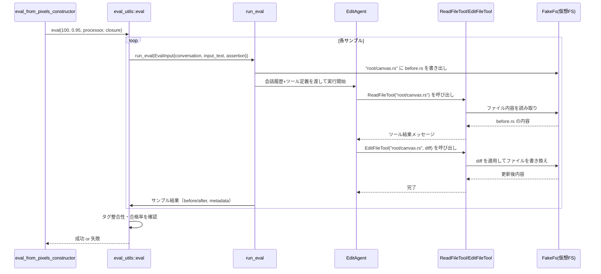

> 注意: `run_eval` や `EditAgent` の内部実装はこのチャンクには現れませんが、関数名と周辺コードから上記のようなデータフローであると解釈できます。

---

## 6. 使い方（How to Use）

### 6.1 基本的な使用方法

このディレクトリのコードは**通常の Rust テスト**として実行されますが、多くのテストに

```rust
#[cfg_attr(not(feature = "unit-eval"), ignore)]
```

が付いているため、デフォルトではスキップされます。  
`unit-eval` フィーチャを有効にしてテストを実行するのが前提です。

#### 例: 特定の評価だけを実行する

```bash
# crate 名やパスはプロジェクト構成によります
cargo test \
  -p agent \
  --features unit-eval \
  eval_from_pixels_constructor \
  -- --nocapture
```

- `--features unit-eval` … `cfg_attr` により `ignore` が外れ、評価テストが有効になる想定です。
- `-- --nocapture` … エラー時に `println!` の出力（タグ不整合の詳細など）を確認しやすくなります。

### 6.2 よくある使用パターン

1. **新しい評価ケースの追加**

   既存のテストを雛形として、新しい編集タスクを追加できます。

   ```rust
   #[test]
   #[cfg_attr(not(feature = "unit-eval"), ignore)]
   fn eval_my_new_case() {
       let input_file_path = "root/my_file.rs";
       let input_file_content = include_str!("evals/fixtures/my_case/before.rs");
       let edit_description = "Describe the intended edit here";

       eval_utils::eval(100, 0.9, mismatched_tag_threshold(0.1), move || {
           run_eval(EvalInput::from_conversation(
               vec![
                   message(User, [text(format!("Edit `{input_file_path}` ..."))]),
                   // 必要に応じて ReadFileTool / EditFileTool / GrepTool などのツール呼び出しを追加
               ],
               Some(input_file_content.into()),
               EvalAssertion::assert_eq(include_str!("evals/fixtures/my_case/after.rs")),
           ))
       });
   }
   ```

   - `before.rs` / `after.rs` を fixture として用意し、Diff を厳密比較するパターンです。

2. **判定方法の選択**

   - 正確な一致が必要: `EvalAssertion::assert_eq(expected_text)`
   - 複数の許容 diff: `EvalAssertion::assert_diff_any(possible_diffs)`
   - 自由度の高い評価: `EvalAssertion::judge_diff("期待される変更内容を自然文で記述")`

3. **評価の甘さ/厳しさの調整**

   - `eval_utils::eval(samples, required_pass_rate, processor, ...)` の第 2 引数を変えることで、  
     例えば 0.95 → 0.8 にすれば「合格ライン」を緩めることができます。
   - タグ整合性に関しては `mismatched_tag_threshold` の値で制御します。

### 6.3 よくある間違い

このディレクトリのコードパターンから推測できる、ありがちな落とし穴を挙げます。

- **パスの不整合**
  - テスト内では `"root/..."` のような仮想パスを使っていますが、fixture の `include_str!` パスと一致していないと、  
    実際に編集されるファイルが意図したものにならない可能性があります。
- **会話ログと初期テキストの不整合**
  - `EvalInput::from_conversation(..., Some(input_file_content.into()), ...)` の第 2 引数に  
    `before` 用文字列を渡し忘れると、評価ロジック側が「元テキスト」を把握できず、Diff 判定が期待どおりに動かない可能性があります。
- **ツール呼び出しの不足**
  - 既存のテストは必ず `ReadFileTool` → `EditFileTool` といったツール呼び出しを会話ログに含めています。  
    これがないと、エージェントがファイル内容を知る手段がなく、正しい編集を行えない前提になっています。

### 6.4 使用上の注意点（まとめ）

- **実行コスト**
  - 1 テストあたり数十〜数百サンプル、かつ LLM への問い合わせを行うため、  
    全評価を一度に走らせると時間とトークンコストが高くなります。必要なケースだけを個別に実行するのが現実的です。
- **モデル依存性**
  - 各テスト上部のコメントには特定モデル（例: `claude-3.7-sonnet`）での通過率が記載されていますが、  
    これはあくまで記録であり、テスト実行時のモデル設定は別の場所（`LanguageModelRegistry` 等）で行われます。
- **fixtures の編集**
  - `evals/fixtures/.../before.rs` などは評価の基準となるため、内容を変更すると**過去のスコアとの比較ができなくなる**点に注意が必要です。
- **zode のプロンプト内の API キー**
  - `zode/prompt.md` には固定の API キー文字列が含まれますが、あくまで評価用のダミー情報として扱われる前提であり、  
    実際の環境でそのまま利用するべきものではありません。

---

## 7. 関連ファイル

このディレクトリのコードと密接に関係するモジュール・ファイルを列挙します（パスはこのチャンクからは正確に分からないため、モジュール名ベースで記載します）。

| パス / モジュール | 役割 / 関係 |
|-------------------|------------|
| `crate::edit_agent::evals` | 現在解説しているモジュール自体。各種 `eval_...` テストを定義。 |
| `crate::edit_agent::eval_utils` | `EvalOutput`, `EvalAssertion`, `EvalInput`, `eval` など評価共通ロジックを提供するモジュール（このチャンクには定義は現れませんが、`use eval_utils::...` から参照されます）。 |
| `crate::edit_agent`（上位モジュール） | 実際の編集エージェント本体。`run_eval` の内部でインスタンス化されると考えられます。 |
| `crate::ReadFileTool`, `EditFileTool`, `GrepTool`, `ListDirectoryTool` | エージェントが使うファイル・検索系ツール。`evals.rs` の会話ログで名前のみ登場します。 |
| `client::Client`, `LanguageModelRegistry` | LLM への問い合わせやモデル選択を行うコンポーネント。評価環境の構築に使われます。 |
| `evals/fixtures/...` | このチャンクで見た `before.rs` / `prompt.md` / `react.py` など、編集対象となるサンプルコードやプロンプト。 |
| `project::Project`, `prompt_store::{ProjectContext, WorktreeContext}` | 実プロジェクトとの統合やプロンプト管理に関わるモジュール（`evals.rs` の `use` から参照されていますが、このチャンクには実装がありません）。 |

> 補足: これらの関連モジュールの実装は、このチャンク以外のファイルに分割されており、  
> 実際の処理内容を理解するにはそちらも合わせて読む必要があります。

---

# agent/src ディレクトリ

## 1. ざっくり一言

`agent/src` は、LLM ベースの「エージェントスレッド」を管理する中核ディレクトリです。  
会話スレッド (`Thread`) の状態管理、ツール呼び出し（ファイル編集・ターミナル実行・Web 取得など）、権限パターンの生成、システムプロンプトのテンプレート処理、およびそれらの統合テストが含まれています。

---

## 2. このモジュールの役割

### 2.1 概要

このディレクトリは、次のような問題を解決するために存在します。

- **問題**  
  - LLM との対話を状態付きで管理したい（メッセージ履歴、トークン使用量、リトライなど）。
  - LLM からのツール呼び出し（ファイル操作、ターミナルコマンド、Web 取得など）を安全に実行したい。
  - 「常に許可」「このディレクトリ配下のみ」など、ユーザー設定ベースのツール権限を表現したい。
  - システムプロンプトをテンプレートとして管理し、プロジェクトやツール構成に応じて動的に生成したい。

- **提供する主な機能**
  - `Thread` 構造体による会話スレッド・ツール実行・サブエージェントのライフサイクル管理。
  - `ToolPermissionContext` + `pattern_extraction` による安全なパターンベース権限（コマンド／パス／URL）。
  - `Templates` + `SystemPromptTemplate` によるシステムプロンプト生成。
  - テスト用ツール群（echo / delay / streaming / permission / cancellation など）と大規模な統合テスト。

### 2.2 アーキテクチャ内での位置づけ

このチャンクで見えている主なコンポーネント間の依存関係をまとめると、次のようになります。

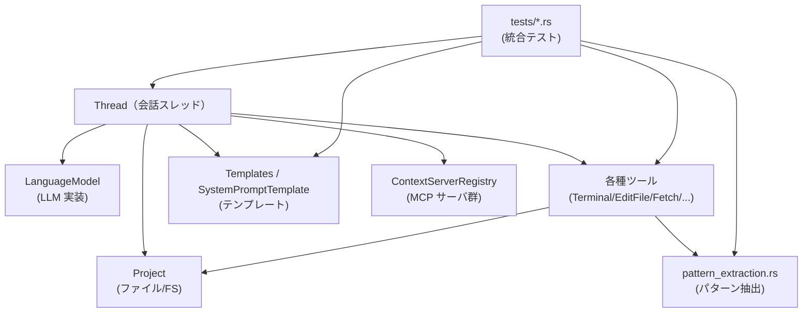

- `Thread` は中心となる会話管理コンポーネントです。
- `Thread` は `LanguageModel` を通して LLM にリクエストし、`Tools` を通して実際の操作（ファイル編集・ターミナルなど）を実行します。
- `Tools` の権限用パターン生成に `pattern_extraction` を利用します。
- `Templates` は `Thread` から利用され、システムプロンプトやエージェント用プロンプトの生成に使われます。
- `tests` 配下のファイルは、これらを組み合わせた振る舞い（リトライ・キャンセル・サブエージェントなど）を検証します。

### 2.3 設計上のポイント（読み取れる範囲）

- **責務の分割**
  - 会話状態・ツール実行・サブエージェント管理は `thread.rs` の `Thread` に集中。
  - コマンド／パス／URL からの「パターン抽出」は `pattern_extraction.rs` に分離。
  - プロンプトテンプレートは `templates.rs` に切り出し、`handlebars` と `RustEmbed` で管理。
  - テスト用のツール実装は `tests/test_tools.rs` に集約し、`tests/mod.rs` から利用。

- **状態管理**
  - `Thread` はメッセージ履歴（`Message` / `UserMessage` / `AgentMessage`）と、リクエストごとのトークン使用量を保持します。
  - 現在進行中のターンは `running_turn` で管理し、キャンセルやリトライに対応します。
  - サブエージェント（子スレッド）との関係は `SubagentContext` と `running_subagents` で追跡します。

- **エラーハンドリング・リトライ**
  - `CompletionError` と `RetryStrategy` により、LLM の一時的なエラー（ServerOverloaded など）に対してリトライ戦略を持ちます。
  - テスト `test_send_retry_on_error`, `test_send_max_retries_exceeded` などから、最大リトライ回数やディレイ制御が実装されていることが分かりますが、詳細実装はこのチャンクには含まれていません。

- **権限・安全性**
  - `ToolPermissionContext::build_permission_options` がツールごとの PermissionOptions を一元的に生成。
  - `pattern_extraction` を通して「`cargo build` コマンドのみ」「`src/` 配下のみ」「`docs.rs` のみ」など、限定されたパターンの「Always allow」を実現。
  - テストで `always_allow` / `always_deny` / `always_confirm` の挙動や、deny ルールによるツールブロックを詳細に検証しています。

---

## 3. 主要な機能一覧

このチャンクに登場する主な機能を列挙します。

- **会話スレッド管理**
  - `Thread` によるメッセージ履歴管理・LLM へのリクエスト構築・レスポンス（Thinking / Text / ToolUse / ToolResult）の取り込み。
  - トークン使用量追跡 (`latest_token_usage`, `tokens_before_message`) と、トランケーション (`truncate`)。

- **ツール呼び出しと権限制御**
  - `Thread::add_default_tools` による標準ツール登録（ファイル編集、削除、コピー／移動、ターミナル、Web 取得など）。
  - `ToolPermissionContext` + `pattern_extraction` による PermissionOptions 生成。
  - グローバル／ツール別の `AgentSettings` をもとにした自動 Allow/Deny/Confirm 判定。

- **パターン抽出ユーティリティ（pattern_extraction.rs）**
  - シェルコマンドからのターミナル権限パターン生成（`extract_terminal_pattern`, `extract_all_terminal_patterns`）。
  - ファイル・ディレクトリパスからのパターン生成（`extract_path_pattern`, `extract_copy_move_pattern`）。
  - URL からのドメインパターン生成（`extract_url_pattern`）。

- **テンプレート処理（templates.rs）**
  - `Templates` による Handlebars テンプレートエンジンの初期化と埋め込みテンプレートの読み込み。
  - `SystemPromptTemplate` によるシステムプロンプトのレンダリング。
  - Handlebars helper `contains` によりテンプレート内で「配列に要素が含まれるか」を判定。

- **テスト用ツール群（tests/test_tools.rs）**
  - 単純なエコーツール（`EchoTool`）。
  - 遅延ツール（`DelayTool`）。
  - ストリーミング入力ツール（`StreamingEchoTool`, `StreamingFailingEchoTool`）。
  - 権限確認が必要なツール（`ToolRequiringPermission`）。
  - キャンセル検証用ツール（`InfiniteTool`, `CancellationAwareTool`）。
  - スキーマを含むサンプルツール（`WordListTool`）。

- **統合テスト（tests/*.rs）**
  - ツールタイムアウト・キャンセル・トランケーションなどの動作検証。
  - MCP コンテキストサーバとの連携テスト。
  - サブエージェント生成・再開・キャンセル・コンテキストウィンドウ警告の挙動。
  - ツール権限ルール（Allow/Deny/Confirm + パターン）の動作検証。

---

## 4. 関数・構造体の解説

ここではこのチャンクに現れる重要な型・関数を、代表的なものに絞って解説します。

### 4.1 pattern_extraction.rs の主要関数

#### 型と役割

| 名前 | 種別 | 役割 / 用途 |
|------|------|-------------|
| `PermissionPattern` | 構造体（他 crate から） | `pattern: String`, `display_name: String` を持つツール権限用パターン |
| `CommandPrefix` | 構造体（ローカル） | 正規化済みのコマンドトークン列と表示用文字列を保持 |
| `normalize_separators` | 関数 | Windows などの `\` 区切りを `/` に正規化 |
| `extract_terminal_pattern` | 関数 | シェルコマンドから 1 つのコマンド／サブコマンド用 regex を生成 |
| `extract_all_terminal_patterns` | 関数 | パイプなどを含む複数コマンド列から、すべての PermissionPattern を抽出 |
| `extract_path_pattern` | 関数 | ファイルパスから「親ディレクトリ」単位の regex を生成 |
| `extract_copy_move_pattern` | 関数 | コピー／移動のソース・デストの共通親ディレクトリから regex を生成 |
| `extract_url_pattern` | 関数 | URL からドメイン単位の regex を生成 |

#### `extract_terminal_pattern(command: &str) -> Option<String>`

**概要**

- シェルコマンド文字列から、コマンド＋サブコマンドに対応する正規表現パターンを生成します。
- パターンは `^cargo\\s+test(\\s|$)` のような形式で、コマンドの先頭からマッチします。
- パス風（`./script.sh` や `/usr/bin/python` など）のコマンドは `None` を返すように上位のパーサと合わせて設計されています（テストから確認できますが、具体的な判定処理はこのファイル外の `extract_terminal_command_prefix` にあります）。

**引数**

| 引数名 | 型 | 説明 |
|--------|----|------|
| `command` | `&str` | シェルコマンド全体（例: `"cargo test -p search"`） |

**戻り値**

- `Some(String)` の場合: コマンド名＋サブコマンドにマッチする正規表現文字列。
- `None` の場合: コマンドが解析できない、またはパターン対象外（パス風コマンドなど）。

**内部処理の流れ**

1. `extract_command_prefix(command)` を呼び出して、先頭のコマンド列（env 変数指定やリダイレクトを含む）をパースします。
2. `prefix.normalized_tokens` を取り出します。これは空白正規化済みのトークン列です。
3. トークン列に応じてパターンを構成します。
   - `[]`（トークンなし）なら `None`
   - `[single]` なら `^single\\b`（`ls` や `rm` など単語単位）
   - `[rest @ .., last]` なら  
     `^rest1\\s+rest2\\s+...\\s+last(\\s|$)`  
     となるよう連結し、サブコマンドの後にスペースか行末で終わることを保証します。
4. 各トークンは `regex::escape` でエスケープされるため、特殊文字入りでも安全です。

**Examples（使用例）**

```rust
// "cargo build --release" → cargo build に対するパターン
assert_eq!(
    extract_terminal_pattern("cargo build --release"),
    Some("^cargo\\s+build(\\s|$)".to_string()),
);

// フラグが 2 つ目以降にある場合はコマンド名のみ
assert_eq!(
    extract_terminal_pattern("ls -la"),
    Some("^ls\\b".to_string())
);

// パス風コマンドは拒否（パターン化しない）
assert_eq!(extract_terminal_pattern("./deploy.sh --prod"), None);
```

**Edge cases（エッジケース）**

- `""`（空文字）: `extract_terminal_command_prefix` が失敗し `None` を返す想定です。
- `cargo build-foo`:  
  `"cargo build"` のパターンは `build-foo` にはマッチしないよう `(\\s|$)` を利用して区切りを明示しています（テストで検証済み）。
- `PAGER='less -R' git log`:  
  env 変数割り当てもトークン列に含められ、パターンは `"^PAGER='less \\-R'\\s+git\\s+log(\\s|$)"` のようにエスケープされます。

**使用上の注意点**

- この関数は「パターンベース常時許可」用であり、任意の shell コマンドを受け入れないように設計されています。
- `ToolPermissionContext::build_permission_options` 経由でのみ利用される前提であり、単独で使う場合も同様の前提条件（パス風コマンドを渡さないこと）を満たす必要があります。

#### `extract_all_terminal_patterns(command: &str) -> Vec<PermissionPattern>`

**概要**

- `cargo test 2>&1 | tail` のようなパイプ・リダイレクトを含むコマンド列から、すべてのサブコマンドに対する `PermissionPattern` を抽出します。
- パス風コマンド（`./script.sh` など）は除外されます。
- 重複するパターンは削除し、元の出現順を保ちます。

**引数・戻り値**

| 項目 | 型 | 説明 |
|------|----|------|
| `command` | `&str` | パイプやリダイレクトを含むコマンド列 |
| 戻り値 | `Vec<PermissionPattern>` | 各サブコマンドに対応するパターンと表示名のリスト |

**内部処理**

1. `shell_command_parser::extract_commands(command)` でパイプ等を考慮したコマンド分割を行います。
2. 各コマンドに対して `extract_terminal_permission_pattern` を呼びます。
   - ここでパス風コマンドは `None` となり、結果から除外されます。
3. `PermissionPattern` の `Eq` 実装を使って `results.contains(&pattern)` で重複チェック。
4. 一意なものだけを結果ベクタに追加。

**Example**

```rust
assert_eq!(
    extract_all_terminal_patterns("cargo test 2>&1 | tail"),
    vec![
        PermissionPattern {
            pattern: "^cargo\\s+test(\\s|$)".to_string(),
            display_name: "cargo test".to_string(),
        },
        PermissionPattern {
            pattern: "^tail\\b".to_string(),
            display_name: "tail".to_string(),
        },
    ]
);
```

**使用上の注意点**

- 返される順序はコマンドの出現順です。UI 側でそのまま表示するとユーザーの期待に沿いやすくなります。
- `ToolPermissionContext::build_permission_options` は、ここで得た `patterns` を `DropdownWithPatterns` に埋め込み、UI 側で「どのサブコマンドに適用するか」を選択できるようにしています。

#### `extract_path_pattern(path: &str) -> Option<String>`

**概要**

- 1 つのファイルパスから「親ディレクトリ」単位の regex を生成します。
- ルートディレクトリ直下 (`"/file.txt"` や `"file.txt"`) の場合はパターンを生成せず、`None` を返します。

**例**

```rust
assert_eq!(
    extract_path_pattern("/Users/alice/project/src/main.rs"),
    Some("^/Users/alice/project/src/".to_string())
);
assert_eq!(extract_path_pattern("/file.txt"), None);
```

**使用上の注意点**

- ルート (`"/"`) を許可するようなパターンは作らない設計になっています（安全性のため）。
- Windows パスも `\` が `/` に変換されるので、その後 `regex::escape` で正しく扱われます。

#### `extract_copy_move_pattern(input: &str) -> Option<String>`

**概要**

- `"source_path\n dest_path"` の形式の文字列から、ソースとデストの共通親ディレクトリを求め、そのディレクトリにマッチする regex を返します。
- 両者に共通部分がない場合（`/home/...` と `/tmp/...` など）は `None` になります。

**例**

```rust
assert_eq!(
    extract_copy_move_pattern(
        "/Users/alice/project/src/old.rs\n/Users/alice/project/dst/new.rs"
    ),
    Some("^/Users/alice/project/".to_string())
);
assert_eq!(
    extract_copy_move_pattern("/home/file.txt\n/tmp/file.txt"),
    None
);
```

#### `extract_url_pattern(url: &str) -> Option<String>`

**概要**

- `Url::parse` で URL をパースし、ホスト名（ドメイン）部分のみを取り出して `^https?://<escaped-domain>` というパターンを作ります。
- 非 URL 文字列の場合は `None`。

**例**

```rust
assert_eq!(
    extract_url_pattern("https://github.com/user/repo"),
    Some("^https?://github\\.com".to_string())
);
assert_eq!(extract_url_pattern("not a url"), None);
```

**使用上の注意点**

- プロトコルは `http` と `https` 双方にマッチするようになっています。
- パス部分やクエリはパターンに含まれないため、「このドメイン全体を常時許可する」用途に向きます。

---

### 4.2 templates.rs の主要要素

#### 型一覧

| 名前 | 種別 | 役割 / 用途 |
|------|------|-------------|
| `Assets` | 構造体（`RustEmbed`） | `src/templates/*.hbs` をバイナリに埋め込む |
| `Templates` | 構造体 | `Handlebars` エンジンをラップし、共有参照 (`Arc`) で利用 |
| `Template` | トレイト | 任意のデータ型をテンプレート名と結びつけてレンダリングする |
| `SystemPromptTemplate` | 構造体 | システムプロンプト生成用のテンプレート入力データ |
| `contains` | 関数 | Handlebars helper。「配列に要素が含まれるか」を判定 |

#### `Templates::new() -> Arc<Templates>`

**概要**

- Handlebars エンジンを初期化し、組み込みテンプレートを登録して `Templates` を構築します。

**処理の流れ**

1. `Handlebars::new()` で新規エンジンを作成。
2. `set_strict_mode(true)` で未定義変数使用時にエラーにする（テンプレートの安全性向上）。
3. `register_helper("contains", Box::new(contains))` で `{{contains ...}}` helper を登録。
4. `register_embed_templates::<Assets>()` で `src/templates` 配下の `*.hbs` をすべて登録。
5. `Arc::new(Self(handlebars))` で共有可能な `Templates` を返却。

**使用例**

```rust
let templates = Templates::new();
// 以降、SystemPromptTemplate などから利用
```

#### `Template` トレイトと `SystemPromptTemplate`

```rust
pub trait Template: Sized {
    const TEMPLATE_NAME: &'static str;

    fn render(&self, templates: &Templates) -> Result<String>
    where
        Self: Serialize + Sized,
    {
        Ok(templates.0.render(Self::TEMPLATE_NAME, self)?)
    }
}
```

- 任意の構造体に `Template` を実装すると、`T::TEMPLATE_NAME` というテンプレートを使って `render` が呼べます。

`SystemPromptTemplate` は以下のように定義されています。

```rust
#[derive(Serialize)]
pub struct SystemPromptTemplate<'a> {
    #[serde(flatten)]
    pub project: &'a prompt_store::ProjectContext,
    pub available_tools: Vec<SharedString>,
    pub model_name: Option<String>,
}

impl Template for SystemPromptTemplate<'_> {
    const TEMPLATE_NAME: &'static str = "system_prompt.hbs";
}
```

- `project` は `flatten` により、そのフィールドがトップレベルに展開されます。
- テスト `test_system_prompt_template` から、`system_prompt.hbs` は以下を含むことが分かります。
  - `"## Fixing Diagnostics"` セクション
  - 利用可能ツールがあるときだけ `"## Planning"` などを出す／出さないロジック
  - `model_name` を表示

**使用例**

```rust
// プロジェクトコンテキストとテンプレートエンジンを用意
let project = prompt_store::ProjectContext::default();
let template_input = SystemPromptTemplate {
    project: &project,
    available_tools: vec!["echo".into()],
    model_name: Some("test-model".to_string()),
};

let templates = Templates::new();
let rendered = template_input.render(&templates)?;

// `rendered` にシステムプロンプト文字列が入る
assert!(rendered.contains("## Fixing Diagnostics"));
assert!(rendered.contains("test-model"));
```

#### `contains` ヘルパー

**概要**

- Handlebars 内から `{{contains list query}}` のように呼び出し、`list` が `query` を含んでいれば `"true"` を出力します。
- 型チェックを行い、配列以外が渡された場合は `RenderError` を返します。

---

### 4.3 thread.rs の主要構造体とメッセージ変換

このチャンクには `Thread` 全体の一部が含まれています。ここでは、露出している範囲で主な型とメソッドを整理します。

#### 型一覧（抜粋）

| 名前 | 種別 | 役割 / 用途 |
|------|------|-------------|
| `Thread` | 構造体 | 1 セッション（会話スレッド）の状態管理・LLM 呼び出し・ツール実行の中核 |
| `Message` | enum | `User` / `Agent` / `Resume` の 3 種類のメッセージ |
| `UserMessage` | 構造体 | ユーザーからの発話と添付コンテキスト（メンション） |
| `UserMessageContent` | enum | テキスト・メンション・画像のいずれか |
| `AgentMessage` | 構造体 | モデルからのテキスト、Thinking、ToolUse、ToolResult の集合 |
| `AgentMessageContent` | enum | Text / Thinking / RedactedThinking / ToolUse |
| `TerminalHandle` | トレイト | ターミナルプロセスの抽象化（id / 出力 / kill / wait） |
| `SubagentHandle` | トレイト | サブエージェントスレッドの抽象化 |
| `ThreadEnvironment` | トレイト | ターミナル・サブエージェントの生成を抽象化 |
| `ThreadEvent` | enum | UI・テスト向けのイベント（ToolCall, Plan, Retry, Stop など） |
| `ToolPermissionContext` | 構造体 | 権限 UI を生成するためのツール名＋入力値＋スコープ |
| `SubagentContext` | 構造体 | 親スレッド ID と現在の深さ（`MAX_SUBAGENT_DEPTH`）を保持 |

#### `UserMessage::to_request(&self) -> LanguageModelRequestMessage`

**概要**

- `UserMessage` を LLM API 用の `LanguageModelRequestMessage` に変換します。
- テキスト本体に加え、各種メンションを `<context>` セクション内のタグ（`<files>`, `<directories>`, `<symbols>` 等）としてまとめます。

**主な挙動（コードから読み取れる範囲）**

- `UserMessageContent::Text`:
  - そのまま `MessageContent::Text` として追加。
- `UserMessageContent::Image`:
  - `MessageContent::Image` として追加。
- `UserMessageContent::Mention { uri, content }`:
  - `uri` の種類に応じて、対応するコンテキスト用文字列に追記します。
    - `MentionUri::File` → `<files>` 内にコードブロックを追加。
    - `MentionUri::Directory` → `<directories>`。
    - `MentionUri::Symbol` / `Selection` / `TerminalSelection` → `<symbols>` / `<selections>`。
    - `MentionUri::Thread` → `<threads>`。
    - `MentionUri::Rule` → `<rules>`。
    - `MentionUri::Fetch` → `<fetched_urls>`。
    - `MentionUri::Diagnostics` → `<diagnostics>`。
    - `MentionUri::GitDiff` / `MergeConflict` → `<diffs>` / `<merge_conflicts>`。
  - 本文側には `uri.as_link()` によるリンク文字列を `Text` として追加。

- 最後に、いずれかのコンテキストブロックに内容が追加されていれば：
  - `<context>` という説明文付きオープニングテキストを差し込み、
  - それぞれ `</files>`, `</directories>` 等の終端タグを付加して `MessageContent::Text` として追加。

**使用上の注意点**

- `MentionUri::PastedImage` に対するメンションは想定されておらず、`debug_panic` が入っています（このケースは呼び出し側で避ける必要があります）。
- コンテキストは 1 つの `LanguageModelRequestMessage` にまとめられるため、LLM 側では `<context>` タグを元に添付情報を識別している前提です。

#### `AgentMessage::to_request(&self) -> Vec<LanguageModelRequestMessage>`

**概要**

- `AgentMessage` を、Assistant ロールと ToolResult を含む User ロールの 2 つの `LanguageModelRequestMessage` に変換します。
- ToolUse が ToolResult に対応している場合のみ、Assistant メッセージに ToolUse が含まれます。

**挙動**

1. Assistant メッセージ構築
   - `AgentMessageContent::Text` → `MessageContent::Text`
   - `Thinking` → `MessageContent::Thinking`
   - `RedactedThinking` → `MessageContent::RedactedThinking`
   - `ToolUse` → `tool_results` に同じ ID が存在するときのみ `MessageContent::ToolUse` として含める。
2. User メッセージ構築（ToolResult 用）
   - `tool_results` の値をすべて `MessageContent::ToolResult` として追加。
   - `content` が空文字の場合は API がエラーになるため、`"<Tool returned an empty string>"` に置き換え。
3. Assistant 側が空でなければ先頭に、それに続いて User 側を追加し、合計 0〜2 件のメッセージとして返却。

**使用上の注意点**

- ToolUse と ToolResult の対応は `LanguageModelToolUseId` を key とする `IndexMap` によって管理されています。
- ToolResult を返す際は `is_error` と `output`（デバッグ用）を適切に設定する必要があります（テストでは、権限拒否などで `is_error = true` になるパターンも検証されています）。

---

### 4.4 ToolPermissionContext::build_permission_options

`ToolPermissionContext` はツールごとの「この操作を許可するか？」UI を構築するための情報を持ち、`build_permission_options` がその中心的なメソッドです。

#### シグネチャ

```rust
impl ToolPermissionContext {
    pub fn build_permission_options(&self) -> acp_thread::PermissionOptions { ... }
}
```

**概要**

- ツール名（`tool_name`）と入力値（`input_values`）に基づいて、ユーザーに提示する PermissionOptions を生成します。
- 生成されるオプションは以下のいずれかです。
  - `PermissionOptions::Flat`（Yes/No の単純な 2 択; シンボリックリンク対象など）
  - `PermissionOptions::Dropdown`（「ツール全体を always allow」「パターン単位」「今回だけ」）
  - `PermissionOptions::DropdownWithPatterns`（パイプラインコマンド用; per-command パターンを別枠で渡す）

**重要な分岐**

1. **シンボリックリンク対象 (`ToolPermissionScope::SymlinkTarget`)**
   - 常に `Flat` 形式で、`AllowOnce` / `RejectOnce` の 2 択。

2. **TerminalTool かつシェルが POSIX ライクなチェインをサポート**
   - `ShellKind::system().supports_posix_chaining()` が true の場合のみ「Always allow」を表示。
   - パイプラインコマンド (`"cargo test 2>&1 | tail"`) で `extract_all_terminal_patterns` の結果が 2 個以上なら、`DropdownWithPatterns` を返却。
     - `choices`: 「Always for terminal」「Only this time」
     - `patterns`: 個々のコマンドごとの `PermissionPattern` リスト（テストで `"cargo test"` と `"tail"` の 2 つになることを確認）。

3. **その他のツール**
   - `EditFileTool`, `DeletePathTool`, `MovePathTool`, `CopyPathTool`, `CreateDirectoryTool`, `SaveFileTool`:
     - 各 input 値から `extract_path_pattern` / `_display` を使って親ディレクトリ単位のパターンを抽出。
   - `FetchTool`:
     - `extract_url_pattern` / `_display` でドメイン単位のパターンを抽出。
   - `TerminalTool`（単一コマンド or 非パイプライン）:
     - `extract_terminal_pattern` / `_display` を利用。

   - 全ての input から得られるパターンが同一のときだけ、パターン単位の「Always for `xxx`」ボタンを追加。

4. **基本的な選択肢**
   - （shell が対応していれば）「Always for {tool_name}」:
     - `allow.option_id = "always_allow:{tool_name}"`, `deny.option_id = "always_deny:{tool_name}"`
   - パターン単位の Always:
     - `"Always for`cargo build`commands"` など、`sub_patterns` に regex パターンを設定。
   - 「Only this time」:
     - `allow.option_id = "allow"`, `deny.option_id = "deny"`

**テストで確認されていること**

- ターミナルコマンド:
  - `"cargo build --release"` → 「Always for terminal」「Always for `cargo build` commands」「Only this time」の 3 つ。
  - `"ls -la"` → パターンは `^ls\\b` で、「Always for `ls` commands」。
  - パス風 `"./deploy.sh --production"` → パターンが作れないため、「Always for commands」は出ず、「Always for terminal」「Only this time」の 2 つ。
- パイプライン:
  - `"cargo test 2>&1 | tail"` → `DropdownWithPatterns` となり、`patterns` には `"cargo test"` と `"tail"` の 2 つが入る。
- パスベースツール:
  - `EditFileTool` + `"src/main.rs"` → 「Always for `src/`」オプションが生成される。
- Fetch:
  - `"https://docs.rs/gpui"` → 「Always for `docs.rs`」オプション。

---

### 4.5 tests/test_tools.rs に定義される代表的なツール

テスト用ツールは実装の理解にも有用なので、いくつかを簡単に紹介します。

#### `EchoTool`

**概要**

- 入力文字列をそのまま返す単純なツールです。
- 多くのテストで「ツール呼び出しの基本」を検証するために使われます。

**run の挙動**

```rust
fn run(
    self: Arc<Self>,
    input: ToolInput<Self::Input>,
    _event_stream: ToolCallEventStream,
    cx: &mut App,
) -> Task<Result<String, String>> {
    cx.spawn(async move |_cx| {
        let input = input
            .recv()
            .await
            .map_err(|e| format!("Failed to receive tool input: {e}"))?;
        Ok(input.text)
    })
}
```

- `ToolInput::recv().await` で最終的な入力を 1 回受け取り、その `text` を返すだけです。

#### `StreamingEchoTool`

- `supports_input_streaming() -> true` を返し、`recv_partial().await` で部分入力を読み続けた後、`recv()` で最終入力を受け取ります。
- 任意で `wait_until_complete_rx` を待つことで、「他ツールが終わるまで結果を返さない」ようなテスト用挙動も再現できます。

#### `StreamingFailingEchoTool`

- 一定回数 `recv_partial()` を受け取ったあと、`Err("failed")` を返すツールです。
- `test_streaming_tool_error_breaks_stream_loop_immediately` などで「ストリーミングツールが途中で失敗した場合に、ストリームループが即座に終了し、エラー結果が次のリクエストに反映される」ことを検証するために用いられています。

#### `CancellationAwareTool`

- `event_stream.cancelled_by_user().await` を待ち続け、キャンセルが来たら `was_cancelled` フラグを立てて `Err("Tool cancelled by user")` を返すツールです。
- `test_cancellation_aware_tool_responds_to_cancellation` により、キャンセルを適切に検知するツールの姿勢が確認されています。

---

## 5. データフロー

ここでは、`EditFileTool` をスレッド経由で呼び出すテスト  
`tests/edit_file_thread_test.rs::test_edit_file_tool_in_thread_context` を例に、代表的なデータフローを説明します。

### 5.1 処理の要点

- ユーザーが `"Read the file src/main.rs"` というメッセージを送信すると、`Thread` は LLM にリクエストを送ります。
- LLM は `ReadFileTool` を呼び出す ToolUse イベントを返し、`Thread` は `ReadFileTool` を実行してファイル内容を読み取り、その結果を ToolResult として LLM に返します。
- その後 LLM は `EditFileTool` を ToolUse し、`EditFileTool` は内部で **編集専用のサブエージェント** を立ち上げて、再度 LLM に「どのテキストをどう書き換えるか」の指示を求めます。
- サブエージェントから `<old_text>...<new_text>...</new_text>` のようなレスポンスを受け取ると、`EditFileTool` はファイルを書き換え、その結果を元のスレッドに ToolResult として返します。
- 最終的に LLM が「I've updated the greeting message.」というユーザー向け回答を返し、ターンが完了します。

### 5.2 シーケンス図

```mermaid
sequenceDiagram
    participant U as ユーザー
    participant T as Thread
    participant L as 言語モデル
    participant RF as ReadFileTool
    participant EF as EditFileTool
    participant FS as ファイルシステム

    U->>T: send("Read the file src/main.rs")
    T->>L: ユーザー/システムメッセージを送信
    L-->>T: ToolUse(ReadFileTool, path="project/src/main.rs")
    T->>RF: run(path="project/src/main.rs")
    RF->>FS: ファイル読み取り
    FS-->>RF: "fn main() { println!(\"Hello, world!\"); }"
    RF-->>T: ToolResult(ファイル内容)
    T->>L: ToolResult を含むメッセージ
    L-->>T: ToolUse(EditFileTool, mode="edit")
    T->>EF: run(path, mode="edit")

    note over EF,L: EF 内部で編集用サブエージェントがモデルに<br/>編集指示を問い合わせる

    L-->>EF: "<old_text>...</old_text><new_text>...</new_text>"
    EF->>FS: ファイル書き換え（"Hello, Zed!" に変更）
    EF-->>T: ToolResult(編集結果)
    T->>L: ToolResult を含むメッセージ
    L-->>T: "I've updated the greeting message."
    T-->>U: 最終回答を表示
```

このフローから分かるポイント:

- ToolUse → Tool 実行 → ToolResult → 再度 LLM というループを `Thread` が仲介します。
- `EditFileTool` のように、さらに内部でサブエージェントを起こすツールもあり、その場合でも最終的には ToolResult として親スレッドに集約されます。
- テストでは `FakeLanguageModel` を用いて、各フェーズで `pending_completions()` を監視しながらこのフローが期待通り進むことを確認しています。

---

## 6. 使い方（How to Use）

ここでは、このディレクトリで定義されている API を使って「スレッドを作成し、ツールと連携させる」基本的な流れを、コード断片とともに説明します。

### 6.1 基本的な使用方法

以下は、`Thread` を生成し、単純なメッセージ送信と Echo ツール呼び出しを行うまでの擬似コードです（実際には gpui のコンテキスト管理が必要ですが、要点のみ示します）。

```rust
use std::sync::Arc;
use gpui::{App, TestAppContext, Task};
use language_model::fake_provider::FakeLanguageModel;
use prompt_store::ProjectContext;
use project::Project;
use fs::FakeFs;
use util::path;

// 1. プロジェクトとテスト用 FS を準備する
async fn setup_thread(cx: &mut TestAppContext) -> (Arc<FakeLanguageModel>, gpui::Entity<crate::Thread>) {
    let fs = FakeFs::new(cx.executor());                   // メモリ上のファイルシステム
    fs.insert_tree(path!("/project"), serde_json::json!({})).await;

    let project = Project::test(fs, [path!("/project").as_ref()], cx).await;
    let project_context = cx.new(|_cx| ProjectContext::default());
    let context_server_store = project.read_with(cx, |project, _| project.context_server_store());
    let context_server_registry =
        cx.new(|cx| crate::ContextServerRegistry::new(context_server_store, cx));

    // テンプレートとモデルを用意
    let templates = crate::Templates::new();
    let model = Arc::new(FakeLanguageModel::default());

    // 2. Thread を作成し、必要なツールを追加する
    let thread = cx.new(|cx| {
        let mut thread = crate::Thread::new(
            project,
            project_context,
            context_server_registry,
            templates,
            Some(model.clone()),
            cx,
        );
        thread.add_tool(crate::tests::test_tools::EchoTool); // Echo ツールを追加（テスト用）
        thread
    });

    (model, thread)
}

// 3. メッセージを送信し、イベントストリームを処理する
async fn simple_send_example(cx: &mut TestAppContext) {
    let (model, thread) = setup_thread(cx).await;
    let fake_model = model.as_fake();

    // ユーザーメッセージ送信
    let events = thread
        .update(cx, |thread, cx| {
            thread.send(acp_thread::UserMessageId::new(), ["Hello"], cx)
        })
        .unwrap();

    cx.run_until_parked();                       // LLM リクエストまで進める

    // LLM の返答をシミュレート
    fake_model.send_last_completion_stream_text_chunk("Hi from Echo");
    fake_model
        .send_last_completion_stream_event(language_model::LanguageModelCompletionEvent::Stop(
            language_model::StopReason::EndTurn,
        ));
    fake_model.end_last_completion_stream();

    // イベントをすべて待つ
    let _events = events.collect::<Vec<_>>().await;

    // 最終的なスレッド状態を確認
    thread.read_with(cx, |thread, _| {
        println!("{}", thread.to_markdown());
    });
}
```

ポイント:

- `Thread::new` に `Project`, `ProjectContext`, `ContextServerRegistry`, `Templates`, `LanguageModel` を渡してスレッドを作成します。
- `add_tool` で使用したいツールを登録します（実用コードでは `add_default_tools` を使うことが多いです）。
- `send` は `UserMessageId` と文字列配列を受け取り、`ThreadEvent` のストリームを返します。
- モデル側からは `LanguageModelCompletionEvent` をストリーミングで送り、`Stop` で 1 ターンを閉じます。

### 6.2 よくある使用パターン

#### 6.2.1 ターミナルツールと権限オプション

ターミナルツールに対して `ToolPermissionContext::new(TerminalTool::NAME, vec![command])` を渡すと、コマンド内容から自動的にパターン抽出と PermissionOptions の構築が行われます。

```rust
use acp_thread::PermissionOptions;
use crate::{ToolPermissionContext, TerminalTool};

fn build_terminal_options() {
    let permission_options = ToolPermissionContext::new(
        TerminalTool::NAME,
        vec!["cargo build --release".to_string()],
    )
    .build_permission_options();

    match permission_options {
        PermissionOptions::Dropdown(choices) => {
            // "Always for terminal" / "Always for `cargo build` commands" / "Only this time"
            for choice in choices {
                println!("label = {}", choice.allow.name);
            }
        }
        _ => {}
    }
}
```

このように、アプリ側は「ユーザーに提示するラベル」と「内部的な option_id / sub_patterns」をこの API から取得できます。

#### 6.2.2 ストリーミング入力ツール

`StreamingEchoTool` のように `supports_input_streaming() == true` のツールは、LLM からの ToolUse イベントが部分的な input を繰り返し送ってくるケースを扱います。

- `input.recv_partial().await` で部分更新を受け取る。
- 最終的に `is_input_complete = true` の ToolUse に対応する `input.recv().await` で確定入力を取得する。

テストでは、LLM ストリームが途中でエラー終了した場合に、ツール側が「入力が充分でなかった」と判断してエラーを返すケース（`test_streaming_tool_completes_when_llm_stream_ends_without_final_input`）も検証されています。

### 6.3 使用上の注意点（まとめ）

- **パターン抽出の前提**
  - `pattern_extraction` に渡すコマンド／パス／URL は、ユーザー入力そのものではなく、適切に正規化されたものを想定しています。  
    特にターミナルコマンドは `shell_command_parser` による構文解析を前提にしています。
- **ルートディレクトリの扱い**
  - `extract_path_pattern` や `extract_copy_move_pattern` は、ルート (`"/"`) 配下全体を許可するようなパターンを生成しないようになっています。
- **キャンセル対応**
  - 長時間動作するツール（`InfiniteTool` やターミナルなど）は、`event_stream.cancelled_by_user()` や `ToolCallEventStream` のキャンセルシグナルを監視し、早期終了できるように実装されているとスレッド側と相性が良いです。
- **トークン使用量の解釈**
  - `latest_token_usage` は最後のリクエストに対する `TokenUsage` を返し、`tokens_before_message` は「特定のユーザーメッセージより前の入力トークン数」を返します。
  - テストから、`UsageUpdate` イベントが届く前はこれらが `None` になることが確認できます。

---

## 7. 関連ファイル

このチャンクで示されているファイルと、その役割を整理します。

| パス | 役割 / 関係 |
|------|-------------|
| `agent/src/pattern_extraction.rs` | ターミナルコマンド・ファイルパス・URL などから、権限制御に使う regex パターンと表示名を抽出するユーティリティ。`ToolPermissionContext::build_permission_options` から利用されています。 |
| `agent/src/templates.rs` | Handlebars と `RustEmbed` を使ったテンプレートエンジン。`SystemPromptTemplate` を通してシステムプロンプトを生成します。 |
| `agent/src/thread.rs`（抜粋） | `Thread`・`Message`・`ToolPermissionContext` など、会話管理・ツール実行・権限オプション生成の中核ロジックを提供します。 |
| `agent/src/tests/edit_file_thread_test.rs` | `EditFileTool` がスレッドコンテキスト内で正しく動作し、サブエージェント経由でファイル編集が行われることを検証する統合テスト。 |
| `agent/src/tests/mod.rs` | エージェント全体の振る舞い（ツール呼び出し、リトライ、キャンセル、権限、MCP サーバ連携、サブエージェントなど）を網羅的に検証するテスト群のメインモジュール。 |
| `agent/src/tests/test_tools.rs` | テスト専用のツール実装（EchoTool, DelayTool, StreamingEchoTool など）。`AgentTool` トレイトの具体例としても役立ちます。 |

このチャンクには含まれていない他のファイル（たとえば `NativeAgent` や `TerminalTool` 本体など）も `agent/src` には存在する可能性がありますが、その詳細はこのコードからは読み取れません。

---

# agent/src/tools ディレクトリ

## 1. ざっくり一言

LLM エージェントがプロジェクトに対して実行する各種「ツール」（ファイル操作・診断・外部コンテキストサーバー呼び出しなど）と、それらの実行を安全に制御するためのツール権限ロジック、および評価用フィクスチャ群を含むディレクトリです。

---

## 2. このモジュールの役割

### 2.1 概要

- このディレクトリは、エージェントが実際に呼び出す **ツール実装**（`CopyPathTool` / `CreateDirectoryTool` / `DeletePathTool` / `DiagnosticsTool` / `EditFileTool` など）を提供します。
- さらに、外部の MCP コンテキストサーバー上のツール・プロンプトを Zed のツールとして扱うための **`ContextServerRegistry` / `ContextServerTool`** を実装します。
- 別ファイル（`agent/src/tool_permissions.rs`）では、ツール実行に対する **権限判定ロジック** と、`rm -rf /` などの危険コマンドを強制的にブロックするハードコードルールを提供します。
- `tools/evals/fixtures/...` 以下は、ツール（特に `EditFileTool`）の挙動を評価するための **大規模なサンプルコードのスナップショット** です。

### 2.2 アーキテクチャ内での位置づけ

主要コンポーネント間の依存関係は、概ね次のようになっています。

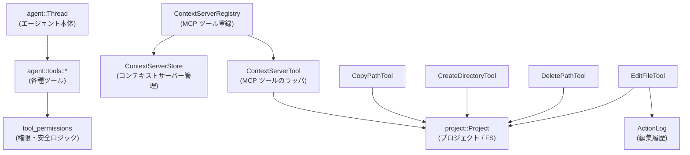

- エージェントスレッド（`Thread`）は、必要に応じて各ツールを呼び出します。
- 各ツールは、実行前に `tool_permissions` による権限チェックを行い、その結果に応じて実行／確認ダイアログ／拒否を決定します。
- ファイル操作ツールは `project::Project` と `fs` 抽象を介して実ファイルシステムにアクセスします。
- `ContextServerRegistry` は別プロセス（MCP Context Server）のツール一覧を取得し、`ContextServerTool` として `AnyAgentTool` にラップして登録します。
- `EditFileTool` は `ActionLog` を利用して「いつ・どのファイルを読んだか」「どのツールで編集されたか」を記録し、外部変更の検知などに利用します。

### 2.3 設計上のポイント

コードから読み取れる主な設計上の特徴は次の通りです。

- **権限判定の多層構造**
  - グローバルデフォルト（Allow / Confirm / Deny）、ツールごとのルール、正規表現ベースの `always_allow`/`always_deny`/`always_confirm` を組み合わせて判定します。
  - 結果は `ToolPermissionDecision`（Allow / Confirm / Deny(理由メッセージ)）として表現され、複数候補からは `most_restrictive` で「より厳しい方」を選びます。
- **ハードコードされた安全ルール**
  - `rm -rf /`・`rm -rf ~`・`rm -rf .` など、明らかに危険なコマンドは **設定や allow パターンでは決して上書きできない** ハードコードルールで拒否します。
  - パス正規化（`normalize_path`）とパス探索を駆使して、`/tmp/../etc/passwd` のようなパストラバーサルも検知します。
- **シンボリックリンクの扱い**
  - `CopyPathTool` / `CreateDirectoryTool` / `DeletePathTool` / `EditFileTool` では、プロジェクトのワークツリー外に抜ける「シンボリックリンク逃げ」を検出し、専用の確認ダイアログ `authorize_symlink_*` を出します。
  - シンボリックリンク確認は通常のツール権限確認よりも優先され、一度の確認で済むように設計されています（テストで検証済み）。
- **センシティブパスの自動判定**
  - `.zed/settings.json` や OS の設定ディレクトリ配下の JSON などを `SensitiveSettingsKind::{Local, Global}` として判定し、通常は Allow でも Confirm に格上げします。
- **非同期・キャンセル対応**
  - すべてのツール `run` は `Task<Result<...>>` を返し、`ToolCallEventStream` 経由で「ユーザーキャンセル」を受け取ると、適切なメッセージで早期終了します。
- **評価用フィクスチャ**
  - `tools/evals/fixtures` は、`EditFileTool` などの編集ツールが大規模ファイルや複雑な構造に対して正しく動作するかを確認するための「元コード／変更後コード」スナップショットを含みます。

---

## 3. 主要な機能一覧

このディレクトリと関連ファイルが提供する主な機能は次の通りです。

- **ツール権限判定 (`tool_permissions`)**
  - コマンドライン・ファイルパスに対する Allow / Confirm / Deny 判定
  - `rm -rf /` などの危険コマンドのハードコードブロック
  - パストラバーサル検出・正規化
- **MCP コンテキストサーバー連携 (`ContextServerRegistry`)**
  - 各 Context Server が提供するツール一覧の取得・登録
  - MCP ツールを `AnyAgentTool` としてエージェントから利用可能にする
  - MCP プロンプト一覧の取得と検索
- **ファイルコピー (`CopyPathTool`)**
  - プロジェクト内のファイル／ディレクトリの再帰コピー
  - シンボリックリンク逃げ・センシティブパスへの特別な確認
- **ディレクトリ作成 (`CreateDirectoryTool`)**
  - プロジェクト内へのディレクトリ作成（親ディレクトリも含めて作成）
  - シンボリックリンク逃げとセンシティブパス確認
- **ファイル／ディレクトリ削除 (`DeletePathTool`)**
  - プロジェクト内のファイル／ディレクトリ（中身も再帰的）削除
  - 削除対象のバッファを `ActionLog` に記録し、UI での扱いに利用
  - シンボリックリンク逃げとセンシティブパス確認
- **プロジェクト診断 (`DiagnosticsTool`)**
  - 単一ファイルまたはプロジェクト全体のエラー／警告一覧の取得
- **ファイル編集 (`EditFileTool`)**
  - LLM を用いたファイルの編集／新規作成／上書き
  - Unsaved 変更や外部更新の検出とガード
  - フォーマッタ・トレーリングホワイトスペース削除との連携
  - Diff の生成・UI 表示
- **評価用フィクスチャ**
  - `ActionLog` の挙動テスト用コード
  - `git blame` 実装の before/after スナップショット
  - エディタ本体コードの大規模スナップショット（カーソル点滅無効化テストなど）

---

## 4. 関数・構造体の解説

### 4.1 型一覧（構造体・列挙体など）

代表的な公開／準公開型をまとめます。

| 名前 | 種別 | 定義ファイル（このチャンクに含まれるもの） | 役割 / 用途 |
|------|------|---------------------------------------------|-------------|
| `ToolPermissionDecision` | enum | `tool_permissions.rs`（テストから参照） | ツールの実行可否: `Allow` / `Confirm` / `Deny(String)` を表現します。 |
| `ToolPermissionMode` | enum | 同上（テストから参照） | デフォルトポリシー。`Allow` / `Confirm` / `Deny` があり、ツールごと・グローバルに設定されます。 |
| `ToolPermissions` | 構造体 | `tool_permissions.rs` | グローバルおよびツールごとの `ToolRules` をまとめた設定オブジェクトです。 |
| `ToolRules` | 構造体 | `tool_permissions.rs` | 1 つのツールに対する `default`・`always_allow`・`always_deny`・`always_confirm`・`invalid_patterns` を保持します。 |
| `CompiledRegex` | 構造体 | `tool_permissions.rs` | 正規表現と大文字小文字区別フラグを持つラッパー。権限判定でパターンマッチに使用されます。 |
| `ContextServerRegistry` | 構造体 | `tools/context_server_registry.rs` | Context Server から取得した MCP ツール・プロンプト一覧を保持し、更新イベントを発行します。 |
| `ContextServerPrompt` | 構造体 | 同上 | 1 つのプロンプトに対して、所属するサーバー ID と `PromptsGet` 用のデータを格納します。 |
| `ContextServerTool` | 構造体 | 同上 | Context Server 上の 1 つのツールを `AnyAgentTool` としてラップした実装です。 |
| `CopyPathToolInput` | 構造体 | `tools/copy_path_tool.rs` | `CopyPathTool` の入力（コピー元・先パス）を表します。 |
| `CopyPathTool` | 構造体 | 同上 | プロジェクト内のファイル／ディレクトリをコピーするツール本体です。 |
| `CreateDirectoryToolInput` | 構造体 | `tools/create_directory_tool.rs` | `CreateDirectoryTool` の入力（作成するディレクトリパス）です。 |
| `CreateDirectoryTool` | 構造体 | 同上 | ディレクトリを作成するツール本体です。 |
| `DeletePathToolInput` | 構造体 | `tools/delete_path_tool.rs` | `DeletePathTool` の入力（削除対象パス）です。 |
| `DeletePathTool` | 構造体 | 同上 | ファイル／ディレクトリを削除するツール本体です。 |
| `DiagnosticsToolInput` | 構造体 | `tools/diagnostics_tool.rs` | 診断対象のファイルパス（任意）を表します。 |
| `DiagnosticsTool` | 構造体 | 同上 | プロジェクトまたはファイル単位の診断結果を取得するツールです。 |
| `EditFileToolInput` | 構造体 | `tools/edit_file_tool.rs` | 編集対象パス・表示用説明・モード (`Edit`/`Create`/`Overwrite`) を保持します。 |
| `EditFileMode` | enum | 同上 | `edit` / `create` / `overwrite` の 3 モードを表します。 |
| `EditFileToolOutput` | enum | 同上 | 編集成功時の diff・旧テキスト・新テキスト、またはエラーメッセージを表します。 |
| `EditFileTool` | 構造体 | 同上 | LLM を用いたファイル編集の主役となるツール実装です。 |
| `ActionLog` | 構造体 | `tools/evals/fixtures/add_overwrite_test/before.rs` | ツールが行った編集をバッファ単位で追跡するログ。評価用フィクスチャですが実際の ActionLog 実装と対応しています。 |
| `Blame` / `BlameEntry` | 構造体 | `tools/evals/fixtures/delete_run_git_blame/*` | `git blame --incremental` の出力をパースした結果を表す構造体（フィクスチャ）。 |

### 4.2 関数詳細（代表的な 7 件）

#### `normalize_path(path: &str) -> String`

**概要**

- パス文字列中の `"."` や `".."` を処理し、可能な範囲で正規化したパスを返します。
- ツール権限判定時に、「パストラバーサルで危険パスに到達していないか」を検出するために使われます。

**引数**

| 引数名 | 型 | 説明 |
|--------|----|------|
| `path` | `&str` | 正規化対象のパス。絶対パス・相対パスの両方を受け付けます。 |

**戻り値**

- `String` — 正規化後のパス。
  - 可能な範囲で `"."` セグメントを削除し、`".."` セグメントを折りたたみます。

**挙動（テストから読み取れる仕様）**

- 相対パス:
  - `"foo/bar"` → `"foo/bar"`（変更なし）
  - `"foo/./bar"` → `"foo/bar"`
  - `"foo/bar/../baz"` → `"foo/baz"`
  - `"foo/../../bar"` → `"../bar"`（先頭の `".."` で「スタート地点より上」を指す部分はそのまま残す）
  - `"../../."` → `"../.."`（末尾の `"."` を削除）
  - `"../../../etc/passwd"` → `"../../../etc/passwd"`（ルート超えはそのまま）
- 絶対パス:
  - `"/etc/passwd"` → `"/etc/passwd"`
  - `"/tmp/../etc/passwd"` → `"/etc/passwd"`
  - `"/"` → `"/"`
  - `"/../../../etc/passwd"` → `"/etc/passwd"`（ルートより上には行かないようクランプ）
- 特殊ケース:
  - `"."` → `""`
  - `""` → `""`

**Examples（使用例）**

```rust
// 危険なパスへのトラバーサルを検出する前処理として使う
let raw = "/tmp/../etc/passwd";
let normalized = normalize_path(raw);
assert_eq!(normalized, "/etc/passwd");

// 相対パスでプロジェクト外へのトラバーサルはそのまま残る
let raw = "../../../etc/passwd";
let normalized = normalize_path(raw);
assert_eq!(normalized, "../../../etc/passwd");
```

**Errors / Panics**

- テストからはエラーや panic 条件は見えません。通常の文字列操作のみで、無効な UTF-8 等のケースは関数外で排除されています。

**Edge cases（エッジケース）**

- `"."` や空文字列は `""` に正規化されます。
- 絶対パスで `".."` によってルートより上に行く場合は、ルートでクランプされます（`"/../../../etc"` → `"/etc"`）。
- 相対パス先頭の `".."` は温存されるため、プロジェクト外へのパストラバーサルは別ロジック（権限判定側）で扱います。

**使用上の注意点**

- ファイルシステム上のシンボリックリンク解決（実際の実パス）は行っていません。あくまで **文字列ベースの正規化** です。
- セキュリティ判定用途（`/etc/passwd` への到達検知など）に使う前提で設計されているため、一般用途のパス正規化として安易に再利用する場合は挙動をテストで確認することが推奨されます。

---

#### `most_restrictive(a: ToolPermissionDecision, b: ToolPermissionDecision) -> ToolPermissionDecision`

**概要**

- 2 つの `ToolPermissionDecision` のうち、より「厳しい」方を返します。
- パスの生文字列と正規化後文字列など、複数判定結果を統合する際に利用されます。

**引数**

| 引数名 | 型 | 説明 |
|--------|----|------|
| `a` | `ToolPermissionDecision` | 判定結果その 1 |
| `b` | `ToolPermissionDecision` | 判定結果その 2 |

**戻り値**

- `ToolPermissionDecision` — 厳しさの順に `Deny > Confirm > Allow` で比較した結果。

**挙動（テストから読み取れる仕様）**

- どちらか一方が `Deny(_)` の場合 → `Deny(_)` が返る（どちらのメッセージが採用されるかはテストでは指定されていません）。
- 両方 `Deny` → `Deny(_)`。
- 片方 `Confirm`・片方 `Allow` → `Confirm`。
- 両方 `Allow` → `Allow`。

**Examples（使用例）**

```rust
let a = ToolPermissionDecision::Allow;
let b = ToolPermissionDecision::Deny("blocked".into());
let decision = most_restrictive(a, b);
// decision は Deny(...)
```

**Edge cases**

- `Deny("a")` と `Deny("b")` のどちらのメッセージが生きるかは、テストでは `Deny(_)` としか検証されていません。メッセージ統合を前提にせず、UI 側では「Deny である」という事実を優先して扱うのが安全です。

**使用上の注意点**

- `most_restrictive` は **「どこか 1 箇所でも危険なら全体を危険とする」** という設計のため、誤って緩和方向に使わないようにする必要があります（`Allow` を優先するような用途には不向きです）。

---

#### `decide_permission_for_path(tool: &str, path: &str, settings: &AgentSettings) -> ToolPermissionDecision`

（実装はこのチャンクにはありませんが、テストと補助関数 `path_perm` から仕様が読み取れます）

**概要**

- 1 つのパス文字列に対して、ツール権限設定 (`ToolPermissions`) を考慮した最終的な `ToolPermissionDecision` を返します。
- パストラバーサルによる危険パス到達を検出するため、**生パス** と **`normalize_path` 後のパス** の両方を評価し、`most_restrictive` で統合します。

**引数**

| 引数名 | 型 | 説明 |
|--------|----|------|
| `tool` | `&str` | ツール名（例: `"copy_path"` / `"delete_path"` / `EditFileTool::NAME`） |
| `path` | `&str` | 評価対象のパス文字列 |
| `settings` | `&AgentSettings` | グローバルなツール権限設定（内部で `ToolPermissions` を参照） |

**戻り値**

- `ToolPermissionDecision` — `always_deny` / `always_allow` / `always_confirm` パターン、およびデフォルトモードに基づく最終判定です。

**内部処理の流れ（テストと `path_perm` からの推測）**

1. `ToolPermissionDecision::from_input(tool, &[path.to_string()], &permissions, ShellKind::Posix)` を呼び、**生パス**に対する判定を得る。
2. `simplified = normalize_path(path)` を計算。
3. `simplified == path` なら、そのまま `raw_decision` を返す（最適化の早期リターン）。
4. 異なる場合は、`ToolPermissionDecision::from_input(tool, &[simplified], &permissions, ShellKind::Posix)` を呼び、正規化パスに対する判定を得る。
5. `most_restrictive(raw_decision, simplified_decision)` を返す。

**Examples（使用例）**

```rust
// /etc/passwd へのアクセスを deny する設定
let deny_regex = CompiledRegex::new("/etc/passwd", false).unwrap();
let mut tools = collections::HashMap::default();
tools.insert(
    Arc::from(EditFileTool::NAME),
    ToolRules {
        default: Some(ToolPermissionMode::Allow),
        always_deny: vec![deny_regex],
        always_allow: vec![],
        always_confirm: vec![],
        invalid_patterns: vec![],
    },
);
let settings = AgentSettings {
    tool_permissions: ToolPermissions {
        default: ToolPermissionMode::Confirm,
        tools,
    },
    // 他のフィールドは省略
};

// 生パスは /tmp/../etc/passwd だが、normalize_path で /etc/passwd になる
let decision = decide_permission_for_path(
    EditFileTool::NAME,
    "/tmp/../etc/passwd",
    &settings,
);
assert!(matches!(decision, ToolPermissionDecision::Deny(_)));
```

**Errors / Panics**

- テストコード上では、この関数自体は `Result` ではなく `ToolPermissionDecision` を直接返す仕様であり、panic 条件は見えません。
- 内部で不正な正規表現が検出された場合は、`ToolPermissionDecision::Deny(msg)` が返る仕様が `multiple_invalid_patterns_pluralizes_message` テストから読み取れます。

**Edge cases**

- パスに `"."` や `".."` が含まれていない場合は `normalize_path` を呼んでも同じ文字列になるため、**生パスのみの判定を返す**（`decide_permission_for_path_no_dots_early_return` テスト）。
- `always_deny` と `always_allow` が両方マッチするような場合でも、`most_restrictive` により `Deny` が優先されます。
- `.zed/settings.json` や `.env` などを対象とするパターンを設定することで、センシティブファイルの編集を Confirm / Deny にできます（`decide_permission_for_path_denies_edit_file_traversal_to_dotenv` など）。

**使用上の注意点**

- `path` には **ツール側が受け取るそのままの文字列**を渡すことが前提です。ツール側で `normalize_path` 済みの文字列と二重に正規化すると、意図しない判定になる可能性があります。
- ファイルツール (`EditFileTool` / `CopyPathTool` / `CreateDirectoryTool` / `DeletePathTool`) では、テストにある `path_perm` 相当のロジックを経由しているため、これを直接呼び出す場面は限定的です。

---

#### `ContextServerTool::run(self: Arc<Self>, input: ToolInput<serde_json::Value>, event_stream: ToolCallEventStream, cx: &mut App) -> Task<Result<AgentToolOutput, AgentToolOutput>>`

**概要**

- MCP コンテキストサーバー上の 1 つのツールを実行するメソッドです。
- ユーザーに第三者ツール利用の許可を求め、許可後に `CallTool` リクエストを送信し、テキスト結果を `AgentToolOutput` として返します。

**引数**

| 引数名 | 型 | 説明 |
|--------|----|------|
| `self` | `Arc<Self>` | 実行する MCP ツール。`Arc` で共有されます。 |
| `input` | `ToolInput<serde_json::Value>` | JSON 形式の引数（オブジェクトの場合は key-value を `arguments` に変換）。 |
| `event_stream` | `ToolCallEventStream` | ツール呼び出しの進行状況・許可ダイアログ・キャンセルなどのイベントをやりとりするストリーム。 |
| `cx` | `&mut App` | gpui アプリケーションコンテキスト。非同期タスクの spawn 等に用います。 |

**戻り値**

- `Task<Result<AgentToolOutput, AgentToolOutput>>`
  - `Ok(AgentToolOutput)` — MCP ツールからの成功レスポンス。
  - `Err(AgentToolOutput)` — ユーザーキャンセル・接続失敗・レスポンスがエラーなど、ツール実行に失敗した場合のエラーメッセージ。

**内部処理の流れ（簡略）**

1. `ContextServerStore` から `server_id` に対応する `ContextServer` を取得。
   - 見つからない場合 → `Err("Context server not found")`。
   - クライアント未初期化の場合 → `Err("Context server not initialized")`。
2. ツール名・表示名・ツール ID（`mcp:<server_id>:<tool_name>`）を組み立て、`event_stream.authorize_third_party_tool(...)` でユーザーに許可を求める `Task` を取得。
3. 非同期ブロック内で:
   - `input.recv().await` で JSON 入力を受け取る（失敗時は `Failed to receive tool input: ...`）。
   - `authorize.await` でユーザー許可を待つ（拒否やエラーは `AgentToolOutput::from_error` に変換）。
   - MCP クライアントの `request::<CallTool>(CallToolParams { ... })` を呼ぶ。
   - `futures::select!` でレスポンス完了とユーザーキャンセルを同時に待ち、キャンセルされた場合は `"MCP tool cancelled by user"` としてエラー終了。
4. レスポンスが `is_error == Some(true)` の場合:
   - `response.content` 中の Text コンテンツを連結してエラーメッセージとし、`Err(AgentToolOutput::from_error(message))` を返す。
5. 正常系:
   - Text コンテンツを連結して `result: String` を作成。
   - Image / Audio / Resource コンテンツは無視し（ログには Warn 出力）、テキストのみを `AgentToolOutput{ raw_output, llm_output }` として返す。

**Examples（使用例）**

実際の利用はエージェント内部から行われるため、簡略化した疑似コードを示します。

```rust
// ContextServerRegistry から AnyAgentTool として取得される想定
let tool: Arc<dyn AnyAgentTool> = /* ... */;

// 入力 JSON を構築
let input_json = serde_json::json!({
    "file": "src/main.rs",
    "line": 42,
});

// テスト用のイベントストリーム（実際は UI と結びついたものが渡される）
let (event_stream, _rx) = ToolCallEventStream::test();

// ツールを実行
let task = tool.run(
    ToolInput::resolved(input_json),
    event_stream,
    cx,
);

// 非同期に待つ（実際は gpui のタスクスケジューラ上で）
let result: Result<AgentToolOutput, AgentToolOutput> = task.await;
```

**Errors / Panics**

- MCP サーバーが存在しない／初期化されていない場合は、`Err(AgentToolOutput::from_error(...))` として明確なメッセージを返します。
- リクエスト送信やレスポンス受信中のエラーも同様に `AgentToolOutput` に変換され、panic にはなりません。

**Edge cases**

- 入力が JSON オブジェクトではない場合、`arguments` は `None` になり、ツールには引数なしで呼び出されます。
- MCP サーバーが画像・音声・リソースを返す場合、それらは無視され、テキスト部分のみが返却されます（ログに Warn が出るだけです）。

**使用上の注意点**

- サーバー側のスキーマと整合した JSON を渡す必要があります。`input_schema` メソッドで期待スキーマを取得した上で入力を構築するのが前提です。
- キャンセル時には `"MCP tool cancelled by user"` というエラーメッセージで終了するため、呼び出し側でそのケースを区別したい場合はメッセージ文字列をチェックする必要があります。

---

#### `CopyPathTool::run(self: Arc<Self>, input: ToolInput<CopyPathToolInput>, event_stream: ToolCallEventStream, cx: &mut App) -> Task<Result<String, String>>`

**概要**

- プロジェクト内のファイルまたはディレクトリを別の場所にコピーします（ディレクトリは再帰的）。
- パスごとの権限判定・センシティブパス検知・シンボリックリンク逃げ検知・ユーザー確認ダイアログ・キャンセル処理までを一括で行います。

**引数**

| 引数名 | 型 | 説明 |
|--------|----|------|
| `self` | `Arc<Self>` | `CopyPathTool` インスタンス。 |
| `input` | `ToolInput<CopyPathToolInput>` | コピー元 (`source_path`) とコピー先 (`destination_path`) を含む入力。 |
| `event_stream` | `ToolCallEventStream` | 権限確認ダイアログ・キャンセル通知に使用。 |
| `cx` | `&mut App` | gpui アプリコンテキスト。 |

**戻り値**

- `Task<Result<String, String>>`
  - `Ok("Copied {src} to {dest}")` — コピー成功時。
  - `Err(reason)` — 権限拒否・シンボリックリンク拒否・ファイルシステムエラー・ユーザーキャンセルなど。

**内部処理の流れ（簡略）**

1. `input.recv().await` で `CopyPathToolInput` を取得。
2. `paths = [source_path.clone(), destination_path.clone()]` を作成。
3. `decide_permission_for_paths(Self::NAME, &paths, &AgentSettings::get_global(cx))` で権限判定。
   - `Deny(reason)` → 直ちに `Err(reason)` を返す。
4. `project.fs()` を取得し、`canonicalize_worktree_roots` で各ワークツリーの実パスを計算。
5. `collect_symlink_escapes` で、コピー元／先がプロジェクト外に抜けるシンボリックリンクを通るかどうかを検出。
6. `sensitive_settings_kind` で、コピー元／先がローカル／グローバルの設定ディレクトリかどうかを判定。
   - 判定結果が Some かつ `decision == Allow` の場合 → `needs_confirmation = true` とみなす。
7. `authorize` タスクを決定:
   - シンボリックリンク逃げが存在する場合 → `authorize_symlink_escapes(...)` を呼び出し（通常の権限確認は行わない）。
   - `needs_confirmation == true` の場合 → `event_stream.authorize(...)` でユーザーに確認を求める。
   - それ以外 → None。
8. `authorize` が Some なら `authorize.await` し、拒否された場合は `Err(e.to_string())` 。
9. `project.update` 内で:
   - `find_project_path(&source_path)` と `entry_for_path` によってコピー元エントリを取得。
   - `find_project_path(&destination_path)` によりコピー先がプロジェクト内であることを確認。
   - `project.copy_entry(entity.id, dest_project_path, cx)` でコピータスクを生成。
10. `futures::select!` でコピータスク完了とユーザーキャンセルを待ち、キャンセルされた場合は `"Copy cancelled by user"` で終了。
11. コピー中のエラーは `"Copying {src} to {dest}: {e}"` の形式で返されます。
12. 成功時は `"Copied {src} to {dest}"` を返します。

**Examples（使用例）**

テストに近い形での利用例です。

```rust
// プロジェクトとツールのセットアップは既に行われていると仮定
let tool = Arc::new(CopyPathTool::new(project.clone())); // Project エンティティを渡して構築

// 入力を構築
let input = CopyPathToolInput {
    source_path: "src/lib.rs".into(),          // コピー元
    destination_path: "src/lib_backup.rs".into(), // コピー先
};

// テスト用のイベントストリーム
let (event_stream, _rx) = ToolCallEventStream::test();

// ツールを実行
let task = cx.update(|cx| {
    tool.run(ToolInput::resolved(input), event_stream, cx)
});

// 非同期で結果を待つ
let result = task.await;
assert!(result.is_ok());
```

**Errors / Panics**

- 権限ポリシーで `Deny` の場合（パターンマッチやツールデフォルト） → 即座に `Err(reason)`。
- シンボリックリンク確認・一般権限確認でユーザーが拒否 → `Err("...")`。
- コピー元が存在しない・コピー先がプロジェクト外など → `"Source path ... was not found in the project."` や `"Destination path ... was outside the project."` というエラー文字列。
- 自身は panic せず、`Result` 経由で失敗理由を返します。

**Edge cases**

- シンボリックリンク逃げが検出された場合、**通常の「ツール権限確認」ダイアログは出ず**、シンボリックリンク専用の確認ダイアログのみが出ます（テストで「1 回だけ確認される」ことが検証されています）。
- グローバルデフォルトが `Allow` でも、センシティブパス（設定ファイル等）へのコピーは `Confirm` に格上げされます。
- ツールポリシーが `Deny` の場合、シンボリックリンク確認ダイアログすら出ずに即拒否されることがテストで確認されています。

**使用上の注意点**

- 入力パスはプロジェクトルートを起点とする相対パスを前提としており、絶対パスやプロジェクト外のパスはエラーになります。
- ユーザーにとって重要なファイル（設定ファイルなど）やプロジェクト外のパスを扱う場合は、権限設定と `sensitive_settings_kind` の振る舞いを理解した上で利用する必要があります。

---

#### `CreateDirectoryTool::run(self: Arc<Self>, input: ToolInput<CreateDirectoryToolInput>, ...)`

**概要**

- プロジェクト内の指定パスにディレクトリ（および必要な親ディレクトリ）を作成します。
- `CopyPathTool` と同様に、権限判定・センシティブパス判定・シンボリックリンク逃げ検知・ユーザー確認・キャンセル処理を行います。

**主な相違点**

- 判定対象は `path` 1 つだけです（`decide_permission_for_path` を使用）。
- シンボリックリンク検知は `detect_symlink_escape` で、単一パスのターゲットのみを扱います。
- 実際の作成は `project.create_entry(project_path, true, cx)` で行われ、パスがプロジェクト外なら `"Path to create was outside the project"` エラーとなります。

**エッジケース・注意点**

- センシティブパス（設定ディレクトリなど）の下にディレクトリを作る場合、`Allow` であっても `Confirm` に格上げされます。
- シンボリックリンクによる外部ディレクトリへの作成 (`project/link_to_external`) は、必ず専用の確認ダイアログを経ます。
- ツールポリシー `Deny` の場合、`CopyPathTool` 同様にシンボリックリンク確認はスキップされます。

---

#### `EditFileTool::run(self: Arc<Self>, input: ToolInput<EditFileToolInput>, ...)`

**概要**

- LLM ベースの編集エージェント (`EditAgent`) を用いて、ファイルを編集／新規作成／上書きするツールです。
- 「どのモードで」「どのファイルを」「どのような意図で」編集するかを受け取り、Diff を UI に表示しつつファイルを更新します。

**主な処理の流れ（高レベル）**

1. 入力の受信とプロジェクト解決
   - `input.recv().await` で `EditFileToolInput` を受信。
   - `thread` から `Project` エンティティを取得（Thread がドロップされている場合はエラー）。
   - `resolve_path` で `EditFileMode` に応じたパス検証（存在確認、親ディレクトリの存在確認など）を行い、`ProjectPath` に変換。
   - 絶対パスを求めて `ToolCallUpdateFields::locations` に設定し、UI に位置情報を通知。

2. 自動権限確認
   - `authorize_file_edit` を呼び出し、`.zed/settings.json` やプロジェクト外パス、シンボリックリンク逃げ等に対して必要に応じて確認ダイアログを出します。
   - グローバルデフォルト `Allow` であっても、センシティブパスは Confirm を要求する（テストで検証済み）。

3. 外部更新・未保存変更の検出
   - `ActionLog` から「最後にファイルを読んだ時刻」を取得。
   - バッファの現在の mtime と比較し、未保存変更 or 外部更新があれば編集を中止し、**ユーザーに状況説明と手順を促すメッセージ**でエラーを返します。
   - `SaveFileTool`・`RestoreFileFromDiskTool` の有無に応じて、エラーメッセージの内容が変化します。

4. Diff の生成と編集エージェントの実行
   - `Diff::new(buffer, cx)` を作成し、`event_stream.update_diff` で UI に「編集中の diff カード」を表示。
   - `EditAgent::edit`（モード `Edit`）または `EditAgent::overwrite`（モード `Create` / `Overwrite`）を呼び出し、LLM とのやりとりを開始。
   - `EditAgentOutputEvent` ストリームを監視し、編集位置・曖昧なマッチ・解決中範囲などの情報を Diff カードおよび ToolCall の位置情報に反映。

5. フォーマット／トレーリングホワイトスペース処理
   - ユーザー設定に応じて、保存時に LSP フォーマットやトレーリングホワイトスペース削除を実行します。
   - これらの変更は `ActionLog` にも記録され、次回の編集時に「外部変更」と誤認されないようになっています（`test_format_on_save` / `test_remove_trailing_whitespace` などで検証）。

6. 保存と結果の構築
   - `project.save_buffer(buffer, cx)` でバッファを保存。
   - 旧テキストと新テキストから unified diff を生成し、`EditFileToolOutput::Success{ ... }` として返す。
   - Diff が空で、`UnresolvedEditRange` や `AmbiguousEditRange` が発生していた場合は、「再度ファイルを読み直してほしい」旨のメッセージを含むエラーとして返す。

**Edge cases**

- ファイルが存在しない／ディレクトリだった／親ディレクトリが存在しないなどのパス不整合は `resolve_path` で検出され、わかりやすいメッセージ（例: `"Can't edit file: path not found"`）が返されます。
- 連続編集（1 回目の編集で内容が変わった後に 2 回目の編集を行う）は、`ActionLog` の読取時刻更新により問題なく動作することがテストで確認されています。
- 外部からの変更（mtime の変化）やバッファ内の未保存変更は、編集を拒否し、ユーザーとの対話を促すメッセージで終了します。

**使用上の注意点**

- 呼び出す前に `ReadFileTool` などを用いてファイルを読み、その後に外部で変更していないことが前提です。
- グローバル権限デフォルトを `Allow` にしていても、センシティブファイルやプロジェクト外ファイルは Confirm を要求するため、ツール呼び出し側は「ユーザー確認が入るかもしれない」前提で扱う必要があります。

---

### 4.3 その他の関数

補助的な関数や単純なユーティリティの一覧です。

| 関数名 | 定義 | 役割（1 行） |
|--------|------|--------------|
| `mcp_tool_id(server_id, tool_name)` | `context_server_registry.rs` | MCP ツールに対する設定用 ID（`mcp:<server_id>:<tool_name>`）を生成します。 |
| `ContextServerRegistry::tools_for_server` | 同上 | 特定サーバーが提供する `AnyAgentTool` のイテレータを返します。 |
| `ContextServerRegistry::prompts` | 同上 | すべてのサーバー上のプロンプト (`ContextServerPrompt`) を列挙します。 |
| `ContextServerRegistry::find_prompt` | 同上 | サーバー ID と名前、または名前のみからプロンプトを検索します。 |
| `get_prompt` | 同上 | MCP サーバーに `PromptsGet` リクエストを送り、指定プロンプトを取得します。 |
| `DiagnosticsTool::run` | `diagnostics_tool.rs` | ファイルまたはプロジェクト全体の診断結果を文字列として返します。 |
| `run_git_blame` | `evals/fixtures/delete_run_git_blame/before.rs` | `git blame --incremental` を実行し、出力を文字列として返す評価用関数（本番コードでは削除された後の状態もフィクスチャで管理）。 |

---

## 5. データフロー

ここでは、代表的な処理として **`CopyPathTool` によるファイルコピー** のデータフローを示します。

### 5.1 処理の流れ（文章）

1. エージェントが LLM からの指示に基づき `CopyPathTool` を呼び出します。
2. ツールは `AgentSettings` に基づいて `decide_permission_for_paths` を呼び出し、コピー元／先パスの権限を判定します。
3. パスに `.` や `..` が含まれる場合は、`normalize_path` で正規化したパスでも再判定し、`most_restrictive` で統合します。
4. 権限が `Deny` なら即座にエラーを返します。
5. `canonicalize_worktree_roots` と `collect_symlink_escapes` で、コピーがプロジェクト外に抜けるシンボリックリンクを通らないか検査します。
6. センシティブパスの検出と決定された `ToolPermissionDecision` に応じて、必要であれば `ToolCallEventStream::authorize` または `authorize_symlink_escapes` でユーザーに確認を求めます。
7. ユーザーが許可した場合のみ、`Project::copy_entry` を経由して実ファイルコピーが行われます。
8. 成功時は `"Copied {src} to {dest}"` を返し、失敗時は適切なエラーメッセージを返します。

### 5.2 シーケンス図

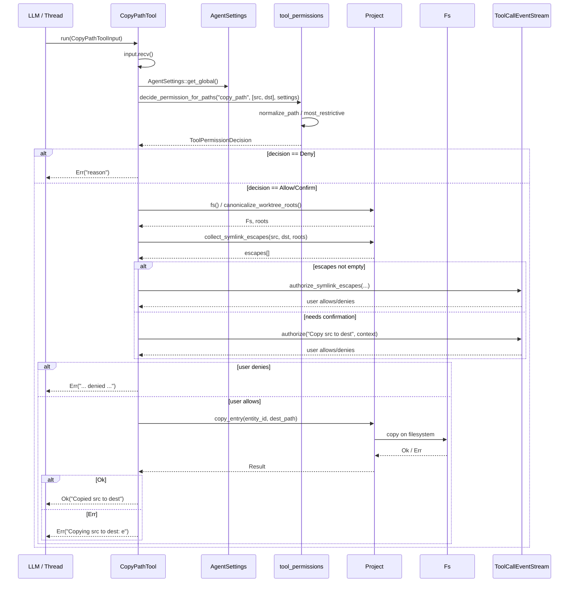

---

## 6. 使い方（How to Use）

### 6.1 基本的な使用方法

ここでは、プロジェクト内で `CopyPathTool` を使ってファイルをコピーする最小限の例を示します。モジュールパスは、標準的な Rust のモジュール構成（`agent/src/tools/copy_path_tool.rs` → `crate::tools::copy_path_tool`）を仮定しています。

```rust
use std::sync::Arc;
use gpui::{App, TestAppContext};
use project::Project;
// ツール本体と補助型をインポート
use crate::tools::copy_path_tool::{CopyPathTool, CopyPathToolInput};
use crate::{ToolCallEventStream, ToolInput};

async fn example_copy_file(cx: &mut TestAppContext) {
    // プロジェクトとファイルシステムのセットアップ（テスト用）
    let fs = project::FakeFs::new(cx.executor());               // メモリ上の FakeFs を作成
    fs.insert_tree("/root", serde_json::json!({                 // /root 配下にディレクトリツリーを作成
        "src": { "lib.rs": "original content" }
    }))
    .await;
    let project = Project::test(fs.clone(), ["/root".as_ref()], cx).await; // プロジェクトを作成

    // CopyPathTool を構築
    let tool = Arc::new(CopyPathTool::new(project));            // Project エンティティを渡してツールを作る

    // 入力パラメータを作成
    let input = CopyPathToolInput {
        source_path: "src/lib.rs".into(),                       // コピー元（プロジェクトルートからの相対パス）
        destination_path: "src/lib_backup.rs".into(),           // コピー先
    };

    // テスト用のイベントストリーム（実際は UI によって提供される）
    let (event_stream, _rx) = ToolCallEventStream::test();      // 権限確認などのイベントを受け取るチャネル

    // ツールを起動
    let task = cx.update(|cx| {
        tool.run(ToolInput::resolved(input), event_stream, cx)  // 入力を渡して run を呼び出す
    });

    // 非同期タスクの完了を待つ
    let result = task.await;                                    // Result<String, String> が返る
    assert!(result.is_ok(), "コピーに成功するはずです");
}
```

同様のパターンで、`CreateDirectoryTool`・`DeletePathTool`・`DiagnosticsTool`・`EditFileTool` も `ToolInput::resolved(...)` と `ToolCallEventStream` を渡して実行します。

### 6.2 よくある使用パターン

1. **エージェントによる編集フロー**

   - `ReadFileTool`（別ファイル）でファイル内容を読み、`ActionLog` に「いつ読んだか」を記録。
   - `EditFileTool` で編集を行う。
   - `DiagnosticsTool` でエラー／警告を確認し、必要に応じて追加入力や再編集を行う。
   - `CopyPathTool` でバックアップを取ったり、`CreateDirectoryTool` / `DeletePathTool` でディレクトリ構造を調整する。

2. **Context Server（MCP）ツールの利用**

   - `ContextServerStore` に依存して `ContextServerRegistry` を生成。
   - コンテキストサーバーが起動すると、自動的に `reload_tools_for_server` が呼ばれ、MCP ツールが `AnyAgentTool` として登録される。
   - エージェント側では、他のツールと同様に `AnyAgentTool::run` を通じて MCP ツールを呼び出し、`ContextServerTool::run` 経由でリクエストが送信される。

3. **権限設定を利用した保護**

   - `tool_permissions` で `always_deny`・`always_confirm` パターンを設定し、`.env` や `.zed/` などのセンシティブパスを保護。
   - `ToolPermissionMode::Deny` を特定ツールに設定し、プロジェクトに応じて使用禁止ツールを定義。
   - シェルコマンドに対してハードコードされた `rm -rf /` などの保護が常に効いていることを前提に、ターミナルツールを許可モードで使う。

### 6.3 よくある間違い

```rust
// 間違い例 1: プロジェクト外の絶対パスを渡してしまう
let input = CopyPathToolInput {
    source_path: "/etc/passwd".into(),       // プロジェクト外
    destination_path: "backup/passwd".into(),
};
// → decide_permission_for_paths / decide_permission_for_path で Deny されるか、
//   "was outside the project" といったエラーになります。

// 間違い例 2: Read せずにいきなり EditFileTool を呼ぶ
let input = EditFileToolInput {
    display_description: "Fix bug".into(),
    path: "root/src/main.rs".into(),
    mode: EditFileMode::Edit,
};
// → ActionLog に read 時刻がなくても動作しますが、
//    実際の対話フローでは先に read して内容を把握してから edit する前提で設計されています。

// 間違い例 3: ハードコード禁止コマンドを allow パターンで緩和しようとする
t("rm -rf /").allow(&[".*"]).is_deny();
// → テストの通り、ハードコードされた security rule は allow パターンや
//    global default Allow では上書きできません。
```

### 6.4 使用上の注意点（まとめ）

- **パスの扱い**
  - ファイル・ディレクトリツールのほとんどは「プロジェクトルートからの相対パス」を前提としています。絶対パスや `..` を含むパスは、`normalize_path` や `find_project_path` によって検査され、必要に応じて拒否されます。
- **シンボリックリンク**
  - プロジェクト外に抜けるシンボリックリンクが絡む操作は、通常の権限確認ではなく **専用のシンボリックリンク確認ダイアログ** によるユーザー承認が必要です。
- **センシティブ設定ファイル**
  - `.zed/` 配下や OS の設定ディレクトリ配下などは `SensitiveSettingsKind` として扱われ、グローバル default が `Allow` でも Confirm を要求するなど、特別扱いされます。
- **外部変更**
  - `EditFileTool` は `ActionLog` を用いてファイルの mtime を追跡し、外部で変更されたファイルの編集を防ぎます。複数のクライアント・エディタが同じファイルを編集する環境では、この制約を前提に設計する必要があります。
- **ハードコードされたシェル保護**
  - `rm -rf /`、`rm -rf ~`、`rm -rf .` や `rm -rf /etc/../` などは **設定で無効化できません**。ターミナルツールを設計する際は、これらの保護が常に効いている前提でコマンド生成ロジックを組み立てる必要があります。

---

## 7. 関連ファイル

このディレクトリと密接に関係するファイル・サブディレクトリを整理します。

| パス | 役割 / 関係 |
|------|------------|
| `agent/src/tool_permissions.rs` | ツール権限判定ロジックと安全ルール（`ToolPermissionDecision` / `ToolPermissions` / `normalize_path` / `decide_permission_for_path` など）を提供します。今回のチャンクには主にテストが含まれていますが、仕様はそれらから読み取れます。 |
| `agent/src/tools/context_server_registry.rs` | MCP Context Server との連携と、外部ツール・プロンプトの登録／更新機構を提供します。 |
| `agent/src/tools/copy_path_tool.rs` | プロジェクト内のパスコピーを行うツール本体。権限判定・シンボリックリンク・センシティブ設定に対応しています。 |
| `agent/src/tools/create_directory_tool.rs` | ディレクトリ作成ツール。`CopyPathTool` と同様の権限・シンボリックリンク処理を行います。 |
| `agent/src/tools/delete_path_tool.rs` | ファイル／ディレクトリ削除ツール。削除対象バッファを `ActionLog` に記録しつつ削除します。 |
| `agent/src/tools/diagnostics_tool.rs` | ファイルまたはプロジェクト全体の診断結果を取得し、テキスト形式で返すツールです。 |
| `agent/src/tools/edit_file_tool.rs` | LLM ベースのファイル編集を実行するツール。フォーマッタ・トレーリングホワイトスペース削除・外部変更検出など多くの機能を含みます。 |
| `agent/src/tools/evals/fixtures/add_overwrite_test/before.rs` | `ActionLog` とそのテストコードのスナップショット。`EditFileTool` の挙動評価に利用されます。 |
| `agent/src/tools/evals/fixtures/delete_run_git_blame/{before,after}.rs` | `git blame` 実装の before/after コード。`EditFileTool` が大きな関数削除などを正しく行えるかを評価するためのフィクスチャです。 |
| `agent/src/tools/evals/fixtures/disable_cursor_blinking/before.rs` | エディタ本体の大規模コードスナップショット。カーソル点滅無効化等の編集シナリオ評価に用いられます。 |

これらのファイルは、ツール実装・権限ロジック・評価用コードを合わせて、エージェントによる安全なコード操作とそのテストを支えています。

---

# （パス不明）Editor モジュール コード解説（その6）

※このチャンクは、`Editor` 構造体のメソッド定義の一部のみを含んでいます。  
ファイルの正確なパスや、ここに出てこない型・関数の定義場所は、このチャンクからは分かりません。

---

## 1. ざっくり一言

この部分は、エディタ `Editor` における **高度な編集機能・ナビゲーション・インライン補完・診断表示** などをまとめた実装です。  
カーソル移動やインデント、コメント切り替えのような基本操作から、LSP 連携のフォーマットや go-to-definition までを一括して扱っています。

---

## 2. このモジュールの役割

### 2.1 概要

- このモジュール（`Editor` のこの部分）は、テキストエディタにおける **「編集操作・検索・ナビゲーション・コードインテリジェンス」** を統括するレイヤです。
- ユーザー操作（キーバインドやマウス操作）に応じて:
  - バッファの編集（削除・インデント・変換）
  - 選択範囲やマルチカーソルの制御
  - LSP/AI 連携によるインライン補完・フォーマット・定義ジャンプ
  - Git 連携（ブレークポイント・インライン blame・hunk 移動）
  - 診断・ハイライトの描画
  を行います。

### 2.2 アーキテクチャ内での位置づけ

このチャンクに登場する主な依存関係を簡略化した図です。

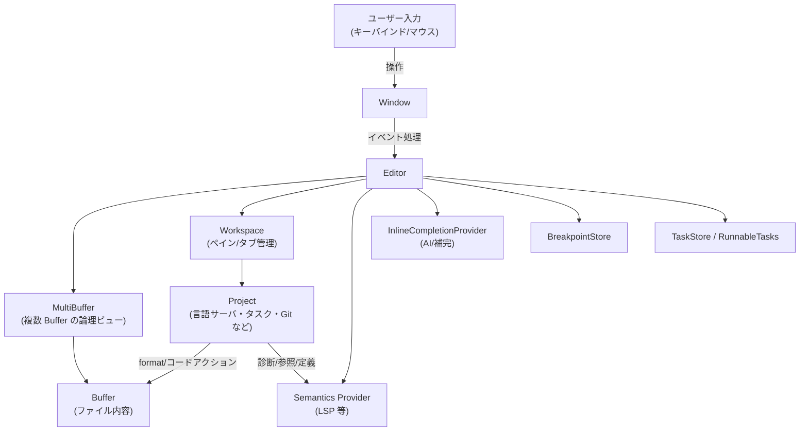

`Editor` は UI イベントの入り口となり、`MultiBuffer`/`Buffer` と `Project`（LSP・タスク・Git）との橋渡しをします。

### 2.3 設計上のポイント

コードから読み取れる特徴を箇条書きにします。

- **責務の分割**
  - 「何をするか」は `Editor` のメソッド名でほぼそのまま表現（`backspace`, `toggle_comments`, `go_to_definition` 等）。
  - バッファ操作の実態は `MultiBuffer` / `Buffer` に委譲し、`Editor` は *選択範囲の決定・オートスクロール・表示更新* に集中。
- **非同期処理**
  - LSP/AI/診断のような重い処理は `cx.spawn_in` / `cx.background_spawn` で非同期タスク化し、UI スレッドをブロックしない。
  - デバウンス（`CODE_ACTIONS_DEBOUNCE_TIMEOUT`, `lsp_highlight_debounce` など）で頻繁な再計算を抑制。
- **状態管理**
  - インライン補完（edit prediction）やリネーム、診断ポップオーバ、選択履歴などは `Editor` 内部のフィールドで状態管理。
  - `SelectionHistory` や `ActiveDiagnostic` などの専用構造体で「過去状態」「アクティブな診断」を追跡。
- **マルチバッファ対応**
  - `MultiBuffer` と `Anchor`（バッファ+excerptを指すアンカー）によって、単一ファイル/複数ファイルのビューを同一 API で扱う。
- **トランザクションベースの編集**
  - `start_transaction_at` / `end_transaction_at` / `transact` により、「1 回のユーザー操作」を 1 トランザクションとして undo/redo 可能にしている。

---

## 3. 主要な機能一覧

このチャンクに含まれる主な機能を大まかに列挙します。

- **コードアクション**
  - `add_code_action_provider` / `remove_code_action_provider` / `refresh_code_actions`
  - LSP やその他プラグインからのコードアクションを収集・UI に表示。
- **Git blame / ブレークポイント / タスク**
  - `start_inline_blame_timer`, `show_blame_popover`, `breakpoint_context_menu`, `spawn_nearest_task` など。
- **ドキュメントハイライト・選択ハイライト**
  - `refresh_document_highlights`（LSP の read/write ハイライト）
  - `refresh_selected_text_highlights`（選択中テキストの全一致ハイライト）
- **インライン補完（Edit Prediction / Copilot 的なもの）**
  - `refresh_inline_completion`, `update_visible_inline_completion`
  - `accept_edit_prediction`, `accept_partial_inline_completion`, `cycle_inline_completion`
  - 補完ポップオーバ（`render_edit_prediction_*`）やカーソルポップオーバ表示。
- **スニペット**
  - `insert_snippet`, `move_to_next_snippet_tabstop`, `move_to_prev_snippet_tabstop`
  - タブストップの移動と選択候補（`show_snippet_choices`）。
- **基本編集操作**
  - `backspace`, `delete`, `tab`, `indent`, `outdent`, `autoindent`, `delete_line`, `join_lines_impl` など。
- **行操作・整形**
  - ソート/ユニーク/逆順/シャッフル: `manipulate_lines` + 各種ラッパ（`sort_lines_*`, `reverse_lines` など）
  - 再ラップ（折り返し）: `rewrap`, `rewrap_impl`
- **テキスト変換**
  - 大文字/小文字・スネークケース等: `toggle_case`, `convert_to_*`, `convert_to_rot13/rot47`, `manipulate_text`
- **クリップボード / Kill-ring**
  - `cut_common`, `cut`, `copy`, `copy_and_trim`, `paste`, `kill_ring_cut`, `kill_ring_yank`
- **Undo/Redo とトランザクション**
  - `undo`, `redo`, `start_transaction_at`, `end_transaction_at`, `transact`
- **カーソル移動・選択操作**
  - 1 文字/行/ページ/単語/サブワード/段落/ファイル先頭・末尾など、非常に多くの移動・選択系メソッド。
  - `select_next`, `select_previous`, `select_all_matches` 等による「次の一致を選択」マルチカーソル。
- **コメント切り替え・シンタックス選択**
  - `toggle_comments`
  - `select_enclosing_symbol`, `select_larger_syntax_node`, `select_smaller_syntax_node`（構文木ベース選択）。
- **診断・ナビゲーション**
  - `go_to_diagnostic_impl`, `go_to_hunk_before_or_after_position`, `go_to_definition_*`, `find_all_references`
  - インライン診断: `refresh_inline_diagnostics`, `toggle_inline_diagnostics`
- **フォーマット・コードアクション・言語サーバ管理**
  - `format`, `format_selections`, `perform_format`
  - `organize_imports`, `perform_code_action_kind`
  - `restart_language_server`, `stop_language_server`, `cancel_language_server_work`
- **ナビゲーション履歴・選択履歴**
  - `push_to_nav_history`, `undo_selection`, `redo_selection`
- **フォールディング**
  - `toggle_fold`, `toggle_fold_recursive`（このチャンク末尾は `fold` 実装途中で終わっています）

---

## 4. 関数・構造体の解説

### 4.1 主な型一覧（このチャンクに登場するもの）

定義自体は別チャンクですが、このチャンク内の使われ方から分かる役割をまとめます。

| 名前 | 種別 | 役割 / 用途（このチャンクから読み取れる範囲） |
|------|------|----------------------------------------------|
| `Editor` | 構造体 | エディタ本体。バッファ・選択・表示・LSP・Git・タスクなどを統括するメインクラス。 |
| `AvailableCodeAction` | 構造体 | ある位置で実行可能なコードアクションと、その提供元 `CodeActionProvider` を紐づけた要素。 |
| `InlineCompletionState` | 構造体 | アクティブなインライン補完の状態（inlay ID 群、編集内容、表示モード、無効化範囲など）を保持。 |
| `InlineCompletion` | 列挙体 | `Move { target, snapshot }` と `Edit { edits, edit_preview, display_mode, snapshot }` の 2 形態の補完を表す。 |
| `EditPredictionSettings` | 列挙体 | `Disabled` / `Enabled { show_in_menu, preview_requires_modifier }` で補完の有効状態・表示モードを管理。 |
| `EditPredictionPreview` | 列挙体 | 補完プレビューが `Active` か `Inactive` か、直前のスクロール位置や「すぐ離されたか」フラグを持つ。 |
| `RunnableTasks` | 構造体 | 1 行に紐づく実行可能タスク群（テスト・ビルド等）と、その位置・追加変数・コンテキスト範囲。 |
| `InlineDiagnostic` | 構造体 | 行末に表示するインライン診断（メッセージ、severity、範囲など）。 |
| `ActiveDiagnosticGroup` | 構造体 | 現在展開している診断グループ（メッセージ、グループID、ブロック ID 群）を表す。 |
| `RenameState` | 構造体 | rename 操作中の状態（元の範囲、元の名前、1 行エディタ、ブロック ID）。 |
| `SelectNextState` | 構造体 | `select_next` / `select_previous` の内部状態（Aho-Corasick クエリ、word-wise かどうか、完了フラグ）。 |
| `SelectionHistoryEntry` | 構造体 | 選択履歴の 1 エントリ。選択アンカー群と、`select_next` などの内部状態スナップショット。 |
| `NavigationData` | 構造体 | ナビゲーション履歴の 1 エントリ（カーソルアンカー・位置・スクロールアンカー等）。 |

※ フィールド名・すべてのバリアントまでは、このチャンクだけでは分からない部分もあります。

---

### 4.2 代表的な関数の詳細（7 件）

#### 4.2.1 `refresh_code_actions(&mut self, window: &mut Window, cx: &mut Context<Self>) -> Option<()>`

**概要**

現在のカーソル位置・選択範囲に対して、登録済みの `CodeActionProvider` からコードアクションを非同期に収集し、`available_code_actions` フィールドを更新します。

**引数**

| 引数名 | 型 | 説明 |
|--------|----|------|
| `window` | `&mut Window` | 非同期タスクの spawn・フォーカス制御のためのウィンドウハンドル |
| `cx` | `&mut Context<Self>` | `Editor` 用コンテキスト。状態更新やタスク生成に使用 |

**戻り値**

- 常に `None` を返します（早期リターン用に `Option<()>` を使っている）。
- 実処理は `self.code_actions_task` に格納される非同期タスク内で行われます。

**内部処理の流れ**

1. 最新の選択 (`self.selections.newest_anchor`) と、その表示用調整 `newest_selection_adjusted` を取得。
2. Diff ベースのアンカーが含まれている場合（`diff_base_anchor.is_some()`）はコードアクションを無効とし `None` を返す。
3. 選択の start と end を `buffer.text_anchor_for_position` で `Buffer` に対応するアンカーへ変換。複数バッファにまたがる場合は何もしない。
4. `cx.spawn_in` でウィンドウスレッドに紐づく非同期タスクを起動し:
   - デバウンス (`CODE_ACTIONS_DEBOUNCE_TIMEOUT`) を待つ。
   - `update_in` で `code_action_providers` をクローンし、各 provider に `code_actions(&start_buffer, start..end, ...)` を依頼。
   - `future::join_all` で全プロバイダの結果を待ち、`AvailableCodeAction` に詰めて一つのベクタに統合。
   - `this.update` で `self.available_code_actions` を `(Location { buffer, range }, actions)` に更新し、`cx.notify()` で再描画をトリガ。

**Examples（使用例）**

```rust
// 例: コマンドから明示的にコードアクション一覧を更新する
fn on_cursor_moved(editor: &mut Editor, window: &mut Window, cx: &mut Context<Editor>) {
    // カーソル移動後にコードアクションを再計算
    editor.clear_code_action_providers();        // プロバイダをリセットする場合
    // editor.add_code_action_provider(...);    // 必要に応じて登録
    editor.refresh_code_actions(window, cx);     // 非同期で available_code_actions を更新
}
```

**Edge cases**

- 選択が複数バッファにまたがる場合（`start_buffer != end_buffer`）は何もしません。
- 差分ビュー上のアンカー（`diff_base_anchor` がある）ではコードアクションを出さない方針になっています。
- プロバイダの一部がエラーを返した場合でも、`log_err()` によりログに残しつつ他のプロバイダの結果は反映されます。

**使用上の注意点**

- プロバイダ追加後には `add_code_action_provider` が自動的に `refresh_code_actions` を呼ぶため、通常は明示的に呼ぶ必要はあまりありません。
- UI 側で `available_code_actions` を参照する場合は、非同期更新であることを前提に「無い可能性がある」前提で扱う必要があります。

---

#### 4.2.2 `refresh_document_highlights(&mut self, cx: &mut Context<Self>) -> Option<()>`

**概要**

LSP の `documentHighlight` 機能を用いて、カーソル位置の識別子に対する **読取り・書込み位置のハイライト** を更新します。

**引数**

| 引数名 | 型 | 説明 |
|--------|----|------|
| `cx` | `&mut Context<Self>` | エディタ状態と非同期タスクの生成に使用 |

**戻り値**

- `Some(())` は返さず、成功しても `None` を返す設計（早期リターンに `Option` を使用）。

**内部処理の流れ**

1. リネーム処理中 (`self.pending_rename.is_some()`) ならハイライト更新はスキップ。
2. `self.semantics_provider`（LSP 連携）がなければ `None`。
3. カーソルと選択 tail が同じバッファ上にあるか確認（異なる excerpt/buffer ではスキップ）。
4. デバウンス時間を `EditorSettings::get_global(cx).lsp_highlight_debounce` から取得。
5. 非同期タスクを `self.document_highlights_task` にセットし、そこで:
   - デバウンス待ち。
   - `provider.document_highlights(&cursor_buffer, cursor_buffer_position, cx)` を呼び出し、`Future` を得る。
   - 結果の `highlights` を受け取ったら、`update` 内で:
     - 現在のカーソルが同じバッファに残っているか再確認。
     - 各ハイライト範囲について、表示中 excerpt にマッピングし直し（`buffer.excerpts_for_buffer` 経由）。
     - `WRITE` は `write_ranges`、それ以外は `read_ranges` に分類。
     - `highlight_background::<DocumentHighlightRead/Write>` で背景色ハイライトを適用。

**Examples**

```rust
// 例: カーソル移動イベントのたびにハイライトを更新する
fn on_cursor_moved(editor: &mut Editor, cx: &mut Context<Editor>) {
    editor.refresh_document_highlights(cx);
}
```

**Edge cases**

- 選択が複数 excerpt にまたがる場合はハイライト処理を行いません。
- LSP 側で `documentHighlight` が未対応の場合、`provider.document_highlights` が `None` を返し、そのままスキップされます。
- リネーム中 (`pending_rename`) はハイライトを変更しない設計です。

**使用上の注意点**

- 視覚的なフィードバック用であり、バッファ内容は変更しません。
- 非同期なため、結果が返る前にカーソル位置が変わった場合には、その結果は捨てられます（カーソル位置チェックあり）。

---

#### 4.2.3 `refresh_inline_completion(&mut self, debounce: bool, user_requested: bool, window: &mut Window, cx: &mut Context<Self>) -> Option<()>`

**概要**

AI 補完 / インライン補完（edit prediction）の更新をトリガし、プロバイダに対して新しい候補の取得を依頼します。

**引数**

| 引数名 | 型 | 説明 |
|--------|----|------|
| `debounce` | `bool` | プロバイダ側でデバウンス（入力待ち）を有効にするかどうか |
| `user_requested` | `bool` | ユーザー操作による明示呼び出しか、自動トリガかを区別 |
| `window` | `&mut Window` | UI との連携用 |
| `cx` | `&mut Context<Self>` | 状態更新用コンテキスト |

**戻り値**

- 補完処理を開始した場合 `Some(())`、前提条件を満たさず何もしなかった場合 `None`。

**内部処理の流れ**

1. `self.edit_prediction_provider()` からプロバイダを取得（なければ `None` を返し、既存補完も破棄）。
2. 現在のカーソル位置を `self.selections.newest_anchor().head()` から取得し、`text_anchor_for_position` でバッファとローカル位置に変換。
3. `edit_predictions_enabled_in_buffer` で:
   - 読み取り専用でないか (`read_only`)
   - プロバイダ側の `is_enabled`
   - 言語設定側で edit prediction が許可されているか
   をチェック。無効なら `discard_inline_completion(false, cx)` して終了。
4. 自動トリガの場合 (`!user_requested`)、さらに:
   - `should_show_edit_predictions()`
   - エディタがフォーカスされているか
   - バッファが空でないか
   を確認し、満たさなければ補完を破棄。
5. `update_visible_inline_completion(window, cx)` で現在の可視候補を調整。
6. プロバイダの `refresh(project, buffer, cursor_buffer_position, debounce, cx)` を呼び出して、実際の候補更新を依頼。

**Examples**

```rust
// 例: 入力後に自動で補完を更新する
fn on_text_input(editor: &mut Editor, window: &mut Window, cx: &mut Context<Editor>) {
    let debounce = true;      // タイピング中なので少し待ってから問い合わせ
    let user_requested = false;
    editor.refresh_inline_completion(debounce, user_requested, window, cx);
}
```

**Edge cases**

- プロバイダが設定されていない場合は自動的に無効化 (`EditPredictionSettings::Disabled`) に切り替わります。
- 読み取り専用バッファや、言語設定で edit prediction が禁止されているファイルでは補完は行われません。
- ユーザー操作（たとえば専用ショートカット）で `user_requested = true` とした場合は、`should_show_edit_predictions` やフォーカス条件を一部緩和できます。

**使用上の注意点**

- プロバイダ側も非同期で候補を計算する前提のため、高頻度で呼ばれても大丈夫なようにデバウンス設定を考慮する必要があります。
- 必要に応じて `show_edit_predictions_in_menu` / `edit_prediction_requires_modifier` と組み合わせて UI の出し方を制御します。

---

#### 4.2.4 `update_visible_inline_completion(&mut self, _window: &mut Window, cx: &mut Context<Self>) -> Option<()>`

**概要**

`refresh_inline_completion` によるプロバイダ側の更新とは別に、**現在のカーソル・選択状態に基づき** 表示すべきインライン補完を `self.active_inline_completion` に反映し、必要に応じて inlay やハイライトを挿入します。

**引数**

| 引数名 | 型 | 説明 |
|--------|----|------|
| `_window` | `&mut Window` | 将来の拡張用（このチャンク内では未使用） |
| `cx` | `&mut Context<Self>` | 状態更新・テーマ取得等に使用 |

**戻り値**

- 補完を表示／更新した場合 `Some(())`、補完が不要または無効な場合 `None`。

**内部処理の主なステップ**

1. 現在の選択・カーソル位置を `Anchor` → オフセットに変換し、選択が空でない場合や無効範囲の場合は `discard_inline_completion(false, cx)`。
2. 既存の `active_inline_completion` を一旦 `take_active_inline_completion` で取り出して inlay/hilight をクリア。
3. プロバイダがなければ設定を無効化して終了。
4. 現在位置に対する `edit_prediction_settings` を再評価。
5. インデント衝突（`edit_prediction_indent_conflict`）をチェックし、必要なら補完を抑制。
6. プロバイダの `suggest(&buffer, cursor_buffer_position, cx)` から候補を 1 件取得し、`InlineCompletion::Move` または `InlineCompletion::Edit` に変換。
   - `Move` の場合: 単純に行移動なので、行範囲を invalidation 範囲として保持。
   - `Edit` の場合:
     - すべて挿入のみなら inlay によるゴーストテキスト表示。
     - 変更を伴う場合は背景ハイライトによる diff 風表示。
     - タブ受け入れマーカーや diff ポップオーバを表示するための `EditDisplayMode` を決定。
7. invalidation 行範囲から `invalidation_range` を `Anchor` で構築し、`self.active_inline_completion` に `InlineCompletionState` として保存。
8. `cx.notify()` で再描画を要求。

**Examples**

```rust
// 例: インライン補完の表示だけを更新したい場合
fn on_context_menu_changed(editor: &mut Editor, window: &mut Window, cx: &mut Context<Editor>) {
    // 他のコンテキストメニューと競合する場合は補完を隠す処理を含む
    editor.update_visible_inline_completion(window, cx);
}
```

**Edge cases**

- コンテキストメニューや LSP 補完メニューが優先される場合（`completions_menu_has_precedence`）はインライン補完を非表示にします。
- 補完の invalidation 範囲にカーソルが入らなくなった場合は既存補完を破棄します。
- Vim 互換モードなどで `inline_completions_hidden_for_vim_mode` が有効な場合、`Move` 形式として扱われるケースがあります。

**使用上の注意点**

- この関数は **表示状態の調整専用** であり、プロバイダへの問い合わせは行いません（それは `refresh_inline_completion`）。
- `take_active_inline_completion` で inlay/ハイライトがクリアされるため、連続して表示状態を更新する場合は毎回この関数を通すのが前提になっています。

---

#### 4.2.5 `insert_snippet(&mut self, insertion_ranges: &[Range<usize>], snippet: Snippet, window: &mut Window, cx: &mut Context<Self>) -> Result<()>`

**概要**

与えられた `Snippet` を 1 つ以上の位置（`insertion_ranges`）に挿入し、その中に含まれるタブストップ情報をもとに **スニペット編集中のタブ移動**（`snippet_stack`）などの状態を初期化します。

**引数**

| 引数名 | 型 | 説明 |
|--------|----|------|
| `insertion_ranges` | `&[Range<usize>]` | スニペットを挿入するバッファオフセットの範囲群 |
| `snippet` | `Snippet` | テキストとタブストップを含むスニペット定義 |
| `window` | `&mut Window` | 選択移動・スクロール更新に使用 |
| `cx` | `&mut Context<Self>` | バッファ編集・状態更新に使用 |

**戻り値**

- `Ok(())` または、内部での `Result` に基づくエラー（このチャンクではエラー詳細は出てきません）。

**内部処理の流れ**

1. `buffer.update` 内で:
   - `snippet.text` を共有 `Arc<str>` にし、`insertion_ranges` の各範囲に対して `buffer.edit` で挿入。
   - 挿入後の `snapshot` を取得。
   - `snippet.tabstops` から、各タブストップのオリジナル位置を複数挿入分に変換し、`Tabstop { is_end_tabstop, ranges, choices }` の配列を構築。
2. 最初のタブストップがあれば:
   - その `ranges` に選択を合わせる（`change_selections`）。
   - 選択肢付きタブストップ (`choices`) があれば `show_snippet_choices` でコンテキストメニューを表示。
   - 最終タブストップでない場合は、全タブストップの ranges と choices を `snippet_stack` に push。
3. スニペット末尾が自動クローズ可能な括弧で終わる場合、`autoclose_regions` に追加入力（自動補完ペア管理）。

**Examples**

```rust
// 例: カーソル位置に簡単な関数スニペットを挿入する
fn insert_fn_snippet(editor: &mut Editor, window: &mut Window, cx: &mut Context<Editor>) {
    // ここでは Snippet の作り方は別定義とする
    let snippet = Snippet {
        text: "fn ${1:name}(${2:args}) {\n    $0\n}".into(),
        tabstops: /* ... タブストップ情報 ... */,
    };
    let cursor = editor.selections.newest::<usize>(cx).head();
    let ranges = [cursor..cursor]; // カーソル位置に挿入
    let _ = editor.insert_snippet(&ranges, snippet, window, cx);
}
```

**Edge cases**

- `tabstops` が空の場合は、挿入後に `snippet_stack` は更新されずタブ移動も発生しません。
- `is_end_tabstop` かつスニペット末尾にのみ位置するタブストップのみの場合は、スタックに保持せず即終了します。
- `insertion_ranges` に複数範囲を指定した場合、それぞれに同じスニペットが複製され、そのすべてのタブストップが `ranges` に展開されます。

**使用上の注意点**

- `move_to_next_snippet_tabstop` / `move_to_prev_snippet_tabstop` は `snippet_stack` を前提に動作するため、スニペット挿入を行う場合は必ずこのメソッドを経由させる必要があります。
- `AutoindentMode::EachLine` を指定しているため、インデントが自動調整される点に注意してください。

---

#### 4.2.6 `manipulate_lines(&mut self, window: &mut Window, cx: &mut Context<Self>, callback: Fn)`

**概要**

選択行のテキストを 1 回まとめて取り出し、`callback` で行列 (`Vec<&str>`) を操作してから、元の範囲に書き戻す汎用関数です。  
行ソート・ユニーク・逆順・シャッフルなど、高レベルな行操作はすべてこの関数のラッパとして実装されています。

**主な呼び出し元**

- `sort_lines_case_sensitive`
- `sort_lines_case_insensitive`
- `unique_lines_case_sensitive`
- `unique_lines_case_insensitive`
- `reverse_lines`
- `shuffle_lines`

**引数（コールサイト視点）**

| 引数名 | 型 | 説明 |
|--------|----|------|
| `window` | `&mut Window` | トランザクション・選択更新時のスクロールに利用 |
| `cx` | `&mut Context<Self>` | バッファ編集に利用 |
| `callback` | `FnMut(&mut Vec<&str>)` | 各連続選択行のベクタに対して任意の操作を行う関数 |

**内部処理の流れ（簡略）**

1. 現在の選択を `spanned_rows` で行単位にまとめ、連続した行の塊ごとに処理。
2. 各塊について:
   - バッファから対象範囲のテキストを `text_for_range` → `String` として取得し、`split('\n')` で `Vec<&str>` に。
   - `callback` に `&mut Vec<&str>` を渡して、並び替え/フィルタリングなどを実行。
   - 結果の行を `join("\n")` して元の行範囲に `edit`。
3. 行数が変わった場合、カーソル位置（選択範囲の start/end row）を追加/削除された分だけシフトし、新しい行範囲を選択として設定。
4. `transact` で 1 操作として undo/redo 可能にする。

**Examples**

```rust
// 例: 行を逆順に並べ替える（実際は reverse_lines がラップしている）
editor.manipulate_lines(window, cx, |lines| {
    lines.reverse(); // Vec<&str> をそのまま逆順に
});
```

**Edge cases**

- 複数選択がある場合、それぞれの「連続行の塊」ごとに独立して `callback` が呼ばれます。
- 行数が増減すると選択行もずれるため、`added_lines`/`removed_lines` を使って選択範囲を再計算しています。
- excerpt をまたぐ場合、`range_to_buffer_ranges` の結果に依存するため、「違うバッファ」にまたがる行は分割されて扱われます。

**使用上の注意点**

- `callback` 内で行の長さを変更しても問題ありませんが、行末の改行は `join("\n")` によって再構築されます。
- 検索やソートが大きな入力でコスト高になる場合、`callback` 内での処理内容に注意が必要です。

---

#### 4.2.7 `perform_format(&mut self, project: Entity<Project>, trigger: FormatTrigger, target: FormatTarget, window: &mut Window, cx: &mut Context<Self>) -> Task<Result<()>>`

**概要**

プロジェクト経由で LSP も含めたフォーマッタを呼び出し、その結果得られたトランザクションを `MultiBuffer` に適用するコア処理です。  
`format`（全バッファ）や `format_selections`（選択範囲のみ）はこの関数に委譲されます。

**引数**

| 引数名 | 型 | 説明 |
|--------|----|------|
| `project` | `Entity<Project>` | フォーマッタや LSP を管理するプロジェクト |
| `trigger` | `FormatTrigger` | 手動か保存時か等のトリガ種別 |
| `target` | `FormatTarget` | `Buffers`（全バッファ）か `Ranges`（一部範囲）か |
| `window` | `&mut Window` | タスク spawn に使用 |
| `cx` | `&mut Context<Self>` | コンテキスト |

**戻り値**

- 非同期タスク `Task<Result<()>>`。呼び出し側で `detach` するか `await` する想定です。

**内部処理の流れ**

1. `target` に応じて:
   - `FormatTarget::Buffers` の場合: `MultiBuffer::all_buffers()` で対象バッファ集合を取得。
   - `FormatTarget::Ranges` の場合: 選択範囲を `range_to_buffer_ranges` で各 `Buffer` 内の `Anchor` 範囲に変換。
2. 現在の最後のトランザクション ID と、その時点の選択履歴 (`SelectionHistory`) を記録（undo 時に元のカーソル位置を復元するため）。
3. フォーマットタイムアウト `FORMAT_TIMEOUT` をセット。
4. `project.format(buffers, target, true, trigger, cx)` を呼び出し、非同期にフォーマットを実行。
5. タイムアウト前に結果が返れば:
   - `MultiBuffer.push_transaction(&transaction.0, cx)` によりトランザクションを適用（singleton でない場合）。
6. 新しいトランザクション ID を確認し、変更がある場合は `selection_history` に「フォーマット前の選択」を紐づけておく（undo 時に利用）。

**Examples**

```rust
// 例: 明示的にファイル全体をフォーマットする
fn format_current(editor: &mut Editor, window: &mut Window, cx: &mut Context<Editor>) {
    if let Some(project) = editor.project.clone() {
        let task = editor.perform_format(
            project,
            FormatTrigger::Manual,
            FormatTarget::Buffers,
            window,
            cx,
        );
        task.detach(); // エラー処理は必要に応じて
    }
}
```

**Edge cases**

- `FormatTrigger::Save` の場合は `buffer.is_dirty()` なバッファのみを対象とするようにフィルタしています。
- タイムアウト発生時にはトランザクションは適用されません（`log::warn!` が出るだけ）。
- フォーマッタが何も変更しない場合でも、トランザクション ID が変わらなければ選択履歴は更新されません。

**使用上の注意点**

- フォーマッタ実行中にユーザーが編集を行った場合の競合については、このチャンクだけでは分かりませんが、`MultiBuffer` 側のトランザクション適用時に解決される前提です。
- 複数バッファをまとめてフォーマットするため、大きなプロジェクトでは処理時間や LSP 側の制限に注意が必要です。

---

### 4.3 その他の関数（グループごとの概要）

詳細説明は省略し、役割だけ一覧にします。

| 関数群 | 役割（簡潔） |
|--------|--------------|
| `start_inline_blame_timer`, `show_blame_popover`, `hide_blame_popover` | Git blame 情報をカーソル下などにインライン表示するためのポップオーバ管理。 |
| `update_selection_occurrence_highlights`, `refresh_selected_text_highlights` | 選択中の語句と同じテキストをドキュメント全体/表示範囲から探し、背景ハイライト。 |
| `cycle_inline_completion`, `show_inline_completion`, `next_edit_prediction`, `previous_edit_prediction`, `accept_edit_prediction`, `accept_partial_inline_completion`, `discard_inline_completion` | インライン補完候補のサイクル・受け入れ・破棄など補完ライフサイクル全体を扱う。 |
| `render_edit_prediction_*`, `render_edit_prediction_cursor_popover` | 補完ポップオーバ（「Accept」「Jump to Edit」など）のレイアウト・描画。 |
| `context_menu_*`, `show_snippet_choices` | コンテキストメニュー（補完リストや snippet choices）表示・非表示制御。 |
| `backspace`, `delete`, `tab`, `indent`, `outdent`, `autoindent`, `delete_line`, `join_lines`, … | 基本的な編集操作（削除・タブ/インデント・行結合など）を 1 操作単位で提供。 |
| `toggle_comments` | 行コメント/ブロックコメントの挿入・削除。言語スコープに応じて処理。 |
| `toggle_case`, `convert_to_*`, `convert_to_rot13`, `convert_to_rot47` | 選択テキスト（またはカーソル単語）のケース変換・ROT変換。内部で `manipulate_text` を使用。 |
| `duplicate_*`, `move_line_up/down`, `transpose`, `rewrap_impl` | 行/選択の複製、行の移動、文字の transposition、段落やコメントの rewrap。 |
| `cut_*`, `copy*`, `paste`, `do_paste` | クリップボード/Kill-ring 経由のコピー・切り取り・貼り付け。 |
| `undo`, `redo`, `start_transaction_at`, `end_transaction_at`, `transact` | 編集トランザクションと undo/redo 管理。 |
| `move_*`, `select_*`（多数） | 単語/サブワード/段落/行/ページなど様々な単位でのカーソル移動と選択操作。 |
| `select_next`, `select_previous`, `select_all_matches`, `select_next_match_internal` | Aho-Corasick による「次／前の一致を選択」および全一致選択（マルチカーソル）。 |
| `select_larger_syntax_node`, `select_smaller_syntax_node` | Tree-sitter の構文ノードに基づいた選択拡大/縮小。 |
| `refresh_runnables`, `spawn_nearest_task`, `find_closest_task`, `find_enclosing_node_task` | 行単位の「実行可能タスク」（テスト/ビルド等）を検出して gutter に表示・実行。 |
| `go_to_*` 系多数 | 診断/差分 hunk/変更/行/定義/宣言/型定義/実装/URL/選択ファイル名等へのジャンプ処理。 |
| `rename`, `confirm_rename`, `take_rename` | LSP rename の準備・1 行エディタによる新名前入力・結果の適用。 |
| `refresh_inline_diagnostics`, `toggle_inline_diagnostics`, `activate_diagnostics`, `dismiss_diagnostics` | インライン診断の生成・表示切り替え、および診断グループの展開/閉じる。 |
| `restart_language_server`, `stop_language_server`, `cancel_language_server_work` | 対象バッファに紐づく言語サーバの再起動・停止・処理キャンセル。 |
| `set_mark`, `swap_selection_ends`, `undo_selection`, `redo_selection` | Emacs風の mark/point や選択履歴の undo/redo 。 |
| `toggle_fold`, `toggle_fold_recursive` | 行/excerpt 単位のフォールド/アンフォールド切り替え（後半の `fold` 実装は別チャンク）。 |

---

## 5. データフロー

ここでは代表的なシナリオとして、**「ユーザーが go-to-definition を実行する」** ときのデータフローを示します。

### 5.1 処理の要点（go_to_definition）

1. ユーザーがキー操作などで `GoToDefinition` アクションを実行。
2. `Editor::go_to_definition` が呼ばれ、内部で `go_to_definition_of_kind(GotoDefinitionKind::Symbol, false, ...)` を呼び出す。
3. `semantics_provider`（LSP 等）に対して `definitions(&buffer, position, kind, cx)` を非同期で依頼。
4. 返ってきた `Location` 群を `navigate_to_hover_links` が処理:
   - 1 件なら単純に該当バッファ／位置を開いて選択。
   - 複数なら multibuffer にまとめて開いてナビゲーション用ビューを作成。
5. `Workspace` と `Project` が連携して、必要なバッファ（まだ開かれていない場合は）をロード。

### 5.2 シーケンス図

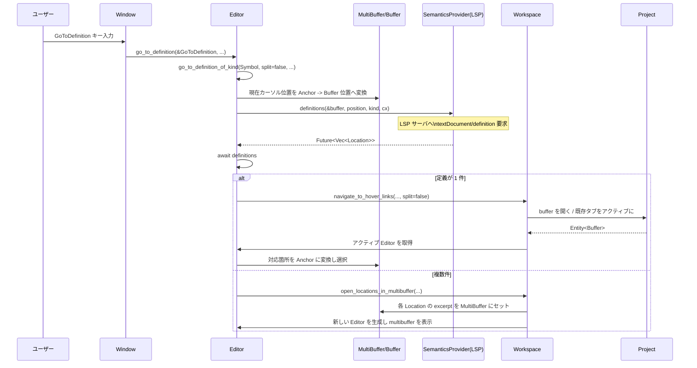

---

## 6. 使い方（How to Use）

ここではこのチャンクに含まれる機能を、外部から利用する典型パターンという観点で整理します。

### 6.1 基本的な使用方法

多くの関数は「アクション型」とセットで呼び出される設計（`&Backspace`, `&Format` など）になっています。  
アプリケーション側では、キーバインドに応じて `Editor` のメソッドを呼ぶ形になります。

```rust
// 例: Backspace キーを処理するハンドラ
fn handle_backspace(editor: &mut Editor, window: &mut Window, cx: &mut Context<Editor>) {
    // Backspace アクションを渡して削除動作を実行
    editor.backspace(&Backspace, window, cx);
}

// 例: 現在のファイルをフォーマットするハンドラ
fn handle_format(editor: &mut Editor, window: &mut Window, cx: &mut Context<Editor>) {
    if let Some(project) = editor.project.clone() {
        // FormatTarget::Buffers（バッファ全体）
        editor.perform_format(project, FormatTrigger::Manual, FormatTarget::Buffers, window, cx)
              .detach(); // 結果を待たずに非同期実行
    }
}
```

### 6.2 よくある使用パターン

1. **選択テキストの変換（ケース変更など）**

```rust
// 選択されている語句をスネークケースに変換
editor.convert_to_snake_case(&ConvertToSnakeCase, window, cx);
```

- 選択が空の場合はカーソル位置の単語を対象とします（内部で `manipulate_text` → `movement::surrounding_word`）。

2. **複数一致の選択（マルチカーソル）**

```rust
// 現在の選択と同じテキストを次々に追加選択
editor.select_next(&SelectNext { replace_newest: false }, window, cx)?;

// すべての一致を一括で選択
editor.select_all_matches(&SelectAllMatches, window, cx)?;
```

3. **インライン補完のトグル**

```rust
// ユーザーがショートカットでインライン補完を要求した場合
editor.show_inline_completion(&ShowEditPrediction, window, cx);

// 次の候補へ
editor.next_edit_prediction(&NextEditPrediction, window, cx);

// 補完を受け入れ
editor.accept_edit_prediction(&AcceptEditPrediction, window, cx);
```

4. **診断間の移動**

```rust
// 次のエラー・警告へ移動
editor.go_to_diagnostic(&GoToDiagnostic, window, cx);

// 前のエラー・警告へ移動
editor.go_to_prev_diagnostic(&GoToPreviousDiagnostic, window, cx);
```

### 6.3 使用上の注意点（まとめ）

- **read-only チェック**
  - 編集系メソッド（`backspace`, `insert_snippet`, `format` など）は内部で `read_only(cx)` や類似の条件を確認していますが、外部から呼ぶ際にも「このエディタが編集可能か」を前提条件として考えると安全です。
- **マルチバッファ**
  - `go_to_singleton_buffer_range` のように「singleton 前提」のメソッドもあるため、multi-buffer モードかどうか（`is_singleton`）に注意が必要です。
- **非同期タスク**
  - `Task` を返す API（`perform_format`, `go_to_definition`, `find_all_references` 等）は、呼び出し側で `detach` するか `await` する前提です。  
    （このコードベースでは gpui の `Task` による管理が行われています。）
- **トランザクション境界**
  - 複数の編集操作を 1 つの undo 単位にまとめたい場合は `transact` を使って、その中で `insert` や選択更新を行う必要があります。
- **選択履歴**
  - `select_next` など、一部操作は `push_to_selection_history` を明示的に呼んでから選択を変更しています。  
    「選択の undo/redo」を前提にするなら、このパターンに揃えると一貫性が保てます。
- **診断・フォールドとの相互作用**
  - 多くの「移動」系関数は、fold された範囲を避ける／展開するなどの前提を持っています。  
    `unfold_ranges` を呼ぶ関数では、fold 状態が変わることも考慮に入れる必要があります。

---

## 7. 関連ファイル・モジュール

このチャンク内から参照される他モジュールを、役割の観点でまとめます（正確なファイルパスは不明です）。

| モジュール / 構造体 | 役割 / 関係 |
|---------------------|------------|
| `MultiBuffer`, `Buffer` | 実際のテキスト内容と、その上に構築される複数 excerpt ビューを提供。ほぼ全ての編集操作の対象。 |
| `Workspace` | タブ・ペイン管理。`open_locations_in_multibuffer` や go-to-definition で新しい Editor を開く際に利用。 |
| `Project` | LSP・フォーマッタ・タスク・Git などのプロジェクト全体機能を提供。`format`, `apply_code_action_kind`, `references` などで呼び出される。 |
| `SemanticsProvider`（名前は this チャンクでは `self.semantics_provider`） | LSP 経由の semantic 情報。document highlights, definitions, rename などに使用。 |
| `InlineCompletionProviderHandle` | インライン補完（edit prediction）の提供者。`refresh`, `suggest`, `accept`, `discard` などのメソッドを持つ。 |
| `BreakpointStore` | ブレークポイントの管理。`breakpoint_context_menu`, `edit_breakpoint_at_anchor` などで利用。 |
| `TaskStore` / `task::TaskContext` | 行に紐づく runnables をタスクとして実行するためのコンテキスト生成・スケジューリングに関与。 |
| `EditorSettings`, `ProjectSettings` | インデント幅、補完の挙動、診断のデバウンスなど、エディタ／プロジェクトに関する設定を提供。 |
| `movement` モジュール | 単語・行・段落などのカーソル移動ロジック。ほぼすべての移動/選択系関数から使用。 |
| `linked_editing_ranges` | リンク編集（同時編集）時の範囲管理。`backspace` 内で連動削除に使用。 |
| `GlobalDiagnosticRenderer` | 診断グループをエディタ内のブロックとして描画するためのレンダラ。`activate_diagnostics` で利用。 |

このチャンクは `Editor` の中でも「操作とインテリジェンスの中核」にあたる部分であり、上記の多くのモジュールとの密接な連携を前提として設計されていることが読み取れます。

---

# agent/src/tools/evals ディレクトリ解説

## 1. ざっくり一言

LLM ベースの「ストリーミング編集ツール（`StreamingEditFileTool`）」を自動評価するためのテストハーネスと、その評価用フィクスチャ一式をまとめたディレクトリです。

---

## 2. このモジュールの役割

### 2.1 概要

- `streaming_edit_file.rs` は、LLM に自然言語で編集タスクを与え、`StreamingEditFileTool` を通じてファイルを書き換えさせ、その結果をスコアリングする評価フレームワークを提供します。
- `fixtures/` 以下には、各評価タスクの入力ファイル（`before.rs` や `prompt.md` など）と、それに対応する期待される差分やテスト用ファイルが格納されています。
- これにより、「関数削除」「メソッド抽出」「ドキュメントコメント翻訳」「特定のコンストラクタ追加」「WASM ビルドコマンド変更」「Python CLI/ライブラリ実装」など、複雑な編集タスクを自動で検証できるようになっています（このチャンクでは一部のタスクのみ確認できます）。

### 2.2 アーキテクチャ内での位置づけ

コードから読み取れる範囲での主な依存関係は次の通りです。

```mermaid
graph TD
    subgraph evals["agent/src/tools/evals"]
      SEF[streaming_edit_file.rs]
      Fixtures[fixtures/*]
    end

    subgraph tools["crate::tools"]
      StreamingTool[StreamingEditFileTool]
    end

    subgraph infra["インフラ"]
      LMReg[LanguageModelRegistry]
      LM[LanguageModel<br/>(編集用)]
      JudgeLM[LanguageModel<br/>(ジャッジ用)]
      ProjectEnt[Project (テスト用)]
      FakeFs[FakeFs]
      CtxServers[ContextServerRegistry]
      ThreadEnt[Thread]
    end

    SEF --> StreamingTool
    SEF --> LMReg
    SEF --> LM
    SEF --> JudgeLM
    SEF --> ProjectEnt
    SEF --> FakeFs
    SEF --> CtxServers
    SEF --> ThreadEnt
    SEF --> Fixtures
```

- 評価ハーネス（`StreamingEditToolTest` など）が、テスト用 `Project` と `FakeFs` を構築し、`LanguageModelRegistry` から実際の LLM を取得して、`StreamingEditFileTool` を呼び出します。
- `fixtures/*` はすべて評価対象ファイル（入力・期待差分・追加テストコード）として読み込まれます。

### 2.3 設計上のポイント

コードから読み取れる特徴は次の通りです。

- **LLM ベースのブラックボックス評価**
  - LLM に「自然言語の編集指示＋ツール定義」を渡し、ツール呼び出し（`edit_file`）を含む応答をストリーミングで受け取り、そのツール入力だけを抽出して評価します。
- **ツール名は本番と合わせつつ、中身だけ差し替え**
  - ツール一覧生成時に、既存の `EditFileTool` を除外し、その名前（`EditFileTool::NAME`）で `StreamingEditFileTool` のスキーマを登録して使っています。
- **アサーションの拡張性**
  - 完全一致・複数の許容 diff いずれか一致・LLM による diff 採点（`judge_diff`）の 3 パターンをサポートする `EvalAssertion` 抽象化があります。
- **エラー・レートリミットへの配慮**
  - `retry_on_rate_limit` でレートリミットや一部のサーバ／ネットワークエラーに対してリトライ制御を行います。
- **重い評価テストの opt-in 実行**
  - 各テストには `#[cfg_attr(not(feature = "unit-eval"), ignore)]` が付いており、通常は無効・明示的に feature を有効化したときだけ実行される設計です。

---

## 3. 主要な機能一覧

このディレクトリで確認できる主な機能は次の通りです。

- ストリーミング編集ツール評価ハーネス
  - LLM リクエストの生成・ツール呼び出しの抽出・`StreamingEditFileTool` 実行・結果の評価までを一括で行う `StreamingEditToolTest` と `run_eval`。
- アサーション DSL
  - `EvalAssertion` による、期待テキスト完全一致（`assert_eq`）、複数 diff のいずれか一致（`assert_diff_any`）、LLM を用いた diff 採点（`judge_diff`）。
- LLM レートリミット耐性
  - `retry_on_rate_limit` による、`LanguageModelCompletionError` と HTTP ステータスコードを見たリトライ処理。
- 個別評価タスク（テスト）
  - `eval_delete_function`：`blame.rs` から `run_git_blame` 関数だけを削除させるタスク。
  - `eval_extract_handle_command_output`：`run_git_blame` 内のエラーハンドリング部分を `handle_command_output` 関数として抽出させるタスク。
  - （このチャンクの末尾には `eval_translate_doc_comments` の途中までが見えます。`fixtures/translate_doc_comments/before.rs` を対象にしたコメント翻訳タスクと推測されますが、詳細はこのチャンクからは不明です。）

- 評価用フィクスチャ群
  - `fixtures/disable_cursor_blinking/before.rs`：大規模なエディタ実装の一部（カーソル点滅を無効化するタスク用）。
  - `fixtures/extract_handle_command_output/before.rs`：`run_git_blame` を含む Git blame ラッパー。
  - `fixtures/from_pixels_constructor/before.rs` / `translate_doc_comments/before.rs`：フォント描画用の `Canvas` 実装。
  - `fixtures/use_wasi_sdk_in_compile_parser_to_wasm/before.rs`：Tree-sitter のパーサコンパイルローダ。
  - `fixtures/zode/*`：Python/MCP/Anthropic SDK を用いた CLI エージェント「Zode」の仕様（`prompt.md`）と React 問題用コード。

---

## 4. 関数・構造体の解説

### 4.1 主要な型一覧

`streaming_edit_file.rs` で確認できる主な型を整理します。

| 名前 | 種別 | 役割 / 用途 |
|------|------|-------------|
| `DiffJudgeTemplate` | 構造体 | diff とアサーション文をテンプレートに差し込むための小さなデータ構造。`Template` トレイトを実装し、LLM ジャッジ用プロンプト生成に使われます。 |
| `EvalInput` | 構造体 | 単一評価ケースの入力。LLM への会話履歴、対象ファイルパス、初期内容、評価ロジック (`EvalAssertion`) を保持します。 |
| `EvalSample` | 構造体 | 実際にツールを走らせた後のサンプル。編集前後のテキスト、ツール入力、生成された diff を持ち、アサーション関数に渡されます。 |
| `AssertionFn` | トレイト | `EvalSample` とジャッジモデルを受け取り `EvalAssertionOutcome` を返す非同期関数型の抽象。`EvalAssertion` から内部的に利用されます。 |
| `EvalAssertion` | 構造体 | 任意の `AssertionFn` 実装をラップし、`assert_eq` / `assert_diff_any` / `judge_diff` などの組み込みアサーションを提供します。 |
| `StreamingEditEvalOutput` | 構造体 | 1 ケースの評価結果。`EvalSample` と `EvalAssertionOutcome` をまとめ、`Display` 実装で人間可読なログ文字列に変換できます。 |
| `EvalAssertionOutcome` | 構造体 | アサーション結果のスコア（0〜100 想定）と任意メッセージ（ジャッジモデルの出力など）を保持します。 |
| `StreamingEditToolTest` | 構造体 | 評価の実行環境一式（FakeFs, Project, 編集モデル, ジャッジモデル, 思考強度設定）をまとめたテストヘルパ。 |
| `KillRing` | 構造体 | このチャンクには簡易定義のみ（`ClipboardItem` ラップ）がありますが、主に別コンテキストのフィクスチャで使用されます。 |

### 4.2 代表的な関数・メソッド

#### `EvalAssertion::assert_eq(expected: impl Into<String>) -> EvalAssertion`

**概要**

- 編集後テキストが、期待文字列と（空行を無視した上で）完全に一致するかをスコア 0 / 100 で評価するアサーションを生成します。

**内部処理の流れ**

1. `expected` を `String` に変換してキャプチャ。
2. 内部的に `EvalAssertion::new` を呼び、非同期クロージャを登録。
3. クロージャ内では、`strip_empty_lines(sample.text_after)` と `strip_empty_lines(expected)` を比較。
4. 一致すれば `score = 100`、不一致なら `score = 0` として `EvalAssertionOutcome` を返す。

**Edge cases**

- 空行の有無だけが異なる場合は一致と判定されます（`strip_empty_lines` で除外しているため）。
- 文字コードやインデント差異はそのまま比較されるため、わずかな違いでも 0 スコアになります。

---

#### `EvalAssertion::assert_diff_any(expected_diffs: Vec<impl Into<String>>) -> EvalAssertion`

**概要**

- 与えた diff パッチ集合のいずれかを元テキストに適用した結果が、実際の編集結果と一致すれば成功とみなすアサーションです。

**内部処理の流れ**

1. `expected_diffs` を `Vec<String>` に変換して保存。
2. 登録されたクロージャ内で、各 diff について：
   - `language::apply_diff_patch(&sample.text_before, possible_diff)` を試行。
   - 適用に成功した結果と `sample.text_after` を `strip_empty_lines` 後に比較。
3. 少なくとも 1 つ一致した場合は `score = 100`、そうでなければ `score = 0`。

**Edge cases**

- diff 適用に失敗したパッチは自動的に無視されます。
- 元テキストと diff の対応が取れていない場合は常に失敗扱いになります。

**使用上の注意点**

- 許容解が複数あるタスク（例: 余分な定数を消す／残す両方を許す）に適しています。
- diff は `language::unified_diff` と同じフォーマットで用意する必要があります。

---

#### `EvalAssertion::judge_diff(assertions: &'static str) -> EvalAssertion`

**概要**

- 差分と評価指針（`assertions`）をプロンプトとして別の LLM（ジャッジモデル）に渡し、LLM に 0〜100 点のスコアを付けさせるアサーションです。

**引数**

| 引数名 | 型 | 説明 |
|--------|----|------|
| `assertions` | `&'static str` | 採点の観点や採点基準を含むテンプレート用テキスト。 |

**内部処理の流れ**

1. `DiffJudgeTemplate { diff: sample.diff.clone(), assertions }` を `Templates::new()` でレンダリングしてプロンプト文字列を生成。
2. ジャッジモデルに対して `LanguageModelRequest` を構築・送信し、`retry_on_rate_limit` でレートリミットを考慮しながら `stream_completion_text` で応答を取得。
3. 返却されたテキストを蓄積し、`<score>数字</score>` 形式のスコアを正規表現で抽出。
4. 数値変換に成功すればその値をスコアとし、元の応答全文を `message` に格納。
5. スコアが見つからなかった場合はエラーにします。

**Edge cases**

- 応答に `<score>` タグが含まれていない、または数値でない場合は `bail!("No score found ...")` で失敗します。
- プロンプトレンダリングや LLM 呼び出し自体が失敗した場合もそのままエラーになります。

**使用上の注意点**

- このアサーションはネットワークアクセスと追加の LLM 呼び出しを伴うため、テスト全体の実行時間が伸びます。
- `assertions` 文字列はテンプレートの一部として扱われるので、必要な採点基準を明示的に記述する必要があります。

---

#### `StreamingEditToolTest::new(cx: &mut TestAppContext) -> StreamingEditToolTest`

**概要**

- フェイクファイルシステム・テスト用 `Project`・編集モデル・ジャッジモデルなど、評価に必要な環境をまとめて初期化します（非同期）。

**内部処理の流れ（簡略）**

1. `FakeFs::new` でメモリ上のファイルシステムを用意。
2. `SettingsStore::test` を使い、フォーマット関連設定を調整（`ensure_final_newline_on_save = false`, `format_on_save = Off`）。
3. HTTP クライアントや `Client`、`UserStore`、`LanguageModelRegistry` など LLM 利用に必要なグローバル状態を初期化。
4. `FakeFs` 上に `/root` ディレクトリを作成し、`Project::test` でテスト用プロジェクトを構築。
5. 環境変数 `ZED_AGENT_MODEL` / `ZED_JUDGE_MODEL` を参照し（なければ既定値）、`SelectedModel` としてパース。
6. `LanguageModelRegistry::global` を通じて全 provider を認証し、`load_model` でそれぞれの `LanguageModel` を取得。
7. 編集用モデルのデフォルト思考強度（effort level）があれば `model_thinking_effort` に保存。

**Edge cases**

- 指定されたモデル ID やプロバイダが見つからない場合は `panic!` する箇所があります（`unwrap` / `expect`）。
- 外部 API 認証に失敗すると `Result::Err` でテスト自体が失敗します。

**使用上の注意点**

- 実際に LLM を叩くため、ネットワーク環境・API キーの設定が必要です（具体的なキー設定方法はこのチャンクからは不明ですが、`language_models::init` 周辺で設定されます）。
- 単体テストとしては重い処理なので、デフォルトでは `#[ignore]` 指定で無効になっています。

---

#### `StreamingEditToolTest::eval(&self, eval: EvalInput, cx: &mut TestAppContext) -> Result<StreamingEditEvalOutput>`

**概要**

- 単一の評価ケースを実行します。LLM に会話を投げてツール呼び出しを取得し、`StreamingEditFileTool` を実行し、その結果を `EvalAssertion` で採点します。

**引数**

| 引数名 | 型 | 説明 |
|--------|----|------|
| `eval` | `EvalInput` | 会話履歴・対象パス・元テキスト・アサーションをまとめた入力。 |

**戻り値**

- `Ok(StreamingEditEvalOutput)`：スコアと diff、ツール入力を含む結果。
- `Err`：ツール呼び出しが得られない／ツール実行が失敗／アサーションが失敗した場合など。

**内部処理の流れ（要約）**

1. 会話の最後のメッセージに `cache = true` をセット。
2. `input_content` があれば、`/root/...` 配下に `FakeFs` 経由でファイルとして書き込み、`cx.run_until_parked()` で Project 側の更新を反映。
3. `build_tools()` でツール一覧を構築（`edit_file` 名で `StreamingEditFileTool` スキーマを登録）。
4. `SystemPromptTemplate` からシステムプロンプト文字列を生成し、先頭メッセージに追加（もともと System があればそのまま）。
5. `LanguageModelRequest` を組み立て、`retry_on_rate_limit` を介して `extract_tool_use` を呼び出し、最初の `edit_file` ツール呼び出し入力を取得。
6. `Project` から言語レジストリ・コンテキストサーバレジストリを取得し、`Thread` を生成。
7. `StreamingEditFileTool::new` に `project`・`thread`・`action_log`・`language_registry` を渡してツールインスタンスを作成。
8. `tool.run(...)` を実行し、結果が `StreamingEditFileToolOutput::Success { new_text, .. }` であることを確認。
9. `EvalSample` を構築し、`eval.assertion.run` を呼び出して `EvalAssertionOutcome` を取得。
10. まとめて `StreamingEditEvalOutput` として返却。

**Edge cases**

- 会話履歴が空の場合は即座にエラー（`last_mut().context("Conversation must not be empty")?`）。
- ツール実行結果が Success 以外の場合は `bail!("Tool returned error output: ...")`。
- `extract_tool_use` 内でツール呼び出しが見つからない場合もエラーになります。

**使用上の注意点**

- LLM からは「ツール名 `edit_file`」で呼び出されますが、中身は `StreamingEditFileTool` である点に注意が必要です。
- `input_file_path` と `input_content` のパス整合性（`/root` の付与）に依存しているため、新しいタスクを追加する際も同じパターンを守る必要があります。

---

#### `StreamingEditToolTest::extract_tool_use(&self, request: LanguageModelRequest, cx: &mut TestAppContext) -> Result<StreamingEditFileToolInput>`

**概要**

- 編集用 LLM からのストリーミング応答の中から、最初の `edit_file` ツール呼び出し（入力完了済み）を取り出し、`StreamingEditFileToolInput` にデシリアライズして返します。

**内部処理の流れ**

1. `model.stream_completion(request, &async_cx)` を非同期タスクとして起動し、イベントストリームを受け取る。
2. ループで `LanguageModelCompletionEvent` を順次処理。
   - `ToolUse` で `is_input_complete == true` かつ `name == EditFileTool::NAME` の場合：
     - `tool_use.input` を `StreamingEditFileToolInput` に `serde_json::from_value` で変換して `Ok` で返す。
   - `Text` イベントはデバッグ用に 2000 文字まで蓄積。
   - `Stop` イベントから停止理由を保存。
   - `ToolUseJsonParseError` でツール名が `EditFileTool::NAME` のものは、パースエラーと raw 入力を `parse_errors` に蓄積。
3. ストリームが終了するまでツール呼び出しが見つからなかった場合：
   - 蓄積したテキスト・停止理由・パースエラーをメッセージに含めて `bail!` する。

**Edge cases**

- LLM がツールを呼ばずにテキストだけ返した場合、あるいは不完全な JSON を返し続けた場合、テストはエラーになります。
- `StreamingEditFileToolInput` へのデシリアライズに失敗した場合、その時点でエラーを返します。

---

#### `run_eval(eval: EvalInput) -> eval_utils::EvalOutput<()>`

**概要**

- テストランナー側から評価ケースを実行するエントリポイントです。内部で `StreamingEditToolTest` を生成し、`eval` を呼び出した結果を `eval_utils::EvalOutput` に変換します。

**内部処理の流れ**

1. `gpui::TestDispatcher` と `TestAppContext` を用いてテスト用アプリケーションコンテキストを構築。
2. `foreground_executor.block_test` で非同期タスクとして：
   - `StreamingEditToolTest::new` → `test.eval(eval, &mut cx)` の順に実行。
   - `cx.run_until_parked()` で残りのタスクを完了させてから結果を返却。
3. アプリケーションを `cx.quit()` で終了。
4. `EvalOutput` に変換：
   - `score < 80` なら `OutcomeKind::Failed`。
   - それ以外なら `OutcomeKind::Passed`。
   - どこかで `Err` になった場合は `OutcomeKind::Error`。

**使用上の注意点**

- `eval_utils::eval` からコールされる前提で書かれており、スコア閾値（例：`eval(100, 0.95, ...)` 内）との組み合わせで最終判定が行われます。

---

#### `async fn retry_on_rate_limit<R>(request: impl AsyncFnMut() -> Result<R>) -> Result<R>`

**概要**

- LLM 呼び出しなどで発生するレートリミット・一部のサーバエラー・ネットワークエラーに対して、最大 20 回まで自動リトライするユーティリティです。

**内部処理の流れ**

1. `attempt` を 1 からインクリメントしながら `request().await` を実行。
2. 結果が `Ok(_)` なら即座に返却。
3. `Err(err)` の場合は `LanguageModelCompletionError` へのダウンキャストを試み、エラー種別ごとにリトライ遅延を決定：
   - `RateLimitExceeded` / `ServerOverloaded`：`retry_after`（あれば）もしくは 5 秒。
   - `UpstreamProviderError` で `429` / `503` / `529`：同様に `retry_after` か 5 秒。
   - `ApiReadResponseError` / `ApiInternalServerError` / `HttpSend`：指数バックオフ（`2^(attempt-1)` 秒、最大 30 秒）。
   - それ以外のエラーはリトライせず即返却。
4. 遅延が設定された場合は、乱数を用いたジッターを加えた時間だけ `smol::Timer::after` で待機してから再試行。
5. `attempt >= MAX_RETRIES` に達した場合は最後の結果をそのまま返却。

**使用上の注意点**

- 内部で `eprintln!` によるログ出力を行うため、テストログにリトライ情報が出力されます。
- `request` クロージャ内で副作用がある場合は、複数回実行されることを前提にする必要があります。

---

## 5. データフロー

ここでは、1 つの評価テスト（例：`eval_extract_handle_command_output`）が実行される際の典型的なフローを示します。

### 5.1 処理の流れ（文章）

1. テスト関数 (`eval_extract_handle_command_output`) が `EvalInput` を組み立てる。
   - 会話履歴には、自然言語の指示（「`run_git_blame` の末尾にあるコマンド失敗処理を `handle_command_output` として抽出…」など）と、`ReadFileTool` のツール呼び出し＆結果が含まれる。
2. `run_eval` が呼ばれ、内部で `StreamingEditToolTest::new` が実行され、LLM とテスト環境が用意される。
3. `StreamingEditToolTest::eval` が：
   - FakeFs に `before.rs` の内容を書き込み、`SystemPromptTemplate` とツール定義を使って LLM への `LanguageModelRequest` を構築。
   - `extract_tool_use` でストリーミング応答から `edit_file` ツール呼び出しを抽出。
4. 抽出した `StreamingEditFileToolInput` を `StreamingEditFileTool::run` に渡し、実際の編集パッチを適用した新しいテキストを生成する。
5. `EvalSample` にまとめ、`EvalAssertion::assert_diff_any` などのアサーションを適用してスコアを算出。
6. 最終的に `EvalOutput` としてスコア・ログ文字列が返され、`eval_utils::eval` によって集計される。

### 5.2 シーケンス図

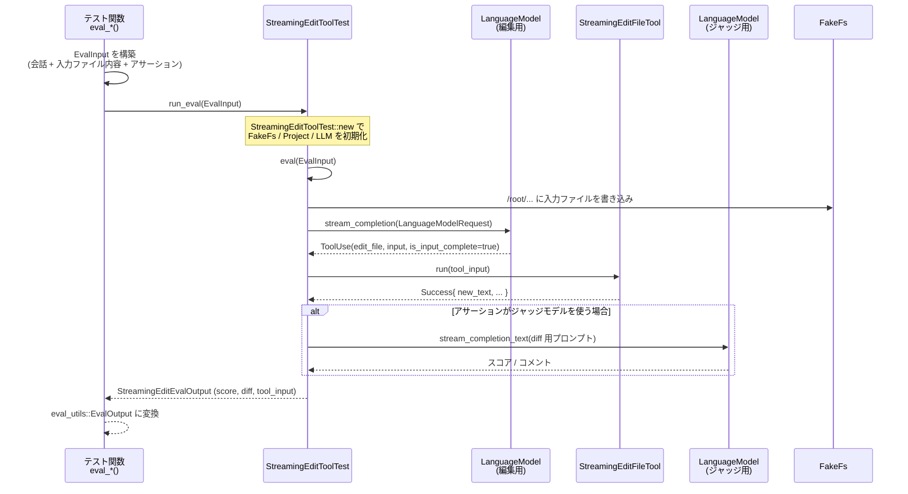

---

## 6. 使い方（How to Use）

### 6.1 基本的な使用方法

ここでは、`streaming_edit_file.rs` の評価ハーネスを用いて新しいタスクを追加する典型的なフローを、テスト関数の形で示します。

```rust
use crate::tools::evals::streaming_edit_file::*;
use language_model::Role::User;
use serde_json::json;

#[test]
#[cfg_attr(not(feature = "unit-eval"), ignore)]
fn eval_my_new_task() {
    // 1. 対象ファイルのパスと内容（fixtures 配下に事前に用意しておく）
    let input_file_path = "root/my_task.rs";                      // FakeFs 上のパス
    let input_file_content = include_str!("fixtures/my_task/before.rs");
    let expected_after = include_str!("fixtures/my_task/after.rs");

    // 2. LLM に渡す会話履歴を作る
    let conversation = vec![
        message(
            User,
            [text(format!(
                "Read `{input_file_path}` and perform my custom refactoring ...",
            ))],
        ),
        // 実際のテストと同様、事前に ReadFileTool の結果を渡す
        message(
            Assistant,
            [tool_use(
                "tool_1",
                ReadFileTool::NAME,
                ReadFileToolInput {
                    path: input_file_path.into(),
                    start_line: None,
                    end_line: None,
                },
            )],
        ),
        message(
            User,
            [tool_result(
                "tool_1",
                ReadFileTool::NAME,
                input_file_content,
            )],
        ),
    ];

    // 3. アサーションを選択（ここでは完全一致）
    let assertion = EvalAssertion::assert_eq(expected_after);

    // 4. EvalInput を構成して run_eval に渡す
    eval_utils::eval(100, 0.95, eval_utils::NoProcessor, move || {
        run_eval(EvalInput::new(
            conversation.clone(),
            input_file_path,
            Some(input_file_content.into()),
            assertion.clone(),
        ))
    });
}
```

- 実際のコードでは `eval_utils::eval` の第一・第二引数（最小スコア／合格率など）は別モジュールに定義されていますが、このチャンクからは詳細は分かりません。

### 6.2 よくある使用パターン

1. **差分許容型テスト（`assert_diff_any`）**

   - 複数の妥当解を許したい場合に使います（例：`eval_delete_function`, `eval_extract_handle_command_output`）。

   ```rust
   let possible_diffs = vec![
       language::unified_diff(before, after_variant1),
       language::unified_diff(before, after_variant2),
   ];
   let assertion = EvalAssertion::assert_diff_any(possible_diffs);
   ```

2. **LLM 採点型テスト（`judge_diff`）**

   - 「どの程度うまく編集できているか」を厳密な文字列一致ではなく、別の LLM に採点させたい場合に利用できます。

   ```rust
   // assertions には採点基準（例: 可読性・変更範囲の最小化など）を記述
   static ASSERTIONS: &str = r#"
   - 変更は指示に沿っているか
   - 不要な変更が入っていないか
   - コンパイルエラーを生んでいないか
   "#;

   let assertion = EvalAssertion::judge_diff(ASSERTIONS);
   ```

3. **テストをデフォルト無効にするパターン**

   - LLM を使うテストは重いため、ほとんどのテスト同様、`#[cfg_attr(not(feature = "unit-eval"), ignore)]` を付けて opt-in 実行にしています。

   ```rust
   #[test]
   #[cfg_attr(not(feature = "unit-eval"), ignore)]
   fn eval_heavy_task() {
       /* ... */
   }
   ```

### 6.3 使用上の注意点（まとめ）

- **LLM・API キーの前提**
  - `StreamingEditToolTest::new` では、`LanguageModelRegistry` を通じて実際の LLM モデルをロードしています。
  - モデル名は環境変数 `ZED_AGENT_MODEL` / `ZED_JUDGE_MODEL` からも読み取られるため、テスト環境に合わせて設定する必要があります（デフォルト値もコード内に埋め込まれています）。

- **テストの安定性**
  - LLM は確率的に振る舞うため、完全一致アサーションでも実行ごとに挙動が変わる可能性があります。
  - そのため、`retry_on_rate_limit` でのリトライや、許容 diff を複数用意するなどの工夫がされています。

- **実行コスト**
  - 各評価は少なくとも 2 回（編集用モデル + 場合によってはジャッジモデル）LLM を呼び出すため、テストスイートの実行時間・API 使用量に影響します。
  - 通常の単体テストとは切り分けて実行することが想定されています。

- **fixtures の整合性**
  - `EvalInput::input_file_path` と `include_str!("fixtures/...")` のパス表現が一致している必要があります（FakeFs 上では `/root/...` にマッピングされます）。
  - 新しいタスクを追加する場合も、既存テストと同じパス規約を守ると他コードとの整合性が保たれます。

---

## 7. 関連ファイル

このチャンクで確認できる、`agent/src/tools/evals` 配下の主なファイルとその役割です。

| パス | 役割 / 関係 |
|------|------------|
| `agent/src/tools/evals/streaming_edit_file.rs` | ストリーミング編集ツール（`StreamingEditFileTool`）の自動評価ハーネス本体。LLM 呼び出し・ツール実行・アサーション・リトライ制御・各種 eval テスト（`eval_delete_function`, `eval_extract_handle_command_output`, `eval_translate_doc_comments` など）を含みます。 |
| `agent/src/tools/evals/fixtures/disable_cursor_blinking/before.rs` | エディタ実装（`Editor`）の大きな断片を含むフィクスチャ。ディレクトリ名から、「カーソル点滅無効化」に関する編集タスクの入力ファイルとして使われると推測されます（このチャンク内に対応するテスト本体は現れません）。 |
| `agent/src/tools/evals/fixtures/extract_handle_command_output/before.rs` | `Blame` 構造体と `run_git_blame` 関数を含む Git blame ラッパーのソース。`eval_extract_handle_command_output` テストの入力として `include_str!` で読み込まれます。 |
| `agent/src/tools/evals/fixtures/from_pixels_constructor/before.rs` | `Canvas` と画像フォーマット列挙体などを含むフォント描画用コード。`from_pixels_constructor` 系タスクの入力と推測されます（このチャンクには対応テストの冒頭のみ見えます）。 |
| `agent/src/tools/evals/fixtures/translate_doc_comments/before.rs` | 上記 `Canvas` コードと同等の内容を持つ別ファイル。`eval_translate_doc_comments` でドキュメントコメントを翻訳／変換するタスクに利用されると考えられます。 |
| `agent/src/tools/evals/fixtures/use_wasi_sdk_in_compile_parser_to_wasm/before.rs` | Tree-sitter の `Loader` 実装と `compile_parser_to_wasm` 関連コード。WASI SDK を使ったビルドコマンドへの変更タスク（ディレクトリ名より推測）の入力として利用されます。 |
| `agent/src/tools/evals/fixtures/zode/prompt.md` | Python / MCP / Anthropic SDK を使って CLI コードエージェント「Zode」を実装するための詳細な仕様書。テキストベースのタスク定義として使用されます。 |
| `agent/src/tools/evals/fixtures/zode/react.py` | 非同期リアクティブシステムのための `InputCell`/`ComputeCell` スケルトン実装。`react_test.py` とセットで、Python 側ロジックの編集・実装タスクの入力になります。 |
| `agent/src/tools/evals/fixtures/zode/react_test.py` | 上記 `react.py` に対するユニットテスト群。エージェントが `react.py` を修正した後、このテストが通るかで正誤を判定するために利用されます。 |

※ この解説は、提示されたチャンク内の情報に基づいています。他のチャンクに含まれるコードやテストについては、この時点では詳細が分かりません。

---

# agent/src/tools ディレクトリ解説

## 0. ざっくり一言

`agent/src/tools` ディレクトリは、エージェントが外部世界とやりとりするための「ツール群」を実装している場所です。  
ファイル読み取り・編集、保存／破棄、ターミナル実行、サブエージェント起動などの機能を、安全性とユーザー権限を考慮しながら提供します。

---

## 1. このモジュールの役割

### 1.1 概要

このディレクトリは次のような問題を解決するために存在します。

- エージェントから安全にプロジェクト内のファイルを読む・書く・編集する
- ユーザーの未保存変更や機密ファイルを勝手に触らないように制御する
- 外部コマンドやサブエージェントを起動する際に、事前の権限確認や制限をかける

主な機能は以下です。

- `read_file` ツール: ファイル／画像の読み取り（大きいファイルはアウトライン）
- `streaming_edit_file` ツール: ストリーミング入力でのファイル作成・編集
- `save_file` / `restore_file_from_disk` ツール: 未保存変更の保存／破棄
- `open` ツール: URL またはファイルを OS の既定アプリで開く
- `terminal` ツール: 制限付きシェルコマンド実行
- `spawn_agent` ツール: サブエージェントの起動・再利用
- `ToolEditParser`: ストリーミング JSON から編集イベントに変換するパーサ

### 1.2 アーキテクチャ内での位置づけ

エージェントスレッドから各ツールが呼び出され、`Project` や `ActionLog`、`ToolCallEventStream` と連携して処理を行います。

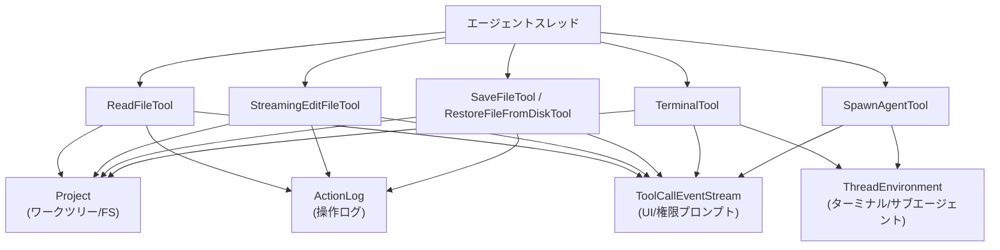

`ToolEditParser` は `StreamingEditFileTool` 内部でのみ使われ、部分的な JSON 入力を編集イベント列に変換します。

### 1.3 設計上のポイント

コードから読み取れる特徴をまとめると次のようになります。

- **共通インターフェース**
  - すべてのツールは `AgentTool` トレイトを実装し、`Input` / `Output` 型、`run` メソッド、`initial_title` などを共通インターフェースとして持ちます。
- **パス解決と権限制御**
  - パスは基本的に「プロジェクトのルート名から始まる相対パス」で受け取り、`Project` と `tool_permissions` を通じてワークツリー内に収まっているか検証します。
  - シンボリックリンク経由でワークツリー外へ出る「symlink escape」は、専用の確認ダイアログ (`authorize_symlink_access`) を出します。
  - `file_scan_exclusions` / `private_files` 設定にマッチするパスは、明示的にエラーにします。
- **操作ログとエージェント位置**
  - `ActionLog` に読み書き操作を記録し、レビュー UI（Accept All / Reject All）などに活用します。
  - 一部のツールは `AgentLocation` を更新し、「エージェントが今どのファイルのどの位置を見ているか」を追跡します。
- **ストリーミング前提の編集**
  - `StreamingEditFileTool` は LLM からの「増えていく JSON」を処理するため、`ToolEditParser` + `StreamingFuzzyMatcher` + `StreamingDiff` というストリーミングパイプラインを採用しています。
- **ユーザーの意図尊重**
  - 未保存変更や外部で更新されたファイルがある場合は、編集を止めて「どうするべきか」をメッセージでガイドし、`save_file` / `restore_file_from_disk` に誘導します。
- **セキュアなターミナル実行**
  - `TerminalTool` は `$VAR` や `$(...)` などのシェル展開を原則禁止し、AgentSettings での許可ルールとビルトインの危険コマンド検査の両方を用いて実行可否を決めます。

---

## 2. 主要な機能一覧

このディレクトリに含まれる主な機能を簡単に列挙します。

- `read_file`:  
  プロジェクト内のファイル／画像を読み取る。大きなテキストファイルはアウトライン（シンボル + 行番号）を返す。
- `streaming_edit_file`:  
  ファイルの新規作成／上書き／部分編集をストリーミング入力で行い、Diff を生成・保存する。
- `save_file`:  
  指定パスのバッファのうち未保存なものだけをディスクに保存する。
- `restore_file_from_disk`:  
  指定パスのバッファのうち未保存なものだけをディスク状態に巻き戻す。
- `open`（`open_tool.rs`）:  
  プロジェクト内の相対パスを絶対パスに解決した上で、ファイルまたは URL を OS の既定アプリケーションで開く。
- `terminal`:  
  制限付きでシェルワンライナーを実行し、その出力を取得する。
- `spawn_agent`:  
  特定のサブタスク用のサブエージェントスレッドを作成・再利用し、その最終応答を返す。
- `ToolEditParser`:  
  ストリーミングされる編集 JSON から `old_text` / `new_text` / `content` の差分チャンクをイベントとして切り出す。

---

## 3. 公開 API と詳細解説

### 3.1 型一覧（構造体・列挙体など）

代表的な型のみを抜粋します。

| 名前 | 種別 | 役割 / 用途 |
|------|------|-------------|
| `ReadFileToolInput` | 構造体 | `read_file` ツールへの入力（パスとオプションの行範囲） |
| `ReadFileTool` | 構造体 | ファイル／画像読み取りツール本体 |
| `StreamingEditFileToolInput` | 構造体 | ストリーミング編集ツールへの入力（説明・パス・モード・内容/編集） |
| `StreamingEditFileMode` | enum | `Write`（全体上書き）と `Edit`（部分編集）のモード |
| `Edit` | 構造体 | `old_text` → `new_text` の 1 編集を表す |
| `StreamingEditFileToolOutput` | enum | 編集結果（新旧テキストと unified diff）またはエラー |
| `StreamingEditFileTool` | 構造体 | ストリーミング編集ツール本体 |
| `EditSession` | 構造体 | 1 ファイル編集セッションの状態（バッファ・Diff・パーサなど） |
| `SaveFileToolInput` | 構造体 | 保存対象パス一覧 |
| `SaveFileTool` | 構造体 | 未保存バッファを保存するツール |
| `RestoreFileFromDiskToolInput` | 構造体 | 復元対象パス一覧 |
| `RestoreFileFromDiskTool` | 構造体 | 未保存変更を破棄してディスク内容に戻すツール |
| `SpawnAgentToolInput` | 構造体 | サブエージェントに渡すラベル・メッセージ等 |
| `SpawnAgentToolOutput` | enum | サブエージェントの成功/エラー結果（session_id 等を含む） |
| `SpawnAgentTool` | 構造体 | サブエージェント起動ツール |
| `TerminalToolInput` | 構造体 | 実行コマンド・作業ディレクトリ・タイムアウト |
| `TerminalTool` | 構造体 | ターミナル実行ツール |
| `ToolEditEvent` | enum | ストリーミング編集パーサが出すイベント (`OldTextChunk`, `NewTextChunk`, `ContentChunk`) |
| `ToolEditParser` | 構造体 | 部分的な JSON 入力の差分を `ToolEditEvent` に変換するパーサ |
| `PartialEdit` | 構造体 | ストリーミング中の 1 編集（`old_text` / `new_text` が Option） |
| `ReadFileTool` など各ツール | 構造体 | それぞれ `AgentTool` を実装し、`run()` を通じて非同期に動作 |

### 3.2 関数詳細（重要なもの）

#### 1. `ReadFileTool::run(self: Arc<Self>, input: ToolInput<ReadFileToolInput>, event_stream: ToolCallEventStream, cx: &mut App)`

**概要**

- `read_file` ツールのメイン処理です。
- プロジェクト内パスを解決し、設定に基づいてアクセス許可を確認し、ファイル内容またはアウトライン／画像を `LanguageModelToolResultContent` として返します。
- ユーザーによるキャンセルやシンボリックリンク越えアクセスにも対応します。

**引数**

| 引数名 | 型 | 説明 |
|--------|----|------|
| `self` | `Arc<ReadFileTool>` | ツール本体（`project` / `action_log` を保持） |
| `input` | `ToolInput<ReadFileToolInput>` | エージェントからストリーミングされる入力（最終値を `recv()` で受信） |
| `event_stream` | `ToolCallEventStream` | UI 更新・権限プロンプト・キャンセル通知用のイベントストリーム |
| `cx` | `&mut App` | gpui アプリケーションコンテキスト |

**戻り値**

- `Task<Result<LanguageModelToolResultContent, LanguageModelToolResultContent>>`
  - `Ok(Text/Image/...)` で成功結果
  - `Err(Text)` でツール内エラー（メッセージはそのまま LLM に渡る）

**内部処理の流れ**

1. `input.recv().await` で最終入力を取得（失敗時は Text エラーに変換）。
2. `Project` からファイルシステム (`fs`) を取得し、`canonicalize_worktree_roots` でワークツリーの正規化パス一覧を取得。
3. `resolve_project_path` で `input.path` をワークツリー内の `ProjectPath` に解決。
   - `ResolvedProjectPath::SymlinkEscape` の場合は `symlink_canonical_target` を別途保持。
4. `project.absolute_path` で絶対パスに変換。失敗した場合はエラー。
5. `WorktreeSettings`（グローバル＋ワークツリー）で `file_scan_exclusions` / `private_files` にマッチしていないかチェックし、マッチしていればエラー終了。
6. シンボリックリンク越え (`symlink_canonical_target` が Some) の場合は `authorize_symlink_access` で権限確認。拒否されたらエラー。
7. `event_stream.update_fields` で位置情報（ファイルパスと開始行）を UI に通知。
8. 画像ファイルかどうかを `image_store::is_image_file` で判定。
   - 画像なら `project.open_image` → `LanguageModelImage` に変換 → `Content::Image` を `event_stream` に送信 → 画像コンテンツとして返す。
9. テキストファイルの場合は `project.open_buffer` でバッファを開く。
   - `select!` でユーザーキャンセルを監視し、キャンセル時は `"File read cancelled by user"` エラー。
   - 対応するディスクファイルが存在しなければ `"path not found"` エラー。
10. 行範囲指定があるかで分岐:
    - 指定あり: `start_line` / `end_line` を 1 ベースとして補正し、最低 1 行は読むように調整して `buffer.text_for_range` で部分文字列を取得。
    - 指定なし: `outline::get_buffer_content_or_outline` でファイルサイズを見て、
      - 小さいファイルなら全文
      - 大きいファイルならアウトライン（構造 + 行番号）を取得し、「このアウトラインを使って行範囲読み直しをしてほしい」という説明付きテキストを返す。
11. `ActionLog` に `buffer_read` を記録。
12. `update_agent_location` が true の場合は `AgentLocation` を更新。
13. 戻り値がテキストの場合、ファイルパスをタグとした Markdown コードブロックに整形し、`event_stream.update_fields` で UI にも内容を流す。
14. 最終的な `LanguageModelToolResultContent` を返す。

**Examples（使用例）**

プロジェクト内 `root/src/main.rs` を全文読む簡単な例です（テストコードと同じパターン）。

```rust
use std::sync::Arc;
use gpui::App;
use action_log::ActionLog;
use project::Project;
use agent::tools::{ReadFileTool, ReadFileToolInput};
use agent::{ToolInput, ToolCallEventStream};

fn read_main_rs(
    project: gpui::Entity<Project>,         // プロジェクト
    action_log: gpui::Entity<ActionLog>,    // 操作ログ
    cx: &mut App,
) {
    let tool = Arc::new(ReadFileTool::new(project, action_log, true));

    // テスト環境では ToolCallEventStream::test() でダミーのイベントストリームを作れる
    let (event_stream, _rx) = ToolCallEventStream::test();

    let task = cx.update(|cx| {
        tool.clone().run(
            ToolInput::resolved(ReadFileToolInput {
                path: "root/src/main.rs".to_string(), // ルート名を先頭に付ける
                start_line: None,
                end_line: None,
            }),
            event_stream,
            cx,
        )
    });

    // 非同期タスクから結果を待つ（ここでは block_on 的な擬似コード）
    let result = cx.executor().block_on(task);
    if let Ok(content) = result {
        println!("file content = {}", content.to_str().unwrap_or("<non-text>"));
    }
}
```

**Errors / Panics**

- `Err(Text)` になる条件（主要なもの）:
  - `input.recv()` で入力が取得できない
  - `resolve_project_path` に失敗（ワークツリー外・不正な相対パス）
  - `absolute_path` への変換に失敗
  - 設定 (`file_scan_exclusions` / `private_files`) に該当するパス
  - シンボリックリンク越えの権限がユーザーに拒否された
  - 対応するディスクファイルが存在しない（削除されている）
  - ユーザーキャンセル（`"File read cancelled by user"`）

panic はコード上では行っておらず、エラーは原則 `Err` として返しています。

**Edge cases（エッジケース）**

- `start_line = Some(0)` の場合は 1 として扱われます（テストで確認済）。
- `end_line = Some(0)` や `start_line > end_line` の場合でも、最低 1 行は返すように調整されています。
- 大きいファイルを行範囲なしで読むと、全文ではなくアウトラインを返します。その場合、
  - 再度同じパスを行範囲無しで呼んでもアウトラインが返るだけです。
  - 実コードを読みたい場合は、必ず `start_line` / `end_line` を指定する必要があります。
- 画像ファイルの場合はテキストではなく画像コンテンツとして返されます。

**使用上の注意点**

- `path` は必ず「プロジェクトルート名から始まる相対パス」にする必要があります（例: `"root/src/main.rs"`）。
- 絶対パスや URL を渡すと `resolve_project_path` が失敗し、エラーになります。
- `file_scan_exclusions` / `private_files` にマッチするパスは読めません。設定を確認する必要があります。
- アウトラインを受け取ったときは「成功レスポンス」であり、**再試行ではなく行範囲付きで再読込する**のが前提です。

---

#### 2. `StreamingEditFileTool::run(self: Arc<Self>, input: ToolInput<StreamingEditFileToolInput>, event_stream: ToolCallEventStream, cx: &mut App)`

**概要**

- ストリーミングで届く編集リクエストを処理するメイン関数です。
- JSON 部分入力を `ToolEditParser` で差分解析しながら `EditSession` に渡し、バッファ編集・フォーマット・保存・Diff 生成までを行います。
- 入力ストリーム中のキャンセルやエラーも考慮します。

**引数**

| 引数名 | 型 | 説明 |
|--------|----|------|
| `self` | `Arc<StreamingEditFileTool>` | プロジェクト・スレッド・ActionLog・言語レジストリを保持 |
| `input` | `ToolInput<StreamingEditFileToolInput>` | ストリーミング可能な編集入力 |
| `event_stream` | `ToolCallEventStream` | Diff 更新、権限確認、キャンセルなど |
| `cx` | `&mut App` | gpui アプリケーションコンテキスト |

**戻り値**

- `Task<Result<StreamingEditFileToolOutput, StreamingEditFileToolOutput>>`
  - `Ok(Success {...})` で編集成功
  - `Err(Error { error })` で編集失敗（エラーメッセージを含む）

**内部処理の流れ**

1. `AsyncApp` に切り替えて非同期タスクを開始。
2. `state: Option<EditSession>` と `last_partial` を初期化。
3. ループで `input.recv_partial()` と `event_stream.cancelled_by_user()` を `select!` で待機。
   - `recv_partial()` が `Some(Value)` を返したら:
     1. `StreamingEditFileToolPartialInput` にデシリアライズを試みる。
     2. `path` が前回 partial と同じ値で、`display_description` と `mode` も揃っている場合、「パスが確定した」とみなし `EditSession::new` を呼んでバッファを開く。
     3. `state` が存在すれば `state.process(parsed, ...)` を呼び、`ToolEditParser` からの `ToolEditEvent` を処理してバッファを部分的に編集する。
   - ユーザーキャンセル時は `"Edit cancelled by user"` のエラーを返して終了。
4. `recv_partial()` が `None` になったら partial ループを抜ける。
5. `input.recv()` で最終の完全入力 `full_input` を取得。
6. まだ `state` がない場合は、`full_input` を使って `EditSession::new` を作成する。
7. `state.finalize(full_input, ...)` を呼び、残りの編集イベント適用、フォーマット、保存、Diff 生成までを行う。
8. 成功時は `Ok(Success { .. })`、失敗時は `Err(Error { error })` を返す。

**Examples（使用例）**

テストに近い「非ストリーミング」（一度に入力を渡す）例です。

```rust
use std::sync::Arc;
use gpui::App;
use action_log::ActionLog;
use language::LanguageRegistry;
use project::Project;
use agent::tools::{
    StreamingEditFileTool, StreamingEditFileToolInput, StreamingEditFileMode, Edit,
};
use agent::{ToolInput, ToolCallEventStream};
use agent::Thread; // このチャンクには定義がありませんが、スレッドコンテキストを表す型です。

fn overwrite_file_example(
    project: gpui::Entity<Project>,
    thread: gpui::Entity<Thread>,
    action_log: gpui::Entity<ActionLog>,
    language_registry: Arc<LanguageRegistry>,
    cx: &mut App,
) {
    let tool = Arc::new(StreamingEditFileTool::new(
        project.clone(),
        thread.downgrade(),
        action_log.clone(),
        language_registry,
    ));

    let (event_stream, _rx) = ToolCallEventStream::test();

    let task = cx.update(|cx| {
        tool.clone().run(
            ToolInput::resolved(StreamingEditFileToolInput {
                display_description: "Overwrite file".into(),
                path: "root/file.txt".into(),
                mode: StreamingEditFileMode::Write,
                content: Some("new content".into()),
                edits: None,
            }),
            event_stream,
            cx,
        )
    });

    let output = cx.executor().block_on(task).unwrap();
    match output {
        super::StreamingEditFileToolOutput::Success { new_text, diff, .. } => {
            println!("new_text = {new_text}");
            println!("diff =\n{diff}");
        }
        super::StreamingEditFileToolOutput::Error { error } => {
            eprintln!("edit failed: {error}");
        }
    }
}
```

**Errors / Panics**

代表的なエラー条件:

- パス解決（`resolve_path`）に失敗:
  - Edit モードで存在しないファイル → `"Can't edit file: path not found"`
  - ディレクトリを指定 → `"Can't edit file: path is a directory"`
  - Write モードで親ディレクトリが存在しない → `"Can't create file: parent directory doesn't exist"`
- `ensure_buffer_saved` によるエラー:
  - バッファが dirty（未保存）の場合 → 「unsaved changes があるので save/restore を使って処理してほしい」という長いメッセージ。
  - 最後に読んだ時からディスク上で変更があった場合 → 「read_file で再読込みしてから編集せよ」というメッセージ。
- `ToolEditParser` / `StreamingFuzzyMatcher` によるエラー:
  - `old_text` がファイル内のどこにもマッチしない → `"Could not find matching text for edit at index ..."`
  - 複数箇所にマッチ → `"matched multiple locations ... provide more context in old_text"`
- ユーザーキャンセル:
  - ストリーム中, フォーマット中, 保存中それぞれで `"Edit cancelled by user"`。

panic は明示的には使用しておらず、すべて `Result` に畳み込まれています。

**Edge cases（エッジケース）**

- `edits` が JSON 文字列（`"[{...}]"`）として渡されるケースも `deserialize_optional_vec_or_json_string` でサポートされています（テストで確認済）。
- 部分 JSON が escape を壊す（`\n` の途中で切れて一時的に `"\\"` になる）問題に対して、
  - `ToolEditParser` が末尾の `\` を「保留」し、次の partial で正しい文字がわかるまで流さないようにしています。
- `StreamingDiff` による編集中は、一時的に「新しいテキストと古いテキストが両方見えている」状態がバッファに現れることがありますが、`finish()` 時点で整合性の取れたテキストになります（テストで検証）。
- フォーマット／末尾空白削除の設定によって、書き込まれる内容が入力とは微妙に変わる場合があります。

**使用上の注意点**

- このツールは **ストリーミング入力前提** の設計です。LLM 側は「差分 JSON」を段階的に送ることが想定されています。
- `old_text` には必ず**ファイルから取得した最新の内容**を使う必要があります。古いスナップショットを使うとマッチ失敗になります。
- 同じファイルに対する複数の編集は、1 回の `streaming_edit_file` 呼び出しの中で `edits: [...]` にまとめることが推奨されています。
- 未保存変更や外部変更があるときに出されるエラーメッセージは、その後のアクション（`save_file` / `restore_file_from_disk` など）を案内しています。**メッセージに書かれた手順に従う前提**で設計されています。

---

#### 3. `EditSession::new(path: &PathBuf, display_description: &str, mode: StreamingEditFileMode, tool: &StreamingEditFileTool, event_stream: &ToolCallEventStream, cx: &mut AsyncApp)`

**概要**

- 1 回の編集セッションを開始するための初期化関数です。
- パス解決・権限確認・バッファオープン・未保存／外部変更チェック・Diff エンティティ作成・旧テキストの取得などを行います。

**引数**

| 引数名 | 型 | 説明 |
|--------|----|------|
| `path` | `&PathBuf` | ツール入力の `path` フィールド |
| `display_description` | `&str` | UI に表示する編集の説明文 |
| `mode` | `StreamingEditFileMode` | `Write` or `Edit` |
| `tool` | `&StreamingEditFileTool` | プロジェクト・スレッド・ActionLog を持つツール本体 |
| `event_stream` | `&ToolCallEventStream` | 位置情報更新・権限プロンプト送信用 |
| `cx` | `&mut AsyncApp` | 非同期コンテキスト |

**戻り値**

- `Result<EditSession, StreamingEditFileToolOutput>`  
  エラー時はすでに `StreamingEditFileToolOutput::Error` にラップされているため、そのまま `run` から `Err` として返せます。

**内部処理の流れ（要約）**

1. `resolve_path(mode, path, &tool.project, cx)` で `ProjectPath` に解決。
2. `project.absolute_path` で絶対パスを取得。失敗した場合は `"Worktree at '...' does not exist"` エラー。
3. `event_stream.update_fields` でロケーション（絶対パス）を UI に通知。
4. `tool.authorize` を呼び出し、`EditFileTool::NAME` ベースのルールでパスと説明文に対する権限確認を行う。
5. `project.open_buffer(project_path, cx)` でバッファを開く（新規作成も含む）。
6. `ensure_buffer_saved` で:
   - バッファが dirty でないこと
   - 最後に read した時からディスク上で変更されていないこと
   を確認。違反していれば長い説明付きエラーを返す。
7. Diff エンティティ `Diff::new(buffer.clone(), cx)` を作成し、`event_stream.update_diff` で UI に送る。
8. `util::defer` を使ったガード `_finalize_diff_guard` をセットし、この `EditSession` がドロップされたときに `diff.finalize(cx)` が必ず実行されるようにする。
9. `ActionLog` に:
   - Write モードなら `buffer_created`
   - Edit モードなら `buffer_read`
   を記録。
10. バッファのスナップショットから旧テキストを `Arc<String>` にバックグラウンド取得し、`old_text` として保持。

**使用上の注意点**

- `EditSession::new` の中で「編集してはいけない状態」（dirty / 外部変更）が検出された場合、**そこで編集を止める**のが設計意図です。
- Diff エンティティの finalize は `_finalize_diff_guard` が自動で行うため、呼び出し側で明示的に finalize する必要はありませんが、`EditSession` を早めにドロップするとその時点で finalize されます。

---

#### 4. `SaveFileTool::run(self: Arc<Self>, input: ToolInput<SaveFileToolInput>, event_stream: ToolCallEventStream, cx: &mut App)`

**概要**

- `save_file` ツールのメイン処理です。
- 与えられたパスのバッファを開き、dirty なものだけを保存して結果サマリ文字列を返します。
- 機密設定ファイルや symlink escape に対して追加の確認や拒否を行います。

**引数 / 戻り値**

構造は `RestoreFileFromDiskTool::run` とほぼ同じで、戻り値は `Task<Result<String, String>>`（成功/失敗いずれも人間可読メッセージ）です。

**内部処理の流れ（要点）**

1. `input.recv()` で `SaveFileToolInput { paths }` を取得。
2. 各 `path` に対して `decide_permission_for_path` を呼び、`ToolPermissionDecision::Deny` なものがあればその場でエラー終了。
3. `canonicalize_worktree_roots` でワークツリーの正規化ルートを取得。
4. 再度各 `path` を走査し、
   - `path_has_symlink_escape` で symlink escape 判定
   - `is_sensitive_settings_path` で設定ファイルなどかどうか判定
   - `ToolPermissionDecision` が `Allow` でも `Confirm` でも、機密ファイルや symlink escape であれば `confirmation_paths` に積む
5. `confirmation_paths` が空でなければ、タイトル（パス名の一覧 + `(local settings)` など）を組み立て、`event_stream.authorize` でユーザー確認を取る。
6. 各パスごとに `resolve_project_path` → `project.open_buffer` を行い、
   - symlink escape があれば `authorize_symlink_access` で個別に許可を取る（拒否されたものは `authorization_errors` に記録してスキップ）。
   - バッファが dirty なら `buffers_to_save` に登録、そうでなければ `clean_paths` に追加。
7. `buffers_to_save` の各バッファについて `project.save_buffer` を呼び出し、エラーは `save_errors` に収集。
8. 成功保存数・クリーンファイル数・not_found / open_errors / authorization_errors / save_errors をまとめてテキストとして返す。

**Edge cases & 注意点**

- symlink escape でユーザーが「deny」した場合、そのファイルは `Authorization failed (...)` セクションに出ますが、「保存失敗」とは別扱いにしているため成功保存数の統計には影響しません（テストで確認済）。
- `paths` が空のときは `"No paths provided."` とだけ返します。
- パスは `StreamingEditFileTool` と同様、「ルート名/相対パス」の形式で渡す前提です。

---

#### 5. `RestoreFileFromDiskTool::run(self: Arc<Self>, input: ToolInput<RestoreFileFromDiskToolInput>, event_stream: ToolCallEventStream, cx: &mut App)`

**概要**

- `save_file` の逆操作で、dirty なバッファのみをディスク内容に戻します。
- 「ユーザーが望まない未保存変更を消してから再編集したい」という用途に使われます。

**内部処理の流れ（`SaveFileTool::run` との違いのみ）**

- symlink escape に対する挙動や `ToolPermissionDecision` の扱いは `SaveFileTool` とほぼ同じです。
- dirty なバッファを `buffers_to_reload` に集め、最後に `project.reload_buffers(buffers_to_reload, true, cx)` でまとめて再読込します。
- 成功時は `Restored N file(s).`、クリーンだったファイルは `M clean.` といったサマリを返します。
- ディスク内容は上書きせず、バッファ側だけをディスク状態に揃えます（テストで検証済み）。

---

#### 6. `TerminalTool::run(self: Arc<Self>, input: ToolInput<TerminalToolInput>, event_stream: ToolCallEventStream, cx: &mut App)`

**概要**

- 制限付きターミナルコマンドを実行し、結果を Markdown 形式の文字列で返します。
- シェル展開（`$VAR`, `$(...)`, backticks など）を原則禁止し、AgentSettings のルールに従って許可／拒否／確認を行います。
- タイムアウトとユーザーキャンセルをサポートし、打ち切り時のメッセージを分かりやすく生成します。

**引数**

| 引数名 | 型 | 説明 |
|--------|----|------|
| `input` | `ToolInput<TerminalToolInput>` | コマンド・作業ディレクトリ・タイムアウト情報 |
| `event_stream` | `ToolCallEventStream` | ターミナルカードの表示とキャンセル検出 |
| `cx` | `&mut App` | gpui コンテキスト |

**戻り値**

- `Task<Result<String, String>>`  
  成功時も失敗時も人間向けの説明テキストを返します（`Err` の場合は上位から「ツールエラー」として扱われます）。

**内部処理の流れ**

1. `input.recv()` で最終入力を取得。
2. `working_dir(&input, &self.project, cx)` で `cd` を解決:
   - `"."` や空文字列は「ワークツリーが 1 つだけならそのルート」を意味する。
   - 絶対パスの場合は、いずれかのワークツリーに含まれている必要がある。
   - そうでなければエラー。
3. `decide_permission_from_settings` にコマンド文字列を渡して `ToolPermissionDecision` を取得。
   - `Allow` → そのまま実行へ。
   - `Deny` → 理由付きでエラー終了。
   - `Confirm` → `ToolPermissionContext` を作って `event_stream.authorize(...)` でユーザーに確認を取り、拒否されたらエラー。
   - ここで、「シェル展開を禁止するビルトインルール」に引っかかるコマンドは **AgentSettings の `Allow` 設定よりも優先して拒否**（テストで確認）。
4. `environment.create_terminal(...)` でターミナルプロセスを起動し、`ToolCallUpdateFields::content` に `Terminal` コンテンツとして UI へ送信。
5. `timeout_ms` があれば `timer(timeout)` と `wait_for_exit` を `select!` し、
   - タイムアウト → `timed_out = true; terminal.kill(...)`。
   - `event_stream.cancelled_by_user()` またはターミナルカード側の Stop → `user_stopped_via_signal = true; terminal.kill(...)`。
   - 正常終了 → そのまま続行。
6. `terminal.current_output(cx)` で出力と終了ステータスを取得し、`process_content(...)` でわかりやすいメッセージに整形して返す。

**Examples（使用例）**

```rust
use std::sync::Arc;
use gpui::App;
use project::Project;
use agent::tools::{TerminalTool, TerminalToolInput};
use agent::{ToolInput, ToolCallEventStream};
use agent::ThreadEnvironment; // このチャンクには定義がありません。

fn run_ls(
    project: gpui::Entity<Project>,
    env: std::rc::Rc<dyn ThreadEnvironment>,
    cx: &mut App,
) {
    let tool = Arc::new(TerminalTool::new(project, env));
    let (event_stream, _rx) = ToolCallEventStream::test();

    let task = cx.update(|cx| {
        tool.clone().run(
            ToolInput::resolved(TerminalToolInput {
                command: "ls".to_string(),
                cd: "root".to_string(),      // プロジェクトルート名
                timeout_ms: Some(5_000),    // 5 秒タイムアウト
            }),
            event_stream,
            cx,
        )
    });

    let result = cx.executor().block_on(task);
    println!("terminal result:\n{}", result.unwrap_or_else(|e| e));
}
```

**使用上の注意点**

- ドキュメントにもある通り、`command` には **`$VAR` / `${VAR}` / `$(...)` / `` `...` `` / `$((...))` / `<(...)` / `>(...)` を含めてはいけません**。  
  これらが含まれると、原則として「シェル展開を禁止する」メッセージで拒否されます。
- `"cd"` は `TerminalToolInput.cd` で指定し、コマンド文字列内に `cd ... &&` のようなものを含めない前提になっています。
- 無限に動き続けるコマンド（サーバー起動など）は対象外で、タイムアウトやユーザーキャンセルにより必ず止められることが想定されています。

---

#### 7. `SpawnAgentTool::run(self: Arc<Self>, input: ToolInput<SpawnAgentToolInput>, event_stream: ToolCallEventStream, cx: &mut App)`

**概要**

- サブエージェント（別スレッドのエージェント）を作成または再開して、1 メッセージ分の仕事を任せ、その最終出力を返します。
- 成功でもエラーでも `session_id` を可能な限り返し、後続のフォローアップで同じセッションを再利用できるようにします。

**内部処理の流れ（要点）**

1. `input.recv()` で `SpawnAgentToolInput { label, message, session_id }` を取得。失敗時は `Error{ session_id: None }`。
2. `cx.update` 内で:
   - `session_id` が Some なら `environment.resume_subagent(session_id, cx)`、None なら `environment.create_subagent(label, cx)`。
   - 失敗すれば `Error{ session_id: None }`。
   - 成功すれば `SubagentSessionInfo { session_id, message_start_index, message_end_index: None }` を作成。
   - `event_stream.subagent_spawned(session_id)` と、`SUBAGENT_SESSION_INFO_META_KEY` を含むメタ情報を UI に送信。
3. `subagent.send(message, cx).await` でサブエージェントにメッセージを送り、最終出力またはエラーを受け取る。
4. テレメトリイベント `"Subagent Completed"` を送信。
5. `message_end_index` を更新し、再度メタ情報を `ToolCallUpdateFields` と一緒に更新。
6. 成功時:
   - `SpawnAgentToolOutput::Success { session_id, output, session_info }` を返し、`event_stream` にも同じ `output` をコンテンツとして送る。
7. 失敗時:
   - `SpawnAgentToolOutput::Error { session_id: Some(...), error, session_info: Some(...) }` として `Err` を返し、エラー文字列をコンテンツとして送る。

**使用上の注意点**

- サブエージェントは「会話履歴を持つ別エージェント」という前提で、`SpawnAgentToolInput.message` には **新しいサブタスクのための文脈** を含める必要があります。
- 同じサブタスクのフォローアップでは `session_id` を再利用し、簡潔な追記メッセージだけを送る設計になっています。

---

### 3.3 その他の関数（ヘルパー）

| 関数名 | 役割（1 行） |
|--------|--------------|
| `to_absolute_path(potential_path, project, cx)`（`open_tool.rs`） | プロジェクト相対パスを `Project` 経由で絶対パスに解決する（ワークツリー外や URL なら `None`）。 |
| `ensure_buffer_saved(buffer, abs_path, tool, cx)` | バッファが dirty でないか、外部で更新されていないかをチェックし、問題があればガイド付きエラーを返す。 |
| `resolve_path(mode, path, project, cx)` | `StreamingEditFileTool` におけるパス解決ロジック（Edit/Write で挙動が異なる）。 |
| `ToolEditParser::push_edits(edits)` | ストリーミング中の部分 `edits` 配列から `ToolEditEvent` の差分を生成する。 |
| `ToolEditParser::push_content(content)` | Write モードの `content` の成長分を `ContentChunk` として返す。 |
| `working_dir(input, project, cx)`（`terminal_tool.rs`） | `cd` 文字列をワークツリー内絶対パスに解決し、曖昧な `"."` などを検出する。 |

---

## 4. データフロー

ここでは、`streaming_edit_file` で既存ファイルを部分編集するシナリオを例に、データの流れを示します。

### シナリオ概要

1. エージェントが `read_file` で `root/file.txt` の内容を把握する。
2. その内容に基づき、`streaming_edit_file` の `edits` に `old_text` / `new_text` を指定して呼び出す。
3. LLM からは JSON がストリーミングで届き、ツール側は部分的に編集を適用していく。
4. 編集完了後、フォーマットや末尾空白削除が適用され、ファイルが保存される。
5. unified diff が UI に表示される。

### シーケンス図

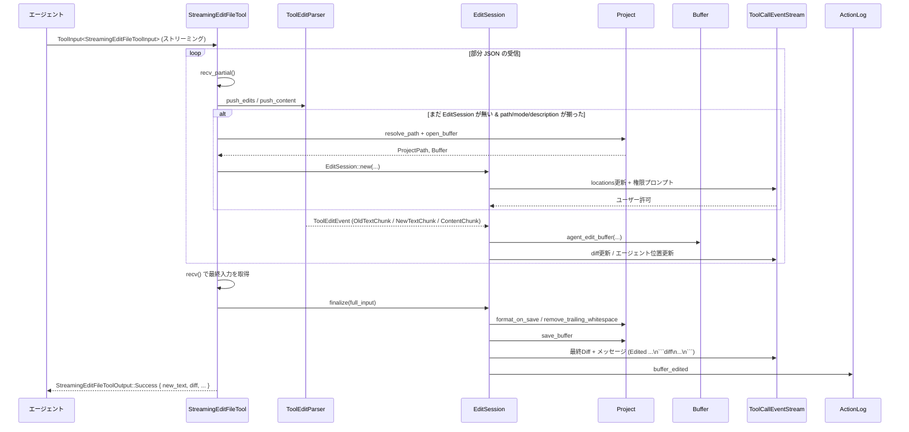

このように、`ToolEditParser` を中心としたストリーミングパイプラインと、`EditSession` によるバッファ編集・保存処理が連携して動作しています。

---

## 5. 使い方（How to Use）

ここでは、エージェント内部あるいはテストコードからこれらのツールを利用する際の典型パターンを示します。

### 5.1 基本的な使用方法

#### ファイルの読み取り → 編集 → 保存という一連の流れ

```rust
use std::sync::Arc;
use gpui::{App, Entity};
use action_log::ActionLog;
use project::Project;
use language::LanguageRegistry;
use agent::Thread; // このチャンクには定義がありません
use agent::tools::{
    ReadFileTool, ReadFileToolInput,
    StreamingEditFileTool, StreamingEditFileToolInput, StreamingEditFileMode, Edit,
    SaveFileTool, SaveFileToolInput,
};
use agent::{ToolInput, ToolCallEventStream};

fn edit_flow(
    project: Entity<Project>,
    thread: Entity<Thread>,
    action_log: Entity<ActionLog>,
    language_registry: Arc<LanguageRegistry>,
    cx: &mut App,
) {
    // 1. ファイルを読む
    let read_tool = Arc::new(ReadFileTool::new(project.clone(), action_log.clone(), true));
    let (read_stream, _rx) = ToolCallEventStream::test();
    let read_task = cx.update(|cx| {
        read_tool.clone().run(
            ToolInput::resolved(ReadFileToolInput {
                path: "root/file.txt".into(), // ルート名 + 相対パス
                start_line: None,
                end_line: None,
            }),
            read_stream,
            cx,
        )
    });
    let content = cx.executor().block_on(read_task).unwrap();
    println!("original:\n{}", content.to_str().unwrap_or(""));

    // 2. 部分編集を行う
    let edit_tool = Arc::new(StreamingEditFileTool::new(
        project.clone(),
        thread.downgrade(),
        action_log.clone(),
        language_registry,
    ));
    let (edit_stream, _rx) = ToolCallEventStream::test();
    let edit_task = cx.update(|cx| {
        edit_tool.clone().run(
            ToolInput::resolved(StreamingEditFileToolInput {
                display_description: "Modify line".into(),
                path: "root/file.txt".into(),
                mode: StreamingEditFileMode::Edit,
                content: None,
                edits: Some(vec![Edit {
                    old_text: "old content".into(),
                    new_text: "new content".into(),
                }]),
            }),
            edit_stream,
            cx,
        )
    });
    let edit_result = cx.executor().block_on(edit_task).unwrap();
    println!("{edit_result}");

    // 3. 念のため save_file を明示的に呼ぶケース（通常は streaming_edit_file が保存まで行う）
    let save_tool = Arc::new(SaveFileTool::new(project));
    let (save_stream, _rx) = ToolCallEventStream::test();
    let save_task = cx.update(|cx| {
        save_tool.clone().run(
            ToolInput::resolved(SaveFileToolInput {
                paths: vec!["root/file.txt".into()],
            }),
            save_stream,
            cx,
        )
    });
    let save_output = cx.executor().block_on(save_task).unwrap();
    println!("save result:\n{save_output}");
}
```

### 5.2 よくある使用パターン

- **大きいファイルの解析**
  1. `read_file` を行範囲なしで呼び出し、アウトラインを取得。
  2. アウトラインの `[Lxx-yy]` を基に、関心のある範囲について `start_line` / `end_line` を指定して再度 `read_file` を呼ぶ。
  3. 必要に応じてその範囲に対し `streaming_edit_file` を使って編集。

- **未保存変更があるファイルの編集**
  1. `StreamingEditFileTool` が「unsaved changes がある」というエラーを返したら、そのメッセージに従いユーザーに「保存するか破棄するか」を確認。
  2. 保存したい場合 → `save_file` を当該パスで呼ぶ。
  3. 破棄したい場合 → `restore_file_from_disk` を呼ぶ。
  4. 再度 `streaming_edit_file` で編集をやり直す。

- **機密ファイル／設定ファイルの扱い**
  - `file_scan_exclusions` / `private_files` 設定にマッチするパスは `read_file` / `save_file` / `restore_file_from_disk` で明示的にブロックされます。
  - `.zed/settings.json` や `.env` などは、基本的に「特別扱い」として確認プロンプトが出るか、そもそもアクセス禁止となります。

### 5.3 よくある間違い

```rust
// 間違い例 1: プロジェクトルート名なしのパスを渡す
let input = ReadFileToolInput {
    path: "src/main.rs".to_string(), // NG: ルート名がない
    start_line: None,
    end_line: None,
};

// 正しい例: ルート名を先頭に含める
let input = ReadFileToolInput {
    path: "root/src/main.rs".to_string(), // OK
    start_line: None,
    end_line: None,
};
```

```rust
// 間違い例 2: アウトラインを返されたのに、再度行範囲なしで read_file を呼び直す
// → 同じアウトラインが返るだけで、実コードは読めない。

// 正しい例: アウトラインに出てきた L100-150 を元に行範囲を指定する
let input = ReadFileToolInput {
    path: "root/large_file.rs".to_string(),
    start_line: Some(100),
    end_line: Some(150),
};
```

```rust
// 間違い例 3: TerminalTool にシェル展開を含むコマンドを渡す
let input = TerminalToolInput {
    command: "echo $HOME".to_string(), // NG: $HOME が含まれている
    cd: "root".to_string(),
    timeout_ms: None,
};

// 正しい例: 展開後の文字列を自分で組み立てて渡す
let home = "/home/user"; // 例えばユーザー入力などから取得済み
let input = TerminalToolInput {
    command: format!("echo {}", home), // OK: シェル変数展開ではない
    cd: "root".to_string(),
    timeout_ms: None,
};
```

### 5.4 使用上の注意点（まとめ）

- **パス表現**
  - ツール入力でファイルパスを指定するときは、必ず「ワークツールート名/相対パス」という形にします（例: `"root/src/main.rs"`）。
  - 絶対パスを許可する場面（`terminal.cd` など）でも、必ず `Project` のワークツリー内に収まるようにチェックされています。

- **シンボリックリンク**
  - ワークツリーの外側を指す symlink は「symlink escape」として扱われ、`authorize_symlink_access` による明示的な確認が必要です。
  - ツールポリシーが `Deny` の場合はそもそもプロンプトが出ずに拒否されます。

- **設定ベースのアクセス制御**
  - `WorktreeSettings`（グローバル + 各ワークツリー）の `file_scan_exclusions` / `private_files` にマッチするパスは、`read_file` / `save_file` / `restore_file_from_disk` からアクセスできません。
  - エラーメッセージには「global/worktree `file_scan_exclusions` setting」等、どのレイヤーの設定に引っかかったかが明示されます。

- **未保存変更と外部変更**
  - `StreamingEditFileTool` は `ActionLog` の last-read 時刻とファイルの mtime を比較し、外部で変更された場合には編集を拒否して再読込みを要求します。
  - バッファが dirty の場合は、`save_file` / `restore_file_from_disk` による解決を促すメッセージを返します。

- **Terminal 実行の安全性**
  - 危険な構文（シェル展開／プロセス置換／危険な組み合わせのコマンド）は、AgentSettings の `Allow` 設定よりも強い「ビルトイン拒否」によってブロックされることがあります。
  - 設定で「この正規表現にマッチするコマンドだけ常に許可」といった細かい制御も可能ですが、その動作は `decide_permission_from_settings` 側の実装に依存します（このチャンクには定義がありません）。

---

## 6. 変更の仕方（How to Modify）

### 6.1 新しい機能を追加する場合

新しいツールを追加する場合は、既存のツールファイルと同じパターンに従うと理解しやすくなります。

1. **入力/出力型の定義**
   - `#[derive(Debug, Serialize, Deserialize, JsonSchema)]` を付与した `Input` 構造体を定義します。
   - モデルに見せたくないフィールドがあれば `skip_serializing_if` などの属性を付けます。
2. **ツール本体構造体の定義**
   - `Project` や `ActionLog`、`ThreadEnvironment` など、必要な依存オブジェクト（`Entity<T>` や `Rc`）をフィールドに持つ構造体を定義します。
3. **`AgentTool` の実装**
   - `type Input` / `type Output` / `const NAME` / `fn kind()` / `fn initial_title()` / `fn run()` を実装します。
   - 必要に応じて `fn replay()` を実装し、ファイル Diff やサブエージェント情報を UI に再送できるようにします。
4. **パス検証や権限確認の統合**
   - ファイルを触る場合は `tool_permissions` の関数（`resolve_project_path`, `canonicalize_worktree_roots`, `authorize_symlink_access`, `decide_permission_for_path` など）を使い、既存ツールと同じ安全性モデルに乗せます。
5. **テストコードの追加**
   - `#[gpui::test]` で `FakeFs` や `Project::test` を組み合わせ、パス解決・設定との相互作用・キャンセル・権限確認などをカバーするテストを書くと、既存ツールとの整合性が取りやすくなります。

### 6.2 既存の機能を変更する場合

変更時は、以下の点に注意する必要があります。

- **影響範囲の確認**
  - 変更対象のツールがどのテストで使われているか（`#[gpui::test]` セクション）を確認します。
  - 特に `StreamingEditFileTool` と `ToolEditParser` は多数のエッジケーステストがあり、挙動を変えると多くのテストが落ちる可能性があります。
- **契約（前提条件・返り値）の維持**
  - 例えば `read_file` の「大きなファイルはアウトラインを返す」「アウトラインは成功レスポンスであり、再試行しても同じものが返る」といった挙動はテストで前提になっています。
  - `TerminalTool` の「シェル展開禁止」ルールやタイムアウトメッセージ形式もテストで厳密にチェックされています。
- **ツール間の前提の整合性**
  - `StreamingEditFileTool` が「unsaved changes」や「外部変更」エラーで `save_file` / `restore_file_from_disk` を案内する前提で設計されているため、そのメッセージ文言や意味を大きく変えると、エージェント側のプロンプト設計とズレが生じる可能性があります。
- **テストの更新**
  - 挙動を変えた場合は、該当テスト（特に `test_*` 系）を探し、期待値の更新やケース追加を行う必要があります。

---

## 7. 関連ファイル

このディレクトリのコードが依存している、主要な他ファイル・モジュールをまとめます（このチャンクには本体定義が含まれていませんが、役割は名前と利用箇所から読み取れます）。

| パス / モジュール | 役割 / 関係 |
|-------------------|------------|
| `project::Project` | ワークツリー / 仮想ファイルシステム (`FakeFs`) を扱う中心的な型。各ツールのパス解決・バッファオープン・保存・フォーマットに利用されます。 |
| `project::WorktreeSettings` | `file_scan_exclusions` / `private_files` など、ファイルアクセス制御のための設定を保持する型。`read_file` などで参照されます。 |
| `action_log::ActionLog` | ファイル読み書きや編集操作を記録し、レビュー UI（Accept All / Reject All 等）に使われます。 |
| `agent_client_protocol` (`acp`) | ツール呼び出しやターミナル出力をモデルとやり取りするためのプロトコル定義。`ToolKind`, `ToolCallUpdateFields`, `TerminalOutputResponse` などを提供します。 |
| `acp_thread` | Diff 表示やサブエージェント情報 (`Diff`, `SubagentSessionInfo`) など、UI 表示用の構造を提供します。 |
| `agent_settings::AgentSettings` | 各ツールの許可／拒否／確認ポリシーや、常時許可・常時拒否の正規表現パターンを定義する設定。`save_file`, `restore_file_from_disk`, `terminal`, `streaming_edit_file` などが参照します。 |
| `crate::tool_permissions` | パス解決 (`resolve_project_path`, `canonicalize_worktree_roots`)、symlink escape 検知 (`path_has_symlink_escape`)、機密パス判定 (`is_sensitive_settings_path`, `sensitive_settings_kind`)、権限プロンプト (`authorize_symlink_access`, `authorize_file_edit`) を提供するモジュールです。 |
| `language` / `LanguageRegistry` | 言語ごとのフォーマッタや LSP 連携 (`format_on_save`, remove trailing whitespace など) に使われます。 |
| `streaming_diff`, `StreamingFuzzyMatcher`, `Reindenter` | `StreamingEditFileTool` 内部で、`old_text` の fuzzy マッチや `new_text` ストリーミング差分適用、インデント調整に使われます。 |
| `util::markdown::MarkdownCodeBlock` / `MarkdownInlineCode` | ファイル内容やパスを Markdown 形式に整形するヘルパー。ツール結果を UI にわかりやすく表示するために使用されます。 |

以上が、このチャンクに含まれる `agent/src/tools` ディレクトリの主な構造と挙動の整理です。
