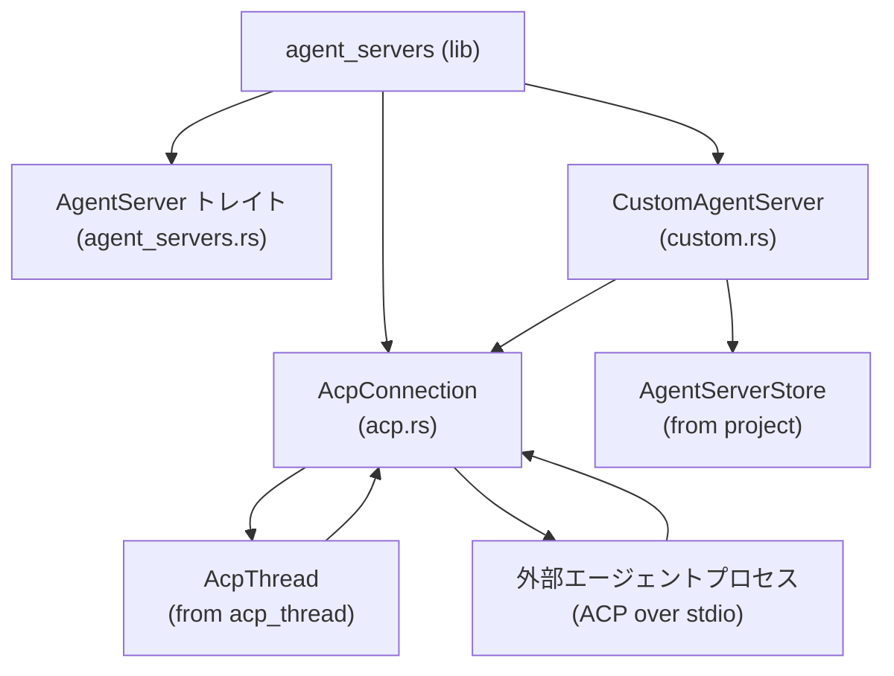
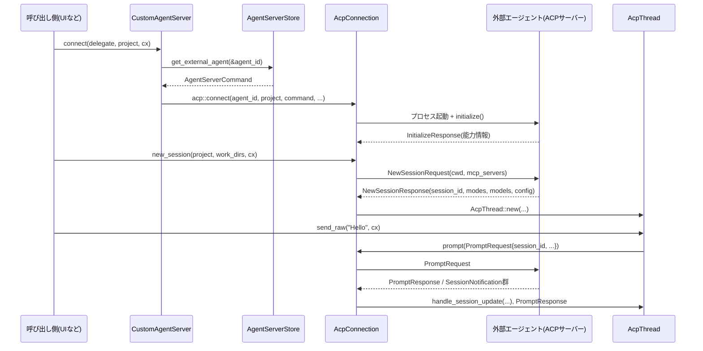

# crates/agent_servers ディレクトリ解説

## 0. ざっくり一言

`agent_servers` クレートは、Zed が外部の「エージェントサーバー」（LLM エージェント CLI など）と通信するための共通インターフェースと実装を提供するモジュール群です。  
ACP (Agent Client Protocol) over stdio のクライアント実装と、ユーザー定義・レジストリ定義エージェント向けの汎用的な `CustomAgentServer`、およびそれらの E2E テスト用ヘルパーが含まれます。

---

## 1. このモジュールの役割

### 1.1 概要

- このディレクトリは **外部エージェントサーバーとの接続・セッション管理** を行うために存在し、次の機能を提供します。
  - エージェントサーバーの抽象インターフェース `AgentServer` と、その汎用実装 `CustomAgentServer`
  - ACP (agent_client_protocol) による stdio ベースの接続実装 `AcpConnection`
  - プロジェクト・設定・レジストリからエージェントの起動コマンドやデフォルト設定を組み立てるロジック
  - `AgentServer` 実装向けの共通 E2E テスト群

### 1.2 アーキテクチャ内での位置づけ

このクレートは、UI 層やプロジェクト管理層と、外部エージェントプロセスの間の「アダプタ」として機能します。

- 上位層:
  - `Project` / `AgentServerStore`（どのエージェントを使うか）
  - `AcpThread`（エージェントとの対話スレッド UI）
- 下位層:
  - 外部エージェント CLI（ACP サーバー）
  - OS プロセス・環境変数・ターミナル

主要な依存関係を図示すると次のようになります。



### 1.3 設計上のポイント

- **抽象化されたエージェントサーバー**
  - `AgentServer` トレイトで「ロゴ・ID・接続処理・デフォルトモデル/モード・お気に入り設定」などを統一的に扱います。
  - 具体実装としては `CustomAgentServer` があり、設定・レジストリ情報からコマンドや環境変数を組み立てます。

- **ACP クライアント実装のカプセル化**
  - `AcpConnection` が `acp_thread::AgentConnection` を実装し、ACP の低レベルな通信 (`ClientSideConnection`) を UI スレッド (`AcpThread`) 用の抽象に橋渡しします。
  - セッション管理、モード/モデル/設定オプションの選択、キャンセル、認証などを一箇所で扱います。

- **非同期・タスク指向**
  - 各種操作は `gpui::Task<Result<...>>` として表現され、`App` / `AsyncApp` の実行コンテキスト経由でスケジューリングされます。
  - 子プロセスの I/O・終了待ち、エージェントとの通信はバックグラウンドタスクとして実行されます。

- **設定・レジストリとの連携**
  - `settings::CustomAgentServerSettings` と `AllAgentServersSettings` により、デフォルトモード・モデル・お気に入りなどを永続化します。
  - `AgentRegistryStore` と連携し、「レジストリ由来」と「拡張由来」のエージェントを区別します。

- **テスト容易性**
  - `e2e_tests.rs` に共通 E2E テスト関数と `common_e2e_tests!` マクロを用意し、新しい `AgentServer` 実装に標準的な振る舞いテストを簡単に適用できるようになっています。

---

## 2. 主要な機能一覧

- `AgentServer` トレイト: 外部エージェントサーバーの共通インターフェース
- `CustomAgentServer`: 設定・レジストリ情報を元に外部エージェント CLI を起動する汎用サーバー実装
- `AcpConnection`: ACP over stdio でエージェントサーバーと通信し、`AcpThread` と連携する接続実装
- `AcpSession` / `AcpSessionList`: ACP セッションとセッション一覧のローカル表現
- モード・モデル・設定オプションの選択:
  - `AcpSessionModes` (`AgentSessionModes` 実装)
  - `AcpModelSelector` (`AgentModelSelector` 実装)
  - `AcpSessionConfigOptions` (`AgentSessionConfigOptions` 実装)
- プロキシ環境変数設定: `load_proxy_env`
- Gemini/Claude/Codex 等レジストリエージェント向けの環境変数設定・API キー取得 (`api_key_for_gemini_cli` など)
- ACP クライアントデリゲート: `ClientDelegate`（エージェントからのコールバックを受け、`AcpThread` に橋渡し）
- E2E テストヘルパー・マクロ:
  - `test_basic` / `test_path_mentions` / `test_tool_call` など
  - `common_e2e_tests!` マクロ

---

## 4. 関数・構造体の解説

### 4.1 型一覧（構造体・トレイトなど）

| 名前 | 種別 | 定義ファイル | 役割 / 用途 |
|------|------|--------------|-------------|
| `AgentServer` | トレイト | `agent_servers.rs` | 外部エージェントサーバーの共通インターフェース。接続処理やデフォルトモード/モデル、お気に入り設定の読み書きを定義します。 |
| `AgentServerDelegate` | 構造体 | `agent_servers.rs` | `AgentServer::connect` に渡されるコンテキスト。`AgentServerStore` と「新バージョンあり」通知用の `watch::Sender` を保持します。 |
| `CustomAgentServer` | 構造体 | `custom.rs` | ユーザー定義/レジストリ定義エージェントの `AgentServer` 実装。設定とレジストリ情報からコマンド・環境変数を組み立てます。 |
| `AcpConnection` | 構造体 | `acp.rs` | ACP over stdio による外部エージェントプロセスとの接続を表現。`AgentConnection` を実装し、セッション・認証・プロンプト送信などを担当します。 |
| `AcpSession` | 構造体 | `acp.rs` | 1 セッション分のローカル状態（`AcpThread` 弱参照、モード/モデル状態、設定オプション、キャンセル抑制フラグ）を保持します。 |
| `AcpSessionList` | 構造体 | `acp.rs` | セッション一覧取得・更新通知を行う `AgentSessionList` 実装。ACP の `list_sessions` と smol チャネルをラップします。 |
| `AcpSessionModes` | 構造体 | `acp.rs` | セッションモード選択 UI 用の `AgentSessionModes` 実装。モード変更を ACP に伝え、ローカル状態をロールバックする処理を含みます。 |
| `AcpModelSelector` | 構造体 | `acp.rs` | モデル選択 UI 用の `AgentModelSelector` 実装。現在モデルと候補モデル一覧をラップします。 |
| `AcpSessionConfigOptions` | 構造体 | `acp.rs` | セッション設定オプションの一覧と更新を扱う `AgentSessionConfigOptions` 実装。watch チャネルを通じて変更通知を行います。 |
| `ClientDelegate` | 構造体 | `acp.rs` | `agent_client_protocol::Client` の実装。エージェントからのファイル操作・パーミッション要求・ターミナル操作などの要求/通知を `AcpThread` に橋渡しします。 |
| `UnsupportedVersion` | エラー型 | `acp.rs` | サーバーの ACP プロトコルバージョンがサポート下限未満だった場合に返されるエラー。 |
| `GEMINI_TERMINAL_AUTH_METHOD_ID` | 定数 | `acp.rs` | Gemini 用のターミナル認証メソッド ID 文字列。Gemini CLI 用の暫定的な上書きに使用されます。 |
| `CustomAgentServerSettings` 関連 | 別 crate | 参照のみ | `settings::CustomAgentServerSettings` はこのクレート内では定義されていませんが、`CustomAgentServer` の設定保存に使用されます。 |

### 4.2 主要な関数・メソッド詳細（最大 7 件）

#### 1. `load_proxy_env(cx: &mut App) -> HashMap<String, String>`

**概要**

- ユーザーのプロキシ設定 (`ProxySettings`) と環境変数 `NO_PROXY` を元に、外部エージェントプロセスに引き継ぐべきプロキシ関連の環境変数を構築します。

**引数**

| 引数名 | 型 | 説明 |
|--------|----|------|
| `cx` | `&mut App` | グローバル設定にアクセスするための `gpui` アプリケーションコンテキスト |

**戻り値**

- `HashMap<String, String>`  
  `HTTP_PROXY` / `HTTPS_PROXY` と `NO_PROXY` を必要に応じて含む環境変数のマップ。

**内部処理の流れ**

1. `SettingsStore` から `ProxySettings` を取得し、`proxy_url()` を取り出します。
2. `proxy_url` が存在する場合:
   - スキームが `https` なら `HTTPS_PROXY`、それ以外なら `HTTP_PROXY` に URL を設定します。
3. `http_client::read_no_proxy_from_env()` で `NO_PROXY` 相当の値を取得し、あればそのまま使います。
4. `NO_PROXY` がなく、かつ `proxy_url` がある場合は、ローカル MCP サーバーをプロキシしないために `NO_PROXY=localhost,127.0.0.1` を設定します。

**Edge cases（エッジケース）**

- プロキシ URL が設定されていない場合: 返されるマップは空、もしくは `NO_PROXY` のみとなります。
- `NO_PROXY` が既に環境に設定されている場合: その値をそのまま使用します。

**使用上の注意点**

- この関数自体は I/O を行わず、グローバル設定のみを読みます。
- 外部プロセスを起動する前に呼び出して、その結果を `Command::envs` 等に渡す想定です。

---

#### 2. `impl AgentServer for CustomAgentServer::connect`

```rust
fn connect(
    &self,
    delegate: AgentServerDelegate,
    project: Entity<Project>,
    cx: &mut App,
) -> Task<Result<Rc<dyn AgentConnection>>>
```

**概要**

- `CustomAgentServer` 用の接続処理です。  
  プロキシや各エージェント固有の環境変数を組み立てた上で `AgentServerStore` から起動コマンドを取得し、`crate::acp::connect` を使って ACP ベースの `AgentConnection` を生成します。

**引数**

| 引数名 | 型 | 説明 |
|--------|----|------|
| `self` | `&CustomAgentServer` | 対象のエージェントサーバー |
| `delegate` | `AgentServerDelegate` | `AgentServerStore` と新バージョン通知用チャンネルを含むコンテキスト |
| `project` | `Entity<Project>` | 接続対象のプロジェクト |
| `cx` | `&mut App` | UI スレッド用アプリケーションコンテキスト |

**戻り値**

- `Task<Result<Rc<dyn AgentConnection>>>`  
  非同期に実行され、成功すると ACP ベースの `AgentConnection`（`AcpConnection` のトレイトオブジェクト）が返されます。

**内部処理の流れ**

1. `agent_id`・デフォルトモード/モデル・レジストリエージェントかどうか (`is_registry_agent`) を取得します。
2. 設定から `default_config_options`（config ID → value ID のマップ）を読み出します。
3. 対象がレジストリエージェントなら、`AgentRegistryStore` を `refresh_if_stale` して最新状態にします。
4. `load_proxy_env(cx)` を呼び出して `extra_env` を作成し、`NO_BROWSER` やレジストリエージェント固有の環境変数（`ANTHROPIC_API_KEY`, `CODEX_API_KEY`, `OPEN_AI_API_KEY`, `SURFACE` 等）を必要に応じて追加します。
5. `cx.spawn` で非同期タスクを起動し、その中で:
   - Gemini レジストリエージェントの場合、`api_key_for_gemini_cli` を通じて API キーを取得し、`extra_env` に `GEMINI_API_KEY` を追加します（取得に失敗した場合はエラーとして処理されます）。
   - `delegate.store` を更新して `store.get_external_agent(&agent_id)` を呼び出し、`AgentServerCommand` を `get_command(extra_env, delegate.new_version_available, ...)` から取得します。
   - `crate::acp::connect` を呼び出して `AcpConnection` を生成します。
6. 最終的に `Rc<dyn AgentConnection>` を `Ok` として返します。

**Edge cases（エッジケース）**

- 指定された `agent_id` が `AgentServerStore` に登録されていない場合:
  - `"Custom agent server`<id>`is not registered"` というメッセージ付きのエラーが返されます。
- Gemini レジストリエージェントで API キー取得に失敗した場合:
  - `api_key_for_gemini_cli` が `Err` を返し、そのエラーがこのタスクのエラーとなります。
- レジストリストアや設定が存在しない場合:
  - `is_registry_agent` は false になり、レジストリ専用の処理（API キーの追加など）は行われません。

**使用上の注意点**

- 戻り値は `Task` なので、呼び出し側で `.await` する必要があります（`cx.update` と組み合わせて使われます）。
- `delegate.new_version_available` を渡しておくと、外部エージェント側から「新バージョンあり」通知を受け取れるように起動コマンドが構成されます（詳細はこのクレートの外側で定義されています）。

---

#### 3. `crate::acp::connect`

```rust
pub async fn connect(
    agent_id: AgentId,
    project: Entity<Project>,
    command: AgentServerCommand,
    default_mode: Option<acp::SessionModeId>,
    default_model: Option<acp::ModelId>,
    default_config_options: HashMap<String, String>,
    cx: &mut AsyncApp,
) -> Result<Rc<dyn AgentConnection>>
```

**概要**

- 与えられた `AgentServerCommand`（実行ファイルパス・引数・環境変数）を使って外部エージェントプロセスを起動し、`AcpConnection::stdio` を通じて `AgentConnection` を構築するヘルパー関数です。

**引数**

| 引数名 | 型 | 説明 |
|--------|----|------|
| `agent_id` | `AgentId` | エージェント固有 ID |
| `project` | `Entity<Project>` | 接続対象プロジェクト |
| `command` | `AgentServerCommand` | 外部エージェントの起動コマンドと環境変数 |
| `default_mode` | `Option<acp::SessionModeId>` | 新規セッションに適用するデフォルトモード（あれば） |
| `default_model` | `Option<acp::ModelId>` | 新規セッションに適用するデフォルトモデル（あれば） |
| `default_config_options` | `HashMap<String, String>` | セッション設定オプションのデフォルト値（config ID → value ID） |
| `cx` | `&mut AsyncApp` | 非同期アプリケーションコンテキスト |

**戻り値**

- `Result<Rc<dyn AgentConnection>>`  
  成功時に、`AcpConnection` のトレイトオブジェクトを `Rc` で返します。

**内部処理の流れ**

1. `AcpConnection::stdio(...)` を await して `AcpConnection` を生成します。
2. 生成した接続を `Rc` で包み、`Rc<dyn AgentConnection>` にキャストして返します。

**使用上の注意点**

- 実際のプロセス起動・初期化は `AcpConnection::stdio` に実装されています。
- 通常は直接この関数を呼ぶのではなく、`CustomAgentServer::connect` などの `AgentServer` 実装経由で利用されます。

---

#### 4. `AcpConnection::stdio`

```rust
pub async fn stdio(
    agent_id: AgentId,
    project: Entity<Project>,
    command: AgentServerCommand,
    default_mode: Option<acp::SessionModeId>,
    default_model: Option<acp::ModelId>,
    default_config_options: HashMap<String, String>,
    cx: &mut AsyncApp,
) -> Result<Self>
```

**概要**

- 外部エージェント CLI プロセスを起動し、その stdin/stdout/stderr を ACP クライアントとして接続します。  
  初期化メッセージを送信し、プロトコルバージョンやエージェント能力、認証方式などを取得した上で `AcpConnection` を構築します。

**引数**

（`crate::acp::connect` と同様なので詳細は省略）

**戻り値**

- `Result<AcpConnection>`  
  成功すると、子プロセス・ACP 接続・セッション状態などを含む `AcpConnection` インスタンスが返されます。

**内部処理の流れ（主なステップ）**

1. **シェルとカレントディレクトリ設定**
   - `TerminalSettings::get(None, cx).shell` を取得し、`ShellBuilder` から非対話モードのコマンドビルダーを作成します。
   - プロジェクトがローカル (`project.is_local()`) な場合、`project.default_path_list(cx).ordered_paths().next()` をカレントディレクトリとして設定します。

2. **子プロセス起動**
   - `AgentServerCommand` から `std::process::Command` を組み立て、`Child::spawn` で `stdin/stdout/stderr` をパイプにして起動します。
   - ハンドルの取り出しに失敗した場合は `anyhow` エラーを返します。

3. **ACP クライアント生成**
   - `ClientDelegate` を初期化（セッションマップ、セッションリストの `Rc<RefCell<...>>`、`AsyncApp` のクローンを保持）。
   - `acp::ClientSideConnection::new` に `stdin` / `stdout` とデリゲート、フォアグラウンドエグゼキュータを渡して ACP クライアントを作成します。
   - I/O タスクを `cx.background_spawn` でバックグラウンド実行します。

4. **stderr ログタスク・子プロセス終了待ちタスク**
   - stderr を行単位で読み取り、`log::warn!("agent stderr: ...")` に流すタスクを生成します。
   - 子プロセス終了待ちタスクを生成し、全セッションの `AcpThread` に `LoadError::Exited { status }` を通知します。

5. **グローバルレジストリ登録**
   - `AcpConnectionRegistry::default_global(cx)` に現在の接続を `set_active_connection(agent_id, &connection, cx)` で登録します。

6. **ACP initialize**
   - `acp::InitializeRequest::new(acp::ProtocolVersion::V1)` を組み立て、以下のクライアント能力をセット:
     - ファイルシステム (read/write text file)
     - ターミナル利用 (`terminal(true)`)
     - 認証 (`auth(terminal(true))`)
     - `meta` に `"terminal_output": true`, `"terminal-auth": true` を付与
   - クライアント情報として `Implementation::new("zed", version)` とリリースチャンネル名を送信。
   - 応答の `protocol_version` が `MINIMUM_SUPPORTED_VERSION` 未満なら `UnsupportedVersion` エラー。

7. **認証メソッドやセッションリストの設定**
   - レスポンスの `agent_capabilities` から:
     - セッションリスト機能があれば `AcpSessionList` を作成・登録。
     - 通常は `response.auth_methods` を使うが、Gemini (`GEMINI_ID`) の場合は暫定的にターミナル認証メソッドを上書きします。

8. **`AcpConnection` 構築**
   - 上記で得た情報とタスク、`Child` オブジェクトをフィールドに詰めて `AcpConnection` を返します。

**Edge cases（エッジケース）**

- プロトコルバージョンが古すぎる場合: `UnsupportedVersion` エラーとして早期に失敗します。
- 子プロセスの起動自体が失敗した場合: その時点でエラーを返し、接続は成立しません。
- stderr の読み取りエラーは `log::warn` でログに残されますが、接続のエラーとはしません。

**使用上の注意点**

- `Drop` 実装で `self.child.kill()` を呼ぶため、`AcpConnection` がすべてドロップされると子プロセスも kill されます。
- 背景で動くタスク（I/O、stderr 読み取り、終了待ち）は `_io_task` / `_stderr_task` / `_wait_task` フィールドで保持されており、`AcpConnection` が生きている間はキャンセルされません。

---

#### 5. `AgentConnection for AcpConnection::new_session`

```rust
fn new_session(
    self: Rc<Self>,
    project: Entity<Project>,
    work_dirs: PathList,
    cx: &mut App,
) -> Task<Result<Entity<AcpThread>>>
```

**概要**

- 新しい ACP セッションを作成し、それに対応する `AcpThread`（UI 上の会話スレッド）を生成します。  
  モード・モデル・設定オプションの初期化や、デフォルト mode/model/config の適用もここで行われます。

**引数**

| 引数名 | 型 | 説明 |
|--------|----|------|
| `self` | `Rc<AcpConnection>` | 接続インスタンス |
| `project` | `Entity<Project>` | セッションを紐付けるプロジェクト |
| `work_dirs` | `PathList` | 作業ディレクトリ一覧（現状 ACP 側は 1 つのみ対応） |
| `cx` | `&mut App` | UI アプリケーションコンテキスト |

**戻り値**

- `Task<Result<Entity<AcpThread>>>`  
  成功時に、新しい `AcpThread` エンティティが返されます。

**内部処理の流れ**

1. `work_dirs.ordered_paths().next()` から最初のパスを取り出し、これを `cwd` とします。  
   見つからない場合は `"Working directory cannot be empty"` エラーを返します。
2. `mcp_servers_for_project(&project, cx)` で、プロジェクトに紐付いた MCP サーバー一覧を作成します。
3. `cx.spawn` で非同期タスクを起動し、その中で:
   - `connection.new_session(NewSessionRequest::new(cwd).mcp_servers(mcp_servers))` を呼び出します。
   - 応答から `session_id`, `modes`, `models`, `config_options` を受け取り、`config_state` によってローカル状態 (`Rc<RefCell<...>>`) に変換します。
   - デフォルトモード・デフォルトモデルが指定されていれば、利用可能リストに存在するかを確認し、存在すれば:
     - ローカル状態の `current_mode_id` / `current_model_id` を一旦変更
     - ACP への `set_session_mode` / `set_session_model` を非同期で呼び出し、失敗した場合は元に戻す
     - 存在しなければ `log::warn` で候補一覧を出力
   - 設定オプションがあれば `apply_default_config_options` を使ってデフォルト値を適用します。
4. `ActionLog` と `AcpThread` を `cx.new` で生成し、`self.sessions` マップに `AcpSession` として登録します。
5. 生成した `AcpThread` を `Ok` として返します。

**Edge cases（エッジケース）**

- `work_dirs` が空: 即座にエラー (`Task::ready(Err(...))`) を返します。
- デフォルトモード/モデルが利用可能リストにない:
  - モード/モデルは変更されず、`log::warn` に候補一覧が出力されます。
- ACP への `set_session_mode` / `set_session_model` 呼び出しが失敗した場合:
  - ローカル状態を元の値に戻します。

**使用上の注意点**

- `AcpThread` は `self.sessions` に弱参照として保存され、子プロセス終了時などに `emit_load_error` が呼ばれる設計です。
- `AcpConnection` がドロップされるとセッションも終わるため、呼び出し側は適切なライフサイクルで `Rc<AcpConnection>` を保持する必要があります。

---

#### 6. `AgentConnection for AcpConnection::prompt`

```rust
fn prompt(
    &self,
    _id: Option<acp_thread::UserMessageId>,
    params: acp::PromptRequest,
    cx: &mut App,
) -> Task<Result<acp::PromptResponse>>
```

**概要**

- ACP エージェントにプロンプトを送り、応答 (`PromptResponse`) を受け取ります。  
  認証必須エラーや内部エラー（特に Gemini CLI の中断エラー）に対して追加のハンドリングを行います。

**引数**

| 引数名 | 型 | 説明 |
|--------|----|------|
| `_id` | `Option<UserMessageId>` | 現状未使用。将来的な識別子用の引数と思われます（コード上では無視されています）。 |
| `params` | `acp::PromptRequest` | セッション ID やメッセージを含むプロンプトリクエスト |
| `cx` | `&mut App` | UI コンテキスト。フォアグラウンドエグゼキュータ取得のために使用 |

**戻り値**

- `Task<Result<acp::PromptResponse>>`

**内部処理の流れ**

1. `params.session_id` を取り出し、そのセッションに対応する `AcpSession` を `self.sessions` から参照します。
2. セッションの `suppress_abort_err` フラグ値を退避し、`false` にリセットしておきます。
3. `conn.prompt(params)` を非同期で呼び出します。
4. 応答 `result` に対するハンドリング:
   - `Ok(response)` ならそのまま返す。
   - `Err(err)` の場合:
     - `err.code == ErrorCode::AuthRequired` なら `acp::Error::auth_required()` を `anyhow` エラーに包んで返します（呼び出し側で「認証が必要」として扱えるようにするため）。
     - `err.code != ErrorCode::InternalError` の場合は、そのまま `anyhow!(err)` でエラー化。
     - `err.code == InternalError` かつ `err.data` がない場合も、そのまま `anyhow!(err)`。
     - `err.data` があり、`ErrorDetails { details: String }` としてパースできる場合:
       - `suppress_abort_err` が `true` かつ `details` に `"This operation was aborted"` または `"The user aborted a request"` が含まれていれば、`PromptResponse::new(StopReason::Cancelled)` を返します（キャンセル時の一時的なワークアラウンド）。
       - それ以外の場合は `anyhow!(details)` でエラー化。
     - `ErrorDetails` へのパースに失敗した場合は `anyhow!(err)` として扱います。

**Edge cases（エッジケース）**

- `cancel` が直前に呼ばれて `suppress_abort_err` が立っている場合:
  - 上記の「Aborted」系メッセージを `Cancelled` として扱い、ユーザー起因のキャンセルとして処理します。
- `PromptRequest` のセッション ID に対応する `AcpSession` が存在しない場合:
  - コード上では `sessions.borrow_mut().get_mut(&session_id)` で `Option` をチェックし、見つからない場合は `suppress_abort_err` が `false` のまま処理を続けます。  
    その後のエラーは通常通り `anyhow!(err)` になります。

**使用上の注意点**

- 認証必要エラーは `AuthRequired` 型にラップされるため、呼び出し側でこの型をチェックして認証フローを開始することができます。
- Gemini CLI 向けの一時的なワークアラウンドが実装されているため、将来 CLI 側で修正が入った場合はこのコードが変更される可能性があります（コードコメントにもその旨が記載されています）。

---

#### 7. `ClientDelegate::session_notification`

```rust
async fn session_notification(
    &self,
    notification: acp::SessionNotification,
) -> Result<(), acp::Error>
```

**概要**

- ACP サーバーからのセッション更新通知を受け取り、ローカル状態の更新と `AcpThread` への転送、およびターミナル表示の補助処理を行います。

**引数**

| 引数名 | 型 | 説明 |
|--------|----|------|
| `notification` | `acp::SessionNotification` | セッション ID と更新内容 (`SessionUpdate`) を含む通知 |

**戻り値**

- `Result<(), acp::Error>`  
  デリゲート自身の処理に問題があった場合は `acp::Error` として返します。

**内部処理の流れ（簡略化）**

1. 対象セッションの `AcpSession` を `self.sessions` から取得します。見つからない場合は `"Failed to get session"` でエラー。
2. `notification.update` の内容に応じてローカル状態を更新:
   - `CurrentModeUpdate`: `session.session_modes` があれば `current_mode_id` を更新。
   - `ConfigOptionUpdate`: `session.config_options` があれば、`config_options` ベクタを差し替え、watch チャネルで通知。
   - `SessionInfoUpdate`: `self.session_list` があれば `send_info_update` を呼び、セッションリスト側に更新を伝える。
3. **ToolCall に紐づくターミナルの事前作成**
   - `SessionUpdate::ToolCall` で `meta["terminal_info"]` が存在する場合:
     - `terminal_id` と `cwd` を取り出し、`TerminalBuilder::new_display_only(...)` で表示専用ターミナルを作成。
     - `thread.on_terminal_provider_event(TerminalProviderEvent::Created { ... })` で `AcpThread` に登録します。
4. `thread.handle_session_update(notification.update.clone(), cx)` を呼び出して、通常の更新処理を `AcpThread` に委譲します。
5. **ToolCallUpdate に紐づくターミナル出力/終了の後処理**
   - `SessionUpdate::ToolCallUpdate` の `meta["terminal_output"]` があれば:
     - `terminal_id` と `data` を取り出し、`TerminalProviderEvent::Output` を `AcpThread` に送信。
   - `meta["terminal_exit"]` があれば:
     - `exit_code` と `signal` から `TerminalExitStatus` を構築し、`TerminalProviderEvent::Exit` を送信。

**使用上の注意点**

- ターミナル関連のメタデータは存在しない場合もあるため、すべて `Option` チェックの上で処理されています。
- `AcpThread` のメソッド呼び出しは `update` / `read_with` を通じて行われ、UI スレッドのコンテキストを保ったまま処理されます。

---

### 4.3 その他の主な関数一覧

| 関数名 / メソッド名 | 定義 | 役割（1 行） |
|----------------------|------|--------------|
| `AgentServer::default_mode` / `set_default_mode` | `agent_servers.rs` | エージェントごとのデフォルトセッションモードの取得・保存（`CustomAgentServer` で実装）。 |
| `AgentServer::default_model` / `set_default_model` | 同上 | デフォルトモデルの取得・保存。 |
| `AgentServer::favorite_model_ids` / `toggle_favorite_model` | 同上 | 「お気に入り」モデルの一覧とトグル保存。 |
| `AgentServer::default_config_option` / `set_default_config_option` | 同上 | セッション設定オプションのデフォルト値の取得・保存。 |
| `AgentServer::favorite_config_option_value_ids` / `toggle_favorite_config_option_value` | 同上 | セッション設定オプションの「お気に入り」値の一覧とトグル保存。 |
| `mcp_servers_for_project` | `acp.rs` | プロジェクトの `context_server_store` から ACP 用の `McpServer` 一覧を構築。 |
| `config_state` | `acp.rs` | `SessionModeState` / `SessionModelState` / `SessionConfigOption` を `Rc<RefCell<...>>` にラップするユーティリティ。 |
| `terminal_auth_task` / `meta_terminal_auth_task` | `acp.rs` | ACP の認証メソッド情報から、ターミナルでのログイン用タスク (`SpawnInTerminal`) を構築。 |
| `api_key_for_gemini_cli` | `custom.rs` | 環境変数またはシステムキーチェーンから Gemini API キーを取得。 |
| `is_registry_agent` / `default_settings_for_agent` | `custom.rs` | エージェントがレジストリ由来かどうかの判定と、それに応じたデフォルト設定型の選択。 |
| `e2e_tests::init_test` | `e2e_tests.rs` | E2E テスト用に `TestAppContext` を初期化し、HTTP クライアントや LLM クライアントを登録。 |
| `e2e_tests::new_test_thread` | 同上 | 任意の `AgentServer` 実装から `AcpThread` を生成するテストヘルパー。 |
| `e2e_tests::run_until_first_tool_call` | 同上 | 指定条件を満たす最初の `ToolCall` エントリがログに現れるまで待機し、そのインデックスを返す。 |

---

## 5. データフロー

ここでは、「`CustomAgentServer` 経由で外部エージェントに接続し、ユーザーがメッセージを送り、エージェントが応答する」までの代表的な流れを示します。



### 要点

- 接続の入り口は常に `AgentServer::connect` です。  
  ここから `AcpConnection` が作られ、以降のセッションライフサイクル（`new_session` / `prompt` / `cancel` など）は `AgentConnection` 経由で行われます。
- 外部エージェントからの「セッション更新」や「ツール呼び出し」「ターミナル出力」は、すべて `ClientDelegate` のメソッド（特に `session_notification`）から `AcpThread` に転送されます。
- MCP サーバーは `new_session` / `load_session` / `resume_session` 呼び出し時に `mcp_servers_for_project` からリストアップされ、ACP リクエストに含められます。

---

## 6. 使い方（How to Use）

### 6.1 基本的な使用方法

ここでは、テストコードに近い形で `CustomAgentServer` を使ってスレッドを立ち上げ、メッセージを送るまでの一連の流れを示します。

```rust
use std::sync::Arc;                                        // Arc のインポート
use std::path::Path;                                       // Path のインポート
use collections::HashMap;                                  // 設定初期化用
use gpui::{TestAppContext, Entity};                        // テスト用コンテキストと Entity
use project::{AgentId, Project};                           // エージェント ID と Project
use project::agent_server_store::AgentServerStore;         // AgentServerStore 型
use acp_thread::AcpThread;                                 // エージェントスレッド
use util::path_list::PathList;                             // 作業ディレクトリリスト
use agent_servers::{                                      // このクレートからのインポート
    AgentServer, AgentServerDelegate, CustomAgentServer,
};

#[gpui::test]                                              // gpui のテストマクロ
async fn use_custom_agent_server(cx: &mut TestAppContext) {
    // 1. プロジェクトと AgentServerStore を用意する -------------------------
    let fs: Arc<project::FakeFs> =                         // テスト用のファイルシステム
        agent_servers::e2e_tests::init_test(cx).await;     // e2e_tests.rs のヘルパーを利用

    let project: Entity<Project> =                         // テスト用 Project を作成
        Project::test(fs.clone(), [], cx).await;

    let store: Entity<AgentServerStore> =                  // プロジェクトから AgentServerStore を取得
        project.read_with(cx, |project, _| project.agent_server_store().clone());

    // 2. CustomAgentServer を作成し、接続を確立する --------------------------
    let agent_id = AgentId::new("my-custom-agent".into()); // 自前のエージェント ID
    let server = CustomAgentServer::new(agent_id.clone()); // CustomAgentServer を構築

    let delegate = AgentServerDelegate::new(store.clone(), None); // デリゲートを組み立て

    let connection = cx                                   // App コンテキストで接続タスクを開始
        .update(|cx| server.connect(delegate, project.clone(), cx))
        .await                                            // Task<Result<...>> を await
        .expect("failed to connect to agent server");     // エラーならテスト失敗

    // 3. 新しいセッション(AcpThread)を作成する ------------------------------
    let work_dir = Path::new("/some/workdir");            // 作業ディレクトリ（例）
    let thread: Entity<AcpThread> = cx
        .update(|cx| {
            connection.new_session(                       // AgentConnection::new_session を呼ぶ
                project.clone(),
                PathList::new(&[work_dir]),               // PathList に作業ディレクトリを詰める
                cx,
            )
        })
        .await
        .expect("failed to create session");              // セッション生成に失敗した場合

    // 4. メッセージを送信して応答を確認する ---------------------------------
    thread
        .update(cx, |thread, cx| {
            thread.send_raw("Hello from test!", cx)       // 生テキストメッセージを送信
        })
        .await
        .expect("failed to send message");

    thread.read_with(cx, |thread, _| {
        assert!(thread.entries().len() >= 2);             // User → Assistant の少なくとも1往復を期待
    });
}
```

この例では、次のポイントが重要です。

- `AgentServer::connect` は `cx.update` の中で呼び出し、返ってくる `Task` を `.await` します。
- `AgentConnection::new_session` も同様に `cx.update` の中で呼び出し、`AcpThread` の `Entity` を取得します。
- メッセージ送信は `thread.update` を通じて `AcpThread` に対して行います。

### 6.2 よくある使用パターン

#### パターン 1: レジストリ由来エージェントの利用

`CustomAgentServer` は、エージェントがレジストリ由来かどうかを `is_registry_agent` で判定し、動作を一部変えます。

- レジストリエージェントの場合:
  - `AgentRegistryStore` からメタデータを取得し、`default_settings_for_agent` で `Registry` 型の設定をデフォルトにします。
  - `CLAUDE_AGENT_ID` / `CODEX_ID` / `GEMINI_ID` などの特定 ID に対して、API キー用の環境変数を追加します。
- 拡張エージェントの場合:
  - 設定種類は `Extension` となり、レジストリ専用の API キー追加などは行われません。

呼び出し側は `CustomAgentServer::new(AgentId)` を作るだけで、どちらのケースでも同じように `connect` を呼べます。

#### パターン 2: デフォルトモード・モデル・設定の保存と利用

他のモジュールからは、`AgentServer` トレイト経由でデフォルト値を保存できます。

```rust
fn configure_agent_defaults(
    server: &dyn AgentServer,                // 何らかの AgentServer 実装
    fs: Arc<dyn Fs>,                         // 設定保存に使う Fs 実装
    cx: &mut App,                            // App コンテキスト
) {
    // デフォルトモデルを設定する例 -----------------------------------------
    let model_id = agent_client_protocol::ModelId::new("gpt-4".into());
    server.set_default_model(Some(model_id), fs.clone(), cx);

    // 特定 config オプションのデフォルト値を設定する例 ---------------------
    server.set_default_config_option("temperature", Some("0.2"), fs.clone(), cx);
}
```

`CustomAgentServer` の場合、これらは `settings::CustomAgentServerSettings` に書き込まれ、次回接続時に `default_model` / `default_mode` / `default_config_options` として反映されます。

#### パターン 3: E2E テストスイートの共有

新しい `AgentServer` 実装に対して、共通の E2E テストを簡単に適用できます。

```rust
use std::sync::Arc;
use agent_servers::common_e2e_tests;                       // マクロの再エクスポート
use agent_servers::AgentServer;
use gpui::TestAppContext;

// テスト対象となるサーバーを返すファクトリ関数 -------------------------------
async fn my_server_factory(
    fs: &Arc<dyn fs::Fs>,
    cx: &mut TestAppContext,
) -> impl AgentServer + 'static {
    // ここで自前の AgentServer 実装を構築する
    my_crate::MyAgentServer::new(fs.clone(), cx)
}

// 共通 E2E テスト群を展開 -----------------------------------------------------
common_e2e_tests!(my_server_factory, allow_option_id = "allow-all");
```

このマクロにより、基本的な対話・パス参照・ツールコール・キャンセル・スレッドドロップなどの一連のテストが自動的に生成されます。

### 6.3 使用上の注意点（まとめ）

- **作業ディレクトリは空にできない**
  - `AcpConnection::new_session` / `load_session` / `resume_session` は、`PathList` から最初のパスを `cwd` として使用します。  
    `ordered_paths()` が空の場合は `"Working directory cannot be empty"` エラーとなります。

- **子プロセスのライフサイクル**
  - `AcpConnection` がドロップされると `Drop` 実装で `child.kill()` が呼ばれます。  
    複数のセッションが同じ `AcpConnection` を共有している場合、接続を保持する `Rc` のライフタイムに注意が必要です。

- **セッション機能の有無**
  - `supports_load_session` / `supports_resume_session` / `supports_close_session` は、エージェント側の `agent_capabilities` に基づいています。  
    サポートされていない操作を呼び出すと、`LoadError::Other("... is not supported by this agent.")` でエラーになります。

- **デフォルトモード・モデルの妥当性**
  - `default_mode` / `default_model` で設定した ID がエージェントから返される `available_modes` / `available_models` に存在しない場合、モード/モデルは変更されず、`log::warn` に候補一覧が記録されます。

- **キャンセル時のエラーメッセージ**
  - `cancel` を呼んだ直後に `prompt` が `InternalError` を返し、そのメッセージが特定の「Aborted」系文言を含む場合、`StopReason::Cancelled` として扱われます。  
    それ以外のエラーは通常通り `anyhow` エラーとなるため、呼び出し側でログや UI 表示の扱いを区別する必要があります。

- **ターミナル連携メタデータ**
  - `terminal_info` / `terminal_output` / `terminal_exit` は ACP メッセージの `meta` に含まれる場合のみ処理されます。  
    これらがないエージェントではターミナル表示/ストリームは作成されません。

- **E2E テスト実行前のビルド**
  - `e2e_tests::get_zed_path` は `target/debug/zed` バイナリの存在を前提としており、存在しない場合は `cargo build` を促すパニックを発生させます。

---

## 7. 関連ファイル

| パス | 役割 / 関係 |
|------|------------|
| `agent_servers/Cargo.toml` | クレートメタデータと依存関係定義。`agent_servers.rs` をライブラリエントリとして指定し、`test-support` / `e2e` フィーチャーを定義します。 |
| `agent_servers/src/agent_servers.rs` | ルートモジュール。`AgentServer` トレイト、`AgentServerDelegate`、`load_proxy_env`、`acp` / `custom` モジュールの公開を行います。 |
| `agent_servers/src/custom.rs` | `CustomAgentServer` の実装と、レジストリ・設定との連携ロジック、Gemini 向け API キー取得などを提供します。 |
| `agent_servers/src/acp.rs` | ACP over stdio のコア実装。`AcpConnection`、セッション管理、モード/モデル/設定オプションの操作、`ClientDelegate` などを含みます。 |
| `agent_servers/src/e2e_tests.rs` | `AgentServer` 実装向けの共通 E2E テスト関数と `common_e2e_tests!` マクロ、テスト用初期化ヘルパーを提供します（`test` または `test-support` フィーチャー時のみ公開）。 |

以上が `crates/agent_servers` ディレクトリの構造と主な振る舞いです。
