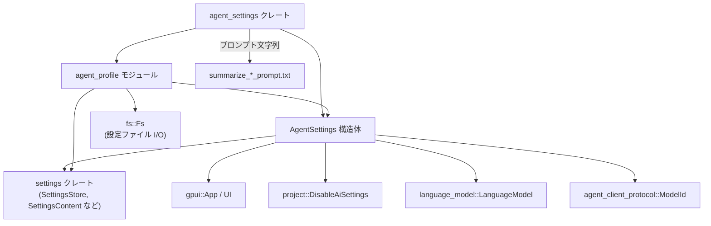
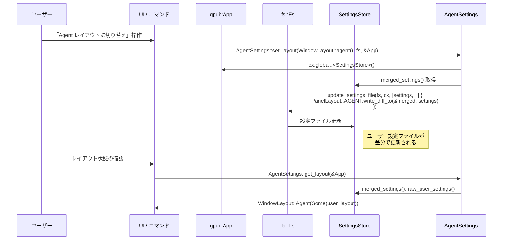

# crates/agent_settings ディレクトリ

## 1. ざっくり一言

Zed の「エージェント（AI アシスタント）」機能の設定を扱うクレートです。  
ウィンドウレイアウト、使用するモデルやプロファイル、ツール権限、危険なターミナルコマンドのブロックなどを一括して管理します。

---

## 2. このモジュールの役割

### 2.1 概要

- このクレートは、エージェント機能に関する **ユーザー設定を読み書きし、アプリ全体で利用可能にする** ために存在しています。
- 具体的には次のような情報を扱います。
  - エージェントパネルの表示・位置・サイズ・レイアウトプリセット
  - デフォルトの言語モデル / プロファイル / お気に入りモデル
  - プロファイルごとのツール有効化・コンテキストサーバー設定
  - ツールごとの正規表現ベースの許可・拒否ルール
  - `rm -rf /` などの危険なコマンドを強制的にブロックするハードコード済み制限

### 2.2 アーキテクチャ内での位置づけ

`agent_settings` クレートと、関連モジュール・外部クレートとの関係を簡略化して示します。



- `AgentSettings` は `Settings` / `RegisterSetting` トレイトを通じて `SettingsStore` と連携し、設定の読み書きを行います。
- `agent_profile` モジュールは、プロファイル単位の設定（ツール ON/OFF やモデル選択）を `AgentSettings` の `profiles` フィールドとして管理します。
- `check_hardcoded_security_rules` および `ToolPermissions` は、他のクレート（ツール実行ロジック側）から呼ばれ、ツール呼び出し可否の判断材料になります。

### 2.3 設計上のポイント

コードから読み取れる特徴を列挙します。

- **設定の集中管理**
  - `AgentSettings` がエージェント関連の設定を一括で保持し、`RegisterSetting` 派生により `get_global` / `register` などでグローバルにアクセス可能な前提になっています。
- **UI レイアウトのプリセット管理**
  - `PanelLayout` と `WindowLayout` により、「エージェント向けレイアウト」と「エディタ向けレイアウト」の 2 プリセット + カスタムレイアウトを判別・書き戻しします。
- **プロファイル単位の動作切り替え**
  - `AgentProfileSettings` によって、プロファイルごとに利用ツール、コンテキストサーバー、デフォルトモデルを切り替えられる構造になっています。
- **ツール権限の正規表現ベース設定**
  - `ToolPermissions` / `ToolRules` により、ツールごとに `always_allow` / `always_deny` / `always_confirm` の 3 種類の正規表現ルールを保持します。
  - 無効な正規表現は `InvalidRegexPattern` として記録され、ログ出力されます（ツール実行側でブロックすることが意図されています）。
- **ハードコードされた安全装置**
  - `HARDCODED_SECURITY_RULES` と `check_hardcoded_security_rules` により、`rm -rf /` のような致命的なコマンドは設定に関係なく必ず拒否される設計になっています。
- **プラットフォーム非依存なパス正規化**
  - `normalize_path` により、`..` や `.` を解決した簡易的な正規化を行い、セキュリティチェックに使える形に変換します。

---

## 3. 主要な機能一覧

このディレクトリが提供する主な機能は次の通りです。

- エージェント設定の読み込み・登録（`AgentSettings` + `Settings` トレイト実装）
- エージェント UI のレイアウト切り替え（`PanelLayout`, `WindowLayout`, `get_layout`, `set_layout`）
- エージェントプロファイルの管理・新規作成（`AgentProfile`, `AgentProfileSettings`）
- プロファイルごとのツール有効化・コンテキストサーバー設定（`AgentProfileSettings`）
- ツール権限設定のコンパイル（`ToolPermissions`, `ToolRules`, `compile_tool_permissions`）
- 危険なターミナルコマンドのハードコード制御（`HARDCODED_SECURITY_RULES`, `check_hardcoded_security_rules`）
- パス文字列の正規化（`normalize_path`）
- スレッド要約用プロンプト文字列の提供（`SUMMARIZE_THREAD_PROMPT`, `SUMMARIZE_THREAD_DETAILED_PROMPT`）

---

## 4. 関数・構造体の解説

### 4.1 主要な型一覧

代表的な公開／重要な型の一覧です。

| 名前 | 種別 | 役割 / 用途 |
|------|------|-------------|
| `AgentSettings` | 構造体 | エージェント全体の設定値を保持し、`Settings`/`RegisterSetting` を実装 |
| `PanelLayout` | 構造体 | エージェント・各種パネル（プロジェクト、アウトラインなど）のドック位置やボタン表示を表現 |
| `WindowLayout` | enum | ウィンドウレイアウトを `Editor` / `Agent` / `Custom` に分類し、任意の `PanelLayout` を付随 |
| `AgentProfileId` | 構造体 | プロファイルの ID（`Arc<str>` の薄いラッパー） |
| `AgentProfile` | 構造体 | プロファイル ID のラッパー。作成・列挙などの操作メソッドを提供 |
| `AgentProfileSettings` | 構造体 | プロファイルごとの名前、ツール有効化状態、コンテキストサーバー設定、デフォルトモデルなど |
| `ContextServerPreset` | 構造体 | コンテキストサーバーごとのツール ON/OFF 設定 |
| `ToolPermissions` | 構造体 | ツール権限の全体設定（グローバルデフォルト + 各ツールのルール） |
| `ToolRules` | 構造体 | 1 つのツールに対する許可／拒否／確認ルールと、そのデフォルトモード |
| `InvalidRegexPattern` | 構造体 | コンパイルに失敗した正規表現パターンの情報（パターン文字列・ルール種別・エラー文） |
| `CompiledRegex` | 構造体 | コンパイル済み正規表現 + 大文字小文字区別フラグ |
| `HardcodedSecurityRules` | 構造体 | オーバーライド不可能なセキュリティルール（現在はターミナル向け `rm` 関連のみ） |
| `AvailableProfiles` | 型エイリアス | `IndexMap<AgentProfileId, SharedString>`。利用可能なプロファイル一覧 |
| `builtin_profiles` | モジュール | `"write"`, `"ask"`, `"minimal"` のようなビルトインプロファイル ID の定数と判定関数 |

### 4.2 重要な関数・メソッドの詳細（最大 7 件）

#### `AgentProfile::create(name: String, base_profile_id: Option<AgentProfileId>, fs: Arc<dyn Fs>, cx: &App) -> AgentProfileId`

**概要**

- 新しいエージェントプロファイルをユーザー設定に保存し、その `AgentProfileId` を返します。
- 既存プロファイル（`base_profile_id`）を指定すると、ツール・コンテキストサーバー・モデル設定を引き継ぎます。

**引数**

| 引数名 | 型 | 説明 |
|--------|----|------|
| `name` | `String` | プロファイルの表示名。ID 生成にも使用される |
| `base_profile_id` | `Option<AgentProfileId>` | クローン元となるプロファイル ID。`None` の場合は空の設定から作成 |
| `fs` | `Arc<dyn Fs>` | 設定ファイルを書き戻すためのファイルシステム実装 |
| `cx` | `&App` | `gpui` のアプリケーションコンテキスト。`AgentSettings::get_global` や設定へのアクセスに使用 |

**戻り値**

- 新しく生成された `AgentProfileId`。`name` をケバブケース（`convert_case` クレート）に変換した文字列を元にしています。

**内部処理の流れ**

1. `name.to_case(Case::Kebab)` で、名前からケバブケースの ID 文字列を作成し、`AgentProfileId` を生成します。
2. `base_profile_id` が指定されている場合は、`AgentSettings::get_global(cx).profiles` から該当プロファイルを探してクローンします（見つからない場合はベースなしと同じ扱い）。
3. ベースプロファイルがあれば `tools`, `enable_all_context_servers`, `context_servers`, `default_model` をコピーし、なければデフォルト値（空マップ・`false`・`None`）を使用して `AgentProfileSettings` を構築します。
4. `update_settings_file(fs, cx, closure)` を呼び出し、クロージャ内で `AgentProfileSettings::save_to_settings` を実行して設定ファイルに書き込みます。`log_err()` によって、エラーはログに出しつつ握りつぶされます。
5. 生成した `AgentProfileId` を返します。

**Examples（使用例）**

```rust
use std::sync::Arc;
use fs::Fs;
use gpui::App;
use agent_settings::{AgentProfile, AgentProfileId};

// 新しいプロファイルを、既存プロファイル "write" をベースに作成する例
fn create_custom_profile(fs: Arc<dyn Fs>, cx: &App) -> AgentProfileId {
    // ベースにする既存プロファイル ID（存在しなければ None と同じ挙動）
    let base = Some(AgentProfileId::default()); // デフォルトは "write"

    // "My Writing Profile" という表示名のプロファイルを作成する
    let profile_id = AgentProfile::create("My Writing Profile".to_string(), base, fs, cx);

    // ここで profile_id は "my-writing-profile" のようなケバブケース ID を保持している
    profile_id
}
```

**Errors / Panics**

- 内部で `AgentProfileSettings::save_to_settings` が `Result` を返しますが、`log_err()` により呼び出し元にはエラーを返しません。
  - `save_to_settings` 内では、同じ ID のプロファイルが既に存在する場合に `bail!` して `Err` を返します。
  - その場合、エラーはログに記録されますが、`create` 自体は成功したかのように ID を返します。
- 明示的な `panic!` 呼び出しはありません。

**Edge cases（エッジケース）**

- `base_profile_id` が `Some` でも、`AgentSettings::get_global(cx).profiles` に存在しない場合はベースなしと同じ挙動になります。
- `name` が既存プロファイルと同じ ID（ケバブケース変換後）になると、設定ファイルへの保存は失敗（ログのみ）し、呼び出し側はそれを検出できません。

**使用上の注意点**

- ID 重複を避けたい場合、`AgentProfile::available_profiles` などで事前に ID の存在チェックを行う必要があります。
- 設定ファイルへの保存に失敗しても ID は返ってくるため、「ID が返ってきた＝必ず保存された」とは限らないことに注意が必要です。

---

#### `AgentSettings::enabled(&self, cx: &App) -> bool`

**概要**

- エージェント機能が有効かどうかを判定します。
- ローカルな設定 (`self.enabled`) と、プロジェクト側の AI 無効設定 (`DisableAiSettings`) の両方を考慮します。

**引数**

| 引数名 | 型 | 説明 |
|--------|----|------|
| `self` | `&AgentSettings` | 現在のエージェント設定 |
| `cx` | `&App` | `gpui` アプリケーションコンテキスト |

**戻り値**

- `bool`：エージェントが **利用可能** なら `true`、どちらかで無効化されていれば `false`。

**内部処理の流れ**

1. `self.enabled`（ユーザー設定上のフラグ）を参照します。
2. `DisableAiSettings::get_global(cx).disable_ai` で、プロジェクト全体として AI が禁止されていないかを確認します。
3. `self.enabled && !disable_ai` を返します。

**Examples（使用例）**

```rust
use gpui::App;
use agent_settings::AgentSettings;

// エージェントが有効なときだけ UI にボタンを出す例
fn is_agent_button_visible(cx: &App) -> bool {
    let settings = AgentSettings::get_global(cx); // RegisterSetting 由来のメソッド
    settings.enabled(cx)
}
```

**Edge cases**

- ユーザー設定で `enabled = true` でも、プロジェクト設定 `disable_ai = true` の場合は `false` になります。
- 逆に、`disable_ai = false` でもユーザーが明示的に `enabled = false` にしている場合も `false` です。

**使用上の注意点**

- UI 側では、エージェント機能の可視性・ショートカットの有効/無効判定にこのメソッドを使うと、プロジェクト側の「AI 禁止」も自動的に尊重されます。

---

#### `AgentSettings::get_layout(cx: &App) -> WindowLayout`

**概要**

- 現在のウィンドウレイアウトを `WindowLayout` として返します。
- 実際の設定値（マージ済み）とユーザーが明示的に書いた値を比較し、
  - それが `PanelLayout::AGENT` と同じなら `WindowLayout::Agent(Some(user_layout))`
  - `PanelLayout::EDITOR` と同じなら `WindowLayout::Editor(Some(user_layout))`
  - どちらでもなければ `WindowLayout::Custom(user_layout)`
  として返します。

**引数**

| 引数名 | 型 | 説明 |
|--------|----|------|
| `cx` | `&App` | `gpui` アプリケーションコンテキスト |

**戻り値**

- `WindowLayout`：現在のレイアウト種別と、ユーザーが明示的に設定した `PanelLayout`（オプション）を含みます。

**内部処理の流れ**

1. `cx.global::<SettingsStore>()` で `SettingsStore` を取得します。
2. `store.merged_settings()` で、デフォルト設定とユーザー設定をマージした `SettingsContent` を取得します。
3. `store.raw_user_settings()` からユーザー設定だけを取り出し、`PanelLayout::read_from` で `user_layout` を生成します（なければ `PanelLayout::default()`）。
4. 同様に、マージ済み設定から `merged_layout` を `PanelLayout::read_from` で生成します。
5. `merged_layout` が `PanelLayout::AGENT` と等しい場合は `WindowLayout::Agent(Some(user_layout))` を返します。
6. `merged_layout` が `PanelLayout::EDITOR` と等しい場合は `WindowLayout::Editor(Some(user_layout))` を返します。
7. それ以外の場合は `WindowLayout::Custom(user_layout)` を返します。

**Examples（使用例）**

```rust
use gpui::App;
use agent_settings::{AgentSettings, WindowLayout};

// 現在のレイアウト種別に応じて UI を切り替える例
fn describe_layout(cx: &App) -> &'static str {
    match AgentSettings::get_layout(cx) {
        WindowLayout::Agent(_) => "Agent レイアウト",
        WindowLayout::Editor(_) => "Editor レイアウト",
        WindowLayout::Custom(_) => "カスタムレイアウト",
    }
}
```

**Edge cases**

- ユーザーが一切レイアウトを変更していない場合：
  - `user_layout` は `PanelLayout::default()`（すべて `None`）ですが、
  - デフォルト設定次第で `Agent` または `Editor` プリセットと判定されます。
- ユーザーがプリセットと微妙に異なる組み合わせ（例: 一部だけ変更）にした場合は `Custom` と判定されます。

**使用上の注意点**

- `WindowLayout::Agent(Some(user_layout))` の `user_layout` は、「ユーザーが書いた値のみ」を表すことに注意が必要です。
  - プリセット由来の値は含まれず、未指定のフィールドは `None` のままになります。

---

#### `AgentSettings::set_layout(layout: WindowLayout, fs: Arc<dyn Fs>, cx: &App)`

**概要**

- ウィンドウレイアウトを指定された `WindowLayout` に変更し、ユーザー設定ファイルに書き戻します。
- プリセットレイアウト（`Agent(None)` / `Editor(None)`）の場合は、現在のマージ済みレイアウトとの差分だけを書き込むことで、不要な上書きを抑えます。

**引数**

| 引数名 | 型 | 説明 |
|--------|----|------|
| `layout` | `WindowLayout` | 新しく適用したいレイアウト（プリセット or カスタム） |
| `fs` | `Arc<dyn Fs>` | 設定ファイルを書き込むファイルシステム実装 |
| `cx` | `&App` | `gpui` アプリケーションコンテキスト |

**戻り値**

- なし（`()`）

**内部処理の流れ**

1. 現在のマージ済みレイアウトを `merged = PanelLayout::read_from(cx.global::<SettingsStore>().merged_settings())` で取得します。
2. `layout` のバリアントに応じて分岐します。
   - `WindowLayout::Agent(None)` の場合：
     - `update_settings_file(fs, cx, |settings, _| PanelLayout::AGENT.write_diff_to(&merged, settings))` を呼び出し、
       変更が必要なフィールドだけをユーザー設定に書き込みます。
   - `WindowLayout::Editor(None)` の場合：
     - 同様に `PanelLayout::EDITOR.write_diff_to(&merged, settings)` を使います。
   - `WindowLayout::Agent(Some(saved))` / `Editor(Some(saved))` / `Custom(saved)` の場合：
     - `saved.write_to(settings)` を呼び出し、`saved` の内容をそのままユーザー設定に書き込みます。
3. これにより、次回 `get_layout` を呼び出した際には新しいレイアウトとして認識されます。

**Examples（使用例）**

```rust
use std::sync::Arc;
use fs::Fs;
use gpui::App;
use agent_settings::{AgentSettings, WindowLayout};

// ボタン押下時に Agent レイアウトに切り替える例
fn switch_to_agent_layout(fs: Arc<dyn Fs>, cx: &App) {
    // プリセット Agent レイアウトを差分書き込みで適用
    AgentSettings::set_layout(WindowLayout::agent(), fs, cx);
}
```

**Edge cases**

- すでに `Agent` プリセットと同じレイアウトになっている場合でも、`write_diff_to` により不要なフィールドの書き込みは行われません。
- `WindowLayout::Agent(Some(saved))` のように `Some` を渡すと、その `saved` 内容がそのまま書き込まれ、プリセットとの一致・不一致に関わらずユーザー設定が上書きされます。

**使用上の注意点**

- 設定ファイル書き込みは非同期ではなく、`update_settings_file` 内で行われるため、頻繁に呼び出すと I/O 負荷が増える可能性があります。
- 差分適用の挙動（プリセット + diff）を利用したい場合は `Agent(None)` / `Editor(None)` を渡し、完全に決め打ちのレイアウトを保存したい場合は `Custom(saved)` を使うと構造を理解しやすくなります。

---

#### `compile_tool_permissions(content: Option<settings::ToolPermissionsContent>) -> ToolPermissions`

**概要**

- 設定ファイルから読み込んだ `ToolPermissionsContent` を、利用しやすい内部形式 `ToolPermissions` に変換します。
- 各ツールの正規表現ルールをコンパイルし、無効なパターンは `InvalidRegexPattern` として収集・ログ出力します。

**引数**

| 引数名 | 型 | 説明 |
|--------|----|------|
| `content` | `Option<settings::ToolPermissionsContent>` | 設定ファイルからのツール権限設定。`None` の場合はデフォルトを返す |

**戻り値**

- `ToolPermissions`：グローバルデフォルトモードと、ツールごとの `ToolRules` を含む構造体。

**内部処理の流れ**

1. `content` が `None` の場合：
   - `ToolPermissions::default()` を返します。
   - テストより、`default` フィールドは `ToolPermissionMode::Confirm` で、`tools` は空です。
2. `content` が `Some` の場合：
   - 各ツールについて、`rules_content` を取り出します。
   - `compile_regex_rules` を、
     - `always_allow`
     - `always_deny`
     - `always_confirm`
     の 3 種類に対して呼び出し、コンパイル済み正規表現とエラー一覧を得ます。
   - すべてのエラー（`InvalidRegexPattern`）を `invalid_patterns` にまとめ、`log::error!` でログ出力します。
   - `ToolRules` を組み立てます。
     - `default` はツール単位のデフォルト（`Option<ToolPermissionMode>`）としてそのまま保存します。
   - ツール名をキーに `HashMap` に格納します。
   - `ToolPermissions::default` フィールドには `content.default.unwrap_or_default()` を設定します。

**Examples（使用例）**

この関数自体はクレート内部で使用されており、外部から直接呼び出すケースは主にテストや拡張時を想定します。

```rust
use serde_json::json;
use agent_settings::AgentSettings;
use settings::ToolPermissionsContent;

// JSON から ToolPermissions を構築する簡単な例（テスト相当）
fn build_permissions_from_json() {
    let json = json!({
        "default": "confirm",
        "tools": {
            "terminal": {
                "default": "allow",
                "always_deny": [
                    { "pattern": "rm\\s+-rf" }
                ]
            }
        }
    });

    let content: ToolPermissionsContent = serde_json::from_value(json).unwrap();
    let permissions = agent_settings::compile_tool_permissions(Some(content));

    assert_eq!(permissions.default, settings::ToolPermissionMode::Confirm);
    let terminal_rules = permissions.tools.get("terminal").unwrap();
    assert_eq!(terminal_rules.always_deny.len(), 1);
}
```

※ 上記のような直接呼び出しは、このクレート内（またはテスト）でのみ可能です。

**Edge cases**

- 正規表現パターンが空文字列の場合：
  - `compile_regex_rules` 内で「empty regex patterns are not allowed」として `InvalidRegexPattern` に追加され、コンパイルはスキップされます。
- 正規表現がパースエラーになる場合：
  - `regex::Error` が `InvalidRegexPattern` に格納され、`invalid_patterns` に追加されます。
- 無効なパターンがあっても `compile_tool_permissions` 自体はエラーを返さず、正常に `ToolPermissions` を返します。

**使用上の注意点**

- コメントに「`invalid_patterns` が非空ならツール呼び出しをブロックすべき」と明記されていますが、そのブロックロジックはこのクレートには含まれていません。
  - 呼び出し側は `ToolPermissions::has_invalid_patterns()` や `invalid_patterns()` を利用して制御する必要があります。
- テストコードのメッセージから、評価時は `always_deny` > `always_confirm` > `always_allow` の優先順位を想定していることが読み取れますが、実際の判定ロジックは別クレート側にあります。

---

#### `check_hardcoded_security_rules(tool_name: &str, terminal_tool_name: &str, input: &str, extracted_commands: Option<&[String]>) -> Option<String>`

**概要**

- ハードコードされたセキュリティルールにより、危険なターミナルコマンドを検出し、ブロック理由のメッセージを返します。
- ルールは設定では変更できず、常に有効です。

**引数**

| 引数名 | 型 | 説明 |
|--------|----|------|
| `tool_name` | `&str` | 実行しようとしているツール名 |
| `terminal_tool_name` | `&str` | ターミナルツールの識別名（例: `"terminal"`） |
| `input` | `&str` | 生のコマンド文字列 |
| `extracted_commands` | `Option<&[String]>` | シェルパーサーなどで分割したサブコマンド列（`;` や `&&` で繋がれた各コマンド） |

**戻り値**

- `Some(String)`：ブロックすべき場合。内容は `HARDCODED_SECURITY_DENIAL_MESSAGE` をコピーしたメッセージ。
- `None`：ハードコードルールに一致しない場合。

**内部処理の流れ**

1. `tool_name != terminal_tool_name` の場合はターミナルツールではないとみなし、即座に `None` を返します。
2. `HARDCODED_SECURITY_RULES.terminal_deny` のリストを取り出します。
3. まず `input` に対して `matches_hardcoded_patterns(input, patterns)` を呼び出します。
   - パターンに直接一致するか
   - `expand_rm_to_single_path_commands` で展開した各コマンドに一致するか
   をチェックします。
4. 一致した場合は `Some(HARDCODED_SECURITY_DENIAL_MESSAGE.into())` を返します。
5. 一致しない場合、`extracted_commands` が `Some(commands)` なら、各 `command` について同様に `matches_hardcoded_patterns` をチェックします。
6. ここでも一致すれば `Some(...)` を返し、すべて一致しなければ `None` を返します。

**Edge cases**

- `input` が複数コマンドのチェーン（例: `echo hi && rm -rf /`）で、呼び出し側が `extracted_commands` を提供している場合：
  - 分割後の `rm -rf /` に対してもチェックが行われます。
- `rm` コマンドに複数のパスが指定されている場合（例: `rm -rf / tmp`）：
  - `expand_rm_to_single_path_commands` により一つずつ展開され、危険なパスだけを検出できるようになっています。

**使用上の注意点**

- 戻り値が `Some(message)` の場合、そのツール呼び出しは「設定に関係なく拒否すべき」という意図のメッセージです。
- `tool_name` と `terminal_tool_name` が一致しない限りルールは適用されないため、ターミナルツールに対しては一貫して同じ名前を渡す必要があります。

---

#### `normalize_path(raw: &str) -> String`

**概要**

- パス文字列の `"."` や `".."` を解決し、簡易的に正規化したパスを返します。
- セキュリティチェック（特に `rm` コマンドの危険なパス判定）のために使われます。

**引数**

| 引数名 | 型 | 説明 |
|--------|----|------|
| `raw` | `&str` | 入力パス文字列（例: `"./../foo/bar/"`） |

**戻り値**

- 正規化後のパス文字列。
  - 絶対パスの場合は先頭に `/` を付与した Unix 風のパスになります（Windows ドライブレターは無視）。

**内部処理の流れ**

1. `Path::new(raw).has_root()` を使って、絶対パスかどうかを判定し `is_absolute` とします。
2. `Path::new(raw).components()` をイテレートし、次のように処理します。
   - `Component::CurDir`（`.`）：無視します。
   - `Component::ParentDir`（`..`）：
     - 直前が `".."` の場合はもう一つ `".."` を積み増します（相対パスで `../../..` のようなケース）。
     - それ以外で `components` が非空なら最後の要素をポップします（ディレクトリ一つ上を指すため）。
     - 空で、かつ相対パスの場合は `".."` を追加します。
   - `Component::Normal(segment)`：UTF-8 に変換可能ならそのまま追加します。
   - `Component::RootDir` / `Component::Prefix(_)`：ここでは無視します（`is_absolute` によってルート扱いのみ保持）。
3. 収集したセグメントを `'/'` で結合して `joined` とします。
4. `is_absolute` が `true` なら `format!("/{joined}")` を返し、`false` なら `joined` をそのまま返します。

**Examples（使用例）**

```rust
use agent_settings::normalize_path;

fn examples() {
    assert_eq!(normalize_path("./foo/./bar/.."), "foo");
    assert_eq!(normalize_path("/usr/bin/../bin/"), "/usr/bin");
    // Windows 風パスも Unix 風に正規化される（ドライブレターは捨てられる）
    // 例: "C:\\Users\\user\\..\\" -> "/Users"
}
```

**Edge cases**

- `raw` が `"."` や `"././"` のような場合：
  - 相対パスかつ `.` のみで構成されると、結果は空文字列になります。
  - `expand_rm_to_single_path_commands` では、この結果が空かつ非絶対パスの場合 `"."` に置き換える処理が追加されています。
- Windows のドライブレター付きパス（`"C:\foo\bar"` など）：
  - `Component::Prefix(_)` として検出されますが、`normalize_path` 内では無視されます。
  - `has_root()` が `true` であれば、結果は `"/foo/bar"` のように Unix 風の絶対パスとして返されます。

**使用上の注意点**

- 実際のファイルシステムの存在やシンボリックリンクは考慮していません。純粋に文字列レベルの正規化です。
- 空文字列結果をどう扱うかは呼び出し側次第です（`expand_rm_to_single_path_commands` のように補正する必要がある場合があります）。

---

### 4.3 その他の主な関数・メソッド

詳細は省略しますが、理解に役立つ補助的な関数をまとめます。

| 関数 / メソッド名 | 役割（1 行） |
|-------------------|--------------|
| `PanelLayout::read_from(content: &SettingsContent) -> Self` | 複数パネルのドック位置・ボタン状態を `SettingsContent` から読み取る |
| `PanelLayout::write_to(&self, settings: &mut SettingsContent)` | 全フィールドを設定に書き戻す |
| `PanelLayout::write_diff_to(&self, current_merged: &PanelLayout, settings: &mut SettingsContent)` | 現在のマージ済みレイアウトとの違いがあるフィールドだけを書き込む |
| `PanelLayout::backfill_to(&self, user_layout: &PanelLayout, settings: &mut SettingsContent)` | ユーザー未指定のフィールドにだけプリセット値を埋める |
| `WindowLayout::agent()` / `WindowLayout::editor()` | `WindowLayout::Agent(None)` / `Editor(None)` を返すコンストラクタ |
| `ToolPermissions::invalid_patterns(&self) -> Vec<&InvalidRegexPattern>` | すべてのツールの無効な正規表現パターンを収集して返す |
| `ToolPermissions::has_invalid_patterns(&self) -> bool` | いずれかのツールに無効パターンがあるかを判定 |
| `CompiledRegex::new(pattern: &str, case_sensitive: bool) -> Option<Self>` | 正規表現をコンパイルし、失敗時は `None` を返す簡易コンストラクタ |
| `CompiledRegex::try_new(pattern: &str, case_sensitive: bool) -> Result<Self, regex::Error>` | コンパイルに失敗した理由を返す詳細コンストラクタ |
| `CompiledRegex::is_match(&self, input: &str) -> bool` | `Regex::is_match` をラップしたメソッド |
| `AgentProfileSettings::is_tool_enabled(&self, tool_name: &str) -> bool` | プロファイル内で特定ツールが有効かどうかを判定 |
| `AgentProfileSettings::is_context_server_tool_enabled(&self, server_id: &str, tool_name: &str) -> bool` | コンテキストサーバーに紐づくツールが有効かどうかを判定 |
| `AgentProfileSettings::save_to_settings(&self, profile_id, content)` | `SettingsContent` に新しいプロファイルを保存（重複 ID がある場合は `Err`） |
| `AgentProfile::available_profiles(cx: &App) -> AvailableProfiles` | 現在定義されているプロファイル ID と名前のマップを返す |
| `matches_hardcoded_patterns(command, patterns)` | コマンド文字列がハードコード済みパターンに一致するか判定（`rm` の展開も含む） |
| `expand_rm_to_single_path_commands(command)` | `rm` コマンドに含まれる複数パスを、1 パスずつの `rm` コマンド列に展開する |

---

## 5. データフロー

ここでは、代表的なシナリオとして **ウィンドウレイアウトを Agent プリセットに切り替える流れ** を示します。

- ユーザーが UI で「Agent レイアウトに切り替え」を選択すると、アプリケーションは `AgentSettings::set_layout(WindowLayout::agent(), ...)` を呼びます。
- この呼び出しは `PanelLayout::AGENT` と現在のレイアウトの差分をユーザー設定ファイルに書き込みます。
- その後 `AgentSettings::get_layout` が、マージ済み設定をもとに現在のレイアウト種別を判定します。



このように、レイアウトの切り替えは

1. `PanelLayout` プリセット →  
2. `update_settings_file` によるユーザー設定差分書き込み →  
3. `merged_settings` を通じた状態の再解釈  

という 3 段階で行われています。

---

## 6. 使い方（How to Use）

### 6.1 基本的な使用方法

ここでは、このクレートを用いて **エージェント設定を登録・取得し、レイアウトを切り替える** 基本的な流れを示します。  
実際には Zed 本体の初期化コードに組み込まれる想定の処理です。

```rust
use std::sync::Arc;                            // Arc を使って Fs を共有するためにインポート
use fs::Fs;                                    // 設定ファイル I/O 用のトレイト
use gpui::App;                                 // アプリケーションコンテキスト
use settings::SettingsStore;                   // 全体設定を保持するストア
use project::DisableAiSettings;                // プロジェクト単位の AI 無効設定
use agent_settings::{AgentSettings, WindowLayout};

fn init_settings(cx: &mut App, fs: Arc<dyn Fs>) {
    // SettingsStore をグローバルとして登録（テストでは SettingsStore::test を利用）
    let store = SettingsStore::new(cx);        // 実コードでは適切なコンストラクタが使われる
    cx.set_global(store);                      // App にグローバルとして登録

    // プロジェクト側の AI 無効設定を登録
    DisableAiSettings::register(cx);

    // エージェント設定を登録（RegisterSetting 派生で提供される想定）
    AgentSettings::register(cx);

    // グローバル設定を取得
    let agent = AgentSettings::get_global(cx);

    // エージェントが有効かどうかを確認
    if agent.enabled(cx) {
        // 現在のレイアウト種別を取得
        let layout = AgentSettings::get_layout(cx);
        // レイアウトに応じて UI を構築する処理が続く
        match layout {
            WindowLayout::Agent(_) => { /* Agent 用レイアウト */ }
            WindowLayout::Editor(_) => { /* Editor 用レイアウト */ }
            WindowLayout::Custom(_) => { /* カスタムレイアウト */ }
        }
    }

    // レイアウトを Agent プリセットに変更して保存
    AgentSettings::set_layout(WindowLayout::agent(), fs, cx);
}
```

※ `SettingsStore::new` など一部の詳細コンストラクタはこのチャンクには登場しませんが、テストでは `SettingsStore::test(cx)` が使用されているため、実環境でも同様にグローバル登録する前提になっています。

### 6.2 よくある使用パターン

#### パターン 1: プロファイルの一覧取得と新規作成

```rust
use std::sync::Arc;
use fs::Fs;
use gpui::App;
use agent_settings::{AgentProfile, AgentProfileId};

fn list_and_create_profile(fs: Arc<dyn Fs>, cx: &App) {
    // 既存プロファイルの一覧を取得（ID → 名前）
    let profiles = AgentProfile::available_profiles(cx);
    for (id, name) in &profiles {
        println!("profile: {} ({})", id, name);
    }

    // デフォルトプロファイル "write" をベースに新しいプロファイルを作成
    let base = Some(AgentProfileId::default());
    let new_id = AgentProfile::create("My Profile".to_string(), base, fs, cx);

    println!("created profile id = {}", new_id);
}
```

- 既存プロファイルを `AgentSettings::profiles` から列挙できます。
- `AgentProfile::create` により、ユーザーが UI から作ったのと同様に設定ファイルにプロファイルを追加できます。

#### パターン 2: ツール権限設定の利用

```rust
use gpui::App;
use agent_settings::AgentSettings;

fn check_tool_permissions(cx: &App, tool_name: &str) {
    let agent = AgentSettings::get_global(cx);

    // 全体の ToolPermissions 構造体
    let perms = &agent.tool_permissions;

    // ツール個別のルールを取得
    if let Some(rules) = perms.tools.get(tool_name) {
        if !rules.invalid_patterns.is_empty() {
            eprintln!(
                "tool '{}' has invalid regex patterns; tool should probably be blocked",
                tool_name
            );
        }
        // 実際の判定ロジック（deny > confirm > allow）は別途実装される前提
    } else {
        // ツール個別の設定がない場合は perms.default を使う想定
        let global_default = perms.default;
        println!("tool '{}' uses global default = {:?}", tool_name, global_default);
    }
}
```

- `ToolPermissions` 自体には「このコマンドを許可するか」の評価メソッドはなく、あくまでデータ構造と正規表現コンパイルを担当します。
- 評価ロジックは別クレートで `CompiledRegex` / `ToolRules` を使って実装される前提になっています。

#### パターン 3: ターミナルコマンドのハードコードセキュリティチェック

```rust
use agent_settings::check_hardcoded_security_rules;

fn validate_terminal_command(input: &str) -> Result<(), String> {
    // ツール名は呼び出し側の設計によるが、ここでは "terminal" と仮定
    let tool_name = "terminal";
    let terminal_tool_name = "terminal";

    // ここでは簡略化のため extracted_commands は None とする
    if let Some(reason) =
        check_hardcoded_security_rules(tool_name, terminal_tool_name, input, None)
    {
        // reason には HARDCODED_SECURITY_DENIAL_MESSAGE が入っている
        Err(reason)
    } else {
        Ok(())
    }
}
```

- ここで `Err` を返した場合、呼び出し側はコマンドを実行せず、メッセージをユーザーに表示することが想定されます。

### 6.3 使用上の注意点（まとめ）

- **設定スキーマとの整合性**
  - `impl Settings for AgentSettings` の `from_settings` 実装では、多くのフィールドで `.unwrap()` を使っています。
  - デフォルト設定 JSON（`assets/settings/default.json`）や `settings` クレート側の構造と不整合があると `panic` の原因になります。
- **プロファイル ID の重複**
  - `AgentProfileSettings::save_to_settings` は、既に同じ ID のプロファイルが存在する場合 `Err` を返します。
  - `AgentProfile::create` はこのエラーをログに出すだけで呼び出し元に返さないため、必要であれば事前に存在確認を行う必要があります。
- **無効な正規表現パターン**
  - `compile_tool_permissions` は無効な正規表現を `InvalidRegexPattern` に溜め、ログ出力しますが、エラーとしては返しません。
  - コメントにある通り、「`invalid_patterns` が非空のツールは呼び出しをブロックする」という扱いを評価側で実装する必要があります。
- **ハードコードセキュリティルールの優先度**
  - `check_hardcoded_security_rules` によるブロックは、ユーザー設定による `ToolPermissions` よりも優先され、オーバーライドできない前提です。
- **パス正規化の性質**
  - `normalize_path` は OS 依存の `std::path::Path` を利用しますが、出力は Unix 風（`/` 区切り）のパスになります。
  - Windows でドライブレターは無視されるなど、あくまでセキュリティチェック用の簡易正規化であり、UI やログに直接出すパスとしては期待と異なる場合があります。

---

## 7. 関連ファイル

このディレクトリ内および密接に関連するファイルの一覧です。

| パス | 役割 / 関係 |
|------|------------|
| `agent_settings/Cargo.toml` | クレート定義。ライブラリのエントリポイントを `src/agent_settings.rs` に設定し、依存クレート（`gpui`, `settings`, `language_model` など）を定義 |
| `agent_settings/src/agent_settings.rs` | クレートルート。`AgentSettings`, `PanelLayout`, `WindowLayout`, ツール権限・ハードコードセキュリティ・パス正規化などの主要ロジックを定義 |
| `agent_settings/src/agent_profile.rs` | エージェントプロファイル関連の型・ロジック（`AgentProfile`, `AgentProfileSettings`, `builtin_profiles`）を定義 |
| `agent_settings/src/prompts/summarize_thread_prompt.txt` | スレッドタイトル（3–7 語の簡潔なタイトル）を生成するためのプロンプト文字列。`SUMMARIZE_THREAD_PROMPT` として組み込み |
| `agent_settings/src/prompts/summarize_thread_detailed_prompt.txt` | スレッドの詳細サマリ（概要・重要事項・結論・アクションアイテム）を Markdown 形式で生成するためのプロンプト文字列。`SUMMARIZE_THREAD_DETAILED_PROMPT` として組み込み |
| `assets/settings/default.json` | テスト (`test_default_json_tool_permissions_parse`) で読み込まれるデフォルト設定ファイル。このチャンク外にあり、AgentSettings の初期値の前提となる |

このレポートは、`agent_settings` クレートのコードから読み取れる範囲でまとめたものです。  
他クレート（`settings`, `gpui`, `project` など）の詳細実装はこのチャンクには含まれていないため、それらの挙動については必要に応じて該当クレート側のドキュメントやコードを参照する必要があります。
