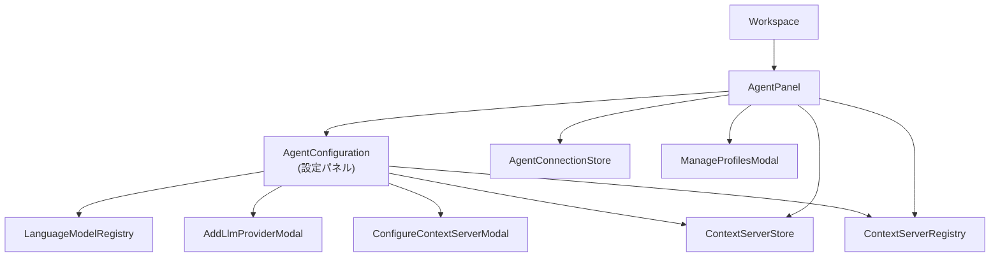
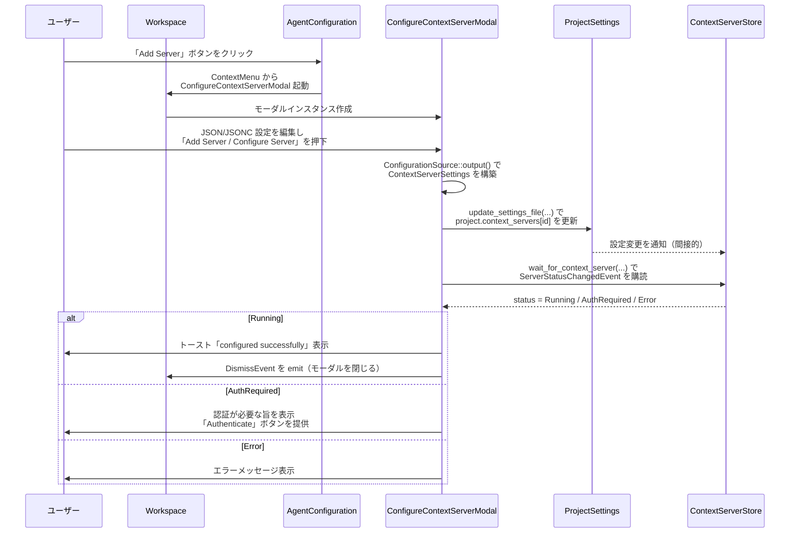
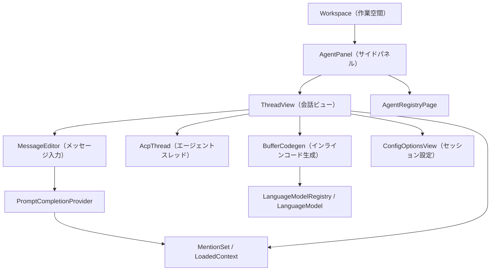
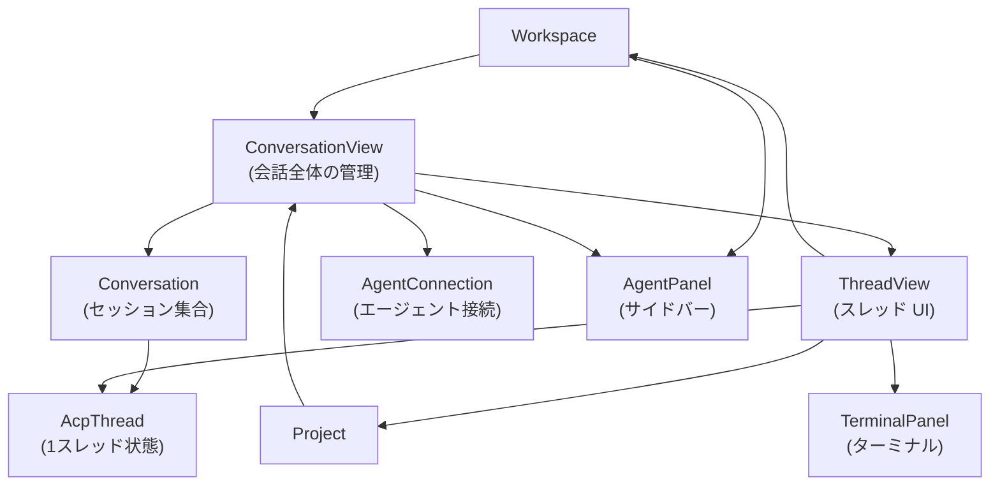
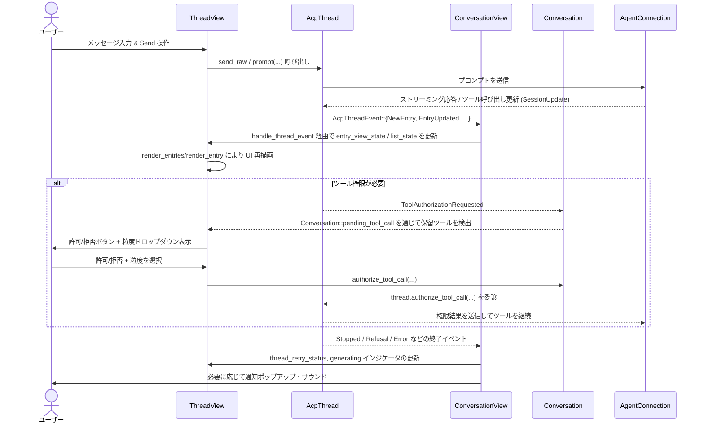
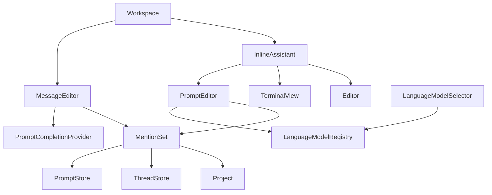
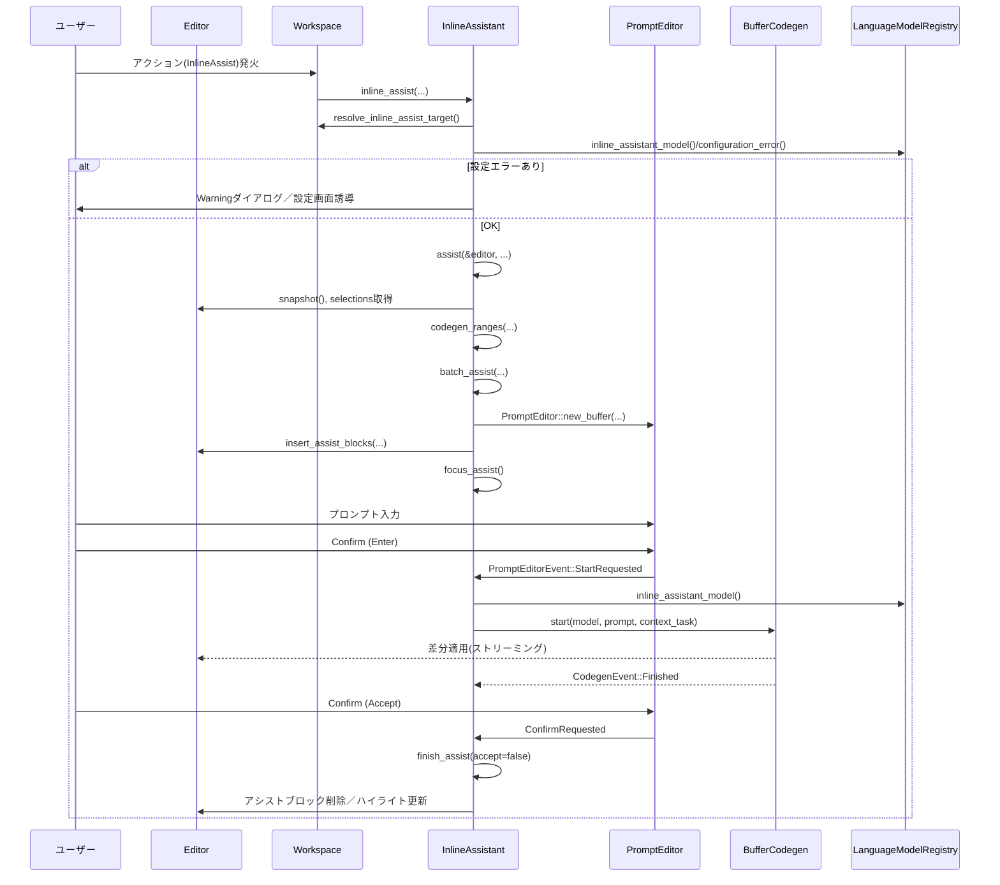

# crates/agent_ui ディレクトリ解説（設定・パネルまわりのチャンク）

> このチャンクには `agent_ui` クレート全体のうち、主に「エージェント設定 UI」「MCP サーバ設定」「プロファイル管理」「エージェントパネル」「差分レビュー」まわりのコードが含まれています。  
> ここで説明していない残りのファイルは、他のチャンクに含まれています。

---

## 1. ざっくり一言

Zed のネイティブエージェント機能（Zed Assistant）に関する **設定画面・パネル UI・接続管理・差分レビュー UI** をまとめたクレートです。  
LLM プロバイダ、Model Context Protocol (MCP) サーバ、エージェントプロファイル、外部エージェント、コード変更のレビューなどを一体として扱います。

---

## 2. このモジュールの役割

### 2.1 概要

このチャンクに含まれるコードは、おおまかに次の問題を解決しています。

- どの **LLM プロバイダ** / モデルを使うかをユーザーが設定できるようにする
- **MCP コンテキストサーバ**（ローカル/HTTP/拡張由来）の設定と起動・認証状態を管理する
- プロファイルごとに **有効なツール / MCP ツール / デフォルトモデル** を切り替えられるようにする
- 外部エージェントとの接続状況を管理し、**エージェントパネル**から会話や履歴を扱えるようにする
- エージェントが提案したコード変更を **差分ビューで Keep/Reject する UI** を提供する

### 2.2 アーキテクチャ内での位置づけ

このチャンク内の主要コンポーネントの依存関係を簡略化すると、次のようになります。



- `AgentPanel` が「エージェントとの会話 UI と設定 UI」のハブになっています。
- `AgentConfiguration` は「設定タブ」のような役割で、LLM プロバイダ・MCP サーバ・外部エージェントの一覧/操作を行います。
- 各種モーダル (`AddLlmProviderModal`, `ConfigureContextServerModal`, `ManageProfilesModal` など) は `Workspace` からトグル表示され、実際の設定値は `settings` / `ProjectSettings` や `LanguageModelRegistry` に書き込まれます。
- `AgentConnectionStore` は、エージェントサーバへの接続状態を集中管理するストアです。
- `AgentDiffPane` / `AgentDiffToolbar` / `AgentDiff` は、エージェントが行った編集の差分ビューと、そのレビュー状態を管理します。

### 2.3 設計上のポイント（このチャンクから読み取れる範囲）

- **UI と状態の分離**
  - UI コンポーネントは GPUI の `Entity` と `Context` を通じて状態を保持し、  
    実際の設定値は `SettingsStore` / `ProjectSettings` / 各種 Registry に保存されます。
- **イベント駆動**
  - `cx.subscribe` / `cx.observe` / `EventEmitter` によるイベント購読が多用され、  
    設定や接続状態の変化で UI を自動的に更新します。
- **非同期タスクの利用**
  - 設定ファイルの更新、コンテキストサーバ起動待ち、エージェント接続などは `cx.spawn` / `Task` で非同期に処理し、結果だけ UI スレッドに反映します。
- **設定の一元管理**
  - 設定値の変更は基本的に `update_settings_file(fs, cx, |settings, cx| { ... })` を通じて行い、  
    ファイル書き込みと in-memory 表現の整合性を保ちます。
- **Diff 表示の再利用**
  - 差分レビュー (`AgentDiffPane`, `AgentDiff`) はエディタの MultiBuffer/ diff 機能に「差分統合ビュー」を構築し、  
    Keep/Reject 操作を `ActionLog` 経由で元のバッファへ反映します。

---

## 3. 主要な機能一覧

このチャンクが提供する主な機能は次のとおりです。

- **LLM プロバイダ設定**
  - OpenAI 互換 API プロバイダを追加・削除するモーダル (`AddLlmProviderModal`)
  - プロバイダごとの設定ビューを構築し、Zed プラン表示や「新しいスレッドを開始」ボタンを提供 (`AgentConfiguration`)
- **MCP コンテキストサーバ設定**
  - ローカル（stdio）/ HTTP / 拡張由来の MCP サーバを JSON/JSONC で設定するモーダル  
    (`ConfigureContextServerModal`)
  - MCP サーバのステータス表示、オン/オフ切り替え、認証要求、アンインストール処理 (`AgentConfiguration::render_context_server`)
  - MCP サーバが提供するツールの一覧を表示するモーダル (`ConfigureContextServerToolsModal`)
- **エージェントプロファイル管理**
  - プロファイル一覧表示・新規作成・フォーク・削除 (`ManageProfilesModal`)
  - プロファイルごとの「デフォルト LLM モデル」選択 (`LanguageModelSelector`)
  - プロファイルごとの「組み込みツール / MCP ツール」のオン/オフ (`ToolPicker` / `ToolPickerDelegate`)
- **エージェント設定パネル**
  - 外部エージェント（Agent Client Protocol）の一覧表示・再接続・アンインストール (`AgentConfiguration::render_agent_servers_section`)
  - MCP サーバ一覧 + 設定メニュー + 状態表示 (`render_context_servers_section`)
  - LLM プロバイダ一覧 + 追加 / 削除 / 設定ビュー (`render_provider_configuration_section`)
- **エージェント接続管理**
  - エージェントごとの接続状態（Connecting/Connected/Error）を管理し、  
    接続タスクを共有するストア (`AgentConnectionStore`)
- **差分レビュー**
  - 複数ファイルにまたがるエージェント編集を 1 つの diff パネルでレビュー (`AgentDiffPane`)
  - エディタ単位の「シングルファイルレビュー」モード (`AgentDiff`)
  - ツールバー上の「Next/Prev Hunk」「Reject All」「Keep All」ボタン (`AgentDiffToolbar`)
- **エージェントパネル本体**
  - `AgentPanel` によるエージェントパネル（会話ビュー・履歴・設定）統合
  - 多数の `zed_actions` (NewThread, OpenHistory, OpenSettings, OpenAgentDiff など) を Workspace に登録 (`init`)

---

## 4. 関数・構造体の解説

### 4.1 主要な構造体・列挙体一覧

| 名前 | 種別 | ファイル | 役割 / 用途 |
|------|------|----------|-------------|
| `AddLlmProviderModal` | 構造体 | `agent_configuration/add_llm_provider_modal.rs` | OpenAI 互換 LLM プロバイダを追加するモーダル。入力検証と設定ファイル更新を行います。 |
| `LlmCompatibleProvider` | enum | 同上 | 追加対象となる「OpenAI 互換 API」の種類を表す。現状は `OpenAi` のみ。 |
| `ConfigureContextServerModal` | 構造体 | `agent_configuration/configure_context_server_modal.rs` | MCP コンテキストサーバ（stdio / HTTP / 拡張）の設定を JSON/JSONC で編集するモーダル。 |
| `ConfigurationTarget` / `ConfigurationSource` | enum | 同上 | モーダルが編集しているサーバ種別と、その設定ソース（Editor や拡張インストール情報）を表します。 |
| `ConfigureContextServerToolsModal` | 構造体 | `agent_configuration/configure_context_server_tools_modal.rs` | 指定 MCP サーバが提供するツール一覧を表示するモーダル。 |
| `ManageProfilesModal` | 構造体 | `agent_configuration/manage_profiles_modal.rs` | エージェントプロファイル一覧・編集 UI。デフォルトモデル・ツール・MCP ツールの設定を行います。 |
| `ToolPicker` / `ToolPickerDelegate` | 構造体 | `agent_configuration/tool_picker.rs` | プロファイル向けのツール選択ピッカー。組み込みツール / MCP ツール両対応。 |
| `AgentConfiguration` | 構造体 | `agent_configuration.rs` | エージェント設定パネルの本体。外部エージェント・MCP サーバ・LLM プロバイダのセクションを描画します。 |
| `AgentConnectionStore` | 構造体 | `agent_connection_store.rs` | エージェントごとの接続状態（接続タスク、履歴）を管理するストア。 |
| `AgentDiffPane` | 構造体 | `agent_diff.rs` | エージェントによるコード変更をまとめて表示・レビューする diff パネル。 |
| `AgentDiffToolbar` | 構造体 | 同上 | エディタ/AgentDiffPane 用ツールバー。Keep/Reject 操作を提供します。 |
| `AgentDiff` | 構造体 | 同上 | シングルファイルレビュー状態・ワークスペースごとのアクティブスレッドを管理するグローバル。 |
| `AgentModelSelector` | 構造体 | `agent_model_selector.rs` | モデル選択ボタン + モデルピッカー (LanguageModelSelector) の薄いラッパー。 |
| `AgentPanel` | 構造体 | `agent_panel.rs` | エージェントパネル本体。Workspace へのアクション登録、会話ビュー・履歴・設定画面の切り替えなどを行います。 |

> 補足: `AgentPanel` の実装はこのチャンクの最後で途中までしか含まれておらず、一部メソッドは別チャンクに続いています。

---

### 4.2 代表的な関数・メソッドの詳細

ここでは、モジュールを理解・拡張するうえで特に重要と思われる関数・メソッドを 5 件に絞って解説します。

---

#### 4.2.1 `add_llm_provider_modal::save_provider_to_settings`

```rust
fn save_provider_to_settings(
    input: &AddLlmProviderInput,
    cx: &mut App,
) -> Task<Result<(), SharedString>>
```

**概要**

- `AddLlmProviderModal` から呼ばれ、ユーザーが入力した **LLM プロバイダ情報** を検証し、  
  - キーチェーンに API キーを保存
  - 設定ファイル (`settings.language_models.openai_compatible`) にプロバイダを追加  
  する非同期タスクを返します。

**引数**

| 引数名 | 型 | 説明 |
|--------|----|------|
| `input` | `&AddLlmProviderInput` | モーダル内の入力フィールド（プロバイダ名、URL、キー、モデル一覧）。 |
| `cx` | `&mut App` | GPUI のアプリケーションコンテキスト。グローバル状態へのアクセスに使用。 |

**戻り値**

- `Task<Result<(), SharedString>>`  
  - 成功時: `Ok(())`  
  - 失敗時: ユーザー向けエラーメッセージを `SharedString` で返します。

**内部処理の流れ**

1. プロバイダ名の空チェックと重複チェック
   - `LanguageModelRegistry::read_global(cx).providers()` から既存プロバイダを列挙し、
     - `id` または `name` が入力と同一なら `"Provider Name is already taken..."` を返します。
2. API URL と API Key の空チェック
   - それぞれ未入力なら `"API URL cannot be empty"`, `"API Key cannot be empty"` を返します。
3. モデル一覧の検証・パース
   - 各 `ModelInput::parse(cx)` を呼び出し
     - モデル名の空チェック (`"Model Name cannot be empty"`)
     - トークン数フィールドを `u64` にパース
       - エラー時、 `"Max Completion Tokens must be a number"` 等を返します。
   - モデル名の重複を `HashSet` でチェックし、重複時 `"Model Names must be unique"`。
4. キーチェーンへの API キー保存
   - `<dyn Fs>::global(cx)` で FS を取得。
   - `cx.write_credentials(&api_url, "Bearer", api_key.as_bytes())` を実行。
5. 設定ファイルの更新
   - `update_settings_file(fs, cx, |settings, _cx| { ... })` により、
     - `settings.language_models.openai_compatible[provider_name] = OpenAiCompatibleSettingsContent { api_url, available_models: models }` を挿入。
6. 全処理を `cx.spawn(async move |cx| { ... })` でラップし、`Task` として返却。

**Examples（使用例）**

モーダル側では次のように利用されています。

```rust
fn confirm(&mut self, _: &menu::Confirm, _: &mut Window, cx: &mut Context<Self>) {
    // 入力内容を保存するタスクを構築
    let task = save_provider_to_settings(&self.input, cx);

    // 非同期に実行し、結果に応じてモーダルを閉じるかエラーを表示
    cx.spawn(async move |this, cx| {
        let result = task.await;
        this.update(cx, |this, cx| match result {
            Ok(_) => cx.emit(DismissEvent),           // 成功したらモーダルを閉じる
            Err(error) => {
                this.last_error = Some(error);        // エラーメッセージを表示用に保持
                cx.notify();
            }
        })
    })
    .detach_and_log_err(cx);
}
```

**Errors / Panics**

- `Err(SharedString)` で返る代表的なエラー:
  - `"Provider Name cannot be empty"`
  - `"Provider Name is already taken by another provider"`
  - `"API URL cannot be empty"`
  - `"API Key cannot be empty"`
  - `"Model Name cannot be empty"`
  - `"Max ... Tokens must be a number"`
  - `"Model Names must be unique"`
  - `"Failed to write API key to keychain"`
- パニックを起こすコードは、この関数の範囲では確認できません。

**Edge cases（エッジケース）**

- モデルが 1 件もない場合
  - `input.models` は `AddLlmProviderInput::new` で 1 件デフォルト生成されるため、  
    モーダル UI 経由では 0 件になりにくいです。
- 同名プロバイダが既に `LanguageModelRegistry` に登録済みの場合
  - 設定ファイルを書き換える前に検知されます（テスト `test_save_provider_name_conflict` 参照）。
- トークン数のフィールドに空文字列を入れた場合
  - `parse::<u64>()` が失敗し、「数字である必要がある」というメッセージになります。

**使用上の注意点**

- この関数は **UI スレッドから呼び出される前提** で、内部で `cx.spawn` を使って非同期処理を行います。  
  UI 外から直接利用する場合も、`App` コンテキストが必要です。
- エラーメッセージはそのままユーザーに表示されるため、  
  文言を変更するときはテスト（`tests` モジュール）の期待値も更新する必要があります。

---

#### 4.2.2 `configure_context_server_modal::ConfigureContextServerModal::show_modal_for_existing_server`

```rust
pub fn show_modal_for_existing_server(
    server_id: ContextServerId,
    language_registry: Arc<LanguageRegistry>,
    workspace: WeakEntity<Workspace>,
    window: &mut Window,
    cx: &mut App,
) -> Task<Result<()>>
```

**概要**

- 既存の MCP コンテキストサーバ（設定済み）を編集するためのモーダルを表示するエントリポイントです。
- サーバ設定の種類（stdio / HTTP / Extension）に応じて `ConfigurationTarget` を組み立て、  
  適切な `ConfigurationSource` (JSON/JSONC 編集用 Editor や拡張設定) を生成します。

**引数**

| 引数名 | 型 | 説明 |
|--------|----|------|
| `server_id` | `ContextServerId` | 編集対象の MCP サーバ ID。 |
| `language_registry` | `Arc<LanguageRegistry>` | JSONC 言語のシンタックスハイライト設定取得に使用。 |
| `workspace` | `WeakEntity<Workspace>` | モーダルを表示する Workspace（弱参照）。 |
| `window` | `&mut Window` | 現在のウィンドウ。 |
| `cx` | `&mut App` | アプリケーションコンテキスト。 |

**戻り値**

- `Task<Result<()>>`  
  - 成功時: `Ok(())`（モーダル表示・操作が完了）  
  - 失敗時: `"Context server not found"` などのエラー。

**内部処理の流れ**

1. グローバル `ProjectSettings` から対象サーバの設定を読み出し
   - 見つからなければ `ContextServerDescriptorRegistry` を確認し、  
     拡張由来サーバなら `ContextServerSettings::default_extension()` で仮設定。
   - どれにも該当しなければ `Err("Context server not found")`。
2. 設定の種類ごとに `ConfigurationTarget` を構築
   - `Stdio` → `Existing { id, command }`
   - `Http` → `ExistingHttp { id, url, headers }`
   - `Extension` → `resolve_context_server_extension` を呼び出し、  
     拡張マニフェストと設定テンプレートを取得して `ConfigurationTarget::Extension`。
3. `window.spawn` で非同期タスクを起動し、`Self::show_modal(target, ...)` を呼ぶ。
4. `show_modal` 側で JSONC 言語を解決し、`Workspace::toggle_modal` でモーダルを表示。

**Examples（使用例）**

`AgentConfiguration::render_context_server` 内のコンテキストメニューから呼ばれています。

```rust
menu.entry("Configure Server", None, {
    let context_server_id = context_server_id.clone();
    let language_registry = language_registry.clone();
    let workspace = workspace.clone();
    move |window, cx| {
        ConfigureContextServerModal::show_modal_for_existing_server(
            context_server_id.clone(),
            language_registry.clone(),
            workspace.clone(),
            window,
            cx,
        )
        .detach(); // 非同期タスクの開始
    }
});
```

**Errors / Panics**

- `ProjectSettings` に該当サーバが存在せず、 Descriptor も見つからない場合:
  - 即座に `Err(anyhow!("Context server not found"))` を返します。
- Extension 設定の解決 (`resolve_context_server_extension`) が失敗した場合:
  - `Err(anyhow!("Failed to resolve context server"))` となります。

**Edge cases**

- Extension 由来のサーバで、拡張がアンインストール済みの場合
  - `ContextServerDescriptorRegistry` から descriptor が得られず、Extension 設定モードに入れません。
- 拡張が設定スキーマを持つが JSON スキーマのロードに失敗した場合
  - `settings_validator` が `None` となり、バリデーションなしで JSON を受け付けます（エラーは `log_err` されるのみ）。

**使用上の注意点**

- `language_registry` / `workspace` は `Arc`/`WeakEntity` でキャプチャされ、  
  非同期タスクのライフサイクルに依存するため、呼び出し元で過度に短命な値を渡さないようにします。
- この関数は既存サーバ専用です。新規追加には `ConfigureContextServerModal::register` 経由で `AddContextServer` アクションを使います。

---

#### 4.2.3 `manage_profiles_modal::ManageProfilesModal::configure_builtin_tools`

```rust
fn configure_builtin_tools(
    &mut self,
    profile_id: AgentProfileId,
    window: &mut Window,
    cx: &mut Context<Self>,
)
```

**概要**

- 指定プロファイルに対して「組み込みツール」の有効/無効を設定する `ToolPicker` モードに遷移します。
- `agent::ALL_TOOL_NAMES` をもとに、現在のアクティブモデルが対応しているツールだけをピックアップします。

**内部処理の流れ**

1. 現在の `AgentSettings` を取得し、対象プロファイルをクローン。
2. 現在のアクティブモデル (`self.active_model`) のプロバイダ ID を取得。
3. `agent::ALL_TOOL_NAMES` をフィルタし、`agent::tool_supports_provider(name, provider)` が `true` のツールのみ残す。
4. `ToolPicker::builtin_tools(delegate, window, cx)` を生成
   - `ToolPickerDelegate::builtin_tools(tool_names, fs, profile_id, profile_settings, cx)` で delegate を構築。
5. `DismissEvent` を購読し、ピッカーが閉じられたら `view_profile(profile_id, ...)` に戻る。
6. `self.mode` を `Mode::ConfigureTools { ... }` に切り替え、フォーカスを更新。

**Examples（使用例）**

`render_view_profile` 内から「Configure Built-in Tools」メニューとして呼び出されています。

```rust
ListItem::new("configure-builtin-tools-item")
    .child(Label::new("Configure Built-in Tools"))
    .on_click({
        let profile_id = mode.profile_id.clone();
        cx.listener(move |this, _, window, cx| {
            this.configure_builtin_tools(profile_id.clone(), window, cx);
        })
    })
```

**Edge cases**

- 指定プロファイルが設定から削除されている場合
  - `AgentSettings::get_global(cx)` から `profile` を `get` した時点で `None` になり、何もせず return します。
- アクティブモデルがない場合
  - `provider` は `None` となり、`tool_supports_provider` チェックをスキップして全ツールを候補にします。

**使用上の注意点**

- `ToolPickerDelegate` は呼び出し時点の `profile_settings` をクローンして保持し、  
  設定ファイル更新時には `update_settings_file` で global 設定を書き換えます。
- ピッカーを別の場面で再利用する場合、`DismissEvent` の購読側で **モーダル遷移を忘れない** ように注意が必要です（戻る先の UI を決める責務は呼び出し側にあります）。

---

#### 4.2.4 `agent_configuration::AgentConfiguration::render_context_server`

```rust
fn render_context_server(
    &self,
    context_server_id: ContextServerId,
    cx: &Context<Self>,
) -> impl IntoElement
```

**概要**

- MCP コンテキストサーバ 1 件分について、
  - 名前 / ステータス / ツール数 / 拡張由来かどうか / 認証状態
  - 設定メニュー（Configure / View Tools / Log Out / Uninstall）
  - 有効/無効スイッチ  
 などをまとめた UI 要素 (`AiSettingItem`) を構築します。

**内部処理の要点**

1. ステータスと設定の取得
   - `ContextServerStore::status_for_server` から `ContextServerStatus` を取得。
   - `ContextServerStore::configuration_for_server` から `ContextServerConfiguration` を取得。
2. 表示名の決定
   - 設定が無い (= 拡張提供のみ) 場合、`resolve_extension_for_context_server` で拡張マニフェストを探し、  
     `"xxx MCP Server"` 等のサフィックスを削った名前を表示名とします。
3. エラー/認証状態のメッセージ
   - `ContextServerStatus::Error(error)` なら赤いメッセージ + 「Log Out」ボタン（必要に応じて）。
   - `AuthRequired` / `Authenticating` それぞれ専用メッセージ・操作を表示。
4. 設定メニュー (`PopoverMenu`)
   - "Configure Server" → `ConfigureContextServerModal::show_modal_for_existing_server(...)`
   - "View Tools" → `ConfigureContextServerToolsModal::toggle(...)`（ツール数 > 0 のとき）
   - "Log Out" → `context_server_store.logout_server(...)`（HTTP かつ静的ヘッダでないとき）
   - "Uninstall" → 拡張をアンインストール or 設定から削除
5. オン/オフスイッチ
   - `Switch` コンポーネントで `is_running` 状態を反映。
   - クリック時:
     - `ContextServerStore` に start/stop を依頼。
     - `update_settings_file` で `settings.project.context_servers[id]` の `enabled` フラグを更新・挿入。

**Edge cases**

- 拡張がコンテキストサーバ以外の機能も提供している場合
  - "Uninstall" で `extension_only_provides_context_server` をチェックし、  
    他機能も持つ拡張を消そうとした場合は `show_unable_to_uninstall_extension_with_context_server` の確認トーストを出します。
- 設定が存在しない Extension 由来サーバを Off にするとき
  - `ContextServerSettingsContent::Extension { enabled, ... }` を新規挿入し、`enabled` を false に設定します。

**使用上の注意点**

- 設定ファイルと実行中プロセスの同期は、**スイッチ操作 → settings 更新 → ContextServerStore で start/stop** の順で行われます。  
  直接 `ContextServerStore` のみ触ると設定が追従しないため、UI 経由の操作ではこの関数を通す設計になっています。
- エラーや認証要求は `ContextServerStatus` によってのみ判断されるため、  
  ステータスを更新する側（`ContextServerStore` 実装）の挙動を変えるときは UI への影響を考慮する必要があります。

---

#### 4.2.5 `agent_connection_store::AgentConnectionStore::request_connection`

```rust
pub fn request_connection(
    &mut self,
    key: Agent,
    server: Rc<dyn AgentServer>,
    cx: &mut Context<Self>,
) -> Entity<AgentConnectionEntry>
```

**概要**

- 指定エージェント (`Agent`) に対する接続を要求し、  
  既に接続中なら既存エントリを返し、未接続なら新しい接続タスクを開始します。
- 接続状態は `AgentConnectionEntry` (Connecting / Connected / Error) として `Entity` に包まれ、  
  後続処理は `wait_for_connection()` で待機できます。

**内部処理の流れ**

1. 既存エントリ確認
   - `self.entries.get(&key)` があれば、それをそのまま返す。（再接続は `restart_connection` を使用）
2. 新規接続開始
   - `self.start_connection(server, cx)` を呼び、  
     - `watch::Receiver<Option<String>>`（新バージョン通知用）
     - `Task<Result<AgentConnectedState, LoadError>>`（接続タスク）  
     を受け取る。
   - 接続タスクを `.shared()` し、複数箇所から await 可能にする。
   - `AgentConnectionEntry::Connecting { connect_task }` を新規 `Entity` として登録。
3. 接続完了監視
   - `cx.spawn` で接続タスクを待機し、成功なら `Connected`, 失敗なら `Error` に差し替える。
   - エラー時は `entries` から key を削除。
4. 新バージョン通知監視
   - 別の `cx.spawn` で `new_version_rx.recv().await` をループし、  
     バージョン文字列を受信したら `AgentConnectionEntryEvent::NewVersionAvailable` を emit しつつ、エントリを削除。

**Examples（使用例）**

`AgentPanel::new` の中で、ネイティブエージェントを即座に接続しています。

```rust
let connection_store = cx.new(|cx| {
    let mut store = AgentConnectionStore::new(project.clone(), cx);

    // ネイティブエージェントを登録
    store.request_connection(
        Agent::NativeAgent,
        Agent::NativeAgent.server(fs.clone(), thread_store.clone()),
        cx,
    );
    store
});
```

**Edge cases**

- 同じ `Agent` に対して短時間に複数回 `request_connection` が呼ばれた場合
  - 最初の呼び出しで生成されたエントリをそのまま返却し、二重接続は行いません。
- 接続タスクが `LoadError` 以外のエラー種別を返した場合
  - `LoadError` にダウンキャストを試み、失敗した場合は `LoadError::Other` に変換して保持します。

**使用上の注意点**

- 接続の再試行には `restart_connection` を使う必要があります。  
  `request_connection` のみでは Error 状態を上書きできません。
- `AgentConnectionEntry` は `EventEmitter<AgentConnectionEntryEvent>` を実装しており、新バージョン通知などを購読可能です。  
  ただし、このチャンクにはそれを購読するコードは現れていません。

---

#### 4.2.6 `agent_diff::AgentDiffPane::keep` / `reject`（差分レビュー操作）

```rust
fn keep(&mut self, _: &Keep, window: &mut Window, cx: &mut Context<Self>) { ... }

fn reject(&mut self, _: &Reject, window: &mut Window, cx: &mut Context<Self>) { ... }
```

**概要**

- diff パネル上で選択中の差分ハンクを「採用 (Keep)」または「破棄 (Reject)」するアクションハンドラです。
- 実際の処理は `keep_edits_in_selection` / `reject_edits_in_selection` に委譲され、  
  `ActionLog` を通じて元のバッファに編集を反映します。

**内部処理の流れ（共通）**

1. 現在の `Editor` と `MultiBufferSnapshot` を取得。
2. `Editor::selections` から選択範囲を Anchor Range に変換。
3. `diff_hunks_in_ranges` で該当ハンクを列挙。
4. 選択更新 (`update_editor_selection`) でレビュー後のカーソル位置を次のハンクに移動。
5. 各ハンクについて
   - Keep: `ActionLog::keep_edits_in_range`
   - Reject: `ActionLog::reject_edits_in_ranges` + Undo 情報蓄積 + Undo トースト表示

**Edge cases**

- 選択範囲がどのハンクにもかからない場合
  - `update_editor_selection` で「現在カーソルがあるハンク」チェックに引っかからず、選択移動も行いません。
- すべてのハンクが処理済みになった場合
  - `update_editor_selection` で次のハンクが見つからず、カーソルはそのままになります。
- Reject した内容をまとめて Undo できるよう、最後に `LastRejectUndo` が ActionLog に保存されます。

**使用上の注意点**

- `Keep` / `Reject` アクションは `AgentDiffPane` と `AgentDiffToolbar` の両方から発火されます。  
  キーバインドやツールバーボタンを追加する際は、どちら経由かを意識する必要があります。
- Reject は非同期タスクでバッファを書き換えるため、連打するとユーザー体験に影響が出る可能性があります。

---

#### 4.2.7 `agent_panel::init`

```rust
pub fn init(cx: &mut App)
```

**概要**

- 新しく作成されるすべての `Workspace` に対して、エージェント関連のアクション (`NewThread`, `OpenSettings`, `OpenAgentDiff` など) を登録します。
- これにより、キーボードショートカットやメニューからエージェント機能を呼び出せるようになります。

**内部処理の流れ**

1. `cx.observe_new::<Workspace>(...)` を使い、Workspace 生成時にフックする。
2. 各 Workspace に対して:
   - `NewThread` → `AgentPanel::new_thread`
   - `OpenSettings` → `AgentPanel::open_configuration`
   - `OpenAgentDiff` → `AgentDiffPane::deploy_in_workspace(...)`
   - `OpenHistory` / `ManageProfiles` / `ResolveConflictsWithAgent` / `ReviewBranchDiff` 等多数のアクションを `register_action` で関連付ける。
   - `OpenAcpOnboardingModal` やトライアル関連の Upsell リセットなど、Onboarding まわりのアクションも含まれます。
3. `AgentPanel` 自身は `AgentPanel::load` で非同期に構築される（実装の続きは別チャンクにあります）。

**Examples（使用例）**

アプリケーション起動時に一度呼び出される想定です（このチャンク内に直接の呼び出し例はありません）。

```rust
fn main() {
    gpui::App::new().run(|cx| {
        // エージェントパネルを全 Workspace に統合
        agent_ui::agent_panel::init(cx);

        // ここで Workspace などを初期化
    });
}
```

> 上記はコードからの推測ではなく、`init` のシグネチャと内容から考えられる典型例です。  
> 実際にどこで呼ばれているかはこのチャンクには含まれていません。

**使用上の注意点**

- `init` は **アプリケーション起動時に一度だけ** 呼び出すことを前提とした設計に見えます。  
  複数回呼ぶとアクションが二重登録される可能性があります（コード上で回避している記述はありません）。
- Workspace ごとに `AgentPanel` が存在する前提でアクションを登録しているため、パネルの生成時期との整合性に注意が必要です。

---

### 4.3 その他の関数・構造体（概要のみ）

- `ConfigureContextServerToolsModal::toggle`  
  - 指定 MCP サーバのツール一覧モーダルを開閉します。
- `AgentModelSelector`  
  - `LanguageModelSelector` のラッパーとして、現在のモデル名をボタンラベルに表示し、  
    Favorite モデルのローテーション (`cycle_favorite_models`) も提供します。
- `AgentDiffToolbar`  
  - アクティブな Pane/Editor の状態に応じて、ツールバーの表示位置 (`ToolbarItemLocation`) と内容を切り替えます。

---

## 5. データフロー

ここでは代表的な処理として、**MCP コンテキストサーバの設定・起動までの流れ**を説明します。

### 5.1 MCP サーバ設定〜起動のフロー

1. ユーザーが Agent 設定パネルから「Add Server」または「Configure Server」を選択。
2. `AgentConfiguration::render_context_servers_section` → コンテキストメニューから  
   `ConfigureContextServerModal::show_modal_for_existing_server` などが呼ばれ、モーダルが表示される。
3. モーダル内の Editor で JSON/JSONC 設定を編集し、「Add Server」/「Configure Server」ボタンを押す。
4. `ConfigureContextServerModal::confirm` が呼ばれ、`ConfigurationSource::output` で  
   `ContextServerSettings`（Stdio / Http / Extension）が構築される。
5. 設定内容が `update_settings_file` を通じて `ProjectSettings` に書き込まれる。
6. `ContextServerStore` が設定変更を検知し、サーバの起動を開始。
7. `wait_for_context_server` が `ServerStatusChangedEvent` を購読し、`Running` or `AuthRequired` を待つ。
8. 成功時はトースト (`StatusToast`) を表示し、モーダルを閉じる。  
   認証が必要な場合は「Authenticate」ボタン付きメッセージを表示。

Mermaid のシーケンス図で表すと、次のようになります。



---

## 6. 使い方（How to Use）

ここでは、このチャンクのコードを **同じクレート内から使う** 典型パターンを示します。  
他クレートからの利用方法は、このチャンクだけでは完全には分からないため、推測に留めています。

### 6.1 基本的な使用方法

#### 6.1.1 アプリ起動時にエージェントパネルを登録する

```rust
use gpui::App;
use workspace::Workspace;

// メイン関数（例）
fn main() {
    App::new().run(|cx| {
        // すべての Workspace に AgentPanel を組み込む
        // init はこのチャンク内の agent_panel.rs で定義されています。
        crate::agent_panel::init(cx);

        // 以降で Workspace 作成などを行う（詳細はこのチャンクには含まれない）
    });
}
```

このように `init` を呼ぶことで、Workspace が作られるたびに `AgentPanel` が組み込まれ、  
`NewThread` や `OpenHistory` などのアクションが有効になります。

#### 6.1.2 設定パネルを開く

Workspace から `OpenSettings` アクションを dispatch すると、AgentPanel の `open_configuration` が呼ばれ、`AgentConfiguration` ビューが表示されます。

```rust
// どこかの UI コードから
window.dispatch_action(
    &zed_actions::agent::OpenSettings.boxed_clone(),
    cx,
);
```

`AgentConfiguration` では、外部エージェント・MCP サーバ・ LLM プロバイダをまとめて設定できます。

### 6.2 よくある使用パターン

#### 6.2.1 OpenAI 互換プロバイダの追加

```rust
use workspace::Workspace;
use crate::agent_configuration::add_llm_provider_modal::{AddLlmProviderModal, LlmCompatibleProvider};

// 例えば LLM プロバイダセクションの "Add Provider" ボタンから:
workspace.update(cx, |workspace, cx| {
    AddLlmProviderModal::toggle(
        LlmCompatibleProvider::OpenAi, // 現状は OpenAI のみ
        workspace,
        window,
        cx,
    );
})?;
```

- モーダル内で API URL や API キー、モデル情報を入力し、「Save Provider」を押すと  
  `save_provider_to_settings` が呼ばれ、設定・キーチェーンへの保存が行われます。

#### 6.2.2 MCP サーバの設定・編集

```rust
use crate::agent_configuration::configure_context_server_modal::ConfigureContextServerModal;
use context_server::ContextServerId;

// 既存 MCP サーバを編集する例
ConfigureContextServerModal::show_modal_for_existing_server(
    ContextServerId("some-server".into()),
    language_registry.clone(),
    workspace.downgrade(),
    window,
    cx,
).detach();
```

- 新規追加の場合は `AddContextServer` アクション（すでに `AgentPanel::init` で登録済み）を dispatch します。

#### 6.2.3 プロファイルごとのツール設定

```rust
use crate::agent_configuration::ManageProfiles;

// ManageProfiles アクションを dispatch すると、
// ManageProfilesModal が開きます。
window.dispatch_action(&ManageProfiles { customize_tools: None }.boxed_clone(), cx);
```

- モーダル内でプロファイルを選択し、「Configure Built-in Tools」や「Configure MCP Tools」を選ぶと  
  `ToolPicker` を用いたツール選択 UI に遷移します。

### 6.3 よくある間違いと正しい使い方

```rust
// 間違い例: 直接 ContextServerStore を操作して設定ファイルを更新しない
context_server_store.update(cx, |store, cx| {
    store.start_server(&id, cx);
});

// 正しい例: AgentConfiguration 経由でスイッチを操作し、
// 内部で settings と ContextServerStore の両方を更新してもらう
// （UI 操作なのでコード上では直接呼ばない）
```

- 設定ファイル（`ProjectSettings` / `SettingsStore`）と実行中プロセスの状態が同期しなくなるため、  
  基本的に **UI/設定用関数を介して操作する** 前提で設計されています。

```rust
// 間違い例: AgentPanel::init を複数回呼び出す
fn main() {
    App::new().run(|cx| {
        crate::agent_panel::init(cx);
        crate::agent_panel::init(cx); // 二重登録の可能性
    });
}

// 正しい例: 起動時に一度だけ呼ぶ
fn main() {
    App::new().run(|cx| {
        crate::agent_panel::init(cx);
    });
}
```

### 6.4 使用上の注意点（まとめ）

- **GPUI コンテキストの制約**
  - UI 更新・`Entity` の生成・`update_settings_file` などは、基本的に  
    `App` / `Context<T>` / `AsyncWindowContext` 上で行う必要があります。
- **設定変更の集中経路**
  - 設定ファイル更新は原則として `update_settings_file` 経由で行われます。  
    他の場所で同じファイルを直接書き換えると不整合の原因になります。
- **非同期タスクのエラーハンドリング**
  - 多くの非同期タスクで `detach_and_log_err(cx)` が使われています。  
    静かに失敗することがあるため、動作確認時にはログ出力を確認することが重要です。
- **機能フラグへの依存**
  - `StartThreadIn::NewWorktree` など一部の機能は `AgentV2FeatureFlag` の有効/無効に依存します。  
    フラグが無効な状態で直接この値をセットしようとすると、コード内で guard されます。

---

## 7. 関連ファイル

このチャンクに含まれるファイル、および密接に関連するがコードが含まれていないファイルをまとめます。

| パス | 役割 / 関係 |
|------|------------|
| `agent_ui/src/agent_configuration/add_llm_provider_modal.rs` | OpenAI 互換 LLM プロバイダ追加モーダル。`AgentConfiguration` から呼び出されます。 |
| `agent_ui/src/agent_configuration/configure_context_server_modal.rs` | MCP コンテキストサーバ設定モーダル。`AgentConfiguration` の「Configure Server」メニューから利用。 |
| `agent_ui/src/agent_configuration/configure_context_server_tools_modal.rs` | MCP サーバが提供するツール一覧モーダル。「View Tools」メニューから呼び出し。 |
| `agent_ui/src/agent_configuration/manage_profiles_modal.rs` | エージェントプロファイル管理モーダル。`ManageProfiles` アクションから開かれます。 |
| `agent_ui/src/agent_configuration/manage_profiles_modal/profile_modal_header.rs` | プロファイルモーダルのヘッダコンポーネント。`ManageProfilesModal` 内で再利用。 |
| `agent_ui/src/agent_configuration/tool_picker.rs` | プロファイルごとのツール/MCP ツール選択ピッカー。`ManageProfilesModal` から使用。 |
| `agent_ui/src/agent_configuration.rs` | エージェント設定パネル本体。エージェントサーバ・MCP サーバ・LLM プロバイダのセクションをまとめて描画します。 |
| `agent_ui/src/agent_connection_store.rs` | エージェント接続状態を管理するストア。`AgentPanel` が保持し、接続状況の表示等に利用。 |
| `agent_ui/src/agent_diff.rs` | エージェント編集の diff パネルとシングルファイルレビュー機構。`OpenAgentDiff` アクションなどから利用されます。 |
| `agent_ui/src/agent_model_selector.rs` | モデル選択ボタン (`AgentModelSelector`) の実装。インラインアシスタント等から使用されます。 |
| `agent_ui/src/agent_panel.rs` | エージェントパネル本体。多数の `zed_actions` を Workspace に登録し、会話ビュー/履歴/設定の切り替えを担います。このチャンクにはファイルの前半が含まれ、後半は別チャンクに続きます。 |
| `agent_ui/src/conversation_view.rs` / `thread_view.rs` | `AgentPanel` から参照される会話/スレッド表示用モジュールですが、このチャンクには実装が含まれていません。名前と import からその役割が想定されます。 |

> この表に挙げたうち、`conversation_view.rs` 等は **ファイル名と import から役割が推測できる** だけであり、  
> 詳細な挙動はこのチャンクのコードからは読み取れません。

---

# agent_ui/ ディレクトリ（UI とエージェント連携の中核）

## 1. ざっくり一言

このディレクトリは、Zed の AI エージェント機能の UI 層を担うモジュール群です。  
エージェントスレッドの表示・送信、インラインコード生成、プロンプト補完（`@file`・`@symbol` 等）、エージェントレジストリやセッション設定 UI を提供します。

---

## 2. このモジュールの役割

### 2.1 概要

このディレクトリは主に次の問題を扱います。

- エージェントとの「会話スレッド」の UI 表現と送受信フローの管理
- エディタ上でのインラインコード生成（置換・リライト）の実装
- プロンプト中に `@file` / `@symbol` / `@thread` / `@diagnostics` などを補完してコンテキストを指定する仕組み
- モデル・プロファイル・セッション設定など、エージェント動作を切り替える UI
- ACP Registry からのエージェントインストール UI
- メンションで添付されたファイル・画像を言語モデル向けリクエストに変換するコンテキストローダ

これらを通じて、「ユーザーの操作 → UI コンポーネント → 内部スレッド／言語モデル」という一連のフローを構成します。

### 2.2 アーキテクチャ内での位置づけ

主要なコンポーネント間の関係を簡略化して示します。



- `agent_ui::init` が各種サブモジュールを初期化し、`Workspace` に `AgentPanel` などの UI を登録します。
- `AgentPanel` 内の `ThreadView` が、`AcpThread`（実際のエージェントセッション）と UI を橋渡しします。
- `MessageEditor` と `PromptCompletionProvider` が、プロンプト補完・コンテキスト選択を扱います。
- インラインコード生成は `BufferCodegen` / `CodegenAlternative` → `LanguageModel` という経路で行われます。
- セッションごとのオプション（思考レベルなど）は `ConfigOptionsView` を通じて切り替えます。
- `AgentRegistryPage` が ACP Registry 上のエージェント一覧・インストールを提供します。

### 2.3 設計上のポイント

コードから読み取れる特徴を列挙します。

- **イベント駆動 UI（gpui）**
  - ほとんどの型が `Entity<T>` と `Context<T>` を介して管理され、イベント通知・購読 (`subscribe`, `observe`) により状態を同期します。
- **非同期タスクによるバックグラウンド処理**
  - 言語モデル呼び出し・ファイル検索・設定の保存など、重い処理は `Task`／`background_spawn` でバックグラウンド実行されます。
- **UI とモデルの分離**
  - `ThreadView` / `AgentRegistryPage` などの UI 型は、`Project` / `Workspace` / `ThreadStore` / `LanguageModelRegistry` といったドメイン側の型に依存しつつ、表示ロジックと状態変化を担当します。
- **ストリーミング前提のコード生成**
  - `BufferCodegen`/`CodegenAlternative` は、モデルからの逐次ストリームを受け取りながら差分適用・自動インデント・ハイライト用の `Diff` 構築を行います。
- **ツール呼び出しとプレーンテキストの両対応**
  - インラインコード生成では、モデルがストリーミングツールをサポートする場合としない場合どちらも扱えるよう設計されています。
- **コンテキスト指定の統一的インターフェース**
  - `PromptContextType` / `PromptCompletionProvider` により、`@file` / `@symbol` / `@thread` / `@diagnostics` / `@fetch` / ブランチ diff などを単一メカニズムで扱います。
- **設定・永続化との連携**
  - `ConfigOptionsView` は `AgentSessionConfigOptions` / `AgentServer` / `SettingsStore` を通じて設定値を読み書きします。
  - `ThreadView` はドラフトプロンプトやスクロール位置をシリアライズするためにスロットルされた保存 (`schedule_save`) を行います。

---

## 3. 主要な機能一覧

このチャンクに含まれる主な機能を列挙します。

- エージェント選択・初期化
  - `Agent` 列挙体と `Agent::server` によるネイティブエージェント／カスタムエージェントの切り替え
  - `StartThreadIn` によるスレッド開始場所（既存プロジェクト／新規 worktree）の指定
- エージェント UI 全体の初期化
  - `init` 関数（`agent_ui.rs`）による `AgentPanel`、インラインアシスタント、コンテキストサーバ設定、スレッドメタデータストアなどの初期化
  - 設定や feature flag に基づくコマンドパレット表示／非表示制御
- インラインコード生成
  - `BufferCodegen` / `CodegenAlternative` による選択範囲のリライト・挿入
  - 言語モデルのストリーミング出力からの diff 構築と自動インデント
  - モデルツール (`rewrite_section` / `failure_message`) を利用した構造化補完
- プロンプト補完と文脈指定
  - `PromptCompletionProvider` による `/command` と `@mention` 補完
  - `@file`, `@symbol`, `@thread`, `@fetch`, `@diagnostics`, 「Branch Diff」などの候補生成
  - 最近のファイル・スレッド・ルールのサジェスト
- セッション設定オプション UI
  - `ConfigOptionsView` / `ConfigOptionSelector` によるセッション設定（例: 推論モード・思考レベル）の選択
  - お気に入り値・デフォルト値の管理と fuzzy 検索つきピッカー
- コンテキストロード
  - `LoadedContext` / `load_context` による `MentionSet` からのテキスト・画像抽出と言語モデルリクエストへの組み込み
- 会話ビュー（ThreadView）
  - メッセージ送信 (`send` / `send_impl` / `send_content`) とキューイング
  - ターン管理（開始／終了、トークン数・時間の計測）
  - diff 位置へのジャンプ（`open_diff_location`）
  - フィードバック（👍/👎）とコメントの送信
- エージェントレジストリ UI
  - `AgentRegistryPage` による ACP Registry の一覧表示・検索・インストール／削除
- その他ユーティリティ
  - `generate_branch_name` による `"adjective-noun"` 形式のブランチ名生成
  - `StripInvalidSpans` によるコードブロック・カーソルマーカーの除去

---

## 4. 関数・構造体の解説

### 4.1 主要な型一覧

| 名前 | 種別 | 定義ファイル | 役割 / 用途 |
|------|------|--------------|-------------|
| `Agent` | enum | `agent_ui.rs` | ネイティブエージェントかカスタムエージェントかを表し、適切な `AgentServer` を生成します。 |
| `StartThreadIn` | enum | `agent_ui.rs` | 新規スレッドをどこで動かすか（`LocalProject` / `NewWorktree`）を表します。 |
| `AgentInitialContent` | enum | `agent_ui.rs` | 新規スレッド開始時の初期コンテンツ（スレッドサマリや外部ソース等）を表します。 |
| `BufferCodegen` | 構造体 | `buffer_codegen.rs` | インラインコード生成セッション全体を管理します。複数の `CodegenAlternative` を持ちます。 |
| `CodegenAlternative` | 構造体 | `buffer_codegen.rs` | 単一のモデルに対応するコード生成代替案。ストリーム処理や diff 適用を担当します。 |
| `CodegenEvent` | enum | `buffer_codegen.rs` | コード生成の完了／取り消しイベントを表します。 |
| `Diff` | 構造体 | `buffer_codegen.rs` | 追加・削除された行範囲を UI 用に保持します。 |
| `StripInvalidSpans<T>` | 構造体 | `buffer_codegen.rs` | 言語モデルからのテキストストリームから不要なコードブロック記号やカーソルマーカーを削除します。 |
| `LoadedContext` | 構造体 | `context.rs` | メンションから読み込まれたテキストと画像の集合です。 |
| `PromptContextType` | enum | `completion_provider.rs` | `@file` / `@symbol` / `@thread` 等、メンションで指定できる文脈の種類を表します。 |
| `PromptCompletionProvider<T>` | ジェネリック構造体 | `completion_provider.rs` | メッセージエディタ用の補完プロバイダ。`/command` / `@mention` の候補を生成します。 |
| `ConfigOptionsView` | 構造体 | `config_options.rs` | セッション設定オプション（思考レベル等）の UI コンテナ。複数の `ConfigOptionSelector` を持ちます。 |
| `ConfigOptionSelector` | 構造体 | `config_options.rs` | 単一の設定項目に対するドロップダウンピッカーを表します。 |
| `ThreadView` | 構造体 | `conversation_view/thread_view.rs` | 1 つのエージェントスレッドの UI 状態と動作（送信、キュー、フィードバックなど）を管理します。 |
| `ThreadFeedbackState` | 構造体 | `conversation_view/thread_view.rs` | スレッドへの👍/👎 とコメント入力エディタの状態を管理します。 |
| `PermissionSelection` | enum | `conversation_view/thread_view.rs` | ツール呼び出しの許可ドロップダウンでの選択状態を表します。 |
| `AgentRegistryPage` | 構造体 | `agent_registry_ui.rs` | ACP Registry の UI ページ。検索やフィルタ、インストールボタンを提供します。 |
| `BranchDiffMatch` | 構造体 | `completion_provider.rs` | ブランチ diff 用のベースリファレンス（例: `main`）を保持します。 |
| `SessionMatch` | 構造体 | `completion_provider.rs` | スレッド補完用の候補（セッション ID とタイトル）を表します。 |

以下では、特に重要な関数／メソッドを選んで詳しく説明します。

---

### 4.2 重要な関数・メソッドの詳細

#### 4.2.1 `BufferCodegen::start(...)`

```rust
pub fn start(
    &mut self,
    primary_model: Arc<dyn LanguageModel>,
    user_prompt: String,
    context_task: Shared<Task<Option<LoadedContext>>>,
    cx: &mut Context<Self>,
) -> Result<()>
```

**概要**

選択範囲に対するインラインコード生成を開始します。  
メインモデルと「代替モデル」を使って複数の `CodegenAlternative` を生成し、それぞれ非同期に言語モデル呼び出しを開始します。

**引数**

| 引数名 | 型 | 説明 |
|--------|----|------|
| `primary_model` | `Arc<dyn LanguageModel>` | メインとして使う言語モデルインスタンスです。 |
| `user_prompt` | `String` | ユーザーが入力した指示文（例: `"Refactor this function"`）。 |
| `context_task` | `Shared<Task<Option<LoadedContext>>>` | メンション等から文脈を読み込む非同期タスク。`None` の場合は文脈無し。 |
| `cx` | `&mut Context<Self>` | `BufferCodegen` 自身の gpui コンテキストです。 |

**戻り値**

- `Ok(())` : すべてのモデルに対してストリーミング開始処理をセットアップできた場合。
- `Err(anyhow::Error)` : プロンプト生成やリクエスト構築時に失敗した場合。

**内部処理の流れ**

1. `LanguageModelRegistry::read_global(cx).inline_alternative_models()` から代替モデルの一覧を取得します。
2. 既存のアクティブ代替案の編集を取り消し (`alternative.undo()`)、アクティブ代替案を 0 番に戻し、`alternatives` を 1 つに切り詰めます。
3. 代替モデルの数だけ `CodegenAlternative::new(...)` を追加生成します。
4. メインモデル + 代替モデルを `iter::once(primary_model).chain(alternative_models)` でループし、それぞれについて:
   - `CodegenAlternative::start(user_prompt.clone(), context_task.clone(), model.clone(), cx)` を呼び、非同期ストリーム処理 (`handle_stream` or `handle_completion`) を開始します。

**Examples（使用例）**

```rust
use std::sync::Arc;
use uuid::Uuid;
use language_model::{LanguageModel, LanguageModelRegistry};
use prompt_store::PromptBuilder;
use editor::{MultiBuffer, Anchor};
use gpui::{Context, Entity};

fn start_inline_codegen(
    buffer: Entity<MultiBuffer>,                    // 対象バッファ
    range: std::ops::Range<Anchor>,                // 変換したい範囲
    cx: &mut Context<BufferCodegen>,               // BufferCodegen のコンテキスト
) {
    let prompt_builder = Arc::new(PromptBuilder::new(None).unwrap()); // プロンプトビルダ
    let session_id = Uuid::new_v4();

    // BufferCodegen を初期化
    let mut codegen = BufferCodegen::new(
        buffer,
        range,
        None,
        session_id,
        prompt_builder,
        cx,
    );

    // モデルとコンテキストタスクを取得
    let model = LanguageModelRegistry::read_global(cx.app())
        .default_model()
        .expect("モデルが設定されている前提");
    let context_task = cx.spawn(|_, _| async { Ok(None::<LoadedContext>) }).shared();

    // 生成開始
    codegen.start(model, "Refactor this code".to_string(), context_task, cx)
        .expect("開始に失敗した場合は Err");
}
```

**Errors / Panics**

- `PromptBuilder::generate_inline_transformation_prompt` / `*_tools` が `Err` を返した場合、`start` も `Err` を返します。
- 選択範囲 (`self.range`) が不正（開始と終了が別バッファ）な場合、`build_request` 内で `anyhow::bail!("invalid transformation range")` され、ここに伝搬します。
- パニックはコード上では使用していません（`unwrap` はテストコード側のみ）。

**Edge cases**

- 選択範囲が空の場合：`is_insertion` は true になりますが、`start` 自体は通常どおり動きます。
- `context_task` が `None` を返す場合：文脈無しとしてリクエストが構築されます。
- すでに別の生成が進行中のときに `start` を再度呼ぶと、既存の変換トランザクションを `undo` してから新たな生成を開始します。

**使用上の注意点**

- `BufferCodegen` は同じ選択範囲・バッファに対する単一の生成セッションとして設計されています。新しい範囲で生成したい場合は新しいインスタンスを作成します。
- `context_task` は複数モデルから共有されるため `Shared<Task<_>>` になっています。外側で共有済みのタスクを渡す前提です。

---

#### 4.2.2 `CodegenAlternative::handle_stream(...)`

```rust
pub fn handle_stream(
    &mut self,
    model: Arc<dyn LanguageModel>,
    strip_invalid_spans: bool,
    stream: impl 'static + Future<Output = Result<LanguageModelTextStream>>,
    cx: &mut Context<Self>,
) -> Task<()>
```

**概要**

言語モデルのテキストストリームを受け取りながら、選択範囲に対して逐次 diff を適用し、最終的な `Diff` 情報を構築します。  
自動インデントやトークン使用量のテレメトリ送信も行います。

**引数**

| 引数名 | 型 | 説明 |
|--------|----|------|
| `model` | `Arc<dyn LanguageModel>` | 使用する言語モデル。テレメトリにも利用します。 |
| `strip_invalid_spans` | `bool` | コードブロック記号や `<\|CURSOR\|>` をストリームから除去するかどうか。 |
| `stream` | `Future<Output = Result<LanguageModelTextStream>>` | モデルからのストリームを返す Future。 |
| `cx` | `&mut Context<Self>` | `CodegenAlternative` のコンテキスト。 |

**戻り値**

- `Task<()>` : 非同期処理のタスク。完了時に `CodegenStatus` が `Done` または `Error` に更新されます。

**内部処理の流れ（概要）**

1. 現在の `MultiBufferSnapshot` を取り直し、`self.range` を `anchor_after` で最新位置に再解決します。
2. 選択テキストを `selected_text` として保存し、推奨インデント（スペース／タブ、長さ）を推定します。
3. `Diff` と `CodegenStatus` を初期化し、`completion` 用の `Arc<Mutex<String>>` を準備します。
4. 非同期タスク内で:
   - `stream.await` で `LanguageModelTextStream` を取得。
   - 文字列ストリームを（必要なら `StripInvalidSpans` で前処理しつつ）`StreamingDiff` と `LineDiff` に流し込み、`CharOperation` / `LineOperation` 列を生成。
   - 各チャンクごとに `apply_edits` でバッファに反映し、`reapply_line_based_diff` で行単位の差分範囲を計算。
   - ストリーム終了後、`reapply_batch_diff` で通常の行差分に置き換え。
5. トークン使用量があれば `telemetry::event!` でログします。
6. 最後に `CodegenStatus::Done` または `Error` をセットし、`CodegenEvent::Finished` を発火します。

**Examples（使用例）**

`BufferCodegen::start` 内から呼ばれるため、通常は直接呼び出す必要はありません。  
テストコードでは、フェイクモデルとカスタムストリームを用いて次のように利用しています。

```rust
use futures::channel::mpsc;
use language_model::fake_provider::FakeLanguageModel;

fn simulate_streaming(
    codegen: &Entity<CodegenAlternative>,
    cx: &mut gpui::TestAppContext,
) -> mpsc::UnboundedSender<String> {
    let (tx, rx) = mpsc::unbounded();
    let model = Arc::new(FakeLanguageModel::default());

    codegen.update(cx, |alt, cx| {
        alt.generation = alt.handle_stream(
            model,
            false,
            async move {
                Ok(LanguageModelTextStream {
                    message_id: None,
                    stream: rx.map(Ok).boxed(),
                    last_token_usage: Arc::new(Mutex::new(TokenUsage::default())),
                })
            },
            cx,
        );
    });

    tx
}
```

**Errors / Panics**

- ストリームの生成 (`stream.await`) が `Err` を返した場合は `CodegenStatus::Error` に設定されますが、パニックにはなりません。
- diff 計算中のエラーも `CodegenStatus::Error` として扱われます。

**Edge cases**

- 選択範囲が空（挿入モード）の場合でも、`StreamingDiff` により挿入として処理されます。
- インデント検出でタブが見つかった場合はタブ優先に切り替えます。
- ストリームにコードブロックや `<|CURSOR|>` が含まれる場合、`strip_invalid_spans == true` ならそれらが取り除かれます（`StripInvalidSpans` 参照）。

**使用上の注意点**

- 通常は `BufferCodegen::start` 経由で利用する前提で設計されています。単独で呼び出す場合は、`self.range` や `self.snapshot` が最新であることを事前に整合させる必要があります。
- 複数回連続して呼び出すと、前回の変換トランザクションが `undo` / 再適用されるため、UI 側での状態管理が重要です。

---

#### 4.2.3 `PromptCompletionProvider<T>::completions(...)`

```rust
impl<T: PromptCompletionProviderDelegate> CompletionProvider for PromptCompletionProvider<T> {
    fn completions(
        &self,
        buffer: &Entity<Buffer>,
        buffer_position: Anchor,
        _trigger: CompletionContext,
        window: &mut Window,
        cx: &mut Context<Editor>,
    ) -> Task<Result<Vec<CompletionResponse>>>
```

**概要**

メッセージエディタのカーソル位置から `/command` または `@mention` を解析し、コンテキストに応じた補完候補を返します。  
ファイル・シンボル・スレッド・ルール・Fetch・Diagnostics など、さまざまなコンテキストを統一的に扱います。

**引数（主要部分）**

| 引数名 | 型 | 説明 |
|--------|----|------|
| `buffer` | `&Entity<Buffer>` | 補完対象のバッファ。 |
| `buffer_position` | `Anchor` | カーソル位置。 |
| `window` | `&mut Window` | レイアウト計算に用いるウィンドウ。 |
| `cx` | `&mut Context<Editor>` | 対象エディタのコンテキスト。 |

**戻り値**

- `Task<Result<Vec<CompletionResponse>>>`  
  完了時に 0 個以上の `CompletionResponse` を返します。各レスポンスには候補と表示オプションが含まれます。

**内部処理の流れ（簡略）**

1. カーソル行の先頭から `buffer_position` までのテキストを取得し、`PromptCompletion::try_parse` を呼んで状態を解析します。
   - `/...` の場合 → `SlashCommandCompletion`
   - `@...` の場合 → `MentionCompletion`
2. スラッシュコマンドの場合:
   - `search_slash_commands` でコマンド名に対する fuzzy 検索を行う。
   - 各コマンドに対し `/name [argument]` 形式の補完候補を生成。
3. メンションの場合:
   - `@diagnostics` のような特殊ケースは、`completion_for_diagnostics` で静的候補を生成。
   - それ以外は `search_mentions` を起動し、モードとクエリに応じて
     - `search_files`（ファイル／ディレクトリ）
     - `search_symbols`（シンボル）
     - `filter_sessions_by_query`（スレッド）
     - `search_rules`（ユーザールール）
     - Fetch / BranchDiff など
     の結果を `Match` 列挙体に変換。
   - `Match` ごとに `completion_for_*` 系関数で `Completion` を作成。
4. ラベルの最大幅は `COMPLETION_MENU_MAX_WIDTH` とフォント幅から文字数に換算され、`build_code_label_for_path` でファイル名とディレクトリパスがトリミングされます。

**Examples（使用例）**

通常は `ThreadView` のメッセージエディタ内で内部的に使われます。  
簡略した使用例は次のとおりです。

```rust
use gpui::{Entity, SharedString};
use editor::Editor;

struct MyDelegate;

impl PromptCompletionProviderDelegate for MyDelegate {
    fn supported_modes(&self, _cx: &App) -> Vec<PromptContextType> {
        vec![PromptContextType::File, PromptContextType::Symbol]
    }
    fn supports_images(&self, _cx: &App) -> bool { false }
    fn available_commands(&self, _cx: &App) -> Vec<AvailableCommand> { Vec::new() }
    fn confirm_command(&self, _cx: &mut App) {}
}

fn attach_prompt_completion(
    editor: &Entity<Editor>,
    mention_set: Entity<MentionSet>,
    workspace: &Entity<Workspace>,
    cx: &mut Context<Workspace>,
) {
    let provider = PromptCompletionProvider::new(
        MyDelegate,
        editor.downgrade(),
        mention_set,
        None,   // ThreadHistory
        None,   // PromptStore
        workspace.downgrade(),
    );

    editor.update(cx, |editor, cx| {
        editor.set_completion_provider(Box::new(provider), cx);
    });
}
```

**Errors / Panics**

- 戻り値型は `Result` ですが、コード内部では通常 `Ok` を返しており、ファイル／シンボル検索の失敗は空のリストになる程度です。
- パニックを起こす `unwrap` はテストコードのみで、実装部分では `unwrap` を避けています。

**Edge cases**

- `/command arg1 arg2` のようなスラッシュコマンドでは、コマンド部分のみが補完対象で、引数はそのまま残ります。
- `@` が単語の途中にある場合（`Lorem@symbol`）はメンションとして扱われません。
- `@fetch` で URL に `@` が含まれる場合でも、`MentionCompletion::try_parse` が行末までを URL として扱うため、URL 全体が argument になります（テストで検証済み）。

**使用上の注意点**

- `supported_modes` に含めていない `PromptContextType` のメンションは補完対象になりません。
- `filter_completions` / `sort_completions` が `false` のため、呼び出し側で追加のフィルタリングやソートは行われません。
- 大きなリポジトリでは `search_files` / `search_symbols` がバックグラウンドで実行されるため、初回呼び出し時に少し遅延が生じる可能性があります。

---

#### 4.2.4 `ConfigOptionsView::cycle_category_option(...)`

```rust
pub fn cycle_category_option(
    &mut self,
    category: acp::SessionConfigOptionCategory,
    favorites_only: bool,
    cx: &mut Context<Self>,
) -> bool
```

**概要**

指定カテゴリ（例: 「思考レベル」「スピード」等）の設定値を次の候補に切り替えます。  
`favorites_only == true` の場合は、お気に入りに登録された値のみで循環します。

**引数**

| 引数名 | 型 | 説明 |
|--------|----|------|
| `category` | `acp::SessionConfigOptionCategory` | 対象となる設定カテゴリ。 |
| `favorites_only` | `bool` | お気に入り値のみを対象とするかどうか。 |
| `cx` | `&mut Context<Self>` | `ConfigOptionsView` のコンテキスト。 |

**戻り値**

- `true` : 対応するオプションが見つかり、値更新タスクを起動できた場合。
- `false` : 該当カテゴリが存在しない、または有効な次の値が見つからなかった場合。

**内部処理の流れ**

1. `first_config_option_id(category)` でカテゴリに属する最初の `SessionConfigId` を探す。
2. `next_value_for_config` で現在値を基準に「次の値」を決定。
   - `favorites_only` が true の場合は、お気に入り値リストに含まれるオプションだけを候補とします。
3. 見つかった場合は `config_options.set_config_option(config_id, next_value, cx)` を非同期で実行するタスクを `cx.spawn` で起動。
4. 成功・失敗にかかわらず `true` を返します（失敗はログに記録）。

**Examples（使用例）**

セッション設定をショートカットキーで切り替えるような場面を想定した簡略例です。

```rust
fn cycle_thinking_level(
    view: &Entity<ConfigOptionsView>,
    cx: &mut Context<ConfigOptionsView>,
) {
    use agent_client_protocol::SessionConfigOptionCategory as Cat;

    view.update(cx, |view, cx| {
        // お気に入りのみで循環
        let _changed = view.cycle_category_option(Cat::ThinkingEffort, true, cx);
    });
}
```

**Errors / Panics**

- `set_config_option` が `Err` を返した場合は `log::error!` でログ出力されますが、UI は特に例外を投げません。
- パニックを起こす経路はありません。

**Edge cases**

- 対象カテゴリが存在しない場合は何もせず `false` を返します。
- お気に入りが 0 件の場合、`favorites_only == true` では何も変更されません。
- 現在値が候補リストに含まれていない場合は「最初の候補」から始めます。

**使用上の注意点**

- 値の設定は非同期タスクで行われるため、即時に UI に反映されない可能性があります（`ConfigOptionsView` は `watch` を通じて変更を検知し、必要に応じて再構築します）。
- お気に入り情報は `AgentServer` が管理しているため、エージェント切り替え時にはお気に入りも変わることがあります。

---

#### 4.2.5 `load_context(...)`

```rust
pub fn load_context(
    mention_set: &Entity<MentionSet>,
    cx: &mut App,
) -> Task<Option<LoadedContext>>
```

**概要**

メッセージエディタに挿入されたメンション（ファイル・画像・リンクなど）からテキスト／画像を読み込み、言語モデルに渡す `LoadedContext` を構築します。

**引数**

| 引数名 | 型 | 説明 |
|--------|----|------|
| `mention_set` | `&Entity<MentionSet>` | 現在のスレッドに紐づくメンション集合。 |
| `cx` | `&mut App` | アプリケーションコンテキスト。 |

**戻り値**

- `Task<Option<LoadedContext>>` :  
  - 成功時：`Some(LoadedContext)`（テキスト先頭に固定メッセージが追加され、画像がリストに詰められます）。  
  - 内部エラー時：`None`（`log_err()` によりログされます）。

**内部処理の流れ**

1. `mention_set.update(cx, |mention_set, cx| mention_set.contents(true, cx))` でメンション内容を取得するタスクを作成。
2. `cx.background_spawn` で非同期タスクを起動し、メンション一覧の取得完了を待ちます。
3. `LoadedContext::default()` を作成し、最初に `"The following items were attached by the user.\n"` を `text` に追加。
4. 各メンションに対して:
   - `Mention::Text { content, .. }` → `loaded_context.text` に追記。
   - `Mention::Image` → `LanguageModelImage` に変換して `loaded_context.images` に push。
   - `Mention::Link` → 無視（コード上では何もしない）。
5. 構築した `LoadedContext` を `Some(...)` で返します。

**Examples（使用例）**

`BufferCodegen` などでメンションコンテキストを利用する場合の例です。

```rust
use crate::context::load_context;
use gpui::Task;

fn build_context_task(
    mention_set: &Entity<MentionSet>,
    cx: &mut App,
) -> Shared<Task<Option<LoadedContext>>> {
    load_context(mention_set, cx).shared()
}
```

**Errors / Panics**

- `mention_set.contents(true, cx)` が `Err` を返した場合、`log_err()` によりログ出力され、`None` が返されます。
- パニックを起こすコードは含まれていません。

**Edge cases**

- メンションが 0 件の場合でも、固定メッセージ行のみを含む `LoadedContext` が返されます（`text` は空ではない点に注意）。
- 画像とテキストが混在している場合、テキストはすべて 1 つの文字列として連結されます。

**使用上の注意点**

- `LoadedContext::add_to_request_message` は、テキスト → 画像の順に `MessageContent` を追加します。一部プロバイダが「最初のパートはテキスト」という制約を前提としているため、この順序を前提とした実装になっています。
- 非同期タスクの結果が `None` の場合は、コンテキスト無しとして扱う必要があります。

---

#### 4.2.6 `ThreadView::send(...)`

```rust
pub fn send(&mut self, window: &mut Window, cx: &mut Context<Self>)
```

**概要**

ユーザーがメッセージエディタから「送信」したときのメインエントリポイントです。  
初回送信時の `NewWorktree` 処理、メッセージキュー、`/login` / `/logout` 特殊コマンドなどを処理し、必要に応じて `send_impl` / `queue_message` を呼び出します。

**引数**

| 引数名 | 型 | 説明 |
|--------|----|------|
| `window` | `&mut Window` | 画面更新・フォーカス制御などに利用。 |
| `cx` | `&mut Context<Self>` | `ThreadView` のコンテキスト。 |

**内部処理の主な流れ**

1. `is_loading_contents` が true の場合は何もしない（前回送信処理が進行中）。
2. メッセージエディタが空かどうか、スレッドが `Generating` 状態かどうかを判定。
3. **初回送信かつ `StartThreadIn::NewWorktree` の場合**:
   - `AcpThreadViewEvent::MessageSentOrQueued` を emit。
   - `resolve_message_contents` で ContentBlock を構築するタスクを起動。
   - 完了後 `FirstSendRequested { content }` イベントを emit（実際の thread 作成・送信は `AgentPanel` 側が行う）。
   - ここで return。
4. **キュー優先送信**:
   - エディタが空で、`can_fast_track_queue == true` かつ ローカルキューにメッセージがある場合、キュー先頭メッセージを即送信して return。
5. エディタが空であれば早期 return。
6. `/login` / `/logout` 特殊コマンド処理:
   - `/login` または `/logout` が入力されていて、ネイティブ接続がログイン機能を持ち、かつ `/logout` が特別なコマンドとして提供されていない場合、内部の認証 UI (`ConversationView::handle_auth_required`) を呼び出して return。
7. `AcpThreadViewEvent::MessageSentOrQueued` を emit。
8. スレッドが生成中なら `queue_message` で送信キューに追加、そうでなければ `send_impl` を呼んで送信開始。

**Examples（使用例）**

このメソッドは `MessageEditorEvent::Send` を受けた `handle_message_editor_event` から呼ばれます。

```rust
impl ThreadView {
    pub fn handle_message_editor_event(
        &mut self,
        _editor: &Entity<MessageEditor>,
        event: &MessageEditorEvent,
        window: &mut Window,
        cx: &mut Context<Self>,
    ) {
        match event {
            MessageEditorEvent::Send => self.send(window, cx),
            // 他のイベントは省略
            _ => {}
        }
    }
}
```

**Errors / Panics**

- `send` 自体は `Result` を返さず、内部の非同期処理 (`thread.send(...)`) のエラーは `handle_thread_error` で UI 状態に反映される設計です（このチャンク後半に続きがあります）。
- `/login` などの特殊処理でもパニックは発生しない前提のコードになっています。

**Edge cases**

- 初回送信＋`NewWorktree` の場合、実際のエージェント呼び出しは行わず、「このコンテンツで worktree を作ってから送る」ためのイベントを上位に渡すだけです。
- `can_fast_track_queue` が true でキューにメッセージがある状態で、空のメッセージを送信すると、キュー先頭メッセージがすぐ送られます。
- `/logout` が、エージェント固有のログアウトコマンドとして用意されている場合は通常のメッセージとして送信されます（`available_commands` による判定）。

**使用上の注意点**

- 直接呼び出すより、`MessageEditorEvent` 経由で連携する設計になっているため、外部コードから `ThreadView::send` を直接叩く場合はエディタ状態を整えてから呼ぶ必要があります。
- `ThreadView` はメッセージキュー機能を備えているため、「送信ボタン連打＝メッセージが順にキューされる」という前提で UI を組み立てる必要があります。

---

#### 4.2.7 `search_files(...)`

```rust
pub(crate) fn search_files(
    query: String,
    cancellation_flag: Arc<AtomicBool>,
    workspace: &Entity<Workspace>,
    cx: &App,
) -> Task<Vec<FileMatch>>
```

**概要**

ワークスペース内のファイル・ディレクトリを対象に fuzzy 検索を行い、`FileMatch` のリストとして返します。  
クエリが空の場合は最近のファイル＋全ファイルを列挙します。

**引数**

| 引数名 | 型 | 説明 |
|--------|----|------|
| `query` | `String` | 検索文字列。空の場合は特別扱い。 |
| `cancellation_flag` | `Arc<AtomicBool>` | 並列検索のキャンセルフラグ。 |
| `workspace` | `&Entity<Workspace>` | 検索対象のワークスペース。 |
| `cx` | `&App` | アプリケーションコンテキスト。 |

**戻り値**

- `Task<Vec<FileMatch>>` : 検索結果のリスト。`FileMatch` は `PathMatch`（スコア・パス・worktree など）と「最近かどうか」のフラグを含みます。

**内部処理の流れ（クエリ空の場合）**

1. `Workspace::recent_navigation_history` から最近開いたファイルを最大 10 件取得し、`FileMatch { is_recent: true }` に変換。
2. 各 worktree のエントリ全体を走査して `FileMatch { is_recent: false }` に変換。
3. これらを連結してすぐに `Task::ready` で返します。

**内部処理の流れ（クエリありの場合）**

1. 各 worktree に対し `PathMatchCandidateSet` を構築（ignored を含めるかどうか等もここで設定）。
2. `fuzzy::match_path_sets` をバックグラウンドエグゼキュータで実行し、スコア順に最大 100 件の `PathMatch` を取得。
3. 各 `PathMatch` を `FileMatch { is_recent: false }` に変換して返します。

**Examples（使用例）**

`PromptCompletionProvider::search_mentions` 内で `@file` モードの補完候補を取得するために用いられます。テストでは次のように利用されています。

```rust
let results = cx
    .update(|_window, cx| {
        search_files(
            "a.txt".into(),
            Arc::new(AtomicBool::default()),
            &workspace,
            cx,
        )
    })
    .await;

// 最も近いディレクトリの a.txt が先頭に来ることを検証
```

**Edge cases**

- 可視な worktree が 1 つだけの場合は root 名（worktree 名）を prefix に付けません。複数ある場合は `include_root_name = true` になり、ラベル上で root 名が含まれます。
- `recent_navigation_history` の内容は「相対パスの距離」に影響し、テスト `test_search_files_path_distance_ordering` で検証されています。

**使用上の注意点**

- `cancellation_flag` を `true` にすることで長時間の検索を中断できますが、本コード内では常に新しいフラグを渡しているため、呼び出し側で共有する場合のみ有効です。
- 検索はバックグラウンドで実行され、結果は `Task` 経由で非同期に受け取る必要があります。

---

### 4.3 その他の主な関数・メソッド（一覧）

詳細説明は省略しますが、役割だけ整理します。

| 関数名 / メソッド | 定義 | 役割（1 行） |
|-------------------|------|--------------|
| `Agent::server` | `agent_ui.rs` | `Agent` に対応する `AgentServer`（ネイティブ／カスタム）を生成します。 |
| `init` | `agent_ui.rs` | エージェント UI 全体を初期化し、`Workspace` への登録や設定監視を行います。 |
| `generate_branch_name` | `branch_names.rs` | `"adjective-noun"` 形式の新しいブランチ名を生成します。 |
| `update_command_palette_filter` | `agent_ui.rs` | AI 設定や feature flag に応じてコマンドパレットの表示・非表示を切り替えます。 |
| `ConfigOptionsView::toggle_category_picker` | `config_options.rs` | 指定カテゴリの設定ピッカーを開閉します。 |
| `ThreadFeedbackState::submit` | `thread_view.rs` | スレッドの👍/👎フィードバックをクラウド API に送信します。 |
| `ThreadFeedbackState::submit_comments` | `thread_view.rs` | フリーテキストコメントをクラウド API に送信します。 |
| `AgentRegistryPage::filter_registry_agents` | `agent_registry_ui.rs` | 検索クエリとインストール状態に基づいて表示対象エージェントをフィルタリングします。 |

---

## 5. データフロー

ここでは代表的なシナリオとして「インラインコード生成（選択範囲のリライト）」のデータフローを説明します。

### 5.1 処理の流れ（概要）

1. ユーザーがエディタ上のコード範囲を選択し、「インラインアシスタント」を起動する。
2. `BufferCodegen::new` で現在の `MultiBuffer` と選択範囲から `BufferCodegen` が作られる。
3. ユーザーが指示文（プロンプト）を入力すると、UI から `BufferCodegen::start` が呼ばれ、`CodegenAlternative` を通じて言語モデルにリクエストが送られる。
4. 言語モデルは `LanguageModelTextStream` として部分的なテキストを返し、`CodegenAlternative::handle_stream` がそれを受けて元コードとの差分を逐次適用する。
5. `Diff` 情報が更新されることで、UI は追加・削除された行をハイライト表示できる。

### 5.2 シーケンス図

```mermaid
sequenceDiagram
    participant User as ユーザー
    participant Editor as Editor / MultiBuffer
    participant Codegen as BufferCodegen
    participant Alt as CodegenAlternative
    participant LMReg as LanguageModelRegistry
    participant LM as LanguageModel

    User->>Editor: コード範囲を選択
    User->>Editor: 「インラインアシスタント」を起動
    Editor->>Codegen: BufferCodegen::new(buffer, range, ...)
    User->>Codegen: start(primary_model, user_prompt, context_task)
    Codegen->>LMReg: inline_alternative_models()
    Codegen->>Alt: start(user_prompt, context_task, primary_model)
    loop 代替モデルごと
        Codegen->>Alt: start(user_prompt, context_task, alt_model)
    end

    Alt->>LM: stream_completion / stream_completion_text(request)
    LM-->>Alt: LanguageModelTextStream（部分的テキスト）
    loop ストリーム中
        Alt->>Alt: handle_stream() 内で diff 更新
        Alt->>Editor: apply_edits() で MultiBuffer を更新
    end

    Alt->>Alt: reapply_batch_diff() で最終 diff を計算
    Alt-->>Codegen: CodegenEvent::Finished
    Editor-->>User: 更新されたコードと diff ハイライトを表示
```

このフローに `LoadedContext` を組み込む場合、`CodegenAlternative::build_request` で `context_task.await` によりメンション由来のテキスト／画像が `LanguageModelRequestMessage` に追加されます。

---

## 6. 使い方（How to Use）

### 6.1 基本的な使用方法

ここでは、エディタ上でインラインコード生成を行う最小例を示します（Zed 本体のコードの簡略版です）。

```rust
use std::sync::Arc;
use uuid::Uuid;
use gpui::{Context, Entity};
use editor::{MultiBuffer, Anchor};
use language_model::{LanguageModel, LanguageModelRegistry};
use prompt_store::PromptBuilder;
use agent_ui::buffer_codegen::BufferCodegen;
use agent_ui::context::LoadedContext;

// インラインコード生成を開始する関数
fn start_inline_assist(
    buffer: Entity<MultiBuffer>,                  // 対象のマルチバッファ
    range: std::ops::Range<Anchor>,              // 変換したいアンカー範囲
    cx: &mut Context<BufferCodegen>,             // BufferCodegen コンテキスト
) {
    // プロンプトビルダを用意
    let prompt_builder = Arc::new(PromptBuilder::new(None).unwrap());

    // セッション ID を生成
    let session_id = Uuid::new_v4();

    // BufferCodegen を初期化
    let mut codegen = BufferCodegen::new(
        buffer,
        range,
        None,
        session_id,
        prompt_builder,
        cx,
    );

    // モデルを取得
    let model = LanguageModelRegistry::read_global(cx.app())
        .default_model()
        .expect("モデルが設定されている前提");

    // コンテキストはここでは空
    let context_task = cx.spawn(|_, _| async { Ok(None::<LoadedContext>) }).shared();

    // 生成開始
    let _ = codegen.start(
        model,
        "Refactor this code".to_string(),
        context_task,
        cx,
    );
}
```

### 6.2 よくある使用パターン

#### パターン 1: プロンプト中でのコンテキスト指定（`@file`, `@symbol` 等）

- メッセージエディタに `PromptCompletionProvider` を設定しておくと、ユーザーが `@file` と入力したタイミングでファイル候補が表示されます。
- 選択されたファイルやシンボルは `MentionUri` として埋め込まれ、後続の処理で `MentionSet` に登録されます。
- その後、`load_context` によって実際のテキストや画像が言語モデルリクエストに追加されます。

```rust
// 例: メッセージエディタで @file main.rs とタイプし、候補から main.rs を選択
// -> MentionSet に File メンションが追加される
// -> load_context() で main.rs の内容が LoadedContext.text に連結される
```

#### パターン 2: セッション設定のクイック切り替え

- `ConfigOptionsView::cycle_category_option` をキー操作から呼び出すことで、「思考レベル」や「速度」などの設定をお気に入り候補の間で素早く切り替えられます。
- UI 側は `ConfigOptionsView` が `Render` 実装を通じてボタン群を描画し、ユーザーがクリックした場合は `ConfigOptionSelector` 内のピッカーが開きます。

```rust
// Ctrl+Alt+E で思考レベルをお気に入りの間で循環させる、というようなショートカットに紐づける想定
view.update(cx, |view, cx| {
    view.cycle_category_option(Cat::ThinkingEffort, true, cx);
});
```

#### パターン 3: 新規スレッドの初期コンテンツ指定

- スレッドを作成するときに `AgentInitialContent` を渡すことで、エディタに初期メッセージを設定したり、スレッドサマリから新しいネイティブスレッドを起動したりできます。
- `ThreadView::new` で `AgentInitialContent::ThreadSummary` / `ContentBlock` / `FromExternalSource` を解釈し、`MessageEditor` に反映します。

```rust
use agent_ui::AgentInitialContent;
use agent_client_protocol::{ContentBlock, TextContent};

let initial = AgentInitialContent::ContentBlock {
    blocks: vec![ContentBlock::Text(TextContent::new("Hello from test"))],
    auto_submit: false, // 自動送信しない
};
```

### 6.3 使用上の注意点（まとめ）

- **BufferCodegen / CodegenAlternative**
  - 同じ選択範囲に対して並行して複数の `start` を呼ぶと、トランザクションの `undo`／再適用が複雑になり得ます。1 セッションにつき 1 回の生成を基本として扱う設計です。
  - インラインツールモード（`use_streaming_tools`）ではツール名・スキーマ（`rewrite_section` / `failure_message`）が固定であり、モデルがこれに対応している必要があります。
- **PromptCompletionProvider**
  - `is_completion_trigger` は `/command` の引数部分では補完を起動しないため、引数補完が必要な場合は別途実装が必要になります。
  - `@` の後に空白が入っているとメンションとして認識されません（`"@ file"` など）。
- **ConfigOptionsView**
  - `AgentSessionConfigOptions` 側でオプションリストが更新された場合、`watch` を通じて UI が再構築されますが、それまでに保持していた `config_option_ids` が失効する可能性があります。コード上では `rebuild_selectors` で毎回再取得しています。
- **ThreadView::send**
  - 初回送信＋`NewWorktree` のときは、実際の送信を `AgentPanel` 側の `handle_worktree_creation_requested` に委ねる設計です。この分岐を前提として上位コンポーネントを組み立てる必要があります。
  - `/login` / `/logout` は特殊扱いされるため、ユーザープロンプトとして使いたい場合は別のプレフィックスを検討する必要があります。
- **load_context**
  - `LoadedContext.text` には先頭に固定文 `"The following items were attached by the user.\n"` が入るため、モデル側のプロンプト設計ではこれを前提にするか、システムプロンプトで補足する必要があります。

---

## 7. 関連ファイル

このチャンクに含まれるモジュールと、その周辺で密接に関係するファイルをまとめます。

| パス | 役割 / 関係 |
|------|------------|
| `agent_ui/src/agent_panel.rs` | エージェントサイドパネルの本体。`ThreadView` を含む UI のコンテナとして、スレッド一覧・背景スレッド管理・`StartThreadIn` 処理などを提供します（このチャンクにはテストが含まれています）。 |
| `agent_ui/src/agent_ui.rs` | 本ディレクトリのエントリポイント。サブモジュールの宣言と `init` 関数を通じて `Workspace` への登録や設定連携を行います。 |
| `agent_ui/src/agent_registry_ui.rs` | ACP Registry ページの UI 実装。エージェント一覧・検索・インストール／削除ボタンを提供します。 |
| `agent_ui/src/buffer_codegen.rs` | インラインコード生成の中核ロジック（`BufferCodegen` / `CodegenAlternative` / `Diff` / `StripInvalidSpans` など）を実装します。 |
| `agent_ui/src/completion_provider.rs` | プロンプト補完ロジック（`PromptCompletionProvider`）と、ファイル／シンボル／スレッド／ルール／診断／diff などの検索関数を提供します。 |
| `agent_ui/src/config_options.rs` | セッション設定オプションの UI（`ConfigOptionsView` / `ConfigOptionSelector`）と、お気に入り・検索機能を実装します。 |
| `agent_ui/src/context.rs` | メンションからコンテキスト（テキスト・画像）を読み込む `LoadedContext` と `load_context` を提供します。 |
| `agent_ui/src/context_server_configuration.rs` | 拡張機能のインストール／アンインストールイベントに応じてコンテキストサーバ設定を更新し、必要に応じて設定モーダルを開きます。 |
| `agent_ui/src/conversation_view/mod.rs` | 会話ビューのルートモジュール。`ThreadView`（本ファイル）、`ConversationView` などをまとめます。 |
| `agent_ui/src/branch_names.rs` | ブランチ名生成ユーティリティ。新しい worktree 作成時などに利用されます。 |
| `agent_ui/src/inline_assistant.rs` | インラインアシスタント UI。`BufferCodegen` を呼び出し、エディタ上にインライン候補を表示します（このチャンクには定義が含まれていません）。 |

これらのモジュールが連携することで、Zed のエージェント機能全体の UI と動作が構成されています。

---

# agent_ui/src/conversation_view ディレクトリ解説

## 0. ざっくり一言

エージェントとのチャットスレッドを表示・操作する UI と、その裏側で動くセッション／ツール呼び出し／通知などをまとめて管理するモジュール群です。  
`ConversationView` がサーバ接続〜スレッド生成を担い、`ThreadView` が個々のスレッドの UI を描画します。

---

## 1. このモジュールの役割

### 1.1 概要

このディレクトリは「エージェントとの会話ビュー」を提供します。

- `ConversationView` は、**エージェントサーバへの接続・セッション管理・通知・認証**など「会話全体」の責務を持ちます。
- `ThreadView` は、単一スレッドの **メッセージ一覧・ツール実行結果・サブエージェントの表示・スクロール／編集 UI** を担当します。
- それぞれ、`AcpThread`（会話状態）や `AgentConnection`（プロトコル）、`Workspace` / `Project`（ファイルツリー）と連携します。

### 1.2 アーキテクチャ内での位置づけ

大まかな依存関係は次の通りです。



- `ConversationView` は 1 つのエージェントサーバに対する「タブ」的存在で、その中に複数の `ThreadView`（サブセッション）を持ちます。
- `Conversation` は複数の `AcpThread` を束ね、ツール権限リクエストの状態を横断的に管理します。
- `ThreadView` は 1 つの `AcpThread` を UI 化しつつ、`Conversation` を参照してツール権限 UI を表示します。
- `open_link` は Markdown やリソースリンクからエディタ／パネルを開く共通ユーティリティです。

### 1.3 設計上のポイント

コードから読み取れる特徴をまとめると次のようになります。

- **責務分割**
  - `ConversationView`：サーバ接続・セッション生成／再開・履歴・通知・認証など「外側」の制御。
  - `ThreadView`：メッセージ一覧・スクロール・メッセージ編集・ツール呼び出し UI・エラー表示など「内側」の UI。
  - `Conversation`：複数スレッドにまたがるツール権限リクエストのキュー管理。
- **イベント駆動**
  - `AcpThreadEvent`（新規エントリ・トークン使用更新など）に `ConversationView::handle_thread_event` が反応し、`ThreadView` の UI を更新します。
- **ストリーミング前提 UI**
  - 生成中インジケータ (`render_generating`)、思考ブロック（`render_thinking_block`）、ターミナル出力／ツール結果のインクリメンタル表示をサポートします。
- **権限確認の粒度制御**
  - ツール呼び出しごとに「一度だけ許可」「常に許可」「特定パターンのみ許可」などの粒度を `PermissionOptions` 系型とドロップダウン UI で管理します。
- **サブエージェント**
  - メインスレッドの中にサブエージェント用スレッド（`subagent_session_info`）を読み込み、カードとして折りたたみ表示します。
- **UX 配慮**
  - トークン使用量ツールチップ（`TokenUsageTooltip`）、スレッド末尾の統計行（時間／トークン数）、エラー Callout、Windows/外部プロンプトの警告など、状態に応じた補助 UI が多数あります。

---

## 2. 主要な機能一覧

このディレクトリが提供する主な機能です。

- 会話ビュー全体の生成・破棄・再接続（`ConversationView::new` / `reset`）
- セッション（スレッド）の新規作成・読み込み・再開・サブエージェントセッションの自動ロード
- `AcpThread` からのイベント購読と、それに応じた Thread UI の更新（新規メッセージ・ツール呼び出し・タイトル更新など）
- ユーザー／アシスタントメッセージの表示、編集、チェックポイント復元 UI（`render_entry`）
- ツール呼び出し・ターミナルコマンドのカード表示と、実行状況／結果／エラー／トランケーションの可視化
- ツール権限確認 UI（許可／拒否ボタン＋粒度選択ドロップダウン）
- サブエージェントのカード表示と、結果のプレビュー／フルスクリーン遷移
- トークン使用量表示と、しきい値に応じた Callout（警告／上限超過）
- 認証・決済エラー・その他エラーの Callout 表示と再試行・アップグレード・認証誘導
- スクロール／メッセージナビゲーション（ページ単位／行単位／前後のユーザーメッセージ、最新ユーザープロンプトなど）
- スレッドの Markdown へのエクスポート（`open_thread_as_markdown`）とコンテキストメニューからのコピー機能
- 通知音・トースト的なポップアップウィンドウ（`AgentNotification`）による完了／エラー通知
- リンク（ファイル・ディレクトリ・シンボル・スレッド・ルールなど）の解決とエディタ／パネルのオープン（`open_link`）

---

## 3. 関数・構造体の解説

### 3.1 主な構造体・列挙体

| 名前 | 種別 | 役割 / 用途 |
|------|------|-------------|
| `ConversationView` | 構造体 | 1 つのエージェントサーバに対する会話ビュー全体（タブ）のルートビュー。接続状態・スレッド集合・通知・認証状態を管理します。 |
| `ConnectedServerState` | 構造体 | 接続済み状態の内部表現。アクティブスレッド ID、`ThreadView` マップ、`Conversation`、履歴、接続オブジェクトなどを保持します。 |
| `ServerState` | enum | `Loading` / `LoadError` / `Connected` の 3 状態で `ConversationView` の大域状態を表します。 |
| `AuthState` | enum | 接続の認証状態を表現。未認証時は説明 Markdown や設定ビュー、保留中の認証メソッド ID を保持します。 |
| `Conversation` | 構造体 | 複数の `AcpThread` をまとめる会話コンテナ。ツール権限リクエストのキューや更新時刻を管理します。 |
| `ThreadView` | 構造体 | 単一の `AcpThread` に対応する UI コンポーネント。メッセージ一覧・メッセージエディタ・ツール結果カードなどを描画します。定義本体は `thread_view.rs` の前半にあります。 |
| `TokenUsageTooltip` | 構造体 | トークン使用量ツールチップ用のプレーンデータ（パーセンテージ、内訳、ルール情報など）。自前で `Render` を実装します。 |
| `QueuedMessage` | 構造体 | ローカルキューに積まれた未送信メッセージ（コンテンツブロックとトラッキング対象バッファ）を表します。 |
| `ThreadFeedback` | enum | スレッド単位フィードバックの種別（Positive/Negative）。 |
| `ThreadError` | enum | スレッドに紐づくエラーの種類（決済必要・認証必要・拒否・その他）を表現します。 |
| `LoadingView` | 構造体 | 接続・セッション読み込み中の状態を表す簡易ビュー。非同期タスクのハンドルと、再開対象セッション ID を持ちます。 |

これらのほとんどは `ConversationView` / `ThreadView` の内部実装用であり、外部から直接操作されるのは `ConversationView`（ビューとして）と、テスト向けのユーティリティが中心です。

### 3.2 代表的なメソッド・関数

以下では特に重要な 7 つを取り上げます。

#### 3.2.1 `ConversationView::new(...) -> ConversationView`

**概要**

- エージェントサーバ／プロジェクト／ワークスペースなどを受け取り、この会話タブのルートビューを初期化します。
- 接続リクエストを発行し、セッション新規作成または再開をバックグラウンドで行います。

**主な引数（抜粋）**

| 引数名 | 型 | 説明 |
|--------|----|------|
| `agent` | `Rc<dyn AgentServer>` | 利用するエージェントサーバの実装。 |
| `connection_store` | `Entity<AgentConnectionStore>` | 接続の再利用・共有を行うストア。 |
| `connection_key` | `Agent` | 接続識別子（ビルトイン／カスタムなど）。 |
| `resume_session_id` | `Option<acp::SessionId>` | 再開したいセッション ID。`None` で新規セッション。 |
| `work_dirs` | `Option<PathList>` | セッションの作業ディレクトリリスト。省略時はプロジェクトのデフォルト。 |
| `workspace` | `WeakEntity<Workspace>` | UI ルートとなるワークスペース。 |
| `project` | `Entity<Project>` | 対象プロジェクト。 |
| `thread_store` | `Option<Entity<ThreadStore>>` | ネイティブスレッドのグローバル管理ストア。 |
| `prompt_store` | `Option<Entity<PromptStore>>` | プロンプトテンプレートストア。 |

**内部処理の流れ（簡略）**

1. 設定やフォントサイズなどのグローバルストアに対するサブスクリプションを設定。
2. `on_release` で、ビュー破棄時にすべてのセッションを close し、通知ウィンドウを閉じるよう登録。
3. `initial_state` を呼び出して `ServerState` を構築。
   - コラボ用プロジェクト + 外部エージェントの場合は `LoadError::Other` で即座にエラー状態。
   - それ以外は `AgentConnectionStore::request_connection` により接続を取得し、非同期で `new_session` / `load_session` / `resume_session` を行うタスクを起動。
4. 接続確立後、`AcpThread` と `Conversation`、`ThreadView` を構築し、`ServerState::Connected` に遷移。

**エッジケース**

- プロジェクトがコラボレーション経由で開かれており、ネイティブエージェントでない場合は、そもそも外部エージェントは非対応として `LoadError` を返します。
- 接続確立やセッション生成で `AuthRequired` が返った場合は、`Connected + AuthState::Unauthenticated` 状態に遷移し、認証 UI を表示します。

**使用上の注意点**

- `ConversationView::new` は必ず `gpui` の `Context` 内から呼び出す必要があります（テストコードと同様）。
- セッションの再利用を行うため、`connection_store` はプロジェクトと 1:1 で共有する設計になっています。

---

#### 3.2.2 `ConversationView::handle_thread_event(...)`

```rust
fn handle_thread_event(
    &mut self,
    thread: &Entity<AcpThread>,
    event: &AcpThreadEvent,
    window: &mut Window,
    cx: &mut Context<Self>,
)
```

**概要**

- `AcpThread`（1 スレッドの状態）から発行されるイベントを受け取り、該当する `ThreadView`・ストア・通知などを更新します。

**主な処理パターン**

- `NewEntry` / `EntryUpdated` / `EntriesRemoved`  
  - 対応する `ThreadView` の `entry_view_state` を同期し、`ListState` のアイテム数や高さを更新します。
  - 必要に応じてメッセージエディタのモード（フル / AutoHeight）を切り替えます。
- `SubagentSpawned`  
  - `load_subagent_session` を呼び、サブエージェントスレッドをバックグラウンドでロードし、新しい `ThreadView` を作成します。
- `Stopped`  
  - 生成完了時のスレッド末尾処理（リトライ表示のクリア、思考ブロック自動展開状態のリセット、インジケータの同期）を行います。
  - メインスレッドの場合は、ツール実行の有無に応じて通知を発火し、必要であればメッセージキューから自動送信を行います。
- `Refusal`  
  - `ThreadError::Refusal` を `ThreadView` にセットし、通知を表示します。
- `Error` / `LoadError`  
  - エラー Callout の表示、`ServerState::LoadError` への遷移などを行います。
- `TokenUsageUpdated`  
  - スレッド内のトークン使用量を元に UI を更新し、必要であればトークン上限に関するテレメトリを送信します。
- `AvailableCommandsUpdated`  
  - `SessionCapabilities` にコマンド一覧をセットし、入力欄のプレースホルダ文言を更新します。

**エッジケース**

- サブエージェント用スレッドかどうか（`parent_session_id` の有無）で通知メッセージや処理が分岐します。
- すでに `ThreadView` が存在しないセッションに対するイベントは、何も行わず戻ります。

**使用上の注意点**

- このメソッドは内部コールバックとしてのみ利用されており、外部から直接呼ぶことは想定されていません。
- 長い `match` ですが、「UI 更新」と「通知／テレメトリ送信」に限定された処理にまとまっています。

---

#### 3.2.3 `ThreadView::render(&mut self, window, cx)`

**概要**

- 単一スレッドの UI 全体を構築する `Render` 実装です。
- メッセージリスト、タイトルバー、アクティビティバー、各種 Callout、メッセージエディタを 1 つの縦方向レイアウトにまとめます。

**内部処理の要点**

1. スレッドにメッセージがあるかどうか、`AgentV2FeatureFlag` が立っているかで空状態の扱いを判定。
2. 会話部分（`conversation`）として:
   - 履歴付きの場合: `render_entries` + 縦スクロールバー。
   - メッセージなし・V2: 何も表示しない（新しい空状態用のスペース）。
   - メッセージなし・旧 UI: 最近の履歴 (`render_recent_history`) を表示。
3. 外側コンテナで `key_context("AcpThread")` をセットし、さまざまな `on_action` ハンドラを登録。
   - キャンセル、スクロール、ツール権限ショートカット、思考モード切り替え、キュー操作など。
4. サブエージェントのタイトルバー、アクティビティバー、エラー／警告 Callout（新バージョン・トークン上限・Windows/外部プロンプト警告など）を順に配置。
5. 最後にメッセージエディタ（`render_message_editor`）を配置。

**エッジケース**

- 親スレッドが存在する場合（サブエージェント表示時）、`menu::Cancel` の挙動など一部操作が変わります。
- V2 空状態ではメッセージリストを描画せず、エディタのみ（別チャンクの実装）を活かす構造になっています。

**使用上の注意点**

- `ThreadView::render` 自体は `gpui` のライフサイクルによって呼び出されるため、外部から直接呼ぶ必要はありません。
- 多数の `on_action` ハンドラをここで束ねているため、キーボードショートカットを追加・変更する場合はこのメソッドの末尾付近を見ると全体像を把握しやすいです。

---

#### 3.2.4 `ThreadView::render_entry(...) -> AnyElement`

**概要**

- スレッド内の 1 エントリ（ユーザーメッセージ・アシスタントメッセージ・ツール呼び出し・完了した計画）を描画します。
- 編集中のユーザーメッセージ、サブエージェント出力、インデントされたスレッド分岐など、多くの UI バリエーションに対応しています。

**主な分岐**

- `AgentThreadEntry::UserMessage`  
  - `EntryViewState` から紐付いた `MessageEditor` を取得し、編集可能なカードとして表示。
  - チェックポイント復元ボタン（`Restore Checkpoint`）が必要なら上部に挿入。
  - フォーカス中はキャンセル・リジェネレートボタン、非編集可能なサブエージェントの場合は「Unavailable Editing」ツールチップを表示。
- `AgentThreadEntry::AssistantMessage`  
  - メッセージチャンク（本文）と思考チャンク（`AssistantMessageChunk::Thought`）をそれぞれ `render_markdown` / `render_thinking_block` で描画。
  - 空白のみのメッセージはスキップし、何も描画しないようにしています（`is_blank` 判定）。
  - 本文全体に対してコンテキストメニュー（コピー・スクロール・Markdown エクスポート）を付与。
- `AgentThreadEntry::ToolCall`  
  - `render_any_tool_call` を通じて、サブエージェント／ターミナル／その他ツールごとに適切なカードを描画。
- `AgentThreadEntry::CompletedPlan`  
  - `render_completed_plan`（このチャンク外の実装）で計画結果を描画。

**追加の装飾**

- サブエージェント出力 (`is_subagent_output`) の場合、「Subagent Output」区切り行を挟んでメインのエントリを表示。
- `entry.is_indented()` なエントリ群は、淡い背景＋縦線でグループ化。最初のインデントエントリだけ縦線の始点を上にずらしています。
- 最終エントリの場合、スレッドコントロール（`render_thread_controls`）とフィードバックエディタ（`render_feedback_feedback_editor`）を下に追加。
- 編集中メッセージより後ろのエントリには半透明のバックドロップを重ね、クリックをキャンセルボタンに誘導します。

**エッジケース**

- `EntryViewState` に `message_editor` が存在しないユーザーメッセージは、描画せず `Empty` を返します。
- サブエージェントスレッドではバックドロップを表示しないなど、一部挙動が変わります。

**使用上の注意点**

- `render_entry` は `render_entries` からのみ呼ばれます。新しいエントリ種別を追加する場合、`AgentThreadEntry` の `match` に分岐を追加する必要があります。
- ツール呼び出し・サブエージェントなど、多くの別メソッドに委譲されているため、特定の表示を調整したいときは対応する `render_*` メソッドを探すのが効率的です。

---

#### 3.2.5 `ThreadView::render_tool_call(...) -> Div`

**概要**

- ファイル編集・検索・コマンド実行など、モデルが実行したツール呼び出しの内容をカードとして描画します。
- テキスト／画像／差分／ターミナル出力／権限確認 UI を一括で扱います。

**主な処理**

1. ツール種別（`ToolKind`）やステータス、位置情報（`locations`）から以下を判定。
   - 編集系かどうか (`is_edit`)
   - ターミナルツールか (`is_terminal_tool`)
   - ファイル単位か (`has_location`)
   - 未完了・失敗・キャンセルなどの状態。
2. 差分ツールであれば、`EntryViewState` から diff 用エディタを取得し、フォーカス・「Open File」ボタンの表示などを準備。
3. カードヘッダとして `render_tool_call_label` を使い、アイコン＋ラベル＋ドロップダウン（展開／エラー状態）を表示。
4. コンテンツ部分で、`ToolCallStatus` に応じて:
   - 権限確認待ち: `WaitingForConfirmation` の場合は、件のコンテンツ＋権限選択 UI（`render_permission_buttons`）＋必要なら生の入力（Raw Input）のドロップダウンを表示。
   - 実行中／完了: Raw Input 部分（Markdown）と Output 部分（`render_tool_call_content`）を連続表示。
   - Rejected: 何も表示しない（UI 上はヘッダのみか、ステータスアイコンで示される）。
5. 編集系で中断された場合（`is_cancelled_edit` かつ diff が開示済み）、元の内容に戻す `Discard Interrupted Edit` ボタンを表示。

**エッジケース**

- 画像ツール呼び出しの場合、Raw Input ではなく画像コンテンツ（`render_image_output`）を表示します。
- 権限確認 UI は `PermissionOptions` の種別（Flat / Dropdown / DropdownWithPatterns）に応じて異なる描画を行います。
- サブエージェントツール呼び出し（`tool_call.is_subagent()`）の場合、`render_subagent_tool_call` に処理を委譲し、カードレイアウトなどを変えています。

**使用上の注意点**

- 権限選択の結果は `Conversation` 経由で `AcpThread` に渡されるため、UI 側で独自に状態を更新せず、用意されたイベント・アクション（`SelectPermissionGranularity` など）を利用する前提になっています。

---

#### 3.2.6 `ThreadView::scroll_to_most_recent_user_prompt(&mut self, cx)`

**概要**

- 一番新しいユーザーメッセージをリストの先頭にスクロールして表示します。
- ユーザーメッセージが存在しない場合は、スレッドの末尾にスクロールします（コメントに記載の通りのフォールバック動作）。

**内部処理**

1. `self.thread.read(cx).entries()` からエントリ配列を取得。
2. `rposition` で最後の `AgentThreadEntry::UserMessage` のインデックスを探す。
3. 見つかった場合: `list_state.scroll_to(ListOffset { item_ix: ix, offset_in_item: px(0.0) })` としてスクロールし、`cx.notify()`。
4. 見つからない場合: `scroll_to_end(cx)` を呼んで末尾にスクロール。

**使用上の注意点**

- エントリが空の場合は何もせず即 return します。
- 「最近のユーザーメッセージにすばやく戻る」ショートカットとして、`render_thread_controls` にあるボタンから呼び出されています。

---

#### 3.2.7 `open_link(url, workspace, window, cx)`

```rust
pub(crate) fn open_link(
    url: SharedString,
    workspace: &WeakEntity<Workspace>,
    window: &mut Window,
    cx: &mut App,
)
```

**概要**

- チャット内リンク（Markdown の `on_url_click` やツール出力のリソースリンク）を解釈し、適切なアクション（ファイルを開く・ディレクトリをプロジェクトパネルで選択・スレッドを開くなど）を実行します。
- Zed 独自の `MentionUri` 形式を優先的にパースし、解釈できない場合だけブラウザに URL を渡します。

**主な分岐**

- `MentionUri::File { abs_path }`  
  - プロジェクト内パスを検索し、`Workspace::open_path` でエディタを開きます。
- `MentionUri::Directory { abs_path }`  
  - プロジェクト内パスから `entry_id` を求め、`Event::RevealInProjectPanel` を発火してプロジェクトパネル内で選択します。
- `MentionUri::Symbol` / `MentionUri::Selection`（ファイル付き）  
  - 該当ファイルを開き、指定行にカーソル／選択を移動します。
- `MentionUri::Thread { id, name }`  
  - `AgentPanel` を探し、指定スレッド ID の会話を開きます。
- `MentionUri::Rule { id, .. }`  
  - ルールライブラリ（`OpenRulesLibrary` アクション）を開き、該当ルールを選択します。
- `MentionUri::Fetch { url }`  
  - 外部 URL として `cx.open_url` に渡します。
- それ以外 / パース失敗  
  - 単に `cx.open_url(&url)` を呼び、デフォルトブラウザで開きます。

**エッジケース**

- `workspace` を `WeakEntity` として受け取り、アップグレードに失敗した場合はワークスペース連携は行わず `cx.open_url` にフォールバックします。
- シンボル選択で `abs_path` が `None` の場合など、いくつかの `MentionUri` バリアントは実際には何もしません（`Selection { abs_path: None, .. }` など）。

**使用上の注意点**

- `MarkdownElement::on_url_click` から共通的に利用されることを前提に設計されています。Markdown 内リンクの挙動を変えたい場合は、各所で定義されている `render_markdown` の `on_url_click` を変更する必要があります。

---

### 3.3 その他の関数・メソッド（概要）

詳細説明は省きますが、頻出のものを用途別に列挙します。

| 名前 | 役割（1 行） |
|------|--------------|
| `Conversation::register_thread` | 新しい `AcpThread` を会話コンテナに登録し、イベント購読を開始します。 |
| `Conversation::pending_tool_call` | 現在保留中のツール権限リクエストを 1 件返します（サブエージェント優先のロジックを含む）。 |
| `ConversationView::navigate_to_session` | アクティブスレッドを指定セッション ID に切り替え、フォーカスを移します。 |
| `ConversationView::notify_with_sound` | 設定に応じてサウンド再生と通知ポップアップ表示を行います。 |
| `ThreadView::render_thread_controls` | スレッド末尾の操作バー（Markdown エクスポート、スクロールボタン、フィードバック、共有など）を描画します。 |
| `ThreadView::render_generating` | 応答生成中インジケータ（スピナー、経過時間、トークン数、確認待ち状態）を描画します。 |
| `ThreadView::render_thinking_block` | モデルの思考ブロックを、表示モード（Auto/Preview/AlwaysExpanded/AlwaysCollapsed）に応じた折りたたみ UI で描画します。 |
| `ThreadView::render_thread_error` | `ThreadError` の種類に応じて Callout を構築し、再試行ボタンやアップグレードボタンを配置します。 |
| `ConversationView::render_auth_required_state` | 認証が必要な状態の説明・ボタン群・設定ビューなどをまとめた Callout を描画します。 |

---

## 4. データフロー

ここでは代表的な「1 メッセージ送信〜応答表示」の流れを示します（内部実装の一部はこのチャンク外のメソッド名に基づく推測を含みます）。



ポイント:

- `Conversation` が複数スレッドに分散したツール権限状態を一元管理し、アクティブスレッドから見た「保留中ツール」を返します。
- `ThreadView` は `entry_view_state` と `ListState` を通じて UI イメージを構成しており、`AcpThread` からのイベントは常に `ConversationView` 経由で反映されます。

---

## 5. 使い方（How to Use）

### 5.1 基本的な使用方法

テストコードに近い形で、`ConversationView` を作成し、ウィンドウ内に配置する最小限の例です。

```rust
use std::rc::Rc;
use gpui::{App, Window, Entity, Context};
use project::Project;
use workspace::MultiWorkspace;
use agent::{ThreadStore};
use crate::agent_connection_store::AgentConnectionStore;
use crate::conversation_view::ConversationView;
use crate::Agent;

// エージェント用の簡易サーバ実装（テストでは StubAgentServer が使われています）
struct MyAgentServer; // AgentServer を実装していると仮定します

fn open_agent_conversation(
    project: Entity<Project>,              // 対象プロジェクト
    multi_workspace: Entity<MultiWorkspace>, // ルート MultiWorkspace
    window: &mut Window,
    cx: &mut App,
) {
    // ワークスペースを取得する                                         
    let workspace = multi_workspace.read(cx).workspace().clone();          // アクティブな Workspace

    // 接続ストアとスレッドストアを用意する                              
    let connection_store = cx.new(|cx| AgentConnectionStore::new(project.clone(), cx));
    let thread_store    = cx.new(|cx| ThreadStore::new(cx));

    // 利用するエージェントサーバを Rc で包む                            
    let agent_server = Rc::new(MyAgentServer /* AgentServer 実装 */);

    // ConversationView を生成する                                        
    let conversation_view = cx.new(|cx| {
        ConversationView::new(
            agent_server,                       // エージェントサーバ
            connection_store,                   // 接続ストア
            Agent::Custom { id: "MyAgent".into() }, // 接続キー
            None,                               // 再開するセッション ID（なしなら新規）
            None,                               // 作業ディレクトリ（None でプロジェクト既定）
            None,                               // タブタイトル
            None,                               // 初期プロンプト
            workspace.downgrade(),              // ワークスペース（WeakEntity）
            project.clone(),                    // プロジェクト
            Some(thread_store),                 // ThreadStore
            None,                               // PromptStore（省略）
            window,
            cx,
        )
    });

    // workspace 側のペインに conversation_view を追加する（実装は簡略化）  
    workspace.update(cx, |workspace, window, cx| {
        workspace.add_item_to_active_pane(
            Box::new(conversation_view.clone()), // AnyView として追加
            None,
            true,
            window,
            cx,
        );
    });
}
```

この例を実行すると、`ConversationView` 内で接続／セッション作成が非同期に行われ、ロード完了後に `ThreadView` が表示されます。

### 5.2 よくある使用パターン

#### (1) 既存セッションからの再開

`ConversationView::new` に `resume_session_id` と `work_dirs` を渡すと、過去のセッションを再開できます。

```rust
let resume_id = Some(acp::SessionId::new("previous-session-id"));
let work_dirs = Some(project.read(cx).default_path_list(cx));

let view = cx.new(|cx| {
    ConversationView::new(
        agent_server,
        connection_store,
        Agent::Custom { id: "MyAgent".into() },
        resume_id,           // 過去セッションを指定
        work_dirs,           // 以前の作業ディレクトリ
        None,                // タイトル
        None,                // 初期コンテンツ
        workspace.downgrade(),
        project.clone(),
        Some(thread_store),
        None,
        window,
        cx,
    )
});
```

エージェント側が `supports_load_session` / `supports_resume_session` を実装していれば、`initial_state` 内で適切にロード／再開されます。

#### (2) スレッドを Markdown として開く

スレッドの末尾に表示される「Open Thread as Markdown」ボタンと同等の処理を直接呼び出したい場合:

```rust
// すでに ConversationView があり、アクティブスレッドが存在すると仮定
if let Some(thread_view) = conversation_view.read(cx).active_thread() {
    let workspace = conversation_view.read(cx).workspace().upgrade().unwrap();
    thread_view.update(cx, |view, cx| {
        view.open_thread_as_markdown(workspace, window, cx)
            .detach_and_log_err(cx); // 非同期タスクを起動
    });
}
```

#### (3) ツール権限のキーボードショートカット

ツール権限確認 UI 表示中、`AllowOnce` / `RejectOnce` などは `on_action` でショートカットがバインドされています（`render_permission_buttons_with_dropdown` / `render_permission_buttons_flat` 内）。

- 一番最初の保留中ツールに対してのみ、`AllowOnce` / `RejectOnce` などのキーが設定されます（`is_first` 判定）。
- 具体的なキーは `KeyBinding::for_action_in` によって、対象フォーカスハンドルに対して解決されます。

### 5.3 よくある間違い

コードから推測できる注意点を挙げます。

```rust
// 誤り例: 接続前に active_thread を前提にしている
let active = conversation_view.read(cx).active_thread().unwrap(); // パニックの可能性

// 正しい例: 状態を確認してからアクセスする
if let Some(active) = conversation_view.read(cx).active_thread() {
    // ThreadView が存在するときだけ処理する
}
```

- `ConversationView` は `Loading` / `LoadError` / `Connected` の 3 状態を持つため、`active_thread()` が `None` になりうることを考慮する必要があります。
- `ThreadView` のメソッドのうち、ネイティブスレッド専用のもの（`toggle_fast_mode` や `cycle_thinking_effort`）は、内部で `as_native_thread` をチェックしており、非対応の場合は何も行わず return します。

```rust
// 誤り例: open_link で workspace を常に Some とみなす
open_link(url, &workspace.upgrade().unwrap(), window, cx); // WeakEntity::upgrade に失敗しうる

// 正しい例: WeakEntity をそのまま渡す
open_link(url, &workspace_weak, window, cx);
```

- `open_link` は `WeakEntity<Workspace>` を受け取り、自身で `upgrade` 失敗時のフォールバック処理（`cx.open_url`）を行います。

### 5.4 使用上の注意点（まとめ）

- **スレッド状態前提**
  - 多くの操作（思考モード切り替え、モデル切り替え、プロフィール切り替えなど）は `ThreadStatus::Idle` のときのみ有効で、それ以外は何も行わないようになっています。
- **WeakEntity の扱い**
  - `Workspace` や `ConversationView` など相互参照は `WeakEntity` を通じて行われ、`upgrade` 失敗時はその場で処理を打ち切るパターンになっています。新しくコードを追加する際もこの方針に合わせるとライフサイクル管理がしやすくなります。
- **UI 更新のトリガー**
  - `cx.notify()` や `window.defer`／`window.spawn` など非同期／遅延実行が多用されているため、直接 UI を更新するのではなく、用意されたタスク・コールバックの仕組みを利用する前提です。
- **通知と設定**
  - エージェント完了時のサウンド・通知は `AgentSettings::notify_when_agent_waiting` 等の設定値に依存します。テストやツールから利用する際は設定の影響を考慮する必要があります。

---

## 6. 変更の仕方（How to Modify）

### 6.1 新しい機能を追加する場合

例として、「新しいツール種別に対応した表示」を追加したい場合の流れです。

1. **ドメイン層の拡張**
   - `acp::ToolKind` に新しいバリアントが追加されている前提で、`ThreadView::render_tool_call_label` 内の `match tool_call.kind` に該当のアイコンを追加します。
2. **コンテンツ表示の追加**
   - 新しいツールの結果が `ToolCallContent` にどのように表現されているかに応じて、`render_tool_call_content` に分岐を追加します（新しい ContentBlock 種別など）。
3. **権限 UI の調整（必要なら）**
   - そのツール向けに特化した権限パターンを扱う場合は、`PermissionOptions::DropdownWithPatterns` を組み立てるロジック（このチャンク外）と、`render_permission_granularity_dropdown_with_patterns` の表示文言を調整します。
4. **テスト追加**
   - 既存テストの `StubAgentConnection` などを参考に、新しいツール呼び出しを返すテスト用接続を作り、`ThreadView` の表示を検証するテストを追加します。

### 6.2 既存の機能を変更する場合

変更箇所ごとに注意点をまとめます。

- **スクロール挙動**
  - スクロール関連メソッド（`scroll_to_most_recent_user_prompt` など）は、`ListState` と `entries()` のインデックスを直接扱っているため、エントリ構造の変更（例えば新しいエントリ種別追加）時は「どのエントリをユーザーメッセージとみなすか」を見直す必要があります。
- **エラー表示**
  - `ThreadError` に新しいバリアントを追加する場合は、`render_thread_error` と `From<anyhow::Error> for ThreadError` の両方で分岐を追加します。
- **通知関連**
  - 通知ポップアップの表示条件を変える場合は、`agent_status_visible`（パネル／ワークスペースの可視状態）と `NotifyWhenAgentWaiting` の両方のロジックを確認する必要があります。

---

## 7. 関連ファイル

このディレクトリおよび近傍の主なファイルとの関係です。

| パス | 役割 / 関係 |
|------|------------|
| `agent_ui/src/conversation_view.rs` | 本回答で解説した `ConversationView`・`Conversation` など会話全体の管理ロジックと、その `Render` 実装を定義します。 |
| `agent_ui/src/conversation_view/thread_view.rs` | 本回答で解説した `ThreadView` の本体実装。メッセージリスト・ツールカード・サブエージェント表示・エラー Callout など、スレッド単位の UI ロジックが含まれます。 |
| `agent_ui/src/conversation_view/config_options.rs`（モジュール `super::config_options`） | このチャンク内では定義が示されていませんが、モデル／モードなどセッション設定を UI として提供するビュー (`ConfigOptionsView`) を定義していると読み取れます。 |
| `agent_ui/src/conversation_view/thread_history.rs` | `ThreadHistory` 型を提供し、最近のセッション一覧や履歴削除機能を担います（詳細実装はこのチャンク外）。 |
| `agent_ui/src/entry_view_state.rs` | `EntryViewState` および `EntryViewEvent` を定義し、各スレッドエントリに紐付くエディタやターミナルビューなど「ビューごとの状態」を管理します。 |

この他にも、`AgentPanel` や `AgentDiff`, `message_editor` など、エージェント UI 全体を構成するファイル群が参照されていますが、本チャンクには定義が含まれていないため詳細は割愛します。

---

# agent_ui/src ディレクトリ（インラインアシスタント UI 周辺）

---

## 1. ざっくり一言

エディタ・ターミナル内で AI モデルを使ったインライン変換／生成と、チャットメッセージ入力を行うための UI コンポーネントと制御ロジックをまとめたモジュール群です。

---

## 2. このモジュールの役割

### 2.1 概要

このディレクトリは次の問題を解決するために存在します。

- エディタ内の選択範囲に対して AI による変換／生成を行い、その結果をインラインでプレビュー・適用する
- チャットパネルからのメッセージ入力で、ファイル・選択範囲・URL などの「コンテキスト」を `@` 記法で簡単に添付できるようにする
- どの言語モデルを使うかを UI から選択・切り替えできるようにする

そのために、以下の機能を提供します。

- `InlineAssistant` によるインラインアシスト（エディタ／ターミナル）の開始・管理
- `PromptEditor`／`MessageEditor` によるプロンプト入力 UI と補完・評価・履歴機能
- `MentionSet` による `@file …` などの「メンション」コンテキストの管理と実体化
- `LanguageModelSelector`（ピッカー）によるモデル選択 UI

### 2.2 アーキテクチャ内での位置づけ

主要なコンポーネント間の依存関係は、概ね次のようになっています。



- `InlineAssistant` はグローバルに 1 つ存在し、各 `Workspace` の `Editor` / `TerminalView` に対するインラインアシストを仲介します。
- `PromptEditor` と `MessageEditor` はどちらも `MentionSet` を保持し、`@` で指定された文脈（ファイル・ディレクトリ・URL など）を扱います。
- 実際のモデル呼び出しは `BufferCodegen` / `TerminalCodegen` と `LanguageModelRegistry` に委譲され、ここでは UI とタスク制御を担います。
- モデル選択 UI (`LanguageModelSelector` / `AgentModelSelector`) は `LanguageModelRegistry` と設定 (`AgentSettings`) を読み書きしつつ、`PromptEditor` などに組み込まれます。

### 2.3 設計上のポイント

コードから読み取れる特徴を挙げます。

- **責務分割**
  - モデル呼び出し・差分適用: `BufferCodegen`, `TerminalCodegen`
  - インライン UI と補助ロジック: `InlineAssistant`, `PromptEditor`
  - チャット入力とコンテンツ組み立て: `MessageEditor`
  - メンションコンテキストの解決・保持: `MentionSet`
  - モデル選択 UI: `LanguageModelSelector` とその delegate
- **状態管理**
  - `InlineAssistant` がグローバルな状態（アシスト ID、アシスト群、エディタごとのアシスト一覧、履歴）を保持します。
  - 各エディタごとに `EditorInlineAssists` が存在し、スクロールロックやハイライト更新タスクを管理します。
  - `PromptEditor` / `MessageEditor` はプロンプト履歴やセッション状態（completion の Rating 状態など）をローカルに持ちます。
- **非同期処理**
  - モデル呼び出し／メンションの内容取得／Git diff 取得／URL フェッチなどは `Task` と async/await で非同期に実行し、結果を UI に反映します。
- **エラーハンドリング**
  - モデルの設定・認証エラーは `LanguageModelRegistry` 経由で検出し、トースト／プロンプトや設定画面への誘導でユーザーに通知します。
  - メンション解決に失敗した場合はエディタから対象のメンションを自動で削除する処理が入っています。
- **テレメトリ**
  - インラインアシスタント開始／受理／拒否／評価（Thumbs Up/Down）などのイベントを細かく `telemetry::event!` で記録しています。

---

## 3. 主要な機能一覧

- インラインアシスト起動 (`InlineAssistant::inline_assist` / `assist`)
- エディタ内インライン UI のブロック挿入・スクロール制御・ハイライト (`insert_assist_blocks`, `update_editor_highlights`, `update_editor_blocks`)
- ターミナル向けインラインアシスト（`TerminalInlineAssistant` への分岐）
- プロンプト入力 UI (`PromptEditor`) の描画・補完メニュー・モデル選択・評価（Thumbs Up/Down）
- モデル選択ポップアップ (`LanguageModelSelector`) と fuzzy search
- `@file` / `@symbol` / `@thread` / `@fetch` などのメンション管理 (`MentionSet`)
- メッセージエディタ (`MessageEditor`) による
  - コンテキストメンションの挿入・削除
  - スラッシュコマンド（`/help` 等）の補完と検証
  - `acp::ContentBlock` への変換（埋め込みコンテキスト or リンク）

---

## 4. 関数・構造体の解説

### 4.1 型一覧（構造体・列挙体など）

| 名前 | 種別 | 役割 / 用途 |
|------|------|-------------|
| `InlineAssistant` | 構造体 | 全ワークスペース共通のインラインアシスト管理。エディタごとのアシスト登録・開始・終了・ハイライト更新などを行います。 |
| `InlineAssist` | 構造体 | 単一のインラインアシストセッション（1 つの選択範囲＋1 つの `PromptEditor`）を表します。 |
| `InlineAssistGroup` | 構造体 | 複数の選択範囲に対して同時に走るアシスト群（リンクされたプロンプト）を管理します。 |
| `EditorInlineAssists` | 構造体 | 1 つの `Editor` に紐づくすべてのインラインアシストとスクロールロック・ハイライト更新タスクを保持します。 |
| `PromptEditor<T>` | 構造体 | インライン／ターミナル用のプロンプト入力エディタ。`T` は `BufferCodegen` または `TerminalCodegen` です。 |
| `PromptEditorMode` | enum | `Buffer`（エディタ）／`Terminal`（ターミナル）モードを区別し、必要な依存を保持します。 |
| `PromptEditorEvent` | enum | プロンプトエディタから上位（`InlineAssistant` / `TerminalInlineAssistant`）へのイベント（開始／停止／確定／キャンセルなど）。 |
| `InlineAssistId`, `InlineAssistGroupId` | 構造体 | インラインアシストとアシストグループの ID（インクリメントのみ）。 |
| `CodegenStatus` | enum | コード生成の状態（`Idle`, `Pending`, `Done`, `Error(anyhow::Error)`）を表します。 |
| `GenerationMode` | enum | 「生成（Generate）」か「変換（Transform）」かを表し、ラベルやツールチップに使用します。 |
| `LanguageModelSelector` | 型エイリアス | `Picker<LanguageModelPickerDelegate>` のエイリアス。モデル選択ポップアップ本体です。 |
| `LanguageModelPickerDelegate` | 構造体 | モデル一覧の取得・フィルタリング・レンダリング・選択確定などを行う Picker の delegate。 |
| `ModelMatcher` | 構造体 | モデル名／プロバイダ名に対する fuzzy / 部分一致検索を行います。 |
| `MentionSet` | 構造体 | メンション ID（`CreaseId`）と `MentionUri`／非同期タスクを紐づけて保持し、必要に応じて実体（`Mention::Text` / `Image` / `Link`）を取得します。 |
| `Mention`, `MentionImage` | enum / 構造体 | LLM に渡すコンテキストの実体。テキスト全体、画像（Base64）または単なるリンクです。 |
| `MentionTask` | 型エイリアス | `Task<Result<Mention, String>>` の `Shared`。メンション内容の解決を表す共有タスクです。 |
| `LoadingContext` | 構造体 | メンション crease のロード中 UI（スピナー＋ツールチップ＋画像プレビュー）を描画します。 |
| `MessageEditor` | 構造体 | エージェントパネル側のメッセージ入力エディタ。`MentionSet` と補完プロバイダを持ちます。 |
| `SessionCapabilities` | 構造体 | 現在のセッションの機能（画像対応／埋め込みコンテキスト／利用可能なコマンド）を保持します。 |
| `MessageEditorEvent` | enum | メッセージエディタからのイベント（送信／即時送信／キャンセル／フォーカスなど）。 |

このほかにも多くの補助的な構造体や enum（`InlineAssistScrollLock`, `MessageCrease` など）が、スクロール挙動・折りたたみ UI のために使われています。

---

### 4.2 重要な関数の詳細解説（抜粋）

#### `InlineAssistant::inline_assist(...)`

```rust
pub fn inline_assist(
    workspace: &mut Workspace,
    action: &zed_actions::assistant::InlineAssist,
    window: &mut Window,
    cx: &mut Context<Workspace>,
)
```

**概要**

- キーボードショートカットやコマンドから呼び出されるインラインアシストのエントリポイントです。
- モデル設定・認証状況のチェック、対象（エディタ or ターミナル）の解決を行い、実際のアシスト開始処理に委譲します。

**引数**

| 引数名 | 型 | 説明 |
|--------|----|------|
| `workspace` | `&mut Workspace` | 現在アクティブなワークスペース。パネルやアクティブエディタの取得に使います。 |
| `action` | `&InlineAssist` | アクションに含まれる初期プロンプト等。 |
| `window` | `&mut Window` | 現在のウィンドウ。フォーカスやプロンプト表示に使います。 |
| `cx` | `&mut Context<Workspace>` | GPUI のコンテキスト。グローバル状態の読み書き・タスク生成に使います。 |

**戻り値**

- なし（副作用としてインライン UI を挿入し、必要に応じてタスクを起動します）。

**内部処理の流れ**

1. `AgentSettings` を見てインラインアシストが有効か確認。無効なら早期 return。
2. `resolve_inline_assist_target` で対象が
   - フォーカスされたターミナルビュー
   - もしくはアクティブエディタ／ターミナル
   のどれかを解決。見つからなければ return。
3. `LanguageModelRegistry` からインラインアシスト用モデルの設定エラーを取得。
4. `AgentPanel` から `PromptStore`、`ThreadStore`、履歴（`ThreadHistory`）を取得。
5. 設定エラーの内容に応じて分岐:
   - プロバイダ未認証なら非同期で `authenticate` を走らせ、成功後にアシストを再実行。
   - それ以外のエラーなら Warning プロンプトを表示し、「Configure」を選んだ場合 `OpenSettings` アクションを発行。
6. エラーがなければ `handle_assist` クロージャを実行し、対象に応じて
   - `InlineAssistant::assist`（エディタ）
   - `TerminalInlineAssistant::assist`（ターミナル）
   を呼び出します。

**Examples（使用例）**

通常はアクション経由で呼ばれますが、テストコードでは次のように直接呼び出されています（簡略化）。

```rust
InlineAssistant::inline_assist(
    &mut workspace,
    &zed_actions::assistant::InlineAssist { prompt: Some("Refactor this".into()) },
    window,
    cx,
);
```

**Errors / Panics**

- モデル設定エラー自体はここでは panic せず、ユーザー向けダイアログや設定画面への誘導で処理します。
- `AgentPanel` が存在しない場合は何もせず return します。

**Edge cases**

- モデル未設定／未認証時の再試行、ワークスペースにエディタもターミナルもない場合などをすべて早期 return で処理しています。

**使用上の注意点**

- 直接呼ぶ場合は `AgentPanel` や `LanguageModelRegistry` が初期化済みであることが前提です。
- UI スレッドから呼ばれることを前提にしており、非同期コンテキストから直接呼ぶ想定ではありません。

---

#### `InlineAssistant::assist(...)`

```rust
pub fn assist(
    &mut self,
    editor: &Entity<Editor>,
    workspace: WeakEntity<Workspace>,
    project: WeakEntity<Project>,
    thread_store: Entity<ThreadStore>,
    prompt_store: Option<Entity<PromptStore>>,
    history: Option<WeakEntity<ThreadHistory>>,
    initial_prompt: Option<String>,
    window: &mut Window,
    cx: &mut App,
) -> Option<InlineAssistId>
```

**概要**

- エディタに対してインラインアシストを起動し、選択範囲ごとに `InlineAssist` を作成・挿入します。
- 必要なら複数範囲（複数選択）を 1 つの「アシストグループ」としてリンクします。

**引数（主なもの）**

| 引数名 | 型 | 説明 |
|--------|----|------|
| `editor` | `&Entity<Editor>` | 対象エディタ。 |
| `workspace` | `WeakEntity<Workspace>` | UI 更新やトースト表示に必要なワークスペース。 |
| `project` | `WeakEntity<Project>` | プロンプト構築やメンション解決に使うプロジェクト。 |
| `thread_store` | `Entity<ThreadStore>` | スレッド履歴との連携（コンテキスト付与）に利用。 |
| `initial_prompt` | `Option<String>` | プロンプトエディタに挿入する初期プロンプト（省略可）。 |

**戻り値**

- `Option<InlineAssistId>`: フォーカスすべきアシストの ID（なければ `None`）。

**内部処理の流れ**

1. `editor.snapshot` を取得。
2. `codegen_ranges` で
   - 現在の選択範囲を行単位の `Range<Anchor>` に正規化（折りたたみや行頭／行末を考慮）
   - 既存アシストと重なる場合は既存アシストへフォーカスして `None` を返す
3. `batch_assist` にコード生成範囲・最新選択を渡し、`InlineAssist` を一括作成。
4. 返ってきた `assist_id` があれば `focus_assist` でプロンプトエディタにフォーカス。

**Examples**

```rust
InlineAssistant::update_global(cx, |assistant, cx| {
    let assist_id = assistant.assist(
        &editor,
        workspace.downgrade(),
        project.downgrade(),
        thread_store,
        None,
        None,
        Some("Improve comments".into()),
        window,
        cx,
    );
    if let Some(assist_id) = assist_id {
        assistant.start_assist(assist_id, window, cx);
    }
});
```

**Errors / Panics**

- 実装上、`batch_assist` が `None` を返した場合はそのまま `None` を返すのみで、panic は使っていません。
- ただし `suggest_assist` 経由では「1 範囲のみ」を前提に `expect` している箇所があります。

**Edge cases**

- 選択範囲が折りたたみ中の code block などに掛かっている場合、折りたたみ全体を対象に拡張する処理が入っています。
- 既存アシストに含まれる選択の場合は新しいアシストは作らず、既存アシストへフォーカスします。

**使用上の注意点**

- 呼び出し前に `LanguageModelRegistry::inline_assistant_model()` が設定済みであることが事実上の前提です（未設定でも起動自体はしますが、`start_assist` 時に何も起きません）。
- `workspace` / `project` は WeakEntity なので、ライフタイム切れの可能性を考慮した上位制御が必要です。

---

#### `InlineAssistant::start_assist(assist_id, ...)`

```rust
pub fn start_assist(
    &mut self,
    assist_id: InlineAssistId,
    window: &mut Window,
    cx: &mut App,
)
```

**概要**

- 指定したインラインアシストのコード生成を開始します。
- プロンプト内容とメンションコンテキストを収集し、`BufferCodegen::start` にモデルとともに渡します。

**内部処理の流れ**

1. `assist_id` から `InlineAssist` を取得。グループがリンク状態なら先に `unlink_assist_group` で解除して同一グループの全アシストを再帰的に開始。
2. `user_prompt()` と `mention_set()` を通じて
   - 現在のプロンプトテキスト
   - メンションセット（`MentionSet`）を取得。どちらかが `None` なら中断。
3. プロンプト履歴 `prompt_history` を更新（重複排除＋最大長 20 保持）。
4. `LanguageModelRegistry` からインラインアシスト用 `ConfiguredModel` を取得。なければ中断。
5. `load_context(&mention_set, cx)` でメンションコンテキスト読み込みタスクを作成（shared）。
6. `BufferCodegen::start(model, user_prompt, context_task, cx)` を呼び出す。

**Examples**

```rust
let assist_id = assistant.assist(...).unwrap();
assistant.start_assist(assist_id, window, cx);
```

**Errors / Panics**

- モデルが未設定の場合は何もせず戻ります。
- メンション取得でのエラーは `load_context` 側で処理されます（ここではエラーをハンドリングしていません）。

**Edge cases**

- リンクされたグループの場合、1 つのアシスト開始がグループ全体の unlink＋再開始を引き起こします。
- プロンプト空の場合でも開始はされます（モデル側でどう扱うかは別のレイヤー）。

**使用上の注意点**

- UI 的には `PromptEditor` の Confirm / Start ボタンから呼ばれる前提で、直接呼ぶとテレメトリや状態が想定とずれる可能性があります。

---

#### `PromptEditor::<BufferCodegen>::new_buffer(...)`

```rust
impl PromptEditor<BufferCodegen> {
    pub fn new_buffer(
        id: InlineAssistId,
        editor_margins: Arc<Mutex<EditorMargins>>,
        prompt_history: VecDeque<String>,
        prompt_buffer: Entity<MultiBuffer>,
        codegen: Entity<BufferCodegen>,
        session_id: Uuid,
        fs: Arc<dyn Fs>,
        thread_store: Entity<ThreadStore>,
        prompt_store: Option<Entity<PromptStore>>,
        history: Option<WeakEntity<ThreadHistory>>,
        project: WeakEntity<Project>,
        workspace: WeakEntity<Workspace>,
        window: &mut Window,
        cx: &mut Context<PromptEditor<BufferCodegen>>,
    ) -> PromptEditor<BufferCodegen>
```

**概要**

- エディタ用インラインアシストのプロンプト入力エディタを構築します。
- `Editor` を `AutoHeight` モードで作成し、コンテキスト補完・モデルセレクタ・メンションセットを組み込みます。

**主要引数**

| 引数名 | 型 | 説明 |
|--------|----|------|
| `id` | `InlineAssistId` | このプロンプトエディタに対応するアシスト ID。 |
| `editor_margins` | `Arc<Mutex<EditorMargins>>` | 親エディタのガター幅などを反映するための共有マージン。 |
| `prompt_buffer` | `Entity<MultiBuffer>` | プロンプト本文を保持するバッファ。複数アシストで共有されます。 |
| `codegen` | `Entity<BufferCodegen>` | 対応するコード生成エンジン。 |
| `thread_store` | `Entity<ThreadStore>` | スレッド履歴ベースのコンテキスト補完に使います。 |

**戻り値**

- 初期化済みの `PromptEditor<BufferCodegen>`。

**内部処理の流れ**

1. `cx.observe(&codegen, Self::handle_codegen_changed)` でステータス変更に追随する subscription を設定。
2. `EditorMode::AutoHeight` な `Editor` を `prompt_buffer` で作成。
   - ソフトラップを有効にし、カーソルを非フォーカス時にも表示。
   - プレースホルダテキストに `placeholder_text` を設定。
3. `MentionSet` を `project`／`thread_store`／`prompt_store` 付きで作成。
4. `AgentModelSelector` を生成し、モデル選択 UI を組み込み。
5. `PromptEditor` 本体構造体を組み立て（履歴・セッション状態などを初期化）。
6. `assign_completion_provider` で `PromptCompletionProvider` を `Editor` に設定。
7. `subscribe_to_editor` で `EditorEvent::Edited` 等の監視を開始。

**Examples**

通常は `InlineAssistant::batch_assist` から呼ばれます。擬似コード:

```rust
let prompt_editor = cx.new(|cx| {
    PromptEditor::new_buffer(
        assist_id,
        editor_margins.clone(),
        prompt_history.clone(),
        prompt_buffer.clone(),
        codegen.clone(),
        session_id,
        fs.clone(),
        thread_store.clone(),
        prompt_store.clone(),
        history.clone(),
        project.clone(),
        workspace.clone(),
        window,
        cx,
    )
});
```

**Errors / Panics**

- `Editor` 作成や `AgentModelSelector::new` が失敗した場合の詳細は、このチャンクからは読み取れません（エラー型は上位で処理）。
- ロジック内での `unwrap`／`expect` は使用されていません。

**Edge cases**

- `history` や `prompt_store` が `None` の場合でも動作し、その場合は一部コンテキストモードが無効になるだけです。

**使用上の注意点**

- `prompt_buffer` はアシストグループ内で共有され、複数アシスト間でプロンプト内容がリンクされる設計です（`InlineAssistGroup.linked` が `true` の間）。

---

#### `MentionSet::confirm_mention_completion(...)`

```rust
pub fn confirm_mention_completion(
    &mut self,
    crease_text: SharedString,
    start: text::Anchor,
    content_len: usize,
    mention_uri: MentionUri,
    supports_images: bool,
    editor: Entity<Editor>,
    workspace: &Entity<Workspace>,
    window: &mut Window,
    cx: &mut Context<Self>,
) -> Task<()>
```

**概要**

- 補完やペーストによって挿入されたメンション用リンクを、エディタ内に crease（折りたたみ）として表示しつつ、対応するコンテンツ読み込みタスクを起動します。
- 失敗した場合はメンションテキストと crease を自動で削除し、必要に応じてトースト通知します。

**内部処理の流れ（簡略）**

1. `start`／`content_len` からマルチバッファ上の開始・終了 `Anchor` を計算。
2. イメージファイルかどうかを判定し、必要であれば `project.open_image` 経由でサムネイル画像タスクを準備。
3. `insert_crease_for_mention` でエディタに crease（`MentionCrease`）を挿入。
4. `mention_uri` の種類に応じて内容取得タスクを作成:
   - `Fetch`: HTTP GET → HTML/JSON -> テキストへ変換
   - `File` / `Selection` / `Symbol`: バッファを開き該当範囲のテキストを抜き出し
   - `Rule`, `Diagnostics`, `GitDiff`, `Thread` などは各専用メソッドに委譲
   - `Directory` は `Link` として扱い、後で `full_mention_for_directory` を使うこともあります。
5. タスクを `self.mentions` に登録し、別タスクで結果待ち。
6. タスクが `Err` を返した場合は
   - トーストでエラーを通知し
   - エディタから対象範囲を削除
   - `self.mentions` からも削除。

**Examples（典型的呼び出し）**

- `MessageEditor::paste` や `MessageEditor::insert_thread_summary` から呼び出されます。

**使用上の注意点**

- `project` が `.upgrade()` できない場合（プロジェクト終了後など）は即座に return し、何も行いません。
- `supports_images == false` のときに画像メンション (`MentionUri::File` with image) を扱おうとするとエラーになります（テキストにフォールバックしません）。

---

#### `MessageEditor::contents(...)`

```rust
pub fn contents(
    &self,
    full_mention_content: bool,
    cx: &mut Context<Self>,
) -> Task<Result<(Vec<acp::ContentBlock>, Vec<Entity<Buffer>>)>>
```

**概要**

- メッセージエディタのテキストとメンションから、エージェントプロトコル用の `acp::ContentBlock` 列を構築します。
- 必要であれば、ファイル全文などメンションの中身を埋め込んだ「埋め込みコンテキスト」として返します。

**内部処理の流れ**

1. 現在のテキストを取得。
2. `session_capabilities.available_commands()` と `agent_id` を元に `validate_slash_commands` を呼び出し、`/foo` のようなスラッシュコマンドがサーバー側でサポートされているか検証。
   - 未サポートならエラー（`Result::Err`）を返します。
3. `build_content_blocks` を起動し、別タスクで実処理を行う。
4. `build_content_blocks` 内では
   - `MentionSet::contents(full_mention_content)` でメンションの中身を解決。
   - エディタテキストを走査し、メンション crease の範囲ごとにテキストと `Mention` を交互に `acp::ContentBlock` に変換。
   - `supports_embedded_context` が `true` なら `EmbeddedResource(TextResourceContents)` として埋め込み、`false` なら `ResourceLink` のみとする。
   - 末尾の余分なホワイトスペースは `trim_end` で除去。

**戻り値**

- `Result<(Vec<ContentBlock>, Vec<Entity<Buffer>>)>`:
  - 第1要素が LLM に送るコンテンツブロック列。
  - 第2要素はトラッキングするバッファ一覧（エディタ側でライフタイム確保に利用）。

**Examples**

```rust
let (blocks, tracked_buffers) = message_editor
    .update(cx, |editor, cx| editor.contents(true, cx))
    .await??;
```

**Errors / Panics**

- サポートされないスラッシュコマンドを含む場合にエラーを返します（詳細メッセージに利用可能コマンド一覧を含む）。
- メンション解決（`MentionSet::contents`）が失敗すると、そのエラーをそのまま返します。

**Edge cases**

- テキストが空で、メンションだけ存在する場合でも `ContentBlock::Resource` などだけの配列として返します。
- `full_mention_content == false` の場合は、メンション内容を実際には読み込まず、リンクとしてのみ扱うケースがあります（チャット下書き保存など）。

**使用上の注意点**

- このメソッドは非同期タスクを返すので、呼び出し側で `.await` する必要があります。
- 大きなディレクトリメンション `@dir` を `full_mention_content = true` で展開すると非常に大きなテキストになる可能性があります。

---

#### `language_model_selector(...)`

```rust
pub fn language_model_selector(
    get_active_model: impl Fn(&App) -> Option<ConfiguredModel> + 'static,
    on_model_changed: impl Fn(Arc<dyn LanguageModel>, &mut App) + 'static,
    on_toggle_favorite: impl Fn(Arc<dyn LanguageModel>, bool, &mut App) + 'static,
    popover_styles: bool,
    focus_handle: FocusHandle,
    window: &mut Window,
    cx: &mut Context<LanguageModelSelector>,
) -> LanguageModelSelector
```

**概要**

- 言語モデル一覧からアクティブモデルを選択・切り替えるピッカー（`Picker`）を構築します。
- お気に入り（Favorite）やおすすめモデルのセクション、検索ボックス、設定画面へのフッタなどを含む UI です。

**内部処理の流れ**

1. `LanguageModelPickerDelegate::new` で delegate を作成。
   - `all_models(cx)` で
     - プロバイダ一覧
     - おすすめモデル
     - 全モデル
     - お気に入り情報
     を集約した `GroupedModels` を構築。
   - `LanguageModelRegistry` のイベントを購読し、プロバイダ状態変更時に一覧を更新。
   - `authenticate_all_providers` をバックグラウンドで走らせ、モデル一覧を埋める。
2. `Picker::list(delegate, window, cx)` でリスト型ピッカーを作成。
3. `popover_styles` が `true` の場合は幅や高さ制限を設定し、フッタに設定画面へのリンク (`OpenSettings`) をレンダリング。

**使用例（コンポーネント統合）**

`PromptEditor` 側では次のように使われています。

```rust
let model_selector = cx.new(|cx| {
    AgentModelSelector::new(
        fs,
        model_selector_menu_handle,
        prompt_editor.focus_handle(cx),
        ModelUsageContext::InlineAssistant,
        window,
        cx,
    )
});
```

`AgentModelSelector` 内部でこの `language_model_selector` を使っていると推測できますが、詳細は別ファイルです。

**使用上の注意点**

- `get_active_model` / `on_model_changed` / `on_toggle_favorite` はクロージャとして保持されるため、捕捉するオブジェクトのライフタイムに注意する必要があります。
- プロバイダ認証はバックグラウンドで行われるため、初回表示時には一部モデルがまだ見えない場合があります。

---

### 4.3 その他の関数（代表例）

| 関数名 | 役割（1 行） |
|--------|--------------|
| `InlineAssistant::cancel_all_active_completions` | AI を無効化したときにすべてのエディタの予測編集をキャンセルします。 |
| `InlineAssistant::update_editor_highlights` | 各アシストの状態に応じてエディタのガター・本文・行ハイライトを更新します。 |
| `InlineAssistant::finish_assist` | アシストを受け入れ／拒否し、テレメトリ送信とクリーンアップを行います。 |
| `PromptEditor::trigger_completion_menu` | `@` 補完メニューを明示的に開きます。 |
| `MentionSet::contents` | すべてのメンションタスクをまとめて解決し、`HashMap<CreaseId, (MentionUri, Mention)>` として返します。 |
| `insert_images_as_context` | 画像のリストをエディタ内にメンションとして挿入し、画像 → LLM 用 Image データへの変換タスクを起動します。 |
| `insert_crease_for_mention` | メンションテキストの範囲を折りたたむ crease を作成・挿入します。 |
| `parse_mention_links` | `[@name](uri)` 形式の Markdown から `MentionUri` を抽出します。 |
| `MessageEditor::insert_thread_summary` | 過去スレッドを `@thread` のメンションとしてメッセージ先頭に挿入します。 |

---

## 5. データフロー

### 5.1 代表的シナリオ：エディタでのインラインアシスト

ユーザーがエディタ内で選択したコードに対してインラインアシストを起動してから、結果を確定するまでの流れは次のようになります。



要点:

- `PromptEditor` と `BufferCodegen` はイベントで loosely coupled に連携します（`CodegenEvent` や `PromptEditorEvent`）。
- Text diff は `BufferCodegen` が計算し、`InlineAssistant::update_editor_blocks` が削除行を別エディタで表示するなど、視覚的な差分表示も行います。

---

## 6. 使い方（How to Use）

### 6.1 基本的な使用方法

通常、このディレクトリのコンポーネントはアプリケーションの初期化時に組み込まれます。

#### グローバルな InlineAssistant の登録

```rust
use agent_ui::inline_assistant::InlineAssistant;
use prompt_store::PromptBuilder;
use fs::Fs;
use gpui::App;

pub fn init_agent_ui(fs: Arc<dyn Fs>, cx: &mut App) {
    let prompt_builder = Arc::new(PromptBuilder::new(None).unwrap());

    // グローバルに InlineAssistant を登録
    agent_ui::inline_assistant::init(fs, prompt_builder, cx);
}
```

これにより、

- `Workspace` 生成時に `InlineAssistant::register_workspace` が呼ばれ、
- 各 `Editor` に `AssistantCodeActionProvider` が登録され、
- `zed_actions::assistant::InlineAssist` アクションが使えるようになります。

#### チャット用 MessageEditor の生成

```rust
let message_editor = cx.new(|cx| {
    MessageEditor::new(
        workspace.downgrade(),
        project.downgrade(),
        Some(thread_store.clone()),
        Some(history.downgrade()),
        Some(prompt_store.clone()),
        session_capabilities.clone(),
        "My Agent".into(),
        "メッセージを入力…",
        EditorMode::AutoHeight { min_lines: 1, max_lines: None },
        window,
        cx,
    )
});
```

- これを `Workspace` のパネルに `Item` として追加することで、チャット入力 UI の一部として利用できます。
- `MessageEditorEvent::Send`／`SendImmediately` を購読して、`contents(true, cx)` から `acp::ContentBlock` を取り出し、エージェントに送信します。

### 6.2 よくある使用パターン

#### (1) コードアクションからインラインアシストを起動する

`AssistantCodeActionProvider` が、診断のある範囲に対して「Fix with Assistant」という `CodeAction` を返します。

```rust
impl CodeActionProvider for AssistantCodeActionProvider {
    fn apply_code_action(..., action: CodeAction, ...) -> Task<Result<ProjectTransaction>> {
        // ...
        cx.update_global(|assistant: &mut InlineAssistant, window, cx| {
            let assist_id = assistant.suggest_assist(
                &editor,
                range,
                "Fix Diagnostics".into(),
                None,
                true, // フォーカスする
                workspace,
                thread_store,
                prompt_store,
                history,
                window,
                cx,
            );
            assistant.start_assist(assist_id, window, cx);
        })?;
        // ...
    }
}
```

- エラーレンジ全体を選択範囲として `suggest_assist` を呼び、プロンプトを固定文言 `"Fix Diagnostics"` で開始しています。

#### (2) @ コンテキストを使ったメッセージ送信

`MessageEditor` では `@file`、`@symbol`、`@thread` などの補完が有効です。

```rust
// 例: @file コンテキストメニューを開く
message_editor.update(cx, |editor, window, cx| {
    editor.trigger_completion_menu(window, cx); // "@"
});
```

ユーザーは

1. `@file` を選択
2. ファイル名で絞り込み
3. Enter で確定

すると、`[@main.rs](file:///...)` のようなリンクと crease が挿入されます。送信前に `contents(true, cx)` を呼ぶと、ファイル内容が `EmbeddedResource` として `ContentBlock` に含まれます（`embedded_context == true` の場合）。

#### (3) モデル選択 UI の利用

`PromptEditor` に組み込まれている `AgentModelSelector` は内部で `LanguageModelSelector` を使っており、ショートカットで開閉できます。

```rust
// Inline Prompt 内でモデル選択メニューのトグル
.on_action(cx.listener(|this, _: &ToggleModelSelector, window, cx| {
    this.model_selector
        .update(cx, |selector, cx| selector.toggle(window, cx));
}))
```

### 6.3 使用上の注意点（まとめ）

- **前提条件**
  - `LanguageModelRegistry` / `AgentSettings` / `PromptStore` / `ThreadStore` / `Workspace` などの初期化順序が正しいことが前提です。
  - モデルプロバイダの認証が完了していない場合、インラインアシスト起動時に追加のダイアログや設定画面が開く可能性があります。

- **メンション関連**
  - `MentionSet` は `Project` に依存しており、プロジェクトが破棄された後にメンションを解決するとエラーになります。
  - 画像メンションはモデルが `supports_images() == true` の場合のみ有効です。それ以外ではエラーでメンションが削除されます。

- **パフォーマンス**
  - ディレクトリ全体をメンションした場合（`@directory`）や巨大ファイルを添付した場合、`full_mention_content = true` で展開すると LLM への入力サイズが大きくなります。
  - インラインアシストの差分プレビューでは別エディタを使った削除行表示が行われるため、大量の削除がある場合にはレイアウト計算コストが増えます。

- **テスト用 API**
  - `InlineAssistant::set_completion_receiver` / `get_codegen` など、`cfg(test)`／`feature = "test-support"` 向けの API が含まれており、実運用コードでは使わない前提です。

---

## 7. 関連ファイル

このチャンクに含まれるファイルと役割を整理します。

| パス | 役割 / 関係 |
|------|------------|
| `agent_ui/src/inline_assistant.rs` | グローバルな `InlineAssistant` 実装。エディタ／ターミナル向けインラインアシストのライフサイクル・UI ブロック・ハイライト・テレメトリを管理します。 |
| `agent_ui/src/inline_prompt_editor.rs` | インライン／ターミナル用プロンプトエディタ (`PromptEditor<T>`) と `CodegenStatus`・`GenerationMode` などの状態 enum を定義します。 |
| `agent_ui/src/language_model_selector.rs` | モデル選択 UI (`LanguageModelSelector`) と fuzzy search ロジックを提供します。`InlineAssistant` やチャットパネルのモデルセレクタから利用されます。 |
| `agent_ui/src/mention_set.rs` | `MentionSet` と `Mention` の実装。`@file` / `@directory` / `@thread` / `@fetch` / `@diagnostics` / `@git-diff` など様々なコンテキストを解決し、エディタ内に crease として表示します。 |
| `agent_ui/src/message_editor.rs` | チャットパネルのメッセージ入力エディタ。`MentionSet` と `PromptCompletionProvider` を組み合わせ、コンテキスト付きメッセージを `acp::ContentBlock` へ変換します。 |
| `agent_ui/src/buffer_codegen.rs` | このチャンクには定義がありませんが、インラインアシストのコード生成エンジンとして `InlineAssistant`／`PromptEditor` から利用されています。 |
| `agent_ui/src/terminal_inline_assistant.rs` | このチャンクにはありませんが、ターミナル向けインラインアシスト (`TerminalInlineAssistant`) の実装が存在すると推測されます。 |
| `agent_ui/src/completion_provider.rs` | プロンプト補完（`@file` など）を提供する `PromptCompletionProvider` の実装。`PromptEditor` と `MessageEditor` から利用されます。 |

このディレクトリ全体として、エージェント機能の UI レイヤを構成しており、バックエンドのエージェントサーバ・言語モデルレジストリ・プロジェクト構造と密接に結合しつつ、ユーザー操作（@入力／スラッシュコマンド／インラインアクション）を扱う役割を担っています。
