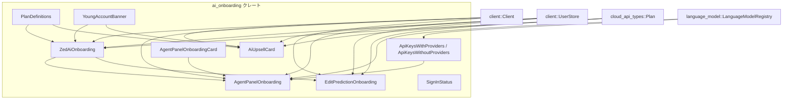
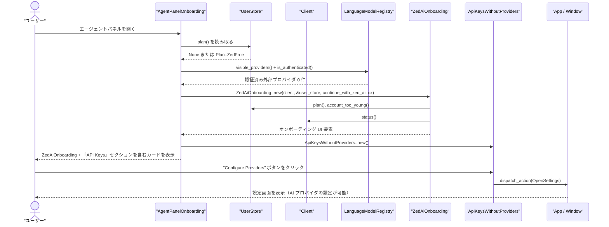

# ai_onboarding/ ディレクトリ解説

## 1. ざっくり一言

`ai_onboarding` クレートは、Zed の「AI 関連機能のオンボーディング／アップセル」を行う UI コンポーネント群をまとめたモジュールです。  
ユーザーのサインイン状態・契約プラン・アカウント年齢・外部 AI プロバイダの設定状況に応じて、適切な説明やボタンを表示します。

---

## 2. このモジュールの役割

### 2.1 概要

- このクレートは **Zed AI / Zed Pro をどのように使い始めるか** を案内する各種バナーやカードを提供します。
- ユーザーの状態に応じて:
  - サインインを促す
  - Free / Pro / Trial / Business / Student の各プランの内容を説明する
  - Zed AI と GitHub Copilot や外部 API プロバイダの選択肢を提示する
  - 若いアカウント（作成から30日未満）向けの制限表示を行う
- これらの UI はすべて `gpui` / `ui` ベースのコンポーネントとして実装され、他の画面から再利用できるようになっています。

### 2.2 アーキテクチャ内での位置づけ

このクレート内の主要コンポーネントと、外部依存との関係を図にまとめます。



- `ai_onboarding::ai_onboarding.rs` がルートモジュールで、他のモジュールを `pub use` して公開 API をまとめています。
- `ZedAiOnboarding` と `AiUpsellCard` が中心的な「プラン説明／アップセル」コンポーネントです。
- `AgentPanelOnboarding` や `EditPredictionOnboarding` は、特定のコンテキスト（エージェントパネル／編集予測）に合わせて上記コンポーネントを組み合わせたものです。
- `LanguageModelRegistry` のイベント購読により、外部 AI プロバイダの設定状況に応じた案内をリアルタイムに切り替えます。

### 2.3 設計上のポイント

コードから読み取れる特徴をまとめます。

- **状態は外部ストアに集約**
  - サインイン状態やプラン情報は `client::Client` と `UserStore` から読み取ります。
  - コンポーネント自身は、必要最小限のフラグ（例: `account_too_young`, `has_configured_providers`）のみを保持し、表示時にストアを読み直す設計です。

- **コールバックによる制御の外部化**
  - 「Zed AI で続行」「Copilot を使う」「オンボーディングを閉じる」などの操作は、
    `Arc<dyn Fn(&mut Window, &mut App)>` のコールバックとして親側に委ねられています。
  - これにより、UI コンポーネントは「何を表示するか」に集中し、画面遷移や設定変更などの具体的な挙動は外側が決められる構造になっています。

- **プラン定義の集中管理**
  - 各プランの説明文（箇条書き）は `PlanDefinitions` に集約され、複数コンポーネントから再利用されています。
  - 文言やプラン条件の変更を一箇所で行えるように整理されています。

- **外部プロバイダと Zed AI の共存**
  - `LanguageModelRegistry` に登録された「環境変数由来の API プロバイダ」を検出し、
    それがある場合は「サインインせずに外部プロバイダを使える」ことを案内します。
  - これがない場合には「API キーを設定してください」という案内を追加するなど、
    Zed Cloud / 外部プロバイダの両方を考慮しています。

---

## 3. 主要な機能一覧

このクレートが提供する主な機能を列挙します。

- **ZedAiOnboarding**
  - サインイン状態とプランに応じて、Zed AI / Zed Pro / Trial / Business / Student の説明と開始ボタンを表示するカード。
  - 若いアカウント向けの制限表示や、オンボーディングの dismiss ボタンも含みます。

- **AiUpsellCard**
  - 初回起動などで表示される、Zed AI の機能を分かりやすく比較・案内するアップセルカード。
  - Free vs Pro の比較、Trial の案内、プランごとの恩恵の可視化を行います。

- **AgentPanelOnboarding / AgentPanelOnboardingCard**
  - エージェントパネル内のオンボーディングカード。
  - `ZedAiOnboarding` に加えて、必要に応じて API キー設定案内 (`ApiKeysWithoutProviders`) を組み合わせます。

- **EditPredictionOnboarding**
  - 編集予測（Edit prediction）機能のオンボーディング。
  - Free プランの場合は Zed AI と GitHub Copilot のどちらを使うか選択肢を提示します。

- **ApiKeysWithProviders / ApiKeysWithoutProviders**
  - 現在の環境から検出された外部 AI プロバイダ（API キー）を一覧表示するカード。
  - 何も設定されていない場合に「API キーを設定してください」と案内するカード。

- **PlanDefinitions**
  - Free / Pro / Pro Trial / Business / Student 各プランの説明箇条書きと、
    Zed AI 全体の説明文 (`AI_DESCRIPTION`) を集中管理するヘルパー。

- **YoungAccountBanner**
  - アカウント作成から 30 日未満のユーザー向けに、「Trial は使えないが例外申請が可能」であることを案内する警告バナー。

---

## 4. 関数・構造体の解説

### 4.1 型一覧（構造体・列挙体など）

| 名前 | 種別 | 役割 / 用途 |
|------|------|-------------|
| `SignInStatus` | 列挙体 | `client::Status` を UI 向けの `SignedIn / SigningIn / SignedOut` の3状態にマッピングしたもの |
| `ZedAiOnboarding` | 構造体 | Zed AI / 各種プランのオンボーディングカード本体。`RegisterComponent`・`IntoElement` を実装 |
| `AiUpsellCard` | 構造体 | 初回オンボーディングなどで表示される AI アップセルカード。サインイン状態・プランに応じて内容が変化 |
| `AgentPanelOnboarding` | 構造体 | エージェントパネル内のオンボーディング用コンポーネント。`ZedAiOnboarding` と API キー案内を組み合わせて表示 |
| `AgentPanelOnboardingCard` | 構造体 | エージェントパネルオンボーディング用のカードレイアウト（枠・背景・装飾）のみを担当 |
| `ApiKeysWithProviders` | 構造体 | 環境から検出された認証済み AI プロバイダを一覧表示する UI コンポーネント |
| `ApiKeysWithoutProviders` | 構造体 | 外部 AI プロバイダが一つも設定されていない場合の案内カード（設定画面へのボタン付き） |
| `EditPredictionOnboarding` | 構造体 | 編集予測機能オンボーディング。Zed AI + （Free プラン時のみ）GitHub Copilot の選択肢を提示 |
| `PlanDefinitions` | ユニット構造体 | 各プランの説明リストおよび AI 全体の説明文を生成するヘルパー |
| `YoungAccountBanner` | 構造体 | 若いアカウント（30日未満）向けの制限説明バナー |

### 4.2 重要な関数・メソッドの詳細（最大 7 件）

#### 4.2.1 `ZedAiOnboarding::new(client, user_store, continue_with_zed_ai, cx) -> ZedAiOnboarding`

**概要**

- `Client` と `UserStore` から現在のサインイン状態・プラン・アカウント年齢を読み取り、`ZedAiOnboarding` のフィールドを初期化します。
- サインインボタン用のコールバックもここで構築されます。

**引数**

| 引数名 | 型 | 説明 |
|--------|----|------|
| `client` | `Arc<Client>` | 現在のサインイン状態を提供し、サインイン処理も担当するクライアント |
| `user_store` | `&Entity<UserStore>` | プラン・アカウント年齢などアカウント関連情報を保持するストア |
| `continue_with_zed_ai` | `Arc<dyn Fn(&mut Window, &mut App)>` | 「Zed AI で続ける」操作を行ったときに呼び出されるコールバック |
| `cx` | `&mut App` | `gpui` のアプリケーションコンテキスト。サインイン処理の spawn に利用 |

**戻り値**

- 現在のユーザー状態に応じたフィールドが設定された `ZedAiOnboarding` インスタンス。

**内部処理の流れ**

1. `user_store.read(cx)` で `UserStore` のスナップショットを取得し、`plan()` と `account_too_young()` を読み取ります。
2. `client.status().borrow()` で `client::Status` を取得し、`SignInStatus` へ `From` 実装で変換します。
3. 受け取った `continue_with_zed_ai` をそのままフィールドに格納します。
4. `sign_in` フィールドには、`client.sign_in_with_optional_connect(true, cx).await` を非同期に実行するクロージャを設定します。
   - このクロージャは `cx.spawn(...).detach_and_log_err(cx)` を通じて実行されます。
5. `dismiss_onboarding` は `None`（閉じるボタンなし）で初期化します。

**Examples（使用例）**

プレビューと同様に、`new` を経由せず明示的にフィールドを埋めて使う例です（実際のアプリコードでは `new` を使うケースが多いと考えられます）。

```rust
use std::sync::Arc;
use ai_onboarding::{ZedAiOnboarding, SignInStatus};
use cloud_api_types::Plan;
use gpui::AnyElement;
use ui::prelude::*;

// Free プラン・サインイン済みユーザー向けのオンボーディングカード
fn free_plan_example() -> AnyElement {
    ZedAiOnboarding {
        sign_in_status: SignInStatus::SignedIn,     // サインイン済み
        plan: Some(Plan::ZedFree),                 // Free プラン
        account_too_young: false,                  // アカウント年齢制限なし
        continue_with_zed_ai: Arc::new(|_, _| {
            // Zed AI を使い続けるときの処理をここに書く
        }),
        sign_in: Arc::new(|_, _| {
            // この状態では使われないが、フィールドとしては必須
        }),
        dismiss_onboarding: None,
    }
    .into_any_element()
}
```

**Errors / Panics**

- 関数自体は `Result` を返さず、明示的なエラーはありません。
- `sign_in` コールバック内の `sign_in_with_optional_connect` のエラーは `detach_and_log_err` によりログ記録されますが、呼び出し元には返されません。

**Edge cases（エッジケース）**

- `user_store.plan()` が `None` の場合
  - `plan` フィールドは `None` となり、後述の `render` では Free プラン相当として扱われます。
- `client::Status` がサインイン中（`is_signing_in()`）の場合
  - `sign_in_status` は `SigningIn` になり、`render` 側で「未サインイン扱い」と同じ分岐に入ります。

**使用上の注意点**

- `continue_with_zed_ai` には、**本当にオンボーディングを完了させる処理**（パネルを閉じる、状態を書き換えるなど）を渡す必要があります。何もしないクロージャを渡すと UI 上はボタンが動いているように見えても状態は変わりません。
- `client` や `user_store` は、コンポーネントのライフタイム中有効であることが前提です。

---

#### 4.2.2 `impl RenderOnce for ZedAiOnboarding::render(self, _window, cx) -> impl IntoElement`

**概要**

- `ZedAiOnboarding` のフィールド（サインイン状態・プラン・アカウント年齢）に基づき、実際のオンボーディング UI を構築して返します。

**引数**

| 引数名 | 型 | 説明 |
|--------|----|------|
| `self` | `ZedAiOnboarding` | 表示対象の状態を全て含んだ構造体 |
| `_window` | `&mut ui::Window` | ウィンドウハンドル（この関数では直接利用していません） |
| `cx` | `&mut App` | テーマ色などの UI 情報取得、および URL オープン等に利用 |

**戻り値**

- 現在の状態に応じた UI ツリー（`impl IntoElement`）。

**内部処理の流れ**

1. `sign_in_status` が `SignedIn` かどうかを判定します。
2. `SignedIn` の場合は `plan` に応じて分岐:
   - `None` または `Some(Plan::ZedFree)` → `render_free_plan_state(cx)`
   - `Some(Plan::ZedProTrial)` → `render_trial_state(cx)`
   - `Some(Plan::ZedPro)` → `render_pro_plan_state(cx)`
   - `Some(Plan::ZedBusiness)` → `render_business_plan_state(cx)`
   - `Some(Plan::ZedStudent)` → `render_student_plan_state(cx)`
3. `SignedIn` 以外（`SigningIn` / `SignedOut`）の場合は `render_sign_in_disclaimer(cx)` を呼び出します。

**Examples（使用例）**

`preview` 実装内のパターンがそのまま使用例になっています。

```rust
use std::sync::Arc;
use ai_onboarding::{ZedAiOnboarding, SignInStatus};
use cloud_api_types::Plan;
use gpui::AnyElement;

// Preview 用の例と同様に、任意の状態で UI を生成できる
fn onboarding_preview_example() -> AnyElement {
    ZedAiOnboarding {
        sign_in_status: SignInStatus::SignedIn,
        plan: Some(Plan::ZedProTrial),
        account_too_young: false,
        continue_with_zed_ai: Arc::new(|_, _| {}),
        sign_in: Arc::new(|_, _| {}),
        dismiss_onboarding: None,
    }
    .into_any_element()
}
```

**Errors / Panics**

- `render` 自体はエラーを返さず、明示的な `panic!` も含まれていません。

**Edge cases**

- `SigningIn` のときも `SignedOut` と同様に「サインインを促す UI」が表示されます。
- `plan` が `None` でも `SignedIn` なら Free プラン相当として扱われ、無料プラン＋Trial の説明が表示されます。

**使用上の注意点**

- `plan` と `sign_in_status` の組み合わせが不整合（例: `SignedOut` だが `Some(Plan::ZedPro)`）でもコンパイル上は問題ありませんが、この関数では「サインイン状態」を優先して分岐するため、プラン情報は無視されます。  
  → 一貫した状態を渡すのが前提です。

---

#### 4.2.3 `AiUpsellCard::new(client, user_store, user_plan, cx) -> AiUpsellCard`

**概要**

- サインイン状態とアカウント年齢を `Client` / `UserStore` から取得し、AI アップセルカード用の `AiUpsellCard` インスタンスを構築します。
- サインインボタン用のコールバックを `client` から生成します。

**引数**

| 引数名 | 型 | 説明 |
|--------|----|------|
| `client` | `Arc<Client>` | サインイン状態・サインイン処理を提供するクライアント |
| `user_store` | `&Entity<UserStore>` | ユーザーのアカウント情報（年齢など）を格納するストア |
| `user_plan` | `Option<Plan>` | 表示に用いるプラン情報（呼び出し側が選択して渡す） |
| `cx` | `&mut App` | サインイン処理の spawn に利用 |

**戻り値**

- `AiUpsellCard` インスタンス。

**内部処理の流れ**

1. `client.status().borrow()` から `client::Status` を取得し、`SignInStatus` へ変換します。
2. `user_store.read(cx)` から `account_too_young()` を読み取り、若いアカウントかどうかを判定します。
3. `sign_in` フィールドには、`client.sign_in_with_optional_connect(true, cx)` を実行するクロージャを設定します。
4. `user_plan` は引数で渡された値をそのままフィールドに保存します。
5. `tab_index` は `None` で初期化します。

**Examples（使用例）**

```rust
use std::sync::Arc;
use ai_onboarding::AiUpsellCard;
use cloud_api_types::Plan;
use client::{Client, UserStore};
use gpui::{App, Entity};
use ui::prelude::*;

// サインイン済み Free プランユーザー向けのアップセルカード
fn build_ai_upsell_card(
    client: Arc<Client>,
    user_store: &Entity<UserStore>,
    cx: &mut App,
) -> impl IntoElement {
    AiUpsellCard::new(client, user_store, Some(Plan::ZedFree), cx)
        .tab_index(Some(0))  // Tab フォーカスの順序を指定
}
```

**Errors / Panics**

- 関数自体はエラーを返しません。
- サインイン処理中のエラーは `detach_and_log_err` によってログ記録されます。

**Edge cases**

- `user_plan` と `SignInStatus` が不整合でもそのままインスタンスが作られます。描画時の分岐は `sign_in_status` を優先し、SignedOut/SigningIn の場合は常に「サインインを促す UI」が表示されます。
- `account_too_young` が `true` かつ Free プランの場合、Trial 案内ではなく「Pro へのアップグレード」ボタンが表示されます。

**使用上の注意点**

- `user_plan` は `UserStore` から自動取得されず、呼び出し側で決めて渡す設計です。実際の契約状況と表示がずれないように注意する必要があります。
- `sign_in` コールバックを自前で上書きする場合は、`AiUpsellCard::new` の実装を参考に、`Client` を使った正しいサインイン処理を行う必要があります。

---

#### 4.2.4 `impl RenderOnce for AiUpsellCard::render(self, _window, cx) -> impl IntoElement`

**概要**

- `AiUpsellCard` のフィールド（サインイン状態・プラン・アカウント年齢）にもとづいて、アップセルカードの UI を構築します。
- Free / Pro / Trial / Business / Student / サインアウト時など、すべてのパターンの表示をここで切り替えます。

**引数**

| 引数名 | 型 | 説明 |
|--------|----|------|
| `self` | `AiUpsellCard` | 表示対象の状態 |
| `_window` | `&mut Window` | ウィンドウハンドル（ここでは未使用） |
| `cx` | `&mut App` | テーマ色・背景パターン・URL オープンに利用 |

**戻り値**

- アップセルカードの UI（`impl IntoElement`）。

**内部処理の流れ（概要）**

1. 共通部品を構築:
   - Pro セクション（ラベル「Pro」＋ `PlanDefinitions.pro_plan()`）。
   - Free セクション（ラベル「Free」＋ `PlanDefinitions.free_plan()`）。
   - 背景グリッドパターン・グラデーション。
   - Trial / Pro プラン向けのスタンプ（`VectorName::ProUserStamp` など）。
2. `sign_in_status` が `SignedIn` かどうかで大きく分岐。
3. `SignedIn` の場合、`user_plan` によって更に分岐:
   - `None` / `Some(ZedFree)`:
     - `account_too_young` が `true` の場合:
       - `YoungAccountBanner` を表示し、Pro プランへの直接アップグレードボタンを表示。
     - `account_too_young` が `false` の場合:
       - Free / Pro の比較、Trial の説明、Trial 開始ボタンを表示。
   - `Some(ZedProTrial)`:
     - Trial 用スタンプと「14 日間の Trial 内容」のリストを表示。
   - `Some(ZedPro)` / `ZedBusiness` / `ZedStudent`:
     - 該当プラン用スタンプと、「現在のプランで得られる機能」のリストを表示。
4. `SignedOut` / `SigningIn` の場合:
   - Free / Pro 比較と説明文を表示し、「Sign In」ボタンを表示。
   - ボタン押下時に `sign_in` コールバックを呼び出し、`telemetry::event!` でイベントを記録します。

**Examples（使用例）**

`preview` 関数での利用パターンがそのまま参考になります。

```rust
use std::sync::Arc;
use ai_onboarding::{AiUpsellCard, SignInStatus};
use cloud_api_types::Plan;
use gpui::AnyElement;

// Pro プラン状態のプレビュー例
fn pro_preview() -> AnyElement {
    AiUpsellCard {
        sign_in_status: SignInStatus::SignedIn,
        sign_in: Arc::new(|_, _| {}),  // preview 用に no-op
        account_too_young: false,
        user_plan: Some(Plan::ZedPro),
        tab_index: Some(1),
    }
    .into_any_element()
}
```

**Errors / Panics**

- `render` 内に明示的な `panic!` は存在しません。
- ボタン押下時に呼ばれるコールバックが外側で `panic!` する可能性はありますが、このモジュールからは制御できません。

**Edge cases**

- `sign_in_status` が `SigningIn` でも「SignedOut と同じ UI」が表示される点に注意が必要です。
- `user_plan` が `Some(Plan::ZedBusiness)` / `ZedStudent` の場合でも、Free/Pro 比較セクションは表示されません。代わりに、そのプラン専用の説明のみが表示されます。

**使用上の注意点**

- Trial 開始ボタンは `zed_urls::start_trial_url(cx)` をブラウザで開く実装になっています。UI 上の Trial 開始と実際の課金状態が一致するよう、外部システム側の設定との整合性に注意が必要です。
- サインインボタンと Trial 開始ボタンはいずれも `telemetry::event!` を送出します。イベント名・属性はハードコードされているため、追跡や分析の前提として使われます。

---

#### 4.2.5 `AgentPanelOnboarding::new(user_store, client, continue_with_zed_ai, cx) -> AgentPanelOnboarding`

**概要**

- エージェントパネル用オンボーディングコンポーネントを初期化します。
- `LanguageModelRegistry` に対する購読を設定し、外部 AI プロバイダの設定状況に応じて挙動を変えるためのフラグを管理します。

**引数**

| 引数名 | 型 | 説明 |
|--------|----|------|
| `user_store` | `Entity<UserStore>` | プラン情報を読み取るストア |
| `client` | `Arc<Client>` | Zed AI オンボーディングに渡すクライアント |
| `continue_with_zed_ai` | `impl Fn(&mut Window, &mut App) + 'static` | 「Zed AI で続ける」操作時に呼ばれるコールバック |
| `cx` | `&mut Context<Self>` | コンポーネントコンテキスト。`LanguageModelRegistry` 購読に利用 |

**戻り値**

- 初期状態の `AgentPanelOnboarding`。

**内部処理の流れ**

1. `LanguageModelRegistry::global(cx)` に対して `cx.subscribe` を行い、以下のイベントを監視します:
   - `ProviderStateChanged`
   - `AddedProvider`
   - `RemovedProvider`
   - `ProvidersChanged`
2. 上記イベントのいずれかを受け取った場合、`has_configured_providers` を `Self::has_configured_providers(cx)` で再計算します。
3. 最初の値としても `Self::has_configured_providers(cx)` を呼び出して `has_configured_providers` をセットします。
4. 受け取った `user_store`, `client`, `continue_with_zed_ai` をそのままフィールドに保存します。

**Errors / Panics**

- `cx.subscribe(...).detach()` を利用しているため、購読登録のエラーはここでは扱われていません（`gpui` 側の実装に依存します）。
- 明示的な `panic!` はありません。

**Edge cases**

- 認証済みプロバイダの判定には `provider.is_authenticated(cx)` と `provider.id() != ZED_CLOUD_PROVIDER_ID` が使われています。
  - つまり、**Zed Cloud プロバイダは「外部プロバイダ」としてカウントされません**。
- `LanguageModelRegistry` にプロバイダが一つもない場合や、すべて未認証の場合、`has_configured_providers` は `false` になります。

**使用上の注意点**

- `new` の中で購読を行うため、**同じインスタンスに対しては `new` を一度だけ呼び出す**前提の設計と考えられます。  
  （`render` のたびに `new` し直すと、購読が何度も追加される可能性があります。具体的なライフサイクルは本チャンク外の `gpui` フレームワークに依存します。）

---

#### 4.2.6 `impl Render for AgentPanelOnboarding::render(&mut self, _window, cx) -> impl IntoElement`

**概要**

- エージェントパネル内のオンボーディングカードを組み立てます。
- ユーザーのプランと外部プロバイダの有無に応じて、API キー案内を表示するかどうかを切り替えます。

**引数**

| 引数名 | 型 | 説明 |
|--------|----|------|
| `&mut self` | `AgentPanelOnboarding` | 内部状態（`has_configured_providers` など）を持つインスタンス |
| `_window` | `&mut Window` | 未使用 |
| `cx` | `&mut Context<Self>` | `UserStore` 読み取り・子コンポーネント構築に利用 |

**戻り値**

- エージェントパネル用オンボーディングカード（`impl IntoElement`）。

**内部処理の流れ**

1. `user_store.read(cx).plan()` を読み取り、以下のブール値を算出:
   - `enrolled_in_trial`: `Plan::ZedProTrial` のとき `true`
   - `is_pro_user`: `Plan::ZedPro` のとき `true`
2. `AgentPanelOnboardingCard::new()` でカードの枠を作り、子要素として `ZedAiOnboarding::new(...)` を追加します。
   - `continue_with_zed_ai` はフィールドから渡されます。
   - `with_dismiss` で dismiss ボタン押下時にも `continue_with_zed_ai` を呼ぶよう設定します。
3. 最後に `.map(|this| { ... })` で、必要に応じて `ApiKeysWithoutProviders::new()` をカードの末尾に追加します。
   - 追加条件:  
     `!enrolled_in_trial && !is_pro_user && !self.has_configured_providers`

**Edge cases**

- `Plan::ZedBusiness` / `Plan::ZedStudent` の場合:
  - `enrolled_in_trial` と `is_pro_user` は `false` になるため、`has_configured_providers` が `false` なら API キー案内が表示されます。
- `plan()` が `None` の場合:
  - Pro/Trial 判定はどちらも `false` となるので、外部プロバイダが未設定なら API キー案内が追加されます。

**使用上の注意点**

- dismiss ボタンと `continue_with_zed_ai` コールバックは同じものを呼び出す設計になっています。  
  → dismiss でどのような状態遷移を行うかは、呼び出し側で明確に決めておく必要があります。

---

#### 4.2.7 `ApiKeysWithProviders::new(cx: &mut Context<Self>) -> ApiKeysWithProviders`

**概要**

- 現在の `LanguageModelRegistry` から、「認証済みかつ Zed Cloud 以外」のプロバイダ一覧を読み取り、そのリストを内部状態として保持するコンポーネントを初期化します。
- レジストリの変更イベントに購読し、リストを自動更新します。

**引数**

| 引数名 | 型 | 説明 |
|--------|----|------|
| `cx` | `&mut Context<Self>` | `LanguageModelRegistry` 購読とテーマ取得に利用 |

**戻り値**

- 初期状態の `ApiKeysWithProviders`。

**内部処理の流れ**

1. `LanguageModelRegistry::global(cx)` に対して `cx.subscribe` を設定し、以下のイベントで `configured_providers` を更新するよう登録します:
   - `ProviderStateChanged`
   - `AddedProvider`
   - `RemovedProvider`
   - `ProvidersChanged`
2. `Self::compute_configured_providers(cx)` を呼び出して、初期の `configured_providers` ベクタを構築します。

`compute_configured_providers` の処理:

1. `LanguageModelRegistry::read_global(cx).visible_providers()` を取得します。
2. 各プロバイダに対して、`is_authenticated(cx)` が `true` であり、かつ `id() != ZED_CLOUD_PROVIDER_ID` のもののみをフィルタします。
3. それぞれの `(IconOrSvg, SharedString)` （アイコンと表示名）タプルを作り、`Vec` に収集します。

**Examples（使用例）**

直接の使用例はこのチャンクにはありませんが、`Render` 実装により UI 要素として利用できます。

```rust
use ai_onboarding::ApiKeysWithProviders;
use gpui::Render;
use ui::prelude::*;

// 親コンポーネントの一部として、現在の外部プロバイダ一覧を表示する
impl Render for MyComponent {
    fn render(&mut self, _window: &mut Window, cx: &mut Context<Self>) -> impl IntoElement {
        // 注意: 実際の gpui の使い方はこのチャンク外の設計に依存します
        let api_keys = ApiKeysWithProviders::new(cx);
        v_flex().child(api_keys)
    }
}
```

（上のコードは概念的な例であり、`Render` を実装した型をどのように子要素として扱うかは `gpui` の設計に依存します。）

**Errors / Panics**

- 明示的なエラーや `panic!` はありません。
- `LanguageModelRegistry::read_global(cx)` がどのような前提で利用されるかは、このチャンク外（`language_model` クレート）の実装に依存します。

**Edge cases**

- 一つも該当プロバイダがない場合、`configured_providers` は空ベクタとなり、UI 上では案内テキストのみが表示され、リスト部分は空になります。
- プロバイダが Zed Cloud のみの場合も同様に空扱いです。

**使用上の注意点**

- 認証済みかつ Zed Cloud 以外のプロバイダのみを対象としているため、Zed Cloud の状態をこのカードから確認することはできません。
- 環境変数などからプロバイダを追加／削除した場合も、イベント購読により自動更新されます。

---

### 4.3 その他の関数・メソッド

主要ロジック以外の関数を一覧で整理します。

| 関数 / メソッド名 | 役割（1 行） |
|-------------------|--------------|
| `impl From<client::Status> for SignInStatus` | `client::Status` を `SignedIn / SigningIn / SignedOut` の 3 状態に変換する。サインイン中かサインアウトかを優先して判定 |
| `ZedAiOnboarding::with_dismiss` | dismiss ボタン押下時に呼ばれるコールバックを設定し、閉じるアイコンを表示可能にする |
| `ZedAiOnboarding::render_sign_in_disclaimer` | サインインしていないユーザー向けに Trial の案内とサインインボタンを表示する内部ヘルパー |
| `ZedAiOnboarding::render_free_plan_state` | Free プラン（またはプラン未設定）のユーザー向け UI を構築。若いアカウントかどうかで表示が変わる |
| `ZedAiOnboarding::render_trial_state` | Pro Trial 中のユーザー向けに「14 日間の内容」を説明する UI を構築 |
| `ZedAiOnboarding::render_pro_plan_state` | Pro プランユーザー向けに利用可能な機能のリストを表示 |
| `ZedAiOnboarding::render_business_plan_state` | Business プランユーザー向けに利用可能な機能のリストを表示 |
| `ZedAiOnboarding::render_student_plan_state` | Student プランユーザー向けに利用可能な機能のリストを表示 |
| `impl Component for ZedAiOnboarding::preview` | 異なるサインイン状態・プランごとの UI をまとめてプレビュー表示するためのサンプルコンポーネント |
| `AiUpsellCard::tab_index` | ボタンの `tab_index` を設定するビルダーメソッド |
| `impl Component for AiUpsellCard::preview` | SignedOut/Free/Trial/各有料プランの状態ごとのアップセルカードをプレビューするための UI |
| `EditPredictionOnboarding::new` | 編集予測用オンボーディングのフィールドを初期化（購読などは行わない） |
| `impl Render for EditPredictionOnboarding::render` | Free プランの場合に Zed AI の案内と GitHub Copilot の案内を組み合わせて表示する |
| `PlanDefinitions::free_plan` | Free プランの特徴（2000 回の edit prediction など）を箇条書きで返す |
| `PlanDefinitions::pro_trial` | Pro Trial の特徴（Unlimited edit prediction, $20 tokens, 期間の有無など）を箇条書きで返す |
| `PlanDefinitions::pro_plan` | Pro プランの特徴（Unlimited edit prediction, $5 tokens など）を箇条書きで返す |
| `PlanDefinitions::business_plan` | Business プランの特徴を箇条書きで返す |
| `PlanDefinitions::student_plan` | Student プランの特徴を箇条書きで返す |
| `YoungAccountBanner::render` | 若いアカウント向けの警告バナー（例外申請先メールアドレス付き）を表示する |

※ `PlanDefinitions` のメソッドはこのファイルでは `&self` レシーバを取るインスタンスメソッドとして定義されています。呼び出し側の詳細はこのチャンク外の挙動に依存するため、ここでは「各プランの箇条書きを返すヘルパー」として理解します。

---

## 5. データフロー

ここでは、「エージェントパネルを開いた Free プランユーザーが、外部プロバイダを設定していない場合」のデータフローを例に説明します。

1. ユーザーがエージェントパネルを開くと、`AgentPanelOnboarding` がレンダリングされます。
2. `AgentPanelOnboarding` は `UserStore` からプラン（ここでは `None` または `ZedFree`）を読み取ります。
3. 同時に、`LanguageModelRegistry` から認証済みの外部プロバイダがあるかどうかを判定します（ここでは 0 個）。
4. `ZedAiOnboarding::new` が呼ばれ、`Client` / `UserStore` からサインイン状態やアカウント年齢が読み取られ、オンボーディングカードの本体が構築されます。
5. Free プランかつ外部プロバイダがないため、`AgentPanelOnboarding` はカードの末尾に `ApiKeysWithoutProviders` を追加します。
6. ユーザーが「Configure Providers」ボタンを押すと、`zed_actions::agent::OpenSettings` アクションが dispatch され、設定画面が開きます。

これを sequence diagram で示します。



このように、ユーザーのプラン・プロバイダ設定状況に応じて、Zed AI の案内と API キーの案内が一つのカードにまとめて表示されます。

---

## 6. 使い方（How to Use）

### 6.1 基本的な使用方法

ここでは、代表的なコンポーネントの基本的な使い方を簡単なコード例で示します。

#### 6.1.1 ZedAiOnboarding を単体で使う

```rust
use std::sync::Arc;
use ai_onboarding::{ZedAiOnboarding, SignInStatus};
use cloud_api_types::Plan;
use gpui::AnyElement;
use ui::prelude::*;

// Zed AI のオンボーディングカードを描画する簡単な例
fn zed_ai_onboarding_card() -> AnyElement {
    ZedAiOnboarding {
        sign_in_status: SignInStatus::SignedIn,  // サインイン済み
        plan: Some(Plan::ZedFree),              // Free プラン
        account_too_young: false,
        continue_with_zed_ai: Arc::new(|_, _| {
            // エージェントパネルを閉じる、などの処理
        }),
        sign_in: Arc::new(|_, _| {
            // この状態では呼ばれないが、必須フィールド
        }),
        dismiss_onboarding: None,
    }
    .into_any_element()
}
```

実際のアプリケーションでは、`ZedAiOnboarding::new(client, &user_store, continue_with_zed_ai, cx)` を用いて
現在のユーザー状態に基づいたインスタンスを生成することが多いと考えられます。

#### 6.1.2 AiUpsellCard を使う

```rust
use std::sync::Arc;
use ai_onboarding::{AiUpsellCard};
use cloud_api_types::Plan;
use client::{Client, UserStore};
use gpui::{App, Entity};
use ui::prelude::*;

// サインアウト状態で Free プラン向けのアップセルカードを生成する
fn ai_upsell_for_free_user(
    client: Arc<Client>,
    user_store: &Entity<UserStore>,
    cx: &mut App,
) -> impl IntoElement {
    AiUpsellCard::new(client, user_store, Some(Plan::ZedFree), cx)
        .tab_index(Some(0))
}
```

`AiUpsellCard` は `IntoElement` を実装しているため、そのまま `.child(...)` や `.children(...)` の引数として利用できます。

#### 6.1.3 PlanDefinitions を使う

```rust
use ai_onboarding::PlanDefinitions;
use gpui::IntoElement;

// Pro プランの説明箇条書きを任意のカード内に埋め込む例
fn pro_plan_features() -> impl IntoElement {
    let defs = PlanDefinitions;   // ユニット構造体なのでそのまま値として使う
    defs.pro_plan()              // Pro プランの List を返す
}
```

このリストを `v_flex()` などの子要素として利用することで、プラン説明を簡単に再利用できます。

#### 6.1.4 ApiKeysWithoutProviders を使う

```rust
use ai_onboarding::ApiKeysWithoutProviders;
use gpui::IntoElement;

// 外部プロバイダが一つも設定されていない場合の案内セクション
fn api_keys_section() -> impl IntoElement {
    ApiKeysWithoutProviders::new()
}
```

このコンポーネントは `RenderOnce` を実装しており、押下時に設定画面を開くボタンを含んでいます。

---

### 6.2 よくある使用パターン

#### パターン 1: エージェントパネルでのオンボーディング

- `AgentPanelOnboarding` を使って、エージェントパネル上部にオンボーディングカードを表示する。
- ユーザーが Pro Trial 中 or Pro ユーザー or 外部プロバイダ設定済みの場合:
  - `ZedAiOnboarding` のみを表示。
- Free プランかつ外部プロバイダ未設定の場合:
  - `ZedAiOnboarding` に加え、API キー設定案内 (`ApiKeysWithoutProviders`) を追加表示。

#### パターン 2: 初回起動時の AI アップセル

- `AiUpsellCard` を使用して、Free vs Pro の比較と Trial 開始／サインインボタンを提示。
- `SignInStatus` と `user_plan` を現在のユーザー状態に応じて渡すことで、プレビューに近い多様な状態を簡単に再現できます。

#### パターン 3: 編集予測機能オンボーディング

- `EditPredictionOnboarding` を使い、Free プランの場合に:
  - 上部に `ZedAiOnboarding` で Zed AI の案内。
  - 下部に GitHub Copilot の案内と「Use / Configure Copilot」ボタン。
- Pro など Free 以外のプランでは Copilot 部分は表示されず、Zed AI の説明に集中します。

---

### 6.3 よくある間違い

#### 例 1: サインインコールバックを何もしないままにする

```rust
use std::sync::Arc;
use ai_onboarding::{AiUpsellCard, SignInStatus};
use cloud_api_types::Plan;

// 間違い例: サインインボタンが何も行わない
let card = AiUpsellCard {
    sign_in_status: SignInStatus::SignedOut,
    sign_in: Arc::new(|_, _| {
        // 何もしない -> ユーザーがクリックしてもサインインが開始されない
    }),
    account_too_young: false,
    user_plan: Some(Plan::ZedFree),
    tab_index: Some(0),
};
```

```rust
use client::Client;
use gpui::App;

// 正しい例: Client を使って sign_in_with_optional_connect を呼び出す
let client = client.clone();
let card = AiUpsellCard {
    sign_in_status: SignInStatus::SignedOut,
    sign_in: Arc::new(move |_window, cx: &mut App| {
        cx.spawn({
            let client = client.clone();
            async move |cx| client.sign_in_with_optional_connect(true, cx).await
        })
        .detach_and_log_err(cx);
    }),
    account_too_young: false,
    user_plan: Some(Plan::ZedFree),
    tab_index: Some(0),
};
```

#### 例 2: `SignInStatus` と `plan` の組み合わせが不整合

```rust
use ai_onboarding::{ZedAiOnboarding, SignInStatus};
use cloud_api_types::Plan;

// 間違い例: サインアウト状態なのに Pro プランを指定
let onboarding = ZedAiOnboarding {
    sign_in_status: SignInStatus::SignedOut,
    plan: Some(Plan::ZedPro),
    // ... 省略 ...
    account_too_young: false,
    continue_with_zed_ai: Arc::new(|_, _| {}),
    sign_in: Arc::new(|_, _| {}),
    dismiss_onboarding: None,
};
```

この場合、`render` では「サインインしていない」分岐が選ばれ、`Plan::ZedPro` は全く反映されません。  
→ 呼び出し側で状態が食い違わないように揃えておく必要があります。

---

### 6.4 使用上の注意点（まとめ）

- **gpui / ui コンテキストの前提**
  - すべてのコンポーネントは `gpui` と `ui::prelude::*` に依存しており、Zed の UI フレームワーク内で動くことが前提です。
  - 独立した CLI や別 UI フレームワークで再利用することは想定されていません。

- **外部ストア・グローバル状態への依存**
  - `Client`, `UserStore`, `LanguageModelRegistry` など外部の状態を前提としているため、それらが適切に初期化されていない環境でコンポーネントを作成すると、想定外の挙動になる可能性があります。

- **イベント購読のライフサイクル**
  - `AgentPanelOnboarding` と `ApiKeysWithProviders` は `LanguageModelRegistry` に購読を設定します。
  - それぞれの `new` は「一度だけ呼ぶ」ことを前提とした設計と解釈できるため、再生成のタイミングには注意が必要です（詳細なライフサイクルは `gpui` 側に依存し、このチャンクからは分かりません）。

- **若いアカウントの扱い**
  - `account_too_young` が `true` の場合、Trial を案内せず Pro アップグレードや例外申請を案内する UI になります。
  - 「どの条件で young と判断するか」は `UserStore` 側の実装に依存します。

- **Telemetry と URL オープン**
  - Trial 開始・サインイン・Pro アップグレードなど多くのボタンは `telemetry::event!` を送出し、`zed_urls` の URL をブラウザで開きます。
  - 実運用時には、これらのイベント名・URL に対する分析や課金ロジックとの整合性に注意する必要があります。

---

## 7. 関連ファイル

このディレクトリ内のファイルと役割を一覧します。

| パス | 役割 / 関係 |
|------|-------------|
| `ai_onboarding/Cargo.toml` | クレート名・バージョン・依存クレート・ライブラリのエントリポイント (`src/ai_onboarding.rs`) を定義 |
| `ai_onboarding/src/ai_onboarding.rs` | ルートモジュール。`SignInStatus` と `ZedAiOnboarding` を定義し、他モジュールを `pub use` で再エクスポート |
| `ai_onboarding/src/agent_api_keys_onboarding.rs` | `ApiKeysWithProviders` / `ApiKeysWithoutProviders` を定義し、外部 AI プロバイダ用オンボーディング UI を提供 |
| `ai_onboarding/src/agent_panel_onboarding_card.rs` | `AgentPanelOnboardingCard` のレイアウト（枠・背景ベクター・グラデーション）を定義 |
| `ai_onboarding/src/agent_panel_onboarding_content.rs` | `AgentPanelOnboarding` を定義し、エージェントパネル内での Zed AI オンボーディング + API キー案内の組み合わせを実装 |
| `ai_onboarding/src/ai_upsell_card.rs` | `AiUpsellCard` を定義し、初回オンボーディングなどの AI アップセルカードを提供 |
| `ai_onboarding/src/edit_prediction_onboarding_content.rs` | `EditPredictionOnboarding` を定義し、編集予測（Edit prediction）機能のオンボーディングを実装 |
| `ai_onboarding/src/plan_definitions.rs` | `PlanDefinitions` を定義し、各プランの説明リストと `AI_DESCRIPTION` を集中管理 |
| `ai_onboarding/src/young_account_banner.rs` | `YoungAccountBanner` を定義し、若いアカウント向けの Trial 制限バナーを提供 |

外部クレートとの関係（パスはこのチャンクからは不明ですが、依存として重要なもの）:

- `client` クレート: `Client`, `UserStore`, `zed_urls` を提供し、サインイン状態・課金状態・URL を管理。
- `cloud_api_types` クレート: `Plan` 列挙体を提供し、Free / Pro / Trial / Business / Student といったプラン種別を表現。
- `language_model` クレート: `LanguageModelRegistry` を提供し、外部 AI プロバイダの状態を管理。
- `gpui` / `ui` クレート: すべての UI コンポーネントの構築・レイアウト・スタイルを提供。
- `telemetry` クレート: ボタン押下などのイベントをログとして記録。
