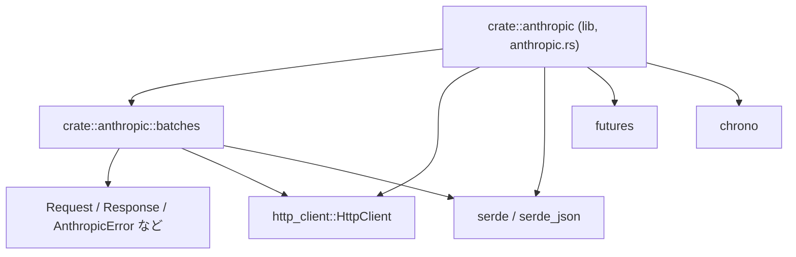
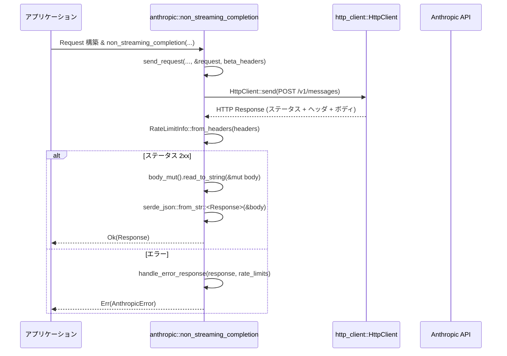
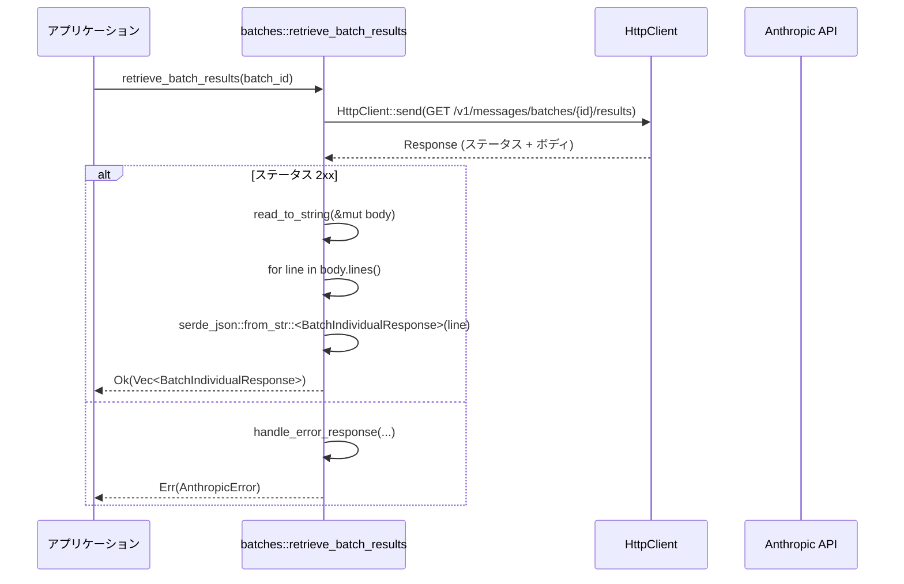

1. ざっくり一言

----------------

Anthropic（Claude）API の **メッセージ／ストリーミング／トークンカウント／バッチ処理** を、共通の型とエラー扱いで呼び出すための Rust クライアントライブラリです。

---

2. このモジュールの役割

-----------------------

### 2.1 概要

- このクレートは Anthropic の `/v1/messages` 系 API を Rust から扱うための型と関数を提供します。
- 単発のメッセージ生成（ストリーミング／非ストリーミング）、トークン数カウント、メッセージバッチの作成・取得・結果取得を共通の `Request` / `Response` 型で扱えるようにしています。
- HTTP 通信は外部の `http_client` クレートの `HttpClient` トレイトに依存しており、特定の HTTP 実装に依存しない構成になっています。

### 2.2 アーキテクチャ内での位置づけ

このディレクトリの主要モジュールと外部依存の関係は、概ね次のようになっています。



- `anthropic.rs`  
  - クレートルートです。  
  - モデル定義 (`Model`)、メッセージ API 用のリクエスト／レスポンス型、ストリーミング・非ストリーミング呼び出し関数、トークンカウント、レートリミット情報、エラー型などを定義します。  
  - `pub mod batches;` により `batches` モジュールを公開します。
- `batches.rs`  
  - バッチメッセージ API (`/v1/messages/batches`) 用の型と呼び出し関数を定義します。  
  - `Request`, `Response`, `AnthropicError`, `ApiError`, `RateLimitInfo` などはクレートルートから再利用します。
- HTTP は `http_client::HttpClient` トレイト経由で行われ、具体的なクライアントはこのコードには登場しません。

### 2.3 設計上のポイント

コードから読み取れる設計上の特徴は次の通りです。

- **HTTP クライアントの抽象化**  
  - 関数はすべて `&dyn HttpClient` を受け取り、具体的な HTTP 実装には依存していません。
- **共通のエラー型**  
  - `AnthropicError` によって、JSON シリアライズ／HTTP 送信／レスポンス読み取り／API エラー／レートリミットなどを一つの列挙体で扱います。
- **モデル情報の型安全な扱い**  
  - `Model` enum で代表的な Anthropic モデルを列挙し、`max_token_count`, `max_output_tokens`, `default_temperature` などをメソッドとして提供しています。
- **ストリーミングと非ストリーミングの統一**  
  - `Request` 型は共通で、`StreamingRequest` で `stream: bool` を追加するだけにしており、同じ構造をストリーミング／非ストリーミング双方で使います。
- **レートリミット情報の抽出**  
  - レスポンスヘッダから `RateLimitInfo` を組み立て、`retry-after` を含むレートリミット情報をプログラムから利用しやすくしています。
- **バッチ API でも共通型を再利用**  
  - `batches` モジュールでは、バッチの個々のリクエストも `Request` をそのまま使います。

---

3. 主要な機能一覧

-----------------

このクレートが提供する主な機能は次の通りです。

- **モデル管理**
  - `Model` enum: Claude 系モデルやカスタムモデルの ID・表示名・制限値・モードなどの管理。
- **メッセージ生成（非ストリーミング）**
  - `non_streaming_completion`: `/v1/messages` に対し通常のレスポンス取得を行う。
- **メッセージ生成（ストリーミング）**
  - `stream_completion`, `stream_completion_with_rate_limit_info`: SSE 風のストリーミングレスポンスを `Event` ストリームとして扱う。
- **トークンカウント**
  - `count_tokens`: `/v1/messages/count_tokens` に対しトークン数計測リクエストを行う。
- **レートリミット情報の取得**
  - `RateLimitInfo::from_headers`, `parse_retry_after`: レスポンスヘッダからレートリミット情報を抽出。
- **エラー処理**
  - `AnthropicError` / `ApiError` / `ApiErrorCode`: HTTP レベルおよび API レベルのエラーを表現。
  - `parse_prompt_too_long`, `ApiError::match_window_exceeded`: 入力トークン数超過エラーからトークン数を抽出。
- **メッセージバッチ API**
  - `batches::create_batch`: `/v1/messages/batches` にバッチを送信。
  - `batches::retrieve_batch`: バッチのステータスを取得。
  - `batches::retrieve_batch_results`: バッチの結果（行単位 JSON）を取得。

---

4. 関数・構造体の解説

----------------------

### 4.1 主要な型一覧

代表的な公開型をまとめると次のようになります。

| 名前 | 種別 | 役割 / 用途 |
|------|------|------------|
| `Model` | enum | 利用可能な Anthropic モデルと、カスタムモデルの設定を表す |
| `AnthropicModelMode` | enum | モデルのモード（通常／Thinking／AdaptiveThinking）を表す |
| `AnthropicModelCacheConfiguration` | struct | モデルのキャッシュ関連の設定値 |
| `Message` | struct | 1 つのメッセージ（role + content 配列） |
| `Role` | enum | `user` / `assistant` |
| `RequestContent` | enum | テキスト／画像／ツール呼び出し／ツール結果など、メッセージコンテンツ |
| `Tool`, `ToolChoice`, `Thinking`, `OutputConfig` | struct / enum | ツール呼び出しや Thinking モード関連の設定 |
| `Request` | struct | `/v1/messages` 用のリクエスト本体 |
| `Response` | struct | `/v1/messages` の非ストリーミングレスポンス |
| `Event` | enum | ストリーミング時に逐次届くイベント |
| `ContentDelta`, `MessageDelta` | enum / struct | ストリーミング中の差分データ |
| `Usage` | struct | トークン使用量統計 |
| `RateLimit`, `RateLimitInfo` | struct | レートリミット制限の情報 |
| `AnthropicError` | enum | このクレートで共通的に使うエラー型 |
| `ApiError`, `ApiErrorCode` | struct / enum | Anthropic API から返るエラーとその分類 |
| `CountTokensRequest`, `CountTokensResponse` | struct | トークンカウント API の入出力 |
| `batches::BatchRequest`, `CreateBatchRequest` | struct | バッチリクエストの入力 |
| `batches::MessageBatch`, `MessageBatchRequestCounts` | struct | バッチのメタ情報・進行状況 |
| `batches::BatchResult`, `BatchIndividualResponse` | enum / struct | バッチ内各リクエストの結果 |

以降では特に使用頻度の高そうな関数・メソッドを中心に説明します。

---

### 4.2 重要な関数・メソッドの詳細

#### `Model::from_id(id: &str) -> anyhow::Result<Model>`

**概要**

- モデル ID の文字列から、対応する `Model` enum を返します。
- ID が既知の接頭辞のいずれにもマッチしない場合は `Err(anyhow!(...))` を返します。

**引数**

| 引数名 | 型 | 説明 |
|--------|----|------|
| `id` | `&str` | Anthropic モデル ID（例: `"claude-sonnet-4.6..."`） |

**戻り値**

- 成功時: 対応する `Model` 変数。
- 失敗時: `anyhow::Error`（`invalid model ID: {id}`）。

**内部処理の流れ**

1. `starts_with("claude-opus-4-6")` など、複数の接頭辞を順にチェック。
2. 最初にマッチした接頭辞に対応する `Model` を返す。
3. どれにもマッチしない場合は `Err(anyhow!("invalid model ID: {id}"))`。

**Edge cases（エッジケース）**

- カスタムモデル（`Model::Custom`) の ID には対応しておらず、接頭辞のいずれにも当てはまらない任意の文字列はエラーになります。
- `id` が空文字列の場合も、どの接頭辞にもマッチしないためエラーになります。

**使用上の注意点**

- API から返ってきた `model` 名（レスポンス中の `model` フィールド）を内部で列挙型に変換したい場合に使うことが想定されます。
- 接頭辞マッチのため、バージョンを含む ID（例: `claude-opus-4-6-1m-context`）も一括りに `Model::ClaudeOpus4_6` になります。

---

#### `stream_completion(...) -> Result<BoxStream<'static, Result<Event, AnthropicError>>, AnthropicError>`

```rust
pub async fn stream_completion(
    client: &dyn HttpClient,
    api_url: &str,
    api_key: &str,
    request: Request,
    beta_headers: Option<String>,
) -> Result<BoxStream<'static, Result<Event, AnthropicError>>, AnthropicError>
```

**概要**

- `/v1/messages` にストリーミングモードでリクエストを送り、`Event` のストリームを返します。
- レートリミット情報が不要な場合に、ラッパーとして `stream_completion_with_rate_limit_info` を簡略呼び出ししています。

**引数**

| 引数名 | 型 | 説明 |
|--------|----|------|
| `client` | `&dyn HttpClient` | HTTP クライアントのトレイトオブジェクト |
| `api_url` | `&str` | ベース URL（通常は `ANTHROPIC_API_URL`） |
| `api_key` | `&str` | Anthropic API キー |
| `request` | `Request` | メッセージ生成のリクエスト |
| `beta_headers` | `Option<String>` | `"Anthropic-Beta"` ヘッダに入れる追加フラグ |

**戻り値**

- 成功時: `Event` を流す `BoxStream<'static, Result<Event, AnthropicError>>`。
- 失敗時: `AnthropicError`。

**内部処理の流れ**

1. `stream_completion_with_rate_limit_info` を呼び出し、戻り値のタプルからストリーム部分のみ (`output.0`) を返す。

**Errors / Panics**

- `stream_completion_with_rate_limit_info` と同じエラー条件がそのまま返ります（後述）。

**使用例（簡略）**

```rust
use anthropic::{Request, Message, Role, RequestContent, stream_completion, ANTHROPIC_API_URL};

async fn example_stream(client: &dyn http_client::HttpClient, api_key: &str) -> Result<(), anthropic::AnthropicError> {
    let request = Request {
        model: "claude-sonnet-4.6".to_string(),       // 実際には Model::ClaudeSonnet4_6.request_id() を使ってもよい
        max_tokens: 1024,
        messages: vec![Message {
            role: Role::User,
            content: vec![RequestContent::Text {
                text: "Hello".to_string(),
                cache_control: None,
            }],
        }],
        ..serde_json::from_str("{}").unwrap()         // 省略フィールドにデフォルトを入れる簡略手法の一例
    };

    let stream = stream_completion(client, ANTHROPIC_API_URL, api_key, request, None).await?;
    futures::pin_mut!(stream);

    while let Some(event) = stream.next().await {
        match event? {
            anthropic::Event::ContentBlockDelta { delta, .. } => {
                if let anthropic::ContentDelta::TextDelta { text } = delta {
                    println!("delta: {text}");
                }
            }
            _ => {}
        }
    }
    Ok(())
}
```

**Edge cases**

- ストリーム中の 1 行が `data: ...` 形式でない場合、その行は無視されます（`strip_prefix("data: ")` または `"data:"` に失敗するため）。
- JSON としてパースできない行があった場合、その時点で `AnthropicError::DeserializeResponse` がストリームから返ります。

**使用上の注意点**

- ストリームは `BoxStream` であり、`StreamExt::next()` など `futures` の API で逐次取り出す必要があります。
- バックプレッシャー制御などは呼び出し元側の責任になります。
- 途中でエラーが発生すると、それ以降のイベントは取得できなくなります。

---

#### `stream_completion_with_rate_limit_info(...) -> Result<(BoxStream<...>, Option<RateLimitInfo>), AnthropicError>`

**概要**

- `stream_completion` と同様にストリーミングレスポンスを取得しますが、同時にヘッダから抽出した `RateLimitInfo` も返します。

**引数・戻り値**

- `stream_completion` と同じ引数に加え、戻り値は `(stream, Option<RateLimitInfo>)` のタプルです。

**内部処理の流れ**

1. `StreamingRequest { base: request, stream: true }` を作成。
2. `send_request` を呼び出して HTTP POST を実行。
3. ステータスコードが成功の場合:
   - `response.into_body()` を `BufReader` に包み、`lines()` で行単位に非同期読み取り。
   - 各行から `data:` または `data:` プレフィックスを削除し、JSON として `Event` にデシリアライズ。
4. ステータスコードが失敗の場合:
   - `handle_error_response` に処理を委譲し、`AnthropicError` に変換して返す。

**Errors / Edge cases**

- レスポンスボディ読み取り時の I/O エラー: `AnthropicError::ReadResponse`。
- JSON デシリアライズ失敗: `AnthropicError::DeserializeResponse`。
- HTTP レベルのエラーまたは API レベルのエラー: `handle_error_response` が `AnthropicError` に変換します。

**使用上の注意点**

- `RateLimitInfo` は `Option` なので、ヘッダにレートリミット情報がない場合は `None` になります。
- `RateLimitInfo` 内の各フィールド（`requests`, `tokens` など）も `Option` であり、全てが常に設定されるわけではありません。

---

#### `non_streaming_completion(...) -> Result<Response, AnthropicError>`

```rust
pub async fn non_streaming_completion(
    client: &dyn HttpClient,
    api_url: &str,
    api_key: &str,
    request: Request,
    beta_headers: Option<String>,
) -> Result<Response, AnthropicError>
```

**概要**

- `/v1/messages` に対して非ストリーミングでメッセージ生成リクエストを行い、最終的な `Response` を JSON として受け取ります。

**引数**

- `stream_completion` と同一。

**戻り値**

- 成功時: `Response`（メッセージ本体・コンテンツ・使用トークン量などを含む）。
- 失敗時: `AnthropicError`。

**内部処理の流れ**

1. `send_request` を呼び出して HTTP POST とレートリミット情報の取得を行う。
2. ステータスコードが成功（`2xx`）であれば:
   - `response.body_mut().read_to_string` でボディ全体を `String` として読み込む。
   - `serde_json::from_str` で `Response` にデシリアライズ。
3. ステータスコードが失敗なら:
   - `handle_error_response(response, rate_limits).await` で `AnthropicError` に変換。

**使用例**

```rust
use anthropic::{Request, Message, Role, RequestContent, non_streaming_completion, ANTHROPIC_API_URL};

async fn example_non_stream(client: &dyn http_client::HttpClient, api_key: &str) -> Result<(), anthropic::AnthropicError> {
    let request = Request {
        model: "claude-haiku-4.5".to_string(),
        max_tokens: 512,
        messages: vec![Message {
            role: Role::User,
            content: vec![RequestContent::Text {
                text: "Say hello in Japanese.".to_string(),
                cache_control: None,
            }],
        }],
        ..serde_json::from_str("{}").unwrap()
    };

    let response = non_streaming_completion(client, ANTHROPIC_API_URL, api_key, request, None).await?;
    for content in response.content {
        if let anthropic::ResponseContent::Text { text } = content {
            println!("assistant: {text}");
        }
    }

    Ok(())
}
```

**Errors / Edge cases**

- ボディが空または JSON でない場合は `AnthropicError::DeserializeResponse` になります。
- レートリミットやサーバ過負荷は `handle_error_response` で `AnthropicError::RateLimit` または `AnthropicError::ServerOverloaded` に変換されます。

**使用上の注意点**

- `Response` の `stop_reason` や `stop_sequence` は `Option` であり、常に設定されるとは限りません。
- 大きなレスポンスは `String` に全読み込みするため、非常に大きなレスポンスを頻繁に扱う場合はメモリ使用量に注意が必要です。

---

#### `count_tokens(...) -> Result<CountTokensResponse, AnthropicError>`

```rust
pub async fn count_tokens(
    client: &dyn HttpClient,
    api_url: &str,
    api_key: &str,
    request: CountTokensRequest,
) -> Result<CountTokensResponse, AnthropicError>
```

**概要**

- `/v1/messages/count_tokens` にリクエストを送り、入力メッセージのトークン数を取得します。
- `Request` と似た構造ですが `max_tokens` は不要なため含まれていません。

**引数**

| 引数名 | 型 | 説明 |
|--------|----|------|
| `request` | `CountTokensRequest` | モデルとメッセージ、およびツール・thinking・system 等 |

**戻り値**

- 成功時: `CountTokensResponse { input_tokens }`。
- 失敗時: `AnthropicError`。

**内部処理の流れ**

1. `/v1/messages/count_tokens` に JSON ボディで POST。
2. レートリミット情報を `RateLimitInfo::from_headers` で取得（戻り値としては返さずローカル変数のみ）。
3. ステータスコードが成功なら、ボディを読み込み `CountTokensResponse` にデシリアライズ。
4. 失敗なら `handle_error_response` に委譲。

**使用例**

```rust
use anthropic::{CountTokensRequest, Message, Role, RequestContent, count_tokens, ANTHROPIC_API_URL};

async fn example_count_tokens(client: &dyn http_client::HttpClient, api_key: &str) -> Result<u64, anthropic::AnthropicError> {
    let request = CountTokensRequest {
        model: "claude-sonnet-4.6".to_string(),
        messages: vec![Message {
            role: Role::User,
            content: vec![RequestContent::Text {
                text: "Long prompt ...".to_string(),
                cache_control: None,
            }],
        }],
        system: None,
        tools: vec![],
        thinking: None,
        tool_choice: None,
    };

    let resp = count_tokens(client, ANTHROPIC_API_URL, api_key, request).await?;
    Ok(resp.input_tokens)
}
```

**使用上の注意点**

- `CountTokensRequest` では `max_tokens` が存在しないため、「出力側のトークン数」は考慮されません。純粋に入力トークン数のみのカウントです。
- 入力がトークン制限を超えている場合など、API 側でエラーになると `AnthropicError::ApiError` などになります。

---

#### `batches::create_batch(...) -> Result<MessageBatch, AnthropicError>`

```rust
pub async fn create_batch(
    client: &dyn HttpClient,
    api_url: &str,
    api_key: &str,
    request: CreateBatchRequest,
) -> Result<MessageBatch, AnthropicError>
```

**概要**

- `/v1/messages/batches` に対し、複数のメッセージ生成リクエストを一括送信します。
- 各リクエストには `custom_id` を付け、後で結果と紐づけることができます。

**引数**

| 引数名 | 型 | 説明 |
|--------|----|------|
| `request` | `CreateBatchRequest` | `requests: Vec<BatchRequest>` を含む |

`BatchRequest` は `custom_id: String` と `params: Request` を持ちます。

**戻り値**

- 成功時: `MessageBatch`（バッチ ID, ステータス, 件数情報など）。
- 失敗時: `AnthropicError`。

**内部処理の流れ**

1. `/v1/messages/batches` に JSON ボディで POST。
2. `RateLimitInfo::from_headers` でレートリミット情報を取得。
3. ステータスコードが成功なら `MessageBatch` にデシリアライズ。
4. 失敗なら `crate::handle_error_response` に委譲。

**使用上の注意点**

- この関数はバッチ自体の作成のみであり、「個々のリクエストの最終的な結果」は `retrieve_batch_results` で取得します。
- バッチ ID は `MessageBatch.id` に入ります。

---

#### `batches::retrieve_batch_results(...) -> Result<Vec<BatchIndividualResponse>, AnthropicError>`

```rust
pub async fn retrieve_batch_results(
    client: &dyn HttpClient,
    api_url: &str,
    api_key: &str,
    message_batch_id: &str,
) -> Result<Vec<BatchIndividualResponse>, AnthropicError>
```

**概要**

- `/v1/messages/batches/{id}/results` から、バッチ内の各リクエストの結果を取得します。
- レスポンスボディは **行ごとの JSON** になっており、行単位で `BatchIndividualResponse` にデシリアライズしています。

**戻り値**

- 成功時: `Vec<BatchIndividualResponse>`。
  - `BatchIndividualResponse { custom_id, result }` で、`result` は `BatchResult`（`Succeeded` / `Errored` / `Canceled` / `Expired`）。
- 失敗時: `AnthropicError`。

**内部処理の流れ**

1. `/v1/messages/batches/{id}/results` に GET。
2. ステータスコードが成功なら、ボディ全体を `String` として読み込み。
3. `body.lines()` で行ごとに分割し、空行をスキップ。
4. 各行を `serde_json::from_str::<BatchIndividualResponse>` でデシリアライズしてベクタに格納。
5. 失敗ステータスの場合は `crate::handle_error_response` に委譲。

**Edge cases**

- 1 行でも JSON パースに失敗すると、その時点で `AnthropicError::DeserializeResponse` が返され、それまでにパース済みの結果は破棄されます。
- 空行は `continue` でスキップされます。

**使用上の注意点**

- 行ごとの JSON 形式であることに依存しているため、API 側の形式変更があると影響を受けます。
- `BatchResult::Errored` の場合は `BatchErrorResponse { response_type, error: ApiError }` が入り、`error.code()` や `match_window_exceeded()` などで追加情報を取り出せます。

---

### 4.3 その他の主なメソッド・関数（概要）

- `Model::id()`, `Model::request_id()`, `Model::display_name()`  
  - モデル ID や表示名の取得。
- `Model::max_token_count()`, `Model::max_output_tokens()`, `Model::default_temperature()`  
  - API 呼び出し前のバリデーションや UI 表示に利用できる上限値。
- `Model::mode()`, `Model::supports_thinking()`, `Model::supports_adaptive_thinking()`  
  - Thinking モードが利用可能かどうかの判定。
- `Model::beta_headers()`, `Model::tool_model_id()`  
  - カスタムモデル用の追加ヘッダやツール用モデル ID。
- `RateLimitInfo::from_headers(headers: &HeaderMap<HeaderValue>)`  
  - ヘッダから `RateLimitInfo` を生成（関連ヘッダがなければすべて `None`）。
- `parse_retry_after(headers: &HeaderMap<HeaderValue>) -> Option<Duration>`  
  - `"retry-after"` ヘッダを秒数として `Duration` に変換。
- `ApiError::code() -> Option<ApiErrorCode>`  
  - `error_type` 文字列から `ApiErrorCode` への変換。
- `ApiError::is_rate_limit_error() -> bool`  
  - `error_type == "rate_limit_error"` の簡易判定。
- `ApiError::match_window_exceeded() -> Option<u64>` / `parse_prompt_too_long`  
  - 「prompt is too long: N tokens ...」というエラーメッセージから N を抽出。

---

5. データフロー

---------------

### 5.1 非ストリーミングメッセージ生成の流れ

非ストリーミングでメッセージを生成する典型的なシナリオでは、データは次のように流れます。



要点:

- アプリケーション側は `Request` を構築し `non_streaming_completion` に渡します。
- `send_request` により HTTP レスポンスと `RateLimitInfo` が取得されますが、非ストリーミングの場合は `RateLimitInfo` は戻り値としては返されません。
- ステータスコードに応じて、成功なら `Response` に変換、失敗なら `AnthropicError` に変換されます。

### 5.2 バッチ結果取得の流れ（概要）

バッチ結果取得では、サーバから返るテキストボディを行単位でパースしています。



---

6. 使い方（How to Use）

-----------------------

### 6.1 基本的な使用方法（非ストリーミング）

ここでは、単純な非ストリーミングのメッセージ生成の例を示します。

```rust
use anthropic::{
    Request, Message, Role, RequestContent,
    non_streaming_completion, ANTHROPIC_API_URL, Model,
};

async fn basic_example(client: &dyn http_client::HttpClient, api_key: &str) -> Result<(), anthropic::AnthropicError> {
    // 1. モデルを選択し、API に渡す ID を得る
    let model = Model::ClaudeSonnet4_6;                      // 型安全にモデルを指定
    let model_id = model.request_id().to_string();          // API に渡す ID 文字列

    // 2. メッセージを構築
    let user_message = Message {
        role: Role::User,
        content: vec![
            RequestContent::Text {
                text: "Rust でのエラーハンドリングの基本を教えてください。".to_string(),
                cache_control: None,
            }
        ],
    };

    // 3. Request を組み立て
    let request = Request {
        model: model_id,
        max_tokens: 1024,
        messages: vec![user_message],
        tools: vec![],
        thinking: Some(anthropic::Thinking::Enabled { budget_tokens: Some(4096) }),
        tool_choice: None,
        system: None,
        metadata: None,
        output_config: None,
        stop_sequences: vec![],
        speed: None,
        temperature: Some(model.default_temperature()),
        top_k: None,
        top_p: None,
    };

    // 4. 非ストリーミングで呼び出し
    let response = non_streaming_completion(
        client,
        ANTHROPIC_API_URL,
        api_key,
        request,
        model.beta_headers(),                                // カスタムモデルの場合に beta ヘッダを追加
    ).await?;

    // 5. レスポンス内容を利用
    for content in response.content {
        if let anthropic::ResponseContent::Text { text } = content {
            println!("assistant: {text}");
        }
    }

    Ok(())
}
```

### 6.2 よくある使用パターン

#### 6.2.1 ストリーミングでトークン逐次受信

```rust
use futures::StreamExt;
use anthropic::{
    Request, Message, Role, RequestContent,
    stream_completion, ANTHROPIC_API_URL, Model, Event, ContentDelta,
};

async fn streaming_example(client: &dyn http_client::HttpClient, api_key: &str) -> Result<(), anthropic::AnthropicError> {
    let model = Model::ClaudeHaiku4_5;
    let request = Request {
        model: model.request_id().to_string(),
        max_tokens: model.max_output_tokens().min(1024),
        messages: vec![Message {
            role: Role::User,
            content: vec![RequestContent::Text {
                text: "ストリーミングで自己紹介してください。".to_string(),
                cache_control: None,
            }],
        }],
        ..serde_json::from_str("{}").unwrap()
    };

    let stream = stream_completion(client, ANTHROPIC_API_URL, api_key, request, model.beta_headers()).await?;
    futures::pin_mut!(stream);

    while let Some(event) = stream.next().await {
        match event? {
            Event::ContentBlockDelta { delta, .. } => {
                if let ContentDelta::TextDelta { text } = delta {
                    print!("{text}");
                }
            }
            Event::MessageStop => {
                println!("\n--- done ---");
            }
            _ => {}
        }
    }

    Ok(())
}
```

#### 6.2.2 トークンカウントを事前に行う

```rust
use anthropic::{CountTokensRequest, Message, Role, RequestContent, count_tokens, ANTHROPIC_API_URL};

async fn ensure_within_window(
    client: &dyn http_client::HttpClient,
    api_key: &str,
) -> Result<(), anthropic::AnthropicError> {
    let model = anthropic::Model::ClaudeOpus4_6;
    let max_tokens = model.max_token_count();

    let messages = vec![Message {
        role: Role::User,
        content: vec![RequestContent::Text {
            text: "長いプロンプト...".to_string(),
            cache_control: None,
        }],
    }];

    let ct_req = CountTokensRequest {
        model: model.request_id().to_string(),
        messages,
        system: None,
        tools: vec![],
        thinking: None,
        tool_choice: None,
    };

    let ct_resp = count_tokens(client, ANTHROPIC_API_URL, api_key, ct_req).await?;
    if ct_resp.input_tokens > max_tokens {
        eprintln!(
            "入力トークン数 {} がモデルの上限 {} を超えています。",
            ct_resp.input_tokens, max_tokens
        );
    }

    Ok(())
}
```

#### 6.2.3 バッチで複数リクエストをまとめて投げる

```rust
use anthropic::batches::{
    BatchRequest, CreateBatchRequest,
    create_batch, retrieve_batch, retrieve_batch_results,
};
use anthropic::{Request, Message, Role, RequestContent, ANTHROPIC_API_URL, BatchResult};
use tokio::time::{sleep, Duration};

async fn batch_example(client: &dyn http_client::HttpClient, api_key: &str) -> Result<(), anthropic::AnthropicError> {
    let model = anthropic::Model::default_fast();        // 例: Haiku

    // 1. バッチリクエストを組み立てる
    let requests = vec![
        BatchRequest {
            custom_id: "req-1".to_string(),
            params: Request {
                model: model.request_id().to_string(),
                max_tokens: 256,
                messages: vec![Message {
                    role: Role::User,
                    content: vec![RequestContent::Text {
                        text: "1つ目の質問".to_string(),
                        cache_control: None,
                    }],
                }],
                ..serde_json::from_str("{}").unwrap()
            },
        },
        BatchRequest {
            custom_id: "req-2".to_string(),
            params: Request {
                model: model.request_id().to_string(),
                max_tokens: 256,
                messages: vec![Message {
                    role: Role::User,
                    content: vec![RequestContent::Text {
                        text: "2つ目の質問".to_string(),
                        cache_control: None,
                    }],
                }],
                ..serde_json::from_str("{}").unwrap()
            },
        },
    ];

    let create_req = CreateBatchRequest { requests };

    // 2. バッチを作成
    let batch = create_batch(client, ANTHROPIC_API_URL, api_key, create_req).await?;
    println!("batch id = {}", batch.id);

    // 3. ステータスが完了するまでポーリング（例示用）
    loop {
        let status = retrieve_batch(client, ANTHROPIC_API_URL, api_key, &batch.id).await?;
        println!("processing_status = {}", status.processing_status);
        if status.processing_status == "ended" {
            break;
        }
        sleep(Duration::from_secs(5)).await;
    }

    // 4. 結果を取得
    let results = retrieve_batch_results(client, ANTHROPIC_API_URL, api_key, &batch.id).await?;
    for item in results {
        match item.result {
            BatchResult::Succeeded { message } => {
                println!("{} succeeded with {} content blocks", item.custom_id, message.content.len());
            }
            BatchResult::Errored { error } => {
                eprintln!("{} error: {}", item.custom_id, error.error);
            }
            BatchResult::Canceled => {
                eprintln!("{} canceled", item.custom_id);
            }
            BatchResult::Expired => {
                eprintln!("{} expired", item.custom_id);
            }
        }
    }

    Ok(())
}
```

### 6.3 使用上の注意点（まとめ）

- **HTTP クライアントの実装**  
  - ここでは `&dyn HttpClient` を前提としているため、実際には別クレートで `HttpClient` トレイトを実装した型を用意する必要があります。
- **モデル ID とトークン制限**
  - `Request.model` は文字列ですが、`Model` enum の `request_id()`／`max_token_count()` と組み合わせると、制限値チェックなどを行いやすくなります。
- **エラー処理**
  - `AnthropicError::ApiError(ApiError)` では、`ApiError.error_type`（文字列）および `ApiError::code()`（列挙体）を使ってエラー種別を判定できます。
  - プロンプト長超過に関しては `ApiError::match_window_exceeded()` が `Some(tokens)` を返す場合があります。
- **レートリミットへの対応**
  - ストリーミングを含む各関数は、レートリミット時に `AnthropicError::RateLimit { retry_after }` や `ServerOverloaded` を返します。
  - `stream_completion_with_rate_limit_info` を使うと、成功レスポンス時のレートリミットヘッダも参照できます。
- **ストリーミング時のパース**
  - `Event` の種類によって中身が異なるため、`match` で適切に分岐する必要があります。
  - JSON フォーマットの前提（`data:` プレフィックス、行ごとの JSON）は Anthropic API のフォーマットに依存しており、変更があれば対応が必要です。
- **バッチ結果の形式**
  - `retrieve_batch_results` は行ごとの JSON を前提としているため、レスポンスが巨大な場合にすべてメモリ上に読み込む点と、1 行でも不正 JSON があると全体がエラーになる点に注意します。

---

7. 関連ファイル

---------------

| パス | 役割 / 関係 |
|------|------------|
| `anthropic/Cargo.toml` | クレート名・依存関係・ lib のエントリポイント（`src/anthropic.rs`）を定義する |
| `anthropic/src/anthropic.rs` | クレートルート。モデル定義、メッセージ API のリクエスト／レスポンス、ストリーミング／非ストリーミング呼び出し、トークンカウント、レートリミット・エラー型などの中心的なロジックを含む |
| `anthropic/src/batches.rs` | メッセージバッチ API 用の型と関数を定義し、`Request`／`Response`／`AnthropicError` などを再利用する |

このディレクトリの外側には、実際の HTTP クライアント実装（`HttpClient` トレイトの実装）や、このクレートを呼び出すアプリケーションコードが存在することが想定されますが、このバッチには含まれていないため詳細は不明です。
