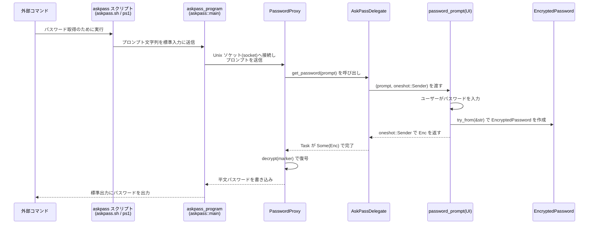

# crates/askpass ディレクトリ解説

## 1. ざっくり一言

`askpass` クレートは、外部コマンド（ssh 等）が要求する「パスワード入力 (askpass)」を、Zed 側の UI で受け取り、安全にやり取りするための仕組みを提供するモジュール群です。  
同時に、メモリ上のパスワードを扱うための `EncryptedPassword` 型も提供します。

---

## 2. このモジュールの役割

### 2.1 全体像

このディレクトリは主に次の問題を解決します。

- 外部プロセスからの askpass 要求（Unix ソケット経由）を受け取り、Zed 内の UI ダイアログでパスワードを入力させる。
- パスワードを平文のまま長時間メモリに保持しないようにする（`EncryptedPassword` による格納・ゼロ化）。
- Unix / Windows それぞれのシェル環境に合わせた askpass スクリプトを一時ファイルとして生成する。

構成要素は大きく分けて 3 つです。

1. **パスワードの暗号化・復号を行う型**:  
   `EncryptedPassword`（`encrypted_password.rs`）
2. **askpass サーバ側 (Zed 側) の制御ロジック**:  
   `AskPassDelegate`, `AskPassSession`, `PasswordProxy`（`askpass.rs`）
3. **askpass クライアント側 (外部プロセス側) のエントリポイント**:  
   `askpass::main`（`askpass.rs`）

### 2.2 アーキテクチャ上の位置づけ

外部コマンドから Zed UI までの流れを、主要コンポーネントの依存関係として示すと次のようになります。

```mermaid
graph LR
  Ext["外部コマンド<br/>(ssh 等 askpass 対応ツール)"]
  Script["一時 askpass スクリプト<br/>(askpass.sh / askpass.ps1)"]
  Prog["askpass_program<br/>(通常は Zed 実行ファイル)"]
  MainFn["askpass::main<br/>(socket 引数付き起動)"]
  Sock["Unix ソケット<br/>askpass.sock"]
  Proxy["PasswordProxy<br/>(ソケットサーバ)"]
  Delegate["AskPassDelegate<br/>(UI への橋渡し)"]
  UI["password_prompt クロージャ<br/>(Zed UI)"]
  Enc["EncryptedPassword"]

  Ext --> Script
  Script --> Prog
  Prog --> MainFn
  MainFn -->|接続| Sock
  Sock --> Proxy
  Proxy --> Delegate
  Delegate --> UI
  UI --> Enc
```



コード上の依存関係としては、

- `askpass.rs` が `encrypted_password` モジュールを `mod` し、`EncryptedPassword` とマーカー型を `pub use` で再公開します。
- `askpass.rs` は `net`, `smol`, `gpui`, `util`, `tempfile` などに依存して、ソケット通信・非同期実行・一時ファイル作成・スクリプト実行権限の付与を行います。
- `encrypted_password.rs` は OS ごとの暗号 API（Windows のみ）と `zeroize` に依存して、パスワードの暗号化とメモリ上のゼロ化を行います。

### 2.3 設計上のポイント

コードから読み取れる設計上の特徴は次の通りです。

- **責務の分離**
  - パスワードの表現と暗号化ロジックは `EncryptedPassword` に閉じ込められています。
  - askpass の「サーバ」（Zed 側）ロジックは `AskPassSession` / `PasswordProxy`。
  - askpass の「クライアント」（`--askpass=<socket>` で起動されるプロセス）は `askpass::main`。
- **非同期・イベント駆動**
  - `AskPassDelegate` は `futures::channel::mpsc` と `gpui::Task` を使って、パスワード要求を UI スレッド側へブリッジします。
  - `PasswordProxy` は `UnixListener` を非同期で受け付け続け、各接続に対して `get_password` タスクを起動します。
- **OS ごとの分岐**
  - スクリプト名・スクリプト内容・暗号化方式は `cfg(target_os = "windows")` / `cfg(not(windows))` で分かれています。
- **安全性への配慮**
  - `EncryptedPassword` は `Drop` 時に中身を `zeroize` します。
  - 復号には `IKnowWhatIAmDoingAndIHaveReadTheDocs` というマーカー型を要求し、誤用に対する心理的ハードルを上げています（型システムによる制約も一部あります）。

---

## 3. 主要な機能一覧

このディレクトリが提供する主な機能を列挙します。

- **`EncryptedPassword` によるパスワードの保持**
  - Windows では `CryptProtectMemory` によりメモリ上を暗号化、その他の OS では平文 `Vec<u8>` だが `zeroize` により破棄時に内容を消去。
- **暗号化パスワードの復号 (`EncryptedPassword::decrypt`)**
  - マーカー型を要求しつつ `String` を返す。
- **`AskPassDelegate` を通じたパスワード要求の UI 連携**
  - `AskPassDelegate::new` で UI 側の `password_prompt` コールバックを登録。
  - `AskPassDelegate::ask_password` でパスワード入力を非同期に要求し、`EncryptedPassword` を受け取る。
- **`AskPassSession` による askpass サーバセッションの管理**
  - 一時ディレクトリ・ソケット・スクリプトのライフタイムを束ねる。
  - `AskPassSession::run` でユーザーキャンセルまたはタイムアウト（17 秒）を待つ。
  - Windows では `AskPassSession::get_password` で最後に入力されたパスワードを取得可能。
- **`PasswordProxy` によるソケットサーバとスクリプト生成**
  - `PasswordProxy::new` で Unix ソケットのリスナーと askpass スクリプトの生成・保存を行う。
  - 外部プロセス側には `script_path()` で askpass スクリプト（または Windows の helper コマンド）を渡す。
- **askpass クライアントエントリポイント (`askpass::main`)**
  - 標準入力から受け取ったデータを Unix ソケットへ送信し、応答を標準出力へ送るヘルパー。
- **askpass 実行プログラムパスの指定 (`set_askpass_program`)**
  - デフォルトは現在の実行ファイルだが、別の実行ファイルを使用したい場合に一度だけ上書き可能。

---

## 4. 関数・構造体の解説

### 4.1 型一覧

| 名前 | 種別 | 定義ファイル | 役割 / 用途 |
|------|------|--------------|-------------|
| `EncryptedPassword` | 構造体 (`Vec<u8>, LengthWithoutPadding`) | `encrypted_password.rs` | 暗号化済み（または少なくともゼロ化される）パスワードを表現し、Drop 時に内容を消去します。 |
| `LengthWithoutPadding` | 型エイリアス (`u32`) | `encrypted_password.rs` | Windows の暗号化バッファから元の長さ（パディング除去前）を保持するために使用されます。 |
| `IKnowWhatIAmDoingAndIHaveReadTheDocs` | 構造体（ゼロサイズ） | `encrypted_password.rs` | `EncryptedPassword::decrypt` を呼ぶ際に要求されるマーカー型です。誤用を減らす意図があります。 |
| `AskPassResult` | 列挙体 | `askpass.rs` | `AskPassSession::run` の結果状態（`CancelledByUser` / `Timedout`）を表します。 |
| `AskPassDelegate` | 構造体 | `askpass.rs` | UI 側のパスワード入力コールバックへ橋渡しするためのハンドラです。 |
| `AskPassSession` | 構造体 | `askpass.rs` | askpass 用 Unix ソケットと一時スクリプトを管理し、キャンセルやタイムアウトを監視します。 |
| `PasswordProxy` | 構造体 | `askpass.rs` | Unix ソケットサーバと askpass スクリプトの生成・実行を担う内部コンポーネントです。 |
| `ASKPASS_PROGRAM` | `OnceLock<PathBuf>` | `askpass.rs` | askpass 用に呼び出されるプログラム（通常は Zed の実行ファイル）のパスを一度だけ設定します。 |

以下では、特に重要な関数・メソッドを詳細に説明します。

---

### 4.2 主要な関数・メソッド詳細

#### 4.2.1 `impl TryFrom<&str> for EncryptedPassword`

```rust
impl TryFrom<&str> for EncryptedPassword {
    type Error = anyhow::Error;
    fn try_from(password: &str) -> Result<EncryptedPassword> { /* ... */ }
}
```

**概要**

- &str で与えられたパスワードを `EncryptedPassword` に変換します。
- Windows では `CryptProtectMemory` により暗号化し、その他の OS では `String` を `Vec<u8>` にコピーするだけですが、いずれも Drop 時にゼロ化されます。

**引数**

| 引数名 | 型 | 説明 |
|--------|----|------|
| `password` | `&str` | 平文のパスワード文字列です。UTF-8 であることが前提です。 |

**戻り値**

- `Ok(EncryptedPassword)`  
  正常に暗号化（またはコピー）できた場合。
- `Err(anyhow::Error)`  
  文字列長が `u32` に収まらない場合など、内部処理が失敗した場合。

**内部処理の流れ**

- パスワード長を `u32` にキャストしようとし、失敗した場合はエラーを返します。
- Windows (`#[cfg(windows)]`) の場合:
  - パスワードを `Vec<u8>` にコピーします。
  - `CRYPTPROTECTMEMORY_BLOCK_SIZE` の倍数になるようにゼロパディングします。
  - `CryptProtectMemory` によってバッファを暗号化します。
  - 元の長さ（パディング前）を `LengthWithoutPadding` として保存します。
- 非 Windows (`#[cfg(not(windows))]`) の場合:
  - `String::from(password).into()` により `Vec<u8>` を生成し、その長さを保持します。
- 最終的に `EncryptedPassword(Vec<u8>, LengthWithoutPadding)` を返します。

**Examples（使用例）**

```rust
use askpass::EncryptedPassword;                       // EncryptedPassword 型をインポートする
use anyhow::Result;                                   // anyhow::Result を利用する

fn store_password_in_memory(pw: &str) -> Result<EncryptedPassword> {
    // &str から EncryptedPassword を生成する
    let encrypted = EncryptedPassword::try_from(pw)?; // 失敗時は anyhow::Error が返る
    Ok(encrypted)                                    // 呼び出し側へ返却する
}
```

**Errors / Panics**

- `password.len().try_into::<u32>()?` が失敗した場合（極端に長い文字列など）、`Err(anyhow::Error)` になります。
- Windows では `CryptProtectMemory` が失敗した場合にエラーが返ります。

**Edge cases（エッジケース）**

- 空文字列 `""`:
  - 長さ 0 として扱われ、Windows では暗号化呼び出しそのものをスキップしますが、`EncryptedPassword` 自体は生成されます。
- 非 UTF-8 文字列:
  - Rust の `&str` は UTF-8 前提なので、このレベルでの不正な UTF-8 は発生しません。

**使用上の注意点**

- `password` そのものはゼロ化されません。平文を保持する変数のライフタイムはできるだけ短く保つ必要があります。
- `EncryptedPassword` は Drop 時にゼロ化されるため、長時間保持したくないケースでの利用を前提としています。

---

#### 4.2.2 `EncryptedPassword::decrypt(self, IKnowWhatIAmDoingAndIHaveReadTheDocs)`

```rust
impl EncryptedPassword {
    pub fn decrypt(mut self, _: IKnowWhatIAmDoingAndIHaveReadTheDocs) -> Result<String> {
        /* ... */
    }
}
```

**概要**

- `EncryptedPassword` に格納されているデータを復号し、平文の `String` として取り出します。
- 復号後は内部バッファが `std::mem::take` で空になり、Drop 時にゼロ化されます。

**引数**

| 引数名 | 型 | 説明 |
|--------|----|------|
| `self` | `EncryptedPassword`（所有権） | 復号対象の暗号化済みパスワードです。関数内で消費されます。 |
| `_` | `IKnowWhatIAmDoingAndIHaveReadTheDocs` | マーカー型。復号処理の呼び出しには明示的な意図が必要であることを示します。 |

**戻り値**

- `Ok(String)`  
  復号に成功した場合の平文パスワード。
- `Err(anyhow::Error)`  
  Windows の復号 API の失敗や UTF-8 変換失敗時など。

**内部処理の流れ**

- Windows の場合:
  - バッファ長が `CRYPTPROTECTMEMORY_BLOCK_SIZE` の倍数であることを `assert!` で確認します（条件を満たさなければ panic）。
  - 長さが 0 でなければ `CryptUnprotectMemory` によりバッファを復号します。
  - 復号後、保存しておいた元の長さ (`self.1`) を用いてパディング部分を `Vec::drain` で切り捨てます。
  - `String::from_utf8(std::mem::take(&mut self.0))` で `Vec<u8>` を `String` に変換します。
- 非 Windows の場合:
  - そのまま `String::from_utf8(std::mem::take(&mut self.0))` を呼び出します。

**Examples（使用例）**

```rust
use askpass::{EncryptedPassword, IKnowWhatIAmDoingAndIHaveReadTheDocs}; // 型をインポートする
use anyhow::Result;                                                     // anyhow::Result を利用する

fn use_password(enc: EncryptedPassword) -> Result<()> {
    // マーカー型を渡して復号する
    let plain = enc.decrypt(IKnowWhatIAmDoingAndIHaveReadTheDocs)?;    // 平文の String が得られる
    // ここで plain を使用する（例: 外部プロセスの引数に渡す等）
    drop(plain);                                                       // 使い終わったらすぐに破棄する
    Ok(())
}
```

**Errors / Panics**

- Windows:
  - 内部バッファ長が `CRYPTPROTECTMEMORY_BLOCK_SIZE` の倍数でない場合、`assert!` により panic します。
  - `CryptUnprotectMemory` が失敗すると `Err(anyhow::Error)` になります。
- 共通:
  - バッファが UTF-8 として不正な場合、`String::from_utf8` で `Err` になります。

**Edge cases（エッジケース）**

- 空パスワード（長さ 0）の場合:
  - Windows では `CryptUnprotectMemory` 呼び出しをスキップし、空の `String` として返されます。

**使用上の注意点**

- 復号結果の `String` は自動的にはゼロ化されません。長時間保持したり、ログに出力したりしないよう注意が必要です。
- `EncryptedPassword` はこのメソッド呼び出しで消費される（再利用できない）ため、同じパスワードを何度も使いたい場合は、その都度 `EncryptedPassword` を再生成する設計が想定されます。

---

#### 4.2.3 `AskPassDelegate::new`

```rust
impl AskPassDelegate {
    pub fn new(
        cx: &mut AsyncApp,
        password_prompt: impl Fn(String, oneshot::Sender<EncryptedPassword>, &mut AsyncApp)
            + Send
            + Sync
            + 'static,
    ) -> Self { /* ... */ }
}
```

**概要**

- Zed の `AsyncApp` 環境内で、パスワード入力ダイアログを表示するためのコールバック（`password_prompt`）を登録し、後続の askpass 要求に応答できるようにします。

**引数**

| 引数名 | 型 | 説明 |
|--------|----|------|
| `cx` | `&mut AsyncApp` | `gpui` の非同期アプリケーションコンテキストです。タスクの spawn に使用されます。 |
| `password_prompt` | `impl Fn(String, oneshot::Sender<EncryptedPassword>, &mut AsyncApp) + Send + Sync + 'static` | パスワード要求が来たときに呼ばれる UI 側コールバックです。プロンプト文字列と、結果を返すための `oneshot::Sender`、`AsyncApp` への可変参照が渡されます。 |

**戻り値**

- `AskPassDelegate`  
  後で `ask_password` を呼ぶことで、登録した `password_prompt` を通じてパスワードを取得できます。

**内部処理の流れ**

- `mpsc::unbounded` で `(String, oneshot::Sender<EncryptedPassword>)` を送受信するチャネルを作成します。
- `cx.spawn` で非同期タスクを起動し、`rx.next().await` によりチャネルからメッセージを受け取り続けます。
- 受信したたびに、`password_prompt(prompt, channel, cx)` を呼び出します。
- 生成した `tx` とバックグラウンド executor、spawn 済みタスクを保持した `AskPassDelegate` を返します。

**Examples（使用例）**

```rust
use askpass::{AskPassDelegate, EncryptedPassword};              // 型をインポートする
use futures::channel::oneshot;                                  // oneshot チャネルを利用する
use gpui::AsyncApp;                                             // AsyncApp を利用する

fn create_delegate(cx: &mut AsyncApp) -> AskPassDelegate {
    // パスワード入力用のコールバックを定義する
    let password_prompt = |prompt: String, tx: oneshot::Sender<EncryptedPassword>, _cx: &mut AsyncApp| {
        // prompt: 外部コマンドから渡されたプロンプト文字列
        // tx: 入力された EncryptedPassword を返すためのチャネル

        // 実際には UI ダイアログを開いてユーザーに入力させる想定
        let user_input = String::from("dummy");                 // 実装側で UI から取得する
        if let Ok(enc) = EncryptedPassword::try_from(user_input.as_str()) {
            let _ = tx.send(enc);                               // 入力されたパスワードを返す
        }
        // ユーザーがキャンセルした場合は tx.send を呼ばないことで「キャンセル」を表現する
    };

    // デリゲートを生成して返す
    AskPassDelegate::new(cx, password_prompt)
}
```

**Errors / Panics**

- `AskPassDelegate::new` 自体は `Result` を返さず、内部で panic する箇所もありません（`cx.spawn` が返す `Task` も panic しない前提になっています）。

**Edge cases（エッジケース）**

- `password_prompt` が panic した場合など、spawn したタスクが終了すると、以後 `ask_password` からの送信が失敗し `None` が返るようになります。

**使用上の注意点**

- `password_prompt` は UI スレッド上で呼び出される前提で設計されており、必要に応じて内部でさらに非同期処理を行うことが想定されます。
- `password_prompt` 内でブロッキング I/O を行うと、UI 応答性に影響する可能性があります。

---

#### 4.2.4 `AskPassDelegate::ask_password`

```rust
impl AskPassDelegate {
    pub fn ask_password(&mut self, prompt: String) -> Task<Option<EncryptedPassword>> {
        /* ... */
    }
}
```

**概要**

- 登録済み `password_prompt` コールバックを用いて、ユーザーにパスワード入力を要求します。
- 非同期に完了する `Task` を返し、結果として `Option<EncryptedPassword>` を得ます。

**引数**

| 引数名 | 型 | 説明 |
|--------|----|------|
| `prompt` | `String` | ユーザーに表示するプロンプト文字列です。 |

**戻り値**

- `Task<Option<EncryptedPassword>>`  
  - `Some(EncryptedPassword)` — ユーザーがパスワードを入力し、`password_prompt` が `tx.send` した場合。
  - `None` — チャネルが閉じた、もしくは `password_prompt` が `send` しなかった（キャンセル相当）場合など。

**内部処理の流れ**

- `mpsc` の送信側を clone し、`oneshot::channel` で個別のレスポンスチャネルを作成します。
- `(prompt, tx)` を `this_tx.send(...)` でバックグラウンドタスクへ送信します。
- 送信や受信に失敗した場合は早期に `None` を返します。
- `rx.await.ok()` により `Option<EncryptedPassword>` を得て、そのまま戻り値とします。

**Examples（使用例）**

```rust
use askpass::{AskPassDelegate, EncryptedPassword};       // 型をインポートする
use gpui::Task;                                         // Task を利用する

async fn request_password(delegate: &mut AskPassDelegate) -> Option<EncryptedPassword> {
    // プロンプトを指定してパスワード入力を要求する
    let task: Task<Option<EncryptedPassword>> =
        delegate.ask_password("パスワードを入力してください".to_string()); // Task を取得する
    task.await                                                   // 非同期に待ち、結果を返す
}
```

**Errors / Panics**

- このメソッド自体は panic しません。
- 内部で `send().await.ok()?` / `rx.await.ok()` を用いており、失敗時には `None` を返します。

**Edge cases（エッジケース）**

- `AskPassDelegate` が既にドロップされている / バックグラウンドタスクが終了している場合:
  - `send` に失敗し、即座に `None` が返されます。
- ユーザーがダイアログをキャンセルし、`password_prompt` が `tx.send` を呼ばない場合:
  - `oneshot::Sender` がドロップされ、受信側は `None` を受け取ります。

**使用上の注意点**

- `None` は「エラー」と「ユーザーキャンセル」の両方を含みうるため、呼び出し側で適切に区別（あるいは同一視）する設計が必要です。

---

#### 4.2.5 `AskPassSession::new`

```rust
impl AskPassSession {
    #[must_use]
    pub async fn new(
        executor: BackgroundExecutor,
        mut delegate: AskPassDelegate,
    ) -> Result<Self> { /* ... */ }
}
```

**概要**

- askpass 用の Unix ソケット、askpass スクリプト（シェル / PowerShell）、`PasswordProxy` をまとめて初期化し、外部 askpass クライアントからのリクエストに応答できるセッションを構築します。

**引数**

| 引数名 | 型 | 説明 |
|--------|----|------|
| `executor` | `BackgroundExecutor` | 非同期タスクを実行するための executor です。`PasswordProxy` のバックグラウンドタスクにも使われます。 |
| `delegate` | `AskPassDelegate` | UI 側へのパスワード要求を橋渡しするためのデリゲートです。内部で消費されます（ムーブされます）。 |

**戻り値**

- `Ok(AskPassSession)`  
  初期化成功時。以降 `script_path` で askpass スクリプトを取得し、`run` でセッションの終了を待つことができます。
- `Err(anyhow::Error)`  
  ソケットの作成やスクリプト生成等で失敗した場合。

**内部処理の流れ**

- Windows の場合:
  - `secret: Arc<Mutex<Option<EncryptedPassword>>>` を生成し、最後に入力されたパスワードを保存するための場所を用意します。
- `askpass_opened_tx/rx` と `askpass_kill_master_tx/rx` という 2 組の `oneshot` チャネルを作成し、それぞれ `Arc<smol::lock::Mutex<Option<Sender>>>` に包んで共有します。
- `get_password` というクロージャを定義します。
  - `delegate.ask_password(prompt)` を呼び、`Task<Option<EncryptedPassword>>` を取得します。
  - 初回呼び出し時のみ `askpass_opened_tx.send(())` を行い、「askpass が開かれた」ことを通知します。
  - `prompt.await` によりパスワード入力完了を待ちます。
    - `Some(password)` の場合:
      - Windows では `secret` に保存します。
      - `ControlFlow::Continue(Ok(password))` を返します。
    - `None` の場合（キャンセル等）:
      - `askpass_kill_master_tx.send(())` を行い、外部プロセスを終了すべきことを通知します。
      - `ControlFlow::Break(())` を返します。
- `PasswordProxy::new(Box::new(get_password), executor.clone()).await?` を呼んでソケットサーバとスクリプト生成を行い、その結果を `askpass_task` として保持します。
- 生成したフィールドを詰めて `AskPassSession` を返します。

**Examples（使用例）**

（UI 側コールバック定義済みの `AskPassDelegate` から `AskPassSession` を作成する例）

```rust
use askpass::{AskPassDelegate, AskPassSession};              // 型をインポートする
use gpui::{AsyncApp, BackgroundExecutor};                    // gpui の型をインポートする
use anyhow::Result;                                          // anyhow::Result を利用する

async fn setup_session(cx: &mut AsyncApp) -> Result<AskPassSession> {
    let executor: BackgroundExecutor = cx.background_executor().clone(); // バックグラウンド executor を取得
    let delegate = /* 事前に AskPassDelegate::new で作成済み */ {
        // ここではダミーとして空のクロージャで作成したと仮定する
        AskPassDelegate::new(cx, |_, _, _| {})
    };

    // AskPassSession を初期化する
    let session = AskPassSession::new(executor, delegate).await?;      // エラー時は anyhow::Error

    Ok(session)                                                       // 呼び出し元へ返す
}
```

**Errors / Panics**

- `PasswordProxy::new` 内部で、`tempfile` 作成・ソケットバインド・スクリプトファイルへの書き込みなどが失敗すると `Err` が返り、そのまま伝播します。
- `AskPassSession::new` 自体は panic しません。

**Edge cases（エッジケース）**

- `delegate` が内部的に正常に動作しない場合（たとえば UI タスクが停止しているなど）、後の `get_password` 呼び出し時に `ControlFlow::Break(())` が返される可能性があります。

**使用上の注意点**

- ドキュコメントにあるように、「マスタープロセスが終了するまでこの `AskPassSession` を保持する」ことが前提です。早くドロップするとソケットやスクリプトが消え、外部 askpass クライアントからの接続が失敗します。
- `#[must_use]` が付いているため、生成後に使わずに破棄するとコンパイル時警告が出ます。

---

#### 4.2.6 `AskPassSession::run`

```rust
impl AskPassSession {
    pub async fn run(&mut self) -> AskPassResult { /* ... */ }
}
```

**概要**

- askpass セッションが「ユーザーによりキャンセルされた」か「一定時間待っても動かなかった（タイムアウト）」かを検出します。
- 外部プロセス（ssh 等）をいつ終了させるか、上位コードが判断するためのシグナルとして利用されます。

**引数**

| 引数名 | 型 | 説明 |
|--------|----|------|
| `&mut self` | `AskPassSession` への可変参照 | 内部の `oneshot::Receiver` を消費するため、可変参照を受け取ります。 |

**戻り値**

- `AskPassResult::CancelledByUser`  
  - 初回 askpass オープン通知（`askpass_opened_rx`）を受け取り、その後 `askpass_kill_master_rx` を待機して完了した場合。
- `AskPassResult::Timedout`  
  - 指定されたタイムアウト（17 秒）が経過するまで askpass が開かない場合など。

**内部処理の流れ**

- タイムアウト時間 17 秒（VSCode と同じデフォルトというコメント）を設定します。
- `askpass_opened_rx` と `askpass_kill_master_rx` の `Some(..)` を `take()` で取り出し、二重呼び出しを防ぎます（`expect("Only call run once")` でチェック）。
- `select_biased!` で次の 2 つの Future を競合させます。
  1. `askpass_opened_rx.fuse()`  
     - `get_password` が初めて呼ばれたときに `askpass_opened_tx.send(())` されると完了します。  
       完了後、`askpass_kill_master_rx.await.ok()` を待ち、キャンセルが通知されると `CancelledByUser` を返します。
  2. `executor.timer(connection_timeout)`  
     - タイマーが満了すると `Timedout` を返します。

**Examples（使用例）**

```rust
use askpass::{AskPassSession, AskPassResult};           // 型をインポートする

async fn wait_for_askpass(session: &mut AskPassSession) {
    let result = session.run().await;                   // キャンセルまたはタイムアウトまで待機する

    match result {
        AskPassResult::CancelledByUser => {
            // ユーザーがパスワード入力をキャンセルした場合の処理
        }
        AskPassResult::Timedout => {
            // 一定時間内に askpass が開かなかった場合の処理
        }
    }
}
```

**Errors / Panics**

- `askpass_opened_rx` や `askpass_kill_master_rx` が `None` の状態で `run` を再度呼ぶと `expect("Only call run once")` により panic します。

**Edge cases（エッジケース）**

- askpass が一度も開かないまま 17 秒経過した場合:
  - `Timedout` が返されます。
- askpass が開かれてから、ユーザーがダイアログを閉じる等でキャンセルした場合:
  - `CancelledByUser` が返されます。

**使用上の注意点**

- このメソッドは **1 回だけ** 呼び出すことが想定されています（`Only call run once` コメントと `expect` により明確）。
- `run` を待っている間も `PasswordProxy` のソケットサーバや UI 側タスクは動作し続ける前提です。

---

#### 4.2.7 `PasswordProxy::new`

```rust
impl PasswordProxy {
    pub async fn new(
        mut get_password: Box<
            dyn FnMut(String) -> Task<ControlFlow<(), Result<EncryptedPassword>>> + 'static + Send + Sync,
        >,
        executor: BackgroundExecutor,
    ) -> Result<Self> { /* ... */ }
}
```

**概要**

- 一時ディレクトリ内に Unix ソケット(`askpass.sock`)と askpass スクリプト(`askpass.sh` / `askpass.ps1`)を作成し、ソケット上でパスワード要求を処理するバックグラウンドタスクを立ち上げます。
- 生成された `PasswordProxy` は、外部プロセスへ渡すスクリプトパス（または Windows の helper コマンド）を提供します。

**引数**

| 引数名 | 型 | 説明 |
|--------|----|------|
| `get_password` | `Box<dyn FnMut(String) -> Task<ControlFlow<(), Result<EncryptedPassword>>> + Send + Sync + 'static>` | プロンプト文字列を受け取り、パスワード取得タスクを返す関数です。`ControlFlow::Continue` でパスワードを返し、`Break` でセッション終了を示します。 |
| `executor` | `BackgroundExecutor` | ソケットサーバやタイマー等、バックグラウンドタスク実行のための executor です。 |

**戻り値**

- `Ok(PasswordProxy)`  
  一時ディレクトリ作成・ソケットバインド・スクリプト書き込み・実行権限付与が成功した場合。
- `Err(anyhow::Error)`  
  いずれかのステップで失敗した場合。

**内部処理の流れ**

1. `tempfile::Builder::new().prefix("zed-askpass").tempdir()?` で一時ディレクトリを作成。
2. その配下に
   - ソケットパス `askpass.sock`
   - スクリプトパス `ASKPASS_SCRIPT_NAME`（`askpass.sh` または `askpass.ps1`）
   を生成。
3. `std::env::current_exe()` で現在の実行ファイルのパスを取得し、`ASKPASS_PROGRAM`（`OnceLock`) の初期値として設定します。
4. OS とシェル種別（`ShellKind::Posix` / `ShellKind::PowerShell`）に応じて `generate_askpass_script` を呼び、シェルスクリプト文字列を生成します。
5. `executor.spawn` でバックグラウンドタスクを起動:
   - `UnixListener::bind(&askpass_socket)` でソケットをバインド。
   - `listener.accept().await` ループで接続を受け付ける。
   - 各接続ごとに:
     - `BufReader` で `\0` まで読み取り、プロンプト文字列へ変換。
     - `get_password(prompt).await` を呼び、`ControlFlow` で結果を受け取る。
       - `ControlFlow::Continue(Ok(password))` の場合:
         - `password.decrypt(IKnowWhatIAmDoingAndIHaveReadTheDocs)` で復号。
         - 復号に成功すればソケットに平文パスワードを書き込む。
       - `ControlFlow::Break(())` の場合:
         - `std::future::pending::<()>().await` で永遠に待ち、ストリームを開いたままにする（ssh 等でのエラーを避ける目的とコメントされています）。
   - ループ終了後、一時ディレクトリを `drop(temp_dir)` によって削除します。
6. 生成したスクリプトをファイルに書き込み、`make_file_executable` で実行権限を付与します。
7. Windows の場合、`askpass_helper` として `powershell.exe -ExecutionPolicy Bypass -File "<script>"` というコマンド文字列を構築します。
8. `_task`（バックグラウンドタスク）とスクリプトパス/コマンドを保持した `PasswordProxy` を返します。

**Examples（使用例）**

通常、`PasswordProxy::new` は直接ではなく `AskPassSession::new` から呼び出されるため、応用としての使用例のみ示します。

```rust
use askpass::{EncryptedPassword, IKnowWhatIAmDoingAndIHaveReadTheDocs}; // 型をインポート
use askpass::PasswordProxy;                                            // PasswordProxy をインポート
use futures::future::ready;                                            // 簡易な Task 生成のため
use gpui::BackgroundExecutor;                                          // executor の型

async fn create_simple_proxy(executor: BackgroundExecutor) -> anyhow::Result<PasswordProxy> {
    // 非現実的な例: 毎回固定パスワード "test" を返す get_password
    let get_password = move |_prompt: String| {
        executor.spawn(async {
            let enc = EncryptedPassword::try_from("test")?;            // "test" を暗号化する
            Ok::<_, anyhow::Error>(enc).map_or(ControlFlow::Break(()), ControlFlow::Continue)
        })
    };

    let proxy = PasswordProxy::new(Box::new(get_password), executor).await?; // プロキシを生成する
    Ok(proxy)                                                               // 呼び出し元へ返す
}
```

（上記はコンセプトを示すための簡略例であり、実際には `AskPassSession` を通じて利用されます。）

**Errors / Panics**

- 一時ディレクトリ作成、ソケットバインド、スクリプトファイルの書き込み、実行権限付与などで失敗すると `Err(anyhow::Error)` が返ります。
- バックグラウンドタスク内部のエラーは `maybe!` と `log_err()` を通じてログに出力されますが、呼び出し元には伝播しません。

**Edge cases（エッジケース）**

- クライアントから送られてくるプロンプトが UTF-8 でない場合:
  - `String::from_utf8_lossy` により代替文字を含んだ文字列になります。
- `get_password` が `ControlFlow::Break(())` を返した場合:
  - 該当ストリームは `pending` により開きっぱなしとなり、実質的にセッション終了シグナルとして機能します。

**使用上の注意点**

- 直接利用する場合でも、`PasswordProxy` のライフタイム中は一時ディレクトリとソケットが存在し続ける前提で設計されています。早期にドロップするとクライアントが接続できなくなります。
- Windows では `script_path()` が「スクリプトファイルのパス」ではなく `powershell.exe -ExecutionPolicy Bypass -File "<path>"` 形式のコマンド文字列である点に注意が必要です。

---

### 4.3 その他の関数・メソッド一覧

| 関数名 / メソッド名 | 定義 | 役割（1 行） |
|---------------------|------|--------------|
| `AskPassSession::get_password(&self) -> Option<EncryptedPassword>` | `askpass.rs`（Windows 限定） | askpass スクリプトによって最後に設定されたパスワードを取得します。 |
| `AskPassSession::script_path(&self) -> impl AsRef<OsStr>` | `askpass.rs` | 外部プロセスに渡す askpass スクリプト（または helper コマンド）を表す OS 文字列を返します。 |
| `PasswordProxy::script_path(&self) -> impl AsRef<OsStr>` | `askpass.rs` | `AskPassSession` から委譲される実装。Unix ではスクリプトパス、Windows では PowerShell コマンド文字列を返します。 |
| `askpass::main(socket: &str)` | `askpass.rs` | `--askpass=<socket>` で起動されるクライアント側エントリポイント。標準入力をソケットに送り、応答を標準出力に書き出します。 |
| `set_askpass_program(path: PathBuf)` | `askpass.rs` | `ASKPASS_PROGRAM` のパスを一度だけ設定します。2 回目以降は `debug_panic!` します。 |
| `generate_askpass_script(...) -> Result<String>` | `askpass.rs` | OS / シェル種別に応じた askpass スクリプト文字列を生成します（非公開関数）。 |

---

## 5. データフロー

ここでは、典型的な askpass 処理シーケンス（外部コマンドがパスワードを要求し、Zed UI で入力されるまで）を示します。

### 5.1 シーケンス概要

1. 外部コマンドがパスワードを要求し、環境変数などを通じて設定された askpass スクリプト（`script_path()` の結果）を起動します。
2. askpass スクリプトは、与えられた引数（プロンプト文字列）を `\0` 区切りで標準入力に流し、`askpass_program --askpass=<socket>` を起動します。
3. `askpass_program`（通常は Zed 実行ファイル）は `askpass::main` を呼び出し、標準入力の内容を Unix ソケットに送信します。
4. `PasswordProxy` のソケットサーバが接続を受け付け、プロンプトを読み取り、`get_password` 経由で `AskPassDelegate` に処理を委譲します。
5. `AskPassDelegate` は UI コールバック `password_prompt` を実行し、ユーザーにパスワードを入力させた上で `EncryptedPassword` を返します。
6. `PasswordProxy` は `EncryptedPassword::decrypt` で復号し、平文パスワードをクライアントソケットに書き込みます。
7. `askpass::main` はソケットからレスポンスを読み取り標準出力へ書き出し、最終的に外部コマンドがパスワードとして消費します。

これを sequence diagram で表すと以下のようになります。



### 5.2 キャンセル・タイムアウト時の流れ

- **ユーザーキャンセル**
  - `password_prompt` が `oneshot::Sender` に送信しないまま終了すると、`AskPassDelegate::ask_password` の `Task` は `None` を返します。
  - `get_password` はこれを検知して `ControlFlow::Break(())` を返し、`askpass_kill_master_tx` を送信します。
  - `AskPassSession::run` は `askpass_opened_rx` → `askpass_kill_master_rx` の順で完了し、`AskPassResult::CancelledByUser` を返します。
- **タイムアウト**
  - askpass が 17 秒以内に一度も開かない場合、`AskPassSession::run` のタイマー側が先に満了し、`AskPassResult::Timedout` を返します。

---

## 6. 使い方（How to Use）

### 6.1 基本的な使用方法

典型的な利用フローは次の通りです。

1. `AsyncApp` と `BackgroundExecutor` を持つ Zed 側コンテキスト内で、`AskPassDelegate` を作成し、UI コールバックを登録する。
2. `AskPassSession::new` を呼び出して askpass セッションを構築する。
3. `AskPassSession::script_path()` で得た値を、外部プロセスに渡す（環境変数やコマンド引数として）。
4. 別タスクで `AskPassSession::run` を待機し、キャンセルやタイムアウトを監視する。

以下は概念的なコード例です（UI 実装部分は省略されています）。

```rust
use askpass::{AskPassDelegate, AskPassSession, EncryptedPassword}; // askpass の型をインポートする
use futures::channel::oneshot;                                     // oneshot チャネルを利用する
use gpui::{AsyncApp, BackgroundExecutor, Task};                    // gpui の型をインポートする
use anyhow::Result;                                                // anyhow::Result を利用する

async fn setup_askpass(cx: &mut AsyncApp) -> Result<()> {
    let executor: BackgroundExecutor = cx.background_executor().clone(); // バックグラウンド executor を取得する

    // パスワード入力用 UI コールバックを定義する
    let password_prompt = |prompt: String, tx: oneshot::Sender<EncryptedPassword>, _cx: &mut AsyncApp| {
        // prompt: 外部コマンドから渡されたプロンプト文字列
        // tx: 入力された EncryptedPassword を返すためのチャネル

        // ここで UI ダイアログを開き、ユーザーにパスワードを入力させる想定
        let user_input = String::from("user-typed-password");          // 実装側で UI から取得する

        // パスワードを EncryptedPassword に変換する
        if let Ok(enc) = EncryptedPassword::try_from(user_input.as_str()) {
            let _ = tx.send(enc);                                       // 正常に入力された場合に送信する
        }
        // ユーザーがキャンセルした場合は tx.send を呼ばないことでキャンセルを表す
    };

    // AskPassDelegate を生成する
    let delegate = AskPassDelegate::new(cx, password_prompt);          // UI コールバックを登録する

    // AskPassSession を初期化する
    let mut session = AskPassSession::new(executor.clone(), delegate).await?; // ソケットとスクリプトを準備する

    // 外部プロセスに渡す askpass スクリプト / コマンドを取得する
    let script = session.script_path();                                // impl AsRef<OsStr> を返す
    // script.as_ref() を環境変数やコマンド引数として外部プロセスに渡す処理をアプリ側で実装する

    // キャンセル / タイムアウトを監視する
    let result_task: Task<()> = executor.spawn(async move {
        let result = session.run().await;                              // AskPassResult を受け取る
        match result {
            askpass::AskPassResult::CancelledByUser => {
                // ユーザーキャンセル時の処理を行う
            }
            askpass::AskPassResult::Timedout => {
                // タイムアウト時の処理を行う
            }
        }
    });

    drop(result_task);                                                 // 必要に応じて task ハンドルを保持してもよい
    Ok(())                                                             // セットアップ完了
}
```

### 6.2 よくある使用パターン

#### 6.2.1 askpass 実行プログラムのカスタマイズ

デフォルトでは `askpass_program` は現在の実行ファイル（コメントによると、Windows では CLI 版 Zed）に設定されますが、別の実行ファイルを使いたい場合は `set_askpass_program` を使って一度だけ上書きできます。

```rust
use askpass::set_askpass_program;                         // 関数をインポートする
use std::path::PathBuf;                                   // PathBuf 型を利用する

fn override_askpass_program() {
    let path = PathBuf::from("/usr/local/bin/zed-cli");   // 使用したい実行ファイルパスを指定する
    set_askpass_program(path);                            // ASKPASS_PROGRAM を設定する（2 回目以降は debug_panic する）
}
```

**注意**: `PasswordProxy::new` が最初に `ASKPASS_PROGRAM.get_or_init` を呼ぶ前に実行する必要があります。

#### 6.2.2 Windows で最後のパスワードを取得する

Windows では `AskPassSession::get_password` が提供されており、最後に入力された `EncryptedPassword` を取得できます。

```rust
#[cfg(target_os = "windows")]
fn read_last_password(session: &askpass::AskPassSession) {
    if let Some(enc) = session.get_password() {                       // 最後に入力されたパスワードを取得する
        // EncryptedPassword をどこかに渡して利用する（必要なら decrypt する）
        let _ = enc;                                                  // ここではダミーとして unused にしている
    }
}
```

### 6.3 使用上の注意点（まとめ）

- **セッションのライフタイム**
  - `AskPassSession` は、対象となる外部プロセス（「マスタープロセス」）が終了するまで保持する前提で設計されています。
  - 早期にドロップすると、ソケットやスクリプトが消え、askpass が失敗します。
- **`run` の呼び出し回数**
  - `AskPassSession::run` は 1 回だけ呼ぶことを前提としています。2 回目以降の呼び出しは panic につながります。
- **`EncryptedPassword::decrypt` の扱い**
  - 復号した `String` はゼロ化されないため、必要最小限のスコープでのみ保持し、ログ出力などは避ける必要があります。
- **非 Windows での「暗号性」**
  - 非 Windows 環境では、`EncryptedPassword` の内部は単なる `Vec<u8>` ですが、Drop 時に `zeroize` されるという点のみ保証されます。暗号的な保護は行われていません。
- **Windows での `script_path()`**
  - Windows では `script_path()` の戻り値は PowerShell 実行コマンド文字列です。単純なファイルパスではない点に注意してください（具体的には `powershell.exe -ExecutionPolicy Bypass -File "..."` の形式）。
- **エラー処理**
  - バックグラウンドタスクで発生した一部のエラーはログ出力にとどまり、呼び出し元に伝播しません。運用時にはログを監視する前提となります。

---

## 7. 関連ファイル

このディレクトリ内および密接に関連するファイル・モジュールは次の通りです。

| パス | 役割 / 関係 |
|------|------------|
| `askpass/Cargo.toml` | `askpass` クレートのメタデータと依存関係を定義します。ライブラリのエントリポイントは `src/askpass.rs` に設定されています。 |
| `askpass/src/askpass.rs` | askpass サーバ/クライアントの主要ロジック（`AskPassDelegate`, `AskPassSession`, `PasswordProxy`, `main`, `set_askpass_program` 等）を提供します。 |
| `askpass/src/encrypted_password.rs` | メモリ上でのパスワード保持とゼロ化、および Windows での暗号化/復号を行う `EncryptedPassword` とマーカー型 `IKnowWhatIAmDoingAndIHaveReadTheDocs` を定義します。 |
| `crates/net`（参照のみ・このチャンク外） | `net::async_net::UnixListener` / `net::UnixStream` を提供し、Unix ソケット通信を担います。 |
| `crates/gpui`（参照のみ・このチャンク外） | `AsyncApp`, `BackgroundExecutor`, `Task` など、UI と非同期タスク実行の基盤を提供します。 |
| `crates/util`（参照のみ・このチャンク外） | `make_file_executable`, `shell::ShellKind`, `ResultExt` などのユーティリティ関数・型を提供し、スクリプト生成・ファイル属性設定・エラーロギング等に利用されています。 |

このディレクトリに含まれない関連コードの具体的な実装内容（`net`, `gpui`, `util` 等）は、このチャンクからは読み取れませんが、上記のような役割で `askpass` クレートと連携しています。
