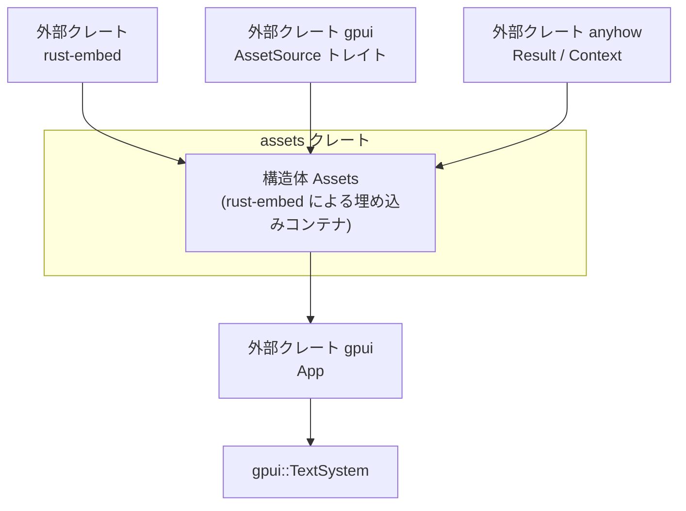
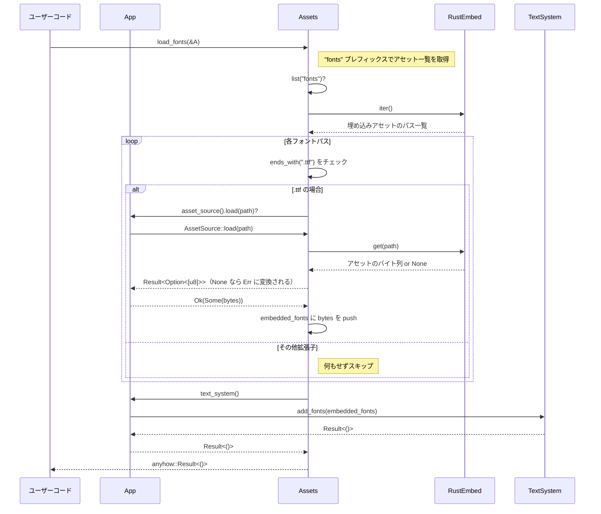

# assets/ ディレクトリ解説

## 1. ざっくり一言

`assets` クレートは、プロジェクト内のフォント・アイコン・画像・テーマなどの静的アセットをコンパイル時にバイナリへ埋め込み、`gpui` の `AssetSource` として提供するための小さなライブラリです。

---

## 2. このモジュールの役割

### 2.1 概要

- このディレクトリ（`assets` クレート）は、Zed 本体から切り出された「アセット読み込み専用クレート」です。
- `rust-embed` のマクロでプロジェクトの `assets` ディレクトリ以下のファイルを埋め込み、`Assets` 構造体から読み出せるようにします。
- `gpui::AssetSource` トレイトを実装することで、`gpui::App` から共通のインターフェースでアセットを読み込めるようにします。
- 特にフォントについては、`App` が持つ `TextSystem` に対して埋め込みフォントを一括登録する補助関数を提供します。

### 2.2 アーキテクチャ内での位置づけ

このクレートは、UI フレームワーク `gpui` と、ファイル埋め込みライブラリ `rust-embed` の橋渡しを行う位置づけです。



- `Assets` は `rust-embed` マクロから埋め込み機能（`get`, `iter` など）を受け取ります。
- 同時に `gpui::AssetSource` を実装することで、`gpui::App` から「アセットの供給源（AssetSource）」として利用されます。
- エラー処理には `anyhow::Result` とその拡張トレイト `Context` を使い、エラー時にメッセージを付加します。

### 2.3 設計上のポイント

コードおよびコメントから読み取れる特徴は次のとおりです。

- **責務の分割**
  - アセットの埋め込み処理を Zed のメインクレートから切り出し、ビルド時に `rust-embed` マクロを実行するのはこのクレートだけにしています。
  - これにより、Zed 本体のインクリメンタルビルド時に `rust-embed` マクロを再実行せずに済み、ビルド時間を短縮する意図があります（ファイル先頭のコメントに記載）。

- **状態管理**
  - `pub struct Assets;` はフィールドを持たないユニット構造体であり、内部状態を持たない純粋な「ビュー」であることが分かります。
  - 全てのデータはコンパイル時に埋め込まれており、実行時に追加・削除されません。

- **エラーハンドリングの方針**
  - `AssetSource::load` 実装では、アセットが見つからなかった場合に `Ok(None)` ではなく `Err` を返すようになっています。
  - `anyhow::Context` を利用して `"loading asset at path ..."` という文脈付きのメッセージを付与し、デバッグしやすい形にしています。
  - フォント読み込み関連では `.unwrap()` / `.expect()` を使用しており、アセットが存在しない状態は「プログラム上ありえない前提」として扱われています。

---

## 3. 主要な機能一覧

このクレートが提供する主要な機能は次のとおりです。

- `rust-embed` による静的アセットのバイナリ埋め込み
- `gpui::AssetSource` トレイトの実装
  - パス指定でアセットのバイト列を読み込む (`load`)
  - プレフィックスでアセットパス一覧を取得する (`list`)
- フォント関連のユーティリティ
  - `fonts` ディレクトリ以下の `.ttf` フォントを `gpui::TextSystem` に一括登録する (`load_fonts`)
  - テスト用フォント (`fonts/lilex/Lilex-Regular.ttf`) を 1 つだけ読み込む (`load_test_fonts`)

---

## 4. 関数・構造体の解説

### 4.1 型一覧

| 名前     | 種別       | 役割 / 用途 |
|----------|------------|-------------|
| `Assets` | 構造体（ユニット構造体） | コンパイル時に埋め込まれたアセット群へのアクセスポイント。`gpui::AssetSource` を実装し、`App` からのアセット読み込みを担当します。 |

`Assets` にはユーザー定義フィールドはなく、`rust-embed` マクロによって付与された関連関数（`get` / `iter` など）と、トレイト実装・補助メソッドが機能の中心になっています。

### 4.2 関数詳細

#### `impl AssetSource for Assets::load(&self, path: &str) -> Result<Option<std::borrow::Cow<'static, [u8]>>>`

**概要**

- 指定されたパスに対応する埋め込みアセットを読み込み、バイト列として返します。
- この実装では、アセットが存在しない場合はエラー（`Err`）とし、`Ok(None)` は返しません。

**引数**

| 引数名 | 型     | 説明 |
|--------|--------|------|
| `path` | `&str` | 埋め込まれたアセットへのパス。`rust-embed` の `#[folder = "../../assets"]` からの相対パス（例: `"fonts/MyFont.ttf"`）です。 |

**戻り値**

- `gpui::Result<Option<Cow<'static, [u8]>>>`
  - `Ok(Some(bytes))`: アセットのバイト列が見つかった場合。
  - `Err(e)`: アセットが見つからない、またはその他の問題が発生した場合。
  - この実装では `Ok(None)` は発生しない形になっています。

**内部処理の流れ**

1. `Self::get(path)` を呼び出し、`rust-embed` マクロが生成した API からアセットを検索します。
   - ここでの戻り値は `Option<EmbeddedFile>` のような型と推測されます（`.data` フィールドを参照しているため）。
2. `map(|f| Some(f.data))` によって、`Option<EmbeddedFile>` を `Option<Option<Cow<'static, [u8]>>>` に変換します。
   - 見つかった場合: `Some(EmbeddedFile)` → `Some(Some(f.data))`
   - 見つからない場合: `None` → `None`
3. `with_context(|| format!("loading asset at path {path:?}"))` を呼び出し、`Option` を `Result` に変換しつつ、「どのパスの読み込みに失敗したか」という文脈メッセージを付与します。
   - `Some(...)` の場合: `Ok(Some(data))`
   - `None` の場合: `"loading asset at path ..."` を持つ `Err(anyhow::Error)` に変換されます。

**Examples（使用例）**

単純にアセットを読み込んで使用する例です。

```rust
use assets::Assets;                 // このクレートの Assets 型をインポート
use gpui::Result;                   // gpui が定義している Result 型（anyhow::Result のエイリアスと推測されます）

fn load_logo() -> Result<()> {      // アセット読み込みを行う関数
    let assets = Assets;            // ユニット構造体なのでフィールドなしで生成できる

    // "images/logo.png" というパスのアセットを読み込む
    let bytes = assets
        .load("images/logo.png")?   // 読み込みに失敗すると Err を返して早期リターンする
        .expect("埋め込みアセットが存在する前提"); // Ok(None) は返らない実装だが、型上 Option を unwrap する

    // bytes（画像のバイト列）をここで利用する
    // 例: 画像ローダーに渡す、ハッシュを計算する、など

    Ok(())
}
```

**Errors / Panics**

- `Err` になる条件
  - `Self::get(path)` が `None` を返した場合（指定パスに埋め込みアセットが存在しない）。
  - `anyhow::Context` による変換で `"loading asset at path \"...\""` を含んだ `anyhow::Error` が生成されます。
- panic
  - この関数内では `panic!` 相当の操作は行っていません。
  - ただし、呼び出し側が `unwrap()` などを使えばそこで panic になる可能性があります。

**Edge cases（エッジケース）**

- 空文字列 `""` を渡した場合
  - `Self::get("")` の挙動は `rust-embed` に依存しますが、通常は一致するファイルがないため `None` → `Err` になると考えられます。
- 存在しないパス（タイプミスなど）
  - 同様に `None` → `Err` となります。
- パスの区切り
  - コードからは OS ごとの扱いは分かりませんが、`"fonts/..."` のように `/` 区切りのパス文字列を前提としているように見えます。

**使用上の注意点**

- `AssetSource` の慣習として「見つからなければ `Ok(None)` を返す」実装がありえますが、この実装は「見つからないと `Err`」です。
  - 呼び出し側は「アセットが必須である」という前提で扱うことになります。
- `path` 文字列は `rust-embed` の `#[folder]` 指定を基準にした相対パスです。
  - パスのミスがそのままエラーにつながるため、テスト等でカバーしておくと安全です。

---

#### `impl AssetSource for Assets::list(&self, path: &str) -> Result<Vec<SharedString>>`

**概要**

- 埋め込まれたアセットのパス一覧の中から、指定したプレフィックスで始まるものだけを列挙します。
- 返り値は `gpui::SharedString` のベクタであり、`gpui` 内で共有可能な文字列として扱われます。

**引数**

| 引数名 | 型     | 説明 |
|--------|--------|------|
| `path` | `&str` | 絞り込みに使用するパスのプレフィックス。例: `"fonts"` や `"fonts/lilex"` など。 |

**戻り値**

- `gpui::Result<Vec<SharedString>>`
  - 成功時: `path` で始まるパスだけを集めた `Vec<SharedString>`。
  - 失敗時: `anyhow::Error` を含む `Err`（この関数内では明示的なエラー要因は見当たりませんが、`Result` でラップされています）。

**内部処理の流れ**

1. `Self::iter()` を呼び出して、埋め込まれている全アセットのパス列挙を開始します（`rust-embed` マクロが提供する API）。
2. イテレータに対して `filter_map` を適用します。
   - 各パス `p` について、`p.starts_with(path)` が `true` の場合だけ `Some(p.into())` として `SharedString` に変換する。
   - 一致しないパスは `None` としてスキップされます。
3. `collect()` により、条件に一致したパスだけを `Vec<SharedString>` にまとめ、`Ok(...)` で返します。

**Examples（使用例）**

`fonts` ディレクトリ以下の全アセットパスを取得する例です。

```rust
use assets::Assets;                  // Assets 型
use gpui::{Result, SharedString};    // gpui の共通型

fn list_font_assets() -> Result<Vec<SharedString>> {
    let assets = Assets;             // 埋め込みアセットへのアクセスオブジェクト

    // "fonts" で始まるすべてのパスを取得する
    let font_paths = assets.list("fonts")?; 

    // 取得したパスを呼び出し元にそのまま返す
    Ok(font_paths)
}
```

**Errors / Panics**

- この関数本体では、明示的に `Err` を生成していません。
- `Self::iter()` は `rust-embed` によるコンパイル時に生成された静的データにアクセスするだけなので、通常はエラーが発生しないと考えられます。
- よって、`Err` が返る可能性は非常に低いと考えられますが、型としては `Result` になっています。

**Edge cases（エッジケース）**

- 対応するパスが 1 つも存在しない場合
  - 空の `Vec`（長さ 0）を `Ok` として返します。
- `path` が空文字列の場合
  - `p.starts_with("")` は常に `true` なので、存在する全アセットのパスが列挙されます。
- `path` の末尾に `/` があるかどうか
  - プレフィックス一致なので、`"fonts"` と `"fonts/"` では結果が異なる可能性があります。
  - この点は呼び出し側で意識して指定する必要があります。

**使用上の注意点**

- 返り値の順序は `Self::iter()` に依存しており、特別なソートは行っていません。
  - 並び順に意味を持たせたい場合は、呼び出し側でソートする必要があります。
- `path` は単なる「文字列プレフィックス」であり、ディレクトリ境界などの概念は扱っていません（`"fontsX"` なども `"fonts"` プレフィックスと一致しうる点に注意が必要です）。

---

#### `Assets::load_fonts(&self, cx: &App) -> anyhow::Result<()>`

**概要**

- `fonts` ディレクトリ以下の埋め込みアセットのうち、拡張子 `.ttf` を持つファイルをすべて読み込み、`cx` が持つ `TextSystem` に登録します。
- アプリケーション起動時などに一括フォント登録を行う用途が想定されます。

**引数**

| 引数名 | 型      | 説明 |
|--------|---------|------|
| `cx`   | `&App`  | `gpui` のアプリケーションコンテキスト。`asset_source()` や `text_system()` にアクセスするために使用します。 |

**戻り値**

- `anyhow::Result<()>`
  - 成功時: `Ok(())`
  - 失敗時: アセットの列挙・読み込み・フォント追加のいずれかで発生した `anyhow::Error` を返します。

**内部処理の流れ**

1. `self.list("fonts")?` を呼び出し、`"fonts"` で始まる全アセットパスを取得します。
   - `?` によってエラーがあればそのまま返されます。
2. 空のベクタ `embedded_fonts` を用意し、フォントバイト列を順次追加します。
3. 取得した各 `font_path` についてループ処理を行います。
   - `if font_path.ends_with(".ttf")` で `.ttf` のみを対象に絞り込みます。
   - `.ttf` の場合は次の処理を行います。
     1. `cx.asset_source().load(&font_path)?` でアセットを読み込みます。
        - ここで `?` により、エラーがあれば `load_fonts` 自体も `Err` を返します。
     2. 返り値の `Option` に対して `.expect("Assets should never return None")` を呼び出し、`Some` であることを前提とします。
        - `Ok(None)` が返ってきた場合は panic になります。
     3. 取得したバイト列を `embedded_fonts` に push します。
4. ループ終了後、`cx.text_system().add_fonts(embedded_fonts)` を呼び出し、`TextSystem` にフォントを一括登録します。
   - 戻り値は `anyhow::Result<()>` であり、呼び出し元にそのまま返されます。

**Examples（使用例）**

アプリケーションの初期化時に、すべての TTF フォントをロードする例です。

```rust
use assets::Assets;      // 埋め込みアセットを扱う構造体
use gpui::App;           // アプリケーションコンテキスト
use anyhow::Result;      // エラー型

fn init_fonts(app: &App) -> Result<()> {
    let assets = Assets;                 // ユニット構造体 Assets のインスタンスを作成

    // fonts ディレクトリ以下の .ttf フォントをすべて TextSystem に登録する
    assets.load_fonts(app)?;             // 失敗すると Err が返り、? でそのまま伝播する

    Ok(())                               // 正常終了
}
```

**Errors / Panics**

- `Err` になる条件
  - `self.list("fonts")` が `Err` を返した場合。
  - `cx.asset_source().load(&font_path)` が `Err` を返した場合（アセット未登録など）。
  - `cx.text_system().add_fonts(embedded_fonts)` が `Err` を返した場合（フォントのパース失敗などが想定されますが、このチャンクからは詳細不明です）。
- panic になる条件
  - `cx.asset_source().load(&font_path)` が `Ok(None)` を返した場合。
    - このとき `.expect("Assets should never return None")` が発火して panic します。
    - 現在の `Assets::load` 実装では `Ok(None)` は発生しないため、「他の `AssetSource` 実装」を使った場合などに起こりうると考えられます。

**Edge cases（エッジケース）**

- `fonts` ディレクトリ以下に `.ttf` ファイルが 1 つも存在しない場合
  - `font_paths` は空、または `.ttf` でフィルタした結果が空になります。
  - `embedded_fonts` が空のまま `add_fonts` に渡されます。
    - `TextSystem::add_fonts` が空リストをどのように扱うかは、このチャンクからは分かりません。
- 一部の `.ttf` が壊れている場合
  - `load` は成功しても、`add_fonts` 内部でエラーになる可能性があります（推測です）。
  - その場合 `Err` が返され、`load_fonts` も `Err` になります。

**使用上の注意点**

- `cx.asset_source()` が `Assets` を返すようにアプリ側で設定されている前提があります。
  - そうでない場合、`Ok(None)` が返る `AssetSource` 実装では panic になる可能性があります。
- フォント拡張子は厳密に文字列終端が `".ttf"` かどうかで判定しています。
  - `.otf` など他形式のフォントはこの関数では読み込まれません。

---

#### `Assets::load_test_fonts(&self, cx: &App)`

**概要**

- 特定のテスト用フォント `"fonts/lilex/Lilex-Regular.ttf"` を 1 つだけ `TextSystem` に登録します。
- 戻り値は `()` であり、エラーはすべて `unwrap()` による panic として扱われます。
- 主にテスト・開発用に利用されるユーティリティと解釈できます（コードからの推測）。

**引数**

| 引数名 | 型      | 説明 |
|--------|---------|------|
| `cx`   | `&App`  | `gpui` のアプリケーションコンテキスト。`text_system()` を呼び出すために使用します。 |

**戻り値**

- `()`（エラー型なし）
  - 内部で `.unwrap()` を使用しており、失敗時は panic します。

**内部処理の流れ**

1. `self.load("fonts/lilex/Lilex-Regular.ttf")` を呼び出してフォントバイト列を読み込みます。
2. `.unwrap()` により `Result` を強制的に `Ok` として扱います。
   - `Err` の場合は即座に panic します。
3. 更に `.unwrap()` により `Option` を強制的に `Some` として扱います。
   - `None` の場合も panic します。
4. 取得した 1 つのフォントバイト列から `vec![...]` を作成します。
5. `cx.text_system().add_fonts(vec![...]).unwrap()` を呼び出し、フォントを登録します。
   - `add_fonts` が `Err` を返した場合も panic します。

**Examples（使用例）**

テストコードなどで、特定のフォントだけを読み込みたい場合の例です。

```rust
use assets::Assets;      // Assets 構造体
use gpui::App;           // アプリケーションコンテキスト

fn load_test_font(app: &App) {
    let assets = Assets; // ユニット構造体のインスタンス

    // テスト用フォント "fonts/lilex/Lilex-Regular.ttf" を 1 つだけ読み込む
    // エラー時は panic する実装である点に注意
    assets.load_test_fonts(app);
}
```

**Errors / Panics**

- この関数は `Result` を返さず、内部で `.unwrap()` を使用しているため、次の条件で panic します。
  - `"fonts/lilex/Lilex-Regular.ttf"` が埋め込みに存在しない、または読み込みエラーが発生した場合。
  - `cx.text_system().add_fonts(...)` が `Err` を返した場合。
- いずれも「テスト用フォントが存在しない／利用できないとテスト環境が成立しない」という前提に基づいていると解釈できます。

**Edge cases（エッジケース）**

- パス違い・ファイル名変更などで `"fonts/lilex/Lilex-Regular.ttf"` が存在しなくなった場合、必ず panic します。
- 初期化順序などにより `cx.text_system()` が利用不能な状態で呼び出した場合も、内部でエラーとなり panic に至る可能性があります。

**使用上の注意点**

- 本番コードではなくテストコードやデバッグ用途で使うことを前提とした設計に見えます。
- エラーをハンドリングしたい場合は、この関数ではなく `load_fonts` や `load` を用いて、呼び出し側で `Result` を処理する方が安全です。

---

### 4.3 その他の関数

このチャンクには、上記以外の公開関数・メソッドは定義されていません。

---

## 5. データフロー

ここでは、`Assets::load_fonts` を用いてフォントを読み込む典型的な流れを示します。

### 5.1 処理の要点

- アプリケーションは `Assets` インスタンスと `App` コンテキストを用意します。
- `load_fonts` が `fonts` ディレクトリ以下の `.ttf` を列挙し、それぞれを `cx.asset_source().load(...)` 経由で読み込みます。
- 最後に、集めたフォントバイト列を `TextSystem::add_fonts` に渡して登録します。

### 5.2 シーケンス図



このフローから分かるように、フォントの存在・読み込み・登録のいずれかで問題が発生すると、`load_fonts` は `Err` を返して処理を中断します。

---

## 6. 使い方（How to Use）

### 6.1 基本的な使用方法

アプリケーション側で `Assets` を使ってフォントをロードする典型的なコードフローです。

```rust
use assets::Assets;  // 本クレートの Assets 構造体
use gpui::App;       // アプリケーションコンテキスト（gpui 側で定義）
use anyhow::Result;  // 統一的なエラー型

fn init_app_fonts(app: &App) -> Result<()> {
    let assets = Assets;        // ユニット構造体 Assets のインスタンスを作成

    // 埋め込み済みの .ttf フォントをすべて TextSystem に登録する
    assets.load_fonts(app)?;    // 失敗すると Err が返り、? で呼び出し元に伝播する

    Ok(())                     // 正常終了
}
```

この例では、`assets` クレートを導入し、アプリ起動時の初期化処理の一環としてフォントを一括ロードしています。

### 6.2 よくある使用パターン

#### パターン 1: 任意のアセットをバイト列として読む

```rust
use assets::Assets;    // 埋め込みアセットアクセス用
use gpui::Result;      // gpui の Result 型

fn load_image_bytes() -> Result<Vec<u8>> {
    let assets = Assets;                            // ユニット構造体のインスタンス

    // 画像アセット "images/logo.png" を読み込む
    let data = assets
        .load("images/logo.png")?                  // 見つからない場合は Err になる
        .expect("images/logo.png は必須アセット");  // Option を unwrap する

    Ok(data.to_vec())                              // Cow<[u8]> から Vec<u8> に変換して返す
}
```

#### パターン 2: 特定ディレクトリ配下のアセット一覧を取得する

```rust
use assets::Assets;              // Assets 構造体
use gpui::{Result, SharedString};

fn list_theme_files() -> Result<Vec<SharedString>> {
    let assets = Assets;                     // インスタンスを作成

    // themes ディレクトリ配下のすべてのアセットパスを取得する
    let paths = assets.list("themes")?;      // 一致するものがなければ空の Vec になる

    Ok(paths)                               // 呼び出し元が必要に応じて処理する
}
```

#### パターン 3: テスト専用フォントだけを読み込む

```rust
use assets::Assets;  // Assets 構造体
use gpui::App;       // App 型

fn setup_test_font(app: &App) {
    let assets = Assets;             // インスタンスを生成

    // テスト用フォントを読み込む。エラー時は panic する前提。
    assets.load_test_fonts(app);     
}
```

### 6.3 使用上の注意点（まとめ）

- **アセットの存在前提**
  - `AssetSource::load` の実装は「見つからなければ `Err`」という仕様であり、`Ok(None)` は返しません。
  - 特にフォントまわりでは `.expect` / `.unwrap` を使っており、「埋め込みアセットは必ず存在する」という前提でコードが書かれています。

- **パス指定**
  - パスは `#[folder = "../../assets"]` からの相対パスです。
  - `fonts/...`, `icons/...`, `images/...`, `themes/...`, `sounds/...`, `prompts/...`, `*.md` などが埋め込み対象ですが、`themes/src/*` と `*.DS_Store` は除外されています。
  - 実際のディレクトリ構成が変わると、パスが無効になってエラーや panic の原因になります。

- **`AssetSource` の実装差異**
  - `load_fonts` は `cx.asset_source().load(...)` の結果に対して `.expect("Assets should never return None")` を呼んでいます。
  - `AssetSource::load` が `Ok(None)` を返す別実装を使っていると、この部分で panic になる可能性があります。
  - `App` に登録する `AssetSource` が本クレートの `Assets` であることを前提にしている点に注意が必要です。

- **ビルドの前提**
  - アセットはコンパイル時に埋め込まれるため、`../../assets` ディレクトリ内のファイルを更新した場合は、クレートを再ビルドする必要があります（`rust-embed` の一般的な仕様に基づく前提）。

---

## 7. 関連ファイル

| パス                       | 役割 / 関係 |
|----------------------------|------------|
| `assets/Cargo.toml`        | `assets` クレートの定義ファイル。ライブラリのエントリポイントを `src/assets.rs` に指定し、`anyhow` / `gpui` / `rust-embed` への依存関係を宣言しています。 |
| `assets/src/assets.rs`     | 本クレートのメイン実装ファイル。`Assets` 構造体の定義、`rust-embed` マクロによる埋め込み設定、`gpui::AssetSource` 実装およびフォント関連の補助メソッドを含みます。 |
| `../../assets/` ディレクトリ | 実際の静的アセットが配置されるディレクトリ。`#[folder = "../../assets"]` により、この内容がコンパイル時に `Assets` に埋め込まれます（このディレクトリは本チャンクには含まれていませんが、パス指定から存在が分かります）。 |

このディレクトリ（クレート）は非常に小さく、主なエントリポイントは `assets/src/assets.rs` の `Assets` 構造体とそのメソッド群です。利用者は `assets` クレートを依存に追加し、`Assets` を `gpui::App` に結びつけることで、埋め込みアセットへのアクセスを統一的に扱えるようになります。
