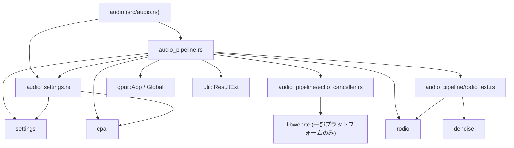
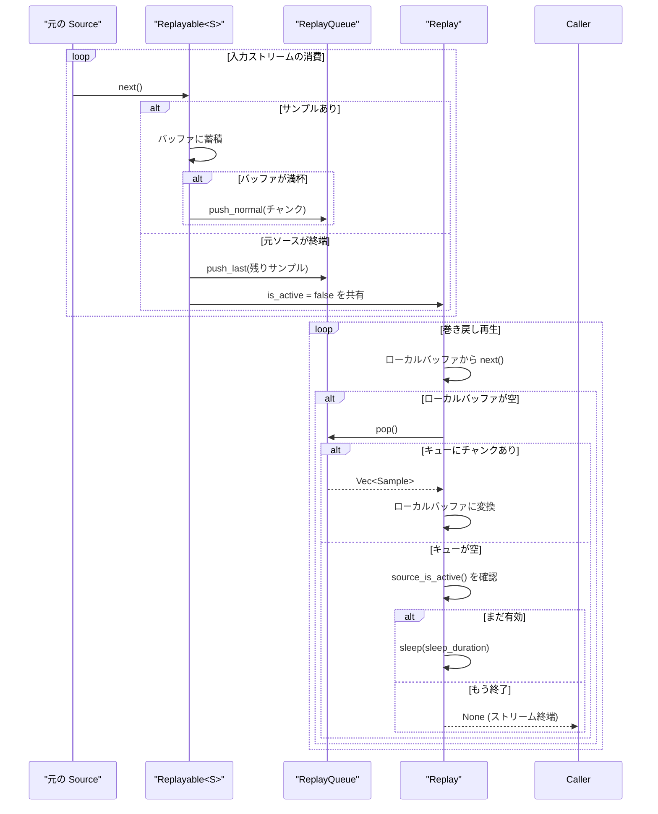

## 1. ざっくり一言

この `audio` クレートは、Zed 内のオーディオまわりをまとめて扱うためのクレートで、  
「オーディオ設定」「デバイス列挙」「UI サウンド再生」「入力ストリーム生成」「エコーキャンセル・リプレイなどの音声ストリーム処理拡張」を提供します。

---

## 2. このモジュールの役割

### 2.1 概要

- このクレートは **アプリケーションの音声入出力を一括管理するため** に存在し、次の機能を提供します。
  - `AudioSettings` / `LIVE_SETTINGS` によるオーディオ設定の管理と、リアルタイムスレッドからの参照
  - `Audio` グローバルによる UI 効果音の再生・出力デバイスの保持
  - `open_input_stream` / `open_output_stream` によるマイク・スピーカーストリームのオープン
  - `EchoCanceller` と `RodioExt` によるエコーキャンセル・サンプルレート変換・モノラル化・リプレイバッファなど、Rodio ソースの拡張

### 2.2 アーキテクチャ内での位置づけ

クレート内の主なモジュールと、外部クレートとの依存関係はおおよそ次のようになっています。



- `audio.rs` はクレートのエントリーポイントで、サブモジュールの型・関数を再エクスポートします。
- `audio_pipeline.rs` が実際のデバイス操作や再生処理の中核で、その内部で `echo_canceller` と `rodio_ext` を利用しています。
- `audio_settings.rs` は設定システム（`settings` クレート）と GPUI の `SettingsStore` と連携し、`LIVE_SETTINGS` 経由でオーディオスレッドから設定値にアクセスできるようにします。

### 2.3 設計上のポイント

コードから読み取れる主な設計上の特徴は以下の通りです。

- **GPUI の Global を前提とした設計**
  - `Audio` や `AvailableAudioDevices` は `gpui::Global` を実装し、`App` コンテキストからグローバル状態として参照・更新されます。
- **リアルタイムスレッド向けの設定アクセス**
  - `LIVE_SETTINGS` は `AtomicBool` を使っており、ロックなしで音声スレッドから `auto_microphone_volume` を参照できるようになっています。
- **エコーキャンセルのプラットフォーム依存実装**
  - `EchoCanceller` は `cfg` により、libwebrtc ベースの実装と「何もしないダミー実装」を切り替えています。
- **Rodio ソースのユーティリティ拡張**
  - `RodioExt` トレイトを通じて、任意の `rodio::Source` に対して
    - バッファ単位の処理・観測
    - 「巻き戻し再生」用のリプレイバッファ
    - サンプルレート変換・モノラル化・最大サンプル数の制限
    - ノイズ除去（`denoise::Denoiser`）
    をメソッドチェーンで適用できるようになっています。
- **短い UI サウンドのキャッシュ**
  - `Audio` 内で `HashMap<Sound, Buffered<Decoder<Cursor<Vec<u8>>>>>` を持ち、効果音の WAV デコード結果をキャッシュして再利用します。

---

## 3. 主要な機能一覧

このクレートが提供する主な機能を列挙します。

- オーディオ設定管理:
  - `AudioSettings`: 自動マイク音量・入出力デバイスの設定値
  - `LIVE_SETTINGS`: 音声スレッドから参照可能な `auto_microphone_volume`
  - `init`: `LIVE_SETTINGS` を `SettingsStore` と連携させる初期化
- デバイス列挙と管理:
  - `AvailableAudioDevices`: 利用可能なデバイス一覧を保持
  - `ensure_devices_initialized`: バックグラウンドでデバイス一覧を取得し、Global にキャッシュ
  - `resolve_device`: 任意またはデフォルトの入出力デバイスを `cpal::Device` として解決
- UI サウンドの再生:
  - `Sound` 列挙体: 参加・退出・ミュートなどの効果音の種別
  - `Audio::play_sound`: `Sound` に応じた WAV アセットを読み込み（キャッシュ）し再生
  - `Audio::end_call`: 通話終了時などに出力ストリームを破棄
- 入出力ストリーム:
  - `open_input_stream`: 選択されたまたはデフォルトのマイクから `rodio::microphone::Microphone` を開く
  - `open_output_stream`: エコーキャンセル付きミキサ出力ストリームを開く
  - `open_test_output`: テスト用の出力ストリーム（ミキサ）を開く
- エコーキャンセル:
  - `EchoCanceller`: libwebrtc APM によるエコーキャンセル（対応プラットフォーム）またはダミー実装
  - 出力ストリームのサンプルを `inspect_buffer` でフックし、エコーキャンセラの reverse stream に供給
- Rodio ソース拡張 (`RodioExt`):
  - `process_buffer`: 一定長バッファでの書き換え処理
  - `inspect_buffer`: 一定長バッファでの読み取り専用コールバック
  - `replayable`: 一定時間分の「巻き戻し再生」を可能にする `Replay` / `Replayable`
  - `take_samples`: 最大サンプル数でストリームを打ち切る
  - `denoise`: `denoise::Denoiser` でノイズ除去する
  - `constant_params` / `constant_samplerate`: チャンネル数・サンプルレートの固定化
  - `possibly_disconnected_channels_to_mono`: 切断されている可能性のある複数チャネルをモノラルに変換

---

## 4. 関数・構造体の解説

### 4.1 主な型一覧

| 名前 | 種別 | 定義ファイル | 役割 / 用途 |
|------|------|--------------|------------|
| `Sound` | 列挙体 | `audio/src/audio.rs` | UI 効果音の種類（参加・退出・ミュートなど）を表現する。 |
| `AudioSettings` | 構造体 | `audio_settings.rs` | オーディオ関連設定（自動マイク音量・入出力デバイス）を保持し、`Settings` として読み書きする。 |
| `LiveSettings` | 構造体 | `audio_settings.rs` | オーディオスレッドから読むための「ライブな」設定（現在は `auto_microphone_volume` のみ）を保持する。 |
| `LIVE_SETTINGS` | `static` 変数 | `audio_settings.rs` | `LiveSettings` のグローバルインスタンス。`init` により `SettingsStore` と同期される。 |
| `Audio` | 構造体 | `audio_pipeline.rs` | 出力ミキサハンドル・エコーキャンセラ・効果音ソースキャッシュを保持するグローバルオーディオ管理構造体。 |
| `EchoCanceller` | 構造体 | `echo_canceller.rs` | エコーキャンセル処理を行う。プラットフォームに応じて libwebrtc 実装またはダミー実装に切り替わる。 |
| `AudioDeviceInfo` | 構造体 | `audio_pipeline.rs` | `cpal::DeviceId` と `DeviceDescription` を束ねたデバイス情報。表示用の `Display` 実装を持つ。 |
| `AvailableAudioDevices` | 構造体（タプル構造体） | `audio_pipeline.rs` | 利用可能なオーディオデバイス一覧を `Global` として保持する。 |
| `RodioExt` | トレイト | `rodio_ext.rs` | 任意の `rodio::Source` に対して、バッファ処理・リプレイ・ノイズ除去・モノラル化等の拡張メソッドを提供する。 |
| `Replay` | 構造体 | `rodio_ext.rs` | 過去の音声を一定時間分バッファして「巻き戻し再生」するための `Source` 実装。 |
| `Replayable<S>` | 構造体 | `rodio_ext.rs` | 元の `Source` をラップし、サンプルを `ReplayQueue` に書き込む側の `Source`。 |
| `ProcessBuffer<N,S,F>` | 構造体 | `rodio_ext.rs` | N サンプル単位でバッファを加工してから出力する `Source`。 |
| `InspectBuffer<N,S,F>` | 構造体 | `rodio_ext.rs` | N サンプル単位でバッファを観測するが、サンプル自体は変更しない `Source`。 |
| `ConstantSampleRate<S>` | 構造体 | `rodio_ext.rs` | `SampleRateConverter` を用いてサンプルレートを一定に変換する `Source`。 |
| `ToMono<S>` | 構造体 | `rodio_ext.rs` | 複数チャネルを「実際に音が出ているチャネルのみ」で平均してモノラル化する `Source`。 |
| `TakeSamples<S>` | 構造体 | `rodio_ext.rs` | 指定した最大サンプル数だけサンプルを流す `Source`。 |
| `ReplayQueue` | 構造体（内部） | `rodio_ext.rs` | `Replay` と `Replayable` 間でサンプルチャンクを受け渡しするリングバッファ。内部専用。 |
| `ReplayDurationTooShort` | エラー型 | `rodio_ext.rs` | `replayable` に 100ms 未満のリプレイ長を指定したときのエラー。 |

### 4.2 重要な関数・メソッド詳細（7 件）

#### `Audio::play_sound(sound: Sound, cx: &mut App)`

**概要**

- 指定された `Sound` に対応する WAV アセット（`sounds/<name>.wav`）を読み込み（またはキャッシュから取得）し、現在の出力デバイスで再生します。

**引数**

| 引数名 | 型 | 説明 |
|--------|----|------|
| `sound` | `Sound` | 再生したい効果音の種類。 |
| `cx` | `&mut App` | GPUI のアプリケーションコンテキスト。Global 状態の更新に使用。 |

**戻り値**

- 返り値はありません（`()`）。  
  失敗した場合は `util::ResultExt::log_err` によりログ出力され、処理は継続します。

**内部処理の流れ**

1. 現在の `AudioSettings` を `AudioSettings::get_global(cx)` で取得し、`output_audio_device` を取り出す。
2. `cx.update_default_global` を用いて、`Audio` グローバルを更新するクロージャを実行する。
3. クロージャ内で:
   - `this.sound_source(sound, cx)` を呼び出して、対応する `Source` を取得（またはキャッシュから取得）。エラーは `log_err` でログ出力し、早期終了。
   - `this.ensure_output_exists(output_audio_device)` で出力ミキサ (`Mixer`) を確保。エラー時は同様にログ出力。
   - `output_mixer.add(source)` でミキサにソースを追加し、再生を開始する。

**Examples（使用例）**

```rust
use audio::{Audio, Sound};
use gpui::App;

// 何らかのイベントハンドラ内の例                          // イベントハンドラなど、App コンテキストを持っている場所
fn on_user_joined(cx: &mut App) {                             // ユーザー参加イベントのハンドラ
    Audio::play_sound(Sound::Joined, cx);                     // 参加用の効果音を再生する
}
```

**Errors / Panics**

- ファイル読み込みやデコード、出力ストリーム確立が失敗する可能性がありますが、
  これらは `log_err()` でログに記録され、`play_sound` 自体はパニックせずに戻ります。

**Edge cases（エッジケース）**

- `sounds/<name>.wav` が存在しない場合:
  - `sound_source` 内で `with_context(|| format!("No asset available for path {path}"))` により `Err` となり、ログ出力されます。
- 出力デバイスが存在しない場合:
  - `open_output_stream` が `Err` を返し、ログ出力されます。

**使用上の注意点**

- この関数は `App` コンテキスト内で呼び出すことが前提です（`Audio` が `Global` として管理されているため）。
- パフォーマンス上、同じ `Sound` を何度も再生する場合は、内部キャッシュにより WAV デコードコストが抑えられます。

---

#### `open_input_stream(device_id: Option<DeviceId>) -> anyhow::Result<rodio::microphone::Microphone>`

**概要**

- 指定された（またはデフォルトの）入力デバイスから、マイク入力用の Rodio ストリームを開きます。

**引数**

| 引数名 | 型 | 説明 |
|--------|----|------|
| `device_id` | `Option<DeviceId>` | 明示したい入力デバイス ID。`None` の場合はデフォルト入力デバイスが選択される。 |

**戻り値**

- `Ok(Microphone)`:
  - 選択されたデバイスに対する `rodio::microphone::Microphone`。`Source` として扱える入力ストリーム。
- `Err(anyhow::Error)`:
  - デバイス列挙・設定・ストリームオープンのいずれかに失敗した場合。

**内部処理の流れ**

1. `MicrophoneBuilder::new()` でビルダーを作成。
2. `Some(id)` の場合:
   - `rodio::microphone::available_inputs()?` から入力候補を列挙し、`input.clone().into_inner().id()? == id` のものを探す。
   - 見つかれば `builder.device(input)` に設定し、見つからなければ `builder.default_device()?` を呼び出す。
3. `None` の場合:
   - `builder.default_device()?` を呼び出す。
4. 選ばれたビルダーに対して:
   - `default_config()?`
   - `prefer_sample_rates([SAMPLE_RATE, SAMPLE_RATE*2, SAMPLE_RATE*3, SAMPLE_RATE*4])`
   - `prefer_channel_counts([1,2,3,4])`
   - `prefer_buffer_sizes(512..)`
   - `open_stream()?`
5. 開いたストリームの設定をログに出力し、`Ok(stream)` を返す。

**Examples（使用例）**

```rust
use audio::{open_input_stream, AudioSettings};
use gpui::App;

fn start_microphone(cx: &mut App) -> anyhow::Result<()> {              // マイク入力開始処理
    let settings = AudioSettings::get_global(cx);                      // 現在のオーディオ設定を取得
    let device_id = settings.input_audio_device.clone();               // 選択中の入力デバイス ID

    let microphone = open_input_stream(device_id)?;                    // マイクストリームを開く

    // microphone は rodio::Source を実装している前提で、ここから処理を続ける
    // 例: denoise や ToMono などの拡張を適用して再生 / 送信などに使う
    Ok(())
}
```

**Errors / Panics**

- デバイス列挙やデフォルトデバイス取得が失敗する場合、`anyhow::Error` としてエラーを返します。
- この関数自体はパニックしません。

**Edge cases**

- `device_id` が指定されたが、`available_inputs` に含まれない場合:
  - デフォルトデバイスにフォールバックします。
- 希望するサンプルレート・チャネル数・バッファサイズがデバイス側でサポートされない場合:
  - Rodio 側で最適な設定にフォールバックします。具体的な挙動は `rodio::microphone` に依存します。

**使用上の注意点**

- この関数はスレッドブロッキングな I/O を行う可能性があるため、必要に応じてバックグラウンドスレッドで呼び出す必要があります（コードからは実行スレッドの指定はされていません）。
- 戻り値の `Microphone` をどのスレッドで消費するかは呼び出し側の責務です。

---

#### `open_output_stream(device_id: Option<DeviceId>, echo_canceller: EchoCanceller) -> anyhow::Result<(MixerDeviceSink, Mixer)>`

**概要**

- 出力デバイスに対して Rodio のミキサストリームを開き、そのストリーム経由で出力される音声をエコーキャンセラに渡すように構成します。

**引数**

| 引数名 | 型 | 説明 |
|--------|----|------|
| `device_id` | `Option<DeviceId>` | 明示したい出力デバイス ID。`None` の場合はデフォルト出力デバイスが選択される。 |
| `echo_canceller` | `EchoCanceller` | エコーキャンセル処理を行うインスタンス。複製して内部で使用される。 |

**戻り値**

- `Ok((MixerDeviceSink, Mixer))`:
  - `MixerDeviceSink`: 実際のオーディオデバイスへの出力ハンドル。
  - `Mixer`: アプリ側が音声ソースを追加するためのミキサ。
- `Err(anyhow::Error)`:
  - デバイス取得・出力ストリームオープン・ミキサ作成に失敗した場合。

**内部処理の流れ**

1. `resolve_device(device_id.as_ref(), false)` で出力用 `cpal::Device` を取得。
2. `DeviceSinkBuilder::from_device(device)?` から `MixerDeviceSink` を開く。
   - 失敗時には `context("Could not open output stream")` でエラーをラップ。
   - `output_handle.log_on_drop(false)` でドロップ時のログを抑制。
3. `rodio::mixer::mixer(CHANNEL_COUNT, SAMPLE_RATE)` により `(Mixer, Source)` を作成。
4. ミキサが空だと停止してしまうため、`Zero` ソースを追加しておく:
   - `output_mixer.add(rodio::source::Zero::new(CHANNEL_COUNT, SAMPLE_RATE));`
5. エコーキャンセル用に、ミキサの出力ソース `source` を `inspect_buffer::<BUFFER_SIZE, _>` でラップし、
   各バッファごとに `echo_canceller.process_reverse_stream` を呼び出す:
   - `BUFFER_SIZE` は 10ms 相当のサンプル数（`SAMPLE_RATE` と `CHANNEL_COUNT` から算出）。
6. 構築した `echo_cancelling_source` を `output_handle.mixer().add(...)` により実際の出力チェーンに追加。
7. `(output_handle, output_mixer)` を返す。

**Examples（使用例）**

```rust
use audio::{open_output_stream, AudioSettings};
use audio::audio_pipeline::EchoCanceller; // crate 内部から使う場合の例
use gpui::App;

fn start_output_with_echo(cx: &mut App) -> anyhow::Result<()> {               // エコーキャンセル付き出力開始
    let settings = AudioSettings::get_global(cx);                             // 出力デバイス設定を取得
    let device_id = settings.output_audio_device.clone();                     // 選択中の出力デバイス ID
    let echo = EchoCanceller::default();                                      // エコーキャンセラを初期化

    let (sink, mixer) = open_output_stream(device_id, echo)?;                // 出力ストリームとミキサを確立

    // mixer に対して効果音やその他の Source を add していく
    // sink は App の状態として保持し、アプリ終了時などにドロップされる
    Ok(())
}
```

**Errors / Panics**

- `resolve_device` や `open_stream` が失敗すると `Err(anyhow::Error)` が返されます。
- `echo_canceller.process_reverse_stream` は、libwebrtc 実装の場合に `expect("Audio input and output threads should not panic")` を使用しているため、
  エラーが返ってきた場合はパニックを引き起こします（fake 実装では何もしません）。

**Edge cases**

- `device_id` が無効な場合:
  - `resolve_device` 内で警告ログを出したうえで、デフォルト出力デバイスにフォールバックします。
- エコーキャンセルが非対応プラットフォーム（Windows gnu / FreeBSD）の場合:
  - `EchoCanceller` はダミー実装となり、`process_reverse_stream` は何も行わず、パニックもしません。

**使用上の注意点**

- `Mixer` は `Audio` 構造体内で保持され、アプリのライフタイム中に再利用されます。頻繁に作り直すとオーバーヘッドになります。
- エコーキャンセルを利用する場合、マイク側でも `EchoCanceller::process_stream` を適切に呼び出す必要がありますが、その呼び出し箇所はこのチャンクには含まれていません。

---

#### `RodioExt::replayable(self, duration: Duration) -> Result<(Replay, Replayable<Self>), ReplayDurationTooShort>`

**概要**

- 任意の `rodio::Source` に対して、指定時間分の履歴を保持し、後から「巻き戻し再生」できるようにするためのペア `(Replay, Replayable<Self>)` を生成します。

**引数**

| 引数名 | 型 | 説明 |
|--------|----|------|
| `self` | `S: Source` | リプレイ機能を付与したい元のソース。 |
| `duration` | `Duration` | 少なくとも保持したい履歴時間。100ms 未満はエラー。 |

**戻り値**

- `Ok((Replay, Replayable<S>))`:
  - `Replayable<S>`: 元ソースをラップし、サンプルを内部キューへチャンク単位で書き込む側。
  - `Replay`: 内部キューからサンプルを読み出して再生する側。
- `Err(ReplayDurationTooShort)`:
  - `duration < 100ms` の場合。

**内部処理の流れ**

1. `duration` が 100ms 未満なら `Err(ReplayDurationTooShort)`。
2. `samples_per_second = sample_rate * channels` を計算。
3. `duration` に必要なサンプル数 `samples_to_queue` を算出し、チャネル数の倍数になるよう切り上げ。
4. 約 100ms 分のサンプル数 `chunk_size` を計算し、同じくチャネル数の倍数に調整。
5. 必要なチャンク数 `chunks_to_queue = samples_to_queue.div_ceil(chunk_size)` を計算。
6. 固定長リングバッファ `ReplayQueue::new(chunks_to_queue, chunk_size)` を生成。
7. `is_active: Arc<AtomicBool>` を `true` で初期化。
8. `Replay` と `Replayable<S>` を生成し、共通の `ReplayQueue` と `is_active` を共有して返す。

**Examples（使用例）**

```rust
use audio::RodioExt;
use rodio::{static_buffer::StaticSamplesBuffer, nz};

// シンプルなバッファを元ソースとする例                       // テスト用の静的サンプルバッファを作る
let source = StaticSamplesBuffer::new(nz!(1), nz!(16_000), &[0.0; 40_000]); 

// 2 秒分の履歴を持つリプレイを作成                        // 2 秒間分の音声を巻き戻せるようにする
let (mut replay, mut live) = source.replayable(std::time::Duration::from_secs(2))
    .expect("duration >= 100ms");                          // 100ms 未満だと Err になる

// live を通常の再生に使いながら                           // live を通常の出力として消費しつつ
let _ = live.by_ref().take(10_000).count();                // 先頭 10,000 サンプルを再生

// 必要なタイミングで replay から過去のサンプルを取得       // 必要な時に replay 側から過去の音を取り出す
let buffered_samples: Vec<_> = replay.take(5_000).collect();
```

**Errors / Panics**

- `duration < 100ms` の場合に `ReplayDurationTooShort` を返します。
- 内部では `ArrayQueue::force_push` を使用しており、パニック条件はコード上には現れていません。

**Edge cases**

- 元ソースが早期に終了した場合:
  - `Replayable` の `next` が最後のチャンクを `push_last` し、`is_active` を `false` に設定します。
  - `Replay` 側はキューが空かつ `source_is_active()` が偽になるとストリーム終端として `None` を返します。
- 元ソースが非常に短い場合:
  - `duration` に応じて確保されるバッファサイズよりも少ないサンプルしか到達しないことがあります。その場合でも動作はしますが、利用可能な履歴長は元ソースの長さに制限されます。

**使用上の注意点**

- `(Replay, Replayable<S>)` の両方を適切に保持・駆動する必要があります。
  - `Replayable` 側がサンプルをキューに供給し続け、`Replay` 側が必要なタイミングでそれを消費する想定です。
- `Replay::next` はデータがない場合に `sleep_duration` だけスレッドスリープします。そのため、リアルタイム性の高いスレッドで呼ぶ場合は、スリープによる影響を考慮する必要があります。

---

#### `RodioExt::process_buffer<const N: usize, F>(self, callback: F) -> ProcessBuffer<N, Self, F>`

**概要**

- 元の `Source` を N サンプル単位のバッファとして読み取り、各バッファに対して書き換え可能なコールバックを適用したうえでサンプルをストリームとして流します。

**引数**

| 引数名 | 型 | 説明 |
|--------|----|------|
| `self` | `S: Source` | 処理対象の元ソース。 |
| `callback` | `F: FnMut(&mut [Sample; N])` | 各バッファごとに呼ばれる書き換え可能なコールバック。 |

**戻り値**

- `ProcessBuffer<N, S, F>`:
  - `Iterator<Item = Sample>` かつ `Source` として振る舞い、バッファ処理済みのサンプルを順次返します。

**内部処理の流れ**

1. 内部に `[Sample; N]` のバッファを持ち、`next` は `buffer` からサンプルを一つずつ返す。
2. バッファをすべて返し終えたら、元ソースから N サンプルを読み込んで `buffer` を埋める。
3. `callback(&mut buffer)` を呼び出し、バッファ内容を任意に変更できる。
4. 再び `buffer[0]` からサンプルを返し始める。
5. 元ソースが N サンプルに満たない時点で終端を迎えた場合は、そこでストリームも終了し、残りの端数サンプルは出力されません（テスト `source_truncates_to_whole_buffers` がこれを検証しています）。

**Examples（使用例）**

```rust
use audio::RodioExt;
use rodio::{static_buffer::StaticSamplesBuffer, nz};

let input = StaticSamplesBuffer::new(nz!(1), nz!(1), &[0.0, 1.0, 2.0, 3.0]);   // 4 サンプルのテストソース

// 各 2 サンプルごとのバッファに +1.0 を加算する例
let processed: Vec<_> = input
    .process_buffer::<2, _>(|buffer| {
        for sample in buffer.iter_mut() {                                     // バッファ内の各サンプルを
            *sample += 1.0;                                                   // 1.0 加算する
        }
    })
    .collect();

assert_eq!(processed, vec![1.0, 2.0, 3.0, 4.0]);                              // 元の [0,1,2,3] が [1,2,3,4] になる
```

**Errors / Panics**

- 特にエラー型は返しません。
- 元ソースの `next()` がパニックする場合は、その影響を受けます。

**Edge cases**

- 入力長が `N` の倍数でない場合:
  - 最後の端数サンプルは `buffer` に満たないため、`next()` は `None` を返し、端数サンプルは出力されません。
- `N` が大きすぎる場合:
  - メモリ使用量が増えるだけで、処理自体には影響しません。適切なバッファサイズを選択する必要があります。

**使用上の注意点**

- 「端数サンプルが切り捨てられる」設計であることに注意が必要です。
  - すべてのサンプルを処理したい場合は `inspect_buffer` を使うか、入力長を `N` の倍数に揃える必要があります。

---

#### `RodioExt::inspect_buffer<const N: usize, F>(self, callback: F) -> InspectBuffer<N, Self, F>`

**概要**

- 元ソースのサンプルを N サンプル単位でバッファし、読み取り専用のコールバックに渡しつつ、サンプル自体は元のままストリームとして流します。

**引数**

| 引数名 | 型 | 説明 |
|--------|----|------|
| `self` | `S: Source` | 観測対象の元ソース。 |
| `callback` | `F: FnMut(&[Sample; N])` | 各バッファごとに呼ばれる観測用コールバック。 |

**戻り値**

- `InspectBuffer<N, S, F>`:
  - 元ソースと同じサンプル列を返しつつ、バッファごとにコールバックを呼び出す `Source`。

**内部処理の流れ**

1. `next()` 呼び出しごとに元ソースから 1 サンプル取得し、内部バッファに詰める。
2. バッファが一杯になった時点で `callback(&buffer)` を呼び出す。
3. サンプルはそのまま呼び出し元に返される（書き換え不可）。
4. 元ソースが終端を迎えても、残りの端数サンプルはそのまま返されるが、`callback` は呼ばれない。

**Examples（使用例）**

```rust
use audio::RodioExt;
use rodio::{static_buffer::StaticSamplesBuffer, nz};

let input = StaticSamplesBuffer::new(nz!(1), nz!(1), &[0.0, 1.0, 2.0]);    // 3 サンプル

// 最初の 2 サンプルをまとめて監視しつつ、ストリームはそのまま流す
let mut seen = Vec::new();                                                 // 観測結果を保存するベクタ
let collected: Vec<_> = input
    .inspect_buffer::<2, _>(|buffer| {
        seen.extend_from_slice(&buffer[..]);                               // バッファ内容を seen にコピーする
    })
    .collect();

assert_eq!(seen, vec![0.0, 1.0]);                                          // callback は最初の 2 サンプルのみ受け取る
assert_eq!(collected, vec![0.0, 1.0, 2.0]);                                // 出力は元ソースと同じ
```

**Errors / Panics**

- この関数自体はエラーを返しません。
- コールバックがパニックした場合、その時点でスレッドがパニックします。

**Edge cases**

- 入力長が `N` の倍数でない場合:
  - 端数サンプルについては `callback` が呼ばれませんが、サンプル自体は `next()` を通じてすべて返されます。

**使用上の注意点**

- エコーキャンセルの reverse stream 処理のように、「出力を変えずに解析だけ行いたい」用途に向いています。
- callback 内で重い処理を行うと、音声再生スレッドの負荷が増えるため注意が必要です。

---

#### `RodioExt::possibly_disconnected_channels_to_mono(self) -> ToMono<Self>`

**概要**

- 複数チャネル入力の中から、実際に音が出ているチャネルを検出し、そのチャネル数で平均を取ることでモノラルに変換します。
  - 物理的に切断されている、またはほぼ無音のチャネルを自動的に「無視」します。

**引数**

| 引数名 | 型 | 説明 |
|--------|----|------|
| `self` | `S: Source` | モノラル化したい元ソース。 |

**戻り値**

- `ToMono<S>`:
  - `Iterator<Item = Sample>` かつ `Source` として、1 チャネルのモノラル音声を返します。

**内部処理の流れ**

1. コンストラクタ `ToMono::new` で:
   - `input.channels()` と `MAX_CHANNELS(=8)` の小さい方を `connected_channels` として採用。
   - もし元のチャネル数が `MAX_CHANNELS` を超えていれば、超過分を無視する旨をログ出力。
   - 各チャネルの平均振幅を保持する `means` をノイズフロア (`1e-3`) で初期化。
2. `next()` では:
   - `input_channel_count` 回ループし、それぞれのチャネルからサンプルを 1 つずつ読み込む。
   - 全チャネルのサンプルを合計した値を `mono_sample` とする。
   - 各チャネルごとに `update_mean` を呼び、指数移動平均で「音の大きさ」を更新。
   - 平均値が `TYPICAL_NOISE_FLOOR / 10` を超えるチャネルを「アクティブ」とみなしてカウント。
   - `mono_sample` を `connected_channels.get()` で割って正規化し、返却。
   - `connected_channels` は次回以降のために、アクティブチャネル数（ゼロなら 1）に更新される。

**Examples（使用例）**

```rust
use audio::RodioExt;
use rodio::Source;

// 例: 2 チャネルマイク入力があり、片方だけ実際に音が出ている場合       // 入力が 2ch で片方のみ活性、片方はほぼ無音とする
fn to_mono_example<S: Source>(stereo_source: S) 
where
    S: Source,
{
    let mono = stereo_source.possibly_disconnected_channels_to_mono();     // モノラル変換を適用

    // mono は 1 チャネル Source として扱える                        // ここから先は 1ch の Source として扱える
    // 例: ミキサへ追加、ネットワーク送信など
}
```

**Errors / Panics**

- この関数自体はエラーを返さず、パニック条件もコード上にはありません。
- 元ソースの `next()` が `None` を返した場合、モノラルストリームも終了します。

**Edge cases**

- すべてのチャネルが極めて小さい値（ノイズフロア以下）の場合:
  - アクティブチャネル数が 0 となり、`connected_channels` は `1` にフォールバックします。
- チャネル数が `MAX_CHANNELS(=8)` を超える場合:
  - 8 チャネル目以降は無視され、ログに警告が出ます。

**使用上の注意点**

- `current_span_len` は常に `None` を返すため、Rodio の「スパン」機能とは互換性がありません（コード上のコメントでも「constant source, only works on a single span」とされています）。
- 「どのチャネルが切断されているか」はヒューリスティックに判定されているため、非常に小さい音しか入っていないチャネルは「切断」と見なされる可能性があります。

---

### 4.3 その他の関数（概要のみ）

| 関数名 / メソッド名 | 定義場所 | 役割（1 行） |
|----------------------|----------|--------------|
| `init(cx: &mut App)` | `audio_pipeline.rs` | `LIVE_SETTINGS` と `SettingsStore` の監視を開始し、初期値を `LIVE_SETTINGS` に反映する。 |
| `ensure_devices_initialized(cx: &mut App)` | 同上 | 非同期タスクで `get_available_audio_devices` を呼び出し、`AvailableAudioDevices` を Global に設定する。 |
| `resolve_device(device_id: Option<&DeviceId>, input: bool)` | 同上 | 指定 ID またはデフォルトの入出力デバイスを `cpal::Device` として解決する。 |
| `open_test_output(device_id: Option<DeviceId>)` | 同上 | 出力デバイスに対するテスト用 `MixerDeviceSink` を開く。 |
| `Audio::ensure_output_exists(&mut self, output_audio_device: Option<DeviceId>)` | 同上 | `Audio` 内部の出力ミキサがなければ `open_output_stream` で作成する。 |
| `Audio::end_call(cx: &mut App)` | 同上 | `Audio` グローバル内の出力ストリームを破棄し、通話終了時のクリーンアップを行う。 |
| `AudioSettings::from_settings(content: &settings::SettingsContent)` | `audio_settings.rs` | 設定コンテンツから `AudioSettings` 構造体を生成する。 |
| `LiveSettings::initialize(&self, cx: &mut App)` | 同上 | `SettingsStore` を監視し、`auto_microphone_volume` の変化を `LIVE_SETTINGS` に反映する。 |
| `EchoCanceller::process_reverse_stream` | `echo_canceller.rs` | 出力音声バッファをエコーキャンセラの逆方向ストリームとして処理する。 |
| `EchoCanceller::process_stream` | 同上 | マイク入力バッファをエコーキャンセル処理し、`anyhow::Result<()>` を返す。 |
| `Replay::duration_ready` / `samples_ready` | `rodio_ext.rs` | リプレイキュー内に現在溜まっているサンプル数・時間を計算して返す。 |
| `RodioExt::denoise` | `rodio_ext.rs` | `denoise::Denoiser::try_new(self)` を呼び出し、ノイズ除去付きの `Source` を返す。 |
| `RodioExt::constant_params` / `constant_samplerate` | 同上 | チャンネル数とサンプルレートを指定値に揃える Source ラッパーを返す。 |
| `RodioExt::take_samples` | 同上 | 指定サンプル数まででストリームを打ち切るラッパーを返す。 |

---

## 5. データフロー

ここでは、`RodioExt::replayable` を用いた「巻き戻し再生」のデータフローを例に、主要構造体間のやりとりを示します。

- 元の `Source` からサンプルが `Replayable<S>` に流れ込みます。
- `Replayable<S>` はサンプルをチャンク（約 100ms）単位で `ReplayQueue` に書き込みます。
- `Replay` は `ReplayQueue` からチャンクを読み出し、必要に応じてスリープしながらサンプルを返します。



この図から分かるポイント:

- `Replayable<S>` は元ソースからの流れをそのまま出力しつつ、内部キューに履歴を保存します。
- `Replay` は元ソースとは独立に、キューに残っているサンプルを再生します。
- 元ソースが終端を迎えた後も、キューに残っている分だけは `Replay` から取り出せます。

---

## 6. 使い方（How to Use）

### 6.1 基本的な使用方法

ここでは、以下の 3 ステップの典型的な利用フローを示します。

1. アプリ起動時にオーディオサブシステムを初期化する。
2. デバイス一覧を非同期に取得・キャッシュする。
3. UI イベントに応じて効果音を再生し、必要ならマイク入力を開始する。

```rust
use audio::{init, ensure_devices_initialized, Audio, Sound, open_input_stream, AudioSettings};
use gpui::App;

fn setup_audio(cx: &mut App) {
    // 1. LIVE_SETTINGS を SettingsStore と連携する初期化             // LIVE_SETTINGS を SettingsStore に接続する
    init(cx);                                                           

    // 2. 利用可能なオーディオデバイス一覧をバックグラウンドで取得     // AvailableAudioDevices グローバルを初期化
    ensure_devices_initialized(cx);                                    
}

fn on_call_joined(cx: &mut App) -> anyhow::Result<()> {
    // 3-1. 通話参加時に参加音を再生                                  // 通話参加の効果音を再生
    Audio::play_sound(Sound::Joined, cx);                             

    // 3-2. 設定から入力デバイスを取得してマイクを開く                 // 設定で指定された入力デバイスを用いてマイクを開く
    let settings = AudioSettings::get_global(cx);                     
    let mic_device = settings.input_audio_device.clone();            

    let _microphone = open_input_stream(mic_device)?;                 // マイクストリームを取得（保持・処理は呼び出し側次第）

    Ok(())
}
```

- `setup_audio` はアプリケーションの初期化フェーズで 1 度呼び出す想定です。
- `on_call_joined` のようなイベントハンドラでは、`Audio::play_sound` と `open_input_stream` を組み合わせて利用します。

### 6.2 よくある使用パターン

#### パターン 1: UI 効果音の再生のみを利用する

```rust
use audio::{Audio, Sound};
use gpui::App;

fn on_mute_toggled(cx: &mut App, muted: bool) {
    let sound = if muted { Sound::Mute } else { Sound::Unmute };  // ミュート状態に応じてサウンドを選択
    Audio::play_sound(sound, cx);                                // 選択したサウンドを再生
}
```

- 効果音は `Sound` 列挙体で指定し、実際のアセット名は内部の `file()` メソッドで決まります。

#### パターン 2: マイク入力にモノラル変換とノイズ除去をかける

```rust
use audio::RodioExt;
use audio::open_input_stream;
use audio::AudioSettings;
use gpui::App;

fn build_processed_microphone(cx: &mut App) -> anyhow::Result<impl rodio::Source> {
    let settings = AudioSettings::get_global(cx);                      // 現在のオーディオ設定を取得
    let mic = open_input_stream(settings.input_audio_device.clone())?; // マイクストリームを開く

    // 1. チャネル数を整理（例: モノラル化）                           // 複数チャネルをモノラルに変換
    let mono = mic.possibly_disconnected_channels_to_mono();          

    // 2. ノイズ除去を適用                                              // denoise::Denoiser によるノイズ除去を適用
    let denoised = mono.denoise()?;                                   

    Ok(denoised)                                                       // denoised は Source を実装する
}
```

- 実際にどのように再生・送信に利用するかは、このチャンクには含まれていませんが、
  `denoised` は任意の Rodio ミキサなどに追加できる `Source` です。

#### パターン 3: 直近数秒分の音声を「巻き戻し」する

```rust
use audio::RodioExt;
use rodio::Source;
use std::time::Duration;

fn instant_replay<S: Source>(source: S) -> Result<(), Box<dyn std::error::Error>> {
    // 3 秒分の履歴を持つリプレイを作成                             // 3 秒間の履歴をバッファする
    let (mut replay, mut live) = source.replayable(Duration::from_secs(3))?;

    // live 側は通常の再生に使う（例: ミキサへ追加）                  // live をスピーカー出力などに利用
    // replay 側はユーザーが「巻き戻し再生」を要求したときに使用       // replay はユーザー操作で過去の音声を再生

    // ここでは例として、ready なサンプルをすべて消費する            // 例として準備済みサンプルをすべて出力する
    let ready = replay.samples_ready();                                
    let _history: Vec<_> = replay.take_samples(ready).collect();       

    Ok(())
}
```

- `samples_ready` / `duration_ready` を使うと、「今すぐブロックせずに取り出せる履歴の長さ」が分かります。

### 6.3 使用上の注意点（まとめ）

- **設定と LIVE_SETTINGS**
  - `init(cx)` を呼ばないと `LIVE_SETTINGS` が `SettingsStore` と同期されません。
    - 音声スレッドから `LIVE_SETTINGS.auto_microphone_volume` を読んでいるコードがある場合は、初期化順序に注意が必要です。
- **エコーキャンセルの利用**
  - `EchoCanceller` はプラットフォームによって実装が異なります。
    - Windows gnu / FreeBSD ではダミー実装であり、エコーキャンセルは行われません。
- **`process_buffer` と `inspect_buffer` の違い**
  - `process_buffer` は「端数サンプルを切り捨てる」のに対し、
    `inspect_buffer` は「すべてのサンプルを出力するが、端数バッファについてはコールバックを呼ばない」という挙動を取ります。
- **リプレイ機能 (`replayable`)**
  - `duration` は 100ms 以上に設定する必要があります。
  - `Replay` の `next()` は内部的に `std::thread::sleep` を呼ぶため、高頻度でポーリングする用途ではスレッド設計に注意が必要です。
- **デバイス解決 (`resolve_device`)**
  - ユーザーが選択したデバイスが見つからない場合、自動的にデフォルトデバイスへフォールバックし、警告ログを出します。
  - 「デバイスが失われた」などの動的な変更に対する再解決ロジックはこのチャンクには含まれていません。

---

## 7. 関連ファイル

このクレート内の各ファイルと、その役割の一覧です。

| パス | 役割 / 関係 |
|------|-------------|
| `audio/Cargo.toml` | `audio` クレートのパッケージ定義。`lib` のエントリーポイントを `src/audio.rs` に設定し、`cpal`, `rodio`, `gpui`, `libwebrtc` などへの依存を宣言している。 |
| `audio/src/audio.rs` | クレートのルートモジュール。`REPLAY_DURATION`, `SAMPLE_RATE`, `CHANNEL_COUNT` の定数と `Sound` 列挙体を定義し、`AudioSettings`, `LIVE_SETTINGS`, `Audio`, デバイス関連 API, `RodioExt` などを再エクスポートする。 |
| `audio/src/audio_settings.rs` | `AudioSettings` 構造体と `Settings` 実装を定義し、`settings::SettingsContent` からの復元を行う。また、オーディオスレッド用の `LiveSettings` と `LIVE_SETTINGS` を提供する。 |
| `audio/src/audio_pipeline.rs` | オーディオ入出力の中核となるモジュール。`Audio` グローバル、エコーキャンセル付き出力ストリーム（`open_output_stream`）、マイクストリーム（`open_input_stream`）、デバイス列挙（`AvailableAudioDevices`）を実装する。 |
| `audio/src/audio_pipeline/echo_canceller.rs` | `EchoCanceller` のプラットフォーム依存実装を提供。libwebrtc ベースの実装（対応 OS）と、何もしないダミー実装（Windows gnu / FreeBSD）を `cfg` で切り替える。 |
| `audio/src/audio_pipeline/rodio_ext.rs` | 任意の `rodio::Source` に対してバッファ処理・リプレイ・ノイズ除去・モノラル化・サンプルレート変換などの拡張を提供するモジュール。`RodioExt` トレイトと複数のラッパー構造体を定義し、テストも含まれている。 |

このディレクトリ全体として、「設定・デバイス・ストリーム処理を一体化したオーディオレイヤー」を構成しており、アプリケーション側はこのクレートの公開 API を通じて比較的簡潔に音声入出力やエフェクトを利用できるようになっています。
