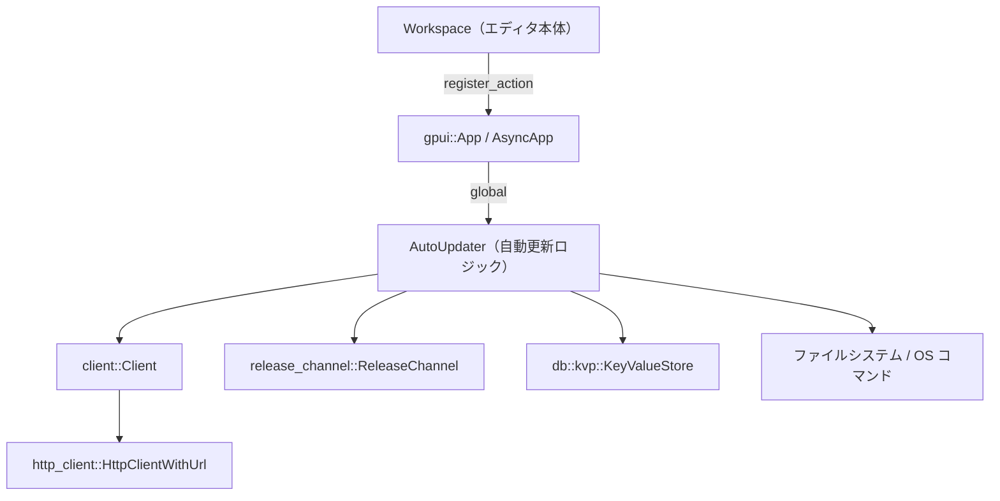
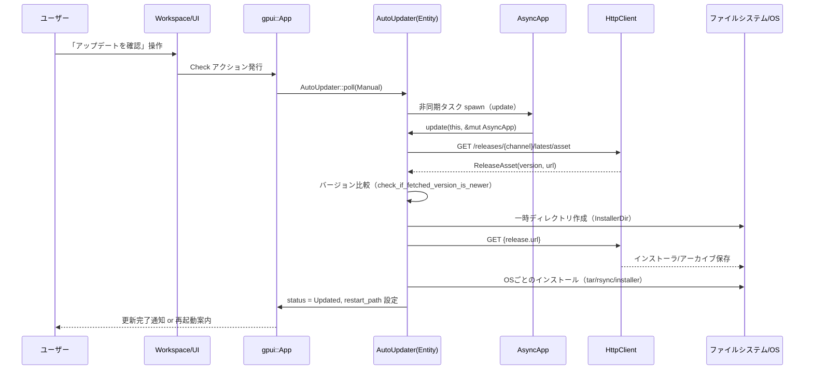

## 0. ざっくり一言

`auto_update` クレートは、Zed 本体と「remote server」バイナリの **自動アップデートのチェック・ダウンロード・インストール** を行うモジュールです。  
OS ごとのインストール方法を切り替えつつ、`gpui` のアプリコンテキストと統合される形で動作します。

---

## 1. このモジュールの役割

### 1.1 概要

- このクレートは Zed の **新しいリリースの有無を定期的／手動で確認**し、必要に応じてアップデートのダウンロードとインストールを行います。
- アップデート対象は
  - Zed 本体（アプリケーションバイナリ／パッケージ）
  - SSH 用の `zed-remote-server` バイナリ
  です。
- `gpui` の `App` / `AsyncApp` と統合されており、UI 側からアクション（Check / ViewReleaseNotes）として起動できます。
- OS（Linux / macOS / Windows）ごとにインストール手順や一時ディレクトリの扱いを切り替えています。

### 1.2 アーキテクチャ内での位置づけ

このクレートは「アプリケーション・アップデート層」として、HTTP クライアントや設定、ワークスペースと連携します。  
主要な依存関係を簡略化して図示すると次のようになります。



- `init` 関数で `AutoUpdater` が `GlobalAutoUpdate` として `gpui` のグローバルに登録され、`Workspace` からアクションを通じて操作されます。
- `AutoUpdater` は `client::Client` 経由で Zed Cloud／ダウンロード URL に HTTP アクセスします。
- 更新状態の一部は `KeyValueStore` に保存され、ユーザーに通知を出すかどうかなどに使われます。
- OS ごとのインストール処理で `tar` / `rsync` / `hdiutil` / Windows インストーラなど外部コマンドを呼び出します。

### 1.3 設計上のポイント

コードから読み取れる主な設計上の特徴は次の通りです。

- **グローバルな単一インスタンス**
  - `GlobalAutoUpdate`（`Global` を実装したラッパー）を通じて、アプリ全体で 1 つの `AutoUpdater` インスタンスを共有します。
- **状態マシン的なステータス管理**
  - `AutoUpdateStatus` 列挙体で `Idle` / `Checking` / `Downloading` / `Installing` / `Updated` / `Errored` を表現します。
  - ステータス更新ごとに `cx.notify()` で UI 側へ変更を伝えます。
- **自動チェックと手動チェックの区別**
  - `UpdateCheckType::{Automatic, Manual}` を持ち、エラーハンドリングやログの出力方針を変えています（自動チェックでは静かに失敗するケースがある）。
- **OS ごとの処理切り替え**
  - `cfg(target_os = "...")` と `InstallerDir` 型で、Linux / macOS / Windows それぞれのインストール手順・一時ディレクトリ扱いを分離しています。
- **非同期タスクによるバックグラウンド動作**
  - `gpui::Task` と `AsyncApp` を利用し、ポーリング・ダウンロード・インストールを UI スレッドとは別に実行します。
- **設定／環境変数との連携**
  - `AutoUpdateSetting` と `SettingsStore` で、自動更新を有効／無効にするユーザー設定を扱います。
  - `ZED_UPDATE_EXPLANATION` 環境変数（および同名のコンパイル時オプション）によって、パッケージマネージャ経由インストール時など、自動更新自体を抑止できます。

---

## 2. 主要な機能一覧

このクレートが提供する主な機能は次のとおりです。

- アプリ本体の自動アップデート
  - Zed の新しいリリースを定期的にチェックし、ダウンロード・インストールする。
- 手動でのアップデートチェック
  - ユーザー操作（`Check` アクション）からアップデートの有無を確認し、エラーがあれば UI に表示する。
- リリースノートの表示
  - 現在のチャンネル（Stable / Preview / Nightly / Dev）に応じたリリースノート／コミット履歴ページをブラウザで開く。
- リモートサーバーバイナリの取得とキャッシュ管理
  - `zed-remote-server` のリリースを取得し、プラットフォーム別ディレクトリに `.gz` アーカイブとして保存・キャッシュする。
- OS 別インストール処理
  - Linux: `.tar.gz` を展開し、`rsync` でアプリディレクトリを上書き。
  - macOS: `.dmg` を `hdiutil` でマウントし、`rsync` でアプリバンドルを上書き。
  - Windows: インストーラをサイレントモードで起動し、専用ヘルパーに後処理を委譲。
- 更新完了の通知制御
  - アップデート後に通知を出すかどうかをキー・バリュー・ストアに記録し、再起動後などに UI へ反映できるようにする。
- Windows での終了時アップデート完了処理
  - アプリ終了時に更新ヘルパー（`auto_update_helper.exe`）を起動し、旧バイナリの削除と新バイナリの起動を行わせる。

---

## 4. 関数・構造体の解説

※ セクション番号はディレクトリ用ルールに従い、3 を飛ばして 4 から詳細に入ります。

### 4.1 主要な型一覧

| 名前 | 種別 | 役割 / 用途 |
|------|------|-------------|
| `AutoUpdater` | 構造体 | 自動アップデート全体の状態とロジックを保持する中核コンポーネント |
| `AutoUpdateStatus` | 列挙体 | 自動アップデート処理の現在の状態（Idle / Checking / Downloading / Installing / Updated / Errored） |
| `VersionCheckType` | 列挙体 | 新しいバージョンを「SemVer」か「コミット SHA」で表現するための型 |
| `UpdateCheckType` | 列挙体 | チェックが自動か手動かを区別するためのフラグ |
| `ReleaseAsset` | 構造体 | リリース情報 API から取得する「バージョン文字列」と「ダウンロード URL」を保持 |
| `AssetQuery<'a>` | 構造体 | リリース API に付与するクエリパラメータ（OS, arch, metrics_id など）のシリアライズ用 |
| `AutoUpdateSetting` | 構造体（`RegisterSetting`） | 自動更新を有効／無効にするための設定ラッパー（`bool`1つを持つ） |
| `GlobalAutoUpdate` | 構造体 + `Global` | `AutoUpdater` の `Entity` をグローバルに保持するためのラッパー |
| `InstallerDir` | 構造体 | 一時的にインストーラ／アーカイブを格納するディレクトリ。Windows とそれ以外で実装が異なる |
| `MacOsUnmounter<'a>` | 構造体 | `Drop` 時に `hdiutil detach` を呼んで `.dmg` をアンマウントする RAII オブジェクト |
| `MissingDependencyError` | 構造体 + `Error` | `rsync` など必須コマンドが見つからない場合の専用エラー |

主な構造体は `auto_update.rs` 内にすべて定義されており、このクレート単体で自動更新ロジックが完結しています。

---

### 4.2 重要な関数・メソッド詳細（7 件）

#### 1. `init(client: Arc<Client>, cx: &mut App)`

**概要**

- アプリケーション起動時に呼び出される初期化関数です。
- `Workspace` に対して自動更新関連アクション（`Check` / `ViewReleaseNotes`）を登録し、`AutoUpdater` をグローバルに生成・登録します。
- 環境変数や設定に応じて、自動ポーリングを開始するかどうかを決めます。

**引数**

| 引数名 | 型 | 説明 |
|--------|----|------|
| `client` | `Arc<Client>` | HTTP 通信やテレメトリ機能を提供するクライアント |
| `cx` | `&mut App` | `gpui` のアプリケーションコンテキスト |

**戻り値**

- 戻り値はありません。内部で `AutoUpdater` の `Entity` を生成し、`GlobalAutoUpdate` として `cx` に登録します。

**内部処理の流れ**

1. `Workspace` の生成を監視し、新しい `Workspace` が作られたときに `Check` と `ViewReleaseNotes` アクションのハンドラを登録します。
2. `release_channel::AppVersion::global(cx)` から現在のアプリバージョンを取得します。
3. `cx.new` を使って `AutoUpdater::new` を呼び出し、`AutoUpdater` インスタンスを作成します。
4. `ReleaseChannel::try_global(cx)` からチャンネル情報を取得し、`poll_for_updates()` が `true` の場合のみ自動ポーリングの対象とします。
5. `ZED_UPDATE_EXPLANATION`（ビルド時 or 実行時の環境変数）が設定されていない場合に限り、自動ポーリングを開始するかどうかを `AutoUpdateSetting` と `SettingsStore` の状態から決定します。
6. 必要であれば `start_polling` を呼び出す `Subscription` を保持し、設定が変わったときに停止・再開できるようにします。
7. 最後に `GlobalAutoUpdate(Some(auto_updater))` を `cx.set_global` で登録します。

**Edge cases（エッジケース）**

- `ReleaseChannel::try_global(cx)` が `None` を返した場合は、デフォルトで `poll_for_updates` は `false`（自動ポーリングしない）扱いになります。
- `ZED_UPDATE_EXPLANATION` が設定されている場合は、自動ポーリングは開始されません（パッケージマネージャ経由インストールなどのケースを想定）。

**使用上の注意点**

- アプリケーション側で `Client` や `ReleaseChannel`、`SettingsStore` のグローバル初期化順序を調整する必要があります。`init` を呼ぶタイミングでこれらが利用可能である前提です。
- `init` はアプリ全体で 1 度だけ呼び出すのが前提の設計になっています。

---

#### 2. `AutoUpdater::start_polling(&self, cx: &mut Context<Self>) -> Task<Result<()>>`

**概要**

- 一定間隔（`POLL_INTERVAL` = 1 時間）でアップデートチェックを行うバックグラウンドタスクを開始します。
- Windows の場合は開始時に古いディレクトリのクリーンアップも行います。

**引数**

| 引数名 | 型 | 説明 |
|--------|----|------|
| `cx` | `&mut Context<Self>` | `AutoUpdater` 用の `gpui` コンテキスト |

**戻り値**

- `Task<Result<()>>`  
  - 内部でループを続ける非同期タスク。通常は `Ok(())` を返し続けますが、内部の処理で `Err` になる可能性があります（呼び出し側では戻り値を基本的に保持するだけで、個々のエラーは `poll` 側で処理されます）。

**内部処理の流れ**

1. Windows の場合は `cleanup_windows().await` を呼び出し、`updates` / `install` / `old` ディレクトリを削除しようと試みます（失敗はログ出力にとどめる）。
2. 無限ループに入り、以下を繰り返します。
   1. `this.update` を使って `poll(UpdateCheckType::Automatic, cx)` を実行します。
   2. `cx.background_executor().timer(POLL_INTERVAL).await` で 1 時間待機します。

**Edge cases**

- Windows のクリーンアップは失敗しても `log_err()` でログに残すだけで、自動更新自体は継続します。
- ループ内で `poll` がエラーになっても、`poll` 内部でエラーを状態に反映・ログ出力するため、この関数自体はループを続けます。

**使用上の注意点**

- `start_polling` は `init` 内部からのみ呼び出されており、通常は呼び出し側が直接使うことはありません。
- アプリ終了時にもタスクは `gpui` のタスク管理に従って終了する前提です。

---

#### 3. `AutoUpdater::poll(&mut self, check_type: UpdateCheckType, cx: &mut Context<Self>)`

**概要**

- 実際のアップデートチェック処理（`update`）を非同期タスクとして起動するメソッドです。
- 連続して呼ばれた場合の調停や、`UpdateCheckType` の扱いを行います。

**引数**

| 引数名 | 型 | 説明 |
|--------|----|------|
| `check_type` | `UpdateCheckType` | 手動チェックか自動チェックか |
| `cx` | `&mut Context<Self>` | `AutoUpdater` のコンテキスト |

**戻り値**

- 返り値はなく、副作用として `pending_poll` と `status` を更新します。

**内部処理の流れ**

1. すでに `pending_poll`（進行中のチェック）が存在する場合
   - 以前が `Automatic` で、今回が `Manual` などの場合は、`update_check_type` を新しい方に更新して `cx.notify()` だけ行い、早期 return します。
2. まだチェック中でない場合
   - `update_check_type` を `check_type` に設定し、`cx.notify()` します。
   - `cx.spawn` で非同期タスクを起動し、その `Task` を `pending_poll` に保存します。
3. 非同期タスク内では
   - `Self::update(this.upgrade()?, cx).await` を実行し、その結果をもとに `status` とログを更新します。
   - エラーが発生した場合は `check_type` とエラーの型に応じて
     - 自動チェックかつ依存関係不足 (`MissingDependencyError`) → `Errored` として状態更新しつつ `warn` ログ。
     - 自動チェック（その他） → ログに `info` を出し、`status` を `Idle` に戻す。
     - 手動チェック → `status` を `Errored` にして `error` ログ。

**Edge cases**

- 連続して `poll(Automatic)` が呼ばれても、2 回目以降は実行中のタスクを使い回すため、余分な HTTP アクセスを抑えます。
- 手動チェックが自動チェック中に行われた場合、`update_check_type` を Manual に上書きすることで、エラーがユーザーに表示されるようになります。

**使用上の注意点**

- 外部からは `AutoUpdater::get(cx)` で `Entity` を取得し、`update` 経由で間接的に呼ぶ設計になっています（`init` 内部の `workspace.register_action` 参照）。
- 直接呼び出す場合も、同時実行を意識する必要はありません。`pending_poll` で調停されています。

---

#### 4. `AutoUpdater::update(this: Entity<Self>, cx: &mut AsyncApp) -> Result<()>`

**概要**

- 実際に HTTP 経由で最新リリース情報を取得し、必要に応じてダウンロードとインストールを行う中核処理です。
- `AutoUpdateStatus` を段階的に更新しながら、OS ごとのインストーラを呼び出します。

**引数**

| 引数名 | 型 | 説明 |
|--------|----|------|
| `this` | `Entity<Self>` | `AutoUpdater` の `Entity` ハンドル |
| `cx` | `&mut AsyncApp` | 非同期アプリケーションコンテキスト |

**戻り値**

- `Result<()>`  
  成功時は `Ok(())`。HTTP エラー・JSON パースエラー・インストールエラーなどがあれば `Err(anyhow::Error)`。

**内部処理の流れ（簡略）**

1. `this.read_with` で
   - `client.http_client()`
   - `current_version`
   - 直前の `status`
   - `ReleaseChannel`
   を取得。
2. `check_dependencies()` で OS ごとの必須コマンド（主に `rsync`）の有無を検証。
3. `status` を `Checking` に変更し、ログを出力。
4. `get_release_asset` を使い、`"/releases/{channel}/latest/asset"` から最新のアプリリリース情報を取得。
5. `check_if_fetched_version_is_newer` で、取得したバージョンと現在のバージョン／コミット SHA を比較し、「更新が必要か」を判定。
   - 更新不要 → `status` を `Idle`（またはすでに `Updated` の場合はそのまま）に戻して終了。
6. 更新が必要な場合
   - `status` を `Downloading` に更新。
   - `InstallerDir::new()` で一時ディレクトリを作成し、`target_path` を求める。
   - `download_release` でインストーラ／アーカイブをダウンロード。
7. ダウンロード成功後
   - `status` を `Installing` に更新。
   - `install_release` を呼び出し、OS ごとに実際のインストールを行う。
   - 戻り値の `new_binary_path` が `Some` の場合、`cx.set_restart_path(new_binary_path)` で再起動時に実行されるパスを設定。
8. インストール成功後
   - `set_should_show_update_notification(true, cx)` をバックグラウンドで実行し、アップデート通知を表示すべきであることを保存。
   - `status` を `Updated { version: newer_version }` に更新。

**Edge cases**

- `ReleaseChannel::Nightly` の場合、バージョン比較はコミット SHA（`build` メタデータ）ベースで行われます。
- `ReleaseChannel::Stable/Preview` では SemVer の比較を行いますが、`pre` / `build` は無視されます。
- 依存コマンドがない場合（Linux/macOS の `rsync` など）、`check_dependencies` が早期にエラーを返します。このエラーは `MissingDependencyError` として区別されます。

**使用上の注意点**

- この関数は外部から直接呼ぶのではなく、`poll` を経由して呼ぶ前提です。
- OS によっては、インストール処理に外部コマンドや管理者権限を要する可能性があります（コード上は権限昇格までは扱っていません）。

---

#### 5. `AutoUpdater::download_remote_server_release(...) -> Result<PathBuf>`

```rust
pub async fn download_remote_server_release(
    release_channel: ReleaseChannel,
    version: Option<Version>,
    os: &str,
    arch: &str,
    set_status: impl Fn(&str, &mut AsyncApp) + Send + 'static,
    cx: &mut AsyncApp,
) -> Result<PathBuf>
```

**概要**

- SSH リモート接続などで利用される `zed-remote-server` バイナリのアーカイブ（`.gz`）をダウンロードし、指定のキャッシュディレクトリに保存します。
- すでに同バージョンのファイルが存在する場合は再ダウンロードを行いません。

**引数**

| 引数名 | 型 | 説明 |
|--------|----|------|
| `release_channel` | `ReleaseChannel` | Stable / Preview / Nightly / Dev などのチャンネル |
| `version` | `Option<Version>` | 特定バージョンを指定したい場合の SemVer。`None` なら `"latest"` を問い合わせる |
| `os` | `&str` | ターゲット OS（例: `"linux"`, `"macos"`） |
| `arch` | `&str` | ターゲットアーキテクチャ（例: `"x86_64"`） |
| `set_status` | クロージャ | 進捗メッセージを UI 側に伝えるためのコールバック |
| `cx` | `&mut AsyncApp` | 非同期アプリコンテキスト |

**戻り値**

- `Result<PathBuf>`  
  - 成功時はダウンロード先の `.gz` ファイルパスを返します。

**内部処理の流れ**

1. `cx.update` で `GlobalAutoUpdate` から `AutoUpdater` の `Entity` を取得します（初期化されていない場合はエラー）。
2. `set_status("Fetching remote server release", cx)` を呼び、ステータス表示を更新。
3. `get_release_asset` を `asset = "zed-remote-server"` で呼び出し、リリース情報を取得。
4. `paths::remote_servers_dir()` からリモートサーバ用ディレクトリを取得し、
   - `{servers_dir}/{channel}/{os}-{arch}/{version}.gz`
   のパスを構成。
5. 対象ファイルが存在しない場合のみ
   - ステータスを `"Downloading remote server"` に変更。
   - `download_remote_server_binary` を呼び出し、アーカイブをダウンロード。
6. ダウンロード後に `cleanup_remote_server_cache` を呼び、古いアーカイブの削除を試みる（失敗してもワーニングログのみ）。
7. 最終的にバージョンファイルのパスを返します。

**Edge cases**

- `GlobalAutoUpdate` がまだ初期化されていない状態で呼ぶと `"auto-update not initialized"` エラーになります。
- キャッシュ上限 `REMOTE_SERVER_CACHE_LIMIT` を超える数の `.gz` ファイルがある場合、古いものから削除されます（現在のファイルは必ず残される）。

**使用上の注意点**

- `os` / `arch` の値は、サーバ側のリリース命名規則と一致している必要があります。
- `set_status` は UI 更新を伴う可能性があるため、`AsyncApp` のライフタイムに注意が必要です。

---

#### 6. `cleanup_remote_server_cache(platform_dir: &Path, keep_path: &Path, limit: usize) -> Result<()>`

**概要**

- `platform_dir` 以下の `.gz` ファイルを `limit` 個までに抑えるためのキャッシュクリーンアップ処理です。
- `keep_path` に指定されたファイルは削除対象から除外されます。

**引数**

| 引数名 | 型 | 説明 |
|--------|----|------|
| `platform_dir` | `&Path` | OS / アーキテクチャ単位のディレクトリ |
| `keep_path` | `&Path` | 最新バージョンのアーカイブファイル（削除しない） |
| `limit` | `usize` | 保持する最大ファイル数（`0` の場合は何もしない） |

**戻り値**

- `Result<()>`  
  成功時は `Ok(())`。`read_dir` などに失敗した場合はエラー。

**内部処理の流れ**

1. `limit == 0` の場合は何もせず `Ok(())` を返す。
2. `smol::fs::read_dir(platform_dir)` で全エントリを列挙。
3. `.gz` 拡張子を持つファイルのみを対象にし、各ファイルの更新時刻 (`modified`) を取得。
   - `keep_path` に等しいパスの更新時刻は現在時刻（`now`）として扱うことで、常に最新とみなされる。
   - `metadata` 取得等に失敗した場合は UNIX エポックを使用。
4. 候補リストを更新時刻の降順（新しい順）、同時刻ならパス名でソート。
5. `limit` 個までは残し、それ以外を削除対象とする。ただし `keep_path` と等しいパスは削除しない。
6. 削除に失敗した場合は `warn` ログを出力し、処理は継続する。

**Edge cases**

- ディレクトリ読み込みやメタデータ取得に失敗した場合は、そのファイルは古い扱いになって削除対象になる可能性があります。
- `limit` よりファイル数が少ない場合は何も削除されません。

**使用上の注意点**

- この関数は `.gz` 以外のファイルには触れません。`platform_dir` に `.gz` 以外のファイルを置いても削除されませんが、整理のためにもこのディレクトリはリモートサーバーアーカイブ専用にすることが想定されます。

---

#### 7. `finalize_auto_update_on_quit()`

**概要**

- Windows 専用の補助関数として使用されます（呼び出し自体は `cfg` されていませんが、ロジックは Windows ファイル構造を前提）。
- アプリ終了時に、更新用ヘルパー `auto_update_helper.exe` を起動し、実際のバイナリ置き換え・再起動を行わせます。

**引数**

- 引数なし、戻り値もありません（`async fn` であり、`AutoUpdater::new` 内の `on_app_quit` から呼び出されます）。

**内部処理の流れ**

1. `std::env::current_exe()` から現在の実行ファイル（`Zed.exe`）のパスを取得し、その親ディレクトリに対して `join("updates")` したパスを `installer_path` として算出します。
2. `installer_path.join("versions.txt")` をフラグファイルとして扱い、存在するかどうかをチェックします。
3. フラグファイルが存在し、かつ `installer_path.parent()` が取得できる場合のみ
   - 親ディレクトリにある `tools/auto_update_helper.exe` のパスを構成。
   - `new_command(helper)` でプロセスを起動し、`--launch false` を渡して実行。
4. ヘルパーの終了コードは `_ = cmd.status().await` で待ちますが、戻り値は捨てています。

**Edge cases**

- 実行ファイルパスの取得に失敗した場合や、`parent()` が取れない場合は何もせず return します。
- フラグファイルが存在しない場合も何も行いません。

**使用上の注意点**

- コメントに「`crates/auto_update_helper/src/updater.rs` と同期を取る必要がある」と書かれており、`updates` ディレクトリやフラグファイルの扱いはヘルパー側と契約になっています。
- パス構造（`updates` ディレクトリや `tools` ディレクトリ）が変わると、この処理も合わせて修正する必要があります。

---

### 4.3 その他の関数（概要のみ）

代表的な補助関数を一覧で示します。

| 関数名 | 役割（1 行） |
|--------|--------------|
| `linux_rsync_install_hint` | Linux ディストリビューションに応じた `rsync` インストール方法のメッセージを返す |
| `check(_: &Check, window: &mut Window, cx: &mut App)` | 手動アップデートチェックアクションのエントリポイント |
| `release_notes_url(cx: &mut App) -> Option<String>` | 現在のリリースチャンネルに対するリリースノート／コミットログの URL を構築 |
| `view_release_notes(_: &ViewReleaseNotes, cx: &mut App)` | 上記 URL をブラウザで開くアクション |
| `AutoUpdater::get(cx: &mut App)` | グローバルから `AutoUpdater` の `Entity` を取得 |
| `AutoUpdater::current_version` / `status` / `dismiss` | 現在のバージョン・ステータス取得、通知の解除 |
| `AutoUpdater::get_remote_server_release_url` | `zed-remote-server` のダウンロード URL のみを取得 |
| `AutoUpdater::get_release_asset` | Zed Cloud のリリース API へ HTTP リクエストを送り、`ReleaseAsset` をデシリアライズ |
| `AutoUpdater::check_if_fetched_version_is_newer` | リリースチャンネル／コミット SHA を考慮したバージョン比較ロジック |
| `AutoUpdater::check_dependencies` | OS ごとに `rsync` などの必須コマンドの有無をチェック |
| `AutoUpdater::target_path` | ダウンロード先ファイル名（`.dmg` / `.tar.gz` / `.exe`）を OS 別に決定 |
| `AutoUpdater::install_release` | OS 別インストール関数（`install_release_macos` 等）へのディスパッチ |
| `AutoUpdater::check_if_fetched_version_is_newer_non_nightly` | SemVer ベースの単純な「新しいかどうか」チェック |
| `AutoUpdater::set_should_show_update_notification` | 更新完了通知の表示フラグを KeyValueStore に書き込む |
| `AutoUpdater::should_show_update_notification` | 上記フラグの有無を読み取る |
| `download_remote_server_binary` | `zed-remote-server` アーカイブを一時ファイル経由でダウンロード・リネーム |
| `download_release` | アプリ更新用インストーラ／アーカイブを `target_path` にダウンロード |
| `install_release_linux` | Linux 用インストール処理（`tar` で展開し `rsync` でコピー） |
| `install_release_macos` | macOS 用インストール処理（`hdiutil` でマウントし `rsync` でコピー） |
| `cleanup_windows` | Windows の `updates` / `install` / `old` ディレクトリを削除 |
| `install_release_windows` | Windows インストーラをサイレントモードで起動し、ヘルパーパスを返す |

---

## 5. データフロー

ここでは「ユーザーが手動でアップデートチェックを実行し、新しいバージョンが見つかってインストールされる」ケースを例に、データフローを説明します。

1. ユーザーが UI から「アップデートを確認」ボタンを押す。
2. `Workspace` が `Check` アクションを発行し、`check` 関数が呼ばれる。
3. `check` は `AutoUpdater::get` でグローバルの `AutoUpdater` を取得し、`poll(UpdateCheckType::Manual, cx)` をトリガーする。
4. `poll` 内で非同期タスクが起動され、`AutoUpdater::update` が `AsyncApp` 上で実行される。
5. `update` は Zed Cloud のリリース API に HTTP リクエストを送り、`ReleaseAsset` を取得する。
6. バージョン比較により更新が必要と判定された場合、ダウンロード用一時ディレクトリを作成し、アーカイブ／インストーラをダウンロードする。
7. OS 別のインストーラロジックが実行され、アプリケーションディレクトリが更新される。
8. 更新完了後、`status` が `Updated` に設定され、KeyValueStore に「更新通知を表示すべき」フラグが書き込まれる。

これを簡略化したシーケンス図は次のとおりです。



---

## 6. 使い方（How to Use）

### 6.1 基本的な使用方法

もっとも基本的な使い方は、「アプリ起動時に `auto_update::init` を呼ぶ」ことです。  
以下は概念的な例です（実際の `gpui` アプリ初期化コードに合わせて調整する必要があります）。

```rust
use std::sync::Arc;
use client::Client;
use gpui::App;
use auto_update; // crates/auto_update を依存に追加している前提

fn main() {
    // 省略: gpui::App の初期化                       // App コンテキストを初期化していると仮定

    let mut app: App = /* ... */;                      // gpui::App インスタンス
    let client: Arc<Client> = /* ... */;               // HTTP クライアントなどを含む Client を作成

    // 自動アップデート機能を初期化                    // ここで auto_update::init を呼ぶだけでよい
    auto_update::init(client.clone(), &mut app);       // Workspace へのアクション登録や
                                                       // AutoUpdater のグローバル登録が行われる

    // 以降、Workspace 側で Check / ViewReleaseNotes  // UI からのアクション経由で手動チェックや
    // アクションが利用可能になる                      // リリースノート表示が行える
}
```

- 上記のように `init` を呼ぶだけで、定期的な自動チェック（設定と環境変数で制御）と手動チェックアクションが利用可能になります。
- 実際の `Workspace` からのアクションディスパッチの仕方は `gpui` の API に依存するため、このコードでは詳細を示していません。

### 6.2 よくある使用パターン

#### パターン 1: リモートサーバーバイナリの取得

別のモジュールから `zed-remote-server` のバージョンを明示的に取得したい場合、  
`AutoUpdater::download_remote_server_release` を使うことで、必要なアーカイブをダウンロードし、パスを得られます。

```rust
use std::sync::Arc;
use gpui::AsyncApp;
use release_channel::ReleaseChannel;
use semver::Version;
use auto_update::AutoUpdater;

// 非同期コンテキスト内で呼び出す例
async fn ensure_remote_server(
    async_app: &mut AsyncApp,                        // AsyncApp コンテキスト
) -> anyhow::Result<()> {
    let channel = ReleaseChannel::Stable;            // 利用するチャンネル（例: Stable）
    let version = None;                              // 最新版を取得したいので None
    let os = std::env::consts::OS;                   // 現在の OS ("linux", "macos", "windows" など)
    let arch = std::env::consts::ARCH;               // 現在のアーキテクチャ

    // ステータスメッセージを更新するコールバック       // 実際には UI 更新に紐付けることが多い
    let set_status = |message: &str, _cx: &mut AsyncApp| {
        log::info!("remote server: {message}");
    };

    // ダウンロードを実行し、アーカイブファイルパスを取得
    let archive_path = AutoUpdater::download_remote_server_release(
        channel,
        version,
        os,
        arch,
        set_status,
        async_app,
    ).await?;

    log::info!("remote server archive at {:?}", archive_path);
    Ok(())
}
```

### 6.3 使用上の注意点

このクレート全体を利用する際に共通して注意すべき点をまとめます。

- **初期化順序**
  - `auto_update::init` は `client::Client` や `ReleaseChannel`、`SettingsStore` 等が利用可能なタイミングで呼び出す必要があります。
- **環境変数による制御**
  - `ZED_UPDATE_EXPLANATION`（ビルド時／実行時）が設定されている場合、自動ポーリングは行われず、手動チェック時には「パッケージマネージャ経由インストール」の旨を示すダイアログが表示されます。
- **依存コマンドの有無**
  - Linux / macOS では `rsync` が必須です。見つからない場合、チェックは `MissingDependencyError` で失敗します。
  - Linux では `linux_rsync_install_hint` がユーザーにインストール手順を提示するメッセージを組み立てます。
- **OS 別のルール**
  - Windows では実行中の `.exe` を上書きできないため、インストーラと `auto_update_helper.exe` を介して、アプリ終了後に更新処理を完了します。  
    ディレクトリ構成（`updates` / `tools`）を変更する場合は、このコードとの整合性を保つ必要があります。
- **KeyValueStore の利用**
  - 更新完了後にユーザーへ通知を出すかどうかは、`KeyValueStore` 上の `SHOULD_SHOW_UPDATE_NOTIFICATION_KEY` で管理されます。
  - アプリ側でこのキーを直接操作する場合、`AutoUpdater` の期待と矛盾しないようにする必要があります。
- **テスト環境向けフック**
  - `#[cfg(test)]` の `InstallOverride` グローバルなど、テスト専用フックがあります。通常のビルドでは存在しませんが、テストコードを読むことでインストールロジックの前提を確認できます。

---

## 7. 関連ファイル

| パス | 役割 / 関係 |
|------|------------|
| `auto_update/Cargo.toml` | `auto_update` クレートのメタデータと依存クレート定義。`client`, `gpui`, `http_client`, `release_channel` など、このクレートが前提とする周辺コンポーネントを示す |
| `auto_update/src/auto_update.rs` | 本レポートで説明した、自動アップデートロジックのすべてを含むメイン実装ファイル |
| （コメント上）`crates/auto_update_helper/src/updater.rs` | Windows 向け更新ヘルパーとのパス構造を「同期する必要がある」と明記されている関連コンポーネント。コードはこのチャンクには含まれていません |
| `client` クレート | HTTP 通信・テレメトリ機能を提供。`auto_update` はこれに依存してリリース情報を取得します（実装は別クレート） |
| `release_channel` クレート | Stable / Preview / Nightly / Dev などのリリースチャンネル情報とバージョン情報を提供します |
| `db::kvp::KeyValueStore` | 更新通知状態を保存するキー・バリューストア。ディスクや DB の詳細はこのチャンクには含まれていません |
| `paths` クレート | `remote_servers_dir()` で `zed-remote-server` の格納ディレクトリを提供します |

これらの関連ファイルやクレートを合わせて読むことで、自動アップデート機能がアプリ全体の中でどのように組み込まれているかをより詳細に理解できます。
