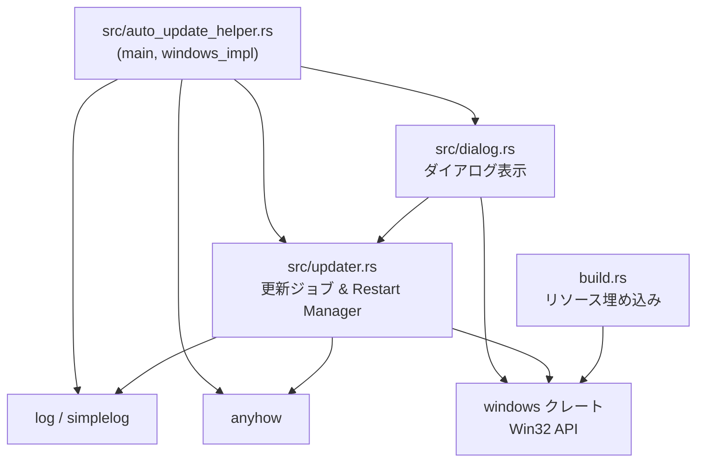
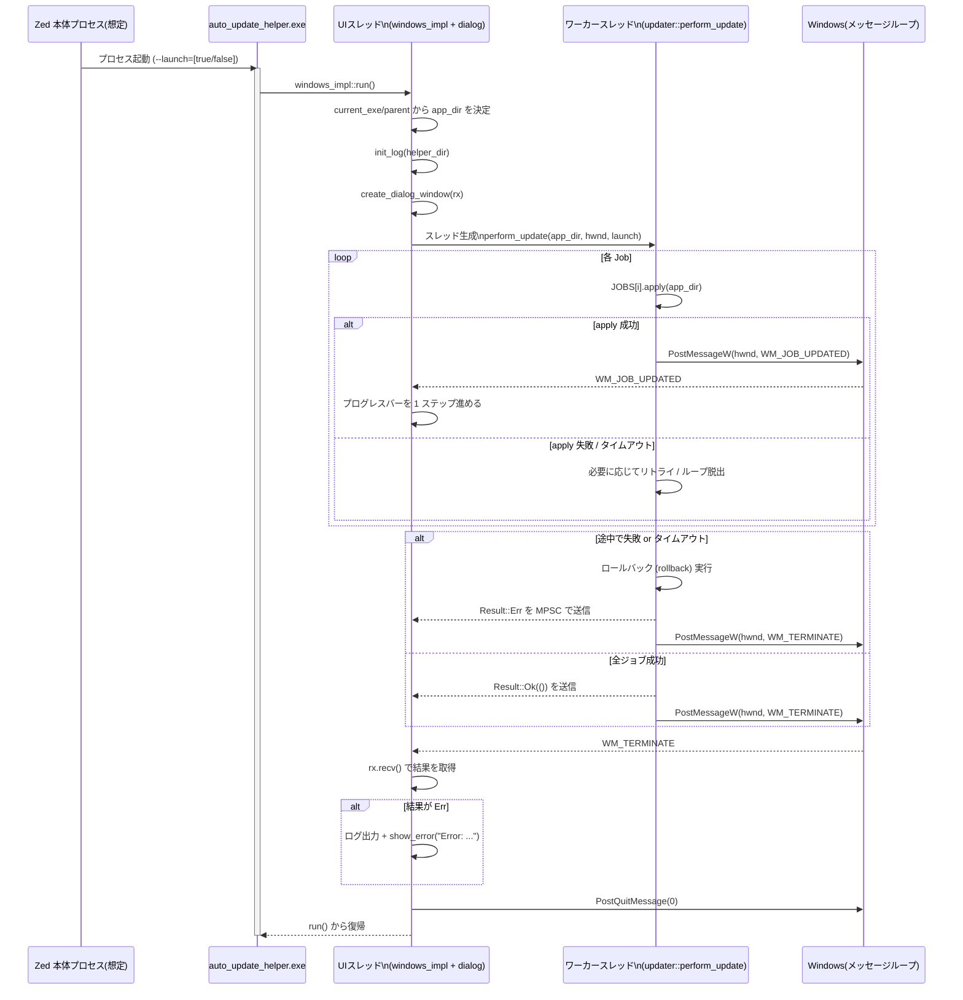

# auto_update_helper ディレクトリ解説

## 1. ざっくり一言

Windows 版 Zed の更新中に表示される小さなダイアログと、実際のファイル差し替え・ロールバック処理を行う補助バイナリ用クレートです。  
Win32 API と Windows Restart Manager を使って、ロック中ファイルの解放も試みながら安全に自己更新します。

---

## 2. このモジュールの役割

### 2.1 概要

- Zed 本体とは別プロセスとして起動される「auto_update_helper.exe」の実装です。
- 役割はおおきく次の 3 つです。
  - ログ出力やコマンドライン引数（`--launch`）の処理
  - 更新進行状況を示す簡易ダイアログの表示とメッセージループ
  - 更新ジョブ列（ファイル移動・ディレクトリ作成など）の実行とロールバック

### 2.2 アーキテクチャ内での位置づけ

ディレクトリ内の主要モジュールの依存関係は次のようになっています。



- `auto_update_helper.rs`
  - エントリポイントと `windows_impl` モジュールを持ちます。
  - `dialog` と `updater` を呼び出して、ダイアログ表示と更新処理の連携を行います。
- `dialog.rs`
  - Win32 API を直接叩いてダイアログウィンドウとプログレスバーを生成します。
  - `updater::JOBS` の長さをもとに進捗バーの最大値を決め、`WM_JOB_UPDATED` メッセージで更新します。
- `updater.rs`
  - 更新処理の中核である `Job` 構造体と `JOBS` 配列、`perform_update`、`release_file_handles` を提供します。
- `build.rs`
  - Windows 用にアイコンやマニフェスト（`manifest.xml`, `app-icon.ico`）を EXE に埋め込むビルドスクリプトです。

### 2.3 設計上のポイント

コードから読み取れる主な設計上の特徴は次の通りです。

- **ジョブベースの更新処理**
  - 個々のファイル操作を `Job { apply, rollback }` として抽象化し、配列 `JOBS` で順序を管理しています。
  - 途中で失敗した場合は、成功済みジョブを逆順で `rollback` することで整合性を保とうとします。
- **UI スレッドとワーカースレッドの分離**
  - UI スレッド（`windows_impl::run` 内のメインスレッド）はメッセージループとダイアログ表示のみを担当します。
  - 更新処理は別スレッドで実行し、進捗は Windows メッセージ（`WM_JOB_UPDATED` / `WM_TERMINATE`）＋MPSC チャネルで通知されます。
- **Windows 専用実装**
  - メイン関数は `#[cfg(target_os = "windows")]` のもとでのみ実装され、その他の OS では空の `main` になります。
  - Win32 API（ウィンドウ、フォント、Restart Manager）に直接依存しています。
- **ログとエラー表示**
  - 更新処理全体のログを `auto_update_helper.log` に記録します。
  - エラー発生時には `MessageBoxW` でモーダルなエラーダイアログも表示します（`show_error`）。

---

## 3. 主要な機能一覧

このクレートが提供する主な機能を列挙します。

- 自動更新用バイナリ（`auto_update_helper.exe`）のエントリポイント
- ログファイルの初期化とファイル出力（`init_log`）
- コマンドライン引数 `--launch[=true|false]` の解析（`parse_args`）
- 更新中の進行状況ダイアログ（ウィンドウ＋プログレスバー）の生成（`create_dialog_window`）
- 更新完了または失敗時のメッセージボックス表示（`show_error`）
- 更新手順を表す `Job` 構造体と、具体的なジョブ列 `JOBS`
- Windows Restart Manager を使ったロック中ファイルの解放試行（`release_file_handles`）
- 更新ジョブの実行・リトライ・ロールバックと、必要に応じた Zed の再起動（`perform_update`）

---

## 4. 関数・構造体の解説

### 4.1 主要な型・定数一覧

| 名前 | 種別 | 属するモジュール | 役割 / 用途 |
|------|------|-----------------|-------------|
| `Args` | 構造体 | `windows_impl` | コマンドライン引数のうち「更新後に Zed を起動するかどうか（`launch`）」を保持します。 |
| `Job` | 構造体 | `updater` | 1 つの更新ステップを表し、`apply`/`rollback` の 2 つのクロージャを持ちます。 |
| `JOBS` | `static LazyLock<[Job; N]>` | `updater` | 実際に実行される更新ジョブ列（本番では 22 個）。 |
| `DialogInfo` | 構造体 | `dialog` | ダイアログに紐づく状態（進捗バーのハンドルと、結果受信用チャネル）を保持します。 |
| `WM_JOB_UPDATED` | `u32` 定数 | `windows_impl` | 1 ジョブ完了ごとに UI に送るユーザ定義メッセージ。進捗バー更新に使用します。 |
| `WM_TERMINATE` | `u32` 定数 | `windows_impl` | 更新スレッド終了時に UI に送るメッセージ。結果の受信とアプリ終了に使用します。 |

#### `Job` のコンストラクタ群

| 関数名 | 概要 |
|--------|------|
| `Job::mkdir` | ディレクトリの作成と、その削除によるロールバックを行うジョブを生成します。 |
| `Job::mkdir_if_exists` | 特定パスが存在する場合のみディレクトリを作成し、存在する場合のみ削除するジョブを生成します。 |
| `Job::move_file` | ファイルの移動（`rename`）と、逆向きの移動によるロールバックを行うジョブを生成します。 |
| `Job::move_if_exists` | ファイルが存在するときだけ移動を行い、存在する場合だけ逆向き移動でロールバックするジョブです。 |
| `Job::rmdir_nofail` | ディレクトリ削除を試み、エラーはログに警告を出すだけで無視するジョブです。ロールバックは「できない」として即エラーを返します。 |

### 4.2 重要な関数の詳細

#### `windows_impl::run() -> anyhow::Result<()>`

**概要**

- `auto_update_helper.exe` の実質的なエントリポイントです。
- ログを初期化し、アプリケーションディレクトリを決定し、ダイアログを作成してメッセージループを回します。
- 更新処理は別スレッドで `updater::perform_update` に委譲します。

**引数 / 戻り値**

- 引数なし。
- 戻り値は `anyhow::Result<()>`。致命的な初期化失敗（ログファイルが開けない、ウィンドウ生成失敗など）が発生した場合に `Err` になります。

**内部処理の流れ**

1. `std::env::current_exe()` から自分自身の EXE パスを取得し、その親ディレクトリを `helper_dir` として求めます。
2. さらにその親ディレクトリを `app_dir` として扱います（Zed 本体のインストールディレクトリを想定した構造です）。
3. `init_log(helper_dir)` で `auto_update_helper.log` を開き、`simplelog::WriteLogger` を初期化します。
4. MPSC チャネル `(tx, rx)` を作成し、`dialog::create_dialog_window(rx)` で進捗ダイアログを生成します。
5. コマンドライン引数（`std::env::args().skip(1)`）を `parse_args` に渡し、`launch` フラグを決定します。
6. 新しいスレッドを生成し、その中で `perform_update(app_dir.as_path(), Some(hwnd), args.launch)` を呼び出します。
   - 結果（`Result<()>`）を `tx.send(result)` で UI スレッドに送り、
   - `WM_TERMINATE` メッセージをダイアログに送信します。
7. UI スレッド側では `GetMessageW`/`DispatchMessageW` によるメッセージループを回し、終了メッセージを受け取るまでブロックします。

**エッジケース・注意点**

- `current_exe()` または `.parent()` が失敗した場合は `anyhow::Error` で即終了します（「親ディレクトリがない」など）。
- ログファイルが開けない場合も同様に `Err` を返します。
- この関数は UI スレッド上で呼ばれる前提なので、内部で長時間ブロックする処理（更新本体）は別スレッドに分離されています。

---

#### `windows_impl::parse_args(input: impl IntoIterator<Item = String>) -> Args`

**概要**

- コマンドライン引数から `--launch` オプションを解析し、更新完了後に Zed を起動するかどうか（`Args { launch }`）を決定します。

**対応している書式**

- `--launch true`
- `--launch false`
- `--launch=true`
- `--launch=false`

**挙動**

- 引数がまったくない場合: `launch = true`（デフォルトで起動）。
- 想定外の書式・値の場合:
  - 例: `["--launch"]`, `["--launch="]`, `["--launch=invalid"]`
  - いずれも `launch = true` のままです（テストコードで確認されています）。

**エッジケース**

- 大文字小文字違いや `0` / `1` などは特別扱いされず、単に「`"false"` かどうか」で判定されます。
- 2 つ目以降の引数は無視されます（最初の 1 つだけを見ます）。

---

#### `windows_impl::show_error(mut content: String)`

**概要**

- 更新失敗時などにモーダルなエラーメッセージボックスを表示します。

**処理内容**

1. メッセージ本文 `content` が 600 文字を超える場合は 600 文字で切り詰め、末尾に `"...\n"` を付与します。
2. `MessageBoxW` を `MB_ICONERROR | MB_SYSTEMMODAL` で呼び出し、タイトル `"Error: Zed update failed."` のエラーダイアログを表示します。

**エッジケース・注意点**

- `MessageBoxW` の戻り値は無視しており、表示の成否はログや戻り値では分かりません。
- 長いエラーメッセージは途中までしか表示されない点に注意が必要です。

---

#### `dialog::create_dialog_window(receiver: Receiver<Result<()>>) -> anyhow::Result<HWND>`

**概要**

- 更新進行状況を示すトップレベルウィンドウ（ダイアログ）を作成し、その `HWND` を返します。
- 渡された `Receiver<Result<()>>` は更新スレッドからの結果受信用に `DialogInfo` 内部に保存されます。

**主な処理**

1. `WNDCLASSW` を登録
   - クラス名: `"Zed-Auto-Updater-Dialog-Class"`
   - ウィンドウプロシージャ: `wnd_proc`
   - アイコン: `LoadImageW` でリソース ID=1 のアイコンを読み込み
2. デスクトップウィンドウの矩形を取得し、画面中央に 400x150 ピクセルのウィンドウを配置
3. `DialogInfo { rx, progress_bar: 0 }` を `Box<RefCell<_>>` として確保し、`CreateWindowExW` の `lpCreateParams` に渡す
4. ウィンドウ生成後、`WM_CREATE` ハンドラ内でプログレスバー（`PROGRESS_CLASS`）を作成し、
   - 範囲を `0..(JOBS.len() * 10)` に設定
   - ステップ幅を 10 に設定
   - `DialogInfo.progress_bar` にハンドルを記録

**エッジケース・注意点**

- 各 Win32 API 呼び出しは `anyhow::Context` 付きで `Result` を返しており、エラー時には呼び出し元で `Err` になります。
- `JOBS.len()` に依存してプログレスバーの範囲を決めているため、ジョブ数を変更すると自動的にプログレス幅も調整されます。
- ウィンドウクローズボタン（`WM_CLOSE`）は無視されるようになっているため、ユーザーは任意にダイアログを閉じられません。

---

#### `updater::release_file_handles(app_dir: &Path) -> anyhow::Result<()>`

**概要**

- Windows Restart Manager を利用して、更新対象のファイルに対する他プロセス（主に Explorer.exe 等）のロックを解放させる処理です。
- 失敗しても更新全体は継続される「ベストエフォート」な前処理です。

**対象ファイル**

- `app_dir/Zed.exe`
- `app_dir/bin/Zed.exe`
- `app_dir/bin/zed`
- `app_dir/conpty.dll`

**内部処理の流れ**

1. 上記のうち実際に存在するパスだけを Wide 文字列（`Vec<u16>`）に変換します。
2. 1 つも存在しない場合はログを出力しつつ即 `Ok(())` を返します。
3. `RmStartSession` で Restart Manager セッションを開始し、`scopeguard` で `RmEndSession` を確実に呼ぶようにします。
4. `RmRegisterResources` で対象ファイルをセッションに登録します。
5. `RmGetList` で、これらのファイルを使用しているプロセス数 `needed` を取得します。
   - `needed == 0` の場合は「ロックしているプロセスなし」とログを出して `Ok(())`。
6. `needed > 0` の場合は `RmShutdown` を呼び、関係プロセスにハンドル解放を依頼します。

**エッジケース・注意点**

- Restart Manager の各 API がエラーを返した場合は、その時点で `Err` になりますが、呼び出し元の `perform_update` 側ではこの関数のエラーを **警告ログのみ** にして更新を継続します。
- Restart Manager が利用できない OS や権限不足などのケースでは、ここでエラーが発生しうると考えられますが、コードから詳しい条件は読み取れません。

---

#### `updater::perform_update(app_dir: &Path, hwnd: Option<isize>, launch: bool) -> anyhow::Result<()>`

**概要**

- 更新処理の本体です。
- `JOBS` に定義された各 `Job` を順番に実行し、エラーが起きた場合は可能な範囲でロールバックを行います。
- 全ジョブ成功後、`launch == true` の場合は `app_dir/Zed.exe` を新たに起動します。

**引数**

| 引数名 | 型 | 説明 |
|--------|----|------|
| `app_dir` | `&Path` | Zed のインストールディレクトリ（`Zed.exe` や `install` ディレクトリがある場所）を表します。 |
| `hwnd` | `Option<isize>` | 進捗更新メッセージ（`WM_JOB_UPDATED`）を送るウィンドウハンドル。テストでは `None` が渡されます。 |
| `launch` | `bool` | 更新完了後に `Zed.exe` を自動起動するかどうかを指定します。 |

**内部処理の流れ**

1. `hwnd` を `Option<HWND>` に変換します。
2. `release_file_handles(app_dir)` を呼び、失敗した場合は警告ログを出してそのまま続行します。
3. `last_successful_job: Option<usize>` を `None` で初期化します。
4. `for (i, job) in JOBS.iter().enumerate()` でジョブを順に処理し、それぞれについて以下を行います。
   - `start = Instant::now()` を記録。
   - 内部ループで最大 2 秒間まで `job.apply(app_dir)` をリトライします。
     - 成功した場合:
       - `last_successful_job = Some(i)` に更新。
       - `PostMessageW(hwnd, WM_JOB_UPDATED, ...)` で進捗更新を通知（`hwnd` が `None` の場合はブロードキャスト扱い）。
       - 次のジョブに進みます。
     - `std::io::ErrorKind::NotFound` の場合:
       - 「ファイルが見つからない」エラーとしてログを出し、即座に全体を中断します（ロールバック対象になります）。
     - それ以外の `std::io::Error` の場合:
       - エラーログを出し、50ms スリープしてリトライします。
     - `std::io::Error` 以外のエラー型の場合:
       - 「予期しないエラー」としてログを出し、即座に中断します。
   - 2 秒を経過した場合は「タイムアウト」とログを出し、全体を中断します。
5. すべてのジョブ完了後、または途中で中断した後に、`last_successful_job` をチェックします。
   - `last_successful_job == Some(JOBS.len() - 1)`（最後のジョブまで成功）なら:
     - ロールバックは行わず、成功とみなします。
   - それ以外（途中で失敗／タイムアウト／一つも成功していない）なら:
     - `last_successful_job` が `None` の場合は「ロールバックできるジョブがない」として `anyhow::bail!("Autoupdate failed, nothing to rollback")`。
     - `Some(n)` の場合は `n..=0` まで逆順に `rollback` を実行し、すべて成功すれば `anyhow::bail!("Autoupdate failed, rollback successful")`。
     - ロールバック中にエラーが発生した場合は `anyhow::bail!("Job rollback failed, the app might be left in an inconsistent state: ({:?})", e)` となります。
6. ロールバック不要で成功と判定された場合、`launch == true` であれば `std::process::Command::new(app_dir.join("Zed.exe")).spawn()` で Zed を起動します。
7. 最後に `"Update completed successfully"` をログ出力して `Ok(())` を返します。

**エッジケース・注意点**

- 1 個もジョブが成功しないまま失敗した場合、ロールバックは行われず `"Autoupdate failed, nothing to rollback"` で終了します（テストでカバーされています）。
- 一部のジョブが成功したあとで失敗した場合、成功済みのジョブだけがロールバック対象になります。
- `Job::rmdir_nofail` のように `apply` はエラー無視だが `rollback` は必ずエラーを返すジョブもあるため、削除系ジョブの後で失敗すると「ロールバック失敗」となり得ます。
- `hwnd == None` の場合でも `PostMessageW(None, WM_JOB_UPDATED, ...)` が呼ばれますが、この場合の具体的な挙動は Win32 API 仕様に依存します（テストでは GUI は生成していないため、実害はないと想定されます）。

---

### 4.3 その他の補助関数・マクロ

| 名前 | 役割（1 行） |
|------|--------------|
| `init_log(helper_dir: &Path)` | 指定ディレクトリ直下に `auto_update_helper.log` を開き、`simplelog::WriteLogger` を初期化します。 |
| `wnd_proc` | ダイアログウィンドウの Win32 ウィンドウプロシージャ。各種メッセージに応じてプログレスバー更新や終了処理を行います。 |
| `with_dialog_data` | `HWND` に紐づいた `DialogInfo` を取り出し、一時的に `Box` に包み直してクロージャに渡すユーティリティです。 |
| `get_system_ui_font_name` | システムの UI フォント名（アイコンタイトル用フォント）を取得し、文字列として返します。 |
| `return_if_failed!` マクロ | Win32 API 呼び出しの `Result` をチェックし、エラー時にエラーコードを `LRESULT` として返すマクロです。 |
| `make_lparam!` マクロ | `LOWORD`/`HIWORD` から `LPARAM` を生成するユーティリティマクロです。 |

---

## 5. データフロー

ここでは、「Zed 本体から auto_update_helper が起動され、更新と UI が連携して進む」という代表的なシナリオのデータフローを示します。



要点:

- UI スレッドとワーカースレッドは、**Windows メッセージ** と **MPSC チャネル (`Result<()>`)** で連携しています。
- 進捗バーは `WM_JOB_UPDATED` に応じて一ステップずつ進みます。
- 完了時（成功/失敗）は `WM_TERMINATE` とチャネル上の `Result` で UI に通知されます。

---

## 6. 使い方（How to Use）

### 6.1 基本的な使用方法

このクレートは通常、Zed 本体とは別のプロセスとして実行されることを前提としています。  
他のバイナリから `auto_update_helper.exe` を起動する簡単な例を示します。

```rust
use std::process::Command; // プロセス起動用
use std::io;              // エラー型用

fn run_auto_update_helper(skip_launch: bool) -> io::Result<()> {
    // auto_update_helper.exe を起動するコマンドを構築する
    let mut cmd = Command::new("auto_update_helper.exe"); // 実際のパスはインストールレイアウトに依存

    // 更新完了後に Zed を自動起動したくない場合は --launch=false を渡す
    if skip_launch {
        cmd.arg("--launch=false");
    }

    // 非同期にプロセスを起動する（終了は待たない）
    let _child = cmd.spawn()?; // エラー時は io::Error が返る

    Ok(())
}
```

- `--launch=false` を付けない場合、デフォルトで `launch = true` となり、更新完了後に `Zed.exe` が起動されます。
- `auto_update_helper.exe` の実行パスは、`current_exe().parent().parent()` が Zed インストールディレクトリになるように配置されている必要があります（コード上の前提）。

### 6.2 よくある使用パターン

1. **Zed 本体が自身を終了後、ヘルパーに更新と再起動を任せる**

   - Zed 本体は `auto_update_helper.exe` を `--launch=true`（または引数なし）で起動し、自身は終了します。
   - 更新完了後、ヘルパーが新しい `Zed.exe` を起動します。

2. **外部ランチャーが更新だけ行い、起動は別で制御する**

   - ランチャー側が `--launch=false` でヘルパーを起動します。
   - 更新が成功したかどうかはログファイルやエラーダイアログで確認し、起動タイミングはランチャー側で制御します。

### 6.3 使用上の注意点（まとめ）

- **Windows 専用であること**
  - `windows` クレートと Win32 API に強く依存しているため、本クレート自体は Windows 以外では意味のある動作をしません（`main` が空実装になります）。

- **ディレクトリ構成の前提**
  - `windows_impl::run` では `current_exe().parent()` のさらに親を `app_dir` とみなしています。
    - 例: `app_dir\updates\auto_update_helper.exe` のような配置を想定していると解釈できます。
  - `updater::JOBS` は、`app_dir` 配下に `Zed.exe`, `bin\Zed.exe`, `bin\zed`, `install\` ディレクトリなどが存在することを前提としたパスで定義されています。

- **ファイルが見つからない場合の挙動**
  - 更新ジョブ中に `std::io::ErrorKind::NotFound` が発生した場合は、その時点で更新を中断し、ロールバック対象になります。
  - 更新用のファイルを配置する際は、`JOBS` に定義されたパスと整合しているか確認する必要があります。

- **削除ジョブのロールバック**
  - `Job::rmdir_nofail` は削除自体はエラーを無視しますが、ロールバック時には「削除は取り消せない」として `Err` を返します。
  - そのため、削除後のジョブで失敗が起きると「ジョブロールバック失敗」によってアプリが不整合な状態に残り得る点に注意が必要です。

- **ログ出力先**
  - ログファイル `auto_update_helper.log` はヘルパー EXE の親ディレクトリ（例: `app_dir\updates`）に作成されます。
  - そのディレクトリに書き込み権限がないと、初期化時に `run()` が `Err` を返します。

- **エラー表示**
  - `show_error` で表示されるメッセージボックスは 600 文字までしか本文を表示しません。
  - 詳細なデバッグ情報はログファイルを確認する必要があります。

---

## 7. 関連ファイル

このディレクトリ内のファイルと役割の対応は次の通りです。

| パス | 役割 / 関係 |
|------|-------------|
| `auto_update_helper/Cargo.toml` | クレート名・依存クレート・Windows 向けターゲットなどのメタデータを定義します。 |
| `auto_update_helper/build.rs` | Windows 用に `manifest.xml` と `app-icon.ico` を EXE に埋め込むビルドスクリプトです。`cargo:rerun-if-changed=manifest.xml` によりマニフェスト変更時に再ビルドされます。 |
| `auto_update_helper/src/auto_update_helper.rs` | エントリポイントと `windows_impl` モジュールを含み、ダイアログと更新処理を起動・連携します。 |
| `auto_update_helper/src/dialog.rs` | Win32 API を使って「Updating Zed...」ダイアログとプログレスバーを表示し、`WM_JOB_UPDATED` / `WM_TERMINATE` に応じて UI を更新・終了します。 |
| `auto_update_helper/src/updater.rs` | 更新処理の中核である `Job` 構造体・`JOBS` 配列・`release_file_handles`・`perform_update` を実装します。Restart Manager を利用してロック中ファイルの解放も試みます。 |

※ `manifest.xml` や `app-icon.ico` 自体の内容は、このチャンクには含まれていないため記載していませんが、`build.rs` から参照されるリソースファイルです。
