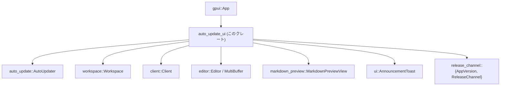
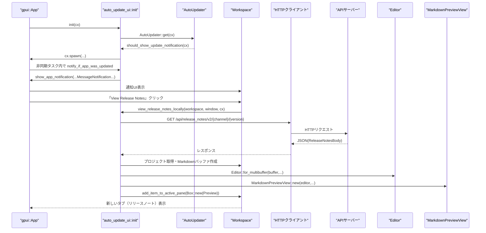

# auto_update_ui/ ディレクトリ解説

## 1. ざっくり一言

`auto_update_ui` クレートは、Zed アプリの**自動アップデート完了時の通知**と、**リリースノートの表示 UI**を提供するモジュールです。

---

## 2. このモジュールの役割

### 2.1 概要

- このモジュールは、アプリが自動アップデートされたタイミングでユーザーに知らせ、リリースノートを簡単に閲覧できるようにするための UI を提供します。
- サーバーからリリースノート（JSON）を取得し、Markdown バッファとプレビューを作成してエディタ内に表示します。
- バージョンごとにカスタマイズされた「What’s new」トースト（お知らせカード）を表示する仕組みも含んでいます（現状はひな形のみ）。

### 2.2 アーキテクチャ内での位置づけ

このクレートは、主に次のコンポーネントと連携します。

- `auto_update::AutoUpdater`  
  自動アップデート状態や「通知を表示すべきか」のフラグを管理するコンポーネントです（詳細はこのチャンクにはありません）。
- `workspace::Workspace`  
  エディタの「ワークスペース」（タブ・ペイン・プロジェクトなど）を管理し、通知表示やエディタ項目の追加を行います。
- `client` クレートの HTTP クライアント  
  バックエンド API からリリースノート JSON を取得します。
- `editor`, `markdown_preview` クレート  
  Markdown バッファとプレビュー UI を構築します。
- `ui` クレート  
  トースト風のお知らせ UI (`AnnouncementToast`) を構築します。

依存関係のイメージは次の通りです。



### 2.3 設計上のポイント

- **グローバルなシングルトン的 API の利用**
  - `AutoUpdater::get(cx)`, `ReleaseChannel::global(cx)`, `AppVersion::global(cx)` など、アプリ全体で共有される状態を参照します。
- **非同期処理と UI 更新の分離**
  - HTTP 取得や JSON パースは `cx.spawn` / `cx.spawn_in` で非同期に行い、その結果を `workspace.update_in` で UI に反映しています。
- **通知システムとの統合**
  - `workspace::notifications::Notification` トレイトを実装した `AnnouncementToastNotification` を `show_app_notification` 経由で表示し、既存の通知フレームワークに統合されています。
- **リリースチャンネルによる挙動の分岐**
  - `Nightly` / `Dev` チャンネルではブラウザでリリースノートを開き、Stable 等ではエディタ内に Markdown プレビューを開くなど、チャンネルごとに挙動が分かれます。

---

## 3. 主要な機能一覧

- **アップデート完了通知の表示**  
  `notify_if_app_was_updated` を通じて、自動アップデート後に一度だけ通知を表示します。
- **アプリ内でのリリースノート表示**  
  HTTP API からリリースノートを取得し、Markdown エディタ＋プレビューとしてワークスペースに追加します。
- **ブラウザでのリリースノート表示へのフォールバック**  
  Nightly/Dev チャンネルやエラー発生時にブラウザでリリースノート URL を開きます。
- **リリースノート取得失敗時のエラーダイアログ表示**  
  リリースノートが読み込めない場合に、リンク付きのエラープロンプトを表示します。
- **バージョンごとのアナウンストースト**  
  特定バージョンに対して「What’s new」トーストを出すための `announcement_for_version` / `AnnouncementToastNotification` を提供します（現状はマッチ部分がコメントアウトされており、常に無効）。

---

## 4. 関数・構造体の解説

### 4.1 型一覧

このクレート内で定義される主な型です。

| 名前 | 種別 | 役割 / 用途 |
|------|------|-------------|
| `ReleaseNotesBody` | 構造体 | リリースノート API のレスポンス（タイトルと本文）を受け取るためのデシリアライズ用型 |
| `AnnouncementContent` | 構造体 | バージョンごとのアナウンストーストに必要なテキストとリンクをまとめたデータ |
| `AnnouncementToastNotification` | 構造体 | 通知システムに載せるための「アナウンス」通知オブジェクト（`Notification`・`Render` 実装持ち） |
| `ViewReleaseNotesLocally` | アクション型（マクロ生成） | 「現在のバージョンのリリースノートを新しいタブで開く」アクション。`actions!` マクロで定義 |

### 4.2 主要な関数・メソッド詳細

#### `pub fn init(cx: &mut App)`

**概要**

- アプリ起動時に呼び出される初期化関数です。
- アップデート完了通知を（必要であれば）表示し、各 `Workspace` で `ViewReleaseNotesLocally` アクションをハンドルできるように登録します。

**引数**

| 引数名 | 型 | 説明 |
|--------|----|------|
| `cx` | `&mut App` | アプリ全体のコンテキスト。グローバル状態へのアクセスやオブザーバ登録に使用されます。 |

**戻り値**

- なし。

**内部処理の流れ**

1. `notify_if_app_was_updated(cx)` を即時呼び出し、必要に応じてアップデート通知を出します。
2. `cx.observe_new` を使い、新しく作成される `Workspace` ごとに処理を登録します。
3. 各 `Workspace` に対して `register_action` を呼び、`ViewReleaseNotesLocally` アクションが発火したときに `view_release_notes_locally` を呼ぶハンドラを登録します。
4. オブザーバは `.detach()` され、非同期監視として生存し続けます。

**Examples（使用例）**

アプリ全体の初期化でこのクレートを組み込む例です。

```rust
use gpui::App;                        // gpui アプリ本体
use auto_update_ui;                   // このクレート

fn init_app(app: &mut App) {          // アプリの初期化関数
    auto_update_ui::init(app);        // 自動アップデート UI を有効化する
    // 他のモジュールの初期化…
}
```

**使用上の注意点**

- `init` はアプリ起動時の 1 回呼び出しを前提としている構造です。複数回呼び出すと、`observe_new` による登録が重複する可能性があります。
- `Workspace` 側で `ViewReleaseNotesLocally` アクションをどうトリガするか（メニュー・ショートカット等）は別モジュールで定義されており、このチャンクからは分かりません。

---

#### `fn view_release_notes_locally(workspace: &mut Workspace, window: &mut Window, cx: &mut Context<Workspace>)`

**概要**

- 現在のリリースチャンネルとバージョンに対応するリリースノートをサーバーから取得し、Markdown プレビューとしてワークスペースに表示します。
- Nightly / Dev チャンネルでは、アプリ内表示ではなくブラウザでリリースノート URL を開きます。

**引数**

| 引数名 | 型 | 説明 |
|--------|----|------|
| `workspace` | `&mut Workspace` | リリースノートタブを追加する対象のワークスペース |
| `window` | `&mut Window` | UI ウィンドウ。非同期タスクの紐付けに利用されます |
| `cx` | `&mut Context<Workspace>` | ワークスペースに紐づく UI コンテキスト |

**戻り値**

- なし。成功した場合は新しい Markdown プレビューがワークスペースのアクティブペインに追加されます。
- エラー時は内部的にエラーダイアログを表示します。

**内部処理の流れ（アルゴリズム）**

1. `ReleaseChannel::global(cx)` から現在のリリースチャンネルを取得します。
2. チャンネルが `Nightly` または `Dev` の場合  
   - `release_notes_url(cx)` が返す URL をブラウザで `cx.open_url(&url)` により開いて終了します（ローカルタブは作成しません）。
3. それ以外のチャンネル（Stable 等）の場合  
   1. `AppVersion::global(cx).to_string()` からバージョン文字列を作成します。
   2. `client::Client::global(cx)` で HTTP クライアントを取得し、`/api/release_notes/v2/{channel}/{version}` の URL を組み立てます。
   3. `workspace.app_state().languages.language_for_name("Markdown")` で Markdown 言語情報を非同期に取得します。
   4. `cx.spawn_in(window, async move |workspace, cx| { ... })` でウィンドウに紐づく非同期タスクを起動します。
   5. タスク内で:
      - `client.get(&url, ...)` によりリリースノート JSON を取得します。失敗したら `notify_release_notes_failed_to_show` を呼んで終了します。
      - レスポンスボディを `read_to_end` で `Vec<u8>` に読み込み、`serde_json::from_slice` で `ReleaseNotesBody` にデシリアライズします。
      - `maybe!(async { ... })` ブロック内で、以下を順に試行します（いずれかが失敗すると `None` になります）。
        1. JSON パース結果から `ReleaseNotesBody` を取り出します。
        2. `workspace.project()` をクローンし、プロジェクトコンテキストを取得します。
        3. プロジェクト上で `create_buffer(markdown, false, cx)` を呼び、Markdown バッファを作成します。
        4. 作成されたバッファに対し、`buffer.edit([(0..0, body.release_notes)], ...)` で本文を挿入します。
        5. `MultiBuffer::singleton(buffer, cx).with_title(body.title)` でタイトル付きの `MultiBuffer` を生成します。
        6. `Editor::for_multibuffer` と `MarkdownPreviewView::new` を使い、Markdown プレビューを持つエディタビューを生成します。
        7. `workspace.add_item_to_active_pane(...)` でアクティブペインにビューを追加し、`cx.notify()` で UI の再描画を通知します。
      - `maybe!` の結果が `None` の場合、`notify_release_notes_failed_to_show` を再度呼び出します。

**Edge cases（エッジケース）**

- **Nightly / Dev チャンネル**  
  - ローカルタブは作られず、常に外部ブラウザ表示にフォールバックします。
- **HTTP エラー / ネットワークエラー**  
  - `client.get` の結果がエラーまたは `None` の場合、エラーダイアログが表示されます。
- **JSON パースエラー / 不正なレスポンス**  
  - `serde_json::from_slice` が `Err` の場合、`maybe!` ブロックが `None` になり、エラーダイアログが表示されます。
- **Markdown 言語やプロジェクト取得の失敗**  
  - `language_for_name("Markdown")`、`workspace.project()`、`create_buffer`、`buffer.await` のいずれかが失敗した場合も同様にエラーダイアログにフォールバックします。

**使用上の注意点**

- この関数は `crate` 内部でのみ使用される（非公開）関数であり、外部クレートから直接呼び出すことは想定されていません。
- 非同期処理中に `Workspace` や `Window` が閉じられた場合の挙動は、このチャンクだけでは分かりませんが、その場合も `update_in` などが `ok()?` でガードされているため、パニックにはならず失敗として扱われます。

---

#### `fn notify_release_notes_failed_to_show(workspace: &mut Workspace, _window: &mut Window, cx: &mut Context<Workspace>)`

**概要**

- リリースノートの表示に失敗したときに、エラーメッセージ付きの通知ダイアログを表示します。
- 可能であればブラウザで開けるリンクボタンを提供します。

**引数**

| 引数名 | 型 | 説明 |
|--------|----|------|
| `workspace` | `&mut Workspace` | 通知を表示するワークスペース |
| `_window` | `&mut Window` | 未使用ですが、通知表示のシグネチャに一致させるために受け取ります |
| `cx` | `&mut Context<Workspace>` | 通知表示のためのコンテキスト |

**内部処理の流れ**

1. ローカル構造体 `ViewReleaseNotesError` を定義し、`NotificationId::unique::<ViewReleaseNotesError>()` で一意な通知 ID を生成します。
2. `release_notes_url(cx)` を取得します。
3. `workspace.show_notification(...)` を呼び出し、`ErrorMessagePrompt::new("Couldn't load release notes", cx)` をベースにした通知を構築します。
4. URL が `Some` の場合は、`with_link_button("View in Browser", url)` でブラウザで開くためのリンクボタンを追加します。

**使用上の注意点**

- URL が `None` の場合はリンクボタンが表示されません。その場合はメッセージのみのエラープロンプトになります。

---

#### `fn announcement_for_version(version: &Version) -> Option<AnnouncementContent>`

**概要**

- 指定されたバージョンに対応する「What’s new」アナウンスの内容を返すための関数です。
- 現在はすべてのバージョンに対して `None` を返しますが、コメントアウトされた例から、将来的に特定バージョン用のアナウンスを追加する想定であることが分かります。

**引数**

| 引数名 | 型 | 説明 |
|--------|----|------|
| `version` | `&Version` | semver 形式のアプリバージョン（`pre` や `build` は呼び出し元でクリア済み） |

**戻り値**

- `Some(AnnouncementContent)`：対応するバージョン用のアナウンスが定義されている場合。
- `None`：デフォルト（現状は常にこちら）。汎用的なメッセージ通知にフォールバックします。

**内部処理の流れ**

1. `match (version.major, version.minor, version.patch)` でバージョン番号をタプルにしてマッチさせます。
2. コメントアウトされた例では、特定の `(0, 225, 0)` といったバージョンに対して `AnnouncementContent` を生成しています。
3. 現在は `_ => None` のみが生きており、すべて `None` を返します。

**使用上の注意点**

- 実際に特定バージョン用のアナウンスを有効化するには、コメントになっている例をもとに `match` の分岐を追加する必要があります。
- `notify_if_app_was_updated` から呼ばれ、`Some` が返った場合のみ `AnnouncementToastNotification` が使われる構造になっています。

---

#### `impl AnnouncementToastNotification`

##### `fn new(content: AnnouncementContent, cx: &mut App) -> Self`

**概要**

- `AnnouncementToastNotification` のコンストラクタです。
- フォーカス管理のための `FocusHandle` を生成し、アナウンス内容と共に構造体に格納します。

**引数**

| 引数名 | 型 | 説明 |
|--------|----|------|
| `content` | `AnnouncementContent` | 表示するアナウンスの内容 |
| `cx` | `&mut App` | フォーカスハンドルを生成するためのアプリコンテキスト |

**戻り値**

- 初期化済みの `AnnouncementToastNotification` インスタンス。

**Render 実装の概要**

`impl Render for AnnouncementToastNotification` の `render` メソッドでは、`AnnouncementToast` UI を組み立てています。

- 見出し (`heading`)、説明 (`description`)、箇条書き (`bullet_items`) を `AnnouncementToastContent` からコピーして設定。
- `primary_action_label` にボタンラベルを設定。
- `primary_on_click` と `secondary_on_click` の両方で、`primary_action_url` があれば `cx.open_url(url)` を呼び、最後に `cx.emit(DismissEvent)` を送出して通知を閉じます。
- `dismiss_on_click` ではクリック時に単に `DismissEvent` を送ります。

**使用上の注意点**

- `AnnouncementToastNotification` は `Notification` トレイトを実装しているため、`show_app_notification` に直接渡せます。
- プライマリ／セカンダリアクションの挙動はほぼ同じ（どちらも URL を開いて閉じる）ように構成されています。

---

#### `pub fn notify_if_app_was_updated(cx: &mut App)`

**概要**

- 自動アップデートによってアプリが更新され、「まだアップデート通知を表示していない」場合にのみ、アップデート通知（トースト）を表示します。
- Nightly チャンネルでは通知自体を行いません。

**引数**

| 引数名 | 型 | 説明 |
|--------|----|------|
| `cx` | `&mut App` | アプリ全体のコンテキスト。`AutoUpdater` や `ReleaseChannel`、通知システムへのアクセスに使用します。 |

**戻り値**

- なし（内部で非同期タスクを起動します）。

**内部処理の流れ**

1. `AutoUpdater::get(cx)` でアップデータインスタンスを取得します。`None` の場合は何もせず終了します。
2. `ReleaseChannel::global(cx)` が `Nightly` の場合は通知せずに終了します。
3. ローカル型 `UpdateNotification` を定義し、通知 ID として利用します。
4. `updater.read(cx).should_show_update_notification(cx)` を呼び、通知を表示すべきかどうかを示す非同期値を取得します。
5. `cx.spawn(async move |cx| { ... })` で非同期タスクを起動し、次の処理を行います。
   1. `let should_show_notification = should_show_notification.await?;` でフラグを待ち、エラーならタスクを終了します。
   2. `should_show_notification` が `false` なら何もせず終了します。
   3. `cx.update(|cx| { ... })` 内で UI 更新を行います。
      - `updater.read(cx).current_version()` で現在バージョンを取得し、`pre` と `build` を空にして「純粋なバージョン番号」に調整します。
      - `ReleaseChannel::global(cx).display_name()` から表示用アプリ名を取得します。
      - `announcement_for_version(&version)` を呼び、特定バージョン用アナウンスの有無を判定します。
        - `Some(content)` の場合:  
          `show_app_notification` で `AnnouncementToastNotification` を表示します。
        - `None` の場合:  
          `MessageNotification::new(format!("Updated to {app_name} {}", version), cx)` を表示し、  
          プライマリボタン「View Release Notes」に、`view_release_notes_locally` を呼び出すハンドラを設定します。
      - 最後に `updater.update(cx, |updater, cx| { ... })` を呼び、  
        `set_should_show_update_notification(false, cx)` を非同期で実行してフラグを落とします。

**Edge cases（エッジケース）**

- **`AutoUpdater::get` が `None` の場合**  
  - 自動アップデート機能そのものが無効な環境と考えられ、通知は何も行われません。
- **Nightly チャンネル**  
  - `ReleaseChannel::Nightly` の場合は、アップデート通知を行いません（開発向けビルドなどを想定）。
- **`should_show_update_notification` の取得でエラーが発生した場合**  
  - `?` によってタスクが早期終了するため、通知は表示されず、フラグのリセットも行われません。
- **複数回の呼び出し**  
  - フラグが `false` に設定された後は、再度 `notify_if_app_was_updated` を呼んでも通知は表示されません。

**使用上の注意点**

- 通常は `init` 内から自動的に呼び出されるため、外部から重ねて呼び出す必要はありません。
- テストやプレビュー用途で個別に呼びたい場合は、フラグがリセットされる点（1 回限りの通知）を意識する必要があります。

---

### 4.3 その他の関数・実装

| 名称 | 役割 |
|------|------|
| `impl Focusable for AnnouncementToastNotification` | フォーカスハンドルを返すことで通知にフォーカスを当てられるようにします。 |
| `impl EventEmitter<DismissEvent> for AnnouncementToastNotification` | 通知の閉じるイベントを発火できるようにします。 |
| `impl EventEmitter<SuppressEvent> for AnnouncementToastNotification` | 抑制イベントに対応するための実装ですが、この型では suppress ボタンは使われていません。 |
| `impl Notification for AnnouncementToastNotification` | 通知として `show_app_notification` に渡せるようにします。 |

---

## 5. データフロー

ここでは、「アプリがアップデートされ、ユーザーがリリースノートを開く」という典型的なシナリオのデータフローを示します。

1. アプリ起動時に `auto_update_ui::init(app)` が呼ばれます。
2. `notify_if_app_was_updated` が AutoUpdater から「通知すべきか」を確認します。
3. 通知すべきであれば、アプリ内に「Updated to ...」等の通知トーストが表示されます。
4. ユーザーが通知中の「View Release Notes」ボタンを押します。
5. そのクリックハンドラが `view_release_notes_locally` を呼び出し、サーバーからリリースノートを取得します。
6. 取得した JSON を Markdown バッファとしてプロジェクトに作成し、`MarkdownPreviewView` をアクティブペインに追加します。

この流れをシーケンス図で表します。



---

## 6. 使い方（How to Use）

### 6.1 基本的な使用方法

このクレートの公開 API は主に `init` と `notify_if_app_was_updated` です。通常は `init` だけを呼び出せば十分です。

```rust
use gpui::App;                         // gpui のアプリ型
use auto_update_ui;                    // このクレート

fn main() {
    gpui::App::new(|app: &mut App| {   // アプリ起動時の初期化クロージャ
        auto_update_ui::init(app);     // 自動アップデート UI を組み込む
        // 他モジュールの初期化処理…
    })
    .run();                            // アプリを起動する
}
```

- `init` を呼び出すことで:
  - アプリ起動直後に必要ならアップデート通知が表示されます。
  - 各ワークスペースで `ViewReleaseNotesLocally` アクションが利用可能になります。

### 6.2 よくある使用パターン

#### 6.2.1 コンポーネントプレビューやテストからの直接呼び出し

コンポーネントプレビューなどで、強制的にアップデート通知を表示したい場合は、`notify_if_app_was_updated` を直接呼び出すこともできます。

```rust
use gpui::App;
use auto_update_ui;

fn preview_update_notification(app: &mut App) {
    // 通常の init を行わず、通知だけ試しに表示したい場合
    auto_update_ui::notify_if_app_was_updated(app);
}
```

- この場合でも、`AutoUpdater` の状態やフラグに依存して表示されるかどうかが決まります。

#### 6.2.2 バージョン固有のアナウンスを追加する

特定バージョンで「What’s new」トーストを出したい場合は、`announcement_for_version` に分岐を追加します。

```rust
fn announcement_for_version(version: &Version) -> Option<AnnouncementContent> {
    match (version.major, version.minor, version.patch) {
        (0, 225, 0) => Some(AnnouncementContent {
            heading: "What's new in Zed 0.225".into(),          // 見出し
            description: "This release includes some improvements.".into(),
            bullet_items: vec![
                "Improved agent performance".into(),
                "New agentic features".into(),
            ],
            primary_action_label: "Learn More".into(),
            primary_action_url: Some("https://zed.dev/".into()), // ブラウザで開くURL
        }),
        _ => None,                                               // それ以外は汎用メッセージ
    }
}
```

- ここで定義した内容は、自動アップデート後に `notify_if_app_was_updated` を通じて `AnnouncementToastNotification` として表示されます。

### 6.3 使用上の注意点（まとめ）

- **初期化タイミング**
  - `init` はアプリ起動時に 1 度だけ呼ぶ前提になっています。複数回呼ぶと `Workspace` へのアクション登録が重複する可能性があります。
- **ネットワーク依存**
  - リリースノートの取得には HTTP 通信が必要です。オフラインやサーバーダウン時はエラープロンプトにフォールバックします。
- **リリースチャンネルによる挙動の違い**
  - `Nightly` / `Dev` チャンネルでは、常にブラウザでリリースノートを開きます。Stable などでのみエディタ内プレビューが作成されます。
- **一度きりの更新通知**
  - `notify_if_app_was_updated` は `set_should_show_update_notification(false, cx)` により通知済みフラグを落とします。  
    同じアップデートについては、原則として 1 回しか通知されません。
- **エラー時の挙動**
  - リリースノート表示でのあらゆる失敗（HTTP、JSON、バッファ作成、UI 追加）は `notify_release_notes_failed_to_show` を通じたエラーダイアログ表示に集約されています。

---

## 7. 関連ファイル

このディレクトリおよび周辺で、本モジュールと密接に関係するファイル・ディレクトリです。

| パス | 役割 / 関係 |
|------|------------|
| `auto_update_ui\Cargo.toml` | `auto_update_ui` クレートの定義および依存関係の宣言。`auto_update`, `workspace`, `editor`, `markdown_preview`, `ui` などへの依存が記載されています。 |
| `auto_update_ui\src\auto_update_ui.rs` | 本解説の対象となるメイン実装ファイル。アップデート通知とリリースノート表示ロジックを含みます。 |
| `auto_update\`（別クレート） | `AutoUpdater` 型や `release_notes_url` 関数を提供し、アップデート状態やリリースノート URL を管理します（詳細はこのチャンクには含まれません）。 |
| `workspace\`（別クレート） | `Workspace` 管理と通知システム (`Notification`, `NotificationId`, `show_app_notification`) を提供します。 |
| `editor\` / `markdown_preview\`（別クレート） | `Editor`, `MultiBuffer`, `MarkdownPreviewView` を提供し、リリースノートをエディタ内で表示するために利用されます。 |
| `ui\`（別クレート） | `AnnouncementToast`, `ListBulletItem` など、トースト形式の UI コンポーネントを提供します。 |

このチャンクにはこれら外部クレートの実装は含まれていないため、細部の挙動は各クレート側のコードを参照する必要があります。
