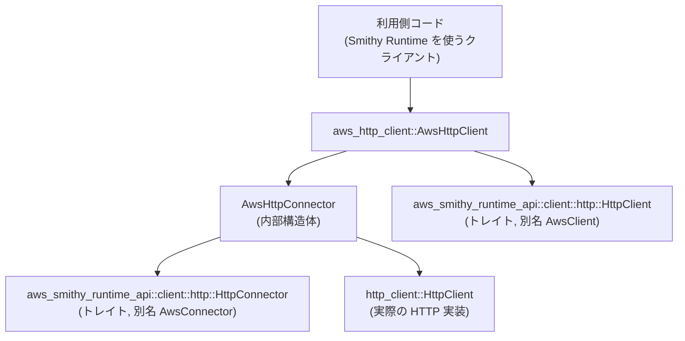
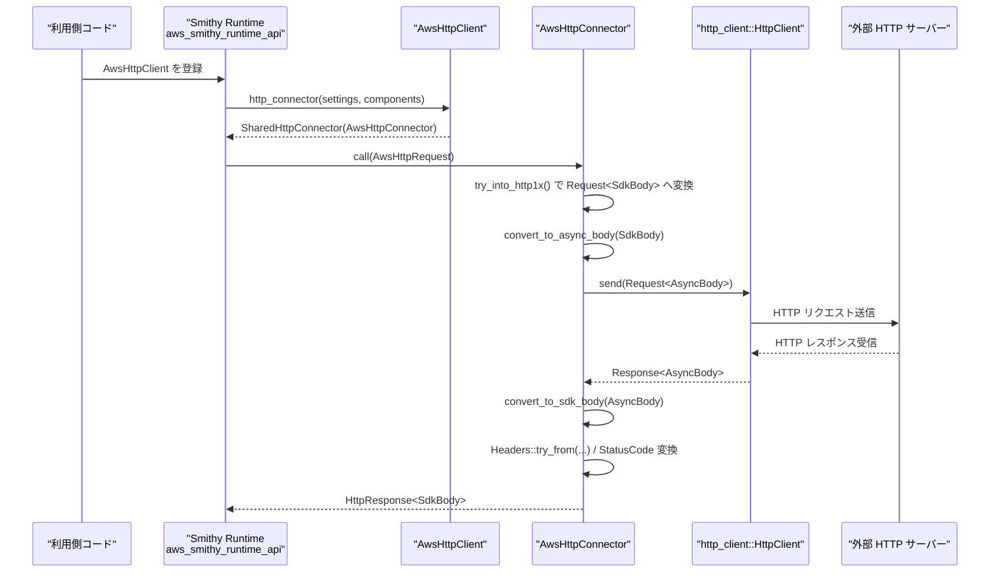

# aws_http_client ディレクトリ解説

## 1. ざっくり一言

`aws_http_client` は、ワークスペース内の汎用 `http_client::HttpClient` 実装を、AWS Smithy Runtime (`aws_smithy_runtime_api`) が期待する `HttpClient` / `HttpConnector` として使えるようにする **アダプタ用クレート**です。

---

## 2. このモジュールの役割

### 2.1 概要

- このクレートは、次の二つの世界を橋渡しします。
  - 「http_client」クレートが定義する汎用な非同期 HTTP クライアント (`http_client::HttpClient`)
  - AWS Smithy Runtime が利用する HTTP 抽象 (`aws_smithy_runtime_api::client::http::{HttpClient, HttpConnector}`)
- 具体的には、
  - `AwsHttpClient`: Smithy 側の `HttpClient` トレイト実装
  - `AwsHttpConnector`: Smithy 側の `HttpConnector` トレイト実装
- これにより、「http_client」側のクライアントを差し替えることで、Smithy ベースのクライアントコードから同じ HTTP 実装を利用できるようにしています。

### 2.2 アーキテクチャ内での位置づけ

このクレートが想定している依存関係を、主要コンポーネントに絞って示します。



- 利用側コードは、Smithy Runtime が要求する `HttpClient` として `AwsHttpClient` を登録します。
- `AwsHttpClient` は `HttpConnector` を返す役割を持ち、その実体が `AwsHttpConnector` です。
- `AwsHttpConnector` が実際の HTTP リクエスト送信を `http_client::HttpClient` に委譲します。

### 2.3 設計上のポイント

コードから読み取れる特徴を列挙します。

- **アダプタ構造**
  - `AwsHttpClient` は Smithy の `HttpClient` トレイトを実装し、内部で `AwsHttpConnector` を組み立てます。
  - `AwsHttpConnector` は Smithy の `HttpConnector` トレイトを実装し、実際の HTTP 送信を `http_client::HttpClient` に委譲します。
- **状態管理**
  - 共通して `Arc<dyn HttpClient>` を保持し、スレッド間で安全かつ効率的に共有できる前提の設計です。
  - `AwsHttpClient` は `Clone` 可能で、クローンしても内部の HTTP クライアントを共有します。
- **プロトコル**
  - Smithy の `HttpRequest` を `try_into_http1x()` で変換しているため、HTTP/1.x 向けのコネクタとして振る舞います（HTTP/2 などはこのコードからは扱われていません）。
- **ボディ変換**
  - 要求ボディ: `SdkBody` → `AsyncBody` (`convert_to_async_body`)
  - 応答ボディ: `AsyncBody` → `SdkBody` (`convert_to_sdk_body`)
- **エラーハンドリング**
  - 変換時や HTTP 送信時のエラーはすべて `ConnectorError::other(err.into(), None)` に集約して返します。
  - ヘッダー変換 (`Headers::try_from`) の失敗も同様に `ConnectorError` として扱います。
- **デバッグ実装**
  - `AwsHttpClient`, `AwsHttpConnector` の `Debug` 実装は構造体名のみを出力し、内部の `HttpClient` 実装詳細は表示しません。

---

## 3. 主要な機能一覧

このクレートが提供する主な機能を挙げます。

- `AwsHttpClient`:  
  Smithy Runtime の `HttpClient` トレイトを実装し、`http_client::HttpClient` を利用する HTTP クライアントを提供します。
- `AwsHttpConnector`:  
  Smithy Runtime の `HttpConnector` トレイトを実装する内部構造体で、実際の HTTP リクエストを `http_client::HttpClient` に委譲します。
- `convert_to_sdk_body`:  
  `http_client::AsyncBody` を AWS SDK の `SdkBody` に変換するユーティリティです。
- `convert_to_async_body`:  
  `SdkBody` を `AsyncBody` に変換するユーティリティです。バッファ済みのボディのみを扱い、未バッファな場合は空ボディになります。

---

## 4. 関数・構造体の解説

### 4.1 型一覧

| 名前              | 種別       | 公開 | 役割 / 用途 |
|-------------------|------------|------|-------------|
| `AwsHttpClient`    | 構造体     | `pub` | Smithy の `HttpClient` トレイト実装。内部に `Arc<dyn http_client::HttpClient>` を保持します。 |
| `AwsHttpConnector` | 構造体     | 非公開 | Smithy の `HttpConnector` トレイト実装。`AwsHttpClient` からのみ生成され、実際の送信処理を担当します。 |

補助的なユーティリティ関数:

| 名前                    | 種別  | 公開 | 役割 / 用途 |
|-------------------------|-------|------|-------------|
| `convert_to_sdk_body`   | 関数  | `pub` | `AsyncBody` → `SdkBody` 変換。HTTP レスポンスを Smithy 側のボディ型に変換する際に使用します。 |
| `convert_to_async_body` | 関数  | `pub` | `SdkBody` → `AsyncBody` 変換。Smithy 側の HTTP リクエストボディを `http_client` 側のボディ型に変換する際に使用します。 |

### 4.2 主要な関数・メソッドの詳細

#### `impl AwsConnector for AwsHttpConnector::call(&self, request: AwsHttpRequest) -> AwsConnectorFuture`

**概要**

- Smithy Runtime から渡される `AwsHttpRequest` を受け取り、
  - HTTP/1.x の `Request` に変換し、
  - `http_client::HttpClient` に送信させ、
  - その応答を Smithy の `HttpResponse` に変換して返す非同期処理を構築します。

**引数**

| 引数名   | 型              | 説明 |
|----------|-----------------|------|
| `request` | `AwsHttpRequest` | Smithy Runtime のオーケストレータから渡される HTTP リクエスト表現です。 |

**戻り値**

- 型: `AwsConnectorFuture` (`HttpConnectorFuture` の別名)
- 意味:  
  非同期に完了する Future で、`Result<HttpResponse, ConnectorError>` に相当する結果を返すことがコードから読み取れます（async ブロック内で `Ok(response)` / `Err(ConnectorError)` を返しています）。

**内部処理の流れ**

1. **リクエストの変換**
   - `request.try_into_http1x()` によって、Smithy の `AwsHttpRequest` を HTTP/1.x ベースの `Request<SdkBody>` に変換します。
   - 失敗した場合は `ConnectorError::other(err.into(), None)` として即座に失敗 Future (`HttpConnectorFuture::ready`) を返します。

2. **ボディ変換と送信**
   - `req.into_parts()` でヘッダーなどのメタデータ (`parts`) とボディ (`SdkBody`) に分解します。
   - `convert_to_async_body(body)` で `SdkBody` を `AsyncBody` に変換し、`Request::from_parts(parts, ...)` で `http_client` 用のリクエストを組み立てます。
   - 内部の `self.client: Arc<dyn HttpClient>` に対して `send(...)` を呼び、返ってくる Future を `response` 変数に保持します。

3. **応答 Future の構築**
   - `HttpConnectorFuture::new(async move { ... })` によって、上記 `response` Future を待つ async ブロックをラップした `HttpConnectorFuture` を生成して返します。

4. **応答の処理（async ブロック内）**
   - `response.await` で HTTP 応答を待ち、エラーなら `ConnectorError::other(err.into(), None)` に変換して返します。
   - 成功した場合、`response.into_parts()` によりメタデータ (`parts`) とボディ (`AsyncBody`) に分割します。

5. **ステータス・ボディ変換**
   - ステータスコード:  
     `parts.status.as_u16()` から `aws_smithy_runtime_api::http::StatusCode::try_from(...)` を呼び、`unwrap()` で成功前提で取得します。
   - ボディ:  
     `convert_to_sdk_body(body)` により、`AsyncBody` から `SdkBody` を構築します。
   - これらを用いて `HttpResponse::new(status_code, sdk_body)` を作成します。

6. **ヘッダーの変換と設定**
   - `Headers::try_from(parts.headers)` により、HTTP ヘッダーを Smithy の `Headers` 型に変換します。
   - 失敗した場合、`ConnectorError::other(err.into(), None)` を返します。
   - 成功した場合、`*response.headers_mut() = headers;` で `HttpResponse` に設定し、`Ok(response)` として返します。

**Examples（使用例）**

このメソッドはトレイト実装の一部であり、利用側コードから直接呼び出すことは通常想定されません。Smithy Runtime が内部で呼び出す役割を持ちます。

**Errors / Panics**

- `Err(ConnectorError)` になるケース:
  - `request.try_into_http1x()` が失敗した場合（非対応のプロトコルやヘッダーなどの理由が考えられますが、詳細はこのコードからは分かりません）。
  - `self.client.send(...)` がエラーを返した場合。
  - `Headers::try_from(parts.headers)` が失敗した場合。
- panic の可能性:
  - `StatusCode::try_from(parts.status.as_u16()).unwrap()` で `unwrap()` を使用しています。
  - 通常、HTTP ステータスコードは有効な値のみが入るため、ここで panic することは想定されていませんが、理論上は異常なステータス値があれば panic しえます。

**Edge cases（エッジケース）**

- リクエストボディが `SdkBody` 内でバッファされていない場合:
  - `convert_to_async_body` の仕様上、空ボディとして送信されます（詳細は後述）。
- 応答ヘッダーが Smithy の `Headers` 型の制約に合わない場合:
  - `Headers::try_from` がエラーになり、`ConnectorError` として返されます。
- 非 HTTP/1.x のリクエスト:
  - `try_into_http1x()` でエラーとなり、送信まで進みません。

**使用上の注意点**

- `AwsHttpConnector` はライブラリ外から直接使用する設計ではなく、`AwsHttpClient` 経由で生成・利用されます。
- 送信されるボディが「バッファ済みの `SdkBody`」に限られる点に注意が必要です（ストリーミングなど、バッファを持たないボディは空として扱われます）。

---

#### `impl AwsClient for AwsHttpClient::http_connector(&self, _settings: &HttpConnectorSettings, _components: &RuntimeComponents) -> SharedHttpConnector`

**概要**

- Smithy の `HttpClient` トレイトが要求するメソッドで、HTTP リクエストを実際に送信する `HttpConnector` を返します。
- ここでは `AwsHttpConnector` を `SharedHttpConnector` でラップして返します。

**引数**

| 引数名       | 型                     | 説明 |
|--------------|------------------------|------|
| `_settings`  | `&HttpConnectorSettings` | コネクタの設定情報です。この実装では使用していません。 |
| `_components`| `&RuntimeComponents`     | ランタイムコンポーネント群です。この実装では使用していません。 |

※ 引数名が `_` で始まるのは「未使用である」ことを示す慣習です。

**戻り値**

- 型: `SharedHttpConnector`
- 意味:  
  内部に `AwsHttpConnector` のインスタンスを持つ共有コネクタです。Smithy Runtime はこれを通して HTTP リクエストを送信します。

**内部処理の流れ**

1. `AwsHttpConnector { client: self.client.clone() }` で、内部の `Arc<dyn HttpClient>` をクローンして新しい `AwsHttpConnector` を生成します。
2. `SharedHttpConnector::new(...)` でラップし、共有可能なコネクタとして返します。

**Examples（使用例）**

疑似コードとして、Smithy Runtime から呼ばれるイメージです。

```rust
use std::sync::Arc;
use aws_http_client::AwsHttpClient;
use http_client::HttpClient; // トレイト
use aws_smithy_runtime_api::client::http::{HttpClient as AwsClientTrait, HttpConnectorSettings};
use aws_smithy_runtime_api::client::runtime_components::RuntimeComponents;

// 仮: http_client クレート側で用意した具体的な HttpClient 実装を用意する
let inner_client: Arc<dyn HttpClient> = /* http_client 側で構築 */;

let aws_client = AwsHttpClient::new(inner_client);

// ここで settings, components の構築方法はこのコードからは分かりません
let settings: HttpConnectorSettings = /* Smithy Runtime の設定を構築 */;
let components: RuntimeComponents = /* RuntimeComponents を構築 */;

// AwsHttpClient は AwsClientTrait (HttpClient) として利用できる
let shared_connector = aws_client.http_connector(&settings, &components);
// shared_connector を用いて Smithy Runtime が HTTP を送信する
```

**Errors / Panics**

- このメソッド自身はエラーを返さず、内部で panic する可能性もありません（単に構造体を生成してラップしているだけです）。

**Edge cases**

- `_settings` や `_components` の内容に依存した分岐はありません。常に同じ形で `AwsHttpConnector` が生成されます。

**使用上の注意点**

- `AwsHttpClient` に渡した `Arc<dyn HttpClient>` のライフサイクルやスレッド安全性に注意する必要があります（`Arc` で共有されるため、実装側がスレッドセーフである前提です）。
- 設定やコンポーネントを無視しているため、将来的に Smithy 側でこれらを使った高度な設定が必要な場合には、この実装を拡張する必要が出る可能性があります（コードからは現状の利用意図しか分かりません）。

---

#### `impl AwsHttpClient::new(client: Arc<dyn HttpClient>) -> Self`

**概要**

- `Arc<dyn http_client::HttpClient>` を受け取り、それを内部に保持する `AwsHttpClient` を生成するコンストラクタです。

**引数**

| 引数名  | 型                    | 説明 |
|---------|-----------------------|------|
| `client` | `Arc<dyn HttpClient>` | 実際に HTTP リクエストを送信する `http_client` クレート側のクライアント実装です。 |

**戻り値**

- 型: `AwsHttpClient`
- 意味: Smithy Runtime から利用できる HTTP クライアントラッパーです。

**内部処理の流れ**

1. 単に `Self { client }` でフィールドに引数を格納して返しています。

**Examples（使用例）**

```rust
use std::sync::Arc;
use aws_http_client::AwsHttpClient;
use http_client::HttpClient; // トレイト

// 仮: http_client クレート側で具体的なクライアントを構築
let inner_client: Arc<dyn HttpClient> = /* 具体的な実装を構築 */;

// AwsHttpClient に包む
let aws_client = AwsHttpClient::new(inner_client.clone());

// aws_client は Clone 可能で、クローンしても inner_client は共有されます
let aws_client2 = aws_client.clone();
```

**Errors / Panics**

- エラーや panic の可能性はありません。

**Edge cases**

- `client` に `Arc` を渡すだけの処理のため、特筆すべきエッジケースはありません。

**使用上の注意点**

- 引数に `Arc<dyn HttpClient>` を要求しているため、所有権を共有する前提の設計です。`Box<dyn HttpClient>` などとは異なる点に注意します。
- `AwsHttpClient` 自体が `Clone` 可能であるため、クローンを多数生成しても内部の HTTP クライアントは共有され、リソース消費が増えにくい構造になっています。

---

#### `pub fn convert_to_sdk_body(body: AsyncBody) -> SdkBody`

**概要**

- `http_client::AsyncBody` を AWS SDK の `SdkBody` に変換します。
- HTTP レスポンスのボディを Smithy 側に渡す際に使用されています。

**引数**

| 引数名 | 型         | 説明 |
|--------|------------|------|
| `body` | `AsyncBody` | `http_client` クレート側の非同期ボディ型です。 |

**戻り値**

- 型: `SdkBody`
- 意味: AWS SDK / Smithy で利用されるボディ型です。内部では `SdkBody::from_body_1_x(body)` を呼び出しています。

**内部処理の流れ**

1. そのまま `SdkBody::from_body_1_x(body)` を呼び出して返します。
   - `from_body_1_x` は「HTTP/1.x のボディ型から `SdkBody` を構築する」ためのコンストラクタであると名前から解釈できますが、詳細な挙動はこのコードからは分かりません。

**Examples（使用例）**

```rust
use aws_http_client::convert_to_sdk_body;
use http_client::AsyncBody;
use aws_smithy_types::body::SdkBody;

// 何らかの AsyncBody を持っているとする
let async_body: AsyncBody = /* http_client 側で生成 */;

// Smithy/Sdk 側の SdkBody に変換
let sdk_body: SdkBody = convert_to_sdk_body(async_body);
```

**Errors / Panics**

- 呼び出し側から見えるエラー処理や panic はありません。`SdkBody::from_body_1_x` の内部挙動については、このコードからは分かりません。

**Edge cases**

- 非同期ストリーミングなど、`AsyncBody` の中身がどのように扱われるかは `SdkBody::from_body_1_x` に依存します。このファイルからは、具体的な制約やエッジケースは読み取れません。

**使用上の注意点**

- HTTP レスポンスボディを Smithy Runtime に引き渡す場合、この関数を使用すると `AwsHttpConnector` と同じ変換経路になります。

---

#### `pub fn convert_to_async_body(body: SdkBody) -> AsyncBody`

**概要**

- `SdkBody` から `http_client::AsyncBody` を生成します。
- HTTP リクエスト送信前に、Smithy 側のボディを `http_client` 側のボディ型に変換する際に使用されています。

**引数**

| 引数名 | 型      | 説明 |
|--------|---------|------|
| `body` | `SdkBody` | Smithy / AWS SDK 側のボディ型です。 |

**戻り値**

- 型: `AsyncBody`
- 意味: `http_client` クレートで利用可能なボディ型です。

**内部処理の流れ**

1. `body.bytes()` を呼び出し、内部にバッファ済みのバイト列があるかどうかを確認します。
2. `Some(bytes)` が返った場合:
   - `AsyncBody::from((*bytes).to_vec())` により、そのバイト列から `AsyncBody` を生成します。
3. `None` が返った場合:
   - `AsyncBody::empty()` を返し、空のボディとして扱います。

**Examples（使用例）**

```rust
use aws_http_client::convert_to_async_body;
use aws_smithy_types::body::SdkBody;
use http_client::AsyncBody;

// SdkBody を持っているとする
let sdk_body: SdkBody = /* Smithy 側で構築 */;

// http_client 側の AsyncBody に変換
let async_body: AsyncBody = convert_to_async_body(sdk_body);
```

**Errors / Panics**

- この関数内でエラーや panic は発生しません。

**Edge cases**

- `body.bytes()` が `None` を返した場合:
  - `AsyncBody::empty()` が返され、結果として「空ボディ」として送信されます。
  - これは「内部にバッファ済みのバイト列を持たない `SdkBody`」に相当します。例えばストリーミングボディなどが該当する可能性がありますが、具体的な条件は `SdkBody` の実装に依存します。
- そのため、ストリーミングや大きなボディを送信したい場合には、この変換方法が適切かどうか確認が必要です（コードからは詳細は分かりませんが、空ボディになりうる点は重要です）。

**使用上の注意点**

- `SdkBody` が内部でバッファしていないケースでは、内容が失われ、空ボディとして送信されます。
- 大きなボディやストリーミングを扱う場合には、`body.bytes()` を使った単純な変換が適切かどうかを検討する必要があります。

---

### 4.3 その他の要素

- `AwsHttpClient` / `AwsHttpConnector` の `Debug` 実装:
  - `f.debug_struct("AwsHttpClient").finish()` のように、構造体名のみを表示し、内部状態は見せない実装になっています。
  - ログなどでの出力が簡潔になり、内部の HTTP 実装名などを隠蔽できます。

---

## 5. データフロー

ここでは、Smithy Runtime が HTTP リクエストを送信する典型的なフローを示します。

### 5.1 処理の流れ（概要）

1. 利用側コードが `AwsHttpClient` を Smithy Runtime に登録します。
2. Smithy Runtime が HTTP 送信の必要に応じて `http_connector()` を呼び、`SharedHttpConnector` を取得します。
3. Smithy Runtime が `AwsHttpRequest` を `AwsHttpConnector::call` に渡します。
4. `AwsHttpConnector` が `http_client::HttpClient` に実際の HTTP リクエスト送信を依頼します。
5. 応答を受け取った後、ステータスコード・ヘッダー・ボディを Smithy の `HttpResponse` へと変換して返します。

### 5.2 Mermaid シーケンス図



この図から分かるように、このクレートは **リクエスト・レスポンスのボディ／ヘッダー／ステータスの型変換と、`http_client` への委譲** を主な責務としています。

---

## 6. 使い方（How to Use）

### 6.1 基本的な使用方法

最も基本的な利用方法は、「`http_client::HttpClient` 実装を `AwsHttpClient` でラップし、Smithy Runtime から利用できるようにする」ことです。

以下はイメージとなる疑似コードです（`settings` や `components` の構築は、このコードからは分からないためコメントで表現しています）。

```rust
use std::sync::Arc;

// このクレート
use aws_http_client::AwsHttpClient;
use http_client::HttpClient; // トレイト

// Smithy Runtime 側の型
use aws_smithy_runtime_api::client::http::{
    HttpClient as AwsClientTrait, HttpConnectorSettings,
};
use aws_smithy_runtime_api::client::runtime_components::RuntimeComponents;

// 1. http_client クレート側で具体的な HTTP クライアント実装を構築する
let inner_client: Arc<dyn HttpClient> = /* http_client クレートの具体型を構築 */;

// 2. AwsHttpClient でラップする
let aws_client = AwsHttpClient::new(inner_client);

// 3. Smithy Runtime に AwsClientTrait として渡す（疑似コード）
fn register_http_client<C: AwsClientTrait>(client: C) {
    // RuntimeComponents や設定と紐付ける処理があると想定
}

register_http_client(aws_client);
```

ポイント:

- `AwsHttpClient` 自体は `aws_smithy_runtime_api::client::http::HttpClient` トレイト (`AwsClient` エイリアス) を実装しているため、Smithy Runtime の「HTTP クライアント差し替えポイント」で利用できます。
- 具体的な登録方法や構築方法は、Smithy Runtime あるいは SDK 側のコードに依存します。このクレートのコードからは詳細は分かりません。

### 6.2 よくある使用パターン

いくつか考えられる利用パターンを、コードから読み取れる範囲で整理します。

1. **複数のクライアントインスタンスで HTTP 実装を共有する**

```rust
use std::sync::Arc;
use aws_http_client::AwsHttpClient;
use http_client::HttpClient;

let inner: Arc<dyn HttpClient> = /* 具体的な http_client 実装 */;

// 同じ HTTP 実装を共有する AwsHttpClient を複数作る
let client_a = AwsHttpClient::new(inner.clone());
let client_b = AwsHttpClient::new(inner.clone());

// あるいは AwsHttpClient 自体を Clone する
let client_c = client_a.clone();
```

- `Arc` と `Clone` の組み合わせにより、同じ HTTP 実装を複数の Smithy クライアント設定で再利用できます。

2. **ボディ変換ユーティリティのみを単体利用する**

`convert_to_async_body` / `convert_to_sdk_body` は公開関数なので、他の変換処理でも再利用できます。

```rust
use aws_http_client::{convert_to_async_body, convert_to_sdk_body};
use aws_smithy_types::body::SdkBody;
use http_client::AsyncBody;

// SdkBody → AsyncBody
let sdk_body: SdkBody = /* 構築 */;
let async_body: AsyncBody = convert_to_async_body(sdk_body);

// AsyncBody → SdkBody
let async_body2: AsyncBody = /* 構築 */;
let sdk_body2: SdkBody = convert_to_sdk_body(async_body2);
```

### 6.3 使用上の注意点

このクレートを利用する際に特に意識したい注意点をまとめます。

- **ボディのバッファリングに関する注意**
  - `convert_to_async_body` は `SdkBody::bytes()` を使ってボディを取り出します。
  - `bytes()` が `None` を返した場合は `AsyncBody::empty()` になり、結果として「空のリクエストボディ」が送信されます。
  - そのため、ストリーミングボディや、意図的にバッファされていない `SdkBody` を扱う場合は内容が失われる可能性があります。
- **HTTP/1.x 前提であること**
  - `try_into_http1x()` を使用しているため、この実装は HTTP/1.x 用のコネクタとして振る舞います。
  - HTTP/2 などのプロトコルを利用する場合には別のルートが必要になる可能性があります（このコードからは HTTP/2 対応状況は分かりません）。
- **エラーが `ConnectorError::other` に集約されること**
  - リクエスト変換・HTTP 送信・ヘッダー変換など、様々な失敗がすべて `ConnectorError::other(err.into(), None)` として返されます。
  - 失敗の詳細を判別するには、内包されるエラー型（`err.into()` の結果）を調査する必要があります。
- **ステータスコード変換の `unwrap`**
  - 通常は安全と考えられますが、`StatusCode::try_from(...).unwrap()` を使用しているため、理論上は不正なステータスコードが来た場合に panic する可能性があります。
- **`http_client::HttpClient` 実装側の制約**
  - 実際の HTTP 通信の挙動は `http_client` クレート側の実装に依存します（再試行、タイムアウト、接続プールなど）。
  - このクレートはその上に薄いアダプタを載せているだけなので、パフォーマンスやスレッド安全性などの特性は、主に `http_client` 側の実装に従います。

---

## 7. 関連ファイル

このディレクトリに含まれるファイルと、それぞれの役割をまとめます。

| パス                                   | 役割 / 関係 |
|----------------------------------------|-------------|
| `aws_http_client/Cargo.toml`           | クレート名 (`aws_http_client`)、ライブラリのエントリポイント (`src/aws_http_client.rs`)、依存関係（`aws-smithy-runtime-api`, `aws-smithy-types`, `http_client`）などを定義しています。 |
| `aws_http_client/src/aws_http_client.rs` | このクレートの本体です。`AwsHttpClient` および `AwsHttpConnector` の定義、ボディ変換ユーティリティ関数など、すべての公開 API がここに含まれています。 |

このチャンクにはテストコードや他のモジュールは含まれていないため、テスト方法やより広い文脈での利用例については、この情報だけからは分かりません。
