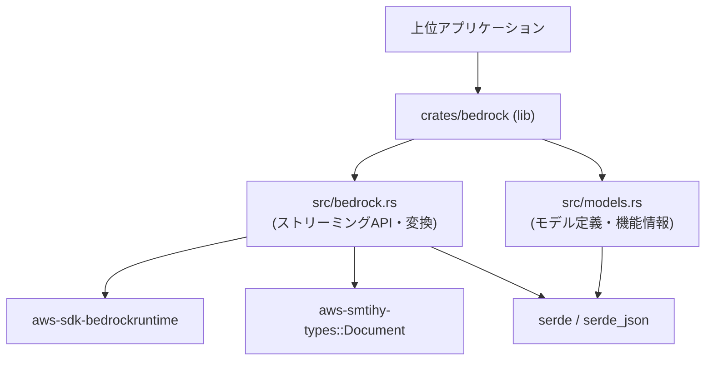
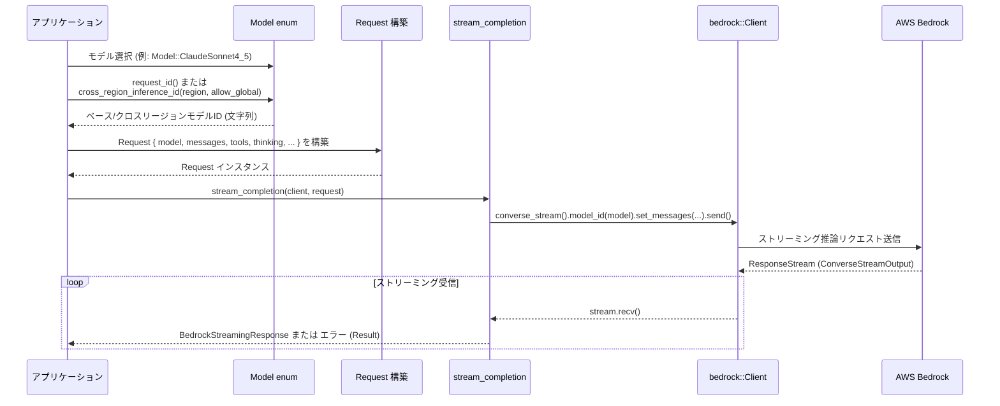

# crates/bedrock ディレクトリ解説

## 1. ざっくり一言

AWS Bedrock Runtime の会話ストリーミング API を薄くラップし、  
「どのモデルが何をどこまでできるか」を表す型とユーティリティをまとめたクレートです。

---

## 2. このモジュールの役割

### 2.1 概要

- このディレクトリ（`crates/bedrock`）は、AWS Bedrock Runtime クライアント (`aws-sdk-bedrockruntime`) を使った **ストリーミング会話呼び出し** と、
- 各種 LLM（Claude, Llama, Gemma, Nova, DeepSeek など）に関する **モデル定義・メタ情報・機能フラグ** を提供します。

これにより、上位コードは「Model enum を選ぶ → Bedrock 用の model_id / 機能サポートを参照 → Request を組み立てて `stream_completion` を呼び出す」という形で Bedrock を扱えます。

### 2.2 アーキテクチャ内での位置づけ

このクレート内部の依存関係と外部クレートとの関係は、おおまかに次のようになっています。



- `src/bedrock.rs` がライブラリ本体（`[lib] path = "src/bedrock.rs"`）で、  
  - Bedrock クライアントの型を re-export しつつ、
  - ストリーミング会話関数 `stream_completion` と JSON/Document 相互変換関数を提供します。
- `src/models.rs` は「どのモデルがどんな能力を持つか」を表す `Model` enum と、その補助型・メソッド群を提供します。
- 両者は `pub use crate::models::*;` により同じ公開 API 空間にまとまっています。

このチャンクには実際に `crates/bedrock` を利用する他クレートは含まれていないため、  
どこから呼ばれているかは不明ですが、上記のようなレイヤ構造になっています。

### 2.3 設計上のポイント

コードから読み取れる特徴をまとめると、次のようになります。

- **AWS 型の re-export**
  - `aws-sdk-bedrockruntime` の型を `BedrockMessage` などの名前でそのまま再公開しています。
  - 上位コードは AWS クレートを直接インポートせず、このクレート経由で型を扱えます。

- **モデル情報の一元管理**
  - `Model` enum に、Anthropic / Meta / Google / Mistral / Qwen / Amazon Nova / DeepSeek などのモデルを列挙し、
  - 各モデルの
    - フレンドリ ID (`id()`)
    - Bedrock 用モデル ID (`request_id()`)
    - 最大トークン数 (`max_tokens()`, `max_output_tokens()`)
    - 対応機能 (`supports_tool_use()`, `supports_images()`, `supports_thinking()` など)
    - キャッシュ設定 (`cache_configuration()`)
  をメソッドとして持たせています。

- **エラーハンドリングの単純化**
  - Bedrock の `SdkError` / `ConverseStreamError` を `BedrockError` にマッピングし、
  - それ以外のエラーは `anyhow::Error` にまとめています。

- **JSON と AWS Document の橋渡し**
  - `aws_smithy_types::Document` と `serde_json::Value` の相互変換関数を提供し、
  - Bedrock の柔軟な JSON 型と一般的な JSON 型の間を変換できます。

- **思考モード（Thinking）や拡張コンテキスト**
  - Anthropic 系モデルの「thinking」モードや、`context-1m` の β フラグを  
    追加のモデルリクエストフィールドとして自動付与します。

---

## 3. 主要な機能一覧

このディレクトリが提供する主な機能を列挙します。

- ストリーミング会話呼び出し:
  - `stream_completion`: Bedrock `converse_stream` API によるストリーミング推論の実行
- 追加モデル設定の組み立て:
  - Thinking モード（`Thinking` enum）→ Bedrock の `"thinking"` 追加フィールドに変換
  - 1M コンテキスト β フラグ（`allow_extended_context`）→ `"anthropic_beta"` フィールド付与
  - ツール呼び出し設定（`BedrockToolConfig`）の設定
- 推論設定（InferenceConfiguration）の構築:
  - `max_tokens`, `temperature`, `top_p` の設定
- JSON 型の変換ユーティリティ:
  - `aws_document_to_value`: `aws_smithy_types::Document` → `serde_json::Value`
  - `value_to_aws_document`: `serde_json::Value` → `aws_smithy_types::Document`
- モデル定義とメタ情報:
  - `Model` enum: 各モデルの ID・表示名・最大トークン数・サポート機能の判定
  - `BedrockModelMode` / `thinking_mode()`: モデルに応じたデフォルト思考モードの決定
  - `BedrockModelCacheConfiguration` / `supports_caching()` / `cache_configuration()`
- クロスリージョン推論 ID の決定:
  - `Model::cross_region_inference_id(region, allow_global)`: リージョンとグローバル許可に応じて  
    `us.xxx.〜`, `eu.xxx.〜`, `global.xxx.〜` などのモデル ID を構築

---

## 4. 関数・構造体の解説

### 4.1 型一覧（主要な公開型）

このディレクトリ内で定義・再公開されている主要型です。

| 名前 | 種別 | 定義場所 | 役割 / 用途 |
|------|------|----------|-------------|
| `Request` | 構造体 | `bedrock.rs` | `stream_completion` に渡す Bedrock 会話リクエスト全体。モデル ID、メッセージ、ツール設定、thinking 設定などを保持します。 |
| `Thinking` | 列挙体 | `bedrock.rs` | Thinking モードの指定（固定トークン予算 or Adaptive）。`stream_completion` で `"thinking"` フィールドに変換されます。 |
| `Metadata` | 構造体 | `bedrock.rs` | 追加メタデータ（現状 `user_id` のみ）。`Request` に含まれますが、このチャンク内では未使用です。 |
| `BedrockError` | 列挙体 | `bedrock.rs` | Bedrock 呼び出しで発生しうる代表的なエラーをまとめたエラー型。バリデーション・レート制限・内部エラーなどを分類します。 |
| `BedrockAdaptiveThinkingEffort` | 列挙体 | `models.rs` | Adaptive thinking モードの強度 (`Low`〜`Max`) を表現します。 |
| `BedrockModelMode` | 列挙体 | `models.rs` | モデルのモード（通常 / Thinking / AdaptiveThinking）を表現します。`Model::thinking_mode` で利用されます。 |
| `BedrockModelCacheConfiguration` | 構造体 | `models.rs` | Bedrock モデルキャッシュの設定（アンカー数・最小トークン数）を表現します。 |
| `Model` | 列挙体 | `models.rs` | 対応する各モデル（Anthropic, Meta, Google, Mistral, Qwen など）を列挙し、ID・表示名・機能フラグ・トークン上限などを提供します。 |

外部クレートからの re-export も多く行われています。

| 名前 | 実体 | 役割 / 用途 |
|------|------|-------------|
| `bedrock_client` | `pub use aws_sdk_bedrockruntime as bedrock_client;` | 生の AWS Bedrock Runtime クライアントクレートの別名。上位コードから直接 AWS SDK を参照したい場合に利用します。 |
| `BedrockStreamingRequest` | `bedrock::operation::converse_stream::ConverseStreamInput` | ストリーミング会話 API のリクエスト型（低レベル）。 |
| `BedrockStreamingResponse` | `bedrock::types::ConverseStreamOutput` | ストリーミング会話 API のレスポンスタイプ（高レベル）。 |
| `BedrockResponseStream` | `bedrock::types::ResponseStream` | ストリーム内のイベントを表す型。`stream_completion` の内部で使用されます。 |
| `BedrockMessage` | `bedrock::types::Message` | 会話履歴の1メッセージ（role＋content）。`Request.messages` で使用。 |
| `BedrockRole` | `bedrock::types::ConversationRole` | メッセージの役割（user / assistant / system など）。 |
| `BedrockRequestContent` | `bedrock::types::ContentBlock` | テキスト／画像／ツール結果などのコンテンツ。 |
| `BedrockSystemContentBlock` | `bedrock::types::SystemContentBlock` | system プロンプトのコンテンツ。`Request.system` で利用されます。 |
| `BedrockToolConfig` | `bedrock::types::ToolConfiguration` | Bedrock ツール（関数呼び出し）の設定。`Request.tools` で使用。 |
| `BedrockToolSpec` 他 | `ToolSpecification` など | ツール仕様・ツール選択・ツール呼び出し結果を表現する各種型。 |
| `BedrockBlob` | `aws_smithy_types::Blob` | バイナリデータを扱うための共通型。 |

> 注: re-export された AWS SDK の型の具体的なフィールドや構築方法は、このチャンクには含まれていません。

---

### 4.2 重要な関数の詳細

#### `async fn stream_completion(client: bedrock::Client, request: Request) -> Result<BoxStream<'static, Result<BedrockStreamingResponse, anyhow::Error>>, BedrockError>`

**概要**

- AWS Bedrock Runtime の `converse_stream` API を呼び出し、  
  ストリーミングで会話レスポンスを受け取るためのラッパ関数です。
- Thinking 設定や extended context オプション、ツール設定、推論設定（max_tokens, temperature, top_p）を Request から読み取って Bedrock リクエストに反映します。
- 戻り値は「ストリーム自体に対するエラー」と「ストリームの各イベントに対するエラー」を分離しています。

**引数**

| 引数名 | 型 | 説明 |
|--------|----|------|
| `client` | `bedrock::Client` | AWS Bedrock Runtime のクライアント。生成方法は AWS SDK の API に依存します。 |
| `request` | `Request` | モデル ID、メッセージ群、ツール設定、thinking 設定などを含むリクエストデータ。 |

**戻り値**

- `Ok(BoxStream<'static, Result<BedrockStreamingResponse, anyhow::Error>>)`:
  - ストリームに対する outer `Ok` は、「Bedrock へのリクエスト送信そのものが成功した」ことを意味します。
  - ストリームから取り出される各要素は `Result<BedrockStreamingResponse, anyhow::Error>` で、
    - `Ok(BedrockStreamingResponse)` が正常なストリーミングイベント、
    - `Err(anyhow::Error)` がストリーミング途中のエラーを表します。
- `Err(BedrockError)`:
  - `converse_stream().send().await` 自体が失敗した場合（バリデーションエラー、レート制限、アクセス拒否など）に返されます。

**内部処理の流れ**

ざっくりとしたステップは次の通りです。

1. `bedrock::Client::converse_stream(&client)` でストリーミングリクエストビルダーを取得し、  
   `model_id(request.model.clone())` と `set_messages(request.messages.into())` を設定します。
2. `Thinking` や `allow_extended_context` に応じて、`additional_model_request_fields` に渡す `Document::Object` を組み立てます。
   - `Thinking::Enabled { budget_tokens: Some(b) }` → `"thinking": { "type": "enabled", "budget_tokens": b }`
   - `Thinking::Adaptive { ... }` → `"thinking": { "type": "adaptive" }`
   - `allow_extended_context == true` → `"anthropic_beta": ["context-1m-2025-08-07"]`
3. ツール設定（`request.tools`）が存在し、かつ `tools.tools` が空でない場合、`set_tool_config(request.tools)` を呼びます。
4. `InferenceConfiguration::builder()` から推論設定を作成し、
   - `max_tokens`（`i32` にキャストした値）
   - `temperature` / `top_p`（いずれも `Option`）
   を設定して `inference_config` にセットします。
5. `request.system` が `Some` かつ空文字列でない場合、
   `system(BedrockSystemContentBlock::Text(system))` をセットします。
6. `.send().await` を呼び出し、その結果のエラーを `BedrockError` にマッピングします。
7. 成功した場合は返ってきた `output.stream` を `futures::stream::unfold` でラップし、
   `stream.recv().await` を繰り返しながら `BedrockStreamingResponse`（またはエラー）を流す `BoxStream` を構築します。

**簡単な使用例**

`Request` を構築し、`stream_completion` でストリーミングレスポンスを受け取る流れの例です。  
Bedrock クライアントや `BedrockMessage` の具体的な構築方法は、このチャンクには含まれていないためコメントで省略しています。

```rust
use futures::StreamExt;                                   // ストリームを反復処理するためのトレイト
use bedrock::{                                           // このクレートから公開されている型をインポート
    stream_completion,
    Request,
    Model,
    BedrockMessage,
    BedrockRole,
    BedrockRequestContent,
    bedrock_client,
};

#[tokio::main]                                           // 非同期 main 関数
async fn main() -> anyhow::Result<()> {                  // anyhow::Result で簡易エラー処理
    // Bedrock クライアントを初期化する（具体例は AWS SDK に依存するため省略）
    let client: bedrock_client::Client = /* Bedrock クライアントを生成 */;

    // 利用するモデルを選択する（ここでは Claude Sonnet 4.5 とする）
    let model = Model::ClaudeSonnet4_5;                   // モデル enum から選択

    // Bedrock に渡すモデル ID を取得する（リージョンを意識しない場合は request_id() を使う）
    let model_id = model.request_id().to_string();        // 例: "anthropic.claude-sonnet-4-5-..." のような文字列

    // 会話メッセージを用意する（具体的な構築方法は AWS SDK に依存するためコメントで記述）
    let messages: Vec<BedrockMessage> = vec![
        /* ここで BedrockMessage を構築する。role=User, content=テキスト など */
    ];

    // Request 構造体を組み立てる
    let request = Request {
        model: model_id,                                  // Bedrock の model_id
        max_tokens: model.max_output_tokens(),            // モデルごとの最大出力トークン数を上限として利用
        messages,                                         // 先ほど用意したメッセージ一覧
        tools: None,                                      // ツール呼び出しを使わない場合は None
        thinking: None,                                   // Thinking モードを使わない場合は None
        system: Some("You are a helpful assistant.".into()), // system プロンプト
        metadata: None,                                   // 任意のメタデータ（このコードでは未使用）
        stop_sequences: vec![],                           // 追加の停止シーケンス（このコードでは未使用）
        temperature: Some(model.default_temperature()),   // モデルのデフォルト温度を利用
        top_k: None,                                      // top_k はここでは設定していない
        top_p: Some(0.9),                                 // nucleus sampling のパラメータ
        allow_extended_context: model.supports_extended_context(), // 拡張コンテキスト対応モデルのみ true
    };

    // ストリーミング推論を開始する
    let mut stream = stream_completion(client, request)   // BedrockError かストリームを返す
        .await?;                                          // BedrockError は ? で早期 return する

    // ストリームからイベントを順に受け取る
    while let Some(event) = stream.next().await {         // ストリームが終わるまでループ
        match event {
            Ok(chunk) => {                                // 正常なストリーミングレスポンス
                // chunk 内の増分テキストやツール呼び出し結果を取り出して利用する
                // 具体的なフィールドは BedrockStreamingResponse の定義に依存
            }
            Err(err) => {                                 // ストリーミング途中のエラー
                eprintln!("stream error: {err}");         // ログ出力などの処理を行う
            }
        }
    }

    Ok(())                                                // 正常終了
}
```

**Errors / Panics**

- **関数自体のエラー (`BedrockError`)**
  - `ConverseStreamError::ValidationException` → `BedrockError::Validation(message)`
  - `ConverseStreamError::ThrottlingException` → `BedrockError::RateLimited`
  - `ConverseStreamError::ServiceUnavailableException` または `ModelNotReadyException` → `BedrockError::ServiceUnavailable`
  - `ConverseStreamError::AccessDeniedException` → `BedrockError::AccessDenied(message)`
  - `ConverseStreamError::InternalServerException` → `BedrockError::InternalServer(message)`
  - その他の `SdkError` / `ConverseStreamError` → `BedrockError::Other(anyhow::Error)`
- **ストリーム要素のエラー (`anyhow::Error`)**
  - `stream.recv().await` がエラーを返した場合、その都度 `Err(anyhow!(DisplayErrorContext(err)))` がストリームに流れます。
- パニック条件はこの関数内にはありません（unwrap 等は使われていません）。

**Edge cases（エッジケース）**

- `request.tools` が `Some` でも `tools.tools.is_empty()` の場合はツール設定が送信されません。
- `request.system` が `Some("")`（空文字）の場合は system コンテンツは送信されません。
- `Thinking::Enabled { budget_tokens: None }` はマッチ対象外なので、`"thinking"` フィールドが送信されません。
- `request.allow_extended_context == true` でも、モデル側が `supports_extended_context()` とは無関係に `"anthropic_beta"` フィールドが付与されます。  
  （サーバ側の挙動はこのチャンクからは分かりません。）

**使用上の注意点**

- `Request.model` には Bedrock が受け付ける model_id を渡す必要があります。  
  一般には `Model::request_id()` または `Model::cross_region_inference_id()` の戻り値を使うことが想定されます。
- `Request.tools` を指定する場合は、`Model::supports_tool_use()` が `true` のモデルを選ぶことが安全です。
- ストリーミング中にエラーが発生しても、ストリーム自体は継続する形（エラーイベントを流し続ける）になっています。  
  呼び出し側で `Err` を受け取ったら適宜中断等の処理を実装する必要があります。

---

#### `pub fn aws_document_to_value(document: &Document) -> serde_json::Value`

**概要**

- `aws_smithy_types::Document` を `serde_json::Value` に変換するユーティリティ関数です。
- AWS SDK の汎用 JSON 表現を、一般的な `serde_json` ベースのコードから扱いやすくします。

**引数**

| 引数名 | 型 | 説明 |
|--------|----|------|
| `document` | `&Document` | 変換元となる AWS Smithy の JSON 表現。 |

**戻り値**

- `serde_json::Value`:
  - `Document::Null` → `Value::Null`
  - `Document::Bool` → `Value::Bool`
  - `Document::Number` → `Value::Number`
  - `Document::String` → `Value::String`
  - `Document::Array` → `Value::Array`
  - `Document::Object` → `Value::Object`

**内部処理の流れ**

1. `match document` で `Document` のバリアントごとに分岐します。
2. `Document::Number` の場合はさらに
   - `AwsNumber::PosInt(u64)` → `Number::from(u64)`
   - `AwsNumber::NegInt(i64)` → `Number::from(i64)`
   - `AwsNumber::Float(f64)` → `Number::from_f64(f64).unwrap()`
   に変換します。
3. `Array` / `Object` の場合は再帰的に `aws_document_to_value` を呼び出します。

**使用例**

例えば Bedrock の追加フィールドに含まれる `Document` を、一般的な JSON として扱いたい場合に使用できます。

```rust
use aws_smithy_types::Document;                          // Document 型
use bedrock::aws_document_to_value;                      // 変換関数

fn inspect_document(doc: &Document) {                    // Document を受け取る関数
    let json = aws_document_to_value(doc);               // serde_json::Value に変換
    println!("as json: {}", json);                       // JSON 表現としてデバッグ出力
}
```

**Errors / Panics**

- `AwsNumber::Float(value)` を処理する際に `Number::from_f64(value).unwrap()` を呼んでいるため、
  - `value` が NaN や無限大（`inf`）など、`serde_json::Number` に変換できない値の場合は **panic** します。
- それ以外のバリアントではエラーやパニックは発生しません。

**Edge cases**

- 非常に深いネストの `Document::Array` / `Object` を渡すと、再帰の深さに応じたメモリとスタックを消費します。
- `Document::Number` に極端に大きな整数や高精度な浮動小数が含まれている場合でも、`serde_json::Number` の制約に従った近似値に変換されます。

**使用上の注意点**

- Bedrock 側から返される `Document` に NaN や無限大が含まれる設計になっていないかを確認する必要があります。  
  そのような値が来る可能性がある場合は、`AwsNumber::Float` の扱いを変更する（unwrap を避ける）などの対応が必要です。

---

#### `pub fn value_to_aws_document(value: &serde_json::Value) -> Document`

**概要**

- `serde_json::Value` を `aws_smithy_types::Document` に変換するユーティリティ関数です。
- ユーザーが JSON で記述した値を Bedrock の追加フィールドなどに埋め込みたいときに使えます。

**引数**

| 引数名 | 型 | 説明 |
|--------|----|------|
| `value` | `&serde_json::Value` | 変換元の JSON 値。 |

**戻り値**

- `Document`:
  - `Value::Null` → `Document::Null`
  - `Value::Bool` → `Document::Bool`
  - `Value::Number` → `Document::Number(AwsNumber::…)`
  - `Value::String` → `Document::String`
  - `Value::Array` → `Document::Array`
  - `Value::Object` → `Document::Object`

**内部処理の流れ**

1. `match value` で `Value` のバリアントごとに分岐します。
2. `Value::Number(num)` の場合は、
   - `num.as_u64()` が `Some(u64)` → `AwsNumber::PosInt(u64)`
   - そうでなければ `num.as_i64()` が `Some(i64)` → `AwsNumber::NegInt(i64)`
   - そうでなければ `num.as_f64()` が `Some(f64)` → `AwsNumber::Float(f64)`
   - 上記いずれも `None` → **`Document::Null`**
3. `Array` / `Object` は再帰的に `value_to_aws_document` を適用します。

**使用例**

```rust
use serde_json::json;                                    // json! マクロ
use bedrock::value_to_aws_document;                      // 変換関数
use aws_smithy_types::Document;                          // Document 型

fn build_custom_field() -> Document {
    let json_value = json!({                             // serde_json::Value を構築
        "foo": 1,
        "bar": [true, false, null],
    });
    value_to_aws_document(&json_value)                   // Document に変換して返す
}
```

**Errors / Panics**

- この関数内では `unwrap` などは使用しておらず、明示的なパニックはありません。

**Edge cases**

- `serde_json::Number` が非常に大きな整数値（`u64` / `i64` の範囲外）や高精度な数値を保持している場合、
  - `as_u64()` / `as_i64()` / `as_f64()` のすべてが `None` となる可能性があります。
  - この場合、コード上は `Document::Null` にフォールバックします。
- 結果として、「表現できない数値」が `null` として扱われるため、  
  「エラーにしたい」のか「近似値にしたい」のかは呼び出し側で検討が必要です。

**使用上の注意点**

- 数値が `Document::Null` に化けるケース（非常に大きな整数など）を考慮し、  
  必要なら事前に検証してからこの関数を呼び出すと安全です。
- 深くネストした JSON を渡すと、その分だけ再帰が深くなり、  
  メモリとスタック使用量が増えます。

---

#### `impl Model { pub fn request_id(&self) -> &str }`

**概要**

- Bedrock に渡す **「ベースのモデル ID」** を返します。
- 例えば `Model::ClaudeSonnet4_5` に対して `anthropic.claude-sonnet-4-5-20250929-v1:0` のような文字列を返します。

**引数**

- レシーバ: `&self`（`Model` の値）

**戻り値**

- `&str`: Bedrock のモデル ID 文字列。  
  リージョンや `global.` プレフィックスは付与されていない「素の」ID です。

**内部処理の流れ**

- `match self` による静的マッピングです。  
  例えば:
  - `Model::ClaudeSonnet4_5` → `"anthropic.claude-sonnet-4-5-20250929-v1:0"`
  - `Model::NovaLite` → `"amazon.nova-lite-v1:0"`
  - `Model::DeepSeekR1` → `"deepseek.r1-v1:0"`
  - `Model::Custom { name, .. }` → `name` フィールドをそのまま返却

**使用例**

```rust
use bedrock::Model;                                      // Model enum をインポート

fn print_model_id(model: Model) {                        // Model を受け取る関数
    println!("Bedrock request id: {}", model.request_id()); // Bedrock に渡すベース ID を表示
}
```

**Errors / Panics**

- 単純な `match` であり、エラーやパニックは発生しません。

**Edge cases**

- `Model::Custom` の場合は、利用側が `name` を Bedrock が受け付ける文字列にする必要があります。  
  バリデーションは行われません。

**使用上の注意点**

- クロスリージョン推論を使う場合、`request_id()` 単体ではなく、  
  後述の `cross_region_inference_id(region, allow_global)` を使うのが自然です。

---

#### `impl Model { pub fn cross_region_inference_id(&self, region: &str, allow_global: bool) -> anyhow::Result<String> }`

**概要**

- AWS リージョン（例: `us-east-1`, `eu-west-1` など）と `allow_global` フラグに応じて、
  Bedrock の **クロスリージョン推論 ID**（`global.xxx` や `us.xxx` など）を構築します。
- 一部モデルは特定のリージョン／リージョングループに対してのみクロスリージョン ID を持ち、それ以外では `request_id()` そのものを返します。

**引数**

| 引数名 | 型 | 説明 |
|--------|----|------|
| `self` | `&Model` | 対象モデル。 |
| `region` | `&str` | AWS リージョン名（例: `"us-east-1"`）。 |
| `allow_global` | `bool` | 対応モデルであれば `global.` プレフィックス付き ID を利用するかどうか。 |

**戻り値**

- `Ok(String)`:
  - `"global.〜"`, `"us.〜"`, `"eu.〜"`, `"jp.〜"` などのプレフィックス付きモデル ID、
  - またはクロスリージョン非対応モデルに対しては `request_id()` と同じ文字列。
- `Err(anyhow::Error)`:
  - 対応していないリージョン（`region` の先頭プレフィックスが条件に合わない場合）に対しては  
    `anyhow::bail!("Unsupported Region {region}")` でエラーになります。

**内部処理の流れ**

1. `let model_id = self.request_id();` でベース ID を取得します。
2. `supports_global` を、特定のモデル（多くの Anthropic Claude と `Nova2Lite`）に対して `true` として設定します。
3. `region` の接頭辞から「リージョングループ」を決定します。
   - `us-gov-` → `"us-gov"`
   - `us-` / `sa-` → `"us"` または `"global"`（`allow_global && supports_global` のとき）
   - `ca-` → `"ca"` または `"global"`
   - `eu-` → `"eu"` または `"global"`
   - `ap-southeast-2` / `ap-southeast-4` → `"au"` または `"global"`
   - `ap-northeast-1` / `ap-northeast-3` → `"jp"` または `"global"`
   - `ap-` / `me-`（その他） → `"apac"` または `"global"`
   - 上記以外 → `bail!("Unsupported Region {region}")`
4. `(self, region_group)` の組み合わせに応じて
   - `"global.〜"` / `"us.〜"` / `"eu.〜"` / `"apac.〜"` 等を返す、
   - または `request_id()` をそのまま返す、
   という `match` を行います。

**使用例**

```rust
use bedrock::Model;                                      // Model enum をインポート

fn build_model_id_for_region() -> anyhow::Result<()> {
    let model = Model::ClaudeSonnet4_5;                  // Claude Sonnet 4.5 を選択
    let region = "us-east-1";                            // AWS リージョン
    let allow_global = true;                             // global プロファイル利用を許可

    let inference_id = model.cross_region_inference_id(region, allow_global)?; // クロスリージョン ID を取得
    println!("inference id for {region}: {inference_id}"); // 例: "global.anthropic.～"

    Ok(())                                               // 正常終了
}
```

**Errors / Panics**

- サポート外リージョン（上記の `region_group` 解決ロジックにマッチしない文字列）を渡すと、
  - `Err(anyhow!("Unsupported Region {region}"))` を返します。
- その他、この関数内でパニックは発生しません。

**Edge cases**

- `Model::Custom` の場合、リージョングループに関わらず `request_id()`（= `name` フィールド）をそのまま返します。
- `allow_global = true` でも、`supports_global == false` のモデル（例: `NovaPro`）は  
  対応するリージョングループ（`"us"` など）のプレフィックスにフォールバックします。
- クロスリージョンに対応していないモデル（`Gemma3_4B` など）は、どのリージョンでも `request_id()` を直接返します。

**使用上の注意点**

- この関数で返された ID を `Request.model` に設定すると、リージョンごとの推論プロファイルを正しく利用できるようになります。
- 利用している AWS リージョンが「どのリージョングループに属するか」を把握した上で `region` を指定する必要があります。

---

#### `impl Model { pub fn thinking_mode(&self) -> BedrockModelMode }`

**概要**

- モデルがサポートしている機能に応じて、**デフォルトの thinking モード** を決定するメソッドです。
- Thinking 非対応モデルに対しては `BedrockModelMode::Default` を返します。

**引数**

- レシーバ: `&self`

**戻り値**

- `BedrockModelMode`:
  - Adaptive thinking 対応モデル (`supports_adaptive_thinking() == true`)  
    → `BedrockModelMode::AdaptiveThinking { effort: BedrockAdaptiveThinkingEffort::default() }`
  - thinking のみ対応 (`supports_thinking() == true` かつ adaptive 非対応)  
    → `BedrockModelMode::Thinking { budget_tokens: Some(4096) }`
  - それ以外 → `BedrockModelMode::Default`

**内部処理の流れ**

1. `self.supports_adaptive_thinking()` をチェックし、`true` なら AdaptiveThinking モードを返します。
2. そうでなければ `self.supports_thinking()` をチェックし、`true` なら Thinking モード（予算 4096 トークン）を返します。
3. どちらも `false` の場合は `Default` を返します。

**使用例**

```rust
use bedrock::{Model, BedrockModelMode, BedrockAdaptiveThinkingEffort};

fn describe_thinking_mode(model: Model) {                // Model を受け取る関数
    match model.thinking_mode() {                        // thinking モードを取得
        BedrockModelMode::Default => {
            println!("{} does not use thinking mode.", model.display_name());
        }
        BedrockModelMode::Thinking { budget_tokens } => {
            println!(
                "{} uses thinking mode with budget {:?}.",
                model.display_name(),
                budget_tokens
            );
        }
        BedrockModelMode::AdaptiveThinking { effort } => {
            println!(
                "{} uses adaptive thinking (effort = {}).",
                model.display_name(),
                effort.as_str()
            );
        }
    }
}
```

**Errors / Panics**

- このメソッド内でエラーやパニックは発生しません。

**Edge cases**

- `BedrockAdaptiveThinkingEffort` の `Default` は `High` となっているため、  
  Adaptive thinking モードの初期値は常に `High` になります。
- Thinking 非対応モデルの場合は常に `Default` となり、thinking 用の追加フィールドを付与するロジックには使えません。

**使用上の注意点**

- `thinking_mode()` は「デフォルト値」を返しているだけであり、実際に Bedrock リクエストに反映するには
  - `Thinking` enum と `Request.thinking`
  - `stream_completion` 内の `"thinking"` 追加フィールド
  と組み合わせる必要があります（このチャンクでは自動連携は書かれていません）。

---

#### `impl Model { pub fn supports_tool_use(&self) -> bool }`

**概要**

- 各モデルが Bedrock の **ツール呼び出し（function calling）** に対応しているかどうかを判定します。
- この情報をもとに、`Request.tools` を設定するかどうかを上位コードで制御できます。

**引数**

- レシーバ: `&self`

**戻り値**

- `bool`: ツール利用が想定されているモデルであれば `true`、そうでなければ `false`。

**内部処理の流れ**

- `match self` でモデルごとに `true` / `false` を返す単純な分岐です。
  - `true` な例:
    - Anthropic Claude 系 (`ClaudeHaiku4_5`, `ClaudeSonnet4_5` など)
    - Amazon Nova 系 (`NovaLite`, `NovaPro`, `NovaPremier`, `Nova2Lite`)
    - Mistral / Magistral / Pixtral
    - Qwen 系
    - MiniMax, Kimi 系, DeepSeek 系
  - `false` な例:
    - Gemma 系
    - Llama4Scout17B / Llama4Maverick17B
    - その他、明示的に列挙されていないモデル

**使用例**

```rust
use bedrock::Model;                                      // Model enum をインポート

fn can_use_tools(model: Model) {                         // Model を受け取る関数
    if model.supports_tool_use() {                       // ツール対応かどうかを判定
        println!("{} supports tool use.", model.display_name());
    } else {
        println!("{} does NOT support tool use.", model.display_name());
    }
}
```

**Errors / Panics**

- 単純な `match` であり、エラーやパニックは発生しません。

**Edge cases**

- `Model::Custom` など、このメソッドで `true` にされていないモデルはすべて `false` となります。
- コメントには「Gemma は toolConfig を受け付けるが出力が不安定」という記述がありますが、  
  このチャンクではその挙動を検証するコードは存在しません。

**使用上の注意点**

- `Request.tools` を設定する前に `supports_tool_use()` を確認することで、  
  非対応モデルに対してツール設定を送ることを避けることができます。
- 実際に Bedrock 側がエラーを返すかどうかは、このメソッドの設計とは独立しているため、  
  新しいモデルが追加された場合などには挙動を検証する必要があります。

---

### 4.3 その他の関数

ここまでで詳細に説明しなかった補助的なメソッド・関数の一覧です。

| 関数名 / メソッド | 役割（1 行） |
|-------------------|-------------|
| `Model::default_fast(region: &str)` | 現状はリージョンに関わらず `ClaudeHaiku4_5` を返す「高速モデル」のデフォルト選択。 |
| `Model::from_id(id: &str)` | `claude-sonnet-4-5` や `claude-sonnet-4-thinking` などのフレンドリ ID から `Model` を生成します（主に Anthropic 系）。 |
| `Model::id(&self)` | フレンドリなモデル名（例: `"claude-sonnet-4-5"`, `"nova-lite"`）を返します。 |
| `Model::display_name(&self)` | 人間向けの表示名（例: `"Claude Sonnet 4.5"`, `"Amazon Nova Lite"`）を返します。 |
| `Model::max_tokens(&self)` | 入力＋出力を合計したコンテキスト長の上限を返します（`max_token_count()` はこれのエイリアス）。 |
| `Model::max_output_tokens(&self)` | 出力トークン数の上限を返します。 |
| `Model::default_temperature(&self)` | モデルごとのデフォルト temperature（現状主に Claude 系と Custom で利用）を返します。 |
| `Model::supports_images(&self)` | 画像入力をサポートしているモデルか判定します。 |
| `Model::supports_extended_context(&self)` | 1M コンテキストなどの拡張コンテキストをサポートするモデルか判定します。 |
| `Model::supports_caching(&self)` | Bedrock のキャッシュ機能をサポートしているモデルか判定します。 |
| `Model::cache_configuration(&self)` | モデルに応じた推奨キャッシュ設定（`BedrockModelCacheConfiguration`）を返すか、存在しない場合は `None`。 |
| `Model::supports_thinking(&self)` | thinking モードに対応しているモデルかどうかを判定します。 |
| `Model::supports_adaptive_thinking(&self)` | adaptive thinking モード対応モデル（`ClaudeOpus4_6`, `ClaudeSonnet4_6`）かどうかを判定します。 |

---

## 5. データフロー

### 5.1 代表的な処理シナリオ

代表的なシナリオとして、「アプリケーションがモデルを選び、Bedrock にストリーミング会話リクエストを送る」流れを示します。

1. アプリケーションが `Model` enum からモデルを選択し、`request_id()` または `cross_region_inference_id()` でモデル ID を取得します。
2. 上記モデル ID とメッセージ群・各種設定から `Request` 構造体を構築します。
3. `stream_completion(client, request)` を呼び出し、Bedrock にストリーミングリクエストを送信します。
4. Bedrock から `ResponseStream` を通じてイベントが順次返され、`stream_completion` がそれを `BoxStream<BedrockStreamingResponse>` として呼び出し側に返します。
5. 呼び出し側はストリームを読みながら、トークンの逐次出力やツール呼び出しなどを処理します。

### 5.2 シーケンス図



この図から分かるポイント:

- `Model` はあくまでメタ情報提供と ID 解決の役割であり、Bedrock への実際のリクエストは `Request` と `stream_completion` によって行われます。
- `stream_completion` は Bedrock の低レベルなストリーム (`ResponseStream`) を  
  高レベルな Rust の `BoxStream<Result<BedrockStreamingResponse, anyhow::Error>>` に変換しています。

---

## 6. 使い方（How to Use）

### 6.1 基本的な使用方法

「Claude Sonnet 4.5 を使ってストリーミング会話を行う」最小構成に近い例です（クライアントやメッセージ構築はコメントで省略しています）。

```rust
use futures::StreamExt;                                   // ストリーム処理用トレイト
use bedrock::{                                           // このクレートから必要な型をインポート
    stream_completion,
    Request,
    Model,
    BedrockMessage,
    BedrockRole,
    BedrockRequestContent,
    bedrock_client,
};

#[tokio::main]                                           // 非同期ランタイムを利用するアノテーション
async fn main() -> anyhow::Result<()> {                  // anyhow::Result で簡易エラー処理
    // 1. Bedrock クライアントを初期化する
    let client: bedrock_client::Client = /* Bedrock クライアントを生成 */;

    // 2. 使用するモデルを選択し、Bedrock 用のモデル ID を取得する
    let model = Model::ClaudeSonnet4_5;                   // Claude Sonnet 4.5 を選択
    let model_id = model.request_id().to_string();        // ベースのモデル ID を取得

    // 3. 会話メッセージを構築する
    let messages: Vec<BedrockMessage> = vec![
        /* ここで BedrockMessage を構築する（ユーザーからのプロンプトなど） */
    ];

    // 4. Request 構造体を組み立てる
    let request = Request {
        model: model_id,                                  // Bedrock に渡す model_id
        max_tokens: model.max_output_tokens(),            // 出力トークン上限
        messages,                                         // 会話履歴
        tools: None,                                      // ツール呼び出しは利用しない
        thinking: None,                                   // Thinking モードは利用しない
        system: Some("You are a helpful assistant.".into()), // system プロンプト
        metadata: None,                                   // 任意のメタデータ
        stop_sequences: vec![],                           // 追加の停止シーケンス
        temperature: Some(model.default_temperature()),   // モデルの推奨温度
        top_k: None,                                      // top_k はここでは未指定
        top_p: Some(0.9),                                 // nucleus sampling の設定
        allow_extended_context: model.supports_extended_context(), // 対応モデルなら true
    };

    // 5. ストリーミング推論を開始する
    let mut stream = stream_completion(client, request)   // BedrockError またはストリームが返る
        .await?;                                          // エラーならここで早期リターン

    // 6. ストリームからイベントを順に受け取り、処理する
    while let Some(event) = stream.next().await {         // ストリームが終了するまでループ
        match event {
            Ok(chunk) => {                                // 正常なレスポンスチャンク
                // chunk 内に含まれるテキストやツール呼び出し結果を処理する
            }
            Err(err) => {                                 // ストリーミング途中でのエラー
                eprintln!("stream error: {err}");         // ログ等で通知する
            }
        }
    }

    Ok(())                                                // 正常終了
}
```

### 6.2 よくある使用パターン

#### パターン 1: モデルごとのメタ情報を使った Request 初期化

`Model` のメソッドを使って、モデルに応じた設定を自動で埋める例です。

```rust
use bedrock::{Model, Request};

fn build_request_for_model(model: Model) -> Request {     // 特定モデル向けの Request を作る関数
    let model_id = model.request_id().to_string();        // ベースのモデル ID を取得

    Request {
        model: model_id,                                  // Bedrock に渡す model_id
        max_tokens: model.max_tokens(),                   // 入力＋出力の総トークン上限
        messages: Vec::new(),                             // とりあえず空のメッセージ一覧
        tools: None,                                      // ツールはここでは未設定
        thinking: None,                                   // Thinking モードも未設定
        system: None,                                     // system プロンプトも未設定
        metadata: None,                                   // メタデータなし
        stop_sequences: vec![],                           // 追加の停止シーケンスなし
        temperature: Some(model.default_temperature()),   // モデル推奨の temperature
        top_k: None,                                      // top_k 未指定
        top_p: Some(0.9),                                 // デフォルトの top_p として仮に 0.9
        allow_extended_context: model.supports_extended_context(), // 対応モデルのみ true
    }
}
```

#### パターン 2: Thinking モードの自動選択

モデルが Adaptive thinking をサポートしていればそれを、Thinking のみなら固定予算を使う例です。

```rust
use bedrock::{Model, Thinking, BedrockAdaptiveThinkingEffort};

fn choose_thinking(model: Model) -> Option<Thinking> {    // モデルに応じて Thinking を選ぶ関数
    if model.supports_adaptive_thinking() {               // Adaptive thinking 対応か？
        Some(Thinking::Adaptive {                         // Adaptive モードを利用
            effort: BedrockAdaptiveThinkingEffort::High,  // Effort は High など任意に設定
        })
    } else if model.supports_thinking() {                 // 通常の thinking にのみ対応か？
        Some(Thinking::Enabled {                          // Enabled モードを利用
            budget_tokens: Some(4096),                    // 予算 4096 トークン
        })
    } else {
        None                                              // Thinking 非対応モデル
    }
}
```

これを `Request` に組み込むと、`stream_completion` 内で `"thinking"` 追加フィールドが自動的に付与されます。

#### パターン 3: クロスリージョン推論 ID の利用

リージョンと `allow_global` に応じてモデル ID を決定する例です。

```rust
use bedrock::Model;

fn model_id_for_region(model: Model, region: &str) -> anyhow::Result<String> {
    // global プロファイルを許可する設定とする
    let allow_global = true;                              // グローバルプロファイルを許可
    model.cross_region_inference_id(region, allow_global) // クロスリージョン ID を取得
}
```

### 6.3 使用上の注意点（まとめ）

このディレクトリの機能を利用する際の共通の注意点です。

- **`Request.model` の値**
  - Bedrock が受け付ける形式の model_id を設定する必要があります。
  - 一般には `Model::request_id()` もしくは `Model::cross_region_inference_id(region, allow_global)` の戻り値を利用する前提の設計になっています。

- **Thinking 設定**
  - `Thinking::Enabled { budget_tokens: Some(b) }` と `Thinking::Adaptive { ... }` の場合のみ、  
    `stream_completion` 内で `"thinking"` フィールドが付与されます。
  - `budget_tokens: None` の場合は現状 `"thinking"` フィールドが送信されない点に注意が必要です。

- **extended context (`allow_extended_context`)**
  - `allow_extended_context == true` の場合、`"anthropic_beta": ["context-1m-2025-08-07"]` が追加フィールドとして送信されます。
  - モデルが `Model::supports_extended_context()` を返さない場合のサーバ側の挙動は、このチャンクからは分かりません（エラーになる可能性があります）。

- **ツール設定 (`Request.tools`)**
  - モデルが `supports_tool_use() == false` の場合でも、`Request.tools` を指定すれば Bedrock に送信されます。
  - 送信自体は可能でも、予期しないエラーや不安定な挙動につながる可能性があるため、  
    ツール利用前に `supports_tool_use()` を確認しておくことが実務上は有用です。

- **JSON / Document 変換**
  - `aws_document_to_value` は `AwsNumber::Float` の変換で `unwrap()` を使用しているため、  
    NaN や無限大を含む場合に panic しうる点に注意が必要です。
  - `value_to_aws_document` は表現できない数値を `Document::Null` にフォールバックするため、  
    数値の精度や範囲が重要なケースでは事前チェックが推奨されます。

- **クロスリージョン ID**
  - 未サポートリージョン名を `cross_region_inference_id` に渡すと、`Err("Unsupported Region ...")` が返ります。
  - リージョン名のスペルや存在しないリージョンを渡さないよう、入力を検証する必要があります。

- **テスト**
  - `models.rs` には `#[cfg(test)]` のテストが多数含まれており、  
    クロスリージョン ID や thinking_mode、各種サポートフラグの挙動が検証されています。  
    これらは仕様の参考になります。

---

## 7. 関連ファイル

このディレクトリと密接に関係するファイルの一覧です。

| パス | 役割 / 関係 |
|------|------------|
| `bedrock/Cargo.toml` | クレート名 `bedrock` の定義。ライブラリのエントリポイントを `src/bedrock.rs` に設定し、`aws-sdk-bedrockruntime` などの依存関係や `schemars` フィーチャを定義しています。 |
| `bedrock/src/bedrock.rs` | ライブラリ本体。`stream_completion`、`Request` / `Thinking` / `Metadata` / `BedrockError` の定義と、AWS SDK 型の re-export、および `Document` と `serde_json::Value` の変換関数を提供しています。 |
| `bedrock/src/models.rs` | モデル関連の型とロジックを集約したモジュール。`Model` enum と各種ヘルパーメソッド、thinking モード・キャッシュ設定・クロスリージョン ID 解決などを定義し、内部テストも含まれています。 |

この 3 ファイルをあわせて読むことで、

- どのモデルがどんな ID で Bedrock に登録されているか、
- どの機能（ツール・画像・thinking・キャッシュなど）をサポートしているか、
- それをどう `Request` と `stream_completion` に渡せばよいか

が把握できる構成になっています。
