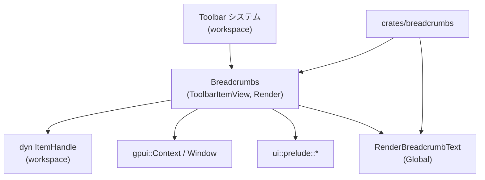
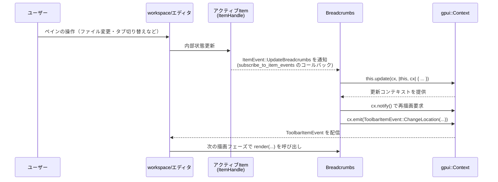

## 1. ざっくり一言

`crates/breadcrumbs` は、**アクティブなペイン（タブなど）のパンくずリストをツールバーに表示するための UI コンポーネント**と、  
そのパンくず表示を実際に描画するための**グローバルな描画関数の登録仕組み**を提供するクレートです。

---

## 2. このモジュールの役割

### 2.1 概要

- このクレートは、workspace クレート側で管理される「アクティブなペイン項目（`ItemHandle`）」からパンくず情報を取得し、
- `gpui` / `ui` クレートを使ってパンくず UI をレンダリングする `Breadcrumbs` コンポーネントを提供します。
- 実際の描画レイアウトは、このクレート外で定義される `RenderBreadcrumbText` グローバル関数に委譲されます。

### 2.2 アーキテクチャ内での位置づけ

- `Breadcrumbs` は `workspace::ToolbarItemView` を実装しており、workspace のツールバーに置かれる「1つのツールバー項目」として振る舞います。
- アクティブな `ItemHandle` からパンくず情報（`HighlightedText` のベクタやフォント情報等）を取得します。
- パンくずの実際の描画は、`gpui::Context` にグローバル登録された `RenderBreadcrumbText` に委ねられます。

依存関係を簡略化した図です（ディレクトリ内の主な型と外部クレートとの関係）:



### 2.3 設計上のポイント

コードから読み取れる設計上の特徴は次のとおりです。

- **責務の分割**
  - `Breadcrumbs` は「どの Item のパンくずを表示するか」「いつ再描画/位置変更を要求するか」を担当します。
  - パンくずの「見た目（レイアウト・スタイル）」は `RenderBreadcrumbText` グローバルに委譲されます。
- **状態管理**
  - 現在フォーカス中かどうか (`pane_focused`) を内部に保持します。
  - 現在アクティブな `ItemHandle` を `Box<dyn ItemHandle>` として保持します。
  - アクティブ Item からのイベント購読 (`Subscription`) を保持し、生存期間を管理します。
- **イベント駆動**
  - `Breadcrumbs` は `EventEmitter<ToolbarItemEvent>` を実装し、パンくずの位置変更イベントをツールバー側へ通知します。
  - `ItemHandle` からの `ItemEvent::UpdateBreadcrumbs` を購読し、パンくず内容の更新に応じて再描画／位置変更をトリガーします。
- **グローバル依存の明示**
  - `gpui::Global` を実装した `RenderBreadcrumbText` を `Context` から `try_global` で取得し、存在しない場合はパンくずを描画しません。

---

## 3. 主要な機能一覧

このクレートが提供する主な機能は次のとおりです。

- **`Breadcrumbs` ツールバー項目**
  - アクティブな `ItemHandle` からパンくず情報を取得し、ツールバーに表示するためのコンポーネント。
- **アクティブペインとの同期**
  - `ToolbarItemView::set_active_pane_item` を通じて、現在のアクティブ Item とそのイベントを追跡します。
- **パンくず変更イベントへの対応**
  - `ItemEvent::UpdateBreadcrumbs` を受けて `ToolbarItemEvent::ChangeLocation` を発行し、ツールバー上の配置位置を更新します。
- **グローバルなパンくず描画関数の登録**
  - `RenderBreadcrumbText` 型を `gpui::Global` として扱い、任意の描画関数をアプリ全体で共有できるようにします。

---

## 4. 関数・構造体の解説

### 4.1 型一覧

このクレート内で定義される主な型は次のとおりです。

| 名前 | 種別 | 役割 / 用途 |
|------|------|-------------|
| `RenderBreadcrumbTextFn` | 型エイリアス | パンくず描画関数のシグネチャを表します。`Vec<HighlightedText>` や `Option<Font>` などを受け取り、`AnyElement` を返す関数ポインタです。 |
| `RenderBreadcrumbText` | 構造体（newtype） | `RenderBreadcrumbTextFn` を 1 フィールドとして保持するラッパー型です。`gpui::Global` を実装しており、`gpui::Context` のグローバル値として登録・取得される前提です。 |
| `Breadcrumbs` | 構造体 | ツールバー上にパンくずを表示するコンポーネント本体です。アクティブな `ItemHandle`、フォーカス状態、Item イベント購読 (`Subscription`) を内部状態として持ちます。 |

補足:

- `Breadcrumbs` は以下のトレイトを実装しています。
  - `Default`
  - `gpui::Render`
  - `workspace::ToolbarItemView`
  - `gpui::EventEmitter<ToolbarItemEvent>`

### 4.2 主要メソッド・関数の詳細

重要度が高いメソッドを 4 つ取り上げます。

---

#### `Breadcrumbs::new() -> Self`

**概要**

- `Breadcrumbs` の新しいインスタンスを作成します。
- フォーカス状態は `false`、アクティブ Item と購読は `None` で初期化されます。

**引数**

- なし。

**戻り値**

- 新しく初期化された `Breadcrumbs` インスタンス。

**内部処理の流れ**

1. `pane_focused` を `false` で初期化します。
2. `active_item` を `None` で初期化します。
3. `subscription` を `None` で初期化します。

**Examples（使用例）**

```rust
use breadcrumbs::Breadcrumbs;                        // Breadcrumbs 型をインポート

fn create_breadcrumbs() -> Breadcrumbs {            // Breadcrumbs を作成するヘルパー関数
    Breadcrumbs::new()                             // デフォルト状態でインスタンス化
}
```

**Errors / Panics**

- このコンストラクタ内で明示的に `panic!` やエラーを返す処理はありません。

**Edge cases（エッジケース）**

- 特にありません。常に同じ初期状態で生成されます。

**使用上の注意点**

- アクティブ Item や購読は設定されていないため、そのままではパンくずは表示されません。  
  実際の利用時には `set_active_pane_item` を通じてアクティブ Item を設定する必要があります。

---

#### `impl Render for Breadcrumbs::render(&mut self, window: &mut Window, cx: &mut Context<Self>) -> impl IntoElement`

**概要**

- 現在の状態に基づいて、パンくずコンテナの UI 要素を構築します。
- アクティブ Item やパンくず情報がなかったり、グローバルな描画関数が登録されていない場合は、空のコンテナ（中身のない横スクロール可能な枠）を返します。

**引数**

| 引数名 | 型 | 説明 |
|--------|----|------|
| `window` | `&mut Window` | 現在描画対象となるウィンドウ。`ItemHandle::breadcrumb_prefix` などに渡されます。 |
| `cx` | `&mut Context<Self>` | `gpui` のコンテキストで、状態更新やグローバル値の取得 (`try_global`) に使用されます。 |

**戻り値**

- `impl IntoElement`（実際には `AnyElement` に変換可能な UI 要素）  
  - パンくずを表示するコンテナ、またはコンテンツが無いコンテナ。

**内部処理の流れ**

1. ベースとなるコンテナ `element` を構築する:
   - `h_flex()` で横並びフレックスコンテナを作成。
   - `id("breadcrumb-container")` で識別子を付与。
   - `flex_grow()` で残り幅を占有。
   - `h_8()` で高さを指定。
   - `overflow_x_scroll()` で横スクロール可能に。
   - `text_ui(cx)` で UI 用のテキストスタイルを適用。
2. `self.active_item` が `None` の場合:
   - 中身のないコンテナ `element.into_any_element()` を返して終了します。
3. `active_item.breadcrumbs(cx)` を呼び出し、パンくず情報を取得:
   - `Some((segments, breadcrumb_font))` でなければ、同様に空コンテナを返します。
4. `active_item.breadcrumb_prefix(window, cx)` を呼び出し、プレフィックス（例: アイコン）要素を取得します。
5. `cx.try_global::<RenderBreadcrumbText>()` により、グローバルな描画関数を取得します。
   - 取得できた場合: `RenderBreadcrumbTextFn` を呼び出し、`AnyElement` を返します。
   - 取得できない場合: ベースコンテナ `element.into_any_element()` を返します。

**Examples（使用例）**

`render` は通常 `gpui` のレンダリングループから呼ばれるため、直接呼び出すことは少ないですが、振る舞いのイメージとして以下のように扱われます。

```rust
use breadcrumbs::Breadcrumbs;
use gpui::{Window, Context};                       // Context<Breadcrumbs> が存在する前提

fn render_breadcrumbs(                             // 描画フェーズの一部として呼び出される想定の関数
    breadcrumbs: &mut Breadcrumbs,                 // ツールバー項目として管理されている Breadcrumbs
    window: &mut Window,                           // ウィンドウ
    cx: &mut Context<Breadcrumbs>,                 // コンテキスト
) {
    let element = breadcrumbs.render(window, cx);  // パンくず用の UI 要素を構築
    // element をツールバーのレイアウトに組み込む処理は別モジュール側で行われます
}
```

**Errors / Panics**

- このメソッド内で明示的に panic するコードはありません。
- オプション値は `else { return ... }` で安全に扱われており、`unwrap` などは使用していません。

**Edge cases（エッジケース）**

- `self.active_item` が設定されていない場合:
  - 中身のないコンテナが返り、パンくずは表示されません。
- `active_item.breadcrumbs(cx)` が `None` を返す場合:
  - 同様に中身のないコンテナが返ります。
- `RenderBreadcrumbText` グローバルが未登録の場合:
  - パンくず情報自体は取得済みでも、描画関数がないためコンテナのみ（実質非表示）になります。

**使用上の注意点**

- 実際にパンくずを表示するには、
  1. `active_item` がセットされていること、
  2. `active_item.breadcrumbs(cx)` が `Some(...)` を返すこと、
  3. `RenderBreadcrumbText` グローバルが登録されていること  
  が必要です。
- `render` 自体は副作用を持たず、内部状態を変更しません（状態変更は `set_active_pane_item` やイベント経由で行われます）。

---

#### `impl ToolbarItemView for Breadcrumbs::set_active_pane_item(&mut self, active_pane_item: Option<&dyn ItemHandle>, window: &mut Window, cx: &mut Context<Self>) -> ToolbarItemLocation`

**概要**

- ツールバーシステムから呼び出されるメソッドで、**アクティブなペイン項目（`ItemHandle`）の変更を `Breadcrumbs` に伝える**役割を持ちます。
- 新しい Item へのイベント購読を開始し、その Item に紐づくパンくずの配置位置 (`ToolbarItemLocation`) を返します。

**引数**

| 引数名 | 型 | 説明 |
|--------|----|------|
| `active_pane_item` | `Option<&dyn ItemHandle>` | 新しくアクティブになったペイン項目。`None` の場合、アクティブ Item が無いことを意味します。 |
| `window` | `&mut Window` | ウィンドウ。`subscribe_to_item_events` などに渡されます。 |
| `cx` | `&mut Context<Self>` | `gpui` のコンテキスト。状態更新やイベント発行 (`cx.emit`) に使用されます。 |

**戻り値**

- `ToolbarItemLocation`  
  - この `Breadcrumbs` 項目をツールバーのどこに配置するかを示す値です。
  - `active_pane_item` が `None` の場合は `ToolbarItemLocation::Hidden` を返して非表示にします。
  - それ以外の場合は `item.breadcrumb_location(cx)` の結果を返します。

**内部処理の流れ**

1. `cx.notify()` を呼び出し、「このビューの状態が変わった可能性がある」ことを通知します。
2. 現在の `self.active_item` を `None` にリセットします。
3. `active_pane_item` が `None` なら、`ToolbarItemLocation::Hidden` を返して終了します。
4. `active_pane_item` が `Some(item)` の場合:
   1. `cx.entity().downgrade()` で、この `Breadcrumbs` インスタンスへの弱い参照を取得します。
   2. `item.subscribe_to_item_events(...)` を呼び出し、`ItemEvent::UpdateBreadcrumbs` を監視するコールバックを登録します。
      - コールバック内では、`ItemEvent::UpdateBreadcrumbs` を受けたとき、
        1. `this.update(cx, |this, cx| { ... })` で `Breadcrumbs` を更新コンテキストで取得。
        2. `cx.notify()` で再描画を要求。
        3. `this.active_item` が `Some` なら `active_item.breadcrumb_location(cx)` を取得し、
           `ToolbarItemEvent::ChangeLocation(...)` を `cx.emit` します。
   3. 取得した `Subscription` を `self.subscription` に保存します。
   4. `self.active_item = Some(item.boxed_clone())` として、アクティブ Item を保持します。
   5. 最後に `item.breadcrumb_location(cx)` を返します。

**Examples（使用例）**

`ToolbarItemView` を扱うツールバー管理コードから呼ばれるイメージです（`workspace` 側の実装はこのチャンクには含まれません）。

```rust
use breadcrumbs::Breadcrumbs;
use gpui::{Window, Context};
use workspace::item::ItemHandle;
use workspace::ToolbarItemView;                     // set_active_pane_item を使うため

fn on_active_item_changed(                          // アクティブな Item が変わったときに呼ばれる想定の関数
    breadcrumbs: &mut Breadcrumbs,                  // ツールバーに載っている Breadcrumbs
    new_item: Option<&dyn ItemHandle>,              // 新しいアクティブ Item（ない場合は None）
    window: &mut Window,                            // ウィンドウ
    cx: &mut Context<Breadcrumbs>,                  // gpui コンテキスト
) {
    let location = breadcrumbs                      // アクティブ Item を更新しつつ
        .set_active_pane_item(new_item, window, cx);// ツールバーの配置場所を取得

    // ここで location に基づいてツールバー内の配置処理を行うのは別モジュールの責務です
}
```

**Errors / Panics**

- メソッド内部で明示的に `panic!` を呼んでいる箇所はありません。
- `this.update(...).ok();` として、エラー（`Result` の `Err`）が返っても無視する設計になっています。
  - エラー内容や条件は `gpui` の `update` 実装に依存するため、このチャンクからは分かりません。

**Edge cases（エッジケース）**

- `active_pane_item` が `None` の場合:
  - `self.active_item` は `None` のままになり、`ToolbarItemLocation::Hidden` が返されます。
  - それまでの購読 `self.subscription` は上書きされませんが、`Subscription` の破棄タイミング・意味はこのチャンクからは分かりません。
- `ItemEvent::UpdateBreadcrumbs` が発火したタイミングで `self.active_item` が `None` の場合:
  - コールバック内の `if let Some(active_item)` によって何も行われず、`ToolbarItemEvent::ChangeLocation` は送信されません。

**使用上の注意点**

- `Breadcrumbs` が正しく動作するためには、`ItemHandle` 実装側が
  - `subscribe_to_item_events` で `ItemEvent::UpdateBreadcrumbs` を適切に発行し、
  - `breadcrumbs(cx)` や `breadcrumb_location(cx)` を実装している必要があります。
- `set_active_pane_item` を呼び出す側（ツールバー管理コード）は、アクティブペインが変わるたびにこのメソッドを呼ぶ必要がありますが、
  その呼び出しタイミングや順序は workspace 側の設計に依存します。

---

#### `impl ToolbarItemView for Breadcrumbs::pane_focus_update(&mut self, pane_focused: bool, _window: &mut Window, _: &mut Context<Self>)`

**概要**

- アクティブなペインがフォーカスされているかどうかの状態を `Breadcrumbs` に通知します。
- 現在のコードでは `pane_focused` フィールドを更新するだけで、レンダリング等には直接使われていません。

**引数**

| 引数名 | 型 | 説明 |
|--------|----|------|
| `pane_focused` | `bool` | 対象ペインがフォーカスされていれば `true`、そうでなければ `false`。 |
| `_window` | `&mut Window` | ウィンドウ（このメソッド内では未使用）。 |
| `_` | `&mut Context<Self>` | `gpui` コンテキスト（このメソッド内では未使用）。 |

**戻り値**

- なし。

**内部処理の流れ**

1. `self.pane_focused = pane_focused;` として、フォーカス状態を内部フィールドにコピーします。
2. 他の処理は行いません。

**Examples（使用例）**

このメソッドもツールバー管理側から呼び出される前提で、利用コードは次のような形が想定されます。

```rust
use breadcrumbs::Breadcrumbs;
use gpui::{Window, Context};
use workspace::ToolbarItemView;

fn on_pane_focus_changed(                          // ペインのフォーカス状態が変わったときのコールバック想定
    breadcrumbs: &mut Breadcrumbs,                  // Breadcrumbs コンポーネント
    pane_focused: bool,                             // 新しいフォーカス状態
    window: &mut Window,                            // ウィンドウ
    cx: &mut Context<Breadcrumbs>,                  // コンテキスト
) {
    breadcrumbs.pane_focus_update(pane_focused, window, cx);
    // 現時点の実装では、内部フラグの更新のみ行われます。
}
```

**Errors / Panics**

- 明示的なエラー処理や panic はありません。

**Edge cases（エッジケース）**

- このメソッドの呼び出し頻度が高くても、内部ではブール値の代入のみであり、他の副作用はありません。
- 現時点では `pane_focused` が他の処理で利用されていないため、値が `true` / `false` であっても挙動の違いはありません。

**使用上の注意点**

- 将来的に `pane_focused` がレンダリングやスタイルに利用される可能性がありますが、
  このファイル内ではまだ参照されていません。
- 呼び出し側は、ペインのフォーカス状態と同期してこのメソッドを呼ぶ必要があります（呼び出しの契機は workspace 側の設計に依存します）。

---

### 4.3 その他の要素

- `impl Global for RenderBreadcrumbText {}`
  - `RenderBreadcrumbText` が `gpui::Global` を実装していることにより、
    `Context` の `try_global::<RenderBreadcrumbText>()` から取得できるようになっています。
  - 実際にグローバル登録する API（例: コンテキスト初期化時の登録処理）は、このチャンクには登場しません。

- `impl EventEmitter<ToolbarItemEvent> for Breadcrumbs {}`
  - `Breadcrumbs` が `ToolbarItemEvent` を発行できることを表します。
  - 実際には `set_active_pane_item` のイベントコールバック内で `cx.emit(ToolbarItemEvent::ChangeLocation(...))` を呼び出しています。

---

## 5. データフロー

このセクションでは、代表的な処理シナリオとして  
「アクティブなペインのパンくずが更新されたときの一連のデータの流れ」を説明します。

### 5.1 パンくず更新の流れ（ItemEvent -> 再描画）

1. ユーザーがタブを切り替えたり、ファイルパスが変わるなどして、`ItemHandle` 側でパンくず情報が更新されます。
2. `ItemHandle` は `ItemEvent::UpdateBreadcrumbs` を発行します。
3. 事前に `set_active_pane_item` で登録された購読コールバックが、このイベントを受け取ります。
4. コールバック内で `Breadcrumbs` の `this.update(...)` が呼ばれ、`cx.notify()` により再描画が要求されます。
5. あわせて、現在の `active_item` に対して `breadcrumb_location(cx)` が呼び出され、
   `ToolbarItemEvent::ChangeLocation` が発行されます。
6. ツールバー管理側は `ChangeLocation` を受けて、`Breadcrumbs` 項目の表示位置を更新します。
7. 次回のレンダリングで `Breadcrumbs::render` が呼ばれ、新しいパンくずが描画されます。

この流れをシーケンス図で表すと次のようになります（呼び出し元の詳細は推測を含みますが、イベントの流れ自体はコードから読み取れるものです）。



---

## 6. 使い方（How to Use）

このクレートは、単体でアプリケーションを作るものではなく、  
`workspace` / `gpui` / `ui` クレートと組み合わせて使う前提のコンポーネントです。

### 6.1 基本的な使用方法

このチャンクだけでは全体の初期化コードは分かりませんが、  
`Breadcrumbs` をツールバーに組み込む基本的な流れは次のように整理できます。

1. **`Breadcrumbs` インスタンスの生成**
   - `Breadcrumbs::new()` もしくは `Breadcrumbs::default()` で生成します。
2. **ツールバーへの登録**
   - `Breadcrumbs` は `ToolbarItemView` を実装しているため、workspace のツールバー管理コードから登録される設計と解釈できます。
3. **アクティブペインの更新通知**
   - アクティブな `ItemHandle` が変わるたびに、ツールバー管理側から `set_active_pane_item` が呼ばれます。
4. **フォーカス状態の通知**
   - ペインのフォーカス状態が変わったときに、`pane_focus_update` が呼ばれます。
5. **パンくず描画関数のグローバル登録**
   - どこかで `RenderBreadcrumbText` による描画関数を `gpui::Global` として登録しておく必要があります。
   - 具体的な登録 API（例: `cx.set_global(...)` のようなもの）はこのチャンクには登場しません。

概念的なコード例（擬似コード）:

```rust
use breadcrumbs::{Breadcrumbs, RenderBreadcrumbText};        // 本クレートの型
use gpui::{App, Window, Context};                            // gpui の型（詳細は別クレート）
use workspace::ToolbarItemView;                              // ツールバー統合用

fn setup_toolbar(app: &mut App) {                            // アプリケーション初期化の一部
    let mut breadcrumbs = Breadcrumbs::new();                // Breadcrumbs コンポーネントを作成

    // ここで breadcrumbs を workspace のツールバーに登録する。
    // 実際の登録 API は workspace 側のコードに依存し、このチャンクからは分かりません。

    // また、RenderBreadcrumbText をグローバルに登録しておく必要があります。
    // let render_fn = RenderBreadcrumbText(custom_breadcrumb_renderer);
    // app に対して render_fn をグローバル登録する API が想定されますが、
    // 具体的な関数名や呼び出し方はこのファイルからは分かりません。
}
```

### 6.2 よくある使用パターン

コードから想定できる利用パターンを 2 つ挙げます（呼び出し元の詳細はこのチャンクには含まれません）。

1. **標準的なパンくず表示**
   - `ItemHandle::breadcrumbs(cx)` が返す `Vec<HighlightedText>` をそのまま使い、
     `RenderBreadcrumbText` によってテキストとハイライトを描画する。
   - `ItemHandle::breadcrumb_prefix(window, cx)` で取得したプレフィックス要素（たとえばアイコン）を先頭に表示する。

2. **テーマ／プロジェクトごとのカスタム描画**
   - プロジェクトごとやテーマごとに異なる `RenderBreadcrumbTextFn` を用意し、
     `RenderBreadcrumbText` としてグローバル登録することで、パンくずのスタイルを一括で変更する。

`RenderBreadcrumbTextFn` のシグネチャは次のとおりです（定義そのものを再掲します）。

```rust
use gpui::{AnyElement, App, Font, Window};
use workspace::item::{HighlightedText, ItemHandle};

type RenderBreadcrumbTextFn = fn(
    Vec<HighlightedText>,           // パンくずの各セグメント（ハイライト情報付き）
    Option<Font>,                   // パンくず用フォント（なければ None）
    Option<AnyElement>,             // プレフィックス要素（なければ None）
    &dyn ItemHandle,                // 対象の Item
    bool,                           // ブールフラグ（用途はこのファイルからは不明）
    &mut Window,                    // ウィンドウ
    &App,                           // アプリケーションコンテキスト
) -> AnyElement;                    // 描画されたパンくず要素
```

このシグネチャに従う関数を用意し、`RenderBreadcrumbText` にラップしてグローバル登録する形になります。

### 6.3 使用上の注意点

モジュール全体としての共通の注意点をまとめます。

- **グローバル描画関数が必須**
  - `cx.try_global::<RenderBreadcrumbText>()` が `None` の場合、パンくず情報があっても実際の描画は行われず、空コンテナが返ります。
  - したがって、どこかで `RenderBreadcrumbText` をグローバル登録しておく必要があります。
- **`ItemHandle` 実装との契約**
  - このクレートは `ItemHandle` のメソッドに依存しています:
    - `breadcrumbs(cx)`（パンくず情報の取得）
    - `breadcrumb_prefix(window, cx)`（プレフィックス要素の取得）
    - `breadcrumb_location(cx)`（ツールバー上の配置位置）
    - `subscribe_to_item_events(...)`（`ItemEvent::UpdateBreadcrumbs` の購読）
    - `boxed_clone()`（`Box<dyn ItemHandle>` での退避）
  - これらのメソッドの具体的な仕様は workspace クレート側に依存し、このチャンクからは詳細不明ですが、
    未実装や不整合があるとパンくず表示が期待通りに動作しません。
- **イベント購読のライフサイクル**
  - `Breadcrumbs` は `Subscription` を `self.subscription` に保存し続けます。
  - `Subscription` の破棄時にどのようなクリーンアップが行われるかは `gpui` 側の実装に依存しており、このファイルからは分かりません。
- **フォーカス状態の利用**
  - 現在は `pane_focused` が他の処理で参照されていないため、フォーカス状態を変更しても見た目には影響しません。
  - 将来的にスタイル変更などに使われる可能性はありますが、このチャンクからは判断できません。

---

## 7. 関連ファイル

このディレクトリおよび密接に関連するモジュールは次のとおりです。

| パス / クレート名 | 役割 / 関係 |
|-------------------|------------|
| `breadcrumbs/Cargo.toml` | このクレートのパッケージ定義。ライブラリのエントリポイントを `src/breadcrumbs.rs` に指定し、`gpui` / `ui` / `workspace` への依存を宣言しています。 |
| `breadcrumbs/src/breadcrumbs.rs` | 本レポートで解説した、`Breadcrumbs` コンポーネントおよび `RenderBreadcrumbText` を定義するメインソースファイルです。 |
| `gpui` クレート | `Context`, `Window`, `Render`, `Global`, `Subscription`, `AnyElement` など UI フレームワークのコア機能を提供します。このクレートに対する具体的な API は本チャンクには含まれません。 |
| `ui` クレート | `ui::prelude::*` 経由で `h_flex()` などの UI ビルダ関数やスタイルユーティリティを提供します。 |
| `workspace` クレート | `ToolbarItemView`, `ToolbarItemEvent`, `ToolbarItemLocation`, `item::ItemHandle`, `item::ItemEvent`, `item::HighlightedText` など、エディタ／ワークスペース固有の抽象化を提供します。このファイルはそれらのインターフェースを利用してパンくず表示を行います。 |

このチャンクには、`workspace` や `gpui` 側の実装ファイルは含まれていないため、  
それらの詳細な仕様や利用方法については各クレートのドキュメントやソースコードを参照する必要があります。
