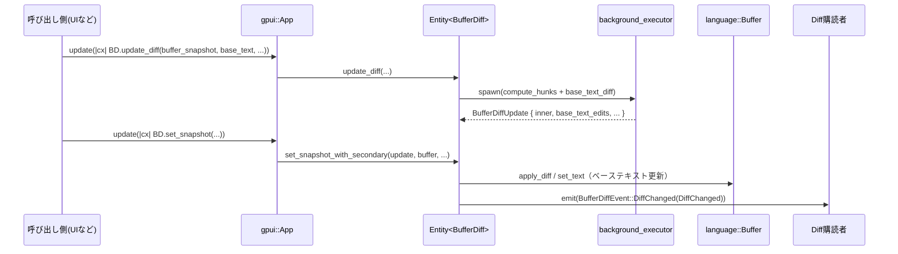

# buffer_diff/ ディレクトリ解説

## 1. ざっくり一言

`buffer_diff` クレートは、エディタ内のテキストバッファと「ベーステキスト」（Git の HEAD や index など）との **差分（diff）を計算・管理するためのモジュール**です。行単位／単語単位の差分や、Git のステージ／アンステージ操作に対応した hunk 単位の操作を提供します。

---

## 2. このモジュールの役割

### 2.1 概要

- このモジュールは **「テキストバッファと別のテキスト（ベース）との違いを、行・hunk 単位で把握し、編集とともに更新する」問題** を解決するために存在します。
- 主な機能は次の通りです。
  - `git2::Patch` を使った高速な行 diff の計算
  - diff hunk の管理と、バッファ座標 / ベーステキスト座標の双方向マッピング
  - ステージ／アンステージを前提とした「一次 diff」「二次 diff（index 側）」の連携と hunk 単位の操作
  - diff の再計算時に「どの範囲が変わったか」を示す `DiffChanged` の算出とイベント通知

### 2.2 アーキテクチャ内での位置づけ

このディレクトリには主に `buffer_diff/src/buffer_diff.rs` の 1 ファイルがあり、`Cargo.toml` で多数のワークスペースクレートに依存しています。代表的な依存関係は次の通りです。

- `text`：`BufferSnapshot`, `Point`, `Anchor`, `Patch` などテキスト操作の中核
- `language`：`language::Buffer`（ベーステキストの保持）、`DiffOptions`（単語 diff 設定）
- `git2`：`Patch` / `DiffOptions` による行差分の計算
- `sum_tree`：hunk を効率的に探索するための平衡木
- `gpui`：`App` / `Context` / `Entity` / `Task` による UI ランタイム・非同期処理・イベント発行

主要コンポーネント間の関係は次のようになります。

```mermaid
graph LR
  subgraph buffer_diff crate
    BD[BufferDiff<br/>(実体)]
    BDS[BufferDiffSnapshot<br/>(スナップショット)]
  end

  TB[text::BufferSnapshot<br/>(編集中バッファ)]
  LB[language::Buffer<br/>(ベーステキスト)]
  GP[gpui::App / Context]
  GIT[git2::Patch<br/>(行 diff)]
  ST[sum_tree::SumTree<br/>(InternalDiffHunk)]
  LANG[LanguageSettings / DiffOptions]
  ROPE[rope::Rope]

  TB --> BD
  BD --> BDS
  BD --> LB
  BD --> ST
  BDS --> ST
  BD --> GIT
  BD --> ROPE
  BD --> LANG
  BD --> GP
```

- `BufferDiff` は UI ランタイムから管理される実体（`Entity<BufferDiff>`）で、非同期タスク・イベントの入口です。
- `BufferDiffSnapshot` は `BufferDiff` の不変ビューで、hunk 列挙や座標変換など **読み取り専用** の API を提供します。
- diff hunk 群は `SumTree<InternalDiffHunk>` に格納され、アンカーやベーステキストオフセットをキーに効率的に探索されます。
- 「一次 diff（HEAD vs working copy）」と「二次 diff（index vs working copy）」を `secondary_diff` で関連付け、ステージング操作をサポートします。

### 2.3 設計上のポイント

コードから読み取れる設計上の特徴をまとめます。

- **実体とスナップショットの分離**
  - `BufferDiff`：gpui の `Entity` として管理される可変オブジェクト（イベント発行・非同期処理）。
  - `BufferDiffSnapshot`：`BufferDiff` から生成される値オブジェクトで、スレッド間転送やテストでの利用を想定。

- **内部状態の共通化**
  - `BufferDiffInner<BaseText>` をジェネリックにし、`BaseText` に
    - ランタイム用：`Entity<language::Buffer>`
    - スナップショット用：`language::BufferSnapshot`
    - diff 計算途中：`Arc<str>`
    を差し替えて利用しています。

- **差分の表現とインデックス構造**
  - 各 hunk の詳細は `InternalDiffHunk` で保持し、`SumTree<InternalDiffHunk>` で
    - 行数（追加／削除行数）
    - バッファのアンカー範囲
    - ベーステキストのバイト範囲
    をサマリとして管理し、高速な範囲検索・逆順走査を実現しています。

- **Git パッチ形式を利用した diff 計算**
  - `git2::Patch::from_buffers` で 「ベーステキスト vs 現在のバッファ」の行差分を取得し、
    各 hunk を `process_patch_hunk` で内部表現に変換しています。

- **単語レベル diff のオプション対応**
  - `LanguageSettings` から `DiffOptions` を解決し、行単位 diff の上に単語 diff (`word_diff_ranges`) をオプションで計算します。
  - 行数が多い hunk では単語 diff を抑制する（`MAX_WORD_DIFF_LINE_COUNT`）など、コストと品質のバランスが取られています。

- **二つのベース（HEAD / index）を意識したステージング**
  - 「一次 diff（HEAD vs working copy）」に対して「二次 diff（index vs working copy）」を `secondary_diff` として持たせ、
    hunk ごとに「すでに index に反映されているか」「これから反映する予定か」を `DiffHunkSecondaryStatus` で表現します。
  - さらに `PendingHunk` / `pending_hunks` により、「ステージ／アンステージ操作をユーザが指示したが、まだ index には適用していない」状態も追跡します。

- **差分の再計算と「どこが変わったか」の通知**
  - diff の再計算時に `compare_hunks` で旧・新の hunk セットを比較し、
    UI が再レンダリングすべき範囲 (`DiffChanged`) を算出してイベントで通知します。

---

## 3. 主要な機能一覧

このモジュールが提供する主な機能を箇条書きで示します。

- バッファとベーステキストの差分計算
  - `compute_hunks` + `process_patch_hunk` による行単位 diff の構築
  - 空ベース／空バッファの特別扱い（新規作成・削除ファイル）

- diff hunk の列挙とフィルタリング
  - バッファ側アンカー範囲での検索：`BufferDiffSnapshot::hunks_intersecting_range`
  - ベーステキスト側バイト範囲での検索：`hunks_intersecting_base_text_range`
  - 逆順走査（prev 方向）：`*_rev` 系メソッド

- バッファ座標とベーステキスト座標のマッピング
  - `patch_for_buffer_range` / `patch_for_base_text_range`
  - 個別座標変換：`buffer_point_to_base_text_point` / `base_text_point_to_buffer_point` など

- diff 状態の更新・差分領域の検出
  - `BufferDiff::update_diff`：非同期に diff を再計算
  - `BufferDiff::set_snapshot`：新しい diff を適用し、`DiffChanged` を計算・イベント発行
  - `compare_hunks`：旧・新 hunk セットから「変更された hunk 範囲」と「拡張された影響範囲」を算出

- Git ステージング／アンステージングのサポート
  - 二次 diff（index 側）との連携：`secondary_diff`
  - hunk 単位のステージ／アンステージ：
    - `stage_or_unstage_hunks`
    - `stage_or_unstage_all_hunks`
  - index テキストの更新ロジック：`stage_or_unstage_hunks_impl`

- 言語設定との連携
  - `build_diff_options` / `language_changed` による `LanguageSettings` / `LanguageRegistry` との連携
  - パース完了 (`parsing_idle`) までを待ってから `DiffChanged` を通知する制御

- テスト支援
  - `BufferDiffSnapshot::new_sync`（テスト専用）で同期的に diff スナップショットを作成
  - `assert_hunks` による hunk 内容の簡潔な検証

---

## 4. 関数・構造体の解説

### 4.1 型一覧（構造体・列挙体など）

主要な型を一覧にします（`pub` かどうかも記載します）。

| 名前 | 種別 | 公開 | 役割 / 用途 |
|------|------|------|-------------|
| `BufferDiff` | 構造体 | `pub` | 編集中バッファとベーステキストの diff 状態を保持し、再計算・ステージング・イベント発行などを行う中心的な型です。`Entity<BufferDiff>` として gpui に登録される前提です。 |
| `BufferDiffSnapshot` | 構造体 | `pub` | `BufferDiff` の不変スナップショットで、hunk 列挙や座標変換など「読み取り専用 API」を提供します。テストでも多用されています。 |
| `BufferDiffUpdate` | 構造体 | `pub` | `update_diff` がバックグラウンドで計算した結果（新しい hunk 群・ベーステキスト文字列など）をまとめる一時的なコンテナです。 |
| `BufferDiffInner<BaseText>` | 構造体 | 非公開 | hunk・pending hunk・ベーステキスト・バッファスナップショットをまとめた内部状態です。`BaseText` を差し替えて複数用途で使われます。 |
| `InternalDiffHunk` | 構造体 | 非公開 | 行 diff の内部表現です。バッファ側アンカー範囲と、ベーステキストのバイト・ポイント範囲、および単語 diff 情報を保持します。 |
| `PendingHunk` | 構造体 | 非公開 | ステージ／アンステージ操作が指示された hunk を表現します。`new_status` と `buffer_version` によって「どの状態に遷移させたいか」と適用時のバージョンを保存します。 |
| `DiffHunk` | 構造体 | `pub` | 外部に公開される hunk 表現です。バッファ側行範囲（`range`）、アンカー範囲、ベーステキストのバイト範囲、単語 diff、`secondary_status` を持ちます。 |
| `DiffHunkStatus` | 構造体 | `pub` | hunk が Added / Modified / Deleted のどれか、さらに二次ステータス（index 側との関係）をまとめて表現します。 |
| `DiffHunkStatusKind` | enum | `pub` | `Added` / `Modified` / `Deleted` の 3種を表現します。 |
| `DiffHunkSecondaryStatus` | enum | `pub` | ステージング状態を表現するステータスです（`HasSecondaryHunk` / `NoSecondaryHunk` / `OverlapsWithSecondaryHunk` / `SecondaryHunkAdditionPending` / `SecondaryHunkRemovalPending`）。 |
| `DiffHunkSummary` | 構造体 | `pub` | `SumTree` 用のサマリ型で、hunk 群全体の buffer_range・base_text_range・追加／削除行数を集約します。 |
| `DiffChanged` | 構造体 | `pub` | diff の再計算後に「どの範囲の hunk が変わったか」「ベーステキストのどのバイト範囲が変わったか」を表す情報です。イベント通知に使われます。 |
| `BufferDiffEvent` | enum | `pub` | `BufferDiff` から外部へ発行されるイベントです（`DiffChanged` / `LanguageChanged` / `HunksStagedOrUnstaged`）。 |
| `MAX_WORD_DIFF_LINE_COUNT` | 定数 | `pub` | 単語 diff を計算する最大行数（5 行）を表します。 |

### 4.2 主要関数の詳細（7 件）

#### 1. `BufferDiff::new(buffer: &text::BufferSnapshot, cx: &mut App) -> Self`

**概要**

- 編集中バッファに対する diff オブジェクトを新規に作成します。
- ベーステキストは空（存在しない）とみなし、hunk は空の状態で初期化されます。

**引数**

| 引数名 | 型 | 説明 |
|--------|----|------|
| `buffer` | `&text::BufferSnapshot` | diff を取りたい対象バッファのスナップショットです。 |
| `cx` | `&mut gpui::App` | `language::Buffer` や `SumTree` を初期化するためのコンテキストです。 |

**戻り値**

- `BufferDiff`：指定したバッファに対する diff 管理オブジェクトです（ベーステキストはまだ空）。

**内部処理の流れ**

1. `language::Buffer::local("", cx)` で空文字列の言語バッファを作成します。
2. ベーステキストバッファに `Capability::ReadOnly` を設定します。
3. `SumTree::new(buffer)` で空の hunk 木・pending hunk 木を初期化します。
4. `base_text_exists` を `false` にし、`buffer_snapshot` に引数 `buffer` を保存して `BufferDiff` を構築します。

**Examples（使用例）**

テスト以外の簡易な初期化例です（実際には `Entity<BufferDiff>` として登録して使うケースが多いです）。

```rust
// `buffer_snapshot` はどこかから取得した text::BufferSnapshot だと仮定します。
fn create_diff_for_buffer(buffer_snapshot: &text::BufferSnapshot, app: &mut gpui::App) {
    // BufferDiff を作成する（この時点ではベーステキストは空）
    let diff = BufferDiff::new(buffer_snapshot, app);

    // diff.buffer_id には buffer_snapshot.remote_id() が入っています。
    println!("buffer id = {:?}", diff.buffer_id);
}
```

**Errors / Panics**

- 関数内で `unwrap` や `expect` は使われていないため、通常の利用では panic は発生しません。
- `language::Buffer::local` の内部挙動についてはこのチャンクからは不明です。

**Edge cases（エッジケース）**

- ベーステキストが存在しない（新規ファイル・削除状態）を表すために `base_text_exists = false` で初期化されます。
- hunk は完全に空なので、この直後に `snapshot().hunks(...)` を呼ぶと空のイテレータが得られます。

**使用上の注意点**

- 実際の diff を得るには、このあとで `set_base_text` や `update_diff` を呼んでベーステキストを設定する必要があります。
- `BufferDiff` 自体は `Entity` ではないので、gpui で管理する場合は `cx.new(|cx| BufferDiff::new(...))` のように `Entity<BufferDiff>` を生成して使用します。

---

#### 2. `BufferDiff::update_diff(&self, buffer: text::BufferSnapshot, base_text: Option<Arc<str>>, base_text_change: Option<bool>, language: Option<Arc<Language>>, cx: &App) -> Task<BufferDiffUpdate>`

**概要**

- 編集中バッファとベーステキストから **新しい diff hunk 群をバックグラウンドで再計算** します。
- `Task<BufferDiffUpdate>` を返し、呼び出し側が `await` した後に `set_snapshot` で適用します。

**引数**

| 引数名 | 型 | 説明 |
|--------|----|------|
| `buffer` | `text::BufferSnapshot` | 現在の編集中バッファのスナップショットです。 |
| `base_text` | `Option<Arc<str>>` | 新しいベーステキスト内容。`None` の場合はベーステキスト非存在（例：新規ファイル）と扱われます。 |
| `base_text_change` | `Option<bool>` | ベーステキストが変更されたかどうかのフラグ。`Some(true)` の場合は差分を計算し、`Some(false)` の場合は置き換えのみを行います。`None` の場合は「変更があったか不明」として扱われます。 |
| `language` | `Option<Arc<Language>>` | ベーステキストの言語情報（単語 diff などの設定に利用）。 |
| `cx` | `&App` | バックグラウンド executor・設定取得などに用いるアプリケーションコンテキストです。 |

**戻り値**

- `Task<BufferDiffUpdate>`：非同期タスク。`await` すると次の情報を含む `BufferDiffUpdate` が得られます。
  - `inner: BufferDiffInner<Arc<str>>`：新しいベーステキスト文字列と hunk 群。
  - `buffer_snapshot`：引数 `buffer` のコピー。
  - `base_text_edits: Option<Diff>`：ベーステキストの差分（必要な場合）。
  - `base_text_changed: bool`：ベーステキストが変わったかどうか。

**内部処理の流れ**

1. `base_text` を LF 正規化します（`LineEnding::normalize_arc`）。
2. 直前のベーステキスト `prev_base_text` を `self.base_text(cx).as_rope().clone()` で取得します。
3. `build_diff_options` で単語 diff のオプションを決定します（言語設定・feature フラグに依存）。
4. ベーステキストが変化した場合 (`base_text_change == Some(true)`)、`language::BufferSnapshot::diff` を使って **ベーステキスト版の diff** を別タスクで計算します。
5. 別のバックグラウンドタスクで `compute_hunks` を呼び、「ベーステキスト vs 現在のバッファ」の hunk を計算します。
6. 両タスクの完了を `futures::join!` で待ち合わせ、`BufferDiffUpdate` を構築して返します。

**Examples（使用例）**

`Entity<BufferDiff>` を持っている前提で、ベーステキストを与えて diff を更新する例です。

```rust
use std::sync::Arc;
use gpui::{App, AppContext};
use language::Language;
use buffer_diff::BufferDiff;

// `diff_entity` は `Entity<BufferDiff>` と仮定します。
fn recalc_diff_for_buffer(
    diff_entity: gpui::Entity<BufferDiff>,                // Diff を管理している Entity
    buffer_snapshot: text::BufferSnapshot,               // 現在のバッファ状態
    base_text: Arc<str>,                                 // 新しいベーステキスト
    app: &mut App,                                       // gpui アプリケーション
) {
    app.update(|cx| {
        let language: Option<Arc<Language>> = None;       // ここでは言語指定なし
        let task = diff_entity.update(cx, |diff, cx| {
            // base_text_change = Some(true) なのでベーステキスト差分も計算
            diff.update_diff(buffer_snapshot.clone(), Some(base_text.clone()), Some(true), language, cx)
        });

        // ここで task を `cx.spawn` 等で await し、その後 set_snapshot するのが典型パターンです。
        cx.spawn(async move |this, cx| {
            let update = task.await;
            if let Some(task2) = this.update(cx, |diff, cx| diff.set_snapshot(update, &buffer_snapshot, cx)).ok() {
                task2.await;
            }
        }).detach();
    });
}
```

**Errors / Panics**

- `update_diff` 自体は `Result` を返さず、内部でも `unwrap` / `expect` は使っていません。
- `git2::Patch::from_buffers` は `log_err()` 経由でエラーをログに出し、`Option` で処理を続けるため、`git2` のエラーで panic することはありません。
- ベーステキストが非常に大きい場合、diff 計算のコストは上がりますが、その扱いは `compute_hunks` に委ねられています。

**Edge cases（エッジケース）**

- `base_text = None` の場合：
  - `compute_hunks` は「ファイルが完全に追加された／削除された」という前提で、全体をひとつの hunk として扱います。
- `base_text_change = Some(false)` の場合：
  - ベーステキスト文字列は変わらないが、「diff の再計算だけ行う」ケースです（例えば word diff 設定が変わった場合など）。
- `base_text_change = None` の場合：
  - ベーステキストが変わったか不明として扱い、`base_text_edits` は計算されません。

**使用上の注意点**

- `update_diff` だけでは `BufferDiff` の内部状態は更新されません。必ず戻り値の `BufferDiffUpdate` を `set_snapshot` または `set_snapshot_with_secondary` に渡して適用する必要があります。
- 戻り値の `Task<BufferDiffUpdate>` は gpui の `background_executor` 上で動作するため、UI スレッドをブロックしない設計になっています。UI からは `cx.spawn` でラップするのが想定される使い方です。

---

#### 3. `BufferDiff::set_snapshot_with_secondary(&mut self, update: BufferDiffUpdate, buffer: &text::BufferSnapshot, secondary_diff_change: Option<Range<Anchor>>, clear_pending_hunks: bool, cx: &mut Context<Self>) -> Task<Option<Range<Anchor>>>`

**概要**

- `update_diff` の結果である `BufferDiffUpdate` を `BufferDiff` に適用し、必要に応じて二次 diff の変更範囲も加味しながら `DiffChanged` を計算して通知します。
- 内部的には `set_snapshot_with_secondary_inner` で実処理を行い、その結果を `BufferDiffEvent::DiffChanged` として emit します。

**引数**

| 引数名 | 型 | 説明 |
|--------|----|------|
| `update` | `BufferDiffUpdate` | `update_diff` の結果。新しい hunk 群・ベーステキスト・ベーステキスト diff を含みます。 |
| `buffer` | `&text::BufferSnapshot` | 現在のバッファスナップショット。比較・アンカー変換に利用します。 |
| `secondary_diff_change` | `Option<Range<Anchor>>` | 二次 diff 側で変更が生じたバッファ範囲（あれば）。その範囲に対応する hunk も `DiffChanged` に含めます。 |
| `clear_pending_hunks` | `bool` | `true` の場合、`pending_hunks` をクリアし、その影響範囲も変更範囲に含めます。 |
| `cx` | `&mut Context<Self>` | `BufferDiff` に対する gpui コンテキストです。 |

**戻り値**

- `Task<Option<Range<Anchor>>>`：
  - 非同期タスク。完了時に「変更されたバッファ範囲（`changed_range`）」を返します（存在しない場合は `None`）。
  - タスク内部で `BufferDiffEvent::DiffChanged` が emit されます。

**内部処理の流れ（簡略化）**

1. 現在のスナップショットを `self.snapshot(cx)` で取得し、旧 hunk・旧ベーステキストスナップショットを保持します。
2. `update.base_text_edits` の有無と `update.base_text_changed` に応じて
   - 旧ベーステキストバッファに diff を適用する (`apply_diff`)
   - もしくはテキストを丸ごと `set_text` する
   といった操作を行います。
3. `compare_hunks` を使って、旧 hunk 群と新 hunk 群の差分から `DiffChanged`（`changed_range`, `base_text_changed_range`, `extended_range`）を計算します。
4. `clear_pending_hunks = true` またはベーステキスト変更があった場合、`pending_hunks` のカバー範囲も `DiffChanged` にマージし、`pending_hunks` をリセットします。
5. `secondary_diff_change` が指定されている場合、旧スナップショットに対し `range_to_hunk_range` で hunk 範囲・ベーステキスト範囲を求め、それも `DiffChanged` にマージします。
6. ベーステキストの `parsing_idle()` があれば await し、パースが落ち着いてから `DiffChanged` を返します。
7. 外側の `set_snapshot_with_secondary` では `cx.spawn` でこの処理を実行し、完了時に `BufferDiffEvent::DiffChanged` を emit します。

**Examples（使用例）**

`update_diff` → `set_snapshot_with_secondary` をまとめて呼び出す典型パターンです。

```rust
fn apply_new_diff_with_secondary(
    diff: gpui::Entity<BufferDiff>,            // 一次 diff (HEAD vs working copy)
    buffer: text::BufferSnapshot,             // 現在のバッファ
    base_text: Arc<str>,                      // 新しい HEAD テキスト
    secondary_changed: Option<Range<Anchor>>, // index 側で変化したバッファ範囲
    app: &mut gpui::App,
) {
    app.update(|cx| {
        let language = None;
        let update_task = diff.update(cx, |d, cx| {
            d.update_diff(buffer.clone(), Some(base_text.clone()), Some(true), language, cx)
        });

        cx.spawn(|this, cx| async move {
            let update = update_task.await;
            if let Some(task2) = this
                .update(cx, |d, cx| {
                    d.set_snapshot_with_secondary(update, &buffer, secondary_changed, true, cx)
                })
                .ok()
            {
                let _changed_range = task2.await;
            }
        })
        .detach();
    });
}
```

**Errors / Panics**

- 関数内部で一部 `unwrap` を利用している箇所がありますが、どれも「内部ロジック上存在する前提の値」に対するもので、通常の利用経路からは到達しないように設計されています。
- `parsing_idle().await` は言語バッファのパーサの実装に依存し、このチャンクからは詳細が分かりません。

**Edge cases（エッジケース）**

- ベーステキストが「存在しない → 存在する」またはその逆に変化した場合：
  - `compare_hunks` を使わず、全範囲を変更されたものとして扱い、`DiffChanged` にはバッファ全体・ベーステキスト全体が含まれます。
- `pending_hunks` に内容が残っている状態でベーステキストを変更した場合：
  - `clear_pending_hunks = true` にすると pending hunk の影響範囲も `DiffChanged` にマージされ、`pending_hunks` はクリアされます。

**使用上の注意点**

- `set_snapshot`（二次 diff なし）と `set_snapshot_with_secondary`（二次 diff あり）は用途が異なります。Git ステージング UI などで index 側 diff と連動させたい場合は後者を使います。
- 戻り値の `Task` を `await` する前に UI を更新すると、一時的に古い diff 状態が使われる可能性があります。UI 側では `BufferDiffEvent::DiffChanged` の購読を前提とした設計にすると整合性を保ちやすくなります。

---

#### 4. `BufferDiffSnapshot::hunks_intersecting_range(&self, range: Range<Anchor>, buffer: &text::BufferSnapshot) -> impl Iterator<Item = DiffHunk>`

**概要**

- 指定したバッファアンカー範囲と交差する hunk を前方向に列挙します。
- 二次 diff（`secondary_diff`）や `pending_hunks` を考慮し、`secondary_status` を含んだ `DiffHunk` を返します。

**引数**

| 引数名 | 型 | 説明 |
|--------|----|------|
| `range` | `Range<Anchor>` | バッファ上のアンカー範囲。ここにかかる hunk を列挙します。 |
| `buffer` | `&text::BufferSnapshot` | アンカーの解決やポイント変換に使うスナップショットです。 |

**戻り値**

- `impl Iterator<Item = DiffHunk>`：`range` にかかる hunk を前方向に列挙するイテレータです。

**内部処理の流れ**

1. `self.secondary_diff` があれば、その内部状態（`BufferDiffInner<language::BufferSnapshot>`）を `unstaged_counterpart` として取得します。
2. `BufferDiffInner::hunks_intersecting_range` に `range` と `buffer`、`secondary` を渡して実際の列挙処理を委譲します。
3. 内部では `SumTree::filter` + `summaries_for_anchors_with_payload` を使い、開始／終了アンカーごとの情報から `(start_point..end_point)` の `DiffHunk` を構築します。
4. `pending_hunks` と二次 diff の hunk を調べ、`secondary_status` を
   - index に hunk がある：`HasSecondaryHunk`
   - 一部だけ重なっている：`OverlapsWithSecondaryHunk`
   - ステージ／アンステージ待ち：`SecondaryHunkAdditionPending` / `SecondaryHunkRemovalPending`
   - それ以外：`NoSecondaryHunk`
   のいずれかに決定します。

**Examples（使用例）**

テストコードに近い基本的な利用です。

```rust
use buffer_diff::{BufferDiffSnapshot, DiffHunkStatus, DiffHunkStatusKind};
use text::{Anchor, Buffer, BufferId, Point, ReplicaId};

#[gpui::test]
async fn example_list_hunks(cx: &mut gpui::TestAppContext) {
    // ベーステキスト
    let base = "one\ntwo\nthree\n".to_string();

    // 編集中バッファ
    let buf_text = "one\nHELLO\nthree\n".to_string();
    let buffer = Buffer::new(ReplicaId::LOCAL, BufferId::new(1).unwrap(), buf_text);

    // 同期ヘルパー（テスト専用）で diff スナップショットを生成
    let diff = BufferDiffSnapshot::new_sync(&buffer, base.clone(), cx);

    // バッファ全体にかかる hunk を列挙
    let all_range = Anchor::min_max_range_for_buffer(buffer.remote_id());
    let hunks: Vec<_> = diff
        .hunks_intersecting_range(all_range, &buffer)
        .collect();

    assert_eq!(hunks.len(), 1);
    let h = &hunks[0];

    // range は Point の行範囲
    assert_eq!(h.range, Point::new(1, 0)..Point::new(2, 0));
    assert_eq!(h.status().kind, DiffHunkStatusKind::Modified);
}
```

**Errors / Panics**

- 内部でアンカーの妥当性チェックを行い、`is_valid(buffer)` で無効なアンカーはスキップしています。無効アンカーがあっても panic にはなりません（その hunk が無視されるだけです）。
- それ以外に `unwrap` 等は使っておらず、通常の利用では panic は発生しません。

**Edge cases（エッジケース）**

- `range` がバッファ全体 (`Anchor::min_max_range_for_buffer`) の場合：
  - すべての hunk が返されます。
- `range` が hunk の境界とちょうど一致しない場合：
  - 交差条件（`!before_start && !after_end`）により、少しでも重なっていれば hunk が返されます。
- 二次 diff が存在しない場合：
  - `secondary_status` は `NoSecondaryHunk`（もしくは pending 状態のみ）になります。

**使用上の注意点**

- `BufferDiffSnapshot` は作成時点の `BufferSnapshot` に紐付いた hunk を保持しているため、バッファがさらに編集された後のスナップショットで `hunks_intersecting_range` を呼ぶと、アンカーがずれる可能性があります。通常は「同じタイミングのスナップショット」を渡す前提で利用します。
- `range` の `remote_id` は、対象バッファと一致している必要があります（`Anchor::min_max_range_for_buffer(buffer.remote_id())` で生成するのが安全です）。

---

#### 5. `BufferDiffSnapshot::patch_for_buffer_range(&self, range: RangeInclusive<Point>, buffer: &text::BufferSnapshot) -> Patch<Point>`

**概要**

- 「現在のバッファ座標 → ベーステキスト座標」への変換を表す `Patch<Point>` を返します。
- 戻り値の patch は **指定された `range` に含まれる座標については正確** なことが保証されます（それ以外の範囲は必ずしも完全ではありません）。

**引数**

| 引数名 | 型 | 説明 |
|--------|----|------|
| `range` | `RangeInclusive<Point>` | バッファ側で「正確な変換が欲しい」座標範囲（ポイント区間）です。 |
| `buffer` | `&text::BufferSnapshot` | 現在のバッファスナップショットです。 |

**戻り値**

- `Patch<Point>`：`old` 側がバッファ座標、`new` 側がベーステキスト座標になるような patch です。

**内部処理の流れ（簡略化）**

1. ベーステキストが存在しない場合（新規ファイルなど）は、バッファ全体を削除する単一の `Edit` を返します。
2. `buffer.edits_since::<Point>(&self.inner.buffer_snapshot.version)` から diff 計算時以降のバッファ編集 patch を取得し、`invert()` して **現在のバッファ座標 → diff 計算時のバッファ座標** を表す patch を得ます。
3. `range` の始点・終点を「diff 計算時のバッファ座標」に変換し、必要に応じて diff hunk の先頭／末尾まで拡張します。
4. `self.inner.hunks` をカーソルで辿り、指定範囲に関係する hunk を `Edit` として列挙します（`old` = バッファ側範囲, `new` = ベーステキスト側範囲）。
5. 2. の patch に 4. の patch を `compose` し、最終的な「現在のバッファ → ベーステキスト」マッピングを構築します。

**Examples（使用例）**

単一ポイントの対応範囲を取得する簡単な例です。

```rust
use buffer_diff::BufferDiffSnapshot;
use text::{Point, Buffer, BufferId, ReplicaId};

#[gpui::test]
async fn example_point_to_base_range(cx: &mut gpui::TestAppContext) {
    let base = "one\ntwo\nthree\n".to_string();
    let buf_text = "one\nHELLO\nthree\n".to_string();

    let mut buffer = Buffer::new(ReplicaId::LOCAL, BufferId::new(1).unwrap(), buf_text);
    let diff = BufferDiffSnapshot::new_sync(&buffer, base.clone(), cx);

    // バッファ (行1, 列0) を含む範囲の patch を取得
    let snapshot = buffer.snapshot();
    let point = Point::new(1, 0);
    let patch = diff.patch_for_buffer_range(point..=point, &snapshot);

    // `edit_for_old_position` で対応するベーステキスト側範囲が得られる
    let edit = patch.edit_for_old_position(point);
    let base_range = edit.new;
    println!("base text range = {:?}..{:?}", base_range.start, base_range.end);
}
```

**Errors / Panics**

- `edits_since` の戻り値に対してのみ処理しているため、バッファの編集履歴が正常に管理されている限り panic する要素はありません。
- ベーステキストが存在しない場合は特別扱いを行い、`Edit { old = [0..max], new = [0..0] }` を返すので、`edit_for_old_position` も常に何らかの `Edit` を返します。

**Edge cases（エッジケース）**

- ベーステキストが存在しない（新規ファイル）：
  - 常に「全削除」を表す patch となり、`new` 側は常に `Point::zero()` になります。
- diff 計算後にバッファが編集されている場合：
  - `edits_since` を使って「元の diff 時点の座標」と照合しているため、`range` 内については正しい結果が得られますが、それ以外の範囲の精度は保証されません（コメントにも明記されています）。

**使用上の注意点**

- コメントにもあるように、「指定した `range` に含まれるポイントについてのみ」正しいことが保証されます。より広い範囲での変換が必要な場合は、その範囲を `range` として渡す必要があります。
- 座標変換の用途（例えば「カーソル位置に対応するベーステキストの位置」を知るなど）では、`buffer_point_to_base_text_range` / `buffer_point_to_base_text_point` のラッパーを使うと簡潔になります。

---

#### 6. `BufferDiffInner<Entity<language::Buffer>>::stage_or_unstage_hunks_impl(&mut self, unstaged_diff: &Self, stage: bool, hunks: &[DiffHunk], buffer: &text::BufferSnapshot, file_exists: bool, cx: &mut Context<BufferDiff>) -> Option<Rope>`

**概要**

- 一次 diff（HEAD vs working copy）と二次 diff（index vs working copy）をもとに、指定された hunk 群を **ステージ／アンステージ** するための index テキストを計算します。
- `pending_hunks` を更新して、「まだ index に書き込んでいないが将来反映する予定の操作」を保持します。

**引数**

| 引数名 | 型 | 説明 |
|--------|----|------|
| `unstaged_diff` | `&Self` | 二次 diff 側の内部状態（通常は index vs working copy）。 |
| `stage` | `bool` | `true` ならステージ（index を working copy に合わせる）、`false` ならアンステージ（index を HEAD に戻す）です。 |
| `hunks` | `&[DiffHunk]` | ステージ／アンステージ対象の hunk 群（一次 diff 上の hunk）。 |
| `buffer` | `&text::BufferSnapshot` | 現在のバッファスナップショット（working copy）。 |
| `file_exists` | `bool` | ファイルが index / HEAD に存在するかどうか（削除扱いのときに使用）。 |
| `cx` | `&mut Context<BufferDiff>` | `language::Buffer` の読み取りなどに使うコンテキストです。 |

**戻り値**

- `Option<Rope>`：
  - `Some(new_index_text)`：新しい index テキスト（`Rope`）を返します。
  - `None`：`secondary_diff` が存在しないなどで、ステージ／アンステージできない場合を表します（呼び出し元で `?` している箇所があります）。

**内部処理の流れ（大まか）**

1. HEAD 側テキスト（`self.base_text`）と index 側テキスト（`unstaged_diff.base_text`）を `Rope` として取得します。
2. ファイルの存在有無と `stage` フラグに応じて、次のような特別ケースを処理します。
   - HEAD / index のどちらにも存在しない場合など、ファイル全体をステージ／アンステージ対象とするケース。
3. `pending_hunks` の旧状態をカーソルで走査しつつ、新たに指定された `hunks` をマージして、新しい `pending_hunks` を構築します。
   - 既存 pending hunk と重なる部分はスキップ・マージして、非重複・ソート済みの状態を保ちます。
   - ステージング時：`new_status = SecondaryHunkRemovalPending`
   - アンステージ時：`new_status = SecondaryHunkAdditionPending`
4. `unstaged_diff.hunks`（index vs working copy の hunk 群）をカーソルで辿り、`pending_hunks` の各要素に対して次を計算します。
   - 対応する index 側バイト範囲（`index_start..index_end`）を、buffer 側オフセット・diff_base_byte_range・overshoot 計算から求めます。
   - その範囲を HEAD / バッファ側テキストで置き換えるための `replacement_text` を構築します。
5. 得られた `(index_byte_range, replacement_text)` の配列を index テキストに適用し、`new_index_text: Rope` を構築します。
6. `self.pending_hunks` を新しい木に置き換え、`Some(new_index_text)` を返します。

**Examples（使用例）**

テストコードに近いステージ操作の例です。

```rust
use buffer_diff::{BufferDiff, DiffHunkSecondaryStatus};
use text::{Buffer, BufferId, ReplicaId};

#[gpui::test]
async fn example_stage_one_hunk(cx: &mut gpui::TestAppContext) {
    let head_text = "one\ntwo\nthree\n".to_string();
    let index_text = head_text.clone();
    let buffer_text = "one\nthree\n".to_string(); // "two" が削除された状態

    let buffer = Buffer::new(ReplicaId::LOCAL, BufferId::new(1).unwrap(), buffer_text.clone());

    // index 側 diff（二次 diff）
    let unstaged_diff = cx.new(|cx| BufferDiff::new_with_base_text(&index_text, &buffer, cx));

    // HEAD 側 diff（一時 diff）
    let uncommitted_diff = cx.new(|cx| {
        let mut diff = BufferDiff::new_with_base_text(&head_text, &buffer, cx);
        diff.set_secondary_diff(unstaged_diff.clone());
        diff
    });

    uncommitted_diff.update(cx, |diff, cx| {
        // すべての hunk を取得
        let hunk = diff.snapshot(cx).hunks(&buffer).next().unwrap();

        // ステージする（file_exists = true）
        let new_index = diff
            .stage_or_unstage_hunks(true, std::slice::from_ref(&hunk), &buffer, true, cx)
            .unwrap()
            .to_string();

        assert_eq!(new_index, buffer_text); // index が working copy と一致する
    });
}
```

**Errors / Panics**

- `debug_assert!` による不変条件チェックがあり、`cfg(debug_assertions)` の場合に
  - `edits` のインデックス範囲がソート済み・非重複であること
  を確認しています。ここが崩れると debug ビルドで panic します。
- `unwrap` をいくつか使っていますが、いずれも「diff の内部一貫性が崩れている場合」にのみ到達するような箇所で、通常利用では発生しないよう設計されています。

**Edge cases（エッジケース）**

- HEAD / index のどちらにもファイルが存在しない場合：
  - `stage` フラグに応じて、buffer 全体を追加／削除する pending hunk を 1 つ作成して終了します。
- diff 計算後にさらにバッファが編集され、アンカーと `diff_base_byte_range` の対応がずれた場合：
  - overshoot 計算により index 側範囲が `index_text.len()` を超えないよう `min` でクランプしています（`test_stage_all_with_stale_buffer` 参照）。

**使用上の注意点**

- この関数は公開 API ではなく、`BufferDiff::stage_or_unstage_hunks` から呼び出される内部処理です。外部から直接呼ぶのではなく、高レベルのメソッドを介して利用することを前提にしています。
- `file_exists` の値は、Git 上のファイル存在状況と整合している必要があります。誤った値を渡すと「ファイル丸ごと追加／削除」の扱いがずれてしまいます。

---

#### 7. `compare_hunks(new_hunks: &SumTree<InternalDiffHunk>, old_hunks: &SumTree<InternalDiffHunk>, old_snapshot: &text::BufferSnapshot, new_snapshot: &text::BufferSnapshot, old_base_text: &text::BufferSnapshot, new_base_text: &text::BufferSnapshot) -> DiffChanged`

**概要**

- 旧・新の hunk 集合を比較して、「どの hunk が変わったか」「その hunk に対応するベーステキスト範囲はどこか」を求める関数です。
- さらに、hunk の移動や編集が影響する周辺範囲を含めた「拡張範囲 (`extended_range`)」も求めます。

**引数**

| 引数名 | 型 | 説明 |
|--------|----|------|
| `new_hunks` | `&SumTree<InternalDiffHunk>` | 新しい diff の hunk 集合です。 |
| `old_hunks` | `&SumTree<InternalDiffHunk>` | 以前の diff の hunk 集合です。 |
| `old_snapshot` | `&text::BufferSnapshot` | 旧バッファスナップショット（`old_hunks` に対応）。 |
| `new_snapshot` | `&text::BufferSnapshot` | 新バッファスナップショット（`new_hunks` に対応）。 |
| `old_base_text` | `&text::BufferSnapshot` | 旧ベーステキストスナップショット。 |
| `new_base_text` | `&text::BufferSnapshot` | 新ベーステキストスナップショット。 |

**戻り値**

- `DiffChanged`：
  - `changed_range: Option<Range<Anchor>>`：バッファ上で hunk が変化した範囲。
  - `base_text_changed_range: Option<Range<usize>>`：ベーステキスト上の影響範囲（バイト単位）。
  - `extended_range: Option<Range<Anchor>>`：`changed_range` を、前後の編集（`anchored_edits_since_in_range`）を踏まえて広げた範囲。

**内部処理の流れ（要約）**

1. `new_hunks` と `old_hunks` にカーソルを張り、それぞれの hunk を開始位置順に走査します。
2. `new_hunk.start` と `old_hunk.start` の比較結果に応じて
   - 新しい hunk が先行 → 新規 hunk とみなして `changed_range` / `base_text_changed_range` を拡張
   - 同じ位置 → hunk 内容が異なれば変更とみなし、両方の終端を見ながら範囲を決定
   - 古い hunk が先行 → 古い hunk が削除されたとみなして範囲を更新
   というロジックで、全体の最小・最大範囲を求めます。
3. `has_changes` が `true` の場合は、hunk の外側で発生したバッファ編集も含めるために
   - 変更直前／直後の hunk との位置関係
   - `anchored_edits_since_in_range` で取得した編集範囲
   を使って `extended_range` を計算します。

**Examples（使用例）**

テストコードでは様々なパターンを検証しており、代表的な使い方は次のようになります。

```rust
#[gpui::test]
async fn example_compare_hunks(cx: &mut gpui::TestAppContext) {
    use text::{Buffer, BufferId, ReplicaId};

    let base = "
        zero
        one
        two
        three
        four
        five
        six
        seven
        eight
        nine
    "
    .unindent();

    let buffer_text = "
        one
        three
        four
        five
        SIX
        seven
        eight
        NINE
    "
    .unindent();

    let mut buffer = Buffer::new(ReplicaId::LOCAL, BufferId::new(1).unwrap(), buffer_text);
    let diff1 = BufferDiffSnapshot::new_sync(&buffer, base.clone(), cx);

    // 旧 diff と空 diff を比較する例
    let empty_diff = cx.update(|cx| BufferDiff::new(&buffer, cx).snapshot(cx));
    let DiffChanged { changed_range, base_text_changed_range, .. } = compare_hunks(
        &diff1.inner.hunks,
        &empty_diff.inner.hunks,
        &buffer,
        &buffer,
        &diff1.base_text(),
        &diff1.base_text(),
    );

    let range = changed_range.unwrap();
    assert_eq!(range.to_point(&buffer), Point::new(0, 0)..Point::new(8, 0));
}
```

**Errors / Panics**

- 関数内では `unwrap` / `expect` を使用しておらず、`match` ですべてのパターンを明示的に処理しているため、通常の利用で panic する経路は見当たりません。

**Edge cases（エッジケース）**

- `new_hunks` / `old_hunks` のどちらかが空の場合：
  - 空側との差分として、すべての hunk が変更とみなされます。
- ベーステキストが変わることで hunk の `diff_base_byte_range` だけが変化した場合：
  - ベーステキスト側の `base_text_changed_range` が広がり、バッファ側の範囲も必要に応じて調整されます（`test_buffer_diff_compare_with_base_text_change` 参照）。
- `extended_range` は、「変更された hunk 自体」だけでなく、「その前後で発生した編集（バッファ側の edit）」も含めるために広がることがあります。

**使用上の注意点**

- この関数は公開 API ではなく、`set_snapshot_with_secondary_inner` からのみ呼び出されています。外部コードは `DiffChanged` を `BufferDiffEvent::DiffChanged` 経由で受け取る設計になっています。
- `old_snapshot` / `new_snapshot` / `old_base_text` / `new_base_text` の `remote_id` が整合している前提で動作します。テストでは同じ `Buffer` を編集しながら snapshot を取っているため、この前提が満たされています。

---

### 4.3 その他の関数・メソッド（概要のみ）

詳細解説は割愛し、主な役割だけ一覧にします。

| 関数 / メソッド名 | 役割（1 行） |
|------------------|-------------|
| `build_diff_options` | 言語設定・feature フラグに応じて `DiffOptions`（単語 diff 有効／無効など）を構築します。 |
| `compute_hunks` | ベーステキストとバッファから `git2::Patch` を計算し、`InternalDiffHunk` の `SumTree` を構築します。 |
| `process_patch_hunk` | `git2::Patch` 内の単一 hunk を走査し、削除／追加行から `InternalDiffHunk` を組み立てます（単語 diff の計算もここ）。 |
| `BufferDiffSnapshot::hunks_intersecting_base_text_range{,_rev}` | ベーステキスト側のバイト範囲で hunk を検索します。 |
| `BufferDiffSnapshot::{buffer,base_text}_point_to_*` | 単一の `Point` をベーステキスト／バッファの範囲またはポイントに変換するユーティリティです。 |
| `BufferDiff::new_unchanged` | バッファと同一内容のベーステキストを持つ「変更なしの diff」を構築します。 |
| `BufferDiff::set_secondary_diff` / `secondary_diff` | 二次 diff（index 側）との関連付け／取得を行います。 |
| `BufferDiff::clear_pending_hunks` | `pending_hunks` をクリアし、その影響範囲を `DiffChanged` として通知します。 |
| `BufferDiff::stage_or_unstage_hunks` / `stage_or_unstage_all_hunks` | 公開 API としてステージ／アンステージを行い、`HunksStagedOrUnstaged` と `DiffChanged` イベントを emit します。 |
| `BufferDiff::language_changed` | ベーステキストの言語情報を更新し、パース完了後に `LanguageChanged` を emit します。 |
| `BufferDiff::set_base_text` | ベーステキストを（diff 経由で）更新し、完了を通知する `oneshot::Receiver<()>` を返します。 |
| `DiffHunk::status` | hunk が追加／削除／変更かを判定し、`DiffHunkStatus` を構築します。 |
| `DiffHunkStatus::is_*` / `*_none` / `added` など | hunk の種別チェックや、特定ステータスの生成を簡便に行うユーティリティです。 |
| `assert_hunks`（テスト用） | 実際の hunk 列挙結果と、期待される `(行範囲, 削除テキスト, 追加テキスト, ステータス)` の配列を比較するテストヘルパです。 |

---

## 5. データフロー

ここでは代表的なシナリオとして、**バッファとベーステキストが更新されたときに diff を再計算して UI に通知する流れ** を示します。

1. 呼び出し側が `Entity<BufferDiff>` を持っており、バッファが更新されたタイミングで `update_diff` を呼び出します。
2. `update_diff` はバックグラウンドで `compute_hunks` と（必要なら）ベーステキスト diff の計算を行い、`BufferDiffUpdate` を返すタスクを生成します。
3. 呼び出し側はそのタスクを `await` し、結果を `set_snapshot` / `set_snapshot_with_secondary` に渡します。
4. `set_snapshot` は `compare_hunks` 等で変更範囲を計算し、`BufferDiffEvent::DiffChanged(DiffChanged)` を emit します。
5. UI 側はこのイベントを購読し、該当範囲のみ再描画するなどの最適化を行えます。

これを Mermaid 図で表すと次のようになります。



要点：

- 重い diff 計算（`compute_hunks`）は `background_executor` で行い、UI スレッドをブロックしないようになっています。
- ベーステキストのパース完了（`parsing_idle().await`）も待った上で `DiffChanged` が emit されるため、シンタックスハイライト等と整合した状態で UI 更新ができます。

---

## 6. 使い方（How to Use）

### 6.1 基本的な使用方法

ここではテスト環境（`gpui::TestAppContext`）に近い形で、**ベーステキストとバッファから diff を計算し、hunk を列挙する** 最小限の例を示します。

```rust
use std::sync::Arc;
use buffer_diff::{BufferDiff, BufferDiffSnapshot, DiffHunkStatusKind};
use text::{Buffer, BufferId, ReplicaId, Anchor, Point};

// gpui::TestAppContext を使った簡単な例（Zed のテストスタイル）
#[gpui::test]
async fn example_basic_diff(cx: &mut gpui::TestAppContext) {
    // ベーステキスト (例: Git HEAD の内容)
    let base_text = "
        one
        two
        three
    "
    .unindent();

    // 編集中バッファの内容
    let buf_text = "
        one
        HELLO
        three
    "
    .unindent();

    // text::Buffer を作成
    let buffer = Buffer::new(
        ReplicaId::LOCAL,
        BufferId::new(1).unwrap(),
        buf_text,
    );

    // テスト用ヘルパで同期的に diff スナップショットを作成
    let diff = BufferDiffSnapshot::new_sync(&buffer, base_text.clone(), cx);

    // バッファ全体にかかる hunk を列挙
    let all = Anchor::min_max_range_for_buffer(buffer.remote_id());
    let hunks: Vec<_> = diff.hunks_intersecting_range(all, &buffer).collect();

    assert_eq!(hunks.len(), 1);
    let h = &hunks[0];
    assert_eq!(h.status().kind, DiffHunkStatusKind::Modified);

    // 変更行のテキストを確認
    let deleted = &base_text[h.diff_base_byte_range.clone()];
    let added = buffer.text_for_range(h.range.clone()).collect::<String>();
    assert_eq!(deleted, "two\n");
    assert_eq!(added, "HELLO\n");
}
```

実運用コードでは、次のような流れになります。

1. どこかで `Entity<BufferDiff>` を作成（`BufferDiff::new` など）。
2. バッファ更新時に `update_diff` を呼び、`Task<BufferDiffUpdate>` を受け取る。
3. そのタスクを `cx.spawn` で `await` し、結果を `set_snapshot` で適用。
4. 必要なタイミングで `snapshot()` を呼び、`BufferDiffSnapshot` から hunk を列挙・座標変換する。

### 6.2 よくある使用パターン

#### パターン 1：可視範囲だけ hunk を取得する

エディタの表示範囲（行番号）に対応する hunk だけを取得したい場合は、`BufferDiffSnapshot::hunks_in_row_range` が便利です。

```rust
fn visible_hunks(
    diff: &BufferDiffSnapshot,              // diff スナップショット
    buffer: &text::BufferSnapshot,          // 現在のバッファ
    visible_rows: std::ops::Range<u32>,     // 画面上の表示行範囲
) -> Vec<buffer_diff::DiffHunk> {
    diff.hunks_in_row_range(visible_rows, buffer).collect()
}
```

- 内部で `Point::new(row, 0)` に変換し、アンカー範囲に直してから `hunks_intersecting_range` を呼び出します。
- 大きなファイルでも表示行付近の hunk だけを効率よく取得できます。

#### パターン 2：カーソル位置をベーステキスト座標に変換する

コードレンズや blame 表示などで、カーソル位置に対応するベーステキストの位置を知りたい場合に使えます。

```rust
fn cursor_base_point(
    diff: &BufferDiffSnapshot,
    cursor: text::Point,
    buffer: &text::BufferSnapshot,
) -> text::Point {
    diff.buffer_point_to_base_text_point(cursor, buffer)
}
```

- 内部的には `patch_for_buffer_range` を用いて変換を行っています。

#### パターン 3：hunk をステージ／アンステージする

一次 diff（HEAD vs working copy）と二次 diff（index vs working copy）を両方持っている前提です。

```rust
fn stage_first_hunk(
    uncommitted_diff: gpui::Entity<BufferDiff>, // HEAD vs working copy
    buffer: &text::BufferSnapshot,
    cx: &mut gpui::AppContext,
) {
    uncommitted_diff.update(cx, |diff, cx| {
        // 一つ目の hunk を取得
        if let Some(hunk) = diff.snapshot(cx).hunks(buffer).next() {
            // ステージ (stage = true, file_exists = true)
            let new_index_text = diff
                .stage_or_unstage_hunks(true, std::slice::from_ref(&hunk), buffer, true, cx);

            if let Some(rope) = new_index_text {
                println!("new index text len = {}", rope.len());
            }
        }
    });
}
```

- `BufferDiff::stage_or_unstage_hunks` は `BufferDiffEvent::HunksStagedOrUnstaged(Option<Rope>)` も emit するので、index 側のテキストを購読者に伝えることができます。
- 二次 diff が存在しない場合は `None` が返り、ステージ／アンステージは行われません。

### 6.3 使用上の注意点（まとめ）

このモジュールを利用する際の共通の注意点をまとめます。

- **スナップショットと実体の整合性**
  - `BufferDiffSnapshot` は作成時点の `BufferSnapshot` に基づいています。バッファが編集された後に古いスナップショットと新しい `BufferSnapshot` を混在して使うと、アンカーの解決結果が直感と異なる可能性があります。
  - なるべく「同じタイミングで取得したスナップショット同士」を対応させると理解しやすくなります。

- **patch 系メソッドの適用範囲**
  - `patch_for_buffer_range` / `patch_for_base_text_range` は、ドキュメントにもある通り「指定された範囲内での正確さのみが保証」されています。広い範囲について座標変換したい場合は、その範囲を `range` として指定する必要があります。

- **secondary_diff（index 側 diff）の前提**
  - ステージ／アンステージ関連のメソッド（`stage_or_unstage_hunks` / `stage_or_unstage_all_hunks` / `clear_pending_hunks`）は、`secondary_diff` が設定されていることを前提としています。
  - 設定されていない場合、`stage_or_unstage_hunks` は `None` を返し、index テキストは更新されません。

- **`file_exists` フラグの重要性**
  - `stage_or_unstage_hunks_impl` のロジックは `file_exists` 値を大きく参照します。例えば、ファイル削除をステージする場合などで正しく設定しないと、ファイル全体が追加／削除扱いになるなど、期待と異なる挙動になる可能性があります。

- **ベーステキストの存在フラグ**
  - `base_text_exists` が `false` の状態でパッチ系メソッドを呼ぶと、「全削除」または「全追加」として処理されます。新規ファイル／削除ファイルを扱う UI では、このフラグをチェックして特別扱いする必要がある場合があります。

- **言語設定・単語 diff**
  - `build_diff_options` は `LanguageSettings::resolve` を用いるため、設定ストアが存在しないテスト環境では `word_diff_enabled` が使われないケースがあります。
  - 単語単位 diff の行数は `MAX_WORD_DIFF_LINE_COUNT`（5 行）で制限されており、それを超える大きな hunk に対しては単語 diff は計算されません。

---

## 7. 関連ファイル

このディレクトリに直接含まれるファイル、および密接に関係する外部モジュールを一覧にします。

| パス / モジュール | 役割 / 関係 |
|------------------|------------|
| `buffer_diff/Cargo.toml` | クレートのメタデータと依存関係を定義しています。`git2`, `gpui`, `language`, `text`, `sum_tree`, `rope` などが主要な依存先です。 |
| `buffer_diff/src/buffer_diff.rs` | 本レポートの対象となっているメイン実装ファイルです。`BufferDiff` / `BufferDiffSnapshot` / ステージングロジック / テストを含みます。 |
| `language` クレート | `language::Buffer`, `Language`, `LanguageRegistry`, `LanguageSettings` を提供し、ベーステキストの保持・パース・単語 diff 設定に使われています（このチャンクには定義は含まれていません）。 |
| `text` クレート | `Buffer`, `BufferSnapshot`, `Anchor`, `Point`, `Patch`, `Edit` など、テキスト編集と座標変換の基盤となる型を提供します。 |
| `sum_tree` クレート | `SumTree` と `Cursor` による平衡木構造を提供し、hunk の高速な探索（範囲フィルタ／二分探索など）に利用されています。 |
| `git2` クレート | `Patch`, `DiffOptions`, `DiffLineType` を提供し、行単位 diff を生成します。 |
| `rope` クレート | index テキストやベーステキストを扱うための `Rope` 型を提供し、大きなテキストに対する効率的な挿入・削除に利用されています。 |

このチャンクには `language` / `text` / `sum_tree` / `gpui` 等の詳細な実装は含まれていませんが、それらの API を前提に `buffer_diff` クレートが組み立てられています。
