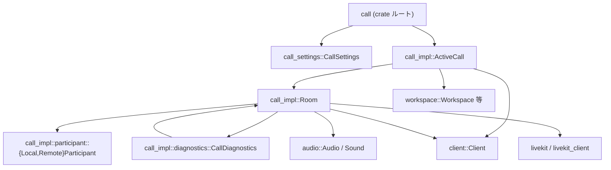
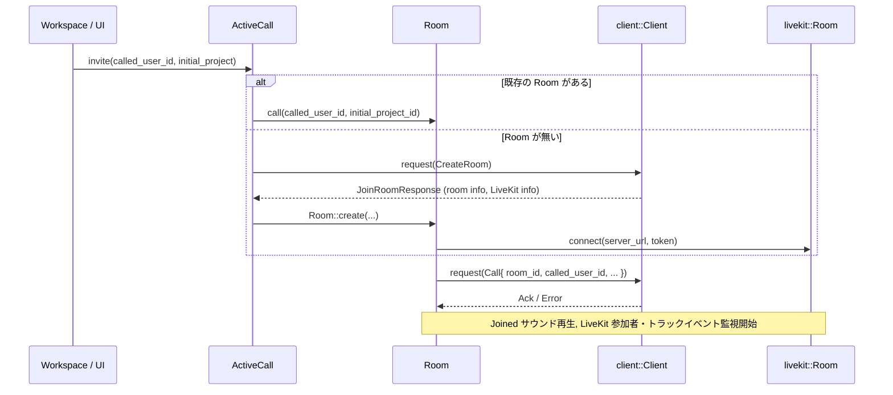

# call/ ディレクトリ解説

## 1. ざっくり一言

Zed エディタにおける音声通話・画面共有・プロジェクト共有付きの「通話ルーム」を管理するクレートです。  
LiveKit を用いた音声・映像ストリームと、Zed の `workspace` / `project` とを橋渡しする役割を持ちます。

---

## 2. このモジュールの役割

### 2.1 概要

このクレートは、次のような問題を解決するために存在しています。

- **通話ルームのライフサイクル管理**  
  ルームの作成・参加・離脱、再接続などをまとめて扱います。
- **エディタ内の状態との連携**  
  Zed の `Workspace` / `Project` と通話ルームを同期し、  
  「どのプロジェクトを共有しているか」「どこにいる参加者か」を追跡します。
- **通話に関連する設定と診断情報の提供**  
  「ミュートで入室するか」「参加時にプロジェクトを共有するか」といった設定と、  
  ネットワーク品質の簡易診断（レイテンシ、ジッタ、パケットロス）を提供します。

### 2.2 ディレクトリ内の主な構成と責務

- `call/src/call.rs`
  - クレートのルートモジュールです。
  - `call_impl` 内の公開 API を再エクスポートし、`call_settings` を公開します。
- `call_settings.rs`
  - 設定システム (`settings` クレート) から通話に関する設定値を読み出す型を定義します。
- `call_impl/mod.rs`
  - 通話機能の中核です。
  - グローバルな「現在の通話」 (`ActiveCall`) を保持し、`workspace` 全体からアクセスできるように初期化します。
  - サーバーとのシグナリング (`client` クレート) を扱い、呼び出し/着信/キャンセルなどを処理します。
- `call_impl/room.rs`
  - 1 つの通話ルーム (`Room`) の状態と、LiveKit との接続を管理します。
  - 参加者の一覧、プロジェクト共有状況、音声/画面の共有状態、再接続ロジックなどを持ちます。
- `call_impl/participant.rs`
  - ローカル/リモート参加者の情報 (`LocalParticipant`, `RemoteParticipant`) を表現します。
  - LiveKit のトラック ID などを再エクスポートします。
- `call_impl/diagnostics.rs`
  - `Room` から LiveKit の `SessionStats` を取得し、レイテンシ・ジッタ・パケットロス・入力ラグから  
    接続品質を集約的に評価する `CallDiagnostics` を提供します。

### 2.3 モジュール間の依存関係

主要なモジュール間の依存関係は、次のようになっています。



#### 設計上のポイント（コードから読み取れる範囲）

- `ActiveCall` は **グローバル・シングルトン** として動作し、複数 `Workspace` 間で 1 つの通話状態を共有します。
- `Room` は「サーバー側のルーム」と「LiveKit のメディアルーム」の両方を抽象化しています。
- `OneAtATime` により、ルーム参加など「高コストな非同期処理」を **同時に 1 件だけ** 実行するよう制御しています。
- エラーハンドリングには `anyhow::Result` を用い、UI 側には `Task<Result<...>>` で非同期結果を返す形になっています。
- `CallSettings` は `unwrap()` を使っているため、設定が存在することを前提にしています（設定がなければ panic します）。

---

## 3. 主要な機能一覧

このクレートが提供する主な機能を列挙します。

- **通話機能の初期化**
  - `init` 関数で `ActiveCall` を作成し、`workspace` から利用できるように登録。
  - `MultiWorkspace` のアクティブなプロジェクト変更を監視し、通話中の「位置情報」を更新。

- **グローバルな通話状態 (`ActiveCall`) の管理**
  - 現在参加している `Room` の参照取得 (`room`, `channel_id`)。
  - チャンネルへの参加 (`join_channel`)、ハングアップ (`hang_up`)。
  - プロジェクト共有・共有解除 (`share_project`, `unshare_project`)。
  - 着信 (`IncomingCall`) の監視・受諾・拒否。

- **通話ルーム (`Room`) の詳細管理**
  - ルームの作成 (`Room::create`)、参加 (`join`, `join_channel`)、離脱 (`leave`)。
  - 参加者リスト・役割 (`ChannelRole`)・位置 (`ParticipantLocation`) の追跡。
  - Shared/Joined な `Project` の状態管理と再接続時の再共有 (`rejoin`)。

- **音声・画面共有**
  - マイクの共有・ミュート管理 (`share_microphone`, `toggle_mute`, `is_muted`)。
  - 画面共有 (`share_screen`, `share_screen_wayland`, `unshare_screen`, `is_sharing_screen`)。
  - リモート参加者の音声/映像トラックの購読・解除とそれに伴うイベント発行。

- **ネットワーク診断 (`CallDiagnostics`)**
  - LiveKit の `SessionStats` から RTT, ジッタ, パケットロス, 入力ラグを集約。
  - LiveKit の `ConnectionQuality` と各メトリクスを組み合わせた「実効的な接続品質」を算出。

- **通話設定 (`CallSettings`)**
  - `mute_on_join`: 参加時にマイクを実質的にミュート状態にするか。
  - `share_on_join`: 通話参加時にプロジェクトを自動共有するか。

---

## 4. 関数・構造体の解説

### 4.1 主な構造体・列挙体

| 名前 | 種別 | モジュール | 役割 / 用途 |
|------|------|------------|-------------|
| `CallSettings` | 構造体 | `call_settings` | 設定ファイルから「ミュートで入室」「参加時に共有」フラグを読み込む。 |
| `ActiveCall` | 構造体 | `call_impl` | 全ワークスペースで共有される「現在の通話状態」。ルーム参加・招待・着信処理を管理。 |
| `IncomingCall` | 構造体 | `call_impl` | 着信中の通話情報（ルーム ID、発信者、参加予定者、初期プロジェクト）を保持。 |
| `OneAtATime` | 構造体 | `call_impl` | ある種の非同期タスクを常に 1 個だけ実行させるためのヘルパ。 |
| `Room` | 構造体 | `call_impl::room` | 1 つの通話ルームの状態と、LiveKit・サーバーとの接続を表す。 |
| `RoomStatus` | 列挙体 | `call_impl::room` | `Online` / `Rejoining` / `Offline` のルーム状態を表現。 |
| `LocalParticipant` | 構造体 | `call_impl::participant` | ローカルユーザーの役割と共有プロジェクト情報を保持。 |
| `RemoteParticipant` | 構造体 | `call_impl::participant` | リモート参加者のユーザー情報・ロール・位置・音声/映像トラックを保持。 |
| `CallStats` | 構造体 | `call_impl::diagnostics` | 接続品質に関する統計値を格納する DTO 的な型。 |
| `CallDiagnostics` | 構造体 | `call_impl::diagnostics` | 定期的に `Room` から統計情報を取得し、`CallStats` を更新。 |
| `LiveKitRoom` | 構造体 | `call_impl::room`（非公開） | LiveKit の `Room` とローカルトラック状態（マイク・画面）をまとめた内部構造。 |
| `LocalTrack<T>` | 列挙体 | `call_impl::room` | ローカルトラック（マイク・画面）の状態を `None` / `Pending` / `Published` で管理。 |

### 4.2 重要な関数・メソッドの詳細

ここでは、外部から頻繁に使われる、または挙動が重要な関数/メソッドを 7 個まで詳しく説明します。

#### `init(client: Arc<Client>, user_store: Entity<UserStore>, cx: &mut App)`

**概要**

- 通話機能をアプリ全体に登録する初期化関数です。
- `ActiveCall` を生成し、`GlobalAnyActiveCall` として `App` にセットします。
- `MultiWorkspace` のアクティブワークスペース/プロジェクト変更を監視し、`ActiveCall` の「現在の位置」を更新します。

**引数**

| 引数名 | 型 | 説明 |
|--------|----|------|
| `client` | `Arc<Client>` | サーバーとの通信を行うクライアント。通話シグナリング等に使用します。 |
| `user_store` | `Entity<UserStore>` | ユーザー情報を管理するエンティティ。 |
| `cx` | `&mut App` | アプリケーションコンテキスト（`gpui`）。グローバルエンティティ登録や購読に使用します。 |

**戻り値**

- ありません（`()`）。副作用として `ActiveCall` が生成・登録されます。

**内部処理の流れ**

1. `ActiveCall::new` を用いて `ActiveCall` エンティティを作成します。
2. `cx.observe_new` で新しい `MultiWorkspace` が作られたタイミングを監視し、
   - アクティブワークスペース変更時などに `ActiveCall::set_location` を呼び出し、
   - 現在の `Project` を通話ルーム側に伝えます。
3. `GlobalAnyActiveCall` に `ActiveCall` のハンドルを登録します。

**Examples（使用例）**

```rust
use std::sync::Arc;
use client::Client;
use gpui::App;
use call::init; // call/src/call.rs から再エクスポートされていると想定

fn setup_call(client: Arc<Client>, user_store: gpui::Entity<client::UserStore>, app: &mut App) {
    // 通話機能をアプリ全体に登録する                     // 以後は workspace 側から GlobalAnyActiveCall 経由で参照できる
    init(client, user_store, app);
}
```

**使用上の注意点**

- 一般にはアプリケーション起動時に 1 回だけ呼び出されることを前提とした設計になっています。
- `ActiveCall` はグローバルに保持されるため、複数回 `init` すると予期しない状態重複が起こり得ます（コード上に再初期化ガードはありません）。

---

#### `ActiveCall::invite(&mut self, called_user_id: u64, initial_project: Option<Entity<Project>>, cx: &mut Context<Self>) -> Task<Result<()>>`

**概要**

- 指定したユーザー ID に対して通話招待を送ります。
- 必要に応じて、新しい `Room` を作成し、プロジェクト共有も合わせて行います。

**引数**

| 引数名 | 型 | 説明 |
|--------|----|------|
| `called_user_id` | `u64` | 招待したいユーザーの ID。 |
| `initial_project` | `Option<Entity<Project>>` | 通話開始時に共有したいプロジェクト（任意）。 |
| `cx` | `&mut Context<Self>` | `ActiveCall` エンティティのコンテキスト。 |

**戻り値**

- `Task<Result<()>>`  
  非同期に実行されるタスクへのハンドルで、成功/失敗が `Result` で返ります。

**内部処理の流れ**

1. `pending_invites` に `called_user_id` を追加。すでに存在していれば `Err("user was already invited")` を即座に返します。
2. `OneAtATime::running()` を確認し、すでに参加処理中なら新しいルーム作成は行わず `Ok(())` を返します。
3. 既存の `room` か、`pending_room_creation` があればそれを使い、なければ `Room::create` を用いて新規作成します。
4. ルームが取得できたら、必要なら `share_project` で `initial_project` を共有し、`Room::call` で招待を送ります。
5. タスク完了時に `pending_invites` から ID を削除し、必要ならテレメトリイベント `"Participant Invited"` を送ります。

**Errors / Panics**

- すでに同じ `user_id` を招待中の場合: `Err(anyhow!("user was already invited"))`。
- ルーム作成/共有/Call リクエスト中の通信エラーは `Err` として返ります。

**Edge cases**

- 現在参加している `Room` がない場合、内部でルーム作成と自分自身の参加が行われます。
- `pending_room_creation` がすでに存在する場合は、それが完了してから招待処理が行われます（同時に複数のルーム作成はされません）。

**使用上の注意点**

- UI 側では `pending_invites` を見て「招待中」表示を制御できます。
- 招待に失敗しても、`pending_invites` のクリーンアップはタスク内で行われるため、タスクを必ず最後まで動作させる必要があります（途中で `Task` をドロップすると反映されません）。

---

#### `ActiveCall::join_channel(&mut self, channel_id: ChannelId, cx: &mut Context<Self>) -> Task<Result<Option<Entity<Room>>>>`

**概要**

- 指定されたチャンネルに対応する `Room` に参加します。
- 既に同じチャンネルの `Room` に参加している場合は、その `Room` を再利用します。

**引数**

| 引数名 | 型 | 説明 |
|--------|----|------|
| `channel_id` | `ChannelId` | 参加したいチャンネルの ID。 |
| `cx` | `&mut Context<Self>` | `ActiveCall` のコンテキスト。 |

**戻り値**

- `Task<Result<Option<Entity<Room>>>>`
  - `Ok(Some(room))` : 参加または再利用に成功し、`Room` を取得できた。
  - `Ok(None)` : すでに `pending_room_creation` があり、今回は新規参加処理を行わなかった。
  - `Err(e)` : 通信エラーや部屋参加エラーが発生した。

**内部処理の流れ**

1. すでに `room` がある場合:
   - `room.channel_id() == Some(channel_id)` なら、その `room` を `Some(room)` として即座に返します。
   - 異なるチャンネルの場合: `room.clear_state(cx)` を呼び出し、状態をリセットします。
2. `pending_room_creation` がある場合は、`Ok(None)` を返して新たな参加処理を行いません。
3. `OneAtATime::spawn` で `Room::join_channel` を非同期に実行し、終了後に `set_room` で `ActiveCall` 内の `room` を更新します。
4. 成功したら `"Channel Joined"` のテレメトリイベントを送信します。

**Edge cases**

- 参加先チャンネルが既存 `room` と異なる場合、**既存のルーム状態はクリア** されます（共有プロジェクト等も含む）。
- 同時に複数の `join_channel` を呼び出した場合は、`OneAtATime` により後から呼ばれたものだけが有効になります。

**使用上の注意点**

- UI 側では `Ok(None)` が返る可能性を考慮する必要があります（「現在参加処理中なので待機」という意味）。
- `Task` を await せずに捨てると、`ActiveCall` 内の `room` が更新されないままになるため、基本的には最後まで待機することが前提です。

---

#### `ActiveCall::hang_up(&mut self, cx: &mut Context<Self>) -> Task<Result<()>>`

**概要**

- 現在の通話（`Room`）から離脱し、音声再生などのリソースを解放します。

**引数**

| 引数名 | 型 | 説明 |
|--------|----|------|
| `cx` | `&mut Context<Self>` | `ActiveCall` コンテキスト。 |

**戻り値**

- `Task<Result<()>>`  
  ルーム離脱処理（`Room::leave`）の完了を表すタスク。

**内部処理の流れ**

1. `cx.notify()` で UI 更新を促します。
2. `"Call Ended"` イベントをテレメトリに報告します。
3. `Audio::end_call(cx)` を呼び、通話用のオーディオ状態を終了します。
4. `room` を取り出し、`Event::RoomLeft` を emit した上で、`Room::leave` を呼び出します。
5. `Room` がない場合は即座に `Ok(())` を返します。

**Edge cases**

- すでに `room` が無い場合でもエラーにはせず、`Ok(())` を返します（多重ハングアップに寛容な設計）。

**使用上の注意点**

- UI 側で「ハングアップ完了」を待ちたい場合、戻り値の `Task` を await する必要があります。
- `Room` 側で `leave_internal` が通信エラーになった場合、そのエラーが `Result` として伝播します。

---

#### `Room::share_project(&mut self, project: Entity<Project>, cx: &mut Context<Self>) -> Task<Result<u64>>`

**概要**

- ローカルの `Project` を通話ルームに共有します。
- 成功すると、プロジェクトにリモート ID が割り当てられ、`shared_projects` セットに記録されます。

**引数**

| 引数名 | 型 | 説明 |
|--------|----|------|
| `project` | `Entity<Project>` | 共有したいプロジェクト。 |
| `cx` | `&mut Context<Self>` | `Room` コンテキスト。 |

**戻り値**

- `Task<Result<u64>>` : 共有されたプロジェクトのリモート ID。

**内部処理の流れ**

1. すでに `project.read(cx).remote_id()` がある場合、その ID を即座に返します（再共有しない）。
2. `proto::ShareProject` リクエストを作成し、`client` に送信します。
   - `worktrees`, `is_ssh_project`, `windows_paths`, `features` などプロジェクトメタデータが含まれます。
3. 応答で受け取った `project_id` を使って `project.shared(project_id, cx)` を呼び出します。
4. `shared_projects` にプロジェクトを追加し、現在地がこのプロジェクトであれば `set_location` で位置情報も更新します。

**Edge cases**

- プロジェクトにすでに `remote_id` が存在する場合、通信は行われず即座にその ID を返します。
- `set_location` の内部でさらに非同期タスクが発生し、その完了を待ってから最終的な `Ok(project_id)` を返します。

**使用上の注意点**

- ルームが `Offline` の場合でも、このメソッド自体は `RoomStatus` をチェックしないため、呼ぶ側で状態を確認する方が安全です（`share_project` 自体はエラーを返しませんが、その後の相互作用が期待通りにならない可能性があります）。
- 戻り値の `Task` を await することで、プロジェクト側の `shared` 状態と `Room` の `shared_projects` への登録が完了したタイミングを把握できます。

---

#### `Room::share_microphone(&mut self, cx: &mut Context<Self>) -> Task<Result<()>>`

**概要**

- ローカルマイクを LiveKit ルームに公開します。
- `LocalTrack` の状態を `Pending` → `Published` に遷移させ、`muted_by_user` / `deafened` 状態も考慮します。

**引数**

| 引数名 | 型 | 説明 |
|--------|----|------|
| `cx` | `&mut Context<Self>` | `Room` コンテキスト。 |

**戻り値**

- `Task<Result<()>>` : マイク公開処理の完了を表すタスク。

**内部処理の流れ（概要）**

1. `status` が `Offline` なら即座に `Err("room is offline")`。
2. `live_kit` が未初期化なら `Err("live-kit was not initialized")`。
3. `LocalTrack::Pending { publish_id }` に遷移し、`Room` 状態を通知 (`cx.notify`)。
4. 非同期タスク内で `room.publish_local_microphone_track(user_name, is_staff, cx)` を呼び出します。
5. 結果を `update` で反映:
   - 既に別の publish が走っている場合は「キャンセル」とみなし、成功していてもすぐ unpublish します。
   - 成功 & 有効な publish の場合は、`input_lag_us` を保存し、`LocalTrack::Published` に遷移。
   - エラーの場合は `LocalTrack::None` に戻します。

**Edge cases**

- `muted_by_user` または `deafened` の場合、発行したトラックは即座に mute されます（`publication.mute(cx)`）。
- 連続して `share_microphone` を呼んだ場合、`publish_id` により前の試行がキャンセルされます。

**使用上の注意点**

- `toggle_mute` などから間接的に呼ばれる想定で、直接呼ぶ場合は `Room::can_use_microphone()` を併用すると意図しない利用を避けられます。
- エラー時の詳細は `anyhow::Error` によって表現されるため、ログ出力などで内容を確認できます。

---

#### `Room::share_screen(&mut self, source: Rc<dyn ScreenCaptureSource>, cx: &mut Context<Self>) -> Task<Result<()>>`

**概要**

- 指定した画面キャプチャソースを LiveKit に画面共有として公開します（主に非 Linux 版）。
- `share_microphone` と同様に `LocalTrack` 状態を管理します。

**引数**

| 引数名 | 型 | 説明 |
|--------|----|------|
| `source` | `Rc<dyn ScreenCaptureSource>` | キャプチャ対象ウィンドウ/画面のソース。 |
| `cx` | `&mut Context<Self>` | `Room` コンテキスト。 |

**戻り値**

- `Task<Result<()>>` : 画面共有開始処理の完了を表すタスク。

**内部処理の流れ**

1. `status` が `Offline` なら `Err("room is offline")`。
2. 既に `is_sharing_screen()` が `true` の場合 `Err("screen was already shared")`。
3. `live_kit` が未初期化なら `Err("live-kit was not initialized")`。
4. `LocalTrack::Pending { publish_id }` に設定し、`RoomEvent` と UI 通知を行います。
5. 非同期で `participant.publish_screenshare_track(&*source, cx)` を呼び出し、成功時:
   - キャンセルされていなければ `LocalTrack::Published` に遷移。
   - `Audio::play_sound(Sound::StartScreenshare, cx)` で効果音を再生します。

**Edge cases**

- 共有開始前に別の `share_screen` を呼ぶと、`publish_id` の競合により古い方がキャンセル扱いになります。
- エラー発生時は `LocalTrack::None` に戻ります。

**使用上の注意点**

- Linux/Wayland では `share_screen_wayland` が別途用意されているため、環境に応じて使い分ける前提です。
- 対応する停止操作は `unshare_screen(play_sound, cx)` です。`play_sound` を `false` にすると音無しで停止できます。

---

### 4.3 その他の公開 API（概要）

主な補助関数・メソッドを簡潔にまとめます。

| 関数 / メソッド | 役割（1 行） |
|-----------------|--------------|
| `ActiveCall::global` / `try_global` | `App` からグローバルな `ActiveCall` エンティティを取得する。 |
| `ActiveCall::incoming` | 現在の着信情報 (`IncomingCall`) を `postage::watch` で購読する。 |
| `ActiveCall::accept_incoming` / `decline_incoming` | 着信中の通話を受諾/拒否する。 |
| `ActiveCall::share_project` / `unshare_project` | 現在の通話でプロジェクトを共有/共有解除する。 |
| `ActiveCall::set_location` | アクティブな `Project` をルームに伝え、参加者の位置情報を更新する。 |
| `Room::join` / `Room::join_channel` / `Room::create` | ルーム作成・参加のエントリポイント。 |
| `Room::leave` | ルームから離脱し、共有状態やトラックをクリーンアップする。 |
| `Room::toggle_mute` / `toggle_deafen` | マイクのミュート/デフ状態をトグルする。 |
| `Room::most_active_project` | 「参加者が最も多いプロジェクト」を `(project_id, host_user_id)` で返す。 |
| `Room::diagnostics` | `CallDiagnostics` エンティティへの参照を返す（あれば）。 |
| `CallDiagnostics::stats` | 最新の `CallStats` を参照する。 |

---

## 5. データフロー

ここでは、代表的な「ユーザーが他のユーザーを通話に招待する」シナリオのデータフローを示します。

### 5.1 招待の流れ（ActiveCall → Room → Client → LiveKit）

1. UI（`Workspace` 側）から `AnyActiveCall::invite` 相当の操作が呼ばれます。
2. `ActiveCall::invite` が現在の `Room` を取得／作成し、必要なら `Room::create` を通じてサーバーに `CreateRoom` を送信します。
3. `Room` が作成されると、`spawn_room_connection` により LiveKit と接続し、`RoomEvent` を監視し始めます。
4. `Room::call` が `proto::Call` をサーバーに送信し、相手側のクライアントに `IncomingCall` が届きます。

この流れをシーケンス図で表すと、次のようになります（サーバー側の内部は省略しています）。



### 5.2 状態更新とイベント

- `Room::apply_room_update` / `start_room_connection` 経由で `proto::Room` の内容が反映される際に:
  - `LocalParticipant` / `RemoteParticipant` が更新されます。
  - 共有/未共有プロジェクトに応じて `Event::RemoteProjectShared` / `RemoteProjectUnshared` が emit されます。
  - `ParticipantLocation` の変化に応じて `Event::ParticipantLocationChanged` が emit されます。
- LiveKit 側の `RoomEvent` が届くと、`livekit_room_updated` 内で:
  - トラックの subscribe/unsubscribe に応じて `RemoteVideoTracksChanged` などが emit されます。
  - `ActiveSpeakersChanged` により `RemoteParticipant.speaking` フラグが更新されます。

---

## 6. 使い方（How to Use）

### 6.1 基本的な使用方法

ここでは、Zed 以外のコンテキストでもパターンを理解しやすいように、簡略化したコード例を示します。  
実際には `gpui` のアプリケーション初期化コードの一部で呼び出される形になります。

```rust
use std::sync::Arc;
use gpui::{App, Context};
use client::{Client, UserStore, ChannelId};
use project::Project;
use call::{init, ActiveCall};

fn setup(app: &mut App, client: Arc<Client>, user_store: gpui::Entity<UserStore>) {
    // 通話機能を初期化し、GlobalAnyActiveCall を登録する
    init(client, user_store, app);
}

fn join_some_channel(app: &mut App, channel: ChannelId) {
    // グローバルな ActiveCall エンティティを取得する
    let active_call_entity = ActiveCall::global(app);

    // join_channel を非同期で呼び出す
    let task = active_call_entity.update(app, |active_call, cx| {
        active_call.join_channel(channel, cx)             // Task<Result<Option<Entity<Room>>>> を返す
    });

    // 必要なら別スレッド/async コンテキストで待機する
    app.spawn(async move |_cx| {
        match task.await {
            Ok(Some(room)) => {
                // 参加済みの Room を取得できたケース
                log::info!("joined room {}", room.read(&_cx.app()).id());
            }
            Ok(None) => {
                // すでに参加処理中で、今回は何もしなかったケース
            }
            Err(err) => {
                log::error!("failed to join channel: {err:?}");
            }
        }
    });
}
```

### 6.2 よくある使用パターン

#### パターン 1: 着信の監視と応答

`ActiveCall::incoming` で `IncomingCall` を監視し、受諾/拒否を行う例です。

```rust
use gpui::App;
use call::ActiveCall;

fn handle_incoming_calls(app: &App) {
    let active_call = ActiveCall::global(app);                  // グローバル ActiveCall を取得
    let incoming_rx = active_call.read(app).incoming();         // IncomingCall を監視する watch::Receiver を取得

    // 実際には gpui のバックグラウンドタスクなどで待機する想定
    app.background_executor().spawn(async move {
        let mut rx = incoming_rx;                               // ローカルコピーを作成
        while let Some(call_opt) = rx.next().await {            // IncomingCall の変化を待つ
            if let Some(call) = call_opt {
                log::info!("Incoming call from {}", call.calling_user.name);
                // UI を開いて Accept / Decline を選ばせる... といった処理に繋げる
            }
        }
    });
}
```

#### パターン 2: 通話中のプロジェクト共有

```rust
use gpui::{App, Context};
use call::ActiveCall;
use project::Project;

fn share_current_project(app: &mut App, project: gpui::Entity<Project>) {
    let active_call = ActiveCall::global(app);               // 現在の ActiveCall を取得

    let task = active_call.update(app, |active_call, cx| {
        active_call.share_project(project, cx)               // Task<Result<u64>> を返す
    });

    app.spawn(async move |_cx| {
        if let Err(err) = task.await {
            log::error!("failed to share project: {err:?}");
        }
    });
}
```

#### パターン 3: ミュート/デフの切り替え

`Room` に直接アクセスできる場合の例です。

```rust
use gpui::App;
use call::ActiveCall;

fn toggle_mute_in_current_room(app: &mut App) {
    let active_call = ActiveCall::global(app);             // ActiveCall を取得
    if let Some(room) = active_call.read(app).room().cloned() {
        // Room に対してミュート切り替えを行う
        room.update(app, |room, cx| {
            room.toggle_mute(cx);                          // 内部で set_mute や share_microphone を呼ぶ
        });
    }
}
```

### 6.3 よくある間違い

```rust
use gpui::App;
use call::{ActiveCall, Room};

fn incorrect_share_project(app: &mut App, project: gpui::Entity<project::Project>) {
    let active_call = ActiveCall::global(app);

    // ❌ よくある間違い: Room が無い可能性を無視して直接 Room にアクセスしようとする
    if let Some(room) = active_call.read(app).room() {
        // &Entity<Room> なので、ここで update するには cloned() が必要
        // また、ActiveCall 側の room が None のケースを考慮していない
        room.update(app, |room, cx| { room.share_project(project, cx) });
    }
}

fn correct_share_project(app: &mut App, project: gpui::Entity<project::Project>) {
    let active_call = ActiveCall::global(app);

    // ✅ 正しい例: ActiveCall 経由で share_project を呼び出す
    let task = active_call.update(app, |active_call, cx| {
        active_call.share_project(project, cx)                // Room の有無などを ActiveCall 側で判定
    });

    app.spawn(async move |_cx| {
        if let Err(err) = task.await {
            log::error!("failed to share project: {err:?}");
        }
    });
}
```

**ポイント**

- `Room` の有無（`ActiveCall::room()` が `None` の場合）を考慮せずに直接 `Room` を操作しようとするとエラーになる可能性があります。
- 可能な限り `ActiveCall` 経由の API を利用すると、前提条件のチェックが一元化されます。

### 6.4 使用上の注意点（まとめ）

- **ルーム状態の前提**
  - 多くの `Room` メソッドは `status` が `Offline` の場合に `Err("room is offline")` を返します。
  - 呼び出し前に `RoomStatus` を確認するか、エラーを確実にハンドリングする必要があります。

- **非同期タスクのライフサイクル**
  - `Task<Result<...>>` を返すメソッドは、基本的に await される前提で設計されており、途中で `Task` をドロップすると内部状態が中途半端に残ることがあります。
  - 特に `ActiveCall::invite` / `join_channel` / `Room::share_project` などでは、タスク内で `pending_*` 状態のクリーンアップを行っています。

- **`CallSettings` の前提**
  - `CallSettings::from_settings` では `content.calls` とその中のフィールドを `unwrap()` しているため、設定ファイル側に `calls` セクションが存在しない場合は panic します。
  - 設定システムの初期化順序と内容が正しい前提で利用されます。

- **マイク/画面共有の競合**
  - `LocalTrack::Pending`/`Published` を用いた状態管理により、連続操作による競合をある程度吸収していますが、
    UI 上では「共有中」の状態を `is_sharing_mic` / `is_sharing_screen` から常に参照し、ボタンの連打などを避ける設計が望ましいです。

- **再接続の挙動**
  - `Room::maintain_connection` によって、クライアント切断時に一定回数の再接続を試みます。
  - 最終的に失敗した場合、`leave` が呼ばれ、ルームから離脱した状態になります（その後の操作は `Offline` 前提で扱う必要があります）。

---

## 7. 関連ファイル

| パス | 役割 / 関係 |
|------|------------|
| `call/Cargo.toml` | クレート定義。`livekit_client`, `workspace`, `audio`, `client` などへの依存を宣言。 |
| `call/src/call.rs` | クレートルート。`call_impl` の公開 API を re-export し、`call_settings` を公開。 |
| `call/src/call_settings.rs` | `CallSettings` 型を定義し、設定システムから通話設定を読み出す実装を提供。 |
| `call/src/call_impl/mod.rs` | `ActiveCall` や `init` を定義し、通話機能全体のエントリポイントとなるモジュール。 |
| `call/src/call_impl/room.rs` | `Room` 型と LiveKit 連携・再接続・参加者管理・画面/音声共有処理を実装。 |
| `call/src/call_impl/participant.rs` | `LocalParticipant` / `RemoteParticipant` 構造体とトラック関連の re-export を提供。`Room` から利用されます。 |
| `call/src/call_impl/diagnostics.rs` | `CallDiagnostics` により `Room` のネットワーク統計を取得・集約し、接続品質指標を提供。 |

これらのファイルが連携することで、Zed 内での通話の作成・管理・共有・診断が一貫して行える構成になっています。
