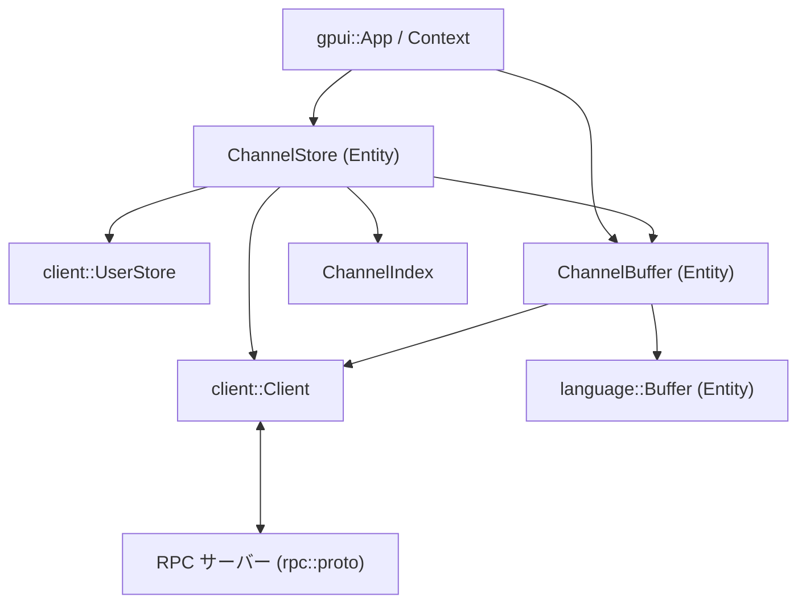
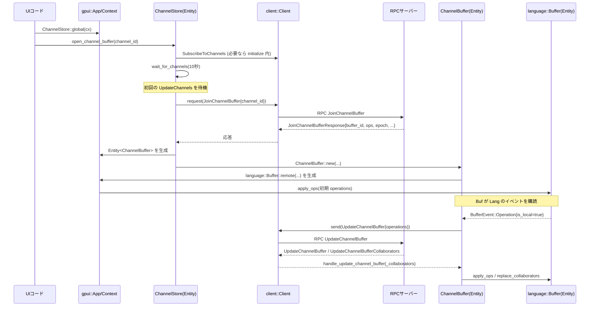

# channel/ ディレクトリ解説

## 1. ざっくり一言

`channel` クレートは、

- 「チャンネル」（コラボ用の論理的な部屋）の一覧・階層構造・メンバー情報を管理するストア
- 各チャンネルに紐づく **共同編集用テキストバッファ**（notes）の同期管理

を行うモジュール群です。`client` / `rpc` を通じてサーバーと通信し、`gpui` の `Entity` として UI から操作できるようにしています。

---

## 2. このモジュールの役割

### 2.1 概要

このディレクトリは大きく次の二つを提供します。

- **ChannelStore**:  
  - サーバーから届く `UpdateChannels` / `UpdateUserChannels` を取り込み  
  - チャンネル一覧・階層・招待・参加者・権限・お気に入りなどを一元管理する
- **ChannelBuffer**:  
  - 特定チャンネルの「notes」用 `language::Buffer` をサーバーと同期し  
  - 協調編集のための操作送受信・コラボレータ一覧管理・バージョン ACK を行う

クレートのエントリポイント `channel::init` で両者を初期化し、アプリケーションからは `ChannelStore::global` などを通じて利用します。

### 2.2 アーキテクチャ内での位置づけ

主要コンポーネント間の依存関係を図示します。



概要:

- `channel::init` が `ChannelStore` を `Global` に登録し、`ChannelBuffer` 用 RPC ハンドラもセットします。
- `ChannelStore` は `client::Client` のステータスやメッセージ (`UpdateChannels` 等) を購読し、
  内部の `ChannelIndex` や状態マップを更新します。
- `ChannelBuffer` はチャンネルごとに生成され、`language::Buffer` と RPC サーバーの間で
  更新操作を中継します。

### 2.3 設計上のポイント

コードから読み取れる主な設計上の特徴は次の通りです。

- **ストア + バッファの分離**
  - チャンネルのメタ情報（名前・階層・メンバー・権限など）は `ChannelStore`
  - 実際のテキストバッファとその同期は `ChannelBuffer`
- **非同期イベント駆動**
  - `client::Client` のステータスストリーム・RPC メッセージ・`gpui` の `Task` を用いて、
    接続・切断・再接続・チャンネル更新を非同期で処理します。
- **一貫性保持用のインデックス**
  - `ChannelIndex` + `ChannelPathsInsertGuard` を用いて、
    親パスと `channel_order` に基づくチャンネル DAG の順序を、一括更新後に整列・重複排除する設計です。
- **リソースの「一度だけオープン」制御**
  - `OpenEntityHandle` と `open_channel_resource` により、
    同じチャンネルのバッファを複数回要求しても、内部的には 1 つの非同期ロードに集約します。
- **再接続時の同期戦略**
  - 接続が途切れた間のローカル編集とリモート状態を突き合わせるために、
    `RejoinChannelBuffers` RPC + `language::Buffer::serialize_ops/apply_ops` を使った再同期処理を行います。

---

## 3. 主要な機能一覧

このクレートが提供する主な機能を列挙します。

- 初期化
  - `channel::init`: `ChannelStore` の生成・グローバル登録と `ChannelBuffer` の RPC ハンドラ登録
- チャンネル一覧・状態管理（`ChannelStore`）
  - チャンネル一覧・階層（DAG）の保持 (`ChannelIndex`)
  - 招待中チャンネル・参加者一覧・ユーザー権限 (`ChannelState`)
  - お気に入りチャンネル ID のトグル・設定
  - 自分の権限に基づく `Capability`（読み書き可 / 読み取り専用）の算出
- チャンネルの操作（サーバーとの RPC）
  - チャンネル作成 / 移動 / 並べ替え / 名前変更 / 公開・非公開設定
  - メンバー招待 / 削除 / ロール変更 / 招待受諾・拒否
  - チャンネル削除
  - メンバーのあいまい検索（`fuzzy_search_members`）
- チャンネルバッファ（notes）の管理（`ChannelBuffer`）
  - `JoinChannelBuffer` RPC を介したリモートバッファのオープン
  - `language::Buffer` との双方向同期（ローカル編集 → `UpdateChannelBuffer` RPC）
  - コラボレータ一覧の管理・更新
  - バッファバージョンの ACK (`AckBufferOperation`) のデバウンス送信
- 接続・再接続ハンドリング
  - `client::Status` に応じた subscribe / unsubscribe・再接続処理
  - 再接続時のバッファバージョン突き合わせ・未送信操作の送信
  - 再接続待ちタイムアウト後のバッファ切断

---

## 4. 関数・構造体の解説

### 4.1 主要な型一覧

| 型名 | 定義場所 | 役割 |
|------|----------|------|
| `ChannelStore` | `channel_store.rs` | すべてのチャンネルに関するメタ情報・状態を保持する中心的なストア |
| `Channel` | `channel_store.rs` | 個々のチャンネル（ID・名称・公開範囲・親パス・並び順） |
| `ChannelState` | `channel_store.rs` | 各チャンネル（正確にはルートチャンネル）の notes バージョンとロールを管理 |
| `ChannelMembership` | `channel_store.rs` | チャンネルメンバー 1 人分の情報（ユーザー + kind + role） |
| `ChannelEvent` | `channel_store.rs` | チャンネル作成・リネーム時に発火する UI 用イベント |
| `ChannelIndex` | `channel_store/channel_index.rs` | チャンネル ID → `Channel` のマップと、親パスに基づくソート順を管理 |
| `ChannelPathsInsertGuard` | 同上 | `bulk_insert` 用のガード。挿入後のソート・重複排除を `Drop` で保証 |
| `ChannelBuffer` | `channel_buffer.rs` | 特定チャンネルの `language::Buffer` と RPC の間を仲介するエンティティ |
| `ChannelBufferEvent` | `channel_buffer.rs` | コラボレータ変化・接続/切断・編集などを通知するイベント |
| `NotesVersion` | `channel_store.rs` | `epoch` + `clock::Global` バージョンのペア。最新と観測済みを ChannelState が保持 |

これ以外にも補助的な enum・構造体（`OpenEntityHandle` など）が存在しますが、上記が利用者視点での主要な型です。

### 4.2 代表的な関数・メソッド

#### `crate::init(client: &Arc<Client>, user_store: Entity<UserStore>, cx: &mut App)`

**概要**

クレート全体の初期化エントリポイントです。`ChannelStore` を作成しグローバル登録するとともに、`ChannelBuffer` 用の RPC メッセージハンドラを `client` に登録します。

**内部処理**

- `channel_store::init` を呼び出し、`ChannelStore` を `gpui::Global` として登録する。
- `channel_buffer::init` に `AnyProtoClient` 化した `client` を渡し、
  - `UpdateChannelBuffer`
  - `UpdateChannelBufferCollaborators`  
  の 2 種類のメッセージを `ChannelBuffer` に配送するハンドラを登録する。

**使用上の注意点**

- 一度アプリ起動時に呼び出しておく想定の初期化関数です。
- テストコードでも `init_test` からこの関数が呼ばれています。

---

#### `ChannelStore::new(client: Arc<Client>, user_store: Entity<UserStore>, cx: &mut Context<Self>) -> Self`

**概要**

`ChannelStore` エンティティの本体を構築するコンストラクタです。  
RPC メッセージハンドラ・クライアントステータス監視タスク・`UpdateChannels` 処理タスクなどをセットアップします。

**主なフィールド初期化・処理**

- RPC メッセージハンドラ登録
  - `UpdateChannels` → `Self::handle_update_channels`
  - `UpdateUserChannels` → `Self::handle_update_user_channels`
- クライアントステータス監視タスク (`_watch_connection_status`)
  - `Status::Connected` → `handle_connect` を非同期に実行
  - `Status::SignedOut` / `Status::UpgradeRequired` → `handle_disconnect(false, cx)`
  - その他（ネットワークエラーなど）→ `handle_disconnect(true, cx)`
- `UpdateChannels` キュー (`update_channels_tx` / `_update_channels`)
  - `handle_update_channels` から MPSC 経由でメッセージを積み、
    `_update_channels` タスクが順に `update_channels` メソッドを実行する。
- `channels_loaded` を `watch::channel_with(false)` で初期化し、
  初回のチャンネル一覧受信を待つ仕組みを用意する。

**エッジケース**

- コンストラクタ内ではまだ `SubscribeToChannels` は送信されません。
  - 実際の購読開始は `initialize`（後述）と `wait_for_channels` 内で行われます。

---

#### `ChannelStore::wait_for_channels(&mut self, timeout: Duration, cx: &mut Context<Self>) -> Task<Result<()>>`

**概要**

サーバーから初回のチャンネル一覧を受信するまで待機するタスクを返します。  
指定した `timeout` までに `UpdateChannels` により `channels_loaded` フラグが true にならなければエラーになります。

**内部処理**

1. `channels_loaded_rx` をクローンし、すでに true なら `Task::ready(Ok(()))` を返す。
2. `status_receiver = client.status()` を取得し、現在接続済みであれば `initialize()` を呼んで購読開始。
3. `select_biased!` で以下を待機:
   - `channels_loaded_rx.next()` が `Some(true)` → 成功終了
   - `status_receiver.next()` で `status.is_connected()` → 再度 `initialize()` を呼ぶ
   - タイマが発火 → `Err(anyhow!("{:?} elapsed without receiving channels", timeout))`

**使用例（概要）**

- `open_channel_buffer` 内部で `Duration::from_secs(10)` を指定して呼び出されています。
  チャンネル情報が揃っていない状態でバッファを開くのを防ぎます。

**使用上の注意点**

- 戻り値は `Task<Result<()>>` であり、呼び出し側で `.await` される前提です。
- `timeout` に達した場合はエラーになるため、UI 側でエラーメッセージなどを表示できるようにしておく必要があります。

---

#### `ChannelStore::open_channel_buffer(&mut self, channel_id: ChannelId, cx: &mut Context<Self>) -> Task<Result<Entity<ChannelBuffer>>>`

**概要**

指定したチャンネルの `ChannelBuffer` を非同期に開きます。  
同じ `channel_id` に対する複数回の呼び出しは、内部的に 1 つのロード処理に集約されます。

**内部処理（`open_channel_resource` を経由）**

- `open_channel_resource` に以下を渡して呼び出します。
  - `resource_name = "notes"`
  - `get_map = |this| &mut this.opened_buffers`
  - `load = |channel: Arc<Channel>, cx| ChannelBuffer::new(channel, client, user_store, channel_store, cx)`
- `open_channel_resource` の挙動:
  1. すでに `OpenEntityHandle::Open(WeakEntity)` があり、`upgrade()` に成功 → 既存エンティティを即座に返すタスク。
  2. `OpenEntityHandle::Loading(task)` があれば、その `Shared<Task<_>>` を再利用。
  3. どちらも無い場合:
     - `wait_for_channels(10 秒)` が完了するまで待つ。
     - `channel_for_id(channel_id)` で `Arc<Channel>` を取得（無ければエラー）。
     - `load(channel, cx)`（ここでは `ChannelBuffer::new`）を実行。
     - 成功したら `OpenEntityHandle::Open(WeakEntity)` として登録。失敗したらエントリを削除。

**エッジケース**

- 指定した `channel_id` が `ChannelStore` に存在しない場合、
  `anyhow!("no channel for id: {channel_id}")` のエラーになります。
- `wait_for_channels` がタイムアウトした場合も同様にエラーになります。

**使用上の注意点**

- 戻り値は「バックグラウンドで実際の処理を行うタスク」なので、
  呼び出し側で `.await` するか、`cx.background_spawn` などで適切に処理する必要があります。
- UI から同時に複数回呼ばれても、ロード処理は共有される設計になっています。

---

#### `ChannelBuffer::new(...) -> Result<Entity<Self>>`

**概要**

`ChannelBuffer` エンティティを作成し、サーバー上のチャンネルバッファとローカルの `language::Buffer` を接続します。

**引数の概要**

- `channel: Arc<Channel>`: 対象チャンネル
- `client: Arc<Client>`: RPC 送受信用クライアント
- `user_store: Entity<UserStore>`: コラボレータ情報で利用
- `channel_store: Entity<ChannelStore>`: capability やチャンネル情報参照用
- `cx: &mut AsyncApp`: 非同期コンテキスト

**内部処理（簡略）**

1. `client.request(proto::JoinChannelBuffer { channel_id })` を発行し、レスポンスから:
   - `buffer_id`
   - `base_text`
   - `operations`（初期適用されるリモート操作）
   - `epoch`
   - `replica_id`
   - `collaborators`
   を取得。
2. `language::Buffer::remote(...)` でリモートバッファとして初期化し、
   取得した `operations` を `apply_ops` で適用。
   - `ChannelStore::channel_capability(channel.id)` を参照して ReadWrite / ReadOnly を決定。
3. `client.subscribe_to_entity(channel.id.0)` で RPC メッセージ購読を開始。
4. `cx.new` で `ChannelBuffer` エンティティを生成し:
   - `cx.subscribe(&buffer, Self::on_buffer_update)` … バッファイベント購読
   - `cx.on_release(Self::release)` … エンティティ破棄時のクリーンアップを登録
   - 最初のコラボレータ一覧を `replace_collaborators` で設定

**エッジケース**

- `JoinChannelBuffer` RPC がエラーを返した場合、そのまま `Result::Err` として呼び出し元に伝播します。
- `BufferId::new` や `deserialize_operation` が失敗した場合も同様です。

**使用上の注意点**

- この関数は通常、アプリケーションコードから直接呼ぶのではなく、
  `ChannelStore::open_channel_buffer` を通じて呼び出されます。
- `ChannelBuffer` のライフサイクルは `gpui::Entity` によって管理され、
  `release` メソッドで `LeaveChannelBuffer` RPC が送信されます。

---

#### `ChannelBuffer::on_buffer_update(...)`

**概要**

`language::Buffer` からのイベントを処理し、必要に応じて `UpdateChannelBuffer` RPC を送信します。  
また、編集イベントを上位に通知します。

**主な分岐**

- `language::BufferEvent::Operation { operation, is_local: true }`
  - `ZED_ALWAYS_ACTIVE` が true かつ `Operation::UpdateSelections` で `selections` が空 → 何もしない（ノイズ抑制）。
  - `self.rejoining` が true → 再接続中なので何も送らない。
  - それ以外 → `serialize_operation` して `UpdateChannelBuffer { channel_id, operations: vec![op] }` を送信。
- `language::BufferEvent::Edited { .. }`
  - `ChannelBufferEvent::BufferEdited` を `cx.emit` して通知。
- それ以外 → 何もしない。

**使用上の注意点**

- 再接続ロジック（`rejoining` フラグ）によって、
  再同期中の不要な操作送信が抑制されています。
- コラボビューなどで「バッファが編集されたこと」を知りたい場合は、
  `ChannelBufferEvent::BufferEdited` を購読することで検知できます。

---

#### `ChannelStore::update_channels(&mut self, payload: proto::UpdateChannels, cx: &mut Context<ChannelStore>) -> Option<Task<Result<()>>>`

**概要**

サーバーからの `UpdateChannels` メッセージ 1 件分を適用し、  
チャンネル一覧・インデックス・招待・参加者・notes バージョンを更新します。

**主な処理の流れ**

1. 招待の削除・追加更新
   - `payload.remove_channel_invitations` に基づき `channel_invitations` を `retain`。
   - `payload.channel_invitations` を ID 昇順に保つように `binary_search_by_key` + `insert`。
2. `channels_changed` 判定
   - `channels`, `delete_channels`, `latest_channel_buffer_versions` のいずれかが非空なら true。
3. チャンネル削除処理
   - `ChannelIndex::delete_channels(&delete_channels)` でインデックスから削除。
   - `channel_participants` / `favorite_channel_ids` からも該当 ID を削除。
   - `opened_buffers` に対応する `ChannelBuffer` があり、同じ ID の再作成が `payload.channels` に含まれていない場合:
     - `ChannelBuffer::disconnect` を呼び出してバッファを切断。
4. チャンネルの挿入・更新
   - `let mut index = self.channel_index.bulk_insert();`
   - 各 `channel` について `index.insert(channel)` を呼び出し、
     - `ChannelPathsInsertGuard` により後でソート・重複排除される。
   - 既存チャンネルの内容が変化した場合、既に開いている `ChannelBuffer` があれば `ChannelBuffer::channel_changed` を通知。
5. 最新 notes バージョンの更新
   - `payload.latest_channel_buffer_versions` を `ChannelState::update_latest_notes_version` で反映。
   - 初回受信時に `channels_loaded` を `true` に送信。
6. 参加者情報の更新（必要な場合のみ）
   - `payload.channel_participants` が空ならここで `None` を返す。
   - そうでない場合は:
     - すべての `participant_user_ids` をソート済みで重複なしの `all_user_ids` に統合。
     - `user_store.get_users(all_user_ids, cx)` を呼び、その結果を待つ `Task` を生成。
     - 取得した `users` をもとに、各チャンネルの `channel_participants` を更新し `cx.notify()`。
   - この非同期処理を行う `Task` を `Some(...)` として返す。

**エッジケース**

- ユーザー情報取得 (`get_users`) がエラーになると、
  返される `Task<Result<()>>` がエラーになりますが、
  チャンネル本体のインデックス更新はすでに行われています。

**使用上の注意点**

- 通常はアプリケーションコードから直接呼ばず、
  `handle_update_channels` → MPSC キュー → `_update_channels` タスク経由で呼ばれます。
- テストコードでは直接 `update_channels` を呼び、戻り値が `None` であること（＝参加者更新タスクがない）を確認しています。

---

#### `ChannelIndex::bulk_insert()` と `ChannelPathsInsertGuard::insert(proto::Channel)`

**概要**

`UpdateChannels` でまとめて届く複数のチャンネルをインデックスに挿入し、  
最終的に親パスと `channel_order` に基づく並び順を保つためのユーティリティです。

**`ChannelPathsInsertGuard` の役割**

- `bulk_insert()` 呼び出し時に
  - `&mut Vec<ChannelId>`（順序付きリスト）
  - `&mut BTreeMap<ChannelId, Arc<Channel>>`（ID → Channel）
  へのミュータブル参照をラップします。
- `Drop` 実装で以下を行います。
  - `channels_ordered.sort_by` で、各チャンネルの「パス（親 + 自身）」に基づくソートキーを計算して並び替え。
  - `channels_ordered.dedup()` で重複 ID を削除。

**ソートキーの定義 (`channel_path_sorting_key`)**

- 各チャンネルについて、
  - 親パス `parent_path: Vec<ChannelId>`
  - 自身の `(channel_order, id)`
  を `Iterator<Item = (i32, ChannelId)>` として連結したもの。
- 親がインデックスに存在しない場合（ダングリングなパス要素）はその ID をスキップするため、
  削除済みチャンネルに紐づく経路は自然に短くなります。

**テストで確認されていること**

`channel_store_tests.rs` のテストにより、次が確認されています。

- ルートチャンネルの `channel_order` に基づいた順序になる (`test_update_channels`)。
- 更新順序（`UpdateChannels.channels` の並び）が変わっても最終的な順序は不変 (`test_update_channels_order_independent`)。
- 削除されたチャンネルに紐づくパスは `delete_channels` 処理により消える (`test_dangling_channel_paths`)。

---

## 5. データフロー

ここでは、代表的なシナリオとして

> 「UI からチャンネルの notes バッファを開き、ローカル編集 → サーバーへ送信 → サーバーからの更新を適用する流れ」

を説明します。

### 5.1 シーケンス図



要点:

- `open_channel_buffer` はチャンネル一覧がロード済みであることを `wait_for_channels` で保証します。
- `ChannelBuffer` はローカル編集（`BufferEvent::Operation`）のみをサーバーに送信し、
  再接続中 (`rejoining = true`) の間は送信を抑制します。
- サーバーからの更新は `ChannelBuffer` が受け取り `language::Buffer` に適用します。

---

## 6. 使い方（How to Use）

### 6.1 基本的な使用方法

テストコードの `init_test` と同様の流れを簡略化した例です。

```rust
use std::sync::Arc;
use client::{Client, UserStore};
use gpui::{App, AppContext as _, Entity};
use http_client::FakeHttpClient; // 実アプリでは実際の HTTP クライアント
use clock::FakeSystemClock;      // 実アプリではシステムクロック

fn setup_channel_store(cx: &mut App) -> Entity<channel::ChannelStore> {
    // 設定ストアやリリースチャネルの初期化（必要に応じて）
    let settings_store = settings::SettingsStore::test(cx); // 実アプリでは別の初期化
    cx.set_global(settings_store);
    release_channel::init(semver::Version::new(0, 0, 0), cx);

    // client::Client を作成
    let clock = Arc::new(FakeSystemClock::new());
    let http = FakeHttpClient::with_404_response();
    let client = Client::new(clock, http, cx);

    // UserStore エンティティを作成
    let user_store = cx.new(|cx| UserStore::new(client.clone(), cx));

    // client モジュールと channel クレートを初期化
    client::init(&client, cx);
    channel::init(&client, user_store, cx);

    // グローバルな ChannelStore を取得
    channel::ChannelStore::global(cx)
}
```

この後、例えばチャンネル一覧の表示・バッファオープンを行います。

```rust
fn open_notes_for_first_channel(cx: &mut App) {
    let channel_store = channel::ChannelStore::global(cx);

    // どれか 1 つチャンネルを取得する（例として最初のもの）
    let maybe_channel_id = channel_store.update(cx, |store, _| {
        store.channel_at(0).map(|ch| ch.id)
    });

    if let Some(channel_id) = maybe_channel_id {
        // notes 用バッファを開く Task を取得
        let task = channel_store.update(cx, |store, cx| {
            store.open_channel_buffer(channel_id, cx)
        });

        // Task をバックグラウンドで await し、結果の Entity<ChannelBuffer> を得る
        cx.background_spawn(async move {
            match task.await {
                Ok(channel_buffer_entity) => {
                    // ここで channel_buffer_entity を使って UI にバインドする
                    // 例: コラボレータ一覧を表示したり、language::Buffer をエディタに渡したり
                }
                Err(err) => {
                    eprintln!("failed to open channel buffer: {err:?}");
                }
            }
        });
    }
}
```

### 6.2 よくある使用パターン

#### (1) チャンネルツリーの表示

`ordered_channels` を使うと、親パスの深さと `Channel` を一緒に列挙できます。

```rust
let items = channel_store.update(cx, |store, _| {
    store
        .ordered_channels()
        .map(|(depth, ch)| (depth, ch.name.to_string()))
        .collect::<Vec<_>>()
});

// depth の値をインデントに反映してツリー表示を構築する、という使い方が想定できます。
```

#### (2) チャンネルの作成と即座の反映

```rust
let create_task = channel_store.update(cx, |store, cx| {
    store.create_channel("#new-channel", None, cx)
});

cx.background_spawn(async move {
    match create_task.await {
        Ok(new_id) => {
            println!("created channel id = {:?}", new_id);
            // update_channels 経由で ChannelStore に反映済み
        }
        Err(err) => eprintln!("failed to create channel: {err:?}"),
    }
});
```

#### (3) メンバー検索

```rust
let task = channel_store.update(cx, |store, cx| {
    store.fuzzy_search_members(channel_id, "alice".to_string(), 10, cx)
});

cx.background_spawn(async move {
    match task.await {
        Ok(members) => {
            for membership in members {
                println!(
                    "user={} role={:?}",
                    membership.user.github_login,
                    membership.role,
                );
            }
        }
        Err(err) => eprintln!("failed to search members: {err:?}"),
    }
});
```

### 6.3 使用上の注意点

- **非同期タスクの扱い**
  - 多くのメソッド（`open_channel_buffer`, `create_channel`, `fuzzy_search_members` など）は `Task<Result<...>>` を返します。
    - `.await` せずに放置すると、対応する RPC が実行されず、UI も更新されません。
- **チャンネル情報のロード**
  - `open_channel_buffer` は内部で `wait_for_channels(10 秒)` を呼びます。
    - サーバーからチャンネル一覧が届かない場合、エラーになります。
- **権限に依存する機能**
  - `channel_capability` は `channel_role`（`ChannelState::role`）に基づいて決まり、
    情報がない場合は `Guest` として扱われます。
    - つまり、まだ `UpdateUserChannels` を受け取っていない直後は、書き込み不可（ReadOnly）になる可能性があります。
- **再接続時の挙動**
  - 一時的な切断時は `rejoining = true` に設定され、再接続処理が走るまでローカル操作はサーバーに送信されません。
  - `RECONNECT_TIMEOUT`（30 秒）経過後も再接続できない場合、`disconnect` によりバッファが切断されます。
- **`gpui::Entity` / `Context` の前提**
  - すべての `update` / `read_with` 呼び出しは、`gpui` のランタイム（UI スレッド）上で行われる前提です。
  - 別スレッドから直接呼び出す設計にはなっていません。

---

## 7. 関連ファイル

| パス | 役割 / 関係 |
|------|------------|
| `channel/Cargo.toml` | クレートのメタデータと依存クレート（`client`, `gpui`, `rpc`, `language` など）の宣言 |
| `channel/src/channel.rs` | クレートのエントリポイント。`mod` 宣言と `init`、主要型の re-export を行う |
| `channel/src/channel_buffer.rs` | `ChannelBuffer` とそのイベント／RPC ハンドラの実装。notes 用テキストバッファの同期を担当 |
| `channel/src/channel_store.rs` | `ChannelStore` 本体・`Channel` 定義・チャンネル操作 RPC・接続/再接続ロジックなどの中心的な実装 |
| `channel/src/channel_store/channel_index.rs` | `ChannelIndex` と `ChannelPathsInsertGuard` によるチャンネル DAG のインデックス・ソートロジック |
| `channel/src/channel_store_tests.rs` | `update_channels` と `ChannelIndex` の挙動を検証するテスト。順序の安定性や削除時のパス処理を確認 |

このディレクトリ全体としては、`channel_store.rs` と `channel_buffer.rs` が中心的な実装ファイルであり、`channel_index.rs` がその内部のインデックス処理を担う構造になっています。
