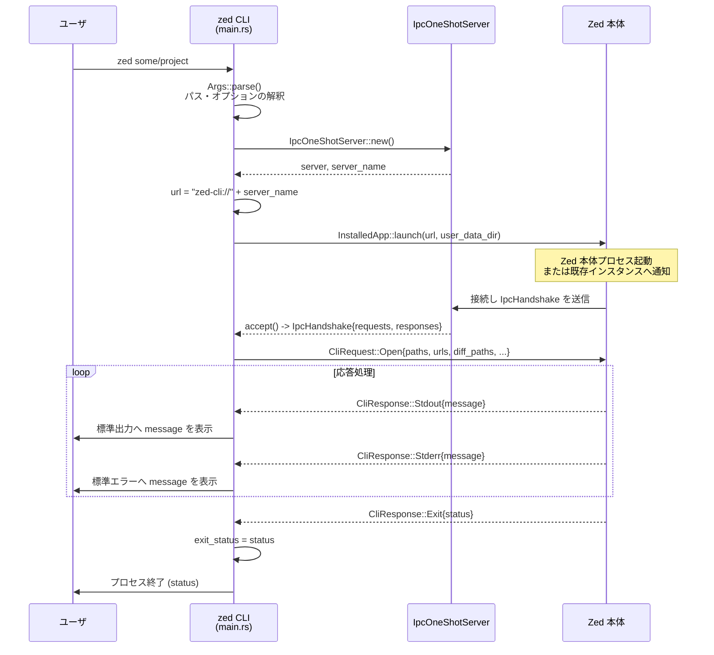

# C:\Drive\rust\zed-local\crates\cli ディレクトリ解説

## 0. ざっくり一言

`cli` クレートは、Zed エディタ用の **独立した CLI バイナリ (`zed`)** を実装するモジュール群です。  
Zed 本体バイナリを自動検出・起動し、IPC で各種オープン要求（パス・URL・diff など）を伝達し、その結果をターミナルに返します。

---

## 1. このモジュールの役割

### 1.1 概要

- このディレクトリは **Zed の CLI フロントエンド** を提供します。
- 役割はおおまかに次の通りです。
  - コマンドライン引数をパースし、開くべきパス・URL・diff ペアなどを解釈する
  - プラットフォームごとに Zed 本体バイナリを検出・起動する
  - IPC チャネルを確立し、`CliRequest` / `CliResponse` をやり取りする
  - 標準入出力や終了コードを Zed 本体の挙動に合わせて反映する

### 1.2 アーキテクチャ内での位置づけ

このクレート内の主な構成要素と依存関係は、次のようになります（Zed 本体クレート自体のコードはこのバッチには含まれていません）。

```mermaid
graph TD
  subgraph CLI_crate
    A[main.rs<br>Args 構造体, main 関数] --> B[IpcOneShotServer<br>IPC ハンドシェイク]
    A --> C[linux モジュール<br>InstalledApp 実装]
    A --> D[windows モジュール<br>InstalledApp 実装]
    A --> E[mac_os モジュール<br>InstalledApp 実装]
    A --> F[flatpak モジュール<br>サンドボックス脱出]
    G[cli.rs<br>IpcHandshake / CliRequest / CliResponse] --> B
  end

  B -->|"URL 通知 (zed-cli://…)"| H[Zed 本体バイナリ<br>(別クレート)]
  H -->|"IPC 接続"| G

  A -->|"askpass モード"| I[askpass クレート]
```

- `cli/src/cli.rs` は、CLI と Zed 本体が共有する **IPC メッセージ型** を定義します。
- `cli/src/main.rs` はエントリポイントであり、
  - 引数パース (`Args`)
  - パス処理・diff の前処理
  - IPC サーバ起動 (`IpcOneShotServer`)
  - プラットフォーム別の Zed 起動 (`InstalledApp` トレイト)
  を行います。
- OS ごとの起動ロジックは `linux`, `windows`, `mac_os`, `flatpak` 各モジュールに分割されています。

### 1.3 設計上のポイント

コードから読み取れる特徴を挙げます。

- **CLI とアプリ本体の分離**
  - CLI はあくまで「ランチャ兼フロントエンド」であり、実際の編集処理は Zed 本体に委譲します。
  - IPC で `CliRequest::Open` を送る方式に統一されています。
- **プラットフォームごとの起動戦略をトレイトで抽象化**
  - `InstalledApp` トレイト（`zed_version_string`, `launch`, `run_foreground`, `path`）を定義し、
    - Linux (`linux::App`)
    - Windows (`windows::App`)
    - macOS (`mac_os::Bundle`)
    がそれぞれ実装しています。
- **IPC のハンドシェイクを専用型で表現**
  - `IpcHandshake` で `requests` / `responses` の 2 本のチャネルをバンドルし、後続の処理はこの型経由でやりとりします。
- **パス処理の一元化**
  - `parse_path_with_position` で `path:line:column` 形式などを含む引数を絶対パス文字列に正規化します。
  - WSL・diff ディレクトリ比較・匿名ファイルディスクリプタなどもここで扱います。
- **ビルド時情報の埋め込み**
  - `build.rs` で Git のコミット SHA (`ZED_COMMIT_SHA`) や GitHub Actions のビルド番号 (`ZED_BUILD_ID`) を環境変数として埋め込み、`zed_version_string` で利用します。
  - macOS のデプロイメントターゲットもここで設定しています。
- **Flatpak・WSL・askpass など環境固有のモード対応**
  - Flatpak サンドボックス内からホスト側への再起動
  - `--askpass` での netcat 互換モード
  - Windows 上の `wsl.exe` を利用したパス変換など

---

## 2. 主要な機能一覧

このクレートが提供する主な機能を列挙します。

- **CLI 引数パース (`Args`)**
  - `--wait`, `--new`, `--add`, `--reuse`, `--user-data-dir`, `--foreground`, `--version`,
    `--zed`, `--dev-container`, `--diff`, `--uninstall` などのフラグを処理します。
- **パスと位置情報の解釈**
  - `parse_path_with_position`: `path:line:column` 形式の文字列を絶対パス + 位置情報付きの文字列へ正規化します。
- **Diff ペアとディレクトリ比較の展開**
  - `expand_directory_diff_pairs` / `expand_directory_pair` / `collect_files` / `create_empty_stub`:
    - `--diff OLD NEW` の指定を、ファイルごとのペア一覧に展開します。
    - ディレクトリ同士の diff のために、片側にしか存在しないファイルについては空のスタブファイルをテンポラリディレクトリに作成します。
- **WSL 環境でのパス変換**
  - `parse_path_in_wsl`: Windows 側から渡されたパスを `wsl.exe` 経由で WSL 内の実パスに変換します。
- **匿名 FD / stdin の一時ファイル化**
  - `anonymous_fd`: `/proc/self/fd/**` や `/dev/fd/**` のようなパスを検出し、元 FD からテンポラリファイルにコピーします。
  - `-` のみがパスとして渡されたとき、標準入力をテンポラリファイルにコピーして Zed に渡します。
- **Zed 本体の検出と起動**
  - `Detect::detect`: プラットフォームごとに Zed 本体のパスを探索します。
  - 各 OS モジュールでの `InstalledApp::launch` / `run_foreground` 実装による起動処理。
- **Flatpak サンドボックス対応（Linux）**
  - `flatpak::try_restart_to_host`: サンドボックス内で動いている場合、`flatpak-spawn --host` でホスト側に再起動します。
  - `flatpak::ld_extra_libs`: Flatpak 内の追加ライブラリを `LD_LIBRARY_PATH` に追加します。
- **バージョン表示とアンインストール**
  - `--version`: チャンネル名・バージョン・コミット SHA・実行ファイルパスを表示します。
  - `--uninstall`（条件付きコンパイル）: 同梱の `script/uninstall.sh` を実行してアンインストールします。
- **askpass モード**
  - `--askpass SOCKET`: netcat 互換の askpass モードで動作し、`askpass::main` を呼び出します。

---

## 4. 関数・構造体の解説

### 4.1 主な型

このクレート内で外部と論理的に関わりが深い型の一覧です。

| 名前 | 種別 | 定義ファイル | 役割 / 用途 |
|------|------|--------------|-------------|
| `IpcHandshake` | 構造体 | `src/cli.rs` | CLI と Zed 本体の間で IPC チャネル (`requests`, `responses`) を受け渡すためのハンドシェイク用メッセージです。 |
| `CliRequest` | 列挙体 | `src/cli.rs` | CLI から Zed 本体へ送る要求メッセージです。現在は `Open` 変種のみ定義されています。 |
| `CliResponse` | 列挙体 | `src/cli.rs` | Zed 本体から CLI へ返されるメッセージです。標準出力・標準エラー・終了コードなどを表現します。 |
| `Args` | 構造体 | `src/main.rs` | `clap::Parser` を用いた CLI 引数の定義です。`main` で `Args::parse()` により値が生成されます。 |
| `InstalledApp` | トレイト | `src/main.rs` | Zed 本体のパス取得・起動・前景実行などを抽象化するトレイトです。Linux/Windows/macOS で実装されています。 |
| `Detect` | 構造体（中身なし） | `src/main.rs` | `Detect::detect` のレシーバとして使われる型で、プラットフォームごとに `impl Detect` が別モジュールに定義されています。 |

#### `IpcHandshake`

```rust
#[derive(Serialize, Deserialize)]
pub struct IpcHandshake {
    pub requests: ipc::IpcSender<CliRequest>,
    pub responses: ipc::IpcReceiver<CliResponse>,
}
```

- Zed 本体側が `IpcOneShotServer` に接続したタイミングで、`IpcHandshake` が CLI 側に届きます。
- CLI はこれを受け取って `requests` 送信側と `responses` 受信側を確保し、その後の全ての通信をこのチャネルで行います。

#### `CliRequest::Open`

```rust
#[derive(Debug, Serialize, Deserialize)]
pub enum CliRequest {
    Open {
        paths: Vec<String>,
        urls: Vec<String>,
        diff_paths: Vec<[String; 2]>,
        diff_all: bool,
        wsl: Option<String>,
        wait: bool,
        open_new_workspace: Option<bool>,
        reuse: bool,
        env: Option<HashMap<String, String>>,
        user_data_dir: Option<String>,
        dev_container: bool,
    },
}
```

- 主なフィールドの意味（コードとコメントから読み取れる範囲）:
  - `paths`: ローカルファイル・ディレクトリの絶対パス（位置情報付きの文字列）。
  - `urls`: `zed://`, `http://`, `https://`, `file://`, `ssh://` などの URL。
  - `diff_paths`: `--diff` で指定したファイルペアのリスト。ディレクトリ同士の場合は展開済みのファイルペアが入ります。
  - `diff_all`: `diff_paths` にディレクトリ由来のペアが含まれるかどうか（複数ファイルのマルチ diff ビュー用）。
  - `wsl`（Windows のみ）: `USER@DISTRO` 形式の WSL 指定。コード上のコメントに「手で入力すべきではない」と書かれているため、内部用途が想定されます。
  - `wait`: CLI が Zed の処理完了まで待つべきかどうか。
  - `open_new_workspace`: `--new` / `--add` などのワークスペースの開き方オプション。
  - `reuse`: 既存ウィンドウの再利用を行うかどうか。
  - `env`: LSP 用などに利用される環境変数のマップ。プラットフォームごとの扱いが分岐します。
  - `user_data_dir`: `--user-data-dir` で指定されたユーザデータディレクトリ。
  - `dev_container`: dev コンテナモードで開くかどうか。

#### `CliResponse`

```rust
#[derive(Debug, Serialize, Deserialize)]
pub enum CliResponse {
    Ping,
    Stdout { message: String },
    Stderr { message: String },
    Exit { status: i32 },
}
```

- `Ping`: 保活や接続確認用のメッセージです（CLI 側では何もせず無視）。
- `Stdout` / `Stderr`: CLI 側で標準出力 / 標準エラーにそのまま書き出します。
- `Exit`: Zed 本体からの終了コードを表し、CLI はこのステータスでプロセスを終了します。

#### `FORCE_CLI_MODE_ENV_VAR_NAME`

```rust
pub const FORCE_CLI_MODE_ENV_VAR_NAME: &str = "ZED_FORCE_CLI_MODE";
```

- コメントより:
  - Zed が `.app` ではなくバイナリとして起動されたときに「通常の CLI モードでふるまう」かどうかを制御する環境変数です。
  - Zed 本体側では一度読んだあとに環境変数を unset する実装であるとコメントされています。
- Linux/macOS の起動コードで、この環境変数をセットして Zed 本体を起動しています。

### 4.2 重要な関数・メソッド

#### `parse_path_with_position(argument_str: &str) -> anyhow::Result<String>`

**概要**

- `Args` の位置付きパス引数（`path:line:column` 形式を含む）を受け取り、
  - 実在する部分を可能な限り `canonicalize` し、
  - 位置情報付きの **絶対パス文字列** に変換する関数です。
- コメントにも「このメソッドは必ず絶対パスを返す必要がある」と明記されています。

**引数**

| 引数名 | 型 | 説明 |
|--------|----|------|
| `argument_str` | `&str` | コマンドラインから渡された生のパス文字列。位置情報付きかもしれません。 |

**戻り値**

- `Ok(String)`:
  - `util::paths::PathWithPosition` 型を経由した、位置情報付きの絶対パス文字列が返されます。
- `Err(anyhow::Error)`:
  - 不正なフォーマットやカレントディレクトリ取得失敗などでエラーになります。

**内部処理の流れ**

1. `Path::new(argument_str).canonicalize()` を試みる。
   - 成功すれば、その `existing_path` を `PathWithPosition::from_path` でラップし、そのまま絶対パスとして扱う。
2. 失敗した場合（非存在パスなど）は、`PathWithPosition::parse_str(argument_str)` を使って
   - パス + 位置情報としてパースし、
   - クロージャ `map_path` 内で「**既存部分を探しながら canonicalize する」処理を行う。
3. `map_path` の中では:
   - `curdir = env::current_dir()` を取得。
   - `loop` の中で、`fs::canonicalize(&path)` を試し、成功したらそれを `root` とする。
   - `canonicalize` できない場合は `path.file_name()` を `children` に積み、`path.pop()` で親ディレクトリへ戻る処理を繰り返す。
   - `path == curdir` または `path == Path::new("")` まで辿っても canonicalize できない場合、`root = curdir` として打ち切る。
   - 最後に `children` を逆順に `root` に `push` して完全なパスを復元する。
4. 最終的な `PathWithPosition` を `to_string` で文字列化する。
   - ここでは `path.to_string_lossy().into_owned()` を使って UTF-8 文字列に変換しています。

**エッジケース**

- **存在しない相対パス**:
  - テスト `test_parse_non_existing_path` より、
    - カレントディレクトリを基準に絶対パスへ変換されることが確認できます。
- **シンボリックリンク（Unix のみ）**:
  - テスト `test_parse_symlink_file` / `test_parse_symlink_dir` より、
    - シンボリックリンクを通したパスでも、最終的にはリンク先の実際のファイルパスに解決される挙動です。
- **Windows**:
  - 上記シンボリックリンク関連テストは `#[cfg(not(windows))]` のため、Windows では動作確認されていませんが、
    - 実装上は `canonicalize` に依存しているため、OS 標準の挙動に従います。

**使用上の注意点**

- この関数は「常に絶対パスを返す」ことを前提として他のコードが構成されています。
- カレントディレクトリを変更している場合、相対パスの解釈結果が変わる点に注意が必要です（テストでは `with_cwd` でカレントディレクトリを固定しています）。

---

#### `expand_directory_diff_pairs(diff_pairs: Vec<[String; 2]>) -> anyhow::Result<(Vec<[String; 2]>, Vec<TempDir>)>`

**概要**

- `--diff OLD NEW` で指定された **パスのペア一覧** を受け取り、
  - もし両方がディレクトリであれば `expand_directory_pair` を使って中のファイルペアに展開し、
  - そうでなければそのまま保持する処理です。
- 併せて、片側にしか存在しないファイルを比較するために生成したテンポラリディレクトリ (`TempDir`) の一覧も返します。

**戻り値**

- `Ok((expanded_pairs, temp_dirs))`
  - `expanded_pairs`: ファイル単位に展開された `[String; 2]` のペア一覧
  - `temp_dirs`: 空のスタブファイルを含むテンポラリディレクトリ。
    - 呼び出し側（`main`）では `temp_dir.keep()` され、自動削除されないようにしています。

**内部処理のポイント**

- 各ペアに対して:
  - `PathBuf::from(&pair[0]).is_dir()` と `is_dir()` で両方ディレクトリかどうか確認します。
  - ディレクトリ同士なら `expand_directory_pair(left, right)` を呼び出し、その結果のペアを `expanded` に追加。
  - 片方のみディレクトリ、あるいはどちらもディレクトリでない場合は元のペアをそのまま `expanded` に追加します。

**関連関数**

- `expand_directory_pair`
- `collect_files`
- `create_empty_stub`

**使用上の注意点**

- 返された `TempDir` をドロップしてしまうとスタブファイルも削除されてしまうため、
  - 呼び出し側では `temp_dir.keep()` で OS のテンポラリディレクトリに残す設計になっています。
- CLI プロセス終了前に Zed 本体がスタブファイルを読み終えるとは限らないため、このような設計になっています（コメント参照）。

---

#### `expand_directory_pair(left: &Path, right: &Path) -> anyhow::Result<(Vec<[String; 2]>, Option<TempDir>)>`

**概要**

- 2 つのディレクトリを比較し、
  - 両方にあるファイルをペアに、
  - 片側にしかないファイルについては空のスタブファイルとペアにする、
  というロジックを実装します。

**内部処理の流れ**

1. `collect_files(left)` / `collect_files(right)` で、それぞれのディレクトリ配下のすべてのファイルを `BTreeMap<相対パス, 絶対パス>` として取得する。
2. `rel_paths`（`BTreeSet`）に左右のキー集合の和集合を格納し、ソート済みで列挙できるようにする。
3. `TempDir::new()` でテンポラリディレクトリを作成し、`temp_dir_used` フラグを `false` で初期化。
4. 各 `rel`（相対パス）に対してパターンマッチ:
   - 両方にファイルがある場合: その 2 つのパスをペアとして追加。
   - 左だけ/右だけにある場合:
     - `create_empty_stub(temp_dir, &rel)` で空ファイルをテンポラリディレクトリに作成。
     - `temp_dir_used = true` にセット。
     - 元ファイルとスタブファイルをペアとして追加。
5. `temp_dir_used` が `true` の場合のみ `Some(temp_dir)`、そうでなければ `None` を返す。

**使用上の注意点**

- `rel` は `strip_prefix(root)` で得た相対パスなので、
  - 階層構造を保持したままスタブファイルを作成します。
- 文字コードやシンボリックリンクの扱いなど、より詳細な挙動は `WalkDir` と標準ライブラリの挙動に依存します。

---

#### `collect_files(root: &Path) -> anyhow::Result<BTreeMap<PathBuf, PathBuf>>`

**概要**

- 指定ディレクトリ以下の **全ての通常ファイル** を再帰的に探索し、
  - `key = root からの相対パス`
  - `value = 絶対パス`
  とする `BTreeMap` として返します。

**内部処理のポイント**

- `WalkDir::new(root)` でディレクトリツリーをたどり、`entry.file_type().is_file()` なものだけを対象とします。
- `strip_prefix(root)` によって相対パスを得て、`BTreeMap` に格納します。
  - `BTreeMap` を使うことで、後の処理（`expand_directory_pair`）でソート済みの順序が得られます。

---

#### `create_empty_stub(temp_dir: &mut TempDir, rel: &Path) -> anyhow::Result<PathBuf>`

**概要**

- 指定されたテンポラリディレクトリの中に、`rel` という相対パスを持つ **空のファイル** を作成します。
  - ディレクトリが存在しない場合は `fs::create_dir_all(parent)` で作成します。

**戻り値**

- 作成されたスタブファイルの `PathBuf` が返されます。

**使用上の注意点**

- `TempDir` 自体のライフタイムに依存するため、
  - 呼び出し側で `TempDir::into_path()` または `keep()` しない限り、通常はスコープ終了時に削除されます（本コードでは `keep()` 済み）。

---

#### `parse_path_in_wsl(source: &str, wsl: &str) -> Result<String>`

**概要**

- Windows 環境で `--wsl` オプションが指定されたときに、
  - Windows 側のパスを WSL 内のパスに変換するためのユーティリティです。
- `wsl.exe` 上で `realpath -s` を実行し、その結果をもとに `PathWithPosition` を更新します。

**引数**

| 引数名 | 型 | 説明 |
|--------|----|------|
| `source` | `&str` | 元のパス（位置情報付き文字列）。 |
| `wsl` | `&str` | `USER@DISTRO` または `DISTRO` 形式の文字列。 |

**内部処理の流れ**

1. `PathWithPosition::parse_str(source)` で位置情報込みの構造体にパースする。
2. `wsl.split_once('@')` でユーザ名とディストリビューション名を分離する（ユーザ名省略可）。
   - `user` が空文字列の場合はエラーにします（`anyhow::bail!`）。
3. `wsl.exe` コマンドの引数ベクタ `args` を構築する:
   - `["--distribution", distro_name, "--user", user]` など。
4. `realpath -s <path>` を `--exec` 経由で実行し、成功したらその標準出力を利用する。
5. 失敗した場合は `--exec` ではなく `--` を使う形で `wsl.exe` を再度呼び出し、その結果を使う。
6. 得られた行末改行を `trim()` で除去し、それを新しい `source.path` としてセットし直す。
7. 最後に `source.to_string` で位置情報付き文字列として返却する。

**エッジケース**

- `wsl` 文字列が `@` を含むが、`user` 部分が空文字列の場合は明示的にエラーにします。
- `wsl.exe` の実行そのものが失敗した場合や、`realpath` が利用できないディストリビューションでは、
  - フォールバックコマンドでの出力に頼る設計です。

---

#### `anonymous_fd(path: &str) -> Option<fs::File>`

**概要**

- Linux / macOS / FreeBSD で、コマンドライン引数として渡された `path` が「ファイルディスクリプタを指す特別なパス」である場合、
  - 対応する `fs::File` を生成して返す関数です。
- これにより、`/proc/self/fd/**` や `/dev/fd/**` のような「匿名ファイル」（memfd や FIFO、ソケットなど）を Zed に渡すための一時ファイルへコピーできるようにしています。

**プラットフォーム別挙動**

- **Linux (`target_os = "linux"`)**
  - `/proc/self/fd/` から始まるパスのみを対象にします。
  - `fs::read_link(path)` でリンク先を確認し、`"memfd:"` で始まらない場合は `None` を返す。
  - `fd_str.parse::<RawFd>()` で FD 番号に変換し、`File::from_raw_fd(fd)` で `File` を生成して返します。
- **macOS / FreeBSD**
  - `/dev/fd/` から始まるパスのみを対象にします。
  - `fs::metadata` でファイル種別を確認し、`is_fifo()` または `is_socket()` の場合のみ FD とみなします。
- **その他の OS**
  - 関数内で常に `None` を返すスタブ実装です（BSD の一部や Windows など）。

**使用上の注意点**

- `File::from_raw_fd` を使っているため、返された `File` は **所有権を持った FD** を表します。
  - 呼び出し側では、必ず適切にクローズ（`File` のドロップ）されることを前提としてください。

---

#### `main() -> Result<()>`

**概要**

- CLI バイナリのエントリポイントです。
- 引数の解釈から Zed 本体の起動、IPC 通信、標準入出力の転送、終了コードでのプロセス終了までを統括します。

**処理の大まかな流れ**

1. **環境に応じた前処理**
   - Unix では `util::prevent_root_execution()` により root 実行を防止。
   - Linux では `flatpak::try_restart_to_host()` / `flatpak::ld_extra_libs()` により Flatpak 対応。
   - macOS では、最初の引数が `--{channel}` 形式なら、指定されたリリースチャンネルの CLI を `mac_os::spawn_channel_cli` で起動して早期リターン。

2. **引数のパース**
   - `let args = Args::parse();`
   - `--askpass` が指定されていれば、`askpass::main` を呼んで即終了。

3. **ユーザーデータディレクトリの設定**
   - `--user-data-dir` が指定されていれば、`paths::set_custom_data_dir` でグローバルなデータディレクトリを上書きします。

4. **Flatpak 向けの `--zed` パス補正（Linux）**
   - `flatpak::set_bin_if_no_escape(args)` により、必要に応じて `args.zed` を `/app/libexec/zed-editor` にセット。

5. **Zed 本体の検出**
   - `let app = Detect::detect(args.zed.as_deref())?;`
   - 詳細は OS ごとの `Detect::detect` 実装を参照。

6. **バージョン情報・システム情報の早期処理**
   - `args.version` が真なら `println!("{}", app.zed_version_string())` して終了。
   - `args.system_specs` が真なら、Zed 本体の `--system-specs` を案内するエラーメッセージを出して終了。

7. **アンインストール処理（条件付きコンパイル）**
   - `--uninstall` が有効なビルドかつフラグが指定されている場合、
     - `include_bytes!("../../../script/uninstall.sh")` で組み込んだスクリプトをテンポラリに展開し、
     - 実行権限を付与して `sh` で実行、終了コードに従ってプロセスを終了します。

8. **IPC サーバの準備**
   - `IpcOneShotServer::<IpcHandshake>::new()` で単発接続用 IPC サーバを立ち上げる。
   - 生成された `server_name` から `url = format!("zed-cli://{server_name}")` を作成し、後で Zed に渡します。

9. **ワークスペースオプションの解釈**
   - `--new` / `--add` / `--reuse` の関係から `open_new_workspace: Option<bool>` を決定します。

10. **環境変数マップの構築**
    - Linux/FreeBSD では、標準出力がターミナルでない場合は `env = None` とし、LSP 側にワークツリーの環境変数を任せます。
    - Windows では子プロセスが環境変数を継承するため `env = None`。
    - それ以外では `std::env::vars().collect::<HashMap<_, _>>()` を `Some` として渡します。

11. **diff パスの処理**
    - `args.diff.chunks(2)` で `[old, new]` のペアごとにループし、それぞれ `parse_path_with_position` で正規化。
    - `expand_directory_diff_pairs` でディレクトリ比較をファイルペア一覧に展開し、生成された `TempDir` を `keep()` して削除されないようにします。
    - `diff_all_mode` はペアのどちらかがディレクトリだったかどうかのフラグです。

12. **通常パス・URL・stdin・匿名 FD の処理**
    - `args.paths_with_position` をループして、次のように振り分け：
      - `URL_PREFIX` (`zed://` など) で始まるものは `urls` に追加。
      - 引数が `"-"` かつ 1 つだけの場合:
        - `NamedTempFile` を作り、`stdin_tmp_file` に保持、`paths` にはそのパスを追加。
      - `anonymous_fd(path)` が `Some(file)` を返した場合:
        - もう一つ `NamedTempFile` を作り、`anonymous_fd_tmp_files` に `(file, tmp_file)` として保存、`paths` にはテンポラリのパスを追加。
      - Windows で `wsl` が指定されている場合:
        - `parse_path_in_wsl(path, wsl)` で WSL 内のパス文字列に変換し、`file://` URL として `urls` に追加。
      - 上記いずれでもない場合:
        - `parse_path_with_position(path)?` で絶対パス文字列に変換して `paths` に追加。
    - `paths` / `urls` が空で `diff_paths` だけある場合は、
      - ワークスペースコンテキストとして `env::current_dir()` を `paths` に追加します。

13. **廃止された dev server オプションのチェック**
    - `anyhow::ensure!(args.dev_server_token.is_none(), "...")` で、使用されていればエラー終了します。

14. **グローバル Rayon スレッドプールの初期化**
    - `ThreadPoolBuilder::new().num_threads(4).stack_size(10MB).build_global()` でグローバルプールを作成。
    - 本コード内で直接利用している箇所はありませんが、Zed 本体や依存クレートが利用する前提と思われます（コードからの推測）。

15. **IPC 受信スレッドの起動**
    - `exit_status: Arc<Mutex<Option<i32>>>` を共有しつつ、スレッド `"CliReceiver"` を起動。
    - スレッド内では：
      - `server.accept()` で `IpcHandshake` を受け取る。
      - 受け取った `requests` / `responses` を `tx`, `rx` として保持。
      - `CliRequest::Open { ... }` を `tx.send(...)` で送信。
      - `rx.recv()` のループで `CliResponse` を受信し、`Stdout` / `Stderr` を出力、`Exit` で `exit_status` をセットして終了。

16. **stdin / 匿名 FD のコピー用スレッド**
    - `stdin_tmp_file` がある場合は `"CliStdin"` スレッドを起動し、
      - 標準入力がターミナルでない場合のみ `io::copy` でテンポラリファイルに書き込みます。
    - `anonymous_fd_tmp_files` についても `"CliAnonymousFd"` スレッドを複数起動し、
      - 元の FD からテンポラリファイルへデータをコピーします。

17. **Zed 本体の起動**
    - `args.foreground` が真なら、
      - `app.run_foreground(url, user_data_dir.as_deref())?` で前景実行。
    - 偽なら、
      - `app.launch(url, user_data_dir.as_deref())?` でバックグラウンド起動（または既存インスタンスへの IPC のみ）。
      - `sender`（IPC 受信スレッド）の `join()` を待ち、stdin/匿名 FD スレッドも `join()` します。

18. **終了コードの反映**
    - `if let Some(exit_status) = exit_status.lock().take()` でステータスが設定されていれば、
      - `std::process::exit(exit_status);`
    - 設定されていなければ `Ok(())` として通常終了します。

**使用上の注意点（呼び出し側視点）**

- この `main` は CLI バイナリのエントリポイントであり、ライブラリとして再利用する前提では書かれていません。
- Zed 本体が `IpcHandshake` を返してこない場合や、IPC 通信が行われない場合でも、タイムアウト等は実装されていません（コード上からは読み取れません）。

---

### 4.3 プラットフォーム別 `InstalledApp` 実装の概要

#### Linux (`linux` モジュール)

- `Detect::detect(path: Option<&Path>)`:
  - 明示的な `--zed` パスがあればそれを canonicalize。
  - なければ CLI 自身のパスから以下のいずれかを探索:
    - `../libexec/zed-editor`
    - `../lib/zed/zed-editor`
    - `./zed`
- `InstalledApp for App`:
  - `zed_version_string`:
    - `release_channel::RELEASE_CHANNEL_NAME`（例: `stable`）と `RELEASE_VERSION`、`ZED_COMMIT_SHA` を組み合わせた文字列を返します。
  - `launch`:
    - ユーザデータディレクトリから `zed-<channel>.sock` という Unix ドメインソケットパスを構築。
    - そのソケットに接続できれば `ipc_url` を送信するだけ（既存プロセスに委譲）。
    - 接続できなければ `boot_background` を呼び出し、新しい Zed プロセスをデーモンとして起動します。
  - `run_foreground`:
    - `Command::new(self.0.clone()).arg(ipc_url)` などで Zed 本体を前景実行します。

- `boot_background`:
  - `fork` → 親は即終了、子は `FORCE_CLI_MODE_ENV_VAR_NAME` をセットし、`setsid` や `close_fd` を実行した上で `execvp` で Zed 本体を起動します。

#### Flatpak (`flatpak` モジュール, Linux 専用)

- `ld_extra_libs`:
  - `ZED_FLATPAK_LIB_PATH` 環境変数から追加ライブラリパスを取得し、`LD_LIBRARY_PATH` に追加します。
- `try_restart_to_host`:
  - `FLATPAK_ID` が `dev.zed.Zed` で始まる場合にホスト側のインストールディレクトリを `flatpak info --show-location` で取得し、
  - `/usr/bin/flatpak-spawn --host` を使ってホスト側の `zed` を起動し、`execvp` で置き換えようとします。
- `set_bin_if_no_escape`:
  - `ZED_FLATPAK_NO_ESCAPE` / `FLATPAK_ID` を見て、サンドボックスから出ない設定の場合に `args.zed` を `/app/libexec/zed-editor` に強制設定し、
  - 併せて `ZED_UPDATE_EXPLANATION` 環境変数をセットします。

#### Windows (`windows` モジュール)

- `check_single_instance`:
  - `CreateMutexW` でプロセス間ミューテックスを作成し、`ERROR_ALREADY_EXISTS` かどうかで既存インスタンスの有無を判定します。
- `Detect::detect`:
  - 明示的パスがあればそれを使い、なければ CLI 自身のパスから
    - `../Zed.exe`
    - `../lib/zed/zed-editor.exe`
    - `./zed.exe`
    を順に探索します。
- `InstalledApp for App`:
  - `launch`:
    - 初回インスタンスなら `Command::new(self.0.clone()).spawn()` で新規プロセスを起動。
    - 既存インスタンスがあれば `\\.\pipe\<AppId>-Named-Pipe` に接続し、`ipc_url` をそのまま書き込みます。
  - `run_foreground`:
    - `--foreground` を付けて Zed 本体を起動し、`wait()` で終了を待ちます。

#### macOS (`mac_os` モジュール)

- `Bundle` 型:
  - `.app` バンドル（`Bundle::App`）とローカルバイナリ（`Bundle::LocalPath`）を同一のトレイト実装で扱うための enum です。
- `Detect::detect`:
  - 指定パスが `.app` の場合:
    - `Contents/Info.plist` を `plist` クレートで読み込み、バージョン情報などを `InfoPlist` として保持。
  - それ以外の場合:
    - ローカルバイナリとして扱います。
- `InstalledApp for Bundle`:
  - `launch`:
    - `.app` の場合:
      - `LSOpenFromURLSpec` を使って、`zed-cli://…` URL を Zed アプリに対して開きます。
    - ローカルバイナリの場合:
      - ログファイル `zed_dev.log` を生成し、`FORCE_CLI_MODE_ENV_VAR_NAME` をセットして Zed バイナリを `spawn` します。
  - `run_foreground`:
    - `.app` の場合は `Contents/MacOS/zed` を直接実行します。

- `spawn_channel_cli`:
  - `osascript` を使って AppleScript 経由でチャンネルごとのアプリケーションパスを取得し、
  - その `Contents/MacOS/cli` を起動する関数です。

---

## 5. データフロー

ここでは、最も典型的なシナリオである「ユーザが `zed path/` を実行し、既存の Zed プロセスが起動済みである場合」のデータフローを示します。

### シーケンス概要

1. ユーザがシェルから `zed some/project` を実行します。
2. CLI バイナリ (`main.rs`) が `Args::parse()` で引数を解釈し、`parse_path_with_position` 等でパスを正規化します。
3. `IpcOneShotServer::<IpcHandshake>::new()` で IPC サーバを立ち上げ、`zed-cli://{server_name}` 形式の URL を作成します。
4. `Detect::detect` / `InstalledApp::launch` により、Zed 本体にこの URL が渡されます。
5. Zed 本体は `IpcOneShotServer` に接続し、`IpcHandshake` を送信します。
6. CLI 側は `server.accept()` で `IpcHandshake` を受け取り、`CliRequest::Open` を Zed に送信します。
7. Zed 本体は `CliResponse::{Stdout, Stderr, Exit}` を順次返し、CLI はそれをターミナルへ転送します。
8. `Exit` を受け取ると CLI は対応するステータスコードで終了します。

### シーケンス図



---

## 6. 使い方（How to Use）

### 6.1 基本的な使用方法

`cli` クレートは単体ではなく、Zed 本体と組み合わせて利用します。`README.md` に記載されている基本的なフローは次の通りです。

```bash
# 1. Zed 本体バイナリをビルドする
cargo build -p zed

# 2. CLI クレートをビルド・実行する
#    --zed で Zed 本体バイナリのパスを明示的に指定
cargo run -p cli -- --zed ./target/debug/zed.exe
```

- 上記例では Windows 上の `.exe` を指定していますが、他 OS でも `--zed` パスは同様に解釈されます。
- `--zed` を省略した場合は、プラットフォームごとに決められた相対位置（`../libexec/zed-editor` など）から自動検出されます。

### 6.2 よくある使用パターン

#### 6.2.1 プロジェクトディレクトリを開く

```bash
# カレントディレクトリを Zed で開く
zed .

# 任意のプロジェクトディレクトリを開く
zed path/to/your/project
```

- `Args::paths_with_position` にディレクトリパスが渡され、`CliRequest::Open { paths: [...] }` として Zed に伝わります。

#### 6.2.2 ファイルと位置を指定して開く

```bash
# ファイルを特定の行・列で開く (例: 42 行目, 5 列目)
zed src/main.rs:42:5
```

- `parse_path_with_position` が `path:line:column` をパースし、絶対パス + 位置情報に正規化します。
- Zed 本体側がこの位置情報を解釈してカーソル位置を設定します（本バッチのコードには Zed 側実装は含まれていません）。

#### 6.2.3 diff ビューを開く

```bash
# 単一ファイルの diff
zed --diff old/file.rs new/file.rs

# ディレクトリ同士の diff （変更されたファイルをまとめて表示）
zed --diff old_project new_project
```

- `--diff` は内部で `[String; 2]` のペアとして扱われます。
- ディレクトリが渡された場合は、`expand_directory_diff_pairs` によって個々のファイルペアに展開され、
  - 不足している方には空ファイルのスタブが自動生成されます。

#### 6.2.4 標準入力をファイルとして開く

```bash
# 標準入力から受け取ったテキストを一時ファイルに保存し Zed で開く
cat some.log | zed -
```

- 引数が `"-"` だけの場合、CLI は `NamedTempFile` を作成し、
  - 別スレッドで `stdin` からこのファイルへ内容をコピーします。
- Zed 本体側は単なるファイルとして扱うため、通常のエディタと同様に編集できます。

#### 6.2.5 WSL 上のファイルを開く（Windows）

```bash
# 例: Ubuntu ディストリビューション上のファイルを開く
zed --wsl Ubuntu /mnt/c/Users/me/project/file.rs
```

- `--wsl` が指定されている場合、`parse_path_in_wsl` が `wsl.exe` / `realpath` を経由して WSL 内のパスへ変換し、
  - 結果は `file://` URL として Zed に渡されます。

### 6.3 使用上の注意点

このディレクトリに含まれるモジュールを利用する際の共通の注意点です。

- **`--system-specs` は CLI ではサポートされない**
  - `Args` には `system_specs: bool` フラグが存在しますが、
    - `main` 内では常に「Zed 本体に `--system-specs` を付けて実行するように」というメッセージを出してエラー終了します。
- **`--dev_server_token` は廃止**
  - `main` で `anyhow::ensure!(args.dev_server_token.is_none(), "...")` としているため、
    - 指定すると必ずエラーになります（コメントにある通り v0.157.x 以降は SSH remoting に移行しています）。
- **`--wsl` を手入力しない**
  - `Args` のコメントに `WARN: You should not fill in this field by hand.` と明記されています。
  - 内部的に Zed から呼び出される用途を想定した引数であり、ユーザが手動で設定することは想定されていません。
- **`--uninstall` はビルドフラグ次第で無効になる**
  - `#[cfg(all(any(target_os = "linux", target_os = "macos"), not(feature = "no-bundled-uninstall")))]` でガードされており、
    - `no-bundled-uninstall` が有効なビルドではそもそも引数自体が存在しません。
  - Flatpak など一部ディストリビューションでは `build.rs` が `feature="no-bundled-uninstall"` 相当の cfg を設定し、バイナリからアンインストール機能を取り除きます。
- **stdin / 匿名 FD のコピーは非同期で行われる**
  - CLI はテンポラリファイルを作成し、別スレッドで `io::copy` しています。
  - 非常に大きな入力を扱う場合、コピー完了までに Zed 本体がファイルを読み始める可能性がありますが、
    - その場合の挙動は Zed 本体側の実装に依存します（このチャンクからは詳細不明です）。
- **絶対パス前提の処理が多い**
  - `parse_path_with_position` をはじめ、多くの処理が絶対パスを前提としています。
  - カレントディレクトリ変更直後に CLI を実行する場合など、想定通りの canonicalize が行われることを確認する必要があります。

---

## 7. 関連ファイル

このディレクトリ内のファイルと、それぞれの役割をまとめます。

| パス | 役割 / 関係 |
|------|------------|
| `cli/Cargo.toml` | `cli` クレートのメタデータ・依存関係・バイナリ/ライブラリ設定を定義します。`lib` として `src/cli.rs`、`bin` として `src/main.rs` を指定しています。OS ごとの依存クレート（`fork`, `core-foundation`, `windows` など）もここに記載されています。 |
| `cli/README.md` | `cli` クレートのテスト方法・利用方法の概要が記載されています。特に、`zed` 本体バイナリのビルド後に `cli` を実行する手順が載っています。 |
| `cli/build.rs` | ビルドスクリプトです。macOS のデプロイメントターゲット (`MACOSX_DEPLOYMENT_TARGET`) や、Git のコミット SHA (`ZED_COMMIT_SHA`)、GitHub Actions のビルド番号 (`ZED_BUILD_ID`) を環境変数として埋め込みます。また、`ZED_UPDATE_EXPLANATION` が設定されている場合に `no-bundled-uninstall` 相当の cfg を指定します。 |
| `cli/src/cli.rs` | IPC 用のメッセージ型 (`IpcHandshake`, `CliRequest`, `CliResponse`) と、`ZED_FORCE_CLI_MODE` 環境変数名定数を定義するライブラリ部分です。Zed 本体側もこの型定義を共有していると考えられます（コードからの関係性）。 |
| `cli/src/main.rs` | CLI バイナリの実装本体です。`Args` 構造体の定義、`main` 関数、パス処理、diff 展開、WSL 対応、Flatpak 対応、各 OS 向け `InstalledApp` 実装など、ほぼすべての挙動がここに含まれています。 |

補足として、`README.md` に記載されているとおり、このクレートは別クレート `zed`（Zed 本体バイナリ）と組み合わせて利用されますが、そのコードはこのバッチには含まれていません。
