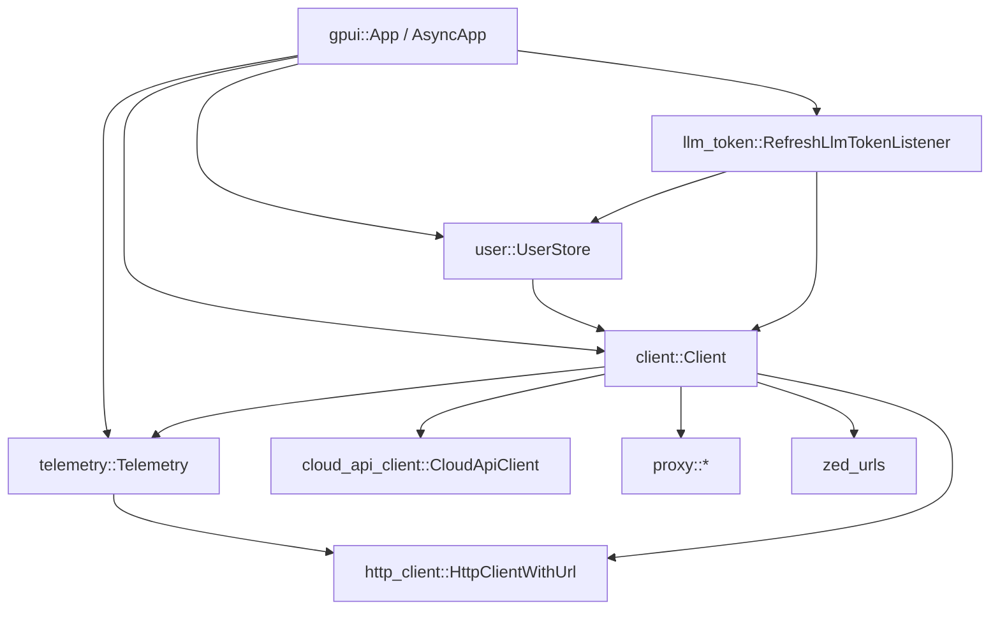
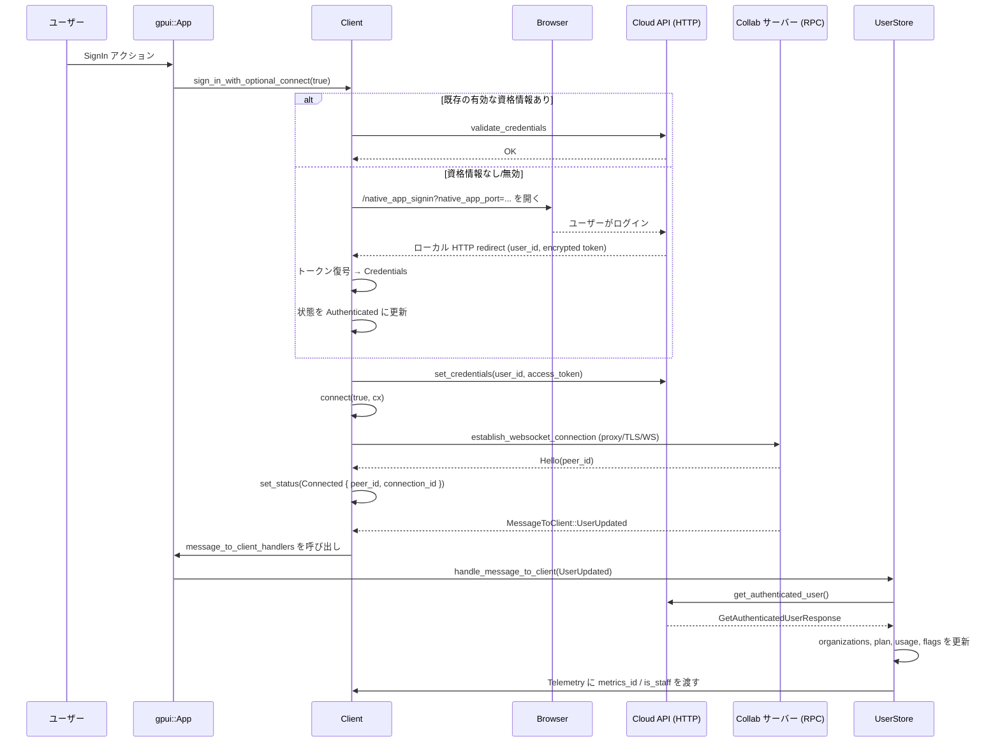

# client/ (ディレクトリ)

## 1. ざっくり一言

`client` クレートは、Zed の GUI クライアント側で

- Zed Cloud への認証・RPC 接続
- ユーザー情報・組織・プラン・コンタクト管理
- テレメトリ収集と送信
- LLM 用トークン管理
- HTTP/SOCKS プロキシ経由の接続
- Zed 固有 URL の生成・パース

をまとめて扱うためのモジュール群です。

---

## 2. このモジュールの役割

### 2.1 概要

このディレクトリは、Zed アプリケーションの「クラウドクライアント」として振る舞うコードを提供します。

- `Client` 構造体を中心に、Zed Cloud への認証・WebSocket 接続と RPC メッセージ処理を行います。
- `UserStore` がユーザー・組織・連絡先・利用プランなどの状態を管理します。
- `Telemetry` がテレメトリイベントをバッファし、ログファイルへの記録とサーバーへの送信を行います。
- `llm_token`・`proxy`・`zed_urls` などのサブモジュールが、LLM トークン・プロキシ・各種 URL などの補助機能を提供します。

### 2.2 アーキテクチャ内での位置づけ

ディレクトリ内の主なモジュール間の依存関係は次のようになっています。



- `Client` は HTTP クライアントと RPC 用 `Peer` を内部に持ち、その他のモジュールからは「クラウドとの窓口」として使用されます。
- `UserStore` と `RefreshLlmTokenListener` は `Client` に弱参照でぶら下がり、ユーザー更新イベントなどを処理します。
- `Telemetry` は `Client::new` の中で初期化され、ユーザーのサインイン状態と紐づいたメトリクスを送信します。
- `proxy` モジュールは `Client::establish_websocket_connection` の内部でのみ使用されます。

### 2.3 設計上のポイント

コードから読み取れる設計上の特徴は次のとおりです。

- **責務分割**
  - `Client` は「認証 + WebSocket 接続 + RPC メッセージ送受信」の中核を担当します。
  - `UserStore` はユーザー状態（ユーザー情報、組織、プラン、コンタクト）とそれに付随する RPC を担当します。
  - `Telemetry` はイベントバッファリング／ログ／HTTP 送信を担当し、個別機能からは `telemetry::event!` マクロ経由で呼ばれます。
  - `llm_token` は LLM API トークンの取得・更新と、そのトリガーとなるイベントを横断的に扱います。
  - `proxy` は HTTP/SOCKS プロキシごとの接続処理を隠蔽します。

- **状態管理**
  - `ClientState` や `TelemetryState` は `parking_lot::Mutex` / `RwLock` で保護され、状態は `watch::Receiver` 経由で購読可能になっています。
  - `UserStore` は内部に多数のコレクション（ユーザー、コンタクト、組織など）を保持し、gpui の `Context` を通じて UI と同期します。

- **非同期とスレッドモデル**
  - UI スレッド側では `gpui::App` / `Context` を用い、バックグラウンド処理は `AsyncApp` / `BackgroundExecutor` / `Task` 経由で実行されます。
  - RPC メッセージ処理や再接続処理は、ほぼすべてバックグラウンドタスクとして実行されます。

- **RAII によるサブスクリプション管理**
  - RPC メッセージハンドラやエンティティサブスクリプションは `Subscription` の Drop 実装で解除されます。

- **環境変数と設定**
  - `Settings`（`ClientSettings`, `ProxySettings`, `TelemetrySettings`）で設定ファイルを扱いつつ、 `ZED_SERVER_URL` や `ZED_RPC_URL` などの環境変数で上書き可能になっています。

---

## 3. 主要な機能一覧

このディレクトリが提供する主な機能は次のとおりです。

- Zed Cloud へのサインインフロー（ローカル HTTP コールバック付きブラウザログイン／管理者インパーソネート）
- Cloud との WebSocket（async-tungstenite）接続確立と再接続制御
- 型安全な RPC メッセージ送受信、およびエンティティ単位のメッセージハンドリング
- 認証済みユーザー／組織／プラン／コンタクト一覧の管理 (`UserStore`)
- Edit Prediction などの利用量／制限（UsageLimit）の保持とヘッダからの復元
- LLM API トークンの取得・更新・再取得、および Cloud 側イベントに応じた自動リフレッシュ
- テレメトリイベントのバッファリング・ログファイル書き出し・HTTP 経由送信
- 編集イベントの時間帯別集約（`EventCoalescer`）と「Editor Edited」イベント生成
- HTTP / HTTPS / SOCKS4 / SOCKS5 / SOCKS4a / SOCKS5h プロキシ経由での RPC 接続
- Zed サーバー URL から各種 Web ページへのリンク生成 (`zed_urls`)
- `zed://` スキームや `https://zed.dev/channel/...` などを表す `ZedLink` のパース

---

## 4. 関数・構造体の解説

### 4.1 主な型一覧

| 名前 | 種別 | 定義ファイル | 役割 / 用途 |
|------|------|--------------|-------------|
| `Client` | 構造体 | `src/client.rs` | Zed Cloud への認証・RPC・WebSocket 接続をまとめて扱うクライアント本体です。 |
| `Status` | 列挙体 | `src/client.rs` | クライアントの認証・接続状態（`SignedOut`, `Connecting`, `Connected`, `Reconnecting` など）を表します。 |
| `ClientState` | 構造体 | `src/client.rs` | `Client` 内部の認証情報・状態ウォッチャ・再接続タスクを保持します。 |
| `Credentials` | 構造体 | `src/client.rs` | `user_id` と `access_token` を持つ認証情報です。HTTP Authorization ヘッダ文字列も生成します。 |
| `ClientCredentialsProvider` | 構造体 | `src/client.rs` | OS キーチェーンなどの永続ストレージをラップし、`Credentials` の読み書き・削除を行います。 |
| `UserStore` | 構造体 | `src/user.rs` | 認証済みユーザー・組織・プラン・コンタクト・参加者インデックスなどの状態を管理します。 |
| `Contact` | 構造体 | `src/user.rs` | 1 人のユーザーと、そのオンライン／ビジー状態を表します。 |
| `Collaborator` | 構造体 | `src/user.rs` | コラボレーションセッションの参加者（`peer_id`, `replica_id`, `user_id` など）を表します。 |
| `Telemetry` | 構造体 | `src/telemetry.rs` | テレメトリ設定・イベントキュー・ログファイル・HTTP クライアントを保持し、イベント送信を行います。 |
| `EventCoalescer` | 構造体 | `src/telemetry/event_coalescer.rs` | 編集イベントを環境ごとに時間帯でまとめ、1 つの期間として集約します。 |
| `RefreshLlmTokenListener` | 構造体 | `src/llm_token.rs` | `MessageToClient::UserUpdated` や組織変更をトリガーに LLM トークンを更新するリスナです。 |
| `HttpProxyType` | 列挙体 | `src/proxy/http_proxy.rs` | HTTP/HTTPS プロキシと、その Basic 認証情報を表します。 |
| `SocksVersion` | 列挙体 | `src/proxy/socks_proxy.rs` | SOCKS4/5 のバージョン・DNS 解決方法・認証情報を表します。 |
| `Subscription` | 列挙体 | `src/client.rs` | RPC メッセージまたはエンティティサブスクリプションを表し、`Drop` で自動解除されます。 |
| `ZedLink` | 列挙体 | `src/client.rs` | `zed://` や `zed.dev` のリンクを `Channel` / `ChannelNotes` にパースした結果を表します。 |

### 4.2 重要な関数・メソッド（7 件）

#### 4.2.1 `Client::new(clock: Arc<dyn SystemClock>, http: Arc<HttpClientWithUrl>, cx: &mut App) -> Arc<Client>`

**概要**

- 汎用の時計と HTTP クライアントを受け取り、`Client` 本体と `Telemetry`, `CloudApiClient` などを初期化するコンストラクタです。
- `SettingsStore` やフラグの監視などは `Telemetry::new` の内部で設定されます。

**引数**

| 引数名 | 型 | 説明 |
|--------|----|------|
| `clock` | `Arc<dyn SystemClock>` | テレメトリ等で使用するシステム時計の実装です（実機用・テスト用を差し替え可能）。 |
| `http` | `Arc<HttpClientWithUrl>` | サーバー URL やプロキシ情報を含む HTTP クライアントです。 |
| `cx` | `&mut App` | gpui のアプリケーションコンテキストで、グローバルやタスクの登録に使用します。 |

**戻り値**

- `Arc<Client>` — 共有ポインタで包まれた `Client` インスタンスです。

**内部処理の流れ**

1. `id` を `AtomicU64` の 0 で初期化し、`Peer::new(0)` で RPC 用 `Peer` を作成します。
2. `Telemetry::new(clock, http.clone(), cx)` を呼び出してテレメトリを初期化します。
3. `CloudApiClient::new(http.clone())` で REST 用クライアントを生成します。
4. `ClientCredentialsProvider::new(cx)` により、グローバルな資格情報プロバイダを取得します。
5. 状態 (`ClientState`)・ハンドラセット (`ProtoMessageHandlerSet`)・メッセージハンドラ配列・サインアウトチャネルなどを `Default` で初期化します。
6. （テスト時のみ）認証や接続を差し替えるためのクロージャフィールドを初期化します。

**Examples（使用例）**

アプリ起動時に `Client` を作成してグローバルに登録する例です。

```rust
use std::sync::Arc;
use client::Client;
use gpui::{App, AppContext as _};

fn init_app(cx: &mut App) {
    // 実運用向けのクライアントを生成する場合は `production` を使うのが簡単です。
    let client: Arc<Client> = Client::production(cx);

    // 他のコードから `Client::global(cx)` で参照できるようグローバルに登録します。
    Client::set_global(client.clone(), cx);

    // SignIn/SignOut/Reconnect アクションにハンドラを紐付けます。
    client::init(&client, cx);
}
```

**使用上の注意点**

- `Client::new` 自体は接続を開始しません。サインインや接続は `sign_in` や `connect` メソッドで行います。
- `Client::production` は `SettingsStore` に登録された `ClientSettings`（`server_url`）を利用するため、事前に設定ストアがグローバルに登録されている必要があります。

---

#### 4.2.2 `Client::sign_in(self: &Arc<Self>, try_provider: bool, cx: &AsyncApp) -> Result<Credentials>`

**概要**

- 現在の状態・保存済み資格情報・外部プロバイダを順番に試しながら、ユーザーをサインインさせます。
- 必要に応じてブラウザベースのログインフロー（`authenticate_with_browser`）を開始します。
- 成功すると `Client` 内部に資格情報が保存され、`Status` が `Authenticated` / `Reauthenticated` に遷移します。

**引数**

| 引数名 | 型 | 説明 |
|--------|----|------|
| `try_provider` | `bool` | 永続化された資格情報（`ClientCredentialsProvider`）を試すかどうか。 |
| `cx` | `&AsyncApp` | 非同期コンテキスト。バックグラウンドタスクや UI 更新に使用されます。 |

**戻り値**

- `Result<Credentials>` — サインインに成功した場合の資格情報。失敗時は `anyhow::Error` です。

**内部処理の流れ**

1. 現在の `Status` に応じて、`Authenticating` または `Reauthenticating` に遷移します。
2. `ClientState` 内の既存 `credentials` があれば、`cloud_client.validate_credentials` で検証します。
3. 有効な古い資格情報がない場合、`try_provider` が `true` なら `ClientCredentialsProvider::read_credentials` で OS ストアなどから読み出し、再度検証します。
   - 無効な場合は `delete_credentials` で削除します。
4. ここまでで資格情報が得られなければ、`authenticate(cx)` を呼び出してブラウザログイン等を開始します。
   - 認証中にステータスが変化してキャンセルされた場合は `"authentication canceled"` エラーになります。
5. 得られた `Credentials` を `Client` に保存し、`CloudApiClient::set_credentials` を呼び出します。
6. 状態を `Authenticated` もしくは `Reauthenticated` に設定して終了します。

**Errors / Panics**

- Cloud API との通信エラーや無効な資格情報などがあると `Err(anyhow::Error)` になります。
- `validate_credentials` の中でエラーが起きた場合、`Status::AuthenticationError` に遷移します。

**Edge cases（エッジケース）**

- `IMPERSONATE_LOGIN` が設定されている場合、`ClientCredentialsProvider::read_credentials` は常に `None` を返すため、必ず新規認証フローに入ります。
- 認証待ち中に他の処理で `Status` が変化すると、`authentication canceled` で失敗する可能性があります。

**使用上の注意点**

- UI スレッドから直接呼ぶのではなく、`AsyncApp` 上のタスク内で `await` する必要があります。
- すでに有効な資格情報がある場合はブラウザログインは行われないため、「必ずログイン画面を表示したい」場合は周辺ロジックで制御する必要があります。

---

#### 4.2.3 `Client::connect(self: &Arc<Self>, try_provider: bool, cx: &AsyncApp) -> ConnectionResult<()>`

**概要**

- サインインを行った上で、Zed のコラボレーションサーバーとの RPC 接続（WebSocket）を確立します。
- 接続状態に応じて `Status` を `Connecting` / `Reconnecting` などに遷移させます。
- タイムアウトや接続リセットなどを `ConnectionResult` で表します。

**引数**

| 引数名 | 型 | 説明 |
|--------|----|------|
| `try_provider` | `bool` | `sign_in` 同様、資格情報プロバイダを試すかどうか。 |
| `cx` | `&AsyncApp` | 非同期コンテキスト。タイマーやバックグラウンドタスクに使用します。 |

**戻り値**

- `ConnectionResult<()>` — 次の 3 パターンがあります（`util` クレートの型）。
  - `ConnectionResult::Result(Ok(()))` — 接続成功または既に接続済み。
  - `ConnectionResult::Result(Err(e))` — 認証失敗・アップグレード要求などのアプリケーションエラー。
  - `ConnectionResult::Timeout` / `ConnectionResult::ConnectionReset` — タイムアウト／接続リセットなど。

**内部処理の流れ**

1. 現在の `Status` を見て、「まだ接続していないかどうか」「再接続中かどうか」を判定します。
   - `Connected` / `Connecting` / `Reconnecting` の場合は何もせず `Ok(())` を返します。
   - `UpgradeRequired` の場合は即座にエラーを返します。
2. `sign_in(try_provider, cx).await` で資格情報を取得します。
3. 直前が `SignedOut` / `Authenticated` なら `Status::Connecting`、それ以外は `Status::Reconnecting` に遷移します。
4. `connect_with_credentials(credentials, cx).await` を呼び出し、`establish_connection` → `set_connection` までを実行します。
5. `establish_connection` では `CONNECTION_TIMEOUT` を用いたタイムアウト監視が行われ、結果に応じて `Status` が `ConnectionError` / `UpgradeRequired` などに設定されます。

**Examples（使用例）**

接続を開始し、結果に応じてログを出す簡単な例です。

```rust
use client::Client;
use gpui::{App, AsyncApp, AppContext as _};
use util::ConnectionResult;

fn connect_on_startup(cx: &mut App) {
    let client = Client::global(cx).clone(); // 事前に set_global 済みを想定

    cx.spawn(async move |cx_async: AsyncApp| {
        match client.connect(true, &cx_async).await {
            ConnectionResult::Result(Ok(())) => {
                log::info!("connected to collab server");
            }
            ConnectionResult::Timeout => {
                log::warn!("connection timed out");
            }
            ConnectionResult::ConnectionReset => {
                log::warn!("connection reset");
            }
            ConnectionResult::Result(Err(err)) => {
                log::error!("failed to connect: {err:#}");
            }
        }
    }).detach();
}
```

**使用上の注意点**

- `connect` は `sign_in` を内部で呼び出します。事前にサインインだけ行いたい場合は `sign_in` を直接使います。
- `Status` による再接続ロジック（`Status::ConnectionLost` → 自動再接続）は `set_status` 内で扱われます。外側で独自の再接続ループを書く場合は状態遷移の仕様に注意が必要です。

---

#### 4.2.4 `Client::request<T: RequestMessage>(&self, request: T) -> impl Future<Output = Result<T::Response>>`

**概要**

- 型付きの RPC リクエストを送り、対応するレスポンス型 (`T::Response`) を返す高レベル API です。
- メッセージのエンベロープ管理やメッセージ ID の対応付けは内部の `Peer` が行います。

**引数**

| 引数名 | 型 | 説明 |
|--------|----|------|
| `request` | `T` (`T: RequestMessage`) | protobuf 生成コードにより定義された RPC リクエストメッセージ。 |

**戻り値**

- `Future<Output = Result<T::Response>>` — 成功時にレスポンスメッセージ、エラー時に `anyhow::Error`。

**内部処理の流れ**

1. ログとして `"rpc request start"` を出力します（`client_id` とメッセージ名つき）。
2. 現在の接続 ID を `connection_id()` で取得します。
   - 未接続の場合はここでエラーになります。
3. `self.peer.request_envelope(conn_id, request)` を呼び出し、レスポンスの `TypedEnvelope` を待ちます。
4. レスポンス取得後、ログに `"rpc request finish"` を出力し、`envelope.payload` を返します。

**Examples（使用例）**

サーバーからユーザー情報を取得する RPC を呼び出す例です
（`proto::GetUsers` / `proto::UsersResponse` はこのクレート外で定義されています）。

```rust
use client::Client;
use client::proto;
use gpui::{AsyncApp, App, AppContext as _};
use anyhow::Result;

async fn fetch_users(app: &App) -> Result<Vec<proto::User>> {
    let client = Client::global(app);

    // 事前に client.connect(...) が成功している前提
    let response: proto::UsersResponse = client
        .request(proto::GetUsers { user_ids: vec![1, 2, 3] })
        .await?;

    Ok(response.users)
}
```

**Edge cases（エッジケース）**

- 接続が確立されていない状態で呼び出すと、`connection_id()` 内で `"not connected"` エラーになります。
- ハンドラ側で `Err` を返した場合、`respond_to_request` によりエラーオブジェクトが proto 化されてレスポンスとして返され、こちら側でも `Err` になります。

**使用上の注意点**

- `RequestMessage` は `rpc` クレート（`proto` モジュール）で定義された型である必要があります。
- ストリーミングレスポンスが必要な場合は `request_stream` を使用します。

---

#### 4.2.5 `Telemetry::log_edit_event(self: &Arc<Self>, environment: &'static str, is_via_ssh: bool)`

**概要**

- 編集操作を「ある環境での連続した編集期間」として集約し、一定間隔ごとに `"Editor Edited"` テレメトリイベントを送信するための入力関数です。
- 個々のキー入力などを直接送るのではなく、`EventCoalescer` によって期間と環境をまとめます。

**引数**

| 引数名 | 型 | 説明 |
|--------|----|------|
| `environment` | `&'static str` | 編集環境名（例: `"local"`, `"ssh"`, `"codespace"` など）。 |
| `is_via_ssh` | `bool` | SSH 経由のセッションかどうかを示します。 |

**戻り値**

- なし（`()`）。必要であれば内部で `telemetry::event!` を発行します。

**内部処理の流れ**

1. 静的な `LAST_EVENT_TIME: Mutex<Option<Instant>>` を確認し、最後に `"Editor Edited"` を送ってから 10 分以内であれば何もせず終了します。
2. `TelemetryState` の `event_coalescer.log_event(environment)` を呼び出し、現在の期間に追加するか、前の期間を締めて新しい期間を開始するかを決定します。
3. `log_event` が `Some((start, end, environment))` を返した場合、以下を計算して `"Editor Edited"` イベントを送ります。
   - `duration = min(end - start, 24時間).as_millis()` を `i64` としてイベントに含める。
   - `environment`, `is_via_ssh` もイベントプロパティとして付加する。

**Examples（使用例）**

エディタのテキスト変更時に呼ぶことを想定した使い方のイメージです。

```rust
use client::Client;
use gpui::App;

fn on_text_changed(cx: &App, is_via_ssh: bool) {
    // グローバル Client から Telemetry を取得
    let client = Client::global(cx);
    let telemetry = client.telemetry();

    // 単純な例として、常に "local" 環境として記録
    telemetry.log_edit_event("local", is_via_ssh);
}
```

**使用上の注意点**

- `log_edit_event` 自体は頻繁に呼び出されても構いませんが、内部で 10 分のしきい値があるため、実際の `"Editor Edited"` イベントは最大でも 10 分に 1 回程度しか送信されません。
- `environment` 文字列は `EventCoalescer` の集約単位となるため、同じ環境を示す文字列はできるだけ統一しておく必要があります。

---

#### 4.2.6 `UserStore::new(client: Arc<Client>, cx: &Context<Self>) -> Self`

**概要**

- `UserStore` のインスタンスを作成し、`Client` と連携する非同期タスク（コンタクト更新・現在ユーザー監視・サインアウト処理）をセットアップします。
- `gpui` の `Entity<UserStore>` として作られることを前提に設計されています。

**引数**

| 引数名 | 型 | 説明 |
|--------|----|------|
| `client` | `Arc<Client>` | クラウド API や RPC を利用するための `Client` インスタンス。 |
| `cx` | `&Context<Self>` | `UserStore` エンティティのコンテキスト。タスク生成やイベント発行に使用します。 |

**戻り値**

- 初期化された `UserStore` 構造体。通常は `cx.new(|cx| UserStore::new(client, cx))` で `Entity<UserStore>` として作成されます。

**内部処理の流れ（主なもの）**

1. `watch::channel` で `current_user` の送受信チャネルを作成します。
2. `mpsc::unbounded` でサインアウト用・コンタクト更新用のチャネルを作成します。
3. `Client::add_message_handler` を使って、RPC メッセージ `UpdateContacts` / `ShowContacts` をこの `UserStore` にルーティングするハンドラを登録します。
4. `client.sign_out_tx` にサインアウト用の送信側チャネルを格納します（`Client::request_sign_out` から利用されます）。
5. `client.add_message_to_client_handler` で Cloud 側の `MessageToClient::UserUpdated` を処理するハンドラを登録します。
6. 非同期タスクを 3 つ生成します。
   - `_maintain_contacts`: `update_contacts_rx` からの入力を処理し、コンタクト一覧を更新。
   - `_maintain_current_user`: `Client::status()` を監視し、サインイン／サインアウトに応じて `GetAuthenticatedUser` を呼び出し、各種情報を更新。
   - `_handle_sign_out`: `Client::request_sign_out` からの通知を受けて `Client::sign_out` を呼び出す。

**Examples（使用例）**

アプリ起動時に `UserStore` を作成し、`Client` と連携させる例です。

```rust
use std::sync::Arc;
use client::{Client, user::UserStore};
use gpui::{App, AppContext as _, Context, Entity};

fn init_user_store(cx: &mut App) -> Entity<UserStore> {
    let client = Client::global(cx); // 事前に set_global 済みを想定

    // UserStore エンティティの生成
    let user_store = cx.new(|cx: &mut Context<UserStore>| {
        UserStore::new(client.clone(), cx)
    });

    user_store
}
```

**使用上の注意点**

- `UserStore::new` は RPC メッセージハンドラを登録するため、同一 `Client` に対して複数の `UserStore` を作成するとメッセージ処理が複雑になります（コード上は防いでいません）。
- `UserStore` は内部で `client.sign_out_tx` を上書きするため、他のコードが同じフィールドを使っている場合は上書きに注意が必要です。

---

#### 4.2.7 `connect_proxy_stream(proxy: &Url, rpc_host: (&str, u16)) -> Result<Box<dyn AsyncReadWrite>>`

定義: `src/proxy.rs`

**概要**

- `http://...` / `https://...` / `socks4://...` / `socks5://...` などの URL で指定されたプロキシに TCP 接続し、その上で HTTP CONNECT もしくは SOCKS ハンドシェイクを行って、RPC サーバーへのトンネルを確立します。
- `Client::establish_websocket_connection` 内で使用されます。

**引数**

| 引数名 | 型 | 説明 |
|--------|----|------|
| `proxy` | `&Url` | プロキシサーバーの URL。スキーム・ホスト・ポート・認証情報などを含みます。 |
| `rpc_host` | `(&str, u16)` | 接続先 RPC サーバーのホスト名とポート番号です。 |

**戻り値**

- `Result<Box<dyn AsyncReadWrite>>` — プロキシとのトンネル接続を表すストリーム。`AsyncRead`/`AsyncWrite` を実装しており、以降はこれを TLS + WebSocket にラップします。

**内部処理の流れ**

1. `parse_proxy_type(proxy)` により、URL スキームを見て `ProxyType::SocksProxy` または `ProxyType::HttpProxy` に分類します。
   - サポートされないスキームの場合は `None` になりエラーを返します。
2. `(proxy_domain, proxy_port)` を元に `TcpStream::connect` でプロキシサーバーへ TCP 接続します。
3. プロキシ種別によって分岐します。
   - `ProxyType::SocksProxy` の場合: `connect_socks_proxy_stream(stream, socks_version, rpc_host)` を呼び出します。
   - `ProxyType::HttpProxy` の場合: `connect_http_proxy_stream(stream, http_proxy_type, rpc_host, &proxy_domain)` を呼び出します。
4. いずれかの関数が `Box<dyn AsyncReadWrite>` を返し、それをそのまま返します。

**Edge cases（エッジケース）**

- プロキシ URL のパースに失敗した場合、コメントにもある通り **「直接接続へのフォールバックは行わずエラーにする」** 挙動になっています。
- HTTP プロキシの場合、`CONNECT` 要求へのレスポンスコードが 200 以外だとエラーになります。
- SOCKS プロキシの場合、スキームによって DNS 解決の場所が変わります。
  - `socks4://` / `socks5://` → ローカル DNS（必要なら `lookup_host`）を行います。
  - `socks4a://` / `socks5h://` → リモート DNS（プロキシ側で名前解決）を行います。

**使用上の注意点**

- この関数はプロキシを前提としているため、「プロキシが設定されていない場合」に直接呼び出すのではなく、呼び出し元で `proxy: Option<Url>` を確認して `None` のときは通常の `TcpStream::connect` を使う必要があります（`Client` はそのように実装されています）。
- 認証付きプロキシでは URL にユーザー名・パスワードを含める必要があります。

---

## 5. データフロー

ここでは、典型的な「ユーザーがサインインし、コラボレーションサーバーに接続してユーザー情報が更新される」フローを示します。

### 5.1 サインイン〜接続〜ユーザー情報更新の流れ



**要点**

- `Client::sign_in_with_optional_connect` はサインインと Cloud API の WebSocket 接続を行い、その後 `connect_with_credentials` をバックグラウンドで実行します（スタッフのみ Collab に自動接続）。
- `MessageToClient::UserUpdated` は `Client` 経由で `UserStore` と `RefreshLlmTokenListener` に配送され、ユーザー情報や LLM トークンが更新されます。
- `UserStore::update_authenticated_user` の中で、`Telemetry` に `metrics_id` と `is_staff` が渡され、以降のテレメトリに反映されます。

---

## 6. 使い方（How to Use）

### 6.1 基本的な使用方法

#### 6.1.1 クライアントとユーザー周りの初期化

アプリ起動時に `Client`・`UserStore`・LLM トークンリスナーをセットアップする典型的なコードフローです。

```rust
use std::sync::Arc;
use client::{
    Client,
    init as init_client_actions,
    user::UserStore,
    llm_token::RefreshLlmTokenListener,
};
use gpui::{App, AppContext as _, Context, Entity};

fn init_app(cx: &mut App) {
    // 1. クライアント本体を生成（サーバー URL やプロキシは Settings から取得）
    let client: Arc<Client> = Client::production(cx);

    // 2. グローバルに登録しておくと、他のコードから Client::global(cx) で参照可能
    Client::set_global(client.clone(), cx);

    // 3. SignIn / SignOut / Reconnect アクションにハンドラを紐付け
    init_client_actions(&client, cx);

    // 4. UserStore をエンティティとして作成（ユーザー情報・コンタクト管理）
    let user_store: Entity<UserStore> = cx.new(|cx: &mut Context<UserStore>| {
        UserStore::new(client.clone(), cx)
    });

    // 5. LLM トークン自動更新リスナーを登録
    RefreshLlmTokenListener::register(client.clone(), user_store, cx);
}
```

#### 6.1.2 サインインと接続

UI から SignIn アクションを発行すれば、`init` で登録したハンドラ経由でサインインと接続が行われます。

```rust
use client::SignIn;
use gpui::{App, AppContext as _};

fn user_clicked_sign_in(cx: &mut App) {
    // SignIn アクションを発行すると、Client 側で sign_in_with_optional_connect が呼ばれます。
    cx.dispatch_action(SignIn);
}
```

### 6.2 よくある使用パターン

#### パターン A: RPC でサーバーから情報を取得する

```rust
use client::{Client, proto};
use gpui::{App, AppContext as _};
use anyhow::Result;

async fn load_contacts(cx: &App) -> Result<Vec<proto::Contact>> {
    let client = Client::global(cx);

    // 事前に connect 済みであることが前提
    let response: proto::UsersResponse = client
        .request(proto::GetUsers { user_ids: vec![] })
        .await?;

    Ok(response.users)
}
```

#### パターン B: HTTP レスポンスを見て LLM トークンをリフレッシュする

```rust
use client::{Client, llm_token::NeedsLlmTokenRefresh};
use language_model::LlmApiToken;
use gpui::App;
use anyhow::Result;

async fn call_llm_api(cx: &App, token: &LlmApiToken) -> Result<()> {
    let client = Client::global(cx);
    let organization_id = None;

    // 1. 必要に応じて LLM トークンを取得
    let api_token = client.acquire_llm_token(token, organization_id).await?;

    // 2. そのトークンを使って HTTP リクエストを発行（詳細は http_client 側）
    let http = client.http_client();
    let url = http.build_zed_api_url("/llm/endpoint", &[])?;
    let mut req = http_client::Request::get(url.as_str()).body("".into())?;
    // Authorization ヘッダなどを付与（省略）

    let response = http.send(req).await?;

    // 3. レスポンスヘッダを見てトークン更新が必要かどうか判定
    if response.needs_llm_token_refresh() {
        client.refresh_llm_token(token, organization_id).await?;
    }

    Ok(())
}
```

#### パターン C: Zed 固有 URL の生成とパース

```rust
use client::{zed_urls, parse_zed_link, ZedLink};
use gpui::{App, AppContext as _};

fn open_account_page(cx: &mut App) {
    let url = zed_urls::account_url(cx); // server_url に応じた URL を生成
    cx.open_url(&url);
}

fn handle_link(cx: &App, url: &str) {
    if let Some(link) = parse_zed_link(url, cx) {
        match link {
            ZedLink::Channel { channel_id } => {
                // チャンネルを開く処理など
                log::info!("Open channel {channel_id}");
            }
            ZedLink::ChannelNotes { channel_id, heading } => {
                log::info!("Open channel {channel_id} notes, heading {:?}", heading);
            }
        }
    } else {
        // Zed で処理しないリンクはブラウザに回す
        cx.open_url(url);
    }
}
```

### 6.3 使用上の注意点（まとめ）

- **接続状態の前提**
  - `Client::send` / `request` / `request_stream` は、`Status::Connected` でないと `"not connected"` エラーになります。
  - 現在の状態は `Client::status()`（`watch::Receiver<Status>`）として購読できます。

- **UI スレッドと非同期スレッド**
  - `&App` / `&Context` を取る関数は UI スレッド専用、`&AsyncApp` や `BackgroundExecutor` を使う処理はバックグラウンド専用です。
  - `cx.update(...)` と `cx.spawn(...)` の境界を跨ぐときは、クロージャ内で所有権の扱いに注意が必要です。

- **サインアウトの経路**
  - `Client::request_sign_out` は非同期サインアウト要求を出すだけで、実際のサインアウト処理は `UserStore` 内の `_handle_sign_out` タスクが行います。
  - Unauthorized 応答など一部のケースでは、LLM トークン取得 API が自動的に `request_sign_out` を呼び出します。

- **プロキシ設定**
  - `ProxySettings` の `proxy_url()` は空白文字列を無視し、環境変数からの読み取りも行います。
  - プロキシ URL のスキームがサポートされていない場合、`connect_proxy_stream` はエラーを返し、**直接接続にはフォールバックしません**。

- **テレメトリ設定**
  - `TelemetrySettings` の `metrics` が `false` の場合、ほとんどのテレメトリイベントはサーバーに送信されません（`report_event` が即 return します）。
  - `ZED_CLIENT_CHECKSUM_SEED` が存在しないと、テレメトリのチェックサムヘッダは空文字列になります。

---

## 7. 関連ファイル

| パス | 役割 / 関係 |
|------|------------|
| `client/Cargo.toml` | クレート名・依存関係・ターゲット OS ごとの TLS 実装などの設定を定義します。 |
| `client/src/client.rs` | ライブラリ本体。`Client` 構造体、認証・WebSocket 接続・RPC メッセージ処理・`ZedLink` パーサを定義します。 |
| `client/src/user.rs` | `UserStore` と関連型（`User`, `Contact`, `Collaborator` 等）を定義し、ユーザー・組織・コンタクト・プラン情報の管理を行います。 |
| `client/src/telemetry.rs` | `Telemetry` 構造体とテレメトリ送信ロジック（イベントバッファ、ログファイル、HTTP POST）を提供します。 |
| `client/src/telemetry/event_coalescer.rs` | 編集イベントの時間帯集約を行う `EventCoalescer` を定義します。 |
| `client/src/llm_token.rs` | LLM トークンの自動更新リスナー `RefreshLlmTokenListener` と `NeedsLlmTokenRefresh` トレイトを定義します。 |
| `client/src/proxy.rs` | プロキシ共通インターフェースと `connect_proxy_stream` を定義します。 |
| `client/src/proxy/http_proxy.rs` | HTTP/HTTPS プロキシへの接続処理と、Basic 認証付き HTTP CONNECT を実装します。 |
| `client/src/proxy/socks_proxy.rs` | SOCKS4/5 プロキシへの接続処理と、ローカル／リモート DNS の切り替えを実装します。 |
| `client/src/zed_urls.rs` | `server_url` に応じた各種 Zed 関連ページ URL を生成するヘルパー関数群を提供します。 |
| `client/src/test.rs` | テスト用の `FakeServer` やヘルパー関数（`parse_authorization_header` など）を提供し、`Client`／`UserStore` の挙動を検証するために使われます。 |

以上が、このディレクトリに含まれるコードの構造と主な機能の整理です。
