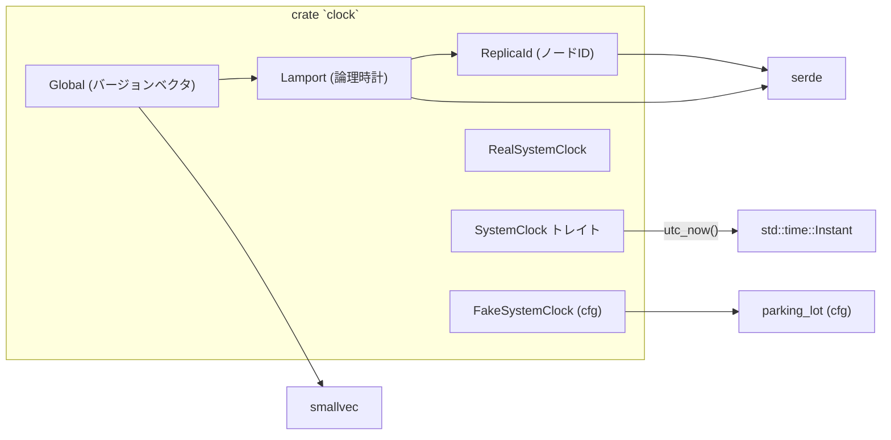
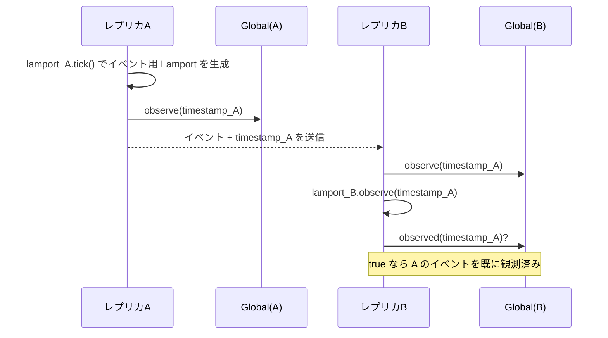

# clock/ コード解説

## 1. ざっくり一言

`clock` クレートは、

- 分散ノード間の因果関係を表す **Lamport タイムスタンプ** と **バージョンベクタ（バージョンクロック）**
- 実時間の取得を抽象化する **SystemClock トレイトと実装**

を提供するモジュールです。

---

## 2. このモジュールの役割

### 2.1 概要

このクレートは、分散編集や同期処理などで必要となる **「イベントの順序」や「どこまで同期できているか」** を表現するための時計機構を提供します。

- `ReplicaId` / `Lamport` / `Global` によって、論理時計・バージョンベクタを実装します。
- `SystemClock` トレイトとその実装によって、実時間（正確には `Instant` ベースの単調時計）を依存性注入しやすい形で扱えるようにします。
- `FakeSystemClock` により、テストで時間を制御可能にします（`test` または `test-support` フィーチャ時のみ）。

### 2.2 アーキテクチャ内での位置づけ

`src/clock.rs` がクレートのルートで、Lamport/Global と `system_clock` モジュールを束ねています。  
依存関係を簡略化して図示すると次のようになります。



- `clock/src/clock.rs` は `mod system_clock;` と `pub use system_clock::*;` により、`SystemClock` 関連型をクレートのトップレベル API として再公開しています。
- `SmallVec<[u32; 4]>` により、少数のレプリカ ID を効率的に扱うベクタクロックを実装します。
- `FakeSystemClock` はテストまたは `test-support` フィーチャ有効時のみコンパイルされ、`parking_lot::Mutex` を使用します。

### 2.3 設計上のポイント

- **論理時計と物理時計を分離**
  - Lamport / Global は論理的なイベント順序のみを扱い、実時間は `SystemClock` トレイトで分離されています。
- **レプリカ ID の簡潔な表現**
  - `ReplicaId` は `u16` のラッパーで、いくつかのよく使う ID（ローカル、リモートサーバ、エージェントなど）を定数で定義しています。
- **ベクタクロックの軽量実装**
  - `Global` は `SmallVec<[u32; 4]>` を利用し、少数のレプリカ ID の場合はアロケーションなしで保持できます。
  - `Clone` を手書き実装して、`SmallVec` の複製オーバーヘッドを減らしています。
- **テスト容易性**
  - `SystemClock` トレイトにより時間取得を抽象化し、`FakeSystemClock` でテスト時に時間を人工的に進められるようになっています。
- **シリアライズ対応**
  - `ReplicaId` と `Lamport` は `serde::{Serialize, Deserialize}` を derive しており、ネットワーク送受信や永続化に利用できます。

---

## 3. 主要な機能一覧

- `ReplicaId`: 各分散ノード（レプリカ）を一意に識別する ID 型。いくつかの代表的な ID を定数で提供。
- `Lamport`: Lamport タイムスタンプ（シーケンス番号 + レプリカ ID）を表す型。`tick` や `observe` で論理時刻を進める。
- `Global`: 複数レプリカの Lamport シーケンスをまとめた **バージョンベクタ**。`observe` / `join` / `meet` / `observed_*` などで因果関係や進捗を判定。
- `SystemClock` トレイト: 現在時刻（`Instant`）を取得するための抽象インターフェース。
- `RealSystemClock`: 実際のシステム時間（`Instant::now()`）を返す `SystemClock` 実装。
- `FakeSystemClock`（テスト・`test-support` 用）: `set_now` / `advance` により任意に進められるテスト用の `SystemClock` 実装。

---

## 4. 関数・構造体の解説

### 4.1 主な型一覧

| 型名 | 種別 | 定義場所 | 役割 / 用途 |
|------|------|----------|-------------|
| `ReplicaId` | 構造体（`u16` のラッパー） | `src/clock.rs` | 各レプリカ（ノード）を識別する ID。いくつかの予約 ID を定数で定義。 |
| `Lamport` | 構造体 | `src/clock.rs` | Lamport 論理時計（シーケンス番号 + レプリカ ID）。イベントの因果順序付けに使用。 |
| `Global` | 構造体 | `src/clock.rs` | バージョンベクタ（各レプリカごとの Lamport シーケンスの集合）。同期状況・因果関係の判定に利用。 |
| `SystemClock` | トレイト | `src/system_clock.rs` | 現在時刻を返す抽象インターフェース。`Send + Sync` 制約付き。 |
| `RealSystemClock` | 構造体 | `src/system_clock.rs` | `SystemClock` の実装。`Instant::now()` をそのまま返す。 |
| `FakeSystemClockState` | 構造体 | `src/system_clock.rs`（cfg） | `FakeSystemClock` が内部状態として持つ `Instant` を格納。 |
| `FakeSystemClock` | 構造体 | `src/system_clock.rs`（cfg） | テスト用の `SystemClock` 実装。内部の `Instant` をミューテックスで守り、任意に進められる。 |

---

### 4.2 `ReplicaId` の詳細

```rust
#[derive(Clone, Copy, Default, Eq, Hash, PartialEq, Ord, PartialOrd, Serialize, Deserialize)]
pub struct ReplicaId(u16);
```

**主な定数**

- `ReplicaId::LOCAL`: ローカルレプリカ（ID = 0）
- `ReplicaId::REMOTE_SERVER`: 接続先のリモートサーバ（ID = 1）
- `ReplicaId::AGENT`: エージェントなど別種のコンポーネント（ID = 2）
- `ReplicaId::LOCAL_BRANCH`: ローカルブランチ（ID = 3）
- `ReplicaId::FIRST_COLLAB_ID`: コラボ用レプリカの最初の ID（ID = 8）。これ以上の ID は「共同編集系のレプリカ」とみなされます。

**メソッド**

- `ReplicaId::new(id: u16) -> Self`  
  任意の `u16` から ID を生成します。予約 ID と衝突しうるため、設計側で管理が必要です。
- `as_u16(&self) -> u16`  
  内部の数値をそのまま返します。
- `is_remote(self) -> bool`  
  `REMOTE_SERVER` または `FIRST_COLLAB_ID` 以上の ID を「リモート」と判定します。

**Debug 表示**

- `LOCAL` → `<local>`
- `REMOTE_SERVER` → `<remote>`
- `AGENT` → `<agent>`
- `LOCAL_BRANCH` → `<branch>`
- 上記以外 → 数値 (`"42"` など)

**使用例**

```rust
use clock::ReplicaId;

fn main() {
    let local = ReplicaId::LOCAL;                    // ローカルレプリカ ID（0）
    let remote = ReplicaId::new(10);                 // 任意のレプリカ ID（例: 10）

    println!("{:?} is_remote = {}", local, local.is_remote());   // "<local> is_remote = false"
    println!("{:?} is_remote = {}", remote, remote.is_remote()); // "10 is_remote = true"
}
```

---

### 4.3 `Lamport` の詳細

```rust
#[derive(Clone, Copy, Eq, Hash, PartialEq, Serialize, Deserialize)]
pub struct Lamport {
    pub value: Seq,           // Seq は u32 の型エイリアス
    pub replica_id: ReplicaId,
}
```

**関連定数**

- `Lamport::MIN`  
  `value = 0`, `replica_id = ReplicaId(u16::MIN)` の最小値を表す特殊値です。
- `Lamport::MAX`  
  `value = u32::MAX`, `replica_id = ReplicaId(u16::MAX)` の最大値を表す特殊値です。

**順序付け**

```rust
impl Ord for Lamport {
    fn cmp(&self, other: &Self) -> Ordering {
        self.value
            .cmp(&other.value)
            .then_with(|| self.replica_id.cmp(&other.replica_id))
    }
}
```

- まず `value`（シーケンス番号）で比較し、同値の場合は `replica_id` でブレイクタイ（決定的な順序）を付けます。
- そのため、異なるレプリカで同じ `value` を持つ並行イベントも、`Ord` としては全順序に並べ替え可能です。

**メソッド**

- `Lamport::new(replica_id: ReplicaId) -> Self`  
  指定レプリカ用の Lamport 時計を初期化します（`value = 1` から開始）。
- `as_u64(self) -> u64`  
  `value` を上位 32bit、`replica_id` を下位 16bit に詰めた `u64` を返します。  
  ソートやシリアライズに 1 値で扱いたい場合に便利です。
- `tick(&mut self) -> Self`  
  現在の Lamport 値を **返しつつ** 内部の `value` を 1 増やします。
  - 「イベントのタイムスタンプ」を取りたいときは、この戻り値を使います。
- `observe(&mut self, timestamp: Self)`  
  他レプリカから受信した Lamport 値を観測したときに呼び出します。
  - 内部 `value` は `max(self.value, timestamp.value) + 1` に更新されます。
  - Lamport 論理時計の標準的なルールに従っています。

**Debug 表示**

- `Lamport::MAX` → `Lamport {MAX}`
- `Lamport::MIN` → `Lamport {MIN}`
- それ以外 → `Lamport {<replica_debug>: value}` の形式  
  例: `Lamport {<local>: 42}`

**使用例（基本的な進め方）**

```rust
use clock::{Lamport, ReplicaId};

fn main() {
    // ローカルレプリカ用の Lamport 時計を作成する
    let replica_id = ReplicaId::LOCAL;                 // ローカルID
    let mut clock = Lamport::new(replica_id);          // value = 1 で開始

    // ローカルイベント1
    let ts1 = clock.tick();                            // ts1: value = 1, clock 内部 value = 2
    println!("{:?}", ts1);                             // 例: "Lamport {<local>: 1}"

    // ローカルイベント2
    let ts2 = clock.tick();                            // ts2: value = 2, clock 内部 value = 3

    // リモートから受信した Lamport を観測
    let remote_id = ReplicaId::new(10);
    let remote_ts = Lamport { value: 5, replica_id: remote_id };

    clock.observe(remote_ts);                          // clock.value = max(3, 5) + 1 = 6

    // 次のローカルイベント
    let ts3 = clock.tick();                            // ts3.value = 6, clock 内部 value = 7
    println!("{:?}", ts3);                             // リモートイベントより後の時刻になる
}
```

**エッジケース・注意点**

- `value` は `u32` なので、非常に多くの `tick` を行うとオーバーフローの可能性があります（標準的な Lamport 実装と同様の制約です）。
- `tick()` は「現在値を返してからインクリメントする」点が重要です。  
  あるイベントのタイムスタンプには `tick()` の戻り値を使い、`self` の内部値を直接使わないほうが安全です。

---

### 4.4 `Global`（バージョンベクタ）の詳細

```rust
#[derive(Default, Hash, Eq, PartialEq)]
pub struct Global {
    values: SmallVec<[u32; 4]>,
}
```

- `values[i]` は「`ReplicaId(i as u16)` の最新シーケンス番号」を表します。
- エントリが存在しないレプリカや値 0 は「まだ何も観測していない」という意味になります。

#### コンストラクタ・基本操作

- `Global::new() -> Self`  
  空のバージョンベクタを作成します（全レプリカで 0 とみなされます）。
- `get(&self, replica_id: ReplicaId) -> Seq`  
  指定レプリカのシーケンス番号を返します。  
  エントリが無い場合は `0` を返します。

```rust
use clock::{Global, Lamport, ReplicaId};

fn main() {
    let mut global = Global::new();                    // すべて未観測 (0)

    let local_id = ReplicaId::LOCAL;
    let ts = Lamport { value: 3, replica_id: local_id };

    global.observe(ts);                                // ローカルIDの値を 3 に更新
    assert_eq!(global.get(local_id), 3);               // 3 を返す
    assert_eq!(global.get(ReplicaId::new(5)), 0);      // 未観測なので 0
}
```

#### `observe(&mut self, timestamp: Lamport)`

**概要**

- 指定された Lamport タイムスタンプを観測し、そのレプリカの既知シーケンス番号を更新します。
- 既存の値との最大値をとるため、同じレプリカに対して `observe` を複数回行っても単調非減少になります。

**主な処理**

1. `timestamp.value > 0` の場合のみ処理します（0 は「未観測扱い」で無視）。
2. `replica_id` に対応するインデックスまで `values` を 0 で拡張します。
3. 現在の値と `timestamp.value` の大きい方で上書きします。

**エッジケース**

- `timestamp.value == 0` の場合は何も変化しません。
- 非デバッグビルドでは、`Lamport::MAX.replica_id` と同じ ID でも特にチェックは入りません（`debug_assert` のみ）。

#### `join(&mut self, other: &Self)`

**概要**

- 2 つのバージョンベクタの **上限（join）** をとります。
- それぞれのレプリカ ID について、`max(self[i], other[i])` を計算します。

**利用場面のイメージ**

- 2 つのノードから得た「どこまで見たか」の情報をマージして、どちらか一方でも見ているイベントはすべて「見た」と扱いたいとき。

```rust
let mut a = Global::new();
let mut b = Global::new();

// 例として、それぞれ別の Lamport を観測したとする
a.observe(Lamport { value: 2, replica_id: ReplicaId::LOCAL });
b.observe(Lamport { value: 5, replica_id: ReplicaId::REMOTE_SERVER });

// a に b の情報をマージ
a.join(&b);
// 以降 a は local:2, remote:5 を知っている
```

#### `meet(&mut self, other: &Self)`

**概要**

- 2 つのバージョンベクタの **下限（meet）** に近い操作ですが、0（未観測）を特別扱いします。
- コメント上の仕様:  
  「この Global が未観測なレプリカは `other` の値で埋め、それ以外は両者の最小値で更新する」。

**主な処理**

- インデックスごとに次のルールで更新します:
  - `self[i] == 0` → `self[i] = other[i]`
  - `self[i] != 0` かつ `other[i] == 0` → 変更なし
  - それ以外 → `self[i] = min(self[i], other[i])`
- 処理した範囲の末尾が 0 の部分は、条件によりトリミングされることがあります（`truncate`）。

**用途の一例**

- 「両者が共通して知っている範囲」に合わせたいが、片方がまだ何も知らないレプリカについては、もう一方の情報をそのまま引き継ぎたいケース。

#### 観測状態の判定

- `observed(&self, timestamp: Lamport) -> bool`  
  - `self.get(timestamp.replica_id) >= timestamp.value` で判定します。
  - つまり、そのレプリカについて **同じ値かそれ以上のシーケンス番号を見ていれば観測済み** とみなされます。
- `observed_any(&self, other: &Self) -> bool`  
  - 自身と `other` を同じインデックスで並べ、  
    `other` 側が `value > 0` かつ `self` 側がそれ以上の値になっているレプリカが **1 つでもあれば true** を返します。
- `observed_all(&self, other: &Self) -> bool`  
  - `self` の長さが `other` より短い場合は即座に `false`。
  - すべてのインデックスで `self[i] >= other[i]` なら `true`。  
    → 「`other` が知っているイベントを `self` はすべて知っている」と解釈できます。

```rust
let mut a = Global::new();
let mut b = Global::new();

let local = ReplicaId::LOCAL;
let remote = ReplicaId::REMOTE_SERVER;

a.observe(Lamport { value: 3, replica_id: local });     // a: local=3
b.observe(Lamport { value: 2, replica_id: local });     // b: local=2
b.observe(Lamport { value: 5, replica_id: remote });    // b: remote=5

assert!(a.observed(Lamport { value: 2, replica_id: local })); // 2 は既に観測済み
assert!(!a.observed(Lamport { value: 5, replica_id: remote })); // remote=5 は未観測

assert!(b.observed_any(&a));    // local=2 以上を a も観測している
assert!(!a.observed_all(&b));   // a は remote=5 をまだ観測していない
```

#### その他のメソッド

- `changed_since(&self, other: &Self) -> bool`  
  - 自身の長さが増えている、または任意のインデックスで `self[i] > other[i]` であれば `true`。
  - 「`other` 以降に新しい観測があったか」を知るのに使えます。
- `most_recent(&self) -> Option<Lamport>`  
  - `iter()` の中で `value` が最大のエントリを返します。  
  - 未観測（全て 0）の場合は `None`。
- `iter(&self) -> impl Iterator<Item = Lamport>`  
  - `values` の全要素を `(replica_id, value)` として順に返します。  
  - 値が 0 のエントリも含まれます。

#### `FromIterator<Lamport> for Global`

```rust
impl FromIterator<Lamport> for Global {
    fn from_iter<T: IntoIterator<Item = Lamport>>(locals: T) -> Self {
        let mut result = Self::new();
        for local in locals {
            result.observe(local);
        }
        result
    }
}
```

- 複数の Lamport をまとめて `Global` に変換するための実装です。
- 各 Lamport は `observe` を通じてマージされます。

**使用例**

```rust
use clock::{Global, Lamport, ReplicaId};

fn main() {
    let events = vec![
        Lamport { value: 2, replica_id: ReplicaId::LOCAL },
        Lamport { value: 5, replica_id: ReplicaId::REMOTE_SERVER },
    ];

    let global: Global = events.into_iter().collect();   // FromIterator で Global に変換

    assert_eq!(global.get(ReplicaId::LOCAL), 2);
    assert_eq!(global.get(ReplicaId::REMOTE_SERVER), 5);
}
```

#### Debug 表示

- `fmt::Debug` では `value > 0` のレプリカのみを `"Global {<replica>: value, ...}"` のように列挙します。

---

### 4.5 `SystemClock` / `RealSystemClock` / `FakeSystemClock` の詳細

#### `SystemClock` トレイト

```rust
pub trait SystemClock: Send + Sync {
    /// Returns the current date and time in UTC.
    fn utc_now(&self) -> Instant;
}
```

- `Send + Sync` 制約により、複数スレッドから安全に参照できる実装のみを許可します。
- 戻り値は `std::time::Instant` です（単調増加する時間計測用の型です）。

#### `RealSystemClock`

```rust
pub struct RealSystemClock;

impl SystemClock for RealSystemClock {
    fn utc_now(&self) -> Instant {
        Instant::now()
    }
}
```

- シンプルに `Instant::now()` を返す実装です。
- 本番コードで「現在時刻」が必要な場所に注入して使うことが想定されます。

#### `FakeSystemClock`（テスト・`test-support` 用）

```rust
#[cfg(any(test, feature = "test-support"))]
pub struct FakeSystemClockState {
    now: Instant,
}

#[cfg(any(test, feature = "test-support"))]
pub struct FakeSystemClock {
    // Use an unfair lock to ensure tests are deterministic.
    state: parking_lot::Mutex<FakeSystemClockState>,
}
```

**コンストラクタとメソッド**

```rust
#[cfg(any(test, feature = "test-support"))]
impl FakeSystemClock {
    pub fn new() -> Self {
        let state = FakeSystemClockState {
            now: Instant::now(),
        };

        Self {
            state: parking_lot::Mutex::new(state),
        }
    }

    pub fn set_now(&self, now: Instant) {
        self.state.lock().now = now;
    }

    pub fn advance(&self, duration: std::time::Duration) {
        self.state.lock().now += duration;
    }
}
```

- `new()`  
  - 初期状態として `Instant::now()` を内部に保存します。
- `set_now(&self, now: Instant)`  
  - 内部の `now` を任意の `Instant` に上書きします。
- `advance(&self, duration: Duration)`  
  - 内部の `now` に `duration` を加算して時間を進めます。

`SystemClock` 実装:

```rust
#[cfg(any(test, feature = "test-support"))]
impl SystemClock for FakeSystemClock {
    fn utc_now(&self) -> Instant {
        self.state.lock().now
    }
}
```

- `utc_now()` は内部の `now` を返すだけです。
- ミューテックスで保護されているため、複数スレッドから同じ `FakeSystemClock` を使っても、時間の更新と取得が一貫した状態で動作します。

**注意点**

- `FakeSystemClock` は `#[cfg(any(test, feature = "test-support"))]` 付きなので、
  - クレート内部のテスト (`#[cfg(test)]`) では常に利用可能です。
  - ライブラリ利用者がテスト環境で使う場合は、`clock` クレートに対して `features = ["test-support"]` を有効にする必要があります。

---

## 5. データフロー

ここでは、`Lamport` と `Global` を用いて 2 つのレプリカ A/B がイベントを同期する典型的な流れを説明します。

1. 各レプリカは自分用の `Lamport` 時計と `Global` ベクタを持ちます。
2. ローカルイベントが発生すると `tick()` で Lamport タイムスタンプを生成し、自身の `Global` に `observe()` します。
3. イベントとその Lamport を相手に送信します。
4. 受信側は `Global::observe()` と `Lamport::observe()` によって自分の状態を更新します。
5. その後、`observed` / `observed_all` などで「どこまで共有されたか」を判定できます。



このように、`Lamport` が単一イベントの因果順序を、`Global` が「どのレプリカのどこまでを見たか」という集合情報を表現します。

---

## 6. 使い方（How to Use）

### 6.1 基本的な使用方法

ここでは、単一プロセス内で Lamport 時計と Global を使ってイベントを管理する簡単な例を示します。

```rust
use clock::{Global, Lamport, ReplicaId, RealSystemClock, SystemClock};

fn main() {
    // 1. 設定や依存オブジェクトの用意 -----------------------------

    // 自分自身のレプリカIDを決める（ここではローカル）
    let replica_id = ReplicaId::LOCAL;                // ローカルレプリカ

    // Lamport 時計を初期化する
    let mut lamport = Lamport::new(replica_id);       // value = 1 から開始

    // バージョンベクタを初期化する
    let mut global = Global::new();                   // すべて未観測

    // 実時間用の SystemClock を用意する（必要なら）
    let clock = RealSystemClock;                      // Instant::now() を返す時計

    // 2. メイン処理：イベント発生時の扱い -------------------------

    // ローカルイベントが発生したとする
    let event_ts = lamport.tick();                    // イベントの Lamport を取得
    global.observe(event_ts);                         // Global に観測情報として記録

    // 必要なら実時間も合わせて記録する
    let now = clock.utc_now();                        // 現在の Instant を取得
    println!("event at {:?} logical {:?}", now, event_ts);

    // 3. 結果の利用 -----------------------------------------------

    // 例えば、ある Lamport がすでに観測済みかを確認できる
    let known = global.observed(event_ts);            // true のはず
    println!("known? {}", known);
}
```

### 6.2 よくある使用パターン

#### パターン1: バージョンベクタのマージ（`join`）

複数のノードから受け取った同期情報をまとめたい場合、`Global::join` を使います。

```rust
use clock::{Global, Lamport, ReplicaId};

fn merge_example() {
    let mut a = Global::new();
    let mut b = Global::new();

    // A がローカルイベント2まで観測
    a.observe(Lamport { value: 2, replica_id: ReplicaId::LOCAL });

    // B がリモートイベント5まで観測
    b.observe(Lamport { value: 5, replica_id: ReplicaId::REMOTE_SERVER });

    // A 側で B の状態を取り込む
    a.join(&b);

    assert_eq!(a.get(ReplicaId::LOCAL), 2);           // A 自身の情報
    assert_eq!(a.get(ReplicaId::REMOTE_SERVER), 5);   // B から取り込んだ情報
}
```

#### パターン2: 「すべて観測済みか？」のチェック（`observed_all`）

あるチェックポイント（`Global`）の状態を、別の `Global` がすべて追い越しているか確認します。

```rust
use clock::{Global, Lamport, ReplicaId};

fn fully_synced(local: &Global, remote_checkpoint: &Global) -> bool {
    // local が remote_checkpoint のすべての値を >= で持っていれば同期済み
    local.observed_all(remote_checkpoint)
}
```

#### パターン3: テストで時間を固定する（`FakeSystemClock`）

テストやシミュレーションで時間を任意に進めたい場合の例です。  
（`clock` クレートに `features = ["test-support"]` を付けて依存している前提）

```rust
use std::time::{Duration, Instant};
use clock::{FakeSystemClock, SystemClock};

fn use_clock(clock: &dyn SystemClock) -> Instant {
    // 何らかの処理内で現在時刻を取得する
    clock.utc_now()
}

fn main() {
    // テスト想定のサンプルコード
    let fake = FakeSystemClock::new();                // 現在時刻から開始

    // 時刻を固定する
    let start = Instant::now();
    fake.set_now(start);

    // 処理を実行
    let t1 = use_clock(&fake);
    assert_eq!(t1, start);                            // まだ進んでいない

    // 時刻を 1 秒進める
    fake.advance(Duration::from_secs(1));

    let t2 = use_clock(&fake);
    assert!(t2 > t1);                                 // 必ず 1 秒以上進んでいる
}
```

### 6.3 使用上の注意点

- **Lamport の使い方**
  - `tick()` は「現在の Lamport を返し、内部値を +1」します。  
    → イベントのタイムスタンプとしては戻り値を使うのが前提です。
  - 非常に大量のイベントで `u32::MAX` に達するとオーバーフローしうる点に注意が必要です。
- **`Global` の 0 値の意味**
  - `get()` が返す `0` や `observe()` が無視する `timestamp.value == 0` は、「まだ何も観測していない」ことを意味します。
  - `observed()` は `value == 0` の Lamport に対しては常に `true` になります（0 >= 0 のため）。
- **`Global::iter()` の挙動**
  - インデックス 0 から `values.len() - 1` までをすべて返し、`value == 0` のレプリカも含まれます。  
    → デバッグ用途では便利ですが、「観測済みレプリカのみ」を扱いたい場合は `value > 0` でフィルタする必要があります。
- **スレッド安全性**
  - `Lamport` や `Global` 自体は `Send` / `Sync` とは限らないため、並行更新する場合は呼び出し側で `Mutex` / `RwLock` などを用いて保護する必要があります。
- **`SystemClock` の種類**
  - 本番コードでは `RealSystemClock` を使うのが典型です。
  - テストで `FakeSystemClock` を利用する場合、`clock` クレートに `test-support` フィーチャを有効にする必要があります（クレート内部テスト以外）。
- **`Instant` の性質**
  - `SystemClock::utc_now()` の戻り値は `Instant` であり、カレンダーの日時ではなく、単調増加する時間計測に適した値です。  
    → 経過時間の測定やタイムアウトの管理には適しますが、「人間に表示する時刻」としては直接は使えません。

---

## 7. 関連ファイル

| パス | 役割 / 関係 |
|------|------------|
| `clock/Cargo.toml` | クレート `clock` のメタデータ、依存関係、`test-support` フィーチャの定義。`lib.path = "src/clock.rs"` でルートモジュールを指定。 |
| `clock/src/clock.rs` | クレートのルートモジュール。`ReplicaId` / `Lamport` / `Global` の定義と、`system_clock` モジュールの再公開 (`pub use`) を行う。 |
| `clock/src/system_clock.rs` | `SystemClock` トレイトと、その実装 `RealSystemClock`、テスト用の `FakeSystemClock`／`FakeSystemClockState` を定義するモジュール。 |

このディレクトリ内のコードを理解すると、分散処理や共同編集などで「時間と因果関係」を扱う上での基礎的な部品として `clock` クレートを利用できるようになります。
