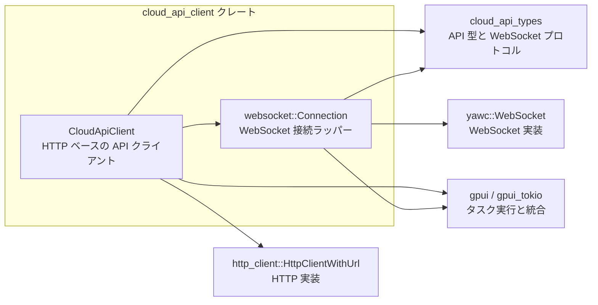
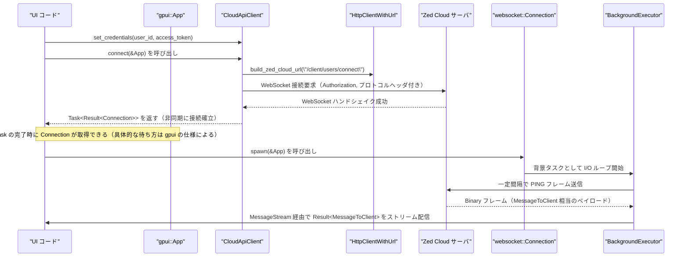

# cloud_api_client ディレクトリ

## 1. ざっくり一言

`cloud_api_client` クレートは、Zed Cloud 向けの **HTTP / WebSocket ベースのクライアント** を提供し、  
ユーザー認証情報の管理、ユーザー情報取得、LLM トークン発行、各種フィードバック送信、および WebSocket メッセージ受信を行うためのラッパーです。

---

## 2. このモジュールの役割

### 2.1 概要

- このディレクトリは、Zed Cloud のクライアント API を簡潔に扱うためのクライアントレイヤーを提供します。
- 具体的には次の問題を解決します。
  - 認証ヘッダや共通ヘッダの付与など、毎回の HTTP リクエスト構築の手間
  - `/client/users/me` などの特定エンドポイントへのアクセスとエラー処理
  - LLM トークン発行やフィードバック送信といった、アプリ側で頻繁に行う API 呼び出しの共通化
  - WebSocket でのサーバからのプッシュメッセージ受信と Keepalive の管理

### 2.2 アーキテクチャ内での位置づけ

`cloud_api_client` クレートは、アプリケーションコードと低レベルな HTTP / WebSocket 実装の間に位置し、  
`cloud_api_types` に定義された型やプロトコルを利用して、型安全な API を提供します。



- `CloudApiClient` は `HttpClientWithUrl` を使って Zed Cloud の HTTP API を呼び出します。
- `CloudApiClient::connect` で `yawc::WebSocket` による WebSocket 接続を開始し、その結果を `websocket::Connection` に渡します。
- `websocket::Connection` は WebSocket の I/O ループおよび keepalive を管理し、`MessageToClient` のストリームを提供します。
- `cloud_api_types` から API のリクエスト/レスポンス型や `MessageToClient` などのプロトコル型を再利用し、また `pub use cloud_api_types::*;` により再エクスポートします。

### 2.3 設計上のポイント

- **認証情報の集中管理**
  - `CloudApiClient` 内部に `Credentials { user_id, access_token }` を保持し、`RwLock<Option<...>>` でスレッドセーフに更新・参照できる構造になっています。
  - HTTP リクエスト構築用の共通関数 `build_request` により、すべての API 呼び出しで統一した `Authorization` ヘッダを付与します。

- **エラーハンドリングの方針**
  - HTTP ベースの主要メソッド（`get_authenticated_user`, `create_llm_token` など）は `ClientApiError` を返し、`401 Unauthorized` は専用バリアント `Unauthorized` にマッピングされます。
  - その他のエラー（ネットワークエラー、JSON パース失敗など）は `ClientApiError::Other(anyhow::Error)` でラップされます。
  - 一方、`validate_credentials` や一部のメソッドは `anyhow::Result` を直接返しています。

- **非同期処理と UI ランタイムとの統合**
  - HTTP API は `async fn` として定義され、通常の Rust の非同期コンテキストから利用できます。
  - WebSocket 接続は `gpui_tokio::Tokio::spawn_result` および `gpui::App::spawn` を通じて `gpui` のタスク実行基盤に統合されています。

- **WebSocket Keepalive**
  - `websocket::Connection` では 1 秒間隔で `PING` フレームを送出し、アイドル状態でも接続が切断されにくいようにしています。
  - 受信した `Binary` フレームのみを `MessageToClient` として扱い、その他のフレーム種別は `Close` を除き無視します。

---

## 3. 主要な機能一覧

このクレートが提供する主な機能を箇条書きで示します。

- 認証情報管理:
  - `set_credentials`, `clear_credentials`, `has_credentials`
- 認証済みユーザー情報の取得:
  - `get_authenticated_user`（`/client/users/me`）
- LLM トークンの発行:
  - `create_llm_token`（`/client/llm_tokens`）
- 認証情報の検証のみを行うヘルパー:
  - `validate_credentials`（内部状態を変更せずに真偽判定）
- 各種フィードバック送信:
  - `submit_agent_feedback`
  - `submit_agent_feedback_comments`
  - `submit_edit_prediction_feedback`
- WebSocket 接続の確立とメッセージ受信:
  - `CloudApiClient::connect` で WebSocket 接続を開始
  - `websocket::Connection::spawn` で keepalive 付き I/O ループを開始し、`MessageToClient` のストリームを提供
- API 型の再エクスポート:
  - `pub use cloud_api_types::*;` により、リクエスト/レスポンス型や `MessageToClient` などをこのクレートから直接利用可能にします。

---

## 4. 関数・構造体の解説

### 4.1 型一覧（構造体・列挙体など）

| 名前 | 種別 | モジュール | 役割 / 用途 |
|------|------|------------|-------------|
| `Credentials` | 構造体（非公開） | `cloud_api_client` | `user_id` と `access_token` のペアを保持します。`CloudApiClient` 内部専用です。 |
| `ClientApiError` | 列挙体 | `cloud_api_client` | クライアント API 呼び出し用のエラー型です。認証エラーとその他のエラーを区別します。 |
| `CloudApiClient` | 構造体 | `cloud_api_client` | Zed Cloud 向けの HTTP / WebSocket クライアントのメイン型です。認証情報と HTTP クライアントを保持します。 |
| `MessageStream` | 型エイリアス | `websocket` | `Pin<Box<dyn Stream<Item = Result<MessageToClient>>>>`。WebSocket からのメッセージストリームを表します。 |
| `Connection` | 構造体 | `websocket` | `yawc::WebSocket` を分割した送受信用ハーフを保持し、I/O ループを起動するための型です。 |

※ `GetAuthenticatedUserResponse`, `CreateLlmTokenBody`, `CreateLlmTokenResponse`, `OrganizationId`, `SubmitAgentThreadFeedbackBody` などの型は `cloud_api_types` クレート定義であり、このチャンクには詳細がありません。

### 4.2 重要な関数の詳細

#### `CloudApiClient::new(http_client: Arc<HttpClientWithUrl>) -> CloudApiClient`

**概要**

- 共通の HTTP クライアントを受け取り、認証情報が未設定の状態で `CloudApiClient` を生成します。

**引数**

| 引数名 | 型 | 説明 |
|--------|----|------|
| `http_client` | `Arc<HttpClientWithUrl>` | ベース URL の構築 (`build_zed_cloud_url`) や HTTP 送信 (`send`) を担当する共有 HTTP クライアントです。 |

**戻り値**

- `CloudApiClient` インスタンス。内部の `credentials` は `None` で初期化されます。

**内部処理の流れ**

1. `credentials` を `RwLock::new(None)` で初期化します。
2. 渡された `http_client` をフィールドに格納します。
3. 生成した `CloudApiClient` を返します。

**Examples（使用例）**

```rust
use std::sync::Arc;                                 // Arc を使って HTTP クライアントを共有する
use cloud_api_client::CloudApiClient;              // 本クレートのメインクライアント型
use http_client::HttpClientWithUrl;                // HTTP クライアント実装

fn make_client(http_client: Arc<HttpClientWithUrl>) -> CloudApiClient {
    // 既存の HttpClientWithUrl を共有して CloudApiClient を構築する
    CloudApiClient::new(http_client)
}
```

**Errors / Panics**

- この関数自体はエラーを返さず、パニックもしません。

**Edge cases（エッジケース）**

- 特筆すべきエッジケースはありません。`http_client` がどのように構築されているかは、このチャンクからは分かりません。

**使用上の注意点**

- 生成直後は認証情報が設定されていないため、認証を要するメソッドを呼ぶ前に `set_credentials` を呼び出す必要があります。

---

#### `CloudApiClient::get_authenticated_user(&self) -> Result<GetAuthenticatedUserResponse, ClientApiError>`

**概要**

- 現在設定されている認証情報を使って `/client/users/me` エンドポイントに GET リクエストを送り、  
  「認証済みユーザー」の情報を取得します。

**引数**

- なし（`self` のみ）。

**戻り値**

- `Ok(GetAuthenticatedUserResponse)`:
  - サーバから返された JSON を `GetAuthenticatedUserResponse` にデシリアライズした結果です。
- `Err(ClientApiError)`:
  - 認証エラー、ネットワークエラー、JSON パース失敗など。

**内部処理の流れ**

1. `self.http_client.build_zed_cloud_url("/client/users/me")` で URL を組み立てます。
2. `Request::builder().method(Method::GET).uri(url.as_ref())` でリクエストビルダを作成します。
3. `self.build_request(..., AsyncBody::default())` で `Authorization` ヘッダ付きのリクエストに変換します。
   - 認証情報が未設定の場合はここでエラーになり、`ClientApiError::Other` として返ります。
4. `self.http_client.send(request).await?` でリクエストを送信し、レスポンスを取得します。
5. ステータスコードを確認します。
   - 成功 (`2xx`) でない場合:
     - `401 Unauthorized` なら `ClientApiError::Unauthorized` を返します。
     - それ以外はレスポンスボディを文字列として読み込み、ステータスとボディを含むメッセージで `ClientApiError::Other` を返します。
6. ステータスが成功のときは、レスポンスボディを文字列として読み込み、`serde_json::from_str` で `GetAuthenticatedUserResponse` にデシリアライズして返します。

**Examples（使用例）**

```rust
use std::sync::Arc;                                         // Arc でクライアントを共有
use cloud_api_client::{CloudApiClient, ClientApiError};     // クライアントとエラー型
use http_client::HttpClientWithUrl;                         // HTTP クライアント

async fn print_current_user(http_client: Arc<HttpClientWithUrl>) -> anyhow::Result<()> {
    let client = CloudApiClient::new(http_client);          // クライアントを構築
    client.set_credentials(123, "access-token".to_string()); // 認証情報をセット

    match client.get_authenticated_user().await {           // 認証済みユーザーを取得
        Ok(user) => {
            println!("{:?}", user);                        // 取得したユーザー情報を表示
        }
        Err(ClientApiError::Unauthorized) => {
            eprintln!("認証エラー: アクセストークンが無効です"); // 認証エラー時の扱い
        }
        Err(ClientApiError::Other(e)) => {
            eprintln!("その他のエラー: {:?}", e);          // ネットワークやパースエラーなど
        }
    }

    Ok(())                                                  // anyhow::Result としては正常終了
}
```

**Errors / Panics**

- `ClientApiError::Unauthorized`:
  - レスポンスのステータスコードが `401 Unauthorized` の場合。
- `ClientApiError::Other`:
  - 認証情報が設定されていない（`"no credentials provided"`）。
  - URL 構築失敗。
  - HTTP 送信エラー。
  - レスポンスボディの読み込み失敗。
  - JSON デシリアライズ失敗。
- パニックするコードは含まれていません。

**Edge cases（エッジケース）**

- 認証情報未設定 (`has_credentials() == false`) の場合:
  - `ClientApiError::Other` としてエラーになります（メッセージは `no credentials provided`）。
- サーバが成功ステータスであっても、ボディが `GetAuthenticatedUserResponse` と互換性のない JSON の場合:
  - `ClientApiError::Other`（`failed to parse response body`）になります。

**使用上の注意点**

- 認証情報が無効である可能性も考慮し、`Unauthorized` バリアントを別扱いすることが前提になっています。
- UI から利用する場合は、失敗時にユーザーへ再ログインを促すなど、適切なエラーハンドリングが必要です。

---

#### `CloudApiClient::connect(&self, cx: &App) -> Result<Task<Result<Connection>>>`

**概要**

- Zed Cloud と WebSocket 接続を確立するための非同期タスクを起動し、その `Task` ハンドルを返します。
- 接続には認証ヘッダおよび WebSocket プロトコルバージョンヘッダが付与されます。

**引数**

| 引数名 | 型 | 説明 |
|--------|----|------|
| `cx` | `&App` | `gpui` のアプリケーションコンテキスト。`Tokio::spawn_result` でタスクを紐づけるために使用されます。 |

**戻り値**

- `Ok(Task<Result<Connection>>)`:
  - バックグラウンドで WebSocket 接続を確立するタスクハンドルです。
  - タスクの完了時には `Result<Connection>`（接続成功 or エラー）が得られます。
- `Err(anyhow::Error)`:
  - URL の構築やスキーム設定時に失敗した場合など。

**内部処理の流れ**

1. `self.http_client.build_zed_cloud_url("/client/users/connect")` で接続用 URL を構築します。
2. URL のスキームを
   - `"https"` → `"wss"`
   - `"http"` → `"ws"`
   に変換します。それ以外のスキームだった場合は `anyhow!("invalid URL scheme: {scheme}")` でエラーにします。
3. 認証情報を `self.credentials.read()` で読み取り、`Some` であることを確認します。`None` の場合は `"no credentials provided"` エラーになります。
4. `format!("{} {}", user_id, access_token)` で `Authorization` ヘッダの値を組み立てます。
5. `Tokio::spawn_result(cx, async move { ... })` で次の処理を行うタスクを起動します。
   - `WebSocket::connect(connect_url)` を呼び出し、接続要求を送信します。
   - その際、`request::Builder::new()` で作成したリクエストに
     - `"Authorization"` ヘッダ
     - `PROTOCOL_VERSION_HEADER_NAME` ヘッダ（値は `PROTOCOL_VERSION.to_string()`）
     を付与します。
   - 接続成功時には `Connection::new(ws)` で `Connection` インスタンスにラップして `Ok(...)` として返します。

**Examples（使用例）**

> 注意: `Task` の具体的な待ち方・コールバック設定方法は `gpui` の API に依存し、このチャンクには記述がないため、ここでは概念レベルの説明にとどめます。

1. アプリ起動時に接続タスクを開始し、完了時に `Connection` を受け取る、という使い方が想定されます。
2. 取得した `Connection` に対して `Connection::spawn` を呼び、`MessageStream` を購読します。

**Errors / Panics**

- 戻り値の `Result`（外側）は以下のときに `Err` になります。
  - URL 構築失敗。
  - URL スキームが `http` / `https` 以外。
  - スキーム設定失敗。
  - 認証情報未設定。
- `Task` の中の `Result<Connection>`（内側）は、WebSocket 接続自体が失敗した場合などに `Err(anyhow::Error)` になります。

**Edge cases（エッジケース）**

- 認証情報が設定されていない場合:
  - `connect` 呼び出し時に即座にエラーになります。
- `build_zed_cloud_url` が `https` でも `http` でもないスキームを返す設定になっている場合:
  - `invalid URL scheme` エラーになります。

**使用上の注意点**

- 接続に成功しても、`Connection` を用いた I/O ループ（`Connection::spawn`）を起動しないと、サーバからのメッセージは受信できません。
- UI アプリケーションでは、WebSocket 接続のライフサイクル（再接続・切断処理など）をアプリ側で管理する必要がありますが、その実装はこのチャンクには含まれていません。

---

#### `CloudApiClient::create_llm_token(&self, system_id: Option<String>, organization_id: Option<OrganizationId>) -> Result<CreateLlmTokenResponse, ClientApiError>`

**概要**

- `/client/llm_tokens` エンドポイントに POST リクエストを送り、LLM 用のトークンを発行します。
- 任意で Zed System ID や組織 ID を指定できます。

**引数**

| 引数名 | 型 | 説明 |
|--------|----|------|
| `system_id` | `Option<String>` | 存在する場合、`ZED_SYSTEM_ID_HEADER_NAME` ヘッダとして送信されます。 |
| `organization_id` | `Option<OrganizationId>` | リクエストボディ `CreateLlmTokenBody { organization_id }` のフィールドとして送信されます。 |

**戻り値**

- `Ok(CreateLlmTokenResponse)`:
  - トークン発行 API の JSON レスポンスをデシリアライズした結果です。
- `Err(ClientApiError)`:
  - 認証エラー、ネットワークエラー、JSON パース失敗など。

**内部処理の流れ**

1. `self.http_client.build_zed_cloud_url("/client/llm_tokens")` で URL を構築します。
2. `Request::builder().method(Method::POST).uri(url.as_ref())` を作成します。
3. `when_some(system_id, |builder, system_id| { ... })` により、`system_id` が `Some` の場合のみ
   - `ZED_SYSTEM_ID_HEADER_NAME` ヘッダを追加します。
4. `self.build_request(request_builder, Json(CreateLlmTokenBody { organization_id }))` で
   - `Content-Type: application/json`
   - `Authorization: "<user_id> <access_token>"`
   付きのリクエストを構築します。
5. `self.http_client.send(request).await?` でリクエスト送信。
6. レスポンスのステータスコードを確認。
   - `2xx` 以外:
     - `401` なら `ClientApiError::Unauthorized`。
     - それ以外はボディを文字列として読み込み、ステータスとボディを含むメッセージで `ClientApiError::Other`。
   - `2xx` の場合は、ボディを文字列として読み込み `serde_json::from_str` で `CreateLlmTokenResponse` にデシリアライズ。

**Examples（使用例）**

```rust
use cloud_api_client::{CloudApiClient, ClientApiError, OrganizationId}; // 必要な型をインポート

async fn create_token_example(client: &CloudApiClient) -> Result<(), ClientApiError> {
    let system_id = Some("my-system".to_string());          // 任意の Zed System ID を指定
    let organization_id: Option<OrganizationId> = None;     // 組織 ID は指定しない例

    let response = client
        .create_llm_token(system_id, organization_id)
        .await?;                                            // LLM トークンを発行

    println!("{:?}", response);                             // 実際のフィールドは cloud_api_types の定義に依存
    Ok(())
}
```

**Errors / Panics**

- `get_authenticated_user` と同様に、`ClientApiError::Unauthorized` / `ClientApiError::Other` でエラーが返ります。
- パニックするコードは含まれていません。

**Edge cases（エッジケース）**

- `system_id` が `None` の場合:
  - `ZED_SYSTEM_ID_HEADER_NAME` ヘッダは送信されません。
- `organization_id` が `None` の場合:
  - JSON ボディ内のフィールド値が `null` になるかどうかは `CreateLlmTokenBody` の定義に依存し、このチャンクからは分かりません。

**使用上の注意点**

- 認証情報未設定の場合は `ClientApiError::Other("no credentials provided")` として失敗します。
- トークンの有効期限や権限スコープなどは `cloud_api_types` とサーバ側の仕様に依存します。

---

#### `CloudApiClient::validate_credentials(&self, user_id: u32, access_token: &str) -> Result<bool>`

**概要**

- 渡された `user_id` と `access_token` が有効かどうかを、`/client/users/me` に対する GET リクエストを通じて検証します。
- 内部の `credentials` フィールドは変更しません。

**引数**

| 引数名 | 型 | 説明 |
|--------|----|------|
| `user_id` | `u32` | 検証対象のユーザー ID。 |
| `access_token` | `&str` | 検証対象のアクセストークン。 |

**戻り値**

- `Ok(true)`:
  - `/client/users/me` へのリクエストが成功ステータス (`2xx`) を返した場合。
- `Ok(false)`:
  - ステータスコードが `401 Unauthorized` の場合（認証情報が無効）。
- `Err(anyhow::Error)`:
  - URL 構築失敗、その他の HTTP エラー、ステータスが `2xx` / `401` 以外など。

**内部処理の流れ**

1. `build_request`（自由関数）を使って、引数から `Credentials` を一時的に組み立てた上で `Authorization` ヘッダ付きのリクエストを構築します。
   - このとき `self.credentials` は参照されません。
2. HTTP クライアントで `/client/users/me` に GET リクエストを送信します。
3. レスポンスステータスを確認します。
   - `2xx` → `Ok(true)`。
   - `401 Unauthorized` → `Ok(false)`。
   - それ以外 → レスポンスボディを文字列として読み込み、`anyhow::Error` として `Err` を返します。

**Examples（使用例）**

```rust
use cloud_api_client::CloudApiClient;                 // クライアント型
use anyhow::Result;                                   // anyhow::Result を利用

async fn login_with_validation(client: &CloudApiClient, user_id: u32, token: String) -> Result<bool> {
    let is_valid = client
        .validate_credentials(user_id, &token)
        .await?;                                      // /client/users/me で認証情報を検証

    if is_valid {
        client.set_credentials(user_id, token);       // 有効な場合のみ内部の認証情報として保存
    }

    Ok(is_valid)                                      // 呼び出し元は true/false で判定できる
}
```

**Errors / Panics**

- `Err(anyhow::Error)` は以下のケースで発生します。
  - URL 構築エラー。
  - HTTP 送信エラー。
  - ステータスコードが `2xx` と `401` 以外だった場合。
  - レスポンスボディの読み込み失敗。
- パニックするコードは含まれていません。

**Edge cases（エッジケース）**

- サーバが `403 Forbidden` など別のエラーコードを返した場合:
  - `Ok(false)` ではなく `Err(anyhow::Error)` になります。
- この関数は `self.credentials` を変更しないため、検証後に `set_credentials` を呼ぶかどうかは呼び出し側の責任となります。

**使用上の注意点**

- 「単に有効かどうか」を確認したい場面では有用ですが、`Err` の場合は「ネットワークエラー」や「サーバ側の別エラー」が含まれるので、そのまま「無効」とみなしてよいかどうかはアプリ側のポリシー次第です。

---

#### `CloudApiClient::submit_agent_feedback(&self, body: SubmitAgentThreadFeedbackBody) -> Result<()>`

**概要**

- エージェントのスレッド全体に対するフィードバックを `/client/feedback/agent_thread` に POST 送信します。

**引数**

| 引数名 | 型 | 説明 |
|--------|----|------|
| `body` | `SubmitAgentThreadFeedbackBody` | フィードバック内容を含むリクエストボディ。定義は `cloud_api_types` にあります。 |

**戻り値**

- `Ok(())`:
  - フィードバックが成功ステータス (`2xx`) で受理された場合。
- `Err(anyhow::Error)`:
  - 認証情報がない、シリアライズ失敗、HTTP エラー、非成功ステータスなど。

**内部処理の流れ**

1. `/client/feedback/agent_thread` への POST リクエストビルダを作成します。
2. `serde_json::to_string(&body)?` で JSON 文字列にシリアライズし、`AsyncBody::from(...)` でリクエストボディにします。
3. `self.build_request` で認証ヘッダ付きリクエストを構築します。
4. HTTP クライアントで送信し、レスポンスを取得します。
5. ステータスが成功 (`2xx`) でなければ、レスポンスボディを文字列として読み込み、
   - `anyhow::bail!` によりステータスとボディを含むエラーを返します。
6. 成功ステータスの場合は `Ok(())` を返します。

**Examples（使用例）**

```rust
use cloud_api_client::CloudApiClient;                        // クライアント型
use cloud_api_client::SubmitAgentThreadFeedbackBody;         // フィードバックボディ型（定義は cloud_api_types 側）
use anyhow::Result;                                          // anyhow::Result

async fn send_feedback(client: &CloudApiClient, body: SubmitAgentThreadFeedbackBody) -> Result<()> {
    client.submit_agent_feedback(body).await?;               // フィードバックを送信
    Ok(())                                                   // 成功したら何も返さない
}
```

※ `SubmitAgentThreadFeedbackBody` の具体的なフィールドは、このチャンクからは分かりません。

**Errors / Panics**

- `Err(anyhow::Error)` は以下のケースで発生します。
  - 認証情報未設定（`self.build_request` 内）。
  - JSON シリアライズ失敗。
  - HTTP 送信エラー。
  - ステータスコードが `2xx` 以外（レスポンスボディ内容もエラーメッセージに含まれます）。
- パニックは発生しません。

**Edge cases（エッジケース）**

- サーバが詳細なエラーメッセージを返す場合、それがエラー文字列内にそのまま含まれるため、ログ出力に適しています。
- `body` に無効な値が含まれる場合のサーバ側の挙動は、このチャンクからは分かりません。

**使用上の注意点**

- このメソッドは「成功/失敗」を `Result<()>` で返し、「部分的成功」や「無視してよいエラー」といった区別は行いません。UI 側では必要に応じてエラーメッセージをユーザーに表示するかログに残す設計が必要です。

---

#### `websocket::Connection::spawn(self, cx: &App) -> (MessageStream, Task<()>)`

**概要**

- `WebSocket` 接続に対する I/O ループを `gpui` の背景タスクとして起動し、
  - サーバからの `Binary` フレームを `MessageToClient` にデシリアライズして流す `MessageStream`
  - I/O ループ自体を表す `Task<()>`
  を返します。
- 定期的に `PING` フレームを送出して接続維持を行います。

**引数**

| 引数名 | 型 | 説明 |
|--------|----|------|
| `self` | `Connection` | あらかじめ `Connection::new(ws)` で構築された接続オブジェクト。所有権がムーブされます。 |
| `cx` | `&App` | `gpui` のアプリケーションコンテキスト。背景タスクの起動に使用されます。 |

**戻り値**

- `(MessageStream, Task<()>)`:
  - `MessageStream`: `Result<MessageToClient>` を要素とするストリーム。WebSocket から受信したメッセージを購読できます。
  - `Task<()>`: keepalive と受信処理を行う I/O ループタスク。

**内部処理の流れ**

1. `self.tx` と `self.rx` をローカル変数 `tx`, `rx` にムーブします。
2. `futures::channel::mpsc::unbounded()` で
   - 送信側 `message_tx`
   - 受信側 `message_rx`
   を作成します。
3. `handle_io` というクロージャで次のような非同期 I/O ループを定義します。
   - `executor.timer(KEEPALIVE_INTERVAL)` で 1 秒間隔のタイマー (`keepalive_timer`) を作成し、`fuse` して `select` に利用できるようにします。
   - `rx` を `fuse` し、ループ内で `select_biased!` を用いて
     1. `keepalive_timer` が発火した場合:
        - `FrameView::ping(Vec::new())` を `tx.send(...)` して PING フレームを送信。
        - 再度 `executor.timer(KEEPALIVE_INTERVAL)` でタイマーをリセット。
     2. `rx.next()` で次のフレームを受信した場合:
        - `None` ならストリームが終了したとみなしてループを抜ける。
        - `Some(frame)` の場合、`frame.opcode` に応じて
          - `OpCode::Binary`:
            - `MessageToClient::deserialize(&frame.payload)` でデシリアライズ。
            - 結果（`Result<MessageToClient>`）を `message_tx.unbounded_send(...)` でストリームに流す。
          - `OpCode::Close`:
            - ループを抜ける。
          - その他:
            - 何もしない（無視）。
4. `cx.spawn(async move |cx| handle_io(cx.background_executor().clone()).await)` で I/O ループを背景タスクとして起動し、その `Task<()>` を取得します。
5. `message_rx.into_stream().boxed()` で `MessageStream` としてストリームを返し、I/O タスクとともにタプルで返却します。

**Examples（使用例）**

> `Connection` の取得には `CloudApiClient::connect` が関係するため、ここでは `Connection` がすでに手元にある状況を仮定します。

```rust
use cloud_api_client::websocket::Connection;            // Connection 型
use cloud_api_client::websocket::MessageStream;         // メッセージストリーム型
use gpui::App;                                          // gpui の App 型
use anyhow::Result;                                     // anyhow::Result

fn start_message_loop(conn: Connection, app: &App) -> (MessageStream, gpui::Task<()>) {
    // Connection から I/O ループを起動し、メッセージストリームとタスクを取得する
    let (stream, task) = conn.spawn(app);

    // stream を呼び出し元でポーリングし、task は App 側で管理する想定です
    (stream, task)
}
```

※ `Task` の具体的なライフサイクル管理（キャンセル・完了待ちなど）は `gpui` の仕様に依存し、このチャンクからは詳細が分かりません。

**Errors / Panics**

- `spawn` 自体は `Result` を返さないため、ここでエラーが直接返ることはありません。
- 代わりに、`MessageStream` の各要素が `Result<MessageToClient>` であり、デシリアライズエラー等はここに `Err(...)` として現れます。
- パニックを直接発生させるコードは含まれていません。

**Edge cases（エッジケース）**

- WebSocket が終了した場合（`rx.next()` が `None` の場合）:
  - I/O ループは終了します。`MessageStream` 側ではその後新しいメッセージは流れません。
- サーバから `Binary` 以外の opcode（例えば `Text`）が送られた場合:
  - 無視されます。メッセージストリームには流れません。
- `MessageToClient::deserialize` が失敗した場合:
  - `Err(anyhow::Error)` のような形で `Result<MessageToClient>` の `Err` としてストリームに流れます。

**使用上の注意点**

- `MessageStream` をポーリングしない場合、受信フレームは内部のキューに蓄積され続ける可能性があります（どこまでバッファするかは `mpsc::unbounded` の仕様に依存）。
- `Task<()>` を適宜キャンセルしたり、アプリ終了時に明示的にクリーンアップする設計が必要です。

---

### 4.3 その他の関数

主要な関数以外の補助的なメソッドを一覧で示します。

| 関数名 | 所属 | 役割（1 行） |
|--------|------|--------------|
| `CloudApiClient::has_credentials(&self) -> bool` | `cloud_api_client` | 内部の `credentials` が `Some` かどうか（認証情報が設定済みかどうか）を返します。 |
| `CloudApiClient::set_credentials(&self, user_id: u32, access_token: String)` | `cloud_api_client` | 新しい `Credentials` を作成し、`RwLock` に格納します。 |
| `CloudApiClient::clear_credentials(&self)` | `cloud_api_client` | `credentials` を `None` にリセットし、認証情報をクリアします。 |
| `CloudApiClient::submit_agent_feedback_comments(&self, body: SubmitAgentThreadFeedbackCommentsBody) -> Result<()>` | `cloud_api_client` | `/client/feedback/agent_thread_comments` への POST によりコメント単位のフィードバックを送信します。実装パターンは `submit_agent_feedback` と同様です。 |
| `CloudApiClient::submit_edit_prediction_feedback(&self, body: SubmitEditPredictionFeedbackBody) -> Result<()>` | `cloud_api_client` | `/client/feedback/edit_prediction` への POST により編集候補へのフィードバックを送信します。実装パターンは `submit_agent_feedback` と同様です。 |
| `CloudApiClient::build_request(&self, req: request::Builder, body: impl Into<AsyncBody>) -> Result<Request<AsyncBody>>` | `cloud_api_client` | 内部の `credentials` から `Authorization` ヘッダを付与してリクエストを構築する、メソッド版ヘルパーです。 |
| `build_request(req: request::Builder, body: impl Into<AsyncBody>, credentials: &Credentials) -> Result<Request<AsyncBody>>` | `cloud_api_client`（自由関数） | `Content-Type: application/json` と `Authorization` ヘッダを設定し、`Request<AsyncBody>` を構築する共通関数です。 |
| `Connection::new(ws: WebSocket) -> Connection` | `websocket` | `WebSocket::split()` により送受信用ハーフに分割し、それを保持する `Connection` を作成します。 |

---

## 5. データフロー

ここでは代表的なシナリオとして、**WebSocket 接続を確立し、メッセージを受信するまでの流れ** を示します。

### 5.1 WebSocket 接続〜メッセージ受信のシーケンス



- `CloudApiClient::connect` は WebSocket 接続の「開始」だけを行い、実際の I/O ループは `Connection::spawn` によって起動されます。
- `Connection::spawn` によって返される `MessageStream` は、アプリケーションコード側でポーリング（ストリーミング購読）する前提になっています。
- Keepalive の PING フレーム送信は `BackgroundExecutor` のタイマー機能を利用して行われます。

---

## 6. 使い方（How to Use）

### 6.1 基本的な使用方法

ここでは、もっとも基本的なパターンである  
**HTTP クライアントの初期化 → 認証情報の設定 → 認証済みユーザー情報の取得** の流れを示します。

```rust
use std::sync::Arc;                                   // Arc で HTTP クライアントを共有するために使用
use cloud_api_client::{CloudApiClient, ClientApiError}; // CloudApiClient とエラー型をインポート
use http_client::HttpClientWithUrl;                   // 実際の HTTP クライアント実装
use anyhow::Result;                                   // anyhow::Result を利用

async fn basic_usage_example() -> Result<()> {
    // HttpClientWithUrl の具体的な構築方法はこのチャンクにはないため、
    // ここでは既に構築済みのインスタンスを受け取る想定とします。
    let http_client: Arc<HttpClientWithUrl> = /* 既存の HttpClientWithUrl を構築または取得する */ todo!();

    // CloudApiClient を作成し、HTTP クライアントを共有する
    let client = CloudApiClient::new(http_client);

    // どこか別の手段で取得した user_id / access_token を設定する
    client.set_credentials(123, "access-token-string".to_string());

    // 認証済みユーザー情報を取得する
    let user = match client.get_authenticated_user().await {
        Ok(user) => user,                              // 正常に取得できた場合
        Err(ClientApiError::Unauthorized) => {
            // 認証エラー（トークン無効など）の場合
            eprintln!("ログインが必要です");
            return Ok(());                             // ここでは早期リターンする例
        }
        Err(ClientApiError::Other(e)) => {
            // ネットワークエラーや JSON パースエラーなど
            eprintln!("ユーザー情報取得に失敗しました: {:?}", e);
            return Ok(());
        }
    };

    println!("{:?}", user);                            // 結果を表示（中身は cloud_api_types に依存）
    Ok(())
}
```

### 6.2 よくある使用パターン

#### パターン 1: ログイン時に `validate_credentials` を使って検証してから保存

```rust
use cloud_api_client::CloudApiClient;                 // クライアント型
use anyhow::Result;                                   // anyhow::Result

async fn login_flow(client: &CloudApiClient, user_id: u32, token: String) -> Result<bool> {
    // サーバに問い合わせて認証情報が有効かどうか確認する
    let is_valid = client.validate_credentials(user_id, &token).await?;

    if is_valid {
        // 有効な場合のみ内部の認証情報として保持する
        client.set_credentials(user_id, token);
    }

    Ok(is_valid)                                      // 呼び出し元は true/false でログイン結果を判定
}
```

- このパターンでは、「検証」と「保存」を明確に分離できます。
- ネットワークエラーなどで `Err` が返った場合の扱い（リトライするか、失敗と見なすか）はアプリ側の設計次第です。

#### パターン 2: LLM トークン発行

```rust
use cloud_api_client::{CloudApiClient, ClientApiError, OrganizationId}; // 必要な型をインポート

async fn issue_llm_token(client: &CloudApiClient) -> Result<(), ClientApiError> {
    // 任意の system_id（Zed System 固有の識別子など）を指定する
    let system_id = Some("my-system-id".to_string());
    // この例では organization_id は指定しない
    let organization_id: Option<OrganizationId> = None;

    // LLM トークンを発行
    let response = client.create_llm_token(system_id, organization_id).await?;

    println!("{:?}", response);                        // 実際のフィールドは cloud_api_types に依存
    Ok(())
}
```

- system_id / organization_id の組み合わせに応じて、サーバ側で発行されるトークンの権限や範囲が変わる可能性があります（詳細はこのチャンクからは不明です）。

#### パターン 3: WebSocket メッセージストリームの利用（概念的）

> `Task<Result<Connection>>` の具体的な待ち方は `gpui` のランタイムに依存するため、ここでは概念レベルの説明にとどめます。

1. `CloudApiClient::connect(&app)` を呼び出して `Task<Result<Connection>>` を取得する。
2. `Task` が完了したタイミングで
   - 成功なら `Connection` を受け取る。
   - 失敗なら WebSocket 接続エラーとして扱う。
3. `Connection::spawn(&app)` を呼ぶことで
   - `MessageStream`（`Result<MessageToClient>` のストリーム）
   - I/O ループを表す `Task<()>`
   を取得する。
4. `MessageStream` をポーリングして、サーバからのイベント・通知を処理する。

この流れに沿って、UI レイヤーでは「WebSocket 接続の開始」「接続維持」「切断時の処理」「再接続戦略」などを組み立てることになります。

### 6.3 使用上の注意点

- **認証情報の前提**
  - `get_authenticated_user`, `create_llm_token`, `submit_*_feedback` などの多くのメソッドは内部で `self.build_request` を使っており、認証情報 (`Credentials`) が設定されていることが前提です。
  - 認証情報が未設定の場合、「no credentials provided」というメッセージを持つエラーになります。

- **`ClientApiError` と `anyhow::Error` の混在**
  - 一部のメソッドは `ClientApiError` を返し、他は `anyhow::Result` を返します。
  - 特に `validate_credentials` は `Result<bool>`（`anyhow::Error`）であり、`Unauthorized` を専用バリアントとして区別していません。
  - 呼び出し側はメソッドごとにエラー型の扱いを統一する必要があります。

- **WebSocket のライフサイクル管理**
  - `Connection::spawn` が返す `Task<()>` を放置すると、アプリ終了時にどのようなタイミングでタスクが終了するかは `gpui` 側の仕様に依存します。
  - `MessageStream` を長時間ポーリングし続ける設計では、適切なキャンセルや再接続処理を考慮する必要があります。

- **ストリーム要素の `Result`**
  - `MessageStream` の要素は `Result<MessageToClient>` であり、個々のメッセージのデシリアライズに失敗することがあります。
  - ストリーム処理コードでは `Ok(msg)` と `Err(e)` を分けて扱い、`Err` の場合にログを出力するなどの処理を行う前提になっています。

- **HTTP エラー時の情報**
  - 多くのメソッドで、非成功ステータスの場合はレスポンスボディを文字列としてログ用メッセージに含めています。
  - セキュリティ上の理由でレスポンスボディをそのままユーザーに表示するかどうかは、アプリケーションのポリシーによります。

- **スレッドセーフ性について**
  - `CloudApiClient` は内部に `parking_lot::RwLock` を利用しており、同一プロセス内で複数スレッドから共有することを意図した構造に見えます。
  - ただし、`HttpClientWithUrl` がどのようなスレッドセーフ性を持つかはこのチャンクからは分からないため、使用前にその仕様を確認する必要があります。

---

## 7. 関連ファイル

このディレクトリ内で密接に関連するファイル・モジュールを一覧にします。

| パス | 役割 / 関係 |
|------|------------|
| `cloud_api_client/Cargo.toml` | クレート名・バージョン・ライセンス・依存クレート（`cloud_api_types`, `http_client`, `gpui`, `gpui_tokio`, `yawc` など）を定義します。 |
| `cloud_api_client/src/cloud_api_client.rs` | クレートのメインライブラリファイルです。`CloudApiClient` の実装、`ClientApiError`、内部 `Credentials`、HTTP ヘルパー関数、`cloud_api_types` の再エクスポートなどが含まれます。 |
| `cloud_api_client/src/websocket.rs` | WebSocket 接続ラッパー `Connection` と `MessageStream` の定義、および keepalive 付き I/O ループの実装が含まれます。`CloudApiClient::connect` から利用されます。 |

この他、`cloud_api_types` クレートや `http_client` クレート等は外部依存として参照されており、各 API 型の詳細や HTTP クライアントの具体的な挙動はそちらのコード／ドキュメントに依存します。
