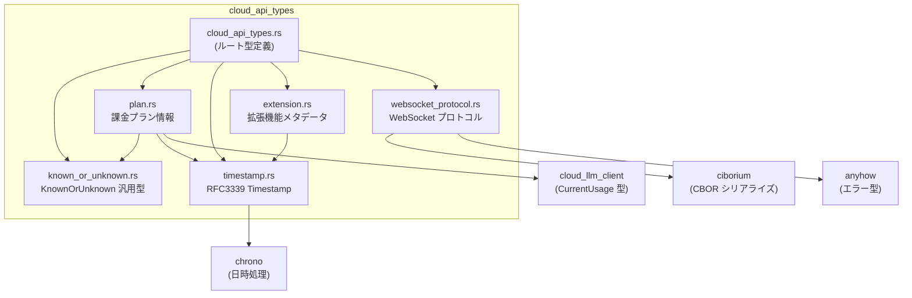
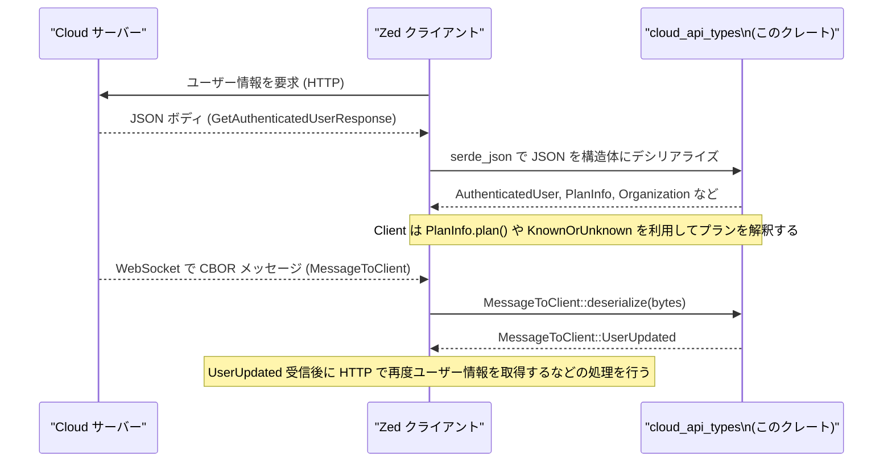

# crates/cloud_api_types ディレクトリ解説

## 1. ざっくり一言

Zed Cloud（クラウド側）と Zed クライアントの間でやり取りする **HTTP / WebSocket API のデータ型** をまとめたクレートです。  
ユーザー情報・組織・課金プラン・拡張機能・時刻・WebSocket メッセージなどを、Serde 対応の構造体・列挙体として定義しています。

---

## 2. このモジュールの役割

### 2.1 概要

- このディレクトリ（クレート）は、Zed のクラウド API で使う **共通データ型定義** を提供します。
- 目的は、サーバー／クライアント双方が同じ型を共有しつつ、**JSON / CBOR で安全にシリアライズ・デシリアライズ**できるようにすることです。
- 課金プランや拡張機能のように **将来バリアントが増える可能性が高い領域** には、`KnownOrUnknown` や `plan_v3` など、後方互換性に配慮した型設計がされています。
- 日時は `Timestamp` 型にまとめ、**RFC 3339 形式の文字列**としてシリアライズ・デシリアライズされます。

### 2.2 アーキテクチャ内での位置づけ

このクレート内のモジュール同士と、主要な外部依存の関係を図にまとめます。



- `cloud_api_types.rs` がクレートのエントリポイントで、各モジュールの型を `pub use` しています。
- `timestamp.rs` と `known_or_unknown.rs` は他の複数モジュールから利用される **基盤的なユーティリティ型** です。
- `websocket_protocol.rs` は WebSocket 用のプロトコルバージョンとメッセージ形式を定義し、バイナリ（CBOR）との変換も担います。

### 2.3 設計上のポイント

コードから読み取れる設計上の特徴をまとめます。

- **シリアライズ互換性**
  - すべての API ペイロード型に `Serialize` / `Deserialize` が実装されています。
  - フィールド名と enum バリアント名には `#[serde(rename_all = "...")]` などを利用し、JSON との互換性を明示しています。
  - `#[serde(default)]` により、古いサーバー／クライアントが一部フィールドを持たない場合でも、デフォルト値（空ベクタ／`None`／空マップ）で受け取れるようになっています。

- **将来の拡張に備えた表現**
  - `KnownOrUnknown<K, U>` により、「既知の列挙値」か「未知だが生文字列で保持したい値」かを区別できます。
  - 課金プランの `plan_v3` フィールドは `KnownOrUnknown<Plan, String>` で定義され、新しいプラン名が追加されても古いクライアントが壊れないようになっています。

- **日時表現の統一**
  - `Timestamp` 型を通じて、すべての日時を RFC 3339 文字列としてやり取りします。
  - ミリ秒精度に正規化（マイクロ秒→ミリ秒へ丸め／切り捨て）されるテストが書かれています。

- **文字列の共有**
  - `OrganizationId` や拡張 ID 等に `Arc<str>` を使い、クローン時のコストを抑えつつ共有可能な文字列として扱っています。

- **WebSocket プロトコルのバージョニング**
  - `PROTOCOL_VERSION` と `PROTOCOL_VERSION_HEADER_NAME` で、WebSocket プロトコルのバージョン管理を行います。
  - メッセージは `ciborium` を使った CBOR バイナリ形式でエンコードされます。

---

## 3. 主要な機能一覧

このクレートが提供する主な機能を列挙します。

- 認証済みユーザー情報レスポンス型:
  - `GetAuthenticatedUserResponse`, `AuthenticatedUser`, `Organization`, `OrganizationId` など。
- 利用規約の同意状態と更新:
  - `AcceptTermsOfServiceResponse` と `AuthenticatedUser.accepted_tos_at`。
- LLM トークンの発行・保持:
  - `LlmToken`, `CreateLlmTokenBody`, `CreateLlmTokenResponse`。
- エージェント／補完のフィードバック投稿:
  - `SubmitAgentThreadFeedbackBody`, `SubmitAgentThreadFeedbackCommentsBody`, `SubmitEditPredictionFeedbackBody`。
- 拡張機能マニフェストとメタデータ:
  - `ExtensionApiManifest`, `ExtensionProvides`, `ExtensionMetadata`, `GetExtensionsResponse`。
- 課金プランと利用状況:
  - `Plan`（列挙）、`PlanInfo`, `SubscriptionPeriod`、`KnownOrUnknown`。
- 汎用の「既知／未知」値表現:
  - `KnownOrUnknown<K, U>`。
- 日時表現:
  - `Timestamp`（RFC 3339 形式でのシリアライズ／デシリアライズ）。
- WebSocket プロトコル:
  - `PROTOCOL_VERSION`, `PROTOCOL_VERSION_HEADER_NAME`, `MessageToClient` とそのバイナリシリアライズ関数。
- HTTP / WebSocket ヘッダー名の定数:
  - `ZED_SYSTEM_ID_HEADER_NAME`（システム ID 用）、
  - `PROTOCOL_VERSION_HEADER_NAME`（プロトコルバージョン用）。

---

## 4. 関数・構造体の解説

### 4.1 ルート API 型（cloud_api_types.rs）

#### 型の概要

| 名前 | 種別 | 役割 / 用途 |
|------|------|-------------|
| `GetAuthenticatedUserResponse` | 構造体 | 認証済みユーザー情報や所属組織・プラン情報を返すレスポンス |
| `AuthenticatedUser` | 構造体 | ユーザーの ID、GitHub ログイン、名前、権限、利用規約同意時刻など |
| `OrganizationId` | 構造体（`Arc<str>` の newtype） | 組織 ID を表現し、マップのキーなどに利用 |
| `Organization` | 構造体 | 組織の ID・名前・個人組織かどうか |
| `AcceptTermsOfServiceResponse` | 構造体 | 利用規約同意後に返されるユーザー情報 |
| `LlmToken` | 構造体（`String` の newtype） | LLM アクセストークン文字列 |
| `CreateLlmTokenBody` | 構造体 | LLM トークン発行 API のリクエストボディ |
| `CreateLlmTokenResponse` | 構造体 | LLM トークン発行 API のレスポンス |
| `SubmitAgentThreadFeedbackBody` | 構造体 | エージェントスレッド全体へのフィードバック投稿 |
| `SubmitAgentThreadFeedbackCommentsBody` | 構造体 | エージェントスレッドに対するコメント投稿 |
| `SubmitEditPredictionFeedbackBody` | 構造体 | 編集予測（補完など）へのフィードバック投稿 |
| `ZED_SYSTEM_ID_HEADER_NAME` | 定数 | HTTP リクエストにシステム ID を載せるためのヘッダー名 |

##### GetAuthenticatedUserResponse

- `organizations`, `default_organization_id`, `plans_by_organization` には `#[serde(default)]` が付いており、レスポンス JSON にフィールドが存在しない場合でも
  - `organizations`: `Vec::new()`  
  - `default_organization_id`: `None`  
  - `plans_by_organization`: 空の `BTreeMap`  
  として受け取れます。
- `plans_by_organization` の値型は `KnownOrUnknown<Plan, String>` なので、未知のプラン名の場合は生文字列として保持できます。

##### Submit〜系フィードバック構造体

- `organization_id` や `parent_session_id`、`output` は `Option` で、指定されないケースも考慮されています。
- `thread` や `inputs` フィールドは `serde_json::Value` であり、**スキーマの変化が激しい JSON 構造**をそのまま受け渡しする用途と考えられます（詳細なスキーマはこのチャンクからは分かりません）。

### 4.2 拡張機能関連（extension.rs）

#### 型の概要

| 名前 | 種別 | 役割 / 用途 |
|------|------|-------------|
| `ExtensionApiManifest` | 構造体 | 拡張機能のマニフェスト（名前・説明・提供機能など） |
| `ExtensionProvides` | enum | 拡張が提供する機能種別（テーマ、言語サーバー等） |
| `ExtensionMetadata` | 構造体 | 拡張 ID、マニフェスト、本番公開日時、ダウンロード数 |
| `GetExtensionsResponse` | 構造体 | 拡張メタデータの一覧レスポンス |

- `ExtensionProvides` は `#[serde(rename_all = "kebab-case")]` と `#[strum(serialize_all = "kebab-case")]` が付いていて、JSON／文字列表現の両方が `themes`, `language-servers` のようなケバブケースになります。
- `ExtensionMetadata` ではマニフェスト部分を `#[serde(flatten)]` しており、JSON では
  - `id`
  - `name`, `version`, `description`, `authors`, `repository`, `schema_version`, `wasm_api_version`, `provides`
  - `published_at`, `download_count`
 という **フラットなオブジェクト** になります。

### 4.3 汎用「既知／未知」型（known_or_unknown.rs）

#### 型の概要

| 名前 | 種別 | 役割 / 用途 |
|------|------|-------------|
| `KnownOrUnknown<K, U>` | enum（ジェネリック） | 既知の値 `K` または未知の値 `U` を表す汎用型 |

```rust
#[derive(Debug, Clone, PartialEq, Eq, Serialize, Deserialize)]
#[serde(untagged)]
pub enum KnownOrUnknown<K, U> {
    Known(K),
    Unknown(U),
}
```

- `#[serde(untagged)]` により、JSON 上では `Known`/`Unknown` というタグが付かず、**値そのもの**がそのまま表現されます。
  - 例: `Known(Plan::ZedPro)` → `"zed_pro"`
  - 例: `Unknown(String::from("new_plan"))` → `"new_plan"`
- どちらにマッピングされるかは、Serde が
  - まず `K` としてパースを試みて、
  - 失敗した場合に `U` としてパースする
 という挙動になります（この挙動は Serde の `untagged` の仕様に基づきます）。

### 4.4 課金プラン関連（plan.rs）

#### 型の概要

| 名前 | 種別 | 役割 / 用途 |
|------|------|-------------|
| `Plan` | enum | 課金プランの種類（Free, Pro, Trial, Business, Student） |
| `PlanInfo` | 構造体 | 現在のプラン情報・利用状況・トライアル開始日時など |
| `SubscriptionPeriod` | 構造体 | サブスクリプションの開始・終了時刻 |
| `PlanInfo::plan` | メソッド | `KnownOrUnknown<Plan, String>` から実際の `Plan` を取得する補助メソッド |

`Plan` は `#[serde(rename_all = "snake_case")]` により、JSON では `"zed_free"`, `"zed_pro"` などのスネークケースの文字列として表現されます。テストではこの変換が確認されています。

#### `PlanInfo::plan(&self) -> Plan`

**概要**

- `PlanInfo` 内部の `plan_v3: KnownOrUnknown<Plan, String>` から、クライアント側で扱いやすい `Plan` 値を取り出す関数です。
- 未知のプラン文字列の場合は、**フォールバックとして Free プラン (`Plan::ZedFree`) を返します。**

**引数**

| 引数名 | 型 | 説明 |
|--------|----|------|
| `&self` | `&PlanInfo` | プラン情報構造体 |

**戻り値**

- `Plan`  
  - 既知のプラン名であればその値を返します。
  - 未知のプラン名（`KnownOrUnknown::Unknown(_)`）だった場合は `Plan::ZedFree` を返します。

**内部処理の流れ**

1. `self.plan` をパターンマッチします。
2. `KnownOrUnknown::Known(plan)` の場合は、そのまま `*plan` を返します。
3. `KnownOrUnknown::Unknown(_)` の場合はコメントにある通り、「認識できないプランのときは Free にフォールバックする」という方針で `Plan::ZedFree` を返します。

**Edge cases（エッジケース）**

- サーバー側で新しいプラン文字列が導入され、クライアントの `Plan` enum にまだそのバリアントがない場合:
  - デシリアライズ結果は `KnownOrUnknown::Unknown(文字列)` になります。
  - `PlanInfo::plan()` は `Plan::ZedFree` を返すため、**少なくとも Free プランとしての扱いは保証**されます。
- `plan_v3` フィールド自体が JSON に存在しないケースについては、このチャンクのコードからは情報がありません（`#[serde(default)]` などは付いていません）。

**使用上の注意点**

- 「本当に未知のプランが来ているかどうか」を知りたい場合は、`plan()` メソッドではなく `plan` フィールド（`KnownOrUnknown<Plan,String>`）そのものを見て `Unknown(_)` を判定する必要があります。
- `PlanInfo::plan()` はあくまで「クライアントが安全に動くためのフォールバック値」を返すヘルパーとして扱うのが適切です。

### 4.5 Timestamp 型（timestamp.rs）

#### 型の概要

| 名前 | 種別 | 役割 / 用途 |
|------|------|-------------|
| `Timestamp` | 構造体（`DateTime<Utc>` の newtype） | RFC 3339 文字列としてシリアライズされる UTC 時刻 |
| `Timestamp::new` | 関数 | `DateTime<Utc>` から `Timestamp` を作成 |
| `From<DateTime<Utc>> for Timestamp` | 変換 | `DateTime<Utc>` → `Timestamp` |
| `From<NaiveDateTime> for Timestamp` | 変換 | 日付＋時刻（タイムゾーンなし）→ UTC としての `Timestamp` |
| `Serialize` 実装 | 実装 | RFC 3339（ミリ秒・UTC）文字列への変換 |
| `Deserialize` 実装 | 実装 | RFC 3339 文字列から UTC の `Timestamp` への変換 |

#### `Timestamp::new(datetime: DateTime<Utc>) -> Self`

**概要**

- 既に UTC で表現された `DateTime<Utc>` を `Timestamp` ラッパーに包みます。

**引数と戻り値**

- 引数: `datetime: DateTime<Utc>`
- 戻り値: `Timestamp(datetime)`

実装は単純な newtype ラップです。

#### Serialize 実装

**概要**

- 内部の `DateTime<Utc>` を **RFC 3339 形式の文字列（ミリ秒精度・UTC（末尾 `Z`）付き）** に変換し、`serde` を通じて文字列としてシリアライズします。

**内部処理**

1. `self.0.to_rfc3339_opts(SecondsFormat::Millis, true)` で `"2023-12-25T14:30:45.123Z"` のような文字列を生成します。
2. `serializer.serialize_str(&rfc3339_string)` に渡し、JSON では `"..."` という文字列リテラルになります。

**Edge cases**

- マイクロ秒（6 桁）を含む日時が与えられた場合:
  - テストにあるように、ミリ秒（3 桁）単位に丸め（実際には `SecondsFormat::Millis` に従ったフォーマット）されます。
  - 例: `14:30:45.123456Z` → `"14:30:45.123Z"`。

#### Deserialize 実装

**概要**

- JSON 文字列をまず `String` として受け取り、`DateTime::parse_from_rfc3339` でパースした上で UTC に変換します。

**内部処理**

1. `String::deserialize(deserializer)?` で生の文字列を取り出します。
2. `DateTime::parse_from_rfc3339(&value)` でパースします。
   - 失敗した場合は `serde::de::Error::custom` を使ってデシリアライズエラーに変換します。
3. 成功したら `to_utc()` で UTC に変換します。
4. それを包んで `Ok(Timestamp(datetime))` を返します。

**Edge cases**

- タイムゾーンオフセット付き文字列（例: `"2023-12-25T14:30:45.123+05:30"`）:
  - `parse_from_rfc3339` がローカル時刻として解釈した上で、`to_utc()` によって UTC に変換されます。
  - テストでは、+05:30 の時刻を UTC へ変換した結果が検証されています。
- ミリ秒なしの文字列（例: `"2023-12-25T14:30:45Z"`）も、そのままパースできます（テストで確認されています）。
- 不正なフォーマット（例: `"invalid-date"`）の場合:
  - `serde_json::from_str::<Timestamp>` は `Err` を返し、テストでもエラーになることが確認されています。

**使用上の注意点**

- `NaiveDateTime` からの変換 (`From<NaiveDateTime>`) では、与えられた日付＋時刻を **UTC のものとして解釈** します（タイムゾーン情報がないため、ローカルタイムゾーンへの変換は行いません）。
- すべての `Timestamp` は UTC に正規化されるため、タイムゾーンを区別したい用途には向きません。

### 4.6 WebSocket プロトコル（websocket_protocol.rs）

#### 型・定数の概要

| 名前 | 種別 | 役割 / 用途 |
|------|------|-------------|
| `PROTOCOL_VERSION` | 定数 `u32` | Cloud WebSocket プロトコルのバージョン番号 |
| `PROTOCOL_VERSION_HEADER_NAME` | 定数 `&'static str` | 使用中のプロトコルバージョンを示すヘッダー名 |
| `MessageToClient` | enum | Cloud → クライアント向けメッセージ |
| `MessageToClient::serialize` | メソッド | メッセージを CBOR バイナリにシリアライズ |
| `MessageToClient::deserialize` | メソッド | CBOR バイナリからメッセージをデシリアライズ |

`MessageToClient` には現在 `UserUpdated` バリアントのみが定義されています。

#### `MessageToClient::serialize(&self) -> Result<Vec<u8>>`

**概要**

- `MessageToClient` の値を CBOR 形式のバイト列に変換します。
- エラー時には `anyhow::Error`（コンテキストメッセージ付き）で失敗を返します。

**引数**

| 引数名 | 型 | 説明 |
|--------|----|------|
| `&self` | `&MessageToClient` | シリアライズ対象のメッセージ |

**戻り値**

- `Result<Vec<u8>>`  
  - 成功時: CBOR エンコード済みのバイナリ。
  - 失敗時: `anyhow::Error`（`"failed to serialize message"` というメッセージ付き）。

**内部処理の流れ**

1. 空の `Vec<u8>` を `buffer` として作成します。
2. `ciborium::into_writer(self, &mut buffer)` を呼び出し、`self` を CBOR として `buffer` に書き込みます。
3. 失敗した場合は `context("failed to serialize message")` で文脈を付けたエラーに変換します。
4. 成功した場合は `Ok(buffer)` を返します。

**Edge cases**

- `Vec<u8>` への書き込みは通常失敗しませんが、`ciborium` 内部でのシリアライズに失敗した場合（型定義とシリアライズロジックの不整合など）はエラーになります。
  - ただし、このコードでは `MessageToClient` がシンプルな enum かつ `Serialize` 実装が自動導出なので、そのようなケースは通常想定されません。

**使用上の注意点**

- この関数はバッファを毎回確保します。大量のメッセージをシリアライズする場合、再利用可能なバッファを使った別 API が必要になるかもしれませんが、このチャンクにはそのような API はありません。

#### `MessageToClient::deserialize(data: &[u8]) -> Result<Self>`

**概要**

- CBOR バイナリから `MessageToClient` を復元します。

**引数**

| 引数名 | 型 | 説明 |
|--------|----|------|
| `data` | `&[u8]` | CBOR エンコードされたメッセージバイト列 |

**戻り値**

- `Result<MessageToClient>`  
  - 成功時: 復元されたメッセージ。
  - 失敗時: `anyhow::Error`（`"failed to deserialize message"` というメッセージ付き）。

**内部処理の流れ**

1. `ciborium::from_reader(data)` を呼び出します。
   - `&[u8]` は `std::io::Read` を実装しているため、直接リーダーとして使えます。
2. 失敗した場合は `context("failed to deserialize message")` で文脈付きエラーに変換します。
3. 成功した場合は `Ok(message)` を返します。

**Edge cases**

- `data` が空、もしくは不完全な CBOR である場合はエラーになります。
- `MessageToClient` の定義に存在しないバリアントを表すデータが来た場合は、デシリアライズに失敗し、エラーになります（`KnownOrUnknown` のようなフォールバックはここでは使われていません）。

**使用上の注意点**

- サーバーとクライアントで `MessageToClient` の定義が一致していることが前提です。
- プロトコルバージョンが変わった場合は `PROTOCOL_VERSION` とヘッダー名を用いてバージョン管理を行う必要があります（バージョンごとの互換性の扱いは、このチャンクからは分かりません）。

---

## 5. データフロー

ここでは代表的なシナリオとして、Cloud API からユーザー情報を取得し、その後 WebSocket 経由で更新通知を受け取る流れを、概念的に示します。



要点:

- HTTP 側では JSON を `serde_json` で `GetAuthenticatedUserResponse` 等にデシリアライズし、`Timestamp`, `PlanInfo`, `OrganizationId` などが適切な Rust 型になります。
- WebSocket 側ではバイナリデータを `MessageToClient::deserialize` で復元し、enum バリアントによってクライアントの動作（例: ユーザー情報の再読み込み）を決めます。
- `KnownOrUnknown` により、サーバーが新しいプラン名を返してもクライアントは最低限動作を継続できます。

---

## 6. 使い方（How to Use）

### 6.1 基本的な使用方法

#### HTTP レスポンスをデシリアライズしてプランを確認する例

```rust
use std::collections::BTreeMap;                            // 組織ごとのプランマップ用
use cloud_api_types::{                                     // このクレートの公開 API をインポート
    GetAuthenticatedUserResponse,                          // ユーザー情報レスポンス
    PlanInfo,                                              // プラン情報
    Plan,                                                  // プラン列挙体
    KnownOrUnknown,                                        // 既知／未知表現
    OrganizationId,                                        // 組織 ID 型
};

// 仮の JSON 文字列（実際には HTTP レスポンスボディなどから取得する）             // 実際のコードでは HTTP クライアントがここでボディを渡す
let json = r#"
{
  "user": {
    "id": 1,
    "metrics_id": "metrics-123",
    "avatar_url": "https://example.com/avatar.png",
    "github_login": "user1",
    "name": "User One",
    "is_staff": false,
    "accepted_tos_at": "2023-12-25T14:30:45.123Z"
  },
  "feature_flags": ["flag-a", "flag-b"],
  "organizations": [],
  "default_organization_id": null,
  "plans_by_organization": {},
  "plan": {
    "plan_v3": "zed_pro",
    "subscription_period": null,
    "usage": { /* cloud_llm_client::CurrentUsage に対応する JSON */ },
    "trial_started_at": null,
    "is_account_too_young": false,
    "has_overdue_invoices": false
  }
}
"#;

// JSON 文字列を GetAuthenticatedUserResponse 型にデシリアライズする              // ここで cloud_api_types の構造体に変換される
let resp: GetAuthenticatedUserResponse =
    serde_json::from_str(json).expect("invalid JSON");

// プラン情報を扱いやすい Plan 型に変換する                                    // plan() メソッドは KnownOrUnknown を内部で処理する
let plan: Plan = resp.plan.plan();

// プランに応じた処理を行う                                                    // 例として match で振り分け
match plan {
    Plan::ZedFree => {
        // Free プラン向けの挙動
    }
    Plan::ZedPro | Plan::ZedProTrial => {
        // Pro / Trial 向けの挙動
    }
    Plan::ZedBusiness => {
        // Business プラン向け
    }
    Plan::ZedStudent => {
        // 学生プラン向け
    }
}
```

- 実際の `usage` フィールドの JSON 形式は、このチャンクからは詳細が分かりませんが、`cloud_llm_client::CurrentUsage` のシリアライズ形式に従う必要があります。
- `accepted_tos_at` は `Timestamp` 型にデシリアライズされ、内部では UTC の `DateTime<Utc>` として扱えます。

#### WebSocket メッセージのシリアライズ／デシリアライズの例

```rust
use cloud_api_types::websocket_protocol::{                // WebSocket プロトコル関連 API
    MessageToClient,                                      // メッセージ enum
};
use anyhow::Result;                                       // エラー型（websocket_protocol.rs と同じ）

fn roundtrip_example() -> Result<()> {                    // サンプルとしてラウンドトリップ関数を定義
    // メッセージを作成する                                                    // Cloud からクライアントに送りたいメッセージ
    let msg = MessageToClient::UserUpdated;

    // CBOR バイナリにシリアライズ                                              // ネットワーク送信前にバイナリに変換
    let bytes = msg.serialize()?;                         // 失敗時は anyhow::Error が返る

    // バイナリからメッセージにデシリアライズ                                    // 受信側の処理を模擬
    let decoded = MessageToClient::deserialize(&bytes)?;  // &bytes は &[u8] として扱われる

    assert!(matches!(decoded, MessageToClient::UserUpdated)); // 元の値と同じであることを確認
    Ok(())
}
```

### 6.2 よくある使用パターン

#### パターン 1: 未知のプラン名をログに残しつつフォールバックする

`PlanInfo::plan()` だけでは未知のプラン名を区別できないため、`KnownOrUnknown` を直接見るパターンです。

```rust
use cloud_api_types::{PlanInfo, Plan, KnownOrUnknown};

fn handle_plan(info: &PlanInfo) {                         // プラン情報を受け取る関数
    match &info.plan {                                    // plan フィールドを直接マッチング
        KnownOrUnknown::Known(plan) => {
            // 既知のプランはそのまま扱う                                      // plan は &Plan 型
            match plan {
                Plan::ZedFree => { /* ... */ }
                Plan::ZedPro => { /* ... */ }
                _ => { /* その他の既知プラン */ }
            }
        }
        KnownOrUnknown::Unknown(raw) => {
            // 未知のプラン名が来た場合はログなどに残す                         // raw は &String 型
            eprintln!("Unknown plan name from server: {}", raw);

            // アプリケーションロジックとしては Free にフォールバック           // フォールバックポリシーはアプリ側で決める
            let _fallback = Plan::ZedFree;
        }
    }
}
```

#### パターン 2: Timestamp を手動で生成して JSON に埋め込む

```rust
use chrono::{NaiveDate, NaiveDateTime};                   // タイムゾーンなし日時
use cloud_api_types::Timestamp;                           // RFC3339 Timestamp 型

fn build_timestamp_json() {                               // Timestamp の JSON 生成例
    // NaiveDateTime から Timestamp を作る                                     // ここでは 2023-12-25 14:30:45.123 (UTC) を作成
    let naive: NaiveDateTime = NaiveDate::from_ymd_opt(2023, 12, 25)
        .unwrap()
        .and_hms_milli_opt(14, 30, 45, 123)
        .unwrap();

    let ts = Timestamp::from(naive);                     // NaiveDateTime → Timestamp への変換

    let json = serde_json::to_string(&ts).unwrap();      // "\"2023-12-25T14:30:45.123Z\"" のような文字列になる

    println!("timestamp json: {}", json);                // 出力例: "2023-12-25T14:30:45.123Z"
}
```

### 6.3 使用上の注意点（まとめ）

このクレートの型を利用する際の共通の注意点を整理します。

- **未知の値へのフォールバック**
  - `KnownOrUnknown` を使っているフィールド（特に `PlanInfo.plan`）は、未知の文字列を保持できる一方で、ヘルパー関数 `PlanInfo::plan()` は Free プランにフォールバックします。
  - 未知の値を区別したい場合は、`KnownOrUnknown` を直接マッチングする必要があります。

- **タイムゾーンと精度**
  - `Timestamp` は常に UTC に正規化され、ミリ秒精度でシリアライズされます。
  - マイクロ秒やナノ秒の情報は失われるため、より高精度なタイムスタンプが必要な用途には注意が必要です。

- **JSON スキーマの変化に対する耐性**
  - `serde(default)` が付いているフィールドは、サーバー／クライアントのどちらか一方が古い・新しい場合でも、フィールド欠如によるデシリアライズエラーを避けられます。
  - `serde_json::Value` を使うフィールド（フィードバック用 `thread` や `inputs`）は、スキーマが変わっても壊れにくい反面、型安全性は呼び出し側のバリデーションに依存します。

- **WebSocket プロトコルのバージョン**
  - `PROTOCOL_VERSION` と `PROTOCOL_VERSION_HEADER_NAME` を用いて、クライアント／サーバー間で同じプロトコルバージョンを使っているかどうかを管理する前提の設計になっています。
  - バージョンが異なる場合の挙動（接続拒否など）は、このチャンクからは分かりません。

- **ヘッダー名の定数**
  - `ZED_SYSTEM_ID_HEADER_NAME` と `PROTOCOL_VERSION_HEADER_NAME` は、生文字列 `"x-zed-system-id"` 等をハードコードする代わりに利用することが想定されています。
  - 誤植を防ぐため、HTTP クライアント／サーバーでこれらの定数を利用するのが安全です。

---

## 7. 関連ファイル

このディレクトリ内の各ファイルと、その役割の対応をまとめます。

| パス | 役割 / 関係 |
|------|------------|
| `cloud_api_types/Cargo.toml` | クレートのメタデータ・依存クレート定義。`serde`, `chrono`, `ciborium`, `anyhow`, `cloud_llm_client` などを利用します。 |
| `cloud_api_types/src/cloud_api_types.rs` | クレートのルートモジュール。認証ユーザー・組織・プラン・LLM トークン・フィードバック投稿などの API ペイロード型と、`ZED_SYSTEM_ID_HEADER_NAME` を定義し、サブモジュールの再エクスポートも行います。 |
| `cloud_api_types/src/extension.rs` | 拡張機能のマニフェスト (`ExtensionApiManifest`)、提供機能種別 (`ExtensionProvides`)、メタデータ (`ExtensionMetadata`)、拡張一覧レスポンス (`GetExtensionsResponse`) を定義します。 |
| `cloud_api_types/src/known_or_unknown.rs` | 汎用の `KnownOrUnknown<K, U>` enum を定義します。課金プランなど、将来増えうる値に対する後方互換性確保に利用されます。 |
| `cloud_api_types/src/plan.rs` | 課金プラン (`Plan`) とその詳細 (`PlanInfo`、`SubscriptionPeriod`) を定義し、未知のプラン名へのフォールバックロジック（`PlanInfo::plan`）を提供します。`cloud_llm_client::CurrentUsage` を利用します。 |
| `cloud_api_types/src/timestamp.rs` | `Timestamp` 型と、その RFC 3339 形式でのシリアライズ／デシリアライズ、各種テストを定義します。日時処理には `chrono` を使用しています。 |
| `cloud_api_types/src/websocket_protocol.rs` | WebSocket プロトコルのバージョン定数 (`PROTOCOL_VERSION`)、ヘッダー名、Cloud → クライアント向けメッセージ enum (`MessageToClient`) と、その CBOR バイナリ変換関数を定義します。 |

これらのファイル群を通じて、Zed Cloud API の **データ定義レイヤー** が構成されています。ネットワーク通信そのものの実装はこのディレクトリには含まれておらず、ここで定義された型を使って別クレートが HTTP / WebSocket 通信を行う設計になっています。
