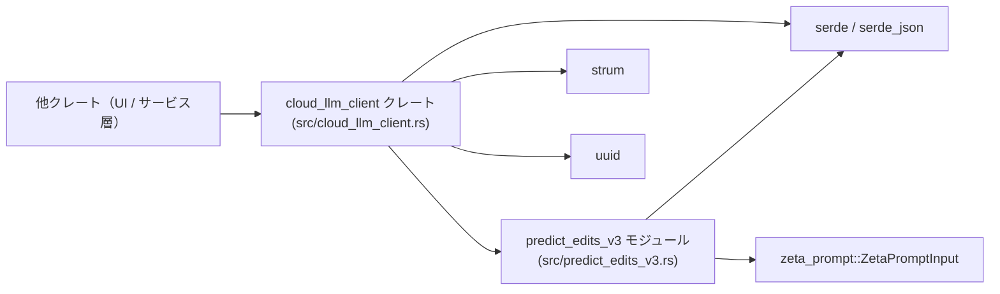
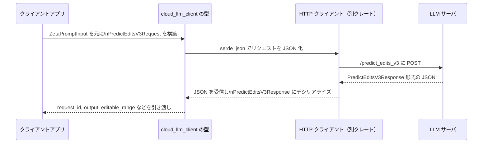

# crates/cloud_llm_client ディレクトリ解説

## 1. ざっくり一言

Zed のクラウド LLM サービスとやり取りするための **HTTP ヘッダー名の定数** と、  
各種エンドポイント（編集予測・補完・Web 検索・トークン数カウント・モデル一覧など）の  
**リクエスト／レスポンスのシリアライズ用データ型** を定義するクレートです。

---

## 2. このモジュールの役割

このディレクトリ（クレート）は、Zed の他コンポーネントとクラウド LLM サービスとの間でやり取りされる
JSON 形式のペイロードや HTTP ヘッダーを、Rust の型として表現する役割を持ちます。

- 各エンドポイントに対応する **リクエストボディ／レスポンスボディの構造体・列挙体** を定義します。
- LLM プロバイダやモデル、使用量（Usage）情報などを表す **ドメイン型** を定義します。
- クライアントとサーバが使う **共通ヘッダー名** を定数としてまとめます。
- ネットワーク I/O 自体は行わず、**シリアライズ／デシリアライズの「契約」** を提供する位置づけです。

### 2.1 アーキテクチャ上の位置づけと依存関係

このクレートはワークスペース内の他クレートから利用され、  
クラウド LLM サービス（サーバ）と共有するデータフォーマットを定義する層に位置します。

主な依存関係を簡略化した図は次のとおりです。



ポイント:

- `cloud_llm_client` がクレートのルートで、大部分の型と定数を定義します。
- `predict_edits_v3` モジュールは編集予測 v3 と「生の補完レスポンス」用の型を追加します。
- `serde` / `serde_json` により JSON との変換が行われます。
- `zeta_prompt` の `ZetaPromptInput` を `PredictEditsV3Request` にフラットに取り込みます。

---

## 3. 主要な機能一覧

このクレートが提供する主な機能を列挙します。

- **HTTP ヘッダー名の定数定義**
  - Zed クライアントのバージョン、トークン期限切れ・フォーマット不一致、使用量情報、ステータスメッセージ対応可否などを示すカスタムヘッダー名。

- **使用量（Usage）関連の型**
  - `UsageLimit`, `UsageData`, `CurrentUsage` による編集予測などの利用上限／使用状況の表現。

- **LLM プロバイダとモデル定義**
  - `LanguageModelProvider`, `LanguageModelId`, `LanguageModel`, `SupportedEffortLevel`, `ListModelsResponse` によるモデル一覧・推奨モデル・各種能力フラグの表現。

- **編集予測（Edit Predictions）用の型**
  - `PredictEditsBody`, `PredictEditsGitInfo`, `PredictEditsRequestTrigger`, `PredictEditsResponse` など。
  - 予測を受け入れる／拒否するための `AcceptEditPredictionBody`, `RejectEditPredictionsBody[Ref]`, `EditPredictionRejection`, `EditPredictionRejectReason`。
  - 1リクエストあたりの拒否件数上限 `MAX_EDIT_PREDICTION_REJECTIONS_PER_REQUEST`。

- **編集予測 v3 用の型**
  - `PredictEditsV3Request`, `PredictEditsV3Response` による v3 API ペイロード。
  - LLM プロバイダからの「生の補完レスポンス」を表す `RawCompletion*` 一式。

- **補完（Completion）とステータスイベント**
  - `CompletionBody` による任意 LLM プロバイダへの補完リクエスト表現。
  - `CompletionRequestStatus`, 汎用コンテナ `CompletionEvent<T>` によるステータス通知＋任意イベントのストリーミング表現。

- **Web 検索 API 用の型**
  - `WebSearchBody`, `WebSearchResponse`, `WebSearchResult`。

- **トークン数カウント API 用の型**
  - `CountTokensBody`, `CountTokensResponse`。

---

## 4. 関数・構造体の解説

### 4.1 主要な型一覧

代表的な型をグループごとにまとめた一覧です。

| 名前 | 種別 | 役割 / 用途 |
|------|------|-------------|
| `UsageLimit`, `UsageData`, `CurrentUsage` | 列挙体 / 構造体 | 編集予測などのリソース使用量と上限を表現します。`UsageLimit` は「数値上限」または「無制限」を区別します。 |
| `LanguageModelProvider` | 列挙体 | 利用可能な LLM プロバイダ（Anthropic / OpenAI / Google / xAI）を列挙します。serde / strum により文字列⇔enum 変換が行われます。 |
| `LanguageModelId` | 構造体（newtype） | モデル ID を所有権共有可能な `Arc<str>` で包んだ識別子型です。`Display` 実装により文字列として表示できます。 |
| `LanguageModel`, `SupportedEffortLevel`, `ListModelsResponse` | 構造体 | モデルのメタデータ（最大トークン数、ツール対応、画像対応など）、努力レベル設定、モデル一覧レスポンスを表します。 |
| `PredictEditsBody`, `PredictEditsResponse`, `PredictEditsGitInfo`, `PredictEditsRequestTrigger` | 構造体 / 列挙体 | 編集予測リクエスト・レスポンス、Git 情報、リクエストトリガー種別（CLI / Diagnostics など）を表現します。 |
| `AcceptEditPredictionBody`, `RejectEditPredictionsBody`, `RejectEditPredictionsBodyRef<'a>`, `EditPredictionRejection`, `EditPredictionRejectReason` | 構造体 / 列挙体 | 既に行われた編集予測をユーザーが「受け入れた」「拒否した」こと、およびその理由や表示状況をサーバに送るためのペイロードです。 |
| `CompletionBody` | 構造体 | 任意の LLM プロバイダに対する補完リクエストのボディを表現します。`provider_request` にプロバイダ固有の JSON を保持します。 |
| `CompletionRequestStatus`, `CompletionEvent<T>` | 列挙体 | 補完リクエストのキューイング・開始・失敗・ストリーム終了などの状態と、状態と任意イベントを混在させたストリームを表現します。 |
| `WebSearchBody`, `WebSearchResponse`, `WebSearchResult` | 構造体 | Web 検索 API のクエリ、レスポンス全体、検索結果 1 件を表現します。 |
| `CountTokensBody`, `CountTokensResponse` | 構造体 | プロバイダ固有リクエストのトークン数カウント API の入出力を表現します。 |
| `PredictEditsV3Request`, `PredictEditsV3Response` | 構造体 | 編集予測 v3 API のリクエスト／レスポンスを表します。リクエストは `ZetaPromptInput` をフラットに含み、レスポンスには編集対象範囲 `editable_range` が含まれます。 |
| `RawCompletionRequest`, `RawCompletionResponse`, `RawCompletionChoice`, `RawCompletionUsage` | 構造体 | LLM プロバイダ（主に OpenAI 形式を想起させる）からの「生の」補完リクエスト／レスポンス形式を表現します。 |

#### 主要フィールドのポイント（抜粋）

- `PredictEditsBody`
  - `outline`, `speculated_output`, `diagnostic_groups`, `git_info` は `Option` で、`None` の場合は JSON に出力されません。
  - `can_collect_data` はデフォルト `false` で、コメント上は `true` のときのみ `git_info` が付与される想定です（コード上での強制はありません）。
  - `trigger: PredictEditsRequestTrigger` はデフォルトで `Other` になります。

- `PredictEditsRequestTrigger`
  - `Testing`, `Diagnostics`, `Cli`, `Other` の 4 種類を `snake_case` でシリアライズします（例: `"cli"`）。
  - `Default` 実装は `Other` です。

- `PredictEditsV3Response`
  - `editable_range: Range<usize>` はコメントに「`cursor_excerpt` 内の **バイト範囲**」と明記されています。
  - そのため、UTF-8 文字境界とバイト境界の違いに注意が必要です。

- `CompletionRequestStatus`
  - `Queued { position }`, `Started`, `Failed { code, message, request_id, retry_after }`, `StreamEnded`, `Unknown` を持ちます。
  - `Unknown` は `#[serde(other)]` により、定義されていないステータスが来た場合に使われます（前方互換性のため）。

- `LanguageModel`
  - `supports_tools`, `supports_images`, `supports_thinking`, `supports_fast_mode`, `supports_streaming_tools`, `supports_parallel_tool_calls` などのブールフラグで、各モデルの機能サポート有無を表現します。
  - `max_token_count_in_max_mode` はオプションで、通常より大きなトークン数上限がある場合に使われます。

- `RejectEditPredictionsBodyRef<'a>`
  - フィールド `rejections: &'a [EditPredictionRejection]` を持ち、借用したスライスを直接シリアライズできるようにする軽量な送り専用ボディです。

### 4.2 重要な関数の詳細

このクレートには少数のメソッド／関数のみが定義されていますが、外部から利用される可能性のあるものを取り上げます。

#### `UsageLimit::from_str(value: &str) -> Result<UsageLimit, anyhow::Error>`

**概要**

文字列から `UsageLimit` 列挙体への変換を行います。  
`"unlimited"` という文字列は `UsageLimit::Unlimited` に、それ以外は 32 ビット整数として解釈し `UsageLimit::Limited(i32)` に変換されます。

**引数**

| 引数名 | 型 | 説明 |
|--------|----|------|
| `value` | `&str` | 使用上限を表す文字列。`"unlimited"` または整数文字列が想定されています。 |

**戻り値**

- `Ok(UsageLimit)`  
  - `"unlimited"` の場合: `UsageLimit::Unlimited`
  - それ以外で `i32` としてパースできる場合: `UsageLimit::Limited(parsed_value)`
- `Err(anyhow::Error)`  
  - 整数としてパースできない場合や `i32` の範囲外の場合。

**内部処理の流れ**

1. 引数 `value` が `"unlimited"` と完全一致するか判定します。
2. 一致する場合は `UsageLimit::Unlimited` を返します。
3. 一致しない場合は、`value.parse::<i32>()` を呼び出して 32 ビット整数として解釈します。
4. パースに成功した場合、その値を `UsageLimit::Limited(parsed)` に包んで返します。
5. 失敗した場合は `anyhow::Error` に `"failed to parse limit"` という文脈を付与して `Err` を返します。

**Examples（使用例）**

HTTP ヘッダー `"x-zed-edit-predictions-usage-limit"` の値を `UsageLimit` に変換するイメージです。

```rust
use cloud_llm_client::UsageLimit;
use std::str::FromStr;

fn parse_limit_from_header(header_value: &str) -> anyhow::Result<UsageLimit> {
    // "unlimited" または整数文字列を UsageLimit に変換する
    let limit = UsageLimit::from_str(header_value)?; // 失敗した場合は anyhow::Error が返る
    Ok(limit)
}
```

**Errors**

- `value` が `"unlimited"` でもなく、`i32` としてパースできない文字列（例: `"abc"`, `"50xyz"`）の場合にエラーになります。
- `i32` の範囲を超える非常に大きな数値（例: `"999999999999"`）もエラーになります。

**Edge cases（エッジケース）**

- `"unlimited"`（大小文字は区別されます）: `Unlimited` になります。
- `"0"`: `Limited(0)` になります。
- `"-1"` のような負の整数文字列: `Limited(-1)` になります（コード上、負数を禁止していません）。
- 空文字列 `""`: 整数パースに失敗し、エラーになります。

**使用上の注意点**

- 大小文字の違いは考慮されないため、`"Unlimited"` などはエラーになります。
- 負の値や意味のない値も `i32` としてパースできれば受け入れられるため、意味的なバリデーションが必要な場合は呼び出し側で行う必要があります。

---

#### `CompletionEvent<T>::into_status(self) -> Option<CompletionRequestStatus>`

**概要**

汎用的なストリームイベント `CompletionEvent<T>` を、  
「ステータスイベントかどうか」を判定して取り出すためのメソッドです。

**引数**

| 引数名 | 型 | 説明 |
|--------|----|------|
| `self` | `CompletionEvent<T>` | ステータスまたは任意イベントを保持する列挙体。消費されます。 |

**戻り値**

- `Some(CompletionRequestStatus)`  
  `self` が `CompletionEvent::Status(status)` だった場合、その `status` を返します。
- `None`  
  `self` が `CompletionEvent::Event(_)` だった場合。

**内部処理の流れ**

1. `match self` により列挙体のバリアントを判定します。
2. `CompletionEvent::Status(status)` の場合: `Some(status)` を返します。
3. `CompletionEvent::Event(_)` の場合: `None` を返します。

**Examples（使用例）**

```rust
use cloud_llm_client::{CompletionEvent, CompletionRequestStatus};

fn handle_status_event(event: CompletionEvent<serde_json::Value>) {
    // CompletionEvent を消費して、ステータスであれば取り出す
    if let Some(status) = event.into_status() {
        match status {
            CompletionRequestStatus::Queued { position } => {
                // キューの位置を扱う
                println!("queued at position {}", position);
            }
            CompletionRequestStatus::Started => {
                println!("request started");
            }
            CompletionRequestStatus::Failed { code, message, .. } => {
                eprintln!("failed: {} ({})", code, message);
            }
            CompletionRequestStatus::StreamEnded => {
                println!("stream ended");
            }
            CompletionRequestStatus::Unknown => {
                println!("unknown status received");
            }
        }
    } else {
        // Status 以外（Event）の場合の処理はここでは行わない
        println!("non-status event; ignored in this handler");
    }
}
```

**Edge cases**

- `CompletionEvent::Event(_)` を渡した場合は `None` が返ります。
- メソッドは `self` を消費するため、同じ `CompletionEvent` から `status` と `event` の両方を取り出すことはできません。

**使用上の注意点**

- ステータスだけを扱うハンドラと、イベント本体だけを扱うハンドラを分けたい場合に有用です。
- `self` が消費される点に注意し、同じ値を再利用したい場合は呼び出し側で必要に応じてクローンなどを検討する必要があります（`CompletionEvent<T>` 自体はこのクレートでは `Clone` 派生されていません）。

---

#### `CompletionEvent<T>::into_event(self) -> Option<T>`

**概要**

`CompletionEvent<T>` から、ステータスではなく「イベント本体」を取り出すためのメソッドです。

**引数**

| 引数名 | 型 | 説明 |
|--------|----|------|
| `self` | `CompletionEvent<T>` | ステータスまたは任意イベントを保持する列挙体。消費されます。 |

**戻り値**

- `Some(T)`  
  `self` が `CompletionEvent::Event(event)` だった場合、その `event` を返します。
- `None`  
  `self` が `CompletionEvent::Status(_)` だった場合。

**内部処理の流れ**

1. `match self` により列挙体のバリアントを判定します。
2. `CompletionEvent::Event(event)` の場合: `Some(event)` を返します。
3. `CompletionEvent::Status(_)` の場合: `None` を返します。

**Examples（使用例）**

```rust
use cloud_llm_client::CompletionEvent;

fn handle_payload_event(event: CompletionEvent<serde_json::Value>) {
    // Event バリアントであればペイロードを取り出す
    if let Some(payload) = event.into_event() {
        // ここでは serde_json::Value として扱っている
        println!("got event payload: {}", payload);
    } else {
        // Status の場合はここでは扱わない
        println!("status event; ignored in this handler");
    }
}
```

**Edge cases**

- `CompletionEvent::Status(_)` を渡すと `None` になります。
- `into_status` と同様、`self` を消費します。

**使用上の注意点**

- ステータスとペイロードを同時に利用する設計ではないため、両方を扱いたい場合は `match` 式で直接バリアントを分岐させるほうが適しています。

---

### 4.3 その他の型・定数の補足

#### HTTP ヘッダー関連定数

すべて `&'static str` の定数で、クライアントとサーバが同じキー名を使うための共通定義です。

- バージョン / 更新関連
  - `ZED_VERSION_HEADER_NAME`: クライアントの Zed バージョンを示すヘッダー名（`"x-zed-version"`）。
  - `MINIMUM_REQUIRED_VERSION_HEADER_NAME`: サーバ側が要求する最小 Zed バージョン（`"x-zed-minimum-required-version"`）。
- トークン状態
  - `EXPIRED_LLM_TOKEN_HEADER_NAME`: 期限切れトークンで失敗したことを示す（`"x-zed-expired-token"`）。
  - `OUTDATED_LLM_TOKEN_HEADER_NAME`: 構造が古くなったトークン（クレーム解析不可など）で失敗したことを示す（`"x-zed-outdated-token"`）。
- 編集予測の使用量
  - `EDIT_PREDICTIONS_USAGE_LIMIT_HEADER_NAME`: 使用上限値を伝えるヘッダー名。
  - `EDIT_PREDICTIONS_USAGE_AMOUNT_HEADER_NAME`: 現在使用量を伝えるヘッダー名。
  - `EDIT_PREDICTIONS_RESOURCE_HEADER_VALUE`: リソース名 `"edit_predictions"` を表す値。
- ステータスメッセージ対応可否
  - `CLIENT_SUPPORTS_STATUS_MESSAGES_HEADER_NAME`: クライアントがステータスメッセージ受信に対応していることをサーバに伝える。
  - `CLIENT_SUPPORTS_STATUS_STREAM_ENDED_HEADER_NAME`: クライアントが `"stream_ended"` ステータスに対応していることを伝える。
  - `SERVER_SUPPORTS_STATUS_MESSAGES_HEADER_NAME`: サーバ側がステータスメッセージ送信に対応していることをクライアントに伝える。
- その他
  - `CLIENT_SUPPORTS_X_AI_HEADER_NAME`: クライアントが xAI モデルを扱えるかどうかを伝える。
  - `MAX_EDIT_PREDICTION_REJECTIONS_PER_REQUEST`: 一度のリクエストで送信できる編集予測の拒否情報の最大件数（`100`）。

これらの定数は、HTTP クライアント／サーバ実装側でヘッダーキーの typo を防ぎ、仕様変更時の修正箇所を限定する目的で利用される想定です。

---

## 5. データフロー

ここでは、代表的なシナリオとして「編集予測 v3 リクエスト〜レスポンス」のデータフローを説明します。  
このクレート自体は HTTP 通信を行いませんが、型の使われ方を理解するための概念的なフローです。

1. アプリケーション側で、編集対象やコンテキスト情報をもとに `zeta_prompt::ZetaPromptInput` を構築します。
2. それを `PredictEditsV3Request { input, trigger }` に包み、`serde_json` で JSON にシリアライズします。
3. HTTP クライアント（別クレートの責務）が、この JSON をクラウド LLM サービスの編集予測 v3 エンドポイントに送信します。
4. サーバは編集予測を計算し、`PredictEditsV3Response` 形式に対応する JSON を返します。
5. HTTP クライアント側で JSON が受信され、`PredictEditsV3Response` にデシリアライズされます。
6. アプリケーションは `output` と `editable_range` を用いて、ローカルのテキストバッファに対する差分適用などを行います。

この流れを sequence diagram で表すと、次のようになります。



- `CompletionEvent<T>` を用いた補完ストリーミングや、`WebSearchResponse` を用いた Web 検索結果の受信も、同様にこのクレートの型を介して JSON ⇔ Rust 型の変換が行われる想定です。

---

## 6. 使い方（How to Use）

### 6.1 基本的な使用方法

#### 例1: 編集予測リクエスト（v1/v2 相当）の JSON を組み立てる

`PredictEditsBody` と `PredictEditsGitInfo` を使って、編集予測リクエストボディを JSON 文字列にシリアライズする例です。

```rust
use cloud_llm_client::{
    PredictEditsBody, PredictEditsGitInfo, PredictEditsRequestTrigger,
};
use serde_json;

fn build_predict_edits_request_json() -> serde_json::Result<String> {
    // Git リポジトリに関する任意情報を構築する
    let git_info = PredictEditsGitInfo {
        head_sha: Some("abcdef1234567890".to_string()),   // HEAD コミットの SHA
        remote_origin_url: Some("git@github.com:repo.git".to_string()), // origin の URL
        remote_upstream_url: None,                        // upstream がない場合は None
    };

    // 編集予測リクエスト本体を構築する
    let body = PredictEditsBody {
        outline: None,                                    // アウトラインがなければ None
        input_events: "type('hello')".to_string(),        // 入力イベント列（任意の形式）
        input_excerpt: "hel".to_string(),                 // 編集前後の抜粋テキスト
        speculated_output: Some("hello".to_string()),     // クライアント側の推測結果（任意）
        can_collect_data: true,                           // データ収集への同意
        diagnostic_groups: None,                          // 追加の診断情報がなければ None
        git_info: Some(git_info),                         // 上で構築した Git 情報
        trigger: PredictEditsRequestTrigger::Cli,         // CLI からのトリガーであることを指定
    };

    // Rust の構造体を JSON 文字列にシリアライズする
    let json = serde_json::to_string(&body)?;             // エラー時は serde_json::Error

    Ok(json)                                             // 呼び出し側に JSON 文字列を返す
}
```

この JSON を、HTTP クライアントから編集予測エンドポイントに送信する想定です。

#### 例2: UsageLimit をヘッダー文字列からパースする

`UsageLimit` を HTTP ヘッダーから復元する典型例です。

```rust
use cloud_llm_client::UsageLimit;
use std::str::FromStr;

fn read_usage_limit(header_value: &str) -> anyhow::Result<UsageLimit> {
    // 文字列から UsageLimit をパースする
    let limit = UsageLimit::from_str(header_value)?; // "unlimited" または整数文字列を想定

    // あるいは汎用的な parse API も利用可能
    // let limit: UsageLimit = header_value.parse()?;

    Ok(limit)                                         // 成功すれば UsageLimit を返す
}
```

### 6.2 よくある使用パターン

#### パターン1: CompletionEvent でステータスとイベントを分けて処理する

補完ストリーミングの受信側で、ステータスイベントとペイロードイベントを分けて処理したい場合のパターンです。

```rust
use cloud_llm_client::{CompletionEvent, CompletionRequestStatus};

fn handle_completion_stream_event(event: CompletionEvent<serde_json::Value>) {
    match event {
        CompletionEvent::Status(status) => {
            // ステータスに応じた処理を行う
            match status {
                CompletionRequestStatus::Queued { position } => {
                    println!("queued at position {}", position); // キュー順を表示
                }
                CompletionRequestStatus::Started => {
                    println!("request started");                 // 処理開始
                }
                CompletionRequestStatus::Failed { message, .. } => {
                    eprintln!("request failed: {}", message);    // エラーメッセージを表示
                }
                CompletionRequestStatus::StreamEnded => {
                    println!("stream ended");                    // ストリーム終了
                }
                CompletionRequestStatus::Unknown => {
                    println!("unknown status");                  // 未知ステータス
                }
            }
        }
        CompletionEvent::Event(payload) => {
            // 任意のイベントペイロードを処理する
            println!("got completion chunk: {}", payload);       // ここでは JSON をそのまま表示
        }
    }
}
```

`into_status` / `into_event` を使う代わりに `match` を使うと、1 つのイベントからステータスかペイロードかをシンプルに分岐できます。

#### パターン2: モデル一覧レスポンスから推奨モデルを選択する

`ListModelsResponse` を用いて、推奨モデルの ID を取得するイメージです。

```rust
use cloud_llm_client::{LanguageModelId, ListModelsResponse};

fn pick_default_model(resp: &ListModelsResponse) -> Option<&LanguageModelId> {
    // recommended_models があればその先頭を、なければ default_model を利用する
    if let Some(first) = resp.recommended_models.first() {
        Some(first)                                  // 推奨モデルのうち最初のもの
    } else {
        resp.default_model.as_ref()                  // デフォルトモデル（Option）の参照
    }
}
```

### 6.3 使用上の注意点

このクレート全体を利用する際に共通して注意したい点をまとめます。

- **HTTP 通信は別クレートの責務**
  - ここで定義されている型は、あくまで JSON との変換用です。
  - 実際の HTTP クライアント／サーバ実装では、これらの型を `serde_json::to_string` / `from_str` などで包んで使う前提になります。

- **Option フィールドと `skip_serializing_if`**
  - 多くのフィールドが `Option` かつ `skip_serializing_if = "Option::is_none"` となっています。
  - `None` の場合、そのフィールドは JSON に現れません。API 契約上、必須かどうかはサーバ側仕様に依存します。

- **`PredictEditsV3Response::editable_range` はバイト範囲**
  - コメントで「editable region byte range」と明記されています。
  - UTF-8 文字列に対してこの範囲でスライスを行う際は、バイトオフセットが文字境界と一致していることを前提とする必要があります。

- **`UsageLimit` の値域**
  - `from_str` は `i32` を受け付けるため、負の値や大きな値も技術的には受け入れられます。
  - 意味的に妥当な値かどうかは呼び出し側で判断する必要があります。

- **`CompletionRequestStatus::Unknown` の存在**
  - 新しいステータスがサーバ側で追加された場合でも、クライアント側では `Unknown` として受け取れます。
  - ただし、その意味を知らないため、アプリケーション側の扱い（ログに出す、汎用的なエラーとみなすなど）を決めておく必要があります。

- **`MAX_EDIT_PREDICTION_REJECTIONS_PER_REQUEST` の順守**
  - 一度に送信する `EditPredictionRejection` の件数は、この定数を超えないようにすることが前提とされています。
  - 超えた場合にサーバがどのように扱うかは、このコードからは読み取れません。

- **`RejectEditPredictionsBodyRef<'a>` とライフタイム**
  - 既存の `Vec<EditPredictionRejection>` などをコピーせずにシリアライズしたいときに便利ですが、借用元のライフタイムが十分に長い必要があります。

---

## 7. 関連ファイル

このディレクトリ内および密接に関連するファイル／モジュールの一覧です。

| パス / モジュール | 役割 / 関係 |
|------------------|------------|
| `cloud_llm_client/Cargo.toml` | クレート名・バージョン・依存関係（`anyhow`, `serde`, `serde_json`, `strum`, `uuid`, `zeta_prompt` など）を定義しています。 |
| `cloud_llm_client/src/cloud_llm_client.rs` | クレートのルートファイルです。HTTP ヘッダー定数、Usage・モデル・編集予測・補完・Web 検索・トークンカウント関連の型を定義し、`predict_edits_v3` モジュールを公開します。 |
| `cloud_llm_client/src/predict_edits_v3.rs` | `PredictEditsV3Request` / `PredictEditsV3Response` と生の補完フォーマット `RawCompletion*` を定義するサブモジュールです。 |
| 外部クレート `zeta_prompt`（ワークスペース依存、パス不明） | `PredictEditsV3Request` が `ZetaPromptInput` を `flatten` して取り込むために利用しています。このチャンクからは具体的な実装内容は分かりません。 |

このクレートを利用する際は、ここで定義された型を中心に、別クレートで HTTP 層・ビジネスロジック層を構成する形になります。
