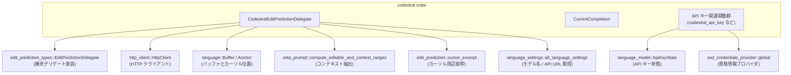
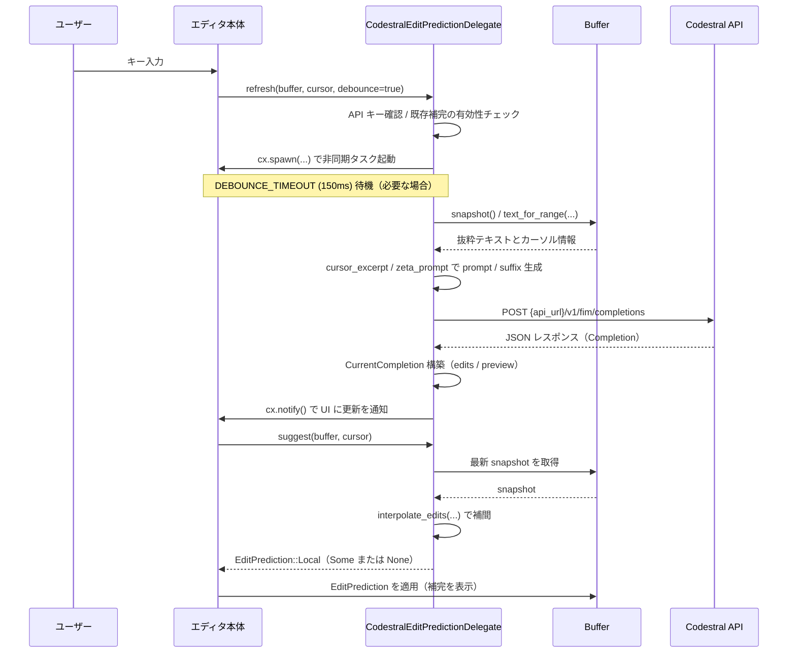

# crates/codestral/ コード解説

## 0. ざっくり一言

`crates/codestral` は、Mistral の Codestral Fill-in-the-Middle API を Zed の「インライン編集予測（edit prediction）」に統合するためのクレートです。  
API キー管理・HTTP 通信・プロンプト生成・補完結果の状態管理をまとめて扱います。

---

## 1. このモジュールの役割

### 1.1 概要

- このモジュールは **Codestral のコード補完 API** を利用して、エディタ内でのインライン補完候補を生成する役割を持ちます。
- 具体的には、以下を行います。
  - API キーの取得・キャッシュ（環境変数や資格情報プロバイダ経由）
  - エディタバッファからプロンプト／サフィックス文字列の生成
  - Codestral FIM API への HTTP リクエストとレスポンスのパース
  - 取得した補完を `EditPrediction` として提供し、ユーザー編集に応じて補完を補間（インターポレーション）する

### 1.2 アーキテクチャ内での位置づけ

このクレートは Zed の内部フレームワーク（`gpui`, `language`, `edit_prediction_types` など）と Codestral API の橋渡しをします。



- `CodestralEditPredictionDelegate` は `EditPredictionDelegate` トレイトを実装し、Zed の補完サブシステムから呼び出されます。
- API キーや API URL は `language_model::ApiKeyState` と言語設定 (`all_language_settings`) を通じて管理されます。
- プロンプト生成では、`edit_prediction::cursor_excerpt` と `zeta_prompt` が提供するユーティリティを利用しています。

### 1.3 設計上のポイント

- **API キーのグローバル管理**  
  - `GlobalCodestralApiKey` を `gpui::Global` として登録し、アプリ全体で 1 つの `ApiKeyState` を共有します。
- **状態を持つデリゲート**  
  - `CodestralEditPredictionDelegate` 自体が以下の状態を持ちます。
    - `pending_request`: 進行中の HTTP リクエスト（`Task<Result<()>>`）
    - `current_completion`: 最新の補完内容と対応するバッファスナップショット
- **補完結果の補間（インターポレーション）**  
  - `CurrentCompletion` が元のスナップショットと最新スナップショットを比較し、ユーザー編集に応じて補完範囲を補正します。
- **デバウンス制御**  
  - `DEBOUNCE_TIMEOUT`（150ms）を用いて、タイピング中のリクエスト頻度を抑制します。
- **設定との連携**  
  - モデル名・API URL・最大トークン数は `all_language_settings(None, cx).edit_predictions.codestral` から取得し、ユーザー設定を反映できる構造になっています。

---

## 2. 主要な機能一覧

- API キー管理:
  - `codestral_api_key_state`, `codestral_api_key`, `load_codestral_api_key` による Codestral API キーの取得・ロード
- API URL 管理:
  - `codestral_api_url` による設定値またはデフォルト URL（`https://codestral.mistral.ai`）の解決
- 補完デリゲート実装:
  - `CodestralEditPredictionDelegate` と `EditPredictionDelegate` 実装による補完リクエスト・状態管理
- プロンプト生成:
  - `cursor_excerpt` と `zeta_prompt` を使ったカーソル付近のコンテキスト抽出と `prompt` / `suffix` の生成
- Codestral API 呼び出し:
  - `fetch_completion` による `/v1/fim/completions` エンドポイントへの HTTP POST
  - `CodestralRequest` / `CodestralResponse` 構造体による JSON シリアライズ／デシリアライズ
- 補完の補間と提示:
  - `CurrentCompletion::interpolate` による編集の補間
  - `suggest` による `EditPrediction::Local` の生成と返却

---

## 3. 関数・構造体の解説

### 3.1 型一覧（構造体・列挙体など）

| 名前 | 種別 | 公開 | 役割 / 用途 |
|------|------|------|-------------|
| `CurrentCompletion` | 構造体 | 非公開 | 取得済み補完と、その生成時の `BufferSnapshot`・編集内容・プレビューを保持し、後から補間を行うための内部状態です。 |
| `CodestralEditPredictionDelegate` | 構造体 | 公開 | Codestral 補完を提供するデリゲート本体で、`EditPredictionDelegate` を実装します。 |
| `GlobalCodestralApiKey` | 構造体（newtype） | 非公開 | `Entity<ApiKeyState>` をラップし、`gpui::Global` として登録するための型です。 |
| `CodestralRequest` | 構造体 | 公開 | Codestral FIM API へのリクエストボディを表すシリアライズ可能な型です。 |
| `CodestralResponse` | 構造体 | 公開 | Codestral API からのレスポンス全体をデシリアライズするための型です。 |
| `Usage` | 構造体 | 公開 | レスポンス中のトークン使用量情報（`prompt_tokens`, `completion_tokens`, `total_tokens`）を保持します。 |
| `Choice` | 構造体 | 公開 | レスポンスに含まれる 1 つの候補（インデックス・メッセージ・終了理由）を表します。 |
| `Message` | 構造体 | 公開 | `Choice` の中のメッセージ本体で、`content` に補完テキスト、`role` にロール名が入ります。 |

補助的な定数・静的変数:

- `pub const CODESTRAL_API_URL: &str`  
  - デフォルトの API ベース URL（`https://codestral.mistral.ai`）。
- `pub const DEBOUNCE_TIMEOUT: Duration`  
  - デバウンス時間（150ms）。
- `static CODESTRAL_API_KEY_ENV_VAR: LazyLock<EnvVar>`  
  - 環境変数 `CODESTRAL_API_KEY` を指す `EnvVar` を遅延初期化する静的変数です。

---

### 3.2 関数詳細（最大 7 件）

#### `codestral_api_key(cx: &App) -> Option<Arc<str>>`

**概要**

- 現在のアプリケーションコンテキストから Codestral 用の API キーを取得します。
- API URL ごとにキーが管理されているため、現在の `codestral_api_url(cx)` に対応するキーのみを返します。

**引数**

| 引数名 | 型 | 説明 |
|--------|----|------|
| `cx` | `&App` | `gpui` のアプリケーションコンテキスト。グローバル状態や設定にアクセスするために使われます。 |

**戻り値**

- `Option<Arc<str>>`  
  - Some: 現在の API URL に対する API キー文字列。  
  - None: API キーがまだロードされていない、または設定されていない状態。

**内部処理の流れ**

1. `codestral_api_url(cx)` を呼び出して現在の API URL を取得します。
2. `cx.try_global::<GlobalCodestralApiKey>()` でグローバルな `ApiKeyState` エンティティを探します。
3. 見つからなければ `None` を返します。
4. 見つかった場合、そのエンティティを `read(cx)` し、`key(&url)` で該当 URL 向けのキーを取得して返します。

**Examples（使用例）**

```rust
use codestral::codestral_api_key;
use gpui::App;

// `app` は既に初期化済みの `gpui::App` とする
fn print_codestral_key(app: &App) {
    if let Some(key) = codestral_api_key(app) {
        // 実際のアプリケーションではログに出さない方が安全
        log::debug!("Codestral API key loaded (length = {})", key.len());
    } else {
        log::warn!("Codestral API key is not loaded");
    }
}
```

**Errors / Panics**

- この関数自身は `Result` を返さず、パニックを起こしうる操作も行っていません。
- 内部で `try_global` と `key` を使っていますが、いずれも `Option` ベースで扱われているため、失敗時は `None` が返ります。

**Edge cases（エッジケース）**

- API キー未ロード / 未設定:
  - `GlobalCodestralApiKey` が存在しない、または `ApiKeyState` に該当 URL のキーが無い場合は `None`。
- API URL を切り替えた場合:
  - URL ごとにキーが管理されている前提のため、新しい URL に対してキーが未設定の場合も `None`。

**使用上の注意点**

- 補完を有効にするには、`load_codestral_api_key` や `ensure_api_key_loaded` をどこかで呼び出し、キーをロードしておく必要があります。
- 本番環境では、実際の API キー文字列をログに出力しないよう注意します。

---

#### `load_codestral_api_key(cx: &mut App) -> Task<Result<(), AuthenticateError>>`

**概要**

- 資格情報プロバイダ（`zed_credentials_provider`）を用いて Codestral API キーを必要に応じてロードする非同期タスクを生成します。
- API キーが既にロード済みの場合は、`ApiKeyState` 側の `load_if_needed` の挙動に従います。

**引数**

| 引数名 | 型 | 説明 |
|--------|----|------|
| `cx` | `&mut App` | `gpui::App`。API キー状態の更新や資格情報プロバイダへのアクセスに利用します。 |

**戻り値**

- `Task<Result<(), AuthenticateError>>`  
  - 非同期に実行されるタスク。成功時は `Ok(())`、認証・取得に失敗した場合は `AuthenticateError` を返します。

**内部処理の流れ**

1. `zed_credentials_provider::global(cx)` でグローバルな資格情報プロバイダを取得します。
2. `codestral_api_url(cx)` で現在の API URL を取得します。
3. `codestral_api_key_state(cx)` で `ApiKeyState` エンティティを取得または生成します。
4. `ApiKeyState::load_if_needed(api_url, |s| s, credentials_provider, cx)` を呼び出す更新タスクを返します。

**Examples（使用例）**

```rust
use codestral::load_codestral_api_key;
use gpui::App;

// アプリ起動時などに API キーのプリロードを開始する例
fn preload_codestral_key(app: &mut App) {
    // Task を detach してバックグラウンドで実行
    load_codestral_api_key(app).detach();
}
```

**Errors / Panics**

- 認証情報の取得に失敗した場合は `Err(AuthenticateError)` になります。
- 関数自体はパニックを起こす処理を含みません。

**Edge cases（エッジケース）**

- 資格情報プロバイダが利用できない場合:
  - 内部の `load_if_needed` の実装次第ですが、`AuthenticateError` などのエラーになる可能性があります（詳細はこのチャンクからは分かりません）。
- 既にキーがロード済みの場合:
  - `load_if_needed` が「何もしない」動作をすることがコメントから推測されますが、正確な挙動は `ApiKeyState` の実装依存です。

**使用上の注意点**

- 戻り値は `Task` なので、忘れずに `detach()` するか、どこかで `await` する必要があります。
- エラー処理を行いたい場合は `await` して `Result` を明示的に扱う設計にすることが考えられます。

---

#### `codestral_api_url(cx: &App) -> SharedString`

**概要**

- 現在の設定に基づいて Codestral API のベース URL を返します。
- 設定に URL が指定されていない場合は、`CODESTRAL_API_URL`（`https://codestral.mistral.ai`）をデフォルトとして使用します。

**引数**

| 引数名 | 型 | 説明 |
|--------|----|------|
| `cx` | `&App` | 言語設定（`all_language_settings`）にアクセスするためのアプリケーションコンテキストです。 |

**戻り値**

- `SharedString`  
  - 有効な API ベース URL。`SharedString` は `gpui` が共有文字列として使う型です。

**内部処理の流れ**

1. `all_language_settings(None, cx)` でグローバル言語設定を取得します。
2. `edit_predictions.codestral.api_url` を参照します。
3. その値が `Some(url)` であればクローンして返し、`None` なら `CODESTRAL_API_URL.to_string()` を使います。
4. 最後に `.into()` で `SharedString` に変換して返します。

**Examples（使用例）**

```rust
use codestral::codestral_api_url;
use gpui::App;

fn log_codestral_url(app: &App) {
    let url = codestral_api_url(app);
    log::info!("Codestral API URL = {}", url);
}
```

**Errors / Panics**

- 設定の取得や文字列操作は通常パニックしない形で書かれており、この関数自身にパニック要因は見当たりません。

**Edge cases（エッジケース）**

- `edit_predictions.codestral.api_url` が設定されていない場合:
  - 必ず `https://codestral.mistral.ai` が使われます。
- API URL が空文字列など不正な形式でも:
  - そのまま返却されます。HTTP リクエスト時に問題になる可能性がありますが、この関数では検証を行っていません。

**使用上の注意点**

- 無効な URL を設定すると、後続の HTTP リクエストでエラーになる可能性があります。
- カスタムの Codestral 互換エンドポイントを使用する場合、この URL を設定で上書きする前提の設計になっています。

---

#### `CodestralEditPredictionDelegate::new(http_client: Arc<dyn HttpClient>) -> Self`

**概要**

- Codestral 補完用デリゲートのインスタンスを生成します。
- 呼び出し側から HTTP クライアントの実装を注入する設計になっています。

**引数**

| 引数名 | 型 | 説明 |
|--------|----|------|
| `http_client` | `Arc<dyn HttpClient>` | HTTP リクエスト送信に使用するクライアント。`Arc` で共有される想定です。 |

**戻り値**

- `CodestralEditPredictionDelegate`  
  - `pending_request` と `current_completion` が `None` に初期化されたデリゲート。

**内部処理の流れ**

1. 構造体フィールドに引数 `http_client` を保存します。
2. `pending_request` と `current_completion` を `None` に設定して構造体を返します。

**Examples（使用例）**

```rust
use std::sync::Arc;
use codestral::CodestralEditPredictionDelegate;
use http_client::HttpClient;

fn create_delegate(http_client: Arc<dyn HttpClient>) -> CodestralEditPredictionDelegate {
    // HttpClient 実装はアプリケーション側で用意する
    CodestralEditPredictionDelegate::new(http_client)
}
```

**Errors / Panics**

- コンストラクタでエラーは発生しません。

**Edge cases（エッジケース）**

- `http_client` に `Arc::clone` で共有される重いクライアントを渡す場合、メモリや接続プールの扱いは呼び出し側に依存します。

**使用上の注意点**

- `HttpClient` は非同期 HTTP を扱える必要があります。
- 同じ `HttpClient` を複数のデリゲートで共有しても問題のない設計であることが前提です（`Arc` を要求しているため）。

---

#### `CodestralEditPredictionDelegate::fetch_completion(...) -> Result<String>`

```rust
async fn fetch_completion(
    http_client: Arc<dyn HttpClient>,
    api_key: &str,
    prompt: String,
    suffix: String,
    model: String,
    max_tokens: Option<u32>,
    api_url: String,
) -> Result<String>
```

**概要**

- Codestral の Fill-in-the-Middle API `/v1/fim/completions` を呼び出し、補完テキストを取得します。
- HTTP リクエストの組み立てからレスポンス JSON のパースまでをカプセル化しています。

**引数**

| 引数名 | 型 | 説明 |
|--------|----|------|
| `http_client` | `Arc<dyn HttpClient>` | HTTP 通信用クライアント。 |
| `api_key` | `&str` | `Authorization: Bearer` に渡す Codestral API キー。 |
| `prompt` | `String` | カーソルより前のコンテキスト。FIM のプレフィックスに相当。 |
| `suffix` | `String` | カーソルより後のコンテキスト。FIM のサフィックスに相当。 |
| `model` | `String` | 使用するモデル名（例: `"codestral-latest"`）。 |
| `max_tokens` | `Option<u32>` | 補完部分に割り当てるトークン上限。指定がなければ 350 にフォールバック。 |
| `api_url` | `String` | ベース URL（例: `https://codestral.mistral.ai`）。 |

**戻り値**

- `Result<String>`  
  - Ok: 補完テキスト（`choice.message.content`）。  
  - Err: HTTP エラー・ステータス異常・JSON パース失敗などを含む `anyhow::Error`。

**内部処理の流れ**

1. `Instant::now()` で開始時刻を記録し、ログを出力します。
2. `CodestralRequest` を組み立てます。
   - `max_tokens` は `max_tokens.or(Some(350))` でデフォルト 350 に補完。
   - `temperature = 0.2`, `top_p = 1.0`, `stream = false` を固定値で使用。
3. `serde_json::to_string(&request)` で JSON 文字列化します。
4. `http_client::Request::builder()` で POST リクエストを構築します。
   - URL: `{api_url}/v1/fim/completions`
   - ヘッダー: `Content-Type: application/json` と `Authorization: Bearer {api_key}`。
5. `http_client.send(http_request).await?` でリクエストを送信し、レスポンスを取得します。
6. ステータスコードを確認し、成功でなければボディを読み込んでエラーとともに `Err(anyhow!(...))` を返します。
7. 成功時はボディ全体を文字列に読み込み、`serde_json::from_str` で `CodestralResponse` にデシリアライズします。
8. 最初の `choice` を取り出し、その `message.content` を補完テキストとして返します。
9. `choices` が空の場合はログを出し、`Err(anyhow!("No completion returned from Codestral"))` を返します。

**Examples（使用例）**

この関数は内部利用専用（非公開）ですが、`refresh` 内での使われ方を簡略化して示します。

```rust
async fn simple_call_example(
    http_client: Arc<dyn HttpClient>,
    api_key: &str,
) -> anyhow::Result<String> {
    let prompt = "fn add(a: i32, b: i32) -> i32 {\n    ".to_string();
    let suffix = "\n}".to_string();
    let model = "codestral-latest".to_string();
    let api_url = "https://codestral.mistral.ai".to_string();

    let completion = CodestralEditPredictionDelegate::fetch_completion(
        http_client,
        api_key,
        prompt,
        suffix,
        model,
        None,      // max_tokens 未指定 → デフォルト 350
        api_url,
    ).await?;

    Ok(completion)
}
```

**Errors / Panics**

- `?` 演算子を通じて以下のエラーが `anyhow::Error` として伝播します。
  - HTTP リクエスト構築エラー
  - ネットワークエラー
  - ステータスコードが非成功（`2xx` 以外）の場合
  - レスポンスボディの読み取りエラー
  - JSON パースエラー
- 関数自体はパニックしません。

**Edge cases（エッジケース）**

- `suffix` が空文字列の場合:
  - `request.suffix` は `None` になり、FIM API にサフィックス無しでリクエストします。
- `choices` が空配列の場合:
  - ログに「No completion returned in response」が出力され、エラーとして扱われます。
- レスポンスに `usage` や `choices[0].message.content` が欠けている場合:
  - デシリアライズまたはアクセス時にエラーが発生します。

**使用上の注意点**

- API 仕様の変更（フィールド名や構造）があった場合、`CodestralRequest` / `CodestralResponse` を更新しないとこの関数が失敗する可能性があります。
- `max_tokens` のデフォルト 350 はここで決め打ちされているため、設定から上書きしたい場合は `refresh` 側で `max_tokens` を渡しています。

---

#### `CodestralEditPredictionDelegate::refresh(...)`

```rust
fn refresh(
    &mut self,
    buffer: Entity<Buffer>,
    cursor_position: language::Anchor,
    debounce: bool,
    cx: &mut Context<Self>,
)
```

**概要**

- 現在のカーソル位置とバッファ内容に基づいて、新しい Codestral 補完を非同期に取得するトリガーを発行します。
- デバウンス指定がある場合、`DEBOUNCE_TIMEOUT`（150ms）待機してからリクエストします。
- 既存の補完がまだ有効であれば、新規リクエストは行いません。

**引数**

| 引数名 | 型 | 説明 |
|--------|----|------|
| `buffer` | `Entity<Buffer>` | 対象バッファ。`gpui` のエンティティとして渡されます。 |
| `cursor_position` | `Anchor` | 現在のカーソル位置。論理的な位置を表すアンカーです。 |
| `debounce` | `bool` | `true` の場合はデバウンスタイマーを使い、一定時間入力が止まるまで待ってからリクエストします。 |
| `cx` | `&mut Context<Self>` | デリゲートインスタンスに紐づく `gpui` コンテキスト。タスクの spawn や状態更新に使用します。 |

**戻り値**

- ありません（`()`）。  
  非同期リクエストは内部で `cx.spawn` され、結果は後から状態に反映されます。

**内部処理の流れ**

1. ログに `Refresh called` を出力します。
2. `codestral_api_key(cx)` で API キーを取得し、`None` なら警告ログを出して終了します（リクエストしない）。
3. `buffer.read(cx).snapshot()` で現在のバッファスナップショットを取得します。
4. 既存の `current_completion` がある場合:
   - `current_completion.interpolate(&snapshot)` を試し、`Some` が返る（まだ補間できる）なら新しいリクエストは行わずに終了します。
5. 言語設定から `model` と `max_tokens` を取得し、`codestral_api_url(cx)` から `api_url` を決定します。
6. `cx.spawn` で非同期タスクを起動し、その `Task` を `self.pending_request` に保存します。
7. 非同期タスク内の主な処理:
   - `debounce == true` なら `cx.background_executor().timer(DEBOUNCE_TIMEOUT).await` で待機。
   - `cursor_position.to_offset(&snapshot)` でカーソルのバイトオフセットを取得。
   - `cursor_excerpt::compute_cursor_excerpt` でカーソル周囲の抜粋範囲とカーソル位置（抜粋内）を算出。
   - `cursor_excerpt::compute_syntax_ranges` でシンタックス情報を取得。
   - `snapshot.text_for_range(excerpt_point_range).collect()` で抜粋テキストを生成。
   - `zeta_prompt::compute_editable_and_context_ranges` で編集可能部分とコンテキスト部分の範囲を計算し、コンテキスト部分だけを利用。
   - コンテキスト内のカーソル位置を元に `prompt`（前半）と `suffix`（後半）を作成。
   - `fetch_completion(...)` を呼び、補完テキストを取得。
   - 補完テキストが空（`trim().is_empty()`）ならログを出して終了。
   - `edits` として `(cursor_position..cursor_position, completion_text)` の 1 つの挿入編集を作成。
   - `buffer.read_with(... preview_edits ...)` で `EditPreview` を生成。
   - `this.update` で `CurrentCompletion { snapshot, edits, edit_preview }` を `current_completion` に保存し、`pending_request` を `None` にして `cx.notify()` を呼びます。

**Examples（使用例）**

実際には Zed の内部ループから呼び出されますが、概念的な呼び出し例を示します。

```rust
use codestral::CodestralEditPredictionDelegate;
use gpui::{Context, Entity};
use language::{Buffer, Anchor};

// `delegate`, `buffer`, `cursor`, `cx` は既に存在するものとする
fn trigger_refresh(
    delegate: &mut CodestralEditPredictionDelegate,
    buffer: Entity<Buffer>,
    cursor: Anchor,
    cx: &mut Context<CodestralEditPredictionDelegate>,
) {
    // ユーザー入力のたびに debounce = true で呼び出す想定
    delegate.refresh(buffer, cursor, true, cx);
}
```

**Errors / Panics**

- 非同期タスク内で発生したエラー（HTTP 失敗など）はログに記録され、`pending_request` が `None` に戻されます。
- `this.update` などで `?` を使っていますが、失敗時は `Err(e)` としてタスクの `Result` に反映されます。
- 関数自体はパニックを起こしません。

**Edge cases（エッジケース）**

- **API キー未設定**:
  - `codestral_api_key` が `None` の場合、警告ログを出して即時 return し、リクエストを行いません。
- **既存補完がまだ有効**:
  - `CurrentCompletion::interpolate` が `Some` を返した場合、新しい HTTP リクエストは行われません（既存の補完を使い続ける）。
- **補完テキストが空白のみ**:
  - `completion_text.trim().is_empty()` の場合、補完は無視され、`current_completion` は更新されません。
- **バッファが後から大きく変更された場合**:
  - 次回の `suggest` で `interpolate` が `None` を返し、補完が提示されなくなる可能性があります。

**使用上の注意点**

- `refresh` は非同期タスクを spawn するだけであり、その場で `EditPrediction` は返しません。UI 側は後続の `suggest` 呼び出しで結果を取得する必要があります。
- `debounce` に `true` を指定すると、タイピング速度が速い場合でもリクエスト数を抑えられますが、応答までのラグが増えます。

---

#### `CodestralEditPredictionDelegate::suggest(...) -> Option<EditPrediction>`

```rust
fn suggest(
    &mut self,
    buffer: &Entity<Buffer>,
    _cursor_position: Anchor,
    cx: &mut Context<Self>,
) -> Option<EditPrediction>
```

**概要**

- `refresh` によって準備された `current_completion` をもとに、最新のバッファスナップショットに合わせて補完編集を補間し、`EditPrediction` として返します。
- ユーザーの編集と補完が衝突している場合は `None` を返し、補完を無効化します。

**引数**

| 引数名 | 型 | 説明 |
|--------|----|------|
| `buffer` | `&Entity<Buffer>` | 現在のバッファ。最新のスナップショットを取得するために使用されます。 |
| `_cursor_position` | `Anchor` | 現在のカーソル位置ですが、`suggest` 内では使用されていません。 |
| `cx` | `&mut Context<Self>` | デリゲート用コンテキスト。バッファの読み取りなどに使用されます。 |

**戻り値**

- `Option<EditPrediction>`  
  - `Some(EditPrediction::Local { ... })`：補完を提示可能な場合。  
  - `None`：補完が存在しない、または補間が不可能な場合。

**内部処理の流れ**

1. `self.current_completion.as_ref()?` で現在の補完状態を取得します（無ければ `None` を返して終了）。
2. `buffer.read(cx)` で最新スナップショットを取得します。
3. `current_completion.interpolate(&buffer.snapshot())?` で補完編集の補間を行います。
   - 衝突などで補間できない場合は `None` を返します。
4. 補間後の `edits` が空なら `None` を返します。
5. `EditPrediction::Local` を構築して返します。
   - `cursor_position: None`（カーソル位置の変更は行わない）
   - `edit_preview: Some(current_completion.edit_preview.clone())`

**Examples（使用例）**

```rust
use codestral::CodestralEditPredictionDelegate;
use edit_prediction_types::EditPrediction;
use gpui::{Context, Entity};
use language::{Buffer, Anchor};

fn poll_suggestion(
    delegate: &mut CodestralEditPredictionDelegate,
    buffer: &Entity<Buffer>,
    cursor: Anchor,
    cx: &mut Context<CodestralEditPredictionDelegate>,
) -> Option<EditPrediction> {
    delegate.suggest(buffer, cursor, cx)
}
```

**Errors / Panics**

- `interpolate_edits` の内部実装に依存しますが、この関数内では `?` を `Option` に対してのみ使用しており、エラー型は扱っていません。
- パニックを引き起こす操作は行っていません。

**Edge cases（エッジケース）**

- **current_completion が未設定**:
  - `refresh` がまだ完了していない場合などは `None` を返します。
- **ユーザー編集との衝突**:
  - `interpolate` が `None` を返した場合、補完は提示されません。
- **補間結果の edits が空**:
  - 編集が不要と判断された場合（全ての補完がすでに打ち消されたなど）、`None` を返します。

**使用上の注意点**

- `edit_preview` は元のスナップショットに基づいて計算されているため、補間後の細かな差異とは完全には一致しない可能性がありますが、そのまま再利用されています。
- UI 側では、`None` が返った場合は Codestral 補完を表示しない制御を行う前提です。

---

### 3.3 その他の関数

補助的な関数・メソッドを一覧で示します。

| 関数名 / メソッド名 | 役割（1 行） |
|---------------------|--------------|
| `codestral_api_key_state(cx: &mut App) -> Entity<ApiKeyState>` | グローバルな `ApiKeyState` エンティティを取得または生成します。 |
| `CodestralEditPredictionDelegate::ensure_api_key_loaded(cx: &mut App)` | `load_codestral_api_key(cx).detach()` を呼ぶショートカットで、API キーのロードをバックグラウンド開始します。 |
| `CurrentCompletion::interpolate(&self, new_snapshot: &BufferSnapshot) -> Option<Vec<(Range<Anchor>, Arc<str>)>>` | 元のスナップショットから新しいスナップショットへの差分に合わせて補完編集を補間します。 |
| `CodestralEditPredictionDelegate::name() -> &'static str` | デリゲートの内部名 `"codestral"` を返します。 |
| `CodestralEditPredictionDelegate::display_name() -> &'static str` | UI 表示用のラベル `"Codestral"` を返します。 |
| `CodestralEditPredictionDelegate::show_predictions_in_menu() -> bool` | 補完候補をメニューに表示するかどうかを示すフラグ（常に `true`）。 |
| `CodestralEditPredictionDelegate::icons(&self, _cx: &App) -> EditPredictionIconSet` | Codestral 用のアイコンセット（`IconName::AiMistral`）を返します。 |
| `CodestralEditPredictionDelegate::is_enabled(&self, _buffer: &Entity<Buffer>, _cursor_position: Anchor, cx: &App) -> bool` | `codestral_api_key(cx).is_some()` に基づいて補完が有効かどうかを判定します。 |
| `CodestralEditPredictionDelegate::is_refreshing(&self, _cx: &App) -> bool` | 現在リクエスト中かどうかを `pending_request.is_some()` で返します。 |
| `CodestralEditPredictionDelegate::accept(&mut self, _cx: &mut Context<Self>)` | 補完が受け入れられたタイミングで内部状態（`pending_request`, `current_completion`）をリセットします。 |
| `CodestralEditPredictionDelegate::discard(&mut self, _reason: EditPredictionDiscardReason, _cx: &mut Context<Self>)` | 補完が破棄された際に内部状態をリセットします。 |

---

## 4. データフロー

ここでは、ユーザーが文字を入力し、Codestral から補完が返されて適用されるまでの代表的なフローを示します。

1. ユーザーがエディタで文字を入力します。
2. エディタ本体が `CodestralEditPredictionDelegate::refresh(...)` を呼び出します。
3. デバウンス後、`refresh` 内部のタスクがカーソル周辺テキストを抽出し、`prompt` / `suffix` を生成します。
4. `fetch_completion` が Codestral API に HTTP POST を行い、補完テキストを受け取ります。
5. 補完テキストから `CurrentCompletion` が構築され、デリゲートの内部状態に保存されます。
6. UI 側が `suggest` を呼び、必要に応じて補完編集が補間された `EditPrediction` を取得します。
7. エディタが `EditPrediction` を適用し、インライン補完が表示されます。



このフローにより、コード補完は「非同期 HTTP 呼び出し」と「バッファの補間処理」を挟んで UI に反映されます。

---

## 5. 使い方（How to Use）

### 5.1 基本的な使用方法

このクレートは、Zed の内部フレームワーク上で動作することを前提とした実装になっています。外部から直接呼び出すよりも、次のような形で統合されることを想定しています。

1. アプリケーション起動時に API キーのロードを開始する。
2. HTTP クライアントを用意し、`CodestralEditPredictionDelegate` を生成する。
3. エディタの「補完デリゲート」としてこのインスタンスを登録し、`refresh` / `suggest` が呼ばれるようにする。

概念的なコード例（Zed 内部または類似の環境を想定）:

```rust
use std::sync::Arc;
use codestral::{CodestralEditPredictionDelegate, codestral_api_key, codestral_api_url};
use gpui::{App, Context, Entity};
use http_client::HttpClient;
use language::{Buffer, Anchor};
use edit_prediction_types::EditPrediction;

// アプリ起動時など
fn setup_codestral(app: &mut App, http_client: Arc<dyn HttpClient>) -> CodestralEditPredictionDelegate {
    // 1. API キーのロードをバックグラウンドで開始
    CodestralEditPredictionDelegate::ensure_api_key_loaded(app);

    // 2. デリゲートインスタンスを作成
    let delegate = CodestralEditPredictionDelegate::new(http_client);

    // 3. ログなどで現在の設定を確認（任意）
    let url = codestral_api_url(app);
    log::info!("Codestral enabled with base URL = {}", url);

    delegate
}

// 入力時などに呼ばれる想定
fn on_user_input(
    delegate: &mut CodestralEditPredictionDelegate,
    buffer: Entity<Buffer>,
    cursor: Anchor,
    cx: &mut Context<CodestralEditPredictionDelegate>,
) {
    // API キーがロードされていなければ何もしない
    if !codestral_api_key(cx.app()).is_some() {
        return;
    }

    // 非同期で Codestral に問い合わせ（デバウンス有効）
    delegate.refresh(buffer.clone(), cursor, true, cx);

    // 適当なタイミングで suggest を呼び、EditPrediction を取得
    if let Some(prediction) = delegate.suggest(&buffer, cursor, cx) {
        // prediction をエディタ側で適用する
        // （実際の適用処理は edit_prediction 系のロジックに委ねられます）
        log::debug!("Got Codestral prediction with {} edits", prediction.num_edits());
    }
}
```

> 注: 上記はあくまで概念的な例です。実際の Zed 内部では `Context` や `Entity` の寿命管理、`EditPrediction` の適用処理などが既に整備されています。

### 5.2 よくある使用パターン

1. **デフォルト設定でシンプルに利用する**

   - 環境変数 `CODESTRAL_API_KEY` を設定する。
   - `edit_predictions.codestral.api_url` と `model` は設定しない（デフォルトで `https://codestral.mistral.ai` と `"codestral-latest"` が利用されます）。

2. **カスタムモデルや自己ホストエンドポイントの利用**

   - 設定（`all_language_settings` が読み取る設定群）で以下を変更することで反映されます。
     - `edit_predictions.codestral.api_url` … ベース URL
     - `edit_predictions.codestral.model` … モデル名
     - `edit_predictions.codestral.max_tokens` … 補完トークン数上限
   - コード側では特別な変更なく、上記が自動的に `refresh` 内のリクエストに反映されます。

3. **明示的な API キーリロード**

   - 環境変数や資格情報ストアの内容が変更された際などに、再度 `load_codestral_api_key` を呼び出してキーを更新したい場合があります。

   ```rust
   use codestral::load_codestral_api_key;
   use gpui::App;

   fn reload_codestral_key(app: &mut App) {
       load_codestral_api_key(app).detach();
   }
   ```

### 5.3 よくある間違い

```rust
use codestral::{CodestralEditPredictionDelegate, codestral_api_key};

// 間違い例: API キーを設定していないのに Codestral を使おうとしている
fn wrong_usage(app: &mut gpui::App, http_client: Arc<dyn HttpClient>) {
    let mut delegate = CodestralEditPredictionDelegate::new(http_client);

    // API キーをロードしていない / 環境変数が無い
    // この状態で refresh を呼んでも、内部で警告ログを出して即 return するだけ
    // delegate.refresh(...);
}

// 正しい例: 事前に API キーをロードする
fn correct_usage(app: &mut gpui::App, http_client: Arc<dyn HttpClient>) {
    // まずキーのロードを開始
    CodestralEditPredictionDelegate::ensure_api_key_loaded(app);

    let mut delegate = CodestralEditPredictionDelegate::new(http_client);

    // app 側でしばらくしてから codestral_api_key を確認
    if codestral_api_key(app).is_some() {
        // この時点で refresh を呼べば HTTP リクエストが飛ぶ
        // delegate.refresh(...);
    }
}
```

典型的な誤りと対処:

- **API キー未設定のまま補完を期待する**
  - `is_enabled` は `false` を返し、`refresh` も何もせずに終了します。
  - **対応**: `CODESTRAL_API_KEY` 環境変数、または資格情報プロバイダに API キーを登録し、`ensure_api_key_loaded` を起動時に呼び出します。
- **API URL / モデル名の誤設定**
  - 不正な URL を設定すると HTTP エラーになります。
  - 存在しないモデル名を指定した場合、Codestral 側からエラーが返り、ログに `Codestral API error` が出力されます。

### 5.4 使用上の注意点（まとめ）

- **API キー管理**
  - 環境変数 `CODESTRAL_API_KEY` が `env_var!` を通じて参照されます。
  - 追加の資格情報ストアなどを利用している場合、`ApiKeyState::load_if_needed` の挙動に依存します。
- **HTTP 通信**
  - このクレートは HTTP エラーを `anyhow::Error` としてログに残し、UI には `EditPrediction` を返さない形で失敗を表現します。
  - ネットワーク状態が不安定な場合、多数の失敗ログが出る可能性があります。
- **コンテキストサイズ**
  - `MAX_EDITABLE_TOKENS`（350）、`MAX_CONTEXT_TOKENS`（150）が `refresh` 内に定数として埋め込まれており、コンテキスト抽出ロジックの前提になっています。
- **補完の適用責任**
  - `CodestralEditPredictionDelegate` はあくまで `EditPrediction` を返すだけで、実際のバッファへの適用は外部（`edit_prediction` 系の仕組み）に委ねられています。
- **スレッド・非同期**
  - HTTP リクエストは `cx.spawn` を通じて非同期に行われます。`pending_request` フィールドで進行中かどうかを判定できますが、複数の `refresh` 呼び出しタイミングをどう制御するかは上位側の設計次第です。

---

## 6. 関連ファイル

このディレクトリ内のファイルと、その役割です。

| パス | 役割 / 関係 |
|------|-------------|
| `codestral/Cargo.toml` | `codestral` クレートのメタデータと依存関係を定義します。ライブラリのエントリポイントを `src/codestral.rs` に設定し、`edit_prediction_types`, `language`, `language_model`, `http_client`, `zed_credentials_provider` などへの依存を宣言しています。 |
| `codestral/src/codestral.rs` | 本レポートで説明した Codestral 補完ロジック本体を実装するファイルです。API キー管理・プロンプト生成・HTTP 呼び出し・`EditPredictionDelegate` 実装などが含まれます。 |

このチャンクにはテストコードや補助ユーティリティ用の別ファイルは含まれていないため、それらの有無や場所は不明です。
