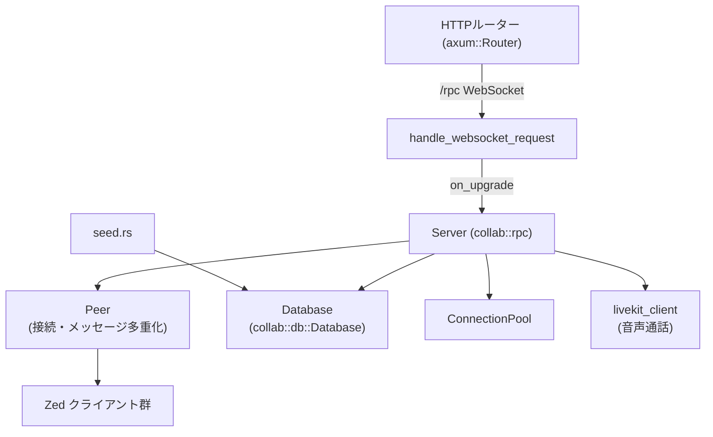
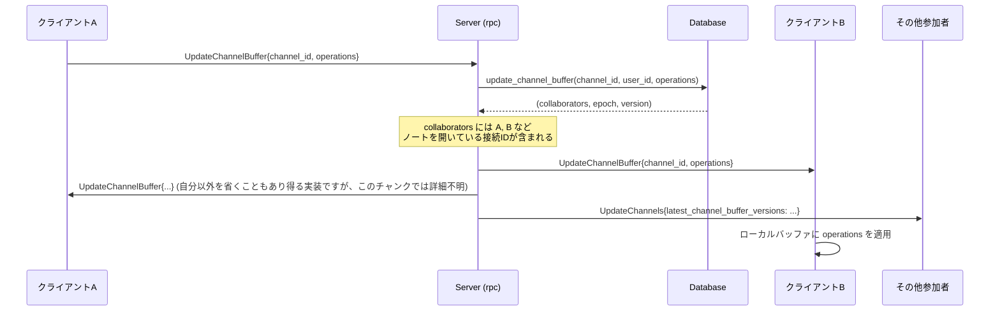
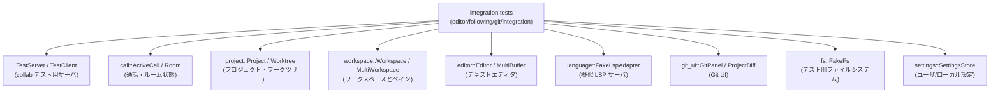
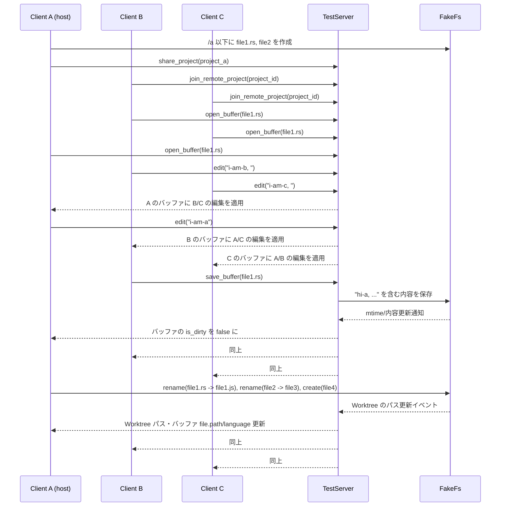

このメッセージでは、`crates/collab` ディレクトリのコードと設定ファイル（Cargo.toml、README、k8s マニフェスト、DB スキーマ、`src/api` や `src/db/queries` など）の **一部（chunk 1/3）** が送られています。

現時点で分かっていることは、例えば次のような点です（ごく概要だけ挙げます）:

- `collab` クレートは Zed のコラボレーションサーバ（`https://collab.zed.dev`）で、  
  WebSocket 経由で Zed クライアントと接続するバックエンドであること（README より）
- Postgres / SQLite 用のスキーマが `migrations/` と `migrations.sqlite/` にあり、  
  `channels`, `projects`, `rooms`, `buffers`, `extensions`, `notifications`, `contacts` などの  
  コラボ機能に関するテーブルが定義されていること
- `src/api/events.rs` ではクライアントから送られるテレメトリイベントを受け取り、  
  署名ヘッダ検証と Kinesis への書き込みを行っていること
- `src/api/extensions.rs` では拡張機能の一覧・バージョン・ダウンロード URL を提供し、  
  S3（blob store）からマニフェストを取得して DB に取り込む定期ジョブも含まれていること
- `src/db/queries/*` に、チャンネル・バッファ・コンタクト・プロジェクト・ルームなどの  
  ドメイン操作用クエリがまとまっていること

ただし、ディレクトリ全体を対象とした解説レポート（セクション 1〜7 構成）を正確に書くには、  
残りの **chunk 2/3, 3/3** に含まれるコードも参照する必要があります。

---

もしこの後に

- 残りのチャンク（2/3, 3/3）
- もしくは「この `collab` ディレクトリ全体を、テンプレートどおり 7 セクション構成で解説してほしい」や  
  「`src/db/queries/projects.rs` だけ詳しく知りたい」のような **具体的な依頼**

が来る前提であれば、続きのメッセージを受け取った段階で、指定テンプレートに従った  
詳細な日本語レポートをまとめます。

---

# collab/ ディレクトリ コード解説（このチャンクで見えている範囲）

## 1. ざっくり一言

このチャンクに含まれる `collab` クレートのコードは、Zed の**協調編集サーバの RPC 層**と、初期データ投入用の **DB シード処理**、およびそれらを検証する**統合テスト群**を実装しています。  
WebSocket 経由でクライアントと通信し、部屋・チャンネル・プロジェクト・チャットノート・連絡先・通知・エージェントスレッド共有などの機能を提供します。

---

## 2. このモジュールの役割

### 2.1 概要

- `src/rpc.rs` は、axum ベースの HTTP / WebSocket エンドポイントと、型安全な RPC メッセージディスパッチャを持つ **サーバプロセスの中核**です。
  - WebSocket 接続の確立
  - 認証・バージョンチェック
  - 接続ごとのセッション管理とメッセージ処理
  - ルーム・チャンネル・プロジェクト・バッファ・通知など多種の RPC ハンドラ
- `src/seed.rs` は GitHub API とローカル JSON からユーザ・チャンネルを作成する **DB シードコマンド**です。
- `tests/integration/*` は、協調編集・チャンネル・DB 層・エージェントスレッド共有など、上記機能の統合テスト一式です。

### 2.2 アーキテクチャ内での位置づけ

このチャンクから読み取れる主要コンポーネントの関係は次の通りです。



- axum の `Router` が `/rpc` に対する WebSocket アップグレードを `handle_websocket_request` に委譲します。
- `handle_websocket_request` がバージョンヘッダを検証し、`Server::handle_connection` に WebSocket 接続を渡します。
- `Server` は `Peer` を通じて複数クライアントとメッセージをやり取りし、`Database` と `ConnectionPool` を使って永続状態と接続状態を管理します。
- LiveKit クライアントは音声通話用のトークン発行・ルーム管理に利用されます。
- `seed.rs` は同じ `Database` を用いてユーザ・チャンネルの初期データを投入します。

### 2.3 設計上のポイント

コードから分かる特徴を列挙します。

- **型付きメッセージディスパッチ**
  - `add_handler` / `add_message_handler` / `add_request_handler` によって、`TypeId` ベースでメッセージ型ごとのハンドラを登録します。
  - `TypedEnvelope<M>` / `RequestMessage` / `EnvelopedMessage` を用いて型安全にデコードします。
- **フォアグラウンド／バックグラウンド処理**
  - クライアントからのメッセージは `is_background()` フラグで区別され、バックグラウンドメッセージは `executor.spawn_detached`、フォアグラウンドは `FuturesUnordered` で順序を保ちつつ並行処理されます。
  - これにより「A→B, B→A 互いに RPC を待つ」といったデッドロックを避けるようになっています。
- **同時実行数制限**
  - `MAX_CONCURRENT_HANDLERS` と `Semaphore` により、1 接続あたり最大 256 メッセージハンドラまでに制限します。
- **トレースとメトリクス**
  - `tracing::info_span!` と `span.record(TOTAL_DURATION_MS, ...)` などで、キュー待ち時間／処理時間などをスパンに記録します。
  - `/metrics` エンドポイントは Prometheus 形式で接続数や共有プロジェクト数を公開します。
- **再接続とクリーンアップ**
  - `connection_lost` が `RECONNECT_TIMEOUT` まで再接続を待ち、それを過ぎるとルーム・チャンネルバッファ・通話・連絡先などを後片付けします。
  - サーバ終了時は `CLEANUP_TIMEOUT` 後に「stale なルームやチャンネルバッファ」を DB から整理します。
- **ゲストと権限の扱い**
  - プロジェクトの read-only / mutating リクエストを `forward_read_only_project_request` / `forward_mutating_project_request` で明確に分けています。
  - ゲスト禁止の操作は `disallow_guest_request` で一括処理し、明示的に `Forbidden` エラーを返します。
- **エラー処理ポリシー**
  - 重要な RPC は `Result<T, Error>` を返し、失敗時にはクライアントにもエラーを返送します。
  - 補助的な処理（クリーンアップなど）は `ResultExt::trace_err()` でログだけ出して無視するケースが多くあります。

---

## 3. 主要な機能一覧

このチャンクで見えている主な機能を列挙します。

- WebSocket 接続の確立とバージョンネゴシエーション（`handle_websocket_request`）
- 接続ごとのセッション管理・メッセージディスパッチ（`Server::handle_connection` ほか）
- 接続喪失時の再接続待ちとリソースクリーンアップ（`connection_lost`）
- **ルーム／通話管理**
  - ルームの作成・参加・再参加・退出（`create_room`, `join_room`, `rejoin_room`, `leave_room`）
  - 通話の発信・キャンセル・却下（`call`, `cancel_call`, `decline_call`）
  - LiveKit を使った音声権限更新（`set_room_participant_role`）
  - フォロー／アンフォロー／フォロワーへの位置更新（`follow`, `unfollow`, `update_followers`）
- **プロジェクト共有**
  - プロジェクトの共有／解除（`share_project`, `unshare_project` ほか）
  - 共有プロジェクトへの参加・離脱（`join_project`, `leave_project`）
  - プロジェクト／ワークツリー／リポジトリの更新（`update_project`, `update_worktree`, `update_repository`, `remove_repository`）
  - LSP リクエストのホストへのフォワード（`lsp_query`, `forward_*_project_request`）
- **チャンネル管理**
  - チャンネルの作成／削除／リネーム／移動／並び順変更（`create_channel`, `delete_channel`, `rename_channel`, `move_channel`, `reorder_channel`）
  - チャンネルの公開／非公開や可視性変更（`set_channel_visibility`）
  - メンバー招待・役割変更・追放（`invite_channel_member`, `set_channel_member_role`, `remove_channel_member`）
  - チャンネル勧誘への応答（`respond_to_channel_invite`）
  - チャンネルのルーム参加（`join_channel`, `join_channel_internal`）
- **チャンネルノート（channel buffer）協調編集**
  - ノートへの参加・退室・再参加（`join_channel_buffer`, `leave_channel_buffer`, `rejoin_channel_buffers`）
  - ノート更新とコラボレーター更新（`update_channel_buffer`, `channel_buffer_updated`）
  - バッファバージョンの ACK（`acknowledge_buffer_version`）
- **連絡先とユーザ検索**
  - GitHub ログインによるユーザ検索（`fuzzy_search_users`, `get_users`）
  - 連絡先リクエストの送信・応答・削除（`request_contact`, `respond_to_contact_request`, `remove_contact`）
  - ユーザのオンライン／ビジー状態の伝搬（`update_user_contacts`）
- **通知とチャット**
  - 通知一覧取得と既読化（`get_notifications`, `mark_notification_as_read`）
  - チャンネルチャット関連 API は「削除済み」としてすべてエラーを返すスタブ（`send_channel_message` など）。
- **エージェントスレッド共有**
  - AI エージェントのスレッドを外部に共有／取得（`share_agent_thread`, `get_shared_agent_thread`）
- **メトリクス**
  - 接続数・共有プロジェクト数の Prometheus エクスポート（`handle_metrics`）
- **DB シード**
  - GitHub API と JSON ファイルからユーザ・チャンネルを作成（`seed.rs` の `seed`）

---

## 4. 関数・構造体の解説

### 4.1 型一覧（構造体・列挙体など）

このチャンクで役割が明確な主要型です（定義本体は別チャンクを含みます）。

| 名前 | 種別 | 役割 / 用途 |
|------|------|-------------|
| `Server` | 構造体 | WebSocket 接続を受け付け、メッセージハンドラや `Peer`・`Database`・`ConnectionPool` をまとめたサーバ本体。 |
| `Session` | 構造体 | 接続単位のコンテキスト。`principal`（ユーザ情報）、`connection_id`、`db` ハンドル、`peer`、`connection_pool`、`app_state` などを保持し、多くの RPC ハンドラで使用されます。 |
| `MessageContext` | 構造体 | メッセージハンドラに渡される文脈。`Session` 相当の情報と `tracing::Span` を含みます。 |
| `Response<M>` | 構造体 | リクエスト型 `M` に対するレスポンス送信ヘルパ。`peer` と `receipt` を持ち、`send` / `respond_with_error` などで返信を送ります。 |
| `ProtocolVersion` | 構造体 | `x-zed-protocol-version` HTTP ヘッダを axum の `Header` として扱うラッパー。 |
| `AppVersionHeader` | 構造体 | `x-zed-app-version` ヘッダを `semver::Version` として扱うラッパー。 |
| `ReleaseChannelHeader` | 構造体 | `x-zed-release-channel` ヘッダを保持するラッパー。 |
| `ConnectionPoolGuard<'a>` | 構造体 | `ConnectionPool` へのロックガードをラップする型。`Deref` / `DerefMut` 実装により `ConnectionPool` として扱えます。テスト用に `Drop` 時に不変条件チェックを行います。 |
| `GithubUser` | 構造体 | `seed/github_users.json` や GitHub API のレスポンスを受けるためのシリアライズ用型。 |
| `SeedConfig` | 構造体 | シード設定ファイル（admins, channels）の内容を保持します。 |
| `ResultExt` | トレイト | `Result<T, E>` に対して `.trace_err()` を追加し、エラーをログ出力して `Option<T>` に変換します。 |

### 4.2 重要な関数の詳細

#### `Server::handle_connection(...) -> impl Future<Output = ()>`

**概要**

1 本の WebSocket 接続に対して、セッションの初期化・メッセージ受信ループ・切断時の後処理までを行うメイン処理です。  
`axum` の WebSocket アップグレード後に呼び出されます。

**主な引数**

| 引数名 | 型 | 説明 |
|--------|----|------|
| `self` | `&Arc<Server>` | サーバ本体。複数接続から共有されます。 |
| `connection` | `Connection` | WebSocket ストリームを抽象化した接続オブジェクト。 |
| `address` | `String` | クライアントのソケットアドレス（ログ用）。 |
| `principal` | `Principal` | 認証済みユーザ情報（ログイン名・ID など）。 |
| `zed_version` | `ZedVersion` | クライアントアプリのバージョン。 |
| `release_channel` | `Option<String>` | Release チャンネル名（例: `stable`, `nightly`）。 |
| `user_agent` | `Option<String>` | ブラウザ風の User-Agent 文字列（ログ用）。 |
| `geoip_country_code` | `Option<String>` | 国コード（Cloudflare ヘッダなどから）。 |
| `system_id` | `Option<String>` | クライアントのシステム識別子。 |
| `send_connection_id` | `Option<oneshot::Sender<ConnectionId>>` | 接続 ID を外側に返したい場合の one-shot チャネル。テスト等で使用。 |
| `executor` | `Executor` | 非同期タスク実行用の実行基盤。 |
| `connection_guard` | `Option<ConnectionGuard>` | 同時接続数制限を表すガード（取得済み）。 |

**戻り値**

- `impl Future<Output = ()>`  
  実際の処理は引数をクローンした非同期ブロック内で実行されます。エラーはすべてログに記録され、Future の戻り値は `()` です。

**内部処理の流れ（要約）**

1. `tracing::info_span!("handle connection", ...)` でスパンを生成し、`principal`・User-Agent・release_channel 等をスパンに記録します。
2. `self.teardown.subscribe()` でサーバのシャットダウン通知を監視する `watch::Receiver<bool>` を取得します。
3. `peer.add_connection` により新しい `connection_id` と I/O 用 Future (`handle_io`)・メッセージストリーム (`incoming_rx`) を得て、`Session` 構造体を構築します。
4. `send_initial_client_update` を呼び出して、`Hello` メッセージ・連絡先・チャンネル情報などをクライアントに送信します。
5. `handle_io` と `incoming_rx` を `futures::select_biased!` で監視するループに入り、並行ハンドラ数を `Semaphore` で制御しつつ、着信メッセージごとに:
   - メッセージ型に対応するハンドラを `self.handlers` から探す
   - `is_background()` に応じてバックグラウンド（新規タスク）かフォアグラウンド（`FuturesUnordered`）として実行
   - 各ハンドラ実行時間・キュー待ち時間をスパンに記録
6. I/O が終了するかストリームが閉じられたらループを抜け、`connection_lost(session, teardown, executor).await` を呼び出して切断処理を行います。

**Examples（使用例）**

サーバ本体の初期化と接続ハンドリングのイメージ（本チャンクでは `Server` のコンストラクタは見えていないため擬似コードです）。

```rust
use std::sync::Arc;
use collab::rpc::{Server, routes};
use axum::{Router, Server as AxumServer};
use tokio::net::TcpListener;

#[tokio::main]
async fn main() -> anyhow::Result<()> {
    // Server 構築（実際の構築ロジックは別チャンクにあります）
    let server: Arc<Server> = /* Server を初期化する */; // サーバ共有状態を作成

    // Axum Router に /rpc ルートを登録
    let app: Router = routes(server.clone());               // WebSocket / metrics ルートを構成

    let listener = TcpListener::bind("0.0.0.0:3000").await?; // TCP リスナをバインド
    AxumServer::from_tcp(listener)?                          // Axum サーバを起動
        .serve(app.into_make_service())
        .await?;
    Ok(())
}
```

**Edge cases（エッジケース）**

- サーバが既に teardown 中 (`*teardown.borrow() == true`) の場合は、接続を即座に拒否し「server is tearing down」とログに出して終了します。
- メッセージに対応するハンドラが登録されていない場合は `"no message handler"` をログ出力し、メッセージは無視されます。
- ハンドラ内で panic が起きた場合の挙動はこのチャンクからは読み取れませんが、`Future` は `spawn_detached` などで実行されるため、サーバ全体が止まらないように設計されていると考えられます（※推測であり、詳細は別チャンク依存です）。

**使用上の注意点**

- 新しいメッセージ型に対してハンドラを登録する際は、`add_message_handler` / `add_request_handler` を通じて `self.handlers` に登録する必要があります（同じ型を二重登録すると `panic!`）。
- `Request` 型のハンドラでは必ず 1 回 `Response::send` または `respond_with_error` を呼ぶ必要があります。呼ばないと `"handler did not send a response"` エラーになります。

---

#### `handle_websocket_request(...) -> axum::response::Response`

**概要**

`/rpc` パスへの HTTP リクエストを WebSocket にアップグレードし、プロトコルバージョン・アプリバージョン・リリースチャンネル・接続数制限などを検証するエントリポイントです。

**主な引数**

| 引数名 | 型 | 説明 |
|--------|----|------|
| `TypedHeader(ProtocolVersion(protocol_version))` | `TypedHeader<ProtocolVersion>` | `x-zed-protocol-version` ヘッダから取得したプロトコルバージョン。 |
| `app_version_header` | `Option<TypedHeader<AppVersionHeader>>` | `x-zed-app-version` ヘッダ。 |
| `release_channel_header` | `Option<TypedHeader<ReleaseChannelHeader>>` | `x-zed-release-channel` ヘッダ。 |
| `ConnectInfo(socket_address)` | `ConnectInfo<SocketAddr>` | 接続元ソケットアドレス。 |
| `Extension(server)` | `Extension<Arc<Server>>` | サーバ共有状態。 |
| `Extension(principal)` | `Extension<Principal>` | 認証済み principal。 |
| `user_agent` | `Option<TypedHeader<UserAgent>>` | User-Agent ヘッダ。 |
| `country_code_header` | `Option<TypedHeader<CloudflareIpCountryHeader>>` | 国コードヘッダ。 |
| `system_id_header` | `Option<TypedHeader<SystemIdHeader>>` | クライアント識別用ヘッダ。 |
| `ws` | `WebSocketUpgrade` | axum の WebSocket アップグレードヘルパ。 |

**戻り値**

- WebSocket にアップグレードするレスポンス、または 426 / 503 などの HTTP エラー応答。

**内部処理の流れ**

1. `protocol_version` が `rpc::PROTOCOL_VERSION` と一致するか検証し、異なる場合は `StatusCode::UPGRADE_REQUIRED` を返します。
2. `AppVersionHeader` が存在しなければ 426 を返します。
3. `ZedVersion::can_collaborate()` が `false` の場合も 426 を返します。
4. `ConnectionGuard::try_acquire()` で同時接続数の上限に達していないか確認し、取得できなければ 503 `Too many concurrent connections` を返します。
5. `ws.on_upgrade(...)` により WebSocket アップグレード後の処理を登録します。
   - tungstenite メッセージと axum メッセージを相互変換するラッパをかませて `Connection::new` を構築。
   - `server.handle_connection(...)` を呼び出し、前述のセッション処理を開始します。

**Example**

```rust
use std::sync::Arc;
use collab::rpc::{Server, routes};
use axum::{Router, routing::get};

fn build_router(server: Arc<Server>) -> Router {
    // この関数内で handle_websocket_request が /rpc にバインドされる
    routes(server)
        .route("/health", get(|| async { "ok" })) // 任意の他ルート
}
```

**使用上の注意点**

- クライアント側は `x-zed-protocol-version` と `x-zed-app-version` ヘッダを必ず送る必要があります。そうでないと 426 エラーになります。
- 同時接続数の上限（`ConnectionGuard` 実装依存）はこのチャンクからは分かりませんが、上限超過時に 503 となる点に注意が必要です。

---

#### `connection_lost(session: Session, teardown: watch::Receiver<bool>, executor: Executor) -> Result<()>`

**概要**

ある接続が切断された時の共通処理です。再接続の猶予時間 (`RECONNECT_TIMEOUT`) を設け、それを過ぎても再接続がなければルーム・チャンネルバッファ・通話状態・連絡先を整理します。

**内部処理の流れ**

1. 即座に:
   - `session.peer.disconnect(connection_id)` で Peer レベルの接続を切断。
   - `session.connection_pool().await.remove_connection(connection_id)` でコネクションプールから削除。
   - `db.connection_lost(connection_id)` を呼び出し（エラーは `trace_err` でログに出すだけ）。
2. `futures::select_biased!` により 2 つのイベントを待機:
   - `executor.sleep(RECONNECT_TIMEOUT)` が完了した場合:
     - `leave_room_for_session` と `leave_channel_buffers_for_session` でルームとチャンネルノートから退出。
     - まだオンラインの接続が無い場合 (`is_user_online` が false)、`db.decline_call(None, user_id)` により保留中の通話を却下し、`room_updated` で他参加者に通知。
     - `update_user_contacts(user_id, &session)` で連絡先にオンライン／ビジー状態の変化を反映。
   - `teardown.changed()` が先に発火した場合（サーバシャットダウン時など）は、上記のクリーンアップをスキップして終了。
3. `Ok(())` を返す。

**使用上の注意点**

- サーバ停止時（`teardown`）は個々のユーザのルーム状態を触らず即終了するため、停止後の状態整合性はクライアントの再接続ロジックに依存します。
- `leave_room_for_session` や `leave_channel_buffers_for_session` は内部でさらに通知をブロードキャストします。切断時の通知が不要なケースで流用しない方が安全です。

---

#### `update_channel_buffer(request: proto::UpdateChannelBuffer, session: MessageContext) -> Result<()>`

**概要**

チャンネルノート（チャンネルごとに 1 つ存在する共有テキストバッファ）の編集操作を受け付け、DB に記録し、他の参加者に変更とバージョン情報を通知します。

**引数**

| 引数名 | 型 | 説明 |
|--------|----|------|
| `request` | `proto::UpdateChannelBuffer` | 編集操作（CRDT/OT の Operation 群）とチャンネル ID を含むメッセージ。 |
| `session` | `MessageContext` | ユーザ・接続・DB・Peer などの文脈。 |

**戻り値**

- 成功時は `Ok(())`。DB エラーなどで失敗した場合は `Err` を返し、クライアントには `Response<UpdateChannelBuffer>` 側で Ack が返されません（この関数自体は `Response` を受け取らないため、エラー通知は上位のプロトコル設計に依存します）。

**内部処理の流れ**

1. `ChannelId::from_proto(request.channel_id)` で内部表現のチャンネル ID に変換。
2. `db.update_channel_buffer(channel_id, session.user_id(), &request.operations)` を呼び出し、DB に操作を適用。
   - 戻り値として `(collaborators, epoch, version)` を受け取ります。
   - `collaborators` は現在チャンネルノートを開いている接続 ID 群。
3. `channel_buffer_updated` を呼び出し、**現在ノートを開いているコラボレーター達**に `proto::UpdateChannelBuffer` をブロードキャストします。
4. `ConnectionPool` から `channel_connection_ids(channel_id)` を取得し、`collaborators` に含まれない接続 ID を列挙（ノートを開いていないチャンネル参加者）。
5. それら非コラボレーターには `proto::UpdateChannels` の `latest_channel_buffer_versions` フィールドで最新バージョン (`epoch`, `version`) のみを通知します。
   - クライアント側の `ChannelStore` はこれを使って「チャンネルノートに未読変更があるかどうか」を管理します（`channel_buffer_tests` が確認しています）。

**Examples（使用例）**

クライアント側から見ると、`UpdateChannelBuffer` を送ると他クライアントにも変更が同期されます。テストコードから簡略化した例です。

```rust
// クライアント側（テストからのイメージ）
use rpc::proto;

async fn edit_channel_notes(client: &Client, channel_id: proto::ChannelId) -> anyhow::Result<()> {
    // ここでは 0..0 に "hello" を挿入する Operation を 1 つ送る例
    let operations = vec![/* Operation のシリアライズ結果 */];

    client.request(proto::UpdateChannelBuffer {
        channel_id,        // 対象チャンネル
        operations,        // 編集操作の列
    }).await?;             // サーバ側で update_channel_buffer が呼ばれる

    Ok(())
}
```

**Edge cases**

- 全員がノートを閉じた状態で再度開いた場合、DB 側が base text に操作を畳み込んで返す挙動が `db_tests::buffer_tests` で確認されています。そのため操作列が空になるケースがあります。
- `db.update_channel_buffer` はユーザがそのチャンネルの参加者かどうかを内部で検証していると考えられます（そうでない場合はエラーになるはずですが、このチャンク単体からは挙動は断定できません）。

**使用上の注意点**

- `request.operations` に含まれる Operation のフォーマットは `language::Operation::Buffer` をシリアライズしたものに対応しています。クライアント側も同じフォーマットを使う必要があります。
- 協調編集アルゴリズム（Lamport タイムスタンプなど）の詳細は DB／テキストエンジン側に隠蔽されているため、この関数では順序やマージなどを意識する必要はありませんが、不正な Operation を送ると DB 側でエラーになります。

---

#### `share_agent_thread(request: proto::ShareAgentThread, response: Response<proto::ShareAgentThread>, session: MessageContext) -> Result<()>`

**概要**

AI エージェントの対話スレッドを共有する機能のサーバ側エントリポイントです。  
`session_id`（共有 ID）とスレッドデータを受け取り、ユーザごとに DB へ upsert します。

**引数**

| 引数名 | 型 | 説明 |
|--------|----|------|
| `request` | `proto::ShareAgentThread` | `session_id`（文字列）、タイトル、シリアライズ済みスレッドデータを含むリクエスト。 |
| `response` | `Response<proto::ShareAgentThread>` | Ack を返すためのレスポンスオブジェクト。 |
| `session` | `MessageContext` | ユーザ ID などの文脈。 |

**戻り値**

- 成功時は `Ack` を返信し、`Ok(())` を返します。
- `session_id` の形式が不正、または DB 側エラーがある場合は `Err` を返し、クライアント側ではエラーとして扱われます。

**内部処理の流れ**

1. `session.user_id()` で現在のユーザ ID を取得。
2. `SharedThreadId::from_proto(request.session_id.clone())` で共有 ID を内部表現に変換。
   - 変換に失敗した場合は `anyhow!("Invalid session ID format")` エラー。
3. `db.upsert_shared_thread(share_id, user_id, &request.title, request.thread_data).await?` を呼び出し、既存レコードがあれば更新・なければ新規挿入。
4. `response.send(proto::Ack {})?` で成功レスポンスを送信。
5. `Ok(())` を返す。

**Examples（使用例）**

統合テスト `agent_sharing_tests.rs` の簡略版です。

```rust
use agent::SharedThread;
use rpc::proto;

// スレッドを共有する側
async fn share(client: &Client, session_id: String, thread: SharedThread) -> anyhow::Result<()> {
    let thread_data = thread.to_bytes()?; // SharedThread をバイト列にシリアライズ

    client.request(proto::ShareAgentThread {
        session_id: session_id.clone(),            // 共有用 ID
        title: thread.title.to_string(),           // 表示用タイトル
        thread_data,                               // 本体データ
    }).await?;                                     // サーバ側で upsert_shared_thread が呼ばれる

    Ok(())
}
```

**Edge cases**

- 同じ `session_id`・同じユーザで再度共有した場合、既存レコードが上書きされます（`db_tests::test_upsert_shared_thread_updates_existing` が確認）。
- 別ユーザが同じ `session_id` で共有しようとするとエラーになることがテスト（`test_cannot_update_another_users_shared_thread`）で確認されています。この検証は DB 層で行われ、RPC ハンドラはそのエラーをそのまま返します。
- `GetSharedAgentThread` で存在しない `session_id` を問い合わせた場合、`Err("Shared thread not found")` が返される実装になっています。

**使用上の注意点**

- `session_id` の形式は `SharedThreadId::from_proto` に依存しており、UUID 形式の文字列であることが `db_tests` から読み取れます。クライアント側も同じ形式を使用する必要があります。
- スレッドデータのフォーマットはクライアント（`SharedThread::to_bytes` / `from_bytes`）側と合わせる必要があります。サーバはバイト列をそのまま保存し、意味内容は解釈しません。

---

### 4.3 その他の関数（概観）

補助的・あるいは同種の関数が多数定義されています。主なグループだけ列挙します。

| 関数名グループ | 役割（1 行） |
|----------------|--------------|
| `create_room` / `join_room` / `rejoin_room` / `leave_room` | ルーム（通話部屋）の作成・参加・再参加・退出。 |
| `call` / `cancel_call` / `decline_call` | ユーザ間の通話招待・キャンセル・却下処理。 |
| `share_project` / `unshare_project` / `join_project` / `leave_project` | プロジェクトの共有／解除と、ゲストの参加・離脱。 |
| `update_project` / `update_worktree` / `update_repository` / `remove_repository` | プロジェクト内リソースの変更を他参加者へ伝搬。 |
| `start_language_server` / `update_language_server` / `lsp_query` | LSP 言語サーバの開始通知・メタデータ更新・LSP クエリフォワード。 |
| `create_channel` / `delete_channel` / `rename_channel` / `move_channel` / `reorder_channel` | チャンネルツリーの CRUD と並び替え。 |
| `invite_channel_member` / `remove_channel_member` / `set_channel_visibility` / `set_channel_member_role` | チャンネルメンバー招待・追放・可視性変更・役割変更。 |
| `join_channel` / `join_channel_internal` | チャンネルルームへの参加と、必要な LiveKit 情報の返却。 |
| `join_channel_buffer` / `update_channel_buffer` / `rejoin_channel_buffers` / `leave_channel_buffer` | チャンネルノートの参加・編集・再参加・離脱。 |
| `get_users` / `fuzzy_search_users` | GitHub ログイン名に基づくユーザの取得・あいまい検索。 |
| `request_contact` / `respond_to_contact_request` / `remove_contact` | 連絡先リクエストの作成・応答・削除。 |
| `get_notifications` / `mark_notification_as_read` | 通知一覧の取得と既読化。 |
| `broadcast` / `room_updated` / `channel_updated` | Peer を通じた複数接続へのイベント一斉送信。 |
| `build_update_user_channels` / `build_channels_update` / `notify_membership_updated` | チャンネル状態の差分を `proto::UpdateUserChannels` / `proto::UpdateChannels` に組み立てるユーティリティ。 |
| `seed`（`seed.rs`） | GitHub から admin ユーザとチャンネルを作成し、追加 GitHub ユーザを DB に投入。 |

---

## 5. データフロー

ここでは代表的なフローとして、「チャンネルノートの編集が他クライアントに反映される流れ」を示します。

### 5.1 チャンネルノート更新の流れ

1. クライアント A がチャンネルノートのテキストを編集し、`UpdateChannelBuffer` メッセージをサーバに送信します。
2. `Server` はこのメッセージを `update_channel_buffer` ハンドラにルーティングします。
3. ハンドラは DB の `update_channel_buffer` を呼び出し、操作を永続化するとともに、現在のコラボレーター接続 ID・エポック・バージョン情報を取得します。
4. `channel_buffer_updated` によって、同じチャンネルノートを編集している他のクライアント（コラボレーター）へ `UpdateChannelBuffer` をブロードキャストします。
5. さらにノートを開いていないチャンネル参加者には、`UpdateChannels` の `latest_channel_buffer_versions` フィールドで「ノートが更新された」という情報だけが通知されます。
6. クライアント B は `UpdateChannelBuffer` を受信し、自身のローカルバッファに変更を適用します。

この流れをシーケンス図で表すと次のようになります。



`tests/integration/channel_buffer_tests.rs` では、この流れが様々な条件（切断・再接続・サーバ再起動など）で正しく動作することが検証されています。

---

## 6. 使い方（How to Use）

### 6.1 基本的な使用方法

#### WebSocket サーバとしての利用

このチャンクだけでは `Server` の構築方法は見えませんが、典型的な起動フローは次のようになります。

```rust
use std::sync::Arc;
use axum::{Router, Server as AxumServer};
use collab::rpc::{Server, routes};
use collab::db::Database;

#[tokio::main]
async fn main() -> anyhow::Result<()> {
    // データベースと設定の初期化
    let db: Database = /* DB 接続を作る */;                  // Postgres / SQLite など
    let app_state = /* AppState を構築 */;                    // db, livekit_client などを含む

    // Server を初期化（実際の new 関数は別チャンクにあります）
    let server: Arc<Server> = /* Server::new(app_state, ...) */;

    // Axum Router に collab のルートを追加
    let app: Router = routes(server);                          // /rpc と /metrics が追加される

    // HTTP サーバを起動
    AxumServer::bind(&"0.0.0.0:3000".parse()?)
        .serve(app.into_make_service())
        .await?;
    Ok(())
}
```

クライアント側は `/rpc` に対して:

- `x-zed-protocol-version`
- `x-zed-app-version`
- （任意）`x-zed-release-channel`

などのヘッダを付与して WebSocket 接続を開始し、その後 `proto::*` メッセージをやり取りします。

#### DB シードの実行

`seed.rs` の `seed` 関数は、初期ユーザ・チャンネルを作成するために利用できます。

```rust
use collab::db::Database;
use collab::seed::seed;
use collab::Config;

#[tokio::main]
async fn main() -> anyhow::Result<()> {
    let config = Config {
        seed_path: Some("/path/to/seed/config.json".into()),
        // その他設定...
    };

    let db: Database = /* DB を初期化 */;
    // force = true なら既存ユーザがいても強制上書き
    seed(&config, &db, false).await?;
    Ok(())
}
```

`seed_path` で指定された JSON ファイルは `SeedConfig` 型に対応し、`admins` や `channels` の情報を含みます。

### 6.2 よくある使用パターン

#### 6.2.1 新しい RPC メッセージ型の追加

新しい `proto::FooRequest` に対するハンドラを追加する場合、`Server` の初期化時に `add_request_handler` を使います（実際の登録コードはこのチャンクの前半にあります）。

- ゲストにも許可する read-only なプロジェクト操作 → `forward_read_only_project_request::<proto::FooRequest>`
- ホストのみが行える mutating 操作 → `forward_mutating_project_request::<proto::FooRequest>`
- ゲストに禁止したい操作 → `disallow_guest_request::<proto::FooRequest>`

というように、既存の高階関数を再利用すると実装量を減らせます。

#### 6.2.2 チャンネルノートをクライアント側で扱う

クライアント側は、`JoinChannelBuffer` でノートを開き、`UpdateChannelBuffer` を送信するだけで協調編集に参加できます。  
`tests/integration/channel_buffer_tests.rs` には、実際に:

- ノートを開く
- テキストを編集する
- 他クライアントに同期されることを確認する
- 接続断・再接続後に再同期される

といったパターンが多数実装されています。

#### 6.2.3 エージェントスレッド共有

`agent_sharing_tests.rs` から読み取れる典型フロー:

1. 共有したい側のクライアントが `SharedThread::to_bytes()` でスレッドをバイト列に変換し、`ShareAgentThread` を送信。
2. 別のクライアントが同じ `session_id` で `GetSharedAgentThread` をリクエストすると、タイトルとバイト列が返ってくる。
3. クライアント側で `SharedThread::from_bytes` により復元し、必要があればローカル DB 用の形式に変換する。

### 6.3 よくある間違い

このチャンクから予想される誤用例をいくつか挙げます。

```rust
// 誤り例: Request ハンドラ内でレスポンスを返し忘れる
async fn my_request_handler(
    _req: proto::SomeRequest,
    _resp: Response<proto::SomeRequest>,
    _ctx: MessageContext,
) -> Result<()> {
    // 何も send せずに Ok(()) を返してしまう
    Ok(())
}

// 結果: add_request_handler 側で "handler did not send a response" エラーになる
```

```rust
// 誤り例: ゲストからの書き込み可能なプロジェクト操作を forward_read_only_* で登録してしまう
.add_request_handler(forward_read_only_project_request::<proto::GitCommit>);

// 正しい例: 破壊的操作は forward_mutating_project_request を使うべき
.add_request_handler(forward_mutating_project_request::<proto::GitCommit>);
```

### 6.4 使用上の注意点（まとめ）

- **バージョンヘッダ必須**
  - クライアントは `x-zed-protocol-version` と `x-zed-app-version` を必ず送る必要があります。そうでないと WebSocket へアップグレードされません。
- **Request ハンドラは必ず応答する**
  - `add_request_handler` を使った関数では、`Response::send` か `respond_with_error` を必ず 1 回呼ぶ必要があります。
- **ゲストとパーミッション**
  - プロジェクトやチャンネルに対する操作は、DB 側で権限チェックが行われます。ゲストに許可すべき／すべきでない操作は `forward_read_only_*` / `forward_mutating_*` / `disallow_guest_request` を使い分ける必要があります。
- **エラーの扱い**
  - `.trace_err()` を多用している箇所は、「エラーをログには残すが、処理自体は継続する」という方針です。重要な処理で `.trace_err()` を使うと、失敗が上位に伝播しない点に注意が必要です。
- **再接続タイミング**
  - `RECONNECT_TIMEOUT` をまたいで再接続した場合、サーバ側でルーム退出・通話キャンセルなどのクリーンアップが走ります。クライアント側は再接続後にルーム・チャンネルに再参加する必要があります。
- **シード処理**
  - `seed` 関数は、既にユーザが存在する場合 `force == false` なら早期に `Ok(())` を返します。何度も実行しても安全ですが、`force == true` の扱いには注意が必要です（既存データとの整合性はこのチャンクからは不明です）。

---

## 7. 関連ファイル

このチャンクに含まれる、RPC サーバおよび周辺機能と密接に関係するファイルの一覧です。

| パス | 役割 / 関係 |
|------|------------|
| `collab/src/rpc.rs` | WebSocket ベースの RPC サーバ本体。接続管理・メッセージディスパッチ・ルーム／チャンネル／プロジェクト／通知／エージェントスレッド共有などのハンドラを実装。 |
| `collab/src/seed.rs` | GitHub API とローカル JSON からユーザ・チャンネルを作成する DB シード処理。 |
| `collab/tests/integration/agent_sharing_tests.rs` | `ShareAgentThread` / `GetSharedAgentThread` の統合テスト。upsert 動作や存在しないスレッドの扱いを確認。 |
| `collab/tests/integration/channel_buffer_tests.rs` | チャンネルノート（channel buffer）の協調編集・切断／再接続・サーバ再起動時の動作を検証。`update_channel_buffer` など RPC の挙動確認に利用。 |
| `collab/tests/integration/channel_guest_tests.rs` | 公開チャンネルへのゲスト参加、ゲストの権限昇格・降格（マイク・編集権限）などを検証。`set_room_participant_role` 等と対応。 |
| `collab/tests/integration/channel_tests.rs` | チャンネルの作成・削除・招待・ツリー構造の移動・並べ替えなど、チャンネル関連 API の動作を網羅的にテスト。 |
| `collab/tests/integration/collab_panel_tests.rs` | UI パネル上でのチャンネルと「お気に入り」の並べ替えロジックをテスト。チャンネル一覧更新 RPC と連動。 |
| `collab/tests/integration/db_tests/*` | `Database` 層の単体／統合テスト。RPC ハンドラが呼ぶ `update_channel_buffer`, `get_channels_for_user`, `upsert_shared_thread` などの挙動を検証。 |
| `collab/tests/integration/editor_tests.rs` | 協調編集エディタの動作テスト。バッファ更新・LSP 補完・ホスト切断時の挙動など、`rpc.rs` の多くのハンドラと連動。 |

このチャンクに含まれない `Server` の構築処理や `Database` 実装などは、同じ `collab` クレート内の他ファイルに定義されていますが、その詳細はここからは読み取れません。

---

# collab/tests/integration ディレクトリ

## 0. ざっくり一言

コラボレーション機能全体（通話・プロジェクト共有・エディタのフォロー・Git・LSP・設定・FS 操作など）を、擬似サーバと複数クライアントを立ち上げて end‑to‑end で検証する統合テスト群です。

---

## 1. このモジュールの役割

### 1.1 概要

- このディレクトリは、**コラボ機能の実装がクライアント間で正しく同期・復元されるか**を検証するための統合テストを提供します。
- エディタ・ワークスペース・Git・LSP・通話（ActiveCall）・ローカル設定・ファイルシステムなど、複数のサブシステムをまとめて動かしながら挙動を確認します。
- バグ修正や仕様変更時に、**ホストとゲストで状態がズレないこと**や、**切断・再接続・サーバ再起動などの異常系を正しく処理できること**を保証する役割があります。

### 1.2 アーキテクチャ内での位置づけ

このディレクトリのテストは、アプリケーション全体の最上位レイヤから API を呼び出しています。依存関係のイメージは次の通りです。



- **TestServer / TestClient** がネットワーク・RPC をエミュレートし、その上に ActiveCall・Project・Workspace・Editor 等が乗っています。
- Git 関連テストは `git` / `git_ui` モジュール、LSP 関連は `language` / `project::lsp_store` と連携します。
- `FakeFs` がファイルシステムと Git リポジトリ状態を模倣し、バックグラウンドの Git スキャンや FS 監視を介して Project / Workspace に反映されます。

### 1.3 設計上のポイント

コードから読み取れる特徴を挙げます。

- **非同期テストランナー**
  - すべて `#[gpui::test]` で `async fn` として定義され、`TestAppContext` と `BackgroundExecutor` を通じて UI/バックグラウンドタスク・タイマーを制御します。
  - 時間経過や非同期処理は `executor.run_until_parked()` や `advance_clock(...)` によって明示的に進めています。

- **実運用に近い E2E シナリオ**
  - 実際のユーザ行動（プロジェクト共有、ファイル編集、タブ切り替え、フォロー開始/終了、通話・チャネル参加、スクリーン共有など）をそのままテストコードとして記述しています。
  - ホストと複数ゲストを同時に立ち上げて、**全員の UI 状態が期待通りに揃うこと**を確認します。

- **フェイク実装の活用**
  - LSP: `FakeLspAdapter` と `register_fake_lsp` により、semantic tokens / folding range / document symbols / formatting / definition などのレスポンスを自由に制御します。
  - Git: `FakeFs` の `set_head_for_repo`, `set_index_for_repo`, `add_linked_worktree_for_repo` などで Git 状態を構築し、Git UI との同期を検証します。
  - LiveKit: `test_livekit_server` を通じて音声・映像トラックや切断をシミュレートします。

- **状態回復と永続化の検証**
  - RECEIVE_TIMEOUT / RECONNECT_TIMEOUT / CLEANUP_TIMEOUT を進めつつ、**再接続後に DB から状態が復元されるか**（例: diff stat, linked worktrees）をチェックします。

---

## 2. 主要な機能一覧

このディレクトリのテストが対象としている主な機能をまとめると、次のようになります。

- **通話・ルーム管理**
  - ユーザ招待・着信・応答・拒否・ハングアップ
  - 同一ユーザの複数クライアントに対する呼び出し
  - LiveKit サーバ側からの切断や、クライアント側の再接続
  - ルーム参加者リスト（`RoomParticipants`）と pending 状態の更新
  - ルームの一意性（同時に複数ルームを持てないこと）

- **チャンネル / ノート / ルームロケーション**
  - チャンネル参加と通話の組み合わせ（`join_channel` と `invite` の同時実行）
  - チャンネルノート（`ChannelView`）へのフォローと、共有プロジェクトのない状態での挙動
  - 参加者の場所（`ParticipantLocation::SharedProject/UnsharedProject/External`）の同期

- **プロジェクト共有と再接続**
  - `share_project`, `unshare_project` とゲスト側 `join_remote_project`
  - ホスト・ゲストの切断/再接続時の Project/Worktree 状態（`is_shared`, `is_disconnected`, `collaborators()`）
  - 複数 Worktree の作成・削除・ID 同期と、再接続後の復元（`test_project_reconnect`）

- **エディタのフォロー機能**
  - あるユーザのペイン/タブ/マルチバッファ/スクロール位置/選択範囲を他ユーザが追随する `workspace.follow` / `unfollow`
  - 相互にフォローし合う場合、タブのフォーカスや新規ファイルオープン時の挙動
  - 自発的操作（カーソル移動・編集・スクロール・アイテム切り替え）による自動アンフォロー
  - 別プロジェクト・別ウィンドウ・チャンネルノートをまたいだフォロー

- **エディタ／LSP 連携**
  - semantic tokens（フル・デルタ・refresh）とユーザ設定による有効/無効の組み合わせ
  - folding ranges のオン/オフと LSP FoldingRangeRequest の発火条件
  - document symbols と breadcrumbs 表示
  - diagnostics（PublishDiagnostics）と `DiagnosticSummary` の共有
  - LSP WorkDoneProgress に基づく「ディスクベース診断完了」イベントと診断の整合性
  - 定義ジャンプ（definition / type definition）のホスト・ゲスト間のバッファ再利用

- **フォーマッタ／Prettier 連携**
  - LSP フォーマッタ（`textDocument/formatting`, `textDocument/rangeFormatting`）
  - 外部コマンドベースのフォーマッタ設定の尊重（ホスト側設定が優先されること）
  - Prettier プラグインを LSP 側から提供させ、Prettier を優先して利用するシナリオ

- **Git 連携**
  - `ProjectDiff` での changed/created/deleted ファイルの表示とライブアップデート
  - diff stat（`DiffStat`）のホスト・ゲスト間同期と DB 復元
  - worktrees / linked worktrees の作成・追加・削除とホスト/ゲスト/遅延参加者/再接続時の整合性
  - Git status（tracked/unmerged/deleted など）の同期と、.git ディレクトリ削除時のリポジトリ解放

- **ファイルシステム・バッファ同期**
  - 同一バッファをホスト・複数ゲストで編集し、OT 的にマージされること
  - 保存（`save_buffer` / `save_buffer_as` / `reload_buffers`）と `is_dirty` / `has_conflict` フラグの更新
  - ホスト側 FS での rename/delete/create に伴う Worktree のパス一覧更新と、バッファの `file.path` / `language` 更新
  - バッファオープン中にゲストがプロジェクト離脱・接続断した場合のコラボレータクリーンアップ

- **ローカル設定の共有**
  - `.zed/settings.json` を用いた worktree 単位のローカル設定（例: tab_size, hard_tabs）
  - 設定ファイルの追加・変更・削除と、ゲスト側 `SettingsStore::local_settings` の更新
  - ゲスト切断中の設定変更後に再接続した場合の設定再同期

- **信頼済みワークツリー**
  - `TrustedWorktrees` による「制限付き/信頼済み」ワークツリー判定と、リモートプロジェクトの扱い

---

## 3. 関数・構造体の解説

### 3.1 型一覧（このディレクトリで定義される主な型）

| 名前 | 定義ファイル | 種別 | 役割 / 用途 |
|------|-------------|------|-------------|
| `PaneSummary` | `following_tests.rs` | 構造体 | 1 つのペインについて「アクティブか」「誰をフォローしているか」「タブ名とアクティブ状態」をテスト用に要約する。テストの期待値比較に使われます。 |

> それ以外の多くの型（`TestServer`, `ActiveCall`, `Editor`, `Workspace`, `GitPanel`, `Project`, など）は他モジュールで定義されており、このディレクトリでは利用のみを行っています。

### 3.2 重要なテスト関数の詳細（代表 7 件）

ここでは代表的なシナリオをカバーする 7 つのテストを取り上げます。

---

#### `test_basic_following(cx_a: &mut TestAppContext, cx_b: &mut TestAppContext, cx_c: &mut TestAppContext, cx_d: &mut TestAppContext)`

**概要**

- 4 クライアント（A, B, C, D）を同じルームに参加させ、**A のエディタ状態を B/C/D がフォローする基本的な挙動**を網羅的に確認します。
- タブ切り替え・マルチバッファ・ナビゲーション（戻る/進む）・選択範囲・スクロール・画面共有・フォローの切断など、フォロー機能のほぼ全要素を含みます。

**引数**

| 引数名 | 型 | 説明 |
|--------|----|------|
| `cx_a` | `&mut TestAppContext` | クライアント A のアプリケーションコンテキスト |
| `cx_b` | `&mut TestAppContext` | クライアント B のコンテキスト |
| `cx_c` | `&mut TestAppContext` | クライアント C のコンテキスト |
| `cx_d` | `&mut TestAppContext` | クライアント D のコンテキスト |

**戻り値**

- なし（`async fn` テスト）。内部の `assert!` / `assert_eq!` がすべて通ることが成功条件です。

**内部処理の流れ（要約）**

1. `TestServer::start` と `create_client` で 4 クライアントを接続し、`create_room` で同じ通話ルームに参加させます。
2. クライアント A がローカルプロジェクト `/a` を作成・共有し、クライアント B が `join_remote_project` で参加します。
3. A は `1.txt`/`2.txt` を開いて編集し、選択範囲を設定します。B も `1.txt` を開きます。
4. B が `workspace.follow(peer_id_a, ...)` を呼び出すと、A の「アクティブなエディタのみ」が B に複製され、選択範囲も同期されます。
5. C も A をフォローし、`followers_by_leader` で「A を B/C がフォローしている」ことを全クライアントで確認します。
6. C の `unfollow` → 再フォローにより、`followers_by_leader` の変化が即時に反映されることを確認します。
7. D が B をフォローし、その後 C をフォローし直すことで、「リーダー→フォロワの対応」が期待通りになることを確認します。
8. C のウィンドウを閉じると、C がフォロワリストから消えること、弱参照 `weak_workspace_c` が解放されることを確認します。
9. A のタブ切り替え・マルチバッファ生成・ナビゲーション（`go_back`/`go_forward`）・選択範囲・スクロール変更が、B 側に正しく追従することを確認します。
10. B が `unfollow` した後は、A のアクティブタブ変更が B に影響しないことを確認します。
11. A が B をフォローし直し、画面共有やパネルフォーカスなどの複雑な UI 操作が、フォロー状態に応じて再現されるかを検証します。
12. B の切断（`client_b.disconnect`）により、A 側の `leader_for_pane` が `None` になることを RECONNECT_TIMEOUT 後に確認します。

**使用例（フォロー開始部分）**

```rust
// クライアント B がクライアント A をフォローし始める例
workspace_b.update_in(cx_b, |workspace, window, cx| {
    // peer_id_a は client_a.peer_id().unwrap() から取得済み
    workspace.follow(peer_id_a, window, cx)
});
```

**Edge cases**

- フォロー開始時点で A が複数エディタを開いていても、**アクティブなエディタだけ**が追従対象になること。
- フォロワがウィンドウを閉じたり、プロジェクトを離脱したりした場合に、他クライアントの `followers_by_leader` から正しく消えること。
- スクリーン共有や「フォローできないアイテム（`TestItem`）」がアクティブになった場合の挙動。

**使用上の注意点**

- 状態変化は `executor.run_until_parked()` を呼ぶまで相手に伝播しないため、フォローの結果を検証する前に必ず呼び出す必要があります。
- `followers_by_leader` や `pane_summaries` は `ActiveCall::global` や `Workspace` に依存するため、ルーム作成やプロジェクト共有が完了していることが前提です。

---

#### `test_following_across_workspaces(cx_a, cx_b)`

**概要**

- A と B がそれぞれ異なるローカルプロジェクトを持ち、チャンネル/ルームを共有している状況で、**プロジェクトをまたいだフォロー**がどのように動くかを検証します。
- 共有されていないプロジェクト（B 側）に移動したときは A が「見に行けない」こと、B がそのプロジェクトを共有すると A 側からもフォローできるようになることを確認します。

**要点**

- A のプロジェクト `/a` を共有 → B が join → B が A を follow → B 側に A のプロジェクト用ウィンドウが新しく開く。
- B が A のプロジェクト内で `x.rs` に移動 → A が B を follow すると `x.rs` に移動。
- B が自分のプロジェクト `/b` の `y.rs` を開いた時点では、A はそのプロジェクトをまだ join していないため、フォロー状態は維持されるがファイルそのものは見えない。
- B が `/b` プロジェクトを共有 → A が join → A 側でも B を follow した状態で `y.rs` が開かれる。

このテストにより、「**フォロー状態（who follows who）**」と「**見えているプロジェクト（join 済みかどうか）**」が分離されていることが分かります。

---

#### `test_remote_git_worktrees(executor, cx_a, cx_b)`

**概要**

- 共有プロジェクトに紐づく Git リポジトリの **worktree 管理をゲストから操作した場合の挙動**を検証します。
- ゲストは worktree の作成はできるが、rename/remove はできない（エラーになる）ことを確認します。

**内部処理の流れ**

1. A が `/project` に `.git` と `file.txt` を作成し、ローカルプロジェクトとしてオープン。
2. A がプロジェクトを共有し、B が `join_remote_project` で参加。
3. B が `active_repository().worktrees()` を呼ぶと、最初はメイン worktree（`/project`）のみが返ることを確認。
4. B が `repository.create_worktree("feature-branch", "/project/feature-branch", Some("abc123"))` を呼び出し、新しい worktree を作成。
5. B 側でも、A 側でも `worktrees()` を呼ぶと、メイン＋`feature-branch` の 2 つが見えることを確認。
6. B がさらに `bugfix-branch` worktree を作成（コミット SHA なし）し、3 つの worktree が見えることを確認。
7. B が `rename_worktree` や `remove_worktree` を呼び出すと `Err` が返ることを確認し、その後 `worktrees()` の結果が変化していないことを確認。

**使用上の注意点**

- worktrees の実リストはホスト側の `git::repository::Repository` が所有しており、ゲストからの一部操作（rename/remove）は明示的に禁止されています。
- テストでは `assert!(rename_result.is_err())` のように「許可されない操作がエラーとなること」を前提にしています。

---

#### `test_diff_stat_sync_between_host_and_downstream_client(cx_a, cx_b, cx_c)`

**概要**

- Git の diff stat（行数の追加/削除情報）を、**ホストとゲスト、さらに再接続後のゲスト間で同期・復元する**テストです。

**ポイント**

- ホスト A が HEAD/index/ワーキングツリーを `FakeFs` で構成し、その状態に対する diff stat を期待値と比較します。
- ゲスト B の `GitPanel` でも同じ diff stat が見えることを `collect_diff_stats` 経由で確認します。
- A がファイルを編集・保存すると、A/B 両方の diff stat が更新されることを確認します。
- B がルームから一度離脱 (`hang_up`) → A が再招待 → B が再 join した後、新しい `GitPanel` を開いても diff stat が DB から復元されていることを確認します。

**補助関数 `collect_diff_stats`**

```rust
fn collect_diff_stats<C: gpui::AppContext>(
    panel: &gpui::Entity<GitPanel>,
    cx: &C,
) -> HashMap<RepoPath, DiffStat> {
    panel.read_with(cx, |panel, cx| {
        let Some(repo) = panel.active_repository() else {
            return HashMap::default();
        };
        let snapshot = repo.read(cx).snapshot();
        let mut stats = HashMap::default();
        for entry in snapshot.statuses_by_path.iter() {
            if let Some(diff_stat) = entry.diff_stat {
                stats.insert(entry.repo_path.clone(), diff_stat);
            }
        }
        stats
    })
}
```

この関数は、GitPanel の現在のアクティブリポジトリから「パスごとの diff stat を集約する」役割を持ちます。

---

#### `test_propagate_saves_and_fs_changes(executor, cx_a, cx_b, cx_c)`

**概要**

- 1 ホスト（A）・2 ゲスト（B/C）が同じファイルを編集し、**保存やホスト側 FS 操作（rename・create）を通じて全クライアントのバッファ／Worktree が揃うか**を検証します。
- 言語判定（Rust / JavaScript）や `save_buffer_as` による「拡張子付きパスへの保存」も含みます。

**内部処理の流れ（簡略）**

1. Rust / JavaScript の `Language` を 3 クライアントの `language_registry` に登録。
2. A の `/a` に `file1.rs`, `file2` を作り、プロジェクト共有 → B/C が join。
3. B/C が `file1.rs` を `open_buffer` して編集（`i-am-b,` / `i-am-c,` を挿入）。
4. A が同じバッファを開き、`i-am-a` を末尾に追加。3 クライアントのバッファが `"i-am-c, i-am-b, i-am-a"` で揃うことを確認。
5. B が `project.save_buffer(buffer_b)` を実行する間に、A が先頭に `"hi-a, "` を挿入するという「保存競合気味」の状況を作る。
   - 保存完了後、ホスト側 `FakeFs` の `/a/file1.rs` が `"hi-a, i-am-c, i-am-b, i-am-a"` であることを確認。
   - バッファの `is_dirty` が全員 `false` になっていることも確認。
6. ホスト FS で `file1.rs` → `file1.js` に rename し、`file2` → `file3` に rename、新規 `file4` を作成。
   - A/B/C すべての Worktree でパス一覧が `"file1.js", "file3", "file4"` となることを確認。
   - `file1.rs` を開いていたバッファの `file().path` が `file1.js` に変わり、`language().name()` が `"JavaScript"` になることを確認。
7. A が無名バッファを作成し、`save_buffer_as` で `file3.rs` として保存 → B が `open_buffer_by_id` で同じリモート ID のバッファを開き、`saved_mtime` / `saved_version` が一致していることを確認。

**Edge cases**

- ホストとゲストが同一バッファを同時に編集しつつ、ゲスト側で保存操作を行う状況。
- ホスト側の FS rename による「Buffer のファイル名・言語の更新」が、ゲスト側にも等しく反映されるか。

---

#### `test_collaborating_with_diagnostics(executor, cx_a, cx_b, cx_c)`

**概要**

- LSP の diagnostics（PublishDiagnostics）をホスト A で受け取り、その要約（`DiagnosticSummary`）がゲスト B/C にも同期されること、さらに後続の診断更新・クリアも正しく伝播することを検証します。

**ポイント**

1. A 側 `language_registry` に Rust 言語と `FakeLspAdapter` を登録。
2. プロジェクト `/a` を開き、LSP が起動済みとなるよう `other.rs` を `open_local_buffer_with_lsp`。
3. LSP 側で `/a/a.rs` に対して WARNING を 1 件 Publish → 直後に ERROR 1 件に上書きする Publish を送る。
4. A がプロジェクトを共有し、B が join。`executor.run_until_parked` 後、B 側 `project.diagnostic_summaries(false, cx)` が「`a.rs` に ERROR 1 件」となっていることを確認。
5. C も join し、`DiskBasedDiagnosticsFinished` イベント購読を通じて同じ summary を得ることを確認。
6. その後、LSP から ERROR + WARNING の 2 件を Publish → A/B/C 全員で `error_count=1, warning_count=1` に変化していることを確認。
7. B 側で `open_buffer(a.rs)` すると、バッファ内部の diagnostics も range / message を含めて期待通りであることを検証。
8. 最後に diagnostics を空配列として Publish し、A/B/C の summary が空になることを確認。

このテストによって、**ホストで LSP が発行する診断情報が、ルーム内の全クライアントで一貫して見える**ことが保証されます。

---

#### `test_formatting_buffer(executor, cx_a, cx_b)`

**概要**

- Rust ファイルのフォーマットを、(1) LSP の `textDocument/formatting`、(2) 外部コマンドフォーマッタ（`awk`）経由で実施したときに、**ゲストのバッファも同じ結果になること**を検証します。
- 「フォーマッタ設定はホスト側の `SettingsStore` に従う」ことも確認します。

**要点**

1. A 側 `language_registry` に `rust_lang()` を登録し、Fake LSP サーバを起動。
2. 実在するディレクトリ（`env::current_dir()`）配下に `a.rs` を作り、A のローカルプロジェクトとして開いて共有 → B が join。
3. B が `open_buffer(a.rs)` → `register_buffer_with_language_servers` で LSP に登録。
4. Fake LSP の `Formatting` ハンドラを設定し、テキスト "let one = \"two\"" に対して `'h'`, `'y'` を挿入する編集を返す。
5. B が `project.format` を `LspFormatTarget::Buffers` + `FormatTrigger::Save` で呼び出し、バッファが `"let honey = \"two\"\n"` となることを確認（最終改行付き）。
6. （非 Windows の場合）A 側設定を External formatter（`awk`）に切り替え、B 側が再度 `project.format` を呼び出すと、**LSP フォーマッタではなくホスト設定の外部コマンドが使われる**こと（バッファに `{buffer_path}` が展開される）を確認。

---

### 3.3 その他の主な補助関数

テスト内で頻繁に使われる補助関数をまとめます。

| 関数名 | 定義ファイル | 役割（1 行） |
|--------|--------------|--------------|
| `visible_push_notifications` | `following_tests.rs` | すべてのウィンドウから `ProjectSharedNotification` エンティティを集め、表示中の共有プロジェクト通知を列挙する。 |
| `followers_by_leader` | `following_tests.rs` | ある `project_id` において、各リーダー `PeerId` ごとにフォロワの `PeerId` 一覧を返す。`ActiveCall::room().followers_for` を利用。 |
| `pane_summaries` | `following_tests.rs` | `Workspace` の全ペインについて、リーダー・アクティブ状態・タブ名を `PaneSummary` のベクタに変換する。 |
| `blame_entry` | `editor_tests.rs` | `git::blame::BlameEntry` をテスト用に簡単に構築するヘルパー。 |
| `collect_diff_stats` | `git_tests.rs` | `GitPanel` のアクティブリポジトリから `RepoPath -> DiffStat` のマップを構築する。 |
| `join_channel` | `following_tests.rs` | `workspace::join_channel` をラップし、テストクライアントとコンテキストから指定チャンネルに参加させる。 |
| `share_workspace` | `following_tests.rs` | VisualTestContext 上の `Workspace` を、`ActiveCall::share_project` 経由で共有し、プロジェクト ID を返す。 |
| `active_call_events` | `integration_tests.rs` | `ActiveCall` に対する `room::Event` を `Rc<RefCell<Vec<_>>>` に蓄積する購読を設定し、テストからイベント内容を検査できるようにする。 |

---

## 4. データフロー

代表例として、**ホストと複数ゲスト間でのバッファ編集・保存・FS 変更の伝播**（`test_propagate_saves_and_fs_changes`）の流れを示します。

### 概要

- ホスト A がプロジェクト `/a` を共有し、ゲスト B/C が join します。
- B/C が同じファイル `file1.rs` を編集 → A がさらに編集 → B が保存。
- その後、ホスト側 FS でファイルの rename/create を行い、Worktree のパス・バッファのファイル名・言語が A/B/C 全員で同期されることを確認します。

### シーケンス図



このように、テストは

- RPC 層（TestServer）
- FS 監視
- Project / Worktree のスナップショット
- Editor バッファの状態（テキスト・dirty・衝突・ファイルパス・言語）

がすべて一貫することを確認しています。

---

## 5. 使い方（How to Use）

このディレクトリはテストコードのみですが、**新しい統合テストを書くときのパターン**として参考になります。

### 5.1 基本的な使用方法

最小限の「ホストとゲストでプロジェクトを共有し、バッファ編集が同期されるか確認する」テストの流れは次のようになります。

```rust
#[gpui::test]
async fn example_basic_sync(cx_a: &mut TestAppContext, cx_b: &mut TestAppContext) {
    // 1. テストサーバとクライアントを用意する
    let executor = cx_a.executor();                                   // 時間制御用の executor
    let mut server = TestServer::start(executor.clone()).await;       // テスト用サーバ
    let client_a = server.create_client(cx_a, "user_a").await;        // ホスト用クライアント
    let client_b = server.create_client(cx_b, "user_b").await;        // ゲスト用クライアント
    server.create_room(&mut [(&client_a, cx_a), (&client_b, cx_b)]).await;

    // 2. ホスト側でローカルプロジェクトを作成・共有する
    client_a.fs().insert_tree("/a", json!({ "a.txt": "hello" })).await;
    let (project_a, worktree_id) = client_a.build_local_project("/a", cx_a).await;
    let active_call_a = cx_a.read(ActiveCall::global);                // グローバル通話状態
    let project_id = active_call_a
        .update(cx_a, |call, cx| call.share_project(project_a.clone(), cx))
        .await
        .unwrap();

    // 3. ゲスト側でリモートプロジェクトに参加し、バッファを開く
    let project_b = client_b.join_remote_project(project_id, cx_b).await;
    let buffer_b = project_b
        .update(cx_b, |p, cx| p.open_buffer((worktree_id, rel_path("a.txt")), cx))
        .await
        .unwrap();

    // 4. ホスト側で同じバッファを開いて編集する
    let buffer_a = project_a
        .update(cx_a, |p, cx| p.open_buffer((worktree_id, rel_path("a.txt")), cx))
        .await
        .unwrap();
    buffer_a.update(cx_a, |buf, cx| buf.edit([(0..0, "X")], None, cx)); // "Xhello" にする

    // 5. executor を進めて同期を待つ
    executor.run_until_parked();

    // 6. ゲスト側バッファの内容が同期されていることを確認する
    buffer_b.read_with(cx_b, |buf, _| {
        assert_eq!(buf.text(), "Xhello");
    });
}
```

### 5.2 よくある使用パターン

- **フォロー機能検証**
  - `workspace.follow(peer_id, window, cx)` を呼び出したあと、`executor.run_until_parked()` してから `pane_summaries` や `workspace.active_item(cx)` でタブのフォーカスやフォロー状態を検証します。

- **切断・再接続**
  - サーバ側: `server.forbid_connections()` / `server.allow_connections()` / `server.disconnect_client(peer_id)`。
  - 時間経過: `executor.advance_clock(RECEIVE_TIMEOUT + RECONNECT_TIMEOUT)`。
  - プロジェクト状態: `project.read_with(..., |p, cx| p.is_disconnected(cx))` で確認。

- **LSP のフェイク応答**
  - ホスト側の `language_registry` に `FakeLspAdapter` を登録し、必要に応じてハンドラを設定します。

```rust
client_a.language_registry().add(rust_lang());
let mut fake_language_servers = client_a.language_registry().register_fake_lsp(
    "Rust",
    FakeLspAdapter::default(),
);
let fake_language_server = fake_language_servers.next().await.unwrap();

// 例: Formatting リクエストに対する応答を設定
fake_language_server.set_request_handler::<lsp::request::Formatting, _, _>(|_, _| async move {
    Ok(Some(vec![lsp::TextEdit {
        range: lsp::Range::new(lsp::Position::new(0, 0), lsp::Position::new(0, 0)),
        new_text: "prefix ".into(),
    }]))
});
```

- **Git 状態の構築**
  - `FakeFs` を経由して HEAD / index / unmerged paths / linked worktrees を設定し、その後 `executor.run_until_parked()` してから `Project` や `GitPanel` を読むパターンが多く使われています。

### 5.3 よくある間違い

- **executor を進めずに状態を検証してしまう**

```rust
// 間違い例: diagnostics が反映される前に検証してしまう
let project_b = client_b.join_remote_project(project_id, cx_b).await;
project_b.read_with(cx_b, |project, cx| {
    // まだ LSP からの PublishDiagnostics が処理されていない可能性がある
    assert!(project.diagnostic_summaries(false, cx).next().is_some());
});

// 正しい例: executor.run_until_parked を挟む
let project_b = client_b.join_remote_project(project_id, cx_b).await;
executor.run_until_parked();
project_b.read_with(cx_b, |project, cx| {
    assert!(project.diagnostic_summaries(false, cx).next().is_some());
});
```

- **プロジェクト共有前にゲストで join を試みる**
  - `share_project` がまだ呼ばれていない状態で `join_remote_project` するとテストが失敗します。
- **LSP や言語を登録しないまま LSP 連携を期待する**
  - `FakeLspAdapter` はホストの `language_registry()` に明示的に登録する必要があります。

### 5.4 使用上の注意点（まとめ）

- **非同期・時間依存**
  - 多くの処理がバックグラウンドで走るため、状態変化の検証前には `run_until_parked` / `advance_clock` を適切に呼ぶ必要があります。
- **設定のグローバル性**
  - `SettingsStore::update_global` で変更した設定は、その `TestAppContext` 内でグローバルに作用します。テストごとに独立したコンテキストが渡される前提で書かれています。
- **フェイク実装依存**
  - Fake LSP / FakeFs / TestServer の動作仕様（例えば Prettier が `TEST_PRETTIER_FORMAT_SUFFIX` を付ける等）は、このリポジトリ固有のものです。他環境への流用時には挙動を確認する必要があります。
- **`unwrap` 前提**
  - 多くのテストが `unwrap()` を多用しており、API の前提条件（プロジェクトが共有済み・ルームに参加済みなど）が満たされないとパニックします。新しいテストを書く際も、同じ前提条件が満たされているか確認する必要があります。

---

## 6. 変更の仕方（How to Modify）

### 6.1 新しい機能を追加する場合

- **どのファイルに書くか**
  - フォロー関連 → `following_tests.rs`
  - Git 関連 → `git_tests.rs`
  - エディタ/LSP やワークスペースの細かい挙動 → `editor_tests.rs` または `integration_tests.rs`
  - 通話・ルーム・チャンネル・プロジェクト共有全般 → `integration_tests.rs`

- **大まかなステップ**

1. 必要なモジュール（`TestServer`, `ActiveCall`, `Project`, `Workspace`, `Editor`, `FakeLspAdapter` など）を `use` する。
2. `#[gpui::test]` で非同期テスト関数を定義し、`TestServer::start` と `create_client` でクライアントを準備する。
3. ルーム作成 → プロジェクト作成 / 共有 → ゲスト join → ワークスペース / エディタを構築する。
4. テストしたい操作（フォロー開始・Git 操作・LSP リクエスト・FS 操作など）を実行し、`executor.run_until_parked()` で状態を落ち着かせる。
5. 想定する状態を `assert_eq!` などで検証する。既存のヘルパー関数（`pane_summaries`, `collect_diff_stats`, `followers_by_leader` など）を活用すると分かりやすくなります。

### 6.2 既存の機能を変更する場合

- **影響範囲の確認**
  - 例: `workspace.follow` の仕様を変更する場合、`following_tests.rs` 内の多くのテストが影響を受けます。
  - 検索で該当 API 名を探し、関連テストの期待値が新仕様に合うように更新します。

- **タイムアウト・間隔の変更**
  - `RECONNECT_TIMEOUT`, `RECEIVE_TIMEOUT`, `CLEANUP_TIMEOUT`, `workspace::item::LEADER_UPDATE_THROTTLE`, `LSP_REQUEST_DEBOUNCE_TIMEOUT` などの値を変える場合、`advance_clock` の引数やアサーションのタイミングがずれる可能性があります。

- **Git / LSP の仕様変更**
  - Git status・diff stat・worktree 管理の変更は `git_tests.rs` / `integration_tests.rs` の Git 関連テストに影響します。
  - LSP 診断/フォーマット/定義ジャンプの仕様変更は、対応する FakeLspAdapter ハンドラとテスト期待値を合わせて更新する必要があります。

---

## 7. 関連ファイル

このディレクトリ内の各ファイルと、その役割の対応です。

| パス | 役割 / 関係 |
|------|------------|
| `collab/tests/integration/editor_tests.rs` | エディタと LSP（semantic tokens, folding ranges, document symbols 等）および信頼済みワークツリーの振る舞いを、ホスト/ゲスト間で検証する統合テストを含みます。 |
| `collab/tests/integration/following_tests.rs` | ワークスペース・エディタ・チャンネルノートの「フォロー」機能に関するテスト群。複数クライアントのフォロー関係・タブ順序・自動アンフォローなどを検証します。 |
| `collab/tests/integration/git_tests.rs` | Git リポジトリの `root_repo_common_dir`・ProjectDiff・remote worktrees・linked worktrees・diff stat 同期などを、ホスト/ゲスト間・再接続・遅延参加者を通して検証します。 |
| `collab/tests/integration/integration_tests.rs` | 通話/ルーム管理、プロジェクト共有・再接続、FS 変更・バッファ同期、Git status、LSP diagnostics・フォーマット・定義ジャンプ、ローカル設定などを横断的にカバーする大規模な統合テストを含みます。 |
| `crate::TestServer`（このディレクトリ外） | テスト用のコラボサーバを立ち上げ、クライアント・ルーム・チャネル・DB・LiveKit などを統合的に模倣するコンポーネントです（定義はこのチャンクには含まれません）。 |
| `editor`, `workspace`, `project`, `git_ui`, `language` など各モジュール | ここでテストされている実装本体。エディタ・ワークスペース・プロジェクト管理・Git UI・LSP 連携などを提供します（詳細はそれぞれのモジュールに依存します）。 |

このディレクトリ全体として、**実装を安全にリファクタリングしたり機能追加したりする際の回帰テストベース**になっていると解釈できます。
