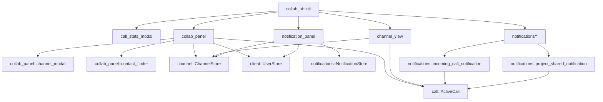
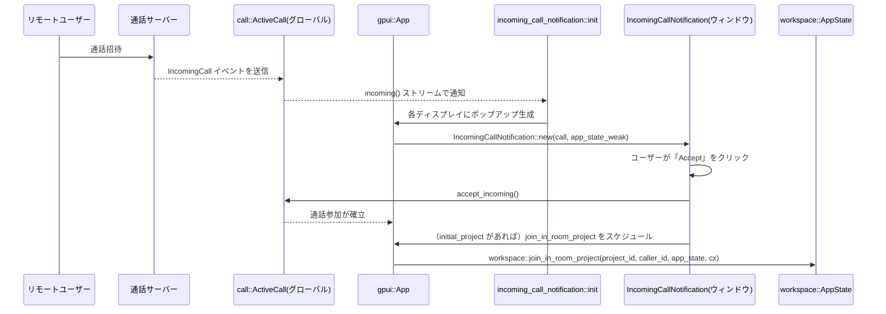

# crates/collab_ui ディレクトリ解説

## 1. ざっくり一言

Zed の「協調作業」まわりの UI（コラボレーションパネル、チャンネルノートビュー、通話統計モーダル、通知パネル、およびポップアップ通知）をまとめて提供するクレートです。

---

## 2. このモジュールの役割

### 2.1 概要

- このクレートは、Zed の **音声通話・チャンネル・コンタクト・通知** といったコラボレーション機能を操作する UI をまとめたモジュール群です。
- 具体的には次の機能を提供します。
  - 通話品質の統計を表示するモーダル (`CallStatsModal`)
  - チャンネルに紐づいた Markdown ノートを編集するビュー (`ChannelView`)
  - チャンネル・コンタクトを一覧・操作するコラボレーションパネル (`CollabPanel`)
  - 通知一覧を表示する通知パネル (`NotificationPanel`) とトースト通知
  - 通話着信やプロジェクト共有のポップアップ通知
  - これらパネルの位置や幅に関する設定型

### 2.2 アーキテクチャ内での位置づけ

主要モジュール間の依存関係を簡略化した図です。



- `collab_ui::init` がこのクレートのエントリーポイントで、各パネルや通知モジュールの `init` を呼び出します。
- `CollabPanel` と `ChannelView` は `Workspace` に統合される **ビュー／パネル** として動作します。
- `NotificationPanel` は `NotificationStore` と連携してサーバー由来の通知を UI に表示します。
- `incoming_call_notification` / `project_shared_notification` は独立した透明ウィンドウを開き、ポップアップ通知として表示します。

### 2.3 設計上のポイント

コードから読み取れる特徴をまとめると、次のようになります。

- **グローバル状態に基づく UI**
  - `ActiveCall::global(cx)` や `ChannelStore::global(cx)`、`NotificationStore::global(cx)` など、グローバルなストア・状態を購読し、UI を自動更新します。
- **Workspace / Panel との統合**
  - `CollabPanel` と `NotificationPanel` は `workspace::dock::Panel` を実装し、ワークスペースのドッカブルパネルとして表示されます。
  - 各パネルは `ToggleFocus` / `Toggle` アクションを Workspace に登録しており、キーボードショートカットから操作できるようになっています。
- **リストベースの UI とフィルタリング**
  - `CollabPanel` と `NotificationPanel` は `gpui::ListState` と `list(...)` を用いた仮想リストで表示されます。
  - `CollabPanel` は `fuzzy::match_strings` によるファジー検索を多用し、チャンネルやユーザーを検索します。
- **非同期処理とストリーム**
  - 通知・通話着信などは `AsyncWindowContext` や `cx.spawn`、`futures::StreamExt` を使って非同期に監視・処理されます。
  - 非同期タスクは `.detach()` や `.detach_and_prompt_err(...)` で UI スレッドから切り離されています。
- **状態の永続化**
  - コラボパネルの折りたたみ状態・お気に入りチャンネル・フィルタ設定は `KeyValueStore` を通じて JSON で永続化されます。
  - パネルの位置や幅は `settings` クレート経由で設定ファイルに保存されます。

---

## 3. 主要な機能一覧

- コラボレーションパネル (`CollabPanel`)
  - アクティブな通話参加者・共有プロジェクト・画面共有の一覧
  - チャンネルツリー（ネスト、作成、削除、リネーム、移動、公開/非公開、メンバー管理）
  - チャンネルノートへのリンクと通知インジケーター
  - チャンネル招待、コンタクトリクエスト、コンタクト一覧（オンライン／オフライン）
  - フィルタ入力＋ファジーマッチによる絞り込み
- チャンネルノートビュー (`ChannelView`)
  - `ChannelBuffer` バックエンドの Markdown エディタ表示
  - 見出しに紐づく「リンクをコピー」機能
  - リモート状態同期用の `FollowableItem` 実装
- 通話統計モーダル (`CallStatsModal`)
  - 遅延・ジッタ・パケットロス・入力遅延などのネットワーク診断の表示
  - 数値に応じた「Normal / High / Poor」評価と色分け
- チャンネルメンバー管理モーダル (`ChannelModal`)
  - チャンネルの公開/非公開切り替えとリンクコピー
  - メンバー一覧／招待候補のファジー検索
  - メンバーのロール変更（Admin / Member / Guest）・削除・招待
- コンタクト検索モーダル (`ContactFinder`)
  - GitHub ログイン名でユーザーを検索し、コンタクトリクエストの送信/取消
- 通知パネル (`NotificationPanel`)
  - ContactRequest / ChannelInvitation 通知の一覧と相互作用（承諾・拒否）
  - 未読通知数のバッジ表示・アイコン（ベル／ベル＋ドット）の切り替え
  - 新規通知をワークスペーストーストとして表示
- 通話着信・プロジェクト共有ポップアップ
  - `IncomingCallNotification`: 通話着信時のポップアップ＋ Accept/Decline
  - `ProjectSharedNotification`: リモートプロジェクト共有時のポップアップ＋ Open/Dismiss
- パネル設定 (`CollaborationPanelSettings`, `NotificationPanelSettings`)
  - ドック位置、デフォルト幅、ボタン表示有無、未読数バッジ表示などの設定読み込み

---

## 4. 関数・構造体の解説

### 4.1 主な型一覧

| 名前 | 種別 | 役割 / 用途 |
|------|------|-------------|
| `CollabPanel` | 構造体（`Panel` 実装） | コラボレーションパネル本体。通話参加者・チャンネル・コンタクトなどをリスト表示し、各種操作を提供します。 |
| `ListEntry` | 列挙体 | `CollabPanel` 内部で、リストの1行（ヘッダ・チャンネル・参加者・招待など）を表す内部表現です。 |
| `ChannelEditingState` | 列挙体 | チャンネルの作成中／名前変更中かどうかと、その一時的な名前を保持する状態です。 |
| `ChannelView` | 構造体（`Item`, `FollowableItem` 実装） | チャンネルのノート（Markdown バッファ）を表示・編集するビューです。 |
| `ChannelBufferCollaborationHub` | 構造体（`CollaborationHub` 実装） | `ChannelBuffer` からコラボレーター情報を取得し、エディタに渡すアダプタです。 |
| `CallStatsModal` | 構造体（`ModalView` 実装） | アクティブな通話のネットワーク統計を表示するモーダルダイアログです。 |
| `ChannelModal` | 構造体（`ModalView` 実装） | チャンネルの公開/非公開とメンバー管理・招待を行うモーダルです。 |
| `Mode` | 列挙体 | `ChannelModal` のモード（既存メンバーを管理する `ManageMembers` / 新規招待の `InviteMembers`）を表します。 |
| `ChannelModalDelegate` | 構造体（`PickerDelegate` 実装） | `ChannelModal` 内の `Picker` の挙動（マッチ更新・描画・選択処理）を担うデリゲートです。 |
| `ContactFinder` | 構造体（`ModalView` 実装） | コンタクト検索モーダル本体です。 |
| `ContactFinderDelegate` | 構造体（`PickerDelegate` 実装） | `ContactFinder` 内の `Picker` の挙動を担います。 |
| `NotificationPanel` | 構造体（`Panel` 実装） | 通知一覧を表示するパネルです。 |
| `NotificationPresenter` | 構造体 | 通知1件に対して、表示用テキスト・アイコン・応答必要性をまとめたビュー用モデルです。 |
| `NotificationToast` | 構造体（`WorkspaceNotification` 実装） | 新着通知を画面右下などに一時表示するトースト用ビューです。 |
| `IncomingCallNotification` | 構造体（`Render` 実装） | 通話着信ポップアップウィンドウの中身となるビューです。 |
| `IncomingCallNotificationState` | 構造体 | 着信コール情報・AppState を保持し、応答処理（accept/decline）を行います。 |
| `ProjectSharedNotification` | 構造体（`Render` 実装） | プロジェクト共有ポップアップウィンドウの中身となるビューです。 |
| `CollaborationPanelSettings` | 構造体（`Settings` 実装） | コラボパネルのドック位置・ボタン有無・デフォルト幅の設定値です。 |
| `NotificationPanelSettings` | 構造体（`Settings` 実装） | 通知パネルのドック位置・ボタン有無・デフォルト幅・バッジ表示の設定値です。 |

このほかにも UI の描画専用構造体（`DraggedChannelView`, `JoinChannelTooltip` など）がいくつか存在しますが、役割はそれぞれの名前どおりです。

### 4.2 重要な関数の詳細（7件）

#### 1. `collab_ui::init(app_state: &Arc<AppState>, cx: &mut App)`

**概要**

- このクレートのエントリーポイントです。
- コラボレーション関連の各モジュール（パネル・モーダル・ポップアップ・タイトルバー）をアプリケーションに登録します。

**引数**

| 引数名 | 型 | 説明 |
|--------|----|------|
| `app_state` | `&Arc<AppState>` | アプリケーション全体の状態。通知初期化などで使用されます。 |
| `cx` | `&mut App` | `gpui` のアプリケーションコンテキスト。グローバルなオブザーバやアクション登録に用います。 |

**戻り値**

- 戻り値はなく、副作用として `App` にモジュールが登録されます。

**内部処理の流れ**

1. `call_stats_modal::init(cx)` で通話統計モーダルを Workspace に統合。
2. `channel_view::init(cx)` で `ChannelView` をフォロー可能ビューとして登録。
3. `collab_panel::init(cx)` でコラボパネル用の各アクションを Workspace に登録。
4. `notification_panel::init(cx)` で通知パネルのアクションを登録。
5. `notifications::init(app_state, cx)` で通話着信・プロジェクト共有のポップアップをセットアップ。
6. `title_bar::init(cx)` を呼び出し、タイトルバーにコラボ関連のコントロールを追加（別クレート）。

**Examples（使用例）**

アプリケーション起動時に一度だけ呼び出すことを想定した例です。

```rust
use std::sync::Arc;
use gpui::App;
use workspace::AppState;

fn init_app(mut app: App, app_state: Arc<AppState>) {
    // 他のモジュールの初期化...
    collab_ui::init(&app_state, &mut app);
}
```

**Errors / Panics**

- この関数内では明示的なエラー返却や `panic!` は行われていません。
- 各モジュールの `init` 内で発生したエラーは、それぞれのモジュール側で処理されます。

**Edge cases**

- `app_state` が一部未初期化でも、ここから参照しているのは `notifications::init` のみです。`AppState` の契約はこのコードチャンクからは読み取れません。

**使用上の注意点**

- アプリケーションでコラボ機能を有効にしたい場合は、**一度だけ**呼び出す前提の関数です。複数回呼ぶとアクション登録などが重複する可能性があります。
- `Workspace` のインスタンス生成より前か後かなど、正確な呼び出し順序は周辺コード依存ですが、少なくとも UI が動き始める前に呼ぶ必要があります。

---

#### 2. `collab_panel::init(cx: &mut App)`

**概要**

- 各 `Workspace` が生成された際に、コラボパネルと通話関連アクションを登録する初期化関数です。
- `Workspace::register_action` を通じて、パネルのトグルや通話操作のショートカットを紐付けます。

**引数**

| 引数名 | 型 | 説明 |
|--------|----|------|
| `cx` | `&mut App` | グローバルアプリコンテキスト。新規 Workspace の生成を監視します。 |

**戻り値**

- 戻り値なし。`App` にオブザーバが登録されます。

**内部処理の流れ**

1. `cx.observe_new(|workspace: &mut Workspace, _, _| { ... })` で **新しく作られた Workspace** を監視。
2. 各 Workspace ごとに、次のアクションを登録：
   - `ToggleFocus` / `Toggle`: `CollabPanel` を開く・フォーカスする・閉じる。
   - `OpenChannelNotes`: 現在の通話と関連づいたチャンネルのノートを開く。
   - `OpenChannelNotesById`: 任意の `ChannelId` のノートを開く。
   - `Mute` / `Deafen` / `LeaveCall` / `CopyRoomId` / `ShareProject` / `ScreenShare` など、通話操作アクション。
3. 一部アクションは `ActiveCall::global(cx)` を操作して通話状態を変更し、エラー時にはトーストを表示します。

**Examples（使用例）**

通常は `collab_ui::init` から呼ばれるため、直接呼び出す必要はありませんが、単体で使う場合の例です。

```rust
use gpui::App;

fn main() {
    let mut app = App::new(); // 仮の初期化
    collab_panel::init(&mut app);
    // Workspace 生成時に CollabPanel が利用可能になる
}
```

**Errors / Panics**

- 内部で行う通話操作 (`hang_up`, `share_project` など) は `detach_and_prompt_err` 付きで呼ばれており、ネットワークエラー等は UI に表示されます。
- `init` 自体はエラーを返しません。

**Edge cases**

- アクティブな通話がない状態で `CopyRoomId` アクションを実行した場合、「There’s no active call; join one first.」というエラーメッセージを Workspace に表示します。
- Linux + Wayland の画面共有など、プラットフォーム依存の分岐があります。

**使用上の注意点**

- `Workspace` のライフサイクルに依存するため、`App` の初期化時に一度登録しておくことが前提です。
- Register するアクション名（型）に対してショートカットを割り当てるのは別の設定（キー設定）側の責務です。

---

#### 3. `CollabPanel::update_entries(&mut self, select_same_item: bool, cx: &mut Context<Self>)`

**概要**

- コラボパネルの **全リスト内容を再構築** する中心的な関数です。
- 通話・チャンネル・招待・コンタクト・フィルタ文字列・折りたたみ状態など、種々の状態をもとに `self.entries: Vec<ListEntry>` を更新します。

**引数**

| 引数名 | 型 | 説明 |
|--------|----|------|
| `select_same_item` | `bool` | 以前の選択項目を可能な限り維持するかどうか。 |
| `cx` | `&mut Context<Self>` | `CollabPanel` のコンテキスト。ストアへのアクセスや通知に使用。 |

**戻り値**

- 返り値なし。`self.entries` と `self.selection`、`self.list_state` を更新し、`cx.notify()` で再描画をトリガします。

**内部処理の流れ（簡略）**

1. フィルタ文字列・実行用 Executor を取得。
2. 以前の選択エントリとスクロール位置を保存。
3. `ActiveCall` に通話ルームがあれば:
   - `Section::ActiveCall` ヘッダを追加。
   - クエリが空で、ルームに `channel_id` がある場合 `ChannelNotes` エントリを追加。
   - 現在ユーザー + リモート参加者 + ペンディング参加者をファジーマッチして `CallParticipant` と関連 `ParticipantProject` / `ParticipantScreen` を追加。
4. `FavoriteChannels` セクション:
   - お気に入りチャンネルを集め、名前でファジーマッチし、マッチに応じて `Channel { is_favorite = true }` を追加。
5. `Channels` セクション:
   - 全チャンネルを `ordered_channels()` で取得し、ファジーマッチ結果 + 親子階層 + 折りたたみ状態 + `filter_occupied_channels` に従って `Channel` / `ChannelEditor` を追加。
6. `ChannelInvites`, `Contacts`, `ContactRequests`, `Online`, `Offline` も同様にファジーマッチし、それぞれ対応する `ListEntry` を構築。
7. 選択項目の復元:
   - `select_same_item == true` の場合、以前と同じ `ListEntry`（`PartialEq` 実装）を探して選択。
   - 見つからない場合は近いインデックスを選択するか、選択解除。
8. スクロール位置の復元:
   - 旧 `ListState` の先頭エントリに対応する新エントリを探し、似た位置にスクロールを合わせます。
9. 最後に `cx.notify()`。

**Examples（使用例）**

`CollabPanel` 内部からのみ呼ばれており、外部から直接呼ぶことは想定されていませんが、フィルタ変更の例：

```rust
// フィルタエディタのバッファが編集されたときの購読
cx.subscribe(&filter_editor, |panel: &mut CollabPanel, _, event, cx| {
    if let editor::EditorEvent::BufferEdited = event {
        panel.update_entries(true, cx);
    }
}).detach();
```

**Errors / Panics**

- この関数内で明示的な `panic!` や `?` によるエラー伝播は行われていません。
- `match_strings` は `cx.foreground_executor().block_on(...)` で同期的に呼ばれており、ここでは `Result` ではなく戻り値を直接受け取っています（エラー処理は `match_strings` 側の契約依存です）。

**Edge cases**

- 通話・チャンネル・コンタクトが全く存在しない場合:
  - `Contacts` セクションの下に `ContactPlaceholder` エントリが1つ追加されます。
- フィルタ文字列が空でない場合:
  - ほぼすべてのセクションでマッチしないエントリは非表示になります。
  - 折りたたみ状態（セクション／チャンネル）は、フィルタ中は一部無視されます。
- `filter_occupied_channels == true` の場合:
  - 参加者が存在するチャンネルと、その祖先チャンネルのみが `Channels` セクションに表示されます。

**使用上の注意点**

- 更新処理が比較的重いので、`EditorEvent::BufferEdited` など高頻度なイベントから呼ぶ場合は、既に関数内でファジーマッチを同期実行している点に注意が必要です（ただし、このコード内ではそのまま呼び出しています）。
- 外部から呼び出す場合は、`cx.notify()` が内部で呼ばれるため、続けて UI 更新を行う場合の順序に注意します。

---

#### 4. `ChannelView::open(channel_id: ChannelId, link_position: Option<String>, workspace: Entity<Workspace>, window: &mut Window, cx: &mut App) -> Task<Result<Entity<Self>>>`

**概要**

- 指定した `ChannelId` に対応するチャンネルノートビューを、現在アクティブな `Pane` に開きます。
- 既に同じチャンネルバッファが開かれている場合は、そのビューを再利用します。
- 任意のセクション位置（見出しスラッグ）にフォーカスする機能を持ちます。

**引数**

| 引数名 | 型 | 説明 |
|--------|----|------|
| `channel_id` | `ChannelId` | 開きたいチャンネルの ID。 |
| `link_position` | `Option<String>` | チャンネルノート内の見出しを示すスラッグ文字列（例: `"meeting-notes-2024-04-01"`）。`None` なら先頭。 |
| `workspace` | `Entity<Workspace>` | 対象ワークスペース。アクティブペインの取得やタブ追加に使用。 |
| `window` | `&mut Window` | ウィンドウコンテキスト。非同期タスクの spawn に使用。 |
| `cx` | `&mut App` | アプリケーションコンテキスト。グローバルストア取得などに使用。 |

**戻り値**

- `Task<Result<Entity<ChannelView>>>`
  - 非同期に `ChannelView` の `Entity` を返すタスクです。
  - エラー時は `anyhow::Error` を返します。

**内部処理の流れ**

1. `workspace.read(cx).active_pane()` から現在のペインを取得。
2. 内部で `Self::open_in_pane(...)` を呼び出し、そこで `Self::load(...)` → `ChannelView::new(...)` → `cx.new_window_entity` の流れでビューを生成。
3. `window.spawn(cx, async move |cx| { ... })` で非同期タスクを起動し：
   - 完成した `channel_view` を `pane.add_item(...)` でタブとして追加。
   - `telemetry::event!("Channel Notes Opened", ...)` を発行。
4. 呼び出し側には `Task` を返します。

**Examples（使用例）**

`CollabPanel` からチャンネルノートを開くコードの簡略版です。

```rust
fn open_notes_from_panel(
    panel: &mut CollabPanel,
    channel_id: ChannelId,
    window: &mut Window,
    cx: &mut Context<CollabPanel>,
) {
    if let Some(workspace) = panel.workspace.upgrade() {
        ChannelView::open(channel_id, None, workspace, window, cx).detach();
    }
}
```

**Errors / Panics**

- エラーは `anyhow::Result` で `Task` に包まれて返されます。
- この関数自体はエラーを投げませんが、呼び出し側が `await` したときに `Err` となる可能性があります（チャンネルバッファのオープンに失敗した場合など）。

**Edge cases**

- 同じペインに既に同じ `ChannelBuffer` を表示している `ChannelView` がある場合:
  - 新しくビューを作らず、既存のビューを返します。
  - `link_position` が指定されていれば、そのビュー側で `focus_position_from_link` を呼んでスクロール・選択を行います。
- `link_position` が何も見つけられないスラッグの場合:
  - `focus_position_from_link` 内でアウトライン再パースを一度待ちますが、それでも見つからなければ何もしません。

**使用上の注意点**

- `Task` を返すため、「開くだけでよい」場合は `.detach()` で fire-and-forget できますが、失敗時のエラーをハンドリングしたい場合は `await` して `Result` を確認します。
- `workspace` の `Entity` が有効であることが前提です。破棄済み Workspace に対して呼ぶと `update_in` が失敗する可能性があります。

---

#### 5. `ChannelModal::new(...) -> Self`

```rust
pub fn new(
    user_store: Entity<UserStore>,
    channel_store: Entity<ChannelStore>,
    channel_id: ChannelId,
    mode: Mode,
    window: &mut Window,
    cx: &mut Context<Self>,
) -> Self
```

**概要**

- チャンネルメンバー管理／招待モーダルのインスタンスを生成します。
- 内部で `Picker<ChannelModalDelegate>` を作成し、メンバー／ユーザー検索のロジックを組み込みます。

**引数**

| 引数名 | 型 | 説明 |
|--------|----|------|
| `user_store` | `Entity<UserStore>` | ユーザー情報とコンタクト情報を保持するストア。 |
| `channel_store` | `Entity<ChannelStore>` | チャンネル情報とメンバーシップを管理するストア。 |
| `channel_id` | `ChannelId` | 対象チャンネルの ID。 |
| `mode` | `Mode` | 初期モード（`ManageMembers` / `InviteMembers`）。 |
| `window` | `&mut Window` | ウィンドウコンテキスト。`Picker` 初期化に使用。 |
| `cx` | `&mut Context<Self>` | `ChannelModal` のコンテキスト。内部エンティティ生成に使用。 |

**戻り値**

- 初期化済みの `ChannelModal` インスタンス。

**内部処理の流れ**

1. `cx.observe(&channel_store, |_, _, cx| cx.notify())` でチャンネルストア変更時に再描画する購読を追加。
2. `ChannelModalDelegate` を作成し、`Picker::uniform_list(delegate, window, cx).modal(false)` でピッカーを生成。
3. `ChannelModal { picker, channel_store, channel_id }` を構築。

**Examples（使用例）**

`CollabPanel` から「Manage Members」モードで起動する部分の簡略版です。

```rust
fn open_manage_members_modal(
    panel: &mut CollabPanel,
    channel_id: ChannelId,
    window: &mut Window,
    cx: &mut Context<CollabPanel>,
) {
    let workspace = panel.workspace.clone();
    let user_store = panel.user_store.clone();
    let channel_store = panel.channel_store.clone();

    cx.spawn_in(window, async move |_, cx| {
        workspace.update_in(cx, |workspace, window, cx| {
            workspace.toggle_modal(window, cx, |window, cx| {
                ChannelModal::new(
                    user_store.clone(),
                    channel_store.clone(),
                    channel_id,
                    channel_modal::Mode::ManageMembers,
                    window,
                    cx,
                )
            });
        })
    }).detach();
}
```

**Errors / Panics**

- `new` 自体でのエラーはありません。
- 後続の操作（ロール変更・メンバー削除・招待など）は `ChannelModalDelegate` 側で非同期に行われ、`detach_and_prompt_err` によってエラートーストが表示される場合があります。

**Edge cases**

- `render` 時に `channel_store.channel_for_id(self.channel_id)` が `None` の場合、空の `div()` を返します（チャンネルが削除されていた可能性など）。
- `Mode::ManageMembers` でまだメンバー一覧をすべて取得していない場合、`fuzzy_search_members` の結果を用いて部分的に表示し、必要に応じてフルリストに昇格します（`has_all_members` フラグ）。

**使用上の注意点**

- `ChannelModal::new` 自体は単なる構築であり、通常は `Workspace::toggle_modal` のコールバックとして使われます。
- チャンネルの管理権限チェックは `CollabPanel` 側のコンテキストメニューで行われています（`is_channel_admin` など）。`ChannelModal` では権限の有無に関係なく UI を表示しているため、上位側で呼び出し制御されます。

---

#### 6. `NotificationPanel::new(workspace: &mut Workspace, window: &mut Window, cx: &mut Context<Workspace>) -> Entity<Self>`

**概要**

- 通知パネルのインスタンスを新規作成し、クライアント状態・通知ストア・設定ストアに対する購読をセットアップします。
- `NotificationPanel::load(...)` から呼ばれる想定のファクトリ関数です。

**引数**

| 引数名 | 型 | 説明 |
|--------|----|------|
| `workspace` | `&mut Workspace` | パネルを追加するワークスペース。 |
| `window` | `&mut Window` | ウィンドウコンテキスト。非同期タスクの spawn に使用。 |
| `cx` | `&mut Context<Workspace>` | Workspace のコンテキスト。パネル `Entity` の生成に使用。 |

**戻り値**

- `Entity<NotificationPanel>`：生成された通知パネルのエンティティ。

**内部処理の流れ（簡略）**

1. `fs`, `client`, `user_store`, `workspace_handle` をローカルに退避。
2. `cx.new(|cx| { ... })` の中で次を行う：
   - `client.status()` のストリームを監視し、ステータス変化ごとに `cx.notify()` で UI 更新。
   - `ListState::new(...)` を作成し、スクロール位置に応じて `load_more_notifications` を呼ぶスクロールハンドラをセット。
   - ローカルタイムゾーンオフセットを `UtcOffset` に変換。
   - `NotificationPanel` のフィールドを初期化。
   - `notification_store` への `observe`／`subscribe_in` を設定（新着通知・削除・更新に応じて一覧／トーストを更新）。
   - `SettingsStore` のグローバルストアを購読し、ドック位置が変わったときに `Event::DockPositionChanged` を発行。

**Examples（使用例）**

通常は `NotificationPanel::load` を通じて使用され、外部から `new` を直接呼ぶことは想定されていません。`load` の例：

```rust
pub fn load(
    workspace: WeakEntity<Workspace>,
    cx: AsyncWindowContext,
) -> Task<Result<Entity<NotificationPanel>>> {
    cx.spawn(async move |cx| {
        workspace.update_in(cx, |workspace, window, cx| NotificationPanel::new(workspace, window, cx))
    })
}
```

**Errors / Panics**

- `new` 自体は `Entity` を返し、エラーを返しません。
- 内部で起動する非同期タスクはエラーを `log_err` したり、`NotificationStore` 側で処理します。

**Edge cases**

- 接続されていない (`client.status().borrow().is_connected() == false`) 場合、`render` 側で「Connect」ボタン付きのメッセージが表示され、通知一覧ではなく接続プロンプトが出ます。
- 通知が一件もない場合、「You have no notifications.」というテキストを表示します。

**使用上の注意点**

- `NotificationPanel` のアクティブ状態は `Panel::set_active` で管理され、自身がアクティブになったタイミングで未読リスト `unseen_notifications` をクリアします。そのため、外部から `set_active` を呼ぶ場合は、未読バッジの挙動への影響を考慮する必要があります。

---

#### 7. `notifications::incoming_call_notification::init(app_state: &Arc<AppState>, cx: &mut App)`

**概要**

- 通話着信 (`IncomingCall`) ストリームを監視し、各ディスプレイに通話着信ポップアップウィンドウを表示する初期化関数です。
- 通話が終了・キャンセルされた場合は、開いているポップアップをクリーンアップします。

**引数**

| 引数名 | 型 | 説明 |
|--------|----|------|
| `app_state` | `&Arc<AppState>` | ワークスペース状態にアクセスするためのハンドル。通話受諾後のプロジェクト参加に使用。 |
| `cx` | `&mut App` | アプリケーションコンテキスト。グローバル `ActiveCall` へのアクセスとウィンドウ生成に使用。 |

**戻り値**

- 戻り値なし。副作用として `ActiveCall` の着信ストリーム監視を開始します。

**内部処理の流れ**

1. `let app_state = Arc::downgrade(app_state);` として弱参照を保持。
2. `let mut incoming_call = ActiveCall::global(cx).read(cx).incoming();` で着信ストリームを取得。
3. `cx.spawn(async move |cx| { ... })` で非同期タスクを起動:
   - `notification_windows: Vec<WindowHandle<IncomingCallNotification>>` を保持。
   - `while let Some(incoming_call) = incoming_call.next().await { ... }` のループで着信を監視。
   - 新しい着信が来たら既存のポップアップをすべて閉じる。
   - 各ディスプレイ (`cx.displays()`) について:
     - `notification_window_options(screen, window_size, cx)` でウィンドウ位置・サイズを計算。
     - `cx.open_window(options, ...)` で `IncomingCallNotification` を持つウィンドウを開き、`notification_windows` に保存。
4. ストリームが終わったら、残っているウィンドウをすべて閉じる。

**Examples（使用例）**

通常は `collab_ui::init` から呼ばれます。単独利用例：

```rust
use std::sync::Arc;
use gpui::App;
use workspace::AppState;

fn init_notifications(app_state: Arc<AppState>, mut app: App) {
    incoming_call_notification::init(&app_state, &mut app);
}
```

**Errors / Panics**

- `open_window` のエラーは `if let Ok(window) = ...` で明示的に無視されます（失敗した場合はそのディスプレイにはポップアップが出ません）。
- `window.update(...).log_err()` により、ウィンドウ削除時のエラーはログに記録されるだけです。

**Edge cases**

- 通話着信が `None`（キャンセル）として通知された場合：
  - ループ内で `if let Some(incoming_call) = incoming_call { ... }` となっており、`None` の場合には新しいウィンドウは開きません。
- ディスプレイが1枚もない場合：
  - `unique_screens` が空になり、ポップアップは出ません。

**使用上の注意点**

- `ActiveCall` 側の `incoming()` がどのようなタイミングで閉じるかはこのコードからは分かりませんが、ストリーム終了時に残りのポップアップは確実に閉じられます。
- `IncomingCallNotificationState::respond` は `call.accept_incoming` / `call.decline_incoming` を呼び出すので、App 側で適切に `ActiveCall` が管理されている必要があります。

---

### 4.3 その他の関数・メソッド（主なグループ）

全関数を列挙すると非常に多いため、代表的なグループだけをまとめます。

| 関数 / メソッド群 | 役割（1行） |
|------------------|-------------|
| `CallStatsModal::render`, `render_metric_row`, `quality_label`, `metric_rating` など | 通話のネットワーク統計値を UI 上にレンダリングし、値に応じたラベルと色を決定します。 |
| `ChannelView::focus_position_from_link`, `copy_link`, `copy_link_for_position` | ノート内の見出しスラッグを用いてカーソルを移動したり、現在位置へのリンクをクリップボードにコピーします。 |
| `ChannelView::handle_channel_buffer_event`, `acknowledge_buffer_version` | チャンネルバッファの接続状態や更新通知を受けて、エディタの読み取り専用状態とバージョン追跡を更新します。 |
| `CollabPanel::render_*` 系（`render_call_participant`, `render_channel`, `render_contact` など） | `ListEntry` の各種バリアントを具体的な UI コンポーネントに変換します。 |
| `CollabPanel::deploy_*_context_menu` 系 | 参加者・チャンネル・コンタクトごとのコンテキストメニューを構築し、権限操作や削除、招待などを行うエントリを登録します。 |
| `CollabPanel::confirm`, `cancel`, `select_next`, `select_previous` | キーボード操作（Enter, Esc, 上下キー）に対してリスト選択や操作を行います。 |
| `CollabPanel::serialize`, `persist_favorites`, `persist_filter_occupied_channels` | 折りたたみ状態・お気に入りチャンネル・フィルタ設定を `KeyValueStore` に永続化します。 |
| `NotificationPanel::render_notification`, `present_notification`, `did_render_notification`, `on_notification_event`, `add_toast`, `remove_toast` | 通知ストアのエントリから表示用モデルを生成し、パネル内表示・トースト・既読状態更新などを行います。 |
| `ProjectSharedNotification::join`, `dismiss` | プロジェクト共有ポップアップから、共有プロジェクトに参加したり、招待を破棄するイベントを発行します。 |
| `panel_settings.rs` の `Settings::from_settings` 実装 | 設定ファイルの `SettingsContent` から UI パネル設定を抽出します。 |

---

## 5. データフロー

ここでは「通話着信ポップアップから実際に通話に参加し、プロジェクトに参加する」シナリオのデータフローを示します。

### シナリオの要点

1. リモートユーザーが通話招待を送ると、サーバー経由で `ActiveCall` の `incoming()` ストリームに `IncomingCall` が流れます。
2. `incoming_call_notification::init` がこのストリームを監視し、各ディスプレイに `IncomingCallNotification` ウィンドウを開きます。
3. ユーザーがポップアップの「Accept」をクリックすると、`ActiveCall::accept_incoming` が呼ばれ、通話に参加します。
4. 同時に、着信情報に含まれる `initial_project` があれば、`workspace::join_in_room_project` を呼んで共有プロジェクトに参加します。

### シーケンス図



この間、`CollabPanel` 側では `ActiveCall` の状態変化を `observe` しており、参加者一覧セクション（`Section::ActiveCall`）が更新されます。その結果、新しい参加者や共有プロジェクトがパネルに表示されます。

---

## 6. 使い方（How to Use）

### 6.1 基本的な使用方法

最小構成として、このクレートをアプリケーションに組み込むには次のステップが必要です。

1. `Cargo.toml` で `collab_ui` クレートを依存関係に追加（このコードでは既にクレート内の設定が行われています）。
2. アプリケーション起動時に `collab_ui::init` を呼び、各パネル・モーダル・通知を登録。
3. `Workspace` と `Panel` システムが `CollabPanel` / `NotificationPanel` を適宜開くようにする（Zed 本体ではワークスペース管理側に実装されています）。

簡略したイニシャライザの例です。

```rust
use std::sync::Arc;
use gpui::App;
use workspace::AppState;

fn main() {
    // AppState と App を用意したと仮定します。
    let app_state: Arc<AppState> = /* ... */;
    let mut app: App = /* ... */;

    // コラボ UI を有効化
    collab_ui::init(&app_state, &mut app);

    // Workspace やメインウィンドウの生成へ続く...
}
```

`CollabPanel` / `NotificationPanel` のインスタンス生成は通常、`Workspace` 側の `Panel` 管理ロジックが呼び出すため、アプリケーション側で直接 `new` する必要はありません。

### 6.2 よくある使用パターン

#### パターン1: 現在の通話チャンネルのノートを開く

`CollabPanel::init` で `OpenChannelNotes` アクションが登録されており、ショートカット等から呼ばれた際に自動でノートが開きます。手動で同等の処理を行うと次のようになります。

```rust
use call::ActiveCall;
use workspace::Workspace;
use collab_ui::channel_view::ChannelView;

fn open_current_call_notes(
    workspace: &Workspace,
    window: &mut gpui::Window,
    cx: &mut gpui::App,
) {
    if let Some(channel_id) = ActiveCall::global(cx)
        .read(cx)
        .room()
        .and_then(|room| room.read(cx).channel_id())
    {
        let workspace_entity = cx.entity_of(workspace); // 仮の取得関数
        ChannelView::open(channel_id, None, workspace_entity, window, cx)
            .detach(); // エラーは無視する場合
    }
}
```

※ 実際には `Workspace` の `Entity` をどのように取得するかはこのチャンクでは不明なため、上記は概念的な例です。

#### パターン2: チャンネルメンバーを管理するコンテキストメニュー

`CollabPanel` はチャンネル行の右クリック・三点リーダーボタンから `deploy_channel_context_menu` を呼び出し、そこから `manage_members` → `ChannelModal` を開いています。チャンネル ID が分かっている場合、概念的には次のように呼び出します。

```rust
fn manage_channel_members(
    panel: &mut CollabPanel,
    channel_id: ChannelId,
    window: &mut gpui::Window,
    cx: &mut gpui::Context<CollabPanel>,
) {
    panel.manage_members(channel_id, window, cx);
}
```

#### パターン3: コンタクト検索モーダルからコンタクトリクエストを送る

`CollabPanel` の `Contacts` セクションヘッダ右の「＋」ボタン、または `ContactPlaceholder` をクリックすると、`toggle_contact_finder` 経由で `ContactFinder` モーダルが開きます。

```rust
fn open_contact_finder(
    panel: &mut CollabPanel,
    window: &mut gpui::Window,
    cx: &mut gpui::Context<CollabPanel>,
) {
    panel.toggle_contact_finder(window, cx);
}
```

`ContactFinder` 内では `UserStore::fuzzy_search_users` と `request_contact`／`remove_contact` を使ってコンタクトリクエストの送信／取り消しを行います。

### 6.3 よくある間違い

```rust
// 誤り例: collab_ui::init を呼ばずに CollabPanel を直接 new しようとする
fn bad_init(app_state: Arc<AppState>, mut app: App) {
    // collab_ui::init(&app_state, &mut app); を呼んでいない

    // Workspace 側が CollabPanel::init でアクション登録されていないため、
    // パネルのショートカットなどが動かない。
}

// 正しい例: まず collab_ui::init を呼ぶ
fn good_init(app_state: Arc<AppState>, mut app: App) {
    collab_ui::init(&app_state, &mut app);
    // 以後 Workspace を生成すれば、CollabPanel / NotificationPanel などが期待通り動く
}
```

```rust
// 誤り例: ChannelView::open の Task を待たずに channel_view を使おうとする
fn bad_use_channel_view(
    workspace: Entity<Workspace>,
    window: &mut Window,
    cx: &mut App,
) {
    let task = ChannelView::open(ChannelId(1), None, workspace, window, cx);
    // ここで task.await せずに Entity<ChannelView> がある前提でアクセスするのは危険
}

// 正しい例: fire-and-forget か、await してから使う
fn good_use_channel_view(
    workspace: Entity<Workspace>,
    window: &mut Window,
    cx: &mut App,
) {
    ChannelView::open(ChannelId(1), None, workspace, window, cx).detach();

    // または非同期コンテキスト内で:
    // let view = ChannelView::open(...).await?;
}
```

### 6.4 使用上の注意点（まとめ）

- **グローバルストア依存**
  - `ActiveCall`, `ChannelStore`, `NotificationStore` など、複数のグローバルストアに依存しています。アプリケーション側でこれらが正しく初期化されていることが前提です。
- **非同期タスクの寿命**
  - 多くの操作が `cx.spawn` / `cx.spawn_in` / `window.spawn` の非同期タスクとして実行されています。`detach()` されたタスクはエラーを UI に通知するか、ログに書くだけで呼び出し元には返りません。
- **UI スレッド上での呼び出し**
  - `Context` を受け取るメソッド（`update_entries` や `manage_members` など）は基本的に UI スレッド上で呼ぶ前提です。スレッド間の呼び出し方法は `gpui` の契約に依存します。
- **設定の前提**
  - `panel_settings.rs` の `from_settings` は `collaboration_panel` / `notification_panel` が `Some` で、各フィールドに `Some` が入っている前提で `unwrap()` しています。設定ファイルが不完全な場合はパニックする可能性がありますが、このチャンクだけでは設定ファイルの生成ロジックまでは分かりません。
- **フィルタ入力とパフォーマンス**
  - `CollabPanel` のフィルタ入力はキー入力ごとに `update_entries` を呼びます。ファジーマッチはバックグラウンド Executor を使っているものの、呼び出しの頻度が高い点は念頭に置いておく必要があります。

---

## 7. 関連ファイル

このディレクトリ外で、`collab_ui` と密接に関連していると推測できるファイル／モジュールをまとめます。

| パス / モジュール | 役割 / 関係 |
|-------------------|------------|
| `call` クレート (`call::ActiveCall`, `Room`, `IncomingCall`, `room::Event`) | 通話状態・通話ルーム・着信などを表すドメイン層。`CollabPanel`、`CallStatsModal`、ポップアップ通知がこれを参照します。 |
| `channel` クレート (`Channel`, `ChannelStore`, `ChannelBuffer`, `ChannelEvent`) | チャンネル情報・ノートバッファ・メンバーシップ等を管理します。`CollabPanel`, `ChannelView`, `ChannelModal` が主に利用します。 |
| `client` クレート (`Client`, `User`, `UserStore`, 通知関連型) | サーバーとの接続状態、ユーザー情報、通知などを提供します。`NotificationPanel` や `ContactFinder` が依存しています。 |
| `workspace` クレート (`Workspace`, `Panel`, `ModalView`, `Toast`, `AppState`) | エディタ全体のワークスペース管理と、パネル／モーダル／通知システムを提供します。`CollabPanel`, `NotificationPanel`, 各モーダル・トーストがこの上に実装されています。 |
| `notifications` クレート (`NotificationStore`, `NotificationEvent`) | サーバー由来の通知データストア。`NotificationPanel` が購読し、一覧やトーストに反映します。 |
| `editor` クレート (`Editor`, `EditorEvent`, `CollaborationHub`) | テキストエディタ本体。`ChannelView` とフィルタ入力 (`CollabPanel::filter_editor`) で使用されます。 |
| `ui` クレート（`ListItem`, `Button`, `Icon`, `CollabNotification` など） | 各 UI パーツを提供するコンポーネントライブラリ。ほぼすべてのビュー・パネルから利用されています。 |
| `settings` / `theme_settings` クレート | パネルのドック位置・幅・ボタン表示有無などの設定、および UI フォントやテーマを提供します。 |
| `db::kvp::KeyValueStore` | シンプルなキー・バリューストアで、パネルの折りたたみ状態やお気に入りチャンネルなどを永続化するために利用されます。 |

このディレクトリのコードを変更する際は、上記クレートの API（特に `ActiveCall`, `ChannelStore`, `NotificationStore`, `Workspace` 周り）との契約がどのようになっているかを確認することが重要です。
