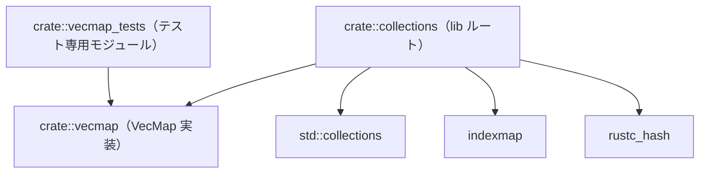
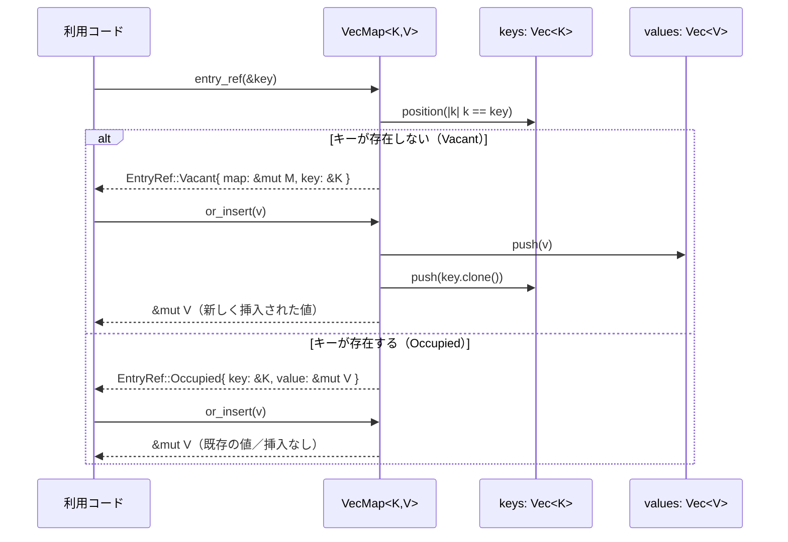

# collections/ ディレクトリ解説

## 0. ざっくり一言

Zed / GPUI 向けに、標準および拡張されたコレクション型（`HashMap` など）をまとめて提供し、さらに小規模なマップ用途向けの `VecMap` を実装するユーティリティクレートです。

---

## 1. このモジュールの役割

### 1.1 概要

- `collections` クレートは、**Zed / GPUI で共通して使うコレクション型を一元提供する**ことを目的としています。
- `rustc_hash` ベースの高速ハッシュマップ／セットや、`indexmap` ベースの順序付きマップ／セットを、型エイリアスとしてまとめています。
- さらに、**小さなキー値ストア向けのベクタ実装マップ `VecMap`** を提供します。

### 1.2 アーキテクチャ内での位置づけ

このディレクトリ内の主なモジュールと依存関係は、次のような構造になっています。



- `collections/src/collections.rs` がライブラリルートで、型エイリアス・再エクスポートと `vecmap` モジュールの公開を行います。
- `vecmap.rs` が `VecMap` 本体とエントリ API を実装します。
- `vecmap_tests.rs` は `#[cfg(test)] mod vecmap_tests;` としてのみ読み込まれ、`VecMap` の公開 API だけを通じてテストを行います。

### 1.3 設計上のポイント

コードから読み取れる特徴をまとめると、次のようになります。

- **責務の分割**
  - ライブラリルート（`collections.rs`）は型エイリアスと再エクスポートに専念しています。
  - 実装を伴う独自コレクションは `vecmap.rs` に分離されています。
- **状態管理**
  - `VecMap` は内部に `keys: Vec<K>` と `values: Vec<V>` を保持する **Struct-of-Arrays（SoA）形式** です。
- **エラーハンドリング**
  - 公開 API はすべて infallible（`Result` を返さず、明示的なエラーはありません）。
  - `or_insert_*` 内部で `unreachable!` を使っていますが、`Vec::push` 直後に `last_mut` しているだけであり、正常な実行環境では到達しない前提のガードです。
- **API 方針**
  - `std::collections::HashMap` に似た `entry` API と、その参照版 `entry_ref` を提供しています。
  - `entry_ref` は「キーのクローンが高コストな場合に、必要になるまでクローンを遅延させる」用途に対応しています。

---

## 2. 主要な機能一覧

このディレクトリ（`collections` クレート）が提供する主な機能は次のとおりです。

- `HashMap<K, V>` 型エイリアス:
  - `rustc_hash::FxHashMap` をベースとしたハッシュマップ。
- `HashSet<T>` 型エイリアス:
  - `rustc_hash::FxHashSet` をベースとしたハッシュセット。
- `IndexMap<K, V>` / `IndexSet<T>` 型エイリアス:
  - `indexmap` を `FxBuildHasher` で利用する順序付きマップ／セット。
- `std::collections::*` の再エクスポート:
  - 標準ライブラリの各種コレクション型をこのクレート経由で参照可能にします。
- `VecMap<K, V>`:
  - ベクタ (`Vec`) をバックエンドにした、**挿入順を保持する小規模マップ**。
  - `entry` / `entry_ref` ベースのキー挿入 API を提供します。

---

## 3. 関数・構造体の解説

### 3.1 型一覧（構造体・列挙体など）

このクレート固有の主要な型とエイリアスです。

| 名前 | 種別 | 役割 / 用途 |
|------|------|-------------|
| `HashMap<K, V>` | 型エイリアス | `rustc_hash::FxHashMap<K, V>` への別名。デフォルトのハッシュ関数として `FxHasher` を使うハッシュマップです。 |
| `HashSet<T>` | 型エイリアス | `rustc_hash::FxHashSet<T>` への別名。 |
| `IndexMap<K, V>` | 型エイリアス | `indexmap::IndexMap<K, V, rustc_hash::FxBuildHasher>` への別名。挿入順を保持するマップです。 |
| `IndexSet<T>` | 型エイリアス | `indexmap::IndexSet<T, rustc_hash::FxBuildHasher>` への別名。 |
| `Equivalent` | トレイト再公開 | `indexmap::Equivalent` の再エクスポート。キー比較用のトレイトです。 |
| `FxHasher` | 型再公開 | `rustc_hash::FxHasher` の再エクスポート。 |
| `FxHashMap<K, V>` | 型再公開 | `rustc_hash::FxHashMap` の再エクスポート。 |
| `FxHashSet<T>` | 型再公開 | `rustc_hash::FxHashSet` の再エクスポート。 |
| `VecMap<K, V>` | 構造体 | ベクタ2本（キー用・値用）を使ったマップ実装。挿入順でイテレートします。 |
| `Iter<'a, K, V>` | 構造体 | `VecMap` 上を `( &K, &V )` ペアで走査するイテレータです。 |
| `Entry<'a, K, V>` | 列挙体 | `VecMap::entry` が返す、「Occupied / Vacant」2種のエントリ型です。 |
| `OccupiedEntry<'a, K, V>` | 構造体 | 既に存在するキーに対するエントリ。`&K` と `&mut V` を保持します。 |
| `VacantEntry<'a, K, V>` | 構造体 | 未登録のキーに対するエントリ。`&mut VecMap` と所有権付きキー `K` を保持します。 |
| `EntryRef<'key, 'map, K, V>` | 列挙体 | 参照キー版 `entry_ref` が返すエントリ。キーを `&K` で持ちます。 |
| `VacantEntryRef<'key, 'map, K, V>` | 構造体 | 参照キー版の空エントリ。`&mut VecMap` と `&K` を保持します。 |

> 補足: `collections.rs` では `pub use std::collections::*;` により、標準ライブラリの `VecDeque` や `BTreeMap` などもすべて再公開されていますが、ここでは列挙を省略します。

---

### 3.2 主要 API の詳細

#### `impl<K, V> VecMap<K, V>::new() -> VecMap<K, V>`

**概要**

- 空の `VecMap` を作成します。
- 内部の `keys` / `values` ベクタは空の状態で初期化されます。

**引数**

- なし。

**戻り値**

- 空の `VecMap<K, V>`。

**内部処理の流れ**

1. `keys` に空の `Vec::new()` を割り当てます。
2. `values` に空の `Vec::new()` を割り当てます。
3. それらを含む `VecMap` 構造体を返します。

**Examples（使用例）**

```rust
use collections::vecmap::VecMap; // VecMap 型をこのクレートからインポート

fn main() {
    let map: VecMap<&str, i32> = VecMap::new(); // 空の VecMap を作成
    assert_eq!(map.iter().count(), 0);          // 要素数 0 であることを確認
}
```

**Errors / Panics**

- この関数自体はパニックしません。

**Edge cases（エッジケース）**

- 特になし（常に空のマップを返します）。

**使用上の注意点**

- 大量の要素を事前に確保する API（`reserve` など）は現時点のコードには存在しません。そのため、要素を追加するたびに `Vec` の再確保が発生する可能性があります。

---

#### `impl<K, V> VecMap<K, V>::iter(&self) -> Iter<'_, K, V>`

**概要**

- `VecMap` に格納された `( &K, &V )` ペアを **挿入順に** 走査するイテレータを返します。

**引数**

| 引数名 | 型 | 説明 |
|--------|----|------|
| `&self` | `&VecMap<K, V>` | 読み取り専用のマップ参照です。 |

**戻り値**

- `Iter<'_, K, V>`: `( &K, &V )` を返すイテレータ。

**内部処理の流れ**

1. `self.keys.iter()` と `self.values.iter()` を作成します。
2. それらを `Iterator::zip` で結合した `Zip` イテレータを `Iter` 構造体に格納します。
3. `Iter` を返します。
4. `Iter::next` は `self.iter.next()` をそのまま委譲し、各ステップで `( &K, &V )` を返します。

**Examples（使用例）**

```rust
use collections::vecmap::VecMap; // VecMap をインポート

fn main() {
    let mut map = VecMap::new();                 // 空の VecMap を作成
    *map.entry("a").or_insert(1) = 1;           // "a" -> 1 を挿入
    *map.entry("b").or_insert(2) = 2;           // "b" -> 2 を挿入

    let items: Vec<_> = map.iter().collect();   // すべての要素をベクタに収集
    assert_eq!(items, vec![(&"a", &1), (&"b", &2)]); // 挿入順で取得される
}
```

**Errors / Panics**

- 自身はパニックしません。

**Edge cases**

- 要素が 0 件の場合、`iter().next()` は `None` を返します。
- 重複キーがある場合でも、`entry` / `entry_ref` 実装上、**同じキーが複数回登録されることはありません**（キー存在時は上書きではなく既存値を返すだけ）。

**使用上の注意点**

- `Iter` のライフタイムは `&self` に結びついているため、イテレータが生きている間は、そのマップに対して可変操作（`&mut self` を必要とする操作）は行えません。

---

#### `impl<K: Eq, V> VecMap<K, V>::entry(&mut self, key: K) -> Entry<'_, K, V>`

**概要**

- 所有権付きキー `key` に対するエントリを取得します。
- キーが存在すれば `Entry::Occupied`、存在しなければ `Entry::Vacant` を返し、`or_insert_*` 系 API を通じて値の挿入・取得ができます。

**引数**

| 引数名 | 型 | 説明 |
|--------|----|------|
| `&mut self` | `&mut VecMap<K, V>` | マップへの可変参照です。 |
| `key` | `K` | 探索対象のキー（所有権を渡します）。 |

**戻り値**

- `Entry<'_, K, V>`:
  - `Occupied(OccupiedEntry { key: &K, value: &mut V })` もしくは
  - `Vacant(VacantEntry { map: &mut VecMap<K, V>, key: K })`。

**内部処理の流れ**

1. `self.keys.iter().position(|k| k == &key)` でキーの位置を線形探索します。
2. 見つかった場合:
   - 対応する `index` から `&self.keys[index]` と `&mut self.values[index]` を取り出し、`Entry::Occupied` を返します。
3. 見つからない場合:
   - `self` と渡された `key` を含む `VacantEntry` を作成し、`Entry::Vacant` を返します。

**Examples（使用例）**

```rust
use collections::vecmap::VecMap; // VecMap をインポート

fn main() {
    let mut map: VecMap<&str, i32> = VecMap::new(); // 空の VecMap を作成

    // "a" に対するエントリを取得し、値がなければ 1 を挿入
    let value = map.entry("a").or_insert(1);       // Vacant -> or_insert が 1 を挿入
    assert_eq!(*value, 1);                         // 返ってきた参照も 1

    // 再度 "a" のエントリを取得すると Occupied になる
    let value2 = map.entry("a").or_insert(99);     // Occupied -> 既存値 1 をそのまま返す
    assert_eq!(*value2, 1);                        // 値は変わらない
}
```

**Errors / Panics**

- この関数自体はパニックしません。
- ただし、後続の `or_insert_with_key` 実装内で `unreachable!` が使われていますが、`Vec::push` と `last_mut` の組み合わせであるため、正常な環境では到達しない前提です。

**Edge cases**

- キーが存在しない場合、`or_insert*` を呼ぶと値が新たに追加され、挿入順の末尾に並びます。
- キーが存在する場合、`or_insert*` は **新しい要素を追加せず**、既存の値への可変参照のみ返します。

**使用上の注意点**

- キーの検索は `position` による線形探索のため、要素数が増えると `entry` のコストも線形に増加します。
- キー型 `K` は `Eq` を実装している必要があります。また、`Eq` の定義に依存してキーの同一性が判断されます。

---

#### `impl<K: Eq, V> VecMap<K, V>::entry_ref<'a, 'k>(&'a mut self, key: &'k K) -> EntryRef<'k, 'a, K, V>`

**概要**

- キーへの参照 `&K` を使ってエントリを取得します。
- キーをすぐに所有権付きで渡す必要がないため、**キーのクローンが高コストな場合に有利**です（本当に挿入が必要になるまで `K::clone` を呼びません）。

**引数**

| 引数名 | 型 | 説明 |
|--------|----|------|
| `&'a mut self` | `&'a mut VecMap<K, V>` | マップへの可変参照です。 |
| `key` | `&'k K` | 探索対象キーへの参照です。 |

**戻り値**

- `EntryRef<'k, 'a, K, V>`:
  - `Occupied(OccupiedEntry { key: &K, value: &mut V })` もしくは
  - `Vacant(VacantEntryRef { map: &mut VecMap<K, V>, key: &K })`。

**内部処理の流れ**

1. `self.keys.iter().position(|k| k == key)` で、`&K` を使って線形探索します。
2. 見つかった場合:
   - `OccupiedEntry { key: &self.keys[index], value: &mut self.values[index] }` を `EntryRef::Occupied` として返します。
3. 見つからない場合:
   - `VacantEntryRef { map: self, key }` を `EntryRef::Vacant` として返します。

**Examples（使用例）**

```rust
use collections::vecmap::VecMap; // VecMap をインポート

fn main() {
    let mut map: VecMap<String, i32> = VecMap::new(); // String キーの VecMap
    let key = "hello".to_string();                    // 元のキーを 1 つだけ作る

    // 参照キーから値を挿入（まだ key はクローンされない）
    let v = map.entry_ref(&key).or_insert(10);        // Vacant -> key.clone() して挿入
    assert_eq!(*v, 10);

    // 同じキーを再度参照で lookup（このときは key のクローンは行われない）
    let v2 = map.entry_ref(&key).or_insert(99);       // Occupied -> クローンなし
    assert_eq!(*v2, 10);
}
```

**Errors / Panics**

- この関数自体はパニックしません。

**Edge cases**

- 存在しないキーに対して `or_insert_*` を呼ぶと、**そのタイミングで初めて `K::clone` が呼ばれます**（`EntryRef::Vacant` → `or_insert_with_key` 実装参照）。
- 既存キーの lookup（`Occupied`）では、`Clone` は呼ばれません。

**使用上の注意点**

- 実際に `or_insert` 系を使って値を挿入する場合、`K: Clone` 制約が必要になります（`EntryRef` の `or_insert_with_key` 実装で `entry.key.clone()` を呼ぶため）。
- `entry_ref` で `Occupied` を受け取るケースではクローンは行われませんが、「空の場合にだけクローンする」という挙動に依存したコードを書くときは、この点を意識する必要があります。

---

#### `impl<'a, K, V> Entry<'a, K, V>::key(&self) -> &K` （および `EntryRef::key`）

**概要**

- `Entry` / `EntryRef` が保持しているキーへの参照を取得します。
- `Occupied` / `Vacant` のどちらであっても、同じキー値への参照を返します。

**引数**

| 引数名 | 型 | 説明 |
|--------|----|------|
| `&self` | `&Entry<'a, K, V>` | エントリの参照です。 |

`EntryRef` 版も同様に `&self` だけを受け取ります。

**戻り値**

- `&K`: エントリに対応するキーへの参照。

**内部処理の流れ**

- `match self` で分岐し、
  - `Entry::Occupied(entry) => entry.key`
  - `Entry::Vacant(entry) => &entry.key`
- という形で内部に保持しているキーへの参照を返します。
- `EntryRef` 版では、`VacantEntryRef` でも `key: &K` をそのまま返します。

**Examples（使用例）**

```rust
use collections::vecmap::VecMap; // VecMap をインポート

fn main() {
    let mut map: VecMap<&str, i32> = VecMap::new(); // &str キーの VecMap

    let e1 = map.entry("a");                        // "a" に対する Vacant エントリを取得
    assert_eq!(e1.key(), &"a");                     // Vacant でも key() で "a" が取れる

    let _ = e1.or_insert(1);                        // 値を挿入して Occupied 状態にする

    let e2 = map.entry("a");                        // 今度は Occupied エントリを取得
    assert_eq!(e2.key(), &"a");                     // Occupied でも同じキーが取れる
}
```

**Errors / Panics**

- パニックしません。

**Edge cases**

- 存在しないキーに対する `Vacant` エントリでも、渡したキー値はすでに `VacantEntry.key` に格納されているため、常に同じ値が返ります。

**使用上の注意点**

- このメソッドは「エントリが空かどうかに関わらずキーを参照したい」場面（例えばログ出力やデバッグ）に有用です。

---

#### `impl<'a, K, V> Entry<'a, K, V>::or_insert_with_key<F>(self, default: F) -> &'a mut V`

**概要**

- `Entry` が `Occupied` なら既存の値への可変参照を返し、`Vacant` なら **キーを引数にとるクロージャ `default` を呼び出して値を生成・挿入**し、その値への可変参照を返します。

**引数**

| 引数名 | 型 | 説明 |
|--------|----|------|
| `self` | `Entry<'a, K, V>` | `entry` で取得したエントリ。所有権を移動させます。 |
| `default` | `F` where `F: FnOnce(&K) -> V` | 未登録キー用の初期値を生成するクロージャです。キー `&K` を引数に取ります。 |

**戻り値**

- `&'a mut V`: 既存または新規に挿入された値への可変参照。

**内部処理の流れ**

1. `match self` で `Occupied` / `Vacant` を判定します。
2. `Occupied(entry)` の場合:
   - 何も挿入せず、`entry.value`（`&mut V`）をそのまま返します。
3. `Vacant(entry)` の場合:
   - `entry.map.values.push(default(&entry.key))` で、新しい値を `values` ベクタ末尾に追加します。
   - `entry.map.keys.push(entry.key)` で、所有権を持つキーを `keys` ベクタ末尾に追加します。
   - `values.last_mut()` で追加したばかりの値への `&mut V` を取り出し、それを返します。
   - `last_mut` が `None` の場合は `unreachable!` でパニックしますが、`push` の直後なので通常は到達しません。

**関連メソッド**

- `Entry::or_insert_with<F: FnOnce() -> V>(self, default: F) -> &'a mut V`
  - `or_insert_with_key(|_| default())` の薄いラッパーです。
- `Entry::or_insert(self, value: V) -> &'a mut V`
  - `or_insert_with_key(|_| value)` のラッパーです。
- `Entry::or_insert_default(self) -> &'a mut V`
  - `V: Default` 制約付きで `Default::default()` を使うラッパーです。

**Examples（使用例）**

```rust
use collections::vecmap::VecMap; // VecMap をインポート

fn main() {
    let mut map: VecMap<&str, String> = VecMap::new();        // &str -> String の VecMap

    // キーを利用して初期値を生成する例
    map.entry("hello")
        .or_insert_with_key(|k| k.to_uppercase());           // "HELLO" を生成して挿入

    assert_eq!(
        map.iter().collect::<Vec<_>>(),                       // 1 要素のみ
        vec![(&"hello", &"HELLO".to_string())]                // キー "hello" に値 "HELLO"
    );
}
```

**Errors / Panics**

- `last_mut` が `None` の場合に `unreachable!` でパニックしますが、`Vec::push` の直後であるため、通常は起こりません。

**Edge cases**

- `default` がパニックする可能性がある場合、そのパニックは `or_insert_with_key` 呼び出し中に伝播します。
- `Occupied` だった場合、`default` は呼ばれません（テスト `test_entry_or_insert_with_not_called_when_occupied` で確認されています）。

**使用上の注意点**

- 高コストな初期化処理を `default` に書く場合、`Occupied` の場合は呼ばれない、という laziness を前提にできます。
- 挿入順は `values.push` → `keys.push` の順に処理されますが、両方とも同じインデックスに追加されるため、キーと値の対応は常に 1:1 になります。

---

#### `impl<'key, 'map, K, V> EntryRef<'key, 'map, K, V>::or_insert_with_key<F>(self, default: F) -> &'map mut V where K: Clone, F: FnOnce(&K) -> V`

**概要**

- `entry_ref` から得た `EntryRef` に対する `or_insert_with_key` 版です。
- 未登録のときだけ `K::clone` を呼び、キーをマップにコピーしてから値を挿入します。

**引数**

| 引数名 | 型 | 説明 |
|--------|----|------|
| `self` | `EntryRef<'key, 'map, K, V>` | `entry_ref` で取得した参照キーエントリ。 |
| `default` | `F` where `F: FnOnce(&K) -> V` | 未登録キー用の初期値生成クロージャ。キー `&K` を受け取ります。 |

**戻り値**

- `&'map mut V`: 既存または新規に挿入された値への可変参照。

**内部処理の流れ**

1. `match self` で `Occupied` / `Vacant` を判定します。
2. `Occupied(entry)` の場合:
   - 何も挿入せず、`entry.value`（`&mut V`）をそのまま返します。
3. `Vacant(entry)` の場合:
   - `entry.map.values.push(default(entry.key))` で新しい値を挿入します。
   - `entry.map.keys.push(entry.key.clone())` でキーをクローンして `keys` に追加します。
   - `values.last_mut()` で追加済みの値への可変参照を返します。
   - `last_mut` が `None` の場合には `unreachable!` でパニックしますが、通常は到達しません。

**関連メソッド**

- `EntryRef::or_insert_with<F: FnOnce() -> V>(self, default: F) -> &'map mut V`
  - `or_insert_with_key(|_| default())` のラッパーです。
- `EntryRef::or_insert(self, value: V) -> &'map mut V`
  - `or_insert_with_key(|_| value)` のラッパーです。
- `EntryRef::or_insert_default(self) -> &'map mut V where V: Default`
  - `Default::default()` を使うラッパーです。

**Examples（使用例）**

```rust
use std::cell::Cell;                   // クローン回数を数えるための Cell
use std::rc::Rc;                       // 共有カウンタ用 Rc
use collections::vecmap::VecMap;       // VecMap をインポート

#[derive(PartialEq, Eq)]
struct CountedKey {
    value: String,                     // キーの実際の値
    clone_count: Rc<Cell<usize>>,      // Clone 回数を記録する共有カウンタ
}

impl Clone for CountedKey {
    fn clone(&self) -> Self {
        self.clone_count.set(self.clone_count.get() + 1); // Clone 回数をインクリメント
        CountedKey {
            value: self.value.clone(),                    // 文字列もクローン
            clone_count: self.clone_count.clone(),        // カウンタは共有
        }
    }
}

fn main() {
    let clone_count = Rc::new(Cell::new(0));              // 初期 Clone 回数 0
    let key = CountedKey {
        value: "a".to_string(),
        clone_count: clone_count.clone(),
    };

    let mut map: VecMap<CountedKey, i32> = VecMap::new(); // CountedKey -> i32 の VecMap
    map.entry_ref(&key).or_insert(1);                     // Vacant -> このときにだけ key.clone() が 1 回呼ばれる
    assert_eq!(clone_count.get(), 1);                     // Clone 回数は 1

    map.entry_ref(&key).or_insert(99);                    // Occupied -> Clone は呼ばれない
    assert_eq!(clone_count.get(), 1);                     // Clone 回数は増えない
}
```

**Errors / Panics**

- 通常はパニックしません。
- `default` 内でのパニック、および `unreachable!` は前述のとおりです。

**Edge cases**

- `Vacant` のときだけ `entry.key.clone()` が呼ばれるため、「Clone の副作用が 1 回だけ実行される」ことを前提にしたテストパターン（`test_entry_ref_key_cloned_exactly_once_on_vacant_insert`）が用意されています。
- `Occupied` では `Clone` は呼ばれません。

**使用上の注意点**

- キーのクローンが重い場合や、クローン回数を制御したい場合に `entry_ref` + `EntryRef::or_insert_*` の組み合わせが有用です。
- 逆に、キーのクローンコストが小さい場合は、単純に `entry(key.clone())` を使うことも考えられますが、このディレクトリのコードからその利用例は読み取れません。

---

### 3.3 その他の関数

補助的なラッパーメソッドを一覧でまとめます。

| 関数名 | 所属 | 役割（1 行） |
|--------|------|--------------|
| `Entry::or_insert_with<F: FnOnce() -> V>(self, default: F) -> &mut V` | `Entry` | キーを使わない初期化クロージャで値を挿入・取得します。 |
| `Entry::or_insert(self, value: V) -> &mut V` | `Entry` | 即値 `value` を使い、未登録時だけそれを挿入して参照を返します。 |
| `Entry::or_insert_default(self) -> &mut V where V: Default` | `Entry` | `Default::default()` を使って未登録時の値を挿入します。 |
| `EntryRef::or_insert_with<F: FnOnce() -> V>(self, default: F) -> &mut V` | `EntryRef` | `Entry` 版と同様ですが、キーは参照で保持しており、未登録時だけ `K::clone` を行います。 |
| `EntryRef::or_insert(self, value: V) -> &mut V` | `EntryRef` | 未登録時だけ `value` を挿入して参照を返します。 |
| `EntryRef::or_insert_default(self) -> &mut V where V: Default` | `EntryRef` | `Default::default()` を使うラッパーです。 |

---

## 4. データフロー

ここでは、`VecMap` に対して `entry_ref` と `or_insert` を使って値を挿入する典型的な流れを示します。

### 4.1 代表的なフローの説明

1. 利用コードは、キー（例: `String`）を 1 つ生成します。
2. `VecMap::entry_ref(&key)` を呼び出し、内部で `keys` ベクタを線形探索して、すでにキーが存在するかどうかを判定します。
3. キーが存在しない場合、`EntryRef::Vacant` が返されます。
4. 利用コードが `EntryRef::or_insert(value)` を呼び出すと、そのタイミングで:
   - キー `&K` が `K::clone` により複製され `keys` に追加されます。
   - 値が `values` に追加されます。
5. その後、同じキーに対して再び `entry_ref` を呼ぶと、今度は `EntryRef::Occupied` が返り、`or_insert` は既存値を返します。

### 4.2 シーケンス図（Mermaid）



この図から分かること:

- キーのクローン (`key.clone()`) は **Vacant → or_insert 系の呼び出し時に 1 回だけ** 行われます。
- 値の挿入も同様に `or_insert` 系メソッド内部で行われます。
- `keys` / `values` ベクタのインデックスが常に対応するように操作されます。

---

## 5. 使い方（How to Use）

### 5.1 基本的な使用方法

ここでは、このクレートを他のクレートから利用すると仮定し、`VecMap` を用いて文字列キーからカウンタを管理する簡単な例を示します。

```rust
use collections::vecmap::VecMap;         // このクレートの VecMap をインポート

fn main() {
    let mut counts: VecMap<&str, i32> = VecMap::new(); // 単語ごとのカウント用マップを作成

    // "apple" のカウンタを 1 増やす
    *counts.entry("apple").or_insert(0) += 1;         // entry → or_insert で 0 を挿入し、1 増加

    // "banana" のカウンタを 1 増やす
    *counts.entry("banana").or_insert(0) += 1;        // "banana" も同様に 1 に

    // 再び "apple" をカウント
    *counts.entry("apple").or_insert(0) += 1;         // 既存値 1 に 1 加算して 2 に

    // 挿入順にすべての要素を表示
    for (key, value) in counts.iter() {               // iter() で (&K,&V) を取得
        println!("{key}: {value}");                   // "apple: 2" と "banana: 1" の順で出力される
    }
}
```

### 5.2 よくある使用パターン

#### パターン1: 小規模で挿入順が重要なマップ

`VecMap` は内部で線形探索を行うため、10〜数十件程度の小さなマップで **挿入順を保持したい場合**に適しています。

```rust
use collections::vecmap::VecMap;         // VecMap をインポート

fn build_ordered_map() -> VecMap<&'static str, i32> {
    let mut map = VecMap::new();         // 新しい VecMap を作成

    map.entry("first").or_insert(1);     // 最初に "first" を挿入
    map.entry("second").or_insert(2);    // 次に "second" を挿入
    map.entry("third").or_insert(3);     // 最後に "third" を挿入

    map                                     // VecMap を返す
}

fn main() {
    let map = build_ordered_map();      // VecMap を構築
    let keys: Vec<_> = map.iter().map(|(k, _)| *k).collect(); // キーだけを取り出す
    assert_eq!(keys, vec!["first", "second", "third"]);       // 挿入順が保持されている
}
```

#### パターン2: 高コストなキーのクローンを避ける `entry_ref`

キーのクローンが重い場合、`entry_ref` を使うことで「本当に必要になるまでクローンしない」パターンを取ることができます。

```rust
use collections::vecmap::VecMap;         // VecMap をインポート

fn main() {
    let mut map: VecMap<String, i32> = VecMap::new(); // String キーの VecMap
    let key = "very_long_key_string".to_string();     // 重いキーを 1 つ作成

    // 参照だけを使って lookup / 挿入を行う
    let value = map.entry_ref(&key).or_insert(1);     // 未登録ならこのタイミングで key.clone()
    assert_eq!(*value, 1);

    // 同じキーを再利用しても、2 回目以降は Clone は行われない
    let value2 = map.entry_ref(&key).or_insert(99);   // 既存値 1 をそのまま返す
    assert_eq!(*value2, 1);
}
```

### 5.3 使用上の注意点

- **API の範囲**
  - 現時点のコード断片では、`VecMap` に対して定義されている公開メソッドは:
    - `new`
    - `iter`
    - `entry`
    - `entry_ref`
    - `Entry` / `EntryRef` の `key` と各種 `or_insert_*`
  だけです。
  - `len` / `is_empty` / `get` / `remove` など、一般的なマップ API はこのチャンクには存在しません。
- **性能上の特性**
  - キー検索は `keys.iter().position(...)` による **線形探索** です。
  - 要素数が増えると `entry` / `entry_ref` のコストも線形に増加します。
- **挿入順**
  - 新規キーの追加は常にベクタ末尾に行われるため、`iter` は挿入順を保持します。
  - 既存キーに対して `entry(...).or_insert(...)` を繰り返しても、キーの位置（挿入順）は変わりません。
- **キーのクローン**
  - `entry` では、キーは呼び出し時に所有権ごと渡され、`Vacant` の場合にそのまま `keys` に格納されます。
  - `entry_ref` + `or_insert_*` では、`Vacant` のときだけ `K::clone` が呼ばれます。`Occupied` の場合はクローンされません。
- **テストと前提条件**
  - `vecmap_tests.rs` は「公開 API だけで作りうる状態のみをテストする」構成になっており、内部実装の詳細に依存したテストはありません。
  - そのため、ここで説明した挙動はすべて公開 API から確認できるものに限定されています。

---

## 6. 変更の仕方（How to Modify）

このセクションでは、`VecMap` 周辺の機能を拡張・変更したい場合の入口を整理します。

### 6.1 新しい機能を追加する場合

- **`VecMap` にメソッドを追加したい場合**
  1. `collections/src/vecmap.rs` の `impl<K, V> VecMap<K, V>` または `impl<K: Eq, V> VecMap<K, V>` ブロックに、新しいメソッドを追加します。
  2. 既存の `keys` / `values` ベクタの対応関係を壊さないように注意します（インデックスがずれる操作は両ベクタに対して同時に行う必要があります）。
  3. 公開 API からのみ到達できる挙動にしたい場合は、`vecmap_tests.rs` にテストを追加して、契約を明示します。

- **他の型エイリアスを追加したい場合**
  1. `collections/src/collections.rs` に新しい `pub type` または `pub use` を追加します。
  2. 既存の `HashMap` / `IndexMap` と同様に、どのハッシュ関数やビルドハッシャを使うかを明示します。

### 6.2 既存の機能を変更する場合

- **`VecMap` の検索アルゴリズムを変えたい場合**
  - 影響範囲:
    - `entry` と `entry_ref` のキー探索ロジック（`position`）を変更する必要があります。
    - 挿入順やキー重複に関するテスト（`test_insertion_order_preserved` や `test_multiple_entries_independent`）に影響が出る可能性があります。
  - 変更時の注意:
    - 「同じキーを再度 `entry` しても新しい要素が増えない」という契約がテストで確認されているため、この挙動は維持する必要があります。

- **`Entry` / `EntryRef` の `or_insert_*` の挙動を変えたい場合**
  - 影響範囲:
    - 多数のテスト（`test_entry_*`, `test_entry_ref_*` 系）がこれらの挙動に依存しています。
  - 変更時の注意:
    - `default` クロージャが **Occupied のときに呼ばれない** という契約は、テストで明示されています。
    - キーのクローン回数に関するテスト（`CountedKey`）もあるため、`entry_ref` 経由での `Clone` 呼び出し回数が変わる変更はテストを更新する必要があります。

---

## 7. 関連ファイル

このディレクトリ内で、`VecMap` およびコレクション型に密接に関係するファイル一覧です。

| パス | 役割 / 関係 |
|------|------------|
| `collections/Cargo.toml` | クレート名（`collections`）、説明、依存クレート（`indexmap`・`rustc-hash`）、ライブラリのエントリポイント（`src/collections.rs`）を定義します。 |
| `collections/src/collections.rs` | ライブラリルート。`HashMap` / `HashSet` / `IndexMap` / `IndexSet` の型エイリアス、`std::collections` や `rustc_hash` / `indexmap` の再エクスポート、`vecmap` モジュールの公開を行います。 |
| `collections/src/vecmap.rs` | `VecMap` 本体と関連するイテレータ、エントリ型（`Entry` / `EntryRef` など）を実装します。 |
| `collections/src/vecmap_tests.rs` | `VecMap` のテストコード。`use crate::vecmap::*;` により公開 API 経由のみで `VecMap` を利用し、挙動（挿入順、`entry` / `entry_ref` の契約、クローン回数など）を検証します。 |

このディレクトリ全体としては、「Zed / GPUI で共通に利用するコレクション型の集約ポイント」として機能し、その中でも `VecMap` が小規模マップ向けの専用実装として位置付けられています。
