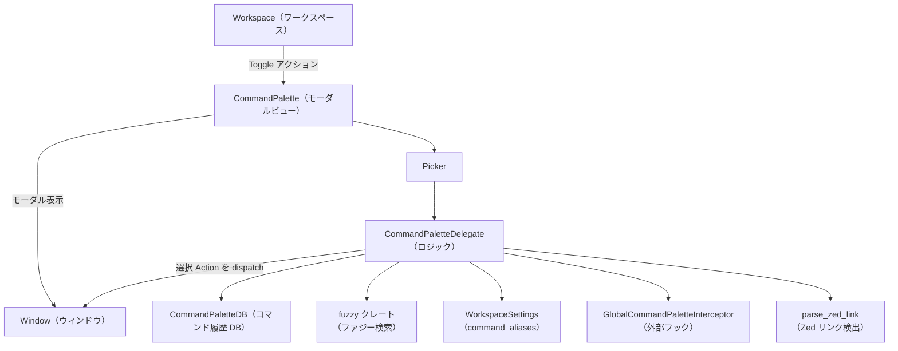
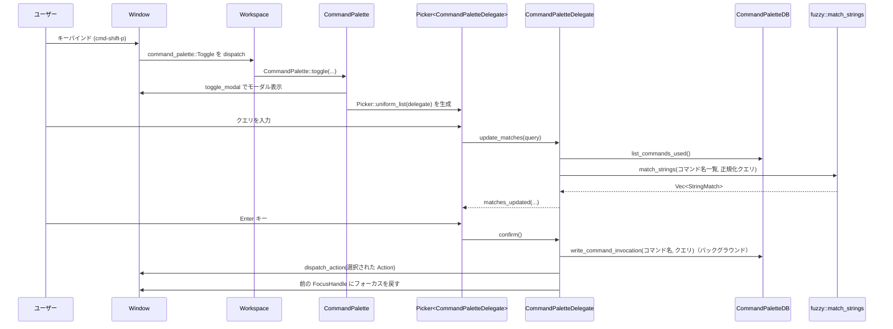

# command_palette/ コード解説

## 1. ざっくり一言

Zed エディタの「コマンドパレット」を実装するクレートです。  
利用可能なアクションの一覧を集めてファジー検索し、履歴や使用頻度に基づいて並び替え、選択されたアクションを実行します。

---

## 2. このモジュールの役割

### 2.1 概要

- このクレートは **Zed 内のコマンド（Action）を検索・実行するための UI（コマンドパレット）** を提供します。
- 主な機能は次のとおりです。
  - 現在の `Window` / `Workspace` で利用可能なアクション一覧の収集
  - クエリ文字列に対する **ファジーマッチング** による候補絞り込み
  - コマンド実行履歴の DB 保存と、それに基づく **使用頻度順ソート**
  - クエリ履歴（過去の検索文字列）の保存・上下キーによる履歴ナビゲーション
  - Zed リンク（zed://…）や外部フックによる **インターセプト**（動的コマンドの追加）

### 2.2 アーキテクチャ内での位置づけ

このクレートは UI 層（`CommandPalette` / `Picker`）と、アクション・履歴・設定・フックなどの他コンポーネントとの仲立ちをします。



- `Workspace` は `Toggle` アクションを通じてコマンドパレットを開閉します。
- `CommandPalette` は `Picker<CommandPaletteDelegate>` を保持し、描画やフォーカスを委譲します。
- `CommandPaletteDelegate` が、ファジー検索・履歴 DB・設定・フックなどを統合して、候補と選択状態を管理します。
- `CommandPaletteDB` はコマンド実行履歴やクエリ履歴を SQLite 経由で保存・取得します。

### 2.3 設計上のポイント

- **責務分割**
  - `CommandPalette` … モーダルビューとしての UI コンテナ（`Picker` のラッパ）
  - `CommandPaletteDelegate` … 検索・ソート・履歴・実行などのビジネスロジック
  - `CommandPaletteDB` … DB アクセス（コマンド履歴・クエリ履歴の永続化）
- **状態の扱い**
  - UI 状態（候補一覧・選択インデックス・最新クエリ）は `CommandPaletteDelegate` のフィールドで管理されます。
  - クエリ履歴は `QueryHistory` が担当し、必要になるまで DB から遅延ロードします。
- **非同期処理**
  - ファジーマッチングとコマンドインターセプトは `cx.background_spawn` でバックグラウンド実行されます。
  - マッチ結果の更新は `postage::dispatch::channel` を使って UI スレッドへ戻されます。
- **エラーハンドリング**
  - DB からの読み取りエラーは、`hit_counts` / `history` では空結果にフォールバックし、UI を止めません。
  - コマンド実行履歴の書き込みはバックグラウンドで行われ、エラーはログ出力のみです。
- **拡張性**
  - `GlobalCommandPaletteInterceptor` により、外部モジュールがコマンドパレットの候補に **動的なエントリを挿入・上書き** できます。
  - `CommandPaletteFilter` による名前空間単位でのコマンド非表示も可能です。

---

## 3. 主要な機能一覧

- コマンドパレットの初期化・登録
  - `init` により、各 `Workspace` で `command_palette::Toggle` アクションを登録
- コマンドパレットの表示・非表示
  - `CommandPalette::toggle` によるモーダル表示／前フォーカスへの復帰
- アクション名の人間向け変換
  - `humanize_action_name` による `"editor::GoToDefinition"` → `"editor: go to definition"`
- クエリ文字列の正規化
  - `normalize_action_query` による空白・二重コロン・アンダースコアの整形
- ファジーマッチングによるコマンド検索
  - `CommandPaletteDelegate::update_matches` 内で `fuzzy::match_strings` を実行
- コマンド履歴に基づく並び替え
  - `CommandPaletteDelegate::hit_counts` と `CommandPaletteDB::list_commands_used` による使用頻度ソート
- クエリ履歴の保存・ナビゲーション
  - `QueryHistory` と `CommandPaletteDB::list_recent_queries` による履歴取得
  - 上下キーによる履歴スクロール（プレフィックス検索に対応）
- コマンド実行と DB への記録
  - `CommandPaletteDelegate::confirm` → `CommandPaletteDB::write_command_invocation`
- Zed リンク／外部フックによるコマンド挿入
  - `parse_zed_link`＋`OpenZedUrl` アクション
  - `GlobalCommandPaletteInterceptor::intercept`

---

## 4. 関数・構造体の解説

### 4.1 型一覧

| 名前 | 定義場所 | 種別 | 役割 / 用途 |
|------|----------|------|-------------|
| `CommandPalette` | `src/command_palette.rs` | 構造体 | コマンドパレットモーダルの本体。内部に `Entity<Picker<CommandPaletteDelegate>>` を保持し、描画・フォーカスを委譲します。 |
| `CommandPaletteDelegate` | `src/command_palette.rs` | 構造体 | `PickerDelegate` 実装。候補コマンド一覧、ファジーマッチ結果、選択インデックス、履歴・非同期タスクなどのロジックを保持します。 |
| `Command` | `src/command_palette.rs` | 構造体 | 1 つのコマンド候補を表すラッパ。人間向けの `name` と `Box<dyn Action>` を持ちます。 |
| `QueryHistory` | `src/command_palette.rs` | 構造体 | クエリ履歴の管理。DB からの遅延ロード、プレフィックス検索、カーソル位置の管理を行います。 |
| `CommandPaletteDB` | `src/persistence.rs` | 構造体 | コマンド履歴 DB へのスレッドセーフな接続ラッパ。`Domain` インターフェースを実装し、マイグレーションと各種クエリ関数を提供します。 |
| `SerializedCommandUsage` | `src/persistence.rs` | 構造体 | `list_commands_used` / `get_command_usage` の結果を格納する DTO（データ転送用構造体）。使用回数と最終実行時刻を含みます。 |
| `SerializedCommandInvocation` | `src/persistence.rs`（テストのみ） | 構造体 | 個々のコマンド実行レコードを表します。主にテストで DB の状態検証に使用されます。 |

---

### 4.2 代表的な関数・メソッド（詳細）

#### `normalize_action_query(input: &str) -> String`

**概要**

- ユーザーが入力したクエリ文字列から、検索に不要／有害なノイズを取り除きます。
- 主に以下を行います。
  - 前後の空白削除
  - 連続空白の 1 つへの圧縮
  - `::` のような連続コロンの正規化
  - アンダースコア `_` を空白に変換（アクション名との整合性確保）

**引数**

| 引数名 | 型 | 説明 |
|--------|----|------|
| `input` | `&str` | ユーザーが入力した生のクエリ文字列 |

**戻り値**

- `String`  
  整形後のクエリ文字列。

**内部処理の流れ**

1. `input.trim()` で前後の空白を除去し、`chars()` で 1 文字ずつ走査します。
2. 各文字について、`'_'` は `' '`（スペース）に置き換えます。
3. `last_char` と現在文字を比較して、以下をスキップします。
   - 連続する `::` の 2 個目以降の `:`
   - すでに直前が空白で、現在文字も空白であるケース
4. 上記以外は `result` に追加し、`last_char` を更新します。
5. 生成した `result` を返します。

**Examples（使用例）**

```rust
use command_palette::normalize_action_query;

fn main() {
    // 二重コロンと余分な空白を正規化する例
    let q1 = normalize_action_query("editor::GoToDefinition");
    assert_eq!(q1, "editor:GoToDefinition");

    // 連続空白を 1 つにまとめる例
    let q2 = normalize_action_query("editor:    backspace");
    assert_eq!(q2, "editor: backspace");

    // アンダースコアを空白に変換する例
    let q3 = normalize_action_query("terminal_panel::Toggle");
    assert_eq!(q3, "terminal panel:Toggle");
}
```

**Errors / Panics**

- エラーや panic を発生させるコードは含まれていません。

**Edge cases（エッジケース）**

- 空文字列や空白のみの入力: `trim()` により空文字列になり、そのまま返ります。
- すべてアンダースコアのみなど: すべてスペースに置換され、連続スペースは 1 文字ずつ保持されます（ただし前後のスペースは `trim` で削除）。

**使用上の注意点**

- この関数は検索用クエリの前処理として設計されています。
- コマンド名そのものを整形したい場合は、`humanize_action_name` の方が適切です。

---

#### `humanize_action_name(name: &str) -> String`

**概要**

- 内部的なアクション名（例: `"editor::GoToDefinition"`）を、人間が読みやすい形式（例: `"editor: go to definition"`）に変換します。
- コマンドパレットに表示するラベル文字列の生成に使われます。

**引数**

| 引数名 | 型 | 説明 |
|--------|----|------|
| `name` | `&str` | 内部的なアクション名（`module::CamelCase` 形式など） |

**戻り値**

- `String`  
  人間向けに整形されたアクション名。

**内部処理の流れ**

1. `name` の長さと大文字の個数から、おおよそのバッファ容量を見積もって `String` を確保します。
2. 各文字を順に処理し、次のルールで `result` に追加します。
   - `':'` の場合
     - 直前も `':'` なら `' '` を追加（`"::"` → `": "`）
     - それ以外なら `':'` をそのまま追加
   - `'_'` の場合
     - `' '`（スペース）を追加
   - 大文字の場合
     - 直前がスペースでなければスペースを追加
     - その文字の小文字版を追加
   - 上記以外
     - そのまま追加
3. 生成した `result` を返します。

**Examples（使用例）**

```rust
use command_palette::humanize_action_name;

fn main() {
    assert_eq!(
        humanize_action_name("editor::GoToDefinition"),
        "editor: go to definition"
    );
    assert_eq!(
        humanize_action_name("go_to_line::Deploy"),
        "go to line: deploy"
    );
    assert_eq!(
        humanize_action_name("editor::Backspace"),
        "editor: backspace"
    );
}
```

**Errors / Panics**

- エラーや panic を発生させる処理はありません。

**Edge cases**

- すでに小文字とスペースのみからなる文字列は、ほぼそのまま返されます。
- 連続アンダースコアなどは、その分だけスペースが増えます。

**使用上の注意点**

- 変換結果は小文字ベースになります。元の大文字／小文字情報を保持したい用途には向きません。
- 表示用ラベルにのみ用い、内部識別子としては元の `name` を使うのが前提です。

---

#### `CommandPalette::toggle(workspace: &mut Workspace, query: &str, window: &mut Window, cx: &mut Context<Workspace>)`

**概要**

- 現在の `Window` のフォーカス状態を保持しつつ、コマンドパレットモーダルを開閉します。
- `query` を渡すことで、パレットを開くときに初期クエリを設定できます。

**引数**

| 引数名 | 型 | 説明 |
|--------|----|------|
| `workspace` | `&mut Workspace` | パレットを開く対象のワークスペース |
| `query` | `&str` | 初期クエリ文字列（空文字でプレーン起動） |
| `window` | `&mut Window` | 対象ウィンドウ |
| `cx` | `&mut Context<Workspace>` | `Workspace` 用コンテキスト |

**戻り値**

- なし（`()`）。  
  モーダルの開閉や内部状態は `Workspace` / `Window` / `CommandPalette` 側で管理されます。

**内部処理の流れ**

1. `window.focused(cx)` で現在のフォーカスハンドルを取得（なければ何もせず return）。
2. `cx.weak_entity()` で現在の `Workspace` を弱参照としてキャプチャ。
3. `workspace.toggle_modal(window, cx, ...)` を呼び出し、モーダル表示のトグルを依頼します。
   - モーダル作成時のクロージャ内で `CommandPalette::new` を呼び出し、
     - 利用可能なアクション一覧の収集
     - `CommandPaletteDelegate` と `Picker` の初期化
     - 初期クエリ `query` のセット
     を行います。

**Examples（使用例）**

`Workspace` にアクションとして登録する例（実際のコードから簡略化したもの）:

```rust
use command_palette::{CommandPalette};
use zed_actions::command_palette::Toggle;
use workspace::Workspace;
use gpui::{Window, Context};

fn register_command_palette(workspace: &mut Workspace, cx: &mut Context<Workspace>) {
    workspace.register_action(|workspace, _: &Toggle, window: &mut Window, cx| {
        // 空クエリでコマンドパレットを開く
        CommandPalette::toggle(workspace, "", window, cx);
    });
}
```

**Errors / Panics**

- 内部で panic を起こすようなコードはありません。
- `window.focused(cx)` が `None` の場合は何もせず終了します（フォーカスがない状態ではパレットを開きません）。

**Edge cases**

- すでにモーダルが開いている状態で `toggle` が呼ばれた場合の挙動は、
  `workspace.toggle_modal` の実装に依存します（このコードからは詳細不明）。

**使用上の注意点**

- `Workspace` / `Window` / `Context` が有効な UI スレッド上で呼び出される前提です。
- ユーザー操作（キーバインド）から呼び出すのが想定用途です。  
  直接プログラム側から呼び出す場合も、同じ前提条件を満たす必要があります。

---

#### `CommandPalette::new(previous_focus_handle: FocusHandle, query: &str, entity: WeakEntity<Workspace>, window: &mut Window, cx: &mut Context<Self>) -> Self`

**概要**

- 新しい `CommandPalette` インスタンスを生成し、内部の `Picker<CommandPaletteDelegate>` を初期化します。
- アクション一覧の収集・フィルタリング・人間向けラベル化までを行います。

**引数**

| 引数名 | 型 | 説明 |
|--------|----|------|
| `previous_focus_handle` | `FocusHandle` | パレットを開く前にフォーカスされていた UI 要素 |
| `query` | `&str` | 初期クエリ文字列 |
| `entity` | `WeakEntity<Workspace>` | 対応する `Workspace` への弱参照 |
| `window` | `&mut Window` | 対象ウィンドウ |
| `cx` | `&mut Context<Self>` | `CommandPalette` 用コンテキスト |

**戻り値**

- `CommandPalette`  
  初期化済みの `CommandPalette`。内部には `Picker` エンティティが格納されています。

**内部処理の流れ**

1. `CommandPaletteFilter::try_global(cx)` で、グローバルなフィルタ（隠す名前空間など）を取得。
2. `window.available_actions(cx)` で現在利用可能な全アクションを取得。
3. 各アクションについて:
   - フィルタが存在し、`filter.is_hidden(&*action)` が `true` のものは除外。
   - それ以外は `Command { name: humanize_action_name(action.name()), action }` として `commands` ベクタに追加。
4. `CommandPaletteDelegate::new` によりデリゲートを生成。
5. `cx.new(|cx| Picker::uniform_list(delegate, window, cx))` で `Picker` エンティティを生成。
6. `picker.set_query(query, window, cx)` で初期クエリをセット。
7. これらを含む `CommandPalette` を構築して返します。

**Examples**

- 通常は `CommandPalette::toggle` 経由で呼ばれるため、直接呼び出すことは想定されていません。  
  詳細な使用例は `toggle` の例を参照してください。

**Errors / Panics**

- 内部では `unwrap` などは使用されておらず、panic の可能性は低いです。
- ただし、`window.available_actions(cx)` の戻り値や `Picker::uniform_list` の内部挙動はこのコードからは不明です。

**使用上の注意点**

- コンストラクタ的な位置づけですが、`Context<Self>` を要求するため、通常の Rust 構造体生成とは異なり、`gpui` コンテキスト下でのみ利用できます。

---

#### `CommandPaletteDelegate::update_matches(&mut self, mut query: String, window: &mut Window, cx: &mut Context<Picker<Self>>) -> gpui::Task<()>`

**概要**

- ユーザーが入力したクエリに対して、非同期にファジーマッチングを行い、候補一覧とマッチ情報を更新するタスクを起動します。
- コマンド頻度（ヒット回数）によるソート、エイリアス展開、Zed リンク検出、グローバルインターセプトなどもここで行われます。

**引数**

| 引数名 | 型 | 説明 |
|--------|----|------|
| `query` | `String` | 入力フィールドから渡されるクエリ文字列（所有権を受け取る） |
| `window` | `&mut Window` | 呼び出し元ウィンドウ |
| `cx` | `&mut Context<Picker<Self>>` | `Picker` 用コンテキスト |

**戻り値**

- `gpui::Task<()>`  
  バックグラウンドで実行されるタスクハンドル。`Picker` 側で待ち合わせやキャンセルに利用されます。

**内部処理の流れ（簡略）**

1. **エイリアス展開**
   - `WorkspaceSettings::get_global(cx)` から設定を取得し、
   - `settings.command_aliases.get(&query)` があれば、その値で `query` を置き換えます。
2. **Zed リンク判定**
   - 元のクエリ文字列を `query_str` に保持。
   - `parse_zed_link(query_str, cx)` で Zed リンクかどうかを判定。
3. **インターセプト準備**
   - `GlobalCommandPaletteInterceptor::intercept(&query, workspace, cx)` を呼び出し、  
     外部からの候補挿入タスク（`intercept_task`）を取得。
4. **DB から使用頻度を取得**
   - `self.hit_counts(cx)` で `HashMap<String, u16>`（コマンド名 → 実行回数）を取得。
   - `self.all_commands.clone()` を `hit_counts` と名前順でソート。
5. **ファジーマッチング実行**
   - `StringMatchCandidate::new(ix, &command.name)` の配列を構築。
   - `fuzzy::match_strings` をバックグラウンド実行し、`Vec<StringMatch>` を取得。
6. **インターセプト結果の生成**
   - Zed リンクであれば、`OpenZedUrl` アクションを 1 件だけ含む `CommandInterceptResult` を生成。
   - そうでなければ、`intercept_task` を await して結果を得るか、デフォルト値（空）を用います。
7. **結果の送信**
   - `(commands, matches, intercept_result)` を `postage::dispatch::channel` 経由で UI スレッドへ送信。
   - 受信側では `matches_updated` が呼ばれ、`self.commands` / `self.matches` / `self.latest_query` が更新されます。
8. `self.updating_matches` に `(task, rx)` を記録し、呼び出し元に `task` を返します。

**Examples（使用例）**

- 通常は `Picker` 内部から呼び出されるため、利用側が直接呼ぶことはありません。  
  ユーザーが入力するたびに自動的に呼ばれる箇所と考えると理解しやすいです。

**Errors / Panics**

- DB アクセスが失敗した場合、`hit_counts` は空の `HashMap` を返し、頻度ソートが無効になるだけです。
- インターセプトタスクや Zed リンク判定でのエラーはコード上では特別扱いされておらず、それぞれの実装に依存します。

**Edge cases**

- クエリが空文字の場合でも、`fuzzy::match_strings` は実行されます（候補の並び順は使用頻度＋名前順）。
- 前回の `update_matches` の結果がまだ届いていない状態で新しいクエリが来た場合、
  `self.updating_matches` が更新されるため、古い結果を上書きしないように制御されます（`finalize_update_matches` と連携）。

**使用上の注意点**

- UI 応答性を維持するため、マッチ計算は必ずバックグラウンドで行われます。  
  このメソッドを同期的に待つ設計にはしない方針です。

---

#### `CommandPaletteDelegate::confirm(&mut self, secondary: bool, window: &mut Window, cx: &mut Context<Picker<Self>>)`

**概要**

- 現在選択中のコマンドを確定（実行）するメソッドです。
- `secondary` フラグにより、「コマンド実行」か「キーバインド変更画面の表示」かを切り替えます。

**引数**

| 引数名 | 型 | 説明 |
|--------|----|------|
| `secondary` | `bool` | `true` で「キーバインド変更」、`false` で通常のコマンド実行 |
| `window` | `&mut Window` | 対象ウィンドウ |
| `cx` | `&mut Context<Picker<Self>>` | `Picker` 用コンテキスト |

**戻り値**

- なし（`()`）。

**内部処理の流れ（secondary = false の場合）**

1. `self.matches` が空なら、単に `dismissed` を呼んでパレットを閉じて終了。
2. `self.latest_query` が空でなければ、`query_history.add` で履歴に追加し、カーソルをリセット。
3. 現在の `selected_ix` から `action_ix` を取得し、`self.commands.swap_remove(action_ix)` で対象コマンドを取り出す。
4. `telemetry::event!` で `"Action Invoked"` イベントを送信。
5. `self.matches` と `self.commands` をクリア。
6. `CommandPaletteDB::global(cx)` を取得し、バックグラウンドで
   `write_command_invocation(command_name, latest_query)` を実行。
7. `window.focus(&self.previous_focus_handle, cx)` で元のフォーカスに戻す。
8. `self.dismissed(window, cx)` でモーダルを閉じる。
9. `window.dispatch_action(action, cx)` でアクションを実行。

**secondary = true の場合**

1. `self.selected_command()` で現在のコマンドを取得（なければ何もしない）。
2. `zed_actions::ChangeKeybinding { action: action_name.to_string() }` を生成。
3. `window.dispatch_action(open_keymap, cx)` でキーバインド変更 UI（と思われる）を開く。
4. `self.dismissed` を呼び、パレットを閉じる。

**Examples（使用例）**

- 実際には `Enter` キーや「Run」ボタンのクリックに対して、`Picker` 側から自動的に呼ばれます。  
  テストでは次のように動作確認が行われています。

```rust
// 「bcksp」を入力して Backspace コマンドをマッチさせるテスト（抜粋）
cx.simulate_input("bcksp");
palette.read_with(cx, |palette, _| {
    assert_eq!(palette.delegate.matches[0].string, "editor: backspace");
});

// Enter を押すと confirm() 経由でコマンドが実行される
cx.simulate_keystrokes("enter");
workspace.update(cx, |workspace, cx| {
    assert!(workspace.active_modal::<CommandPalette>(cx).is_none());
    assert_eq!(editor.read(cx).text(cx), "ab");
});
```

**Errors / Panics**

- DB 書き込みは `detach_and_log_err(cx)` で起動されるため、エラーが発生しても UI には影響を与えずログにのみ記録されます。
- `selected_ix` が範囲外にならないよう、`matches_updated` 側で調整されているため、このメソッド内でのインデックスアクセスは安全です。

**Edge cases**

- コマンドが 1 つもロードされていない（ヘッドレステストなど）場合には、`selected_command()` が `None` を返し、何も起きません。
- `latest_query` が空文字列の場合、クエリ履歴や DB の `user_query` には空文字が保存されます。

**使用上の注意点**

- 二次操作（secondary = true）をトリガーするキーは `menu::SecondaryConfirm` にバインドされており、`render_footer` でボタンに割り当てられています。

---

#### `CommandPaletteDB::write_command_invocation(&self, command_name: impl Into<String>, user_query: impl Into<String>) -> Result<()>`

**概要**

- コマンド実行履歴テーブル `command_invocations` に 1 件のレコードを挿入し、履歴の総数が多くなりすぎないように古いレコードを削除します。
- コマンド名ごとの使用回数・最終実行時刻は、別の集約クエリで利用されます。

**引数**

| 引数名 | 型 | 説明 |
|--------|----|------|
| `command_name` | `impl Into<String>` | 実行されたコマンドの表示名（例: `"editor: backspace"`） |
| `user_query` | `impl Into<String>` | そのコマンドを実行するきっかけとなったクエリ文字列 |

**戻り値**

- `anyhow::Result<()>`  
  成功時は `Ok(())`、DB エラー時は `Err` で詳細を返します。

**内部処理の流れ**

1. `command_name.into()` / `user_query.into()` で所有権付き `String` に変換。
2. `log::debug!` で「どのコマンドを、どのクエリから実行したか」をデバッグログ出力。
3. 非公開メソッド `write_command_invocation_internal(command_name, user_query)` を await。
4. `write_command_invocation_internal` 側では次のクエリを実行します。
   - `INSERT INTO command_invocations (command_name, user_query) VALUES (?, ?);`
   - `DELETE FROM command_invocations WHERE id IN (SELECT MIN(id) FROM command_invocations HAVING COUNT(1) > 1000);`  
     （テーブルが一定以上膨らんだ場合に古いレコードを削除する意図と解釈できます）

**Examples（使用例）**

```rust
use command_palette::persistence::CommandPaletteDB;

async fn record_example() -> anyhow::Result<()> {
    // テスト用 DB。実際のアプリでは CommandPaletteDB::global(cx) を利用します。
    let db = CommandPaletteDB::open_test_db("example_db").await;

    db.write_command_invocation("editor: backspace", "bcksp").await?;
    Ok(())
}
```

**Errors / Panics**

- SQL 実行時にエラーが出た場合は `Err(anyhow::Error)` を返します。
- このメソッド自体は panic を起こしません。

**Edge cases**

- 1001 件以上のレコードが存在するとき、`test_handles_max_invocation_entries` では  
  `get_command_usage("some-command")` の `invocations` が 1000 になることが確認されています。

**使用上の注意点**

- 実運用では `CommandPaletteDB::global(cx)` を通して共有 DB 接続を利用する前提です。
- `CommandPaletteDelegate::confirm` では、このメソッドをバックグラウンドで呼び出し、UI スレッドをブロックしないようにしています。

---

### 4.3 その他の主な関数（一覧）

| 関数名 / メソッド名 | 定義場所 | 役割（1 行） |
|---------------------|----------|--------------|
| `CommandPalette::init` | `command_palette.rs` | `command_palette_hooks::init` を呼び、各 `Workspace` に `Toggle` アクションを登録します。 |
| `CommandPalette::set_query` | `command_palette.rs` | 既存のパレットに対してクエリ文字列を上書きし、`Picker` に伝搬します。 |
| `CommandPaletteDelegate::matches_updated` | `command_palette.rs` | バックグラウンドタスクから受け取ったマッチ結果とインターセプト結果を統合し、`commands` / `matches` / `selected_ix` を更新します。 |
| `CommandPaletteDelegate::hit_counts` | `command_palette.rs` | `CommandPaletteDB::list_commands_used` を呼び出し、コマンド名 → 使用回数のマップを作成します。 |
| `CommandPaletteDelegate::selected_command` | `command_palette.rs` | 現在の `selected_ix` に対応する `Command` を返します（テスト環境で空の場合もあるため `Option`）。 |
| `QueryHistory::history` | `command_palette.rs` | 初回呼び出し時に DB から `list_recent_queries` を読み込み、`VecDeque<String>` として保持します。 |
| `QueryHistory::previous` / `next` | `command_palette.rs` | 現在のクエリをプレフィックスとして、履歴の前後方向にマッチするクエリを探します。 |
| `CommandPaletteDB::get_command_usage` | `persistence.rs` | 指定コマンドの使用回数と最終実行日時を 1 件だけ取得します。 |
| `CommandPaletteDB::list_commands_used` | `persistence.rs` | すべてのコマンドの使用状況（回数と最終実行日時）を使用回数順で取得します。 |
| `CommandPaletteDB::list_recent_queries` | `persistence.rs` | 空でない `user_query` をユニークに抽出し、最終実行時刻順（昇順）で返します。 |

---

## 5. データフロー

ここでは、「ユーザーがコマンドパレットを開き、クエリを入力してコマンドを実行する」代表的なフローを説明します。

1. ユーザーが `cmd-shift-p` などのキーバインドを押すと、`command_palette::Toggle` アクションが発火します。
2. `Workspace` がこのアクションを受け取り、`CommandPalette::toggle` を呼びます。
3. `CommandPalette::new` が利用可能なアクション一覧を取得し、人間向けラベルに変換した `Command` ベクタを構築します。
4. `Picker<CommandPaletteDelegate>` が生成され、空のクエリまたは指定の初期クエリがセットされます。
5. ユーザーがクエリを入力するたびに、`CommandPaletteDelegate::update_matches` が呼ばれ、バックグラウンドでファジーマッチングが走ります。
6. マッチ結果とインターセプト結果が UI スレッドに戻され、`matches_updated` によって `matches` が更新されます。
7. ユーザーが Enter を押すと `confirm` が呼ばれ、選択されたコマンドのアクションが実行されると同時に、DB へ履歴が書き込まれます。

### シーケンス図



---

## 6. 使い方（How to Use）

### 6.1 基本的な使用方法

#### 1. アプリの初期化時に `command_palette::init` を呼び出す

`App` 初期化コードの中で、他のモジュールと同様にコマンドパレットを登録します。

```rust
use command_palette::init as init_command_palette;
use gpui::App;

fn init_app(cx: &mut App) {
    // 他モジュールの初期化
    // editor::init(cx);
    // workspace::init(app_state.clone(), cx);
    // ...

    // コマンドパレットの初期化
    init_command_palette(cx);
}
```

`init` の中では次のことが行われます。

- `command_palette_hooks::init(cx)` の呼び出し
- 新しい `Workspace` が作成されるたびに `CommandPalette::register` を呼び、  
  `Toggle` アクション（`command_palette::Toggle`）を `Workspace` に登録

#### 2. キーバインドで `Toggle` アクションを割り当てる

テストコードでは次のように JSON 形式のキーマップが読み込まれています。

```rust
use settings::KeymapFile;

cx.bind_keys(KeymapFile::load_panic_on_failure(
    r#"[
        {
            "bindings": {
                "cmd-shift-p": "command_palette::Toggle"
            }
        }
    ]"#,
    cx,
));
```

これにより、`cmd-shift-p` でコマンドパレットが開くようになります。

#### 3. プログラムから直接トグルする（必要な場合）

`Workspace` と `Window` が手元にある場合、次のように `toggle` を直接呼んで  
コマンドパレットを開くこともできます。

```rust
use command_palette::CommandPalette;
use workspace::Workspace;
use gpui::{Window, Context};

fn open_palette_with_query(
    workspace: &mut Workspace,
    window: &mut Window,
    cx: &mut Context<Workspace>,
) {
    // 「go to line」であらかじめフィルタされた状態で開く
    CommandPalette::toggle(workspace, "go to line", window, cx);
}
```

---

### 6.2 よくある使用パターン

#### パターン 1: クエリ履歴の利用（上下キー）

`QueryHistory` により、過去のクエリ履歴を上下キーで辿れるようになっています。

- 新しいパレットを開いた直後：
  - 上キー `up` … 最新の履歴クエリを表示
  - さらに `up` … その前の履歴クエリを表示
  - 下キー `down` … 直前に表示していた履歴に戻る
  - 最後まで戻ったあと `down` … 空文字（履歴モードからの離脱）

- 何か文字を入力してから `up`：
  - 現在の入力をプレフィックスとして、履歴の中から `starts_with` するエントリだけを対象に前方検索します。
  - `down` で逆方向にたどり、最後に元のプレフィックスに復帰します。

この挙動はテスト `test_history_navigation_basic` / `test_history_prefix_search` などで確認されています。

#### パターン 2: 名前空間フィルタによるコマンドの非表示

`CommandPaletteFilter` のグローバル設定を使うと、特定名前空間のコマンドをパレットから隠すことができます。

テストでは、`editor` 名前空間のコマンドを隠す例があります。

```rust
use command_palette_hooks::CommandPaletteFilter;

// グローバルフィルタの更新
CommandPaletteFilter::update_global(cx, |filter, _| {
    filter.hide_namespace("editor");
});
```

この設定後にパレットを開き `"bcksp"` と入力しても、`editor: backspace` は候補に現れません。

#### パターン 3: Zed リンクの直接実行

`parse_zed_link` によってクエリが Zed リンクと判定された場合、  
`OpenZedUrl { url: query }` アクションが候補として追加されます。

- クエリに `zed://` などのリンクを貼り付けると、  
  特定のファイルや位置を開くコマンドとして扱われるような拡張が可能です（詳細は `OpenZedUrl` の実装に依存）。

---

### 6.3 使用上の注意点（まとめ）

- **UI コンテキスト前提**
  - `CommandPalette::toggle` や `CommandPalette` のコンストラクタは、`gpui` の `Context` 内でのみ利用できる設計です。
  - バックグラウンドスレッドから直接操作することはできません。

- **DB への依存**
  - コマンド使用頻度やクエリ履歴は `CommandPaletteDB` を介して SQLite に保存されます。
  - DB エラー時は機能が一部無効（頻度ソート・履歴読み込みなど）になりますが、パレット自体は動作し続けます。

- **履歴の上限**
  - 実装上、`command_invocations` テーブルのレコード数が増えすぎないよう、古いレコードを削除する仕組みがあります。
  - そのため、非常に古いクエリやコマンド履歴は DB から消える可能性があります。

- **アクション名の整形と検索クエリの関係**
  - 表示名には `humanize_action_name` が使われ、クエリには `normalize_action_query` が使われます。
  - どちらもアンダースコアを空白に変換するなどの共通性がありますが、
    大文字・小文字やコロン・スペースの扱いは完全には一致しません。  
    それでも `fuzzy::match_strings` により実用上は問題のないマッチングになるよう設計されています。

- **インターセプトによる候補の上書き**
  - `GlobalCommandPaletteInterceptor` が `exclusive = true` を返した場合、  
    通常のコマンド候補を無視してインターセプト結果だけを表示することができます（コードからそのような利用が可能なことが読み取れます）。
  - カスタムインターセプトを実装する際は、既存コマンドとの重複や優先順位を意識する必要があります。

---

## 7. 関連ファイル

| パス | 役割 / 関係 |
|------|------------|
| `command_palette/Cargo.toml` | このクレートの設定ファイル。`db`・`fuzzy`・`workspace`・`picker` など、コマンドパレットが依存するクレートが列挙されています。 |
| `command_palette/src/command_palette.rs` | コマンドパレット UI 本体。`CommandPalette`・`CommandPaletteDelegate`・`QueryHistory` など、主要な型とロジックが定義されています。 |
| `command_palette/src/persistence.rs` | コマンド履歴とクエリ履歴を永続化する `CommandPaletteDB` と SQL クエリ群を定義します。 |
| （別クレート）`workspace` | `Workspace` 型や `WorkspaceSettings`、モーダル表示・キーバインドの初期化などを提供し、このクレートから頻繁に利用されます。 |
| （別クレート）`picker` | `Picker` コンポーネントと `PickerDelegate` トレイトを提供し、コマンドパレットの候補リスト UI の基盤となります。 |
| （別クレート）`db` | `ThreadSafeConnection` や `query!` マクロなど、`CommandPaletteDB` が利用する DB インフラストラクチャを提供します。 |
| （別クレート）`fuzzy` | 文字列のファジーマッチングロジックを提供し、クエリとコマンド名のマッチ度計算に使用されます。 |
| （別クレート）`command_palette_hooks` | `CommandPaletteFilter` や `GlobalCommandPaletteInterceptor` を提供し、コマンドのフィルタリングやインターセプトを可能にします。 |

このディレクトリのコードを理解・変更する際は、特に `workspace`・`picker`・`db`・`fuzzy`・`command_palette_hooks` の各クレートとの連携が重要になります。
