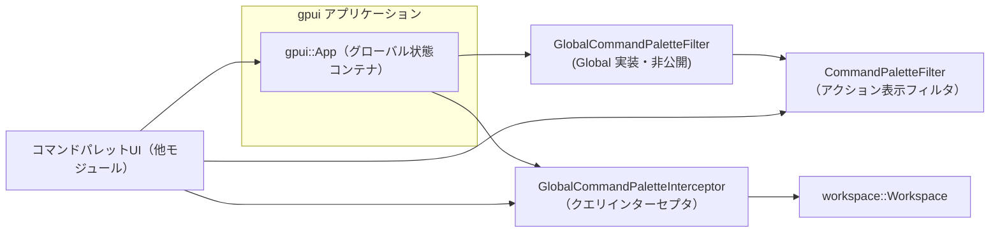
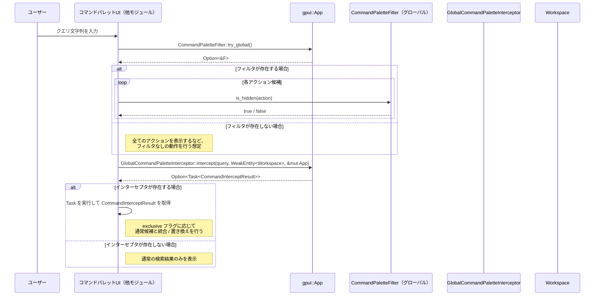

# command_palette_hooks ディレクトリ

## 1. ざっくり一言

`command_palette_hooks` クレートは、gpui ベースのアプリケーションにおける「コマンドパレット」の挙動をカスタマイズするためのフックを提供します。  
具体的には、

- どのアクションを候補に表示するかを制御するフィルタ
- クエリに対して独自の候補リストを返すインターセプタ

をグローバルに登録して使えるようにするモジュールです。

---

## 2. このモジュールの役割

### 2.1 概要

このディレクトリ（クレート）は次の問題を解決します。

> 「アプリ全体に共通するコマンドパレットの挙動（表示するコマンドの制御や検索結果の差し替え）を、外部から簡潔にカスタマイズできるようにする」

そのために、主に次の機能を提供します。

- `CommandPaletteFilter` によるアクションの表示／非表示制御
  - 名前空間（`"file::open"` の `"file"` など）単位での一括非表示
  - 型（`TypeId`）単位での個別非表示・表示
- `GlobalCommandPaletteInterceptor` によるクエリのインターセプト
  - ユーザーが入力したクエリに対し、独自の候補（`CommandInterceptItem`）を返す
  - 通常のコマンドパレットの結果を併用するかどうかを `exclusive` で指定

いずれも gpui の `App` の「グローバル状態」として登録され、アプリケーションのどこからでも利用できる構造になっています。

### 2.2 アーキテクチャ内での位置づけ

このクレートは小さな単一モジュールで構成され、以下のような依存関係・役割を持ちます。

- 依存している主な外部クレート
  - `gpui` クレート
    - `App`（アプリケーションコンテキスト）
    - `Action`（実行可能なコマンド）
    - `Global`（グローバル状態管理）
    - `Task`（非同期タスク）
    - `WeakEntity<Workspace>`（`Workspace` への弱参照）
  - `workspace` クレート
    - `Workspace` 型
  - `collections` クレート
    - `HashSet` の実装
  - `derive_more`
    - `Deref`, `DerefMut` の derive 用

概念的な関係を Mermaid 図で示します（UI 側などはこのディレクトリ外にあります）。



- `init` 関数が `GlobalCommandPaletteFilter` を `App` のグローバルとして登録します。
- フィルタとインターセプタ自体はこのクレートで定義され、実際の利用（UI での表示・タスクの実行）は別のモジュール側で行う前提の設計です。

### 2.3 設計上のポイント

コードから読み取れる設計上の特徴を整理します。

- **グローバル状態としての管理**
  - `CommandPaletteFilter` と `GlobalCommandPaletteInterceptor` は、ともに `Global` を実装したラッパー型を通じて `App` のグローバル状態に格納されます。
  - これにより、アプリケーション全体から一貫したフィルタ／インターセプタ設定を共有できます。

- **名前空間と型の二段階フィルタ**
  - アクション名の `"namespace::rest"` 形式を前提とし、先頭の部分を「名前空間」として扱います。
  - 表示制御は
    - 名前空間単位 (`hidden_namespaces`)
    - 型単位 (`hidden_action_types` / `shown_action_types`)
    の両方で行い、「特定の型は名前空間が隠されていても表示する」といった細かい制御が可能です。

- **非同期インターセプト**
  - インターセプタは `Task<CommandInterceptResult>` を返すクロージャで表現されます。
  - 実際の検索・結果生成処理は Task 内で行われる想定で、UI スレッドをブロックしない設計であると解釈できます（Task の実装詳細はこのチャンクにはありません）。

- **ドキュメント重視**
  - `#![deny(missing_docs)]` により、公開 API にはすべてドキュメントコメントが必須になっています。
  - コマンドパレットを扱う他モジュールから見ても API の意図が分かるように配慮されています。

---

## 3. 主要な機能一覧

このクレートが提供する主な機能を列挙します。

- **グローバルフィルタの初期化**
  - `init`: `App` に `CommandPaletteFilter` をデフォルト状態で登録する。

- **グローバルフィルタへのアクセスと更新**
  - `CommandPaletteFilter::try_global`: グローバルフィルタの参照取得（存在すれば）。
  - `CommandPaletteFilter::global_mut`: グローバルフィルタへの可変参照取得。
  - `CommandPaletteFilter::update_global`: 存在する場合だけグローバルフィルタを更新するヘルパー。

- **アクション表示／非表示の判定と制御**
  - `CommandPaletteFilter::is_hidden`: 与えられた `Action` を表示対象外にするかどうかを判定。
  - `CommandPaletteFilter::hide_namespace` / `show_namespace`: 名前空間単位での一括非表示／再表示。
  - `CommandPaletteFilter::hide_action_types` / `show_action_types`: 型 (`TypeId`) 単位での非表示／表示。

- **インターセプト結果のデータ構造**
  - `CommandInterceptItem`: 単一の候補（`Action` と表示文字列、マッチ位置）を表す。
  - `CommandInterceptResult`: 複数候補と、「通常の候補を併用するか」のフラグを持つ。

- **グローバルインターセプタの設定と呼び出し**
  - `GlobalCommandPaletteInterceptor::set`: クエリを受け取って `Task<CommandInterceptResult>` を返すクロージャを登録。
  - `GlobalCommandPaletteInterceptor::clear`: インターセプタの解除。
  - `GlobalCommandPaletteInterceptor::intercept`: 登録済みインターセプタがあれば実行し、Task を返す。

---

## 4. 関数・構造体の解説

### 4.1 型一覧

このクレート内の主要な型を一覧にします。

| 名前 | 種別 | 公開範囲 | 役割 / 用途 |
|------|------|----------|-------------|
| `CommandPaletteFilter` | 構造体 | `pub` | コマンドパレットに表示する `Action` を名前空間／型でフィルタするための設定を保持します。 |
| `GlobalCommandPaletteFilter` | 構造体 | 非公開 (`pub` なし) | `CommandPaletteFilter` を `Global` として `App` に登録するためのラッパーです。`Deref`/`DerefMut` により中身へ透過的にアクセスできます。 |
| `CommandInterceptItem` | 構造体 | `pub` | インターセプタが返す単一の候補を表します。`Action` 本体と表示用文字列、マッチ位置を保持します。 |
| `CommandInterceptResult` | 構造体 | `pub` | インターセプトの結果集合を表します。複数の `CommandInterceptItem` と、通常候補を併用するかどうかのフラグを持ちます。 |
| `GlobalCommandPaletteInterceptor` | 構造体 | `pub` | クエリを受け取って `Task<CommandInterceptResult>` を返すクロージャを包むラッパーで、`Global` を実装しています。 |

### 4.2 主要な関数・メソッドの詳細

以下では特に重要な関数・メソッドを詳しく説明します。

#### `init(cx: &mut App)`

**概要**

- `App` のグローバル状態として、デフォルト値の `CommandPaletteFilter` を登録します。
- コマンドパレットを利用する前に一度呼び出しておくことを想定した初期化関数です。

**引数**

| 引数名 | 型 | 説明 |
|--------|----|------|
| `cx` | `&mut App` | gpui アプリケーションコンテキスト。グローバル状態の登録に使用されます。 |

**戻り値**

- なし（`()`）。

**内部処理の流れ**

1. `GlobalCommandPaletteFilter::default()` でラッパー型をデフォルト構築します。
   - 中身の `CommandPaletteFilter` も `Default` で初期化され、すべての集合が空になります。
2. `cx.set_global(...)` を呼び出し、`GlobalCommandPaletteFilter` を `App` のグローバルとして登録します。

**Examples（使用例）**

```rust
use command_palette_hooks::init;
use gpui::App;

// アプリケーション起動時の初期化処理の一部
fn setup(app: &mut App) {
    // コマンドパレット用フィルタをグローバル状態として登録する
    init(app);
}
```

**Errors / Panics**

- この関数自体には明示的なエラーや `panic!` はありません。
- `App::set_global` の挙動（同じ型がすでに登録されている場合など）は、このチャンクからは分かりません。

**Edge cases（エッジケース）**

- すでに `GlobalCommandPaletteFilter` が登録されている状態で呼び出した場合の挙動は、`App::set_global` 次第です（コードからは不明です）。

**使用上の注意点**

- `CommandPaletteFilter::update_global` は「グローバルが存在する場合のみ更新する」実装になっているため、事前に `init` などでグローバルフィルタを登録しておく必要があります。

---

#### `CommandPaletteFilter::try_global(cx: &App) -> Option<&CommandPaletteFilter>`

**概要**

- `App` に登録されているグローバルな `CommandPaletteFilter` への参照を、存在すれば取得します。
- 読み取り専用でフィルタの設定を参照したいときに使います。

**引数**

| 引数名 | 型 | 説明 |
|--------|----|------|
| `cx` | `&App` | グローバル状態を保持している gpui アプリケーションコンテキスト。 |

**戻り値**

- `Option<&CommandPaletteFilter>`
  - フィルタが登録されていれば `Some(&CommandPaletteFilter)`。
  - 登録されていなければ `None`。

**内部処理の流れ**

1. `cx.try_global::<GlobalCommandPaletteFilter>()` を呼び出し、ラッパー型の参照を `Option` で取得します。
2. `map(|filter| &filter.0)` により、内部の `CommandPaletteFilter` への参照に変換します。

**Examples（使用例）**

```rust
use command_palette_hooks::CommandPaletteFilter;
use gpui::App;

// どこかからフィルタの状態を読み取る例
fn log_filter_state(app: &App) {
    if let Some(filter) = CommandPaletteFilter::try_global(app) {
        // `filter` から hidden_namespaces 等の状態を参照できる
        // （フィールドは非公開なので、ここでは is_hidden などのメソッドを通じて利用する想定）
        println!("Command palette filter is available.");
    } else {
        println!("Command palette filter is not initialized.");
    }
}
```

**Errors / Panics**

- `try_global` 系の呼び出しであるため、通常は `None` を返すだけで `panic` は発生しない設計が想定されますが、`App` の実装詳細はこのチャンクからは分かりません。

**Edge cases（エッジケース）**

- `init` が呼ばれていない場合や、`GlobalCommandPaletteFilter` がクリアされている場合はいつでも `None` になります。

**使用上の注意点**

- フィルタの存在が保証されていない状況では、このメソッドを用いて存在確認を行うのが安全です。
- 書き込みを行いたい場合は `global_mut` や `update_global` を利用します。

---

#### `CommandPaletteFilter::update_global<F>(cx: &mut App, update: F)`

**概要**

- グローバルな `CommandPaletteFilter` が存在する場合のみ、与えられたクロージャ `update` を使ってその内容を更新します。
- フィルタの有無を呼び出し側で意識せず、安全に「ある場合だけ変更する」ためのヘルパーです。

**引数**

| 引数名 | 型 | 説明 |
|--------|----|------|
| `cx` | `&mut App` | グローバルフィルタを保持するアプリケーションコンテキスト。 |
| `update` | `F`（`FnOnce(&mut Self, &mut App)`） | フィルタと `App` への可変参照を受け取り、中身を更新するクロージャ。 |

**戻り値**

- なし（`()`）。

**内部処理の流れ**

1. `cx.has_global::<GlobalCommandPaletteFilter>()` で、該当グローバルが存在するか確認します。
2. 存在する場合のみ、`cx.update_global` を呼び出します。
   - `update_global` のコールバックでは `&mut GlobalCommandPaletteFilter` と `&mut App` が渡されます。
   - ここで `update(&mut this.0, cx)` を呼び出すことで、内部の `CommandPaletteFilter` に対して呼び出し元の `update` クロージャを適用します。

**Examples（使用例）**

```rust
use command_palette_hooks::CommandPaletteFilter;
use gpui::App;

// フィルタに対し、特定の名前空間を一括で非表示にする設定を行う例
fn configure_command_palette(app: &mut App) {
    CommandPaletteFilter::update_global(app, |filter, _cx| {
        // "experimental" 名前空間のアクションを全て隠す
        filter.hide_namespace("experimental");
    });
}
```

**Errors / Panics**

- コード上、グローバルが存在しない場合は何もせずに終了するため、その場合の `panic` は発生しません。
- `App::update_global` が内部でどのようなエラーや `panic` を起こしうるかは、このチャンクからは分かりません。

**Edge cases（エッジケース）**

- `GlobalCommandPaletteFilter` がまだ登録されていない場合、`update_global` は何もせずに戻ります。
  - 初期化の呼び出し順序に依存するため、`init` などで事前に登録しておく前提で使うと分かりやすくなります。

**使用上の注意点**

- グローバルが必ず存在すると分かっている場面では `global_mut` を直接使うこともできますが、存在チェックを自前で行う必要があります。
- `update` クロージャ内では、フィルタの変更だけでなく `App` に対する操作も行えるため、副作用の範囲に注意が必要です。

---

#### `CommandPaletteFilter::is_hidden(&self, action: &dyn Action) -> bool`

**概要**

- 指定された `Action` をコマンドパレット上で非表示にすべきかどうかを判定します。
- 型と名前空間の両方に基づいて判定を行い、「明示的に表示するよう指定された型」は常に表示されるようになっています。

**引数**

| 引数名 | 型 | 説明 |
|--------|----|------|
| `self` | `&CommandPaletteFilter` | 現在のフィルタ設定。 |
| `action` | `&dyn Action` | 判定対象のアクション。`name()` と `type_id()` が呼ばれます。 |

**戻り値**

- `bool`
  - `true` の場合: このフィルタによってアクションが隠されるべきである。
  - `false` の場合: 表示対象として扱ってよい。

**内部処理の流れ**

1. `action.name()` を取得し、`"::"` で分割して先頭要素を「名前空間」として扱います。
   - `"foo::bar::baz"` なら `"foo"`。
   - `"foo"` のように区切りがない場合は、`split` の仕様により `"foo"` 全体が先頭要素になります。
2. `shown_action_types` に `action.type_id()` が含まれているか確認します。
   - 含まれている場合は、名前空間や `hidden_action_types` の設定に関わらず `false`（表示）を返します。
3. そうでなければ、
   - `hidden_namespaces` に名前空間が含まれるか、
   - または `hidden_action_types` に `action.type_id()` が含まれるか
   のいずれかが `true` であれば `true`（非表示）を返します。

**Examples（使用例）**

```rust
use command_palette_hooks::CommandPaletteFilter;
use gpui::Action;

// `Action` を受け取り、フィルタに照らし合わせて表示可否を判定するヘルパー
fn should_show_action(filter: &CommandPaletteFilter, action: &dyn Action) -> bool {
    !filter.is_hidden(action)
}
```

実際にはこのようなヘルパーがコマンドパレットの候補生成処理の中で利用されることが想定されますが、そのコードはこのディレクトリには含まれていません。

**Errors / Panics**

- `split("::").next().unwrap_or("malformed action name")` としていますが、`split` は必ず少なくとも 1 要素を返すため、`unwrap_or` の `"malformed action name"` が実際に使われるケースはありません。
- その他、このメソッド自身には `panic` を起こすコードは含まれていません。

**Edge cases（エッジケース）**

- アクション名に `"::"` が含まれない場合
  - 文字列全体が名前空間と見なされます。
  - そのため、`hide_namespace("some_action")` のように、完全な名前と一致させる必要があります。
- 同じ型のアクションが複数の名前空間に属するような設計であっても、`type_id` ベースの表示／非表示設定が優先されます。
- `shown_action_types` に登録された型は、どの名前空間にも隠されません。

**使用上の注意点**

- 「名前空間でざっくり隠しつつ、一部のアクションだけは型で再度表示する」という使い方をする場合、`hide_namespace` → `show_action_types` の順に設定を行うと意図した挙動になります。
- `Action::name()` の命名規則（`"namespace::something"` 形式など）に依存するため、その規則が変わった場合はフィルタ設定の見直しが必要です。

---

#### `CommandPaletteFilter::hide_action_types<'a>(&mut self, action_types: impl IntoIterator<Item = &'a TypeId>)`

**概要**

- 指定された `TypeId` 群に対応するアクションをすべて「非表示」に設定します。
- もし同じ型が `shown_action_types` に登録されていた場合は、それを取り消します。

**引数**

| 引数名 | 型 | 説明 |
|--------|----|------|
| `self` | `&mut CommandPaletteFilter` | フィルタ設定を変更するための可変参照。 |
| `action_types` | `impl IntoIterator<Item = &'a TypeId>` | 非表示にしたいアクション型の `TypeId` 参照の列挙。 |

**戻り値**

- なし（`()`）。

**内部処理の流れ**

1. `action_types` の各 `TypeId` についてループします。
2. `hidden_action_types.insert(*action_type)` で非表示リストに追加します。
3. 同じ型が `shown_action_types` に含まれている場合に備え、`shown_action_types.remove(action_type)` で表示リストから除去します。

**Examples（使用例）**

```rust
use command_palette_hooks::CommandPaletteFilter;
use gpui::Action;
use std::any::TypeId;

// 特定の Action 型を非表示にするユーティリティ
fn hide_specific_action_type<T: Action + 'static>(filter: &mut CommandPaletteFilter) {
    let ty = TypeId::of::<T>();
    filter.hide_action_types(std::iter::once(&ty));
}
```

**Errors / Panics**

- `HashSet::insert`/`remove` は通常 `panic` を起こしません。
- このメソッド自体には `panic` 要素は含まれていません。

**Edge cases（エッジケース）**

- 同じ型を複数回渡しても、`HashSet` で管理しているため重複登録は起きません。
- すでに `shown_action_types` に含まれていた型も、このメソッドで確実に非表示側に移ります。

**使用上の注意点**

- 同じ型について、`hide_action_types` と `show_action_types` を両方呼び出した場合は、最後に呼び出した方の設定が有効になります。
- 名前空間による設定（`hide_namespace` 等）よりも「型を明示的に表示する／非表示にする」方が優先されます（`is_hidden` の実装に依存）。

---

#### `GlobalCommandPaletteInterceptor::set(cx: &mut App, interceptor: impl Fn(&str, WeakEntity<Workspace>, &mut App) -> Task<CommandInterceptResult> + 'static)`

**概要**

- コマンドパレットのクエリをインターセプトするためのグローバルハンドラを登録します。
- 新しく登録したハンドラは、以前に登録されていたものを上書きします。

**引数**

| 引数名 | 型 | 説明 |
|--------|----|------|
| `cx` | `&mut App` | グローバルインターセプタを登録するアプリケーションコンテキスト。 |
| `interceptor` | `impl Fn(&str, WeakEntity<Workspace>, &mut App) -> Task<CommandInterceptResult> + 'static` | クエリ文字列、`Workspace` への弱参照、`App` への可変参照を受け取り、インターセプト結果を返す `Task` を生成するクロージャ。 |

**戻り値**

- なし（`()`）。

**内部処理の流れ**

1. 渡された `interceptor` クロージャを `Rc::new` で参照カウント付きポインタに包みます。
2. それを内部フィールドとする `GlobalCommandPaletteInterceptor` を構築します。
3. `cx.set_global(Self(...))` を呼び出し、`App` のグローバルとして登録します。

**Examples（使用例）**

Task の具体的な生成処理はこのチャンクには登場しないため、ここでは形だけを示す例にとどめます。

```rust
use command_palette_hooks::{CommandInterceptResult, GlobalCommandPaletteInterceptor};
use gpui::{App, Task};
use workspace::Workspace;
use gpui::WeakEntity;

// アプリ起動時などにインターセプタを登録する例
fn setup_interceptor(app: &mut App) {
    GlobalCommandPaletteInterceptor::set(app, |query: &str,
                                            workspace: WeakEntity<Workspace>,
                                            cx: &mut App| -> Task<CommandInterceptResult> {
        // ここで query や workspace, cx を用いて Task を作成する
        // Task の具体的な作り方は gpui の API に依存するため、この例では未実装とします。
        unimplemented!("Task<CommandInterceptResult> の生成は別のモジュールで実装します");
    });
}
```

**Errors / Panics**

- このメソッド自身に明示的な `panic` はありません。
- 既存のインターセプタがある状態で `set_global` を呼び出した場合の挙動は `App` 側の仕様に依存します。

**Edge cases（エッジケース）**

- 以前に登録されていたインターセプタは、上書きされて以降は呼び出されません。
- `interceptor` クロージャは `'static` 制約があるため、非 `'static` な参照を直接キャプチャすることはできません（必要なら `Rc` や `Arc` を用いる必要があります）。

**使用上の注意点**

- コマンドパレット側では、`GlobalCommandPaletteInterceptor::intercept` を通じてインターセプタの有無を確認します。登録されていなければ `None` が返る仕様なので、その前提で設計すると扱いやすくなります。
- インターセプタ内で重い処理を行う場合、`Task` の実行タイミングやスレッドモデルに注意が必要です（詳細は `Task` の仕様に依存し、このチャンクからは分かりません）。

---

#### `GlobalCommandPaletteInterceptor::intercept(query, workspace, cx) -> Option<Task<CommandInterceptResult>>`

**概要**

- 登録済みのグローバルインターセプタがあれば、それを呼び出して `Task<CommandInterceptResult>` を取得します。
- インターセプタが登録されていない場合は `None` を返します。

**引数**

| 引数名 | 型 | 説明 |
|--------|----|------|
| `query` | `&str` | コマンドパレットに入力されたクエリ文字列。 |
| `workspace` | `WeakEntity<Workspace>` | 対象となる `Workspace` への弱参照。 |
| `cx` | `&mut App` | アプリケーションコンテキスト。インターセプタの取得と、インターセプタに渡すために使用されます。 |

**戻り値**

- `Option<Task<CommandInterceptResult>>`
  - インターセプタが登録されていれば、そのクロージャの返す `Task` を `Some` として返します。
  - 登録されていなければ `None`。

**内部処理の流れ**

1. `cx.try_global::<Self>()` を呼び出し、`GlobalCommandPaletteInterceptor` のグローバルインスタンスを取得します。
   - 存在しなければ `None` を返して終了します（`?` 演算子による早期リターン）。
2. インターセプタ内部の `Rc<dyn Fn(... )>` を `clone` して `handler` に格納します。
   - これにより、同じインターセプタを複数回安全に呼び出せるようになります。
3. `handler(query, workspace, cx)` を実行し、その結果の `Task<CommandInterceptResult>` を `Some(...)` で包んで返します。

**Examples（使用例）**

```rust
use command_palette_hooks::GlobalCommandPaletteInterceptor;
use gpui::{App, Task};
use workspace::Workspace;
use gpui::WeakEntity;

// コマンドパレット UI 側での呼び出しイメージ（疑似コード）
fn handle_query(app: &mut App, workspace: WeakEntity<Workspace>, query: &str) {
    if let Some(task) = GlobalCommandPaletteInterceptor::intercept(query, workspace, app) {
        // task を実行して CommandInterceptResult を取得し、
        // 通常のコマンド一覧と組み合わせて表示する、等の処理を行う想定
        // （Task の具体的な扱いはこのディレクトリには含まれていません）
    } else {
        // インターセプタが登録されていない場合は、通常のコマンド一覧のみ表示するなど
    }
}
```

**Errors / Panics**

- インターセプタが存在しない場合は `None` を返すだけで、`panic` は発生しません。
- インターセプタのクロージャ内部で発生するエラーや `panic` については、このメソッドからは分かりません。

**Edge cases（エッジケース）**

- `GlobalCommandPaletteInterceptor::clear` によってクリアされた後に呼び出した場合、常に `None` になります。
- インターセプタのクロージャが内部で `App` を変更した場合、その副作用は呼び出し側に影響します。

**使用上の注意点**

- 呼び出し側は `None` のケース（インターセプタ未設定）を常に考慮する必要があります。
- 返ってきた `Task` の実行タイミングやキャンセル処理などは、アプリケーション側の設計に依存します。

---

### 4.3 その他の関数・メソッド

詳細解説以外のメソッドを一覧で示します。

| 関数 / メソッド名 | 役割（1 行） |
|-------------------|--------------|
| `CommandPaletteFilter::global_mut(cx: &mut App) -> &mut Self` | グローバルなフィルタへの可変参照を取得します。存在しない場合の挙動は `App` の実装に依存します。 |
| `CommandPaletteFilter::hide_namespace(&mut self, namespace: &'static str)` | 指定した名前空間のアクションをすべて非表示にします。 |
| `CommandPaletteFilter::show_namespace(&mut self, namespace: &'static str)` | 指定した名前空間を非表示対象から外し、再度表示できるようにします。 |
| `CommandPaletteFilter::show_action_types<'a>(&mut self, action_types: impl IntoIterator<Item = &'a TypeId>)` | 指定した型のアクションを明示的に表示対象に追加し、同時に非表示リストから除外します。 |
| `GlobalCommandPaletteInterceptor::clear(cx: &mut App)` | グローバルインターセプタが登録されていればそれを削除します。 |

---

## 5. データフロー

ここでは、このクレートが関与すると想定される代表的な処理の流れを説明します。  
実際の UI 実装はこのディレクトリには含まれていないため、あくまで「典型的な利用シナリオ」のイメージとしての説明です。

- ユーザーがコマンドパレットにクエリを入力すると、UI は:
  1. 利用可能な `Action` 一覧をどこかから取得する（別モジュール）。
  2. グローバル `CommandPaletteFilter` を参照し、`is_hidden` で表示可否を判定する。
  3. （必要に応じて）`GlobalCommandPaletteInterceptor::intercept` を呼び出し、追加の候補や専用候補を取得する Task を得る。
  4. Task を実行して `CommandInterceptResult` を取得し、`exclusive` に応じて通常候補と統合するかどうかを決める。

この流れを Mermaid の sequence diagram で示します。



この図で示した UI 側の具体的な処理（Task の実行方法、結果のマージロジックなど）は、このディレクトリのコードには含まれていません。

---

## 6. 使い方（How to Use）

### 6.1 基本的な使用方法

ここでは、アプリケーション側からこのクレートを利用する典型的な流れを示します。

1. アプリケーション起動時に `init` を呼び出してグローバルフィルタを登録する。
2. 必要に応じて `CommandPaletteFilter::update_global` などで表示ルールを設定する。
3. 必要に応じて `GlobalCommandPaletteInterceptor::set` でクエリインターセプタを設定する。
4. コマンドパレット UI 側で `CommandPaletteFilter` と `GlobalCommandPaletteInterceptor` を利用して候補の表示制御を行う。

サンプルコード（初期化と基本設定）:

```rust
use command_palette_hooks::{
    init,
    CommandPaletteFilter,
    CommandInterceptResult,
    GlobalCommandPaletteInterceptor,
};
use gpui::{App, Task};
use workspace::Workspace;
use gpui::WeakEntity;

// アプリケーションのセットアップ処理
fn setup(app: &mut App) {
    // 1. コマンドパレット用フィルタをグローバルに登録
    init(app);

    // 2. フィルタの初期設定（例: "experimental" 名前空間を非表示）
    CommandPaletteFilter::update_global(app, |filter, _cx| {
        filter.hide_namespace("experimental");
    });

    // 3. クエリインターセプタの登録（形だけの例）
    GlobalCommandPaletteInterceptor::set(app, |query: &str,
                                             workspace: WeakEntity<Workspace>,
                                             cx: &mut App| -> Task<CommandInterceptResult> {
        // ここで query や workspace, cx を元に独自の検索ロジックを実装し、
        // Task<CommandInterceptResult> を返す。
        // Task の具体的な作成方法は gpui の API に依存するため、この例では未実装とします。
        unimplemented!("Task<CommandInterceptResult> の生成は別のモジュールで実装します");
    });
}
```

このように、アプリ側では「フィルタの初期化・設定」と「インターセプタの登録」を行い、実際の UI 側でそれらを利用する構成になります。

### 6.2 よくある使用パターン

#### パターン1: 名前空間単位で一部のコマンドを隠す

「実験的機能」や「開発者向けコマンド」など、特定の名前空間のコマンドをまとめて隠したいケースです。

```rust
use command_palette_hooks::CommandPaletteFilter;
use gpui::App;

fn hide_dev_commands(app: &mut App) {
    CommandPaletteFilter::update_global(app, |filter, _cx| {
        // "dev" 名前空間のコマンドをすべて非表示にする
        filter.hide_namespace("dev");

        // "internal" 名前空間も非表示にする
        filter.hide_namespace("internal");
    });
}
```

#### パターン2: 名前空間は隠すが、一部の型だけは表示する

「名前空間全体は隠すが、このアクションだけは表示したい」という場合、`show_action_types` を併用します。

```rust
use command_palette_hooks::CommandPaletteFilter;
use gpui::Action;
use gpui::App;
use std::any::TypeId;

// 表示したい Action 型（例）
struct ImportantDevAction; // 実際には gpui::Action を実装している型

fn tune_filter(app: &mut App) {
    CommandPaletteFilter::update_global(app, |filter, _cx| {
        // dev 名前空間全体を非表示にする
        filter.hide_namespace("dev");

        // その中でも ImportantDevAction 型だけは表示する
        let ty = TypeId::of::<ImportantDevAction>();
        filter.show_action_types(std::iter::once(&ty));
    });
}
```

ここでは `ImportantDevAction` の実装詳細は示していませんが、実際には `gpui::Action` を実装している型を想定しています。

#### パターン3: 特定のクエリプレフィックスをインターセプトする

「`>` で始まるクエリは全てカスタムコマンドとして扱う」など、クエリのパターンに応じて専用の候補一覧を返すケースです。  
実装の骨組みだけ示します（Task の作成ロジックはこのチャンクからは分かりません）。

```rust
use command_palette_hooks::{CommandInterceptResult, CommandInterceptItem, GlobalCommandPaletteInterceptor};
use gpui::{App, Task, Action};
use workspace::Workspace;
use gpui::WeakEntity;

fn setup_custom_query_handler(app: &mut App) {
    GlobalCommandPaletteInterceptor::set(app, |query: &str,
                                             workspace: WeakEntity<Workspace>,
                                             cx: &mut App| -> Task<CommandInterceptResult> {
        if query.starts_with('>') {
            // ">" から始まるクエリ用の独自処理を行う Task を返す想定
            // 実際にはここで CommandInterceptItem のリストや exclusive=true の結果を構築する
            unimplemented!();
        } else {
            // 通常のクエリの場合は、何も結果を返さない／exclusive=false など、
            // アプリ側の方針に合わせた Task を返す
            unimplemented!();
        }
    });
}
```

### 6.3 使用上の注意点

このクレートを利用する際の共通の注意点をまとめます。

- **初期化順序**
  - `CommandPaletteFilter::update_global` は、グローバルフィルタが存在する場合のみ更新を行います。
  - `init` などでグローバルフィルタを登録する前に `update_global` を呼び出しても効果がないため、初期化順序を明確にしておく必要があります。

- **`global_mut` の利用**
  - `CommandPaletteFilter::global_mut` は、グローバルフィルタが存在しない場合の挙動が `App` 側に依存します。
  - フィルタの存在が確実でない場合は、`update_global` か `try_global` を用いる方が安全です。

- **名前空間の扱い**
  - `is_hidden` は `Action::name()` を `"::"` で分割し、先頭を名前空間として扱います。
  - アクション名がこの形式に従っていない場合、意図しない名前空間で判定される可能性があります。

- **型ベースの表示／非表示**
  - `show_action_types` によって明示的に表示対象にした型は、名前空間が隠されていても表示されます。
  - 「特定のアクションだけは必ず表示する」といった要件がある場合、この性質を利用します。

- **インターセプタが存在しない場合の扱い**
  - `GlobalCommandPaletteInterceptor::intercept` は、インターセプタが設定されていなければ `None` を返します。
  - 呼び出し側では `None` を正常なケースとして扱い、「インターセプトなしで通常の挙動を行う」パスを用意しておく必要があります。

- **Task の実装依存性**
  - インターセプタは `Task<CommandInterceptResult>` を返す必要がありますが、その具体的な生成方法は `gpui::Task` の仕様に依存します。
  - このクレート単体では Task の使い方は分からないため、`gpui` 側のドキュメントを併せて参照する前提となります。

---

## 7. 関連ファイル

このディレクトリおよび直接関連するモジュールを一覧にします。

| パス / クレート名 | 役割 / 関係 |
|-------------------|------------|
| `command_palette_hooks/Cargo.toml` | このクレートのパッケージ情報と依存関係を定義します。`lib.path` として `src/command_palette_hooks.rs` を指定し、doctest を無効化しています。 |
| `command_palette_hooks/src/command_palette_hooks.rs` | コマンドパレット用フィルタとインターセプタの本体実装が含まれる唯一のソースファイルです。 |
| `gpui` クレート | `App`, `Action`, `Global`, `Task`, `WeakEntity` など、このクレートが前提としている UI フレームワークの型を提供します（コードはこのチャンクには含まれていません）。 |
| `workspace` クレート | コマンドパレットと関連する `Workspace` 型を定義するクレートです。インターセプタは `WeakEntity<Workspace>` を引数として受け取ります。 |
| `collections` クレート | `HashSet` 型を提供し、`CommandPaletteFilter` の内部状態（隠す／表示する名前空間・型の集合）を保持するのに利用されています。 |
| `derive_more` クレート | `GlobalCommandPaletteFilter` で `Deref`, `DerefMut` を derive するために使用されます。 |

このディレクトリにはテストコードや追加の補助モジュールは含まれておらず、単一ファイルで完結した小さなクレートとなっています。
