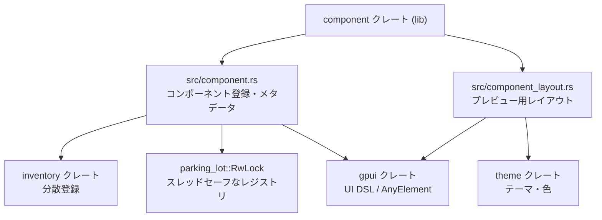
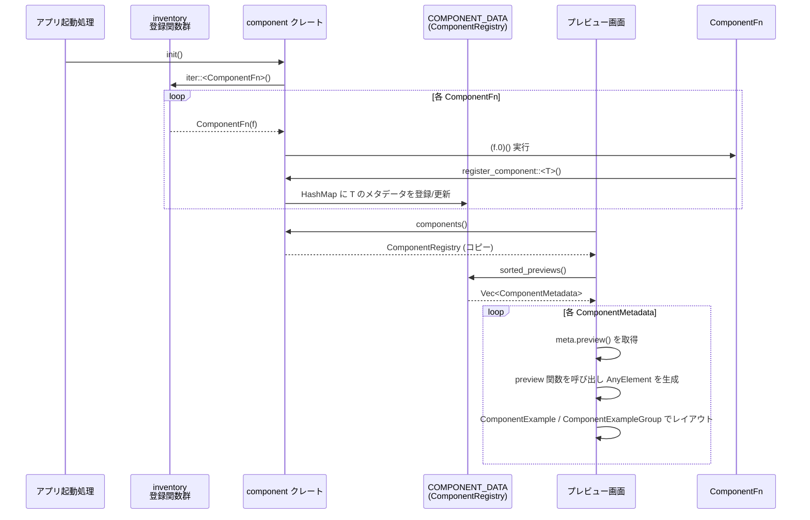

# crates/component ディレクトリ解説

## 1. ざっくり一言

`crates/component` は、  
UI コンポーネントを「プレビュー対象」として登録・管理するための仕組みと、  
そのプレビューを表示するためのレイアウト用コンポーネント群を提供するクレートです。

---

## 2. このモジュールの役割

### 2.1 何を解決するか

このディレクトリのコードは主に次の二点を担います。

- **コンポーネントのメタデータ管理・登録**
  - `Component` トレイトでコンポーネントの ID / 名前 / スコープ / ステータス / プレビュー関数を定義
  - `register_component` とグローバルレジストリ (`COMPONENT_DATA`) で、アプリ全体の「コンポーネント一覧」を管理
  - `inventory` クレートを利用した「分散登録（distributed slice）」に対応

- **プレビュー UI のレイアウト**
  - `ComponentExample` / `ComponentExampleGroup` を使い、各コンポーネントのバリアントを視覚的に並べて確認できる UI を構築

これにより、「コンポーネントギャラリー」「デザインシステムのプレビュー画面」のような機能を実装するための基盤になります。

### 2.2 ディレクトリ内の構成と依存関係

`crates/component` 内のモジュール構成と、主要な外部依存関係は次のようになっています。



- `src/component.rs`
  - クレートのエントリポイント（`[lib] path = "src/component.rs"`）
  - `Component` トレイト、`ComponentRegistry`、`ComponentMetadata` など、**登録・管理ロジック** を提供
  - `component_layout` モジュールを `pub use` して外部からも使えるようにしています

- `src/component_layout.rs`
  - `ComponentExample` / `ComponentExampleGroup` など、**プレビュー用 UI 要素** を定義
  - `gpui` と `theme` を使って、デザインされたプレビュー枠を描画します

### 2.3 設計上のポイント（コードから読み取れる範囲）

- **グローバルなコンポーネントレジストリ**
  - `COMPONENT_DATA: LazyLock<RwLock<ComponentRegistry>>` で、アプリ全体で共有されるレジストリを保持
  - `LazyLock` により、初回アクセス時に遅延初期化されます
  - `RwLock` により、複数スレッドからの読み取り・書き込みに対応

- **トレイトベースのメタデータ定義**
  - `Component` トレイトの関連関数（`id`, `scope`, `status`, `preview` など）でメタデータを宣言的に定義
  - デフォルト実装があり、必要な部分だけを上書きできます

- **inventory による分散登録**
  - `ComponentFn(fn())` と `inventory::collect!(ComponentFn)` によって、「どこからでも登録関数を追加できる」仕組みを用意
  - `init()` でこれらの登録関数を一括実行し、`COMPONENT_DATA` に登録します

- **レイアウトコンポーネントの再利用可能化**
  - `ComponentExample` / `ComponentExampleGroup` は `IntoElement` と `RenderOnce` を実装し、`gpui` の他の UI と同じように扱えるようになっています
  - 背景パターンやテキストスタイルは `theme::ActiveTheme` 経由で取得

---

## 3. 主要な機能一覧

このクレートが提供する主な機能は次の通りです。

- **Component トレイト**
  - コンポーネントの ID / 名前 / 説明 / スコープ / ステータス / プレビュー関数を定義するための共通インターフェース
- **コンポーネントの登録・レジストリ管理**
  - `register_component<T: Component>()` でレジストリに登録
  - `components()` で全登録コンポーネントのスナップショットを取得
  - `ComponentRegistry` でソート済み一覧やマップを取得
- **inventory を使った自動登録の入口**
  - `ComponentFn` と `init()` により、`inventory` で集めた登録関数を一括実行
- **コンポーネントのステータスやスコープ分類**
  - `ComponentStatus`（WorkInProgress, EngineeringReady, Live, Deprecated）
  - `ComponentScope`（DataDisplay, Input, Layout など）
- **プレビュー用レイアウトコンポーネント**
  - `ComponentExample`: 個々のバリアントを囲ったプレビュー枠
  - `ComponentExampleGroup`: 複数の例をまとめて表示するグループ
  - `single_example` / `empty_example` / `example_group` / `example_group_with_title` などのヘルパー関数

> 補足: `Component` のドキュメントコメント内では `component_group` / `component_group_with_title` という名前が言及されていますが、実際のコードでは `example_group` / `example_group_with_title` という関数名になっています。

---

## 4. 関数・構造体の解説

### 4.1 型一覧（構造体・列挙体・トレイトなど）

| 名前 | 種別 | 役割 / 用途 |
|------|------|-------------|
| `Component` | トレイト | 各 UI コンポーネントが実装するインターフェース。ID・名前・説明・スコープ・ステータス・プレビュー関数を定義します。 |
| `ComponentId` | 構造体（タプル） | コンポーネントを一意に識別するための ID。`&'static str` を内部に持ち、HashMap のキーとして利用されます。 |
| `ComponentStatus` | 列挙体 | コンポーネントの「準備状況」（WorkInProgress / EngineeringReady / Live / Deprecated）を表現します。 |
| `ComponentScope` | 列挙体 | コンポーネントのカテゴリ（Input, Layout, Navigation など）を表現し、UI 上のグルーピングに利用されます。 |
| `ComponentMetadata` | 構造体 | 一つのコンポーネントに対するメタデータ（ID, 説明, 名前, プレビュー関数, スコープ, ステータスなど）を保持します。 |
| `ComponentRegistry` | 構造体 | `ComponentId` → `ComponentMetadata` のマップと、その上の便利メソッド（ソート済み一覧など）を提供します。 |
| `ComponentFn` | 構造体 | 登録処理 `fn()` を包むためのラッパー。`inventory::collect!` の要素として使用されます。 |
| `ComponentExample` | 構造体 | 一つの「例（バリアント）」を表現するプレビュー用 UI コンポーネント。バリアント名・説明・中身の `AnyElement`・任意の幅を持ちます。 |
| `ComponentExampleGroup` | 構造体 | 複数の `ComponentExample` をまとめて表示するグループ。任意のタイトルや幅を持ちます。 |
| `COMPONENT_DATA` | `static LazyLock<RwLock<ComponentRegistry>>` | グローバルなコンポーネントレジストリ。全登録コンポーネントのメタデータがここに集約されます。 |

### 4.2 主要な関数・メソッドの詳細（例示）

以下では代表的な関数・メソッドを 7 件まで選び、詳細を説明します。

---

#### `register_component<T: Component>()`

**概要**

- `Component` を実装した型 `T` を、グローバルレジストリ `COMPONENT_DATA` に登録します。
- `T` の関連関数から `ComponentMetadata` を構築し、`ComponentId` をキーに HashMap に格納します。

**引数**

| 引数名 | 型 | 説明 |
|--------|----|------|
| `T` | `Component` トレイト境界 | 関数シグネチャ上の型パラメータ。実行時引数はありません。 |

**戻り値**

- なし（`()`）。

**内部処理の流れ**

1. `T::id()` から `ComponentId` を取得します（デフォルトでは `T::name()`）。
2. `ComponentMetadata` を組み立てます。
   - `id`: 上記 ID
   - `description`: `T::description()` を `Option<SharedString>` に変換
   - `name`: `SharedString::new_static(T::name())`
   - `preview`: `Some(T::preview)`（プレビュー関数の関数ポインタ）
   - `scope`, `sort_name`, `status`: 各関連関数の値
3. `COMPONENT_DATA.write()` で `RwLock` を書き込みロックし、内部の `HashMap` に `insert(id, metadata)` します。

**Examples（使用例）**

```rust
use component::{Component, ComponentScope, ComponentStatus, register_component};
use gpui::{AnyElement, App, Window};

// プレビュー対象のコンポーネント型
struct MyButton;

// メタデータとプレビューを定義
impl Component for MyButton {
    fn scope() -> ComponentScope {
        ComponentScope::Input // 「フォーム / 入力」カテゴリに属することを示す
    }

    fn status() -> ComponentStatus {
        ComponentStatus::EngineeringReady // 実装準備が整っている状態
    }

    fn preview(_window: &mut Window, _cx: &mut App) -> Option<AnyElement> {
        None // ここでは簡略化のためプレビュー要素は省略
    }
}

fn register_all_components() {
    // MyButton をグローバルレジストリに登録する
    register_component::<MyButton>();
}
```

**Errors / Panics**

- この関数自体は `Result` を返さず、内部でも明示的な `panic!` は行っていません。
- `HashMap::insert` の仕様上、同じ `ComponentId` で繰り返し登録すると、最後に登録したメタデータで上書きされます。

**Edge cases（エッジケース）**

- 同じ型 `T` を複数回登録した場合
  - `id()` が同一であれば最後の登録が有効になります（重複要素が増えることはありません）。
- `T::description()` が `None` の場合
  - `ComponentMetadata` の `description` は `None` のままになり、プレビュー UI 側で説明が表示されない想定です。

**使用上の注意点**

- レジストリに反映されてからでないと `components()` で取得できないため、**アプリ起動時（プレビュー画面生成前）に呼び出しておく必要**があります。
- 多くの場合、`inventory` を使った登録関数の中から呼び出されることが想定されますが、このチャンク内ではその具体的なマクロ定義は登場しません。

---

#### `fn components() -> ComponentRegistry`

**概要**

- グローバルレジストリ `COMPONENT_DATA` の現在の内容をコピーした `ComponentRegistry` を返します。
- 呼び出し側で読み取り専用のスナップショットとして使用します。

**引数**

- なし。

**戻り値**

- `ComponentRegistry`  
  現在登録されている全コンポーネントのメタデータを含むレジストリのコピー。

**内部処理の流れ**

1. `COMPONENT_DATA.read()` で `RwLock` を読み取りロックします。
2. 内部の `ComponentRegistry` を `clone()` して返します。

**Examples（使用例）**

```rust
use component::components;

fn dump_registered_components() {
    // グローバルレジストリのスナップショットを取得
    let registry = components();

    // ソート済みコンポーネント一覧を取得
    for meta in registry.sorted_components() {
        println!("component id = {}, name = {}", meta.id().0, meta.name());
    }
}
```

**Errors / Panics**

- 明示的なエラーは返しません。
- `LazyLock` と `RwLock` は標準ライブラリと `parking_lot` の実装に依存しますが、このコードからは panic 条件は読み取れません。

**Edge cases**

- 登録済みコンポーネントが 0 件の場合
  - 空の `ComponentRegistry` が返ります。
- 大量のコンポーネントが登録されている場合
  - `clone()` により `ComponentRegistry` 全体を複製するため、件数に比例したコストがかかります。

**使用上の注意点**

- `components()` を頻繁に呼び出すコードでは、不要なコピーを避けるため、
  一度取得した `ComponentRegistry` を再利用する方が効率的です。
- 書き込みが発生するタイミング（`register_component` 実行中など）とも安全に共存できるよう `RwLock` が使われています。

---

#### `fn init()`

**概要**

- `inventory::iter::<ComponentFn>()` で収集された全ての `ComponentFn` を順に実行し、コンポーネント登録を行います。
- 分散登録されたコンポーネントをアプリ起動時に一括登録するための入口です。

**引数**

- なし。

**戻り値**

- なし（`()`）。

**内部処理の流れ**

1. `inventory::iter::<ComponentFn>()` で、他モジュールから `inventory` 経由で登録された全ての `ComponentFn` を列挙します。
2. 各要素について、`(f.0)()` を呼び出します。
   - `ComponentFn` は単に `fn()` を包んだ構造体なので、その関数が実行されます。
   - 典型的には、その関数内部で `register_component::<T>()` が呼び出される想定です（コードからの推論）。

**Examples（使用例）**

```rust
use component::init;

fn main() {
    // inventory 経由で集めた登録関数を一括実行し、
    // COMPONENT_DATA にコンポーネントを登録する
    init();

    // あとはプレビュー画面などから components() を使って一覧を取得する
}
```

**Errors / Panics**

- `init()` 自体はエラーを返しません。
- 各 `ComponentFn` の中身によっては panic しうる可能性がありますが、このチャンクからはそれ以上の情報は分かりません。

**Edge cases**

- `init()` を複数回呼び出した場合
  - inventory に登録された各 `ComponentFn` が毎回実行され、結果として同じコンポーネントが再登録される可能性があります。
  - 前述のとおり、同じ ID に対しては `HashMap::insert` により上書きされるため、ID が一致していれば重複は発生しません。

**使用上の注意点**

- 通常はアプリ起動時など、**一度だけ**呼び出すことが想定されます。
- `register_component` を手動で呼び出している場合、`init()` を併用する必要はありません。

---

#### `ComponentRegistry::sorted_previews(&self) -> Vec<ComponentMetadata>`

**概要**

- プレビュー関数を持つコンポーネントだけを対象に、名前順でソートした `ComponentMetadata` のベクタを返します。
- プレビュー画面に一覧表示する際の便利メソッドです。

**引数**

| 引数名 | 型 | 説明 |
|--------|----|------|
| `&self` | `&ComponentRegistry` | 対象のレジストリ |

**戻り値**

- `Vec<ComponentMetadata>`  
  プレビュー可能なコンポーネントのメタデータを、名前順に並べた所有ベクタ。

**内部処理の流れ**

1. `self.previews()` を呼び出し、`preview` が `Some` のメタデータへの参照一覧を取得します。
2. それらを `cloned()` して `Vec<ComponentMetadata>` にします。
3. `sort_by_key(|a| a.name())` で、`name` に基づいて昇順ソートします。
4. ソート済みベクタを返します。

**Examples（使用例）**

```rust
use component::components;

fn print_preview_components_in_order() {
    let registry = components();                          // レジストリのスナップショットを取得
    let previews = registry.sorted_previews();            // プレビュー可能なものだけを名前順で取得

    for meta in previews {
        println!("preview: {}", meta.name());             // 各コンポーネント名を表示
    }
}
```

**Errors / Panics**

- このメソッドはエラーや panic を発生させるコードを含んでいません。

**Edge cases**

- `preview` がすべて `None` の場合
  - 空のベクタが返ります。
- `name` が同じコンポーネントが複数ある場合
  - `sort_by_key` の安定性に依存しますが、ここからは具体的な順序は保証されていません。

**使用上の注意点**

- `ComponentMetadata` を所有して返すため、要素数が多いとメモリコピーが発生します（ただし一般的な件数であれば問題になりにくい想定です）。

---

#### `fn Component::preview(_window: &mut Window, _cx: &mut App) -> Option<AnyElement>`

**概要**

- 各コンポーネントが「プレビューとして表示すべき UI」を返すための関連関数です。
- `Some(AnyElement)` を返すと、その UI がプレビュー画面に表示されます。

**引数**

| 引数名 | 型 | 説明 |
|--------|----|------|
| `_window` | `&mut Window` | `gpui` のウィンドウコンテキスト。プレビュー描画に利用可能です。 |
| `_cx` | `&mut App` | `gpui` のアプリケーションコンテキスト。テーマや状態の取得に利用可能です。 |

**戻り値**

- `Option<AnyElement>`  
  - `Some(element)` の場合: プレビューに表示する UI 要素  
  - `None` の場合: プレビューは何も表示しない想定

**内部処理の流れ**

- デフォルト実装では `None` を返します（プレビュー無し）。
- 実際のコンポーネント型で `impl Component for Xxx` を書く際に、この関数を上書きしてプレビュー UI を構築します。

**Examples（使用例）**

```rust
use component::{Component, ComponentScope, ComponentStatus, single_example};
use gpui::{AnyElement, App, Window, div, IntoElement};

struct MyComponent;

impl Component for MyComponent {
    fn scope() -> ComponentScope {
        ComponentScope::Layout // レイアウト関連のコンポーネント
    }

    fn status() -> ComponentStatus {
        ComponentStatus::Live // 本番利用可能
    }

    fn preview(_window: &mut Window, _cx: &mut App) -> Option<AnyElement> {
        // シンプルな例を 1 つだけ表示する
        let example = single_example(
            "Default",                                     // バリアント名
            div()                                          // prelude::div() からコンテナを作る
                .child("Hello from MyComponent")           // テキスト子要素
                .into_any_element(),                       // AnyElement に変換
        );
        Some(example.into_any_element())                   // ComponentExample も IntoElement なので AnyElement に変換
    }
}
```

**Errors / Panics**

- デフォルト実装は panic しません。
- 実際の実装は `gpui` の API の使用方法に依存します。

**Edge cases**

- `None` を返した場合
  - プレビュー画面側の挙動はこのチャンクには記載がありませんが、一般に「何も表示しない」扱いが想定されます。
- 重い計算や I/O をここで行うと
  - プレビュー描画がブロックされる可能性があります（コードからの一般的な推測）。

**使用上の注意点**

- `preview` は UI 描画パス中で呼ばれることが多いため、**短時間で完了する処理に留める**のが望ましいです。
- 複数のバリアントを表示したい場合、`ComponentExample` / `ComponentExampleGroup` を使ってレイアウトを構築するのが前提と読み取れます。

---

#### `impl ComponentExample { pub fn new(variant_name: impl Into<SharedString>, element: AnyElement) -> Self }`

**概要**

- 一つのバリアント（例）を表す `ComponentExample` を生成するコンストラクタです。
- バリアント名と中身の `AnyElement` を指定します。

**引数**

| 引数名 | 型 | 説明 |
|--------|----|------|
| `variant_name` | `impl Into<SharedString>` | 例の名前（例: "Primary", "Disabled" など）。 |
| `element` | `AnyElement` | プレビューとして表示する UI 要素。 |

**戻り値**

- `ComponentExample`  
  `description = None`, `width = None` で初期化された構造体。

**内部処理の流れ**

1. `variant_name.into()` で `SharedString` に変換します。
2. `ComponentExample` を `{ variant_name, element, description: None, width: None }` で構築して返します。

**Examples（使用例）**

```rust
use component::ComponentExample;
use gpui::{AnyElement, div, IntoElement};

fn build_example(element: AnyElement) -> ComponentExample {
    // 「Primary」という名前の例を生成
    ComponentExample::new("Primary", element)
}
```

**Errors / Panics**

- エラー・panic は行っていません。

**Edge cases**

- `variant_name` が空文字列でも、そのまま保存されます（このチャンクでは特別な扱いはありません）。

**使用上の注意点**

- 説明文や幅を設定したい場合は、`description()` / `width()` メソッドでチェーンする必要があります。

---

#### `impl ComponentExampleGroup { pub fn with_title(title: impl Into<SharedString>, examples: Vec<ComponentExample>) -> Self }`

**概要**

- タイトル付きの `ComponentExampleGroup` を生成します。
- 複数の `ComponentExample` をまとめて表示する場合に使用します。

**引数**

| 引数名 | 型 | 説明 |
|--------|----|------|
| `title` | `impl Into<SharedString>` | グループのタイトル（セクションヘッダとして表示されます）。 |
| `examples` | `Vec<ComponentExample>` | グループ内に含める例の一覧。 |

**戻り値**

- `ComponentExampleGroup`  
  `title = Some(...)`, `width = None`, `grow = false`, `vertical = false` で初期化された構造体。

**内部処理の流れ**

1. `title.into()` で `SharedString` に変換します。
2. `ComponentExampleGroup` を `{ title: Some(..), examples, width: None, grow: false, vertical: false }` で構築します。

**Examples（使用例）**

```rust
use component::{ComponentExample, ComponentExampleGroup, example_group_with_title};

fn group_examples(examples: Vec<ComponentExample>) -> ComponentExampleGroup {
    // 「Buttons」というタイトルでグループ化
    example_group_with_title("Buttons", examples)
}
```

**Errors / Panics**

- エラー・panic は行っていません。

**Edge cases**

- `examples` が空ベクタの場合
  - グループのタイトルだけが表示されるレイアウトになります（レンダリング側の具体的な挙動はこのチャンクでは記述なし）。

**使用上の注意点**

- フィールド `grow` / `vertical` は構造体に存在しますが、`RenderOnce` の実装では現在使用されていません。
  - そのため、`grow()` / `vertical()` メソッドを呼び出しても、このチャンクの実装時点では見た目に変化はありません。

---

#### `pub fn empty_example(variant_name: impl Into<SharedString>) -> ComponentExample`

**概要**

- 「何もレンダリングしないケース」を明示的に示すためのプレースホルダ例を生成します。
- プレビュー枠の中に説明テキストが表示される UI を返します。

**引数**

| 引数名 | 型 | 説明 |
|--------|----|------|
| `variant_name` | `impl Into<SharedString>` | この空例に付ける名前。 |

**戻り値**

- `ComponentExample`  
  中身の `element` として、説明文を含んだ `div` をあらかじめ組み立てたものがセットされます。

**内部処理の流れ**

1. `ComponentExample::new(variant_name, ...)` を呼び出し、
2. `div().w_full().text_center().items_center().text_xs().opacity(0.4)` でスタイル設定したテキスト要素を子として持つ `AnyElement` を渡します。
3. テキストとして  
   `"This space is intentionally left blank. It indicates a case that should render nothing."`  
   を表示します。

**Examples（使用例）**

```rust
use component::empty_example;

fn build_empty_variant() {
    // 「Empty」という名前の、意図的に何も描画しないケースを表す例
    let example = empty_example("Empty");

    // あとは他の例と同様にグループに含めて表示する
}
```

**Errors / Panics**

- エラー・panic は行っていません。

**Edge cases**

- 特別なエッジケースはありません（`variant_name` が空でも構築されます）。

**使用上の注意点**

- 「レンダリングされないことが正しい挙動」であるケースを、ドキュメントとして明示する目的で使われます。
- 実際にレンダリングされるのは「説明テキスト付きのプレースホルダ」であり、`preview` が `None` とは意味が異なります。

---

### 4.3 その他の主な関数・メソッド一覧

ここでは、比較的単純なラッパーやアクセサメソッドを一覧形式でまとめます。

| 関数 / メソッド名 | 所属 | 役割（1 行） |
|-------------------|------|--------------|
| `Component::id()` | トレイト | デフォルトで `ComponentId(Self::name())` を返し、コンポーネントの ID を決定します。 |
| `Component::scope()` | トレイト | デフォルトで `ComponentScope::None` を返し、カテゴリ指定がない状態を表します。 |
| `Component::status()` | トレイト | デフォルトで `ComponentStatus::Live` を返します。 |
| `Component::name()` | トレイト | デフォルトで `std::any::type_name::<Self>()` を返し、型名をそのまま名前に使います。 |
| `Component::sort_name()` | トレイト | デフォルトでは `name()` と同じ値を返し、ソートキーとして利用されます。 |
| `Component::description()` | トレイト | デフォルトでは `None` を返します。`Documented` 派生などで上書きされる想定です。 |
| `ComponentMetadata::id()` / `name()` / `description()` / `preview()` / `scope()` / `sort_name()` / `status()` | 構造体 | 各フィールドへのアクセス用ゲッターを提供します（新しい `SharedString` やコピーを返します）。 |
| `ComponentMetadata::scopeless_name()` | 構造体 | `name` を `"::"` で分割し、最後の要素だけを返します（モジュールパスを取り除いた名前）。 |
| `ComponentRegistry::previews()` | 構造体 | `preview` が `Some` のメタデータのみを `&ComponentMetadata` のベクタで返します。 |
| `ComponentRegistry::components()` | 構造体 | 登録されている全ての `&ComponentMetadata` をベクタで返します。 |
| `ComponentRegistry::sorted_components()` | 構造体 | 全コンポーネントを `name` でソートした `Vec<ComponentMetadata>` を返します。 |
| `ComponentRegistry::component_map()` | 構造体 | 内部の `HashMap<ComponentId, ComponentMetadata>` をクローンして返します。 |
| `ComponentRegistry::get(&ComponentId)` | 構造体 | 指定 ID に対応する `&ComponentMetadata` を返します。 |
| `ComponentRegistry::len()` | 構造体 | 登録されているコンポーネント数を返します。 |
| `ComponentStatus::description(&self)` | 列挙体 | 各ステータスの説明文（英語）を `&'static str` で返します。 |
| `ComponentExample::description(self, ...)` | 構造体 | 説明テキストを設定し、自身を返すビルダー的メソッドです。 |
| `ComponentExample::width(self, Pixels)` | 構造体 | プレビュー枠の幅を指定し、自身を返します。 |
| `ComponentExampleGroup::new(Vec<ComponentExample>)` | 構造体 | タイトル無しのグループを生成します。 |
| `ComponentExampleGroup::width(self, Pixels)` | 構造体 | グループの幅を指定します。 |
| `ComponentExampleGroup::grow(self)` / `vertical(self)` | 構造体 | フラグを `true` にしますが、このチャンクの `render` 実装ではまだ使用されていません。 |
| `single_example(...)` | 関数 | `ComponentExample::new` の薄いラッパーです。 |
| `example_group(...)` | 関数 | `ComponentExampleGroup::new` の薄いラッパーです。 |
| `example_group_with_title(...)` | 関数 | `ComponentExampleGroup::with_title` の薄いラッパーです。 |

---

## 5. データフロー

ここでは、典型的な利用シナリオとして

1. コンポーネントの登録
2. プレビュー画面での一覧取得と表示

という流れを示します。

### 5.1 概要

1. アプリ起動時、`inventory` で集められた登録関数（`ComponentFn`）を `init()` が一括実行し、`register_component::<T>()` を通じて `COMPONENT_DATA` に登録します。
2. プレビュー画面は `components()` で `ComponentRegistry` を取得し、`sorted_previews()` などでソート済み一覧を作成。
3. 各 `ComponentMetadata` の `preview` 関数ポインタを呼び出し、`AnyElement` を得て、`ComponentExample` / `ComponentExampleGroup` と共に UI として描画します。

### 5.2 シーケンス図



この図から分かる通り、登録と表示は `ComponentRegistry` を介して疎結合になっています。

---

## 6. 使い方（How to Use）

### 6.1 基本的な使用方法

ここでは、最小限の例として

1. コンポーネント型に `Component` を実装
2. 手動で `register_component` を呼び出して登録
3. `components()` から一覧を取得して名前を出力

という流れを示します。

```rust
use component::{
    Component, ComponentScope, ComponentStatus,
    register_component, components,
    single_example,
};
use gpui::{AnyElement, App, Window, div, IntoElement};

// 1. プレビュー対象のコンポーネント型
struct MyComponent;

// 2. Component トレイトの実装
impl Component for MyComponent {
    fn scope() -> ComponentScope {
        ComponentScope::Input                    // 入力系コンポーネント
    }

    fn status() -> ComponentStatus {
        ComponentStatus::WorkInProgress         // まだ開発中であることを示す
    }

    fn preview(_window: &mut Window, _cx: &mut App) -> Option<AnyElement> {
        // 単一のバリアントを表示する簡単なプレビュー
        let example = single_example(
            "Default",                          // バリアント名
            div()                               // コンテナ要素
                .child("Preview of MyComponent")// テキストを子要素として追加
                .into_any_element(),            // AnyElement に変換
        );
        Some(example.into_any_element())        // ComponentExample を AnyElement に変換して返す
    }
}

// 3. 登録と一覧参照
fn main() {
    // アプリ起動時などに、コンポーネントをレジストリへ登録
    register_component::<MyComponent>();

    // 後から、登録済みコンポーネントのスナップショットを取得
    let registry = components();

    // ソート済みコンポーネント一覧を列挙
    for meta in registry.sorted_components() {
        println!("id = {}, name = {}", meta.id().0, meta.name());
    }
}
```

この例では `inventory` は使わず、明示的に `register_component` を呼び出しています。  
実際のアプリでは、`init()` と `inventory` を組み合わせて自動登録するパターンも想定されています。

### 6.2 よくある使用パターン

#### パターン 1: 複数バリアントをグループ表示する

複数の状態（Primary, Disabled, Loading など）をまとめて表示する例です。

```rust
use component::{
    Component, ComponentScope, ComponentStatus,
    example_group_with_title, single_example, empty_example,
    ComponentExample,
};
use gpui::{AnyElement, App, Window, div, IntoElement};

struct ButtonComponent;

impl Component for ButtonComponent {
    fn scope() -> ComponentScope {
        ComponentScope::Input                    // ボタンは入力系
    }

    fn status() -> ComponentStatus {
        ComponentStatus::Live                    // 本番利用可能
    }

    fn preview(_window: &mut Window, _cx: &mut App) -> Option<AnyElement> {
        // 各バリアントの ComponentExample を作成
        let primary = single_example(
            "Primary",
            div().child("Primary Button").into_any_element(),
        );

        let disabled = single_example(
            "Disabled",
            div().opacity(0.5).child("Disabled Button").into_any_element(),
        );

        // 何も描画すべきでないケースを明示する例
        let empty = empty_example("No Icon");

        // グループとしてまとめる
        let group = example_group_with_title(
            "Buttons",                            // グループタイトル
            vec![primary, disabled, empty],       // 例の一覧
        );

        Some(group.into_any_element())            // グループ全体を AnyElement として返す
    }
}
```

#### パターン 2: scopeless_name でモジュールパスを隠す（利用側）

`ComponentMetadata::scopeless_name()` を使うと、型名からモジュールパス部分を取り除いた名前だけを取得できます。

```rust
use component::components;

fn print_scopeless_names() {
    let registry = components();

    for meta in registry.sorted_components() {
        // "my_crate::ui::Button" -> "Button" のように末尾要素だけを取得
        let short_name = meta.scopeless_name();
        println!("{}", short_name);
    }
}
```

### 6.3 使用上の注意点（まとめ）

- **登録順と重複 ID**
  - 同じ `ComponentId` を持つコンポーネントを複数回登録した場合、最後の登録内容で上書きされます。
  - ID はデフォルトで `type_name::<Self>()` に基づくため、**同じ型を重複登録しない**前提で使うのが自然です。

- **`components()` のコスト**
  - 毎回 `ComponentRegistry` をクローンするため、非常に頻繁な呼び出しは避ける方が望ましいです。
  - 一度取得したレジストリをローカルで保持して使い回す設計が推奨されます。

- **`init()` の呼び出しタイミング**
  - `inventory` と組み合わせる場合、`init()` は通常アプリの起動フェーズで一度だけ呼ぶ設計が想定されます。
  - 複数回呼び出しても ID が同じなら上書きされるだけですが、不要な再登録が発生します。

- **プレビュー関数 `preview` の負荷**
  - 描画パスで呼ばれるため、重い処理（ネットワーク I/O や大きな計算）は避けるべきです。
  - 必要であれば別スレッドで準備し、`gpui` の状態として結果だけを反映する形が安全です。

- **`ComponentExampleGroup` の `grow` / `vertical` フィールド**
  - このチャンクの `RenderOnce` 実装では、これらのフラグは使用されていません。
  - 呼び出しても見た目に影響しない点に注意が必要です。

- **ドキュメントコメントと実装の名称差異**
  - `Component` トレイトのコメント内では `component_group` / `component_group_with_title` が言及されていますが、実装されている関数名は `example_group` / `example_group_with_title` です。
  - 実際の利用時は **実装されている関数名** を使用する必要があります。

---

## 7. 関連ファイル

このディレクトリ内で、今回の内容と直接関係するファイルは次の通りです。

| パス | 役割 / 関係 |
|------|------------|
| `crates/component/Cargo.toml` | クレート名・ライセンス・依存クレート（`gpui`, `inventory`, `theme` など）を定義します。 |
| `crates/component/src/component.rs` | クレートのメインモジュール。`Component` トレイト、`ComponentRegistry`、`ComponentMetadata`、`ComponentStatus` / `ComponentScope` など、登録・分類・取得ロジックを提供します。 |
| `crates/component/src/component_layout.rs` | プレビュー用レイアウトコンポーネント（`ComponentExample` / `ComponentExampleGroup`）とそのヘルパー関数を定義します。`component.rs` から `pub use` され、外部からも直接利用できます。 |

このディレクトリ外には、`Component` を実装する具体的な UI コンポーネントや、`inventory` を用いた自動登録のマクロ定義などが存在する可能性がありますが、このチャンクには含まれていないため詳細は不明です。
