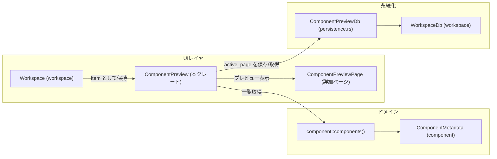
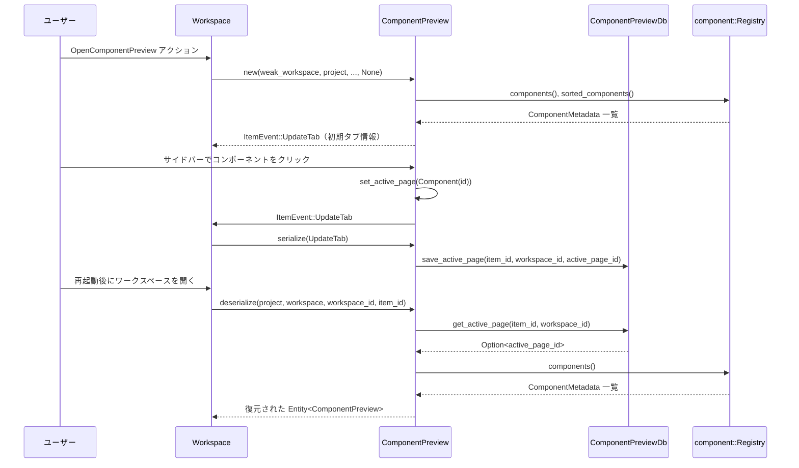

# 1. ざっくり一言

`component_preview` クレートは、Zed のワークスペース内に「コンポーネント一覧＋プレビュー」用のペインを追加するための機能を提供し、UI コンポーネントの一覧表示・検索・プレビューと、その表示状態の永続化を行うモジュール群です。

---

# 2. このモジュールの役割

## 2.1 概要

- このクレートは、`component` クレートで管理されている UI コンポーネント群を一覧し、右側に詳細なプレビューを表示する「Component Preview」タブを提供します。
- ユーザーは左側のリストでコンポーネントをスコープ（カテゴリ）ごとに閲覧・検索し、右側で実際のプレビューと説明・状態バッジを確認できます。
- 選択中のコンポーネント（または「All Components」ビュー）はワークスペース DB (`WorkspaceDb`) に保存され、ワークスペース再起動時に復元されます。

## 2.2 アーキテクチャ内での位置づけ

このクレートは、ワークスペース内の 1 つの「Item」として振る舞い、`workspace`・`project`・`component`・`db` など複数のクレートと連携します。



- `ComponentPreview` は `workspace::Item` + `SerializableItem` を実装し、他のエディタタブと同様に扱われます。
- コンポーネントの中身は `component::components()` から取得した `ComponentMetadata` を通じて参照します。
- 表示していたページ（All / 特定コンポーネント）は `ComponentPreviewDb` → `WorkspaceDb` に保存されます。
- `examples/component_preview.rs` は、この機能だけを起動する最小限のアプリケーション例です。

## 2.3 設計上のポイント

- **状態を持つ UI アイテム**
  - `ComponentPreview` は、アクティブなページ（一覧 or 個別）、カーソル位置、フィルタ文字列などの状態を内部フィールドとして保持します。
- **ワークスペースとの疎結合**
  - `WeakEntity<Workspace>` を保持し、必要なときにだけ `upgrade()` して操作します。これにより循環参照を避けています。
- **永続化の分離**
  - DB 関連処理は `persistence.rs` 内の `ComponentPreviewDb` に分離されており、UI ロジックからは `save_active_page`／`get_active_page` のみを意識すれば良い構造です。
- **再描画制御用のキー**
  - `reset_key` フィールドを使い、同じコンポーネントページを再度選択したときにプレビューを強制再描画できるようにしています。
- **検索とグルーピング**
  - フィルタ文字列に基づき、コンポーネントをスコープごとにグルーピングしつつ、部分一致ハイライト（`HighlightedLabel`）も行うロジックを `scope_ordered_entries` に集約しています。
- **非同期 DB 書き込み**
  - `save_active_page` はバックグラウンドタスク (`cx.background_spawn`) で実行され、UI スレッドをブロックしないようになっています。

---

# 3. 主要な機能一覧

- **Component Preview ペインの登録**
  - `init(app_state, cx)` によって `Workspace` へシリアライズ可能な Item として `ComponentPreview` を登録し、`OpenComponentPreview` アクションで開けるようにします。
- **コンポーネント一覧の表示・検索**
  - `ComponentPreview` が左側サイドバーでコンポーネントをスコープ別に一覧表示し、テキスト入力によるフィルタリングとハイライトを行います。
- **コンポーネントの個別プレビュー**
  - 右側エリアで、コンポーネントの名前・スコープ・説明・状態バッジと、`ComponentMetadata::preview()` が提供する実際のプレビュー UI を表示します。
- **「All Components」ビュー**
  - 全コンポーネントをセクションごとに連続してプレビュー表示する一覧ページを提供します。
- **ステータストーストのテスト表示**
  - サイドバー下部の「Launch Toast」ボタンから、`StatusToast` を使った通知 UI のテスト表示ができます。
- **アクティブページの永続化・復元**
  - `ComponentPreviewDb` によって、「どのコンポーネントページを開いていたか」をワークスペース単位・Item 単位で保存・復元します。
- **ペイン分割時の状態コピー**
  - `clone_on_split` により、同じカーソル位置・同じアクティブページを保持したままペインを分割できます。

---

# 4. 関数・構造体の解説

## 4.1 主な型一覧

| 名前 | 種別 | 役割 / 用途 |
|------|------|-------------|
| `ComponentPreview` | 構造体 | ワークスペース内の「Component Preview」タブ本体。コンポーネント一覧・検索・プレビュー表示を行う。 |
| `ComponentPreviewPage` | 構造体 | 1 つのコンポーネントを詳細表示する単一レンダリング用のビュー (`RenderOnce`)。 |
| `PreviewPage` | enum | 現在表示中のページ状態（`AllComponents` または `Component(ComponentId)`）を表す。 |
| `PreviewEntry` | enum | 左サイドバーと「All Components」ビュー用の行種別（コンポーネント、セクションヘッダ、仕切り、AllComponents エントリ）を表す。 |
| `ActivePageId` | 構造体（newtype） | DB に保存するアクティブページ ID。`"AllComponents"` または `ComponentId` の文字列表現を保持。 |
| `ComponentPreviewDb` | 構造体 | `component_previews` テーブルへの読み書きを行うドメインオブジェクト。アクティブページの保存・取得を担当。 |

---

## 4.2 重要な関数・メソッド詳細

### 4.2.1 `init(app_state: Arc<AppState>, cx: &mut App)`

**概要**

- `Workspace` に対して `ComponentPreview` を「シリアライズ可能な Item」として登録し、`workspace::OpenComponentPreview` アクションで新しい Preview タブを開けるようにする初期化関数です。

**引数**

| 引数名 | 型 | 説明 |
|--------|----|------|
| `app_state` | `Arc<AppState>` | アプリ全体の共有状態。言語レジストリ、ユーザー情報、ファイルシステムなどを含む。 |
| `cx` | `&mut App` | アプリケーションコンテキスト。エンティティの監視・アクション登録などを行うために使用。 |

**戻り値**

- ありません（`()`）。副作用として `Workspace` に Item の登録とアクションハンドラを追加します。

**内部処理の流れ**

1. `workspace::register_serializable_item::<ComponentPreview>(cx)` で、`ComponentPreview` をシリアライズ可能な Item として登録します。
2. `cx.observe_new` を使い、新しい `Workspace` が生成されたときに呼ばれるクロージャを登録します。
3. その中で、`Workspace::register_action` を呼び、`OpenComponentPreview` アクションが発火したときに `ComponentPreview::new` で新しいタブを作成し、`add_item_to_active_pane` で現在のペインに追加するよう設定します。

**Examples（使用例）**

`examples/component_preview.rs` では、アプリ起動時に以下のように呼び出されています（概略・コメント付きの短縮版）:

```rust
use std::sync::Arc;
use gpui::App;
use workspace::AppState;
use component_preview::init as init_component_preview;

fn setup(app_state: Arc<AppState>, cx: &mut App) {
    component::init();                  // component レジストリを初期化
    workspace::init(app_state.clone(), cx); // Workspace 全体を初期化

    init_component_preview(app_state, cx);  // Component Preview を Workspace に登録
}
```

**Edge cases（エッジケース）**

- `Workspace` 側の `OpenComponentPreview` アクション型はこのチャンクには定義がないため、存在しない場合はコンパイルエラーになります。
- `ComponentPreview::new` が `Err` を返した場合は `expect("Failed to create component preview")` により panic します。

**使用上の注意点**

- `component::init()` や `workspace::init()` など、周辺クレートの初期化が先に済んでいることが前提です（例から読み取れる前提条件）。
- 複数回呼ばれると、その分だけ `observe_new` とアクションが登録されるため、通常はアプリ起動時に一度だけ呼ぶ前提と考えるのが自然です（コードからの推測であり、挙動自体はコード上では制限されていません）。

---

### 4.2.2 `ComponentPreview::new(...) -> anyhow::Result<Self>`

```rust
pub fn new(
    workspace: WeakEntity<Workspace>,
    project: Entity<Project>,
    language_registry: Arc<LanguageRegistry>,
    user_store: Entity<UserStore>,
    selected_index: impl Into<Option<usize>>,
    active_page: Option<PreviewPage>,
    window: &mut Window,
    cx: &mut Context<Self>,
) -> anyhow::Result<Self>
```

**概要**

- `ComponentPreview` のインスタンスを生成し、コンポーネント一覧・マップ・フィルタ入力フィールド・スクロール状態などを初期化します。

**引数**

| 引数名 | 型 | 説明 |
|--------|----|------|
| `workspace` | `WeakEntity<Workspace>` | 親ワークスペースへの弱参照。トースト表示などで利用。 |
| `project` | `Entity<Project>` | プロジェクトエンティティ。ユーザー情報や言語レジストリ取得に利用されます。 |
| `language_registry` | `Arc<LanguageRegistry>` | 言語レジストリ。現在は UI 内で参照のみで、プレビュー内で使われる可能性があります。 |
| `user_store` | `Entity<UserStore>` | ユーザー情報ストア。 |
| `selected_index` | `impl Into<Option<usize>>` | 起動時に選択しておくコンポーネントインデックス（ペイン分割時の引き継ぎなど）。 |
| `active_page` | `Option<PreviewPage>` | 起動時に表示するページ（All or 特定コンポーネント）。省略時は `AllComponents`。 |
| `window` | `&mut Window` | GPUI のウィンドウ。フォーカス設定などに使用。 |
| `cx` | `&mut Context<Self>` | `ComponentPreview` のコンテキスト。子エンティティの生成やフォーカスハンドル取得に使用。 |

**戻り値**

- `anyhow::Result<Self>`  
  - 成功時: 初期化済みの `ComponentPreview`。
  - 失敗時: `components()` 呼び出しなど内部処理で発生したエラーを `Err` で返します（ただし、このチャンクでは具体的なエラー箇所は見えていません）。

**内部処理の流れ**

1. `components()` からコンポーネントレジストリを取得し、`sorted_components()` でソートされた `ComponentMetadata` のリストを取得します。
2. `component_map()` により `ComponentId -> ComponentMetadata` のマップを構築します。
3. `ListState::new` で右側のリスト（All Components ビューで使用）の仮想リスト状態を初期化します。
4. 検索入力用の `InputField` を `cx.new` で生成し、`filter_editor` として保持します。
5. `cursor_index`（選択中インデックス）や `active_page` を引数に基づいて設定します。
6. 必要なら `scroll_to_preview` を呼び、選択済みインデックスを可視領域にスクロールします。
7. `update_component_list` を呼んで、フィルタとスコープグルーピングに基づく `entries` を初期化します。
8. `filter_editor` のフォーカスハンドルを取得し、`window.focus` により入力フォーカスを検索フィールドへ移します。

**Examples（使用例）**

`examples/component_preview.rs` のコア部分（簡略版）です:

```rust
// Workspace 内で ComponentPreview を追加する例
workspace.update(cx, |workspace, cx| {
    let weak_workspace = cx.entity().downgrade();      // Workspace の WeakEntity を取得
    let language_registry = app_state.languages.clone(); // AppState から言語レジストリを取得
    let user_store = app_state.user_store.clone();       // AppState から UserStore を取得
    let project = project.clone();                       // 既に作成済みの Project エンティティ

    let component_preview = cx.new(|cx| {
        ComponentPreview::new(
            weak_workspace,
            project,
            language_registry,
            user_store,
            None,       // 最初のカーソル位置は 0（デフォルト）
            None,       // 最初は AllComponents ビュー
            window,
            cx,
        )
        .expect("Failed to create component preview") // 失敗したら panic
    });

    workspace.add_item_to_active_pane(
        Box::new(component_preview), // Item として追加
        None,                        // 位置指定なし（デフォルト）
        true,                        // 追加後にアクティブ化
        window,
        cx,
    );
});
```

**Errors / Panics**

- `anyhow::Result` を返しているため、`components()` 呼び出しや内部での構造体生成でエラーがあった場合に `Err` になります。
- 呼び出し側が `expect("Failed to create component preview")` を使っている箇所（例・`init` のアクション内など）では、`Err` が panic に変換されます。

**Edge cases（エッジケース）**

- `selected_index` がコンポーネント数より大きい値で与えられた場合でも、`scroll_to_preview` 内で単純に `scroll_to_reveal_item(ix)` を呼んでいるだけであり、範囲チェックはありません。実際の挙動は `ListState` 側の実装に依存します。
- コンポーネントが 0 件の場合でも、`component_list` は長さ 0 で初期化されますが、レンダリング側は空リストを処理するようになっているため、特別なエラー処理はありません。

**使用上の注意点**

- `component::components()` が正しく初期化されている必要があります（通常は `component::init()` を先に呼ぶ）。
- `Workspace` と `Project` は、`ComponentPreview` の外側で既に作成・セットアップされている前提です。
- ペイン分割などで `clone_on_split` から呼ばれるため、この関数は副作用を最小限に抑える（DB 書き込みなどを行わない）純粋な初期化関数として使われています。

---

### 4.2.3 `ComponentPreview::update_component_list(&mut self, cx: &mut Context<Self>)`

**概要**

- 現在のフィルタ文字列とコンポーネント一覧 (`self.components`) に基づいて、サイドバーと All Components ビューで使用する `entries` と `component_list` を再構築します。
- フィルタの結果、現在表示中のコンポーネントが見えなくなった場合のアクティブページの調整も行います。

**引数**

| 引数名 | 型 | 説明 |
|--------|----|------|
| `self` | `&mut Self` | `ComponentPreview` の内部状態を更新します。 |
| `cx` | `&mut Context<Self>` | `ItemEvent::UpdateTab` の発行などに使用されます。 |

**戻り値**

- ありません。内部状態 (`entries`, `component_list`, `active_page`) を更新し、`ItemEvent::UpdateTab` を発行します。

**内部処理の流れ**

1. `scope_ordered_entries()` を呼び、フィルタ文字列に応じてスコープごとにグルーピングされた `PreviewEntry` のベクタを作成します。
2. エントリ数 (`new_len`) を計算し、1 件以上あればナビゲーションリストのスクロールハンドルを先頭に移動します。
3. `filtered_components()` を使って、フィルタ結果のコンポーネント一覧を取得します。
4. 現在の `active_page` が `PreviewPage::Component` の場合で、そのコンポーネントがフィルタ結果に含まれていなければ:
   - フィルタ結果が非空なら、その先頭コンポーネントのページに切り替えます。
   - フィルタ結果が空なら、`PreviewPage::AllComponents` に戻します。
5. `component_list` を新しい長さで再初期化し、`entries` を更新します。
6. `ItemEvent::UpdateTab` を発行し、シリアライザ等に「状態が変わった」ことを通知します。

**Edge cases（エッジケース）**

- フィルタ結果が空で、現在コンポーネントページを表示している場合は、自動的に `AllComponents` ビューに戻るため、「存在しないコンポーネントページが選択されたまま」という状態を避けています。
- フィルタ文字列が空に戻った場合、`scope_ordered_entries()` はすべてのコンポーネントをスコープごとに表示します。

**使用上の注意点**

- この関数はレンダリング中（`Render::render` 内）から呼ばれる可能性があるため、UI 更新に関する処理のみに限定されています（重い処理は避ける設計になっています）。
- `ItemEvent::UpdateTab` が発行されるとシリアライザが呼ばれるため、呼び出し頻度が高い場合は永続化も頻繁に行われる点に注意が必要です（実際のパフォーマンス特性は DB 実装に依存します）。

---

### 4.2.4 `impl Render for ComponentPreview::render(...)`

```rust
impl Render for ComponentPreview {
    fn render(&mut self, window: &mut Window, cx: &mut Context<Self>) -> impl IntoElement { ... }
}
```

**概要**

- `ComponentPreview` のメイン UI を描画します。
  - 左: コンポーネントナビゲーション + 「Launch Toast」ボタン。
  - 右上: 検索入力フィールド。
  - 右下: All Components ビューまたは特定コンポーネントページ。

**内部処理の流れ（要点）**

1. `filter_editor.update` で検索フィールドの現在の文字列を取得し、`filter_text` が変わっていれば `update_component_list` を実行します。
2. `scope_ordered_entries` でサイドバー用のエントリ一覧を取得し、`uniform_list` で仮想リストとして描画します。
   - 各行は `render_sidebar_entry` で描画され、クリック時に `set_active_page` を呼びます。
3. サイドバー下部に「Launch Toast」ボタンを配置し、クリックで `test_status_toast` を呼びます。
4. 右側:
   - 上部に検索フィールド (`filter_editor`) を配置します。
   - 下部に `content-area` を配置し、`active_page` に応じて:
     - `PreviewPage::AllComponents` → `render_all_components` の結果を表示。
     - `PreviewPage::Component(id)` → `render_component_page` の結果を表示。

**Examples（使用例）**

- このメソッドはフレームごとに内部から呼ばれるため、直接呼び出すことはありません。  
  GPUI のレンダリングシステムによって自動的に利用されます。

**Edge cases（エッジケース）**

- フィルタによってコンポーネントが 0 件になった場合、右側は `"No components matching '…'."` というメッセージを表示します。
- `render_component_page` 内で該当コンポーネントが見つからなかった場合は `"Component not found"` と表示します（`component_map` に存在しない ID の場合）。

**使用上の注意点**

- `render` 内ではフィルタ更新などの軽い状態更新のみを行い、重い処理（DB アクセスなど）は別メソッド・バックグラウンドタスクで行う構造になっています。
- `active_page` のコピーを `let active_page = self.active_page.clone();` で取ってから `match` しているため、描画途中に `active_page` が変化しても一貫したビューが描画されるようになっています。

---

### 4.2.5 `ComponentPreviewDb::save_active_page(...)`

```rust
pub async fn save_active_page(
    &self,
    item_id: ItemId,
    workspace_id: WorkspaceId,
    active_page_id: String,
) -> Result<()>
```

**概要**

- `component_previews` テーブルに、指定された `workspace_id` と `item_id` に対応する `active_page_id` を INSERT / UPDATE する非同期関数です。

**引数**

| 引数名 | 型 | 説明 |
|--------|----|------|
| `item_id` | `ItemId` | ワークスペース内の Item（タブ）を識別する ID。 |
| `workspace_id` | `WorkspaceId` | ワークスペースを識別する ID。 |
| `active_page_id` | `String` | `"AllComponents"` または `ComponentId` の文字列表現。 |

**戻り値**

- `anyhow::Result<()>`  
  - 成功時: `Ok(())`。  
  - 失敗時: SQL 実行エラーなどを含む `Err`。

**内部処理の流れ**

1. `log::debug!` で保存しようとしている値をログに出力します。
2. SQL 文を組み立てます（`INSERT ... ON CONFLICT DO UPDATE SET active_page_id = ?3`）。
3. `self.write` を使って DB 書き込みトランザクションを開始します。
4. `Statement::prepare` で文をプリコンパイルし、`bind` で `item_id`・`workspace_id`・`active_page_id` を順にバインドします。
5. `statement.exec()` を呼び、INSERT または UPDATE を実行します。

**Edge cases（エッジケース）**

- 同じ `(workspace_id, item_id)` の組み合わせに対して再度保存しようとした場合は、`ON CONFLICT DO UPDATE` により `active_page_id` のみが更新されます。
- `workspace_id` が `workspaces` テーブルに存在しない場合、外部キー制約によりエラーとなる可能性があります（`FOREIGN KEY(workspace_id) REFERENCES workspaces(workspace_id) ON DELETE CASCADE`）。

**使用上の注意点**

- `ComponentPreview::serialize` からバックグラウンドタスクで呼び出される前提です。UI スレッドから直接 `await` しないように設計されています。
- エラーは `anyhow::Result` で返されますが、呼び出し元 (`cx.background_spawn`) のコードによってはログ出力のみにとどまり、ユーザーには露出しない可能性があります。

---

### 4.2.6 `ComponentPreviewDb::get_active_page(item_id, workspace_id)`

この関数は `query!` マクロで生成されています。

**シグネチャ（展開後の概念的な形）**

```rust
pub fn get_active_page(
    item_id: ItemId,
    workspace_id: WorkspaceId,
) -> Result<Option<String>>
```

**概要**

- 指定された `(item_id, workspace_id)` に対応する `active_page_id` を `component_previews` テーブルから取得します。
- レコードが存在しなければ `Ok(None)` を返します。

**使用箇所**

- `SerializableItem for ComponentPreview::deserialize` 内で、起動時に前回開いていたページを復元するために使用されています。

---

### 4.2.7 `SerializableItem for ComponentPreview::deserialize(...)`

**概要**

- ワークスペース復元時に `ComponentPreview` のインスタンスを再構築するためのファクトリメソッドです。
- DB から `active_page_id` を取得し、それに対応する `PreviewPage` を決定した上で `ComponentPreview::new` を呼び出します。

**内部処理の流れ（要点）**

1. `ComponentPreviewDb::global(cx).get_active_page(item_id, workspace_id)` で `active_page_id` を取得します。
2. 取得に成功し、かつ値が存在する場合:
   - 文字列が `"AllComponents"` と等しければ `PreviewPage::default()`（= `AllComponents`）。
   - そうでなければ `components()` から全コンポーネントを取り出し、`id().0 == component_str` のものを探して `PreviewPage::Component` を構成します。
   - 見つからなければ `PreviewPage::default()` にフォールバックします。
3. `window.spawn` で非同期タスクを起動し、その中で `cx.update` を呼んで UI スレッドに戻しつつ `ComponentPreview::new` を実行します。
4. `cx.new` によって `Entity<ComponentPreview>` を生成し、それを `Ok(entity)` として返します。

**Edge cases（エッジケース）**

- DB からの取得がエラーになった場合や、レコードが存在しない場合:
  - `ActivePageId::default()` が使用され、`AllComponents` ビューから開始します。
- 保存されていた `active_page_id` に対応するコンポーネントが `components()` に存在しない場合:
  - こちらも `PreviewPage::default()`（AllComponents）にフォールバックします。

**使用上の注意点**

- `deserialize` は非同期タスク内で `ComponentPreview::new` を呼ぶ構造になっているため、DB からの読み取りやレジストリ探索による待ち時間があっても UI スレッドをブロックしない設計になっています。
- 文字列 ID と `ComponentId` の対応付けは `ComponentId.0` の値に依存しており、この仕様を変更すると保存データとの互換性に影響する可能性があります。

---

## 4.3 その他の関数

| 関数名 / メソッド名 | 役割（1 行） |
|---------------------|--------------|
| `scroll_to_preview` | 指定インデックスのコンポーネントが右側リストで見えるようにスクロールし、カーソルを更新します。 |
| `set_active_page` | アクティブページを変更し、同じページを再度選択した場合は強制再描画のため `reset_key` を更新します。 |
| `filtered_components` | 検索文字列に基づいてコンポーネントをフィルタし、名前・スコープ・説明に部分一致するものを返します。 |
| `scope_ordered_entries` | スコープ別にコンポーネントをグルーピングし、セクションヘッダや区切りを含んだ `PreviewEntry` のリストを構築します。 |
| `render_sidebar_entry` | サイドバーの 1 行（コンポーネント、ヘッダ、区切り、AllComponents）を描画します。 |
| `render_all_components` | All Components ビュー全体を描画します。フィルタ結果が空のときはメッセージを表示します。 |
| `render_component_page` | 特定 `ComponentId` の詳細ページを描画し、見つからない場合はエラーメッセージを表示します。 |
| `test_status_toast` | サンプルの `StatusToast` をワークスペースに表示するボタンアクションです。 |
| `ComponentPreviewPage::render_component_status` | コンポーネントのステータス（Deprecated / WIP など）に応じたバッジを描画します（Live の場合は何も描画しません）。 |
| `ComponentPreviewPage::render_header` | コンポーネントのスコープ・名前・説明を含むヘッダー部を描画します。 |
| `ComponentPreviewPage::render_preview` | 実際のコンポーネントプレビューを描画し、プレビューがない場合や失敗時はテキストメッセージを表示します。 |

---

# 5. データフロー

ここでは、「ユーザーが Component Preview を開き、コンポーネントを選択し、その状態が永続化されて再起動後に復元される」までの流れを示します。

## 5.1 処理の要点

1. ユーザーが `OpenComponentPreview` アクション（例: コマンドパレットやメニュー）を実行すると、`Workspace` が `ComponentPreview::new` を呼び出して新しいタブを開きます。
2. `ComponentPreview` は `components()` からコンポーネント一覧を取得し、左側のサイドバーと右側ビューを描画します。
3. ユーザーがサイドバーからコンポーネントを選択すると `set_active_page` が呼ばれ、その結果 `ItemEvent::UpdateTab` が発行されます。
4. `UpdateTab` イベントによりシリアライザが起動し、`ComponentPreviewDb::save_active_page` が現在のページ ID を DB に保存します。
5. アプリ再起動後、`Workspace` が `deserialize` を呼び出すと、`ComponentPreviewDb::get_active_page` で前回のページ ID を取得し、同じページを再現します。

## 5.2 シーケンス図



---

# 6. 使い方（How to Use）

## 6.1 基本的な使用方法

### 6.1.1 スタンドアロン例の実行

`examples/component_preview.rs` は、このクレートだけで Component Preview を起動する最小構成のサンプルです。

```bash
cargo run -p component_preview --example component_preview
```

この例では以下の処理を行っています（要点のみ）:

- `component::init()` や `workspace::init()` を呼び、関連クレートを初期化。
- `AppState` を構築し、グローバルにセット。
- `component_preview::init(app_state.clone(), cx)` を呼び、Workspace に Preview を登録。
- 新しいウィンドウを開き、`Workspace` と `ComponentPreview` を生成してペインに追加。

### 6.1.2 既存アプリへの組み込みイメージ

以下は、既存の `Workspace` ベースのアプリに `ComponentPreview` を追加する際の概念的なコード例です（外部型はこのチャンク外で定義されています）。

```rust
use std::sync::Arc;
use gpui::App;
use workspace::AppState;
use component_preview::init as init_component_preview;

fn app_init(cx: &mut App) {
    // AppState の初期化（詳細は他クレート側）
    let app_state = Arc::new(AppState {
        // languages, client, user_store, workspace_store, fs, node_runtime, session ...
        // ここは既存アプリの構成に依存
        ..Default::default() // 実際には Default ではなく適切に初期化する
    });

    // Workspace や component レジストリの初期化
    component::init();
    workspace::init(app_state.clone(), cx);

    // Component Preview を Workspace に登録
    init_component_preview(app_state, cx);
}
```

この状態で、`workspace::OpenComponentPreview` アクション（キーボードショートカットやメニューなど）が発火すると、新しい Component Preview タブが開くようになります。

## 6.2 よくある使用パターン

### 6.2.1 コンポーネントの検索とプレビュー

- 右側上部の検索フィールドに文字列を入力すると、以下の項目に対して部分一致検索が行われます。
  - コンポーネント名（スコープなし）
  - スコープ名
  - 説明文
- 左サイドバー:
  - 一致するコンポーネントのみが表示され、一致部分は `HighlightedLabel` でハイライトされます。
- 右側のビュー:
  - `AllComponents` ビューでは一致したコンポーネントだけがセクションごとに並びます。
  - 特定コンポーネントページを開いているときにフィルタでそのコンポーネントが見えなくなった場合、自動的に別のコンポーネントまたは `AllComponents` へ遷移します。

### 6.2.2 ペイン分割

- `ComponentPreview` は `can_split()` で `true` を返し、ペイン分割に対応しています。
- 分割時には `clone_on_split` が呼ばれ、以下の状態がコピーされます。
  - 現在の `active_page`（All / Component）
  - `cursor_index`（選択中コンポーネントインデックス）
- これにより、左右に同じコンポーネントを表示しつつ、片方で別コンポーネントに切り替えるといった使い方が可能になります。

### 6.2.3 ステータストーストの確認

- サイドバー下部の「Launch Toast」ボタンを押すと、`StatusToast` を使った通知 UI が点灯します。
- `test_status_toast` 内で `workspace.toggle_status_toast` を呼び出しており、トーストの表示/非表示のトグル挙動を確認できます。

## 6.3 使用上の注意点

- **前提となる初期化**
  - `component::init()`, `workspace::init()`, `release_channel::init()` など、例が呼んでいる初期化関数は、このクレート外の依存モジュールです。このチャンクには詳細がないため、それらのガイドに従って正しく初期化する必要があります。
- **DB マイグレーション**
  - `ComponentPreviewDb` は `Domain` を実装しており、`component_previews` テーブルを作成するマイグレーションを定義しています。`WorkspaceDb` 初期化時にこれが実行されていることが前提です。
- **ID の互換性**
  - `ActivePageId` は `"AllComponents"` または `ComponentId.0` の文字列を保存します。`ComponentId` の表現を変更すると、過去に保存されたデータとの互換性に影響する可能性があります。
- **フィルタと状態遷移**
  - フィルタ文字列の変更により `active_page` が自動的に切り替わるため、「特定コンポーネントを見ているつもりが、フィルタによって別のページに変わっていた」という状況が起こり得ます。`filtered_components` と `update_component_list` の挙動を意識する必要があります。
- **非同期処理のエラー扱い**
  - `save_active_page` の失敗は `Result` として返されますが、呼び出し側ではエラーをログに記録する程度で、UI には直接表示されない構造になっている可能性があります。永続化が失敗しても UI は動作し続ける設計です。

---

# 7. 関連ファイル

| パス | 役割 / 関係 |
|------|------------|
| `component_preview/Cargo.toml` | クレート定義。`component`, `workspace`, `db`, `ui` など多くのワークスペースクレートに依存していることが分かります。 |
| `component_preview/src/component_preview.rs` | 本クレートの中心となるファイル。`ComponentPreview`（Item 本体）と `ComponentPreviewPage`（詳細ページ）、`init` 関数を定義します。 |
| `component_preview/src/persistence.rs` | `ComponentPreviewDb` を定義し、`component_previews` テーブルのマイグレーションと `save_active_page`／`get_active_page` を提供します。 |
| `component_preview/examples/component_preview.rs` | Component Preview だけを起動するスタンドアロンアプリの例。AppState のセットアップからウィンドウオープン、`ComponentPreview` の追加までの一連の流れが示されています。 |

このディレクトリ全体として、`component_preview.rs` が UI とロジックを、`persistence.rs` が永続化を、`examples` が具体的な利用例をそれぞれ担当する構成になっています。
