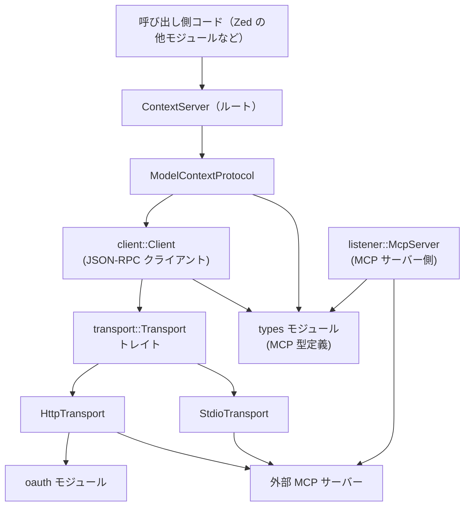
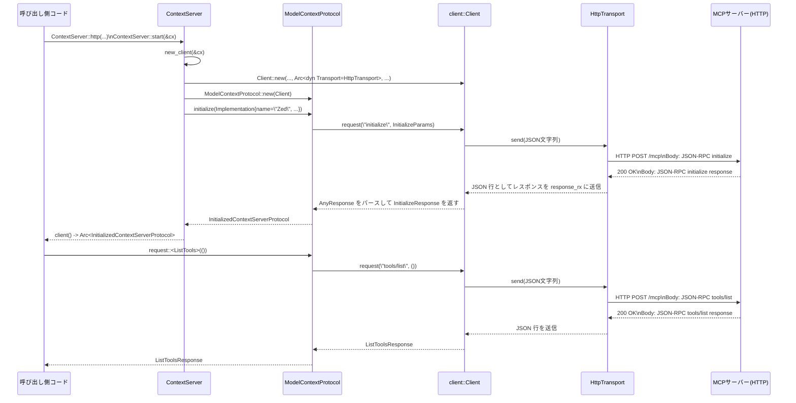

# context_server ディレクトリ

## 0. ざっくり一言

`context_server` クレートは、MCP（Model Context Protocol）サーバーとやり取りするための **クライアント実装と HTTP/OAuth/stdio トランスポート、MCP サーバー側の簡易実装、そして MCP 型定義** をまとめたモジュール群です。

---

## 1. このモジュールの役割

### 1.1 概要

- このディレクトリは **MCP サーバーと Zed 間の通信を扱うための基盤** を提供します。
- MCP サーバーへの接続方法（stdio／HTTP＋SSE）、JSON-RPC ベースのプロトコル処理、OAuth 2.0 認証フローをカバーします。
- 逆に Zed 自身を MCP サーバーとして公開するための `listener::McpServer` も含まれます。
- MCP のメッセージ型・能力表現・ツール定義など、プロトコル上の型は `types.rs` にまとまっています。

### 1.2 アーキテクチャ内での位置づけ

ディレクトリ内の主要モジュールの依存関係は概ね次のようになっています。



- アプリケーション側は主に `ContextServer` と `InitializedContextServerProtocol` を使います。
- それらは内部で `client::Client` と `transport::{HttpTransport, StdioTransport}` を利用し、`types` に定義された MCP 型をシリアライズ／デシリアライズします。
- HTTP 経由の場合は `oauth` モジュールを使って OAuth 2.0 認証やトークンリフレッシュを行います。
- `listener::McpServer` は、Unix ドメインソケット経由で MCP クライアントからの接続を受け付けるサーバー実装です。

### 1.3 設計上のポイント

コードから読み取れる設計上の特徴は次のとおりです。

- **責務分割**
  - `ContextServer`：接続方式の選択と MCP 初期化（initialize）を担当する高レベル API。
  - `client::Client`：トランスポートに依存しない JSON-RPC クライアント。
  - `transport`：`Transport` トレイトと、その実装（HTTP / stdio / テスト用 Fake）。
  - `protocol`：MCP のライフサイクルまわり（initialize など）をラップ。
  - `oauth`：OAuth 2.0（Authorization Code + PKCE）フローとトークン管理。
  - `listener`：Zed 側で MCP サーバーをホストするための簡易サーバー。
  - `types`：MCP のリクエスト／レスポンス／通知／能力などの型。

- **状態管理**
  - `ContextServer` は `RwLock<Option<Arc<InitializedContextServerProtocol>>>` で「初期化済みかどうか」を管理します。
  - `client::Client` は、リクエスト ID カウンタ、レスポンス待ちハンドラ群、通知購読者集合、最後のトランスポートエラーなどを内部状態として持ちます。
  - `HttpTransport` は MCP セッション ID や、オプションの `OAuthTokenProvider` を保持します。
  - `McpOAuthTokenProvider` は `OAuthSession` を `parking_lot::Mutex` で包んでトークン更新を管理します。

- **非同期処理と実行コンテキスト**
  - 非同期実行は `gpui::AsyncApp` と `BackgroundExecutor` に依存しており、`smol` ベースの実行モデルです（tokio などには依存していません）。
  - `Client` は入力／出力／エラー読み取り用のタスクを `AsyncApp` 上に spawn して、トランスポートのストリームとチャネルを橋渡しします。
  - HTTP の SSE ストリームは `smol::spawn` で別タスクとして処理します。

- **エラーハンドリング**
  - 汎用エラーは `anyhow::Result` で返却します。
  - 重要なケースでは型付きエラーを定義しており、特に HTTP トランスポートでは `TransportError::AuthRequired` に downcast することで「OAuth 認証が必要」かどうかを呼び出し側が判定できます。
  - JSON-RPC レベルでは、サーバーからの `error` フィールドを `client::Error` として受け取り、メッセージだけを `anyhow::Error` に変換しています。

- **テストサポート**
  - `test-support` フィーチャでテスト用の `FakeTransport` が有効になり、MCP サーバーの代わりにメモリ内ハンドラで応答させることができます。
  - `oauth` や `HttpTransport` には Fake HTTP クライアントを用いた細かな単体テストが含まれています。

---

## 2. 主要な機能一覧

ディレクトリ全体で提供される主な機能は次のとおりです。

- MCP サーバーとの接続管理
  - `ContextServer::stdio`：ローカルバイナリを起動し、stdio 経由で MCP サーバーに接続。
  - `ContextServer::http`：HTTP(S) エンドポイントに対して MCP over HTTP(+SSE) 接続。

- JSON-RPC ベースのプロトコル処理
  - `client::Client` による JSON-RPC 2.0 リクエスト／レスポンス処理、通知購読。
  - 型安全な MCP リクエスト／通知を行うための `types::{Request, Notification}` トレイトと `requests`／`notifications` モジュール。

- MCP プロトコルの高レベルラッパ
  - `ModelContextProtocol`／`InitializedContextServerProtocol` による `initialize` フローとキャパビリティ判定 (`capable`)。
  - typed request/notify API（`request::<types::requests::ListTools>` など）。

- トランスポート層
  - `transport::Transport` トレイトによる抽象化。
  - `HttpTransport`：HTTP(S)＋SSE 対応、セッション ID 管理、OAuth ベアラートークン付与、401 エラー時のトークンリフレッシュ＋再試行。
  - `StdioTransport`：外部プロセスの stdin/stdout/stderr を JSON 行として扱うトランスポート。
  - `test::FakeTransport`：テスト用のメモリ内トランスポート。

- OAuth 2.0 認証フロー
  - OAuth Protected Resource Metadata / Authorization Server Metadata のディスカバリ。
  - CIMD / Dynamic Client Registration (DCR) のクライアント登録ストラテジ。
  - Authorization Code + PKCE の認可コードフローとトークン交換・リフレッシュ。
  - ループバック HTTP コールバックサーバー（`start_callback_server`）。
  - `McpOAuthTokenProvider` による自動トークン更新と永続化セッション連携。

- MCP サーバー側実装（listener）
  - `listener::McpServer`：Unix ドメインソケットで MCP クライアントからの接続を受け付けるサーバー。
  - `McpServerTool` トレイトと `add_tool` によるツール登録。
  - `handle_request` による任意の MCP リクエスト（例: `initialize`）のハンドラ登録。

- MCP 型定義
  - `types.rs` に MCP 仕様に沿った各種型：
    - `InitializeParams/Response`, `ServerCapabilities`, `Tool`, `CallToolParams/Response`, `Resource*`, `Prompt*`, `Completion*` など。
  - プロトコルバージョン定数 `LATEST_PROTOCOL_VERSION` など。

---

## 3. 主要な機能一覧（補足）

（2章と重複しない範囲で一言リストアップします）

- MCP 通知ハンドリング
  - `client::Client::on_notification` と `NotificationSubscription` による購読と自動解除。

- リクエストのキャンセル／タイムアウト
  - `Client::request_with` と `InitializedContextServerProtocol::request_with` が oneshot キャンセルとタイムアウトをサポート。
  - キャンセル時には `notifications/cancelled` を MCP サーバーに送信。

- 進捗・キャンセル・ルート更新などのクライアント通知型
  - `types::ClientNotification`／`ProgressParams`／`CancelledParams` など。

---

## 4. 関数・構造体の解説

### 4.1 主な構造体・列挙体

| 名前 | 所在 | 種別 | 役割 / 用途 |
|------|------|------|-------------|
| `ContextServerId` | `src/context_server.rs` | 構造体 | コンテキストサーバーを一意に識別する ID（`Arc<str>` のラッパー）。 |
| `ContextServer` | `src/context_server.rs` | 構造体 | MCP サーバーとの接続設定と初期化（initialize）フローを管理する高レベル API。stdio / HTTP / カスタムトランスポートを選択可能。 |
| `ModelContextProtocol` | `src/protocol.rs` | 構造体 | `Client` を包み、MCP の `initialize` メッセージを送る初期プロトコルを実装。 |
| `InitializedContextServerProtocol` | `src/protocol.rs` | 構造体 | `initialize` 完了後のプロトコルハンドル。型付きリクエスト／通知 API と能力判定 (`capable`) を提供。 |
| `ServerCapability` | `src/protocol.rs` | enum | MCP サーバーの機能（Experimental / Logging / Prompts / Resources / Tools）を表す列挙。 |
| `client::Client` | `src/client.rs` | 構造体 | 任意の `Transport` 上で動作する JSON-RPC 2.0 クライアント。リクエスト ID 管理、レスポンス待ち、通知購読を行う。 |
| `client::RequestId` | `src/client.rs` | enum | JSON-RPC の `id` を `i32` または `String` として表現。 |
| `NotificationSubscriptionSet` | `src/client.rs` | 構造体 | 通知メソッドごとのハンドラ集合を管理。 |
| `NotificationSubscription` | `src/client.rs` | 構造体 | 通知購読のハンドル。Drop 時に自動解除される。 |
| `Transport` | `src/transport.rs` | トレイト | `send` / `receive` / `receive_err` を持つトランスポート抽象。HTTP / stdio / Fake で実装。 |
| `HttpTransport` | `src/transport/http.rs` | 構造体 | HTTP(S)＋SSE ベースの MCP トランスポート。セッション ID ヘッダや Bearer トークン付与、401 時の再試行を実装。 |
| `TransportError` | `src/transport/http.rs` | enum | HTTP トランスポート特有のエラー型。現在は `AuthRequired`（OAuth 認証が必要）を持つ。 |
| `StdioTransport` | `src/transport/stdio_transport.rs` | 構造体 | 外部プロセス（MCP サーバー）の stdin/stdout/stderr を JSON 行として扱うトランスポート。 |
| `McpServer` | `src/listener.rs` | 構造体 | Unix ドメインソケット上で MCP プロトコルを話すサーバー。ツール／リクエストハンドラを登録可能。 |
| `McpServerTool` | `src/listener.rs` | トレイト | MCP ツール実装用のトレイト。入力／出力型に JsonSchema を要求し、自動スキーマ生成を行う。 |
| `ToolResponse<T>` | `src/listener.rs` | 構造体 | ツール実装から返すレスポンス（表示用 content と構造化 structured_content）。 |
| `OAuthDiscovery` | `src/oauth.rs` | 構造体 | OAuth ディスカバリ結果（保護リソースメタデータ／認可サーバーメタデータ／選択済みスコープ）。 |
| `OAuthSession` | `src/oauth.rs` | 構造体 | 永続化される OAuth セッション（token_endpoint, resource, client_registration, tokens）。 |
| `OAuthTokens` | `src/oauth.rs` | 構造体 | アクセストークン／リフレッシュトークンと有効期限。 |
| `OAuthTokenProvider` | `src/oauth.rs` | トレイト | HTTP トランスポートが利用するトークン供給インターフェイス。 |
| `McpOAuthTokenProvider` | `src/oauth.rs` | 構造体 | `OAuthSession` に基づきトークンを供給・リフレッシュする実装。 |
| `ProtectedResourceMetadata` / `AuthServerMetadata` | `src/oauth.rs` | 構造体 | OAuth/OIDC のメタデータレスポンス表現。 |
| `WwwAuthenticate` / `BearerError` | `src/oauth.rs` | 構造体 / enum | `WWW-Authenticate: Bearer` ヘッダのパース結果。 |
| `Tool` / `ToolAnnotations` | `src/types.rs` | 構造体 | MCP ツールのメタ情報（名前／説明／入出力スキーマ／注釈）。 |
| `InitializeParams` / `InitializeResponse` | `src/types.rs` | 構造体 | MCP initialize リクエスト／レスポンス型。 |
| `ServerCapabilities` / `ClientCapabilities` | `src/types.rs` | 構造体 | クライアント／サーバーの機能セット記述。 |
| `CallToolParams` / `CallToolResponse` | `src/types.rs` | 構造体 | MCP ツール呼び出しのパラメータと応答。 |
| `MessageContent` / `SamplingMessage` など | `src/types.rs` | enum / 構造体 | LLM メッセージ・サンプリング関連のメッセージ表現。 |
| `ClientNotification` / `ProgressParams` / `CancelledParams` | `src/types.rs` | enum / 構造体 | クライアント→サーバー通知で使う型。 |

### 4.2 重要な関数の詳細（7件）

#### 4.2.1 `ContextServer::stdio(id, command, working_directory) -> Self`

```rust
pub fn stdio(
    id: ContextServerId,
    command: ContextServerCommand,
    working_directory: Option<Arc<Path>>,
) -> Self
```

**概要**

- ローカルの MCP サーバーバイナリを **標準入出力（stdio）経由で起動・接続するための設定** を持つ `ContextServer` を構築します。
- この関数自体はプロセスを起動せず、`ContextServer` の構成情報を組み立てるだけです。実際の起動は `start` で行われます。

**引数**

| 引数名 | 型 | 説明 |
|--------|----|------|
| `id` | `ContextServerId` | このサーバーを識別する ID。ログや管理用に利用されます。 |
| `command` | `ContextServerCommand` | 実行ファイルパス・引数・環境変数・タイムアウト設定などを含むコマンド情報（`settings` クレート由来）。 |
| `working_directory` | `Option<Arc<Path>>` | プロセスのカレントディレクトリ。`None` の場合はデフォルト。 |

**戻り値**

- `ContextServer` インスタンス。まだ初期化されておらず、`client()` は `None` を返します。

**内部処理の流れ**

1. `ContextServer` 構造体を生成し、`configuration` に `ContextServerTransport::Stdio(command, working_directory.map(|p| p.to_path_buf()))` を保持します。
2. `client` フィールドは `RwLock::new(None)` として初期化されます。
3. `request_timeout` はこの時点では `None` に設定されます。

**Examples（使用例）**

```rust
use context_server::{ContextServer, ContextServerId};
use settings::ContextServerCommand;
use std::{sync::Arc, path::Path};

fn build_stdio_server() -> ContextServer {
    // サーバーを識別する ID を作成
    let id = ContextServerId(Arc::from("local-mcp"));

    // 実行する MCP サーバーのコマンド情報
    let command = ContextServerCommand {
        path: "/usr/local/bin/my-mcp-server".into(),
        args: vec!["--mode".into(), "serve".into()],
        env: None,
        timeout: None,
    };

    // 作業ディレクトリ（ここでは省略）
    let working_dir: Option<Arc<Path>> = None;

    // ContextServer インスタンスを構築
    ContextServer::stdio(id, command, working_dir)
}
```

**Errors / Panics**

- この関数自体は `Result` を返さないため、ここではエラーを発生させません。
- 実際のプロセス起動やエラー発生は `start` → `Client::stdio` → `StdioTransport::new` のタイミングで行われます。

**Edge cases（エッジケース）**

- `working_directory` に存在しないパスを指定しても、この関数内では検証されません。`start` での起動時にエラーになります。
- `ContextServerCommand` の `path` が不正な場合も同様です。

**使用上の注意点**

- `stdio` で構築しただけではサーバーは起動していないため、必ず `ContextServer::start` を呼んで初期化する必要があります。
- 同じ `ContextServerId` を複数のインスタンスで使うこと自体は可能ですが、ログ上で区別しづらくなるため、用途に応じて ID を分けると分かりやすくなります。

---

#### 4.2.2 `ContextServer::http(...) -> Result<Self>`

```rust
pub fn http(
    id: ContextServerId,
    endpoint: &Url,
    headers: HashMap<String, String>,
    http_client: Arc<dyn HttpClient>,
    executor: gpui::BackgroundExecutor,
    request_timeout: Option<Duration>,
) -> Result<Self>
```

**概要**

- HTTP(S) ベースで MCP サーバーと通信する `ContextServer` を構築します。
- 内部的には `HttpTransport` を生成し、セッション管理や OAuth ベアラートークン付与を行う準備をします。

**引数**

| 引数名 | 型 | 説明 |
|--------|----|------|
| `id` | `ContextServerId` | サーバー識別子。 |
| `endpoint` | `&Url` | MCP エンドポイントの URL。`http` または `https` スキームのみ許可。 |
| `headers` | `HashMap<String, String>` | 各リクエストに付与する追加ヘッダ（API キーなど）。 |
| `http_client` | `Arc<dyn HttpClient>` | 実際の HTTP 通信を行うクライアント実装。 |
| `executor` | `BackgroundExecutor` | HTTP セッション終了時の後始末などに利用されるバックグラウンド実行器。 |
| `request_timeout` | `Option<Duration>` | JSON-RPC リクエストのタイムアウト。`None` の場合はクライアント側のデフォルト。 |

**戻り値**

- 成功時：HTTP トランスポート設定を持つ `ContextServer`。
- 失敗時：`anyhow::Error`。主に URL スキームが `http/https` 以外の場合にバリデーションエラーとなります。

**内部処理の流れ**

1. `endpoint.scheme()` を確認し、`"http"` または `"https"` なら HTTP トランスポートを構築します。
2. それ以外のスキームの場合は `anyhow::bail!("unsupported MCP url scheme {}", endpoint.scheme())` でエラーを返します。
3. `HttpTransport::new(http_client, endpoint.to_string(), headers, executor)` を呼んでトランスポートを生成します。
4. 得られたトランスポートを `ContextServer::new_with_timeout(id, transport, request_timeout)` に渡し、`ContextServer` インスタンスを返します。

**Examples（使用例）**

```rust
use context_server::{ContextServer, ContextServerId};
use context_server::types;
use collections::HashMap;
use http_client::HttpClient;
use url::Url;
use gpui::AsyncApp;
use std::{sync::Arc, time::Duration};

async fn connect_over_http(
    cx: &AsyncApp,
    http_client: Arc<dyn HttpClient>,
) -> anyhow::Result<()> {
    let id = ContextServerId(Arc::from("remote-mcp"));

    // MCP エンドポイント URL
    let endpoint = Url::parse("https://mcp.example.com/mcp")?;

    // 追加ヘッダ（必要に応じて）
    let mut headers = HashMap::new();
    headers.insert("X-Api-Key".into(), "secret".into());

    // HTTP トランスポート付き ContextServer を構築
    let server = ContextServer::http(
        id,
        &endpoint,
        headers,
        http_client,
        cx.background_executor().clone(),
        Some(Duration::from_secs(60)),
    )?;

    // initialize を実行
    server.start(cx).await?;

    // 初期化済みプロトコルを取得して tools/list を呼び出す例
    let protocol = server.client().expect("server must be initialized");
    let tools: types::ListToolsResponse = protocol
        .request::<types::requests::ListTools>(())
        .await?;

    println!("Tools from server: {:?}", tools.tools);
    Ok(())
}
```

**Errors / Panics**

- `endpoint` のスキームが `http` / `https` でない場合、エラーを返します。
- それ以外のエラー（ネットワーク・HTTP レベル）は、この関数では発生せず、`start` や実際のリクエスト時に発生します。

**Edge cases**

- `headers` に `Authorization` を指定しても、`HttpTransport` 側で OAuth 用の `Authorization: Bearer ...` を上書きする可能性があるため、認証周りと競合させない設計が必要です（コード上は単純に後から設定したヘッダが優先されます）。
- `request_timeout` が `None` の場合、`Client` 側のデフォルトタイムアウト（60秒）が使用されます。

**使用上の注意点**

- OAuth を利用する場合、`HttpTransport` に `OAuthTokenProvider` を別途組み合わせる必要があります（`HttpTransport::new_with_token_provider` を直接使う）。
- 401 応答時に `TransportError::AuthRequired` が返されるため、呼び出し側で `anyhow::Error` を `downcast_ref::<TransportError>()` して認証フローを開始できるようにしておくと良いです。

---

#### 4.2.3 `ContextServer::start(&self, cx: &AsyncApp) -> Result<()>`

```rust
pub async fn start(&self, cx: &AsyncApp) -> Result<()> {
    self.initialize(self.new_client(cx)?).await
}
```

**概要**

- `ContextServer` に設定されているトランスポート（stdio / HTTP / カスタム）をもとに `client::Client` を生成し、MCP の `initialize` メッセージを送って **初期化済みプロトコル** を構築します。
- 成功すると、`self.client()` から `Arc<InitializedContextServerProtocol>` を取得できるようになります。

**引数**

| 引数名 | 型 | 説明 |
|--------|----|------|
| `cx` | `&AsyncApp` | gpui の非同期アプリケーションコンテキスト。内部でタスクを spawn するのに使用。 |

**戻り値**

- 成功時：`Ok(())`。内部状態として `self.client` に初期化済みプロトコルが保存されます。
- 失敗時：`anyhow::Error`。プロセス起動失敗、HTTP エラー、プロトコルバージョン不一致など。

**内部処理の流れ**

1. `new_client(cx)` を呼び出し、`ContextServerTransport` に応じて `client::Client` を生成。
   - `Stdio` 場合：`Client::stdio` を用いて `StdioTransport` を構築し、子プロセスを spawn。
   - `Custom` 場合：既存の `Arc<dyn Transport>` を `Client::new` に渡す。
2. `initialize(client)` を呼び出し、`ModelContextProtocol::new(client)` → `initialize(client_info)` を実行。
   - `client_info` は `types::Implementation { name: "Zed", version: CARGO_PKG_VERSION }`。
   - MCP サーバーから `InitializeResponse` を受け取り、サーバーのプロトコルバージョンや capabilities を検証。
3. `initialize` 成功後、`InitializedContextServerProtocol` を `Arc` で包み、`self.client.write()` に `Some(...)` を保存。
4. 完了ログを出力して `Ok(())` を返す。

**Examples（使用例）**

```rust
use context_server::{ContextServer, ContextServerId};
use context_server::types;
use gpui::{AsyncApp, AppContext as _};
use std::sync::Arc;

// どこかの gpui タスク内の例
async fn use_server(cx: &AsyncApp, server: ContextServer) -> anyhow::Result<()> {
    // initialize フローを走らせる
    server.start(cx).await?;

    // 初期化済みプロトコルを取り出す
    let protocol = server.client().expect("Context server not initialized");

    // 例: tools/list を呼び出す
    let list: types::ListToolsResponse =
        protocol.request::<types::requests::ListTools>(()).await?;
    println!("available tools: {:?}", list.tools);

    Ok(())
}
```

**Errors / Panics**

- `StdioTransport` の生成中にプロセス spawn に失敗した場合（実行ファイルが存在しないなど）、`anyhow::Error` を返します。
- `initialize` のレスポンスでサーバーの `protocol_version` が `ModelContextProtocol::supported_protocols()` に含まれない場合、`anyhow::ensure!` でエラーになります。
- JSON-RPC レベルでエラーが返された場合も `anyhow::Error` として伝搬します。

**Edge cases**

- `start` を複数回呼ぶと、毎回 `new_client` と `initialize` が走りますが、既存のクライアントを明示的に停止する処理はありません（`stop` は `client` フィールドのみを `None` にする）。同時に複数初期化する前提では設計されていません。
- MCP サーバーが initialize 中に終了した場合、`Client` の I/O タスクがエラー終了し、その後のリクエストがキャンセル扱い（`cancelled` エラーや `TransportError`）になります。

**使用上の注意点**

- `start` を呼んだ後は、`client()` が `Some` を返す前提でコードを書くことができますが、エラー時のリトライ戦略は呼び出し側で決める必要があります。
- 非同期コンテキスト `cx` のライフタイムと `ContextServer` のライフタイムを一致させないと、バックグラウンドタスクが途中で止まる可能性があります。

---

#### 4.2.4 `InitializedContextServerProtocol::request<T: Request>(...)`

```rust
pub async fn request<T: Request>(&self, params: T::Params) -> Result<T::Response> {
    self.inner.request(T::METHOD, params).await
}
```

**概要**

- MCP の `types::Request` トレイトを実装した型に対して、**型安全な JSON-RPC リクエスト**を行う高レベル API です。
- 例：`request::<types::requests::ListTools>(())` のように呼び出せます。

**引数**

| 引数名 | 型 | 説明 |
|--------|----|------|
| `params` | `T::Params` | リクエストのパラメータ。`Request` トレイトの関連型。 |

**戻り値**

- 成功時：`T::Response`。`serde` を通じて JSON からデシリアライズされた型安全なレスポンス。
- 失敗時：`anyhow::Error`。ネットワークエラー、JSON パースエラー、サーバーエラーなど。

**内部処理の流れ**

1. `T::METHOD`（`"tools/list"` など）と `params` を `client::Client::request` に渡します。
2. `Client::request` が JSON シリアライズ → リクエスト送信 → レスポンスの JSON を `AnyResponse` としてパース。
3. `AnyResponse` に `error` があれば、`anyhow!(error.message)` としてエラー化。
4. `result` 部分を `serde_json::from_str` で `T::Response` にデシリアライズして返却。

**Examples（使用例）**

```rust
use context_server::types;
use context_server::protocol::InitializedContextServerProtocol;

// `protocol` は initialize 済みと仮定
async fn list_tools(protocol: &InitializedContextServerProtocol) -> anyhow::Result<()> {
    // パラメータなしの MCP リクエストの場合でも、型は `()` で表現される
    let resp: types::ListToolsResponse =
        protocol.request::<types::requests::ListTools>(()).await?;

    for tool in resp.tools {
        println!("tool: {}", tool.name);
    }
    Ok(())
}
```

**Errors / Panics**

- `client::Client::request` からのエラーがそのまま返されます。
  - リクエスト送信エラー（トランスポートエラー）。
  - レスポンス JSON が期待する型に解釈できない場合のパースエラー。
  - JSON-RPC エラーオブジェクトが返ってきた場合（`client::Error` → `anyhow::Error`）。

**Edge cases**

- `Client` にタイムアウト設定がある場合、長時間応答しないリクエストは「Context server request timeout」でエラーになります。
- 401 応答などで HTTP トランスポートが `TransportError::AuthRequired` を返した場合、`anyhow::Error` を `downcast_ref::<TransportError>()` すれば認証が必要か判別できます。

**使用上の注意点**

- キャンセルや任意タイムアウトを扱いたい場合は、`request_with` を使用します。
- `T::Params` / `T::Response` は `Serialize` / `DeserializeOwned` を満たす必要があり、`types::requests` に定義されている型を用いるのが基本です。

---

#### 4.2.5 `McpServer::add_tool<T: McpServerTool + Clone + 'static>(&mut self, tool: T)`

**概要**

- `McpServer` に **新しい MCP ツールを登録**します。
- 入力／出力型から JSON Schema を自動生成し、`tools/list` や `tools/call` リクエストに応答できるようになります。

**引数**

| 引数名 | 型 | 説明 |
|--------|----|------|
| `tool` | `T` | `McpServerTool` を実装したツールオブジェクト。複製可能である必要があります（`Clone`）。 |

`McpServerTool` トレイトは次の関連型とメソッドを持ちます：

```rust
pub trait McpServerTool {
    type Input: DeserializeOwned + JsonSchema;
    type Output: Serialize + JsonSchema;

    const NAME: &'static str;

    fn annotations(&self) -> ToolAnnotations { ... }

    fn run(
        &self,
        input: Self::Input,
        cx: &mut AsyncApp,
    ) -> impl Future<Output = Result<ToolResponse<Self::Output>>>;
}
```

**内部処理の流れ**

1. `schemars::SchemaSettings` に基づいて `T::Input` の JSON Schema を生成。
2. 生成されたスキーマの `"description"` フィールドからツールの説明文字列を取得（`debug_assert!` で存在を期待）。
3. `T::Output` からもスキーマ生成。ただし `T::Output` が `()` の場合は `output_schema: None` とする。
4. `Tool` 構造体を組み立て、`RegisteredTool` に格納。
5. `handler` クロージャを作成：
   - 引数 JSON を `T::Input` にデシリアライズ（または `null` をデフォルト入力として解釈）。
   - `cx.spawn` を使って非同期に `tool.run(input, cx).await` を呼び出し、その結果を `ToolResponse` としてラップ。
6. `self.tools` マップに `T::NAME` をキーとして登録。

**Examples（使用例）**

簡単な「Echo」ツールを登録する例です。

```rust
use context_server::listener::{McpServer, McpServerTool, ToolResponse};
use context_server::types::{ToolAnnotations, ToolResponseContent};
use gpui::AsyncApp;
use schemars::JsonSchema;
use serde::{Deserialize, Serialize};
use anyhow::Result;

// ツールへの入力型
#[derive(Debug, Clone, Deserialize, JsonSchema)]
pub struct EchoInput {
    /// メッセージ本文（ドキュメントコメントは description に反映される）
    pub message: String,
}

// ツールの構造化出力
#[derive(Debug, Serialize, JsonSchema)]
pub struct EchoOutput {
    pub echoed: String,
}

// ツール実装本体
#[derive(Clone)]
pub struct EchoTool;

impl McpServerTool for EchoTool {
    type Input = EchoInput;
    type Output = EchoOutput;

    const NAME: &'static str = "echo";

    fn annotations(&self) -> ToolAnnotations {
        ToolAnnotations {
            title: Some("Echo text".into()),
            read_only_hint: Some(true),
            destructive_hint: None,
            idempotent_hint: Some(true),
            open_world_hint: None,
        }
    }

    fn run(
        &self,
        input: Self::Input,
        _cx: &mut AsyncApp,
    ) -> impl std::future::Future<Output = Result<ToolResponse<Self::Output>>> {
        async move {
            Ok(ToolResponse {
                content: vec![ToolResponseContent::Text {
                    text: format!("Echo: {}", input.message),
                }],
                structured_content: EchoOutput {
                    echoed: input.message,
                },
            })
        }
    }
}
```

`McpServer` への登録は次のようになります。

```rust
async fn setup_server(cx: &AsyncApp) -> anyhow::Result<()> {
    let server_task = McpServer::new(cx); // Task<Result<McpServer>>

    // AsyncApp 内でサーバー生成タスクを待つ
    cx.spawn(async move |cx| {
        let mut server = server_task.await?;
        server.add_tool(EchoTool);
        println!("MCP server socket at {}", server.socket_path().display());
        Ok(())
    }).detach();

    Ok(())
}
```

**Errors / Panics**

- JSON Schema 生成や `serde_json::to_value` でのエラーは `unwrap` を使用している箇所があり、入力／出力型が適切にシリアライズできない場合にパニックする可能性があります。
- 入力 JSON が `T::Input` にデシリアライズできなかった場合は、MCP レスポンスとして JSON-RPC エラー（`CspResult::Error`) が返されます（サーバーはパニックしません）。

**Edge cases**

- `T::Output` が `()` の場合、`output_schema` は `None` となり、ツールは「返り値なし」として扱われます。
- 入力に `arguments: null` または `arguments` フィールド自体が存在しない場合、`serde_json::Value::Null` として `T::Input` にデシリアライズされます。`T::Input` 側で `Option` やデフォルトを使って対応する必要があります。

**使用上の注意点**

- 入力型 `T::Input` の struct に doc コメントを付けることで、スキーマの `"description"` に説明が埋め込まれ、クライアント側の UX が向上します（コードでは `debug_assert!` で存在を期待）。
- 重い処理を行うツールは、`run` の中でブロッキング I/O を避け、非同期 API を利用することが推奨されます。

---

#### 4.2.6 `oauth::discover(http_client, server_url, www_authenticate)`

```rust
pub async fn discover(
    http_client: &Arc<dyn HttpClient>,
    server_url: &Url,
    www_authenticate: &WwwAuthenticate,
) -> Result<OAuthDiscovery>
```

**概要**

- MCP サーバーが返してきた `WWW-Authenticate: Bearer` ヘッダとサーバー URL をもとに、OAuth 2.0 Protected Resource Metadata と Authorization Server Metadata を取得し、**必要なスコープや PKCE, クライアント登録方法を判定**します。
- 成功すると、`OAuthDiscovery` として後続のクライアント登録・認可コードフローに必要な情報が得られます。

**引数**

| 引数名 | 型 | 説明 |
|--------|----|------|
| `http_client` | `&Arc<dyn HttpClient>` | HTTP リクエストを送るためのクライアント。 |
| `server_url` | `&Url` | MCP サーバーのベース URL。 |
| `www_authenticate` | `&WwwAuthenticate` | MCP サーバーが返した `WWW-Authenticate` のパース結果。 |

**戻り値**

- 成功時：`OAuthDiscovery`。`resource_metadata`, `auth_server_metadata`, `scopes` を含みます。
- 失敗時：`anyhow::Error`。メタデータ取得失敗、PKCE 未サポート、登録戦略なしなど。

**内部処理の流れ**

1. `fetch_protected_resource_metadata` を呼び出し、Protected Resource Metadata を取得。
   - `www_authenticate.resource_metadata` があり、かつ MCP サーバーと同一オリジンならそれを優先。
   - なければ `protected_resource_metadata_urls(server_url)` から well-known パス候補を順に試す。
2. 得られた `ProtectedResourceMetadata` から `authorization_servers[0]` を取り出し、その URL を `fetch_auth_server_metadata` に渡して Authorization Server Metadata を取得。
3. `auth_server_metadata.code_challenge_methods_supported` に `"S256"` が含まれていることを確認。なければエラー（PKCE S256 を必須とする MCP 仕様に従う）。
4. `determine_registration_strategy` を呼び出し、CIMD か DCR のいずれかのクライアント登録方法が利用可能か確認。どちらも不可の場合はエラー。
5. `select_scopes(www_authenticate, &resource_metadata)` によってスコープ一覧を選択。
   - まず `WWW-Authenticate` 由来の `scope` を優先。
   - なければ Protected Resource Metadata の `scopes_supported` を利用。
6. `OAuthDiscovery` を組み立てて返却。

**Examples（使用例：擬似コード）**

```rust
use context_server::oauth::{self, OAuthDiscovery, WwwAuthenticate};
use http_client::HttpClient;
use url::Url;
use std::sync::Arc;

// WWW-Authenticate ヘッダをパース済みと仮定
async fn run_discovery(
    http_client: Arc<dyn HttpClient>,
    server_url: &Url,
    www_auth: &WwwAuthenticate,
) -> anyhow::Result<OAuthDiscovery> {
    let discovery = oauth::discover(&http_client, server_url, www_auth).await?;
    println!("auth server: {}", discovery.auth_server_metadata.issuer);
    println!("scopes: {:?}", discovery.scopes);
    Ok(discovery)
}
```

**Errors / Panics**

- Protected Resource Metadata または Authorization Server Metadata の取得に失敗し、全候補 URL がダメだった場合。
- Authorization Server Metadata の `issuer` が期待した `issuer` と異なる場合（なりすまし防止）。
- `code_challenge_methods_supported` に `"S256"` が含まれない、またはフィールド自体が無い場合。
- `authorization_servers` が空の場合。

**Edge cases**

- `www_authenticate.resource_metadata` が MCP サーバーとオリジンが異なる場合は、**クロスオリジン SSRF 防止**のため無視されます。
- SSRF 対策として、`validate_oauth_url` が IP リテラルのプライベートアドレスやメタデータ IP (`169.254.169.254` 等) へのアクセスを禁止しています（ただしドメイン名からの解決までは検査しません）。

**使用上の注意点**

- `discover` の結果だけではブラウザフローは完結せず、別途 `resolve_client_registration` と PKCE 付き認可コードフロー（`build_authorization_url` など）が必要です。
- 多数の HTTP リトライやタイムアウトポリシーは、利用している `HttpClient` 実装側に依存します。

---

#### 4.2.7 `oauth::start_callback_server()`

```rust
pub async fn start_callback_server() -> Result<(
    String,
    futures::channel::oneshot::Receiver<Result<OAuthCallback>>,
)>
```

**概要**

- OAuth Authorization Code フローで利用する **ループバック HTTP コールバックサーバー** を起動し、`redirect_uri` とコールバック結果を受け取る oneshot 受信側を返します。
- ブラウザでの認可フローが完了すると、MCP 側が `redirect_uri?code=...&state=...` の形でアクセスし、その結果が `OAuthCallback { code, state }` として返されます。

**引数**

- なし。

**戻り値**

- 成功時：`(redirect_uri, rx)` のタプル。
  - `redirect_uri: String`：認可リクエストに指定すべきコールバック URI（例: `"http://127.0.0.1:12345/callback"`）。
  - `rx: oneshot::Receiver<Result<OAuthCallback>>`：認可成功時は `Ok(OAuthCallback)`、失敗時は `Err(anyhow::Error)`。タイムアウトやキャンセル時は oneshot の `Canceled` エラーになります。
- 失敗時：ループバックサーバーのバインドに失敗した場合などに `anyhow::Error`。

**内部処理の流れ**

1. `tiny_http::Server::http("127.0.0.1:0")` でエフェメラルポートにバインド。
2. 実際に割り当てられたポートから `redirect_uri` を `"http://127.0.0.1:{port}/callback"` の形式で作成。
3. `futures::channel::oneshot::channel()` で `(tx, rx)` を生成。
4. ブロッキング I/O を扱うため、`std::thread::spawn` で別スレッドを起動。
   - `CALLBACK_TIMEOUT`（2分）を過ぎるまで、`server.recv_timeout(...)` でリクエストを待つ。
   - `tx.is_canceled()` が真になった場合（呼び出し側が `rx` を drop）、即座に停止。
   - 最初のリクエストを受信したら `handle_callback_request` を呼び、`/callback` パスと `code` / `state` クエリパラメータを検証して `OAuthCallback` を生成。
   - 成功なら 200 と成功メッセージ、失敗なら 400 とエラーメッセージの HTML を返し、`tx.send(result)` して終了。

**Examples（使用例：フローの一部）**

```rust
use context_server::oauth::{
    self, build_authorization_url, generate_pkce_challenge, OAuthCallback,
};
use url::Url;
use std::sync::Arc;
use http_client::HttpClient;

async fn run_oauth_flow(
    http_client: Arc<dyn HttpClient>,
    discovery: oauth::OAuthDiscovery,
) -> anyhow::Result<OAuthCallback> {
    // 1. コールバックサーバーを起動
    let (redirect_uri, callback_rx) = oauth::start_callback_server().await?;

    // 2. PKCE チャレンジを生成
    let pkce = oauth::generate_pkce_challenge();

    // 3. 認可 URL を構築
    let resource = oauth::canonical_server_uri(&discovery.resource_metadata.resource);
    let client_id = "client-id-or-cimd-url"; // 実際は resolve_client_registration の結果
    let auth_url = oauth::build_authorization_url(
        &discovery.auth_server_metadata,
        &client_id,
        &redirect_uri,
        &discovery.scopes,
        &resource,
        &pkce,
        "random_state_string",
    );

    // 4. ブラウザを開く（実装依存）
    // open::that(auth_url.as_str())?;

    // 5. コールバックを待つ
    let callback = callback_rx.await??;
    Ok(callback)
}
```

**Errors / Panics**

- ループバックアドレスへのバインドに失敗した場合（他プロセスとの競合など）は `anyhow::Error` を返します。
- コールバック処理中に不正な URL・パス・クエリが来た場合は `Err(anyhow::Error)` を oneshot 経由で返し、ブラウザには 400 ページを表示します。

**Edge cases**

- 認可フローが 2 分以内に完了しない場合、タイムアウトしてスレッドは終了します。その場合 `callback_rx.await` は `Canceled` エラーになります。
- `/callback` 以外のパスにアクセスした場合はエラーになります。
- クエリに `code` や `state` が欠けている、空文字である、あるいは `error` パラメータが含まれている場合もエラー扱いです。

**使用上の注意点**

- `callback_rx` の受信側を drop するとサーバースレッドは早期終了するため、キャンセルのシグナルとして利用できますが、呼び出し側でそのつもりが無いのに drop してしまわないよう注意が必要です。
- 実運用ではブラウザ起動や UI 表示と組み合わせる必要があり、この関数はあくまで低レベルなコールバック受け取り機構のみを提供します。

---

### 4.3 その他の関数・型（概要のみ）

| 名前 | 所在 | 役割（1 行） |
|------|------|--------------|
| `Client::request_with` | `client.rs` | キャンセル用 oneshot や個別タイムアウトを指定して JSON-RPC リクエストを送信し、レスポンスを待つ。 |
| `Client::notify` | `client.rs` | レスポンスを期待しない JSON-RPC 通知を送信する。 |
| `Client::on_notification` | `client.rs` | 指定メソッドの通知を購読し、`NotificationSubscription` を返す。 |
| `HttpTransport::send` | `transport/http.rs` | JSON-RPC メッセージを HTTP 経由で送信し、レスポンス／SSE イベントを内部チャネルに流す。 |
| `CompletionTotal::from_options` | `types.rs` | `has_more` と `total` の組み合わせから補完結果の総数を表す列挙値を決定。 |
| `CallToolResponse::text_contents` | `types.rs` | `ToolResponseContent::Text` のチャンクを結合して 1 本の文字列にするユーティリティ。 |
| `ToolResponseContent::text` | `types.rs` | `ToolResponseContent` のうち `Text` の場合だけ内部の文字列を返すヘルパ。 |
| `FakeTransport` | `test.rs` | `Transport` トレイトのメモリ内実装。メソッドごとにハンドラを登録してテスト用 MCP サーバーを模擬できる。 |

---

## 5. データフロー

### 5.1 代表的なシナリオ：HTTP 経由で MCP サーバーを initialize してリクエストを送る

以下は、HTTP ベースの MCP サーバーに対して `ContextServer` を用いて initialize を行い、その後 `tools/list` リクエストを 1 回送るときのデータフローです。



**要点**

- `ContextServer::start` が新しい `Client` と `ModelContextProtocol` を作り、initialize フローを実行して `InitializedContextServerProtocol` をセットします。
- `Client` は内部の `outbound_tx` キューと `response_handlers` マップを用いて、各リクエスト ID ごとにレスポンスを対応付けます。
- `HttpTransport` は `send` 時に HTTP リクエストを組み立て、`Content-Type` に応じて JSON 応答を 1 回読み取るか、SSE ストリームとして複数メッセージに分割して `response_tx` に流します。
- 呼び出し側は最終的に `InitializedContextServerProtocol::request` から型安全なレスポンスを受け取ります。

---

## 6. 使い方（How to Use）

### 6.1 基本的な使用方法

#### 6.1.1 HTTP ベースの MCP サーバーに接続して tools/list を呼び出す

```rust
use context_server::{ContextServer, ContextServerId};
use context_server::types;
use context_server::protocol::InitializedContextServerProtocol;
use collections::HashMap;
use gpui::{AsyncApp, AppContext as _};
use http_client::HttpClient;
use std::sync::Arc;
use url::Url;

// AsyncApp 内で実行される非同期関数の例
async fn list_tools_over_http(
    cx: &AsyncApp,                                   // gpui の非同期コンテキスト
    http_client: Arc<dyn HttpClient>,               // 呼び出し側で用意した HTTP クライアント
) -> anyhow::Result<()> {
    // 1. ContextServerId を作成
    let server_id = ContextServerId(Arc::from("remote-mcp"));

    // 2. MCP エンドポイント URL を用意
    let endpoint = Url::parse("https://mcp.example.com/mcp")?;

    // 3. 共通ヘッダ（必要なら API キーなどを設定）
    let headers: HashMap<String, String> = HashMap::new();

    // 4. HTTP トランスポート付き ContextServer を構築
    let server = ContextServer::http(
        server_id,
        &endpoint,
        headers,
        http_client,
        cx.background_executor().clone(),
        None,                                        // リクエストタイムアウトはデフォルト（60秒）
    )?;

    // 5. initialize フローを開始（JSON-RPC "initialize" を送信）
    server.start(cx).await?;

    // 6. 初期化済みプロトコルハンドルを取得
    let protocol: Arc<InitializedContextServerProtocol> =
        server.client().expect("Context server not initialized");

    // 7. tools/list リクエストを送信
    let response: types::ListToolsResponse =
        protocol.request::<types::requests::ListTools>(()).await?;

    // 8. 結果利用
    for tool in response.tools {
        println!("tool name: {}", tool.name);
    }

    Ok(())
}
```

### 6.2 よくある使用パターン

#### 6.2.1 ローカルバイナリ（stdio）ベースの MCP サーバーへの接続

```rust
use context_server::{ContextServer, ContextServerId};
use context_server::types;
use gpui::AsyncApp;
use settings::ContextServerCommand;
use std::{sync::Arc, path::Path};

async fn list_tools_over_stdio(cx: &AsyncApp) -> anyhow::Result<()> {
    // 1. サーバー ID とコマンドを準備
    let server_id = ContextServerId(Arc::from("local-mcp"));

    let command = ContextServerCommand {
        path: "/usr/local/bin/my-mcp-server".into(), // 実行ファイルパス
        args: vec!["--serve".into()],                // 引数
        env: None,                                   // 環境変数（必要なら Some(HashMap)）
        timeout: None,                               // プロセス起動のタイムアウト
    };

    let working_dir: Option<Arc<Path>> = None;

    // 2. stdio ベースの ContextServer を構築
    let server = ContextServer::stdio(server_id, command, working_dir);

    // 3. initialize フローを実行
    server.start(cx).await?;

    // 4. 初期化済みプロトコルから ping を送る例
    let protocol = server.client().expect("not initialized");
    protocol.request::<types::requests::Ping>(()).await?;

    Ok(())
}
```

#### 6.2.2 Zed を MCP サーバーとして動かし、ツールを登録する

```rust
use context_server::listener::{McpServer, McpServerTool, ToolResponse};
use context_server::types::{ToolAnnotations, ToolResponseContent};
use gpui::AsyncApp;
use schemars::JsonSchema;
use serde::{Deserialize, Serialize};
use anyhow::Result;

// 入力/出力型
#[derive(Debug, Clone, Deserialize, JsonSchema)]
pub struct SumInput {
    /// 足し合わせる値のリスト
    pub values: Vec<i64>,
}

#[derive(Debug, Serialize, JsonSchema)]
pub struct SumOutput {
    pub sum: i64,
}

// ツール実装
#[derive(Clone)]
pub struct SumTool;

impl McpServerTool for SumTool {
    type Input = SumInput;
    type Output = SumOutput;

    const NAME: &'static str = "sum";

    fn annotations(&self) -> ToolAnnotations {
        ToolAnnotations {
            title: Some("Sum numbers".into()),
            read_only_hint: Some(true),
            destructive_hint: None,
            idempotent_hint: Some(true),
            open_world_hint: None,
        }
    }

    fn run(
        &self,
        input: Self::Input,
        _cx: &mut AsyncApp,
    ) -> impl std::future::Future<Output = Result<ToolResponse<Self::Output>>> {
        async move {
            let total = input.values.iter().copied().sum();
            Ok(ToolResponse {
                content: vec![ToolResponseContent::Text {
                    text: format!("Sum is {}", total),
                }],
                structured_content: SumOutput { sum: total },
            })
        }
    }
}

// サーバーを起動してツールを登録
async fn start_mcp_server(cx: &AsyncApp) -> anyhow::Result<()> {
    let server_task = McpServer::new(cx);      // サーバー生成タスク（Unix ソケットを作る）

    cx.spawn(async move |cx| {
        let mut server = server_task.await?;    // 実際の McpServer を取得
        server.add_tool(SumTool);               // ツールを登録
        println!("MCP socket: {}", server.socket_path().display());
        Ok(())
    }).detach();

    Ok(())
}
```

この `McpServer` に対して、外部の MCP クライアントは `CallTool` リクエストで `sum` ツールを呼び出せるようになります。

#### 6.2.3 OAuth 認証を必要とする HTTP MCP サーバーへの接続（骨子）

1. `ContextServer::http` で HTTP トランスポートを構築し、`HttpTransport::new_with_token_provider` を用いて `McpOAuthTokenProvider` をセットしたトランスポートを作る（この部分は呼び出し側で行う必要があります）。
2. リクエスト送信時に 401 が返されたら、`TransportError::AuthRequired { www_authenticate }` に downcast する。
3. `oauth::discover` → `resolve_client_registration` → `start_callback_server` → `exchange_code` を使ってアクセストークンを取得し、`OAuthSession` を構築する。
4. 取得したセッションで `McpOAuthTokenProvider` を再構築し、それ以降のリクエストでトークンを付与させる。

コード全体は長くなるためここでは省略しますが、`oauth.rs` 内のテストコードが具体的なフロー（ディスカバリ・DCR・トークン交換）を示しています。

### 6.3 使用上の注意点（まとめ）

- **非同期コンテキストと gpui**
  - すべての主要 API（`ContextServer::start`, `McpServer::new`, OAuth の多くの関数）は `AsyncApp` や `BackgroundExecutor` を前提とした `smol` ベースの非同期モデルで設計されています。
  - tokio など他のランタイムと混在させる場合はブロッキング境界やスレッド境界に注意が必要です。

- **ContextServer のライフサイクル**
  - `ContextServer::start` を呼ぶ前に `client()` を使うと `None` が返るため、必ず initialize 完了後に利用する必要があります。
  - `stop` は現在、`client` フィールドを `None` にするだけで、外部プロセスの強制終了などは `StdioTransport` の Drop に任されています。

- **リクエストのキャンセルとタイムアウト**
  - 長時間かかる処理には `InitializedContextServerProtocol::request_with`（内部で `Client::request_with`）を使い、`oneshot::Receiver<()>` でキャンセルを渡すことができます。
  - キャンセル時には MCP サーバーに `notifications/cancelled` が送られますが、サーバー側がそれをどう扱うかは実装依存です。
  - タイムアウトはトランスポートや `request_timeout` に依存しており、デフォルトは 60 秒です。

- **HTTP トランスポートと OAuth**
  - 401 応答が返ってきた場合、`TransportError::AuthRequired` に downcast して `www_authenticate` 情報を取り出すことができます。
  - `validate_oauth_url` により内部ネットワークリソースへの SSRF がある程度防止されていますが、ドメイン名ベースの攻撃は DNS レベルの検証がない限り完全には防げません。

- **MCP サーバー側 (listener::McpServer)**
  - `McpServer::new` は一時ディレクトリ内に Unix ソケットを作成し、そのディレクトリが drop 時に削除されます。`McpServer` が生きている間にソケットパスを他のプロセスに渡して接続させる前提です。
  - ツール入力型の JSON Schema に description を持たせることが前提になっており、ない場合でも動作はしますが `debug_assert!` に引っかかります。

---

## 7. 関連ファイル

| パス | 役割 / 関係 |
|------|------------|
| `context_server/Cargo.toml` | クレート定義。ライブラリエントリを `src/context_server.rs` に指定し、依存関係（gpui, http_client, smol, serde, url, oauth 関連など）を管理。 |
| `context_server/src/context_server.rs` | ルートモジュール。`ContextServer` と `ContextServerId` を定義し、`client`, `listener`, `oauth`, `protocol`, `transport`, `types` モジュールを公開。 |
| `context_server/src/client.rs` | JSON-RPC クライアント実装。`Client`, `RequestId`, エラー型、通知購読機構を提供。`Transport` 抽象に依存。 |
| `context_server/src/listener.rs` | MCP サーバー側実装。`McpServer`, `McpServerTool`, `ToolResponse` などを定義し、Unix ソケットでクライアントからの MCP リクエストを処理。 |
| `context_server/src/oauth.rs` | OAuth 2.0 + PKCE フローと関連ユーティリティ群。ディスカバリ、DCR、トークン交換、トークンリフレッシュ、コールバックサーバー、`McpOAuthTokenProvider` などを提供。 |
| `context_server/src/protocol.rs` | MCP の初期化プロトコルラッパ。`ModelContextProtocol`, `InitializedContextServerProtocol`, `ServerCapability` を定義し、型安全なリクエスト／通知 API を提供。 |
| `context_server/src/test.rs` | `test-support` 機能向けのテストユーティリティ。`FakeTransport` や `create_fake_transport` を定義して、MCP サーバーを模擬。 |
| `context_server/src/transport.rs` | トランスポート抽象のルート。`Transport` トレイトと `http` / `stdio_transport` モジュールを公開。 |
| `context_server/src/transport/http.rs` | HTTP ベースの MCP トランスポート実装。セッション ID, SSE ストリーム処理, OAuth トークン付与／リフレッシュ, `TransportError` を含む。 |
| `context_server/src/transport/stdio_transport.rs` | 外部 MCP サーバーバイナリと stdio 経由で通信するトランスポート。プロセス起動・標準入出力の非同期読み書きを担当。 |
| `context_server/src/types.rs` | MCP プロトコル全般の型定義。`requests`／`notifications` モジュール、Initialize/Tools/Resources/Prompts/Completion などのパラメータ・レスポンス型、Capability 型、通知型を提供。 |

このディレクトリ全体を利用することで、呼び出し側は:

- MCP サーバーへの接続（stdio / HTTP）と初期化、
- 型安全な MCP リクエスト／通知、
- 必要に応じた OAuth 認証フローの実装、
- Zed 側を MCP サーバーとして公開するためのツール定義

を一貫したインターフェイスで扱うことができます。
