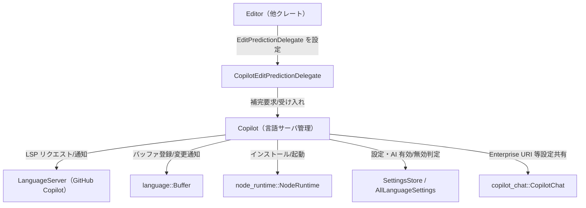
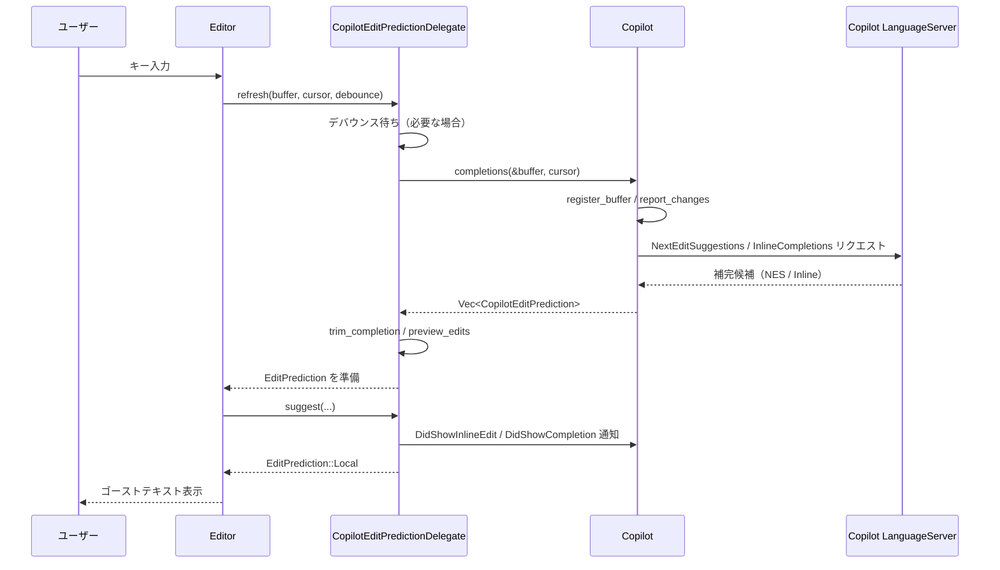

# crates/copilot ディレクトリ コード解説

## 1. ざっくり一言

GitHub Copilot の言語サーバーを Zed エディタ上で動かし、バッファの内容を同期しつつ、インラインの AI 補完（ゴーストテキスト）として提示するための統合モジュール群です。

---

## 2. このモジュールの役割

### 2.1 概要

- このディレクトリは Zed の内部表現（`language::Buffer` や `edit_prediction_types`）と、GitHub Copilot 言語サーバー（LSP）を **橋渡し** する役割を持ちます。
- 具体的には、次のような機能を提供します。
  - Node.js 経由で Copilot 言語サーバーをインストール・起動・停止する。
  - GitHub アカウントへのサインイン状態を管理し、アクションの表示可否を制御する。
  - 編集バッファを LSP に登録し、テキスト変更や保存を通知する。
  - Copilot から返ってくる補完候補を `EditPrediction` として UI に統合し、受け入れ／破棄／テレメトリ送信を行う。

### 2.2 アーキテクチャ内での位置づけ

ファイル間／他クレートとの主な依存関係を簡略化すると次のようになります。



- `copilot/src/copilot.rs`  
  Copilot 言語サーバーのライフサイクルとバッファ同期、サインイン状態管理、コマンドパレット用アクション制御を担当します。
- `copilot/src/copilot_edit_prediction_delegate.rs`  
  Copilot の補完候補を `EditPrediction` インターフェース（ゴーストテキスト機構）にブリッジします。
- `copilot/src/request.rs`  
  Copilot 言語サーバー固有の LSP リクエスト／通知型を定義します。

### 2.3 設計上のポイント

コードから読み取れる設計上の特徴は次の通りです。

- **状態管理の分離**
  - 言語サーバーの状態は `CopilotServer`（`Disabled/Starting/Error/Running`）で表現されます。
  - 認証状態は `SignInStatus`（内部用）とそれを UI 向けに抽象化した `Status` に分離されています。
- **非同期・イベント駆動**
  - `gpui::Task` と `cx.spawn` / `cx.background_spawn` を用いて、LSP との通信やバッファ差分計算を非同期で行います。
  - 設定変更 (`SettingsStore`), プロジェクトのアクティブファイル変更 (`project::Event`), グローバル認証イベント (`GlobalCopilotAuth`) に対して購読を張り、状態を自動更新します。
- **バッファ同期の責務分担**
  - `RegisteredBuffer` が各 `Buffer` のスナップショットと LSP 上のバージョン番号を保持し、`report_changes` を通じて `textDocument/didChange` 通知を生成・送信します。
  - `Copilot` 本体は、どのバッファを LSP に登録しているかを `registered_buffers: HashMap<EntityId, RegisteredBuffer>` で管理します。
- **編集予測との疎結合**
  - `CopilotEditPredictionDelegate` は `EditPredictionDelegate` トレイトだけに依存し、Copilot から得た結果を一般的な `EditPrediction` に変換しています。  
    これにより、他の予測プロバイダと同じ UI・操作体系で扱える構造になっています。
- **LSP プロトコル定義の分離**
  - Copilot 固有の LSP メソッド（`checkStatus`, `signIn`, `textDocument/copilotInlineEdit` など）は `request.rs` に集約され、型レベルで安全に扱われています。
- **外部環境依存の明示**
  - Node.js のバージョンチェック（`ensure_node_version_for_copilot`）や NPM パッケージのインストール（`get_copilot_lsp`）を専用関数に分離し、前提条件をコード上で明示しています。

---

## 3. 主要な機能一覧

このディレクトリ全体が提供する主な機能を列挙します。

- Copilot 言語サーバーの起動・停止・再インストール
- GitHub Copilot 認証状態の管理（サインイン／サインアウト／状態照会）
- AI 機能の有効／無効（`DisableAiSettings`）や言語設定に応じた自動起動制御
- 編集バッファの LSP 登録／更新／解除
  - `textDocument/didOpen`
  - `textDocument/didChange`
  - `textDocument/didSave`
  - `textDocument/didClose`
  - `textDocument/didFocus`
- Copilot からの補完取得
  - Next Edit Suggestions（`textDocument/copilotInlineEdit`）
  - Inline Completions（`textDocument/inlineCompletion`）
  - 2 種類の結果を組み合わせた優先ロジック
- 補完候補の編集予測 (`EditPrediction`) への変換と UI 表示（ゴーストテキスト）
- 補完表示・受け入れのテレメトリ送信
  - `textDocument/didShowInlineEdit`
  - `textDocument/didShowCompletion`
  - Copilot 側 `ExecuteCommand` の実行
- Copilot 設定（プロキシ設定や GitHub Enterprise URI）の LSP への伝達
- Node.js バージョン検証および Copilot 言語サーバー npm パッケージのインストール管理

---

## 4. 関数・構造体の解説

### 4.1 主な型一覧

| 名前 | 定義場所 | 種別 | 役割 / 用途 |
|------|----------|------|-------------|
| `Copilot` | `copilot.rs` | 構造体 | Copilot 言語サーバーの起動・認証・バッファ登録・補完取得などをまとめて管理する中核コンポーネントです。`Entity<Copilot>` として扱われます。 |
| `CopilotServer` | `copilot.rs` | enum | 言語サーバーの全体状態（Disabled / Starting / Error / Running）を表現します。 |
| `RunningCopilotServer` | `copilot.rs` | 構造体 | 実行中の言語サーバーと、その登録バッファ・認証状態を保持します。 |
| `SignInStatus` | `copilot.rs` | enum | 内部用の認証状態（Authorized / Unauthorized / SigningIn / SignedOut）を表し、LSP からの結果と UI 表示用 `Status` の橋渡しをします。 |
| `Status` | `copilot.rs` | enum | UI や他コンポーネント向けの Copilot ステータス。サインインダイアログの表示などに使われます。 |
| `RegisteredBuffer` | `copilot.rs` | 構造体 | LSP に登録済みの 1 つのバッファに対する URI・言語 ID・スナップショットと、変更通知用のタスクを保持します。 |
| `Completion` | `copilot.rs` | 構造体 | （現状このファイル内では直接は使われていませんが）UUID・範囲・テキストからなる Copilot 補完を表すための汎用型です。 |
| `CompletionSource` | `copilot.rs` | enum | 補完が Next Edit Suggestions 由来か Inline Completion 由来かを区別するためのフラグです。 |
| `CopilotEditPrediction` | `copilot.rs` | 構造体 | `EditPredictionDelegate` に渡すための補完情報（バッファ・範囲・テキスト・コマンド・スナップショット・ソース）をまとめた型です。 |
| `GlobalCopilotAuth` | `copilot.rs` | 構造体 (newtype) | `Entity<Copilot>` のグローバルアクセス用ラッパーです。AI 無効設定時の自動破棄／再生成も行います。 |
| `CopilotEditPredictionDelegate` | `copilot_edit_prediction_delegate.rs` | 構造体 | `EditPredictionDelegate` トレイト実装であり、Editor からの要求に応じて Copilot に補完を問い合わせ、ゴーストテキストとして表示します。 |
| `PromptUserDeviceFlow` | `request.rs` | 構造体 | Copilot のデバイスフロー認証用情報（ユーザーコード・完了用コマンド）を表します。 |
| `SignInStatus` | `request.rs` | enum | LSP が返すサインイン状態結果（OK/MaybeOk/AlreadySignedIn/NotAuthorized/NotSignedIn）を表します。 |
| `NextEditSuggestion*` | `request.rs` | 構造体群 | `textDocument/copilotInlineEdit` LSP メソッド向けのパラメータ・結果型です。 |
| `InlineCompletion*` | `request.rs` | 構造体群 | `textDocument/inlineCompletion` LSP メソッド向けのパラメータ・結果型です。 |

### 4.2 重要な関数・メソッド（詳細）

ここでは代表的な 7 つの関数／メソッドの挙動を詳しく説明します。

---

#### 4.2.1 `Copilot::new(...) -> Copilot`

```rust
pub fn new(
    project: Option<Entity<Project>>,
    new_server_id: LanguageServerId,
    fs: Arc<dyn Fs>,
    node_runtime: NodeRuntime,
    cx: &mut Context<Self>,
) -> Self
```

**概要**

- `Copilot` インスタンスを初期化し、必要な購読（アプリ終了・設定変更・プロジェクトイベント・グローバル認証イベント）を登録した上で、条件が整っていれば Copilot 言語サーバーの起動を試みます。

**引数**

| 引数名 | 型 | 説明 |
|--------|----|------|
| `project` | `Option<Entity<Project>>` | アクティブファイルのフォーカス通知（`DidFocus`）を送るためのプロジェクト。ない場合はフォーカス通知を行いません。 |
| `new_server_id` | `LanguageServerId` | 言語サーバー識別用 ID。`AppState` の言語管理から払い出されます。 |
| `fs` | `Arc<dyn Fs>` | Copilot LSP のファイル操作（インストールディレクトリ作成など）に使用する抽象ファイルシステムです。 |
| `node_runtime` | `NodeRuntime` | Node.js 実行と npm 操作を抽象化したランタイムです。 |
| `cx` | `&mut Context<Self>` | `Copilot` エンティティのコンテキスト。購読の登録やタスク生成に使用します。 |

**戻り値**

- 初期化された `Copilot` インスタンス。必要なら `start_copilot(true, false, cx)` によりサーバー起動が開始されています。

**内部処理の流れ**

1. プロジェクトがある場合、`project::Event::ActiveEntryChanged` を購読し、アクティブファイルの絶対パスを LSP の `DidFocus` 通知として送信するハンドラを登録します。
2. すでにグローバルな `GlobalCopilotAuth` が存在する場合、その `Event` を購読し、認証状態の変化時に `CheckStatus` を呼んで `update_sign_in_status` します。
3. アプリ終了イベントに対して `shutdown_language_server` を登録します。
4. フィールドを初期化し、AI が有効かつ言語設定の編集予測プロバイダが Copilot なら `start_copilot(true, false, cx)` でサーバー起動を開始します。
5. `SettingsStore` のグローバル変更を監視し、`DisableAiSettings::disable_ai` の変化に応じてサーバー停止／再起動と設定通知を行います。
6. 自身の状態変化時に `update_action_visibilities` を呼ぶ自己監視を登録します。

**Examples（使用例）**

以下はアプリケーション起動時に `GlobalCopilotAuth` を経由して `Copilot` を初期化するイメージです（実際には他クレートから呼ばれます）。

```rust
// AppState には fs / node_runtime / languages などが入っていると仮定します。 // AppState の準備は別クレート側
fn init_copilot(app_state: Arc<AppState>, app: &mut gpui::App) {           // アプリ起動時の初期化関数
    // AI が有効なら GlobalCopilotAuth が内部で Copilot を生成します。         // 無効なら None が返る
    if let Some(global_auth) = GlobalCopilotAuth::try_get_or_init(app_state, app) { 
        // global_auth.0 が Entity<Copilot> です。                             // ここでは特に何もしなくてもよい
        let _copilot_entity: Entity<Copilot> = global_auth.0.clone();       
    }
}
```

**Errors / Panics**

- このコンストラクタ自体は `Result` を返さず、失敗は内部で `CopilotServer::Error` に状態をセットするか、ログに出力する形になります。
- Node.js や NPM 関連の失敗は、後続の `start_language_server` 内で `Error` 状態として扱われます。

**Edge cases（エッジケース）**

- AI が無効 (`DisableAiSettings::disable_ai == true`) な場合、`start_copilot` は何もせず、サーバーは `Disabled` のままです（テスト `test_copilot_does_not_start_when_ai_disabled` 参照）。
- `project` が `None` の場合、`DidFocus` 通知は送られませんが、その他の機能には影響しません。

**使用上の注意点**

- `Copilot::new` を直接呼ぶよりも、通常は `GlobalCopilotAuth::try_get_or_init` 経由で管理されます。  
  複数回初期化しないようにするためです。
- 設定オブザーバはコンストラクタ内で登録されるため、テストで手動生成する場合（`Copilot::fake` など）と挙動が異なる点に注意が必要です。

---

#### 4.2.2 `Copilot::start_copilot(...)`

```rust
pub fn start_copilot(
    &mut self,
    check_edit_prediction_provider: bool,
    awaiting_sign_in_after_start: bool,
    cx: &mut Context<Self>,
)
```

**概要**

- Copilot 言語サーバーの起動を非同期に開始します。すでに起動済み／無効化されている場合は何もしません。

**引数**

| 引数名 | 型 | 説明 |
|--------|----|------|
| `check_edit_prediction_provider` | `bool` | true の場合、言語設定の `edit_predictions.provider` が Copilot でないと起動しません。 |
| `awaiting_sign_in_after_start` | `bool` | 起動直後に UI 側で「サインイン待ち」として扱うかどうかのフラグです。 |
| `cx` | `&mut Context<Self>` | `Copilot` のコンテキスト。タスク生成・通知に使用します。 |

**内部処理の流れ**

1. `DisableAiSettings::get_global(cx).disable_ai` が true なら即 return（何もしない）。
2. `self.server` が `Disabled` 以外（すでに起動中／エラー／実行中）の場合も何もしない。
3. `all_language_settings(None, cx)` から全言語設定を取得し、`check_edit_prediction_provider` が true かつ `provider != EditPredictionProvider::Copilot` の場合は起動しない。
4. `get_copilot_lsp` 等を呼び出す `start_language_server` を非同期タスクとして `cx.spawn(...).shared()` で起動する。
5. `self.server` を `CopilotServer::Starting { task }` に設定し、`cx.notify()` で再描画を促します。

**Examples（使用例）**

テストコードに近い簡易例です。

```rust
copilot.update(cx, |copilot, cx| {                      // Entity<Copilot> 上で更新クロージャを実行
    // provider のチェックをスキップして強制的に起動を試す                     // （テストなどで利用）
    copilot.start_copilot(false, false, cx);           
});
```

**Errors / Panics**

- 関数自体はエラーを返しません。起動タスク内でエラーが発生した場合は `CopilotServer::Error` に遷移します。
- `ZED_FORCE_COPILOT_ERROR` 環境変数がセットされている場合、正常起動していても強制的に `Error` 状態になります（テスト用途）。

**Edge cases**

- AI が後から有効化された場合でも、`start_copilot` を再度呼ぶことで `Disabled` から `Starting` に遷移します（テスト `test_copilot_starts_when_ai_becomes_enabled` 参照）。
- すでに起動中 (`Starting`) のときに再度呼んでも、二重起動は行われません。

**使用上の注意点**

- 通常のアプリケーションコードはこの関数を直接呼ぶ必要はなく、`Copilot::new` および設定オブザーバが自動で呼び出します。
- 強制再インストールしたい場合は `Copilot::reinstall` を使う方が適切です。

---

#### 4.2.3 `Copilot::completions(...) -> Task<Result<Vec<CopilotEditPrediction>>>`

```rust
pub(crate) fn completions(
    &mut self,
    buffer: &Entity<Buffer>,
    position: Anchor,
    cx: &mut Context<Self>,
) -> Task<Result<Vec<CopilotEditPrediction>>>
```

**概要**

- 指定バッファと位置に対して Copilot に補完（Next Edit Suggestions / Inline Completions）を要求し、最適な候補リストを非同期タスクとして返します。

**引数**

| 引数名 | 型 | 説明 |
|--------|----|------|
| `buffer` | `&Entity<Buffer>` | 補完対象のテキストバッファです。 |
| `position` | `Anchor` | 補完位置を表すアンカー。UTF-16 座標へ変換されます。 |
| `cx` | `&mut Context<Self>` | `Copilot` のコンテキスト。タスク生成などに使用します。 |

**戻り値**

- `Task<Result<Vec<CopilotEditPrediction>>>`  
  非同期に実行されるタスクであり、成功時には `CopilotEditPrediction` のベクタ（0 件以上）が返ります。

**内部処理の流れ**

1. `register_buffer` を呼んで、対象バッファを LSP に登録済みにします（必要なら `didOpen` を送信）。
2. `self.server.as_authenticated()` でサーバーが起動済みかつ認証済みであることを確認します。失敗した場合は即座に `Task::ready(Err(...))` を返します。
3. 対応する `RegisteredBuffer` を取り出し、`pending_snapshot = registered_buffer.report_changes(...)` を呼んで、最新スナップショットとの同期完了を待つ oneshot を得ます。
4. バッファから現在の `snapshot`・タブ幅・ハードタブ設定を取得し、LSP リクエスト用の位置 (`lsp::Position`) を計算します。
5. 言語設定から Next Edit Suggestions (`enable_next_edit_suggestions`) の有効／無効を判定します。
6. 非同期タスク内で以下を実行します。
   - `pending_snapshot.await` で LSP 側に最新差分が送信されるのを待つ。
   - NES が有効なら `NextEditSuggestions` リクエストを、常に `InlineCompletions` リクエストを発行。
   - 各結果を `CopilotEditPrediction` に変換（UTF-16 → `Anchor` 変換を行う）し、2 つのベクタを得る。
   - `select_biased!` を使って「先に返ってきて、かつ非空のもの」があればそれを即返す。
   - どちらも空またはエラーの場合は、両方が揃った時点で NES を優先しつつ結果を決定し、必要なら空ベクタを返す。

**Examples（使用例）**

`CopilotEditPredictionDelegate::refresh` から実際に使われています。単独利用のイメージは次のとおりです。

```rust
// ある Editor コンテキストから、現在バッファとカーソル位置を取得したと仮定します。  // buffer: Entity<Buffer>, anchor: Anchor

let task = copilot_entity.update(cx, |copilot, cx| {                        // Copilot エンティティ上で
    copilot.completions(&buffer, anchor, cx)                                // 補完要求タスクを生成
});

// 非同期コンテキストで結果を待つ                                                     // 実際には gpui のタスク管理を利用
let completions: Vec<CopilotEditPrediction> = task.await?;                  // 取得した候補一覧
```

**Errors / Panics**

- `self.server.as_authenticated()` で失敗した場合（未起動・未認証・エラー状態）は `Err(anyhow!(...))` が返ります。
- 対象バッファが `registered_buffers` に存在しない場合は `Err(anyhow!("buffer not registered"))` が返ります。
- LSP リクエストのエラー自体は `into_response().ok()` で握りつぶされており、その場合は空の補完リストとして扱われます（`unwrap_or_default()`）。

**Edge cases**

- NES が無効な場合、NES 側はただちに空ベクタを返す future に置き換えられ、Inline Completions のみが実行されます。
- 両方の結果が空の場合、最終的に `Ok(vec![])` が返ります。
- スナップショットとの同期 (`report_changes`) が失敗した場合、`pending_snapshot.await?` の時点でエラーとして返されます。

**使用上の注意点**

- この関数は「LSP のバックグラウンド通知との整合性を保った上で補完を取得する」用途向けであり、バッファ更新を飛ばして利用すると不整合な範囲が返る可能性があります。
- 認証済みであることが前提なので、呼び出し前に `Copilot::status().is_authorized()` や `Copilot::is_authenticated()` で確認しておくと安全です。

---

#### 4.2.4 `Copilot::sign_in(...) -> Task<Result<()>>`

```rust
pub fn sign_in(&mut self, cx: &mut Context<Self>) -> Task<Result<()>> { ... }
```

**概要**

- Copilot 言語サーバーに対して `signIn` リクエストを送り、ユーザーの GitHub アカウント認証を開始／再利用するためのメソッドです。

**内部処理の流れ**

1. `self.server` が `Running` でなければ `Task::ready(Err(anyhow!("copilot hasn't started yet")))` を返します。
2. `Running` の場合、`sign_in_status` に応じて動作が変わります。
   - `Authorized`：すでに認証済みなので、即座に `Ok(())` を返すタスク。
   - `SigningIn`：進行中タスクを再利用し、`cx.notify()` で UI 更新を促した上でそのタスクを返します。
   - `SignedOut` / `Unauthorized`：新しいサインインタスクを生成します。
3. 新しいサインインタスクでは次を行います。
   - LSP に `SignIn` リクエストを送り、`PromptUserDeviceFlow`（ユーザーコードなど）を受け取る。
   - 受け取ったフローを `SignInStatus::SigningIn { prompt: Some(flow), task }` に保存し、`cx.notify()` で UI 更新。
   - 失敗した場合は `update_sign_in_status(SignInStatus::NotSignedIn)` を呼び、エラーを `Arc<anyhow::Error>` として格納します。
4. 最終的にエラー型を `anyhow!("...")` に変換した `Task<Result<()>>` を返します。

**Examples（使用例）**

```rust
copilot_entity
    .update(cx, |copilot, cx| copilot.sign_in(cx))           // サインインタスクを取得
    .await?;                                                 // 非同期に完了を待つ
// SignInStatus が OK/AlreadySignedIn などなら、              // update_sign_in_status により Authorized へ更新されます
```

**Errors / Panics**

- サーバーが起動していない場合は `"copilot hasn't started yet"` エラーになります。
- LSP の `signIn` リクエストが失敗した場合、そのエラーが `Err(anyhow!("{err:?}"))` に包まれて返されます。

**Edge cases**

- すでに `SigningIn` 中に再度呼び出した場合、既存タスクを再利用するため、複数の UI から同時に待つことができます。
- サインイン要求後に `update_sign_in_status` が `NotSignedIn` をセットした場合、UI 側から見るとサインイン失敗として扱われます。

**使用上の注意点**

- 実際の UI では `Status::SigningIn { prompt }` を使って「ブラウザでこのコードを入力してください」といった表示を行うことになりますが、その部分の実装は他クレート側にあります。
- サインイン操作はユーザー操作に紐付けて行う必要があり、自動的に何度もリトライするような使い方は想定されていません（コードからは分かりませんが、LSP 側仕様上一般的な前提です）。

---

#### 4.2.5 `CopilotEditPredictionDelegate::refresh(...)`

```rust
fn refresh(
    &mut self,
    buffer: Entity<Buffer>,
    cursor_position: language::Anchor,
    debounce: bool,
    cx: &mut Context<Self>,
)
```

**概要**

- 現在のカーソル位置に対して Copilot から最新の補完候補を取得し、ゴーストテキストとして表示するための `EditPredictionDelegate` メソッドです。

**内部処理の流れ**

1. `debounce` が true の場合、`COPILOT_DEBOUNCE_TIMEOUT`（75ms）のタイマーを待機します。  
   これにより、タイプ中の過剰なリクエスト送信を抑制します。
2. `copilot.update(cx, |copilot, cx| copilot.completions(&buffer, cursor_position, cx))` を呼んで補完タスクを起動し、結果を待ちます。
3. 返ってきた `Vec<CopilotEditPrediction>` から最初の 1 件を取り出します。
4. `trim_completion(&completion, cx)` を呼んで、既存テキストと共通の前後部分を取り除き、「実際に差分として挿入すべき部分」とアンカー範囲・スナップショットを得ます。
5. `Buffer::preview_edits` を使ってプレビューを生成し、その結果とともに `self.completion = Some((completion, preview))` に保存します。
6. `self.pending_refresh = None` とし、`cx.notify()` で UI を更新します。

**Examples（使用例）**

このメソッドは Editor から直接呼ばれます。テストコードでの使用例に近い形は次のようになります。

```rust
// editor 側からのイメージ（実際には Editor のメソッド内）                   // buffer と cursor_anchor は既知とする
delegate.update(cx, |delegate, cx| {                                       // CopilotEditPredictionDelegate エンティティ
    delegate.refresh(buffer.clone(), cursor_anchor, true, cx);            // デバウンス付きでリフレッシュ
});
```

**Errors / Panics**

- 内部で `copilot.completions(...)` が返す `Result` に依存します。エラーが発生した場合は `Task<Result<()>>` 内で `Err` が返り、そのまま外に伝播します。
- `trim_completion` が `None` を返した場合（挿入すべき差分がない／空白のみ）には補完は表示されませんが、エラーにはなりません。

**Edge cases**

- `pending_refresh` が Some かつ `completion` が None の間は `is_refreshing` が true を返し、「現在取得中だがまだ候補がない」状態を表します。
- 補完リストが空の場合や、すべて `trim_completion` で無効と判断された場合、このメソッドの呼び出し後も `self.completion` は `None` のままです。

**使用上の注意点**

- 同じデリゲートに対して連続して `refresh` を呼ぶと、前回の `pending_refresh` タスクは上書きされますが、コード上では古いタスクのキャンセルは行っていません。  
  ただし、結果の適用は最新の更新クロージャ内でのみ行われるため、通常の使用では問題になりにくい設計です。

---

#### 4.2.6 `CopilotEditPredictionDelegate::suggest(...) -> Option<EditPrediction>`

```rust
fn suggest(
    &mut self,
    buffer: &Entity<Buffer>,
    _: language::Anchor,
    cx: &mut Context<Self>,
) -> Option<EditPrediction>
```

**概要**

- 現在保持している Copilot 補完（`self.completion`）を、`EditPrediction` として Editor に渡すためのメソッドです。  
  同時に「表示された」ことを Copilot 言語サーバーにテレメトリ通知します。

**内部処理の流れ**

1. `self.active_completion()` から `(completion, edit_preview)` を取得します。なければ `None`。
2. バッファ ID の一致・範囲アンカーの有効性（`is_valid`）を確認し、不一致／無効なら `None`。
3. `completion.snapshot` から現在のバッファスナップショットへの差分を `interpolate_edits` で計算し、空なら `None`。
4. `self.copilot.update(...)` で `Copilot` にアクセスし、サーバーが認証済み (`as_authenticated`) なら、ソースに応じてテレメトリ通知を送ります。
   - `CompletionSource::NextEditSuggestion`：`DidShowInlineEdit` 通知を送信（コマンド引数を JSON として渡す）。
   - `CompletionSource::InlineCompletion`：`DidShowCompletion` 通知を送信。
5. `EditPrediction::Local` を返却します。`id` は `None`、`cursor_position` は `None`、`edit_preview` は保存済みのプレビューのクローンです。

**Examples（使用例）**

このメソッドは Editor の内部から呼ばれます。簡略化したイメージです。

```rust
let prediction_opt = delegate.update(cx, |delegate, cx| {                 // CopilotEditPredictionDelegate から
    delegate.suggest(&buffer, cursor_anchor, cx)                          // 現在の候補を取り出す
});

if let Some(prediction) = prediction_opt {
    // Editor 側で prediction をゴーストテキストとして扱う                  // （実際の適用ロジックは edit_prediction_types 側）
}
```

**Errors / Panics**

- この関数自体は `Result` を返しません。`server.as_authenticated()` で失敗した場合はテレメトリ通知をスキップするだけで、`EditPrediction` 生成自体は続行されます。

**Edge cases**

- バッファ内容が変わって `completion.range` が無効になった場合（`is_valid` が false）、`None` を返し、補完は表示されません。
- `interpolate_edits` の結果が空のときも `None` になります。これは、バッファの変更により候補が意味をなさなくなったケースに相当します。

**使用上の注意点**

- `suggest` は「すでに取得済みの候補」を返すだけなので、候補取得のトリガーは `refresh` で行う必要があります。
- テレメトリは UI から見えませんが、Copilot 側の品質改善などに利用される可能性があるため、勝手に `suggest` をスキップすると集計に影響する点に注意が必要です（コードからの一般的推測）。

---

#### 4.2.7 `trim_completion(...)`

```rust
fn trim_completion(
    completion: &CopilotEditPrediction,
    cx: &mut App,
) -> Option<(Range<Anchor>, Arc<str>, BufferSnapshot)>
```

**概要**

- Copilot から返ってきた補完テキストから、既にバッファ内に存在する共通の前後部分を取り除き、「実際に挿入すべき差分」の範囲とテキストを計算します。  
  編集予測のゴーストテキストが「本当に追加される部分だけ」を表示するために使われます。

**内部処理の流れ**

1. `completion.buffer.read(cx)` でバッファを取得し、`completion.range` をオフセット範囲に変換します。
2. `common_prefix(...)` を用いて、バッファ上のテキストと補完テキストの共通プレフィックス長（バイト数）を求めます。範囲の `start` に加算します。
3. 同様に、逆方向のイテレータを使って共通サフィックス長を求め、`end` から減算します。
4. プレフィックス・サフィックスを取り除いた `completion_text` を計算し、これが空白のみなら `None` を返します。
5. バッファのスナップショットを取得し、オフセット範囲をスナップショット上の `Range<Anchor>` に変換します。
6. `(completion_range, Arc::from(completion_text), snapshot)` を `Some` として返します。

**Examples（使用例）**

```rust
let (trimmed_range, trimmed_text, snapshot) =
    trim_completion(&completion, cx).expect("非空の差分がある前提");        // 実際には Option チェックが必要
// trimmed_range: 挿入すべきアンカー範囲
// trimmed_text : その範囲に挿入されるテキスト
// snapshot     : 元になったスナップショット
```

**Edge cases**

- 補完テキストがバッファの既存テキストと完全に一致する場合、`completion_text` は空文字列になり、`None` が返されます。
- プレフィックス・サフィックスを取り除いた結果が空白（空行など）だけの場合も `None` になります。  
  これにより、視覚的に意味の薄い補完を表示しないようにしています。
- UTF-8 の文字境界を考慮するために `char::len_utf8()` を用いて長さを計算しています。

**使用上の注意点**

- 返される `BufferSnapshot` はトリミング処理時点のものであり、その後の編集には追随しません。  
  後続処理では `interpolate_edits` などで最新スナップショットに補正する必要があります（実際に `suggest` で行われています）。

---

### 4.3 LSP リクエスト／通知型（`request.rs`）

`request.rs` には Copilot 言語サーバーとやりとりする LSP メソッドが型として定義されています。代表的なものをまとめます。

| 型 | METHOD | 用途 |
|----|--------|------|
| `CheckStatus` / `CheckStatusParams` | `"checkStatus"` | サインイン状態の確認。`SignInStatus`（LSP 側の enum）を返します。 |
| `SignIn` / `SignInParams` / `PromptUserDeviceFlow` | `"signIn"` | デバイスフローによるサインイン開始。ユーザーコードや完了用コマンドを返します。 |
| `SignOut` / `SignOutParams` / `SignOutResult` | `"signOut"` | サインアウト要求。結果は空の構造体です。 |
| `DidChangeStatus` / `DidChangeStatusParams` | `"didChangeStatus"` | サーバー状態の通知。`StatusKind::Normal` 受信をトリガーに `CheckStatus` が呼ばれています。 |
| `SetEditorInfo` / `SetEditorInfoParams` | `"setEditorInfo"` | エディタ名・バージョンとプラグイン情報を Copilot に伝えるためのメソッド（初期化オプションとして渡されています）。 |
| `NextEditSuggestions*` | `"textDocument/copilotInlineEdit"` | NES（Next Edit Suggestions）用のメソッド。テキスト・範囲・コマンドなどを含む編集候補を返します。 |
| `InlineCompletions*` | `"textDocument/inlineCompletion"` | 通常のインライン補完候補を返すメソッド。トリガー種別やフォーマットオプションを指定できます。 |
| `DidFocus` / `DidFocusParams` | `"textDocument/didFocus"` | アクティブなファイルの URI を Copilot に通知します。 |
| `DidShowInlineEdit` / `DidShowInlineEditParams` | `"textDocument/didShowInlineEdit"` | NES 提案がユーザーに表示されたことを報告するテレメトリ通知です。 |
| `DidShowCompletion` / `DidShowCompletionParams` | `"textDocument/didShowCompletion"` | Inline Completion 提案が表示されたことを報告するテレメトリ通知です。 |

---

### 4.4 その他の補助関数（抜粋）

| 関数名 | 定義場所 | 役割（1 行） |
|--------|----------|--------------|
| `id_for_language` | `copilot.rs` | `Language` から LSP の `languageId` 文字列を取得し、なければ `"plaintext"` を返します。 |
| `uri_for_buffer` | `copilot.rs` | ローカルファイルならファイルパスから `lsp::Uri` を生成し、匿名バッファなら `buffer://<id>` 形式の URI を生成します。 |
| `notify_did_change_config_to_server` | `copilot.rs` | Copilot 設定（プロキシ・Enterprise URI）を `DidChangeConfiguration` として LSP に通知し、`copilot_chat` にも共有します。 |
| `clear_copilot_dir` | `copilot.rs` | Copilot のインストールディレクトリを丸ごと削除します。再インストール前に使用されます。 |
| `clear_copilot_config_dir` | `copilot.rs` | `copilot_chat` の設定ディレクトリを削除します。サインアウト時などに利用されます。 |
| `ensure_node_version_for_copilot` | `copilot.rs` | `node --version` の結果からバージョンを解析し、`>= 20.8.0` であることを確認します。 |
| `get_copilot_lsp` | `copilot.rs` | `@github/copilot-language-server` npm パッケージを必要に応じてインストールし、サーバー JS ファイルのパスを返します。 |

---

## 5. データフロー

ここでは、代表的なシナリオ「ユーザーがエディタで入力し、Copilot のゴーストテキストが表示される」までの流れを説明します。

1. ユーザーがエディタでキー入力を行う。
2. Editor はカーソル位置やバッファ内容を元に、編集予測のリフレッシュ（`refresh_edit_prediction` のようなメソッド）を呼び出し、`CopilotEditPredictionDelegate::refresh` が起動される。
3. デリゲートは（必要ならデバウンス後に）`Copilot::completions` を呼び出し、Copilot 言語サーバーに LSP リクエストを送る。
4. Copilot 言語サーバーは、Next Edit Suggestions や Inline Completions を返す。
5. `Copilot::completions` はそれを `CopilotEditPrediction` に変換し、`CopilotEditPredictionDelegate` に渡す。
6. デリゲートは `trim_completion` により余分な共通部分を取り除き、`Buffer::preview_edits` を使ってプレビューを作成する。
7. Editor 側が `suggest` を呼ぶと、`EditPrediction::Local` としてゴーストテキストが表示され、同時に LSP に「表示された」テレメトリが送られる。

この流れを sequence diagram で表すと次のようになります。



---

## 6. 使い方（How to Use）

### 6.1 基本的な使用方法

ここでは、アプリケーション内で Copilot を有効にし、エディタに Copilot ベースの編集予測を組み込むまでの基本的な流れを示します。

#### 1. グローバル Copilot インスタンスの初期化

```rust
use copilot::GlobalCopilotAuth;
use workspace::AppState;
use std::sync::Arc;

// アプリ起動時などに呼び出される初期化コード                         // app_state はアプリ全体の状態
fn init_global_copilot(app_state: Arc<AppState>, app: &mut gpui::App) {
    // AI が有効なら内部で Copilot エンティティが生成される               // 無効なら None が返る
    let _maybe_global = GlobalCopilotAuth::try_get_or_init(app_state, app);
}
```

#### 2. Editor に Copilot ベースの EditPredictionDelegate を設定

テストコードと同様のパターンです。

```rust
use copilot::CopilotEditPredictionDelegate;
use gpui::{AppContext as _, Entity};

// Copilot のグローバルを取得（初期化済み前提）
let global_auth = app
    .try_global::<GlobalCopilotAuth>()
    .expect("Copilot が初期化されている前提");
let copilot_entity: Entity<copilot::Copilot> = global_auth.0.clone();

// Editor 作成後にデリゲートを設定
let copilot_delegate = app.new(|_| CopilotEditPredictionDelegate::new(copilot_entity)); // デリゲートエンティティを生成

editor.update_in(app, |editor, window, cx| {                                    // Editor エンティティ上で
    editor.set_edit_prediction_provider(Some(copilot_delegate), window, cx);    // Copilot を予測プロバイダとして設定
});
```

#### 3. サインイン操作

UI からサインインアクションを呼び出す例です。

```rust
// コマンドやボタン押下時などのハンドラ内
copilot_entity
    .update(cx, |copilot, cx| copilot.sign_in(cx))   // サインイン処理を開始
    .detach();                                       // 結果は内部で状態更新に反映される
```

`Status::SigningIn { prompt }` などを監視することで、ユーザーにデバイスコードを表示する UI を構成できます。

### 6.2 よくある使用パターン

- **AI が無効→有効になったときの動的起動**

  - `DisableAiSettings::disable_ai` が false に変わると、`Copilot::new` 内の設定オブザーバが自動的に `start_copilot` を呼びます。
  - テスト `test_copilot_starts_when_ai_becomes_enabled` でこの挙動が確認されています。

- **サインアウト／サインイン時のバッファ再登録**

  - サインアウト時 (`SignInStatus::NotSignedIn` など) には `update_sign_in_status` 内で全登録バッファが `DidClose` されます。
  - サインイン成功時には、保持している `WeakEntity<Buffer>` を再登録し、`DidOpen` を送り直します（テスト `test_buffer_management` 参照）。

- **Next Edit Suggestions と Inline Completions の共存**

  - デフォルトでは NES が有効（`enable_next_edit_suggestions.unwrap_or(true)`）であり、まず NES を優先して結果を返しつつ、空の場合には Inline Completions の結果を利用します。
  - 設定により NES を無効化したい場合は言語設定側の `copilot.enable_next_edit_suggestions` を操作します（実際の設定定義はこのチャンク外ですが、コードからフィールド名が分かります）。

### 6.3 使用上の注意点（まとめ）

- **前提条件**

  - Node.js のバージョンが `>= 20.8.0` である必要があります。  
    これは `ensure_node_version_for_copilot` で強制されており、満たさない場合はエラーで起動に失敗します。
  - AI 機能が `DisableAiSettings` によって有効化されていること。無効化されていると `start_copilot` は何もしません。
  - 言語設定の `edit_predictions.provider` が Copilot のときのみ自動起動されます（`check_edit_prediction_provider = true` の場合）。

- **認証状態**

  - サインインしていない状態で `completions` を呼ぶと `as_authenticated` が失敗し、エラーが返ります。
  - UI 側からは `Copilot::status()` を参照し、`Status::Authorized` のときだけ補完を試みるのが安全です。

- **バッファのライフサイクル**

  - `Copilot` は `WeakEntity<Buffer>` を `HashSet` で保持し、`observe_release` によりバッファ破棄時に自動的に `DidClose` を送ります。
  - バッファがファイルと紐付けられる（`file_updated`）と、URI が `buffer://` からファイルパスへ変更され、`DidClose` → `DidOpen` のシーケンスが送られる点に注意が必要です。

- **テスト用途の挙動**

  - 環境変数 `ZED_FORCE_COPILOT_ERROR` がセットされていると、起動成功後でも強制的に `Error` 状態になります（エラー経路のテスト用）。
  - `Copilot::fake` と `lsp::FakeLanguageServer` によって、実際の Node.js やネットワークなしでユニットテストを行うことができます。

---

## 7. 関連ファイル

このディレクトリおよび周辺で、Copilot 機能と密接に関係するファイル／クレートをまとめます。

| パス / クレート | 役割 / 関係 |
|-----------------|------------|
| `copilot/Cargo.toml` | このクレートの依存関係・テストサポート機能の定義。`gpui`, `language`, `node_runtime`, `edit_prediction_types` など多くの内部クレートに依存しています。 |
| `copilot/src/copilot.rs` | Copilot 言語サーバーの管理・バッファ同期・認証状態管理・アクション可視性制御など、このクレートの中核となるロジックが実装されています。 |
| `copilot/src/copilot_edit_prediction_delegate.rs` | `EditPredictionDelegate` 実装として、Editor と Copilot の間で補完候補とテレメトリをやり取りします。多くのエディタ挙動テストもここに含まれています。 |
| `copilot/src/request.rs` | Copilot 固有の LSP メソッド（`checkStatus`, `signIn`, `textDocument/copilotInlineEdit`, `textDocument/inlineCompletion` など）を型安全に扱うための定義群です。 |
| `copilot_chat` クレート | `notify_did_change_config_to_server` で参照され、Copilot Chat 側の設定（Enterprise URI など）を共有します。 |
| `edit_prediction_types` クレート | `EditPrediction`, `EditPredictionDelegate`, `interpolate_edits` などの共通インターフェースを提供し、Copilot を他の予測プロバイダと同じ仕組みで扱うために利用されています。 |
| `language` クレート | `Buffer`, `Anchor`, `BufferSnapshot` などのテキストモデルと、LSP 位置変換 (`ToPointUtf16`, `point_to_lsp`, `point_from_lsp`) を提供します。 |
| `node_runtime` クレート | Node.js 実行パスや npm パッケージ管理 (`npm_install_packages` など) を抽象化し、Copilot 言語サーバーのインストールと起動に使用されます。 |
| `gpui` クレート | `Entity`, `Task`, `Context`, `App`, `Subscription` などの UI/アプリケーション基盤を提供し、本クレートの非同期処理とライフサイクル管理の土台になっています。 |

このチャンクに含まれないファイルやクレート（`editor`, `project`, `settings` など）も Copilot 機能の全体像には関わりますが、詳細な挙動はそれぞれの定義側で確認する必要があります。
