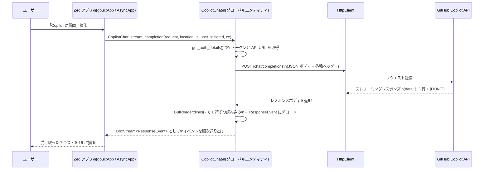

# crates/copilot_chat ディレクトリ解説

## 1. ざっくり一言

Zed 向けの GitHub Copilot Chat クライアントです。  
GitHub Copilot の `/models` / `/chat/completions` / `/responses` と Anthropic の `/v1/messages` API に対して、トークン管理・エンドポイント解決・リクエスト/レスポンス型・ストリーミング処理をまとめて提供します。

---

## 2. このモジュールの役割

### 2.1 概要

このディレクトリは、Zed 内から Copilot Chat を利用するための **HTTP クライアント層** を提供します。

- GitHub Copilot 用の OAuth トークンを環境変数や設定ディレクトリから取得し、変更を監視します。
- GraphQL を通して Copilot の API エンドポイントを発見し、利用可能なモデル一覧を取得・フィルタリングします。
- Chat Completions API・Responses API・Anthropic Messages API へのリクエスト/レスポンス型を定義し、ストリーミングレスポンスを `BoxStream` としてアプリ側に渡します。
- 呼び出し元（Zed の UI やエージェント）が利用しやすいよう、`CopilotChat` というグローバルなサービスオブジェクトとして公開します。

### 2.2 アーキテクチャ内での位置づけ

主なモジュール・外部依存との関係を簡略化して示します。

```mermaid
graph TD
    App["Zed アプリ (gpui::App)"]
    Global["CopilotChat グローバル\n(gpui::Entity<CopilotChat>)"]
    ResponsesMod["responses モジュール\n(responses.rs)"]
    Http["HttpClient\n(http_client::HttpClient)"]
    Settings["設定監視\nsettings::watch_config_dir"]
    ConfigFiles["設定ファイル\nhosts.json / apps.json"]
    Env["環境変数\nGH_COPILOT_TOKEN"]
    CopilotAPI["GitHub Copilot API\n(/graphql, /models,\n/chat/completions, /responses)"]
    AnthropicAPI["Anthropic API\n(/v1/messages)"]

    App -->|init() 呼び出し| Global
    Global -->|watch_config_dir| Settings
    Settings --> ConfigFiles
    Global --> Http
    Global --> ResponsesMod
    Global --> CopilotAPI
    Global --> AnthropicAPI
    Env --> Global
```

- `copilot_chat.rs` が crate のメインモジュールで、`responses` サブモジュールを内部的に利用します。
- HTTP 通信はすべて `http_client::HttpClient` 経由で行われます。
- 認証情報は環境変数 `GH_COPILOT_TOKEN` と設定ディレクトリ `github-copilot/hosts.json` / `apps.json` から取得されます。

### 2.3 設計上のポイント

コードから読み取れる設計上の特徴は次のとおりです。

- **グローバルなサービスオブジェクト**
  - `CopilotChat` は `gpui::Global` + `gpui::Entity` でアプリ全体から参照可能なシングルトンとして管理されています。
- **トークン・設定ファイルの自動監視**
  - `settings::watch_config_dir` により Copilot 設定ディレクトリを監視し、トークンファイルの変更を検知して `CopilotChat` の `oauth_token` を更新します。
- **API エンドポイントの自動発見とフォールバック**
  - GitHub GraphQL API (`viewer{ copilotEndpoints{ api } }`) から Copilot API ベース URL を取得し、失敗した場合は固定の `https://api.githubcopilot.com` にフォールバックします。
- **堅牢なモデルスキーマのデコード**
  - `/models` のレスポンスは一旦 `serde_json::Value` として受け取り、個々のモデルのデコードに失敗してもログに出してスキップする形で耐障害性を確保しています。
  - 未知のベンダーやエンドポイントは `Unknown` として扱い、将来の拡張に備えています。
- **ストリーミングレスポンスの SSE 風処理**
  - 各 API は `BufReader::lines()` を使って `"data: ..."` 行ごとに JSON をデコードし、`[DONE]` 行でストリーム終了とする SSE 風プロトコルを共通化しています。
- **コンテキストに応じたヘッダー付与**
  - `ChatLocation` やユーザ起点かどうか（`is_user_initiated`）に応じて `X-Initiator` や `X-Interaction-Type`, `OpenAI-Intent` ヘッダーが付与されます。
  - 画像を含むリクエストでは `Copilot-Vision-Request` ヘッダーを自動で付与します。

---

## 3. 主要な機能一覧

このディレクトリが提供する主な機能は次のとおりです。

- CopilotChat の初期化とグローバル登録 (`init`)
- Copilot 設定ディレクトリの決定とトークンファイルパスの管理
  - `copilot_chat_config_dir`, `copilot_chat_config_paths`, `extract_oauth_token`
- OAuth トークンの監視と保持 (`CopilotChat::new` 内の監視タスク)
- Copilot API ベース URL の自動発見
  - `discover_api_endpoint`, `CopilotChat::resolve_api_endpoint`, `CopilotChat::get_auth_details`
- 利用可能なモデル一覧の取得とフィルタリング
  - `request_models`, `get_models`, `Model` と関連型
- Chat Completions API とのストリーミング通信
  - リクエスト型: `Request`, `ChatMessage`, `Tool` など
  - レスポンス型: `ResponseEvent`, `ResponseChoice` など
  - 通信関数: `CopilotChat::stream_completion`, 内部関数 `stream_completion`
- Responses API とのストリーミング通信
  - リクエスト型: `responses::Request`, `ResponseInputItem` など
  - レスポンス型: `responses::StreamEvent`, `Response` など
  - 通信関数: `CopilotChat::stream_response`, `responses::stream_response`
- Anthropic Messages API とのストリーミング通信
  - 通信関数: `CopilotChat::stream_messages`, 内部関数 `stream_messages`
- API 共通ヘッダーの構築とコンテキスト情報の付加
  - `copilot_request_headers`, `ChatLocation::to_intent_string`
- モデル能力情報の提供
  - `Model::uses_streaming`, `supports_tools`, `supports_response`, `supports_messages`, `supports_thinking` などの判定メソッド

---

## 4. 関数・構造体の解説

### 4.1 型一覧（主な構造体・列挙体）

| 名前 | 種別 | 定義場所 | 役割 / 用途 |
|------|------|----------|-------------|
| `CopilotChatConfiguration` | 構造体 | `copilot_chat.rs` | Enterprise 用 URI など Copilot Chat 接続設定を保持し、GraphQL / models / chat / responses / messages 各 URL を生成します。 |
| `ChatLocation` | enum | `copilot_chat.rs` | チャットがどのコンテキスト（パネル・エディタ・ターミナル等）から呼ばれたかを表し、HTTP ヘッダーの `X-Interaction-Type` / `OpenAI-Intent` に反映されます。 |
| `Model` | 構造体 | `copilot_chat.rs` | `/models` エンドポイントから返される 1 つのモデル情報を表し、コンテキスト長・ベンダー・対応エンドポイント等のメタデータを保持します。 |
| `ModelVendor` | enum | `copilot_chat.rs` | モデルのベンダー（OpenAI, Anthropic, Google, XAI など）を表します。未知ベンダーは `Unknown` になります。 |
| `ModelSupportedEndpoint` | enum | `copilot_chat.rs` | モデルがサポートする API エンドポイント（`/chat/completions`, `/responses`, `/v1/messages`, それ以外は `Unknown`）を表します。 |
| `Request` | 構造体 | `copilot_chat.rs` | Chat Completions API 用のリクエスト型です。モデル名、メッセージ列、ツール定義、ストリーミング設定等を含みます。 |
| `ChatMessage` | enum | `copilot_chat.rs` | チャットメッセージ（`assistant`, `user`, `system`, `tool` ロール）を表します。 |
| `ChatMessageContent` | enum | `copilot_chat.rs` | メッセージ本文を表し、単純な文字列 (`Plain`) と複数のパート (`Multipart`) のどちらかを持ちます。 |
| `ChatMessagePart` | enum | `copilot_chat.rs` | メッセージ中の 1 パート（テキスト or 画像 URL）を表します。画像を含むことで Vision リクエストとして扱われます。 |
| `Tool`, `Function`, `ToolChoice` | enum / 構造体 | `copilot_chat.rs` | OpenAI 互換の「ツール呼び出し」定義と、その使用方法 (`auto`, `required`, `none`) を表します。 |
| `ToolCall`, `ToolCallContent`, `FunctionContent` | 構造体 / enum | `copilot_chat.rs` | モデル側から返されるツール呼び出し（名前・引数など）を表します。 |
| `ResponseEvent` | 構造体 | `copilot_chat.rs` | Chat Completions ストリーミングで 1 行分のイベントを表します。複数の `ResponseChoice` を含みます。 |
| `ResponseChoice`, `ResponseDelta` | 構造体 | `copilot_chat.rs` | レスポンス中の各候補とその差分（トークン追加、ツール呼び出し情報など）を表します。 |
| `CopilotChat` | 構造体 | `copilot_chat.rs` | OAuth トークン・API エンドポイント・モデル一覧・`HttpClient` を保持する、この crate の中核サービスです。 |
| `responses::Request` | 構造体 | `responses.rs` | Responses API 用リクエスト。`input` にメッセージや関数呼び出し等を配列で渡します。 |
| `ResponseInputItem` | enum | `responses.rs` | Responses API の入力要素（Message, FunctionCall, FunctionCallOutput, Reasoning）を表します。 |
| `responses::StreamEvent` | enum | `responses.rs` | Responses API の SSE イベント（created / output_item.added / completed 等）を表します。 |
| `responses::Response` | 構造体 | `responses.rs` | 非ストリーミング Responses API 呼び出し時に返されるレスポンス全体の構造です。 |
| `ResponseOutputItem`, `ResponseOutputContent` | enum | `responses.rs` | Responses API からの出力要素（メッセージ、関数呼び出し、推論など）とそのテキスト等を表します。 |
| `ReasoningConfig`, `ReasoningSummary` | 構造体 / enum | `responses.rs` | Responses API の推論出力（thinking）のモードや要約レベルを指定します。 |
| `ResponseIncludable` | enum | `responses.rs` | レスポンスで追加的に含めたい情報（暗号化された reasoning コンテンツなど）を指定します。 |

他にも補助的な型がありますが、主要な API の理解には上記が中心になります。

### 4.2 重要な関数の詳細（7 件）

#### `init(fs: Arc<dyn Fs>, client: Arc<dyn HttpClient>, configuration: CopilotChatConfiguration, cx: &mut App)`

**概要**

- `CopilotChat` エンティティを生成し、`gpui::Global` としてアプリケーションに登録します。
- 以後は `CopilotChat::global(cx)` を通じてアプリ全体からアクセスできます。

**引数**

| 引数名 | 型 | 説明 |
|--------|----|------|
| `fs` | `Arc<dyn Fs>` | 設定ディレクトリ監視に用いるファイルシステム抽象です。 |
| `client` | `Arc<dyn HttpClient>` | すべての HTTP 通信に利用するクライアントです。 |
| `configuration` | `CopilotChatConfiguration` | Enterprise URI など、Copilot Chat 接続設定です。 |
| `cx` | `&mut App` | `gpui::App` のコンテキスト。エンティティ生成とグローバル登録に使われます。 |

**戻り値**

- なし。副作用として `CopilotChat` エンティティを作成・登録します。

**内部処理の流れ**

1. `cx.new` を用いて `CopilotChat::new` を呼び出し、`gpui::Entity<CopilotChat>` を作成する。
2. `App::set_global` 経由で `GlobalCopilotChat` として登録する。
3. 以降、`CopilotChat::global(cx)` で同一インスタンスにアクセス可能になります。

**Examples（使用例）**

```rust
use std::sync::Arc;
use copilot_chat::{self, CopilotChatConfiguration};
use fs::Fs;
use http_client::HttpClient;
use gpui::App;

// アプリ起動時などに CopilotChat を初期化する関数
fn setup_copilot_chat(
    app: &mut App,                        // gpui のアプリケーションコンテキスト
    fs: Arc<dyn Fs>,                      // ファイルシステム実装
    http_client: Arc<dyn HttpClient>,     // HTTP クライアント実装
) {
    let config = CopilotChatConfiguration::default(); // Enterprise なしのデフォルト設定

    // CopilotChat エンティティを作成してグローバル登録する
    copilot_chat::init(fs, http_client, config, app);
}
```

**Errors / Panics**

- 関数自体は `Result` を返さず、内部で panic を発生させるコードもありません。
- ただし、`CopilotChat::new` 内の非同期タスクで `dirs::data_local_dir()` の失敗などによる panic が起こりうる可能性はあります（`copilot_chat_config_dir` 内の `expect`）。

**Edge cases（エッジケース）**

- `init` を複数回呼び出した場合の挙動は、このチャンクからは分かりません（`App::set_global` の仕様依存です）。

**使用上の注意点**

- `CopilotChat::stream_*` 系を呼び出す前に必ず 1 回は `init` を実行しておく必要があります。
- `fs` や `HttpClient` のライフタイムはアプリ全体と同程度を想定しています。

---

#### `copilot_chat_config_dir() -> &'static PathBuf`

**概要**

- Copilot の設定ディレクトリ（`github-copilot` ディレクトリ）のパスを、一度だけ計算して再利用します。

**戻り値**

- Copilot 設定ディレクトリへの絶対 `PathBuf` 参照。

**内部処理の流れ**

1. `OnceLock<PathBuf>` を用いて最初の呼び出し時のみパスを計算します。
2. Windows の場合:
   - `dirs::data_local_dir()` をベースディレクトリとし、`github-copilot` を連結。
3. それ以外の OS の場合:
   - `XDG_CONFIG_HOME` 環境変数があればそこを、なければ `home_dir().join(".config")` をベースとし、`github-copilot` を連結。
4. 以降の呼び出しは同じ `PathBuf` を返します。

**Examples（使用例）**

```rust
use copilot_chat::copilot_chat_config_dir;

// 設定ディレクトリの場所をログに出す例
fn log_config_dir() {
    let dir = copilot_chat_config_dir();      // 設定ディレクトリのパスを取得
    log::info!("Copilot config dir = {}", dir.display());
}
```

**使用上の注意点**

- Windows では `dirs::data_local_dir()` が `None` の場合に `expect` で panic します。
- 実行ユーザのホームディレクトリや環境変数に依存するため、テスト環境では適宜モックや一時ディレクトリを使う必要があります。

---

#### `CopilotChat::stream_completion(request: Request, location: ChatLocation, is_user_initiated: bool, mut cx: AsyncApp) -> Result<BoxStream<'static, Result<ResponseEvent>>>`

**概要**

- GitHub Copilot の Chat Completions 互換エンドポイントに対してリクエストを送り、レスポンスを `ResponseEvent` のストリームとして返します。
- `request.stream` が `true` の場合はストリーミング、`false` の場合は一括レスポンスを 1 つだけ流すストリームになります。

**引数**

| 引数名 | 型 | 説明 |
|--------|----|------|
| `request` | `Request` | モデル名・メッセージ列・ツール定義などを含むチャットリクエスト。 |
| `location` | `ChatLocation` | チャットが行われる場所（パネル・エディタなど）。HTTP ヘッダーに反映されます。 |
| `is_user_initiated` | `bool` | ユーザー操作起点かエージェント起点かを表し、`X-Initiator` ヘッダーに使用されます。 |
| `cx` | `AsyncApp` | 非同期コンテキスト。内部でグローバル `CopilotChat` にアクセスするために使用します。 |

**戻り値**

- `Ok(BoxStream<'static, Result<ResponseEvent>>)`:
  - ストリーミングの場合: 各 `"data: {...}"` 行ごとに `ResponseEvent` を流すストリーム。
  - 非ストリーミングの場合: レスポンス全体の `ResponseEvent` が 1 回だけ流れるストリーム。
- エラー時は `Err(anyhow::Error)`。

**内部処理の流れ**

1. `CopilotChat::get_auth_details` を呼び出し、以下を取得する。
   - OAuth トークン
   - API ベース URL
   - HTTP クライアント
   - 設定 (`CopilotChatConfiguration`)
2. 設定から `chat_completions_url` を組み立てる。
3. 内部関数 `stream_completion(...)` を呼び出し、実際の HTTP 通信とストリーム生成を任せる。

内部の `stream_completion` は次のように動作します。

1. リクエストに画像 (`ChatMessagePart::Image`) が含まれているかを検査し、含まれていれば `Copilot-Vision-Request` ヘッダーを付与する。
2. `copilot_request_headers` を使って共通ヘッダー（Authorization など）を付与し、POST リクエストを構築する。
3. HTTP ステータスが成功でなければレスポンスボディを読み出し、エラーとして返す。
4. `request.stream` が `true` の場合:
   - レスポンスボディを `BufReader::new` し、`lines()` で 1 行ずつ読む。
   - 行が `"data: "` で始まる場合のみ JSON 部分を取り出す。
   - `"[DONE]"` 行でストリーム終了とする。
   - JSON を `ResponseEvent` にデシリアライズし、`choices` が空でなければ `Ok(ResponseEvent)` としてストリームに流す。
5. `request.stream` が `false` の場合:
   - ボディ全体を読み出し、`ResponseEvent` にデシリアライズする。
   - それを 1 要素だけ持つストリームとして返す。

**Examples（使用例）**

以下は、ユーザーからの簡単な質問をストリーミングで送信し、イベントを順次処理する例です（周辺の UI コードは含まれていません）。

```rust
use copilot_chat::{
    CopilotChat, Request, ChatMessage, ChatMessageContent, ChatLocation,
};
use gpui::AsyncApp;
use futures::StreamExt; // next() を使うため

// 非同期コンテキストで Copilot へのチャットを行う例
async fn ask_copilot(mut cx: AsyncApp) -> anyhow::Result<()> {
    // ユーザーメッセージを 1 件だけ含むリクエストを作成
    let request = Request {
        n: 1,                                      // 返してほしい候補数
        stream: true,                              // ストリーミング有効
        temperature: 0.2,                          // 出力の多様性
        model: "gpt-4o".to_string(),               // 使用するモデル ID
        messages: vec![ChatMessage::User {
            content: ChatMessageContent::from(
                "こんにちは、Zed について教えてください。".to_string()
            ),                                     // テキストメッセージ
        }],
        tools: vec![],                             // ツール呼び出しは未使用
        tool_choice: None,                         // 自動選択
        thinking_budget: None,                     // thinking 機能は未指定
    };

    // パネルからユーザーが明示的に開始したと仮定
    let stream = CopilotChat::stream_completion(
        request,
        ChatLocation::Panel,
        true,                                      // ユーザー起点
        cx,
    ).await?;

    futures::pin_mut!(stream);                    // Stream をピン留め

    // ストリームからイベントを受け取り続ける
    while let Some(event_result) = stream.next().await {
        let event = event_result?;                // デコードエラー等をここで処理

        // event.choices の content/delta からテキストを取り出し、UI に反映する
        for choice in event.choices {
            if let Some(delta) = choice.delta {
                if let Some(text) = delta.content {
                    println!("partial: {}", text); // 実際にはエディタ UI に表示
                }
            }
        }
    }

    Ok(())
}
```

**Errors / Panics**

- `CopilotChat::get_auth_details` 内で:
  - グローバル `CopilotChat` が未登録の場合: `"Copilot chat is not enabled"` というコンテキスト付きエラーになります。
  - `oauth_token` が存在しない場合: `"No OAuth token available"`。
- HTTP ステータスが成功でない場合:
  - ボディ内容とステータスコードを含むエラー（`"Failed to connect to API: ..."`）を返します。
- ストリーミング中に JSON デコードが失敗した場合:
  - `Err(anyhow!(error))` としてストリーム要素にエラーを流します。

**Edge cases（エッジケース）**

- レスポンス行が `"data: "` で始まらない場合、その行は無視されます。
- `[DONE]` でストリームが終了し、それ以降の行は処理されません。
- `ResponseEvent` の `choices` が空のものはストリームに出さないため、結果として何も来ないケースもありえます。

**使用上の注意点**

- `init` でグローバル `CopilotChat` を設定し、OAuth トークンが取得済みであることが前提です。
- 非ストリーミングでも返り値はストリームなので、常に `Stream` として扱う実装になっています。
- 画像を含むメッセージを送ると `Copilot-Vision-Request` ヘッダーが自動で付与されますが、画像の内容そのものの制限などはこのチャンクからは分かりません。

---

#### `CopilotChat::stream_response(request: responses::Request, location: ChatLocation, is_user_initiated: bool, mut cx: AsyncApp) -> Result<BoxStream<'static, Result<responses::StreamEvent>>>`

**概要**

- GitHub Copilot の **Responses API**（OpenAI の Responses エンドポイント互換）に対してリクエストを送り、`responses::StreamEvent` のストリームとして結果を返します。

**引数**

| 引数名 | 型 | 説明 |
|--------|----|------|
| `request` | `responses::Request` | Responses API 用のリクエスト。`input` にメッセージや関数呼び出しなどを指定します。 |
| `location` | `ChatLocation` | チャットコンテキスト。 |
| `is_user_initiated` | `bool` | ユーザー起点かどうか。 |
| `cx` | `AsyncApp` | 非同期コンテキスト。 |

**戻り値**

- `Ok(BoxStream<'static, Result<responses::StreamEvent>>)`:
  - ストリーミング時: SSE イベントを順次 `StreamEvent` として流します。
  - 非ストリーミング時: 内部で `Response` を `StreamEvent` 列に変換し、順次流します。

**内部処理の流れ**

1. `CopilotChat::get_auth_details` で認証情報と API ベース URL を取得。
2. `CopilotChatConfiguration::responses_url` で `/responses` エンドポイントの URL を得る。
3. `responses::stream_response(...)` に渡して実通信を行う。

`responses::stream_response` の挙動は後述の関数解説に詳述します。

**使用上の注意点**

- 非ストリーミングレスポンスでも `StreamEvent` 列に展開されるため、呼び出し側は常にストリームとして処理できます。
- Vision リクエストは `ResponseInputContent::InputImage` が含まれるかどうかで自動検出され、`Copilot-Vision-Request: true` が付与されます。

---

#### `CopilotChat::stream_messages(body: String, location: ChatLocation, is_user_initiated: bool, anthropic_beta: Option<String>, mut cx: AsyncApp) -> Result<BoxStream<'static, Result<anthropic::Event, anthropic::AnthropicError>>>`

**概要**

- Anthropic の Messages API (`/v1/messages`) に対して JSON 文字列 `body` をそのまま送り、Anthropic crate 定義の `anthropic::Event` ストリームとして返します。
- Zed で Copilot 経由の Anthropic モデルを扱うための窓口です。

**引数**

| 引数名 | 型 | 説明 |
|--------|----|------|
| `body` | `String` | Anthropic Messages API 互換のリクエスト JSON 文字列。このチャンクではそのスキーマは定義されていません。 |
| `location` | `ChatLocation` | チャットコンテキスト。 |
| `is_user_initiated` | `bool` | ユーザー起点かどうか。 |
| `anthropic_beta` | `Option<String>` | 必要に応じて付与する `anthropic-beta` ヘッダーの値。 |
| `cx` | `AsyncApp` | 非同期コンテキスト。 |

**戻り値**

- `Ok(BoxStream<'static, Result<anthropic::Event, anthropic::AnthropicError>>)`:
  - Anthropic の SSE イベントを順次 `anthropic::Event` として流すストリーム。

**内部処理の流れ（`stream_messages` 内部関数）**

1. `copilot_request_headers` で共通ヘッダーを設定したうえで `POST` リクエストを構築。
2. `anthropic_beta` が指定されていれば `anthropic-beta` ヘッダーを追加。
3. HTTP ステータスが成功でなければボディを文字列で読み出し、エラーとして返す。
4. 成功時:
   - レスポンスボディを `BufReader::new` + `lines()` で読み出す。
   - 各行から `"data: "` または `"data:"` プレフィックスを取り除き、空行や `[DONE]` 行は無視。
   - 残りを `anthropic::Event` にデシリアライズし、ストリームに流す。
   - デコード失敗時はログにエラーを出した上で `AnthropicError::DeserializeResponse` を返す。
   - 読み取りエラー時は `AnthropicError::ReadResponse` を返す。

**使用上の注意点**

- `body` の JSON 構造は Anthropic クライアント側（`anthropic` crate）と API 仕様に依存しており、このチャンクには定義がありません。
- Copilot 側のルーティング（どのモデルで Messages を使うか）は `Model::supports_messages()` などを利用する UI 側のロジックに委ねられています。

---

#### `discover_api_endpoint(oauth_token: &str, configuration: &CopilotChatConfiguration, client: &Arc<dyn HttpClient>) -> Result<String>`

**概要**

- GitHub GraphQL API を用いて、現在のユーザーの Copilot API ベース URL を取得します。

**引数**

| 引数名 | 型 | 説明 |
|--------|----|------|
| `oauth_token` | `&str` | GitHub Copilot 用 OAuth トークン。`Authorization: Bearer ...` に使用されます。 |
| `configuration` | `&CopilotChatConfiguration` | GraphQL エンドポイント URL を生成するために利用します。 |
| `client` | `&Arc<dyn HttpClient>` | HTTP クライアント。 |

**戻り値**

- `Ok(String)`:
  - 取得した API ベース URL（例: `https://api.githubcopilot.com` のような文字列）。
- エラー時は `Err(anyhow::Error)`（HTTP エラー、JSON パースエラー、`data` 欠如など）。

**内部処理の流れ**

1. `configuration.graphql_url()` で GraphQL エンドポイント（通常は `https://api.github.com/graphql` か Enterprise 用 URL）を得る。
2. GraphQL クエリ `query { viewer { copilotEndpoints { api } } }` を JSON で構築。
3. `Authorization: Bearer <token>` と `Content-Type: application/json` ヘッダーを付けて POST する。
4. HTTP ステータスが成功かどうかを確認し、失敗ならエラーにする。
5. ボディをすべて読み出し、`GraphQLResponse` にデシリアライズ。
6. `data` フィールドが `None` ならエラー。
7. `data.viewer.copilot_endpoints.api` を返す。

**使用上の注意点**

- この関数単体はフォールバック処理を行いません。呼び出し側（`resolve_api_endpoint`）で失敗時にデフォルト URL にフォールバックしています。
- GraphQL 側のスキーマ変更や権限不足によるエラーは、この関数の `Err` として伝播します。

---

#### `responses::stream_response(client: Arc<dyn HttpClient>, oauth_token: String, api_url: String, request: Request, is_user_initiated: bool, location: ChatLocation) -> Result<BoxStream<'static, Result<StreamEvent>>>`

**概要**

- Responses API にリクエストを送り、レスポンスを `StreamEvent` のストリームとして返します。
- ストリーミングモードと非ストリーミングモードの両方をサポートし、非ストリーミングでも `StreamEvent` 列に展開して返します。

**引数**

| 引数名 | 型 | 説明 |
|--------|----|------|
| `client` | `Arc<dyn HttpClient>` | HTTP クライアント。 |
| `oauth_token` | `String` | Copilot OAuth トークン。 |
| `api_url` | `String` | `/responses` エンドポイントの完全 URL。 |
| `request` | `Request` | Responses API 用リクエスト。 |
| `is_user_initiated` | `bool` | ユーザー起点フラグ。 |
| `location` | `ChatLocation` | チャットコンテキスト。 |

**戻り値**

- `Ok(BoxStream<'static, Result<StreamEvent>>)`:
  - ストリーミング時: SSE イベントをそのまま `StreamEvent` にデコードして流す。
  - 非ストリーミング時: `Response` を `StreamEvent` 列に変換したものを流す。
- エラー時は `Err(anyhow::Error)`。

**内部処理の流れ**

1. `request.input` に `ResponseInputContent::InputImage` が含まれるか検査し、含まれていれば `Copilot-Vision-Request: true` ヘッダーを付加。
2. `copilot_request_headers` で共通ヘッダー＋ `X-Initiator` / `X-Interaction-Type` 等を付与。
3. リクエストを JSON にシリアライズして POST する。
4. HTTP ステータスが成功でなければ、ボディを文字列で読み出し、エラーとして返す。
5. `request.stream` が `true` の場合:
   - `BufReader::new(response.into_body()).lines()` で 1 行ずつ読み出す。
   - `"data: "` プレフィックスがある行だけを対象とし、`[DONE]` または空行はスキップ。
   - JSON を `StreamEvent` にデコードし、デコードエラーはログ出力＋ `Err(anyhow!(error))` としてストリームに流す。
6. `request.stream` が `false` の場合:
   - ボディ全体を文字列で読み出し、`Response` にデコード。
   - 成功した場合:
     - `StreamEvent::Created { response: clone }` を最初に流す。
     - `response.output` の各 `ResponseOutputItem` について、`OutputItemAdded` → `OutputTextDelta`（テキスト部分を 1 つずつ）→ `OutputItemDone` を順に追加。
     - 最終的に `error` / `incomplete_details` の有無に応じて `Failed` / `Incomplete` / `Completed` のいずれかを追加。
   - `Response` デコード失敗時はエラーログを出して `Err(anyhow!(error))` を返す。

**Examples（使用例）**

簡単なテキストメッセージを Responses API に送り、出力テキストのデルタ (`OutputTextDelta`) を処理する例です。

```rust
use copilot_chat::responses::{
    self, Request as ResponsesRequest, ResponseInputItem, ResponseInputContent,
};
use copilot_chat::ChatLocation;
use futures::StreamExt;
use std::sync::Arc;
use http_client::HttpClient;

// Responses API をストリーミングで呼び出す例（エラーハンドリング簡略化）
async fn call_responses_api(
    client: Arc<dyn HttpClient>,         // HTTP クライアント
    oauth_token: String,                 // Copilot OAuth トークン
    api_url: String,                     // /responses の完全 URL
) -> anyhow::Result<()> {
    // ユーザーメッセージ 1 件の入力を構築
    let input_item = ResponseInputItem::Message {
        role: "user".to_string(),        // ロールは文字列
        content: Some(vec![
            ResponseInputContent::InputText {
                text: "要約してください。".to_string(),
            },
        ]),
        status: None,
    };

    let request = ResponsesRequest {
        model: "gpt-4o".to_string(),     // 利用するモデル ID
        input: vec![input_item],         // 入力アイテム
        stream: true,                    // ストリーミング有効
        temperature: Some(0.2),
        tools: vec![],
        tool_choice: None,
        reasoning: None,
        include: None,
        store: false,
    };

    // Copilot-Vision-Request などのヘッダー設定は内部で行われる
    let mut stream = responses::stream_response(
        client,
        oauth_token,
        api_url,
        request,
        true,                            // ユーザー起点
        ChatLocation::Panel,             // パネルからの呼び出しと仮定
    ).await?;

    while let Some(event) = stream.next().await {
        let event = event?;
        match event {
            responses::StreamEvent::OutputTextDelta { delta, .. } => {
                println!("delta: {}", delta); // UI に追記表示など
            }
            _ => {
                // その他のイベント（Created, Completed 等）は必要に応じて処理
            }
        }
    }

    Ok(())
}
```

**使用上の注意点**

- 非ストリーミングであっても `StreamEvent` 列に展開されるため、「Created → 出力デルタ → Completed」のようなイベントシーケンスが前提になります。
- Vision リクエストの判定は `InputImage` の存在に依存します。画像 URL の具体的な形式やサイズ制限は API 仕様側に依存します。

---

### 4.3 その他の関数（概要のみ）

主な補助関数と役割を一覧にします。

| 関数名 | 定義場所 | 役割（1 行） |
|--------|----------|--------------|
| `CopilotChat::global` | `copilot_chat.rs` | グローバルに登録された `CopilotChat` エンティティを取得します。 |
| `CopilotChat::is_authenticated` | `copilot_chat.rs` | `oauth_token` が設定されているかどうかを返します。 |
| `CopilotChat::models` | `copilot_chat.rs` | 取得済みのモデル一覧（`Vec<Model>`）への参照を返します。 |
| `CopilotChat::set_configuration` | `copilot_chat.rs` | 設定を更新し、変更があれば API エンドポイントをリセットしてモデル一覧を再取得します。 |
| `CopilotChat::update_models` | `copilot_chat.rs` | 現在のトークン・設定から API エンドポイントを解決し、`/models` を取得して `models` を更新します。 |
| `CopilotChat::get_auth_details` | `copilot_chat.rs` | グローバル `CopilotChat` から HTTP クライアント・トークン・API ベース URL・設定をまとめて取得します。 |
| `CopilotChat::resolve_api_endpoint` | `copilot_chat.rs` | GraphQL によるエンドポイント発見を行い、失敗時はデフォルト URL にフォールバックして `api_endpoint` フィールドを更新します。 |
| `get_models` | `copilot_chat.rs` | `request_models` で取得した全モデルから UI に表示可能なチャットモデルだけをフィルタし、デフォルトモデルを先頭に並べ替えます。 |
| `request_models` | `copilot_chat.rs` | `/models` エンドポイントを GET し、生の `ModelSchema` にデコードします（不正なモデルはスキップ）。 |
| `copilot_request_headers` | `copilot_chat.rs` | Authorization、Content-Type、Editor-Version などの共通ヘッダーと、コンテキストに応じたヘッダーをビルダに付与します。 |
| `extract_oauth_token` | `copilot_chat.rs` | Copilot 設定ファイルの JSON 文字列から、ドメインに対応する `oauth_token` を抽出します。 |

---

## 5. データフロー

ここでは、ユーザーが Zed から Copilot チャットを開始し、Chat Completions API をストリーミングで利用する典型的なデータフローを説明します。

1. アプリ起動時に `copilot_chat::init` が呼ばれ、`CopilotChat` がグローバル登録されます。
2. `CopilotChat::new` 内の監視タスクが `github-copilot` 設定ディレクトリのファイル変更を監視し、OAuth トークンを `oauth_token` フィールドに反映します。
3. ユーザーが UI から Copilot チャットを開始すると、UI コードが `CopilotChat::stream_completion` を呼び出します。
4. `stream_completion` は `get_auth_details` によって OAuth トークンと API ベース URL を取得し、`/chat/completions` に対して HTTP POST を行います。
5. レスポンスは SSE 形式の `"data: {...}"` 行として返され、それぞれが `ResponseEvent` にデコードされて UI へストリームとして渡されます。

Mermaid のシーケンス図で表すと次のようになります。



Responses API や Anthropic Messages API でも、HTTP エンドポイントやレスポンス型は異なりますが、基本的なデータフロー（`CopilotChat` → `HttpClient` → 外部 API → ストリーミングデコード → UI）は共通しています。

---

## 6. 使い方（How to Use）

### 6.1 基本的な使用方法

ここでは、Zed アプリ側から見た典型的な使い方の流れをまとめます。このチャンクには Zed 本体のコードは含まれていないため、あくまで概念的な例です。

#### 1. アプリ起動時に CopilotChat を初期化する

```rust
use std::sync::Arc;
use copilot_chat::{self, CopilotChatConfiguration};
use fs::Fs;
use http_client::HttpClient;
use gpui::App;

// アプリ起動時のセットアップ処理の一部として呼び出される想定
fn setup(app: &mut App, fs: Arc<dyn Fs>, http_client: Arc<dyn HttpClient>) {
    // 必要に応じて enterprise_uri などを設定
    let config = CopilotChatConfiguration {
        enterprise_uri: None,               // Enterprise Copilot を使う場合は Some(...) にする
    };

    // CopilotChat エンティティを生成してグローバル登録
    copilot_chat::init(fs, http_client, config, app);
}
```

#### 2. OAuth トークンが利用可能か確認する

```rust
use copilot_chat::CopilotChat;
use gpui::App;

fn is_copilot_ready(cx: &App) -> bool {
    if let Some(entity) = CopilotChat::global(cx) {      // グローバルエンティティ取得
        entity.read(cx, |chat, _| chat.is_authenticated())
            .unwrap_or(false)                            // エラー時は未認証扱い
    } else {
        false
    }
}
```

#### 3. チャットを送信してストリーミングレスポンスを処理する

前述の `stream_completion` の例のように、`AsyncApp` コンテキスト内で `CopilotChat::stream_completion` / `stream_response` / `stream_messages` を呼び出します。

### 6.2 よくある使用パターン

#### パターン 1: 非ストリーミングで 1 回だけ応答を受け取りたい

`Request::stream` や `responses::Request::stream` を `false` にすると、内部では非ストリーミングで API を呼び出しつつ、返り値は 1 要素だけ含む `BoxStream` として返されます。

```rust
use copilot_chat::{
    CopilotChat, Request, ChatMessage, ChatMessageContent, ChatLocation,
};
use gpui::AsyncApp;
use futures::StreamExt;

async fn ask_once(mut cx: AsyncApp) -> anyhow::Result<()> {
    let request = Request {
        n: 1,
        stream: false,                        // 非ストリーミング
        temperature: 0.0,
        model: "gpt-4o".to_string(),
        messages: vec![ChatMessage::User {
            content: ChatMessageContent::from("1 回だけ答えてください。".to_string()),
        }],
        tools: vec![],
        tool_choice: None,
        thinking_budget: None,
    };

    let mut stream = CopilotChat::stream_completion(
        request,
        ChatLocation::Panel,
        true,
        cx,
    ).await?;

    if let Some(event) = stream.next().await {
        let event = event?;
        // event.choices から最終回答を取り出して使う
    }

    Ok(())
}
```

#### パターン 2: モデルごとにエンドポイントを切り替える

`Model::supports_response` や `Model::supports_messages` を利用すると、モデルが `/chat/completions` / `/responses` / `/v1/messages` のどれを使うべきかを判断する材料になります。

- `supports_response() == true`:
  - `/responses` のみをサポート（`/chat/completions` を持たず `/responses` を持つ）。
- `supports_messages() == true`:
  - Anthropic Messages API (`/v1/messages`) をサポート。
- それ以外:
  - 従来通り `/chat/completions` を利用。

UI 側での擬似コード例（実際のコードはこのチャンクにはありません）:

```text
if model.supports_messages() {
    CopilotChat::stream_messages(...)
} else if model.supports_response() {
    CopilotChat::stream_response(...)
} else {
    CopilotChat::stream_completion(...)
}
```

#### パターン 3: Responses API の非ストリーミングをイベント列として扱う

Responses API で `stream = false` とした場合も、`StreamEvent::Created → OutputItemAdded / OutputTextDelta → OutputItemDone → Completed/Failed/Incomplete` のシーケンスに変換されます。  
これにより、「ストリーム前提」の UI 実装をそのまま流用できます。

### 6.3 使用上の注意点（まとめ）

- **グローバル初期化の前提**
  - `CopilotChat::stream_*` 系の関数は内部で `CopilotChat::get_auth_details` を呼びます。
  - `copilot_chat::init` が呼ばれておらずグローバルが未登録の場合、`"Copilot chat is not enabled"` エラーになります。
- **OAuth トークンの取得条件**
  - 優先的に `GH_COPILOT_TOKEN` 環境変数を見ます。
  - さらに設定ディレクトリ配下の JSON ファイル（`hosts.json` / `apps.json`）を監視し、ドメインに対応する `oauth_token` を抽出して更新します。
  - トークンが取得できない場合、API呼び出しは `"No OAuth token available"` エラーになります。
- **API エンドポイントのキャッシュ**
  - GraphQL によるエンドポイント発見結果は `CopilotChat::api_endpoint` にキャッシュされます。
  - `set_configuration` で設定が変わると `api_endpoint` がクリアされ、次回アクセス時に再解決が行われます。
- **HTTP エラーの扱い**
  - Chat Completions / Responses / Messages のいずれも、HTTP ステータスが成功でない場合はボディ内容を含む `Err(anyhow!(...))` で失敗します。
  - ストリーミング中のデシリアライズエラーはログ出力の上、ストリーム上に `Err` として流れます。
- **Vision リクエストの判定**
  - Chat Completions:
    - メッセージに `ChatMessagePart::Image` が含まれると `Copilot-Vision-Request` ヘッダーが付与されます。
  - Responses API:
    - `ResponseInputContent::InputImage` が含まれると `Copilot-Vision-Request: "true"` が付与されます。
- **モデルフィルタリング**
  - `get_models` は次の条件を満たすモデルのみを `models` に入れます。
    - `model_picker_enabled == true`
    - `capabilities.model_type == "chat"`
    - `policy` が `None` か、`policy.state == "enabled"`
  - そのため、GraphQL から取得した全てのモデルが UI に現れるわけではありません。
- **ストリーム終了条件**
  - Chat Completions / Responses API のストリーミングでは、`[DONE]` 行でストリームを終了します。
  - 空行や `"data: "` で始まらない行は無視されます。

---

## 7. 関連ファイル

| パス | 役割 / 関係 |
|------|------------|
| `copilot_chat/Cargo.toml` | `copilot_chat` crate のメタデータと依存関係定義です。ライブラリとして `src/copilot_chat.rs` をエントリポイントに指定しています。 |
| `copilot_chat/src/copilot_chat.rs` | この crate のメインモジュールです。`CopilotChat` サービス、モデル情報 (`Model`)、Chat Completions / Anthropic Messages 通信処理、設定ディレクトリ監視などを実装します。 |
| `copilot_chat/src/responses.rs` | Responses API 向けのリクエスト/レスポンス型とストリーミング処理 (`responses::stream_response`) を提供します。`copilot_chat.rs` からサブモジュールとして利用されます。 |

このディレクトリには UI や言語サーバーなどからの呼び出しコードは含まれておらず、あくまで Copilot/Anthropic との通信層を担当するモジュール群になっています。
