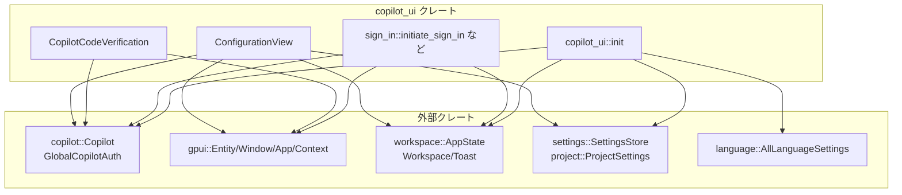
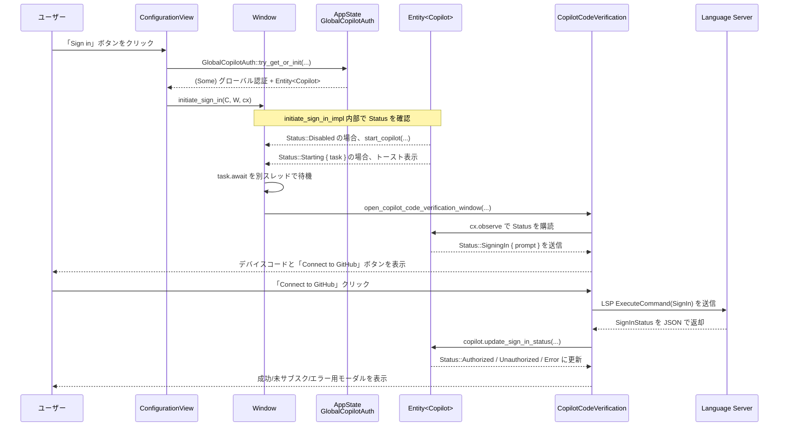

# copilot_ui ディレクトリ解説

## 1. ざっくり一言

`copilot_ui` クレートは、Zed 内で GitHub Copilot を使うための **サインイン UI と設定 UI** をまとめたモジュールです。  
Copilot のグローバル初期化、サインイン／サインアウトフロー、デバイスコード認証ダイアログ、設定画面のカード表示などを担当します。

---

## 2. このモジュールの役割

### 2.1 概要

- このディレクトリは、エディタ Zed における GitHub Copilot の利用に関する **UI レイヤ** を提供します。
- 具体的には次の問題を扱います。
  - Copilot のグローバル初期化（言語サーバ・FS・Node ランタイムの紐付け）
  - Copilot の **サインイン／サインアウト／再インストール＋サインイン** フローの実行と UI 表示
  - Copilot サインイン時に必要な **デバイスコード認証ウィンドウ** の表示と状態管理
  - 設定画面等に組み込むための **ConfigurationView**（「サインイン」「サインアウト」ボタンを含むカード）の提供

### 2.2 アーキテクチャ内での位置づけ

このクレートは、Copilot 本体ロジック（`copilot` クレート）と Zed の UI／ワークスペース層の間をつなぐ位置づけです。



- `copilot_ui::init` は設定 (`SettingsStore`, `AllLanguageSettings`, `DisableAiSettings`) を読み、`GlobalCopilotAuth` を初期化します。
- `sign_in` モジュール（`sign_in.rs`）は、`gpui` の UI コンポーネントとして動作し、`Copilot` エンティティの状態を監視しながらサインインフローを進めます。
- `workspace` クレートの `Workspace`・`Toast` を用いてトースト通知やエラー表示を行います。

### 2.3 設計上のポイント

コードから読み取れる設計上の特徴は以下のとおりです。

- **責務の分割**
  - `copilot_ui.rs` はクレートのエントリーポイントと公開 API の再エクスポートのみを担当します。
  - `sign_in.rs` は Copilot に関連する UI（サインインダイアログ・設定カード）と、その裏で動くサインインロジックを集約しています。
- **状態管理の方針**
  - Copilot 自体の状態は `copilot::Copilot`（`Entity<Copilot>`）が保持し、このクレートは `Status` を読みながら UI を切り替える役割です。
  - `CopilotCodeVerification` と `ConfigurationView` は `gpui::Context` と `Subscription` を用いて **リアクティブに状態を反映** します。
- **エラーハンドリング**
  - サインアウトやウィンドウ操作などの非同期処理は `Window::spawn` / `cx.spawn` で実行し、失敗時は
    - 可能なら `Workspace::show_error` に渡す
    - それができない場合は `log::error!` でログ出力する
  - UI レベルでのエラー表示用に共通メッセージ `ERROR_LABEL` と、「再インストールしてサインイン」ボタンを持つモーダルを用意しています。
- **UI とロジックの分離**
  - サインイン状態に応じた UI の分岐（ロード中 / 未認証 / 認証済み / エラー）は `Status` のマッチングに集約され、個々の UI は小さなレンダリング関数（`render_*`）に分割されています。

---

## 3. 主要な機能一覧

このディレクトリが提供する主な機能を列挙します。

- **Copilot グローバル初期化**
  - `copilot_ui::init`  
    設定を読み、AI が有効で edit predictions のプロバイダが Copilot のときに `GlobalCopilotAuth::set_global` を呼び出します。
- **サインイン開始**
  - `initiate_sign_in`  
    Copilot が起動していない場合は起動し、その後サインイン処理とデバイスコード認証ウィンドウの表示を行います。
- **サインアウト**
  - `initiate_sign_out`  
    サインアウト処理を非同期に実行し、トースト通知とエラー表示を行います。
- **再インストール＋サインイン**
  - `reinstall_and_sign_in`  
    Copilot の再インストール処理を実行した後、サインインフローを開始します。
- **デバイスコード認証ウィンドウ**
  - `CopilotCodeVerification`  
    Copilot が返す `Status::SigningIn { prompt }` をもとに、ユーザーにデバイスコードを表示し GitHub 側に誘導するモーダルウィンドウを表示・管理します。
- **設定画面用コンフィギュレーションビュー**
  - `ConfigurationView` / `ConfigurationMode`  
    設定 UI 内に埋め込まれ、Chat 用 / Edit Prediction 用にサインイン状況を表示し、「Sign in」「Sign out」「Reinstall and Sign in」ボタンなどを提供します。
- **トースト通知**
  - `copilot_toast`（内部関数）  
    サインイン／サインアウト／起動中などの状態を、`Workspace` のトーストとして表示します。

---

## 4. 関数・構造体の解説

### 4.1 型一覧（構造体・列挙体など）

| 名前 | 種別 | 役割 / 用途 |
|------|------|-------------|
| `CopilotStatusToast` | 構造体（中身なし） | トースト通知用 `NotificationId` の型タグとして使用されます。 |
| `CopilotCodeVerification` | 構造体 | デバイスコード認証ウィンドウ（モーダル）を表す UI コンポーネントです。Copilot の `Status` を監視しながら表示内容を切り替えます。 |
| `ConfigurationView` | 構造体 | 設定画面等に埋め込むための認証状態表示用ビューです。サインイン／サインアウトボタンや説明文を描画します。 |
| `ConfigurationMode` | 列挙体 | `Chat` / `EditPrediction` の 2 種類。`ConfigurationView` がどの用途の UI を描画するかを切り替えます。 |

補足として、外部型ですが重要なもの:

- `Status`（`copilot::Status`）  
  - Copilot の状態を表す列挙体で、コード中では少なくとも以下のバリアントが使われています。  
    `Disabled`, `Starting { task }`, `SigningIn { prompt }`, `SignedOut { awaiting_signing_in }`, `Authorized`, `Unauthorized`, `Error(..)`  
  - このクレートは `Status` に応じて UI とフローを切り替えています。

- `Entity<Copilot>`（`gpui::Entity`）  
  - Copilot モデルのハンドルです。`update` / `read` 経由で Copilot のメソッド呼び出しや状態参照を行います。

### 4.2 主要な関数・メソッドの詳細（7 件）

#### 4.2.1 `init(app_state: &Arc<AppState>, cx: &mut App)`

**概要**

- 起動時などに呼び出され、設定を見て **Copilot をグローバルに初期化するかどうか** を決める関数です。
- AI が無効化されておらず、edit prediction のプロバイダとして Copilot が選択されている場合にのみ `GlobalCopilotAuth::set_global` を呼び出します。

**引数**

| 引数名 | 型 | 説明 |
|--------|----|------|
| `app_state` | `&Arc<AppState>` | アプリケーション全体の状態。言語サーバ ID やファイルシステム、Node ランタイムを含みます。 |
| `cx` | `&mut App` | `gpui` のアプリケーションコンテキストです。グローバル設定の読み取りなどに使われます。 |

**戻り値**

- なし。必要に応じてグローバルな Copilot 認証をセットアップします。

**内部処理の流れ**

1. `SettingsStore` から `DisableAiSettings` を読み、`disable_ai` フラグを取得します。
2. 同じく `SettingsStore` から `AllLanguageSettings` を読み、`edit_predictions.provider` を取得します。
3. `disable_ai` が `false` かつ `provider == settings::EditPredictionProvider::Copilot` のときだけ、
   `GlobalCopilotAuth::set_global` を呼び出して Copilot をグローバルに初期化します。
   - 引数には、次の 3 つが渡されます。
     - `app_state.languages.next_language_server_id()`
     - `app_state.fs.clone()`
     - `app_state.node_runtime.clone()`

**Examples（使用例）**

アプリケーション起動時に Copilot を初期化する例です。

```rust
use std::sync::Arc;
use copilot_ui::init;
use ui::App;
use workspace::AppState;

// アプリケーションのどこかで呼び出されると想定される初期化関数
fn on_app_ready(app_state: Arc<AppState>, cx: &mut App) {
    // 設定に応じて Copilot のグローバル認証を初期化する
    init(&app_state, cx);
}
```

**Errors / Panics**

- この関数自身は `Result` を返さず、明示的なエラー処理も行っていません。
- 内部で呼び出している `SettingsStore::get` や `GlobalCopilotAuth::set_global` の失敗時挙動は、このチャンクからは分かりません。

**Edge cases（エッジケース）**

- AI が無効 (`disable_ai == true`) の場合は、`GlobalCopilotAuth::set_global` は呼ばれません。
- edit prediction のプロバイダが Copilot 以外に設定されている場合も同様です。
- 同じ `AppState` で複数回呼び出されたときの `set_global` の挙動は、このコードからは分かりません。

**使用上の注意点**

- `AppState` とグローバル設定が利用可能になってから呼び出す前提の設計です。
- Copilot 以外のプロバイダを使う構成では何もしないため、「init を呼んだのに Copilot が動かない」場合は設定側を確認する必要があります。

---

#### 4.2.2 `initiate_sign_in(copilot: Entity<Copilot>, window: &mut Window, cx: &mut App)`

**概要**

- Copilot の **サインインフローを開始する外部向けエントリーポイント** です。
- 実際の処理は `initiate_sign_in_impl` に委譲し、この関数では「通常のサインイン」（再インストールではない）としてフラグを渡します。

**引数**

| 引数名 | 型 | 説明 |
|--------|----|------|
| `copilot` | `Entity<Copilot>` | 操作対象となる Copilot インスタンスのエンティティです。 |
| `window` | `&mut Window` | 現在のウィンドウ。トースト表示やポップアップ表示に使用されます。 |
| `cx` | `&mut App` | `gpui` のアプリケーションコンテキストです。 |

**戻り値**

- なし。内部で非同期タスクの起動やウィンドウのオープンを行います。

**内部処理の流れ**

1. `is_reinstall` を `false` に設定。
2. `initiate_sign_in_impl(copilot, is_reinstall, window, cx)` を呼び出して実処理を行います。

**Examples（使用例）**

設定画面からサインインボタンを押したときに呼ぶ想定の例です。

```rust
use copilot::GlobalCopilotAuth;
use copilot_ui::initiate_sign_in;
use workspace::AppState;
use ui::App;
use gpui::Window;

fn on_sign_in_button_clicked(window: &mut Window, cx: &mut App) {
    // グローバルな Copilot 認証オブジェクトから Entity<Copilot> を取得
    let app_state = AppState::global(cx);
    if let Some(auth) = GlobalCopilotAuth::try_get_or_init(app_state, cx) {
        // auth.0 が Entity<Copilot> であることは sign_in.rs のコードから分かります
        initiate_sign_in(auth.0, window, cx);
    }
}
```

**Errors / Panics**

- この関数自体はエラーを返さず、`initiate_sign_in_impl` に処理を委譲します。
- サインイン中のエラーは UI 上のモーダルやトーストで扱われます（詳細は `initiate_sign_in_impl` および `CopilotCodeVerification` 参照）。

**Edge cases（エッジケース）**

- 渡された `copilot` の状態によっては、起動処理（`start_copilot`）から始まる場合と、すぐにサインインダイアログを開く場合があります（詳細は次の関数）。

**使用上の注意点**

- `Entity<Copilot>` は本来 `GlobalCopilotAuth` などから取得することが想定されており、独自に作成することはありません。
- UI イベントハンドラ内など、`Window` と `App` が有効なスレッド／コンテキストで呼び出す前提です。

---

#### 4.2.3 `initiate_sign_out(copilot: Entity<Copilot>, window: &mut Window, cx: &mut App)`

**概要**

- Copilot からのサインアウトを開始する関数です。
- サインアウト中・完了時のトースト表示と、エラーのワークスペース通知／ログ出力を行います。

**引数**

| 引数名 | 型 | 説明 |
|--------|----|------|
| `copilot` | `Entity<Copilot>` | サインアウト対象の Copilot インスタンスです。 |
| `window` | `&mut Window` | トースト表示と非同期タスク起動に使用するウィンドウです。 |
| `cx` | `&mut App` | `gpui` のアプリケーションコンテキストです。 |

**戻り値**

- なし。サインアウト処理は非同期で行われます。

**内部処理の流れ**

1. `copilot_toast(Some("Signing out of Copilot…"), window, cx)` で「サインアウト中」のトーストを表示します。
2. `copilot.update(cx, |copilot, cx| copilot.sign_out(cx))` でサインアウトタスクを開始し、その `Future`（`sign_out_task`）を取得します。
3. `window.spawn(cx, async move |cx| { ... })` で非同期タスクを起動し、`sign_out_task.await` の結果に応じて処理します。
   - `Ok(())` の場合: 「Signed out of Copilot」というトーストを再表示します。
   - `Err(err)` の場合:
     - `Workspace::for_window(window, cx)` でワークスペースが取得できれば `workspace.show_error(&err, cx)` を呼び出します。
     - 取得できない場合は `log::error!("{:?}", err);` でログ出力します。
4. タスクは `.detach()` で切り離され、呼び出し側には非同期処理の完了を待たせません。

**Examples（使用例）**

`ConfigurationView` の「Sign Out」ボタンで実際に使われているパターンです。

```rust
use copilot::GlobalCopilotAuth;
use copilot_ui::initiate_sign_out;
use ui::App;
use gpui::Window;

fn render_authorized_card() -> ui::ConfiguredApiCard {
    ui::ConfiguredApiCard::new("Authorized")
        .button_label("Sign Out")
        .on_click(|_, window: &mut Window, cx: &mut App| {
            // グローバルな Copilot 認証が存在する場合のみサインアウト
            if let Some(auth) = GlobalCopilotAuth::try_global(cx) {
                initiate_sign_out(auth.0.clone(), window, cx);
            }
        })
}
```

**Errors / Panics**

- サインアウト処理からのエラーは UI もしくはログに転送されますが、この関数はそれを呼び出し元に返しません。
- 明示的な `panic!` はありません。

**Edge cases（エッジケース）**

- `Workspace::for_window` が `None` を返すウィンドウ（ワークスペースに紐付いていないウィンドウなど）の場合、ユーザーへのエラー表示は行われず、ログのみになります。
- サインアウト中にウィンドウやワークスペースが閉じられた場合の挙動は、このコード単体からは詳細不明です（`window.spawn`／`workspace.show_error` の実装に依存します）。

**使用上の注意点**

- サインアウト完了を待つ必要がない（UI をブロックしたくない）設計になっているため、完了タイミングに依存した処理を続けて行いたい場合は別途状態を監視する必要があります。

---

#### 4.2.4 `reinstall_and_sign_in(copilot: Entity<Copilot>, window: &mut Window, cx: &mut App)`

**概要**

- Copilot を再インストールしてからサインインフローを開始する関数です。
- エラー時などにユーザーに提示される「Reinstall Copilot and Sign In」ボタンから呼び出されます。

**引数**

| 引数名 | 型 | 説明 |
|--------|----|------|
| `copilot` | `Entity<Copilot>` | 再インストールおよびサインイン対象の Copilot インスタンスです。 |
| `window` | `&mut Window` | サインインフローの開始に使用するウィンドウです。 |
| `cx` | `&mut App` | アプリケーションコンテキストです。 |

**戻り値**

- なし。再インストールとその後のサインインは内部で実行されます。

**内部処理の流れ**

1. `copilot.update(cx, |copilot, cx| copilot.reinstall(cx))` を呼び出しますが、戻り値は `_` に束縛して無視しています。
2. `is_reinstall` を `true` に設定します。
3. `initiate_sign_in_impl(copilot, is_reinstall, window, cx)` を呼び、再インストール後のサインインフローを開始します。
   - `is_reinstall == true` の場合、トーストメッセージが「Copilot is reinstalling…」になります。

**Examples（使用例）**

エラー時のモーダルから呼び出されるコードです。

```rust
use copilot_ui::reinstall_and_sign_in;
use copilot::Copilot;
use gpui::{Entity, Window};
use ui::{Button, ButtonStyle, Icon, IconName, IconSize, Color};

fn render_error_modal(copilot: Entity<Copilot>) -> impl ui::IntoElement {
    ui::v_flex()
        .child(
            Button::new("copilot-subscribe-button", "Reinstall Copilot and Sign In")
                .style(ButtonStyle::Outlined)
                .start_icon(
                    Icon::new(IconName::Download)
                        .size(IconSize::Small)
                        .color(Color::Muted),
                )
                .on_click(move |_, window: &mut Window, cx: &mut ui::App| {
                    reinstall_and_sign_in(copilot.clone(), window, cx)
                }),
        )
}
```

**Errors / Panics**

- `copilot.reinstall(cx)` の戻り値は無視されているため、再インストールに失敗してもこの関数自体からは分かりません。
- 明示的な `panic!` はありません。

**Edge cases（エッジケース）**

- 再インストールが失敗しても、そのまま `initiate_sign_in_impl` に進むため、その後のサインインが成功するかどうかは Copilot 側の実装に依存します。

**使用上の注意点**

- 再インストールは潜在的に重い処理になり得るため、ユーザー操作に応じてのみ呼ばれるような UI から使う設計になっています。

---

#### 4.2.5 `initiate_sign_in_impl(copilot: Entity<Copilot>, is_reinstall: bool, window: &mut Window, cx: &mut App)`

**概要**

- サインイン開始処理の **中心となる状態遷移ロジック** です。
- Copilot の現在の `Status` に応じて、「Copilot の起動」「サインイン開始」「デバイスコードウィンドウの表示」を切り替えます。

**引数**

| 引数名 | 型 | 説明 |
|--------|----|------|
| `copilot` | `Entity<Copilot>` | 操作対象の Copilot インスタンスです。 |
| `is_reinstall` | `bool` | 再インストール後のサインインかどうか。トーストメッセージに影響します。 |
| `window` | `&mut Window` | トースト表示とポップアップ起動に使用するウィンドウです。 |
| `cx` | `&mut App` | アプリケーションコンテキストです。 |

**戻り値**

- なし。内部で非同期タスクの起動やウィンドウのオープンを行います。

**内部処理の流れ（アルゴリズム）**

1. 現在の `Status` を確認し、`Status::Disabled` の場合は  
   `copilot.update(cx, |copilot, cx| copilot.start_copilot(false, true, cx));` を呼び出して Copilot を起動します。
2. 再度 `copilot.read(cx).status()` を取得して分岐します。
3. `Status::Starting { task }` の場合:
   - `is_reinstall` に応じて以下のどちらかのトーストを表示します。
     - 再インストール時: `"Copilot is reinstalling…"`
     - 通常時: `"Copilot is starting…"`
   - `window.spawn(cx, async move |cx| { ... })` を使って非同期タスクを起動し、内部で
     1. `task.await` で起動プロセスの完了を待ちます。
     2. `cx.update(|window, cx| { ... })` で UI スレッドに戻り、再度 `copilot.read(cx).status()` を確認して分岐します。
        - `Status::Authorized` の場合: `"Copilot has started."` というトーストを表示します。
        - それ以外の場合:
          - まず `copilot_toast(None, window, cx)` で既存トーストを消します。
          - `copilot.update(cx, |copilot, cx| copilot.sign_in(cx)).detach_and_log_err(cx);` でサインイン処理を開始します（エラーはログ出力）。
          - `open_copilot_code_verification_window(&copilot, window, cx);` でデバイスコード認証ウィンドウを開きます。
     3. `cx.update(..).log_err();` により、`update` 自体の失敗もログに記録されます。
4. `Status::Starting { .. }` 以外の場合:
   - `copilot.update(cx, |copilot, cx| copilot.sign_in(cx)).detach();` を即時呼び出してサインインを開始します（エラーはここではログ化などされていません）。
   - `open_copilot_code_verification_window(&copilot, window, cx);` を呼んで認証ウィンドウを開きます。

**Examples（使用例）**

この関数は外部から直接呼ぶことは想定されておらず、`initiate_sign_in` / `reinstall_and_sign_in` 経由で利用されます。  
上記 2 関数の例を参照すると実際の呼び出しフローが分かります。

**Errors / Panics**

- `task.await` の失敗や `copilot.sign_in(cx)` の失敗は、それぞれ `.log_err()` や `detach_and_log_err` でログに記録される想定です。
- 関数自体はエラーを返さず、明示的な `panic!` もありません。

**Edge cases（エッジケース）**

- `Status::Starting` 以外（例えば `SigningIn` や `Authorized`）で呼ばれた場合も、`sign_in` を実行し、認証ウィンドウを開きます。  
  そのようなケースの意図はコードからだけでは断定できません。
- Copilot の状態が `Authorized` であっても、`Status::Starting` ルートを通らない限りトーストは `"Copilot has started."` にはなりません。

**使用上の注意点**

- 非公開関数ですが、サインインフロー全体の挙動を理解するうえで重要な関数です。
- 認証ウィンドウはこの関数の中で必ず開かれるため、サインインフローをカスタマイズしたい場合はこの関数周辺のロジックが入口になります。

---

#### 4.2.6 `CopilotCodeVerification::new(copilot: &Entity<Copilot>, window: &mut Window, cx: &mut Context<Self>) -> Self`

**概要**

- デバイスコード認証ウィンドウのコンポーネントを初期化するコンストラクタです。
- ウィンドウクローズ時の処理や Copilot 状態の監視 (`Subscription`) をセットアップします。

**引数**

| 引数名 | 型 | 説明 |
|--------|----|------|
| `copilot` | `&Entity<Copilot>` | 状態を監視する Copilot インスタンスです。 |
| `window` | `&mut Window` | 閉じるイベントハンドラやウィンドウ削除に使用されます。 |
| `cx` | `&mut Context<Self>` | このコンポーネント自身の UI コンテキストです。 |

**戻り値**

- `Self`（`CopilotCodeVerification`）のインスタンス。

**内部処理の流れ**

1. `window.on_window_should_close(cx, |window, cx| { ...; true })` を登録し、ウィンドウが閉じられようとしたときに
   - ルートコンポーネントとして自身を取得し (`window.root::<CopilotCodeVerification>().flatten()`),
   - `this.before_dismiss(cx)` を呼んで必要なクリーンアップ（サインイン中であればサインアウト）を行います。
2. `cx.subscribe_in(&cx.entity(), window, |this, _, _: &DismissEvent, window, cx| { ... })` を設定し、
   - `DismissEvent` が発火したときに `window.remove_window()` でポップアップを閉じ、
   - `this.before_dismiss(cx)` を実行します。
3. 初期ステータスとして `copilot.read(cx).status()` を読み取ります。
4. フィールドを初期化します。
   - `status` に上記ステータス
   - `connect_clicked = false`
   - `focus_handle = cx.focus_handle()`
   - `copilot = copilot.clone()`
   - `sign_up_url = None`
   - `_subscription = cx.observe(copilot, |this, copilot, cx| { ... })`  
     このオブザーバは Copilot の `status` を監視し、
     - `Status::Authorized` / `Status::Unauthorized` / `Status::SigningIn { .. }` の場合: `this.set_status(status, cx)` で UI を更新
     - それ以外の状態になった場合: `cx.emit(DismissEvent)` でウィンドウを閉じます。

**Examples（使用例）**

このコンストラクタは `open_copilot_code_verification_window` から間接的に使われます。

```rust
fn open_copilot_code_verification_window(
    copilot: &gpui::Entity<copilot::Copilot>,
    window: &gpui::Window,
    cx: &mut ui::App,
) {
    cx.open_window(
        gpui::WindowOptions { /* ... */ },
        |window, cx| cx.new(|cx| CopilotCodeVerification::new(&copilot, window, cx)),
    );
}
```

**Errors / Panics**

- `cx.observe` や `window.root` が失敗した場合の詳細な挙動は、このチャンクからは分かりませんが、明示的な `unwrap` などは使われていません。
- `before_dismiss` 内部で `copilot.sign_out(cx).detach_and_log_err(cx)` が呼ばれるため、サインアウトエラーはログに残る想定です。

**Edge cases（エッジケース）**

- Copilot の状態が `Status::SigningIn` / `Authorized` / `Unauthorized` 以外になった場合、ウィンドウは自動的に閉じられます。
- ウィンドウクローズボタンと `DismissEvent` のどちらで閉じても、`before_dismiss` が呼ばれます。

**使用上の注意点**

- 外部から直接 `new` を呼ぶことは通常想定されておらず、`open_copilot_code_verification_window` 経由で使われます。
- `Context<Self>` を受け取るため、`gpui` のコンポーネント生成コンテキスト（`cx.new(...)`）内でのみ呼び出せます。

---

#### 4.2.7 `impl Render for ConfigurationView { fn render(&mut self, _window: &mut Window, cx: &mut Context<Self>) -> impl IntoElement }`

**概要**

- `ConfigurationView` のメインレンダリング処理です。
- 認証済みかどうか、および `ConfigurationMode` に応じて表示を切り替えます。

**引数**

| 引数名 | 型 | 説明 |
|--------|----|------|
| `self` | `&mut Self` | レンダリング対象のビュー自身です。 |
| `_window` | `&mut Window` | 現在のウィンドウ（この関数内では未使用）です。 |
| `cx` | `&mut Context<Self>` | UI コンテキスト。`is_authenticated` クロージャ呼び出しや通知に使われます。 |

**戻り値**

- `impl IntoElement`（`ConfiguredApiCard` もしくは各種ボタンを含むレイアウト要素）を返します。

**内部処理の流れ**

1. `let is_authenticated = &self.is_authenticated;` としてクロージャをローカルに取り出します。
2. `if is_authenticated(cx)` が `true` の場合:
   - `ConfiguredApiCard::new("Authorized")` を表示し、ボタンラベルを `"Sign Out"` に設定します。
   - ボタンの `on_click` では、`GlobalCopilotAuth::try_global(cx)` から `auth` を取得し、  
     `initiate_sign_out(auth.0.clone(), window, cx);` を呼んでサインアウトを開始します。
3. 認証済みでない場合:
   - `self.edit_prediction` を見て、`true` なら `self.render_for_edit_prediction()`, `false` なら `self.render_for_chat()` を呼び、その結果を `into_any_element()` で返します。

**Examples（使用例）**

`ConfigurationView` 自体を設定画面に埋め込む際の、概念的な例です。

```rust
use copilot_ui::{ConfigurationView, ConfigurationMode};
use gpui::{Context, IntoElement};
use ui::App;

// 設定画面コンポーネントの一部として Copilot 設定ビューを作るイメージ
fn build_copilot_settings(
    cx: &mut Context<MySettingsView>,
) -> impl IntoElement {
    // 認証済みかどうかを判定するクロージャ
    // 実際には GlobalCopilotAuth や Copilot の Status などから判定する
    let is_authenticated = |_cx: &mut App| -> bool {
        // ここでは例として常に未認証とする
        false
    };

    cx.new(|cx| {
        ConfigurationView::new(
            is_authenticated,
            ConfigurationMode::Chat,
            cx,
        )
    })
}
```

> `MySettingsView` は外部で定義される設定画面コンポーネントの型名で、このチャンクには登場しません。

**Errors / Panics**

- `GlobalCopilotAuth::try_global(cx)` が `None` の場合、サインアウトボタンは押されても何も起こりませんが、パニックにはなりません。
- その他の UI 部分でのエラーは `gpui` 側の実装に依存します。

**Edge cases（エッジケース）**

- `is_authenticated(cx)` が `true` だが `GlobalCopilotAuth::try_global(cx)` が `None` を返す場合、ボタンは表示されるが実際のサインアウトは行われません。
- `ConfigurationMode::EditPrediction` と `Chat` では、説明文やボタンサイズが一部異なりますが、サインイン／再インストール／エラー表示の基本的構造は似ています。

**使用上の注意点**

- 認証状態の判定ロジックは外部から渡されるクロージャ `is_authenticated` に委ねられているため、アプリケーション側で一貫した基準を実装する必要があります。
- `ConfigurationView::new` を呼ぶ際には、`gpui` のコンポーネント生成コンテキスト（`cx.new` 内）から呼び出す必要があります。

---

### 4.3 その他の関数・メソッド

補助的な関数や見た目専用のレンダリング関数をまとめます。

| 関数 / メソッド名 | 役割（1 行） |
|------------------|--------------|
| `open_copilot_code_verification_window` | 現在のウィンドウ中央付近に Copilot コード認証用ポップアップウィンドウを開きます。 |
| `copilot_toast` | `Workspace` にトースト通知を表示／非表示にします。 |
| `CopilotCodeVerification::set_status` | 内部の `status` を更新し、`cx.notify()` で再描画をトリガします。 |
| `CopilotCodeVerification::render_device_code` | デバイスコードと「Copy」ボタンの UI を描画します（クリップボード状態に応じて `"Copied!"` と表示）。 |
| `CopilotCodeVerification::render_prompting_modal` | デバイスコードと「Connect to GitHub」「Cancel」ボタンを含むメインモーダルを描画します。 |
| `CopilotCodeVerification::render_enabled_modal` | サインイン成功時の「Copilot Enabled!」モーダルを描画します。 |
| `CopilotCodeVerification::render_unauthorized_modal` | サブスクリプション不足などで `Status::Unauthorized` の場合に表示されるモーダルを描画します。 |
| `CopilotCodeVerification::render_error_modal` | `Status::Error(..)` 時に、再インストールを促すモーダルを描画します。 |
| `CopilotCodeVerification::before_dismiss` | ウィンドウを閉じる前に、`Status::SigningIn` 中であれば `sign_out` を実行して後処理を行います。 |
| `impl Render for CopilotCodeVerification::render` | 現在の `status` に応じて上記モーダルのいずれか（あるいはローディングアイコン）を表示します。 |
| `ConfigurationView::new` | `ConfigurationView` を初期化し、グローバルな `GlobalCopilotAuth` に対する `Subscription` をセットアップします。 |
| `ConfigurationView::is_starting` などの補助メソッド | `Status` に対する簡易判定（`Starting`, `SigningIn`, `Error`, `None`）を行い、UI の文言・ボタン状態に利用します。 |
| `ConfigurationView::render_loading_button` | ローディング中にスピナー付きで無効化されたボタンを描画します。 |
| `ConfigurationView::render_sign_in_button` | 「Sign in」ボタンの見た目とクリック処理を構築します。 |
| `ConfigurationView::render_reinstall_button` | 「Reinstall and Sign in」ボタンの見た目とクリック処理を構築します。 |
| `ConfigurationView::render_for_edit_prediction` / `render_for_chat` | Edit Prediction / Chat 用にそれぞれ適した説明文とボタン配置を描画します。 |

---

## 5. データフロー

ここでは、ユーザーが設定画面から「Sign in」ボタンを押して、Copilot が利用可能になるまでのおおまかなデータフローを示します。

### 5.1 サインインフローのシーケンス図



この図から分かるポイント:

- `ConfigurationView` は、サインインボタンを押された時点で `GlobalCopilotAuth` を通じて `Entity<Copilot>` を取得し、`initiate_sign_in` を呼び出します。
- 実際のサインイン処理は Copilot の言語サーバ経由で GitHub と通信して行われますが、このクレートは LSP の ExecuteCommand を投げるところまでを担当します。
- `CopilotCodeVerification` は Copilot の `Status` を監視し、`SigningIn` → `Authorized` / `Unauthorized` / `Error` の遷移に応じて UI を切り替えます。
- ウィンドウが閉じられた場合は、サインイン中であれば `sign_out` を呼ぶことで中断処理を行います。

---

## 6. 使い方（How to Use）

### 6.1 基本的な使用方法

#### 6.1.1 起動時に Copilot を初期化する

アプリケーション起動時またはワークスペース読み込み時に、設定に応じて Copilot のグローバル認証を初期化します。

```rust
use std::sync::Arc;
use copilot_ui::init;
use workspace::AppState;
use ui::App;

// 何らかの起動フックから呼ばれると想定される関数
fn on_workspace_loaded(app_state: Arc<AppState>, cx: &mut App) {
    // 設定を確認し、必要であれば Copilot のグローバル認証をセットアップする
    init(&app_state, cx);
}
```

#### 6.1.2 設定画面に `ConfigurationView` を埋め込む

設定画面コンポーネントの中で Copilot 設定ビューを子コンポーネントとして生成するイメージです。

```rust
use copilot_ui::{ConfigurationView, ConfigurationMode};
use gpui::{Context, IntoElement};
use ui::App;

// 仮の設定画面コンポーネント
struct MySettingsView;

// MySettingsView の一部として Copilot 設定 UI を描画する
fn render_copilot_section(
    cx: &mut Context<MySettingsView>,
) -> impl IntoElement {
    // 認証状態を判定するクロージャ
    // 実運用では GlobalCopilotAuth や Copilot::status() を参照して実装する
    let is_authenticated = |_cx: &mut App| -> bool {
        false // ここでは簡略化のため常に未認証とする
    };

    // ConfigurationView を子エンティティとして生成し、返す
    cx.new(|cx| {
        ConfigurationView::new(is_authenticated, ConfigurationMode::Chat, cx)
    })
}
```

### 6.2 よくある使用パターン

#### 6.2.1 コマンドからサインインを開始する

コマンドパレットやメニューからサインインフローを開始する例です。

```rust
use copilot::GlobalCopilotAuth;
use copilot_ui::initiate_sign_in;
use workspace::AppState;
use ui::App;
use gpui::Window;

// コマンドハンドラなどから呼ばれると想定
fn command_sign_in_with_copilot(window: &mut Window, cx: &mut App) {
    // グローバルな AppState を取得
    let app_state = AppState::global(cx);

    // Copilot 認証を初期化または取得
    if let Some(auth) = GlobalCopilotAuth::try_get_or_init(app_state, cx) {
        // Entity<Copilot> を取り出してサインインを開始
        initiate_sign_in(auth.0, window, cx);
    }
}
```

#### 6.2.2 設定画面からサインアウトする

`ConfigurationView` が内部で利用しているのと同じパターンです。

```rust
use copilot::GlobalCopilotAuth;
use copilot_ui::initiate_sign_out;
use ui::App;
use gpui::Window;
use ui::ConfiguredApiCard;

fn render_authorized_copilot_card() -> ConfiguredApiCard {
    ConfiguredApiCard::new("Authorized")
        .button_label("Sign Out")
        .on_click(|_, window: &mut Window, cx: &mut App| {
            if let Some(auth) = GlobalCopilotAuth::try_global(cx) {
                // グローバル認証から Copilot エンティティを取得してサインアウト
                initiate_sign_out(auth.0.clone(), window, cx);
            }
        })
}
```

#### 6.2.3 エラー時に「再インストールしてサインイン」を提供する

`CopilotCodeVerification` のエラー用モーダルと同様のボタンを別の UI から利用するイメージです。

```rust
use copilot::Copilot;
use copilot_ui::reinstall_and_sign_in;
use gpui::{Entity, Window};
use ui::{App, Button, ButtonStyle, Icon, IconName, IconSize, Color};

fn render_custom_error_action(copilot: Entity<Copilot>) -> impl ui::IntoElement {
    Button::new("reinstall_copilot", "Reinstall Copilot and Sign In")
        .style(ButtonStyle::Outlined)
        .start_icon(
            Icon::new(IconName::Download)
                .size(IconSize::Small)
                .color(Color::Muted),
        )
        .on_click(move |_, window: &mut Window, cx: &mut App| {
            reinstall_and_sign_in(copilot.clone(), window, cx);
        })
}
```

### 6.3 使用上の注意点

- **イニシャライザ `init` の前提**
  - `copilot_ui::init` は設定 (`SettingsStore`) と `AppState` が利用可能であることを前提としています。
  - 起動直後など、設定がまだロードされていないタイミングで呼び出すと意図通りに初期化されない可能性があります。

- **`Entity<Copilot>` の取得方法**
  - `initiate_sign_in` / `initiate_sign_out` / `reinstall_and_sign_in` は `Entity<Copilot>` を直接受け取りますが、このエンティティは通常  
    `GlobalCopilotAuth::try_get_or_init` などを通じて取得する前提になっています。
  - 独自に `Entity<Copilot>` を生成するようなパターンはこのコードからは想定されていません。

- **UI スレッドでの呼び出し**
  - `Window::spawn`, `cx.spawn`, `cx.open_window` など `gpui` の API を使っているため、これらの関数は UI コンテキスト（`App` / `Context`）が有効なスレッドで呼び出す必要があります。

- **サインインウィンドウのクローズ時挙動**
  - `CopilotCodeVerification::before_dismiss` により、サインイン中 (`Status::SigningIn`) にウィンドウを閉じた場合、`sign_out` を実行して状態をクリーンアップします。
  - 「ウィンドウを閉じればサインインフローは中断される」という前提で他のロジックを組むことができます。

- **エラーハンドリングとユーザー通知**
  - サインアウトなどのエラーは `Workspace::show_error` もしくは `log::error` に渡されます。このクレート自体はエラーを上位に伝播しないため、
    外側で再度エラーを捕捉したい場合は、`Status::Error(..)` やログを監視する必要があります。

---

## 7. 関連ファイル

このディレクトリ内および密接に関係するファイル・モジュールをまとめます。

| パス | 役割 / 関係 |
|------|------------|
| `copilot_ui/Cargo.toml` | `copilot_ui` クレートの定義ファイルです。ライブラリエントリポイントを `src/copilot_ui.rs` に設定し、`copilot`, `gpui`, `workspace` などへの依存関係を宣言しています。 |
| `copilot_ui/src/copilot_ui.rs` | クレートのエントリーポイントです。`init` 関数を提供し、`sign_in` モジュールから `ConfigurationView` などの主要な型と関数を再エクスポートします。 |
| `copilot_ui/src/sign_in.rs` | Copilot サインイン周りの UI とロジックが集約されたメインモジュールです。サインイン／サインアウト／再インストール、デバイスコード認証ウィンドウ、設定用 `ConfigurationView` を実装しています。 |
| （別クレート）`copilot` | `Copilot`, `GlobalCopilotAuth`, `Status`, `request::PromptUserDeviceFlow` など、Copilot 本体のロジックや LSP 経由のコマンド実行を提供します。このチャンクにはコード本体は含まれていません。 |
| （別クレート）`workspace` | `AppState`, `Workspace`, `Toast`, `NotificationId` など、ワークスペース管理とユーザー通知のインフラを提供します。 |
| （別クレート）`ui` / `gpui` | `Button`, `Label`, `ConfiguredApiCard`, `Entity`, `Window`, `Context` などの UI コンポーネントとフレームワークを提供します。 |

これらのモジュールと連携することで、`copilot_ui` クレートは「Copilot の状態に応じた UI とフロー制御」を担当する位置づけになっています。
