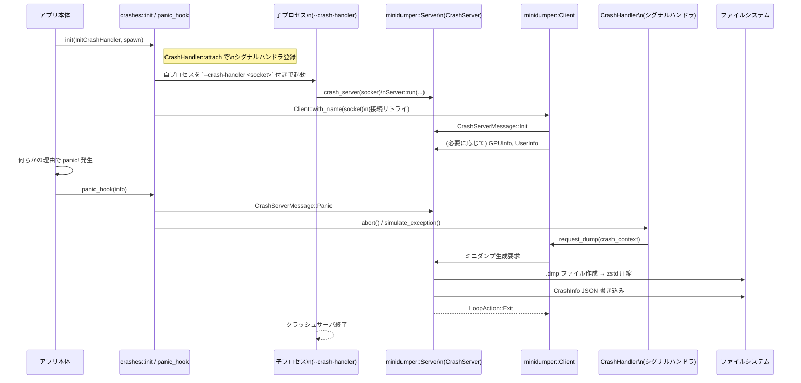

# crashes/ ディレクトリ解説

## 1. ざっくり一言

アプリケーションのクラッシュ時に、別プロセスのクラッシュハンドラを起動し、ミニダンプ（minidump）と付随情報（パニック内容・GPU 情報・ユーザー情報など）を収集してファイルとして保存するためのクレートです。

---

## 2. このモジュールの役割

### 2.1 概要

- このクレートは、アプリ本体とは別プロセスとして動くクラッシュハンドラを起動・接続し、クラッシュ時に minidumper を使ってミニダンプを生成する役割を持ちます。  
- また、クラッシュに関するメタデータ（プロセス起動時の情報、パニックメッセージ、GPU 情報、ユーザー情報）を集約し、JSON ファイルとして出力します。  
- Rust のパニックメッセージからユーザー文字列を一部マスクするなど、プライバシーを考慮した処理も行います。

### 2.2 アーキテクチャ内での位置づけ

このクレートは、他クレートから呼び出されてクラッシュ処理を担う「インフラ層」のモジュールです。主な依存関係は次のようになります。

```mermaid
graph TD
  App["アプリ本体 (他クレート)"]
  Crashes["crashes クレート"]
  CrashHandler["crash_handler クレート\n(シグナル/例外フック)"]
  MinidumperClient["minidumper::Client\n(IPC クライアント)"]
  CrashServerProc["クラッシュハンドラ子プロセス\n(--crash-handler)"]
  MinidumperServer["minidumper::Server\n(IPC サーバ)"]
  SystemSpecs["system_specs クレート\n(GPU 情報)"]
  Paths["paths クレート\n(ログ/一時ディレクトリ)"]

  App -->|init(...) 呼び出し| Crashes
  Crashes --> CrashHandler
  Crashes --> MinidumperClient
  Crashes --> CrashServerProc
  CrashServerProc --> MinidumperServer
  Crashes --> SystemSpecs
  Crashes --> Paths
```

- アプリ本体は `crashes::init` を呼び出して、クラッシュハンドラ機構をセットアップします。
- `crashes` クレートは `crash_handler` を使ってシグナル・例外のハンドラを登録します。
- 同時に、自分自身を `--crash-handler <socket>` 付きで子プロセスとして起動し、その子プロセス側で `minidumper::Server` + `CrashServer` を動かします。
- 親プロセス側は `minidumper::Client` で子プロセスに接続し、JSON メッセージでクラッシュ情報・GPU 情報・ユーザー情報などを送信します。

### 2.3 設計上のポイント

コードから読み取れる設計上の特徴は次の通りです。

- **責務の分割**
  - 親プロセス側
    - クラッシュハンドラのインストール（シグナルハンドラ、パニックフック）
    - 子プロセス（クラッシュサーバ）の起動・接続と keepalive
    - クラッシュ情報・GPU 情報・ユーザー情報の送信
  - 子プロセス側
    - minidumper を用いたミニダンプ生成・圧縮
    - クラッシュ情報の集約と JSON 出力
- **非同期処理**
  - 親プロセス側の「子プロセス起動〜接続〜keepalive」は `BoxFuture` を用いた非同期タスクとして実行し、どのランタイムで実行するかは呼び出し側（アプリ本体）に委ねています。
- **グローバル状態の管理**
  - `OnceLock<Arc<Client>>` や `AtomicBool`、`Mutex` を用いて、クラッシュクライアントやペンディングメッセージなどの共有状態を管理しています。
- **OS ごとの差異**
  - Windows とそれ以外（macOS / Linux / FreeBSD）でプロセス起動方法とクラッシュトリガー方法が異なります。
  - macOS ではクラッシュ時に他スレッドを一時停止する処理があります。
- **プライバシー配慮**
  - Rust の文字列スライス関連のパニックメッセージから、ユーザー文字列部分をマスクする機能があります。

---

## 3. 主要な機能一覧

このクレートが提供する主な機能を列挙します。

- クラッシュハンドラのインストールと設定  
  (`init`, `panic_hook`, 内部の `CrashHandler` 連携)
- クラッシュハンドラ子プロセスの起動・接続・keepalive  
  (`connect_and_keepalive`, OS 別のプロセス起動処理)
- minidumper サーバ側（子プロセス）の実装  
  (`crash_server`, `CrashServer` + `ServerHandler` 実装)
- ミニダンプファイルの作成・zstd 圧縮  
  (`CrashServer::on_minidump_created`, `create_minidump_file`)
- クラッシュメタデータの収集と JSON 出力  
  (`CrashInfo` 構築と書き出し)
- GPU 情報・ユーザー情報の送信 API  
  (`set_gpu_info`, `set_user_info`)
- パニックメッセージからのユーザー文字列マスク  
  (`strip_user_string_from_panic`)

---

## 4. 関数・構造体の解説

### 4.1 型一覧（主要な構造体・列挙体）

| 名前 | 種別 | 役割 / 用途 |
|------|------|-------------|
| `CrashServer` | 構造体 | `minidumper::ServerHandler` を実装し、ミニダンプ生成とクラッシュメタデータの集約・保存を行います。 |
| `CrashInfo` | 構造体 | 1 回のクラッシュに関する情報（初期化情報・パニック内容・GPU 情報・ユーザー情報など）をまとめて JSON にシリアライズするための型です。 |
| `InitCrashHandler` | 構造体 | セッション ID やバージョン情報など、クラッシュハンドラ初期化時に必要なメタデータを表します。 |
| `CrashPanic` | 構造体 | パニック発生時のメッセージとソースコード上の位置（span）を保持します。 |
| `UserInfo` | 構造体 | メトリクス用 ID やスタッフフラグなど、クラッシュに紐づけたいユーザー情報です。 |
| `CrashServerMessage` | 列挙体 | 親プロセス→子プロセスへの IPC メッセージ種別（`Init` / `Panic` / `GPUInfo` / `UserInfo`）を表します。 |

静的変数（グローバル状態）も重要です。

| 名前 | 型 | 役割 |
|------|----|------|
| `CRASH_HANDLER` | `OnceLock<Arc<Client>>` | 親プロセス側で、`minidumper::Client`（クラッシュサーバへの IPC クライアント）を一度だけセットし、以降は参照専用にします。 |
| `REQUESTED_MINIDUMP` | `AtomicBool` | ミニダンプ生成要求を 1 回だけ行うためのフラグです。 |
| `PENDING_CRASH_SERVER_MESSAGES` | `Mutex<Vec<CrashServerMessage>>` | `Client` 接続前に発生したメッセージ（`Init`, `Panic` 等）をキューしておき、接続後にまとめて送信します。 |
| `PANIC_THREAD_ID` (macOS) | `AtomicU32` | パニックを起こしたスレッドの ID を保持し、他スレッド一時停止時に除外するために使います。 |

### 4.2 主要な関数・メソッド詳細（7 件）

#### 4.2.1 `pub fn init(crash_init: InitCrashHandler, spawn: impl FnOnce(BoxFuture<'static, ()>))`

**概要**

- クラッシュシグナルハンドラとパニックフックをインストールし、クラッシュハンドラ子プロセスへの接続と keepalive を行う非同期タスクを起動します。
- 実際にどの非同期ランタイムで動かすかは、引数 `spawn` で呼び出し側が決定します。

**引数**

| 引数名 | 型 | 説明 |
|--------|----|------|
| `crash_init` | `InitCrashHandler` | セッション ID・バージョンなど、クラッシュレポートに含める初期情報。 |
| `spawn` | `impl FnOnce(BoxFuture<'static, ()>)` | バックグラウンドタスク（`connect_and_keepalive`）を実行するための関数。一般にランタイムの `spawn` をラップします。 |

**戻り値**

- なし（副作用としてグローバル状態とハンドラを設定します）。

**内部処理の流れ**

1. `should_install_crash_handler()` を呼び出し、クラッシュハンドラをインストールすべきか判定します。
   - 環境変数 `ZED_GENERATE_MINIDUMPS` が `"true"` または `"1"` の場合は強制的に有効。
   - それ以外で `RELEASE_CHANNEL == ReleaseChannel::Dev` のときは無効。
   - それ以外のリリースチャネルでは有効。
2. **無効な場合**（開発版など）:
   - 現在のパニックフックを取得し、`RUST_BACKTRACE=1` をセットしてから元のフックを呼ぶ新しいフックを登録します。
   - macOS の場合はパニック後に `std::process::exit(1)` で終了し、OS のクラッシュダイアログを抑制します。
   - ここで戻り、クラッシュハンドラ子プロセスは起動しません。
3. **有効な場合**:
   - パニックフックとしてこのクレートの `panic_hook` をセットします。
   - `CrashHandler::attach(...)` を呼び出し、クラッシュシグナルのイベントハンドラを登録します。このハンドラは、
     - `CRASH_HANDLER`（`minidumper::Client`）がセットされている場合のみミニダンプを要求する。
     - `REQUESTED_MINIDUMP` によりミニダンプ要求を 1 回に制限する。
     - macOS では `suspend_all_other_threads()` を呼んで他スレッドを一時停止する。
   - `spawn(Box::pin(connect_and_keepalive(crash_init, handler)))` を呼び、子プロセス起動・接続・keepalive を行う非同期タスクを起動します。

**使用例**

```rust
use crashes::{init, InitCrashHandler};
use futures::future::BoxFuture;

fn main() {
    // クラッシュレポートに含めたい初期情報
    let init_params = InitCrashHandler {
        session_id: "session-123".to_string(),
        zed_version: "0.1.0".to_string(),
        binary: "zed".to_string(),
        release_channel: "stable".to_string(),
        commit_sha: "abcdef123456".to_string(),
    };

    // smol ランタイムでバックグラウンドタスクを動かす例
    init(init_params, |fut: BoxFuture<'static, ()>| {
        smol::spawn(fut).detach();
    });

    // 以降、通常のアプリケーション処理
}
```

**Errors / Panics**

- `CrashHandler::attach` が失敗した場合、`expect("failed to attach signal handler")` によりパニックします。
- それ以外はこの関数内でエラーを返しませんが、起動された非同期タスク内（`connect_and_keepalive`）でパニックが発生する可能性があります。

**Edge cases（エッジケース）**

- `ZED_GENERATE_MINIDUMPS` に `"0"` や `"false"` など、 `"true"` / `"1"` 以外の値を設定すると、環境変数による「強制 ON」は行われず、`RELEASE_CHANNEL` だけで判定されます。
- 開発チャネル (`ReleaseChannel::Dev`) では、環境変数で上書きしない限り、クラッシュハンドラはインストールされません。

**使用上の注意点**

- 想定としてはアプリ起動時に **一度だけ** 呼び出す関数です。複数回呼び出すと、複数のクラッシュハンドラタスクやパニックフック再設定が起こり得ます。
- `spawn` に渡すクロージャは、`BoxFuture` を確実に実行する必要があります。何もしない実装を渡すと、クラッシュハンドラ子プロセスが起動せず、ミニダンプも生成されません。

---

#### 4.2.2 `async fn connect_and_keepalive(crash_init: InitCrashHandler, handler: CrashHandler)`

**概要**

- 親プロセス側でクラッシュハンドラ子プロセスを起動し、`minidumper::Client` としてそのサーバに接続します。
- 接続が確立したらグローバルな `CRASH_HANDLER` にクライアントをセットし、ペンディングしていたメッセージを送信した後、定期的に ping を送り続けます。

**引数**

| 引数名 | 型 | 説明 |
|--------|----|------|
| `crash_init` | `InitCrashHandler` | クラッシュレポートの初期情報。接続後すぐに子プロセスへ送信されます。 |
| `handler` | `CrashHandler` | 事前に `CrashHandler::attach` で取得したハンドラ。Linux では `set_ptracer` にも使用されます。 |

**戻り値**

- なし（`!` ではありませんが、無限ループで ping を送り続けるため、通常は終了しません）。

**内部処理の流れ**

1. `env::current_exe()` で自プロセスの実行ファイルパスを取得します。
2. 自プロセスの PID を `process::id()` で取得し、`paths::temp_dir()/("zed-crash-handler-<pid>")` というソケットパスを生成します。
3. OS 別に子プロセスを起動します。
   - 非 Windows:
     - `smol::process::Command::new(exe).arg("--crash-handler").arg(&socket_name).spawn()` で同じ実行ファイルを `--crash-handler <socket>` 付きで起動します。
   - Windows:
     - `spawn_crash_handler_windows(&exe, &socket_name)` で Win32 API (`CreateProcessW`) を用いて起動します。
4. `send_crash_server_message(CrashServerMessage::Init(crash_init))` を呼びます。
   - この時点ではまだ `CRASH_HANDLER` がセットされていないため、メッセージは `PENDING_CRASH_SERVER_MESSAGES` にキューされます。
5. 100ms 間隔で `Client::with_name(SocketName::Path(&socket_name))` を試し、接続成功するまでループします。
6. 接続に成功したら `Arc<Client>` で包み、Linux の場合は `handler.set_ptracer(Some(_crash_handler.id()))` を呼びます（クラッシュ時に子プロセスから親プロセスをトレースできるようにするためと推測できますが、詳細はこのチャンクだけでは断定できません）。
7. `CRASH_HANDLER.set(client.clone())` でグローバルに公開し、これまでキューされていたメッセージを取り出して順次 `send_crash_server_message` で送信します。
8. `mem::forget(handler)` で `CrashHandler` がドロップされないようにし、シグナルハンドラが生き続けるようにします。
9. 以降、`loop` 内で 10 秒ごとに `client.ping()` を送り、`smol::Timer::after(Duration::from_secs(10)).await` で待機します。

**Errors / Panics**

- `env::current_exe()` が失敗すると `expect("unable to find ourselves")` でパニックします。
- 非 Windows では、`Command::spawn()` の失敗時に `expect("unable to spawn server process")` でパニックします。
- Windows では `CreateProcessW` が失敗すると `expect("unable to spawn server process")` でパニックします。
- `Client::with_name` の接続には失敗してもパニックしませんが、成功するまで無限にリトライします（タイムアウトはありません）。

**Edge cases**

- クラッシュが `CRASH_HANDLER` 接続前に発生した場合:
  - `panic_hook` 内の `send_crash_server_message` はメッセージをペンディングに入れるだけで、直ちには送信されません。
  - その後 `std::process::abort()`（または Windows では `simulate_exception`）によりプロセスがクラッシュし、`CrashHandler` 側のクラッシュイベントハンドラが呼ばれますが、このとき `CRASH_HANDLER` が未セットならミニダンプは要求されません。
  - のちに `connect_and_keepalive` が接続すると、ペンディングされていた `Panic` メッセージは送信されますが、このケースではミニダンプが存在しないことになります。

**使用上の注意点**

- 外部から直接呼び出すことは想定されておらず、`init` 経由でのみ利用される内部関数です。
- 内部で `smol::Timer` や `smol::process::Command` を使用していますが、`spawn` を通じて別タスクとして動かすため、アプリケーション全体を `smol` ベースにする必要はありません。

---

#### 4.2.3 `pub fn panic_hook(info: &PanicHookInfo)`

**概要**

- Rust のパニック時に呼ばれるフック関数で、パニックメッセージを整形・マスクしてログ出力し、クラッシュサーバへ送信した後、OS レベルのクラッシュ（`abort` または `simulate_exception`）をトリガーします。
- これにより、スタックトレース付きのミニダンプが生成されます。

**引数**

| 引数名 | 型 | 説明 |
|--------|----|------|
| `info` | `&PanicHookInfo` | パニック時に Rust ランタイムから渡される情報（場所・メッセージなど）です。 |

**戻り値**

- なし（戻る前にプロセスをクラッシュさせるため、実質的には戻りません）。

**内部処理の流れ**

1. `info.payload_as_str().unwrap_or("Box<Any>")` でパニックメッセージ文字列を取得し、`strip_user_string_from_panic` に通してユーザー文字列をマスクします。
2. `info.location()` から `file:line` 形式の span を組み立てます（なければ空文字列）。
3. 現在のスレッド名を取得し、ログ用に整形します。
4. `CRASH_HANDLER` がセットされるのを最大 500ms（100ms × 5 回）待ちます。未接続でも処理は続行します。
5. パニック情報を `log::error!` で出力します。
6. `CrashServerMessage::Panic(CrashPanic { message, span })` を `send_crash_server_message` で送信します。
7. 「ミニダンプ生成のためクラッシュをトリガーする」というログを出します。
8. macOS の場合は `PANIC_THREAD_ID` に自スレッド ID を保存します（後続の `suspend_all_other_threads` で除外するため）。
9. OS ごとにクラッシュをトリガーします。
   - Windows: `CrashHandler.simulate_exception(Some(234))`（エラーコード 234: `MORE_DATA_AVAILABLE`）を用いて例外を発生させます。
   - その他: `std::process::abort()` を呼び、即座にプロセスを異常終了させます。

**Errors / Panics**

- フック自体はパニックを発生させませんが、`send_crash_server_message` 内部でのシリアライズ失敗などは警告ログに残るだけで無視されます。
- その後 `abort` / `simulate_exception` によってプロセスは必ず終了します。デフォルトの「スタックアンワインド」は行われません。

**Edge cases**

- `info.location()` が `None` の場合は `"<unknown>"` という文字列がログに出力されます。
- `info.payload_as_str()` が UTF-8 文字列でない場合は `"Box<Any>"` がメッセージとして扱われます。
- `CRASH_HANDLER` が未接続の場合でも、パニックメッセージはペンディングに入り、後で接続された際に送信されます（ただし、そのクラッシュでミニダンプが生成されるとは限りません）。

**使用上の注意点**

- 通常は `init` が自動的にこのフックを登録します。手動で `panic::set_hook(Box::new(crashes::panic_hook))` を呼ぶことも可能ですが、**すべてのパニックが即時 `abort` 相当の挙動**になる点に注意する必要があります。
- 「パニックから回復したい」ケース（アンワインドを前提とするコード）には適しません。

---

#### 4.2.4 `pub fn crash_server(socket: &Path)`

**概要**

- `minidumper::Server` を指定されたソケットパスで起動し、`CrashServer` をハンドラとしてクラッシュイベントを処理します。
- 親プロセス側から `--crash-handler <socket>` 付きで起動された子プロセス内で呼び出される想定です。

**引数**

| 引数名 | 型 | 説明 |
|--------|----|------|
| `socket` | `&Path` | `Client::with_name(SocketName::Path(socket))` で使われる IPC ソケットのパスです。 |

**戻り値**

- なし（クラッシュサーバループが終了すると関数も終了します）。

**内部処理の流れ**

1. `Server::with_name(SocketName::Path(socket))` を呼び、サーバ用ソケットを作成します。
   - 失敗した場合は「すでにクラッシュサーバが動いている可能性がある」とログを出し、処理を終了します。
2. `shutdown` と `has_connection` という 2 つの `Arc<AtomicBool>` を準備します。
3. 「CrashServerTimeout」という名前のスレッドを起動し、`CRASH_HANDLER_CONNECT_TIMEOUT`（10 秒）待機した後も `has_connection` が `false` のままなら `shutdown` を `true` にします。
4. `CrashServer` 構造体を初期化し、`server.run(...)` を呼んでイベントループを開始します。
   - 第 3 引数 `Some(CRASH_HANDLER_PING_TIMEOUT)`（60 秒）は ping のタイムアウトです。

**使用例（想定される形）**

以下は、このクレートから推測される典型的なエントリポイント例です（この `main` 関数自体はこのチャンクには含まれません）。

```rust
use std::path::PathBuf;

fn main() {
    let mut args = std::env::args_os();
    let _exe = args.next(); // 実行ファイルパス（未使用）

    // 子プロセスとして起動された場合の分岐
    if let Some(flag) = args.next() {
        if flag == "--crash-handler" {
            if let Some(socket) = args.next() {
                crashes::crash_server(&PathBuf::from(socket));
                return;
            }
        }
    }

    // ここから先は通常のアプリケーション起動処理…
}
```

**Errors / Panics**

- `Server::with_name` が失敗した場合でもパニックはせず、ログを出して単に戻ります。
- タイムアウト監視用スレッドの `spawn` が失敗すると `unwrap()` によりパニックします。
- `server.run(...)` の戻り値が `Err` の場合、`expect("failed to run server")` によりパニックします。

**Edge cases**

- 親プロセス側の `Client` が 10 秒以内に接続しないと、`shutdown` フラグが `true` になり、サーバループが終了します。
- 接続後、クライアントが ping を 60 秒以上送らない場合、`minidumper` 側の ping タイムアウトによりサーバが終了する可能性があります。

**使用上の注意点**

- この関数はブロッキングであり、呼び出しスレッドを占有します。通常は「クラッシュハンドラ専用のプロセス」のメイン関数から呼び出します。
- 親プロセスと子プロセスで同一の `socket` パスを共有する必要があります。

---

#### 4.2.5 `fn send_crash_server_message(message: CrashServerMessage)`

**概要**

- `CrashServerMessage` を JSON にシリアライズし、`minidumper::Client` 経由でクラッシュサーバへ送信します。
- `CRASH_HANDLER` がまだセットされていない場合は、`PENDING_CRASH_SERVER_MESSAGES` にメッセージをキューします。

**引数**

| 引数名 | 型 | 説明 |
|--------|----|------|
| `message` | `CrashServerMessage` | 送信したいメッセージ（`Init` / `Panic` / `GPUInfo` / `UserInfo`）。 |

**戻り値**

- なし（失敗時はログ出力のみ）。

**内部処理の流れ**

1. `CRASH_HANDLER.get()` を確認します。
   - `None` の場合: `PENDING_CRASH_SERVER_MESSAGES` のベクタに `push` して終了します。
2. `serde_json::to_vec(&message)` でメッセージをバイト列にシリアライズします。
   - 失敗時は `log::warn!` で警告を出し、終了します。
3. `crash_server.send_message(0, data)` を呼びます。
   - 失敗時も同様に警告ログを出して終了します。

**Errors / Panics**

- シリアライズや送信に失敗してもパニックはせず、警告ログを出すだけです。
- `PENDING_CRASH_SERVER_MESSAGES` のロックに失敗してパニックするようなコードはありません（`parking_lot::Mutex` はロック失敗時にパニックしますが、通常の使用では発生しません）。

**Edge cases**

- クライアント接続が一度も成功しないままプロセスが終了した場合、ペンディングされたメッセージは永遠に送信されません。
- 接続確立後に `CRASH_HANDLER` が一度セットされた後は上書きされないため、`get()` が `None` に戻ることはありません。

**使用上の注意点**

- 外部 API としては `set_gpu_info` や `set_user_info` のラッパーを使うことが想定されており、この関数を直接呼ぶ必要は通常ありません。

---

#### 4.2.6 `fn strip_user_string_from_panic(message: &str) -> String`

**概要**

- Rust の文字列スライス関連のパニックメッセージには、ユーザーの文字列内容が埋め込まれることがあります（例: `byte index 4 is out of bounds of \`abc\``）。
- そのようなメッセージから、バッククォートで囲まれたユーザー文字列の部分を削除し、`<redacted>` と差し替えます。

**引数**

| 引数名 | 型 | 説明 |
|--------|----|------|
| `message` | `&str` | 元のパニックメッセージ文字列。 |

**戻り値**

- `String` — 必要に応じてユーザー文字列が `<redacted>` に置き換えられた新しいメッセージ。

**内部処理の流れ**

1. `STRING_PANIC_PREFIXES` という配列に、文字列スライス関連の典型的なメッセージプレフィックス（`"byte index "`, `"begin <= end ("`, `"start byte index "` など）が定義されています。
2. もし以下の条件をすべて満たす場合:
   - `message` が `` ` `` または `` `[...]` `` で終わっている。
   - `STRING_PANIC_PREFIXES` のいずれかで始まっている。
   - 中に `` ` `` が含まれている。
3. 最初の `` ` `` の位置を `open` とし、`&message[..open]` を取り出して、その後ろに `"`<redacted>`"` を付けた文字列を返します。
4. 上記条件を満たさない場合は、`message.to_owned()` をそのまま返します。

**使用例**

```rust
fn main() {
    let original = "byte index 4 is out of bounds of `hello`";
    let sanitized = crashes::strip_user_string_from_panic(original);

    assert_eq!(
        sanitized,
        "byte index 4 is out of bounds of  `<redacted>`"
    );
}
```

（スペースの入り方など細部は元メッセージに依存しますが、「バッククォート内の文字列」が `<redacted>` に置き換えられる点がポイントです。）

**Edge cases**

- メッセージにバッククォートが含まれない場合、またはプレフィックスが `STRING_PANIC_PREFIXES` に一致しない場合、マスクは行われません。
- 新しい Rust バージョンでメッセージ形式が変わった場合、ここに列挙されていないパターンはそのまま残ります。

**使用上の注意点**

- `panic_hook` 内部で自動的に呼ばれるため、通常は明示的に呼び出す必要はありません。
- パニックメッセージの一部が意図的にマスクされるため、デバッグ時には若干情報が減る可能性があります（ただしユーザー文字列の漏洩を防ぐためのトレードオフです）。

---

#### 4.2.7 `fn on_minidump_created(&self, result: Result<MinidumpBinary, minidumper::Error>) -> LoopAction`（`CrashServer` のメソッド）

**概要**

- minidumper によるミニダンプ生成が完了したタイミングで呼ばれるコールバックです。
- ミニダンプファイルを zstd で圧縮し、クラッシュメタデータを `CrashInfo` として JSON 出力してから、サーバループを終了します。

**引数**

| 引数名 | 型 | 説明 |
|--------|----|------|
| `result` | `Result<MinidumpBinary, minidumper::Error>` | ミニダンプ生成結果。成功時にはファイルとパス情報を含みます。 |

**戻り値**

- `LoopAction::Exit` — 処理完了後、サーバループを終了することを示します。

**内部処理の流れ**

1. `result` をパターンマッチします。
   - `Ok(MinidumpBinary { mut file, path, .. })` の場合:
     1. `file.flush().ok()` でバッファをフラッシュします。
     2. `drop(file)` でファイルハンドルを明示的に閉じます（TODO コメントから、ライブラリ側の制約回避と思われますが詳細はこのチャンクからは不明です）。
     3. `File::open(&path)` で元の `.dmp` ファイルを開き、`path.with_extension("zstd")` という一時ファイルを作成します。
     4. `zstd::stream::copy_encode(original_file, compressed_file, 0)` で zstd 圧縮を行います。
     5. `fs::rename(&compressed_path, path)` で拡張子を元の `.dmp` に戻します（中身は zstd 圧縮済み）。
     6. `minidump_error = None` とします。
   - `Err(e)` の場合:
     - `minidump_error = Some(format!("{e:?}"))` とし、後で JSON に含めます。
2. GPU 情報を取得します。
   - Linux / FreeBSD の場合: `system_specs::read_gpu_info_from_sys_class_drm()` を呼び、失敗時は警告ログを出して空ベクタを返します。
   - その他の OS では空ベクタを使用します。
3. `CrashInfo` 構造体を構築します。
   - `init`: `self.initialization_params.lock().clone().expect("not initialized")`
   - `panic`: `self.panic_info.lock().clone()`
   - `minidump_error`: 上記で決定した値
   - `gpus`: 手順 2 の結果
   - `active_gpu`: `self.active_gpu.lock().clone()`
   - `user_info`: `self.user_info.lock().clone()`
4. `paths::logs_dir().join(&crash_info.init.session_id).with_extension("json")` というパスに、`serde_json::to_vec(&crash_info)` したバイト列を書き込みます（`fs::write(...).ok()` でエラーは無視）。
5. 最後に `LoopAction::Exit` を返し、サーバループの終了を指示します。

**Errors / Panics**

- `File::open`, `File::create`, `fs::rename`、`serde_json::to_vec` などで `.unwrap()` を使っているため、これらの操作が失敗するとクラッシュハンドラプロセス自体がパニックします。
- `self.initialization_params` が `None` のままだと、`expect("not initialized")` によりパニックします。
  - 通常は親プロセスから `CrashServerMessage::Init` が送られている前提です。

**Edge cases**

- 書き込み先ディレクトリ（`paths::logs_dir()`）が存在しない / 書き込み不能な場合、`.unwrap()` によりパニックが発生します。
- ミニダンプ生成に失敗した場合でも、`CrashInfo` 自体は JSON として出力され、その中の `minidump_error` にエラー内容が含まれます。

**使用上の注意点**

- 外部から呼び出すことはなく、`minidumper` のライフサイクルの一部として内部的に呼ばれます。
- クラッシュレポートファイル（圧縮済み `.dmp` + `.json`）の保存場所とフォーマットを理解する上で重要です。

---

### 4.3 その他の関数・メソッド一覧

| 関数名 / メソッド名 | 役割（1 行） |
|---------------------|--------------|
| `fn should_install_crash_handler() -> bool` | 環境変数と `RELEASE_CHANNEL` に基づき、クラッシュハンドラをインストールすべきか判定します。 |
| `pub fn set_gpu_info(specs: GpuSpecs)` | 現在使用中の GPU 情報を `CrashServerMessage::GPUInfo` としてクラッシュサーバに送信します。 |
| `pub fn set_user_info(info: UserInfo)` | メトリクス ID やスタッフフラグなどのユーザー情報を `CrashServerMessage::UserInfo` として送信します。 |
| `#[cfg(target_os = "macos")] unsafe fn suspend_all_other_threads()` | Mach API を用いて、現在スレッドと `PANIC_THREAD_ID` 以外のスレッドを一時停止します。 |
| `#[cfg(target_os = "windows")] fn spawn_crash_handler_windows(exe: &Path, socket_name: &Path)` | Win32 API (`CreateProcessW`) を使用してクラッシュハンドラ子プロセスを起動します。 |
| `fn create_minidump_file(&self) -> Result<(File, PathBuf), io::Error>` | セッション ID に基づく `.dmp` パスを決定し、ミニダンプファイル用の `File` を作成します。 |
| `fn on_message(&self, _: u32, buffer: Vec<u8>)` | `CrashServerMessage` を JSON から復元し、`Init` / `Panic` / `GPUInfo` / `UserInfo` をそれぞれ対応するフィールドに保存します。 |
| `fn on_client_connected(&self, _clients: usize) -> LoopAction` | クライアント接続時に `has_connection` を `true` に設定し、ループ継続を指示します。 |
| `fn on_client_disconnected(&self, _clients: usize) -> LoopAction` | クライアント切断時にループ終了（`LoopAction::Exit`）を指示します。 |

---

## 5. データフロー

ここでは、典型的な「アプリがパニックしてクラッシュレポートが生成される」までの流れを示します。



要点:

- 親プロセスは起動時にクラッシュハンドラをセットアップし、子プロセスとの IPC を確立します。
- パニック時にはまず `panic_hook` が情報を送信し、続いて OS レベルのクラッシュを起こして minidumper によるミニダンプ生成をトリガーします。
- 子プロセス側では、ミニダンプファイルを圧縮しつつ、収集した情報を JSON にまとめてログディレクトリに保存します。

---

## 6. 使い方（How to Use）

### 6.1 基本的な使用方法

このクレートを利用する典型的なフローは次の通りです。

1. アプリ起動時に `InitCrashHandler` を構築する。
2. `crashes::init` を呼び出し、クラッシュハンドラ機構をセットアップする。
3. 実行ファイルが `--crash-handler <socket>` で起動された場合は、`crashes::crash_server` を呼んでクラッシュサーバとして動作する。

簡略化した `main` の例を示します（実際のプロジェクトでは引数パースやランタイムの初期化などが追加されます）。

```rust
use crashes::{init, crash_server, InitCrashHandler};
use futures::future::BoxFuture;
use std::path::PathBuf;

fn main() {
    let mut args = std::env::args_os();
    let _exe = args.next(); // 実行ファイルパス

    // 子プロセスとして起動された場合: クラッシュサーバを起動
    if let Some(flag) = args.next() {
        if flag == "--crash-handler" {
            let socket = args.next().expect("missing socket path");
            crash_server(&PathBuf::from(socket));
            return;
        }
    }

    // 親プロセスとしての通常起動: クラッシュハンドラをセットアップ
    let init_params = InitCrashHandler {
        session_id: "session-123".to_string(),
        zed_version: "0.1.0".to_string(),
        binary: "zed".to_string(),
        release_channel: "stable".to_string(),
        commit_sha: "abcdef123456".to_string(),
    };

    init(init_params, |fut: BoxFuture<'static, ()>| {
        // smol ランタイムで実行する例
        smol::spawn(fut).detach();
    });

    // ここからアプリ本体の処理
    // panic! などが発生すると、panic_hook -> abort -> ミニダンプ生成 という流れになります。
}
```

※ 上記の `main` 関数は、このチャンクには含まれていませんが、`connect_and_keepalive` での子プロセス起動引数から推測される典型的な利用例です。

### 6.2 よくある使用パターン

#### 6.2.1 ユーザー情報の付加

ユーザーがログインしたタイミングなどで、クラッシュレポートに紐づけたい情報を送信できます。

```rust
use crashes::UserInfo;

fn on_user_login(user_id: String, is_staff: bool) {
    let info = UserInfo {
        metrics_id: Some(user_id),
        is_staff: Some(is_staff),
    };

    // クラッシュサーバにユーザー情報を送信
    crashes::set_user_info(info);
}
```

- この情報は次回クラッシュ時に `CrashInfo.user_info` として JSON に含まれます。

#### 6.2.2 GPU 情報の付加

GPU 検出処理が別クレートや別タイミングで行われる場合、その結果をクラッシュレポートに反映できます。

```rust
use system_specs::GpuSpecs;

fn on_graphics_initialized(active_gpu: GpuSpecs) {
    // 描画に使用中の GPU をクラッシュサーバに通知
    crashes::set_gpu_info(active_gpu);
}
```

- Linux / FreeBSD では、`on_minidump_created` 内で複数 GPU 情報も追加取得されますが、`set_gpu_info` は「現在アクティブな GPU」を示すために使われます。

#### 6.2.3 デバッグ用途での動作確認

クラッシュレポートが正しく出力されるかを確認するため、テスト用に明示的な `panic!` を仕込むことができます。

```rust
fn trigger_test_crash() {
    panic!("Intentional test panic to check crash handling");
}
```

- 本番では削除する必要がありますが、ログディレクトリに `.dmp` と `.json` が生成されるかどうかの確認に有用です。

### 6.3 使用上の注意点（まとめ）

- **パニックの挙動変更**
  - `init` を通じて `panic_hook` を登録すると、すべてのパニックが `abort` / `simulate_exception` による即時プロセス終了に変わります。
  - これはデフォルトの「アンワインドして `catch_unwind` 等で回復する」挙動とは異なるため、その前提で設計する必要があります。
- **インストール条件**
  - `ZED_GENERATE_MINIDUMPS` 環境変数と `RELEASE_CHANNEL` により、クラッシュハンドラをインストールするかどうかが変わります。
    - 開発環境ではデフォルトで無効になっている可能性があります。
- **一回だけ呼ぶ前提**
  - `init` は一度だけ呼ぶ設計になっています。複数回呼ぶと、パニックフックや子プロセスが重複する可能性があります。
- **クラッシュサーバの寿命**
  - 子プロセス側の `crash_server` は、10 秒以内にクライアントが接続しない場合や、ping タイムアウトなどで自動終了します。
- **ファイルシステムの前提**
  - `paths::logs_dir()` および `paths::temp_dir()` が指すディレクトリに書き込み権限があることが前提です。
  - 権限不足やディスクフルの際は、`unwrap()` によるパニックやクラッシュレポートの欠落が起こりえます。
- **プライバシー**
  - `strip_user_string_from_panic` により一部のパニックメッセージからユーザー文字列がマスクされますが、すべてのパターンを網羅しているわけではありません。
  - パニックメッセージに機密情報を含めないことが望ましい設計方針です。
- **スレッド安全性**
  - グローバル状態は `Mutex` や `AtomicBool` で保護されているため、`set_user_info` や `set_gpu_info` はどのスレッドから呼んでも問題ない構造になっています。

---

## 7. 関連ファイル

| パス / クレート | 役割 / 関係 |
|-----------------|------------|
| `crashes/Cargo.toml` | このクレートのマニフェスト。`crash-handler`, `minidumper`, `smol`, `system_specs`, `paths` などの依存関係が定義されています。 |
| `crashes/src/crashes.rs` | 本解説の対象ファイルであり、クラッシュハンドラの初期化・子プロセス起動・minidumper サーバ実装など本体ロジックが実装されています。 |
| `crash_handler` クレート（別クレート） | `CrashHandler::attach` や `simulate_exception` を提供し、シグナルハンドラとクラッシュイベントフックを担います。 |
| `minidumper` クレート（別クレート） | `Client` / `Server` / `ServerHandler` を提供し、親子プロセス間の IPC とミニダンプ生成のインフラを担います。 |
| `paths` クレート（別クレート） | 一時ディレクトリ (`temp_dir`) やログディレクトリ (`logs_dir`) のパス取得を提供し、ソケットやクラッシュレポートファイルの場所を決定します。 |
| `system_specs` クレート（別クレート） | GPU 情報の取得 (`GpuSpecs`, `read_gpu_info_from_sys_class_drm`) を提供し、クラッシュレポートにハードウェア情報を付加します。 |
| `release_channel` クレート（別クレート） | `RELEASE_CHANNEL` と `ReleaseChannel::Dev` などの定数を提供し、どのビルドチャネルでクラッシュハンドラを有効にするかを制御します。 |

このディレクトリにはテストコードやログ閲覧 UI などは含まれていません。それらが存在する場合は、別ファイル／別クレート側で定義されていると考えられますが、このチャンクからは詳細は分かりません。
