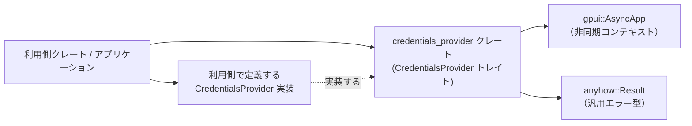
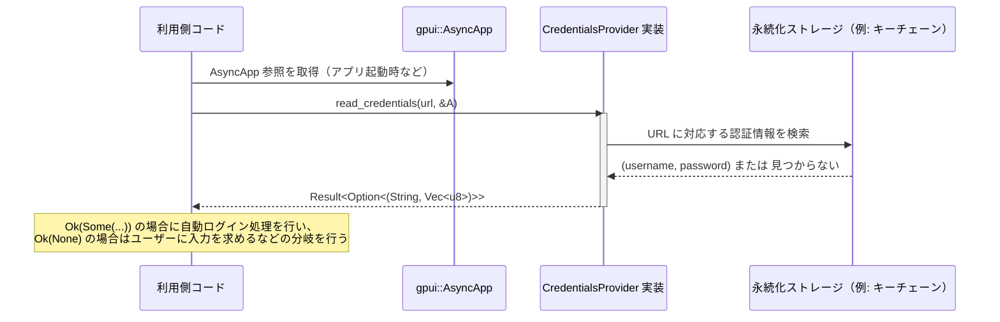

# credentials_provider ディレクトリ解説

## 1. ざっくり一言

`credentials_provider` クレートは、URL をキーとして認証情報（ユーザー名とパスワードなど）を **非同期に読み書き・削除するためのトレイト `CredentialsProvider`** を提供する、小さな抽象化クレートです。

---

## 2. このモジュールの役割

### 2.1 概要

- このクレートは、認証情報をどのような永続化手段（システムキーチェーン、ファイル、メモリなど）で扱うかをアプリケーションから切り離すために存在します。
- 具体的には、`CredentialsProvider` トレイトだけを定義し、**実際の保存先や実装方法は別の型に委ねる**構造になっています。
- すべての操作（読み取り・書き込み・削除）は、`Future` を返す形で **非同期 API** として提供されます。

### 2.2 アーキテクチャ内での位置づけ

このクレート自体はトレイト定義のみを持ち、他クレートから利用される立場です。依存関係のイメージは次のようになります（実装クレートは概念的なものです）。



- 利用側クレート／アプリは、
  - `CredentialsProvider` トレイトを参照して抽象的に認証情報を扱います。
  - 自前でこのトレイトを実装した型（例: OS キーチェーン連携実装）を用意します。
- `gpui::AsyncApp` は、非同期実行用のコンテキストとして各メソッドに渡されます（詳細な API はこのコードからは分かりません）。
- エラーは `anyhow::Result` で表現され、具体的なエラー型に依存しない設計になっています。

### 2.3 設計上のポイント

コードから読み取れる特徴を整理します。

- **トレイトのみ**  
  - クレート内には `CredentialsProvider` トレイトだけが公開されており、具体的な実装は含まれていません。
- **スレッド安全性**  
  - `pub trait CredentialsProvider: Send + Sync` となっており、実装型はスレッド間で安全に共有できることが前提です。
- **非同期 API**  
  - 各メソッドは `Pin<Box<dyn Future<...> + 'a>>` を返し、非同期処理として認証情報を扱う設計です。
  - Rust の現状ではトレイトメソッドを直接 `async fn` にできないため、このような「boxed future」パターンが使われています。
- **キーとなる URL**  
  - 認証情報は `url: &str` をキーとして扱われます。URL の具体的な形式やバリデーション方針は、このトレイトからは読み取れません。
- **`AsyncApp` コンテキスト**  
  - すべてのメソッドに `cx: &AsyncApp` が渡されます。gpui 由来の非同期アプリケーションコンテキストであり、実装側で非同期タスクのスケジューリングなどに使われる可能性がありますが、詳細はこのコードだけでは分かりません。

---

## 3. 主要な機能一覧

このクレート（トレイト）が提供する主要な機能は次の 3 つです。

- 認証情報の読み取り:  
  URL をキーに、保存済みの `(ユーザー名, パスワードバイト列)` を非同期に取得する。
- 認証情報の書き込み:  
  URL・ユーザー名・パスワードバイト列を非同期に保存する。
- 認証情報の削除:  
  指定した URL に対応する認証情報を非同期に削除する。

---

## 4. 関数・構造体の解説

### 4.1 型一覧（構造体・列挙体など）

このディレクトリに登場する主要な型をまとめます。

| 名前 | 種別 | 役割 / 用途 |
|------|------|-------------|
| `CredentialsProvider` | トレイト | 認証情報の読み取り・書き込み・削除を抽象化する非同期プロバイダ |
| `AsyncApp` | 構造体（外部, `gpui` クレート） | 非同期アプリケーションコンテキスト。各メソッドに参照として渡される |
| `Result<T>` | 型エイリアス（外部, `anyhow` クレート） | `anyhow::Result<T>`。エラー発生時に任意のエラー情報を格納する |
| `Future` | トレイト（標準ライブラリ） | 非同期計算を表すトレイト。各メソッドは `Future` を格納した `Pin<Box<...>>` を返す |

### 4.2 関数詳細（トレイトメソッド）

#### `CredentialsProvider` トレイト全体

```rust
pub trait CredentialsProvider: Send + Sync {
    fn read_credentials<'a>(
        &'a self,
        url: &'a str,
        cx: &'a AsyncApp,
    ) -> Pin<Box<dyn Future<Output = Result<Option<(String, Vec<u8>)>>> + 'a>>;

    fn write_credentials<'a>(
        &'a self,
        url: &'a str,
        username: &'a str,
        password: &'a [u8],
        cx: &'a AsyncApp,
    ) -> Pin<Box<dyn Future<Output = Result<()>> + 'a>>;

    fn delete_credentials<'a>(
        &'a self,
        url: &'a str,
        cx: &'a AsyncApp,
    ) -> Pin<Box<dyn Future<Output = Result<()>> + 'a>>;
}
```

- トレイト自体には実装がなく、**利用側がこのトレイトを実装した型を定義して使う**想定です。
- 各メソッドの詳細は以下で説明します。

---

#### `read_credentials<'a>(&'a self, url: &'a str, cx: &'a AsyncApp) -> Pin<Box<dyn Future<Output = Result<Option<(String, Vec<u8>)>>> + 'a>>`

**概要**

- 指定された `url` に紐づく認証情報を、非同期に読み取ります。
- 認証情報が存在しない場合に備えて、戻り値は `Option<(String, Vec<u8>)>` になっており、`None` が返る可能性があります。

**引数**

| 引数名 | 型 | 説明 |
|--------|----|------|
| `self` | `&'a self` | `CredentialsProvider` を実装したオブジェクトへの参照です。 |
| `url` | `&'a str` | 認証情報のキーとなる URL 文字列です。形式の厳密さはトレイトからは分かりません。 |
| `cx` | `&'a AsyncApp` | gpui の非同期アプリケーションコンテキストです。実装側で非同期処理に用いる想定ですが、詳細は不明です。 |

**戻り値**

- `Pin<Box<dyn Future<Output = Result<Option<(String, Vec<u8>)>>> + 'a>>`
  - `.await` すると `anyhow::Result<Option<(String, Vec<u8>)>>` が得られます。
  - `Ok(Some((username, password_bytes)))`  
    - `username: String` … 保存されていたユーザー名  
    - `password_bytes: Vec<u8>` … パスワードなど、機密情報を表すバイト列
  - `Ok(None)` … 指定した `url` に対応する認証情報が保存されていないことを意味します。
  - `Err(e)` … 何らかのエラー。具体的なエラー種別は実装側に依存します。

**内部処理の流れ（アルゴリズム）**

- このメソッドはトレイトのシグネチャのみが定義されており、**具体的な処理内容は実装側に完全に委ねられています。**
- そのため、どのようなストレージを使うか、どのようなフォーマットで保存するか、などの詳細はこのコードからは分かりません。

**Examples（使用例）**

認証情報が存在すれば自動ログインを試みるようなコード例です。

```rust
use credentials_provider::CredentialsProvider;          // トレイトのインポート
use gpui::AsyncApp;                                     // 非同期コンテキスト
use anyhow::Result;

// provider: CredentialsProvider を実装した型への参照を受け取る
async fn try_auto_login(
    provider: &dyn CredentialsProvider,                 // 抽象的なプロバイダ
    url: &str,                                          // サービスの URL
    cx: &AsyncApp,                                      // AsyncApp コンテキスト
) -> Result<()> {
    // 認証情報を非同期に読み取る。await の結果は Result<Option<...>> になる。
    if let Some((username, password)) = provider.read_credentials(url, cx).await? {
        // username: String
        // password: Vec<u8>（任意のバイナリデータ）
        println!("Stored credentials found for {url}: user={username}");
        // ここで password を使って実際のログイン処理などを行う
    } else {
        println!("No stored credentials for {url}");
        // 必要なら新しくユーザーに入力させるなどの処理を行う
    }

    Ok(())
}
```

**Errors / Panics**

- `Err(...)` になる条件は、実装ごとに異なります。
  - 例としては、基盤ストレージへの I/O 失敗や、暗号化キーの取得失敗などが考えられますが、コードからは断定できません。
- トレイト定義からは `panic!` の有無は分かりません。実装側の設計に依存します。

**Edge cases（エッジケース）**

- 認証情報が未保存の場合  
  - `Ok(None)` が返る設計であり、**「エラー」ではなく「データなし」**として扱うことができます。
- `url` が空文字列や不正な形式だった場合  
  - どう扱うかは実装次第です。このトレイト定義だけでは挙動は分かりません。
- 非 ASCII 文字を含む `username` / バイト列としてのパスワード  
  - 読み取り側は `String` / `Vec<u8>` として取得するため、UTF-8 前提かどうかなどは実装に依存します。

**使用上の注意点**

- `Option` の戻り値を必ずチェックし、`None` を「未保存」の状態として扱うのが自然です。
- パスワードは `Vec<u8>` で表現されるため、**テキストではなく任意のバイナリ**である可能性があります。安易に `String` に変換しない方が安全です。
- 戻り値の `Future` は `Pin<Box<...>>` ですが、通常の `Future` と同様に `.await` して構いません。

---

#### `write_credentials<'a>(&'a self, url: &'a str, username: &'a str, password: &'a [u8], cx: &'a AsyncApp) -> Pin<Box<dyn Future<Output = Result<()>> + 'a>>`

**概要**

- 指定された `url` に対して、`username` と `password` を非同期に保存します。
- 既に保存済みの情報がある場合に上書きするかどうかなどの挙動は、このトレイト定義からは分かりません（実装側次第です）。

**引数**

| 引数名 | 型 | 説明 |
|--------|----|------|
| `self` | `&'a self` | プロバイダ実装への参照です。 |
| `url` | `&'a str` | 認証情報のキーとなる URL 文字列です。 |
| `username` | `&'a str` | 保存したいユーザー名です。 |
| `password` | `&'a [u8]` | 保存したいパスワード（またはトークン等）のバイト列です。 |
| `cx` | `&'a AsyncApp` | 非同期コンテキストです。 |

**戻り値**

- `Pin<Box<dyn Future<Output = Result<()>> + 'a>>`
  - `.await` すると `anyhow::Result<()>` になります。
  - `Ok(())` … 書き込みに成功したことを意味します。
  - `Err(e)` … 書き込みに失敗したことを意味します。エラーの詳細は実装に依存します。

**内部処理の流れ**

- トレイト定義のみで具体的な処理は記述されていません。
- 一般的には、何らかのストレージに `(username, password)` を保存するロジックが実装されると考えられますが、コードからは断定できません。

**Examples（使用例）**

ログイン成功後に認証情報を保存する処理の例です。

```rust
use credentials_provider::CredentialsProvider;          // トレイト
use gpui::AsyncApp;
use anyhow::Result;

async fn on_login_success(
    provider: &dyn CredentialsProvider,                 // プロバイダ
    url: &str,                                          // サービス URL
    username: &str,                                     // ログインに使用したユーザー名
    password: &[u8],                                    // ログインに使用したパスワード
    cx: &AsyncApp,                                      // AsyncApp コンテキスト
) -> Result<()> {
    // 認証情報を保存する（エラー時は ? で呼び出し元に伝播）
    provider
        .write_credentials(url, username, password, cx)
        .await?;

    Ok(())
}
```

**Errors / Panics**

- `Err(...)` になる条件は実装依存です。例としては、ストレージの書き込み失敗、権限不足などが考えられますが、コードからは判断できません。
- `panic!` の可能性についても、トレイト定義からは分かりません。

**Edge cases（エッジケース）**

- 既に同じ `url` で保存済みの場合
  - 上書きするか、エラーにするかは実装依存です。このトレイトからは読み取れません。
- `password` が空の配列 `&[]` の場合
  - それを許容するかどうかも実装に依存します。
- 非 UTF-8 なバイト列
  - `password` は `&[u8]` なので、暗号化済みデータなども扱える柔軟な設計です。

**使用上の注意点**

- ユーザーに再度入力してもらうのが難しい秘密情報を扱うことが多いため、呼び出し側で `Err` を無視せず、適切にログや UI で通知することが重要です。
- パスワードバイト列をログや標準出力に出さないように注意する必要があります。

---

#### `delete_credentials<'a>(&'a self, url: &'a str, cx: &'a AsyncApp) -> Pin<Box<dyn Future<Output = Result<()>> + 'a>>`

**概要**

- 指定された `url` に紐づく認証情報を、非同期に削除します。
- 認証情報が存在しない場合にどう扱うか（成功扱いにするか、エラーにするか）は実装に依存します。

**引数**

| 引数名 | 型 | 説明 |
|--------|----|------|
| `self` | `&'a self` | プロバイダ実装への参照です。 |
| `url` | `&'a str` | 削除対象の認証情報に対応する URL 文字列です。 |
| `cx` | `&'a AsyncApp` | 非同期コンテキストです。 |

**戻り値**

- `Pin<Box<dyn Future<Output = Result<()>> + 'a>>`
  - `.await` すると `anyhow::Result<()>` になります。
  - `Ok(())` … 削除処理が正常に完了したことを意味します（既に存在しなかったケースも含むかどうかは実装依存）。
  - `Err(e)` … 削除に失敗したことを意味します。

**内部処理の流れ**

- トレイト定義のみで、削除処理の詳細は書かれていません。
- 実際には、ストレージからエントリを削除する操作が実装されると考えられますが、コードからは断定できません。

**Examples（使用例）**

ログアウト時に保存済み認証情報を削除する例です。

```rust
use credentials_provider::CredentialsProvider;          // トレイト
use gpui::AsyncApp;
use anyhow::Result;

async fn on_logout(
    provider: &dyn CredentialsProvider,                 // プロバイダ
    url: &str,                                          // 対象サービス URL
    cx: &AsyncApp,                                      // AsyncApp コンテキスト
) -> Result<()> {
    // 認証情報を削除する
    provider.delete_credentials(url, cx).await?;

    Ok(())
}
```

**Errors / Panics**

- `Err(...)` になる条件は実装依存です。例としては、ストレージ側の削除 API 失敗などが考えられますが、コードからは分かりません。
- `panic!` の有無も同様に実装依存です。

**Edge cases（エッジケース）**

- そもそも認証情報が存在しない場合
  - 成功とみなすか、エラーとするかは実装に依存します。
- `url` の形式が不正な場合
  - どのように扱うかはトレイトからは分かりません。

**使用上の注意点**

- ログアウト時などに削除してもよいか（「次回も自動ログインさせたいかどうか」）はアプリケーション仕様次第です。
- 認証情報を削除した後は、次回利用時に `read_credentials` が `Ok(None)` を返すことを前提に呼び出し側のフローを設計する必要があります。

---

### 4.3 その他の関数

- このファイルには、上記 3 つのトレイトメソッド以外の関数は定義されていません。

---

## 5. データフロー

ここでは、代表的な利用イメージとして「自動ログインのために認証情報を読み出す」シナリオのデータフローを示します。  
あくまで一般的なパターンの説明であり、具体的なストレージや実装はこのコードからは分かりません。



要点:

- 利用側コードは `AsyncApp` の参照を何らかの方法で取得し、それを `CredentialsProvider` 実装に渡します。
- `read_credentials` の戻り値は `Future` であり、`.await` したタイミングでストレージアクセスなどが完了して結果が得られる想定です。
- 認証情報が存在しないケースは `Ok(None)` として扱うことで、「エラー」と「未保存」を区別したフロー設計が可能です。

---

## 6. 使い方（How to Use）

### 6.1 基本的な使用方法

1. `CredentialsProvider` トレイトを実装した型を用意する（このクレートには含まれていないため、利用側で定義します）。
2. アプリケーションのどこかで、その実装型のインスタンスを生成し共有する。
3. 認証情報が必要な場面で、`read_credentials` / `write_credentials` / `delete_credentials` を `.await` して利用します。

利用側コードからの呼び出し例（トレイトの実装は既に存在すると仮定）:

```rust
use credentials_provider::CredentialsProvider;          // このクレートのトレイト
use gpui::AsyncApp;
use anyhow::Result;

// ここでは CredentialsProvider を実装した型への参照を受け取っていると仮定する
async fn login_flow(
    provider: &dyn CredentialsProvider,                 // 認証情報プロバイダ
    url: &str,                                          // サービス URL
    cx: &AsyncApp,                                      // AsyncApp コンテキスト
) -> Result<()> {
    // 1. 既存の認証情報があれば使ってログインを試みる
    if let Some((username, password)) = provider.read_credentials(url, cx).await? {
        // 認証情報を利用してログイン処理を行う
        println!("Trying auto-login as {username}...");
        // 実際のログイン処理はアプリ側で実装する
    } else {
        // 認証情報が保存されていない場合の処理
        // ここでユーザーに新しい資格情報を入力してもらう等を行う
    }

    Ok(())
}
```

### 6.2 よくある使用パターン

#### パターン1: 自動ログイン + 初回ログイン時の保存

1. 起動時に `read_credentials` で自動ログインを試みる。
2. 自動ログインに失敗した場合、ユーザーに入力してもらった認証情報でログインし、成功したら `write_credentials` で保存する。

```rust
async fn login_or_signup(
    provider: &dyn CredentialsProvider,
    url: &str,
    cx: &AsyncApp,
) -> Result<()> {
    if let Some((username, password)) = provider.read_credentials(url, cx).await? {
        // 自動ログインを試みる
        println!("Auto-login as {username}");
        // ログイン処理は省略
    } else {
        // ユーザーに username / password を入力してもらったと仮定
        let username = "user@example.com";
        let password_bytes = b"secret-password";        // & [u8]

        // 入力された認証情報でログインし、成功すれば保存する
        provider
            .write_credentials(url, username, password_bytes, cx)
            .await?;
    }

    Ok(())
}
```

#### パターン2: ログアウト時に認証情報を削除する

ユーザーが「このデバイスに情報を残さない」設定を選んだ場合などに、ログアウト時に認証情報を削除するパターンです。

```rust
async fn logout_and_forget(
    provider: &dyn CredentialsProvider,
    url: &str,
    cx: &AsyncApp,
) -> Result<()> {
    // 認証情報を削除する
    provider.delete_credentials(url, cx).await?;

    Ok(())
}
```

### 6.3 使用上の注意点（まとめ）

- **非同期 API であること**
  - すべてのメソッドが `Future` を返すため、`async fn` 内から `.await` して呼び出す前提です。
  - 非同期ランタイム上でブロッキング I/O を行うと性能に影響が出るため、実装側は可能な限り非同期フレンドリーな I/O を使うことが望ましいです（一般論）。
- **スレッド安全性**
  - `CredentialsProvider: Send + Sync` とされているため、実装型は複数スレッドから同時に呼ばれても安全に動作する必要があります。
  - 内部状態を持つ場合は、`Mutex` や `RwLock` などの同期プリミティブを用いることが一般的です。
- **URL の一貫性**
  - `read` / `write` / `delete` で同じエントリにアクセスするには、**同じ文字列の URL** を使う必要があります。
  - 大文字小文字やトレailingスラッシュの有無などをどう扱うかは実装に依存するため、利用側で統一した形式を使うのが安全です。
- **機密情報の取り扱い**
  - 認証情報、とくに `password: &[u8]` / `Vec<u8>` は機密情報です。
    - ログに出力しない
    - デバッグのために安易に `println!` しない
    - 必要以上にコピーしない
  といった一般的なセキュリティ上の注意が必要です。
- **エラー処理**
  - `anyhow::Result` を返しているため、エラーの具体的な種類は実装ごとに異なります。
  - 利用側では、少なくとも「復旧可能なエラーかどうか」「ユーザーに通知すべきかどうか」を判断して適切にハンドリングすることが重要です。

---

## 7. 関連ファイル

| パス | 役割 / 関係 |
|------|------------|
| `credentials_provider/Cargo.toml` | クレート名・バージョン・ライセンスなどのメタデータ、ならびに依存クレート（`anyhow`, `gpui`, `serde`）を定義します。`[lib]` セクションでライブラリのエントリポイントを `src/credentials_provider.rs` に指定しています。 |
| `credentials_provider/src/credentials_provider.rs` | 本クレートの中核である `CredentialsProvider` トレイトを定義するファイルです。すべての公開 API はこのファイルに含まれています。 |

※ このディレクトリには、`CredentialsProvider` の具体的な実装やテストコードは含まれていません。実装は別クレートまたは別モジュール側で用意される前提の構成になっています。
