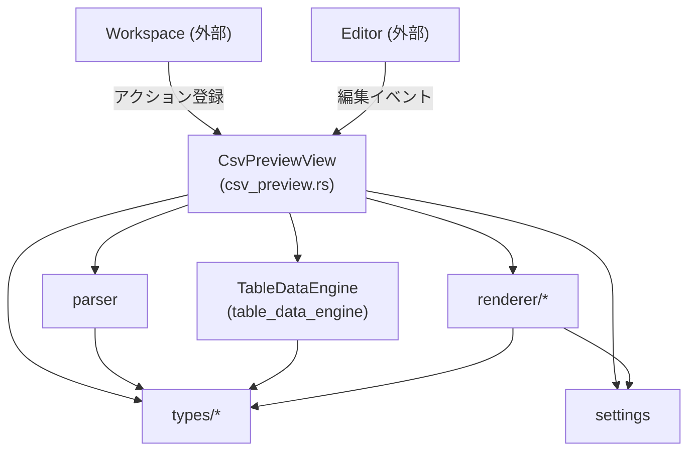
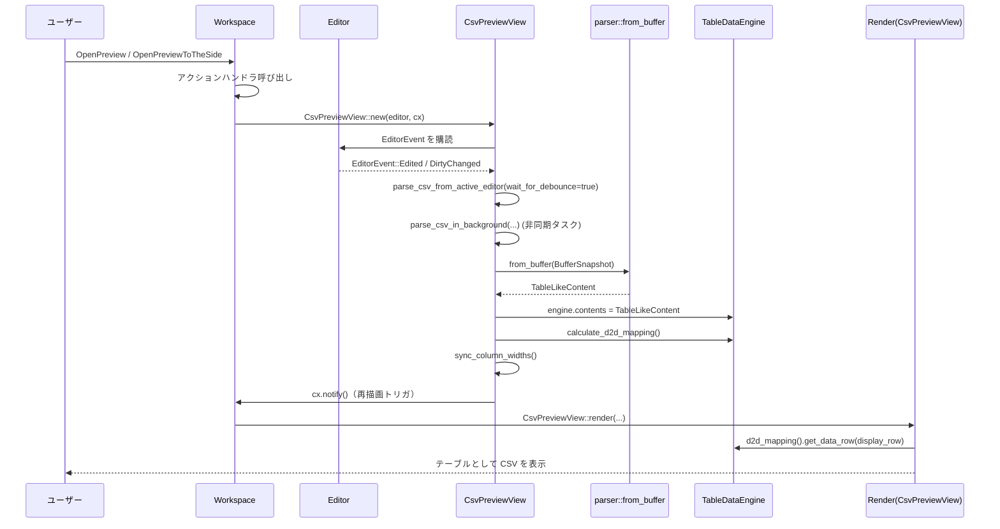

# csv_preview ディレクトリ解説

## 1. ざっくり一言

`csv_preview` は、Zed のようなエディタ内で **CSV ファイルを表形式でプレビュー表示するビュー** と、そのための **CSV パーサ・テーブルデータ管理・描画ロジック** をまとめたクレートです。

---

## 2. このモジュールの役割

### 2.1 概要

このディレクトリは、エディタ上で開いている `.csv` ファイルに対して:

- テキストバッファから CSV をパースし、
- ヘッダー行・データ行・元ファイルの行番号情報を含むテーブルデータに変換し、
- ソートや行番号表示などの操作を行いつつ、
- 仮想リスト（可変/固定高さ）で効率的に表を描画する

という一連の処理を提供します。  
UI への統合は `Workspace` や `Editor` など外部クレートを通じて行われます。

### 2.2 アーキテクチャ内での位置づけ

ディレクトリ内の主なモジュールの関係を、簡略化して示します。



- `CsvPreviewView` がこのクレートの中心で、
  - エディタとワークスペースへの登録
  - パーサ（`parser`）
  - データエンジン（`table_data_engine`）
  - レンダラー（`renderer/*`）
  をまとめて扱います。
- `types/*` は座標系やセル型など、共通のドメイン型を提供します。
- `settings` はレンダリング挙動の簡易設定をまとめます。

### 2.3 設計上のポイント（コードから読み取れる範囲）

- **責務の分割**
  - `csv_preview.rs`: ビュー本体・ワークスペースとの統合・パース/ソートのトリガー
  - `parser.rs`: テキストバッファからの CSV パースと `TableLikeContent` 生成
  - `table_data_engine*`: ソートなどの「データ ↔ 表示」変換ロジック
  - `renderer/*`: GPUI を使ったテーブル描画（行番号・ヘッダー・セルなど）
  - `types/*`: 行/列/セル/行番号などの型定義
  - `settings.rs`: レンダリングオプション
- **座標系の分離**
  - 元データの行 (`DataRow`) と表示上の行 (`DisplayRow`) を分離し、
    ソートをしても元データのインデックスは保持されます。
- **非同期パース + デバウンス**
  - 編集イベントごとに非同期タスクでパースしつつ、
    200ms の「クールダウン」を導入して過剰な再パースを抑制しています。
- **仮想リスト**
  - 行ごとに `DisplayRow` を使い、可変高さ or 固定高さリストでレンダリングすることで、
    大きな CSV にも対応できる形になっています。
- **性能測定フック**
  - `PerformanceMetrics` で「Parsing」「Sort」「Filter&sort」「render_prep」などの処理時間と描画行インデックスを記録する仕組みを持っています。

---

## 3. 主要な機能一覧

このディレクトリが提供する主な機能を列挙します。

- **CSV プレビューのワークスペース統合**
  - Feature flag (`TabularDataPreviewFeatureFlag`) とアクション (`OpenPreview`, `OpenPreviewToTheSide`) 経由で、エディタ内に CSV プレビュービューを開く。
- **CSV テキストのパース**
  - `parser::from_buffer` / `parse_csv_with_positions` により、  
    引用符・カンマ・改行・Windows/Mac 改行コード・改行を含むセルなどを扱うシンプルな CSV パーサ。
- **テーブル状データコンテナ**
  - `TableLikeContent` に、ヘッダー・データ行・列数・元ファイル行番号 (`LineNumber`) を格納。
- **データ行のソート**
  - `AppliedSorting` と `sort_data_rows`、`TableDataEngine` を通じて、任意の列で昇順/降順ソート。
- **Display ↔ Data 行マッピング**
  - ソート結果を `DisplayToDataMapping` によって表示行 (`DisplayRow`) → データ行 (`DataRow`) に変換。
- **テーブル描画（レンダリング）**
  - 行番号列（ソース行番号 or 1-based 行番号）
  - ソートボタン付きヘッダー
  - セル内容の表示・ツールチップ
  - 行ごとのデバッグ情報（セル位置・オフセット）
- **行番号表示モード**
  - `LineNumber::Line` / `LineRange` と `RowIdentifiers` 設定により、
    「ソース行番号（単一行/複数行）」または「単純な 1,2,3...」を表示。
- **レンダリング設定**
  - フォント種別（UI / 等幅）
  - 縦方向揃え（上揃え / 中央揃え）
  - 行レンダリング方式（可変高さ / 固定高さ）
  - デバッグ表示有無・複数行セル表示モードなど。

---

## 4. 関数・構造体の解説

ここでは、代表的な型と関数に絞って解説します。

### 4.1 ビューとエントリポイント

#### `init(cx: &mut App)`

**概要**

- アプリケーション初期化時に呼ばれるエントリポイントです。
- 新しい `Workspace` が生成されるたびに、CSV プレビュー用のアクション (`OpenPreview`, `OpenPreviewToTheSide`) を登録します。

**内部処理の流れ**

1. `cx.observe_new(|workspace: &mut Workspace, _, _| { ... })` で `Workspace` の生成を監視。
2. 新しい `Workspace` が現れたら `CsvPreviewView::register(workspace)` を呼び出し。
3. 監視タスクは `.detach()` され、バックグラウンドで維持されます。

**使用上の注意点**

- 実際のアプリケーション側が、この `init` をどこかで一度呼ぶ前提になっています。
- `Workspace` / `Editor` 自体の初期化方法はこのクレートには含まれていません。

---

#### `pub struct CsvPreviewView`

**役割**

- 1つの CSV ファイルに対応する **プレビュービュー** の状態を保持し、
  - パース結果 (`engine.contents`)
  - ソート状態 (`engine.applied_sorting` と `d2d_mapping`)
  - レンダリング設定 (`settings`)
  - 列幅 (`column_widths`)
  - スクロール・フォーカス状態
  などをまとめて管理します。

**主なフィールド（抜粋）**

- `engine: TableDataEngine`  
  CSV データと Display ↔ Data 行マッピング、ソート状態を管理します。
- `active_editor_state: EditorState`  
  対象となる `Editor` と、そのイベント購読 (`Subscription`) を保持します。
- `column_widths: ColumnWidths`  
  列の幅を保持/再計算するための `RedistributableColumnsState` エンティティのラッパーです。
- `list_state: gpui::ListState`  
  仮想リストの表示範囲などの状態です。
- `performance_metrics: PerformanceMetrics`  
  処理時間や描画された行インデックスを記録します。

---

#### `fn register(workspace: &mut Workspace)`

**概要**

- `Workspace` に対して、CSV プレビュー関連のアクションとそのハンドラを登録します。

**主な挙動**

- feature flag `TabularDataPreviewFeatureFlag` が有効な場合にのみ動作します。
- `OpenPreview` 受信時:
  - `Workspace::active_item` から `Editor` を取得し、`is_csv_file` で拡張子 `.csv` を確認。
  - 対応する `CsvPreviewView` が既にアクティブペインにあるか探し、
    - あればそのタブをアクティブ化。
    - なければ新しく `CsvPreviewView::new` で生成し、ペインに追加。
- `OpenPreviewToTheSide` 受信時:
  - 右側のペイン（なければ分割して新規作成）にプレビュービューを開く点だけが異なります。

**Edge cases**

- アクティブアイテムが `Editor` ではない、またはファイル拡張子が `.csv` でない場合は何もしません。
- 同じ `Editor` に対するプレビューがすでに存在するとき、重複してビューを追加しないようにチェックしています。

---

#### `fn new(editor: &Entity<Editor>, cx: &mut Context<Workspace>) -> Entity<Self>`

**概要**

- 指定された `Editor` に対する `CsvPreviewView` を初期化します。
- エディタの編集イベントを購読し、内容変更時に CSV の再パースを行うよう設定します。

**内部処理（簡略）**

1. `TableLikeContent::default()` を基に、初期 `ListState` を作成。
2. `TableInteractionState` を新規エンティティとして生成し、スクロールバー設定をエディタ設定に合わせる。
3. `cx.subscribe` を使って `EditorEvent` を購読。
   - `EditorEvent::Edited` / `EditorEvent::DirtyChanged` で `parse_csv_from_active_editor(true, cx)` を呼び出す。
4. `CsvPreviewView` をフィールド初期化し、その場で `parse_csv_from_active_editor(false, cx)` により初回パースを実行（デバウンス無し）。

**使用上の注意点**

- `EditorState` に `Subscription` を保持しているため、ビューのライフサイクルと購読が連動します。
- `TableDataEngine::default()` では `contents` が空なので、初回パース前はテーブルは空です。

---

### 4.2 パーサとテーブルデータ

#### `pub fn from_buffer(buffer_snapshot: &BufferSnapshot) -> TableLikeContent`

**概要**

- テキストバッファのスナップショットから CSV をパースし、`TableLikeContent` 構造体に変換します。
- 1行目をヘッダーとして扱い、以降をデータ行とします。

**処理の流れ**

1. `buffer_snapshot.text()` で全テキストを取得。
2. テキストが空または空白のみの場合は `TableLikeContent::default()` を返す。
3. `parse_csv_with_positions(&text)` を呼び出し、
   - 各セルの文字列と文字オフセット範囲、
   - 行番号情報 (`Vec<LineNumber>`) を得る。
4. 結果が空であれば `Default` を返す。
5. 最初の行をヘッダー (`raw_headers`) とし、残りの行数から最大列数 (`max_number_of_cols`) を算出。
6. `create_table_row` を用いて、
   - ヘッダー行・各データ行を `TableRow<TableCell>` に変換。
   - 列数が足りない行には `TableCell::Virtual` を追加して幅を揃える。
7. 行番号情報は 1行目（ヘッダー）をスキップし、データ行分だけを格納。

**戻り値**

- `TableLikeContent`  
  - `number_of_cols`: 最大列数
  - `headers`: ヘッダー行
  - `rows`: データ行
  - `line_numbers`: データ行に対応する元ファイル行情報

**Edge cases**

- 空テキスト・全空白テキスト: 完全に空のテーブルを返します。
- ヘッダーだけでデータ行がない場合: ヘッダーのみのテーブルになります。
- 行によって列数が異なる場合: 不足分は `TableCell::Virtual` で埋められます。

**使用上の注意点**

- 1行目が必ずヘッダーとして扱われる設計です（設定で切り替える機構はこのコードにはありません）。
- `line_numbers` は **ヘッダーを除いた行** のみを保持するため、`rows` とインデックスを合わせる必要があります。

---

#### `fn parse_csv_with_positions(text: &str) -> (Vec<Vec<(SharedString, Range<usize>)>>, Vec<LineNumber>)`

**概要**

- 簡易 CSV パーサです。
- 各セルの「表示用文字列」と「元テキスト内のバイト範囲」、各行に対応する `LineNumber` 情報を生成します。

**扱っている要素**

- ダブルクォートで囲まれたフィールド
  - 内部にカンマ・改行を含めることができます。
  - `""` 連続はエスケープされた `"` として扱われます。
- 区切り文字: カンマ `,`
- 改行: `\n`, `\r\n`, 単独の `\r`
- 空行や空白のみの行は行としてカウントされません。

**基本アルゴリズム**

1. `chars = text.chars().peekable()` と `current_offset`（バイトオフセット）で全体を走査。
2. 状態として
   - `in_quotes`: 現在クォート内かどうか
   - `current_field`: 現在のセルの中身（クォートは含まない）
   - `field_start_offset`: セルの開始バイト位置（クォート含む）
   - `current_row`: `Vec<(SharedString, Range<usize>)>`
   - 行番号カウンタ `current_line`, `row_start_line`
   を持ちます。
3. 文字ごとに分岐:
   - `"`:
     - `in_quotes == true` かつ次も `"` → エスケープされた `"` を `current_field` に追加。
     - それ以外 → クォートの開始/終了をトグルする。
   - `,` かつ `!in_quotes`:
     - フィールド終端として扱い、`(current_field, field_start_offset..current_offset)` を行に追加。
   - 改行（`\n` / `\r`）かつ `!in_quotes`:
     - その行を `rows` に追加（全セルが空白のみならスキップ）。
     - 行の開始/終了行から `LineNumber::Line` or `LineRange` を生成。
   - クォート内では改行も `current_field` にそのまま追加。
4. 最後の行・セルを処理して結果を返します。

**重要な仕様（テストから分かる点）**

- クォート付きフィールドの **表示文字列** は外側のクォートを除いたものになります。
  - 例: `"se,cond"` → `"se,cond"`
- しかし **バイト範囲** (`Range<usize>`) は外側のクォートも含みます。
  - テスト `test_csv_parsing_quote_offset_handling` より:
    - `"se,cond"` の範囲は `6..15`（クォート含む）
- 行番号 (`LineNumber`) は、複数行のセルを含む場合は
  - `LineRange(start, end)` でソース上の複数行範囲を表現します。

**使用上の注意点**

- RFC 4180 など完全な仕様準拠ではなく、「実用的な範囲の簡易 CSV パーサ」と解釈できます。
- 非 ASCII 文字も `char.len_utf8()` でバイトオフセットを管理しています。

---

#### `pub enum TableCell` / `pub struct CellContentSpan`

**概要**

- 1セル分の内容と、そのセルがバッファ内のどの範囲に対応するかを表現します。

**バリエーション**

- `TableCell::Real { position: CellContentSpan, cached_value: SharedString }`
  - 実際に CSV 中に存在するセル。
  - `CellContentSpan` 内のアンカー (`Anchor`) を介して、元テキストの位置を追跡できます。
- `TableCell::Virtual`
  - 欠損しているセルをテーブル幅に合わせるための「埋め草」セル。

**主なメソッド**

- `from_buffer_position(content, start_offset, end_offset, buffer_snapshot)`
  - `start_offset` / `end_offset` バイト位置から `Anchor` を生成し、`Real` セルを作成します。
- `display_value(&self) -> Option<&SharedString>`
  - `Real` セルの内容を返し、`Virtual` セルは `None` を返します。

**Edge cases**

- `Virtual` セルは `display_value` が `None` なので、表示時に `unwrap_or_default()` などで空文字にフォールバックしている箇所があります（`render_table.rs` 参照）。

---

#### `#[derive(Clone)] pub struct TableLikeContent`

**概要**

- 1つの CSV（または CSV 互換フォーマット）の内容全体を、テーブル形式で保持する構造体です。

**フィールド**

- `number_of_cols: usize`  
  テーブルの論理列数。
- `headers: TableRow<TableCell>`  
  ヘッダー行（必ず 1 行のみ）。
- `rows: Vec<TableRow<TableCell>>`  
  データ行。
- `line_numbers: Vec<LineNumber>`  
  `rows` と同じインデックスで、元ファイルの行情報を保持します。

**メソッド**

- `fn get_row(&self, data_row: DataRow) -> Option<&TableRow<TableCell>>`
  - `DataRow` を使って行を取得します。

**使用上の注意点**

- `line_numbers` は常に `rows` と同じ長さであることが前提になっています（`LineIdentifiers::SrcLines` でインデックス参照します）。
- 新たに `contents` を構築する場合は、この対応関係を維持する必要があります。

---

### 4.3 データエンジンとソート

#### `pub(crate) struct TableDataEngine`

**概要**

- ソート状態と Display ↔ Data 行マッピング、および `TableLikeContent` 本体を管理する小さなエンジンです。
- UI からは `CsvPreviewView` 経由で利用されます。

**主なフィールド**

- `applied_sorting: Option<AppliedSorting>`  
  現在のソート条件（列・方向）。
- `d2d_mapping: DisplayToDataMapping`  
  表示行 → データ行マッピング。
- `contents: TableLikeContent`  
  パース済みの全テーブルデータ。

**主なメソッド**

- `fn d2d_mapping(&self) -> &DisplayToDataMapping`
- `fn apply_sort(&mut self)`
  - 現在の `applied_sorting` と `contents.rows` を元にソートを行い、`d2d_mapping` を更新します。
- `fn calculate_d2d_mapping(&mut self)`
  - コメントでは「ソートとフィルタを適用」とありますが、現状コード上はソートのみを行っています。
  - `apply_sorting` → `merge_mappings` と同じ処理です（将来的なフィルタ機能の拡張を想定した名前と読み取れますが、コードからは断定できません）。

---

#### `pub struct DisplayToDataMapping`

**概要**

- 表示行（`DisplayRow`）から元データの行（`DataRow`）への変換を保持する構造体です。

**フィールド**

- `sorted_rows: Vec<DataRow>`
  - ソート済みの全データ行 ID。
- `mapping: Arc<HashMap<DisplayRow, DataRow>>`
  - 表示行 → データ行の対応表。

**主なメソッド**

- `get_data_row(display_row: DisplayRow) -> Option<DataRow>`
  - レンダリング時に表示行から元行を取得するために使われます。
- `visible_row_count() -> usize`
  - 可視行数。現在は `mapping.len()` そのものです。
- `fn apply_sorting(&mut self, sorting: Option<AppliedSorting>, rows: &[TableRow<TableCell>])`
  - `DataRow(0..rows.len())` を作り、`sort_data_rows` でソートします。
- `fn merge_mappings(&mut self)`
  - `sorted_rows` を 0..N の `DisplayRow` に対応付け、`mapping` を再構築します。

---

#### `pub fn sort_data_rows(...) -> Vec<DataRow>`

**概要**

- 指定列で `DataRow` のリストを昇順/降順にソートします。
- 実際の値比較は `TableRow<TableCell>` の `display_value()` を経由した文字列比較です。

**ソートキーの扱い**

- 対象列のセルが存在しない、または `Virtual` など値が取れない場合は空文字 `""` として比較されます。
- `SortDirection::Asc` / `Desc` に応じて比較結果を反転させます。

**使用上の注意点**

- 値は全て文字列比較 (`&str::cmp`) なので、数値としてソートされるわけではありません。
- `null`/空セルの扱い順（先頭 or 末尾）は TODO コメントにあり、現状は空文字として通常の辞書順に組み込まれます。

---

### 4.4 座標系と行番号

#### `DisplayRow`, `DataRow`, `AnyColumn`, `DisplayCellId`

**概要**

- テーブル内の位置を表す「座標系」を新しい型（newtype）として定義しています。

**型ごとの役割**

- `DisplayRow(usize)`
  - レンダリング上の行インデックス。
  - ソートやフィルタ後の行位置を表します。
- `DataRow(usize)`
  - 元 CSV データ上の行インデックス（`TableLikeContent.rows` のインデックス）。
- `AnyColumn(usize)`
  - 0 ベースの列インデックス。
  - コメントにもある通り、現時点では表示列とデータ列を区別していません。
- `DisplayCellId { row: DisplayRow, col: AnyColumn }`
  - 表示上のセル位置（行・列）をまとめた識別子です。
  - `to_raw()` で `(usize, usize)` に変換できます。

**使用例（抽象形）**

```rust
// 表示 10 行目・2 列目のセル ID を作成
let cell_id = DisplayCellId::new(DisplayRow::new(9), AnyColumn::new(1));

// (9, 1) という生のインデックスに変換
let (row_idx, col_idx) = cell_id.to_raw();
```

---

#### `pub enum LineNumber`

**概要**

- CSV の 1 行が、元ファイルのどの行範囲に対応するかを表します。

**バリエーション**

- `Line(usize)`  
  1 行のみ（シングルラインセル）に対応する場合。
- `LineRange(usize, usize)`  
  複数行にまたがる場合。コメント上は「Incluisive」（両端含む）と書かれています。

**関連メソッド**

- `LineNumber::display_string(&self, mode: RowIdentDisplayMode) -> String`  
  （`row_identifiers.rs` 内で `impl LineNumber` として定義）
  - `RowIdentDisplayMode::Vertical`:
    - 例: `LineRange(1, 5)` → `"1\n...\n5"`
  - `RowIdentDisplayMode::Horizontal`:
    - 例: `LineRange(1, 5)` → `"1-5"`

---

### 4.5 レンダリング関連

#### `impl Render for CsvPreviewView`

**概要**

- ビュー全体の描画エントリポイントです。
- コンテンツが存在しない場合は「No CSV content to display」と表示し、  
  そうでなければ `create_table` でテーブルを描画します。

**処理の流れ**

1. `self.performance_metrics.rendered_indices.clear()` で前フレームの描画行記録をリセット。
2. `render_prep_start = Instant::now()` で準備開始時刻を記録。
3. `engine.contents.number_of_cols == 0` なら、空メッセージを中央に表示。
4. そうでなければ `self.create_table(&self.column_widths.widths, cx)` を呼ぶ。
5. 準備時間を `render_prep` として `PerformanceMetrics` に記録。

---

#### `fn create_table(&self, current_widths: &Entity<RedistributableColumnsState>, cx: &mut Context<Self>)`

**概要**

- GPUI の `Table` コンポーネントを用いて、ヘッダー行と本文行を組み立てます。

**特徴**

- ヘッダー:
  - 最初の列は `create_row_identifier_header` で行番号トグルボタン。
  - 残りの列は `create_header_element_with_sort_button` で、テキスト + ソートボタン。
- ボディ:
  - `RowRenderMechanism::VariableList` のとき:
    - `table.variable_row_height_list(row_count, self.list_state.clone(), processor)` を使用。
  - `RowRenderMechanism::UniformList` のとき:
    - `table.uniform_list("csv-table", row_count, processor)` を使用。
  - どちらも `render_single_table_row` を使って 1 行分のセルを生成します。

**Edge cases**

- `cols` は `current_widths.read(cx).cols()` を基準にするため、列幅状態との整合性が取れている必要があります。
- 行数は `engine.contents.rows.len()`（フィルタ前）ではなく、
  - `VariableList` の場合は `apply_filter_sort` 時に設定された `list_state` に依存します。

---

#### `fn render_single_table_row(...) -> Option<UncheckedTableRow<AnyElement>>`

**概要**

- 1 表示行に対応する、行番号セル + 各データセルを構築します。

**処理の流れ**

1. `d2d_mapping.get_data_row(display_row)` で表示行からデータ行を取得。
   - ソートの有無に関わらず、このマッピングを通して元データにアクセスします。
2. `engine.contents.get_row(data_row)` で `TableRow<TableCell>` を取得。
3. 先頭に行番号セル (`create_row_identifier_cell`) を追加。
4. 各データ列について:
   - `table_cell.display_value().cloned().unwrap_or_default()` で表示文字列を取り出す。
   - `DisplayCellId` を作成し、`create_selectable_cell` でセル内容を描画。
   - `show_debug_info` が有効なら、セルの `CellContentSpan` からオフセット・行情報を表示する小さいテキストを追加。

**使用上の注意点**

- `d2d_mapping` または `contents` から `None` が返る場合は `None` を返すため、
  - 呼び出し側では `unwrap_or_else(|| panic!(...))` している箇所があります。
  - そのため `DisplayRow` と `DisplayToDataMapping` の整合性を崩す変更には注意が必要です。

---

#### 行番号列関連 (`calculate_row_identifier_column_width`, `create_row_identifier_header`, `create_row_identifier_cell`)

**概要**

- 行番号列の幅と中身の描画を担当します。

**主なポイント**

- 列幅計算:
  - `RowIdentifiers::SrcLines` のときは `line_numbers` の最大行番号を基に桁数を計算。
  - `RowIdentifiers::RowNum` のときは `rows.len()` の最大桁数を基に計算。
  - 単純に `digit_count * 9.0 + 20.0` をベースにし、最低 60px 幅を確保しています。
- ヘッダー:
  - "Lines" / "Rows" のボタンをクリックすると、行番号モードがトグル。
  - トグル時に `sync_column_widths` を呼び出して列幅を再計算します。
- セル:
  - モードに応じて `LineNumber::display_string` または単純な行番号 (`1,2,3...`) を表示。
  - フォント種類は `FontType` 設定に従います。

---

#### セル描画 (`create_selectable_cell` / `create_table_cell`)

**概要**

- 各データセルのスタイルと簡単な挙動を定義します。

**特徴**

- 一意な `ElementId`（`"csv-display-cell-{row}-{col}"`）を付与。
- 背景色・ボーダー・フォント・縦位置揃えなどは `CsvPreviewSettings` とテーマから決定。
- `Tooltip::text(cell_content.clone())` により、セル内容全体がホバー時にツールチップで表示されます。

---

#### `pub struct PerformanceMetrics`

**概要**

- パース・ソート・レンダリング準備などの処理時間と、描画された行インデックスを記録するための構造体です。
- 表示向けの文字列 (`display`) も提供しています。

**主な用途**

- `record("Sort", || { ... })` のように処理をラップし、かかった時間を `timings` に保存。
- `render_single_table_row` や `uniform_list` の processor で `rendered_indices` に描画された行番号を追加。

---

## 5. データフロー

ここでは、「ユーザーが CSV ファイルを開き、編集し、プレビューが更新される」までの代表的なフローを示します。



要点:

- 編集イベントごとに非同期タスクでパースを行い、最後に `cx.notify()` で UI 再描画を要求します。
- テーブル描画時には、常に `DisplayRow` → `DataRow` → `TableLikeContent` の順でデータを辿ります。
- 行番号列は `line_numbers` または `DisplayRow` を元に計算されます。

---

## 6. 使い方（How to Use）

### 6.1 基本的な使用方法

このクレートは主に「エディタの拡張」として利用される設計です。  
アプリケーション側では、おおまかに次のような形で組み込まれることが想定されます（疑似コードです）。

```rust
use gpui::App;
use csv_preview; // ライブラリとして依存している前提

fn init_app(cx: &mut App) {
    // Workspace が生成されるたびに CSV プレビュービューを登録
    csv_preview::init(cx);
}
```

その後、ユーザーがエディタ上で `.csv` ファイルを開き、  
`OpenPreview` / `OpenPreviewToTheSide` アクションを実行すると、  
対応する `CsvPreviewView` がペインに追加され、テーブルとして表示されます。

CSV の内容を変更すると `EditorEvent::Edited` 等が飛び、  
ビュー内部で自動的に再パース・再描画が行われます。

---

### 6.2 よくある使用パターン

#### パターン 1: アクティブな CSV エディタを検出して独自の処理を行う

`CsvPreviewView::resolve_active_item_as_csv_editor` は、  
アクティブアイテムが CSV ファイルの `Editor` であればそれを返します。

```rust
use workspace::Workspace;
use editor::Editor;
use gpui::Context;
use csv_preview::CsvPreviewView;

// Workspace 内のアクティブアイテムが CSV エディタなら取得する
fn do_something_if_csv(workspace: &Workspace, cx: &mut Context<Workspace>) {
    if let Some(editor) = CsvPreviewView::resolve_active_item_as_csv_editor(workspace, cx) {
        // ここで editor を使った処理を行う
        // 例: 独自解析やメタ情報表示など
        let _ = editor;
    }
}
```

#### パターン 2: 列ヘッダーからのソート

UI 上では、列ヘッダー右側のボタンがソートトグルです。

- 初回クリック: 昇順 (`SortDirection::Asc`)
- 2回目クリック: 降順 (`SortDirection::Desc`)
- 3回目クリック: ソート解除（元順）

この挙動は `create_sort_button` 内のクリックハンドラで実装されています。  
ソート状態は `TableDataEngine.applied_sorting` に保存され、  
`apply_sort()` によって `DisplayToDataMapping` が更新されます。

#### パターン 3: 行番号表示モードの切り替え

行番号ヘッダーの "Lines" / "Rows" ボタンをクリックすることで、

- 「元ファイル行番号」表示 (`RowIdentifiers::SrcLines`)
- 「単純な行番号 1,2,3...」表示 (`RowIdentifiers::RowNum`)

の切り替えが行われます。切り替え時には列幅再計算 (`sync_column_widths`) が走り、  
長い行番号レンジ（例: `1000-2000`）にも対応できるように設計されています。

---

### 6.3 使用上の注意点（まとめ）

- **ヘッダーとデータ行**
  - パーサは最初の行をヘッダーとして扱うため、「ヘッダー無し CSV」をそのまま扱うと、1行目がヘッダーとして固定されます。
- **行番号ベクトルの対応**
  - `TableLikeContent.line_numbers` は `rows` と同じ長さであることが前提です。
  - `RowIdentifiers::SrcLines` を使う場合、インデックスのずれがあるとパニックまたは `None` になります。
- **ソートキー**
  - ソートは文字列比較のみです。数値ソートは行われません。
  - 空セルや不足セルは空文字として扱われます。
- **パース負荷とデバウンス**
  - 編集毎にパースタスクが走りますが、最後のパース終了から `REPARSE_DEBOUNCE`（200ms）以内の変更は一定時間待ってから再パースします。
  - 非同期タスクでパースしているため、非常に大きな CSV ではパース時間が `PerformanceMetrics` で確認できます。
- **テーブル幅と列幅**
  - 列幅は `RedistributableColumnsState` によって管理され、行番号列のみ固定幅 (`Absolute`) 、他は割合 (`Fraction`) です。
  - `sync_column_widths` はヘッダー列数と現在の状態が変わったときだけ再構築します。
- **複数行セル**
  - クォート内の改行はセル内の文字列として保存され、`LineNumber::LineRange` で行範囲が記録されます。
  - `multiline_cells_enabled` によって行番号表示形式を縦方向に切り替えることができますが、セル自体の折り返しなどはコードからは読み取れません。

---

## 7. 関連ファイル

このディレクトリ内の各ファイルと、その役割を一覧にします。

| パス | 役割 / 関係 |
|------|-------------|
| `csv_preview/Cargo.toml` | クレート定義。ライブラリエントリポイントを `src/csv_preview.rs` に設定し、`gpui` や `editor` などへの依存を宣言しています。 |
| `csv_preview/src/csv_preview.rs` | クレートのルート。`CsvPreviewView` 本体・ワークスペース統合 (`init`, `register`) ・パース/ソートのトリガー・性能計測 (`PerformanceMetrics`) ・列幅管理 (`ColumnWidths`) を定義します。 |
| `csv_preview/src/parser.rs` | `Editor` のバッファから CSV テキストを取得し、`from_buffer`・`parse_csv_with_positions` を通じて `TableLikeContent` を構築するパーサロジックを提供します。テスト付きで挙動が確認されています。 |
| `csv_preview/src/renderer.rs` | レンダラーのモジュール集約。`preview_view`, `render_table`, `row_identifiers`, `table_cell`, `table_header` を内部モジュールとして公開します。 |
| `csv_preview/src/renderer/preview_view.rs` | `Render` トレイトの実装。ビュー全体の描画エントリポイントであり、空メッセージまたはテーブルを表示します。 |
| `csv_preview/src/renderer/render_table.rs` | `create_table`・`render_single_table_row` など、テーブル全体および1行分の UI 組み立てロジックを実装します。仮想リスト (`VariableList` / `UniformList`) に対応します。 |
| `csv_preview/src/renderer/row_identifiers.rs` | 行番号列（ヘッダー・セル）の描画と、表示モード (`RowIdentifiers`) に応じた行番号文字列の計算、列幅計算を行います。 |
| `csv_preview/src/renderer/table_cell.rs` | 個々のデータセルの描画（スタイル・ツールチップ・フォントなど）を定義します。 |
| `csv_preview/src/renderer/table_header.rs` | ソートボタン付きヘッダーセルの描画と、ソート状態 (`AppliedSorting`) の更新ロジックを提供します。 |
| `csv_preview/src/settings.rs` | レンダリング設定用の列挙体（行レンダリング方式・縦位置揃え・フォント種別・行番号種別）と、それらをまとめた `CsvPreviewSettings` を定義します。 |
| `csv_preview/src/table_data_engine.rs` | `TableDataEngine` と `DisplayToDataMapping` を定義し、ソートや（将来的なフィルタを含めた）Display ↔ Data 行変換ロジックの中心を担います。 |
| `csv_preview/src/table_data_engine/sorting_by_column.rs` | 列単位ソートのための `AppliedSorting`, `SortDirection`, `sort_data_rows` を提供します。 |
| `csv_preview/src/types.rs` | サブモジュール `coordinates`, `table_cell`, `table_like_content` を再公開し、`LineNumber` を定義する型定義ハブです。 |
| `csv_preview/src/types/coordinates.rs` | `DisplayRow`, `DataRow`, `AnyColumn`, `DisplayCellId` など、テーブル上の位置を表す newtype 群を定義します。 |
| `csv_preview/src/types/table_cell.rs` | `TableCell` とその位置情報 (`CellContentSpan`) を定義し、テキストバッファ上のアンカーと紐づいたセル表現を提供します。 |
| `csv_preview/src/types/table_like_content.rs` | パース済み CSV 全体を保持する `TableLikeContent` を定義します。 |

この構成により、「テキストバッファ → CSV パース → テーブルデータ → Display ↔ Data マッピング → テーブル描画」という流れが、責務ごとに分割された形で実装されています。
