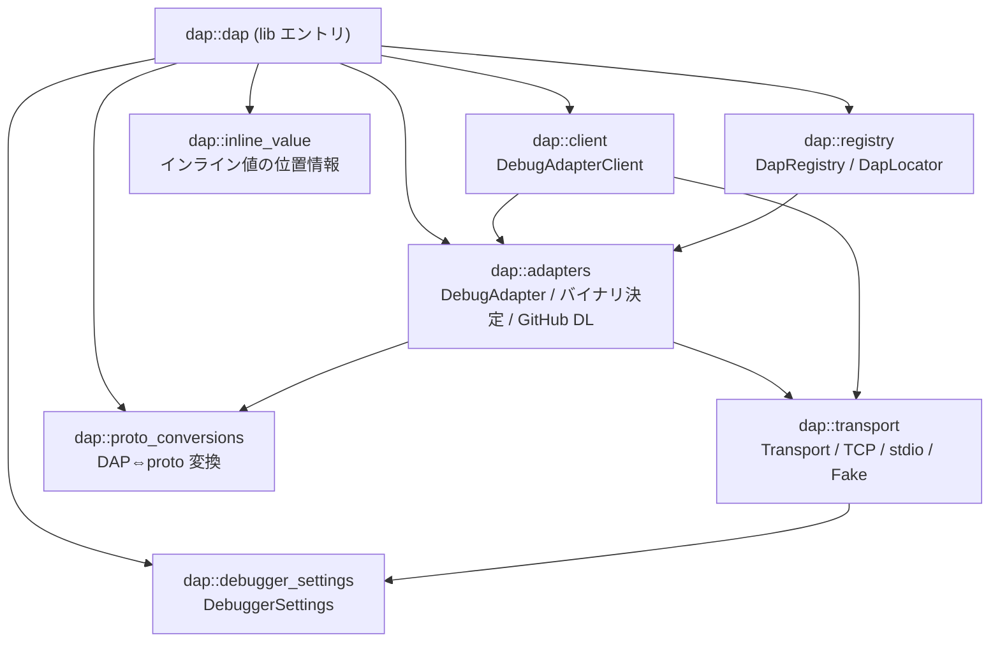
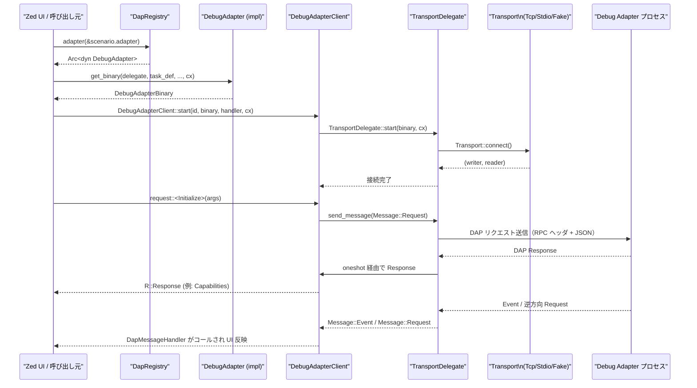

# crates/dap ディレクトリ解説

## 1. ざっくり一言

Zed エディタと各種 Debug Adapter Protocol (DAP) サーバーのあいだで通信・起動・設定を仲介するためのクレートです。  
デバッグアダプタの登録・起動バイナリの決定・TCP / stdio での接続・DAP メッセージの送受信・設定・テレメトリなどを一手に担います。

---

## 2. このモジュールの役割

### 2.1 概要

- このクレートは **Zed 内部のデバッグ UI / ロジック** と **外部のデバッグアダプタ (DAP サーバー)** をつなぐ役割を持ちます。
- 主な機能は次のとおりです。
  - デバッグアダプタの登録・検索 (`DapRegistry`, `DebugAdapter` trait)
  - デバッグタスク・起動バイナリの表現 (`DebugTaskDefinition`, `DebugAdapterBinary`)
  - stdio / TCP / テスト用 Fake を切り替え可能なトランスポート (`Transport` とその実装)
  - DAP メッセージの送受信クライアント (`DebugAdapterClient`)
  - 設定 (`DebuggerSettings`) とテレメトリ送信 (`send_telemetry`)
  - DAP 型と内部 `proto` 型の相互変換 (`ProtoConversion`)

### 2.2 アーキテクチャ内での位置づけ

このクレート内の主要モジュールどうしの依存関係を簡略化すると、次のようになります。



補足:

- `dap.rs` がライブラリのエントリで、他モジュールを `pub mod` / `pub use` してまとめています。
- `DebugAdapterClient` は `TransportDelegate` を通じて `Transport` 実装 (`TcpTransport` / `StdioTransport` / `FakeTransport`) を利用します。
- `DapRegistry` は `DebugAdapter` 実装の登録・検索を行い、テレメトリや UI 側から参照されます。
- `proto_conversions` は DAP 型 (`dap_types`) と `client::proto` に定義された Protobuf 由来の型の間のゲートウェイです。

### 2.3 設計上のポイント

コードから読み取れる設計上の特徴を箇条書きでまとめると、次のようになります。

- **プラガブルなデバッグアダプタ**
  - `DebugAdapter` trait と `DapRegistry` により、言語やツールごとにアダプタ実装を差し替え可能な構造です。
- **デバッグタスク → バイナリ → 接続の分離**
  - 「ユーザー向け構成 (`DebugScenario` / `DebugTaskDefinition`)」と「プロセス起動の具体情報 (`DebugAdapterBinary`)」と「接続 (`Transport`)」が別のレイヤに分かれています。
- **トランスポートの抽象化**
  - `Transport` trait で stdio / TCP / Fake を抽象化し、`TransportDelegate` が DAP メッセージループと pending request の管理を一括で担当します。
- **非同期・イベント駆動**
  - `gpui::AsyncApp` / `BackgroundExecutor` と `smol` を利用し、DAP メッセージの送受信やプロセス I/O ログをバックグラウンドタスクとして処理します。
- **型安全な DAP メッセージ**
  - `dap_types` の Request/Response 型を利用し、`DebugAdapterClient::request` でジェネリックに扱うことで、コマンド名と引数・戻り値の対応を型で保証しています。
- **設定とテレメトリの統合**
  - `DebuggerSettings` によるタイムアウトやログ出力などのグローバル設定と、`send_telemetry` によるデバッグセッション開始イベント送信が組み込まれています。

---

## 3. 主要な機能一覧

このクレート全体で提供している主な機能を列挙します。

- **デバッグアダプタ管理**
  - `DebugAdapter` trait を実装したアダプタの登録・検索 (`DapRegistry`)
  - アダプタごとの設定スキーマ配布 (`adapters_schema`)
- **デバッグシナリオとタスク定義**
  - ユーザー向けデバッグシナリオ (`DebugScenario` – 他 crate 定義) と、それを具体的なタスクへ落とし込む `DebugTaskDefinition`
  - `DapLocator` によるビルドタスクからのシナリオ生成
- **デバッグアダプタバイナリの決定と起動**
  - `DebugAdapterBinary` でコマンドライン・環境変数・作業ディレクトリ・TCP 接続情報を表現
  - GitHub リリースからのアダプタバイナリダウンロード (`download_adapter_from_github`)
- **トランスポート層**
  - `Transport` trait と実装:
    - `StdioTransport`: 標準入出力を使ってアダプタプロセスと通信
    - `TcpTransport`: TCP ソケットを使って接続。必要に応じてアダプタプロセスも起動
    - `FakeTransport`: テスト用の in-process 疑似アダプタ
  - ロギングハンドラ (`LogKind`, `IoKind`, `IoHandler`) とアダプタログの取得
- **DAP クライアント**
  - `DebugAdapterClient` による DAP メッセージ送受信
  - `request` メソッドによる型付き Request/Response の送受信
  - 逆方向リクエスト・イベントのコールバック処理 (`DapMessageHandler`)
- **設定・テレメトリ**
  - `DebuggerSettings` によるタイムアウトやログ出力、ブレークポイント保存などの設定
  - `TelemetrySpawnLocation` と `send_telemetry` によるデバッグセッションのテレメトリ送信
- **DAP 型と proto 型の相互変換**
  - `ProtoConversion` trait とその各種実装 (`Scope`, `Variable`, `Source`, `StackFrame`, `OutputEvent` など)
  - `client::proto::*` 型との to/from 変換
- **インライン値表示用の情報**
  - `InlineValueLocation` と関連 enum による変数名・スコープ・ソース位置の表現
- **ブレークポイント関連の高レベル仕様 (ドキュメント)**
  - `docs/breakpoints.md` に、`Project` 型がブレークポイントの保存・復元・アダプタへの送信を担うことが記載されています（実装はこのチャンクには含まれていません）。

---

## 4. 関数・構造体の解説

### 4.1 主要な型一覧

代表的な構造体・列挙体・トレイトをまとめます。

| 名前 | 種別 | 定義ファイル | 役割 / 用途 |
|------|------|--------------|-------------|
| `DapStatus` | enum | `src/adapters.rs` | デバッグアダプタのダウンロード・更新チェック状態を表現します。 |
| `DapDelegate` | trait | `src/adapters.rs` | アダプタ関連処理で必要となる FS / HTTP / NodeRuntime などへのアクセスを抽象化します。 |
| `DebugAdapterName` | newtype struct | `src/adapters.rs` | デバッグアダプタの名前 (`SharedString`) を表す新しい型です。`Display` や `Borrow` などを実装しています。 |
| `TcpArguments` | struct | `src/adapters.rs` | 実際の TCP 接続情報 (IPv4 アドレス・ポート・タイムアウト) を格納します。 |
| `DebugTaskDefinition` | struct | `src/adapters.rs` | デバッグアダプタに渡す構成 (`config`) やアダプタ名、TCP 接続テンプレートを含む「デバッグタスク」の定義です。 |
| `DebugAdapterBinary` | struct | `src/adapters.rs` | デバッグアダプタプロセスを起動するための具体的な情報 (コマンド・引数・環境変数・cwd・接続情報・DAP リクエスト引数) を保持します。 |
| `AdapterVersion` | struct | `src/adapters.rs` | GitHub リリースタグ名とダウンロード URL をまとめた情報です。 |
| `DownloadedFileType` | enum | `src/adapters.rs` | ダウンロードしたファイルが `Vsix` / `GzipTar` / `Zip` のどれかを表します。 |
| `GithubRepo` | struct | `src/adapters.rs` | GitHub のオーナー名・リポジトリ名を保持します（このチャンクでは利用箇所は現れていません）。 |
| `DebugAdapter` | trait | `src/adapters.rs` | 個々のデバッグアダプタ実装の共通インターフェースです。構成変換・バイナリ取得・リクエスト種別決定などを提供します。 |
| `FakeAdapter` | struct | `src/adapters.rs` (test support) | テスト用の `DebugAdapter` 実装で、構成をそのまま DAP に流す簡易アダプタです。 |
| `SessionId` | newtype struct | `src/client.rs` | デバッグセッションごとの識別子 (u32) です。proto 用に u64 <-> u32 の変換を提供します。 |
| `DebugAdapterClient` | struct | `src/client.rs` | 一つのアダプタ (プロセス or TCP 接続) との DAP 通信を担当するクライアントです。 |
| `DapMessageHandler` | type alias | `src/client.rs` | アダプタから受信した `Message` を処理するためのコールバック型です。 |
| `ScopeId`, `VariableReference`, `StackFrameId` | type alias | `src/dap.rs` | DAP 内のスコープ / 変数参照 / スタックフレーム識別子を表すエイリアスです。 |
| `TelemetrySpawnLocation` | enum | `src/dap.rs` | デバッガをどこから起動したか (Gutter, ScenarioList, Custom) をテレメトリ用に区別します。 |
| `DebuggerSettings` | struct | `src/debugger_settings.rs` | ステッピング粒度・ブレークポイント保存有無・タイムアウト・ログ出力などデバッガ関連の設定を保持し、`Settings` として読み込み可能にします。 |
| `VariableLookupKind` | enum | `src/inline_value.rs` | インライン値の取得方法を「変数名」か「式」かで区別します。 |
| `VariableScope` | enum | `src/inline_value.rs` | インライン値のスコープを「ローカル」か「グローバル」で区別します。 |
| `InlineValueLocation` | struct | `src/inline_value.rs` | エディタ内での行・列と変数名・スコープ等をまとめたインライン値表示用の位置情報です。 |
| `ProtoConversion` | trait | `src/proto_conversions.rs` | `dap_types` の型と `client::proto` 型の相互変換を to/from メソッドで定義する汎用トレイトです。 |
| 各種 `ProtoConversion` 実装 | impl | `src/proto_conversions.rs` | `Scope`, `Variable`, `Source`, `StackFrame`, `Module`, `OutputEvent`, `CompletionItem` など DAP 型と proto 型を相互変換します。 |
| `DapLocator` | trait | `src/registry.rs` | ビルドタスク (`TaskTemplate`) から `DebugScenario` を生成したり、ビルドを実行して `DebugRequest` を返すためのインターフェースです。 |
| `DapRegistry` | struct | `src/registry.rs` | 利用可能な `DebugAdapter` と `DapLocator` のレジストリです。`Global` として `App` からアクセスされます。 |
| `Transport` | trait | `src/transport.rs` | DAP メッセージの物理的な入出力 (stdio / TCP / Fake) を抽象化するトランスポート層のインターフェースです。 |
| `TransportDelegate` | struct | `src/transport.rs` | `Transport` の上に載り、メッセージ送受信ループ・pending request 管理・ログ処理を行う協調オブジェクトです。 |
| `TcpTransport` | struct | `src/transport.rs` | TCP ベースの `Transport` 実装で、必要に応じてアダプタプロセスを起動し、指定ポートへの接続を試みます。 |
| `StdioTransport` | struct | `src/transport.rs` | 標準入出力を用いる `Transport` 実装で、アダプタプロセスの stdin/stdout を直接 DAP メッセージ入出力に使います。 |
| `FakeTransport` | struct | `src/transport.rs` (test support) | テスト用トランスポートで、in-process の Pipe とハンドラで DAP メッセージを模倣します。 |
| `PendingRequests` | struct | `src/transport.rs` | seq 番号ごとに `oneshot::Sender` を保持し、レスポンスを対応付けるためのマップです。 |

### 4.2 重要な関数・メソッドの詳細説明（7件）

#### 1. `DebugAdapter::request_kind(&self, config: &serde_json::Value) -> Result<StartDebuggingRequestArgumentsRequest>`

**概要**

- DAP の起動構成 JSON (`config`) から `"request"` フィールドを読み取り、その値が `"launch"` か `"attach"` かを判定して `StartDebuggingRequestArgumentsRequest` を返します。
- デフォルト実装が `DebugAdapter` trait に用意されており、個別アダプタは必要に応じてオーバーライドできます（`FakeAdapter` は独自実装）。

**引数**

| 引数名 | 型 | 説明 |
|--------|----|------|
| `config` | `&serde_json::Value` | DAP 起動構成を表す JSON オブジェクト。少なくとも `"request"` プロパティを含むことが期待されます。 |

**戻り値**

- `Result<StartDebuggingRequestArgumentsRequest>`  
  `"launch"` または `"attach"` に対応する列挙値を返し、それ以外の場合はエラーを返します。

**内部処理の流れ**

1. `config.get("request")` で `request` フィールドを取得します。
2. 取得した値が `"launch"` なら `StartDebuggingRequestArgumentsRequest::Launch` を返します。
3. `"attach"` なら `StartDebuggingRequestArgumentsRequest::Attach` を返します。
4. それ以外（存在しない・文字列でない・想定外の値）の場合は `anyhow::Error` を返します。  
   メッセージは `"missing or invalid 'request' field in config. Expected 'launch' or 'attach'"` です。

**Examples（使用例）**

```rust
// config は DAP の launch.json 相当の JSON オブジェクトとする                // 事前に構築された設定 JSON
let config = serde_json::json!({                                         // "request" フィールドを含む JSON を作る
    "request": "launch",                                                 // launch か attach を指定
    "program": "main.rs",                                                // そのほかの設定
});

// adapter は DebugAdapter を実装した型のインスタンス                      // 何らかのアダプタ実装
let kind = adapter.request_kind(&config).await?;                          // request_kind で種別を決定する

assert!(matches!(                                                          // 戻り値が Launch であることを確認
    kind,
    dap_types::StartDebuggingRequestArgumentsRequest::Launch
));
```

**Errors / Panics**

- `"request"` フィールドが存在しない、あるいは `"launch"` / `"attach"` 以外の場合に `Err(anyhow::Error)` を返します。
- パニック条件はコードからは読み取れません（`unwrap` 等は使用していません）。

**Edge cases（エッジケース）**

- `config` がオブジェクトでない場合: `get("request")` は `None` になりエラーになります。
- `"request": null` や数値などの非文字列値: 比較に失敗しエラーになります。

**使用上の注意点**

- アダプタ固有で `"request"` フィールドを使用しない構成を許容したい場合は、このメソッドをオーバーライドする必要があります。
- バリデーションは **種別判定のみに限定** されており、他のフィールドの妥当性検証はアダプタ側（または DAP サーバー側）で行う前提です。

---

#### 2. `download_adapter_from_github(adapter_name, github_version, file_type, delegate) -> Result<PathBuf>`

**シグネチャ**

```rust
pub async fn download_adapter_from_github(
    adapter_name: DebugAdapterName,
    github_version: AdapterVersion,
    file_type: DownloadedFileType,
    delegate: &dyn DapDelegate,
) -> Result<PathBuf>
```

**概要**

- GitHub リリースからデバッグアダプタをダウンロードし、解凍してローカルのアダプタディレクトリに配置します。
- 既に同じバージョンが存在する場合はダウンロードをスキップし、そのパスを返します。
- `.zip` / `.vsix` / `.tar.gz` のいずれかの形式に対応しています。

**引数**

| 引数名 | 型 | 説明 |
|--------|----|------|
| `adapter_name` | `DebugAdapterName` | デバッグアダプタ名（ディレクトリ名の一部として使用されます）。 |
| `github_version` | `AdapterVersion` | `tag_name` と `url` を含む、取得対象の GitHub リリース情報です。 |
| `file_type` | `DownloadedFileType` | ダウンロードファイルの形式 (`GzipTar` / `Zip` / `Vsix`) を指定します。 |
| `delegate` | `&dyn DapDelegate` | FS 操作や HTTP クライアントなどを提供するデリゲートです。 |

**戻り値**

- `Result<PathBuf>`  
  展開後の「バージョンディレクトリ」のパスを返します（例: `.../debug_adapters/<name>/<name>_<tag>`）。

**内部処理の流れ**

1. `paths::debug_adapters_dir()` を基準に `adapter_name` 用のディレクトリ、およびバージョンごとの `version_path` を決定します。
2. `version_path` が既に存在する場合、そのパスをすぐに返します（再ダウンロードしません）。
3. アダプタ用ディレクトリ (`adapter_path`) が存在しなければ作成します。
4. `delegate.http_client()` を使って `github_version.url` へ HTTP GET を発行します。
   - ステータスが 2xx 以外ならエラーになります。
5. `file_type` に応じて次のように展開します。
   - `GzipTar`:
     1. レスポンスボディを `GzipDecoder` で伸長し、`async_tar::Archive` で `version_path` へ展開します。
   - `Zip` / `Vsix`:
     1. まず `version_path` と同名で拡張子 `.zip` のファイルパスを決定します。
     2. そのパスにレスポンスボディを書き出します。
     3. 書き出したファイルを開き、`util::archive::extract_zip(&version_path, file)` で展開します。
        - エラーはログ (`warn`) に出すだけで無視します（`inspect_err(...).ok()`）。
     4. `adapter_path` 以下の `.zip` ファイルを `util::fs::remove_matching` で削除します。
6. 最後に、`adapter_path` 以下のうち現在の `version_path` 以外を削除して古いバージョンをクリーンアップします。
7. `version_path` を返します。

**Examples（使用例）**

```rust
// 例: GitHub の vscode-node-debug2 リリースからアダプタを取得する              // Node デバッグアダプタを想定した例
let adapter_name = DebugAdapterName::from("node-debug");                     // アダプタ名を作成
let version = AdapterVersion {                                               // ダウンロード対象のバージョン情報
    tag_name: "v1.0.0".to_string(),                                          // リリースタグ
    url: "https://github.com/example/node-debug/releases/download/v1.0.0/adapter.zip"
        .to_string(),                                                        // ダウンロード URL
};

let path = download_adapter_from_github(
    adapter_name,
    version,
    DownloadedFileType::Zip,                                                 // zip として処理
    delegate,                                                                 // DapDelegate 実装
).await?;                                                                    // 展開されたディレクトリへの PathBuf が返る
```

**Errors / Panics**

- ディレクトリ作成失敗 (`fs.create_dir`)、HTTP エラー、ステータスコードが非成功、tar / gzip 展開失敗などで `Err(anyhow::Error)` を返します。
- ZIP 展開については、`extract_zip` のエラーはログに出してから無視されます。
- パニックを起こすコード (`unwrap`) は含まれていません。

**Edge cases（エッジケース）**

- すでに `version_path` が存在する場合: ネットワークアクセスを行わず、即座にそのパスを返します。
- ZIP 内に OS 依存で扱えないファイル名が含まれる場合:
  - コメントにある通り `"Illegal byte sequence"` のようなエラーが発生する可能性がありますが、その場合もログを出して続行します。
- ダウンロード途中でエラーが発生した場合:
  - 途中まで作成されたディレクトリやファイルが残る可能性がありますが、その挙動についてはこのコードからは詳細不明です。

**使用上の注意点**

- `delegate.fs()` や `delegate.http_client()` の実装が非同期対応かつエラーを適切に返すことが前提です。
- `DownloadedFileType::Vsix` と `DownloadedFileType::Zip` は同じ ZIP 扱いで処理され、拡張子は `.zip` 固定で保存されます。
- 古いバージョンディレクトリは自動的に削除されるため、「複数バージョンを共存させたい」場合は別の場所にコピーするなど配慮が必要です。

---

#### 3. `DebugAdapterClient::start(id, binary, message_handler, cx) -> Result<DebugAdapterClient>`

**シグネチャ**

```rust
pub async fn start(
    id: SessionId,
    binary: DebugAdapterBinary,
    message_handler: DapMessageHandler,
    cx: &mut AsyncApp,
) -> Result<DebugAdapterClient>
```

**概要**

- `DebugAdapterBinary` の情報を元に `TransportDelegate` を初期化し、デバッグアダプタへの接続を開始して `DebugAdapterClient` インスタンスを作成します。
- 接続後は `message_handler` がアダプタからのイベントや逆方向リクエストを受け取ります。

**引数**

| 引数名 | 型 | 説明 |
|--------|----|------|
| `id` | `SessionId` | このクライアント（デバッグセッション）の識別子です。 |
| `binary` | `DebugAdapterBinary` | 接続・起動に必要なバイナリ情報と DAP 起動引数です。 |
| `message_handler` | `DapMessageHandler` | `Message` を処理するユーザー定義のコールバックです。 |
| `cx` | `&mut AsyncApp` | 非同期タスクを生成するための gpui コンテキストです。 |

**戻り値**

- `Result<DebugAdapterClient>`  
  正常にトランスポートを起動・接続できた場合にクライアントインスタンスを返します。

**内部処理の流れ**

1. `TransportDelegate::start(&binary, cx).await?` を呼び出し、内部で `Transport` (TCP/stdio/Fake) を構築します。
2. `DebugAdapterClient` 構造体を初期化します。
   - `sequence_count` は 1 から開始します。
3. `self.connect(message_handler, cx).await?` を呼び出して実際にアダプタと接続し、メッセージループを開始します。
4. 準備が整った `DebugAdapterClient` を返します。

**Examples（使用例）**

テストコードに近い最小例です。

```rust
// DebugAdapterBinary を構築する                                                 // 実際にはアダプタごとに異なる構成を生成する
let binary = DebugAdapterBinary {
    command: Some("my-debug-adapter".into()),                                 // 起動するバイナリ
    arguments: vec![],                                                        // 引数
    envs: std::collections::HashMap::new(),                                   // 環境変数
    cwd: None,                                                                // カレントディレクトリ
    connection: None,                                                         // stdio で接続する例
    request_args: dap_types::StartDebuggingRequestArguments {
        configuration: serde_json::Value::Null,                               // アダプタに渡す構成
        request: dap_types::StartDebuggingRequestArgumentsRequest::Launch,    // launch か attach
    },
};

// イベント・逆方向リクエストを処理するハンドラ                               // 単純にログに出す例
let handler: DapMessageHandler = Box::new(|message| {
    log::info!("DAP message: {:?}", message);                                 // 各メッセージをログ出力
});

// AsyncApp コンテキストは Zed 本体が提供する                                   // ここでは cx: &mut AsyncApp が既にあるとする
let client = DebugAdapterClient::start(SessionId(1), binary, handler, cx).await?;
```

**Errors / Panics**

- `TransportDelegate::start` や `connect` が失敗した場合（プロセス起動失敗、TCP 接続失敗など）に `Err(anyhow::Error)` を返します。
- メソッド内で `unwrap` は使用されていないため、直接的なパニックはありません。

**Edge cases（エッジケース）**

- `binary.connection` が設定されている場合、テストビルドでは `FakeTransport::start_tcp` が使われるなど、ビルド条件によって内部トランスポート実装が変わります。
- 既に閉じた `AsyncApp` コンテキストを使うなどのケースの挙動は、このチャンクからは分かりません。

**使用上の注意点**

- `message_handler` はスレッドセーフ (`Send + Sync`) である必要があります。
- `DebugAdapterClient` は内部でバックグラウンドタスクを保持しているため、`kill` を呼んで適切に終了させることが望ましいです。

---

#### 4. `DebugAdapterClient::request<R: Request>(&self, arguments: R::Arguments) -> Result<R::Response>`

**概要**

- 型 `R: dap_types::requests::Request` に対応する DAP リクエストを送信し、そのレスポンスを待ってパースした上で返します。
- リクエストとレスポンスは `sequence_id` によって `PendingRequests` と `oneshot::channel` を用いて対応付けられます。

**引数**

| 引数名 | 型 | 説明 |
|--------|----|------|
| `arguments` | `R::Arguments` | DAP リクエスト `R` に対応する引数構造体です。 |

**戻り値**

- `Result<R::Response>`  
  レスポンスの `body` を `R::Response` にデシリアライズした結果を返します。  
  アダプタがエラーを返した場合は `Err(anyhow::Error)` を返します。

**内部処理の流れ**

1. 引数 `arguments` を `serde_json::to_value` で `serde_json::Value` にシリアライズします。
2. `oneshot::channel` を生成し、`sequence_id = self.next_sequence_id()` を取得します。
3. `crate::messages::Request` を構築し、`TransportDelegate.pending_requests` マップに `sequence_id` → `callback_tx` を登録します。
4. ログを出力したあと、`send_message(Message::Request(request)).await?` でメッセージを送信します。
5. `callback_rx.await??` でレスポンスを待機します。
   - 1つ目の `?` は `oneshot` チャンネルのエラー（送信側がドロップされた場合）、
   - 2つ目の `?` は `TransportDelegate::process_response` によるエラーです。
6. `response.success` が `true` の場合:
   - `response.body` が `Some(json)` なら `serde_json::from_value(json)` で `R::Response` にデシリアライズします。
   - `body` が `None` の場合、空オブジェクト `{}` を使ってデシリアライズを試み、それも失敗したら `Default::default()` を JSON にしてデシリアライズします。
7. `success == false` の場合は `response.message.unwrap_or_default()` を含むエラーメッセージで `anyhow::bail!` します。

**Examples（使用例）**

テストコードに近い `Initialize` リクエストの例です。

```rust
use dap_types::requests::Initialize;                                         // Initialize リクエスト型
use dap_types::InitializeRequestArguments;                                   // 引数型

// client は既に DebugAdapterClient::start で起動済みとする                     // 有効な DebugAdapterClient インスタンス

let args = InitializeRequestArguments {
    client_id: Some("zed".to_string()),                                      // クライアント ID
    client_name: Some("Zed".to_string()),                                    // クライアント名
    adapter_id: "fake-adapter".to_string(),                                  // アダプタ ID
    locale: Some("en-US".to_string()),                                       // ロケール
    ..Default::default()                                                     // 他のフィールドはデフォルト
};

let response = client.request::<Initialize>(args).await?;                    // 型付きでリクエストを送信
// response は dap_types::Capabilities 型                                     // Initialize に対応する Capabilities が返る
```

**Errors / Panics**

- `pending_requests.insert` 時にクライアントが既に閉じられていると `"client is closed"` で `Err` になります。
- アダプタがエラーレスポンスを返した場合は `TransportDelegate::process_response` がエラーに変換し、`?` により `Err` になります。
- `response.body` を `R::Response` にデシリアライズできない場合にも `Err` になります。
- パニックは明示的には発生しないように実装されています。

**Edge cases（エッジケース）**

- レスポンスボディが `None` で、かつ `R::Response` の型が「空オブジェクト」や `Default` からのデシリアライズに対応していない場合、最終的にデシリアライズエラーになります。
- アダプタが無効な JSON を返した場合: `serde_json::from_value` / `serde_json::from_str` が失敗しエラーになります。
- リクエスト送信後にアダプタプロセスが落ちた場合: `oneshot` チャンネルがクローズされ、`callback_rx.await` がエラーになります。

**使用上の注意点**

- `R` と `arguments` の組み合わせを正しく使う必要があります（`Initialize` に `ContinueArguments` を渡すなどはコンパイル時に防がれます）。
- 高頻度で多数のリクエストを行う場合、`pending_requests` の管理がボトルネックになる可能性がありますが、このクレートでは特別な制限は設けていません。

---

#### 5. `TransportDelegate::connect(&self, message_handler, cx) -> Result<()>`

**シグネチャ**

```rust
pub async fn connect(
    &self,
    message_handler: DapMessageHandler,
    cx: &mut AsyncApp,
) -> Result<()>
```

**概要**

- `Transport` と実際に接続し、DAP メッセージの送受信ループをバックグラウンドタスクとして起動します。
- 送信側 (`send_to_server`) と受信側 (`recv_from_server`) の 2 つのタスクを生成し、`server_tx` 経由でクライアントからのメッセージを受け付けます。

**引数**

| 引数名 | 型 | 説明 |
|--------|----|------|
| `message_handler` | `DapMessageHandler` | アダプタから受信した全ての `Message` を処理するコールバックです。 |
| `cx` | `&mut AsyncApp` | バックグラウンドタスクの起動に使う gpui コンテキストです。 |

**戻り値**

- `Result<()>`  
  接続が成功すれば `Ok(())` を返します。

**内部処理の流れ**

1. `let (server_tx, client_rx) = unbounded::<Message>();` で送信チャンネルと受信チャンネルを作成します。
2. 以前のタスク (`self.tasks`) をクリアします。
3. 設定から `log_dap_communications` を取得し、ログ出力を行うかどうかを決定します。
4. `self.transport.lock().connect()` を呼び出し、DAP アダプタとの I/O ストリーム (`input`,`output`) を取得します。
5. ログの有無に応じて `log_handler` を用意します。
6. 受信タスクを `cx.background_spawn` で起動します。
   - `recv_from_server(output, message_handler, pending_requests, output_log_handler)` を呼び出します。
   - 終了時に `pending_requests.flush` で待機中リクエストへエラーを通知します。
7. 送信タスクを `cx.background_spawn` で起動します。
   - `send_to_server(input, client_rx, log_handler)` を呼び出します。
8. `server_tx` を `server_tx` フィールドに保存します（今後の `send_message` 呼び出しに使用）。

**Examples（使用例）**

通常は `DebugAdapterClient::start` から内部的に呼ばれるため、直接呼び出す必要はあまりありません。概念的には以下のように利用されています。

```rust
// transport_delegate は TransportDelegate::start で生成済み                       // 既に start 済みの TransportDelegate

let handler: DapMessageHandler = Box::new(|message| {
    // ここでイベントや逆方向リクエストを処理する                               // 受信した DAP メッセージに応じて UI を更新
});

transport_delegate.connect(handler, cx).await?;                                // 接続とメッセージループを開始
```

**Errors / Panics**

- `transport.connect().await` が失敗した場合に `Err(anyhow::Error)` が返ります。
- `send_to_server` / `recv_from_server` 内でのエラーはログ出力や `pending_requests.flush` による通知に使われますが、このメソッドの戻り値には直接影響しません（接続までに発生すれば `Err` になります）。

**Edge cases（エッジケース）**

- `server_tx` が既に設定されている状態で再度 `connect` した場合の挙動は、コード上特に特別扱いされていません（`tasks` はクリアされます）。
- `log_dap_communications` が `false` の場合、RPC レベルのログ (`LogKind::Rpc`) は呼び出されませんが、アダプタログ (`stderr` 等) の設定とは別です。

**使用上の注意点**

- `message_handler` は長時間動作するバックグラウンドタスクから呼び出されるため、軽量であるか、必要なら別スレッド・タスクに委譲することが推奨されます。
- `connect` の呼び出しは 1 回で十分です。複数回呼び出す場合は既存接続の状態を考慮する必要があります。

---

#### 6. `TcpTransport::connect(&mut self) -> Task<Result<(Write, Read)>>`

**シグネチャ（簡略化）**

```rust
impl Transport for TcpTransport {
    fn connect(
        &mut self,
    ) -> Task<
        Result<(
            Box<dyn AsyncWrite + Unpin + Send + 'static>,
            Box<dyn AsyncRead + Unpin + Send + 'static>,
        )>,
    > { /* ... */ }
}
```

**概要**

- 指定されたホスト・ポートへの TCP 接続を、タイムアウト付きで繰り返し試みます。
- 必要に応じて、アダプタプロセスが既に終了していないかを確認し、終了していた場合はその標準出力 / 標準エラーをエラーメッセージとして返します。

**引数**

- 引数はありません（`self` の内部状態 `host`, `port`, `timeout`, `process` を使用します）。

**戻り値**

- `Task<Result<(Write, Read)>>`  
  - `Write`: `Box<dyn AsyncWrite + ...>` – 書き込み用ハーフ (`TcpStream::split` の書き込み側)
  - `Read`: `Box<dyn AsyncRead + ...>` – 読み込み用ハーフ
- 非同期タスクとして即時スケジュールされ、呼び出し側 (`TransportDelegate::connect`) で `.await` されます。

**内部処理の流れ**

1. `executor.clone().spawn(async move { ... })` でバックグラウンドタスクを生成します。
2. `select!` で次の 2 つを競合させます。
   - `executor.timer(Duration::from_millis(timeout))`:
     - タイムアウトに達したら `"Connection to TCP DAP timeout {address}"` で `Err` を返します。
   - 別のタスク:
     1. 無限ループで `TcpStream::connect(address).await` を試みます。
     2. 接続成功 (`Ok(stream)`) なら `stream.split()` し、`(write, read)` を `Ok((Box::new(write), Box::new(read)))` として返します。
     3. 接続失敗 (`Err(_)`) の場合:
        - `process.lock().is_some()` なら、プロセスの終了状態 (`try_status`) を確認します。
        - プロセスが終了していれば `output().await?` で出力を取得し、stderr が空なら stdout を、それ以外なら stderr をテキストとして取り出します。
        - そのテキストに `"\nerror: process exited before debugger attached."` を付けて `Err(anyhow::Error)` を返します。
        - プロセスがまだ生きている場合は 100ms のタイマーを待って再試行します。

**Examples（使用例）**

`TransportDelegate::connect` から内部的に呼ばれるため、直接使う必要は通常ありません。概念的には次のように使われています。

```rust
// tcp_transport は TcpTransport のインスタンスとする                            // 事前に start() で構築済みの TcpTransport

let task = tcp_transport.connect();                                           // 接続タスクを取得
let (write, read) = task.await?;                                              // 実際の接続確立を待つ
// 以降、write/read を使って DAP メッセージを送受信する                          // 読み書きハーフを TransportDelegate が受け取る
```

**Errors / Panics**

- タイムアウトした場合に `Err(anyhow::Error)` が返ります。
- アダプタプロセスが接続前に終了した場合、その出力を含むエラーメッセージで `Err` になります。
- `TcpStream::connect` の失敗自体は逐次リトライされ、エラーには直結しません。
- パニックを起こすコードは含まれていません。

**Edge cases（エッジケース）**

- `process` が `None` の場合（すなわち外部で起動された TCP サーバーに接続するケース）、プロセス終了チェックはスキップされ、タイムアウトまでリトライを続けます。
- `timeout` が非常に短い場合、プロセスが起動しきる前にタイムアウトする可能性があります。

**使用上の注意点**

- `timeout` は `DebuggerSettings` から取得されることがあり、ユーザー設定に依存します。
- アダプタプロセスを `TcpTransport` 側で起動する場合、ポートの選択 (`TcpTransport::unused_port`) と、アダプタの設定 (`tcp_connection`) が整合するように注意が必要です。

---

#### 7. `configure_tcp_connection(tcp_connection: TcpArgumentsTemplate) -> Result<(Ipv4Addr, u16, Option<u64>)>`

**定義場所**

```rust
pub async fn configure_tcp_connection(
    tcp_connection: TcpArgumentsTemplate,
) -> anyhow::Result<(Ipv4Addr, u16, Option<u64>)> {
    let host = tcp_connection.host();
    let timeout = tcp_connection.timeout;

    let port = if let Some(port) = tcp_connection.port {
        port
    } else {
        transport::TcpTransport::port(&tcp_connection).await?
    };

    Ok((host, port, timeout))
}
```

**概要**

- ユーザー構成やタスクから渡される `TcpArgumentsTemplate` から、実際に使用するホスト・ポート・タイムアウト値を決定します。
- ポートが指定されていない場合には `TcpTransport::port` を利用して未使用ポートを探します。

**引数**

| 引数名 | 型 | 説明 |
|--------|----|------|
| `tcp_connection` | `TcpArgumentsTemplate` | デバッグアダプタとの TCP 接続に関するテンプレート情報です（host, port, timeout）。 |

**戻り値**

- `Result<(Ipv4Addr, u16, Option<u64>)>`  
  - `Ipv4Addr`: 接続先ホスト
  - `u16`: 使用するポート番号
  - `Option<u64>`: タイムアウト (ミリ秒)。指定されていない場合は `None` のまま返されます。

**内部処理の流れ**

1. `tcp_connection.host()` でホストアドレス（IPv4）を取得します。
2. `timeout` を `tcp_connection.timeout` からそのままコピーします。
3. `tcp_connection.port` が `Some(port)` ならそれを採用します。
4. `None` の場合は `TcpTransport::port(&tcp_connection).await?` を呼び、明示ポートか未使用ポートを決定します。
5. `(host, port, timeout)` を返します。

**Examples（使用例）**

```rust
use task::TcpArgumentsTemplate;                                              // テンプレート側の型

// 例: ポートが指定されていない TCP 接続テンプレート                             // host と timeout のみ指定
let tcp_template = TcpArgumentsTemplate {
    host: Some(std::net::Ipv4Addr::LOCALHOST),                               // ローカルホスト
    port: None,                                                              // 未指定 -> unused_port が使われる
    timeout: Some(2_000),                                                    // タイムアウト 2000ms
};

let (host, port, timeout) = configure_tcp_connection(tcp_template).await?;   // 実際に使用する TCP 接続情報
```

**Errors / Panics**

- `TcpTransport::port` が失敗した場合（未使用ポート取得に失敗した場合）に `Err(anyhow::Error)` を返します。
- パニックを起こすコードはありません。

**Edge cases（エッジケース）**

- `TcpArgumentsTemplate::host()` の実装内容はこのチャンクにはないため、host 未指定時の挙動は不明です。
- `timeout` が `None` の場合、上位レイヤーや `TcpTransport` が別のデフォルトを補っている可能性があります（`TcpTransport::start` では `connection_args.timeout.unwrap_or_else(...)` になっています）。

**使用上の注意点**

- 戻り値の `timeout` はそのまま `TcpTransport` 等に渡すか、`DebuggerSettings` 側のデフォルトと組み合わせて利用する必要があります。
- `TcpArgumentsTemplate` のフィールドの意味は `task` クレート側に依存しますが、少なくとも `port` はオプションであることを前提にしています。

---

### 4.3 その他の関数・構造体（概要のみ）

ここでは、上記で詳細説明しなかったが重要な補助的 API を一覧で示します。

| 名前 | 種別 | 定義場所 | 役割（1 行） |
|------|------|----------|--------------|
| `TcpArguments::from_proto` / `to_proto` | メソッド | `src/adapters.rs` | `proto::TcpHost` との間で TCP 接続情報を相互変換します。 |
| `DebugTaskDefinition::to_scenario` | メソッド | `src/adapters.rs` | `DebugTaskDefinition` をユーザー向け `DebugScenario` に戻します。 |
| `DebugTaskDefinition::to_proto` / `from_proto` | メソッド | `src/adapters.rs` | `proto::DebugTaskDefinition` との変換を提供します。 |
| `DebugAdapterBinary::from_proto` / `to_proto` | メソッド | `src/adapters.rs` | `proto::DebugAdapterBinary` との変換を提供します。 |
| `DapRegistry::add_adapter` / `remove_adapter` | メソッド | `src/registry.rs` | 利用可能な `DebugAdapter` の追加・削除を行います。 |
| `DapRegistry::adapters_schema` | メソッド | `src/registry.rs` | 全アダプタの設定スキーマ (`AdapterSchemas`) を構築します。 |
| `DapRegistry::adapter_language` | メソッド | `src/registry.rs` | アダプタが単一言語のみ対応している場合、その `LanguageName` を返します。 |
| `DebuggerSettings::from_settings` | メソッド | `src/debugger_settings.rs` | `SettingsContent` から `DebuggerSettings` を構築します。 |
| 各種 `ProtoConversion` 実装 | impl | `src/proto_conversions.rs` | DAP 型と proto 型の相互変換ロジックを一括で管理しています。 |
| `TransportDelegate::send_message` | メソッド | `src/transport.rs` | `server_tx` を通じて DAP メッセージを送信します。 |
| `TransportDelegate::has_adapter_logs` / `add_log_handler` | メソッド | `src/transport.rs` | アダプタログの有無確認とログハンドラ登録を行います。 |
| `StdioTransport::start` / `connect` | メソッド | `src/transport.rs` | stdio 経由でアダプタプロセスを起動・接続します。 |
| `FakeAdapter`, `FakeTransport` 系メソッド | 構造体・メソッド | `adapters.rs` / `transport.rs` | テスト環境のためのスタブ・モック実装です（本番では使用されません）。 |

---

## 5. データフロー

ここでは、代表的な「デバッグセッション開始」時のデータフローを説明します。

1. UI や上位モジュールが `DebugScenario` を構築し、`DapRegistry` から対応する `DebugAdapter` を取得します。
2. `DebugAdapter` 実装が `DebugTaskDefinition` や `DebugAdapterBinary` を決定します（ビルドステップ・ロケータ等は他 crate 側）。
3. `DebugAdapterClient::start` が `TransportDelegate` を起動し、`Transport` を通じてデバッグアダプタプロセスと接続します。
4. UI 側は `DebugAdapterClient::request` を用いて DAP リクエストを送り、レスポンスを受け取ります。
5. アダプタ側からのイベント（停止・ブレークポイントヒット等）は `DapMessageHandler` に渡され、UI に反映されます。

これを sequence diagram で表すと次のようになります。



このフローの中で:

- `PendingRequests` がリクエスト seq とレスポンスを対応付ける役割を担います。
- RPC 的なヘッダ (`Content-Length`) の処理やログ出力は `TransportDelegate` 内の `send_to_server` / `receive_server_message` と `handle_adapter_log` が担当します。
- 必要に応じて `send_telemetry` が非同期タスクとしてテレメトリイベントを送信します。

---

## 6. 使い方（How to Use）

### 6.1 基本的な使用方法

Zed 本体ではこのクレートを内部的に利用しますが、流れを理解するために簡略化したコード例を示します。

```rust
use std::sync::Arc;
use dap::dap::{
    DebugRequest,            // リエクスポートされた型
    TelemetrySpawnLocation,  // テレメトリ用
};
use dap::adapters::{DebugAdapter, DebugAdapterName, DebugAdapterBinary};
use dap::client::{DebugAdapterClient, SessionId};
use dap::registry::DapRegistry;
use gpui::App;

// 1. アダプタ実装を定義する（概要のみ）                                   // DebugAdapter を実装した構造体
struct MyAdapter;

#[async_trait::async_trait(?Send)]
impl DebugAdapter for MyAdapter {
    fn name(&self) -> DebugAdapterName {
        DebugAdapterName::from("my-adapter")                                // アダプタ名
    }

    async fn config_from_zed_format(
        &self,
        scenario: task::ZedDebugConfig,
    ) -> anyhow::Result<task::DebugScenario> {
        // Zed 独自設定を DAP 用 JSON に変換する                             // 詳細は実装側に依存
        unimplemented!()
    }

    async fn get_binary(
        &self,
        delegate: &Arc<dyn dap::adapters::DapDelegate>,
        config: &dap::adapters::DebugTaskDefinition,
        user_installed_path: Option<std::path::PathBuf>,
        user_args: Option<Vec<String>>,
        user_env: Option<std::collections::HashMap<String, String>>,
        cx: &mut gpui::AsyncApp,
    ) -> anyhow::Result<DebugAdapterBinary> {
        // 実際に起動するバイナリと引数を決めて返す                         // delegate 等を使ってパス探索などを行う
        unimplemented!()
    }

    fn dap_schema(&self) -> serde_json::Value {
        serde_json::json!({})                                               // 設定スキーマ（例として空）
    }
}

// 2. グローバルレジストリにアダプタを登録する                               // App 起動時に一度だけ行う
fn register_adapter(cx: &mut App) {
    let registry = DapRegistry::global(cx);                                 // グローバルな DapRegistry を取得
    registry.add_adapter(Arc::new(MyAdapter));                              // アダプタを登録
}

// 3. デバッグセッションを開始する                                           // どこかの UI イベントから呼ばれる
async fn start_debug_session(cx: &mut gpui::AsyncApp, binary: DebugAdapterBinary) -> anyhow::Result<()> {
    // アダプタからのイベントを処理するハンドラ                             // ここではログに出すだけの実装
    let handler: dap::client::DapMessageHandler = Box::new(|message| {
        log::info!("DAP event: {:?}", message);                             // イベントや逆方向リクエスト
    });

    // DebugAdapterClient を起動                                             // アダプタとの接続を確立
    let client = DebugAdapterClient::start(SessionId(1), binary, handler, cx).await?;

    // 例として Initialize リクエストを送る                                 // 実際にはシーケンスに従って複数のリクエストを送る
    let args = dap_types::InitializeRequestArguments {
        adapter_id: "my-adapter".to_string(),                               // アダプタ ID
        ..Default::default()
    };
    let capabilities = client.request::<dap_types::requests::Initialize>(args).await?;

    log::info!("Capabilities: {:?}", capabilities);                         // アダプタの機能情報を利用

    Ok(())
}
```

この例は実際の Zed 実装を簡略化したものですが、次のポイントが分かります。

- `DebugAdapter` 実装がバイナリ決定と設定変換を担当する。
- `DapRegistry` にアダプタを登録し、必要なときに取り出して `DebugAdapterBinary` を取得する。
- `DebugAdapterClient` が具体的な DAP メッセージ送受信を担当する。

### 6.2 よくある使用パターン

#### パターン 1: stdio ベースのアダプタ起動

- 多くの DAP アダプタは `stdio` ベースで動作します。
- `DebugAdapterBinary` の `command` にアダプタバイナリを指定し、`connection: None` とすることで `StdioTransport` が利用されます。

```rust
let binary = DebugAdapterBinary {
    command: Some("/path/to/my/adapter".into()),        // バイナリパス
    arguments: vec!["--stdio".into()],                  // 必要なら stdio モード指定
    envs: Default::default(),                           // 環境変数
    cwd: None,                                          // カレントディレクトリ
    connection: None,                                   // stdio で接続
    request_args: start_args,                           // StartDebuggingRequestArguments
};
```

#### パターン 2: 既存 TCP アダプタへのアタッチ

- 既に起動済みの DAP サーバーにアタッチする場合、`DebugAdapterBinary.connection` に `TcpArguments` を設定し、`command: None` でプロセスを起動しない構成にすることができます。

```rust
let binary = DebugAdapterBinary {
    command: None,                                      // プロセスは起動しない
    arguments: vec![],                                  // 未使用
    envs: Default::default(),                           // 未使用
    cwd: None,                                          // 未使用
    connection: Some(TcpArguments {                     // 接続情報を指定
        host: std::net::Ipv4Addr::LOCALHOST,
        port: 4711,
        timeout: Some(2_000),
    }),
    request_args: start_args,                           // attach 用の構成
};
```

#### パターン 3: テストでの Fake アダプタ / Fake トランスポート

- `cfg(test)` または `feature = "test-support"` が有効な場合、`FakeAdapter` と `FakeTransport` を利用して、実際のプロセスなしで DAP のやり取りをテストできます。
- `DebugAdapterClient::on_request` / `on_response` / `fake_event` / `fake_reverse_request` などのテスト専用メソッドが提供されています。

```rust
#[gpui::test]
async fn test_initialize_client(cx: &mut gpui::TestAppContext) {
    // DebugAdapterBinary は適当な値でよい（FakeTransport が使われる）     // テスト用クライアントを起動
    let client = DebugAdapterClient::start(
        SessionId(1),
        DebugAdapterBinary { /* 省略 */ },
        Box::new(|_| {}),
        &mut cx.to_async(),
    ).await.unwrap();

    // Initialize リクエストに対するレスポンスをモックする                   // FakeTransport の on_request を経由
    client.on_request::<dap_types::requests::Initialize, _>(|_, _args| {
        Ok(dap_types::Capabilities { /* 省略 */ })
    });

    // 実際に request::<Initialize> を送り、レスポンスを検証                  // 実際の DAP サーバーは起動しない
}
```

### 6.3 使用上の注意点（まとめ）

このクレートの API を利用する際の共通の注意点をまとめます。

- **スレッド安全性**
  - 多くのトレイト (`DebugAdapter`, `DapDelegate`, `Transport`) は `Send + Sync + 'static` を要求します。実装はスレッドセーフでなければなりません。
- **非同期コンテキスト**
  - 主要な処理（アダプタ取得・トランスポート接続・リクエスト送信）は全て非同期です。`AsyncApp` / `BackgroundExecutor` のライフタイムを管理する必要があります。
- **pending requests の寿命**
  - `DebugAdapterClient::kill` を呼ぶと `PendingRequests::shutdown` により待機中のリクエストへエラーが伝搬します。クライアント破棄前に必要なリクエストが完了しているか確認することが重要です。
- **設定値の影響**
  - `DebuggerSettings.timeout` や `log_dap_communications` は TCP 接続やログ出力に直接影響します。値が小さすぎると接続がタイムアウトしやすくなります。
- **JSON スキーマと互換性**
  - `DebugAdapter::request_kind` の実装は `"request"` フィールドに依存しています。アダプタ固有の JSON 形式が異なる場合は独自実装が必要です。
- **proto 変換の前提**
  - `ProtoConversion` 実装は `client::proto` 側の enum 値と `dap_types` 側の enum 値が 1:1 対応している前提で書かれています。対応が崩れると `unreachable!()` やパースエラーになる可能性があります（例: `ChecksumAlgorithmUnspecified` は `unreachable!()` のコメント付き）。

---

## 7. 関連ファイル

このクレートと密接に関係する他ファイル・他クレートを一覧にします。

| パス | 役割 / 関係 |
|------|------------|
| `crates/dap-types` | DAP メッセージの型・リクエスト / レスポンス構造体を提供します。`dap` クレートはこれを `pub use` して利用しています。 |
| `crates/task` | `DebugScenario`, `DebugRequest`, `TcpArgumentsTemplate`, `AdapterSchema`, `TaskTemplate` など、デバッグタスク定義やビルドタスク関連の型を提供します。 |
| `crates/client` | `proto_conversions.rs` で `client::proto::*` 型として参照される Protobuf 由来のメッセージ定義を含むと推測されます（コード上は `client::proto` として使用）。 |
| `crates/settings` | `DebuggerSettings`, `RegisterSetting` マクロ、`SettingsContent` など、設定管理のフレームワークを提供します。 |
| `crates/util` | `archive::extract_zip`, `fs::remove_matching`, `process::Child`, `command::new_std_command` など、プロセス起動やファイル操作のユーティリティを提供します。 |
| `crates/gpui` | `App`, `AsyncApp`, `BackgroundExecutor`, `Task`, `TestAppContext` など、UI ランタイムおよび非同期実行環境を提供します。 |
| `crates/paths` | `paths::debug_adapters_dir()` を通じてデバッグアダプタの保存ディレクトリを提供します（具体的なパスはこのチャンクからは不明です）。 |
| `dap/docs/breakpoints.md` | `Project` 型がブレークポイントの保存・復元・アダプタへの送信を担当するという高レベルな仕様を説明しています。実際の `Project` 実装はこのチャンクには含まれていません。 |

このように、`dap` クレートは多くの周辺クレート（`dap-types`, `task`, `client::proto`, `settings`, `gpui` など）と連携しながら、デバッグアダプタとの通信に特化した中核モジュールとして機能しています。
