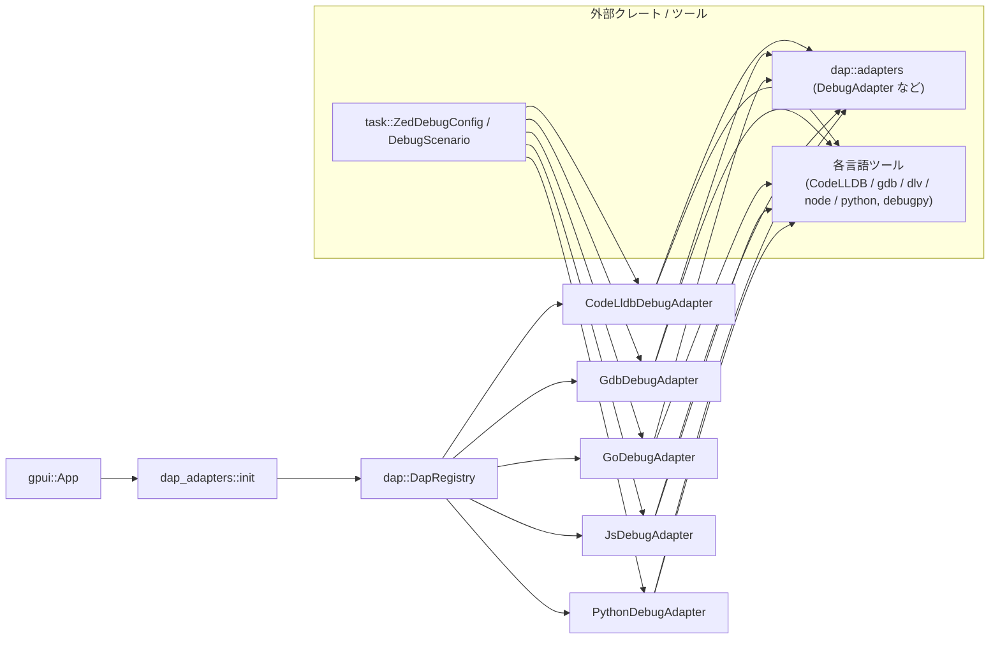
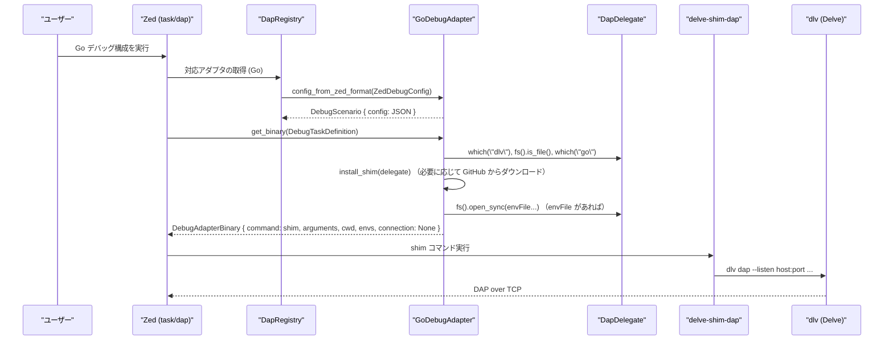

# crates/dap_adapters ディレクトリ解説

---

## 0. ざっくり一言

`dap_adapters` クレートは、Zed のデバッグ機能用に、各言語向けの Debug Adapter (DAP サーバ) を見つけて起動し、Zed 独自の設定 (`ZedDebugConfig`) をそれぞれのアダプタ向けの JSON 設定に変換するモジュール群です。

---

## 1. このモジュールの役割

### 1.1 概要

- このディレクトリは、Zed 内部で使用する **デバッグアダプタの実装と登録** を担当します。
- 各言語ごとに DAP アダプタ（CodeLLDB, GDB, Delve, js-debug, debugpy）をラップし、
  - Zed の汎用設定 (`ZedDebugConfig`)
  - DAP 側の JSON 設定
  - 実際に起動するコマンドライン・環境変数
  を相互に変換します。
- また、必要に応じて GitHub や PyPI からアダプタを自動ダウンロード・更新する仕組みも含んでいます。

### 1.2 アーキテクチャ内での位置づけ

Zed 全体の中での、`dap_adapters` クレートの立ち位置を簡略化した依存関係図です。



要点:

- `gpui::App` の初期化時に `dap_adapters::init` が呼ばれ、`DapRegistry` に各アダプタが登録されます。
- 実行時には、`dap` クレート側が `DebugAdapter` トレイトを通じて各アダプタを呼び出し、外部のデバッグバイナリ（CodeLLDB, GDB, dlv, js-debug, debugpy）を起動します。

### 1.3 設計上のポイント

コードから読み取れる設計上の特徴をまとめます。

- **責務ごとのモジュール分割**
  - `codelldb.rs` : LLDB/CodeLLDB 用の DAP アダプタ
  - `gdb.rs`      : GDB の DAP 対応 (`-i=dap`) ラッパ
  - `go.rs`       : Go 用 Delve + 専用 shim（`delve-shim-dap`）のラッパ
  - `javascript.rs`: `vscode-js-debug` ベースの JS/Node/ブラウザ用アダプタ
  - `python.rs`   : debugpy + 仮想環境・wheel 管理を含む Python 用アダプタ
  - `dap_adapters.rs`: それらの登録と、テスト用モック delegate
- **共通トレイトによる抽象化**
  - すべてのアダプタは `dap::adapters::DebugAdapter` トレイトを実装し、
    - `config_from_zed_format`
    - `dap_schema`
    - `get_binary`
    などの共通 API を介して利用されます。
- **外部ツールの自動管理**
  - CodeLLDB / Delve / js-debug / debugpy などは、GitHub や PyPI から **最新バージョンの取得** を試み、失敗時にはキャッシュ済みバージョンを利用します。
  - Windows / macOS / Linux の OS / アーキテクチャを判定して、適切なアセット名を選択しています。
- **状態のキャッシュ**
  - `OnceLock` / `OnceCell` を使い、ダウンロードしたバイナリパスや venv パスなどを 1 度だけ計算・保存します。
- **JSON スキーマの明示**
  - 各アダプタは `dap_schema` で JSON Schema を返し、設定 UI がどのプロパティを受け付けるかを宣言的に表現しています。
- **環境変数・cwd の扱いをアダプタ側で吸収**
  - 各言語ごとに微妙に異なる `env` / `envFile` / `cwd` の扱いをアダプタ内で調整し、Zed 側からはなるべく一貫した挙動になるようにしています。

---

## 2. 主要な機能一覧

このクレート全体が提供する主な機能です。

- **デバッグアダプタの登録**
  - `init` 関数で、CodeLLDB / Python / JavaScript / Go / GDB の各アダプタを `DapRegistry` に登録します。
- **Zed 設定 → DAP 設定の変換**
  - 各アダプタの `config_from_zed_format` で、`ZedDebugConfig` をアダプタ固有の JSON 設定 (`DebugScenario.config`) に変換します。
- **設定スキーマの提供**
  - 各アダプタの `dap_schema` で、そのアダプタが受け付ける設定項目と型・必須条件を JSON Schema で返します。
- **デバッグバイナリの解決・自動インストール**
  - `get_binary` で、ユーザー指定パス / システム PATH / キャッシュ / 自動インストールの順でバイナリを探し、必要なら GitHub / PyPI からダウンロードします。
- **TCP 接続設定の構築**
  - `DebugTaskDefinition.tcp_connection` やアダプタ固有設定から、DAP サーバとの TCP 接続 (`TcpArguments`) を構成します。
- **環境変数ファイル (`envFile`) の解釈**
  - Go アダプタでは `.env` ファイルを読み込み `env` に展開します。
  - Python / JS でも `env` 周りの扱いをアダプタ側で補完します。
- **子セッションのラベリング**
  - JavaScript / Python アダプタでは、子デバッグセッションのラベル (`label_for_child_session`) を決める補助機能を提供します。
- **テスト用 MockDelegate**
  - `dap_adapters.rs` 内の `test_mocks::MockDelegate` で、`DapDelegate` を簡易実装し、アダプタのユニットテストで利用しています。

---

## 3. 関数・構造体の解説

### 3.1 主要な型一覧

このクレート内で中心となる構造体・列挙体です（公開範囲はコード上 `pub(crate)` ですが、役割を整理します）。

| 名前 | 定義ファイル | 種別 | 役割 / 用途 |
|------|--------------|------|-------------|
| `CodeLldbDebugAdapter` | `src/codelldb.rs` | 構造体 | CodeLLDB 用の `DebugAdapter` 実装。CodeLLDB vsix の取得・パスキャッシュ・Rust プロジェクト判定等を行います。 |
| `GdbDebugAdapter` | `src/gdb.rs` | 構造体 | GDB の DAP インターフェース (`-i=dap`) を使うアダプタ。`gdb_path`/`gdb_args` の解釈と環境変数の構成を行います。 |
| `GoDebugAdapter` | `src/go.rs` | 構造体 | Delve + `delve-shim-dap` を用いた Go デバッグアダプタ。shim のダウンロード・キャッシュ・`envFile` 処理・TCP 接続構成を担当します。 |
| `JsDebugAdapter` | `src/javascript.rs` | 構造体 | `vscode-js-debug` ベースの JavaScript / Node / ブラウザ用アダプタ。npm 風の `program` や `node-terminal` 設定の正規化を行います。 |
| `PythonDebugAdapter` | `src/python.rs` | 構造体 | debugpy 用アダプタ。Python 仮想環境の作成、debugpy wheel の取得、ツールチェーンとの統合、接続モードの解釈を含む最も複雑なアダプタです。 |
| `DebugpyLaunchMode` | `src/python.rs` | enum | debugpy アダプタの起動モード（通常 or `connect` を使ったアタッチ）を表現します。 |
| `MockDelegate` | `src/dap_adapters.rs` (cfg(test)) | 構造体 | テスト用の `DapDelegate` 実装。ファイルアクセスなどは `unimplemented!` ですが、最小限のメソッドを提供します。 |

### 3.2 詳細解説する代表的な関数（7件）

#### 1. `pub fn init(cx: &mut App)`

定義: `src/dap_adapters.rs`

**概要**

- `gpui::App` の初期化時に呼ぶことで、Zed のグローバル `DapRegistry` に本クレートのデバッグアダプタを全て登録します。

**引数**

| 引数名 | 型 | 説明 |
|--------|----|------|
| `cx` | `&mut App` | Zed のアプリケーションコンテキスト。`update_default_global` 経由で `DapRegistry` にアクセスします。 |

**戻り値**

- なし（副作用として `DapRegistry` を更新します）。

**内部処理の流れ**

1. `cx.update_default_global(|registry: &mut DapRegistry, _cx| { ... })` を呼び出し、グローバルな `DapRegistry` へのミュータブルアクセスを取得します。
2. その中で以下のアダプタを `registry.add_adapter(Arc::from(...))` により登録します。
   - `CodeLldbDebugAdapter::default()`
   - `PythonDebugAdapter::default()`
   - `JsDebugAdapter::default()`
   - `GoDebugAdapter::default()`
   - `GdbDebugAdapter`
3. `#[cfg(any(test, feature = "test-support"))]` の場合は `dap::FakeAdapter` も追加登録します。

**使用例**

Zed プラグインやアプリケーションの起動時に呼び出す例です。

```rust
use gpui::App;
use dap_adapters::init; // このクレートの public 関数

fn main() {
    // gpui::App の起動タイミングでアダプタを登録する
    App::new(|cx| {
        // 他のグローバル初期化処理の前後で呼び出す
        dap_adapters::init(cx);

        // 以降、DapRegistry から CodeLLDB や Python などのアダプタが利用可能になる
    });
}
```

**使用上の注意点**

- `init` は通常、アプリケーションの起動時に 1 回だけ呼ばれる前提の構造になっています（複数回呼んでも動作はコードからは不明ですが、通常は 1 度で十分です）。
- 登録されるアダプタは `Arc` で共有され、後続のデバッグセッションで再利用されます。

---

#### 2. `CodeLldbDebugAdapter::get_binary`

定義: `src/codelldb.rs`

**概要**

- CodeLLDB の実行コマンド、作業ディレクトリ、環境変数、そして DAP の `StartDebuggingRequestArguments` を構成します。
- 必要に応じて GitHub から CodeLLDB vsix をダウンロードし、最新またはキャッシュ済みバージョンを使用します。

**引数**

| 引数名 | 型 | 説明 |
|--------|----|------|
| `delegate` | `&Arc<dyn DapDelegate>` | ファイルシステム・HTTP クライアント・出力先などを提供するデリゲート。 |
| `config` | `&DebugTaskDefinition` | ラベル、アダプタ名、JSON 設定、TCP 接続設定を含むタスク定義。 |
| `user_installed_path` | `Option<PathBuf>` | ユーザーが手動インストールした CodeLLDB バイナリへのパス。 |
| `user_args` | `Option<Vec<String>>` | ユーザーが追加したいコマンドライン引数。 |
| `user_env` | `Option<HashMap<String, String>>` | ユーザー設定の環境変数。 |
| `_` | `&mut AsyncApp` | 非同期 UI コンテキスト（この関数では未使用）。 |

**戻り値**

- `Result<DebugAdapterBinary>`  
  - `DebugAdapterBinary.command`: CodeLLDB の起動コマンド（文字列）
  - `arguments`: CodeLLDB に渡す引数（必要に応じて `--settings` を挿入）
  - `cwd`: 作業ディレクトリ（基本的に worktree のルート）
  - `envs`: 環境変数マップ
  - `request_args`: DAP 側へ渡す `StartDebuggingRequestArguments`

**内部処理（主なステップ）**

1. **バイナリパスの決定**
   - `user_installed_path` → `self.path_to_codelldb`（OnceLock キャッシュ） → いずれもなければ GitHub からダウンロード、の順で決定。
   - GitHub からの取得では:
     - `fetch_latest_adapter_version` で OS / ARCH に対応する vsix の URL を決定。
     - `adapters::download_adapter_from_github` でダウンロード。
     - `adapter_path/CodeLLDB_<tag>` ディレクトリを残し、それ以外を `remove_matching` で削除。
   - 失敗した場合は、キャッシュディレクトリ内の最初のエントリを使用。

2. **JSON 設定の調整**
   - `json_config = config.config.clone()` を取得。
   - `program` が `.../target/debug/` または `.../target/release/` を含む場合、かつ `sourceLanguages` 未設定なら `["rust"]` を自動付与。
   - `sourceLanguages` が存在する場合:
     - `--settings {"sourceLanguages": [...]}`
     - を引数に追加し、設定から `sourceLanguages` キーを削除。

3. **引数と request_args の構成**
   - `arguments`:
     - `user_args` があればそれを使用、なければ上記の `--settings` 部分のみ（もしくは空）を使用。
   - `request_args`:
     - `self.request_args(delegate, json_config, &config.label).await?` を呼び、
       - `request` 種別（launch / attach）
       - `configuration` JSON
       をセットした `StartDebuggingRequestArguments` を生成。

4. `DebugAdapterBinary` を組み立てて返す。

**Edge cases（代表例）**

- サポートされない OS / ARCH の場合:
  - `fetch_latest_adapter_version` 内で `anyhow::bail!("unsupported ...")` によりエラーとなります。
- GitHub から最新バージョンの取得に失敗した場合:
  - コンソールにメッセージを出し、`adapter_path` 内のキャッシュ済みディレクトリを探索して使用します。
  - キャッシュもない場合はエラーになります（`read_dir` や `next()` の `.context("No cached adapter found")`）。

**使用上の注意点**

- Rust プロジェクトで panic ブレークポイントを正しく動作させたい場合、`program` が Cargo 出力パスになっていれば `sourceLanguages: ["rust"]` が自動設定されます。
  - 逆に `program` がそれ以外のパスの場合は自動で設定されないため、必要に応じて手動で設定する必要があります。
- 独自の CodeLLDB バイナリを使いたい場合は `user_installed_path` を渡すと、ダウンロード処理は行われません。

---

#### 3. `GdbDebugAdapter::get_binary`

定義: `src/gdb.rs`

**概要**

- GDB を `-i=dap` モードで起動するためのコマンド・引数・環境変数・設定を構成します。
- ユーザー設定の `gdb_path` / `gdb_args` を優先し、なければ PATH から `gdb` を探索します。

**引数**

| 引数名 | 型 | 説明 |
|--------|----|------|
| `delegate` | `&Arc<dyn DapDelegate>` | PATH 探索、環境変数取得、worktree ルート取得等に使用。 |
| `config` | `&DebugTaskDefinition` | GDB 用の JSON 設定を含むタスク定義。 |
| `user_installed_path` | `Option<PathBuf>` | ユーザー指定の GDB 実行ファイルパス。 |
| `user_args` | `Option<Vec<String>>` | GDB に渡す追加引数。 |
| `user_env` | `Option<HashMap<String, String>>` | 追加の環境変数。 |
| `_` | `&mut AsyncApp` | 未使用。 |

**戻り値**

- `Result<DebugAdapterBinary>`  
  GDB の実行に必要な情報一式を保持します。

**内部処理の流れ**

1. **gdb_path の決定**
   - `config.config["gdb_path"]` があればそれを使用。
   - なければ:
     - `user_installed_path` が存在し、実在するファイルならそのパス。
     - それもなければ `delegate.which("gdb")` で PATH から探索。
   - `PATH` からも見つからず `user_installed_path` もない場合は `bail!("Could not find gdb ...")`。

2. **gdb_args の構成**
   - `config.config["gdb_args"]` があれば `Vec<String>` に変換。
   - なければ `user_args` を採用。
   - それもなければデフォルト `vec!["-i=dap"]`。
   - 最後に `ensure_dap_interface` で `-i=dap` が先頭に入るよう保証。

3. **configuration の調整**
   - `configuration = config.config.clone()`。
   - `configuration["cwd"]` がなければ `delegate.worktree_root_path()` を文字列にして挿入。

4. **環境変数の構成**
   - `base_env = delegate.shell_env().await`。
   - `user_env.unwrap_or_default()` を `base_env.extend` で追加。
   - `config.config["env"]` オブジェクトがあれば `(k, v.as_str())` を `HashMap` に変換し、さらに `base_env.extend`。

5. `DebugAdapterBinary` を組み立て、`request_kind` と `configuration` から `StartDebuggingRequestArguments` を生成して返却。

**Edge cases**

- `gdb_path` が指すファイルが存在しない場合でも、コード上は存在確認をしていないため、実際の起動時に OS 側でエラーになります。
- `config.config["env"]` に文字列以外の値が混ざっている場合、そのキーは無視されます（`v.as_str()` のみ採用）。

**使用上の注意点**

- `gdb_args` を完全に上書きしたい場合でも、`-i=dap` は必ず挿入される点に留意が必要です。
- `cwd` を明示しない場合、worktree ルートが使用されます。

---

#### 4. `GoDebugAdapter::get_binary`

定義: `src/go.rs`

**概要**

- Go デバッグ用に Delve (`dlv`) と Delve Shim (`delve-shim-dap`) を組み合わせて起動するための情報を構成します。
- `envFile` の読み込み・展開を行い、`env` に反映します。
- リモート接続 (`tcp_connection` が設定されている場合) とローカル shim 経由の起動を切り替えます。

**引数**

| 引数名 | 型 | 説明 |
|--------|----|------|
| `delegate` | `&Arc<dyn DapDelegate>` | PATH 探索、ファイルシステム、worktree ルート等を提供。 |
| `task_definition` | `&DebugTaskDefinition` | Go デバッグ用の設定と TCP テンプレートを含む。 |
| `user_installed_path` | `Option<PathBuf>` | ユーザー指定の `dlv` パス。 |
| `user_args` | `Option<Vec<String>>` | `dlv` に渡す引数（shim にそのまま渡される）。 |
| `user_env` | `Option<HashMap<String, String>>` | 追加環境変数。 |
| `_cx` | `&mut AsyncApp` | 未使用。 |

**戻り値**

- `Result<DebugAdapterBinary>`  
  Delve shim の起動コマンド、環境変数、TCP 接続など。

**内部処理の流れ（要約）**

1. **dlv の場所を決定**
   - ユーザー指定 (`user_installed_path`) → PATH から `dlv` → `adapter_path/Delve/dlv`。
   - いずれもなければ:
     - PATH の `go` を探し、
     - `GO111MODULE=on`, `GOBIN=adapter_path` で `go install github.com/go-delve/delve/cmd/dlv@latest` を実行。
     - 失敗した場合は `bail!` でエラー。

2. **cwd の決定**
   - `task_definition.config["cwd"]` があればそのパス。
   - なければ worktree ルート。

3. **configuration と envs の調整**
   - `configuration = task_definition.config.clone()`。
   - `configuration["cwd"]` を worktree ルートで補完（なければ）。
   - `envs` に `user_env.unwrap_or_default()` を初期値として渡し、
     - `handle_envs(configuration, &mut envs, cwd, delegate.fs().clone()).await;`
     - で `envFile` を読み込み、`env` にマージし、`envFile` エントリを削除。

4. **TCP 接続の構成**
   - `task_definition.tcp_connection` が Some の場合:
     - `command = None`, `arguments = []`。
     - `configure_tcp_connection` で `host, port, timeout` を決め、`connection = Some(TcpArguments { .. })`。
   - None の場合:
     - `install_shim(delegate)` で `delve-shim-dap` バイナリパスを取得（GitHub からダウンロード or キャッシュ）。
     - デフォルトの `TcpArgumentsTemplate` から `host, port` を決定。
     - `command = Some(minidelve_path)`（shim バイナリ）。
     - `arguments` は:
       - `user_args` があればその先頭に `delve_path` を挿入。
       - なければ OS に応じて `"dlv dap --listen host:port [--headless]"` を構成。
     - `connection = None`（shim が内部で Delve と接続するため）。

**`handle_envs` 補助関数（envFile 処理）の要点**

- `config["envFile"]` が文字列または文字列配列のとき:
  - 相対パスは `cwd` を基準に解決。
  - `dotenvy::from_read_iter` で `.env` 形式をパースし、`envs` および JSON の `env` にマージ。
  - 最後に `envFile` キーを削除。

**Edge cases**

- `envFile` のパスが無効 or 読み取り不可の場合:
  - `warn!("failed to read env file ...")` を出しつつスキップし、他の設定で続行します。
- GitHub から shim のダウンロードに失敗し、かつキャッシュもない場合:
  - `install_shim` がエラーを返し、`get_binary` も失敗します。

**使用上の注意点**

- `envFile` を使う場合、パスが `cwd` 基準か絶対パスかによって解決され方が変わる点に注意が必要です。
- 既に `tcp_connection` が与えられている場合は `delve-shim-dap` を使わず、直接 TCP 接続を行う構成になります。

---

#### 5. `JsDebugAdapter::get_binary`

定義: `src/javascript.rs`

**概要**

- `vscode-js-debug` ベースの JavaScript アダプタを起動するための Node コマンドと引数、環境変数、TCP 接続設定を構成します。
- 初回呼び出し時に GitHub から最新アダプタを確認し、必要に応じてダウンロードします。

**引数**

| 引数名 | 型 | 説明 |
|--------|----|------|
| `delegate` | `&Arc<dyn DapDelegate>` | node ランタイムパスや HTTP クライアント、fs などを提供。 |
| `config` | `&DebugTaskDefinition` | JS デバッグ設定を含む。 |
| `user_installed_path` | `Option<PathBuf>` | ユーザーインストール済み `js-debug` のパス。 |
| `user_args` | `Option<Vec<String>>` | アダプタ JS ファイルに渡す追加引数。 |
| `user_env` | `Option<HashMap<String, String>>` | 環境変数。 |
| `cx` | `&mut AsyncApp` | Node ランタイム取得に関わる可能性があるコンテキスト（`node_runtime()` は delegate 側）。 |

**戻り値**

- `Result<DebugAdapterBinary>`

**内部処理の流れ（要約）**

1. **初回チェック & ダウンロード**
   - `self.checked.set(())` が `Ok(())` のとき（初回）にのみ:
     - コンソールに「Checking latest version...」を表示。
     - `fetch_latest_adapter_version(delegate).await.log_err()` で GitHub 最新版を取得。
       - 成功時: `download_adapter_from_github` を `DownloadedFileType::GzipTar` で実行。
       - 失敗時: 「up to date」と出力（厳密には「エラーを無視」と同義）。

2. **`get_installed_binary` の呼び出し**
   - 実際のパス解決・設定調整は `get_installed_binary` に任せます。

3. **`get_installed_binary` の要点**
   - TCP 接続:
     - `config.tcp_connection` から `host, port, timeout` を決め、`connection = Some(TcpArguments { .. })`。
   - JSON 設定調整:
     - `type == "node-terminal"` かつ `command` がある場合:
       - `command` を `ShellKind::Posix.split` で分解し、
         - `runtimeExecutable` + `runtimeArgs` に分割。
         - `console` を `"externalTerminal"` に設定。
     - `program` が `"npm"`, `"pnpm"`, `"yarn"`, `"bun"` の場合で、`runtimeExecutable` と `runtimeArgs` が未設定なら:
       - `runtimeExecutable = program`
       - `runtimeArgs = args`
       - `program` は削除。
     - `env` オブジェクトを `envs` HashMap にマージ。
     - `cwd`, `console`, `sourceMaps`, `pauseForSourceMap`, `sourceMapRenames` を適宜補完。
     - `delegate.is_headless()` の場合、`browserLaunchLocation = "ui"` を設定。
   - アダプタパス:
     - `user_installed_path` があればそれを使用。
     - なければ `paths::debug_adapters_dir()/JavaScript/JavaScript_*` 以下に `js-debug/src/dapDebugServer.js` があるディレクトリを探します。
   - `arguments`:
     - `user_args` があれば先頭に `adapter_path` を挿入。
     - なければ `[adapter_path, port, host]`（文字列）を指定。
   - `command`:
     - `delegate.node_runtime().binary_path().await?` で Node 実行ファイルパスを取得し、それを使用。

**使用上の注意点**

- `type: "node-terminal"` を使う場合、`command` 文字列は POSIX シェル風に解析されます（Windows 上では挙動が異なる可能性がありますが、コード上は `ShellKind::Posix` 固定です）。
- npm / yarn などを直接 `program` に指定すると、アダプタが `runtimeExecutable` と `runtimeArgs` に変換します。既にそれらを明示指定している場合は変換されません。

---

#### 6. `PythonDebugAdapter::get_binary`

定義: `src/python.rs`

**概要**

- Python 用 debugpy アダプタを起動するための Python コマンド・引数・環境などを構成します。
- ユーザー指定パス・ツールチェーン由来の Python・システム Python の優先順位で実行ファイルを決定します。
- `connect` / `port` / `host` 等の設定から、通常モードか `connect` モードかを判断します。

**引数**

| 引数名 | 型 | 説明 |
|--------|----|------|
| `delegate` | `&Arc<dyn DapDelegate>` | PATH 探索、ツールチェーンストア、HTTP クライアントなどを提供。 |
| `config` | `&DebugTaskDefinition` | Python デバッグ設定。 |
| `user_installed_path` | `Option<PathBuf>` | ユーザーインストール済み debugpy アダプタパス。 |
| `user_args` | `Option<Vec<String>>` | debugpy アダプタ自身への追加引数。 |
| `user_env` | `Option<HashMap<String, String>>` | 環境変数。 |
| `cx` | `&mut AsyncApp` | ツールチェーン選択時のコンテキスト。 |

**戻り値**

- `Result<DebugAdapterBinary>`

**内部処理の流れ（要約）**

1. **ユーザー指定 debugpy の優先**
   - `user_installed_path` が Some の場合は、ログ出力後、`get_installed_binary` を `python_from_toolchain: None` で呼び出して早期 return。

2. **Toolchain Store から Python ツールチェーンを探索**
   - `config.config` の `cwd`, `program`, `module` から `RelPath` を生成し、そのパスに対して `toolchain_store.active_toolchain(...)` を順に問い合わせます。
   - 最初に見つかった `Toolchain`（Python インタープリタパスを含む）を採用し、`toolchain` に格納。

3. **debugpy wheel の取得**
   - `self.fetch_debugpy_whl(toolchain.clone(), delegate)` を呼び出し、必要に応じて:
     - PyPI から debugpy 最新版のメタデータ (`https://pypi.org/pypi/debugpy/json`) を取得。
     - バージョン変更があれば `debug_adapters/Debugpy` 以下を削除し、新しい wheel を `pip download` + zip 展開でインストール。

4. **Python 実行ファイルの選択**
   - `toolchain` があれば、その `toolchain.path` を Python 実行ファイルとして `get_installed_binary` に渡す。
   - なければ `python_from_toolchain: None` として `get_installed_binary` を呼び、内部で `system_python_name`（`python3`, `python`, `py` の順）を探索。

5. **`get_installed_binary` の要点**
   - `config.config` 内の `connect` or `port`/`host` から、`DebugpyLaunchMode` を決定:
     - `request == "attach"` かつ `connect`/`port` が設定されていれば `AttachWithConnect` モード。
     - `tcp_connection` と `connect/port` の両方に host/port がある場合は、矛盾として `bail!` します（テストで検証済み）。
   - `configure_tcp_connection` で `host`（`Ipv4Addr`）, `port`, `timeout` を決定。
   - `python_command`:
     - `python_from_toolchain` が Some の場合はそれ。
     - なければ `system_python_name` の結果。
   - `arguments` は `generate_debugpy_arguments` により構成:
     - `Normal` モード: `["debugpy/adapter/path", "--host=127.0.0.1", "--port=5678"]` など。
     - `AttachWithConnect`: `"connect"`, `"host:"`, `"port"` 形式。
     - `user_args` があればそれを優先して挿入。
   - `request_args` は `self.request_args(delegate, config)` で生成。
   - `DebugAdapterBinary` を返却。

**Edge cases**

- `tcp_connection` と `config.connect` の両方に異なる host/port が設定されているとき:
  - `bail!("Cannot have two different ports ...")` 等でエラー。
  - テスト `test_tcp_connection_conflict_with_connect_args` でこの挙動が確認されています。
- システムに Python が見つからない場合:
  - `system_python_name` が None を返し、エラーとなります。
  - Windows では Microsoft Store の `python3` シムを避けるために `python3 -c "print(1+2)"` の出力が `"3"` であるかを確認しています。

**使用上の注意点**

- デバッグ対象の Python 環境を VSCode のように自動選択したい場合は、`ToolchainStore` の設定が前提になります（このコードはそれを前提として動作します）。
- attach モードで `connect` を使う場合、`tcp_connection` と矛盾する設定を同時に指定するとエラーになります。

---

#### 7. `PythonDebugAdapter::config_from_zed_format`

定義: `src/python.rs`

**概要**

- Zed の `ZedDebugConfig` から、debugpy 用の JSON 設定（`DebugScenario.config`）を生成します。

**引数**

| 引数名 | 型 | 説明 |
|--------|----|------|
| `zed_scenario` | `ZedDebugConfig` | Zed から渡されるデバッグ設定（launch/attach, program, args, env など）。 |

**戻り値**

- `Result<DebugScenario>`  
  - `DebugScenario.config`: debugpy 用の JSON 設定。
  - `adapter`, `label`, `build`, `tcp_connection`: Zed 側の情報を保持。

**内部処理の流れ**

1. `request` プロパティを `"launch"` or `"attach"` に設定。
2. `subProcess: true`, `redirectOutput: true` をデフォルトで追加。
3. `zed_scenario.request` に応じて:
   - `Attach`: `processId` を設定。
   - `Launch`:
     - `program`, `args` を設定。
     - `env` が空でなければ `env_json()` を設定。
     - `stopOnEntry`, `cwd` があれば設定。
4. これらを `DebugScenario` に詰めて返却。

**使用上の注意点**

- `env` が空のときは `env` プロパティ自体が生成されないため、アダプタ側でデフォルト環境が使用されます。
- `subProcess: true` により、子プロセスのデバッグも有効化されています（debugpy の挙動に依存します）。

---

### 3.3 その他の補助関数（一部）

| 関数名 | 定義ファイル | 役割（1 行） |
|--------|--------------|--------------|
| `ensure_dap_interface` | `gdb.rs` | `gdb_args` に `-i=dap` が含まれていることを保証します。 |
| `GoDebugAdapter::install_shim` | `go.rs` | `delve-shim-dap` を GitHub からダウンロードし、キャッシュ済みバージョンも利用します。 |
| `handle_envs` | `go.rs` | Go デバッグ設定の `envFile` を読み込み、環境変数と `env` JSON にマージします。 |
| `JsDebugAdapter::fetch_latest_adapter_version` | `javascript.rs` | `vscode-js-debug` 用の最新 DAP tarball を GitHub から探します。 |
| `normalize_task_type` | `javascript.rs` | `type` プロパティを `pwa-node`, `pwa-chrome`, `pwa-msedge` に正規化します。 |
| `PythonDebugAdapter::generate_debugpy_arguments` | `python.rs` | 起動モードに応じて debugpy のコマンドライン引数を生成します。 |
| `PythonDebugAdapter::system_python_name` | `python.rs` | `python3` / `python` / `py` の順で動作する Python 実行ファイルを探します。 |

---

## 4. データフロー

ここでは代表例として「Go プログラムのデバッグ（launch）」時のデータフローを示します。

### 処理の要点

1. ユーザーが Zed で Go デバッグ構成を選択し、`ZedDebugConfig` が生成されます。
2. `DapRegistry` は `GoDebugAdapter` を選択し、`config_from_zed_format` で `DebugScenario` を作ります。
3. DAP 実行時に `get_binary` が呼ばれ、Delve / shim のインストール確認・TCP ポートの確保・環境変数の構成が行われます。
4. `DebugAdapterBinary` と `StartDebuggingRequestArguments` が DAP フレームワークに渡され、Delve が起動されます。



---

## 5. 使い方（How to Use）

### 5.1 基本的な使用方法

1. アプリケーション起動時に `dap_adapters::init` を呼び出してアダプタを登録します。
2. 実行時には、`dap` クレート側が `DapRegistry` から適切なアダプタを選択し、`config_from_zed_format` / `get_binary` を通して DAP セッションを開始します。

```rust
// crates/dap_adapters を使用する側の例

use gpui::App;
use dap_adapters::init; // 本クレートの init 関数

fn main() {
    App::new(|cx| {
        // 1. デバッグアダプタをグローバルレジストリに登録する
        dap_adapters::init(cx);

        // 2. 以降、Zed のデバッグインフラが
        //    CodeLLDB / Go / JS / Python / GDB の各アダプタを利用可能になる
    });
}
```

`DebugAdapter` トレイトを直接使ってテストしたい場合の最小例（擬似コード）:

```rust
use std::sync::Arc;
use dap::adapters::{DebugAdapter, DebugTaskDefinition};
use task::{DebugRequest, ZedDebugConfig};
use serde_json::json;

// 例: PythonDebugAdapter を直接使って DebugScenario を構成し、バイナリ情報を取得する
async fn run_python_debug(adapter: &impl DebugAdapter, delegate: Arc<dyn dap::adapters::DapDelegate>) -> anyhow::Result<()> {
    // ZedDebugConfig を構築する（ここでは簡略化）
    let zed_config = ZedDebugConfig {
        adapter: "Debugpy".into(),
        label: "Run main.py".into(),
        request: DebugRequest::Launch(task::LaunchConfig {
            program: "main.py".into(),
            args: vec![],
            env: Default::default(),
            cwd: Some(delegate.worktree_root_path().to_path_buf()),
        }),
        stop_on_entry: Some(false),
    };

    // Zed フォーマットからアダプタ固有フォーマットに変換
    let scenario = adapter.config_from_zed_format(zed_config).await?;

    // DebugTaskDefinition を用意して get_binary を呼び出す
    let task_def = DebugTaskDefinition {
        label: scenario.label.clone(),
        adapter: scenario.adapter.clone(),
        config: scenario.config.clone(),
        tcp_connection: scenario.tcp_connection.clone(),
    };

    let mut app = gpui::AsyncApp::new_dummy(); // 実際には gpui のコンテキストを取得する
    let binary = adapter
        .get_binary(&delegate, &task_def, None, None, None, &mut app)
        .await?;

    // ここで binary.command / arguments / envs / request_args を使って DAP を開始する
    println!("Will run: {:?} {:?}", binary.command, binary.arguments);

    Ok(())
}
```

※ 実際には `gpui::AsyncApp::new_dummy()` のような API はこのチャンクには存在しないため、上記は「使用パターン」のイメージです。

### 5.2 よくある使用パターン

#### パターン 1: CodeLLDB で単純な Rust バイナリをデバッグ

- Cargo の `target/debug` 以下に生成されたバイナリを指定すると、自動で `sourceLanguages: ["rust"]` が設定されます。

```rust
// ZedDebugConfig を構築するイメージ
let config = ZedDebugConfig {
    adapter: "CodeLLDB".into(),
    label: "Run my_app".into(),
    request: DebugRequest::Launch(task::LaunchConfig {
        program: "target/debug/my_app".into(),
        args: vec![],
        env: Default::default(),
        cwd: None,
    }),
    stop_on_entry: Some(false),
};
```

- `get_binary` 呼び出し後の JSON 設定には `sourceLanguages: ["rust"]` が挿入され、panic ブレークポイントが有効になります。

#### パターン 2: Go で `.env` ファイルを用いたデバッグ

- `envFile` を使って `.env` を指定し、追加で `env` に上書きしたい値を設定する構成です。

```rust
let config = json!({
    "request": "launch",
    "program": ".",
    "mode": "debug",
    "envFile": ["config/.env"],
    "env": {
        "LOG_LEVEL": "debug"
    }
});
```

- `handle_envs` により:
  - `config/.env` が `cwd` 基準で解決され、
  - `.env` 内の値 + `env` オブジェクトがマージされ、
  - 最終的に `env` のみが残ります（`envFile` は削除）。

#### パターン 3: Python attach with connect

- リモート debugpy からの接続に対して attach する構成です。

```rust
let config = json!({
    "request": "attach",
    "connect": {
        "host": "192.168.1.100",
        "port": 5678
    }
});
```

- `get_binary` 内では:
  - `DebugpyLaunchMode::AttachWithConnect { host: Some("192.168.1.100") }`
  - `generate_debugpy_arguments` → `[".../debugpy/adapter", "connect", "192.168.1.100:", "5678"]`
  - という形で debugpy アダプタが起動されます。

### 5.3 使用上の注意点（まとめ）

このディレクトリに含まれるアダプタ全般に共通する注意点です。

- **外部ツールの依存**
  - CodeLLDB / GDB / Delve / Node.js / Python など、外部の実行ファイルが必要です。
  - 多くの場合 PATH からの探索や自動インストールを試みますが、環境によっては手動インストールが必要になります。
- **ネットワークアクセス**
  - GitHub や PyPI からのダウンロードを行うコードが含まれており、オフライン環境ではキャッシュ済みバージョンがないと失敗します。
- **設定の矛盾**
  - Python の `connect` と `tcp_connection` のように、ホスト・ポートが 2 箇所から指定される場合、矛盾するとエラーになります。
- **パスの扱い**
  - Go の `envFile` や debugpy の `program` / `cwd` など、相対パスが `cwd` 基準で解決されるかどうかはアダプタごとに異なります。
- **OS / アーキテクチャ制限**
  - CodeLLDB / Delve shim などは対応 OS / アーキテクチャが限定されており、サポート外では `bail!("unsupported ...")` で失敗します。

---

## 7. 関連ファイル

| パス | 役割 / 関係 |
|------|------------|
| `dap_adapters/Cargo.toml` | クレートのメタデータと依存関係、lib のエントリポイント (`src/dap_adapters.rs`) を定義します。 |
| `dap_adapters/src/dap_adapters.rs` | クレートのルートモジュール。各アダプタモジュールを `mod` 宣言し、`init` 関数で `DapRegistry` に登録します。テスト用 `MockDelegate` もここにあります。 |
| `dap_adapters/src/codelldb.rs` | CodeLLDB 用の `DebugAdapter` 実装。GitHub からの vsix ダウンロードや Rust プロジェクト検出を担当します。 |
| `dap_adapters/src/gdb.rs` | GDB 用の `DebugAdapter` 実装。`-i=dap` インターフェースの設定や環境変数のマージを行います。 |
| `dap_adapters/src/go.rs` | Go (Delve) 用の `DebugAdapter` 実装。Delve のインストール・shim の管理・`envFile` 処理を含みます。 |
| `dap_adapters/src/javascript.rs` | JavaScript (`vscode-js-debug`) 用の `DebugAdapter` 実装。npm 風コマンドや `node-terminal` 設定の正規化を行います。 |
| `dap_adapters/src/python.rs` | Python (debugpy) 用の `DebugAdapter` 実装。Python 仮想環境の作成、debugpy wheel の取得、ツールチェーンとの統合を含む最も大きなモジュールです。 |

このディレクトリのコードは、Zed のデバッグ機能の中核を構成する「言語ごとの橋渡しレイヤー」として機能しており、利用者は主に `init` を通じてこれらのアダプタを有効化します。
