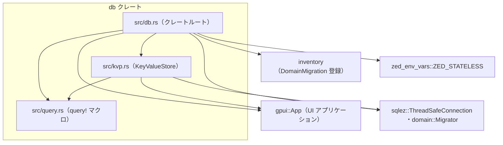
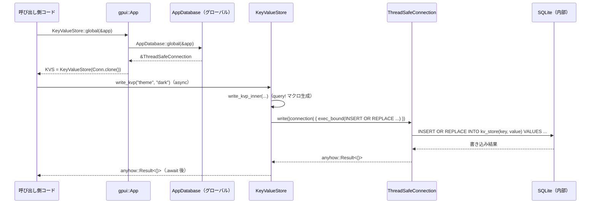

# db/

## 1. ざっくり一言

`db` クレートは、Zed ローカル環境向けの **SQLite ベースの共通データベース** を扱うためのインフラを提供し、  
アプリ全体で共有される DB 接続、マイグレーション実行、型安全なクエリマクロ、シンプルな Key-Value ストアを定義しています。

---

## 2. このモジュールの役割

### 2.1 概要

- このクレートは、**GPUI アプリケーション全体で共有される SQLite データベース**を安全かつ一貫した方法で扱うために存在します。
- 具体的には、
  - データベースファイルのオープンと初期化（PRAGMA 設定を含む）
  - inventory ベースの **ドメイン別マイグレーション管理**
  - シンプルな Key-Value ストア（アプリ別／グローバル）の実装
  - 型安全な SQL 関数を生成する `query!` マクロ
  を提供します。

### 2.2 アーキテクチャ内での位置づけ

このクレート内部の主なモジュールと外部依存の関係を、簡略化した依存関係図で示します。



- `src/db.rs`  
  - クレートのエントリポイントです。
  - `AppDatabase`、`open_db`、`static_connection!` など、DB 基盤となる型・関数・マクロを定義します。
- `src/kvp.rs`  
  - `KeyValueStore` / `GlobalKeyValueStore` など Key-Value ストア機能を提供します。
  - 内部で `query!` マクロと `ThreadSafeConnection` を利用します。
- `src/query.rs`  
  - SQL 文字列から型付きのメソッドを生成する `query!` マクロを定義します。

### 2.3 設計上のポイント

コードから読み取れる設計上の特徴は次の通りです。

- **ドメインごとのマイグレーション管理**
  - `sqlez::domain::Domain` を実装した型と `static_connection!` マクロを組み合わせることで、
    - ドメイン名
    - マイグレーション SQL
    - 依存ドメイン
    を `inventory` に登録し、`AppMigrator` がまとめて実行します。
- **アプリ単位 / プロセス単位の DB 共有**
  - `AppDatabase` は `gpui::Global` を実装しており、`gpui::App` ごとのグローバル DB として扱われます。
  - `GlobalKeyValueStore` は `LazyLock` によるプロセスグローバルな KV ストアです。
- **ファイル DB のフォールバック戦略**
  - ファイルベース DB のオープンに失敗した場合、`ALL_FILE_DB_FAILED` を立てた上で **共有インメモリ DB** にフォールバックします。
  - `ZED_STATELESS` が有効な場合は、最初からインメモリ DB のみを使用します。
- **クエリの型安全化とエラー文脈の付与**
  - `query!` マクロにより、SQL テキストから
    - 引数・戻り値が型で表現されたメソッド
    - 実行失敗時に関数名と SQL を含むエラー (`anyhow::Context`)  
    が自動生成されます。
- **非同期処理とバックグラウンド書き込み**
  - `smol` ベースの async 実装を使用し、`write_and_log` により DB 書き込みをバックグラウンドで実行できます。

---

## 3. 主要な機能一覧

このクレートが提供する主な機能を箇条書きで整理します。

- **アプリケーション共通 DB の構築**
  - `AppDatabase::new` / `open_db` による SQLite DB のオープンと初期化。
  - `AppDatabase::global` による `gpui::App` 単位の DB 接続共有。
- **ドメインマイグレーションの一括実行**
  - `DomainMigration` 構造体と `inventory` を用いたマイグレーション登録。
  - `AppMigrator` による依存関係順でのマイグレーション実行。
  - `static_connection!` マクロによるドメイン登録と簡易ラッパ型生成。
- **フォールバック付き DB オープン処理**
  - ファイル DB の作成・オープンに失敗した場合の、インメモリ DB へのフォールバック (`open_fallback_db`)。
  - `ZED_STATELESS` 環境変数に基づく完全ステートレスモード。
- **Key-Value ストア**
  - `KeyValueStore`: アプリごとの DB 上に `kv_store` / `scoped_kv_store` を作成し、KV を保存。
  - `ScopedKeyValueStore`: namespace 単位でキーを分離。
  - `GlobalKeyValueStore`: プロセス全体で共有されるグローバル KV ストア。
  - `Dismissable` トレイト: ダイアログ等の「二度と表示しない」フラグの保存。
- **クエリマクロ**
  - `query!` マクロ: SQL 文字列から型付きのクエリメソッドを生成。
- **補助ユーティリティ**
  - `write_and_log`: `gpui::App` のバックグラウンドタスクで DB 書き込みを実行し、エラーをログに残す。

---

## 4. 関数・構造体の解説

### 4.1 主要な型一覧

| 名前 | 種別 | 定義ファイル | 役割 / 用途 |
|------|------|--------------|-------------|
| `DomainMigration` | 構造体 | `src/db.rs` | 1 ドメイン分のマイグレーション情報（名前、SQL 群、依存ドメイン、マイグレーション変更許可関数）を保持します。`inventory` に登録され、起動時に走査されます。 |
| `AppDatabase` | 構造体（newtype） | `src/db.rs` | アプリ全体で共有される `ThreadSafeConnection` ラッパーです。`gpui::Global` を実装し、`AppDatabase::global` 経由で取得されます。 |
| `AppMigrator` | 構造体（中身なし） | `src/db.rs` | `sqlez::domain::Migrator` を実装し、全ドメインの `DomainMigration` を依存関係順に実行する役割を持ちます。 |
| `KeyValueStore` | 構造体（newtype） | `src/kvp.rs` | アプリ DB 上に `kv_store` / `scoped_kv_store` テーブルを持つ Key-Value ストアのドメインです。`Domain` を実装し、`static_connection!` でラップされています。 |
| `ScopedKeyValueStore<'a>` | 構造体 | `src/kvp.rs` | 特定の `namespace` に絞って Key-Value を読み書き・削除するためのビューです。 |
| `GlobalKeyValueStore` | 構造体（newtype） | `src/kvp.rs` | プロセス全体で共有されるグローバルな `kv_store` テーブルを持つ Key-Value ストアです。`LazyLock` 経由で一度だけ初期化されます。 |
| `Dismissable` | トレイト | `src/kvp.rs` | 「一度ユーザが操作したら以後は非表示にする」といったフラグを Key-Value ストアへ保存・取得するための共通インターフェイスです。呼び出し側ごとに `KEY` を定義します。 |
| `ALL_FILE_DB_FAILED` | 静的変数 | `src/db.rs` | ファイルベース DB のオープンに失敗し、フォールバック DB が使用されていることを示すフラグです。外部から参照できます。 |

マクロも公共 API の一部なので、別途取り上げます。

| 名前 | 種別 | 定義ファイル | 役割 / 用途 |
|------|------|--------------|-------------|
| `static_connection!` | マクロ | `src/db.rs` | ドメイン用のラッパー型に対して `Deref` / `Clone` / `global` / `open_test_db` 実装と、`DomainMigration` の `inventory` 登録を一括生成します。 |
| `query!` | マクロ | `src/query.rs` | SQL テキストとシグネチャ（引数型・戻り値型）から、`anyhow::Result` を返すクエリメソッドを生成します。 |

### 4.2 重要な関数・メソッド・マクロ詳細

#### `AppDatabase::new() -> Self`

**概要**

- 本番用のアプリケーションデータベースを開き、すべてのドメインマイグレーションを適用した `AppDatabase` を生成します。

**引数**

- なし（内部で `paths::database_dir` と `RELEASE_CHANNEL` を利用します）。

**戻り値**

- `AppDatabase`  
  - 内部に `ThreadSafeConnection` を保持する newtype です。

**内部処理の流れ**

1. `database_dir()` で DB ベースディレクトリを取得します。
2. `RELEASE_CHANNEL.dev_name()` によりスコープ名（例: `"dev"`）を取得します。
3. `smol::block_on` で `open_db::<AppMigrator>(db_dir, scope)` を同期的に待ち、`ThreadSafeConnection` を得ます。
4. 得られた接続を `AppDatabase` に包んで返します。

**Examples（使用例）**

`AppDatabase` 自体を直接使うより、通常は `AppDatabase::global` 経由で `ThreadSafeConnection` を利用しますが、単純化した例を示します。

```rust
use db::AppDatabase;                        // AppDatabase 型をインポート

fn main() {
    // 本番用データベースを同期的に初期化する
    let app_db = AppDatabase::new();        // マイグレーションも内部で実行される

    // 内部の ThreadSafeConnection にアクセスしたい場合は .0 で取り出せる
    let _conn = &app_db.0;                  // 通常はこの接続をラップしたドメイン型を使う
}
```

**Errors / Panics**

- `open_db` でフォールバック DB まで失敗し、`open_fallback_db` 内の `expect` に到達した場合、プロセスは panic します。
- それ以外のエラーは `open_db` 内部でハンドリングされ、ここでは panic しません。

**Edge cases（エッジケース）**

- `ZED_STATELESS` が `true` の環境では、ファイル上の DB ではなく最初からフォールバックのインメモリ DB が使われます。
- DB ディレクトリが作成できないなどの理由でファイル DB が開けない場合も、フォールバック DB へ切り替わります。

**使用上の注意点**

- この関数はブロッキングで `smol::block_on` を実行するため、既に async ランタイム上で動いているスレッドから多用する場合は注意が必要です（この点の詳細な制約は `smol` ランタイムの仕様に依存します）。
- アプリケーション全体では、`AppDatabase` を `gpui::App` のグローバルとして設定するコードが別途必要になります（このクレート内にはその設定コードは含まれていません）。

---

#### `AppDatabase::global(cx: &gpui::App) -> &ThreadSafeConnection`

**概要**

- 引数で渡された `gpui::App` インスタンスに紐づく `AppDatabase` グローバルが設定されていれば、その接続を返します。
- テスト環境では、設定がなくても共有テスト DB へフォールバックします。

**引数**

| 引数名 | 型 | 説明 |
|--------|----|------|
| `cx` | `&gpui::App` | GPUI アプリケーションコンテキスト。ここからグローバル `AppDatabase` を取得します。 |

**戻り値**

- `&ThreadSafeConnection`  
  - 現在のアプリに紐づく DB 接続への参照です。

**内部処理の流れ**

1. `cx.try_global::<Self>()` を呼び、`AppDatabase` がグローバルとして登録されているか確認します。
2. 登録されていれば、その中の `ThreadSafeConnection` への参照 `&db.0` を返します。
3. 登録されていない場合、
   - テストまたは `test-support` フィーチャー有効時は、`TEST_APP_DATABASE.0` を返します。
   - それ以外では `panic!("database not initialized")` となります。

**Examples（使用例）**

```rust
use db::AppDatabase;                               // AppDatabase をインポート
use db::sqlez::thread_safe_connection::ThreadSafeConnection;
use gpui::App;

fn use_db(app: &App) {
    // アプリに紐づくデータベース接続を取得する
    let conn: &ThreadSafeConnection = AppDatabase::global(app);

    // ここから先は conn を使ってクエリを実行する
    // （通常はドメイン型の .global(app) を使う）
}
```

**Errors / Panics**

- 本番コードで `AppDatabase` がグローバルとして登録されていない状態で `global` を呼ぶと panic します。

**Edge cases（エッジケース）**

- テスト環境では、`TEST_APP_DATABASE` が `LazyLock` 経由で遅延初期化されるため、`global` を呼ぶだけでテスト用インメモリ DB が準備されます。

**使用上の注意点**

- このメソッドを利用する前に、`AppDatabase` が `gpui::App` のグローバルに設定されていることが前提です（その設定場所はこのクレート外です）。
- 本番環境コードで `panic` を避けたい場合は、周辺設計で「必ずグローバルセットされている」ことを保証する必要があります。

---

#### `open_db<M: Migrator + 'static>(db_dir: &Path, scope: &str) -> ThreadSafeConnection`

**概要**

- 指定されたディレクトリ・スコープに対して SQLite データベースを開き、マイグレーションを実行します。
- ファイル DB が開けない場合には、インメモリのフォールバック DB へ切り替えます。

**引数**

| 引数名 | 型 | 説明 |
|--------|----|------|
| `db_dir` | `&Path` | DB を配置するルートディレクトリ（例: ユーザの設定ディレクトリ）。 |
| `scope` | `&str` | スコープ名。`"0-{scope}"` サブディレクトリが作成されます。 |

**戻り値**

- `ThreadSafeConnection`  
  - 成功時はファイルベース DB への接続、失敗時はフォールバックインメモリ DB への接続となります。

**内部処理の流れ**

1. `ZED_STATELESS` が `true` なら、即座に `open_fallback_db::<M>()` を呼んで終了します。
2. `main_db_dir = db_dir.join(format!("0-{scope}"))` を計算します。
3. `maybe!(async { ... }).await` ブロック内で、次を実施します:
   - `smol::fs::create_dir_all(&main_db_dir)` でディレクトリを作成。
   - `main_db_dir.join("db.sqlite")` でファイルパスを構築。
   - `open_main_db::<M>(&db_path)` でファイル DB をオープン。
4. `maybe!` の結果が `Some(connection)` ならそれを返します。
5. `None` の場合:
   - `ALL_FILE_DB_FAILED.store(true, Ordering::Release)` でフラグを立てます。
   - `open_fallback_db::<M>()` を呼んでインメモリ DB を返します。

**Examples（使用例）**

テスト用に任意パスへ DB を開く例です。

```rust
use db::open_db;                                        // open_db 関数をインポート
use db::sqlez::domain::Migrator;                        // Migrator トレイト
use std::path::Path;

struct MyMigrator;                                      // 独自 Migrator

impl Migrator for MyMigrator {                          // 必要なトレイト実装
    fn migrate(conn: &db::sqlez::connection::Connection)
        -> anyhow::Result<()>
    {
        // マイグレーション処理（例では空）
        Ok(())
    }
}

async fn open_my_db() {
    let dir = Path::new("/tmp/my-db-dir");              // DB 保存ディレクトリ
    let conn = open_db::<MyMigrator>(dir, "dev").await; // dev スコープで DB を開く
    assert!(conn.persistent());                         // ファイル DB かどうかは sqlez の API に依存
}
```

**Errors / Panics**

- ファイル DB とフォールバック DB の両方で `ThreadSafeConnection::builder().build()` が `Err` を返すと、`open_fallback_db` 内の `expect` で panic します。
- それ以外のエラーは、`maybe!` や `log_err` によってログ出力される形で処理されます（詳細は `util` クレートの実装に依存します）。

**Edge cases（エッジケース）**

- DB ディレクトリに書き込み権限がない場合など、`create_dir_all` が失敗するとフォールバック DB に切り替わります。
- `ZED_STATELESS` が `true` の場合は、ディレクトリ作成やファイルアクセスを行わず、必ずインメモリ DB になります。

**使用上の注意点**

- `open_db` は `M: Migrator` を型パラメータとして要求するため、マイグレーションの実行ロジックを定義した型を事前に用意する必要があります。通常は `AppMigrator` を利用します。
- フォールバック DB への切り替えは透明に行われるため、呼び出し側で「永続化されない可能性」を考慮する必要があります（`ALL_FILE_DB_FAILED` を参照することで検知可能です）。

---

#### `static_connection!($t:ident, [ $($d:ty),* ])`（マクロ）

**概要**

- `sqlez::domain::Domain` を実装した型 `$t` に対して、
  - `Deref<Target = ThreadSafeConnection>`
  - `Clone`
  - `global(&gpui::App) -> Self`
  - （テスト用）`open_test_db(&'static str) -> Self`
  の実装を自動生成し、そのドメインのマイグレーションを `inventory` に登録します。

**引数**

| パラメータ名 | 説明 |
|-------------|------|
| `$t` | ドメインを表すラッパー型（通常は `struct` で `ThreadSafeConnection` を 1 つフィールドに持つ newtype）。 |
| `$d` | 依存する他ドメインの型。ここで指定されたドメインのマイグレーションは `$t` より先に実行されます。 |

**戻り値**

- マクロなので戻り値はありません。型 `$t` に対する実装と `DomainMigration` 登録コードを生成します。

**内部処理の流れ（生成されるコードの概要）**

1. `impl Deref for $t` を生成し、`Target` を `ThreadSafeConnection` に設定。
2. `impl Clone for $t` を生成し、内部の接続を `clone()` して新しい `$t` を返すようにします。
3. `$t` に対して
   - `pub fn global(cx: &gpui::App) -> Self`  
     - `AppDatabase::global(cx)` から `ThreadSafeConnection` を取得し、`$t` に包んで返します。
   - テスト用 `async fn open_test_db(name: &'static str) -> Self`  
     - `open_test_db::<$t>(name)` を呼び、その接続で `$t` を生成します。
4. `inventory::submit!` ブロックを生成し、
   - `name`: `<$t as Domain>::NAME`
   - `migrations`: `<$t as Domain>::MIGRATIONS`
   - `dependencies`: `&[<$d as Domain>::NAME, ...]`
   - `should_allow_migration_change`:
     `<$t as Domain>::should_allow_migration_change`
   をフィールドとする `DomainMigration` を登録します。

**Examples（使用例）**

Key-Value ストアで実際に使われているパターンの簡略版です。

```rust
use db::sqlez::{domain::Domain, thread_safe_connection::ThreadSafeConnection};

pub struct MyDomain(ThreadSafeConnection);     // DB 接続をラップする newtype

impl Domain for MyDomain {                     // マイグレーションを定義
    const NAME: &str = "my_domain";
    const MIGRATIONS: &[&str] = &[
        db::sqlez_macros::sql!(CREATE TABLE my_table(id INTEGER PRIMARY KEY);),
    ];
}

db::static_connection!(MyDomain, []);          // 依存ドメインなしで static_connection! を適用
```

この定義により、次のようなメソッドが利用できます。

- `MyDomain::global(&gpui_app)`
- `MyDomain::open_test_db("name").await`
- `*my_domain`（`Deref` により `ThreadSafeConnection` として扱う）

**Errors / Panics**

- マクロ自体はコンパイル時に展開されるため、実行時エラーは発生しません。
- ただし、マイグレーション SQL に誤りがある場合は、`AppMigrator` 実行時にエラーや panic を引き起こす可能性があります（`db::tests::test_bad_migration_panics` 参照）。

**Edge cases（エッジケース）**

- 依存ドメインが存在しない型を指定した場合、コンパイルエラーになります。
- `$t` が `Domain` を実装していない場合もコンパイルエラーになります。

**使用上の注意点**

- `$t` は **1 フィールドだけが `ThreadSafeConnection`** である newtype である必要があります（生成される `Deref` 実装がフィールド `0` を参照しているため）。
- `Domain::MIGRATIONS` は不変の配列として扱われるため、マイグレーション順序や内容の変更には注意が必要です（`should_allow_migration_change` で制御されます）。

---

#### `query!` マクロ（各種シグネチャ）

**概要**

- SQL テキストと関数シグネチャから、`anyhow::Result<...>` を返すメソッドを生成します。
- `exec` / `select` / `select_row` / `select_bound` など `sqlez` の API を用い、失敗時には
  - 関数名（`$id`）
  - SQL テキスト
  を含むエラー文脈を追加します。

**主なパターン**

マクロの形式として、以下のようなバリエーションがあります（一部のみ例示します）。

- `fn` / `async fn` の違い
- 引数なし / あり（複数引数も可）
- 戻り値が
  - `Result<()>`
  - `Result<Vec<T>>`
  - `Result<Option<T>>`
  - `Result<T>`（1 行のみを期待）

例：

```rust
query! {
    pub fn read_kvp(key: &str) -> Result<Option<String>> {
        SELECT value FROM kv_store WHERE key = (?)
    }
}
```

**引数（マクロ引数としての意味）**

| 要素 | 説明 |
|------|------|
| `$vis` | 関数の可視性（例: `pub`）。 |
| `$id` | 生成されるメソッド名。 |
| `$arg: $arg_type` | SQL にバインドされる引数とその型。`(?)` の並びと個数を合わせる必要があります。 |
| `$return_type` | クエリ結果として返される型。`Vec` / `Option` / 単一値に対応。 |
| `$($sql:tt)+` | `sqlez_macros::sql!` でコンパイル時に処理される SQL テキスト。 |

**戻り値**

- 生成されたメソッドは常に `anyhow::Result<...>` を返します。
- `Result<T>` と書かれている箇所は、マクロ展開後 `anyhow::Result<T>` になります。

**内部処理の流れ（典型例）**

例として `fn foo(arg: T) -> Result<Option<U>>` の場合:

1. `let sql_stmt = sqlez_macros::sql!(...)` で SQL をコンパイルします。
2. `self.select_row_bound::<T, U>(sql_stmt)?(arg)` のように、`sqlez` の API を呼び出します。
3. 戻り値に対して `.context(format!("Error in {}, ...", stringify!($id), sql_stmt))` を付与して返します。

**Examples（使用例）**

`KeyValueStore::read_kvp` での具体例です。

```rust
impl KeyValueStore {
    query! {
        pub fn read_kvp(key: &str) -> Result<Option<String>> {
            SELECT value FROM kv_store WHERE key = (?)
        }
    }
}
```

この定義により、次のように利用できます。

```rust
use db::kvp::KeyValueStore;

fn read_example(store: &KeyValueStore) -> anyhow::Result<Option<String>> {
    // "example" キーに対応する値を取得する
    let value = store.read_kvp("example")?;      // SELECT value FROM kv_store ... が実行される
    Ok(value)
}
```

**Errors / Panics**

- SQL の構文エラーやバインド数の不一致など、`sqlez` 側で `Err` が返される状況では、`anyhow::Error` にラップされ、メッセージに関数名と SQL テキストが含まれます。
- マクロ生成コード自体には panic はありませんが、`sqlez` の内部実装に依存する panic が起こりうるかどうかはこのコードからは分かりません。

**Edge cases（エッジケース）**

- `Result<T>` 形式（`Option` でも `Vec` でもない）を返すバリアントでは、
  - 内部で `Option<T>` を `?` でアンラップしているため、**行が 1 つも返らなかった場合はエラー** になります（`context("expected single row result but found none ...")`）。
  - 複数行が返ってきた場合の扱いは `select_row` / `select_row_bound` の仕様に依存し、このコードからは分かりません。

**使用上の注意点**

- SQL 内の `(?)` プレースホルダの個数と、引数の個数・型を一致させる必要があります。一致しない場合、コンパイルエラーまたは実行時エラーになります。
- 非同期バリアント (`async fn`) は内部で `self.write` を呼ぶため、呼び出し側で `.await` 可能なコンテキストが必要です。

---

#### `KeyValueStore::read_kvp(&self, key: &str) -> anyhow::Result<Option<String>>`

※ 実装自体は `query!` マクロから生成されています。

**概要**

- `kv_store` テーブルから指定したキーに対応する値を 1 行だけ取得します。
- キーが存在しない場合は `Ok(None)` を返します。

**引数**

| 引数名 | 型 | 説明 |
|--------|----|------|
| `key` | `&str` | 検索するキー。`TEXT PRIMARY KEY` に対応します。 |

**戻り値**

- `anyhow::Result<Option<String>>`
  - `Ok(Some(value))` … 該当キーが存在し、値を取得できた場合。
  - `Ok(None)` … キーが存在しない場合。
  - `Err(e)` … クエリ実行やパースに失敗した場合。関数名と SQL テキストがエラー文脈に含まれます。

**内部処理の流れ**

1. `SELECT value FROM kv_store WHERE key = (?)` という SQL を `sqlez_macros::sql!` で生成します。
2. `self.select_row_bound::<&str, String>(sql_stmt)?(key)` を呼び、単一行を `Option<String>` として取得します（実際の呼び出しは `query!` 側で生成）。
3. `.context("Error in read_kvp, ...")` のようなメッセージを付けて結果を返します。

**Examples（使用例）**

```rust
use db::kvp::KeyValueStore;

fn show_value(store: &KeyValueStore) -> anyhow::Result<()> {
    // "user-token" キーの値を取得する
    let value = store.read_kvp("user-token")?;        // Option<String> が返る

    if let Some(token) = value {
        println!("token = {token}");                 // キーが存在した場合の処理
    } else {
        println!("token not set");                   // キーが存在しない場合
    }

    Ok(())
}
```

**Errors / Panics**

- DB 接続切断・SQL 構文エラーなどが起きた場合、`Err(anyhow::Error)` になります。
- panic は行っていません。

**Edge cases（エッジケース）**

- キーが存在しない場合でもエラーにはならず、`Ok(None)` が返ります。
- 同じキーが複数行存在することは、`PRIMARY KEY` 制約により SQLite レベルで禁止されています。

**使用上の注意点**

- 高頻度で呼ばれる場合は、必要に応じて値のキャッシュなどを検討できます（これは DB レイヤとは別の設計事項です）。
- 値は常に `TEXT` として保存されるため、JSON 等の構造化データを保存する場合は呼び出し側でシリアライズ・デシリアライズを行う必要があります。

---

#### `KeyValueStore::write_kvp(&self, key: String, value: String) -> anyhow::Result<()>`

**概要**

- 指定したキーと値を `kv_store` テーブルに `INSERT OR REPLACE` します（既存キーは上書き）。

**引数**

| 引数名 | 型 | 説明 |
|--------|----|------|
| `key` | `String` | 書き込み対象のキー。 |
| `value` | `String` | 保存する値。 |

**戻り値**

- `anyhow::Result<()>`  
  - 書き込みが成功すれば `Ok(())`。

**内部処理の流れ**

1. `log::debug!("Writing key-value pair for key {key}")` でログ出力します。
2. 非公開メソッド `write_kvp_inner`（`query!` で生成）を `await` して実際の DB 書き込みを行います。
3. `INSERT OR REPLACE INTO kv_store(key, value) VALUES ((?), (?))` という SQL を `exec_bound` で実行します。

**Examples（使用例）**

```rust
use db::kvp::KeyValueStore;

async fn write_example(store: &KeyValueStore) -> anyhow::Result<()> {
    // "theme" キーに "dark" という値を書き込む
    store
        .write_kvp("theme".to_string(), "dark".to_string())
        .await?;
    Ok(())
}
```

**Errors / Panics**

- DB の書き込みに失敗した場合は `Err(anyhow::Error)` を返します。
- panic は行っていません。

**Edge cases（エッジケース）**

- 既に同じキーが存在する場合でも、`INSERT OR REPLACE` のためエラーにならず上書きされます。
- 非 UTF-8 データなどは保存できません（SQLite の TEXT と Rust の `String` に依存）。

**使用上の注意点**

- `async fn` のため、呼び出し側は `.await` を行えるコンテキストである必要があります。
- UI スレッドから直接 `.await` したくない場合は、このクレートが提供する `write_and_log` と `gpui::App::background_spawn` を用いてバックグラウンドで呼び出す設計が想定されています。

---

#### `ScopedKeyValueStore::write(&self, key: String, value: String) -> anyhow::Result<()>`

**概要**

- 特定の `namespace` に紐づく Key-Value ペアを `scoped_kv_store` テーブルに `INSERT OR REPLACE` します。
- `KeyValueStore::scoped("ns")` から得られるビューを通じて利用します。

**引数**

| 引数名 | 型 | 説明 |
|--------|----|------|
| `key` | `String` | namespace 内でのキー。 |
| `value` | `String` | 保存する値。 |

**戻り値**

- `anyhow::Result<()>`  
  - 書き込み成功で `Ok(())` を返します。

**内部処理の流れ**

1. `namespace` を `String` にクローンします（`ScopedKeyValueStore` 自体は `&str` を保持）。
2. 親 `KeyValueStore` の `write` メソッドにクロージャを渡します。
3. クロージャ内部で
   - `connection.exec_bound::<(&str, &str, &str)>(...)` を呼び、
   - `INSERT OR REPLACE INTO scoped_kv_store(namespace, key, value) VALUES ((?), (?), (?))`
     を実行します。
4. 成功 / 失敗に応じて `anyhow::Result<()>` を返します。

**Examples（使用例）**

```rust
use db::kvp::KeyValueStore;

async fn scoped_example(store: &KeyValueStore) -> anyhow::Result<()> {
    // "settings" という namespace 用のビューを作成
    let scoped = store.scoped("settings");

    // "font-size" を "14" として保存
    scoped
        .write("font-size".to_string(), "14".to_string())
        .await?;

    Ok(())
}
```

**Errors / Panics**

- DB 書き込みに失敗した場合、`Err(anyhow::Error)` を返します。
- panic は行っていません。

**Edge cases（エッジケース）**

- `DELETE` と組み合わせて、namespace ごとの一括削除が行えます（`delete_all`）。
- namespace と key の組み合わせで `PRIMARY KEY` 制約があるため、同一 namespace 内で同じ key を複数回書き込むと上書きになります。

**使用上の注意点**

- namespace を `String` にクローンしてから書き込みを行う実装のため、非常に頻繁に呼び出される場合はクローンコストを意識する必要があります（通常の設定用途では問題になりにくい規模です）。

---

#### `GlobalKeyValueStore::global() -> &'static GlobalKeyValueStore`

**概要**

- プロセス全体で共有される `GlobalKeyValueStore` インスタンスへの参照を返します。
- 最初の呼び出し時に `LazyLock` を通じて DB 接続の初期化を行います。

**引数**

- なし。

**戻り値**

- `&'static GlobalKeyValueStore`  
  - プロセス内で一意の Key-Value ストアインスタンスです。

**内部処理の流れ**

1. `GLOBAL_KEY_VALUE_STORE` という `LazyLock<GlobalKeyValueStore>` が初回アクセス時に初期化されます。
2. 初期化時には
   - `database_dir()` から DB ルートディレクトリを取得し、
   - `open_db::<GlobalKeyValueStore>(db_dir, "global")` でスコープ `"global"` 用の DB をオープンします。
3. 以降の `global()` 呼び出しでは、同じインスタンスへの参照を返します。

**Examples（使用例）**

```rust
use db::kvp::GlobalKeyValueStore;

fn main() -> anyhow::Result<()> {
    // グローバルな KV ストアを取得
    let kv = GlobalKeyValueStore::global();                  // &'static GlobalKeyValueStore

    // 非同期で値を書き込む
    db::smol::block_on(async {
        kv.write_kvp("example".to_string(), "value".to_string()).await
    })?;                                                     // anyhow::Result<()> を ? で伝播

    // 同期で値を読み出す
    let value = kv.read_kvp("example")?;                     // Option<String>
    println!("value = {:?}", value);

    Ok(())
}
```

**Errors / Panics**

- 初回初期化で DB オープンに失敗し、フォールバック DB も失敗した場合は `open_fallback_db` の `expect` により panic します。

**Edge cases（エッジケース）**

- `ZED_STATELESS` が `true` の場合、グローバル KV ストアもインメモリ DB 上に構築されます。
- プロセス内で 1 回だけ初期化されるため、プロセス終了まで接続が保持されます。

**使用上の注意点**

- `App` コンテキストに依存せず、プロセス全体で共有されるため、ユーザごとの分離やプロジェクトごとの分離を行いたい場合には適さない場合があります。
- テスト時には `GlobalKeyValueStore` も同じディレクトリを使用するため、テストごとに分離したい場合は `open_test_db` と独自ドメインを使う方が明確です。

---

#### `write_and_log<F>(cx: &App, db_write: impl FnOnce() -> F + Send + 'static)`

**概要**

- `gpui::App` のバックグラウンドタスクとして、非同期の DB 書き込み処理を実行し、エラーはログに残して捨てます。
- 呼び出し側で `await` したくない（UI をブロックしたくない）ケース向けのユーティリティです。

**引数**

| 引数名 | 型 | 説明 |
|--------|----|------|
| `cx` | `&gpui::App` | バックグラウンドタスクをスケジューリングする GPUI アプリケーション。 |
| `db_write` | `impl FnOnce() -> F + Send + 'static` | 非同期 DB 書き込み処理を返すクロージャ。 |

`F` の型制約:

- `F: Future<Output = anyhow::Result<()>> + Send`

**戻り値**

- なし。バックグラウンドタスクを起動するだけです。

**内部処理の流れ**

1. `cx.background_spawn(async move { db_write().await.log_err() })` で非同期タスクをスケジュールします。
2. 即座に `.detach()` し、呼び出し元に制御を返します。
3. `db_write` の実行中にエラーが発生した場合は `.log_err()` によってログ出力した上で無視します（`ResultExt` の挙動に依存）。

**Examples（使用例）**

`Dismissable::set_dismissed` での利用例です。

```rust
use db::kvp::{KeyValueStore, Dismissable};
use gpui::App;

struct MyBanner;                                    // ダイアログなどを表す型

impl Dismissable for MyBanner {                     // KEY を定義
    const KEY: &'static str = "my-banner-dismissed";
}

fn dismiss_banner(app: &mut App) {
    // MyBanner の「二度と表示しない」フラグを true にセット
    MyBanner::set_dismissed(true, app);            // 内部で write_and_log が使われる
    // この関数は即座に戻り、DB 書き込みはバックグラウンドで行われる
}
```

**Errors / Panics**

- `db_write` が `Err` を返した場合でも、`.log_err()` によってログ出力されるだけで、呼び出し側には伝播しません。
- panic は行っていません。

**Edge cases（エッジケース）**

- バックグラウンドタスクが実行される前にアプリケーションが終了すると、書き込みが完了しないままになる可能性があります。

**使用上の注意点**

- 書き込み失敗を呼び出し側でハンドリングしたい場合には不向きです。その場合は `write_kvp` などを直接 `await` する必要があります。
- 大量のバックグラウンド書き込みを同時にスケジュールすると、タスク数が多くなり、スケジューラ負荷が増える可能性があります。

---

### 4.3 その他の主な関数・メソッド一覧

| 関数 / メソッド名 | 定義箇所 | 役割（1 行） |
|-------------------|----------|--------------|
| `topological_sort` | `src/db.rs` | `DomainMigration` の依存関係からトポロジカルソートを行い、マイグレーション順序を決定します。 |
| `open_main_db` | `src/db.rs` | ファイルパスを元に `ThreadSafeConnection` を構築し、PRAGMA を設定して返します。 |
| `open_fallback_db` | `src/db.rs` | 名前 `FALLBACK_MEMORY_DB` のインメモリ DB を開き、失敗時は `expect` で panic します。 |
| `open_test_db` | `src/db.rs` | テスト用にインメモリ DB を開き、書き込みキューをロックで直列化する設定で返します。 |
| `KeyValueStore::from_app_db` | `src/kvp.rs` | 既存の `AppDatabase` から `KeyValueStore` を構築します。 |
| `KeyValueStore::scoped` | `src/kvp.rs` | 特定の `namespace` に対する `ScopedKeyValueStore` ビューを生成します。 |
| `ScopedKeyValueStore::read` | `src/kvp.rs` | `scoped_kv_store` から namespace + key に対応する値を 1 件取得します。 |
| `ScopedKeyValueStore::delete` | `src/kvp.rs` | namespace 内の特定キーを削除します。 |
| `ScopedKeyValueStore::delete_all` | `src/kvp.rs` | namespace 内のすべてのキーを削除します。 |
| `GlobalKeyValueStore::read_kvp` | `src/kvp.rs` | グローバル `kv_store` からキーに対応する値を 1 件取得します（`query!` 生成）。 |
| `GlobalKeyValueStore::write_kvp` | `src/kvp.rs` | グローバル `kv_store` に対して `INSERT OR REPLACE` を行います。 |
| `GlobalKeyValueStore::delete_kvp` | `src/kvp.rs` | グローバル `kv_store` からキーを削除します。 |
| `Dismissable::dismissed` | `src/kvp.rs` | `KeyValueStore` を用いて、指定の `KEY` が保存済みかどうかを bool で返します。 |
| `Dismissable::set_dismissed` | `src/kvp.rs` | `KEY` の存在 / 非存在を通じて dismissed フラグを更新します（バックグラウンド書き込み）。 |

---

## 5. データフロー

ここでは、代表的な処理として **アプリケーション内で Key-Value を書き込む** フローを示します。

### 5.1 処理の概要

1. アプリケーションが起動し、どこかで `AppDatabase` が初期化され `gpui::App` のグローバルに登録されていると仮定します。
2. UI コードなどから `KeyValueStore::global(&app)` を呼び、アプリ DB に紐づく Key-Value ストアを取得します。
3. `write_kvp` または `ScopedKeyValueStore::write` を呼んで値を書き込みます。
4. 内部で `ThreadSafeConnection` の write キューを通じて SQLite に実際のクエリが送信されます。

### 5.2 シーケンス図



- `GlobalKeyValueStore` の場合は `AppDatabase` / `gpui::App` を経由せず、`LazyLock` による初期化から `Conn` を取得する点だけが異なります。
- `ScopedKeyValueStore::write` は `KeyValueStore` の `write` を経由しますが、全体の流れは同様です。

---

## 6. 使い方（How to Use）

### 6.1 基本的な使用方法

#### 6.1.1 グローバル Key-Value ストアの基本操作

このクレートだけを前提に、`GlobalKeyValueStore` を使って Key-Value を読み書きする最小例です。

```rust
use db::kvp::GlobalKeyValueStore;                     // グローバル KV ストアをインポート

fn main() -> anyhow::Result<()> {                     // anyhow::Result でエラーを伝播する main
    // グローバルな Key-Value ストアインスタンスを取得する
    let kv = GlobalKeyValueStore::global();           // &'static GlobalKeyValueStore

    // 非同期で "example" キーに "value" を書き込む
    db::smol::block_on(async {
        kv.write_kvp("example".to_string(), "value".to_string()).await
    })?;                                              // write_kvp の結果（anyhow::Result）を ? で伝播

    // 同期関数で "example" キーの値を読み出す
    let value = kv.read_kvp("example")?;              // Option<String> を取得

    println!("example = {:?}", value);                // 結果を標準出力に表示

    Ok(())                                            // 正常終了
}
```

#### 6.1.2 アプリ別 Key-Value ストアと `Dismissable` の利用

`gpui::App` のコンテキスト内で、特定の UI 要素に対する「二度と表示しない」設定を保存する例です。

```rust
use db::kvp::{KeyValueStore, Dismissable};            // KeyValueStore と Dismissable をインポート
use gpui::App;

struct WelcomeBanner;                                 // ウェルカムバナーを表す型

impl Dismissable for WelcomeBanner {                  // Dismissable トレイトを実装
    const KEY: &'static str = "welcome-banner-dismissed";
}

fn show_banner(app: &App) {                           // バナーを表示するかどうかを判断する関数
    if !WelcomeBanner::dismissed(app) {               // DB 上に KEY が保存されていなければ表示
        // 実際のバナー表示処理（ここでは省略）
    }
}

fn dismiss_banner(app: &mut App) {                    // ユーザが「二度と表示しない」を選んだときの処理
    WelcomeBanner::set_dismissed(true, app);          // バックグラウンドで KEY を DB に書き込む
    // この関数は即座に戻り、UI をブロックしない
}
```

- `dismissed` は `KeyValueStore::global(app)` を内部で呼び、`kv_store` に `WELCOME-BANNER` の値があれば `true` を返します。
- `set_dismissed` は `write_and_log` を通じて非同期に書き込みを行います。

### 6.2 よくある使用パターン

#### パターン 1: namespace ごとの設定管理（`ScopedKeyValueStore`）

複数の機能や画面ごとに設定を分けたい場合、`scoped` を使って namespace を分離できます。

```rust
use db::kvp::KeyValueStore;

async fn per_page_settings(store: &KeyValueStore) -> anyhow::Result<()> {
    let editor_settings = store.scoped("editor");     // "editor" 向け設定
    let terminal_settings = store.scoped("terminal");// "terminal" 向け設定

    editor_settings
        .write("font-size".to_string(), "14".to_string())
        .await?;                                      // editor 向けフォントサイズ

    terminal_settings
        .write("font-size".to_string(), "10".to_string())
        .await?;                                      // terminal 向けフォントサイズ

    Ok(())
}
```

#### パターン 2: テスト用 DB の利用（`open_test_db`）

ドメインごとにテスト専用 DB を使いたい場合、`static_connection!` が生成する `open_test_db` を利用できます。

```rust
use db::kvp::KeyValueStore;

#[gpui::test]
async fn test_my_feature() {
    // テスト用インメモリ DB を開く（名前で区別可能）
    let store = KeyValueStore::open_test_db("test_my_feature").await;

    store.write_kvp("key".to_string(), "value".to_string())
        .await
        .unwrap();

    assert_eq!(store.read_kvp("key").unwrap(), Some("value".to_string()));
}
```

- テストごとに異なる DB 名を指定することで、テスト間の干渉を防げます。

### 6.3 使用上の注意点（まとめ）

このディレクトリに含まれるモジュールを利用する際の共通の注意点をまとめます。

- **永続化されない可能性**
  - ファイル DB のオープンに失敗した場合や `ZED_STATELESS` が `true` の場合、インメモリ DB が使用されます。
  - この場合、プロセス終了時に全データが失われます。必要に応じて `ALL_FILE_DB_FAILED` をチェックして通知する設計が考えられます。
- **`AppDatabase::global` の前提**
  - `KeyValueStore::global(&App)` 等を使うためには、`AppDatabase` が `gpui::App` のグローバルに事前登録されている必要があります。
  - このクレート内には登録処理がないため、アプリケーション側で初期化コードを用意する必要があります。
- **同期 / 非同期の混在**
  - 読み取り系（`read_kvp` など）は同期関数、書き込み系（`write_kvp` など）は `async fn` となっています。
  - 同期コードから書き込みを行う場合は、`smol::block_on` するか、`write_and_log` を使ってバックグラウンドタスクとして実行する必要があります。
- **`query!` 使用時の型整合性**
  - SQL 内の `(?)` プレースホルダ数と引数の数・型の整合性を保つ必要があります。整合しない場合はコンパイルエラーまたは実行時エラーの原因になります。
- **1 行のみを期待するクエリ**
  - `Result<T>` 形式（`Option` ではない）を返す `query!` 関数は「1 行だけ返る」ことを期待しており、0 行の場合はエラーになります。
  - クエリがデータ欠如を許容するケースでは、`Result<Option<T>>` 返却のバリアントを選択することが適しています。
- **テーブル定義の前提**
  - `kv_store` / `scoped_kv_store` は `STRICT` モードで作成されているため、SQLite の型制約が厳密に適用されます。想定外の型を保存・読み出したい場合はテーブル定義自体の変更が必要になります。

---

## 7. 関連ファイル

このディレクトリに含まれるファイルと、それぞれの役割を一覧にします。

| パス | 役割 / 関係 |
|------|------------|
| `db/Cargo.toml` | `db` クレートの定義ファイル。クレート名、バージョン、依存クレート（`sqlez`, `gpui`, `anyhow` など）を指定します。ライブラリのエントリポイントを `src/db.rs` に設定しています。 |
| `db/README.md` | 簡易 README。テスト用データベースの構築方法や、生成された DB を `sqliteonline.com` にインポートしてクエリを試す方法の概要が記載されています。 |
| `db/src/db.rs` | クレートのルートモジュール。`AppDatabase`、`AppMigrator`、マイグレーション用の `DomainMigration`、DB オープンロジック（`open_db` 等）、`static_connection!` マクロ、`write_and_log` などの基盤機能を提供します。 |
| `db/src/kvp.rs` | Key-Value ストア機能をまとめたモジュール。`KeyValueStore` / `ScopedKeyValueStore` / `GlobalKeyValueStore` 構造体と、`Dismissable` トレイトを定義し、`query!` マクロを用いて具体的なクエリメソッドを実装しています。 |
| `db/src/query.rs` | `query!` マクロの実装を含むモジュール。多数のマクロルールにより、`Result<()>` / `Result<Vec<T>>` / `Result<Option<T>>` / `Result<T>` を返す各種クエリ関数のパターンをサポートします。 |

このディレクトリに含まれない、他クレート側のドメイン定義や `AppDatabase` のグローバル登録コードなどは、ここからは参照できません。そのため、実際のアプリケーション全体での初期化手順は別ファイル側の実装に依存します。
