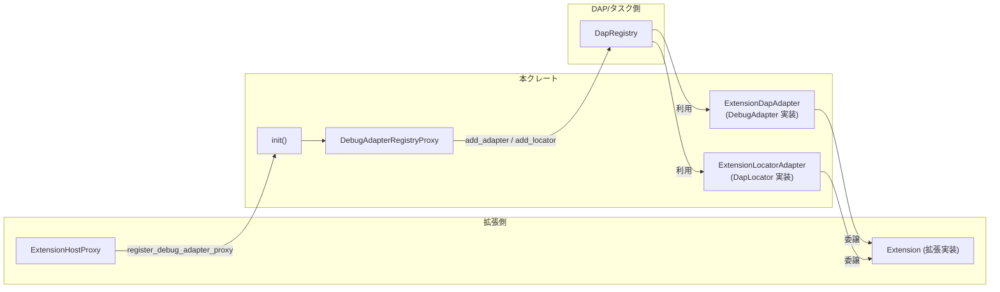
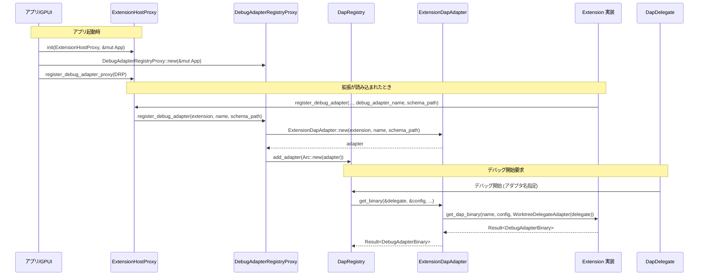

# debug_adapter_extension/ コード解説

## 1. ざっくり一言

`debug_adapter_extension` クレートは、Zed の拡張 (`extension` クレート側) が提供するデバッグアダプタ／ロケータを、DAP (`dap` クレート) のレジストリに登録して利用できるようにするためのブリッジ層です。

拡張が実装する非同期 API を、`DebugAdapter` / `DapLocator` といった DAP 側の trait にアダプトする役割を持ちます。

---

## 2. このモジュールの役割

### 2.1 概要

- このディレクトリは **Extension システムと DAP システムの橋渡し** を行うために存在し、拡張が公開するデバッグ関連 API を Zed の DAP 実装から利用できる形に変換します。
- 具体的には、拡張ホスト (`ExtensionHostProxy`) 経由で登録されるデバッグアダプタ／ロケータを、`DapRegistry` に登録するプロキシを提供します。
- また、拡張側のインターフェース (`Extension`, `WorktreeDelegate` 等) と DAP 側のインターフェース (`DebugAdapter`, `DapDelegate`, `DapLocator`) を相互に変換するアダプタ構造体を定義します。

### 2.2 アーキテクチャ内での位置づけ

このクレートは、Extension ホストと DAP レジストリの間に挟まるアダプタ層として機能します。



- アプリ起動時に `init()` が呼ばれ、`DebugAdapterRegistryProxy` が `ExtensionHostProxy` に登録されます。
- 拡張は Extension ホスト経由でデバッグアダプタ／ロケータを登録し、その呼び出しが `DebugAdapterRegistryProxy` を通じて `DapRegistry` に転送されます。
- 実際のデバッグ開始時には `DapRegistry` が `ExtensionDapAdapter` / `ExtensionLocatorAdapter` を呼び出し、それが拡張 (`Extension`) の非同期 API を叩きます。

### 2.3 設計上のポイント

- **責務の分離**
  - ルートモジュール (`debug_adapter_extension.rs`) は、Extension ホストとの統合と `DapRegistry` への登録処理のみを扱います。
  - 実際のアダプタ実装は `extension_dap_adapter.rs` / `extension_locator_adapter.rs` に分離されています。
- **状態管理**
  - `DebugAdapterRegistryProxy` は `DapRegistry` のクローン参照のみを持つ軽量なプロキシです。
  - `ExtensionDapAdapter` / `ExtensionLocatorAdapter` は、それぞれ 1 つの拡張 (`Arc<dyn Extension>`) と名前を保持する stateless なアダプタとして設計されています。
- **エラーハンドリング**
  - デバッグアダプタ登録時の初期化 (`ExtensionDapAdapter::new`) の結果には、`util::ResultExt::log_err()` が使われ、`Result` から `Option` へ変換されています。
    - このメソッドの実装はこのチャンクにはありませんが、型から「`Ok` のときだけ `Some` を返す」ことが分かります。
    - 名前からは「エラー時にログを出す」意図が推測できますが、実際にログするかどうかはコードから断定できません。
  - ロケータのシナリオ生成 (`create_scenario`) では、拡張側の `Result<Option<DebugScenario>>` 相当の結果を `.ok().flatten()` しており、エラー時も `None` として扱われます。
- **非同期処理**
  - `async-trait` を利用し、`DebugAdapter` / `DapLocator` / `WorktreeDelegate` といった trait を非同期メソッドで実装しています。
  - `DebugAdapter` 実装には `#[async_trait(?Send)]` が付いており、ここがどのスレッドで実行されるかはランタイム（`gpui`）側の実装に依存します。

---

## 3. 主要な機能一覧

このクレートが提供する主な機能は次のとおりです。

- **Extension ホストとの統合**
  - `init` 関数: `ExtensionHostProxy` にデバッグアダプタ／ロケータ登録用プロキシを登録します。
- **デバッグアダプタのアダプト**
  - `ExtensionDapAdapter`: 拡張が提供する DAP バイナリ取得・設定変換 API を、`DebugAdapter` trait として実装します。
- **ワークツリー操作のアダプト**
  - `WorktreeDelegateAdapter`: DAP 側の `DapDelegate` を拡張側の `WorktreeDelegate` として見せるアダプタです。
- **デバッグロケータのアダプト**
  - `ExtensionLocatorAdapter`: 拡張が提供するロケータ API を、`DapLocator` trait として実装します。
- **DAP スキーマの読み込み**
  - JSON 形式のスキーマファイルを読み込み、`serde_json::Value` として保持します (`ExtensionDapAdapter` 内)。

---

## 4. 関数・構造体の解説

### 4.1 型一覧

| 名前 | 種別 | モジュール | 役割 / 用途 |
|------|------|------------|-------------|
| `DebugAdapterRegistryProxy` | 構造体 | `debug_adapter_extension.rs` | `ExtensionHostProxy` から呼ばれるプロキシ。拡張が登録するデバッグアダプタ／ロケータを `DapRegistry` に転送します。 |
| `ExtensionDapAdapter` | 構造体 | `extension_dap_adapter.rs` | 拡張の DAP 関連 API を `DebugAdapter` として公開するアダプタ。スキーマ JSON も保持します。 |
| `WorktreeDelegateAdapter` | タプル構造体 | `extension_dap_adapter.rs` | `Arc<dyn DapDelegate>` をラップし、`WorktreeDelegate` trait を実装するアダプタです。 |
| `ExtensionLocatorAdapter` | 構造体 | `extension_locator_adapter.rs` | 拡張のロケータ API を `DapLocator` として公開するアダプタです。 |

### 4.2 主要関数・メソッド詳細（7 件）

#### `init(extension_host_proxy: Arc<ExtensionHostProxy>, cx: &mut App)`

**概要**

- Extension ホストに対して「デバッグアダプタ登録用プロキシ (`DebugAdapterRegistryProxy`)」を登録する初期化関数です。
- アプリケーション起動時などに 1 回呼び出されることを想定したエントリポイントです。

**引数**

| 引数名 | 型 | 説明 |
|--------|----|------|
| `extension_host_proxy` | `Arc<ExtensionHostProxy>` | 拡張を管理する Extension ホストへのプロキシ。 |
| `cx` | `&mut App` | `gpui` の `App` コンテキスト。`DapRegistry::global` を取得するために用います。 |

**戻り値**

- なし (`()`)

**内部処理の流れ**

1. `DebugAdapterRegistryProxy::new(cx)` を呼び出して、グローバルな `DapRegistry` のクローンを保持したプロキシを生成します。
2. `extension_host_proxy.register_debug_adapter_proxy(...)` を呼び出し、このプロキシを Extension ホストに登録します。
3. 以後、拡張がデバッグアダプタ／ロケータを登録すると、このプロキシを通じて `DapRegistry` に登録されます。

**Examples（使用例）**

アプリケーションの初期化コードから呼び出す想定の例です（`ExtensionHostProxy` や `App` の取得方法はこのチャンクからは分からないため省略しています）。

```rust
use std::sync::Arc;
use debug_adapter_extension::init;
use extension::ExtensionHostProxy;
use gpui::App;

// アプリの初期化時に呼ぶ関数の一例
fn setup_debug_adapter_integration(
    extension_host_proxy: Arc<ExtensionHostProxy>, // どこかで生成・取得した ExtensionHostProxy
    app: &mut App,                                // アプリケーションの App コンテキスト
) {
    // debug_adapter_extension クレートを初期化し、
    // Extension ホストにデバッグアダプタ登録用プロキシを登録する
    init(extension_host_proxy, app);
}
```

**Errors / Panics**

- この関数内では明示的に `Result` を返しておらず、`?` も使用していないため、ここで直接 `Err` が返ることはありません。
- `DapRegistry::global(cx)` や `register_debug_adapter_proxy` の内部で panic するかどうかは、このチャンクからは分かりません。

**Edge cases（エッジケース）**

- `cx` がどのような状態でも `DapRegistry::global(cx)` が返る前提で書かれており、`None` をハンドリングするようなコードはありません（`DapRegistry::global` の仕様はこのチャンクからは不明です）。
- `extension_host_proxy` が `Arc` のため、`init` を複数回呼ぶことは型上可能ですが、重複登録の扱いは `ExtensionHostProxy` 側の実装次第で、このチャンクからは分かりません。

**使用上の注意点**

- `init` は通常、アプリケーションの起動時など、Extension ホストや DAP サブシステムが準備できたタイミングで 1 回呼び出すのが自然です。
- 既に他の箇所で同種のプロキシが登録されている場合、二重登録の挙動は外部実装に依存します。

---

#### `DebugAdapterRegistryProxy::register_debug_adapter(&self, extension, debug_adapter_name, schema_path)`

**概要**

- Extension ホストから呼ばれ、拡張が提供するデバッグアダプタを `DapRegistry` に登録します。
- DAP スキーマ JSON ファイルを読み込み、`ExtensionDapAdapter` を生成してからレジストリに追加します。

**引数**

| 引数名 | 型 | 説明 |
|--------|----|------|
| `extension` | `Arc<dyn extension::Extension>` | デバッグアダプタを提供する拡張インスタンス。 |
| `debug_adapter_name` | `Arc<str>` | デバッグアダプタの名前。DAP 側の `DebugAdapterName` に変換されます。 |
| `schema_path` | `&Path` | DAP スキーマ JSON ファイルへのパス。 |

**戻り値**

- なし (`()`)

**内部処理の流れ**

1. `ExtensionDapAdapter::new(extension, debug_adapter_name, schema_path)` を呼び出します。
2. 返り値の `Result<ExtensionDapAdapter>` に対して `.log_err()` を呼び出し、`Option<ExtensionDapAdapter>` に変換します。
   - エラー時のログ出力等の挙動は `ResultExt::log_err` の実装に依存します。
3. `Some(adapter)` の場合のみ、`self.debug_adapter_registry.add_adapter(Arc::new(adapter))` を呼び、アダプタをレジストリに追加します。
4. `None` の場合（`new()` がエラーになった場合）、何も登録されません。

**Errors / Panics**

- `ExtensionDapAdapter::new` が `Err` を返す条件:
  - スキーマファイルの読み込み (`std::fs::read_to_string`) 失敗。
  - 読み込んだ文字列が有効な JSON でない。
- ただし、ここではそれらの `Err` は `log_err()` に渡され、呼び出し元には伝播しません（登録しないだけになります）。
- 明示的な panic 呼び出しはありません。

**Edge cases（エッジケース）**

- `schema_path` が存在しない・権限がないなどの場合:
  - `ExtensionDapAdapter::new` がエラーとなり、アダプタは登録されません。
- スキーマファイルが空・不正な JSON の場合:
  - 同様に登録は行われません。
- 同じ `debug_adapter_name` で複数回登録した場合の挙動は `DapRegistry::add_adapter` に依存し、このチャンクからは分かりません。

**使用上の注意点**

- このメソッドは `ExtensionDebugAdapterProviderProxy` trait の一部として Extension ホスト側から呼ばれる想定であり、外部から直接呼び出すことは通常ありません（構造体自体が `pub` ではありません）。
- スキーマファイルのパスや内容が正しくない場合でも、ここでは `Result` が外に返らないため、エラーの検出は `log_err` の出力などに依存します。

---

#### `DebugAdapterRegistryProxy::register_debug_locator(&self, extension, locator_name)`

**概要**

- Extension ホストから呼ばれ、拡張が提供するデバッグロケータを `DapRegistry` に登録します。
- 拡張とロケータ名から `ExtensionLocatorAdapter` を生成し、ロケータとして追加します。

**引数**

| 引数名 | 型 | 説明 |
|--------|----|------|
| `extension` | `Arc<dyn extension::Extension>` | ロケータを提供する拡張インスタンス。 |
| `locator_name` | `Arc<str>` | ロケータの識別名。 |

**戻り値**

- なし (`()`)

**内部処理の流れ**

1. `ExtensionLocatorAdapter::new(extension, locator_name)` を呼び出し、アダプタを生成します。
2. 生成したアダプタを `Arc::new(...)` で包み、`self.debug_adapter_registry.add_locator(...)` に渡します。

**Errors / Panics**

- `ExtensionLocatorAdapter::new` は `Result` を返さない単純なコンストラクタなので、ここでエラーが発生することはありません。
- `DapRegistry::add_locator` 内部での挙動はこのチャンクからは分かりません。

**Edge cases（エッジケース）**

- 同一 `locator_name` の登録重複の扱いは `DapRegistry` の実装に依存します。

**使用上の注意点**

- このメソッドも `ExtensionDebugAdapterProviderProxy` 経由で Extension ホストから呼ばれる内部的な API です。

---

#### `ExtensionDapAdapter::get_binary(&self, delegate, config, user_installed_path, _user_args, _user_env, _cx) -> Result<DebugAdapterBinary>`

（`DebugAdapter` trait 実装内のメソッド）

**概要**

- DAP サブシステムから呼ばれ、実際に起動する DAP バイナリ（実行ファイルなど）を取得します。
- 内部的には拡張の `get_dap_binary` を呼び出し、その結果をそのまま返します。

**引数**

| 引数名 | 型 | 説明 |
|--------|----|------|
| `delegate` | `&Arc<dyn DapDelegate>` | DAP 側から渡されるワークツリー関連のデリゲート。 |
| `config` | `&DebugTaskDefinition` | デバッグタスクの定義。 |
| `user_installed_path` | `Option<PathBuf>` | ユーザーが明示的にインストールした DAP バイナリのパス（あれば）。 |
| `_user_args` | `Option<Vec<String>>` | ユーザー指定の追加引数（現状は未使用）。 |
| `_user_env` | `Option<HashMap<String, String>>` | ユーザー指定の環境変数（現状は未使用）。 |
| `_cx` | `&mut AsyncApp` | 非同期アプリコンテキスト（現状は未使用）。 |

**戻り値**

- `Result<DebugAdapterBinary>`: 実際に DAP を起動するためのバイナリ情報。エラー時は `Err`。

**内部処理の流れ**

1. `delegate.clone()` で `Arc<dyn DapDelegate>` を複製します。
2. それを `WorktreeDelegateAdapter` でラップし、`Arc<dyn WorktreeDelegate>` として拡張に渡せる形にします。
3. 拡張の `extension.get_dap_binary(...)` を呼び出します。
   - 引数として:
     - デバッグアダプタ名 (`self.debug_adapter_name.clone()`)
     - デバッグタスク定義 (`config.clone()`)
     - `user_installed_path`
     - `Arc::new(WorktreeDelegateAdapter(...))`
4. 拡張から返ってきた `Result<DebugAdapterBinary>` をそのまま返します。

**Examples（使用例）**

このメソッドは通常 DAP ランタイム側から呼び出され、利用者が直接呼ぶことは想定されていません。疑似的な呼び出し例を示します（実際の `DapDelegate` や `DebugTaskDefinition` の生成方法はこのチャンクからは不明です）。

```rust
use std::{path::Path, sync::Arc};
use dap::adapters::{DapDelegate, DebugTaskDefinition};
use debug_adapter_extension::extension_dap_adapter::ExtensionDapAdapter;
use extension::Extension;

// extension, delegate, config はどこか別の場所で用意されていると仮定
async fn obtain_dap_binary_example(
    extension: Arc<dyn Extension>,          // 拡張実装
    delegate: Arc<dyn DapDelegate>,        // DAP 側のデリゲート
    config: DebugTaskDefinition,           // デバッグタスク定義
) {
    let adapter = ExtensionDapAdapter::new(
        extension.clone(),
        Arc::from("my-debug-adapter"),     // アダプタ名
        Path::new("schema.json"),          // スキーマ JSON のパス
    ).expect("schema must be valid");

    let binary = adapter
        .get_binary(
            &delegate,
            &config,
            None,                           // user_installed_path
            None,                           // _user_args （現状未使用）
            None,                           // _user_env  （現状未使用）
            &mut gpui::AsyncApp::new(),     // 実際の生成方法は不明のため疑似コード
        )
        .await;

    // binary の扱いは dap クレート側の仕様に依存
    let _ = binary;
}
```

※ `AsyncApp::new()` や `DebugTaskDefinition` の生成は実際の API を知らないため、上記はあくまでイメージです。

**Errors / Panics**

- 拡張の `get_dap_binary` が返す `Err` は、このメソッドからも `Err` としてそのまま返されます。
- このメソッド自身に panic を引き起こすような処理はありません。

**Edge cases（エッジケース）**

- `user_installed_path = None` の場合:
  - 拡張側がデフォルトのインストールパス等を解決する必要があります。
- `_user_args` / `_user_env` は現状未使用のため、呼び出し時に与えても拡張には伝わりません。
- `delegate` がワークツリーを解決できない場合などのエラー処理は、拡張側の `get_dap_binary` 実装に依存します。

**使用上の注意点**

- ユーザー引数・環境変数はまだ Extension API に反映されていないことがコメントから分かります。
  - そのため、ユーザー指定の追加オプションをバイナリ起動時に反映したい場合、この実装の変更が必要になります。
- `WorktreeDelegateAdapter` を通してファイルアクセスや `which` 呼び出しが行われるため、拡張側は `WorktreeDelegate` の挙動を前提に実装することになります。

---

#### `ExtensionDapAdapter::config_from_zed_format(&self, zed_scenario: ZedDebugConfig) -> Result<DebugScenario>`

**概要**

- Zed 固有のデバッグ設定 (`ZedDebugConfig`) を、DAP ランタイムが扱う `DebugScenario` に変換します。
- 内部的には拡張の `dap_config_to_scenario` を呼び出し、その結果を返します。

**引数**

| 引数名 | 型 | 説明 |
|--------|----|------|
| `zed_scenario` | `ZedDebugConfig` | Zed エディタ側のデバッグ設定表現。 |

**戻り値**

- `Result<DebugScenario>`: DAP 側で扱う標準化されたデバッグシナリオ。

**内部処理の流れ**

1. `self.extension.dap_config_to_scenario(zed_scenario).await` を呼び出します。
2. その `Result<DebugScenario>` をそのまま呼び出し元に返します。

**Errors / Panics**

- 拡張側の `dap_config_to_scenario` が `Err` を返した場合、そのまま `Err` が返ります。
- panic を起こすような処理はありません（拡張実装内部の panic はこのチャンクからは不明）。

**Edge cases（エッジケース）**

- `zed_scenario` に必要な情報が欠けている場合など、どのような条件で `Err` となるかは `ZedDebugConfig` と拡張実装の仕様に依存します。

**使用上の注意点**

- このメソッドは DAP ランタイム（またはその周辺コード）から呼ばれる想定で、通常は直接利用しません。

---

#### `ExtensionDapAdapter::request_kind(&self, config: &serde_json::Value) -> Result<StartDebuggingRequestArgumentsRequest>`

**概要**

- 任意の JSON 設定 (`config`) に基づいて、どの種類の DAP リクエスト（`launch` / `attach` 等）を使うべきかを決定するための情報を取得します。
- 内部的には拡張の `dap_request_kind` を呼び出します。

**引数**

| 引数名 | 型 | 説明 |
|--------|----|------|
| `config` | `&serde_json::Value` | 拡張が解釈するデバッグ設定 JSON。 |

**戻り値**

- `Result<StartDebuggingRequestArgumentsRequest>`: DAP の `startDebugging` 要求の引数に関する情報。

**内部処理の流れ**

1. `self.extension.dap_request_kind(self.debug_adapter_name.clone(), config.clone()).await` を呼び出します。
2. 拡張から返ってきた `Result<StartDebuggingRequestArgumentsRequest>` をそのまま返します。

**Errors / Panics**

- 拡張側が `Err` を返した場合、そのまま `Err` になります。
- `config.clone()` のみで panic 要因は特にありません。

**Edge cases（エッジケース）**

- `config` がスキーマと合致しない JSON の場合、拡張側の実装によっては `Err` を返す可能性があります。

**使用上の注意点**

- `config` は事前にスキーマ等でバリデーションされていることが望ましいですが、このメソッド内でのバリデーションは行っていません。
- スキーマ（`self.schema`）自体は別メソッドで返されるだけで、ここでは利用されていません。

---

#### `ExtensionLocatorAdapter::create_scenario(&self, build_config, resolved_label, adapter) -> Option<DebugScenario>`

（`DapLocator` trait 実装内のメソッド）

**概要**

- あるビルドタスク（`TaskTemplate`）とラベル・アダプタ名に対して、このロケータが対応可能ならば `DebugScenario` を生成します。
- 拡張の `dap_locator_create_scenario` を呼び出し、その `Result<Option<DebugScenario>>` 相当の結果を `Option<DebugScenario>` に変換して返します。

**引数**

| 引数名 | 型 | 説明 |
|--------|----|------|
| `build_config` | `&TaskTemplate` | ビルドタスクのテンプレート。 |
| `resolved_label` | `&str` | タスクの解決済みラベル。 |
| `adapter` | `&DebugAdapterName` | 使用対象のデバッグアダプタ名。 |

**戻り値**

- `Option<DebugScenario>`:
  - `Some(scenario)`: このロケータが対応し、シナリオ生成に成功した場合。
  - `None`: 未対応、または拡張側でエラーが発生した場合。

**内部処理の流れ**

1. 拡張の `dap_locator_create_scenario(...)` を次の引数で呼び出します:
   - ロケータ名 (`self.locator_name.as_ref().to_owned()`)
   - ビルド設定 (`build_config.clone()`)
   - ラベル (`resolved_label.to_owned()`)
   - アダプタ名 (`adapter.0.as_ref().to_owned()`)
2. 非同期結果に対して `.await` した後、`.ok().flatten()` を適用します。
   - `Ok(Some(s))` → `Some(s)`
   - `Ok(None)` → `None`
   - `Err(_)` → `None`
3. 最終的な `Option<DebugScenario>` を返します。

**Errors / Panics**

- 拡張側の `dap_locator_create_scenario` が `Err` を返した場合でも、ここでは `None` として扱われ、エラー情報は呼び出し元には伝わりません。
- 明示的な panic 呼び出しはありません。

**Edge cases（エッジケース）**

- 拡張が未対応なタスクの場合:
  - 通常は `Ok(None)` が返され、ここでも `None` になります。
- 拡張側の実装エラー（内部例外）などで `Err` が返された場合:
  - 同じく `None` となるため、呼び出し元からは「未対応」と区別できません。

**使用上の注意点**

- エラー時も `None` になるため、「本当に未対応なのか」「エラーで失敗したのか」を区別したい場合は、拡張側でログを出すなどの工夫が必要です（このクレート内では区別していません）。
- `build_config` や `resolved_label` を clone して渡しているため、大きなオブジェクトを頻繁に渡すケースではコストを考慮する必要があります。

---

### 4.3 その他の主要な関数・メソッド（一覧）

| 関数 / メソッド名 | 役割（1 行） |
|-------------------|-------------|
| `DebugAdapterRegistryProxy::new(cx: &mut App) -> Self` | グローバルな `DapRegistry` を取得し、プロキシ構造体を初期化します。 |
| `DebugAdapterRegistryProxy::unregister_debug_adapter(&self, debug_adapter_name: Arc<str>)` | 指定名のデバッグアダプタを `DapRegistry` から削除します。 |
| `DebugAdapterRegistryProxy::unregister_debug_locator(&self, locator_name: Arc<str>)` | 指定名のロケータを `DapRegistry` から削除します。 |
| `ExtensionDapAdapter::new(extension, debug_adapter_name, schema_path) -> Result<Self>` | スキーマファイルを読み込んで JSON としてパースし、`ExtensionDapAdapter` を生成します。 |
| `WorktreeDelegateAdapter::id(&self) -> u64` | `DapDelegate::worktree_id()` の値を `to_proto()` で変換して返します。 |
| `WorktreeDelegateAdapter::root_path(&self) -> String` | `DapDelegate::worktree_root_path()` を UTF-8 文字列として返します。 |
| `WorktreeDelegateAdapter::read_text_file(&self, path: &RelPath) -> Result<String>` | DAP 側のテキストファイル読み取り API を転送します。 |
| `WorktreeDelegateAdapter::which(&self, binary_name: String) -> Option<String>` | バイナリ探索結果のパスを文字列化して返します。 |
| `WorktreeDelegateAdapter::shell_env(&self) -> Vec<(String, String)>` | シェル環境変数を `(String, String)` のベクタとして返します。 |
| `ExtensionLocatorAdapter::new(extension, locator_name) -> Self` | 拡張とロケータ名を受け取って `ExtensionLocatorAdapter` を構築します。 |
| `ExtensionLocatorAdapter::name(&self) -> SharedString` | ロケータ名を返します。 |
| `ExtensionLocatorAdapter::run(&self, build_config: SpawnInTerminal, _executor: BackgroundExecutor) -> Result<DebugRequest>` | 拡張の `run_dap_locator` を呼び、Dap 側の `DebugRequest` を生成します。 |

---

## 5. データフロー

ここでは「拡張が提供するデバッグアダプタを通じて DAP バイナリを起動する」流れを例に、データフローを示します。

### 5.1 処理の概要

1. アプリ起動時に `init()` が呼ばれ、`DebugAdapterRegistryProxy` が Extension ホストに登録されます。
2. 拡張は Extension ホスト経由で `register_debug_adapter` を呼び出し、スキーマファイルを伴って DAP アダプタを登録します。
3. デバッグ開始時、DAP ランタイムは `DapRegistry` から `ExtensionDapAdapter` を取得し、`get_binary` を呼び出します。
4. `get_binary` は拡張の `get_dap_binary` を呼び出し、最終的に DAP バイナリ情報 (`DebugAdapterBinary`) を取得します。

### 5.2 シーケンス図



この図から分かるように、本クレートは以下の「仲介」役を担っています。

- Extension ホストと `DapRegistry` の間を `DebugAdapterRegistryProxy` が仲介。
- `DapDelegate` と `WorktreeDelegate` の間を `WorktreeDelegateAdapter` が仲介。
- DAP ランタイムと拡張実装の間を `ExtensionDapAdapter` / `ExtensionLocatorAdapter` が仲介。

---

## 6. 使い方（How to Use）

### 6.1 基本的な使用方法

アプリケーション側でこのクレートを利用する場合の最小限の流れは次のとおりです。

1. アプリ起動時に `ExtensionHostProxy` と `App` を用意する。
2. `debug_adapter_extension::init` を呼び出し、拡張による DAP 登録が `DapRegistry` に中継されるようにする。
3. 以後、拡張がデバッグアダプタ／ロケータを登録すると、自動的に DAP サブシステムから利用可能になります。

疑似コード例:

```rust
use std::sync::Arc;
use debug_adapter_extension::init;
use extension::ExtensionHostProxy;
use gpui::App;

fn main() {
    // ここで App や ExtensionHostProxy を作成していると仮定
    let mut app: App = /* ... */;                         // App の初期化
    let extension_host_proxy: Arc<ExtensionHostProxy> =   // ExtensionHostProxy の取得
        /* ... */;

    // debug_adapter_extension を初期化し、
    // 拡張が登録するデバッグアダプタ／ロケータを DapRegistry に橋渡しする
    init(extension_host_proxy, &mut app);

    // あとは通常どおりアプリケーションを起動する
    // 拡張側が提供するデバッグ機能は DAP を通じて利用できるようになる
}
```

### 6.2 よくある使用パターン

このクレート自体は内部向けのアダプタ層であり、通常は他のコンポーネントから間接的に利用されます。想定されるパターンをいくつか挙げます。

1. **コアアプリケーション側からの利用**
   - アプリ起動時に 1 度だけ `init` を呼び出し、以後は `DapRegistry` と `ExtensionHostProxy` を通じて自動的に連携します。

2. **テストやデバッグ時にアダプタを直接利用**
   - 単体テストなどで拡張実装と DAP アダプタの連携を検証したい場合、`ExtensionDapAdapter::new` を直接呼び出して、テスト用の `Extension` 実装とスキーマファイルを与える、といった利用も考えられます。
   - その場合でも、`get_binary` や `config_from_zed_format` は基本的に拡張への単純な委譲であるため、拡張側のモックを用意することが重要になります。

3. **ロケータによるシナリオ生成**
   - `DapLocator` を通じて `create_scenario` が呼ばれ、ビルドタスクからデバッグシナリオを生成します。
   - エラーか未対応かを区別せず `Option<DebugScenario>` だけを返すため、「無理にシナリオ生成しない」前提で利用するのに向いています。

### 6.3 よくある間違い（想定されるもの）

このクレートのコードから推測できる範囲で、起こりそうな誤用例を挙げます。

- **スキーマファイルのパスや JSON を誤って設定する**
  - `ExtensionDapAdapter::new` がエラーになると、`register_debug_adapter` では何も登録されません。
  - ただし、エラーは `log_err()` 内で処理されるため、呼び出し元からは「アダプタが存在しない」ように見えるだけになります。
- **エラーと未対応を区別しようとする**
  - `ExtensionLocatorAdapter::create_scenario` は `Err` も `Ok(None)` も `None` に変換して返します。
  - 呼び出し側で「なぜシナリオが生成されなかったか」を判定することはできず、拡張側のログ等に頼る必要があります。

### 6.4 使用上の注意点（まとめ）

- **`init` の呼び出しタイミング**
  - `init` は最低限、拡張がデバッグアダプタ／ロケータを登録し始める前に呼び出しておく必要があります。
  - 一般的には Extension ホストや DAP サブシステムの初期化直後が自然です。

- **スキーマファイルの管理**
  - `ExtensionDapAdapter::new` ではスキーマを `serde_json::Value` として読み込み、`dap_schema` メソッドでそのまま返します。
  - ファイルの存在と JSON の妥当性は、この時点でチェックされるため、拡張側での配布・パス指定に注意が必要です。

- **エラー伝播の非対称性**
  - デバッグアダプタ登録 (`register_debug_adapter`) では `Result` が外に返らず、ログ（と推測される）に依存します。
  - 一方、実行時の処理 (`get_binary`, `config_from_zed_format`, `request_kind`, `run`) は `Result` をそのまま返します。
  - ロケータのシナリオ生成 (`create_scenario`) だけは `Option` に落とし込まれており、エラー情報は失われます。

- **未使用パラメータ**
  - `DebugAdapter::get_binary` の `_user_args`, `_user_env`, `_cx` は現状未使用です。
  - これらを利用したい場合は、拡張 API とこのアダプタ実装の両方を拡張する必要があります。

- **外部 trait / 型への依存**
  - `Extension`, `DapDelegate`, `DapLocator`, `DebugTaskDefinition`, `ZedDebugConfig`, `DebugScenario` など、多くの型が別クレートに定義されています。
  - それぞれの詳細仕様や不変条件は当該クレートのコード・ドキュメントを参照する必要があります。

---

## 7. 関連ファイル

このディレクトリおよび関連クレートで、特に関係の深いファイル・モジュールは次のとおりです。

| パス / クレート | 役割 / 関係 |
|-----------------|------------|
| `debug_adapter_extension/src/debug_adapter_extension.rs` | 本クレートのルート。`init` 関数と `DebugAdapterRegistryProxy` を定義し、Extension ホストと DAP レジストリをつなぎます。 |
| `debug_adapter_extension/src/extension_dap_adapter.rs` | 拡張の DAP 関連 API を `DebugAdapter` として公開するアダプタと、`WorktreeDelegateAdapter` を定義します。 |
| `debug_adapter_extension/src/extension_locator_adapter.rs` | 拡張のロケータ API を `DapLocator` として公開する `ExtensionLocatorAdapter` を定義します。 |
| `extension` クレート | `Extension`, `ExtensionHostProxy`, `WorktreeDelegate`, `ExtensionDebugAdapterProviderProxy` など、拡張システムの中心的な trait / 型を提供します（このチャンクには定義無し）。 |
| `dap` クレート | `DapRegistry`, `DebugAdapter`, `DapDelegate`, `DapLocator`, `DebugAdapterName`, `DebugTaskDefinition`, `StartDebuggingRequestArgumentsRequest` など DAP 実装に関する型・trait を提供します。 |
| `task` クレート | `DebugScenario`, `ZedDebugConfig`, `TaskTemplate`, `SpawnInTerminal` など、デバッグタスク・シナリオ関連の型を提供します。 |
| `gpui` クレート | `App`, `AsyncApp`, `BackgroundExecutor`, `SharedString` など、UI アプリケーションおよび非同期実行環境に関する型を提供します。 |
| `util` クレート | `ResultExt`（`log_err` の定義）や `rel_path::RelPath` などのユーティリティを提供します。 |
| `collections` クレート | `HashMap` などのコレクションラッパーを提供します。 |

これら外部クレートの具体的な実装や制約については、このチャンクにはコードが含まれていないため、詳細は各クレートのソースコードやドキュメントを参照する必要があります。
