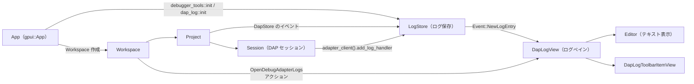
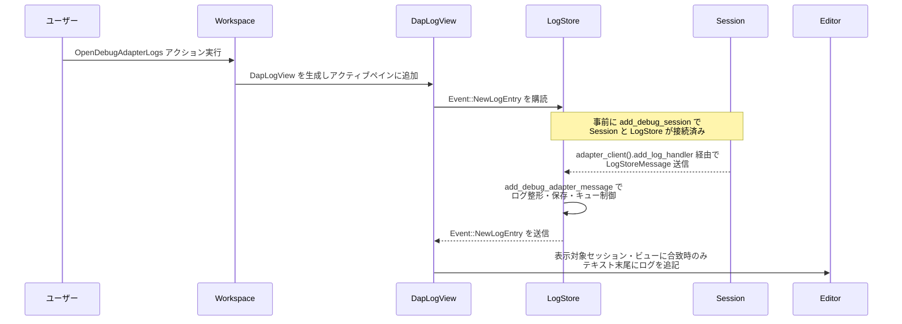

# debugger_tools/ クレート解説

## 1. ざっくり一言

`debugger_tools` クレートは、Debug Adapter Protocol (DAP) の **ログ・RPC メッセージ・初期化シーケンス** を収集・整形し、Zed のワークスペース内で閲覧・検索できる **ログビューアとツールバー UI** を提供するモジュールです。

---

## 2. このモジュールの役割

### 2.1 概要

- このクレートは、各 `Project` / DAP `Session` ごとに発生する **デバッグアダプタのログ** を集中管理し、  
  ユーザーが「Adapter Logs / RPC Messages / Initialization Sequence」を切り替えて閲覧できるようにします。
- ログの保存自体は `LogStore` が担い、表示や検索は `DapLogView`（内部）と `Editor` コンポーネントで行います。
- `init` 関数を通じて `Workspace` に対し
  - `LogStore` の生成と `Project` の登録
  - 「OpenDebugAdapterLogs」アクションの登録  
  を行うことで、アプリケーションに統合されます。

### 2.2 アーキテクチャ内での位置づけ

このクレートは、Zed 風のアプリケーションの中で「デバッグ周りの補助ツール」という位置づけです。

- ログの発生元は `project::debugger::session::Session`（内部で `adapter_client()` を持つ）です。
- ログの集約は `LogStore` が行います。
- ログの表示は各ワークスペース上の `DapLogView` タブ（内部構造体）が行います。
- セッション選択やビュー切り替えはツールバー上の `DapLogToolbarItemView` から行います。

主要コンポーネント間の依存関係は次のようになります。



### 2.3 設計上のポイント

コードから読み取れる設計上の特徴は次のとおりです。

- **責務分離**
  - `LogStore` は「ログの収集・保持・イベント発行」に専念します。
  - `DapLogView` は「単一ペインでの表示・検索」に専念し、実体は `Editor` に委譲します。
  - `DapLogToolbarItemView` は「どのセッションをどのビューで見るか」の UI 制御のみを行います。
- **プロジェクト単位の状態管理**
  - `LogStore` は `HashMap<WeakEntity<Project>, ProjectState>` を持ち、  
    各 `Project` ごとに `BTreeMap<SessionId, DebugAdapterState>` でセッションごとの状態を管理します。
- **非同期・ストリーム処理**
  - `futures::mpsc::unbounded` と `smol` を用いて、ログ取り込みを非同期タスクで処理します。
  - UI スレッド（`Context<Self>`）には `Event::NewLogEntry` を介してログ追加を通知します。
- **メモリ使用とログ量の制御**
  - `RpcMessages::MESSAGE_QUEUE_LIMIT` を 255 に設定し、ログキューを一定サイズに保つようにしています。
  - 終了済みセッションは最大 9 件前後だけ残し、それ以上は `clean_sessions` で削除します。
- **フォーマット設定の尊重**
  - `DebuggerSettings::get_global(cx).format_dap_log_messages` に基づき、
    ログが JSON であれば pretty-print（整形）するかどうかを切り替えます。
- **読み取り専用ビュー**
  - `DapLogView` 内の `Editor` は入力無効・読み取り専用に設定されており、
    置換などの破壊的操作はサポートしていません（Searchable ではあるが replace は no-op）。

---

## 3. 主要な機能一覧

このクレートが提供する主な機能を列挙します。

- DAP ログの収集:
  - 各 `Session` の adapter ログ（標準出力・標準エラー）と RPC メッセージを `LogStore` に蓄積します。
- RPC メッセージの分類表示:
  - 送信（`// Send`）と受信（`// Receive`）を区切り行付きで `VecDeque` に保存し、ビューごとにフィルタ表示します。
- 初期化シーケンスの抽出:
  - `attach`, `launch`, `initialize`, `configurationDone` コマンドに関するメッセージだけを抽出し、
    「Initialization Sequence」として別ビューで閲覧できます。
- ログビュー（ペイン）の提供:
  - `DapLogView` が `Editor` を使ってログを表示し、
    Workspace のペインとして追加されます（タブタイトルは `"DAP Logs"`）。
- ツールバーからのセッション・ビュー切り替え:
  - `DapLogToolbarItemView` がアクティブな `DapLogView` を検出し、
    セッション選択・ビュー切り替え・表示内容のクリアを行う UI を描画します。
- Workspace との統合:
  - `init` 関数を通じて `Workspace` に
    - `LogStore` の登録
    - `OpenDebugAdapterLogs` アクションの登録
    を行い、ユーザーがいつでも DAP ログペインを開けるようにします。
- 検索機能への対応:
  - `DapLogView` は `SearchableItem` を実装し、
    Editor の検索・ハイライト・「検索結果からの再検索」などをそのまま利用できます（置換は非対応）。
- テストからの検査用 API（feature `test-support` / `#[cfg(test)]`）:
  - `LogStore::has_projects`, `contained_session_ids`, `rpc_messages_for_session_id` により、
    テストから内部状態を検証できます。

---

## 4. 関数・構造体の解説

### 4.1 型一覧

公開・内部を問わず、本クレート内の主要な型を整理します。

| 名前 | 種別 | 公開 | 役割 / 用途 |
|------|------|------|-------------|
| `LogStore` | 構造体 | `pub` | プロジェクト・セッション単位で DAP ログを蓄積し、`Event::NewLogEntry` を発行する中核ストア |
| `ProjectState` | 構造体 | 内部 | 1 つの `Project` に紐づく DAP セッション群（`debug_sessions`）と購読サブスクリプションを保持 |
| `DebugAdapterState` | 構造体 | 内部 | 1 つの DAP セッションに対するログ・RPC メッセージ・フラグ（終了済みかなど）を保持 |
| `RpcMessages` | 構造体 | 内部 | RPC メッセージ全体と初期化シーケンス、メッセージ種別の直前状態などを管理 |
| `DapLogView` | 構造体 | 内部 | 実際のログを表示するペイン。`Editor` を内包し、`Item` / `SearchableItem` / `Focusable` を実装 |
| `DapLogToolbarItemView` | 構造体 | `pub` | アクティブな `DapLogView` に対応するツールバー項目。セッションとビュー種別の選択、クリアボタンを提供 |
| `DapMenuItem` | 構造体 | 内部 | ポップアップメニューに並べる 1 セッション分の情報（セッション ID、ラベル、アダプタ名など） |
| `LogStoreEntryIdentifier<'a>` | 構造体 | 内部 | ログエントリを一意に特定するためのキー。`SessionId` と `WeakEntity<Project>` の組み合わせ |
| `LogStoreMessage` | 構造体 | 内部 | 非同期チャネルで `LogStore` に送られる 1 つのログメッセージ（種別・コマンド・本文など） |
| `View` | 列挙体 | 内部 | `DapLogView` に表示するビュー種別（`AdapterLogs` / `RpcMessages` / `InitializationSequence`） |
| `MessageKind` | 列挙体 | 内部 | RPC メッセージの向き（送信 / 受信）を表し、`"// Send"` / `"// Receive"` ラベルと対応 |
| `Event` | 列挙体 | 内部 | `LogStore` と `DapLogView` 間でやり取りされるイベント。現在は `NewLogEntry` のみ |
| `DapLogToolbarItemView` | 構造体 | `pub` | ToolbarItemView としてワークスペースツールバーに統合されるビュー |
| `OpenDebugAdapterLogs` | アクション | （マクロ生成） | `actions!` マクロにより定義されるアクション。実行すると `DapLogView` を開く |

> `DapLogView` 自体は `pub` ではありませんが、Workspace 内では `Item` として使用されます。

### 4.2 主要な関数（詳細）

ここでは、このクレートを理解・利用するうえで重要と思われる関数を 5 件取り上げます。

#### `debugger_tools::init(cx: &mut App)`

※ 実装は `src/debugger_tools.rs` で、単に `dap_log::init(cx)` を呼び出します。

**概要**

- アプリケーション全体に対して **デバッガツール（DAP ログビューア）を有効化** するエントリポイントです。
- 実体は `dap_log::init` の薄いラッパーです。

**引数**

| 引数名 | 型 | 説明 |
|--------|----|------|
| `cx` | `&mut App` | アプリケーション全体の `gpui::App` コンテキスト |

**戻り値**

- なし（`()`）。副作用として `App` に対し DAP ログビュー用の仕掛けを登録します。

**内部処理の流れ**

1. `dap_log` モジュールの `init` 関数に `cx` を渡して呼び出します。

**Examples（使用例）**

アプリケーションの初期化フェーズで、他のモジュールと並べて呼び出すことを想定した例です。

```rust
use gpui::App;                               // gpui のアプリケーション型をインポート
use debugger_tools;                          // このクレートをインポート

fn init_modules(cx: &mut App) {              // アプリケーションのモジュール初期化関数
    debugger_tools::init(cx);                // DAP ログビューアを有効化する
    // 他のモジュールの init もここで呼び出す                         // 例: language_server::init(cx) など
}
```

**Errors / Panics**

- この関数自体には明示的なエラーや panic はありません。

**Edge cases（エッジケース）**

- 何度呼び出してもコンパイル上は問題ありませんが、
  同一の `App` に対して複数回呼び出す設計かどうかは、このチャンクからは分かりません。

**使用上の注意点**

- 実際にログが見えるようになるには、`App` のライフサイクルに沿って一度だけ呼び出す前提で設計されていると考えられます（コード上は排他制御はありません）。

---

#### `dap_log::init(cx: &mut App)`

**概要**

- `debugger_tools::init` の実体であり、DAP ログビュー機能を `App` と `Workspace` に統合します。
- `LogStore` の生成と、各 `Workspace` / `Project` との接続、および `OpenDebugAdapterLogs` アクションの登録を行います。

**引数**

| 引数名 | 型 | 説明 |
|--------|----|------|
| `cx` | `&mut App` | アプリケーション全体の `gpui::App` コンテキスト |

**戻り値**

- なし（`()`）。

**内部処理の流れ**

1. `cx.new(|cx| LogStore::new(cx))` で `LogStore` エンティティを生成します。
2. `cx.observe_new(move |workspace: &mut Workspace, window, cx| { ... })` を登録し、
   新しい `Workspace` が生成されるたびに以下を実行します。
   1. `window` が `None` の場合は何もせず return。
   2. `workspace.project()` を取得し、`LogStore::add_project` を呼び出して `Project` を登録します。
   3. `workspace.register_action` で `OpenDebugAdapterLogs` アクションを登録し、
      実行時に `DapLogView::new` を用いてログペインをアクティブペインに追加します。
3. `observe_new(...).detach()` により、この監視を非同期で走らせ続けます。

**Examples（使用例）**

`debugger_tools::init` を経由するため、通常は直接呼び出す必要はありません。  
`debugger_tools::init` の使用例に含まれていると見なせます。

**Errors / Panics**

- `window` が `None` の場合は単に何もしないため、エラーにはなりません。
- `workspace.project()` が有効な `Project` を返す前提で実装されていますが、ここでは panic を伴う呼び出しは行っていません。

**Edge cases**

- 既に `LogStore` に登録済みの `Project` を再度 `add_project` した場合の挙動は、このチャンク内では直接扱っていません（呼び出し側では通常 1 回のみ呼びます）。

**使用上の注意点**

- `App` 内に複数の `Workspace` が存在するケースでは、それぞれに対して `LogStore::add_project` が呼ばれる設計になっています。
- `LogStore` は 1 個で全 `Workspace` をカバーします（このファイル内のコードから読み取れる範囲）。

---

#### `LogStore::new(cx: &Context<Self>) -> Self`

**概要**

- `LogStore` インスタンスを生成し、**RPC メッセージ用** と **アダプタログ用** の 2 本の非同期チャネルを起動します。
- それぞれ別タスクで受信ループを回し、受信したメッセージを `add_debug_adapter_message` / `add_debug_adapter_log` に渡します。

**引数**

| 引数名 | 型 | 説明 |
|--------|----|------|
| `cx` | `&Context<Self>` | `LogStore` エンティティの gpui コンテキスト |

**戻り値**

- 初期化された `LogStore` 構造体。

**内部処理の流れ**

1. `unbounded::<LogStoreMessage>()` で `(rpc_tx, rpc_rx)` を作成。
2. `cx.spawn(async move |this, cx| { ... }).detach_and_log_err(cx)` で RPC 用タスクを起動。
   - `rpc_rx.next().await` でメッセージを受信し続ける。
   - `this.upgrade()` に成功した場合 `this.update(cx, |this, cx| this.add_debug_adapter_message(message, cx))` を実行。
   - 各メッセージ処理後に `smol::future::yield_now().await` で他タスクに制御を譲る。
3. 同様に `(adapter_log_tx, adapter_log_rx)` を作成し、`add_debug_adapter_log` 用のタスクを起動。
4. `projects: HashMap::new()` と 2 本の `UnboundedSender` を持つ `LogStore` を返す。

**Examples（使用例）**

通常は `dap_log::init` 内で `cx.new` 経由で呼び出されるため、直接使うことは少ないと想定されます。  
テストなどで単体利用する例を示します。

```rust
use gpui::AppContext;                                // Context を得るための型
use debugger_tools::LogStore;                        // LogStore 型をインポート

fn create_log_store(cx: &mut AppContext) {           // 例: テスト用のセットアップ関数
    let _store_entity = cx.new(|cx| LogStore::new(cx)); // LogStore エンティティを生成する
    // _store_entity を保持しておくことで、後から update/subscribe が可能になる       //
}
```

**Errors / Panics**

- `unbounded` チャネル作成や `cx.spawn` で明示的な panic は発生しません。
- チャネル受信タスク内では `anyhow::Ok(())` を返しており、エラーは `detach_and_log_err` によってロギングされる設計と読み取れます。

**Edge cases**

- チャネルの送信側がすべて drop されると `rpc_rx.next().await` / `adapter_log_rx.next().await` が `None` を返し、ループが終了します。その場合、以後のログは処理されません。

**使用上の注意点**

- `LogStore` は非同期タスクとセットで使われる前提のため、`LogStore::new` を直接呼んで `LogStore` インスタンスだけをローカルに保持しても、ログ処理タスクは動きません（`cx.new` 経由でエンティティ化する必要があります）。

---

#### `LogStore::add_project(&mut self, project: &Entity<Project>, cx: &mut Context<Self>)`

**概要**

- 新しい `Project` を `LogStore` に登録し、その `Project` に紐づく DAP セッション開始・終了イベントを購読します。
- `Project` のライフタイム終了時に、対応するログも自動的にクリーンアップされます。

**引数**

| 引数名 | 型 | 説明 |
|--------|----|------|
| `project` | `&Entity<Project>` | 対象となる `Project` エンティティ |
| `cx` | `&mut Context<Self>` | `LogStore` の gpui コンテキスト |

**戻り値**

- なし。

**内部処理の流れ**

1. `project.downgrade()` して `WeakEntity<Project>` をキーに `projects` に `ProjectState` を挿入します。
2. `ProjectState` の `_subscriptions` に 2 つの購読をセットします。
   - `cx.observe_release(project, ...)`  
     - `Project` が解放される際に、`this.projects.remove(&weak_project)` を実行し、状態を削除。
   - `cx.subscribe(&project.read(cx).dap_store(), ...)`  
     - `DapStoreEvent::DebugClientStarted(session_id)` を受け取ると
       - `session_by_id` で `Entity<Session>` を取得。
       - `add_debug_session(LogStoreEntryIdentifier { project: Cow::Owned(weak_project.clone()), session_id: *session_id }, session, cx)` を呼び出し。
     - `DapStoreEvent::DebugClientShutdown(session_id)` を受け取ると
       - 対応する `DebugAdapterState` の `is_terminated` を `true` にして `clean_sessions(cx)` を呼び出し。
3. `debug_sessions` は `Default::default()`（空）で初期化されます。

**Examples（使用例）**

通常は `dap_log::init` が自動的に呼ぶため、利用者が直接 `add_project` を呼ぶ場面は少ないと考えられます。  
`Workspace` から手動で登録したい場合のイメージは次のようになります（擬似コード）。

```rust
// cx: &mut Context<LogStore> が得られている前提                         //
fn register_project_for_logging(
    log_store: &gpui::Entity<LogStore>,              // LogStore のエンティティ
    project: &gpui::Entity<Project>,                 // Project のエンティティ
    cx: &mut gpui::Context<LogStore>,                // LogStore のコンテキスト
) {
    log_store.update(cx, |store, cx| {
        store.add_project(project, cx);              // プロジェクトを LogStore に登録する
    });
}
```

**Errors / Panics**

- `project.read(cx).dap_store()` が有効である前提ですが、この関数内で panic を発生させる呼び出しは行っていません。

**Edge cases**

- 既に同じ `WeakEntity<Project>` が `projects` に存在する状態で再度 `add_project` を呼んだ場合の挙動は、この関数単体からは読み取れません（通常は 1 回登録を前提に使われます）。
- DAP セッション開始時 (`DebugClientStarted`) に `session_by_id` が `None` を返した場合は、`add_debug_session` は呼ばれません。

**使用上の注意点**

- `Project` が `observe_release` により解放されると対応する `ProjectState` が削除されるため、`WeakEntity<Project>` を保持して後から参照する場合は、このライフタイムに注意が必要です。

---

#### `LogStore::add_debug_session(&mut self, id: LogStoreEntryIdentifier<'static>, session: Entity<Session>, cx: &mut Context<Self>)`

**概要**

- 1 つの DAP セッションに対して `DebugAdapterState` を作成し、
  `Session::adapter_client()` にログハンドラを登録します。
- 以降、そのセッションからの RPC / Adapter ログは `LogStore` 経由で管理されます。

**引数**

| 引数名 | 型 | 説明 |
|--------|----|------|
| `id` | `LogStoreEntryIdentifier<'static>` | セッション ID とプロジェクトを含む識別子 |
| `session` | `Entity<Session>` | DAP セッションを表すエンティティ |
| `cx` | `&mut Context<Self>` | `LogStore` のコンテキスト |

**戻り値**

- なし（`maybe!` の戻り値としては `Option<()>` が使われていますが、呼び出し元は無視しています）。

**内部処理の流れ（概略）**

1. `self.projects.get_mut(&id.project)?` で対応する `ProjectState` を取得できなければ何もせず終了。
2. `project_entry.debug_sessions.entry(id.session_id)` で既にセッションが存在する場合は何もせず終了（`Vacant` のときのみ処理）。
3. `session.read_with(cx, |session, _| { ... })` を使って
   - `adapter_name`
   - `session_label`
   - `has_adapter_logs`（`adapter_client().is_some_and(|client| client.has_adapter_logs())`）  
   をまとめて取得。
4. `DebugAdapterState::new` で新しい状態を作成し、`debug_sessions` に挿入。
5. `self.clean_sessions(cx)` を呼んで終了済みセッションの整理を行う。
6. `session.read(cx).adapter_client()?` でクライアントを取得できなければ終了。
7. クライアントに対して 2 つのログハンドラを登録：
   - `LogKind::Rpc` 用: `rpc_tx` に `LogStoreMessage` を送信。
   - `LogKind::Adapter` 用: `adapter_log_tx` に `LogStoreMessage` を送信。

**Examples（使用例）**

この関数は `add_project` が内部から呼び出すため、通常の利用コードから直接呼び出すことはありません。  
内部動作を理解するための簡略化したイメージを示します。

```rust
// DapStoreEvent::DebugClientStarted のハンドラ内のイメージ            //
if let Some(session) = dap_store.read(cx).session_by_id(session_id) {    // session を取得
    log_store.update(cx, |store, cx| {                                   // LogStore を更新
        store.add_debug_session(                                         // セッションを登録
            LogStoreEntryIdentifier {
                session_id: *session_id,                                 // セッション ID
                project: Cow::Owned(project_weak.clone()),               // 対応する Project
            },
            session,                                                     // Session エンティティ
            cx,
        );
    });
}
```

**Errors / Panics**

- `session.read_with` / `session.read` は通常の読み取りで、ここでは明示的な panic 呼び出しはありません。
- `adapter_client()` が `None` の場合は静かにログハンドラ登録をスキップします。

**Edge cases**

- 同じ `SessionId` に対して 2 度目以降に `add_debug_session` が呼ばれた場合、既にエントリが存在するため何もせず終了します。
- `adapter_client().has_adapter_logs()` が `false` の場合でも、`LogKind::Adapter` 用のハンドラは登録されますが、
  実際にログが来るかどうかはクライアント側の実装に依存します（コードからは判別できません）。

**使用上の注意点**

- `LogStoreEntryIdentifier` に渡す `project` は、後で `DapLogView` 側の比較にも使われるため、
  同じ `WeakEntity<Project>` を共有する必要があります（`Cow::Owned` / `Borrowed` を使い分けています）。

---

#### `DapLogView::show_rpc_trace_for_server(&mut self, id: &LogStoreEntryIdentifier<'_>, window: &mut Window, cx: &mut Context<Self>)`

**概要**

- 指定されたセッションの **RPC メッセージログ** を 1 つのテキストとして結合し、新しい `Editor` に表示します。
- ビュー種別を `View::RpcMessages` に更新し、JSON 言語ハイライトを設定します。

**引数**

| 引数名 | 型 | 説明 |
|--------|----|------|
| `id` | `&LogStoreEntryIdentifier<'_>` | 対象セッションを特定する ID |
| `window` | `&mut Window` | 表示先のウィンドウ |
| `cx` | `&mut Context<Self>` | `DapLogView` のコンテキスト |

**戻り値**

- なし。

**内部処理の流れ**

1. `self.log_store.update(cx, |log_store, _| { ... })` で `LogStore` を読み書きし、
   `log_store.rpc_messages_for_session(id)` を呼び出して `VecDeque<SharedString>` を取得。
2. `log_contents(state.iter().cloned())` で改行結合された `String` に変換。
3. RPC ログが存在した場合:
   1. `self.current_view = Some((id.session_id, View::RpcMessages))` で現在ビュー状態を更新。
   2. `editor_for_logs(rpc_log, window, cx)` で新しい `Editor` と購読サブスクリプションを生成。
   3. `project.read(cx).languages().language_for_name("JSON")` から JSON 言語ハイライト取得用の Future を得る。
   4. `editor.read(cx).buffer().read(cx).as_singleton().expect("log buffer should be a singleton")` でバッファを取得し、
      非同期タスク経由で `buffer.set_language(language, cx)` を設定。
   5. `self.editor` と `self.editor_subscriptions` を差し替え、`cx.notify()` で再描画を促す。
4. 最後に `cx.focus_self(window)` でフォーカスを `DapLogView` に移します。

**Examples（使用例）**

`DapLogView` 内部からのみ呼ばれますが、ツールバー経由の呼び出しイメージは次のようになります。

```rust
// DapLogToolbarItemView::render 内のメニュー項目アクションのイメージ  //
window.handler_for(&log_view, {
    let project = project.clone();                                       // WeakEntity<Project> をクローン
    let id = LogStoreEntryIdentifier {
        project: Cow::Owned(project),                                   // 対象 Project
        session_id: row.session_id,                                     // メニュー行のセッション ID
    };
    move |view, window, cx| {                                           // ハンドラ本体
        view.show_rpc_trace_for_server(&id, window, cx);                // RPC メッセージビューを表示
    }
});
```

**Errors / Panics**

- `editor.read(cx).buffer().read(cx).as_singleton().expect("log buffer should be a singleton")` により、
  バッファがシングルトンでない場合は panic が発生します。
  - 通常の `Editor::multi_line` ではシングルトンである前提の設計です。
- JSON 言語の取得 (`language.await.ok()`) に失敗した場合は単に `None` が渡されるだけで、panic はしません。

**Edge cases**

- 対象セッションに RPC ログが 1 件もない場合は `rpc_log` が `None` となり、ビューは切り替わりません。
- 大量のログがある場合でも、`RpcMessages::MESSAGE_QUEUE_LIMIT`（約 255 件）を超えた分は古いものから削除されているため、
  画面に表示されるのは最新側のみです。

**使用上の注意点**

- `show_rpc_trace_for_server` を直接呼び出す場合、対応する `Session` / `Project` が既に `LogStore` に登録済みである必要があります。
- シンタックスハイライトは非同期で設定されるため、ビューを開いた直後はプレーンテキスト表示になり得ます。

---

### 4.3 その他の関数（概要一覧）

個々の処理は比較的単純か、すでに上で触れているため、役割だけをまとめます。

| 関数 / メソッド名 | 役割（1 行） |
|-------------------|--------------|
| `LogStore::add_debug_adapter_message` | RPC 用チャネルから受信したメッセージを `RpcMessages.messages` に追加し、必要に応じて `// Send` / `// Receive` 区切りと初期化シーケンスを更新する |
| `LogStore::add_debug_adapter_log` | アダプタログ用チャネルから受信したメッセージを `DebugAdapterState.log_messages` に追加する（`stderr:` 接頭辞を付与） |
| `LogStore::get_debug_adapter_entry` | ログキュー長の制御・JSON 形式の pretty-print・`Event::NewLogEntry` 発行を共通処理として行う |
| `LogStore::clean_sessions` | 各 `Project` ごとに終了済みセッションを最大 9 件程度に絞るように `debug_sessions` をクリーンアップする |
| `LogStore::log_messages_for_session` | 指定セッションの adapter ログキューを可変参照で返す内部ヘルパ |
| `LogStore::rpc_messages_for_session` | 指定セッションの RPC ログキューを可変参照で返す内部ヘルパ |
| `LogStore::initialization_sequence_for_session` | 指定セッションの初期化シーケンス（`Vec<SharedString>`）を返す |
| `DapLogView::new` | 空の `Editor` を作成し、`LogStore` のイベントを購読しつつ、直近のセッションがあれば自動的に初期ビューを開く |
| `DapLogView::show_log_messages_for_adapter` | アダプタログ（標準出力・標準エラー）を 1 つのテキストにまとめて表示する |
| `DapLogView::show_initialization_sequence_for_server` | 初期化シーケンスだけを抽出して JSON として表示する |
| `DapLogView::menu_items` | 現在の `Project` で利用可能な DAP セッション一覧を `DapMenuItem` のベクタとして構築する |
| `DapLogView::editor_for_logs` | ログ表示用に適した設定（読み取り専用・補助機能 OFF）の `Editor` とイベント購読を生成する |
| `DapLogToolbarItemView::render` | 現在のセッション / ビュー種別を表示するポップアップメニューと Clear ボタンを描画する |
| `DapLogToolbarItemView::set_active_pane_item` | アクティブペインが `DapLogView` のときのみツールバー項目を表示するよう切り替える |
| `log_contents` | `SharedString` のイテレータを改行区切りの `String` に変換するユーティリティ |
| `impl SearchableItem for DapLogView` 各メソッド | ほぼすべて `Editor` の同名メソッドに委譲し、検索・ハイライト機能を提供する（`replace` は no-op） |
| `#[cfg(any(test, feature = "test-support"))] LogStore::has_projects` ほか | テストまたは `test-support` フィーチャ有効時に、内部状態を取得するための補助メソッド |

---

## 5. データフロー

代表的なシナリオとして、「ユーザーが DAP ログビューを開き、その後に新しい RPC メッセージが流れてくる」場合の流れを説明します。

1. ユーザーが `OpenDebugAdapterLogs` アクションを実行すると、`Workspace` は `DapLogView` を生成してアクティブペインに追加します。
2. `DapLogView::new` は `LogStore` への購読をセットし、`Event::NewLogEntry` を受け取れるようにします。
3. 既に存在する `Session` には `LogStore::add_debug_session` 経由でログハンドラが登録済みです。
4. DAP アダプタから新しい RPC メッセージが届くと、`adapter_client().add_log_handler` 経由で `LogStoreMessage` が送信されます。
5. `LogStore` の非同期タスクがそれを受信し、`add_debug_adapter_message` を呼んで内部キューに保存・整形します。
6. `LogStore` は `Event::NewLogEntry` を発行します。
7. `DapLogView` はイベントを受け取り、現在表示中のセッション / ビュー種別に合致する場合のみ、`Editor` の末尾にメッセージを追記します。

Mermaid のシーケンス図で表すと、次のようになります。



このように、**ログの保存とビューへの反映は完全に分離**されており、`LogStore` に対する変更はイベント経由で `DapLogView` に伝播します。

---

## 6. 使い方（How to Use）

### 6.1 基本的な使用方法

最小限の統合手順は次の 2 ステップです。

1. アプリケーション起動時に `debugger_tools::init` を呼び出す。
2. ユーザーが UI から `OpenDebugAdapterLogs` アクションを実行できるようにする（キー割り当てなどはこのチャンクには含まれていません）。

#### アプリケーションへの組み込み例

```rust
use gpui::App;                               // gpui の App 型
use debugger_tools;                          // このクレート

fn init_modules(cx: &mut App) {              // アプリケーションのモジュール初期化
    debugger_tools::init(cx);                // DAP ログビューアを有効化
    // 他のモジュール（言語サーバ、ターミナルなど）の init をここで呼ぶ          //
}
```

この呼び出しにより、以降に作成される各 `Workspace` ごとに

- `LogStore` への `Project` 登録
- `OpenDebugAdapterLogs` アクションの登録

が自動的に行われます。

#### ログビューの利用イメージ

- ユーザーがデバッガを起動（DAP セッション開始）すると、`LogStore::add_debug_session` が呼ばれます。
- `OpenDebugAdapterLogs` アクションを実行すると、新しい `DapLogView` タブが開きます。
- タブ上部（ツールバー）から
  - 対象セッション
  - ビュー種別（Adapter Logs / RPC Messages / Initialization Sequence）  
  を選択できます。
- 右側の「Clear」ボタンで**表示中の Editor 内容のみ**を消去できます（`LogStore` 内の履歴は保持されています）。

### 6.2 よくある使用パターン

このクレートの API や UI を前提とした、代表的な使い方をいくつか挙げます。

#### 1. RPC メッセージと Adapter ログを使い分ける

- **Adapter Logs** ビュー:
  - デバッガプロセス自体の標準出力・標準エラーを確認したいときに利用します。
  - `LogStore::add_debug_adapter_log` が populates する `log_messages` を表示します。
- **RPC Messages** ビュー:
  - DAP のプロトコルメッセージ（`initialize`, `launch` など）の JSON を確認したいときに使います。
  - 送受信ごとに `// Send` / `// Receive` の区切り行が挿入されます。
- **Initialization Sequence** ビュー:
  - セッション初期化に関係する特定のコマンドだけに絞って確認できます。
  - 「起動時にどの順番でメッセージを送っているか」を把握するのに適しています。

#### 2. JSON 整形のオン・オフを切り替える

- `DebuggerSettings::get_global(cx).format_dap_log_messages` によって、
  `LogStore::get_debug_adapter_entry` が JSON を pretty-print するかどうかが決まります。
- 設定が `true` の場合:
  - `serde_json::from_str(&message)` に成功したログは `serde_json::to_string_pretty` により整形されて表示されます。
- 設定が `false` の場合:
  - 受信した文字列がそのまま表示されます。

設定値の変更はこのファイル内では扱われていませんが、`DebuggerSettings` を通じて行われる設計です。

#### 3. テストから内部状態を検査する（`test-support` フィーチャ）

テストコードや `test-support` フィーチャ有効時には、`LogStore` の補助メソッドでログを直接確認できます。

```rust
#[test]
fn rpc_messages_are_recorded() {
    // 準備: LogStore エンティティと Project/Session をセットアップする               //
    let weak_project: gpui::WeakEntity<Project> = /* ... */;          // 対象 Project（WeakEntity）
    let session_id: dap::client::SessionId = /* ... */;               // 対象セッション ID

    let store: debugger_tools::LogStore = /* ... */;                  // テスト対象の LogStore

    assert!(store.has_projects());                                    // 少なくとも 1 プロジェクトが登録されていることを確認

    let ids = store.contained_session_ids(&weak_project);             // この Project に紐づくセッション ID 一覧
    assert!(ids.contains(&session_id));                               // 対象セッションが含まれていることを確認

    let messages = store.rpc_messages_for_session_id(&weak_project, session_id); // RPC メッセージを取得
    assert!(!messages.is_empty());                                    // メッセージが 1 件以上あることを確認
}
```

> 上記の `/* ... */` 部分は、このチャンクには定義がないセットアップ処理です。

### 6.3 使用上の注意点

このクレートを利用したり変更したりする際に注意すべき点をまとめます。

- **ログはメモリ上でキュー管理され、上限はおおよそ 255 件**
  - `RpcMessages::MESSAGE_QUEUE_LIMIT` は 255 に設定されており、
    `get_debug_adapter_entry` で新規エントリ追加前に古いエントリを削除しています。
  - 実際には「255 件 + 直近追加分」程度（最大 256 件）まで保持される実装です。
- **終了済みセッションは自動的に削除される**
  - `clean_sessions` により、`is_terminated == true` のセッションは各 `Project` ごとに最大 9 件程度しか残りません。
  - 過去のセッションログを長期間保持したい用途には向いていません。
- **`DapLogView` の Editor は読み取り専用**
  - 入力は無効 (`set_input_enabled(false)`)、`SearchableItem::replace` も no-op です。
  - ログを編集・書き換える用途ではなく、閲覧と検索に特化した設計です。
- **Clear ボタンはビュー内容だけを消去する**
  - ツールバーの「Clear」ボタンは `Editor::clear` を呼び出すだけで、`LogStore` の内部キューには影響しません。
  - 新しいログが届くと、再びビューに追記されます。
- **`show_*` 系メソッドは Editor のバッファ構成に依存**
  - `show_rpc_trace_for_server` や `show_initialization_sequence_for_server` では
    `buffer.as_singleton().expect("log buffer should be a singleton")` を呼んでおり、
    シングルトンバッファでない `Editor` を使うと panic します。
  - 現状の `Editor::multi_line` を前提としているため、Editor 側の構造変更時は注意が必要です。
- **非同期処理のタイミング**
  - ログはすべて非同期チャネルとタスクを通じて処理されるため、
    「ログ送信直後にすぐ `LogStore` のキューを読む」ようなテストでは、適切な同期（ポーリングや待機）が必要になる可能性があります。
- **`WeakEntity<Project>` の扱い**
  - `LogStoreEntryIdentifier` は `WeakEntity<Project>` をキーとして使っているため、
    Project の lifetime が終了するとそのプロジェクトに紐づくログは参照できなくなります。

---

## 7. 関連ファイル

このディレクトリおよび周辺で、本クレートと密接に関係するファイルをまとめます。

| パス | 役割 / 関係 |
|------|------------|
| `debugger_tools/Cargo.toml` | クレート名 (`debugger_tools`)、ライブラリのエントリポイント（`src/debugger_tools.rs`）、依存クレート（`dap`, `editor`, `workspace` など）、`test-support` フィーチャの定義を行う |
| `debugger_tools/src/debugger_tools.rs` | クレートのルートモジュール。`mod dap_log;` で内部モジュールを読み込み、`pub use dap_log::*;` で再エクスポートしつつ `init` 関数を提供する |
| `debugger_tools/src/dap_log.rs` | 本クレートの中核実装。`LogStore`, `DapLogView`, `DapLogToolbarItemView`, `OpenDebugAdapterLogs` アクションなど、DAP ログビューアの具体的なロジックをすべて含む |

また、コード中で参照されているがこのチャンクには含まれない関連モジュールとして:

- `project::debugger::dap_store` / `project::debugger::session::Session`  
  - DAP セッションの開始・終了イベントや `adapter_client()` へのアクセスを提供するモジュールです（実装はこのチャンクにはありません）。
- `workspace::{Workspace, ToolbarItemView, SearchableItem, Item}`  
  - DapLogView をペインとして表示したり、ツールバーに `DapLogToolbarItemView` を統合したりするためのインターフェイスを定義するモジュールです。

これらのモジュールの詳細実装はここには含まれていないため、より深く理解する場合は該当クレートのソースを併せて確認する必要があります。
