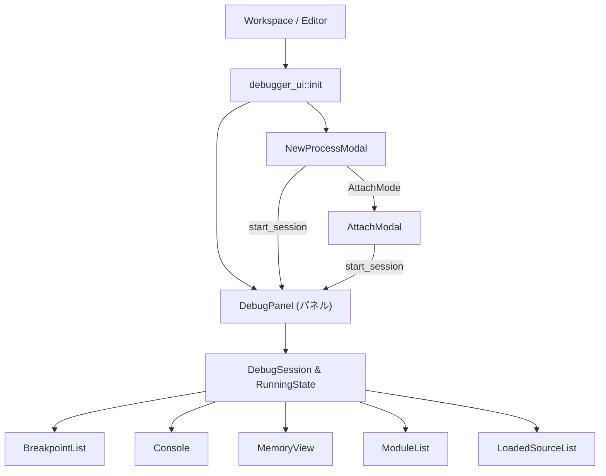
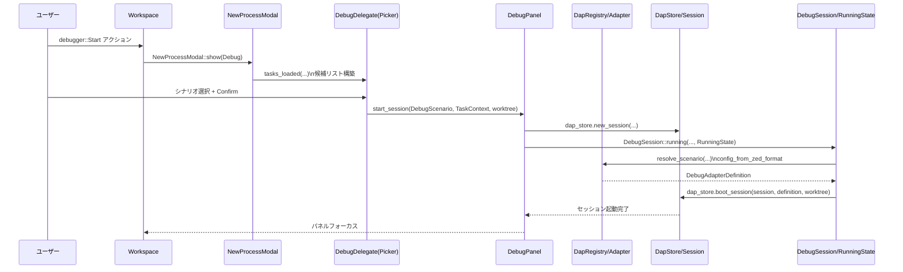
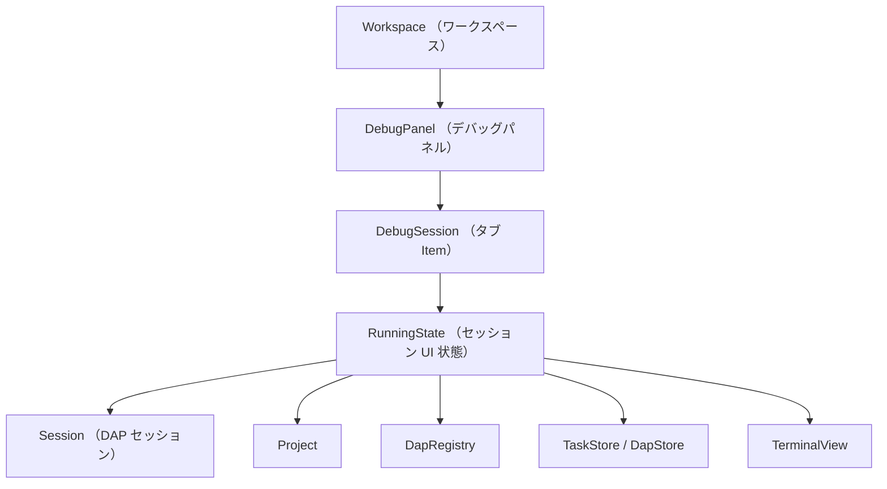
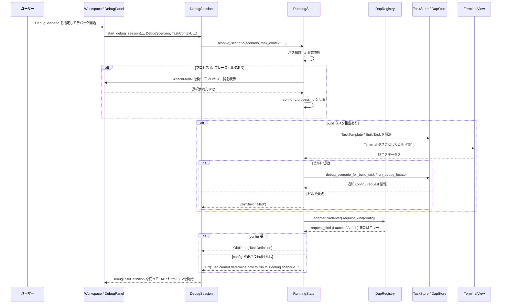

# debugger_ui/ ディレクトリ

## 0. ざっくり一言

Zed の「デバッガ UI」パネルと、その周辺のモーダル・ペイン（ブレークポイント一覧・コンソール・メモリビュー等）を実装するクレートです。  
DAP（Debug Adapter Protocol）セッションを起動・管理し、ワークスペース／エディタと連携してデバッグ操作を行います。

---

## 1. このモジュールの役割

### 1.1 概要

このクレートは、Zed 内でのデバッグ体験を構成する UI 群を提供します。

- **DebugPanel** パネルを通じて、デバッグセッションの開始・再実行・子セッション管理を行う
- **NewProcessModal / AttachModal** を通じて、タスク／シナリオ／プロセスからのデバッグ開始を選択できる
- 実行中セッションの状態を表示する各ペイン（ブレークポイント、コンソール、モジュール一覧、メモリビューなど）を提供する
- ペイン構成（どのペインがどこにあるか）を **永続化 / 復元** する

### 1.2 アーキテクチャ内での位置づけ

このクレートは、主に次のコンポーネントと連携します。

- `workspace::Workspace` / `editor::Editor`: パネルの表示・ファイルのオープン・アクションディスパッチ
- `project::Project`: DAP ストア、ブレークポイントストア、タスクストアなど
- `dap` / `dap_adapters`: 実際のデバッグアダプタ
- `debugger_tools` / `tasks_ui`: デバッグログ表示、タスク実行 UI との連携

主要コンポーネント間の依存関係は次のようになります。



※ `DebugSession` / `RunningState` 自体の定義は `session.rs` / `session/running.rs`（このチャンク外）にあります。

### 1.3 設計上のポイント

コードから読み取れる設計上の特徴は次の通りです。

- **エンティティベースの UI**  
  - `gpui::Entity` と `Context` による状態管理・イベント購読を一貫して使用しています。
  - UI コンポーネント（パネル・モーダル・リストなど）はそれぞれ独立したエンティティとして実装されます。

- **非同期タスクと UI 更新の分離**
  - DAP セッション起動・プロセス列挙・ファイル I/O などの重い処理は `cx.spawn_in`, `cx.background_spawn` で非同期化し、完了後にエンティティを `update` する形で UI を更新します。

- **DebugPanel を中心としたオーケストレーション**
  - デバッグセッションの開始・再実行・子セッション生成・終了時の確認などはすべて `DebugPanel` 経由で行われます。
  - `workspace::DebuggerProvider` を実装することで、ワークスペースからのデバッグ関連操作の入り口になっています。

- **ペイン構成の永続化**
  - 各デバッグアダプタごとに、ペイン構成とアクティブなペインを `db::kvp::KeyValueStore` に JSON として保存・読み出しします（`persistence.rs`）。

- **DAP の capability に応じた UI 機能分岐**
  - モジュール一覧・メモリビュー・ブレークポイントプロパティ（ログ・条件など）は、アダプタの `Capabilities` を見てサポート有無を切り替えています。

- **フィルタリング・折り畳みによる情報量制御**
  - スタックフレーム一覧では、ユーザコードのみ表示／すべて表示を切り替え、サードパーティフレームを折り畳むなどの工夫があります。
  - ブレークポイント一覧でも、例外・データブレークポイントと通常の行ブレークポイントをまとめて扱いつつ、操作可能なプロパティを明示しています。

---

## 2. 主要な機能一覧

このクレート全体で提供されている主要な機能を列挙します（このチャンクで確認できる範囲）。

- DebugPanel パネルの表示と位置・ズーム制御
- DAP セッションの開始・再実行・子セッション起動・再起動
- debug.json / launch.json へのシナリオ保存・編集（タスク・デバッグ設定との連携）
- NewProcessModal による
  - タスク実行
  - 既存デバッグシナリオからの起動
  - デバッガのアタッチ（AttachModal 経由）
  - 任意コマンド（one-off）のデバッグ
- AttachModal によるプロセス一覧取得（ローカル／リモート）とアタッチ
- ペイン構成（Console / Variables / BreakpointList / Frames / Modules / Sources / Terminal / MemoryView）の永続化と復元
- BreakpointList による
  - 行ブレークポイントの一覧表示・ジャンプ
  - 例外／データブレークポイントの表示・有効／無効切り替え
  - ログメッセージ・条件・ヒットカウントの設定
- Console による
  - デバッグ出力（ANSI カラー付き）の表示
  - REPL 入力の評価・ウォッチ式追加
  - 候補補完（DAP 経由または変数リストから）
- ModuleList によるロード済みモジュール一覧表示とソースオープン
- LoadedSourceList による DAP の loadedSources 表示
- MemoryView による
  - メモリのダンプ表示（可変行幅）
  - アドレス／式からのジャンプ
  - 選択範囲への書き込み
  - 選択範囲に対するデータブレークポイントの設定
- StackFrameList によるスタックフレーム一覧・絞り込み・再開位置へのジャンプ（ファイルオープン／アクティブフレーム更新）

---

## 3. 関数・構造体の解説

### 3.1 型一覧（構造体・列挙体など）

このチャンクで定義されている主要な型の概要です。

| 名前 | 種別 | 役割 / 用途 |
|------|------|-------------|
| `DebugPanel` | 構造体 | デバッグパネル本体。セッションの起動・管理と、各ペインのフォーカス制御を行う |
| `DebuggerHistoryFeatureFlag` | 構造体（マーカー） | デバッガ履歴機能の FeatureFlag |
| `NewProcessModal` | 構造体 | タスク／デバッグシナリオ／アタッチ／カスタム起動を選ぶモーダル |
| `NewProcessMode` | enum | `Task` / `Debug` / `Attach` / `Launch` の4モードを表現 |
| `AttachModal` | 構造体 | プロセス一覧からアタッチ対象を選択するモーダル |
| `AttachModalDelegate` | 構造体 | `Picker` 用デリゲート。プロセス候補のフィルタリングなどを担当 |
| `Candidate` | 構造体 | AttachModal の 1 行分のプロセス情報（pid, name, command） |
| `ModalIntent` | enum | AttachModal の用途（PID 解決 or 実際にアタッチ）を区別 |
| `ConfigureMode` | 構造体 | NewProcessModal の Launch モードで使う、プログラム／CWD 入力・オプション設定 |
| `AttachMode` | 構造体 | NewProcessModal の Attach モードで使う、ZedDebugConfig と AttachModal の組 |
| `TaskMode` | 構造体 | NewProcessModal の Task モードで使う `TasksModal` を保持 |
| `DebugDelegate` | 構造体 | 「デバッグシナリオ選択」用 `PickerDelegate`。タスク／シナリオの候補管理 |
| `DebuggerPaneItem` | enum | Console・Variables 等、デバッグペインの種類 |
| `SerializedLayout` | 構造体 | ペインレイアウトと Dock 軸（縦/横）をまとめた永続化単位 |
| `SerializedPaneLayout` | enum | 1 ペイン or ペイングループ（分割情報付き） |
| `SerializedPane` | 構造体 | あるペインに含まれる `DebuggerPaneItem` とアクティブ項目 |
| `BreakpointList` | 構造体 | ブレークポイント一覧 UI。ソース・例外・データブレークポイントを統合表示 |
| `SelectedBreakpointKind` | enum | 現在選択中のブレークポイント種類（Source/Exception/Data） |
| `Console` | 構造体 | デバッグコンソール UI（出力＋入力行） |
| `ConsoleQueryBarCompletionProvider` | 構造体 | コンソール入力行の補完を提供する `CompletionProvider` |
| `LoadedSourceList` | 構造体 | DAP の `loadedSources` を一覧表示するリスト |
| `MemoryView` | 構造体 | メモリダンプビュー。選択／書き込み／データブレークポイント設定など |
| `ViewState`, `ViewStateHandle` | 構造体 | MemoryView のスクロール・行幅・選択状態を保持 |
| `SelectedMemoryRange`, `Drag` | enum/構造体 | メモリ選択中／完了の範囲情報 |
| `ModuleList` | 構造体 | DAP の Module 一覧を表示し、対応するファイルを開く |
| `StackFrameList` | 構造体 | スタックフレーム一覧。フィルタリングや折り畳みを含む |
| `StackFrameEntry` | enum | 通常フレーム／ラベル行／折り畳まれたフレーム群を表現 |
| `StackFrameFilter` | enum | スタックフレーム表示フィルタ（All/UserFrames） |
| `StackFrameListEvent` | enum | スタックフレームリストからのイベント（選択変更など） |

※ `DebugSession`, `RunningState`, `SubView` などは `session.rs` / `session/running.rs` に定義されており、このチャンクには定義本体は含まれていません。

### 3.2 重要な関数・メソッド詳細（7件）

#### 1. `pub fn init(cx: &mut App)`

**概要**

デバッガ UI クレートのエントリポイントです。  
ワークスペース／エディタに対してデバッグ関連のアクション・パネル・ショートカットを登録します。

**引数**

| 引数名 | 型 | 説明 |
|--------|----|------|
| `cx` | `&mut App` | アプリケーション全体の `gpui::App` コンテキスト |

**戻り値**

- なし（副作用としてアクション・オブザーバを登録します）。

**内部処理の流れ**

1. `workspace::FollowableViewRegistry::register::<DebugSession>(cx)`  
   - `DebugSession` を「フォロー可能なビュー」として登録します。
2. `cx.observe_new(|workspace: &mut Workspace, ..| { ... })`  
   - 新しく作られた `Workspace` ごとに以下を登録:
     - `spawn_task_or_modal` アクション
     - デバッグパネルの `ToggleFocus` / `Toggle`（表示／フォーカス切り替え）
     - `Start` / `Rerun` / `ShutdownDebugAdapters` などの各種アクション
     - Workspace レベルのアクションレンダラー  
       （Pause/Continue/Step/Stop などをアクティブなデバッグセッションにバインド）
3. `cx.observe_new(|editor: &mut Editor, ..| { ... })`  
   - 新しく作られた `Editor` ごとに:
     - `RunToCursor` アクションに対して「ブレークポイントを一時的に追加してその位置まで実行」を接続
     - `EvaluateSelectedText` アクションに対して、選択テキストを DAP `evaluate` で評価する処理を接続

**Examples（使用例）**

アプリケーション側の初期化コード（擬似例）:

```rust
fn main() {
    gpui::App::new(|cx| {
        // …他のサブシステムの初期化…

        debugger_ui::init(cx); // デバッガ UI を登録する

        // …イベントループへ…
    });
}
```

**Edge cases / 使用上の注意点**

- `init` は通常、アプリ起動時に 1 回だけ呼び出される前提の設計です。
- `DebugPanel` がまだ開かれていなくても、アクションは登録されます。  
  （`Toggle` / `Start` アクションが実行されたタイミングでパネルやモーダルが生成されます。）
- デバッグ機能を無効化する場合は、この `init` 呼び出し自体を行わない構成にする必要があります。

---

#### 2. `impl DebugPanel { pub fn start_session(&mut self, scenario: DebugScenario, ...) }`

**概要**

`DebugPanel` から新しいデバッグセッションを起動する中核メソッドです。  
`DebugScenario`（アダプタ・リクエスト・ラベルなど）を元に DAP セッションを生成し、`DebugSession` / `RunningState` を構築します。

**引数**

| 引数名 | 型 | 説明 |
|--------|----|------|
| `scenario` | `DebugScenario` | アダプタ名・ラベル・Launch/Attach リクエストなどを含む構成 |
| `task_context` | `SharedTaskContext` | 実行環境（CWD・環境変数など） |
| `active_buffer` | `Option<Entity<Buffer>>` | セッション開始時に関連付けるバッファ（省略可） |
| `worktree_id` | `Option<WorktreeId>` | セッションを属させるワークツリー ID（省略時は推論） |
| `window` | `&mut Window` | ウィンドウコンテキスト |
| `cx` | `&mut Context<Self>` | `DebugPanel` のコンテキスト |

**戻り値**

- なし（内部で DAP セッション起動やエラー処理を非同期タスクとしてスケジューリングします）。

**内部処理の流れ（概略）**

1. `DapRegistry::global(cx).adapter(&scenario.adapter)` でアダプタを取得。  
   取得できなければ何もせず return。
2. アダプタの `compact_child_session` / `prefer_thread_name` などから `SessionQuirks` を構築。
3. `project.dap_store().update(...)` 経由で新しい `Session` を生成。
4. `worktree` を決定:
   - 引数の `worktree_id`、`active_buffer` のファイル、可視なワークツリーのいずれかから選択。
   - 見つからない場合はログ出力して return。
5. `task_inventory` があれば `scenario_scheduled` を通知（履歴用）。
6. 非同期タスク `task` を `cx.spawn_in(window, ...)` で起動:
   - `Self::register_session(this, session, true, cx)` により `DebugSession` を登録
   - `running_state.resolve_scenario(...)` で DAP 構成を決定
   - `dap_store.boot_session(session, definition, worktree, cx)` で実際にアダプタを起動
7. 別タスク `boot_task` で `task.await` の結果を監視し、エラー時:
   - エラーメッセージを redact して `console_output` に出力
   - `session.shutdown(cx)` を行う
8. 最後に `session.state` が `SessionState::Booting` であることを前提に `state_task` を `boot_task` に差し替え。

**Examples（使用例）**

通常は直接呼び出さず、`NewProcessModal` や `DebugDelegate` から呼ばれますが、簡略化した例です。

```rust
fn start_simple_session(panel: &mut DebugPanel, window: &mut Window, cx: &mut Context<DebugPanel>) {
    let scenario = DebugScenario {
        adapter: "lldb".into(),
        label: "Debug my_app".into(),
        request: DebugRequest::Launch(task::LaunchRequest {
            program: "my_app".into(),
            cwd: None,
            args: vec![],
            env: Default::default(),
        }),
        stop_on_entry: Some(false),
    };

    let task_context = SharedTaskContext::default();
    panel.start_session(scenario, task_context, None, None, window, cx);
}
```

**Errors / Edge cases**

- アダプタが登録されていない場合はセッションは開始されません（静かに return）。
- ワークツリーが見つからない場合も開始されません。ログメッセージ `"Could not find a worktree..."` が出力されます。
- セッションブート中のエラーは、コンソールに `"error: ..."` として出力され、そのセッションはシャットダウンされます。

**使用上の注意点**

- `start_session` は UI から非同期に呼び出される前提です。同期的な完了を期待しない設計になっています。
- `scenario.build` が `Some` の場合、ビルドタスクとの連携のために `RunningState` に `scenario` と `DebugScenarioContext` が格納されます。

---

#### 3. `pub(super) fn show(..) -> ()` in `NewProcessModal`

**概要**

`NewProcessModal::show` は、Workpace 上に「Run / Debug / Attach / Launch」を選択するモーダルを表示し、内部で `DebuggerPanel` や `TasksModal` と連携する初期化処理を行います。

**引数**

| 引数名 | 型 | 説明 |
|--------|----|------|
| `workspace` | `&mut Workspace` | モーダルを表示するワークスペース |
| `window` | `&mut Window` | ウィンドウコンテキスト |
| `mode` | `NewProcessMode` | 初期タブ（Task/Debug/Attach/Launch）の指定 |
| `reveal_target` | `Option<RevealTarget>` | タスク実行結果の表示場所ヒント |
| `cx` | `&mut Context<Workspace>` | Workspace のコンテキスト |

**戻り値**

- なし（モーダルがトグル表示されます）。

**内部処理の流れ（簡略）**

1. `workspace.panel::<DebugPanel>(cx)` で `DebugPanel` を取得。なければ何もせず return。
2. `task_store`, `languages` を取得。
3. 非同期タスクで `tasks_ui::task_contexts(...)` を取得（アクティブファイル情報など）。
4. `workspace.toggle_modal(window, cx, |window, cx| { ... })` で実際のモーダルコンテンツを構築:
   - `AttachMode::new(..)` でアタッチ用の `AttachModal` を作成
   - `DebugDelegate` を持つ `Picker<DebugDelegate>` を作成（Debug タブ用）
   - `ConfigureMode::new` で Launch 用の入力フィールドを作成
   - `TasksModal::new` でタスク一覧モーダルを作成
   - 各 UI コンポーネントに対して `DismissEvent` 発生時にモーダルを閉じるようサブスクライブ
5. タスクコンテキスト取得完了後の処理（別タスク）:
   - LSP タスク取得・現在言語タスクとの統合
   - `DebugDelegate::tasks_loaded(...)` でデバッグシナリオ候補を構築
   - `ConfigureMode.load(..)` で CWD を自動入力（可能な場合）
   - `TasksModal::tasks_loaded(..)` でタスクモーダルに候補を流し込む

**Examples（使用例）**

`Workspace` 側からは次のように呼ばれています。

```rust
// debugger_ui::init 内
.register_action(|workspace: &mut Workspace, _: &Start, window, cx| {
    NewProcessModal::show(workspace, window, NewProcessMode::Debug, None, cx);
})
```

**Edge cases / 注意点**

- `DebugPanel` が存在しない場合、モーダルは表示されません。
- タスクインベントリが存在しない場合、Debug タブの候補は空のままになります。
- LSP タスクと通常タスクの優先順位は言語設定 (`prefer_lsp`) に基づいて決まります。

---

#### 4. `fn start_new_session(&mut self, window: &mut Window, cx: &mut Context<Self>)` in `NewProcessModal`

**概要**

NewProcessModal の Launch/Attach/Debug モードから「実際にデバッグセッションを開始する」処理をまとめたメソッドです。

**引数**

| 引数名 | 型 | 説明 |
|--------|----|------|
| `window` | `&mut Window` | ウィンドウコンテキスト |
| `cx` | `&mut Context<Self>` | `NewProcessModal` のコンテキスト |

**戻り値**

- なし（非同期タスクを起動します）。

**内部処理の流れ**

1. `self.debugger` が設定されているか確認。なければ何もせず return。
2. `self.mode` が `Debug` の場合:
   - `debug_picker.update(..)` で `Picker` に対して `confirm(false, window, cx)` を呼び出し、既存シナリオから起動して return。
3. `Launch` モードかつ `save_to_debug_json` が選択されている場合:
   - 先に `self.save_debug_scenario(window, cx)` を呼んで debug.json を編集。
4. `task_contexts` からアクティブコンテキストと `worktree_id` を取り出す。
5. 非同期タスクを `cx.spawn_in(window, ...)` で起動:
   - `debug_scenario`（Launch or Attach 用）を `self.update(...).await` で取得
   - 取得失敗時は `bail!` してログに記録
   - `debug_panel.update_in(..)` で `DebugPanel::start_session` を呼び出し
   - 成功したら `DismissEvent` を emit してモーダルを閉じる

**Edge cases / 使用上の注意点**

- Attach モードでは、実際のアタッチ処理は `AttachModalDelegate::confirm` に委ねます（ここでは config 生成のみ）。
- `debug_scenario` の戻り値が `None` の場合（アダプタの `config_from_zed_format` に失敗した場合など）、セッションは開始されません。
- `task_contexts` が取得できない場合も開始されません。

---

#### 5. `impl PickerDelegate for AttachModalDelegate { fn confirm(&mut self, ...) }`

**概要**

AttachModal の Picker で Enter/Confirm が押されたときの挙動を定義します。  
用途に応じて「PID を返して閉じる」か「選択プロセスにアタッチして新セッションを開始する」のどちらかを行います。

**引数（主なもの）**

| 引数名 | 型 | 説明 |
|--------|----|------|
| `_secondary` | `bool` | セカンダリアクションかどうか（この実装では未使用） |
| `window` | `&mut Window` | ウィンドウ |
| `cx` | `&mut Context<Picker<Self>>` | Picker コンテキスト |

**戻り値**

- なし。

**内部処理の流れ**

1. 現在の `self.selected_index` に対応する `self.matches[..]` から `candidate_id` を取り出し、`self.candidates` から `Candidate` を取得。
2. `self.intent` に応じて分岐:
   - `ModalIntent::ResolveProcessId(sender)`:
     - `cx.emit(DismissEvent)` でモーダルを閉じる。
     - `sender.take()` で `oneshot::Sender<Option<i32>>` を取り出し、選択された PID（`u32` を `i32` へキャスト）を `Some(pid)` で送る。何も選択されていない場合は `None` を送る。
   - `ModalIntent::AttachToProcess(definition)`:
     - 候補がなければ `DismissEvent` を emit して return。
     - `definition.request` が `DebugRequest::Attach(config)` であることを前提に `config.process_id = Some(candidate.pid)` を設定。  
       `Launch` の場合は `debug_panic!` して return。
     - `workspace` から `DebugPanel` を取得。取得できなければ return。
     - グローバルな `DapRegistry` からアダプタを取得。取得できなければ return。
     - `definition.clone()` を使って非同期タスクを起動:
       - `adapter.config_from_zed_format(definition).await` で DAP 用設定を生成
       - `panel.start_session(...)` を呼び出す
       - 最後に `DismissEvent` を emit

**Edge cases / 注意点**

- `self.candidates` が空、または `selected_index` が範囲外の場合は何も起きません。
- `ModalIntent::AttachToProcess` に `DebugRequest::Launch` を渡すと `debug_panic!` します（コードの誤用）。
- DapRegistry からアダプタが取れない場合、何も実行されません（ユーザには UI でのフィードバックはありません）。

---

#### 6. `impl Render for BreakpointList { fn render(&mut self, ...) }`

**概要**

ブレークポイント一覧ペインのメイン描画メソッドです。  
ブレークポイントストアやセッションから最新の情報を集め、リスト表示と下部のプロパティ編集ストリップを構成します。

**引数**

| 引数名 | 型 | 説明 |
|--------|----|------|
| `window` | `&mut Window` | ウィンドウ |
| `cx` | `&mut Context<Self>` | BreakpointList コンテキスト |

**戻り値**

- `impl IntoElement`（v_flex で構成されたルート要素）

**内部処理の流れ（要点）**

1. `breakpoint_store.read(cx).all_source_breakpoints(cx)` からソースブレークポイント一覧を取得し、パスごとにソート。
2. 各ブレークポイントについて:
   - 対応するワークツリー／相対パスから表示用のディレクトリ名を決定
   - `BreakpointEntryKind::LineBreakpoint` としてローカル配列に追加
3. `session.exception_breakpoints()` / `session.data_breakpoints()` から例外・データブレークポイントを取得し、それぞれ `BreakpointEntryKind::ExceptionBreakpoint` / `DataBreakpoint` として追加。
4. `max_width_index` を、テキスト幅の概算に基づいて計算（幅の一番大きい項目のインデックス）。
5. `v_flex()` に対して:
   - フォーカスハンドルの追跡
   - 上下移動・選択・プロパティ切り替えなどの `on_action` ハンドラ登録
   - `self.render_list(cx)` で `uniform_list` を表示
   - `strip_mode` が `Some(_)` のときは、下部に入力用 `Editor` を表示（ログ／条件／ヒットカウント編集）

**Examples（使用例）**

`DebugPanel` の「空状態」ビューで、ブレークポイント一覧を単独で表示する場合の一部:

```rust
let breakpoint_list = self.breakpoint_list.read(cx).render_control_strip();
let has_breakpoints = self
    .project
    .read(cx)
    .breakpoint_store()
    .read(cx)
    .all_source_breakpoints(cx)
    .values()
    .any(|bps| !bps.is_empty());

let breakpoint_panel = v_flex()
    .group("base-breakpoint-list")
    .child(/* タイトルバー */)
    .when(has_breakpoints, |this| this.child(self.breakpoint_list.clone()))
    .when(!has_breakpoints, |this| {
        this.child(Label::new("No Breakpoints Set").size(LabelSize::Small))
    });
```

**Edge cases / 注意点**

- `session` が `None` の場合、例外／データブレークポイントは表示されません（ソースブレークポイントのみ）。
- プロパティ編集ストリップで Enter を押すと、即座にブレークポイントストアへ編集内容が反映されます。
- 例外／データブレークポイントは「削除」はできず、有効／無効の切り替えのみ（少なくともこの UI からは）行えます。
- DAP アダプタが log points / 条件付きブレークポイント / ヒットカウンタをサポートしていない場合、対応ボタンは `disabled` となります。

---

#### 7. `impl Render for MemoryView { fn render(&mut self, ...) }`

**概要**

メモリビュー UI の描画処理です。  
アドレス／式入力バー、表示幅の選択ドロップダウン、メインのメモリダンプ、選択範囲向けのコンテキストメニューを構成します。

**引数**

| 引数名 | 型 | 説明 |
|--------|----|------|
| `window` | `&mut Window` | ウィンドウ |
| `cx` | `&mut Context<Self>` | MemoryView コンテキスト |

**戻り値**

- `impl IntoElement`（全体レイアウト）

**内部処理の流れ（要点）**

1. 上部クエリバー:
   - 左側に「アドレス／編集」アイコン（`Pencil` / `LocationEdit`）
   - 中央に `query_editor`（`EditorElement`）
   - 右側に行幅選択用 `DropdownMenu`（`render_width_picker`）
   - クエリバーのフォーカス状態によってボーダーカラーを変更
2. 仕切り線（Divider）
3. メインメモリビュー:
   - `render_memory(cx)` で `uniform_list` を生成し、`ViewState.row_count()` 行分のメモリを表示
   - 行ごとに `render_single_memory_view_line` を呼び出し、アドレス・16進表記・ASCII 表記を構成
   - ドラッグでメモリ範囲を選択できるようにし、選択範囲はハイライト表示
   - 選択範囲を右クリックすると `deploy_memory_context_menu` によりコンテキストメニューを表示
   - カスタムスクロールバーを設定（縦横ともに）
4. 全体には次のアクションをバインド:
   - `menu::Confirm` → `Self::confirm`（アドレスジャンプ／メモリ書き込み）
   - `ToggleDataBreakpoint` → 選択範囲へのデータブレークポイント設定
   - `GoToSelectedAddress` → 選択範囲をアドレスとみなしてジャンプ
   - `SelectFirst/SelectLast` → ページング（`page_up` / `page_down`）
   - `menu::Cancel` → 選択解除

**Examples（使用例）**

実際には `RunningState` からサブビューとして生成されますが、単体での利用イメージは次のようになります。

```rust
let memory_view = MemoryView::new(
    session.clone(),
    workspace.weak_handle(),
    stack_frame_list.weak_handle(),
    window,
    cx,
);

// RunningState 側で SubView として wrap し、Pane に追加する。
```

**Edge cases / 注意点**

- DAP アダプタが `supports_write_memory_request` をサポートしていない場合、書き込みモードに入ろうとするとステータストーストで警告を出し、書き込みは行われません。
- `read_memory` が `None` を返したセルは `"??"` として表示され、書き込みやデータブレークポイントの設定対象としても扱いに注意が必要です。
- 選択範囲が 8 バイトを超える場合は、「Go To Selected Address」メニューが無効化されます。

---

### 3.3 その他の関数・補助的な API

代表的な補助関数／メソッドを簡単に一覧します（詳細なアルゴリズムはコード参照）。

| 関数名 / メソッド | 役割（1 行） |
|-------------------|--------------|
| `get_processes_for_project` (`attach_modal.rs`) | プロジェクトのリモートクライアントまたはローカル `sysinfo` からプロセス一覧を取得し `Candidate` 配列に変換する |
| `DebugPanel::rerun_last_session` | タスクインベントリから最後にスケジュールされたデバッグシナリオを再実行する |
| `DebugPanel::go_to_scenario_definition` | シナリオ由来の `debug.json` / `launch.json` ファイルを開き、該当ラベル行にジャンプする |
| `DebugPanel::save_scenario` | 現在の `DebugScenario` を `.zed/debug.json` に追記し、エディタで開く |
| `persistence::serialize_pane_layout` | デバッグパネルレイアウトを JSON にシリアライズして KVP に保存する |
| `persistence::deserialize_pane_layout` | シリアライズ済みレイアウトから `Pane` / `SubView` を再構成する |
| `Console::update_output` | セッション出力の差分を取得して `add_messages` に渡し、コンソールを更新する |
| `StackFrameList::go_to_stack_frame_inner` | スタックフレームからファイルを開き、アクティブフレーム位置とデバッグペインを更新する |
| `NewProcessModal::adapter_drop_down_menu` | 利用可能な DAP アダプタ一覧を `DropdownMenu` として構築し、選択されたアダプタを状態に反映する |

---

## 4. データフロー

ここでは、「ユーザーが既存のデバッグシナリオを選択してデバッグセッションを開始する」場合のデータフローを説明します。

1. ユーザーが `Start` アクション（例: ショートカット）を実行すると、`Workspace` のアクションハンドラから `NewProcessModal::show` が呼ばれます。
2. `NewProcessModal` は `TaskStore` / `TaskContexts` / LSP タスクなどを収集し、`DebugDelegate` の `candidates` に `DebugScenario` を構築して配置します。
3. ユーザーが `Debug` タブで任意のシナリオを選択して Confirm すると、`DebugDelegate::confirm` が呼ばれます。
4. `DebugDelegate::confirm` は、選択されたシナリオと `DebugScenarioContext` を取得し、`DebugPanel::start_session` に渡します。
5. `DebugPanel::start_session` は DAP ストアに新しい `Session` を作成し、`DebugSession::running` と `RunningState` を構築、アダプタの `config_from_zed_format` と `boot_session` を通じてセッションを開始します。
6. セッション開始後、`RunningState` に紐づく各ペイン（`BreakpointList`, `Console`, `ModuleList`, `MemoryView`, など）が `SessionEvent` を購読して UI を更新します。

これをシーケンス図で表すと次のようになります。



---

## 5. 使い方（How to Use）

### 5.1 基本的な使用方法

Zed 本体のコードからこのクレートを利用する典型的なフローは次のようになります。

1. アプリケーション起動時に `debugger_ui::init` を呼び出す。
2. ユーザーが `debugger::Start` アクションを実行すると `NewProcessModal` が開く。
3. ユーザーがシナリオを選択／入力し、Confirm すると `DebugPanel` が `DebugSession` を起動。
4. `DebugPanel` 内で各ペイン（ブレークポイント一覧・コンソールなど）が自動的に配置される。

簡略コード例:

```rust
use gpui::App;
use workspace::Workspace;

// アプリケーション初期化
fn main() {
    App::new(|cx| {
        // デバッガ UI の登録
        debugger_ui::init(cx);

        // Workspace 等を作成してイベントループへ…
    });
}

// Workspace 内のどこか
fn start_debugging(workspace: &mut Workspace, window: &mut ui::Window, cx: &mut ui::Context<Workspace>) {
    // debugger::Start アクションと同等
    debugger_ui::new_process_modal::NewProcessModal::show(
        workspace,
        window,
        debugger_ui::new_process_modal::NewProcessMode::Debug,
        None,
        cx,
    );
}
```

### 5.2 よくある使用パターン

1. **直近のデバッグセッションを再実行する**

```rust
workspace.register_action(|workspace: &mut Workspace, _: &debugger_ui::debugger::Rerun, window, cx| {
    if let Some(panel) = workspace.panel::<DebugPanel>(cx) {
        panel.update(cx, |panel, cx| {
            panel.rerun_last_session(workspace, window, cx);
        }).ok();
    }
});
```

2. **特定のシナリオ定義へジャンプして編集する**

既存シナリオを `DebugDelegate` で選択し、Alt+Enter（SecondaryConfirm）などで `go_to_scenario_definition` が呼ばれます。  
コード側から直接呼ぶ場合は、`TaskSourceKind` / `DebugScenario` / `WorktreeId` を自前で用意して `DebugPanel::go_to_scenario_definition` を使います。

3. **アタッチモーダル経由でプロセスに接続する**

```rust
let workspace_weak = workspace.weak_handle();
let project = workspace.project().clone();
let definition = ZedDebugConfig { /* アダプタ名・AttachRequest 等 */ };

let attach_modal = AttachModal::new(
    ModalIntent::AttachToProcess(definition),
    workspace_weak,
    project,
    true,  // モーダル表示
    window,
    cx,
);
// Workspace::toggle_modal などから wrap して使う
```

### 5.3 よくある間違い

```rust
// 誤り例: DebugPanel を持たない Workspace で NewProcessModal を開こうとする
fn open_modal_without_panel(workspace: &mut Workspace, window: &mut Window, cx: &mut Context<Workspace>) {
    // panel::<DebugPanel> が None の場合、show は何も行わない
    NewProcessModal::show(workspace, window, NewProcessMode::Debug, None, cx);
}

// 正しい例: 事前に DebugPanel をロードしておく（通常は debugger_ui::init が行う）
fn ensure_debug_panel_loaded(workspace: &mut Workspace, window: &mut Window, cx: &mut Context<Workspace>) {
    if workspace.panel::<DebugPanel>(cx).is_none() {
        // Workspace 側で Panel をロードする仕組みを利用（簡略化）
        workspace.open_panel::<DebugPanel>(window, cx);
    }
    NewProcessModal::show(workspace, window, NewProcessMode::Debug, None, cx);
}
```

主な誤用パターン:

- `AttachModalDelegate::confirm` を `DebugRequest::Launch` 用の `ZedDebugConfig` で呼ぶ（`debug_panic!` の対象）。
- DAP アダプタが存在しないアダプタ名を `DebugScenario` にセットしてセッション開始しようとする（何も起きない）。
- `MemoryView` のクエリバーで非数値なテキストを入力しても自動で式扱いになるものの、評価に失敗すると何も起こらないため、「動かない」と見える。

### 5.4 使用上の注意点（まとめ）

- **アダプタの能力差**  
  - メモリ書き込み・データブレークポイント・補完など、アダプタごとにサポート状況が異なります。UI 側では `Capabilities` を見てボタンを disable にしていますが、呼び出し側も過信しない前提で扱う必要があります。
- **非同期処理とエラー**  
  - セッション起動・プロセス取得・ファイル I/O はすべて非同期で行われ、エラーはログやコンソール出力に留まることが多いです。呼び出し側は「成功が保証されない」前提で扱う必要があります。
- **レイアウト永続化**  
  - ペイン構成はアダプタ名ごとに保存されます。同じアダプタで UI 構成を変更すると、次回起動時にもその構成が復元されます。
- **テストサポート**  
  - 多くのコンポーネントには `#[cfg(test)]` なヘルパ（例: `AttachModal::set_candidates`, `NewProcessModal::set_configure`）が用意されています。実装変更時はそれらのテストとの整合性も確認する必要があります。

---

## 6. 変更の仕方（How to Modify）

### 6.1 新しい機能を追加する場合

例として「新しいデバッグペイン（例: スレッド一覧ビュー）」を追加する場合を考えます。

1. **ペイン種別の追加**
   - `persistence::DebuggerPaneItem` に新しいバリアントを追加し、`to_shared_string` / `tab_tooltip` を実装する。
2. **ビュー実装**
   - `session/running/` 配下に新しいビュー（例: `thread_list.rs`）を追加し、`SubView` から利用できるようにする。  
     （`SubView::new` のラッパを `running.rs` 側に追加する想定。）
3. **レイアウト永続化への統合**
   - `persistence::deserialize_pane_layout` で新しい `DebuggerPaneItem` を受けて `SubView` を作る分岐を追加。
4. **DebugPanel からのアクセス**
   - 必要であれば `DebugPanel::activate_item` で新しいペイン種別を扱うようにし、ショートカットやアクションを追加する。
5. **テスト**
   - 既存テストに倣い、レイアウトシリアライズ／デシリアライズ、アクションからのフォーカス移動などを確認するテストを追加する。

### 6.2 既存の機能を変更する場合

変更時に確認すべきポイントです。

- **エントリポイントの変更（例: init の挙動変更）**
  - 影響範囲: すべての Workspace / Editor のアクション登録。
  - 確認箇所: `debugger_ui::init` 内の `observe_new` 呼び出しと、`Workspace` / `Editor` テスト。

- **セッション起動ロジックの変更（start_session 等）**
  - 影響範囲: NewProcessModal / DebugDelegate / AttachModalDelegate からのすべての起動経路。
  - 前提条件: アダプタが存在しない場合の挙動、ワークツリー推論の仕様が変わらないかを明確にする。

- **スタックフレームフィルタ（ユーザフレームのみ表示）の挙動変更**
  - 関連箇所: `StackFrameList::toggle_frame_filter`、`stack_frame_filter_key`、Workspace データベース ID。
  - 注意点: KVP に保存されるキーも変わる場合、既存の設定との互換性をどう扱うかを決める必要があります。

- **ブレークポイントプロパティ UI の変更**
  - 関連箇所: `BreakpointOptionsStrip`・`BreakpointList::set_active_breakpoint_property`・`confirm`。
  - 注意点: 例外／データブレークポイントでは条件を未サポートとしていることがコメントで明示されているため、サポートを追加する場合はデータレイヤ側も同時に変更が必要です。

いずれの場合も、`src/tests/` 配下にあるテストファイル（例: `debugger_ui/src/tests/debugger_panel.rs` など）がこのチャンクには含まれていないため、実際の変更時にはそれらのテストも確認する必要があります。

---

## 7. 関連ファイル

このチャンクおよびディレクトリ全体で、特に密接に関係するファイルを挙げます。

| パス | 役割 / 関係 |
|------|------------|
| `debugger_ui/src/debugger_ui.rs` | クレートのエントリポイント。アクション登録と Workspace/Editor への統合を行う |
| `debugger_ui/src/debugger_panel.rs` | デバッグパネル本体。セッション開始・管理・ペイン構成やトップツールバーを提供 |
| `debugger_ui/src/new_process_modal.rs` | Run/Debug/Attach/Launch を選択するモーダル UI と、そのロジックを実装 |
| `debugger_ui/src/attach_modal.rs` | アタッチ対象プロセス一覧を表示し、PID 解決またはセッション起動を行う |
| `debugger_ui/src/dropdown_menus.rs` | デバッグパネル上のスレッド／セッション選択ドロップダウン UI を提供 |
| `debugger_ui/src/persistence.rs` | デバッグペインのレイアウトをシリアライズ／デシリアライズするユーティリティ |
| `debugger_ui/src/session.rs` | `DebugSession` などセッション全体管理の型定義（このチャンクには未収録） |
| `debugger_ui/src/session/running.rs` | `RunningState` と各ペインの統合・レイアウト管理（このチャンクには未収録） |
| `debugger_ui/src/session/running/breakpoint_list.rs` | ブレークポイント一覧 UI とブレークポイント編集ロジック |
| `debugger_ui/src/session/running/console.rs` | デバッグコンソール UI（出力・REPL・補完） |
| `debugger_ui/src/session/running/module_list.rs` | 読み込まれたモジュール一覧の表示とソースオープン |
| `debugger_ui/src/session/running/loaded_source_list.rs` | `loadedSources` の一覧表示 |
| `debugger_ui/src/session/running/memory_view.rs` | メモリダンプ表示／編集／データブレークポイント設定 |
| `debugger_ui/src/session/running/stack_frame_list.rs` | スタックフレーム一覧・フィルタ・折り畳み・再スタート等 |
| `debugger_ui/src/session/running/variable_list.rs` | 変数一覧ビュー（このチャンクには定義未収録。Console の補完処理から使用される） |
| `debugger_ui/src/tests/*.rs` | 各コンポーネントに対するテストコード。UI の動作やペインレイアウトの永続化などを検証 |

このチャンクには `session.rs` や `session/running/variable_list.rs` など一部の重要ファイルの定義本体が含まれていませんが、名前や呼び出し側コードから、それらがデバッグセッションの内部状態管理や変数ビューの実装であることが読み取れます。詳細な挙動については、それらのファイルが含まれる別チャンクを参照する必要があります。

---

# debugger_ui ディレクトリ解説

## 1. ざっくり一言

`debugger_ui` ディレクトリは、DAP ベースのデバッガセッションを Zed の UI 上で扱うための「デバッグパネル」と、その内部状態（スレッド一覧・スタックフレーム・変数・モジュール・コンソール・ターミナルなど）を管理するコードとテスト群をまとめたものです。

---

## 2. このモジュールの役割

### 2.1 概要

- このディレクトリは、**実行中のデバッグセッションを UI 上で操作・表示するための中核コンポーネント**を提供します。
- 具体的には、1 セッションに対応する `DebugSession` と、その内部状態を保持する `RunningState` を中心に、
  - パネルレイアウト（複数 Pane・サブビュー）の構築・永続化
  - DAP セッション (`Session`) との橋渡し（スレッド制御・ブレークポイント・RunInTerminal 等）
  - デバッグ構成（`DebugScenario`）から実際の起動設定（`DebugTaskDefinition`）への解決
  を行います。
- `tests` 以下の多数のテストが、これらコンポーネントの振る舞いを統合的に検証しています。

### 2.2 アーキテクチャ内での位置づけ

`debugger_ui` は Workspace / Project / DAP クライアントと連携して動作します。主要な依存関係は次のようになります。



- `DebugSession` は、Workspace のパネル (`DebugPanel`) 内で 1 つのタブ（Item）として表示されます。
- `DebugSession` の内部で `RunningState` が作成され、実際の UI 状態や DAP とのやりとりは `RunningState` が担当します。
- `RunningState` は `Project` / `Workspace` / `DapRegistry` / `TaskStore` / `DapStore`、およびターミナルビューなどの他コンポーネントと協調します。

### 2.3 設計上のポイント

コードから読み取れる特徴を挙げます。

- **状態保持と UI 更新の分離**
  - DAP セッション自体は `project::debugger::session::Session` が持ち、UI 状態（選択中スレッド・開いている Pane・アクティブなサブビューなど）は `RunningState` が保持します。
  - `DebugSession` は `RunningState` をラップし、Workspace パネルとのインターフェース（`Item`, `Focusable`, `FollowableItem`, `Render`）を提供します。

- **Pane / サブビュー構造**
  - `RunningState` は内部に複数の `Pane` を持つレイアウトツリーを持ち、各 Pane に `SubView`（Console / Variables / Frames / Modules / Terminal / MemoryView など）を追加します。
  - レイアウトは `persistence::SerializedLayout` にシリアライズされ、Dock 位置の変更に応じて軸反転（横→縦）などが行われます。

- **非同期処理とタスクモデル**
  - DAP との通信やビルドタスク実行は `gpui::Task` と `cx.spawn_in(...)` による非同期処理で行われます。
  - `RunningState::resolve_scenario` や `handle_run_in_terminal` は非同期タスクを返し、呼び出し側が `await` あるいは `detach` して実行を進めます。

- **デバッグ構成の解決**
  - `DebugScenario`（ユーザー設定／debug.json など）から、実際にアダプタに送る `DebugTaskDefinition` へ変換する責務を `RunningState::resolve_scenario` が持ちます。
  - ビルドタスク (`BuildTaskDefinition`) が指定されている場合は、ターミナル経由でビルドを実行し、その結果や「デバッガロケータ」から追加の設定を取得する流れになっています。
  - `$ZED_WORKTREE_ROOT` や `$ZED_PICK_PID` のような変数は、`TaskContext` とモーダル (`AttachModal`) を組み合わせて置き換えられます。

- **テスト駆動の確認**
  - `tests` ディレクトリ内の多数の統合テストが、コンソール出力処理、RunInTerminal 逆リクエスト、モジュールリスト、スタックフレームフィルタ、インライン値表示などを包括的に検証しています。

---

## 3. 主要な機能一覧

このディレクトリ全体で提供される主な機能をまとめます。

- **デバッグセッション UI の生成**
  - `DebugSession::running` により、`Project`・`Workspace`・`Session` から `DebugSession` と `RunningState` を構築。

- **デバッグ構成 (`DebugScenario`) の解決**
  - `RunningState::resolve_scenario` により、変数展開・パスの相対化・ビルドタスクの実行・デバッガロケータの実行を行い、`DebugTaskDefinition` を生成。

- **RunInTerminal 逆リクエストの処理**
  - `RunningState::handle_run_in_terminal` が DAP の `RunInTerminal` 要求を受け取り、統合ターミナルを起動して PID を返す。

- **Pane レイアウトとサブビュー管理**
  - `default_pane_layout` で Frames / Breakpoints / Console / Variables / Terminal のデフォルト 3 Pane レイアウトを構築。
  - `create_sub_view` / `ensure_pane_item` / `add_pane_item` / `activate_item` で、各 `DebuggerPaneItem` に対応するサブビューを生成・追加・アクティブ化。
  - `pane_items_status` で現在表示中のサブビュー種別を列挙。
  - `serialize_layout` / `invert_axies` / `handle_pane_event` でレイアウトの永続化と軸反転を実装。

- **スレッド・スタックフレーム制御**
  - `select_current_thread` / `select_thread` でアクティブスレッドを選択し、スタックフレームの再読み込みをトリガ。
  - `go_to_selected_stack_frame` で選択中のフレームへジャンプし、エディタのアクティブデバッグ行を更新。
  - `continue_thread` / `pause_thread` / `stop_thread` / `detach_client` / `restart_session` / `rerun_session` / `step_over` / `step_in` / `step_out` / `step_back` で DAP セッションに対応する操作を委譲。

- **ブレークポイント・セッションライフサイクル管理**
  - `shutdown` でセッション終了時にブレークポイントのアクティブ位置を片付け、ビルド中タスクがあればターミナルから kill。
  - `toggle_ignore_breakpoints` でブレークポイント無視フラグをトグル。

- **テストサポート**
  - 各種テストファイルで、コンソール出力の処理、インライン値表示、モジュールリスト、スタックフレームリスト、変数リスト、RunInTerminal / StartDebugging 逆リクエスト、レイアウト永続化などの振る舞いを検証。

---

## 4. 関数・構造体の解説

### 4.1 型一覧（構造体・列挙体など）

このチャンクに現れる、あるいは強く関連する主要な型です。

| 名前 | 種別 | 役割 / 用途 |
|------|------|-------------|
| `DebugSession` | 構造体（`debugger_ui::session`） | 1 つの DAP セッションに対応するデバッグタブ。Workspace の Item として表示され、内部に `RunningState` を持つ |
| `RunningState` | 構造体（`debugger_ui::session::running`） | 実行中セッションの UI 状態とロジック（Pane レイアウト、サブビュー、スレッド・フレーム・変数リストなど）を管理する |
| `DebuggerPaneItem` | 列挙体（`persistence` モジュール） | Console / Variables / BreakpointList / Frames / Modules / LoadedSources / Terminal / MemoryView など、デバッグ Pane に表示されるサブビューの種類 |
| `SubView` | 構造体（`running` モジュール内） | 1 Pane 内の 1 つのデバッガサブビューを表すラッパー。`DebuggerPaneItem` の kind と、対応する内部ビュー (`Console`, `VariableList` 等) を持つ |
| `DebugTerminal` | 構造体（`running` モジュール内） | デバッグ用ターミナルビュー（ビルドタスクや RunInTerminal 用）へのハンドルを保持する |
| `SerializedLayout` / `SerializedPaneLayout` | 構造体（`persistence` モジュール） | Pane レイアウト（Pane/Axis ツリー）のシリアライズされた表現。Dock 位置変更時の軸反転テストにも使用される |
| `StackFrameList`, `VariableList`, `ModuleList`, `Console` | 構造体（`session::running` 配下） | それぞれスタックフレーム一覧・変数一覧・モジュール一覧・コンソール表示用のビューコンポーネント |

> `RunningState` 本体の定義や `SubView` の詳細は、このチャンクには含まれていませんが、メソッド呼び出しやテストから上記の役割が読み取れます。

### 4.2 重要な関数・メソッド詳細

#### `DebugSession::running(...) -> Entity<DebugSession>`

```rust
pub(crate) fn running(
    project: Entity<Project>,
    workspace: WeakEntity<Workspace>,
    parent_terminal: Option<Entity<DebugTerminal>>,
    session: Entity<Session>,
    serialized_layout: Option<SerializedLayout>,
    dock_axis: Axis,
    window: &mut Window,
    cx: &mut App,
) -> Entity<Self>
```

**概要**

- 新しいデバッグセッション UI (`DebugSession`) と、その内部状態 (`RunningState`) を初期化して返します。
- Workspace が DAP セッションを開始した際のエントリポイントです。

**引数**

| 引数名 | 型 | 説明 |
|--------|----|------|
| `project` | `Entity<Project>` | 対象プロジェクト |
| `workspace` | `WeakEntity<Workspace>` | 呼び出し元 Workspace への弱参照 |
| `parent_terminal` | `Option<Entity<DebugTerminal>>` | 親セッションから継承されたターミナル（子セッション用など） |
| `session` | `Entity<Session>` | DAP セッション本体 |
| `serialized_layout` | `Option<SerializedLayout>` | 以前保存された Pane レイアウト（あれば復元に利用） |
| `dock_axis` | `Axis` | デバッグパネルの Dock 軸（Bottom の場合は水平など） |
| `window` | `&mut Window` | ウィンドウコンテキスト |
| `cx` | `&mut App` | gpui のアプリケーションコンテキスト |

**戻り値**

- `Entity<DebugSession>`：Workspace パネルに追加可能な `DebugSession` エンティティ。

**内部処理の流れ**

1. `RunningState::new(...)` を呼び出し、`session`・`project`・`workspace`・`parent_terminal`・`serialized_layout`・`dock_axis` から `RunningState` を構築する。
2. `session.read(cx).quirks()` からセッション固有の挙動フラグ（`SessionQuirks`）を取得。
3. これらをフィールドに持つ `DebugSession` を `cx.new` で生成し、エンティティとして返す。

**Examples（使用例）**

実際には Workspace 側から呼ばれるため、簡略化した疑似コード例です。

```rust
// DAP セッションと関連オブジェクトが既にあると仮定する
let debug_session = DebugSession::running(
    project.clone(),        // プロジェクト
    workspace.downgrade(),  // ワークスペースへの弱参照
    None,                   // 親ターミナルなし
    dap_session.clone(),    // DAP セッション
    None,                   // レイアウト復元なし
    Axis::Horizontal,       // 下部ドック想定
    window,
    cx,
);

// Workspace のパネルに追加
workspace.update(cx, |ws, window, cx| {
    ws.show_panel_item::<DebugPanel, _>(debug_session, window, cx);
});
```

**使用上の注意点**

- `RunningState::new` の実装詳細はこのチャンクにはありませんが、Pane レイアウトの初期化やサブビュー生成などを行うため、呼び出しは gpui の UI スレッド上で行う必要があります。

---

#### `RunningState::resolve_scenario(...) -> Task<Result<DebugTaskDefinition>>`

```rust
pub(crate) fn resolve_scenario(
    &self,
    scenario: DebugScenario,
    task_context: SharedTaskContext,
    buffer: Option<Entity<Buffer>>,
    worktree_id: Option<WorktreeId>,
    window: &Window,
    cx: &mut Context<Self>,
) -> Task<Result<DebugTaskDefinition>>
```

**概要**

- ユーザーが指定した `DebugScenario`（adapter / label / build / config / tcp_connection）を解析し、実際に DAP アダプタへ渡す `DebugTaskDefinition` を構築する非同期処理です。
- 変数埋め込み・パスの相対化・`$ZED_PICK_PID`（プロセス選択）対応・ビルドタスク実行・デバッガロケータ実行などを含みます。

**引数**

| 引数名 | 型 | 説明 |
|--------|----|------|
| `scenario` | `DebugScenario` | ユーザーまたは設定ファイル由来のデバッグシナリオ |
| `task_context` | `SharedTaskContext` | `$ZED_WORKTREE_ROOT` などのタスク変数・環境変数を含むコンテキスト |
| `buffer` | `Option<Entity<Buffer>>` | ビルドタスク解決時に参照するバッファ（タスクラベル解決で利用） |
| `worktree_id` | `Option<WorktreeId>` | 対象ワークツリー ID |
| `window` | `&Window` | ウィンドウコンテキスト（モーダルやターミナル生成に必要） |
| `cx` | `&mut Context<Self>` | `RunningState` のコンテキスト |

**戻り値**

- `Task<Result<DebugTaskDefinition>>`：非同期に評価されるタスク。成功時に、アダプタ名・ラベル・最終的な JSON コンフィグ・TCP 接続情報を持つ `DebugTaskDefinition` を返します。

**内部処理の流れ（要約）**

1. **前提オブジェクトの取得**
   - `self.workspace` から `Workspace` を `upgrade`。失敗すれば `Err("no workspace")` を即時返却。
   - `workspace.project()` から `Project` を取得し、`dap_store`・`task_store`・`DapRegistry` などのハンドルを用意。
   - OS 情報（Windows かどうか）やリモートシェルの有無も取得。

2. **非同期タスクの生成**
   - `cx.spawn_in(window, async move |this, cx| { ... })` で非同期ブロックを起動し、その中で `scenario` を処理する。

3. **変数展開・パス変換**
   - `Self::relativize_paths(None, &mut config, &task_context)` で `program` や `cwd` などをワークツリー基準パスに変換（`tests::new_process_modal::test_debug_session_substitutes_variables_and_relativizes_paths` が検証）。
   - `Self::substitute_variables_in_config(&mut config, &task_context)` で `$ZED_WORKTREE_ROOT` 等を置き換え。

4. **プロセス ID プレースホルダの処理**
   - `config` または `label` に `PROCESS_ID_PLACEHOLDER` が含まれる場合：
     - `AttachModal` を `workspace.toggle_modal` で開き、ユーザーにプロセス一覧から選択させる。
     - oneshot チャネルで選択された PID を受け取り、`Self::substitute_process_id_in_config` で `config` を更新。
     - ユーザーがキャンセルした場合は `bail!("No process selected ...")` でエラー。

5. **アダプタ名とリクエスト種別の検証**
   - `dap_registry.adapter(&adapter)` でアダプタを取得できるか確認（できなければエラー）。
   - `adapter.request_kind(&config).await` で `config` が Launch / Attach のいずれかとして妥当かを検証。
   - 成否フラグ `config_is_valid` を保持。

6. **ビルドタスクの処理（`scenario.build` がある場合）**
   - `BuildTaskDefinition::Template` / `BuildTaskDefinition::ByName` に応じて `TaskTemplate` を取得。
   - `task_template.resolve_task("debug-build-task", &task_context)` で変数解決済みタスクを作る。解決に失敗すればエラー。
   - アダプタが config を受け付けない場合、`dap_store.debug_scenario_for_build_task(...)` を使って「ビルドタスクからデバッグシナリオを推論」し、`extra_config` や `locator_name` を取得。
   - リモートシェルがある場合、タスクの `Shell::System` を `Shell::Program(remote_shell)` に切り替え。
   - `ShellBuilder` を使ってシェル付きコマンドを構築し、`SpawnInTerminal` を作成。
   - `Project::create_terminal_task` と `TerminalView::new` でビルド用ターミナルを起動し、`RunningState` の Terminal サブビューに紐づける。
   - タスク完了を待ち、終了コードが非 0 の場合は `"Build failed"` エラー。

7. **無効な config の補完（ビルド出力ありの場合）**
   - `config_is_valid == false` かつビルド出力 `build_output` がある場合：
     - `dap_store.run_debug_locator(&locator_name, task, cx)` から DAP アダプタ固有の `StartDebuggingRequestArguments` を取得。
     - `ZedDebugConfig` を組み立て、`dap_registry.adapter(...).config_from_zed_format` で最終 `config` を得る。
     - `extra_config` を `util::merge_non_null_json_value_into` でマージし、ユーザーが指定した値を上書きしないようにする。
     - 再度 `substitute_variables_in_config` を実行。

8. **config 不正かつ build なしのケース**
   - 上記で config が妥当にならず、かつ `build` もない場合は、アダプタからのエラー理由を含めて
     > "Zed cannot determine how to run this debug scenario..."
     として `Err` を返す。

9. **結果の返却**
   - 最終的な `config` と `adapter`・`label`・`tcp_connection` から `DebugTaskDefinition` を構築し、`Ok(...)` を返す。

**Examples（使用例）**

テスト `new_process_modal::test_debug_session_substitutes_variables_and_relativizes_paths` に近い流れを簡略化します。

```rust
// ユーザー定義のシナリオ
let scenario = DebugScenario {
    adapter: "fake-adapter".into(),
    label: "example".into(),
    build: None,
    config: json!({
        "request": "launch",
        "program": "$ZED_WORKTREE_ROOT/src/main",
        "cwd": ".",
    }),
    tcp_connection: None,
};

// タスクコンテキスト（$ZED_WORKTREE_ROOT など）
let task_context: SharedTaskContext = TaskContext {
    cwd: None,
    task_variables: vec![
        (VariableName::WorktreeRoot, "/project/worktree".into())
    ].into_iter().collect(),
    project_env: Default::default(),
}.into();

// RunningState 上で解決
let task = running_state
    .read_with(cx, |state, cx| {
        state.resolve_scenario(scenario, task_context, None, None, window, cx)
    });

// 後でどこかで await する
let debug_task_def = task.await?;
```

**Errors / Panics**

- Workspace を `upgrade` できない場合：`Err(anyhow!("no workspace"))`。
- アダプタ名が不正な場合：`with_context(|| format!("{adapter}: is not a valid adapter name"))` のエラー。
- config が不正で build も指定されていない場合：詳細なエラーメッセージ付きで `bail!`。
- ビルドタスクの解決・実行・デバッグロケータ実行でのエラーは `anyhow` を通じて呼び出し側に伝播。

**Edge cases（エッジケース）**

- `build` なし + config 不正：必ずエラーになる。
- `$ZED_PICK_PID` を含む config でプロセスが選択されなかった場合：エラー。
- ビルドタスクがリモート実行を前提とする場合、`remote_shell` の有無でシェル選択が変わる。

**使用上の注意点**

- この関数は UI スレッドから `Task` を返し、実際の処理はバックグラウンドで行われます。呼び出し側は `.await` するか、適切に `detach` する必要があります。
- 引数 `buffer` / `worktree_id` はタスクテンプレート解決に影響するため、可能であれば実際に開いているバッファと整合させる必要があります。

---

#### `RunningState::handle_run_in_terminal(...) -> Task<Result<()>>`

```rust
fn handle_run_in_terminal(
    &self,
    request: &RunInTerminalRequestArguments,
    mut sender: mpsc::Sender<Result<u32>>,
    window: &mut Window,
    cx: &mut Context<Self>,
) -> Task<Result<()>>
```

**概要**

- DAP の逆リクエスト `RunInTerminal` を処理し、Zed のターミナルパネル内にプロセスを起動してその PID を返します。
- Node.js アダプタ向けの `VSCODE_INSPECTOR_OPTIONS` の特別扱いなど、いくつかのプロトコル差異にも対応します。

**引数（要点）**

- `request`: DAP 側から送られてきた `RunInTerminalRequestArguments`。
- `sender`: PID (`u32`) かエラーを返すための oneshot に近い送信側。
- `window` / `cx`: UI コンテキスト。

**内部処理の流れ（要約）**

1. `workspace` から `Project` を取得。なければ "no workspace" エラー。
2. `cwd` を `request.cwd` か、セッションのバイナリ情報 (`session.binary().unwrap().cwd`) から決定。
3. 環境変数 `envs` をセッションの `task_context().project_env` と `request.env` から構築。
4. コマンド・引数の決定：
   - `VSCODE_INSPECTOR_OPTIONS` がある場合は Node.js アダプタ向けの特例ロジックで `command` を調整。
   - ない場合は `args` の先頭を `command`、残りを `args` として扱う。
5. `project.terminal_settings(&cwd, cx).shell` からシェルを取得。
6. `task::SpawnInTerminal` を組み立て、`Project::create_terminal_task` でターミナルタスクを作成。
7. `cx.spawn_in` で別タスクとしてターミナルビューの生成と `RunningState` 内部への紐づけ（`debug_terminal.terminal = Some(terminal_view)`）を行う。
8. ターミナルの PID を読み取り、`sender` に送信。
9. 呼び出し元に `Task<Result<()>>` として戻す。

**Edge cases**

- `cwd` が空文字列で、かつセッション側に `binary().cwd` がない場合の挙動は、このチャンクだけでは不明です。
- `request.args` が空の場合は `command` が `None` となり、シェルのデフォルト起動に任されます。
- Node.js の特例で、引数中に `--` で始まらないものが 1 個だけの場合、`command=None` にして REPL が開かないようにしています（コメントに記載）。

**使用上の注意点**

- 実際の DAP 逆リクエスト処理は DAP クライアント側からこのメソッドが呼び出されるため、呼び出し側は `sender` へのレスポンス送信を待つ必要があります（テスト `test_handle_successful_run_in_terminal_reverse_request` / `test_handle_error_run_in_terminal_reverse_request` で確認）。

---

#### `RunningState::create_sub_view(...) -> Box<dyn ItemHandle>`

```rust
fn create_sub_view(
    &self,
    item_kind: DebuggerPaneItem,
    pane: &Entity<Pane>,
    cx: &mut Context<Self>,
) -> Box<dyn ItemHandle>
```

**概要**

- 指定された `DebuggerPaneItem` の種類に対応する `SubView` を生成し、Pane に追加可能な `ItemHandle` として返します。
- Console / Variables / Breakpoints / Frames / Modules / LoadedSources / Terminal / MemoryView の各サブビューに対応しています。

**内部処理の流れ（要約）**

- `running_state = cx.weak_entity()` と `host_pane = pane.downgrade()` を用意。
- `match item_kind` で分岐し、それぞれに対応した `SubView::console` または `SubView::new(...)` / `SubView::breakpoint_list(...)` を呼び出し、`Box<dyn ItemHandle>` として返却します。

**使用上の注意点**

- `SubView` の具体的な実装（例えば Variables ビューがキーボード操作やコンテキストメニューをどう扱うか）は別モジュールに分かれており、このメソッドは生成と紐づけに専念しています。
- `item_kind` がアダプタの機能 (`Capabilities`) に対応しているかどうかのチェックは、別メソッド（`add_pane_item` など）側で行われます。

---

#### `RunningState::ensure_pane_item(...)`

```rust
pub(crate) fn ensure_pane_item(
    &mut self,
    item_kind: DebuggerPaneItem,
    window: &mut Window,
    cx: &mut Context<Self>,
)
```

**概要**

- 指定された種類の Pane アイテムがどこかの Pane に存在することを保証します。
- 既に存在する場合は何もしません。存在しない場合は、最後の Pane に新たな `SubView` を追加します。

**内部処理の流れ**

1. `pane_items_status(cx).get(&item_kind) == Some(&true)` の場合は即 return。
2. 存在しない場合は `self.panes.last_pane()` を取得。
3. `create_sub_view(item_kind, &pane, cx)` でサブビューを生成。
4. `pane.update` 内で `pane.add_item_inner(sub_view, false, false, false, None, window, cx)` を呼び出して追加。

**Examples（使用例）**

RunInTerminal 逆リクエスト時など、ターミナル Pane が必要になったときに使われています。

```rust
this.update_in(cx, |this, window, cx| {
    // ターミナル用 Pane がなければ追加
    this.ensure_pane_item(DebuggerPaneItem::Terminal, window, cx);

    // 生成された Terminal サブビューに TerminalView を紐づける
    this.debug_terminal.update(cx, |debug_terminal, cx| {
        debug_terminal.terminal = Some(terminal_view.clone());
        cx.notify();
    })
})?;
```

**使用上の注意点**

- Pane の追加は UI レイアウトに影響するので、ユーザー操作（クリックやショートカット）など明確なトリガに応じて呼び出すのが前提です。

---

#### `RunningState::pane_items_status(&self, cx: &App) -> IndexMap<DebuggerPaneItem, bool>`

**概要**

- 現在の Pane レイアウトにおいて、各 `DebuggerPaneItem` が少なくとも 1 つ表示されているかを調べるユーティリティです。
- アダプタの `Capabilities` によりサポートされていない項目は最初から対象外にされます。

**内部処理の流れ**

1. `caps = self.session.read(cx).capabilities()` を取得。
2. `DebuggerPaneItem::all()` を列挙し、`kind.is_supported(caps)` なものだけを `(kind, false)` として `IndexMap` に初期登録。
3. `self.panes.panes()` を走査し、各 Pane 内の `SubView` を見つけて `kind` を取得し、その `kind` の値を `true` に更新。
4. 最終的な `IndexMap<DebuggerPaneItem, bool>` を返す。

**使用上の注意点**

- サポートされていない項目（`is_supported(caps) == false`）は map に含まれません。
- テスト `test_handle_successful_run_in_terminal_reverse_request` などで、「Terminal pane が存在するか」の確認に使われています。

---

#### `RunningState::select_current_thread(...)`

```rust
pub fn select_current_thread(
    &mut self,
    threads: &Vec<(Thread, ThreadStatus)>,
    window: &mut Window,
    cx: &mut Context<Self>,
)
```

**概要**

- セッションの現在の `thread_id` に対応するスレッドを `threads` から選択し、なければ先頭のスレッドを選択します。
- 選択されたスレッドが今の `thread_id` と異なる場合、`select_thread` を呼び出してスタックフレームなどの更新を行います。

**内部処理の流れ**

1. `self.thread_id` が `Some` なら、それに一致する `(Thread, ThreadStatus)` を `threads` から検索。
2. 見つからない場合は `threads.first()` を選択候補とする。
3. 候補がない（`threads` が空）場合は何もせず return。
4. 候補の `ThreadId` が現在の `self.thread_id` と異なる場合、`self.select_thread(...)` を呼ぶ。

**Edge cases**

- スレッド一覧 `threads` が空の場合は何も行いません（テストでは暗黙に `threads` が 1 つ以上あるケースを扱っています）。

---

#### `RunningState::shutdown(&mut self, cx: &mut Context<Self>)`

**概要**

- セッションの終了処理を行います。ブレークポイントの「アクティブ位置」の削除、および DAP セッションの shutdown をトリガします。
- セッションがまだ「Booting」状態（ビルド中）である場合は、関連するターミナルタスクを kill します。

**内部処理の流れ（要点）**

1. `workspace.update` で `project().breakpoint_store()` にアクセスし、`remove_active_position(Some(self.session_id), cx)` を呼び出す。
2. `self.session.update(cx, |session, cx| { session.shutdown(cx).detach(); matches!(session.state, SessionState::Booting(_)) })` で DAP セッションの shutdown を開始し、その時点でビルド中かどうかを判定。
3. ビルド中 (`is_building == true`) の場合、`self.debug_terminal` に紐づくターミナルビューを辿って `terminal.kill_active_task()` を呼び出し、ビルドタスクを中断。

**使用上の注意点**

- このメソッドは DAP セッションの完全な終了を保証するものではなく、「shutdown 要求を送っておく」役割です（実際の完了は非同期で行われます）。
- テスト `test_debug_adapters_shutdown_on_app_quit` や `test_debug_session_is_shutdown_when_attach_and_launch_request_fails` などで、セッション数や Disconnect リクエストの送信が検証されています。

---

### 4.3 その他の関数・メソッド

ここでは詳細説明を省き、役割だけ列挙します。

| 関数 / メソッド名 | 役割（1 行） |
|-------------------|--------------|
| `has_pane_at_position` | 画面上のピクセル座標に Pane が存在するかを判定する |
| `add_pane_item` | マウス位置の Pane に新しい `DebuggerPaneItem` を追加する（ドラッグ＆ドロップなど） |
| `serialize_layout` | Pane レイアウトとアダプタ名を KeyValueStore に非同期保存する（100ms デバウンス付き） |
| `handle_pane_event` | Pane からのイベント（AddItem/Remove/Focus）を受け取り、レイアウト更新やアクティブ Pane 更新を行う |
| `activate_pane_in_direction` | 現在のアクティブ Pane から上下左右の Pane を探索し、あればその Pane のアクティブアイテムにフォーカスする |
| `go_to_selected_stack_frame` | `StackFrameList` で選択中のフレームにジャンプし、エディタを移動する |
| `has_open_context_menu` | 変数リストに開いたコンテキストメニューが存在するかを返す |
| `activate_item` | 指定した `DebuggerPaneItem` をアクティブ化し、必要なら Pane を作成してフォーカスする |
| `capabilities` | セッションの DAP `Capabilities` を返す |
| `selected_stack_frame_id` / `stack_frame_list` | 現在選択中のスタックフレーム ID と、スタックフレームリストビューへのアクセスを提供する |
| `selected_thread_id` / `thread_status` | 現在選択中のスレッド ID と、そのステータス（Running / Stopped / Stepping）を問い合わせる |
| `continue_thread` / `step_over` / `step_in` / `step_out` / `step_back` | 選択中スレッドに対して対応する DAP リクエストを送る（選択スレッドがない場合は何もしない） |
| `rerun_session` | `DebugScenario` とそのコンテキストを保存していた場合、それを使ってセッションを再起動する。なければ `restart_session` を呼ぶ |
| `restart_session` | DAP セッションの `restart(None, cx)` を呼び出す |
| `pause_thread` / `stop_thread` | 現在のスレッドを一時停止・終了する。終了時にはブレークポイントのアクティブ位置も削除 |
| `detach_client` | DAP クライアントとの接続を切断する |
| `toggle_ignore_breakpoints` | セッションの「ブレークポイント無視」設定をトグルする |
| `default_pane_layout` | Frames / Breakpoints / Console / Variables / Terminal からなる 3 Pane 構成のデフォルトレイアウトを組み立てる |
| `invert_axies` | Dock 軸を反転し、内部 Pane レイアウトの軸も反転する（テスト `test_invert_axis_on_panel_position_change` が検証） |

---

## 5. データフロー

### 5.1 代表的なシナリオ：DebugScenario から DAP セッション開始まで

ユーザーが「デバッグ開始」を行ったときの、構成解決から DAP セッション開始までのデータフローを示します。



この流れのポイント：

- 変数置換とパス変換は、ビルドタスクやデバッガロケータから得られた config に対しても適用されます。
- プロセス ID の選択はモーダル (`AttachModal`) を通じて行われ、ユーザーが選択しなかった場合はエラー扱いになります。
- ビルドタスク付きシナリオでは、「config がアダプタに受け入れられない場合、ビルドタスクから新しい config を推論する」ルートが存在します。

---

## 6. 使い方（How to Use）

### 6.1 基本的な使用方法

外部コードから直接 `RunningState` を触ることは少なく、多くは Workspace / Project 経由で利用されます。テストのパターンに近い、簡略的なフローを示します。

```rust
// 1. プロジェクトとワークスペースを用意する
let project = Project::test(fs, [path!("/project").as_ref()], cx).await; // テスト用プロジェクト
let workspace = init_test_workspace(&project, cx).await;                 // ワークスペース

// 2. VisualTestContext / Window コンテキストを取得する
let cx = &mut VisualTestContext::from_window(*workspace, cx);

// 3. debug.json などから得た DebugTaskDefinition / DebugScenario を用意する
let scenario = DebugTaskDefinition {
    adapter: "fake-adapter".into(),
    label: "example".into(),
    config: json!({
        "request": "launch",
        "program": "main.rs",
    }),
    tcp_connection: None,
};

// 4. ワークスペースからデバッグセッションを開始する
let session = start_debug_session_with(
    &workspace,
    cx,
    scenario.clone(),
    |client| {
        // 必要に応じて DAP リクエストハンドラを登録
        client.on_request::<dap::requests::Launch, _>(move |_, args| {
            assert_eq!(args.raw, scenario.config);
            Ok(())
        });
    },
).unwrap();

// 5. DebugSession から RunningState にアクセスして操作する
let running_state = session.read_with(cx, |item, _| item.running_state().clone());

// 例：現在のスレッドを選択してステップ実行
running_state.update(cx, |state, window_cx| {
    let threads = state.session().update(window_cx, |s, cx| s.threads(cx));
    state.select_current_thread(&threads, window, window_cx);
    state.step_over(window_cx); // 選択中スレッドに対して StepOver
});
```

### 6.2 よくある使用パターン

#### 6.2.1 RunInTerminal 逆リクエストへの対応

DAP アダプタが `RunInTerminal` 逆リクエストを送ってくると、`RunningState::handle_run_in_terminal` が呼び出されます。テスト `test_handle_successful_run_in_terminal_reverse_request` では以下を検証しています。

- 逆リクエストを処理すると Terminal Pane が自動的に追加される。
- `debug_terminal.terminal` に `TerminalView` がセットされる。
- DAP 側には `success: true` かつ `body.pid` を含むレスポンスが返る。

この処理は DAP クライアントレイヤーから `RunningState` に委譲されるため、`RunningState` 利用側が特別な処理を書く必要はありません。

#### 6.2.2 モジュールリストの表示

テスト `tests::module_list::test_module_list` では、Module Pane をアクティブにしたときの挙動を確認しています。

- RunningState の `activate_item(DebuggerPaneItem::Modules, ...)` を呼ぶと ModuleList サブビューがアクティブになり、最初のクリックで `Modules` リクエストが 1 度だけ送信される。
- その後 `Module` イベント（New / Changed / Removed）に応じて、ModuleList 内部のデータが更新されます。

#### 6.2.3 スタックフレームのフィルタと永続化

テスト `stack_frame_list::test_stack_frame_filter`・`test_stack_frame_filter_persistence` から分かるパターン：

- スタックフレームリストは `StackFrameEntry::Normal` と `Collapsed` エントリから構成され、`OnlyUserFrames` フィルタを適用すると deemphasize されたフレーム（Node.js 内部など）が隠されます。
- フィルタ状態は `KeyValueStore` に `stack_frame_filter_key(adapter_name, workspace_id)` で保存され、次回同じアダプタ＋ワークスペースでのセッション開始時に復元されます。
- RunningState 自体は `stack_frame_list` をホストし、フィルタのトグルは `stack_frame_list.toggle_frame_filter(...)` 経由で行われます。

#### 6.2.4 インライン値表示

`tests::inline_values.rs` では、Rust / Python / Go / JavaScript / TypeScript / TSX などでのインライン値表示（`let x: 10 = 10;` のような付加）を検証しています。

- デバッグ停止イベント → スコープ / 変数取得 → エディタにインライン値を反映、という流れは各言語の `Language` 設定に基づきます。
- RunningState はこの過程で「どのフレームが選択されているか」「どのエディタがアクティブなデバッグビューか」といったコンテキストを提供します。

### 6.3 使用上の注意点（まとめ）

- **UI スレッドと非同期タスク**
  - `RunningState` のメソッドは gpui の UI コンテキスト（`Context<Self>`）から呼び出す前提になっています。バックグラウンドスレッドから直接 UI 更新を行わないようにする必要があります。
  - `resolve_scenario` や `handle_run_in_terminal` は `Task` を返すため、呼び出し側で `.await` するか適切に `detach` しないと完了しません。

- **スレッド選択の前提**
  - `continue_thread` / `step_*` / `pause_thread` / `stop_thread` などのメソッドは、`self.thread_id` が `Some` でない場合は何も行いません。テストでは Stopped イベント後に `select_current_thread` を呼んでから操作しています。

- **レイアウト永続化**
  - Pane の追加・削除・フォーカス変更のたびに `handle_pane_event` で `serialize_layout` が呼ばれますが、実際の保存は 100ms デバウンス付きです。
  - Dock 位置変更に応じて `invert_axies` が呼ばれ、レイアウトの軸は反転しますが Pane の構成（子 Pane の順序・アクティブアイテムなど）は維持されます。

- **ビルドタスクとの連携**
  - ビルド付きのデバッグシナリオでビルドが失敗した場合、`resolve_scenario` 自体がエラーで終了します。その場合、呼び出し側でユーザー向けのエラーメッセージを表示する必要があります（テストではエラー内容を直接検証）。

- **ブレークポイントとセッションライフサイクル**
  - `shutdown` や `stop_thread` では、`breakpoint_store.remove_active_position(Some(self.session_id), cx)` が呼ばれます。複数セッションを扱う場合、セッション ID に基づいて適切に片付けが行われる前提です。

---

## 7. 関連ファイル

このディレクトリと密接に関連するファイル・モジュールをまとめます。

| パス | 役割 / 関係 |
|------|------------|
| `debugger_ui/src/session.rs` | 本チャンク。`DebugSession` 型を定義し、Workspace パネル内でのデバッグタブとして振る舞う |
| `debugger_ui/src/session/running.rs` | 本チャンクの前半部分を含むファイル。`RunningState` の本体定義と、ここで解説した各種メソッドを提供する |
| `debugger_ui/src/debugger_panel.rs` | デバッグパネル自体の UI（複数 `DebugSession` を並べて表示し、アクティブセッション管理や Dock 位置変更などを行う）。テストから参照されている |
| `debugger_ui/src/persistence.rs` | `SerializedLayout` / `SerializedPaneLayout` / `DebuggerPaneItem` など、Pane レイアウトやサブビュー種別の永続化ロジックを提供する |
| `debugger_ui/src/session/running/stack_frame_list.rs` | スタックフレームリスト UI とフィルタ・折りたたみ (`StackFrameEntry`, `StackFrameFilter` など) を実装するモジュール（テストから使用） |
| `debugger_ui/src/session/running/variable_list.rs` | 変数リスト UI とウォッチ式管理・キーボードナビゲーションなどのロジックを提供するモジュール（テストから使用） |
| `debugger_ui/src/attach_modal.rs` | プロセス一覧から PID を選択する `AttachModal` と `ModalIntent` を実装（`resolve_scenario` から参照） |
| `debugger_ui/src/new_process_modal.rs` | 新しいデバッグプロセスを作成するモーダル。debug.json へのシナリオ保存などを担当（テストに詳細あり） |
| `debugger_ui/src/tests/*` | attach_modal / console / dap_logger / debugger_panel / inline_values / module_list / new_process_modal / persistence / stack_frame_list / variable_list など、多数の統合テスト群。`RunningState` と関連コンポーネントの振る舞いを包括的に検証する |

このチャンクに含まれていないファイルについては、テストコードや型名から推測できる範囲でのみ述べています。詳細な実装は該当ファイルを確認する必要があります。
