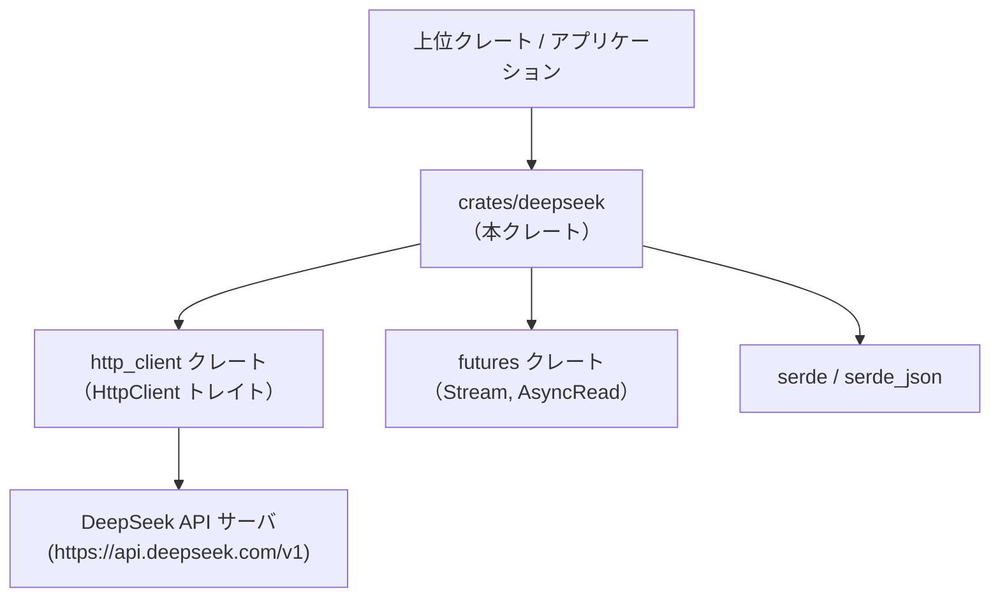
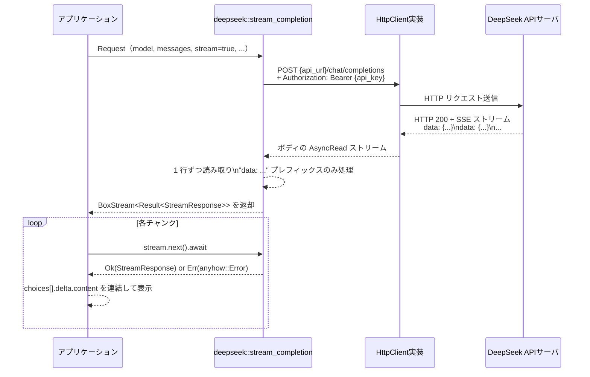

## 1. ざっくり一言

`crates/deepseek` ディレクトリは、DeepSeek の Chat Completions API（`/v1/chat/completions`）向けの **リクエスト／レスポンス型定義と、ストリーミング呼び出し関数** を提供するクレートです。

---

## 2. このモジュールの役割

### 2.1 概要

- DeepSeek Chat / Reasoner などのモデル指定を行う `Model` 型を提供します。
- Chat API の JSON 形式に対応した `Request` / `RequestMessage` / `Response` / `StreamResponse` などの構造体を定義します。
- `HttpClient` トレイトを使って DeepSeek API に POST し、**SSE 形式のストリームを `BoxStream<Result<StreamResponse>>` として受け取る** `stream_completion` 関数を提供します。

### 2.2 アーキテクチャ内での位置づけ

このクレートは「DeepSeek API 用の薄いクライアントレイヤー」として振る舞い、外部 HTTP クライアント実装に依存しつつ、上位レイヤー（アプリケーションや UI）から利用される想定です。



- 上位クレートは `deepseek::Request` などの型を生成し、`deepseek::stream_completion` を呼び出します。
- 実際の HTTP 通信は外部クレート `http_client` の `HttpClient` 実装に委譲されます。
- JSON シリアライズ／デシリアライズは `serde` / `serde_json` によって行われます。
- ストリーム処理は `futures` の `Stream` と `AsyncRead` を利用しています。

### 2.3 設計上のポイント

- **責務の分割**
  - DeepSeek API 固有の JSON 形式に対応する型定義 (`Request`, `Response`, `StreamResponse` など) と、そのストリーミング呼び出し (`stream_completion`) に責務が限定されています。
  - HTTP クライアント実装は `http_client::HttpClient` トレイトに抽象化されており、このクレート自身は具体的な実装を持ちません。
- **状態**
  - すべての型は「データを表すだけの構造体／列挙体」であり、長期的な内部状態を持つオブジェクトはありません。
- **エラーハンドリング**
  - エラー型は `anyhow::Error` を利用し、関数は `anyhow::Result<T>` を返します。
  - HTTP ステータスが失敗の場合はレスポンスボディを読み込んで `bail!` します。
  - ストリーム中の 1 行ごとの JSON パースエラーも `Err(anyhow!(error))` に変換され、ストリームの各要素として上位に伝播します。
- **シリアライズ制御**
  - `serde` の属性（`rename_all`, `tag`, `skip_serializing_if` など）により、DeepSeek API の仕様に合う JSON を出力するよう調整されています。

---

## 3. 主要な機能一覧

- DeepSeek モデル識別子の管理:
  - `Model` 列挙体による Chat / Reasoner / Custom モデルの表現
  - モデル ID 文字列との相互変換（`Model::from_id`, `Model::id`）
- Chat Completions リクエストの組み立て:
  - `Request` / `RequestMessage` によるメッセージ履歴の表現
  - `ResponseFormat`, `ToolDefinition` などのオプション機能（JSON モード、ツール呼び出し）の定義
- 通常レスポンス／ストリーミングレスポンスのデシリアライズ:
  - `Response`, `Usage`, `Choice` など
  - `StreamResponse`, `StreamChoice`, `StreamDelta` など
- DeepSeek API へのストリーミング呼び出し:
  - `stream_completion` 関数により `/chat/completions` に POST し、SSE ライクなレスポンスを `BoxStream<Result<StreamResponse>>` として提供
- 補助情報:
  - 既定の API ベース URL 定数 `DEEPSEEK_API_URL`
  - `Role` 列挙体によるメッセージロールの扱い

---

## 4. 関数・構造体の解説

### 4.1 主要な型一覧

DeepSeek API とのやり取りで直接利用される主な公開型です。

| 名前 | 種別 | 役割 / 用途 |
|------|------|-------------|
| `DEEPSEEK_API_URL` | `&'static str` 定数 | 既定の API ベース URL（`https://api.deepseek.com/v1`） |
| `Role` | 列挙体 | ストリーミングレスポンスの `role`（`user` / `assistant` / `system` / `tool`）を表現 |
| `Model` | 列挙体 | `deepseek-chat` / `deepseek-reasoner` / カスタムモデルを区別 |
| `Request` | 構造体 | `/chat/completions` へのリクエスト全体（モデル名、メッセージ一覧、各種オプション） |
| `RequestMessage` | 列挙体（タグ付き） | `role` ごとのメッセージ（assistant/user/system/tool）と、その内容やツール呼び出し情報 |
| `ResponseFormat` | 列挙体 | `text` / `json_object` 形式での出力指定 |
| `ToolDefinition` | 列挙体（タグ付き） | DeepSeek に渡すツールの仕様（現状は `Function` のみ） |
| `FunctionDefinition` | 構造体 | ツール呼び出し用の関数名、説明、パラメータスキーマ |
| `ToolCall` | 構造体 | モデルから返されるツール呼び出し1件（ID と内容） |
| `ToolCallContent` | 列挙体（タグ付き） | 現状は `Function` のみ（関数名と引数文字列） |
| `FunctionContent` | 構造体 | 実際に呼び出す関数名と JSON 文字列の引数 |
| `Response` | 構造体 | 非ストリーミング時のレスポンス全体（choices, usage など） |
| `Usage` | 構造体 | トークン使用状況（キャッシュヒット／ミス含む） |
| `Choice` | 構造体 | 非ストリーミングレスポンスの 1 チョイス（`RequestMessage` と終了理由） |
| `StreamResponse` | 構造体 | ストリーミング時に 1 行ごとに届くチャンク全体 |
| `StreamChoice` | 構造体 | `StreamResponse` 内の 1 チョイス（`StreamDelta` と終了理由） |
| `StreamDelta` | 構造体 | そのチャンクで追加されたロール／コンテンツ／ツール呼び出し断片など |
| `ToolCallChunk` | 構造体 | ストリーミング中のツール呼び出し情報の断片 |
| `FunctionChunk` | 構造体 | ストリーミング中の関数名・引数文字列の断片 |

これらはすべて `Serialize` / `Deserialize` が実装されており、`serde_json` による JSON 変換に直接利用できます。

---

### 4.2 重要な関数・メソッド詳細

#### `Role::try_from(value: String) -> Result<Role>`

**概要**

- 文字列から `Role` 列挙体（`User` / `Assistant` / `System` / `Tool`）への変換を行います。
- DeepSeek API から受け取った `role` 文字列を安全に扱う際に利用できます。

**引数**

| 引数名 | 型 | 説明 |
|--------|----|------|
| `value` | `String` | `user`, `assistant`, `system`, `tool` のいずれかを期待する文字列 |

**戻り値**

- `Ok(Role)` または `Err(anyhow::Error)` を返します。

**内部処理の流れ**

1. `value.as_str()` を取り出します。
2. `match` で `"user"`, `"assistant"`, `"system"`, `"tool"` の各パターンに応じて対応する `Role` を返します。
3. それ以外の場合は `anyhow::bail!("invalid role '{value}'")` でエラーを返します。

**Examples（使用例）**

```rust
use deepseek::Role;                         // Role 型をインポート
use std::convert::TryFrom;                 // TryFrom トレイトをインポート

fn parse_role(s: &str) -> anyhow::Result<Role> { // 文字列から Role を作る関数
    Role::try_from(s.to_string())          // String から Role へ変換を試みる
}
```

**Errors / Panics**

- `value` が上記 4 種類以外の文字列の場合、`Err(anyhow!("invalid role '...'" ))` を返します。
- `panic` は行いません。

**Edge cases（エッジケース）**

- 大文字混じり（例: `"User"`）はマッチせずエラーになります。
- 前後に空白が入った文字列もそのまま比較されるためエラーになります。

**使用上の注意点**

- API からの素の文字列をそのまま渡す場合は問題ありませんが、ユーザー入力を通す場合は事前に正規化（小文字化・トリム）する必要があります。

---

#### `Model::default_fast() -> Model`

**概要**

- 高速応答向けのデフォルトモデルを返します。
- 現在は `Model::Chat`（`deepseek-chat`）を返します。

**引数**

- なし

**戻り値**

- `Model::Chat`

**内部処理の流れ**

1. 単に `Model::Chat` を返します。

**Examples（使用例）**

```rust
use deepseek::Model;             // Model 列挙体をインポート

let model = Model::default_fast(); // 高速なデフォルトモデル（deepseek-chat）を取得
assert_eq!(model, Model::Chat); // Chat であることを確認
```

**使用上の注意点**

- 「高速」かどうかは API 側の仕様に依存し、この関数は単に Chat モデルを選択しているだけです。

---

#### `Model::from_id(id: &str) -> Result<Model>`

**概要**

- モデル ID 文字列（`"deepseek-chat"` など）から `Model` 列挙体を生成します。
- 設定ファイルや環境変数からモデル ID を受け取る場合に便利です。

**引数**

| 引数名 | 型 | 説明 |
|--------|----|------|
| `id` | `&str` | モデル ID（`"deepseek-chat"` / `"deepseek-reasoner"` を想定） |

**戻り値**

- 対応する `Model` を含む `Ok(Model)`、または `Err(anyhow::Error)`。

**内部処理の流れ**

1. `match id` で `"deepseek-chat"` なら `Model::Chat`、`"deepseek-reasoner"` なら `Model::Reasoner` を返します。
2. それ以外の文字列の場合は `anyhow::bail!("invalid model id {id}")` を返します。

**Examples（使用例）**

```rust
use deepseek::Model;                  // Model 型をインポート
use anyhow::Result;                   // Result エイリアスをインポート

fn choose_model(id: &str) -> Result<Model> { // 文字列 ID から Model を選ぶ関数
    Model::from_id(id)                // from_id で変換を行う
}
```

**Errors / Panics**

- 未対応の ID の場合に `Err(anyhow!("invalid model id ..."))` を返します。
- `panic` は行いません。

**Edge cases**

- `""`（空文字列）は未対応 ID としてエラーになります。
- カスタムモデル（`Model::Custom`）は ID からの復元には対応していません。

**使用上の注意点**

- 現状は 2 種類の公式モデルのみをサポートしており、今後モデルが増えた場合にはこの関数を拡張する必要があります。

---

#### `Model::id(&self) -> &str`

**概要**

- `Model` を DeepSeek API に渡す際のモデル ID 文字列に変換します。

**引数**

| 引数名 | 型 | 説明 |
|--------|----|------|
| `&self` | `&Model` | 対象モデル |

**戻り値**

- `&str`：`"deepseek-chat"`, `"deepseek-reasoner"`、または `Custom` の `name` フィールド。

**内部処理の流れ**

1. `match self` で `Chat` → `"deepseek-chat"`、`Reasoner` → `"deepseek-reasoner"` を返します。
2. `Custom { name, .. }` の場合は `name` フィールドをそのまま返します。

**Examples（使用例）**

```rust
use deepseek::Model;                    // Model 型をインポート

let model = Model::Chat;                // Chat モデルを選択
let model_id = model.id();              // API に渡す ID を取得
assert_eq!(model_id, "deepseek-chat");  // deepseek-chat であることを確認
```

**使用上の注意点**

- `Model::Custom` を利用する場合は、`name` を DeepSeek 側で有効なモデル ID に揃える必要があります。

---

#### `Model::max_token_count(&self) -> u64`

**概要**

- モデルごとのトークンコンテキスト長（最大トークン数）を返します。

**引数**

| 引数名 | 型 | 説明 |
|--------|----|------|
| `&self` | `&Model` | 対象モデル |

**戻り値**

- `u64`：Chat / Reasoner では `128_000`、Custom では `max_tokens` フィールドの値。

**内部処理の流れ**

1. `Chat` および `Reasoner` の場合は固定値 `128_000` を返します。
2. `Custom { max_tokens, .. }` の場合は `max_tokens` の値を返します。

**使用上の注意点**

- DeepSeek 側の実際の仕様変更があった場合は、この値を更新する必要があります。

---

#### `Model::max_output_tokens(&self) -> Option<u64>`

**概要**

- モデルごとの「出力トークンの上限」を返します。

**引数**

| 引数名 | 型 | 説明 |
|--------|----|------|
| `&self` | `&Model` | 対象モデル |

**戻り値**

- `Option<u64>`：`Chat` / `Reasoner` では `None`、`Custom` では `max_output_tokens` フィールド。

**内部処理の流れ**

1. `Chat` / `Reasoner` の場合は `None` を返します（コメントに記載の通り、API の `max_tokens` 振る舞いとの兼ね合いで設定しない方針）。
2. `Custom` の場合は `max_output_tokens` をそのまま返します。

**使用上の注意点**

- `None` の場合は「API にパラメータを渡さない」ことを意味し、DeepSeek 側のデフォルト挙動に任せることになります。
- `Custom` モデルに対してのみ明示的に上限を設定したい場合に利用できます。

---

#### `stream_completion(client: &dyn HttpClient, api_url: &str, api_key: &str, request: Request) -> Result<BoxStream<'static, Result<StreamResponse>>>`

**概要**

- DeepSeek の `/chat/completions` エンドポイントに POST し、**ストリーミングレスポンスを 1 行ごとに `StreamResponse` として流す非同期ストリーム** を返します。
- Server-Sent Events（SSE）形式のレスポンスを前提に、「`data: ...`」行だけを取り出して JSON としてパースします。

**引数**

| 引数名 | 型 | 説明 |
|--------|----|------|
| `client` | `&dyn HttpClient` | 外部クレート `http_client` が提供する HTTP クライアント実装 |
| `api_url` | `&str` | API のベース URL（通常は `DEEPSEEK_API_URL`） |
| `api_key` | `&str` | DeepSeek API キー（`Bearer` トークンとして送信） |
| `request` | `Request` | モデル・メッセージなどを含むリクエスト本体（`stream` フラグなども含む） |

**戻り値**

- `Ok(BoxStream<'static, Result<StreamResponse>>)`：  
  非同期に `StreamResponse` または `anyhow::Error` を流すストリーム。
- `Err(anyhow::Error)`：  
  HTTP リクエストの送信失敗、ステータスコードエラー、レスポンスの読み取りエラーなど。

**内部処理の流れ（アルゴリズム）**

1. `uri = format!("{api_url}/chat/completions")` でエンドポイント URL を組み立てます。
2. `HttpRequest::builder()` で POST リクエストを構築し、以下のヘッダを設定します。
   - `Content-Type: application/json`
   - `Authorization: Bearer {api_key.trim()}`
3. `serde_json::to_string(&request)` でリクエストを JSON 文字列にシリアライズし、`AsyncBody::from(...)` としてボディに設定します。
4. `client.send(request).await?` で HTTP リクエストを送信し、レスポンスを取得します。
5. `response.status().is_success()` を確認し、成功であれば:
   - `BufReader::new(response.into_body())` でボディを非同期読み取り可能なバッファリーダに包みます。
   - `.lines()` で 1 行ずつ `Result<String>` として読み出します。
   - `.filter_map(...)` で次の処理を行います:
     - 行読み取り `Err(error)` の場合は `Some(Err(anyhow!(error)))` を返し、その行でエラーを流します。
     - `Ok(line)` の場合:
       - `line.strip_prefix("data: ")` で `data:` プレフィックスを持つ行だけを対象にし、それ以外の行は無視します（`None` を返す）。
       - 内容が `"[DONE]"` の場合はストリーム終了を意味し、その行は破棄（`None`）します。
       - それ以外の行は `serde_json::from_str::<StreamResponse>(line)` を試み、成功すれば `Some(Ok(response))`、失敗すれば `Some(Err(anyhow!(error)))` を返します。
   - `.boxed()` で `BoxStream` に変換して返します。
6. HTTP ステータスが失敗（`!is_success()`）の場合:
   - `response.body_mut().read_to_string(&mut body).await?` で全文を読み取り、
   - `anyhow::bail!("Failed to connect to DeepSeek API: {} {}", response.status(), body)` でエラーを返します。

**Examples（使用例）**

DeepSeek からストリーミングで応答を受け取る基本例です（HTTP クライアント実装部分はダミーとしています）。

```rust
use deepseek::{
    DEEPSEEK_API_URL,             // 既定の API ベース URL をインポート
    Model,                        // モデル指定用の列挙体をインポート
    Request,                      // リクエスト全体を表す構造体をインポート
    RequestMessage,               // メッセージ用の列挙体をインポート
    stream_completion,            // ストリーミング関数をインポート
};
use http_client::HttpClient;      // HttpClient トレイトをインポート
use futures::StreamExt;           // StreamExt トレイト（next() など）をインポート

async fn chat_example(client: &dyn HttpClient, api_key: &str) -> anyhow::Result<()> {
    // 使用するモデルを決定する
    let model = Model::default_fast();                 // デフォルトの Chat モデルを取得
    let model_id = model.id().to_string();             // API 用のモデル ID 文字列に変換

    // メッセージ履歴を組み立てる
    let messages = vec![
        RequestMessage::System {
            content: "You are a helpful assistant.".to_string(), // システムプロンプト
        },
        RequestMessage::User {
            content: "こんにちは、自己紹介してください。".to_string(), // ユーザーメッセージ
        },
    ];

    // リクエストを構築する（stream=true にする）
    let request = Request {
        model: model_id,               // モデル ID
        messages,                      // メッセージ一覧
        stream: true,                  // ストリーミングを有効化
        max_tokens: None,              // 出力トークン上限は API デフォルトに任せる
        temperature: Some(0.7),        // 温度パラメータ（任意）
        response_format: None,         // 通常の text 応答
        tools: Vec::new(),             // ツール呼び出しなし
    };

    // ストリームを開始する
    let mut stream = stream_completion(
        client,                        // HTTP クライアント実装
        DEEPSEEK_API_URL,             // ベース URL
        api_key,                      // API キー
        request,                      // 構築したリクエスト
    ).await?;                         // ストリームの確立を待機

    // チャンクごとに到着するレスポンスを処理する
    while let Some(chunk_result) = stream.next().await {
        // 各チャンクに対してエラーを確認する
        let chunk = chunk_result?;    // エラーならここで ? により関数全体が Err になる
        for choice in chunk.choices {
            // delta.content が Some なら、その部分文字列を取り出す
            if let Some(content) = &choice.delta.content {
                print!("{content}");  // 逐次的に標準出力へ表示
            }
        }
    }

    Ok(())                           // すべてのチャンク処理が終わったら Ok を返す
}
```

**Errors / Panics**

- ネットワークエラー、タイムアウトなどで `client.send().await` が失敗した場合、`Err(anyhow!(…))` を返します。
- HTTP ステータスが 2xx 以外の場合、レスポンスボディを含むエラーメッセージで `Err` を返します。
- レスポンスボディ読み取りや JSON パース時のエラーも `Err(anyhow!(…))` としてストリーム経由で（あるいは関数の戻り値として）伝播します。
- 関数内で `panic` を発生させるコードはありません。

**Edge cases（エッジケース）**

- **`request.stream` が `false` の場合**  
  関数側で `stream` フラグをチェックしていません。API 側が非ストリーミングレスポンスを返した場合、この関数は「SSE ライクな 1 行ごとの `data:` フォーマット」を前提にしているため、期待通りに動作しない可能性があります。
- **レスポンスに `data:` 以外の行が含まれる場合**  
  `strip_prefix("data: ")` が `None` を返し、その行は silently に無視されます。
- **`[DONE]` の扱い**  
  行の内容が正確に `"[DONE]"` のとき、その行は破棄され、以降の行が存在しなければストリームが自然に終端します。
- **JSON 形式が仕様と異なる場合**  
  `serde_json::from_str::<StreamResponse>(...)` が失敗し、その行に対応する `Err(anyhow!(error))` をストリームに流します。

**使用上の注意点**

- 実際にストリーミングレスポンスを受け取るには、`Request` で `stream: true` を明示的に指定することが推奨されます。
- `api_key` の前後に空白が含まれても `trim()` で取り除かれますが、無効なキーであれば当然 API 側で拒否されます。
- ストリーム中に一度でも `Err` が出た場合、その後の処理フローをどうするか（ストリームを打ち切るか、ログだけして続行するか）は呼び出し側の設計に依存します。

---

### 4.3 その他の関数・メソッド

補助的なメソッドや単純な取得用メソッドです。

| 関数 / メソッド名 | 役割（1 行） |
|-------------------|--------------|
| `Model::display_name(&self) -> &str` | UI 向けの「表示名」を返す（`Custom` では `display_name` があればそれを使用） |
| `Model::clone`, `Model::default` など派生メソッド | `derive` による自動実装であり、通常の構造体と同様に利用可能 |

---

## 5. データフロー

ここでは、`stream_completion` を用いた代表的なフロー（ユーザーの入力からストリーミング応答を受け取るまで）を示します。

1. 上位アプリケーションが `Vec<RequestMessage>` と `Request` を組み立てます。
2. `stream_completion` を呼び出し、DeepSeek API への HTTP POST を実行します。
3. DeepSeek API は SSE 形式で `data: {...}` の行を複数返します。
4. 各行は JSON として `StreamResponse` にデシリアライズされ、ストリームとして上位に流れます。
5. 上位アプリケーションは `StreamResponse` の `choices[*].delta.content` を連結して最終的な応答テキストを構成します。



- この図では `App` が `StreamResponse` のチャンクを 1 つずつ読み出し、UI に逐次反映するイメージです。
- エラーが発生した場合は、該当チャンクで `Err` が返り、その時点でループ終了／継続の判断を行うことになります。

---

## 6. 使い方（How to Use）

### 6.1 基本的な使用方法

ここでは、最小限の構成で DeepSeek Chat にストリーミング問い合わせを行う一連の流れを示します。

```rust
use deepseek::{
    DEEPSEEK_API_URL,             // DeepSeek API のベース URL
    Model,                        // モデル指定用の列挙体
    Request,                      // リクエスト全体を表す構造体
    RequestMessage,               // メッセージを表す列挙体
    stream_completion,            // ストリーミング呼び出し関数
};
use http_client::HttpClient;      // HTTP 通信用トレイト
use futures::StreamExt;           // ストリーム操作用トレイト
use anyhow::Result;               // anyhow::Result のエイリアス

async fn basic_usage(client: &dyn HttpClient, api_key: &str) -> Result<()> {
    // 1. モデルを決定する
    let model = Model::default_fast();       // デフォルトの Chat モデルを選択
    let model_id = model.id().to_string();   // API に渡す ID 文字列に変換

    // 2. メッセージ履歴を作成する
    let messages = vec![
        RequestMessage::System {
            content: "You are a Japanese assistant.".to_string(), // システムメッセージ
        },
        RequestMessage::User {
            content: "Rust について簡単に教えてください。".to_string(), // ユーザーメッセージ
        },
    ];

    // 3. Request 構造体を組み立てる
    let request = Request {
        model: model_id,          // 使用するモデル ID
        messages,                 // メッセージ一覧
        stream: true,             // ストリーミングを有効化
        max_tokens: None,         // 出力トークン上限は API デフォルト
        temperature: Some(0.7),   // 生成の多様性を調整
        response_format: None,    // テキスト形式で応答
        tools: Vec::new(),        // ツール呼び出し機能は使わない
    };

    // 4. DeepSeek にストリーミングリクエストを送る
    let mut stream = stream_completion(
        client,                   // HttpClient トレイトを実装したクライアント
        DEEPSEEK_API_URL,         // ベース URL（既定値）
        api_key,                  // API キー
        request,                  // 構築したリクエスト
    ).await?;                     // ストリーム確立を待機

    // 5. ストリームを消費し、コンテンツを表示する
    while let Some(chunk_result) = stream.next().await {
        let chunk = chunk_result?;              // チャンク単位のエラーを確認
        for choice in chunk.choices {
            if let Some(content) = &choice.delta.content {
                print!("{content}");           // 断片的なテキストを逐次表示
            }
        }
    }

    Ok(())                         // 処理が完了したら Ok を返す
}
```

- 実際には `client` には `http_client` クレートが提供する具体的な実装を渡す必要があります（このディレクトリ内には定義がありません）。

### 6.2 よくある使用パターン

#### パターン 1: JSON 形式での応答（`response_format = JsonObject`）

DeepSeek の JSON モードを利用する場合の設定です。

```rust
use deepseek::{Request, RequestMessage, ResponseFormat, Model}; // 必要な型をインポート

fn build_json_mode_request() -> Request {
    let model = Model::Chat;                          // Chat モデルを選択
    let model_id = model.id().to_string();            // モデル ID を取得

    let messages = vec![
        RequestMessage::User {
            content: "次の JSON スキーマに従って出力してください...".to_string(), // JSON 形式の出力を指示
        },
    ];

    Request {
        model: model_id,                              // モデル ID
        messages,                                     // メッセージ一覧
        stream: true,                                 // JSON モードでもストリーミング可能
        max_tokens: None,                             // 出力トークン制限は API デフォルト
        temperature: Some(0.0),                       // 決定的な出力を期待して温度を下げる
        response_format: Some(ResponseFormat::JsonObject), // JSON オブジェクト形式を指定
        tools: Vec::new(),                            // ツール呼び出し機能は使わない
    }
}
```

- 応答テキストは JSON 文字列として `delta.content` に現れるため、呼び出し側で `serde_json::from_str` などでパースする想定となります。

#### パターン 2: ツール呼び出し（Function Calling）の有効化

ツール定義を DeepSeek に渡し、モデルからツール呼び出しを受け取るための設定例です。

```rust
use deepseek::{
    Request, RequestMessage, ToolDefinition, FunctionDefinition, Model
}; // ツール関連の型をインポート
use serde_json::json;            // JSON スキーマを組み立てるために利用

fn build_tool_calling_request() -> Request {
    // ツールとして公開する関数の定義
    let tool_def = ToolDefinition::Function {
        function: FunctionDefinition {
            name: "get_weather".to_string(),             // ツール名
            description: Some("現在の気象情報を取得する".to_string()), // 説明
            parameters: Some(json!({                      // パラメータの JSON スキーマ（例）
                "type": "object",
                "properties": {
                    "city": { "type": "string" }
                },
                "required": ["city"]
            })),                                          // serde_json::Value で保持
        },
    };

    let model = Model::Chat;                             // モデル選択
    let model_id = model.id().to_string();               // モデル ID を文字列に

    let messages = vec![
        RequestMessage::User {
            content: "東京の天気を教えてください。必要なら get_weather ツールを使ってください。".to_string(),
        },
    ];

    Request {
        model: model_id,                                 // モデル ID
        messages,                                        // メッセージ一覧
        stream: true,                                    // ストリーミングも可能
        max_tokens: None,                                // 出力トークン上限はデフォルト
        temperature: Some(0.2),                          // 少し低めの温度
        response_format: None,                           // 通常テキスト出力
        tools: vec![tool_def],                           // ツール定義を渡す
    }
}
```

- モデルからのツール呼び出しは `RequestMessage::Assistant` の `tool_calls: Vec<ToolCall>` や、ストリーミング時は `StreamDelta.tool_calls` を通して返されます。
- これらの型を用いれば、ツール ID / 関数名 / 引数 JSON 文字列を取得し、実際の関数呼び出しに接続できます。

### 6.3 使用上の注意点（まとめ）

- **HTTP クライアントの実装**
  - `stream_completion` は `&dyn HttpClient` を受け取るだけで、具体的な実装は本ディレクトリに含まれていません。
  - 実運用では `http_client` クレートが提供する適切な実装（例えば async-std や tokio ベースのもの）を選択する必要があります。
- **`stream` フラグ**
  - 関数名は `stream_completion` ですが、`Request.stream` の値はチェックしていません。
  - ストリーミングを期待する場合は、必ず `stream: true` を設定することが前提です。
- **SSE 形式への依存**
  - レスポンス形式として `data: ...` 行が前提になっており、仕様変更や中継プロキシによる変換が入ると正しく動作しない可能性があります。
- **JSON パースエラーの扱い**
  - チャンクごとの JSON パースに失敗すると、その行に対して `Err(anyhow!(error))` がストリームに流れます。
  - 一度のエラーで全体を中止するか、ログを出して続けるかなどは、呼び出し側で統一的な方針を決める必要があります。
- **トークン上限**
  - `Model::max_token_count` / `max_output_tokens` はコード内に定数・フィールドとして埋め込まれており、DeepSeek 側の仕様変更があった場合には更新が必要です。
- **API キーの管理**
  - `api_key` はそのまま `Authorization: Bearer` ヘッダに設定されます。漏洩防止のため、環境変数やシークレット管理サービスなどで安全に管理することが前提です。

---

## 7. 関連ファイル

このディレクトリに含まれるファイルと、その役割です。

| パス | 役割 / 関係 |
|------|------------|
| `deepseek/Cargo.toml` | `deepseek` ライブラリクレートのメタデータと依存関係。`anyhow`, `futures`, `http_client`, `serde`, `serde_json` などへの依存を定義し、`lib` のエントリポイントを `src/deepseek.rs` に指定しています。`schemars` フィーチャで `Model` に `JsonSchema` を付与可能。 |
| `deepseek/src/deepseek.rs` | 本レポートで解説した、DeepSeek Chat API 向けの型定義と `stream_completion` 関数を提供するクレート本体。 |

外部依存クレート（`http_client`, `anyhow`, `futures`, `serde`, `serde_json`, `schemars`）はすべて Workspace の `Cargo.toml` 側でバージョンが管理されているため、バージョン更新や依存解消は Workspace 側の設定を確認する必要があります。
